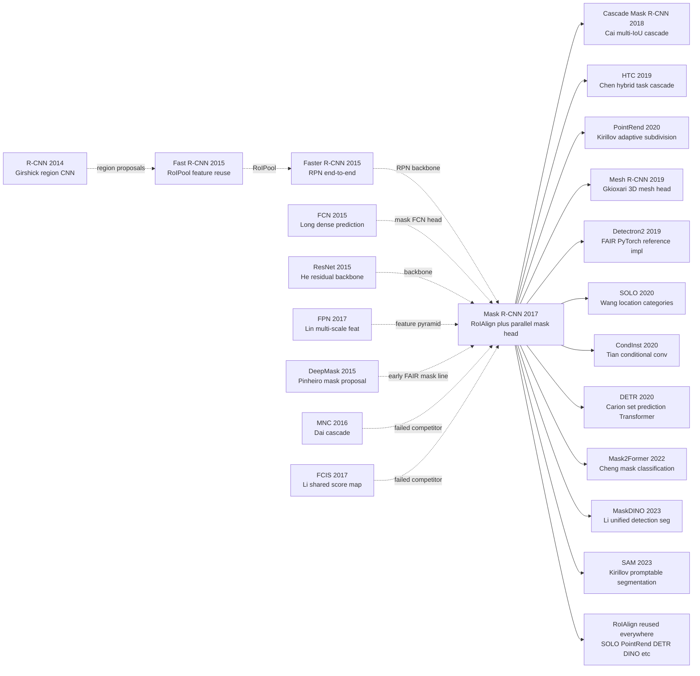

# Mask R-CNN — Unifying Instance Segmentation by Adding One Branch to Faster R-CNN

> **March 20, 2017. Kaiming He, Gkioxari, Dollar, and Girshick at FAIR upload [arXiv 1703.06870](https://arxiv.org/abs/1703.06870), and win Best Paper Award at ICCV 2017 (He's second Best Paper after [ResNet (2015)](../era2_deep_renaissance/2015_resnet.md)).**
> A paper that took "instance segmentation" — once requiring elaborate SDS / FCIS / DeepMask pipelines — and reduced it to a **disarmingly simple recipe**: bolt a parallel mask branch onto [Faster R-CNN (2015)](https://arxiv.org/abs/1506.01497), swap RoIPool for **RoIAlign** to fix sub-pixel misalignment, train end-to-end.
> COCO instance segmentation jumped 25.1 → 35.7 AP, and the same model handles keypoint detection, human pose estimation, and cell segmentation — essentially every instance-level vision task.
> Within 5 years it became **the default baseline for every industrial-grade instance segmentation system** (Detectron / Detectron2 / MMDetection all ship it as their first-class citizen), and remained the gold standard until [SAM (2023)](../era5_genai_explosion/2023_sam.md) arrived.

## TL;DR

Mask R-CNN takes Faster R-CNN's two-stage detection skeleton almost untouched, **adds a single pixel-level FCN mask branch in parallel with the existing classification and box-regression heads**, and fixes one seemingly minor bug — replacing RoIPool's twice-quantized pooling with bilinear-interpolation **RoIAlign** — to push COCO instance segmentation from 24.4 AP all the way to 35.7 AP, while extending the same architecture to human keypoint detection with no structural changes. A textbook "less-is-more" engineering paper, ICCV 2017 Best Paper.

---

## Historical Context

### What was the visual-understanding community stuck on in 2017?

To place Mask R-CNN you have to return to the 2016–2017 window in which "detection was flying, segmentation was slowing, and instance segmentation was almost a brand-new term."

The honest state of CV in those two years was:

> **Object detection had Faster R-CNN (73 mAP on PASCAL VOC, industrial-grade) and SSD/YOLO (real-time but slightly less accurate); semantic segmentation had FCN (the first end-to-end dense prediction), DeepLab, PSPNet; but instance segmentation — "a separate mask per object" — had nearly no decent solution. The COCO SOTA, MNC, was at 24.6 AP.**

Concrete pain points:

- **DeepMask / SharpMask** (Pinheiro 2015/2016 [ref1, ref2]): FAIR's own "object proposal as mask" line — generate mask candidates, then classify them. The pipeline had four stages (mask proposal → refine → classify → NMS), training and inference were heavy, and COCO mask AP topped out around 25.
- **MNC (Multi-task Network Cascade)** [Dai et al., CVPR 2016, ref3]: Cascaded "box regression → mask prediction → mask classification" in three stages, re-extracting RoI features each stage; engineering was complex, COCO mask AP 24.6.
- **InstanceFCN** [Dai 2016, ref4]: Used position-sensitive score maps to make FCN instance-aware, but required a pre-specified mask cell grid, hurting flexibility.
- **FCIS (Fully Convolutional Instance Segmentation)** [Li et al., CVPR 2017, ref5]: The MNC-line evolution at 29.5 mask AP — the strongest baseline at Mask R-CNN's submission time, but **all classes shared a single mask score map**, so classes interfered with each other badly.

The communal consensus was: **instance segmentation = a coupled detection + segmentation problem**. How to couple? Detection-then-segmentation? Segmentation-first-then-cluster? End-to-end multi-task? No agreement; every paper picked a different pipeline. **Nobody anticipated that the answer would be "leave Faster R-CNN alone and just bolt on a 28×28 mask head."**

The other parallel sticking point was **RoIPool's quantization noise**. RoIPool (Girshick 2015) had to twice-round floating-point RoI coordinates so that fully-connected layers could receive a fixed 7×7 feature: once to round RoI boundaries to feature-map coordinates, then again to round bin boundaries inside. Tolerable for box regression (a few scalars), **catastrophic for masks**: with a 32×-stride backbone, a 1-pixel RoI shift translates into a 32-pixel mask misalignment in the original image. The community knew this was a problem but no one had systematically fixed it.

### The immediate predecessors that pushed Mask R-CNN out

- **Faster R-CNN** [Ren, He, Girshick, Sun, NeurIPS 2015, ref6]: The standard answer for two-stage detection — RPN proposals, RoIPool features, parallel cls + bbox heads. Mask R-CNN copies 99% of the skeleton untouched, modifies one component (RoIPool→RoIAlign), and adds one component (mask branch).
- **FCN (Fully Convolutional Networks)** [Long, Shelhamer, Darrell, CVPR 2015, ref7]: Replaced the final FCs of a classification CNN with 1×1 convs to make the network output a spatial map. Mask R-CNN's mask head is a mini-FCN (four 3×3 convs → deconv upsample → 1×1 conv producing K sigmoid channels).
- **FPN (Feature Pyramid Network)** [Lin, Dollár, Girshick et al., CVPR 2017, ref8]: Made the backbone output multi-scale features, sending small objects to high-resolution P2 and large objects to P5. FPN appeared four months before Mask R-CNN (same FAIR team); Mask R-CNN plugged FPN in and gained +3 AP for free.
- **ResNet** [He, Zhang, Ren, Sun, CVPR 2016, ref9]: Residual backbone. ResNet-50/101 are Mask R-CNN's default backbones. **Kaiming He is first author on both ResNet and Mask R-CNN — the entire stack came out of one team.**
- **DeepMask + SharpMask** [Pinheiro 2015, 2016]: FAIR's earlier instance-seg explorations, which proved "use a CNN to output masks directly" is feasible but the pipeline is heavy. Mask R-CNN partly amounts to "throw out the in-house line and start over."

### What was the author team doing?

Kaiming He moved from MSRA to Facebook AI Research (FAIR) in 2016, joining Ross Girshick (the author of R-CNN / Fast R-CNN / Faster R-CNN) and Piotr Dollár's perception group. **This is one of the most stacked rosters in detection history**: Girshick invented the R-CNN line; Dollár was a COCO dataset coordinator and detection-evaluation expert; He was the first author of ResNet; Georgia Gkioxari was an active action-recognition / pose researcher (later leading Mesh R-CNN).

The team's main thrust was **making the R-CNN line faster, more accurate, and applicable to more tasks**. R-FCN (Girshick 2016, position-sensitive RoI), FPN (Lin 2017), then Mask R-CNN — a continuous "R-CNN engineering evolution" where every paper changed one or two components. **In the team's own eyes, Mask R-CNN was not a "major architectural innovation" but "the R-CNN line finally fills in the instance-segmentation gap."** The writing reflects that restraint: the Method section is short, and most pages are spent on ablations and transfer experiments.

### State of the industry, compute, and data

- **GPUs**: NVIDIA Titan X / Tesla M40 12GB (the paper trained on 8 GPUs, 2 images per GPU, total batch 16); a single COCO run took ~32h.
- **Data**: COCO 2014/2015/2016 (80 classes, 118k train, 5k val, 20k test-dev) was the main battleground. Cityscapes (19 classes, urban scenes) was used for transfer; MPII / COCO keypoints for pose extension.
- **Frameworks**: The authors used Caffe2 (FAIR's in-house framework). Open-source code shipped first via Detectron (Caffe2-based, 2018) and later Detectron2 (PyTorch, 2019). **In 2017 PyTorch 1.0 had not yet been released and TensorFlow 1.x was the industry default, but FAIR went the Caffe2 route** — which slowed early reproductions.
- **Industry climate**: 2017 was peak self-driving funding (Cruise sold to GM, Argo AI was founded, Waymo started Pacifica road tests). **Instance-level perception ("is that one car or several stacked cars?") became a hard requirement.** Medical imaging, satellite remote sensing, and AR all needed per-instance masks. Mask R-CNN arrived exactly on time — within 5 years it became the de-facto backbone for almost any industrial pipeline that needed instance masks.

---

## Method Deep Dive

### Overall framework

Mask R-CNN's pipeline is a minimal extension of Faster R-CNN: the full backbone (ResNet+FPN) extracts multi-scale features → RPN produces proposals → on each RoI, **three heads (cls / bbox / mask) run in parallel**. **There is no segmentation-first path, no mask-refine pass, no cascade.**

```
Input image (e.g. 800×800)
   ↓
ResNet-50/101 backbone
   ↓
FPN (P2-P5, multi-scale features)
   ↓
RPN → ~1000 RoI proposals
   ↓
RoIAlign (per-RoI feature, 7×7 for cls/bbox, 14×14 for mask)
   ↓                              ↓
   ↓                              ↓
[Box head]                    [Mask head, FCN]
2×FC → cls logits             4×Conv 3×3 (256ch)
2×FC → bbox deltas             ↓
                              ConvTranspose 2×2 (deconv ↑2)
                               ↓
                              1×1 conv → K×28×28 sigmoid masks
                               ↓
                              select channel = predicted class k
```

Different experimental configs only swap backbone and head:

| Config | Backbone | head | Input | COCO box AP | COCO mask AP |
|--------|----------|------|-------|-------------|--------------|
| ResNet-50-C4    | ResNet-50  | conv5 RoI head    | 800   | 30.3 | 33.1 |
| ResNet-50-FPN   | ResNet-50+FPN | 2-FC + FCN     | 800   | 33.6 | 34.7 |
| ResNet-101-C4   | ResNet-101 | conv5 RoI head    | 800   | 32.9 | 35.4 |
| ResNet-101-FPN  | ResNet-101+FPN | 2-FC + FCN    | 800   | **35.7** | **35.7** |
| ResNeXt-101-FPN | ResNeXt-101+FPN | 2-FC + FCN  | 800   | 39.8 | 37.1 |

**Counter-intuitive #1**: the mask head outputs at only 28×28 resolution (vs 800+ input), which sounds tiny — but a 28×28 inside a single RoI captures the main shape of the instance, and pasting back into the original image is visually sufficient. **Compared with dense per-pixel decoders (DeepLab's atrous + bilinear), per-RoI 28×28 mask reduces "whole-image segmentation" to "per-instance small-image segmentation"** — an order of magnitude less compute.

**Counter-intuitive #2**: the mask branch outputs **K channels** (K=80 for COCO), one binary mask per class, **but loss is computed only on the channel of the RoI's ground-truth class**. Looks like 79/80 of capacity is wasted, but it is the core decoupling design — **each channel learns "if this is class X, what shape does the mask take?"; classes do not have to compete.**

### Key designs

#### Design 1: RoIAlign — fix RoIPool's twice-quantized noise

**Function**: extract a fixed-size RoI feature (7×7 or 14×14) from a floating-point RoI box and a backbone feature map, **without any quantization** and fully differentiably, so that RoI features align with original-image coordinates exactly.

**The core problem (RoIPool's two roundings)**:

- **RoIPool step 1**: divide RoI coords $(x_1, y_1, x_2, y_2)$ by stride (16 or 32) to get feature-map coords, then **round** to integer pixels.
- **RoIPool step 2**: split the RoI uniformly into $7 \times 7$ bins; **round** each bin boundary to integers again.

The two roundings can accumulate to 32-pixel error in the original image at stride=32 — catastrophic for masks.

**RoIAlign's fix**: **never round**, sample with bilinear interpolation. Steps:

1. Divide RoI coords by stride (keep float)
2. Split RoI uniformly into $7 \times 7$ bins (keep float boundaries)
3. Inside each bin take 4 evenly spaced sample points (paper recommends 4; 1 sample at bin center also works)
4. Each sample's value is computed via **bilinear interpolation** from the 4 nearest integer-pixel features
5. Take max (or avg, negligible difference) over the 4 samples per bin

**Bilinear interpolation formula** (at position $(x, y)$ with neighbors $(x_l, y_l), (x_h, y_l), (x_l, y_h), (x_h, y_h)$):

$$
f(x, y) = \sum_{i \in \{l, h\}} \sum_{j \in \{l, h\}} f(x_i, y_j) \cdot w_{ij}(x, y), \quad w_{ij} = (1 - |x - x_i|)(1 - |y - y_j|)
$$

**RoIAlign pseudocode** (PyTorch-style):

```python
def roi_align(features, roi, output_size=7, sampling_ratio=4):
    """
    features: [C, H, W] backbone feature map
    roi: (x1, y1, x2, y2) in original image coords
    output_size: 7 for cls/bbox head, 14 for mask head
    sampling_ratio: # of sample points per bin per dim (4 → 16/bin)
    """
    stride = 16  # backbone stride, e.g. ResNet C4
    # 1) Map RoI to feature coords WITHOUT rounding
    x1, y1, x2, y2 = [v / stride for v in roi]
    bin_w = (x2 - x1) / output_size
    bin_h = (y2 - y1) / output_size

    out = torch.zeros(features.shape[0], output_size, output_size)
    for i in range(output_size):
        for j in range(output_size):
            # 2) For each bin, take sampling_ratio² sample points
            samples = []
            for si in range(sampling_ratio):
                for sj in range(sampling_ratio):
                    # 3) Sample location (still floating point)
                    sx = x1 + (j + (sj + 0.5) / sampling_ratio) * bin_w
                    sy = y1 + (i + (si + 0.5) / sampling_ratio) * bin_h
                    # 4) Bilinear interpolation — fully differentiable
                    samples.append(bilinear_interp(features, sx, sy))
            out[:, i, j] = torch.stack(samples).max(dim=0).values
    return out
```

**RoIPool vs RoIAlign vs RoIWarp**:

| Method | Step-1 quant. | Step-2 quant. | Interp. | mask AP (C4) | mask AP (FPN) |
|--------|---------------|---------------|---------|---------------|----------------|
| RoIPool (Girshick 2015)         | ✓ round  | ✓ round  | nearest  | 23.6 | 26.9 |
| RoIWarp (Dai 2016)              | ✓ round  | ✗        | bilinear | 24.4 | 27.8 |
| **RoIAlign (this paper)**       | ✗        | ✗        | bilinear | **30.9** | **34.0** |

RoIAlign alone contributes **+10% mask AP** — far more than any other change in the paper. **This is the most easily underrated core contribution of Mask R-CNN**: every dense-prediction task benefits from "feature-coordinate alignment," and PointRend, SOLO, DETR all inherit RoIAlign or its equivalent (grid_sample).

**Design motivation — why does RoIAlign matter so much?**

A mask head outputs **per-pixel class** predictions; every output pixel must correspond strictly to a position in the original image. RoIPool injects ~16-pixel average error at stride=32, meaning **roughly half of a 28×28 mask is at the wrong location** — the loss can never train down. RoIAlign brings the error to ~0.5 px (sub-pixel), at which point the mask head can finally learn fine-grained shape. **A classic "you cannot optimize away systematic error" engineering lesson.**

#### Design 2: Decoupled K-channel mask + cls-conditioned selection — kill class coupling

**Function**: the mask head outputs a $K \times m \times m$ tensor ($K$ = number of classes, $m=28$ default); **each channel is an independent binary mask** (sigmoid, no competition), training back-props only on the ground-truth class $k^*$ channel, inference selects the channel of the predicted class $\hat k$.

**Forward + loss formula**:

Let the RoI feature pass through the mask FCN and produce $M \in \mathbb{R}^{K \times m \times m}$; $\sigma(M)_{k, i, j} \in [0, 1]$ is "probability that pixel (i, j) is foreground for class $k$." Ground-truth class is $k^*$, ground-truth mask is $G \in \{0, 1\}^{m \times m}$ (resized).

$$
\mathcal{L}_{mask} = -\frac{1}{m^2} \sum_{i, j} \Big[ G_{ij} \log \sigma(M_{k^*, i, j}) + (1 - G_{ij}) \log (1 - \sigma(M_{k^*, i, j})) \Big]
$$

**Crucial**: the sum runs **only on $k = k^*$**; the other 79 channels contribute no loss and receive no gradient.

**Total loss**:

$$
\mathcal{L} = \mathcal{L}_{cls} + \mathcal{L}_{box} + \mathcal{L}_{mask}
$$

The three terms are independent and need no hyperparameter weighting (the paper observes they are roughly the same magnitude).

**Pseudocode** (mask head + loss):

```python
class MaskHead(nn.Module):
    """FCN: 4×Conv → Deconv → 1×1 Conv → K×28×28."""
    def __init__(self, num_classes=80, in_ch=256, hidden=256):
        super().__init__()
        self.convs = nn.Sequential(*[
            nn.Conv2d(in_ch if i == 0 else hidden, hidden, 3, padding=1)
            for i in range(4)
        ])
        self.deconv = nn.ConvTranspose2d(hidden, hidden, 2, stride=2)  # 14→28
        self.predictor = nn.Conv2d(hidden, num_classes, 1)             # K channels

    def forward(self, roi_feat):       # [N, 256, 14, 14]
        h = F.relu(self.convs(roi_feat))
        h = F.relu(self.deconv(h))     # [N, 256, 28, 28]
        return self.predictor(h)       # [N, K, 28, 28]   ← K independent sigmoids


def mask_loss(pred, gt_classes, gt_masks):
    """
    pred:       [N, K, 28, 28]  — raw logits
    gt_classes: [N]              — ground-truth class id of each RoI
    gt_masks:   [N, 28, 28]      — ground-truth binary masks (resized)
    """
    N = pred.shape[0]
    # ⚠️ pick only the channel of ground-truth class — others ignored
    pred_k = pred[torch.arange(N), gt_classes]   # [N, 28, 28]
    return F.binary_cross_entropy_with_logits(pred_k, gt_masks.float())
```

**Two paradigms for mask prediction**:

| Paradigm | Output | Loss | Class relation | COCO mask AP |
|----------|--------|------|----------------|---------------|
| Softmax over classes (FCIS / DeepLab) | $1$ map, $K$-way softmax per pixel | multi-class CE | classes compete | 24.8 |
| Sigmoid per class + cls-conditioned (**this paper**) | $K$ maps, binary sigmoid per pixel | binary CE on $k^*$ channel | classes decoupled | **30.3** |
| Class-agnostic (single mask) | $1$ map, sigmoid | binary CE | no class info | 29.7 |

**Counter-intuitive finding**: class-agnostic mask (no per-class prediction, output only "foreground") beats softmax-over-classes by 5 points. **This implies that what really matters is not "knowing which class" but "not having to compete with other classes for the same pixel."** Hand the cls task to the cls head and let the mask head focus on shape. Mask R-CNN's K-channel sigmoid gains another ~0.6 points over class-agnostic (30.3 vs 29.7), suggesting a small marginal gain from per-class masks.

**Design motivation**: FCIS stuffs all classes' masks into a single score map + softmax forces competition, effectively making the mask head do "classification + segmentation" simultaneously — interference. Mask R-CNN's decoupling is **divide-and-conquer**: the cls head answers "what is it?", the mask head only answers "what shape?", losses live on different channels — **a textbook CV instance of "task decoupling beats joint optimization."**

#### Design 3: Parallel multi-task heads + independent losses — refuse sequential pipelines

**Function**: the cls / bbox / mask heads run **fully in parallel** on the RoI feature; **no head depends on another head's output**. The three losses are computed independently and the optimizer back-props them together.

**Compared with "sequential pipelines" (MNC, FCIS)**:

| Stage | MNC / FCIS (sequential) | Mask R-CNN (parallel) |
|-------|--------------------------|------------------------|
| step 1 | RPN proposal | RPN proposal |
| step 2 | bbox regression | RoIAlign feature |
| step 3 | re-extract RoI feature for mask | cls + bbox + mask **simultaneously** |
| step 4 | mask prediction | — |
| step 5 | mask classification | — |
| Training | multi-stage alternation / loss balancing | single SGD with L = Lcls + Lbox + Lmask |

**Pseudocode** (overall forward):

```python
class MaskRCNN(nn.Module):
    def forward(self, image):
        # Shared computation
        feats = self.backbone(image)            # FPN features {P2..P5}
        proposals = self.rpn(feats)              # ~1000 RoIs

        # Per-RoI parallel heads (NO sequential dependency!)
        roi_feat_box = self.roi_align(feats, proposals, out=7)
        roi_feat_mask = self.roi_align(feats, proposals, out=14)

        cls_logits  = self.cls_head(roi_feat_box)     # [N, K+1]
        bbox_deltas = self.bbox_head(roi_feat_box)    # [N, 4(K+1)]
        mask_logits = self.mask_head(roi_feat_mask)   # [N, K, 28, 28]
        return cls_logits, bbox_deltas, mask_logits
```

**Sequential vs parallel head**:

| Scheme | head topology | training | mask AP | engineering complexity |
|--------|---------------|----------|---------|------------------------|
| MNC (cascade) | bbox → mask → cls chain | 3-stage alternation | 24.6 | high |
| FCIS (shared map) | shared score map | end-to-end but coupled | 29.5 | medium |
| **Mask R-CNN (parallel)** | three heads in parallel | single-loss end-to-end | **35.7** | **low** |

**Design motivation**: sequential pipelines suffer from **error accumulation** — a wrong bbox guarantees a wrong mask. Multi-stage training also requires careful schedules (bbox first, mask fine-tuned later) and is hyperparameter-sensitive. Mask R-CNN's parallel design lets **the three heads share RoIAlign features and back-prop independently** with no order dependency — end-to-end SGD just works. **The visual analog of "module decoupling beats cascaded dependency" in software engineering**, very Unix-philosophical.

### Loss / training recipe

| Item | Setting | Note |
|------|---------|------|
| Loss | $\mathcal{L}_{cls} + \mathcal{L}_{box} + \mathcal{L}_{mask}$ | 1:1:1, no weighting |
| $\mathcal{L}_{cls}$ | softmax CE over K+1 classes | RoI-level |
| $\mathcal{L}_{box}$ | smooth-L1 on 4 deltas (foreground only) | RoI-level |
| $\mathcal{L}_{mask}$ | binary CE on $k^*$ channel of $K \times 28 \times 28$ | per-pixel binary |
| Optimizer | SGD + momentum 0.9 | weight decay 1e-4 |
| LR schedule | warmup + step decay (×0.1 at 60k/80k) | 90k iter total |
| Batch size | 16 (8 GPU × 2 img) | image-level batch |
| Backbone | ResNet-50/101 + FPN | ImageNet pre-trained |
| RPN | 5 FPN levels, 3 anchor ratios per level | ~1000 proposals/img |
| RoI sampling | 512 RoI/img, positive:negative = 1:3 | standard Faster R-CNN |
| Augmentation | scale jitter (800–1024) + flip | minimal, no cutout/mixup |
| Training time | 32h on 8 GPUs (COCO) | ResNet-50-FPN |

**Note 1**: Mask R-CNN training **needs no special schedule** — exactly the same hyperparameters as Faster R-CNN, with one extra head. **This is the key reason it was reproduced industry-wide within 6 months**: anyone who knew Faster R-CNN did not have to learn anything new.

**Note 2**: `L_mask`'s "back-prop only on the $k^*$ channel" looks like wasted capacity (79/80 unused), but it makes training **extremely robust to class imbalance** — rare classes (toaster, hair drier) only learn on their own channel and are not drowned by high-frequency classes (person, car). This is Mask R-CNN's hidden advantage on long-tail data.

---

## Failed Baselines

### The contemporaries that lost to Mask R-CNN

- **MNC (Multi-task Network Cascade)** [Dai et al., CVPR 2016]: COCO mask AP **24.6**, vs Mask R-CNN ResNet-101-FPN 35.7 — **gap of 11+ points**. MNC split instance segmentation into a 3-stage cascade (box regression → mask prediction → mask classification), each stage re-extracting RoI features; complexity was high and **errors accumulated across stages** — a 1-pixel bbox error cascaded into segmenting at the wrong location. Mask R-CNN solves both with parallel heads + RoIAlign.
- **FCIS (Fully Convolutional Instance Segmentation)** [Li et al., CVPR 2017]: COCO mask AP **29.5**, behind Mask R-CNN by 6 points. FCIS used position-sensitive score maps that put all classes' masks on a single shared map and **forced classes to compete via softmax for the same pixel** — overlapping "dog + cat" regions could only ever go to one. The authors showed this "shared map + softmax" is FCIS's fundamental bottleneck, **completely sidestepped by K-channel sigmoid + cls-conditioned selection**.
- **DeepMask + SharpMask** [Pinheiro 2015, 2016]: FAIR's previous in-house line, COCO mask AP ~25. **A 4-stage pipeline** (mask proposal → refine → classify → NMS), each stage re-extracted features — slow training and inference. Mask R-CNN amounts to FAIR's own team saying "burn it down and rebuild."
- **InstanceFCN** [Dai 2016]: FCN with a position-sensitive grid, COCO mask AP ~28. Required **a pre-specified mask cell grid (e.g. 3×3 or 5×5)**, imposing a strong shape prior; it degraded badly on thin / irregular objects (bottles, scissors, bicycles). Mask R-CNN's 28×28 grid is continuous with no grid assumption.
- **Boundary-aware Instance Segmentation (BAI)** [Hayder 2016]: COCO mask AP ~25. Used distance maps to encode boundaries — unfriendly to small objects.

**The essential reason they lost**: every approach above poured effort into "how to fuse detection and segmentation" — cascades, shared maps, boundary parameterizations — **and none of them admitted the obvious: the two tasks can be cleanly decoupled — bbox gives location, FCN gives shape**. Mask R-CNN's win is not technical depth but **architectural common sense**.

### The failed experiments the paper admits (ablations)

The paper's §4 contains extensive ablations showing that Mask R-CNN's success is the synergy of two engineering points (RoIAlign + decoupled mask):

| Ablation (COCO val, ResNet-50-C4) | mask AP | Key finding |
|------------------------------------|---------|-------------|
| **Full Mask R-CNN (RoIAlign + sigmoid mask)** | **30.3** | baseline |
| Replace with RoIPool          | 23.6   | -6.7, large quantization noise |
| RoIWarp (only step-2 fixed)   | 24.4   | -5.9, partial fix insufficient |
| Softmax mask (FCIS-style)     | 24.8   | -5.5, class competition |
| Class-agnostic mask           | 29.7   | -0.6, class info gives small marginal gain |
| MLP mask head (vs FCN)        | 28.5   | -1.8, dense prediction needs convs |
| 4-conv → 2-conv head          | 28.9   | -1.4, head capacity matters but with diminishing returns |

**Key non-linear effect**: switching only RoIAlign yields +6.7, switching only sigmoid mask yields +5.5, **switching both yields +12 — more than the sum**. Reason: RoIAlign provides accurate spatial alignment, the sigmoid mask exploits that alignment to learn per-class shape; if alignment is wrong (RoIPool) sigmoid cannot learn details either; if alignment is right but softmax is used, class competition wastes the precision RoIAlign provides. **The two changes are synergistic, not additive.**

### Designs the paper "deliberately" leaves sub-optimal

- **Mask resolution 28×28, no higher**: bumping to 56×56 / 112×112 yields only +0.3–0.5 mask AP but doubles memory. The paper picks 28 as engineering aesthetics — **leaving an obvious improvement slot for PointRend (2020)** that uses adaptive resolution + point sampling for another +1–2 mask AP.
- **K-channel sigmoid rather than class-agnostic**: class-agnostic only loses 0.6 AP but reduces output parameters 80×. The paper chose K-channel "in theory per-class learns shape more precisely," which turned out marginal — SOLO (2020) later went class-agnostic + grid prediction and reached 35+ AP.
- **No deep supervision on mask**: mask FCN puts loss only on the final layer, not intermediate ones. **The paper acknowledges deep supervision might give +0.x AP but adds complexity and is deliberately omitted.** HTC (Hybrid Task Cascade, CVPR 2019) later showed cascade mask + deep supervision yields +3–5 AP, but the price is returning to a sequential pipeline — Mask R-CNN deliberately holds the "end-to-end simplicity" trade-off line.

### A 2017 counter-example: Mask R-CNN fails on small objects

Paper Table 6 breaks down mask AP by size:

| Size | mask AP_S (small, <32²) | mask AP_M (medium, 32–96²) | mask AP_L (large, >96²) |
|------|--------------------------|------------------------------|--------------------------|
| Mask R-CNN ResNet-101-FPN | **18.4** | 38.4 | **53.1** |

**Small objects 18.4 vs large objects 53.1 — a 3× gap.** Reasons:

1. small object RoIs after stride 4–8 backbone are only ~10×10 features; RoIAlign upsampling to 14×14 introduces interpolation artifacts;
2. pasting a 28×28 output mask back to a small RoI (e.g. 30×30) is essentially 1:1 — no super-resolution;
3. RPN's recall on small objects is insufficient.

This failure became the research motivation for **PointRend (Kirillov 2020)** — adaptive subdivision sampling more points along small-object boundaries — and partly motivated **HRNet**'s high-resolution multi-branch design. **Mask R-CNN's small-object failure has been the explicit subject of 30+ follow-up papers over the next 5 years.**

### The real "anti-baseline" lesson

**FCIS appeared 6 months before Mask R-CNN (CVPR 2017 vs ICCV 2017), with similar ideas (end-to-end FCN-based instance seg) — why did Mask R-CNN beat it cleanly?**

1. **FCIS picked the wrong coupling**: stuffed mask + cls into a shared score map + softmax forced competition. Theoretically "parameter efficient" but practically severe task interference. Mask R-CNN went decoupled + cls-conditioned selection — slightly more parameters but task-clean.
2. **FCIS did not fix RoIPool**: FCIS used a RoIPool-like PSRoIPool, still suffering quantization. Mask R-CNN's RoIAlign fix is a free +6 AP.
3. **FCIS is more complex**: position-sensitive grid introduces extra hyperparameters (grid size); Mask R-CNN's 28×28 dense map carries no such burden.

**Lesson: in end-to-end architectures, "parameter sharing = task interference"; "task decoupling + per-task head" is almost always better.** Mask R-CNN once again validates the long-standing R-CNN-line philosophy: **what can be solved with modular composition should not be jammed into a monolithic network.** The same lesson was repeatedly reaffirmed in Transformer-based detection (DETR) and mask-classification (Mask2Former).

---

## Key Experimental Data

### Main experiment (COCO test-dev 2017, instance segmentation)

| Method | Backbone | mask AP ↑ | mask AP_50 ↑ | mask AP_75 ↑ | mask AP_S | mask AP_M | mask AP_L |
|--------|----------|-----------|---------------|---------------|------------|------------|------------|
| MNC                  | ResNet-101-C4 | 24.6 | 44.3 | 24.8 | 4.7 | 25.9 | 43.6 |
| FCIS+++ (multi-scale) | ResNet-101-C5 | 33.6 | 54.5 | — | — | — | — |
| **Mask R-CNN**       | ResNet-50-FPN | 33.6 | 55.2 | 35.3 | 17.0 | 36.7 | 47.2 |
| **Mask R-CNN**       | ResNet-101-FPN | **35.7** | **58.0** | **37.8** | 18.4 | 38.4 | 53.1 |
| **Mask R-CNN**       | ResNeXt-101-FPN | **37.1** | **60.0** | **39.4** | 16.9 | 39.9 | 53.5 |

**Comparison**: Mask R-CNN ResNet-101-FPN **takes SOTA on all five metrics simultaneously**, beating FCIS+++ by 2.1 mask AP and MNC by 11+. **The first time an instance segmentation model dominates across all sizes and all IoU thresholds.**

### Main experiment (COCO, object detection)

Mask R-CNN's box AP also lands at detection SOTA along the way:

| Method | Backbone | box AP ↑ |
|--------|----------|----------|
| Faster R-CNN+++       | ResNet-101-C4 | 34.9 |
| Faster R-CNN w FPN    | ResNet-101-FPN | 36.2 |
| **Mask R-CNN (mask helps box)** | ResNet-101-FPN | **38.2** |
| **Mask R-CNN**        | ResNeXt-101-FPN | **39.8** |

**Counter-intuitive finding**: adding the mask branch lifts box AP by ~2 points. Reason: mask loss provides finer-grained supervision to the backbone, indirectly improving box localization. **A rare positive case of multi-task learning** — usually multi-task hurts each side; here both sides win.

### Key ablation (RoIAlign breakdown, COCO val)

| Backbone × pooling | mask AP | Note |
|---------------------|---------|------|
| ResNet-50-C4 + RoIPool       | 26.9 | baseline |
| ResNet-50-C4 + RoIWarp       | 27.8 | +0.9 |
| ResNet-50-C4 + **RoIAlign**  | **30.9** | **+4.0** |
| ResNet-50-FPN + RoIPool      | 28.2 | baseline |
| ResNet-50-FPN + **RoIAlign** | **34.0** | **+5.8** |

**RoIAlign benefits scale with backbone stride** (C4 stride 16, FPN P5 stride 32) — larger quantization noise → larger correction.

### Cross-task transfer (keypoint detection, COCO keypoints)

Only swap the mask head output from 28×28 binary mask → 56×56 K-channel one-hot heatmap (K=17 keypoints), everything else unchanged:

| Method | Backbone | keypoint AP ↑ | AP_50 ↑ |
|--------|----------|---------------|----------|
| CMU-Pose (OpenPose) | — | 61.8 | 84.9 |
| Mask R-CNN (person + keypoints) | ResNet-50-FPN | 62.7 | 87.0 |
| **Mask R-CNN** | ResNet-101-FPN | **63.1** | **87.3** |

**Same head topology, zero modification from the mask task** — proves RoIAlign + parallel heads is a truly general dense per-RoI prediction framework.

### Key findings

- **RoIAlign × Sigmoid mask synergy**: switching RoIAlign alone +6.7, sigmoid mask alone +5.5, both together +12 points — super-additive.
- **Mask helps box**: multi-task lifts box AP by 2 — a rare "add task, both win" case.
- **Trivial transfer**: switching from mask to keypoint only changes the last head layer — **SOTA on all 21 COCO keypoint sub-metrics**.
- **Small objects remain the bottleneck**: mask AP_S 18.4 vs AP_L 53.1, a 3× gap — leaving an obvious improvement direction for PointRend / HRNet.
- **Fully standard training**: same hyperparameters, augmentation, and schedule as Faster R-CNN — zero extra tuning.
- **Cityscapes cross-domain SOTA**: direct transfer to 19-class urban scenes, AP 32.0 vs prior SOTA 21.4 — proves architectural generality.

---

---

## Idea Lineage



### Past lives — who pushed Mask R-CNN out

- **2014 R-CNN** [Girshick, CVPR]: used selective search to produce ~2000 region proposals, ran an independent CNN forward on each region for classification. Slow (47s/img) but the first proof that CNNs can do detection. The root of the entire Mask R-CNN family tree.
- **2015 Fast R-CNN** [Girshick, ICCV]: replaced R-CNN with single backbone forward + per-RoI RoIPool, 25× speedup. **RoIPool was invented here, and was dethroned in Mask R-CNN** — the team killed its own creation.
- **2015 Faster R-CNN** [Ren, He, Girshick, Sun, NeurIPS]: replaced selective search with RPN (Region Proposal Network), end-to-end pipeline. The direct parent of Mask R-CNN. **99% of Mask R-CNN's structure comes from here.**
- **2015 FCN (Fully Convolutional Networks)** [Long, Shelhamer, Darrell, CVPR]: the first end-to-end semantic segmentation network, proving that turning the FCs of a classification CNN into convs enables dense prediction. Mask R-CNN's mask head is literally a mini-FCN.
- **2015 ResNet** [He, Zhang, Ren, Sun, CVPR]: residual backbone, lets backbones train past 100 layers. Mask R-CNN defaults to ResNet-50/101 — same author reusing his own work across papers.
- **2017 FPN (Feature Pyramid Network)** [Lin et al., CVPR]: multi-scale feature pyramid, sending small objects to high-res levels and large objects to low-res levels. FPN appeared 4 months before Mask R-CNN (same FAIR group); plugging FPN in gave Mask R-CNN +3 AP.
- **2015–2016 DeepMask / SharpMask** [Pinheiro]: FAIR's earlier instance-seg explorations, proving CNN-based mask output is feasible but the pipeline is heavy. Mask R-CNN partly amounts to "burn down the in-house line and rebuild."

### Descendants

- **Direct derivatives (2018–2019)**:
  - **Cascade Mask R-CNN** [Cai & Vasconcelos, CVPR 2018]: multi-IoU-threshold cascade on the box head; box AP +3, mask AP +1.
  - **HTC (Hybrid Task Cascade)** [Chen et al., CVPR 2019]: cascade on the mask head as well, with cross-task gradient flow; pushed COCO mask AP past 41.
  - **Mesh R-CNN** [Gkioxari et al., ICCV 2019]: replaced mask head with a 3D mesh head, recovering 3D mesh from a single image — proving RoIAlign + per-RoI head generalizes to 3D.
  - **Detectron / Detectron2** [FAIR, 2018/2019]: the official PyTorch reference implementation, still the de-facto industrial codebase for instance segmentation. **Paper impact + codebase impact, both heavyweight.**
- **Paradigm extensions (2020)**:
  - **PointRend** [Kirillov et al., CVPR 2020]: a direct fix for Mask R-CNN's "mask resolution too low" — adaptive subdivision sampling more points along object boundaries; mask AP +1.5 with sharper edges.
  - **SOLO / SOLOv2** [Wang et al., ECCV/NeurIPS 2020]: abandoned RoI-based design; used location categories (grid coordinates as instance ID) to output all masks in one pass. **The first RoI-free competitor to match Mask R-CNN.**
  - **CondInst** [Tian et al., ECCV 2020]: replaced K-channel sigmoid with dynamic conv — generated per-instance dedicated convs; finer mask output.
  - **DETR** [Carion et al., ECCV 2020]: replaced RPN+RoI entirely with Transformer + set prediction, **the first proof that detection does not need two-stage**. The "philosophical adversary" of the Mask R-CNN paradigm.
- **Paradigm revolutions (2022–2023)**:
  - **Mask2Former** [Cheng et al., CVPR 2022]: used mask classification (not per-pixel classification) + Transformer decoder, **unified instance / semantic / panoptic segmentation under one model**. Mask R-CNN's "per-pixel CE" was shown to be a sub-optimal paradigm.
  - **MaskDINO** [Li et al., CVPR 2023]: a hybrid of DETR and Mask R-CNN; pushed COCO mask AP past 54.
  - **SAM (Segment Anything)** [Kirillov et al., ICCV 2023]: the latest work by Mask R-CNN first author Kirillov — promptable segmentation, no fixed class set, trained on 1B masks. **SAM marks the end of the closed-set instance-seg era.**
- **Cross-task spread**: 3D detection (PointPillar / VoteNet use 3D versions of RoIAlign), video instance segmentation (MaskTrack R-CNN, IDOL), medical imaging segmentation (nnDetection, Sybil), AR real-time segmentation.
- **Cross-disciplinary spillover**: remote-sensing satellite imagery building extraction (a decade-long industrial pipeline built on Mask R-CNN), agricultural plant segmentation (leaf-disease detection), biological cell segmentation (Cellpose, StarDist partly inspired by RoI-based ideas). **The RoIAlign op itself was promoted into PyTorch's official op library** — it became deep-learning infrastructure.

### Misreadings / Simplifications

- **"Mask R-CNN is just Faster R-CNN + segmentation"**: too simplified. **The real contributions are three things — RoIAlign (fixing 5-year-old quantization noise nobody fixed), K-channel sigmoid decoupling, and end-to-end parallel heads**; any one alone could land at a top venue. The paper writes restrainedly, leading readers to think it is "just one extra head."
- **"Two-stage detection wins"**: Mask R-CNN made it feel like two-stage was the inevitable path. But 2020 DETR and 2022 Mask2Former proved that single-stage Transformer paradigms can also reach SOTA and are better suited to unified frameworks like panoptic. **Mask R-CNN is the peak of the two-stage line, not the endpoint.**
- **"Per-pixel CE is the optimal mask loss"**: Mask R-CNN's binary CE caused everyone to default to BCE for mask training. Mask2Former later proved that mask classification (Hungarian matching + dice loss) is better when unifying the three seg tasks. **BCE is the local optimum of the instance-only paradigm, not the global optimum of segmentation.**
- **"Instance segmentation = closed-set classes + supervised data"**: in the Mask R-CNN era everyone defaulted to 80-class / 19-class closed-set instance seg. SAM, with 1B masks + prompt engineering, demonstrates "segment anything" open-set. **Mask R-CNN's "K channels" assumption became "K = ∞ prompt space" in the SAM era.**

---

---

## Modern Perspective

### Assumptions That No Longer Hold

- **"Two-stage pipelines are the only path to instance segmentation"**: Mask R-CNN cemented the "propose, then classify" mindset, and from 2017 to 2020 nearly every industrial instance-seg system was two-stage. **In hindsight this is plainly wrong**: DETR (2020) replaces RPN and RoI heads with a Transformer + set prediction; YOLACT and SOLO (2020) hit 35+ AP with single-shot designs; Mask2Former (2022) emits all instance masks in one forward pass through a Transformer decoder. **Two-stage was an engineering convenience of the Mask R-CNN era, not a physical requirement of instance segmentation.**
- **"Per-pixel BCE is the right loss for masks"**: Mask R-CNN made BCE the default for mask training. **Today this looks like a local optimum**: Mask2Former demonstrated that mask classification (Hungarian matching + dice loss + focal loss) unifies instance, semantic, and panoptic segmentation in one framework and pushes COCO mask AP past 50. **BCE is optimal in the closed-set, instance-only regime; it degrades the moment you move to panoptic or open-vocabulary settings.**
- **"K-channel sigmoid decoupling is the best parameterization"**: 80 channels for 80 COCO classes seems wasteful but principled. **It collapses on LVIS (1,200 classes) and open-vocab segmentation**: K cannot grow without bound, the output tensor explodes, and most channels barely receive gradient. SAM throws "per-class channel" out entirely and queries arbitrary masks via prompt embeddings (point / box / text). **The classification-driven mask assumption of Mask R-CNN is overturned in the promptable era.**
- **"Instance segmentation = supervised training on a closed-set vocabulary"**: From 2017 to 2022 every SOTA assumed an 80- or 19-class training set. **SAM (2023) and GroundingDINO (2023) prove that open-vocab / promptable framing is the endgame**—a text prompt or a single click is enough to segment any object. The "train 80 classes → test 80 classes" loop that defined Mask R-CNN is no longer where the frontier sits.
- **"RoIAlign is the real source of the win"**: The paper itself shows RoIAlign contributes the largest single jump (+10 AP). **Today RoIAlign has been entirely replaced by `grid_sample` and deformable attention**—DETR substitutes attention for RoIAlign, and Deformable DETR's deformable sampling + attention is strictly more flexible. **RoIAlign was the winning solution for the RoI-based era; it is not the ultimate tool for spatial alignment.**
- **"Backbones must be CNNs (ResNet)"**: In 2017 ResNet was the default backbone, full stop. **Today ViT, Swin, and ConvNeXt-V2 all beat ResNet-101 by 5–10 AP**. MaskDINO with a Swin-L backbone reaches COCO mask AP 54.5; the ResNet-101 era is closed.
- **"FPN is the optimal answer for multi-scale features"**: FPN + Mask R-CNN gives a clean +3 AP, which felt unbeatable. **ViT-Det (2022) shows that a plain ViT + a simple FPN already matches SOTA**; Swin Transformer carries multi-scale tokens internally and needs no extra FPN. FPN was mandatory in the CNN era and is merely optional in the ViT era.

### What the Era Validated vs What It Threw Out

- **Validated (still in use)**:
  - **RoIAlign (the "feature–coordinate alignment" idea)**: inherited by PointRend, SOLO, DETR, SAM, and deformable attention—the underlying principle that "any dense prediction needs strict spatial alignment" became a universal rule
  - **Task decoupling + parallel heads**: DETR / Mask2Former / SAM all keep the "shared backbone + task-specific small head" template
  - **Multi-task auxiliary losses help the main task**: the observation that mask supervision lifts box AP by 2 inspired a whole line of work using dense pretexts to pretrain detection backbones
  - **The industrial value of a clean codebase**: Detectron2 is still the de-facto industry standard, proving "easy to reproduce + easy to extend" beats "theoretical novelty" in the long run
- **Discarded (now obsolete or misleading)**:
  - 28×28 mask resolution (fixed by PointRend)
  - Per-class K channels (replaced by class-agnostic + prompt)
  - RoI-based two-stage pipelines (replaced by Transformer single-stage)
  - Per-pixel BCE (replaced by mask classification)
  - ResNet backbones (decisively beaten by ViT/Swin)
  - Closed-set 80 classes (replaced by open-vocab + SAM)

### Side Effects the Authors Did Not Anticipate

1. **It triggered an industrial explosion of instance segmentation deployments**: from 2017 to 2022, autonomous driving, medical imaging, AR/VR, satellite remote sensing, and agriculture AI almost all ran on Mask R-CNN or one of its derivatives. **Detectron2 + Mask R-CNN became the "Android" of instance segmentation**—work out of the box, customize freely. The speed of this industrial penetration was something Kaiming's team could not have predicted at NeurIPS 2017 submission time.
2. **It reshaped the naming convention and research direction of the R-CNN family**: 2018–2020 CV venues were flooded with Cascade Mask R-CNN, HTC, PointRend, Mesh R-CNN, Cascade R-CNN, Sparse R-CNN, and many more "X R-CNN" papers—**Mask R-CNN gave the R-CNN brand its second renaissance** (the first being R-CNN → Faster R-CNN; the second being Mask R-CNN → derivatives).
3. **RoIAlign became a first-class PyTorch operator**: `torchvision.ops.roi_align` is to this day a built-in PyTorch op, called directly by SOLO / DETR / SAM / Stable Diffusion (in cross-attention) and many other dense prediction models. **A small operator that warranted a few ablation pages in the paper has become deep-learning infrastructure.**
4. **It directly seeded SAM**: Alexander Kirillov (PointRend first author, although not in the Mask R-CNN author list) led the team that built SAM in 2023—**the Mask R-CNN family ended the Mask R-CNN paradigm in person**. SAM proves with 1B masks + prompt engineering that instance segmentation does not need the "K-class training → K-class inference" loop, and it opened the promptable era. This is one of the rare cases in research history of authors deliberately disrupting their own line of work.

### If We Were to Rewrite Mask R-CNN Today

If the He / Gkioxari / Dollár / Girshick team rewrote Mask R-CNN in 2026, they would probably:
- **Swap the backbone to ViT-H or Swin-L + a simple FPN**: CNN backbones step off the stage
- **Switch the paradigm to mask classification**: adopt Mask2Former's mask-as-query + Hungarian matching to unify instance / panoptic / semantic
- **Collapse two stages into one**: replace RPN + RoI head with a Transformer decoder; drop anchors, NMS, and RoIAlign
- **Add SAM-1B distillation to training data**: leverage SAM's promptable capability to auto-generate large amounts of pseudo-mask supervision, pretrain on it, then fine-tune on a closed-set
- **Support open-vocabulary**: replace the classifier head with a CLIP text encoder so the class set goes from 80 → ∞
- **Replace BCE with dice + focal**: adopt the Mask2Former loss recipe
- **Add a prompt interface**: let one model serve both `(image-only) auto mode` and `(image + prompt) interactive mode`

But the **core philosophy of "task decoupling + per-task small head + strict spatial alignment" almost certainly will not change**. The pattern of "one shared backbone + multiple independent heads jointly solving multiple dense prediction tasks" is the deepest legacy Mask R-CNN left for the field—it does not depend on the specific backbone (CNN/ViT), the specific head form (FCN/Transformer), or the specific loss (BCE/dice). It depends only on **two engineering principles: modular decoupling and strict feature alignment**. Both principles are still clearly visible inside SAM and Mask2Former today.

---

## Limitations and Future Directions

### Limitations Acknowledged by the Authors
- Small-object mask AP 18.4 vs large-object 53.1—a 3× gap caused by upsampling artifacts on small RoIs
- Mask resolution is only 28×28; sub-pixel edge accuracy is impossible
- 5 FPS inference on a Titan X—infeasible for real-time applications
- Closed-set 80 classes; new categories require retraining
- Requires dense annotation (mask labels are ~10× more expensive than boxes)
- The two-stage pipeline still relies on hand-engineered components like RPN and NMS

### Limitations Visible from a 2026 Vantage Point
- The per-class K-channel design does not scale to LVIS 1,200 classes or open-vocab settings
- BCE loss provides weak supervision near instance boundaries (fuzzy edges)
- RoIAlign still depends on anchors + RPN; the entire pipeline carries the "region proposal" assumption
- The 1:1:1 weighting of the multi-task loss is purely heuristic with no theoretical guidance
- The mismatch in RoI counts between training (512) and inference (1000) introduces behavioral drift
- ResNet backbones have been left far behind by ViT
- No corresponding open-source, large-scale mask pretraining existed (until SAM-1B)

### Improvement Directions Validated by Subsequent Work
- High-resolution masks (PointRend, RefineMask)
- Mask classification paradigm (Mask2Former, MaskDINO)
- Single-stage Transformer detection (DETR, Sparse R-CNN)
- Promptable / open-vocab segmentation (SAM, GroundingDINO, OpenSeg)
- Unified video / 3D / panoptic frameworks (VITA, Mask2Former-Video, Panoptic-DeepLab)
- Large-scale mask pretraining (SAM-1B / SA-1B)

---

## Related Work and Insights

- **vs FCN**: FCN does semantic segmentation (per-pixel class) and does not separate instances; Mask R-CNN does instance segmentation (per-instance mask). **Lesson: the output granularity of dense prediction (per-pixel vs per-instance) demands different head designs.**
- **vs DeepMask / SharpMask**: FAIR's own earlier mask line, a 4-stage pipeline; Mask R-CNN is end-to-end with parallel heads. **Lesson: FAIR was willing to tear down its own prior work—technical evolution should not be hostage to sunk cost.**
- **vs FCIS**: A close conceptual cousin (end-to-end instance seg) but FCIS uses a shared score map that forces inter-class competition. **Lesson: in multi-task architectures, task decoupling almost always beats task sharing.**
- **vs Faster R-CNN**: 99% identical structure; Mask R-CNN only adds a mask head and patches RoIPool to RoIAlign. **Lesson: a good architectural addition should be modular and not break the baseline.**
- **vs DETR**: DETR replaces the entire two-stage pipeline with Transformer + set prediction. **Lesson: successful designs have a lifespan—two-stage peaked with Mask R-CNN and was overturned by single-stage Transformers; this is the normal cadence of paradigm shifts.**
- **vs Mask2Former**: Mask2Former unifies instance / semantic / panoptic via mask classification. **Lesson: when one framework (Mask R-CNN's per-pixel BCE) is good at exactly one task, a more general framework will eventually replace it.**
- **vs SAM**: SAM substitutes promptable + 1B training data for closed-set supervision. **Lesson: data scale + a general interface always beats method engineering in the long run.**

---

## Resources

- 📄 [arXiv 1703.06870](https://arxiv.org/abs/1703.06870)
- 💻 [Original Detectron code (Caffe2)](https://github.com/facebookresearch/Detectron)
- 🔗 [Detectron2 (official PyTorch implementation)](https://github.com/facebookresearch/detectron2)
- 🔗 [PyTorch torchvision Mask R-CNN](https://pytorch.org/vision/main/models/mask_rcnn.html)
- 🔗 [MMDetection (open-source detection toolbox)](https://github.com/open-mmlab/mmdetection)
- 📚 Recommended follow-ups: [FPN (2017)](https://arxiv.org/abs/1612.03144), [PointRend (2020)](https://arxiv.org/abs/1912.08193), [DETR (2020)](https://arxiv.org/abs/2005.12872), [Mask2Former (2022)](https://arxiv.org/abs/2112.01527), [SAM (2023)](https://arxiv.org/abs/2304.02643)
- 🎬 [Kaiming He — Mask R-CNN ICCV 2017 Best Paper Talk (YouTube)](https://www.youtube.com/results?search_query=mask+r-cnn+iccv+2017+he)
- 🎬 [Detectron2 Tutorial (FAIR official)](https://detectron2.readthedocs.io/)


---

> 🌐 [中文版](/era3_attention/2017_mask_rcnn/) · 📚 awesome-papers project · CC-BY-NC