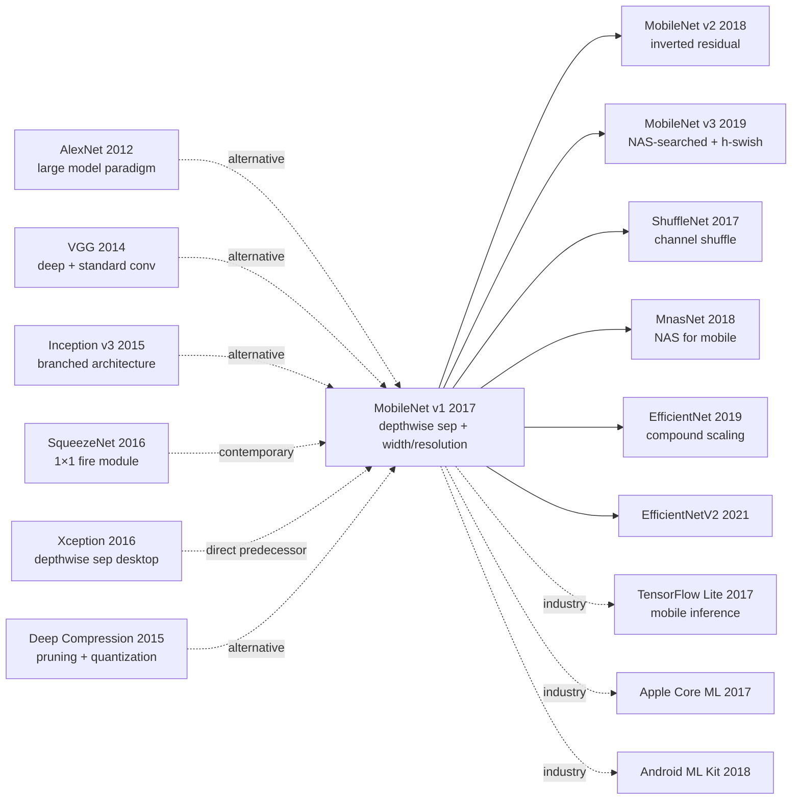

# MobileNet — Bringing Deep Learning to Mobile Devices via Depthwise Separable Convolutions

> **April 17, 2017. Google's Howard and 7 co-authors release [MobileNet (1704.04861)](https://arxiv.org/abs/1704.04861) on arXiv.**
> The founding paper of mobile-side deep learning — using **depthwise separable convolution** to reduce standard convolution compute by **8-9×**, paired with **width multiplier α** and **resolution multiplier ρ** as two knobs to linearly tune model size, letting ImageNet classification models run on phone CPUs.
> MobileNet v1 (4.2M params / 569M FLOPs) achieved 70.6% ImageNet top-1, **nearly identical to VGG-16 (138M / 15G FLOPs) 71.5%, but with 33× fewer params and 27× fewer FLOPs**.
> Directly birthed MobileNet v2 / v3 / EfficientNet / ShuffleNet / MnasNet — the entire mobile CNN family — and is the actual backend of phone camera real-time AI, Android ML Kit, iOS Core ML.

## TL;DR

MobileNet replaces standard convolution with **depthwise separable convolution** (depthwise + 1×1 pointwise), reducing compute 8-9×; then uses **width multiplier α** (channel scaling) and **resolution multiplier ρ** (input resolution scaling) as two hyperparameters to linearly tune model scale. With 4.2M params it achieves nearly the same top-1 accuracy as 138M VGG on ImageNet — the first time deep learning could truly run real-time on mobile CPUs.

---

## Historical Context

### What was mobile deep learning stuck on in 2017?

2012-2016 ImageNet classification models evolved rapidly: AlexNet (60M, 727M FLOPs) → VGG-16 (138M, 15.5G FLOPs) → GoogLeNet (6.8M, 1.55G FLOPs) → ResNet-50 (25.6M, 4.1G FLOPs). But all these models **were far from mobile deployment**:

> **(1) Too many params**: phone RAM 4GB, model 100MB+ is tight;
> **(2) Too much compute**: phone CPU 1-3 GFLOPs/s, processing one image takes seconds;
> **(3) Power / heat**: continuous inference makes phone overheat and throttle;
> **(4) Existing solutions inadequate**: SqueezeNet (channel compression) accuracy too low, Xception (depthwise sep but desktop) not light enough;
> **(5) Industry urgency**: Google Photos / Snapchat / Android camera filters all need on-device AI.

The community's open question: **"Can we design a mobile-native, parameterizable family of efficient CNNs?"**

### The 3 immediate predecessors that pushed MobileNet out

- **Iandola et al., 2016 (SqueezeNet)** [arXiv]: uses 1×1 fire module to compress channels, 50× fewer params but only 57.5% accuracy
- **Chollet, 2016 (Xception)** [CVPR 2017]: first network to systematically use depthwise separable conv, but targeted desktop SOTA, not mobile
- **Han et al., 2015 (Deep Compression)** [ICLR]: pruning + quantization compresses VGG 49×, but training complex

### What was the author team doing?

8 authors all from Google. Andrew Howard is core first author (later led MobileNet v2 / v3 / MnasNet / EfficientNet); Hartwig Adam is Google vision veteran. **Google was betting on "on-device AI" strategy**: MobileNet was the core model of Google Mobile Vision API, directly serving Google Photos, Google Lens, Pixel camera, etc.

### State of industry, compute, data

- **GPU**: training on Tesla K80 / Titan X; target inference hardware was ARM mobile CPU
- **Data**: ImageNet 1.28M images, 1000 classes
- **Frameworks**: TensorFlow + TensorFlow Mobile (later TFLite)
- **Industry**: Apple released CoreML in 2017, Google released ML Kit, mobile AI strategy race white-hot

---

## Method Deep Dive

### Overall framework

```
Input 224×224×3
  ↓ Conv 3×3 stride=2 (32 channels)        ← only standard conv
  ↓ Depthwise Separable Block × 13:
      ├─ Depthwise Conv 3×3 + BN + ReLU6  (per channel)
      └─ Pointwise Conv 1×1 + BN + ReLU6  (combine channels)
  ↓ Average Pool 7×7
  ↓ Fully Connected (1000 classes)
  ↓ Softmax
```

| Layer | Type | Stride | Output |
|-------|------|--------|--------|
| Conv 3×3 | Standard | 2 | 112×112×32 |
| DW + PW | Depthwise sep | 1 | 112×112×64 |
| DW + PW | Depthwise sep | 2 | 56×56×128 |
| DW + PW × 2 | Depthwise sep | 1+2 | 28×28×256 |
| DW + PW × 2 | Depthwise sep | 1+2 | 14×14×512 |
| DW + PW × 5 | Depthwise sep | 1 | 14×14×512 |
| DW + PW × 2 | Depthwise sep | 2+1 | 7×7×1024 |
| AvgPool 7×7 | - | - | 1×1×1024 |
| FC + Softmax | - | - | 1×1×1000 |

| Config | Params | FLOPs | top-1 |
|--------|--------|-------|-------|
| MobileNet 1.0 (224) | 4.2M | 569M | 70.6% |
| MobileNet 0.75 (224) | 2.6M | 325M | 68.4% |
| MobileNet 0.5 (224) | 1.32M | 149M | 63.7% |
| MobileNet 0.25 (224) | 0.47M | 41M | 50.6% |

### Key designs

#### Design 1: Depthwise Separable Convolution — core compute revolution

**Function**: decompose standard convolution into depthwise and pointwise, drastically reducing compute.

**Standard convolution**:

$$
G_{k,l,n} = \sum_{i,j,m} K_{i,j,m,n} \cdot F_{k+i-1, l+j-1, m}
$$

Compute: $D_K \cdot D_K \cdot M \cdot N \cdot D_F \cdot D_F$ (where $D_K$ is kernel size, $M$ is input channels, $N$ is output channels, $D_F$ is output spatial size)

**Depthwise Separable Conv**:

Step 1 **Depthwise Conv**: each input channel independently convolved (M kernels of $D_K \times D_K$, each operating on one input channel)

$$
\hat{G}_{k,l,m} = \sum_{i,j} \hat{K}_{i,j,m} \cdot F_{k+i-1, l+j-1, m}
$$

Compute: $D_K \cdot D_K \cdot M \cdot D_F \cdot D_F$

Step 2 **Pointwise Conv (1×1)**: cross-channel linear combination (standard 1×1 conv, N kernels of 1×1×M)

$$
G_{k,l,n} = \sum_m K^{1\times 1}_{m,n} \cdot \hat{G}_{k,l,m}
$$

Compute: $M \cdot N \cdot D_F \cdot D_F$

**Total compute reduction ratio**:

$$
\frac{D_K^2 M D_F^2 + M N D_F^2}{D_K^2 M N D_F^2} = \frac{1}{N} + \frac{1}{D_K^2}
$$

For $D_K = 3, N = 512$: reduction ratio $\approx 1/512 + 1/9 \approx 1/9$, i.e., **9× compute savings**.

**Standard conv vs depthwise separable comparison**:

| Config | Standard Conv FLOPs | Depthwise Sep FLOPs | Reduction |
|--------|---------------------|---------------------|-----------|
| 224×224 → 112×112, 32→64, K=3 | 1.2G | 152M | 7.9× |
| 56×56, 128→128, K=3 | 463M | 65M | 7.1× |
| 14×14, 512→512, K=3 | 924M | 113M | 8.2× |
| 7×7, 1024→1024, K=3 | 462M | 60M | 7.7× |
| **Overall MobileNet vs VGG-style** | **15.5G** | **569M** | **27×** |

**Design rationale**: explicitly decouple "spatial filtering" and "channel combining" — the minimalist product of the Inception / Xception lineage.

#### Design 2: Width Multiplier α — channel scaling knob

**Function**: use one hyperparameter $\alpha \in (0, 1]$ to scale all layers' input and output channels simultaneously.

**Core mechanism**:

For all $M, N$, replace with $\alpha M, \alpha N$. Compute reduces to:

$$
D_K^2 \cdot \alpha M \cdot D_F^2 + \alpha M \cdot \alpha N \cdot D_F^2 = D_K^2 \alpha M D_F^2 + \alpha^2 M N D_F^2
$$

Total FLOPs scales roughly as $\alpha^2$ (params also $\alpha^2$), but top-1 accuracy only **linearly drops** a few points:

| α | Params | FLOPs | top-1 |
|---|--------|-------|-------|
| 1.0 | 4.2M | 569M | 70.6% |
| 0.75 | 2.6M | 325M | 68.4% |
| 0.5 | 1.32M | 149M | 63.7% |
| 0.25 | 0.47M | 41M | 50.6% |

**Key insight**: α gives a **linear + predictable** "accuracy-compute" tradeoff curve. Engineers can precisely choose based on phone hardware budget.

#### Design 3: Resolution Multiplier ρ — input resolution knob

**Function**: use $\rho \in (0, 1]$ to scale input image resolution (224 / 192 / 160 / 128).

**Core mechanism**:

Input resolution from $224 \times 224$ becomes $\rho \cdot 224 \times \rho \cdot 224$, all feature map spatial sizes $D_F$ scale proportionally. Compute reduces by $\rho^2$ (params unchanged).

**ρ tuning experiment** (α=1.0):

| ρ (input res) | FLOPs | top-1 |
|--------------|-------|-------|
| 1.0 (224) | 569M | 70.6% |
| 0.857 (192) | 418M | 69.1% |
| 0.714 (160) | 291M | 67.2% |
| 0.571 (128) | 186M | 64.4% |

**Design rationale**: many mobile scenarios have small input images already (thumbnails, camera previews); reducing input resolution almost-freely cuts FLOPs.

#### Design 4: ReLU6 Activation + Simplified Architecture — quantization-friendly engineering choices

**ReLU6**: $\text{ReLU6}(x) = \min(\max(x, 0), 6)$. Capping activation at 6 is for **8-bit quantization** (uint8 range 0-255, 6 is fixed-point friendly).

**Pseudocode**:

```python
class DepthwiseSeparableBlock(nn.Module):
    def __init__(self, in_ch, out_ch, stride=1):
        super().__init__()
        # Depthwise: groups=in_ch makes each channel its own conv
        self.dw = nn.Conv2d(in_ch, in_ch, kernel_size=3, stride=stride,
                            padding=1, groups=in_ch, bias=False)
        self.bn1 = nn.BatchNorm2d(in_ch)
        # Pointwise: 1x1 conv combining channels
        self.pw = nn.Conv2d(in_ch, out_ch, kernel_size=1, bias=False)
        self.bn2 = nn.BatchNorm2d(out_ch)

    def forward(self, x):
        x = F.relu6(self.bn1(self.dw(x)))      # Depthwise + BN + ReLU6
        x = F.relu6(self.bn2(self.pw(x)))      # Pointwise + BN + ReLU6
        return x

class MobileNetV1(nn.Module):
    def __init__(self, width_multiplier=1.0, num_classes=1000):
        super().__init__()
        a = width_multiplier
        ch = lambda c: int(c * a)
        self.features = nn.Sequential(
            nn.Conv2d(3, ch(32), 3, stride=2, padding=1, bias=False),
            nn.BatchNorm2d(ch(32)), nn.ReLU6(),
            DepthwiseSeparableBlock(ch(32), ch(64)),
            DepthwiseSeparableBlock(ch(64), ch(128), stride=2),
            DepthwiseSeparableBlock(ch(128), ch(128)),
            DepthwiseSeparableBlock(ch(128), ch(256), stride=2),
            DepthwiseSeparableBlock(ch(256), ch(256)),
            DepthwiseSeparableBlock(ch(256), ch(512), stride=2),
            *[DepthwiseSeparableBlock(ch(512), ch(512)) for _ in range(5)],
            DepthwiseSeparableBlock(ch(512), ch(1024), stride=2),
            DepthwiseSeparableBlock(ch(1024), ch(1024)),
        )
        self.avgpool = nn.AdaptiveAvgPool2d(1)
        self.fc = nn.Linear(ch(1024), num_classes)

    def forward(self, x):
        x = self.features(x)
        x = self.avgpool(x).flatten(1)
        return self.fc(x)
```

**Simplified design philosophy**: MobileNet deliberately **does not add residual connection** (unlike Inception / ResNet), because skip connections increase memory bandwidth pressure on mobile deployment. Later MobileNet v2 used inverted residuals to address this.

### Loss / training strategy

| Item | Config |
|------|--------|
| Loss | Cross-entropy |
| Optimizer | RMSprop with momentum 0.9 |
| LR | 0.1 (large batch) / 0.045 (typical) |
| Batch | 96 |
| Weight decay | 4e-5 (small, since few params) |
| Data augmentation | Weak (avoid overfitting small model) |
| Label smoothing | 0.1 |
| Epochs | 90 |
| BN momentum | 0.9997 |
| Dropout | only FC layer 0.001 |

---

## Failed Baselines

### Opponents that lost to MobileNet at the time

- **VGG-16**: 138M params, 15.5G FLOPs, 71.5% top-1 → MobileNet 1.0 4.2M params, 569M FLOPs, 70.6% top-1. **33× fewer params, 27× fewer FLOPs, only 0.9 lower accuracy**
- **GoogLeNet**: 6.8M / 1550M / 69.8% → MobileNet 1.0 wins on all axes
- **SqueezeNet**: 1.25M / 833M / 57.5% → MobileNet 0.5 (1.32M / 149M / 63.7%) wins on all axes
- **AlexNet**: 60M / 727M / 57.2% → MobileNet 0.5 1.32M / 149M / 63.7% wins on all axes

### Failures / limits admitted in the paper

- **No architecture search**: hand-designed 28-layer structure (later MnasNet / EfficientNet improved with NAS)
- **No residual connection**: MobileNet v1 still suffers gradient issues when going deeper (v2 fixes)
- **Top-1 accuracy still below desktop models**: 70.6% vs ResNet-50 76% vs Inception v3 78%
- **Not fast on GPU/TPU**: depthwise conv has weak BLAS optimization on GPU (pointwise more GPU-friendly) — root reason MobileNet isn't popular on desktop
- **Weak adaptation for object detection / segmentation**: v1 mainly designed for classification

### "Anti-baseline" lesson

- **"Accuracy first, efficiency second"** (VGG/Inception belief): MobileNet flipped — **first define compute budget, then design best architecture**
- **"Deeper is better"**: MobileNet 28 layers is enough, going deeper doesn't help
- **"Need residual to train"**: MobileNet works without it (though v2 added)
- **"Mobile = compromise on accuracy"**: MobileNet proves can be both efficient and accurate

---

## Key Experimental Numbers

### ImageNet classification (vs large models)

| Model | Params | FLOPs | top-1 |
|-------|--------|-------|-------|
| AlexNet | 60M | 727M | 57.2% |
| SqueezeNet | 1.25M | 833M | 57.5% |
| GoogLeNet | 6.8M | 1550M | 69.8% |
| VGG-16 | 138M | 15.5G | 71.5% |
| Inception v3 | 23.8M | 5.7G | 78.0% |
| **MobileNet 1.0 (224)** | **4.2M** | **569M** | **70.6%** |
| **MobileNet 0.5 (160)** | **1.32M** | **76M** | **60.2%** |

### Width / Resolution multiplier (Table 6/7)

| α \ ρ | 224 | 192 | 160 | 128 |
|-------|-----|-----|-----|-----|
| 1.0 | **70.6** / 569M | 69.1 / 418M | 67.2 / 291M | 64.4 / 186M |
| 0.75 | 68.4 / 325M | 67.4 / 239M | 65.2 / 167M | 61.8 / 107M |
| 0.5 | 63.7 / 149M | 61.7 / 110M | 59.1 / 76M | 56.2 / 49M |
| 0.25 | 50.6 / 41M | 47.7 / 30M | 45.5 / 21M | 41.5 / 14M |

### Down-stream tasks

| Task | MobileNet | Baseline | Notes |
|------|----------|----------|-------|
| Stanford Dogs (FGV) | 83.3% | 84.0% (Inception v3) | accuracy close, model 6× smaller |
| COCO detection (SSD-MobileNet) | 19.3 mAP | 21.9 (SSD-Inception v2) | model 5× smaller, 3× faster |
| Face attribute recognition | 88.7% | 87.3% (Inception v3) | **beats Inception v3** |
| YouTube-8M Audio | 51.2% | 52.7% (Inception v3) | close |

### Key findings

- **Depthwise sep is key**: removing and using standard conv increases FLOPs 8×, accuracy nearly unchanged
- **Width multiplier high engineering value**: α=0.5 already runnable on low-end phones
- **Resolution sensitive to latency**: 224→160 inference 2.4× faster
- **Cross-task universal**: classification / detection / attribute / audio all work
- **Not GPU-friendly**: depthwise conv has poor BLAS optimization on GPU

---

## Idea Lineage



### Predecessors
- **AlexNet/VGG/Inception/ResNet (2012-2016)**: standard CNN evolution
- **Xception (2016)**: first to systematically use depthwise sep
- **SqueezeNet (2016)**: another compression route (fire module)
- **Deep Compression (2015)**: pruning + quantization alternative

### Successors
- **MobileNet v2 (2018)**: inverted residual block
- **MobileNet v3 (2019)**: NAS + h-swish
- **ShuffleNet (2017-2019)**: channel shuffle
- **MnasNet (2018)**: NAS for mobile
- **EfficientNet (2019)**: compound scaling, partial author overlap
- **Industrial deployment**: TFLite / CoreML / Android ML Kit / Snapchat / TikTok

### Misreadings
- **"MobileNet is the fastest CNN"**: on GPU ResNet may still be faster (depthwise GPU-unfriendly)
- **"Depthwise sep = MobileNet's invention"**: Xception was 6 months earlier, but MobileNet engineering and parameterization more thorough
- **"MobileNet suits all tasks"**: on segmentation / detection MobileNet still loses to dedicated designs

---

## Modern Perspective (Looking Back from 2026)

### Assumptions that don't hold up

- **"Depthwise sep is the optimal mobile conv"**: today MobileViT / EfficientFormer with attention + conv hybrid is better
- **"No need for residual"**: MobileNet v2 with inverted residual significantly improved
- **"ReLU6 is the best quantization activation"**: today h-swish (v3) performs better
- **"Hand-designed architecture is enough"**: NAS-searched (MnasNet / EfficientNet) significantly beats hand-designed
- **"ImageNet 70% is reasonable target"**: today mobile SOTA (EfficientNet-B0 / MobileViT) already 80%+

### What time validated as essential vs redundant

- **Essential**: depthwise separable convolution idea, width / resolution multiplier parameterization, mobile-first design philosophy, quantization-friendly (ReLU6)
- **Redundant / misleading**: hand-designed architecture (replaced by NAS), ReLU6 (replaced by h-swish), no residual (replaced by inverted residual), fixed 28 layers (replaced by adaptive depth)

### Side effects the authors didn't anticipate

1. **Opened the mobile AI era**: directly birthed TFLite, CoreML, ML Kit and other mobile ML frameworks
2. **Edge AI industry**: Pixel cameras / iPhone Photos / Snapchat filters all based on MobileNet family
3. **NAS for Mobile research direction**: MnasNet / EfficientNet are NAS upgrades of MobileNet
4. **Author team continuous output**: Howard led MobileNet v2/v3 + MnasNet + EfficientNet, the core of Google mobile AI school
5. **Educational impact**: MobileNet is the standard case study for "efficient model design" in CV courses

### If we rewrote MobileNet today

- Use NAS-searched architecture
- Add inverted residual + SE block
- Use h-swish instead of ReLU6
- Add attention modules (per MobileViT)
- Use compound scaling (per EfficientNet)
- Default mixed-precision training / quantization-aware training (QAT)

But the **core ideas "first define compute budget, then optimize accuracy" + "parameterizable family" remain the foundational paradigm for mobile AI design**.

---

## Limitations and Outlook

### Authors admitted
- No residual, depth-limited
- Weak GPU depthwise optimization
- Hand-designed architecture, no NAS
- ReLU6 is ad-hoc quantization choice
- Top-1 still 5+ points below desktop SOTA

### Found in retrospect
- Depthwise conv has weak BLAS optimization on GPU
- Detection / segmentation task adaptation poor
- Training hyperparameter sensitive
- Cross-hardware performance inconsistent

### Improvement directions (validated by follow-ups)
- MobileNet v2 (2018): inverted residual + linear bottleneck
- MobileNet v3 (2019): NAS + h-swish + SE
- ShuffleNet (2017): channel shuffle
- MnasNet (2018) / EfficientNet (2019): NAS + compound scaling
- MobileViT (2022): mobile + Transformer

---

## Related Work and Inspiration

- **vs VGG (cross-scale)**: VGG large and accurate, MobileNet small and accurate. **Lesson: under hardware constraints, rethink "efficiency"**
- **vs Xception (cross-scenario)**: Xception desktop SOTA, MobileNet mobile engineering. **Lesson: same idea different scenarios need different optimization**
- **vs SqueezeNet (cross-compression-route)**: SqueezeNet compresses channels, MobileNet changes conv decomposition. **Lesson: compute reduction more directly maps to latency than param reduction**
- **vs MobileNet v2 (cross-generation inheritance)**: v1 no residual, v2 added inverted residual. **Lesson: original version exposes problems, follow-ups gradually fix**
- **vs EfficientNet (cross-generation inheritance)**: EfficientNet uses NAS + compound scaling pushing MobileNet philosophy to extreme. **Lesson: hand-designed → automated → systematized is the evolution path of efficient model design**

---

## Related Resources

- 📄 [arXiv 1704.04861](https://arxiv.org/abs/1704.04861)
- 💻 [Authors' TF implementation](https://github.com/tensorflow/models/tree/master/research/slim/nets/mobilenet_v1) · [PyTorch reimplementation](https://github.com/marvis/pytorch-mobilenet) · [HuggingFace](https://huggingface.co/google/mobilenet_v1_1.0_224)
- 📚 Must-read follow-ups: [MobileNet v2 (2018)](https://arxiv.org/abs/1801.04381), [MobileNet v3 (2019)](https://arxiv.org/abs/1905.02244), [ShuffleNet (2017)](https://arxiv.org/abs/1707.01083), [MnasNet (2018)](https://arxiv.org/abs/1807.11626), [EfficientNet (2019)](https://arxiv.org/abs/1905.11946)
- 📦 Deployment: [TensorFlow Lite](https://www.tensorflow.org/lite) · [Core ML](https://developer.apple.com/documentation/coreml) · [Android ML Kit](https://developers.google.com/ml-kit)
- 🎬 [Andrej Karpathy: MobileNets paper review (older)](https://www.youtube.com/watch?v=t1KdDdDJBkk) · [Howard at ICCV 2019 on MobileNet family](https://www.youtube.com/watch?v=BWXXjF3ms9c)

---

> 🌐 [中文版本](/era3_attention/2017_mobilenet/) · 📚 awesome-papers project · CC-BY-NC
