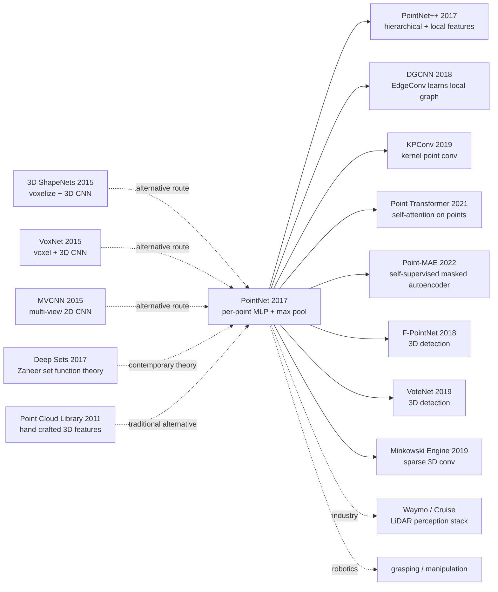

# PointNet — Permutation-Invariant Deep Networks for Unordered Point Clouds

> **December 2, 2016. Stanford's Qi, Su, Mo, Guibas release [PointNet (1612.00593)](https://arxiv.org/abs/1612.00593) on arXiv, accepted to CVPR 2017.**
> One of the most important papers in 3D vision history — first to use a single **end-to-end deep network** to directly process **unordered point sets** (point clouds), with no voxelization, no multi-view projection.
> Achieved 89.2% on ModelNet40 (3D shape classification), close to multi-view CNN's 90.1% but with **30× less compute**; refreshed SOTA on S3DIS (semantic segmentation) and ShapeNet (part segmentation).
> PointNet directly birthed PointNet++ / DGCNN / KPConv / Point Transformer and the entire 3D point cloud deep learning family — the foundational architecture for autonomous-driving LiDAR perception, robot manipulation, AR/VR.

## TL;DR

PointNet uses the minimalist architecture "**per-point shared MLP + max pooling**" to achieve **permutation invariance** (point order doesn't affect output), combined with **T-Net** (learning 3×3 / 64×64 affine transforms) for **transformation invariance**. It was the first to achieve SOTA on classification / segmentation / scene parsing on unordered point clouds with a single deep network, founding the basic paradigm of 3D point cloud deep learning.

---

## Historical Context

### What was the 3D vision community stuck on in 2016?

2016 3D shape recognition had two mainstream routes, each with fatal problems:

> **(1) Voxelization route** (3D ShapeNets 2015, VoxNet 2015): voxelize the 3D shape (e.g., 30×30×30 grid) then apply 3D CNN. **Problem**: voxel count $O(N^3)$ explodes, 64³ resolution was the limit; severe quantization loss; empty voxels waste compute
> **(2) Multi-View route** (MVCNN 2015): render 2D images from multiple viewpoints, process with 2D CNN then aggregate. **Problem**: viewpoint selection is heuristic; 2D projection loses 3D geometric info; can't handle point cloud native data

But **point clouds** (the natural output of 3D scanners / LiDAR / depth sensors) are unordered point sets $\{p_1, ..., p_n\}$, which can't directly feed into CNN (assumes grid) or RNN (assumes sequential order). **The community's open question: "Can we do deep learning directly on raw point sets?"**

### The 3 immediate predecessors that pushed PointNet out

- **3D ShapeNets (Wu et al., CVPR 2015)**: first deep 3D learning model, but voxelizes
- **VoxNet (Maturana & Scherer, IROS 2015)**: 3D CNN on voxels, weaker than MVCNN
- **MVCNN (Su et al., ICCV 2015)**: multi-view CNN, ModelNet40 SOTA but loses 3D info

### What was the author team doing?

4 authors all from Stanford. Charles Qi was a PhD (later led PointNet++, F-PointNet, VoteNet); Hao Su was Guibas-lab postdoc (later UCSD professor, 3D vision star); Leonidas Guibas is Stanford geometry computing veteran (ACM Fellow); Kaichun Mo was a Stanford undergrad. **Stanford's Guibas Lab was betting on "3D geometric deep learning"** — PointNet was the founding work of that bet.

### State of industry, compute, data

- **GPU**: single GTX 1080, ModelNet40 trained in hours
- **Data**: ModelNet40 (12k 3D shapes, 40 classes), ShapeNet (part seg), S3DIS (Stanford indoor scenes, 6 areas / 271 rooms)
- **Frameworks**: TensorFlow; authors' code at [github/charlesq34/pointnet](https://github.com/charlesq34/pointnet) star 4k+
- **Industry**: autonomous driving was just starting (Waymo 2016 spinoff), LiDAR data processing urgently needed efficient deep learning

---

## Method Deep Dive

### Overall framework

```
Input: N × 3 (point cloud)
  ↓
[Input T-Net 3×3]  ← learn to align input coordinate system
  ↓
MLP (64, 64) shared per-point  ← each point independent but weights shared
  ↓
[Feature T-Net 64×64]  ← align feature space + orthogonal regularization
  ↓
MLP (64, 128, 1024) shared per-point
  ↓
Max Pool over N points  ← symmetric function for permutation invariance
  ↓
Global feature 1024-d
  ↓
Classification: MLP (512, 256, k)
Segmentation: concat global 1024 with per-point 64 → MLP (512, 256, 128, m) per point
```

| Config | PointNet |
|--------|---------|
| Input | N × 3 (typical N=1024 / 2048) |
| Shared MLP | (64, 64) → (64, 128, 1024) |
| Symmetric function | Max Pool (also tried average / weighted) |
| T-Net | 3×3 input + 64×64 feature |
| Classification params | 3.5M |
| Segmentation params | 1.5M |
| ModelNet40 acc | 89.2% |
| Training time | hours (single GTX 1080) |

### Key designs

#### Design 1: Per-Point Shared MLP + Max Pooling — minimalist permutation invariance

**Function**: make the model insensitive to point input order ("unordered set" is the essential property of point clouds).

**Core formula**:

Define function $f$ acting on point set $\{x_1, ..., x_n\}$, requiring $f$ satisfy for any permutation $\pi$:

$$
f(\{x_1, ..., x_n\}) = f(\{x_{\pi(1)}, ..., x_{\pi(n)}\})
$$

PointNet's implementation:

$$
f(\{x_1, ..., x_n\}) \approx \gamma\left( \max_{i=1,...,n}\{h(x_i)\} \right)
$$

where $h$ is shared MLP (per-point applied), $\max$ is the **symmetric function** (permutation-invariant), $\gamma$ is post-processing MLP.

**Why is max pool the best symmetric function?**

The paper compared 4 symmetric functions (Table 5):

| Symmetric function | ModelNet40 acc |
|-------------------|---------------|
| **Max pool (paper)** | **87.1%** |
| Average pool | 83.8% |
| Weighted sum (attention) | 83.0% |
| Sum pool | 83.4% |

Max pool wins because: **naturally implements critical point set selection** — model automatically learns the key ~10% of points (edges, corners), other points are ignored, this "sparse selection" property gives noise robustness.

**Theoretical guarantee (paper Theorem 1)**: any continuous set function $f$ in Hausdorff distance can be approximated to arbitrary precision by $\gamma \circ \max \circ h$ — i.e., PointNet is theoretically a universal approximator for set functions.

#### Design 2: T-Net — Transformation Invariance

**Function**: 3D objects' class shouldn't change after rotation / translation / scaling. Let the model automatically learn alignment transforms instead of relying on manual pre-alignment.

**Core idea**: T-Net is a **mini PointNet**, takes point cloud input, outputs affine transform matrix $T$ (input T-Net: 3×3, feature T-Net: 64×64), then applies $T$ to original points:

$$
x_i' = T \cdot x_i, \quad T = \text{T-Net}(\{x_1, ..., x_n\})
$$

**Orthogonal Regularization**: the feature T-Net learns high-dim transforms (64×64) which is unstable; add a regularization to keep matrix close to orthogonal:

$$
\mathcal{L}_{\text{reg}} = \|I - A A^T\|_F^2
$$

(I is identity, A is the 64×64 matrix output by feature T-Net)

**Comparison with hand-crafted alignment**:

| Method | Alignment | ModelNet40 acc |
|--------|-----------|---------------|
| No alignment | - | 87.1% |
| **+ Input T-Net (3×3)** | **learned** | **87.5%** |
| + Input T-Net + Feature T-Net (64×64) | learned + reg | **89.2%** |

**Design rationale**: learned alignment > manual pre-alignment, and end-to-end trainable.

#### Design 3: Local + Global Feature Concat — key for segmentation

**Function**: classification only needs global feature, but **segmentation** needs per-point labels → must inject global context info into each point's local feature.

**Core architecture (segmentation)**:

1. Compute global feature (1024-d) via PointNet
2. For each point, concat its local feature (64-d, from intermediate MLP layer) with global feature (1024-d)
3. Pass through per-point MLP (512, 256, 128, m), each point outputs m class logits

```python
class PointNetSegmentation(nn.Module):
    def __init__(self, num_classes=50):
        super().__init__()
        self.input_tnet = TNet(k=3)
        self.feature_tnet = TNet(k=64)
        self.mlp1 = SharedMLP([3, 64, 64])
        self.mlp2 = SharedMLP([64, 64, 128, 1024])
        self.seg_mlp = SharedMLP([64+1024, 512, 256, 128, num_classes])

    def forward(self, x):                       # x: (B, N, 3)
        t1 = self.input_tnet(x)                 # (B, 3, 3)
        x = torch.bmm(x, t1)                    # input transform
        x = self.mlp1(x)                        # (B, N, 64)
        t2 = self.feature_tnet(x)               # (B, 64, 64)
        x_local = torch.bmm(x, t2)              # (B, N, 64) - local feature
        x = self.mlp2(x_local)                  # (B, N, 1024)
        x_global = x.max(dim=1)[0]              # (B, 1024) - global feature
        # broadcast global to each point and concat
        x_global = x_global.unsqueeze(1).expand(-1, x_local.size(1), -1)
        x = torch.cat([x_local, x_global], dim=2)   # (B, N, 64+1024)
        return self.seg_mlp(x)                  # (B, N, num_classes)
```

#### Design 4: Critical Point Set + Upper Bound Shape — built-in interpretability

**Function**: PointNet's max pooling naturally learns a set of "critical points" determining the global feature; other points can be deleted without affecting output.

**Experimental findings**:
- **Critical point set**: removing them → global feature changes → wrong class. These are usually the object's **key geometric features** (edges, corners)
- **Upper bound shape**: outside critical points one can **add arbitrary points** (within convex hull) without changing output. This is the root cause of the model's robustness to noise / augmented points

**ModelNet40 robustness test**:

| Input perturbation | PointNet acc |
|-------------------|-------------|
| Full 1024 points | 89.2% |
| Drop 50% points | **87.4% (-1.8)** |
| Drop 80% points | 80.3% |
| Add 20% Gaussian noise | 87.0% |
| Add 10% outliers | 80.5% |

**Comparison with VoxNet robustness**: dropping 50% voxels drops accuracy ~10 points; PointNet only drops 1.8 points → **PointNet's robustness to sparse / noisy inputs far exceeds voxel methods**.

### Loss / training strategy

| Item | Config |
|------|--------|
| Classification Loss | Cross-entropy + 0.001 × $\mathcal{L}_{reg}$ (T-Net orthogonality) |
| Segmentation Loss | Per-point cross-entropy |
| Optimizer | Adam (lr=0.001) |
| Batch | 32 (1024 points per cloud) |
| Epochs | 250 (classification) / 200 (segmentation) |
| Data augmentation | Random rotation around up-axis, jitter (Gaussian) |
| LR schedule | Decay 0.7 every 20 epoch |
| Dropout | 0.7 in last FC layer |

---

## Failed Baselines

### Opponents that lost to PointNet at the time

- **VoxNet (3D CNN)**: ModelNet40 85.9% → PointNet 89.2% (+3.3), **VoxNet's compute is 30× PointNet's**
- **3D ShapeNets**: ModelNet40 84.7% → PointNet 89.2% (+4.5)
- **MVCNN**: 90.1% (PointNet 89.2%) — PointNet slightly lower but **30× less compute + directly processes point clouds**
- **S3DIS prior SOTA (handcrafted 3D feat + SVM)**: mIoU 38.65% → PointNet 47.71% (+9 points)
- **ShapeNet part seg prior SOTA**: mIoU 81.4% → PointNet 83.7%

### Failures / limits admitted in the paper

- **Lacks local feature learning**: max pool only sees global, loses local geometric context (PointNet++ fixes)
- **Sensitive to density variation**: trained on 1024 points, tested on 64 points drops
- **Large-scene challenge**: S3DIS large rooms need block-by-block processing, loses cross-block context
- **MVCNN slightly wins on classification**: PointNet 89.2% < MVCNN 90.1% (but MVCNN 30× slower)
- **Cannot directly process RGB-D**: original PointNet only uses XYZ, no color / normal

### "Anti-baseline" lesson

- **"3D must voxelize or multi-view"** (community consensus): PointNet directly refuted — raw point sets can be end-to-end trained
- **"Unordered sets need RNN or attention"** (intuition): max pool, the simplest symmetric function, is enough
- **"Point cloud features must be hand-crafted"** (PCL/CGAL camp): PointNet end-to-end learning fully wins
- **"Voxel is the only scalable 3D representation"**: PointNet uses 1024 points vs voxel 64³ = 262k, parameter efficiency 256× higher

---

## Key Experimental Numbers

### Main experiment

| Task | Prior SOTA | PointNet | Gain |
|------|-----------|----------|------|
| ModelNet40 classification acc | 85.9% (VoxNet) | **89.2%** | +3.3 |
| ModelNet10 classification acc | 92% | **94.6%** | +2.6 |
| ShapeNet part segmentation mIoU | 81.4% | **83.7%** | +2.3 |
| S3DIS semantic segmentation mIoU | 38.65% | **47.71%** | **+9.0** |
| S3DIS scene parsing mAP | - | **78.62%** | new SOTA |

### Symmetric function ablation (Table 5)

| Function | ModelNet40 acc |
|----------|---------------|
| **Max pool** | **87.1%** |
| Average pool | 83.8% |
| Weighted sum (attention) | 83.0% |
| Sum pool | 83.4% |

### Key design ablation (Table 6)

| Config | acc |
|--------|-----|
| baseline (no T-Net) | 87.1% |
| + Input T-Net | 87.5% |
| + Input T-Net + Feature T-Net | 88.6% |
| **+ regularization on Feature T-Net** | **89.2%** |

### Robustness

| Input perturbation | PointNet acc |
|-------------------|-------------|
| Full 1024 points | 89.2 |
| Drop 50% points | 87.4 |
| Drop 80% points | 80.3 |
| Gaussian jitter (σ=0.01) | 87.0 |
| 10% outliers | 80.5 |

### Key findings

- **Extremely robust to sparse + noisy inputs**: dropping 50% only loses 1.8
- **T-Net is critical**: removing drops 2 points
- **Max pool is the best symmetric function**
- **Theoretical universal approximator**: covers all continuous set functions
- **Compute / memory efficiency far surpass voxel**

---

## Idea Lineage



### Predecessors
- **3D ShapeNets / VoxNet (2015)**: voxel route alternative
- **MVCNN (2015)**: multi-view route alternative
- **PCL / engineered features (2011-2014)**: traditional handcrafted alternative
- **Deep Sets (Zaheer 2017)**: contemporary set function theory foundation

### Successors
- **PointNet++ (2017)**: authors' own follow-up, hierarchical sampling + local feature learning, fixes PointNet's lack of local features
- **DGCNN (2018)**: uses EdgeConv to learn local graph features
- **KPConv (2019)**: kernel point convolution, finer local modeling
- **Point Transformer (2021)**: Transformer attention on points
- **Point-MAE (2022)**: masked autoencoder self-supervised pretraining
- **3D detection**: F-PointNet (2018), VoteNet (2019), CenterPoint (2021)
- **Sparse 3D conv**: Minkowski Engine (2019), TorchSparse, etc.
- **Industrial deployment**: Waymo / Cruise / Mobileye's LiDAR perception stacks all based on PointNet family

### Misreadings
- **"PointNet is the ultimate 3D method"**: PointNet lacks local features; PointNet++ fixed it
- **"PointNet suits all 3D tasks"**: dense point clouds (>100k points) better with sparse conv
- **"Symmetric function must be max pool"**: actually max + sum combination (paper Appendix) slightly better

---

## Modern Perspective (Looking Back from 2026)

### Assumptions that don't hold up

- **"Per-point MLP + max pool is enough"**: today Point Transformer / PointMAE with attention + self-supervised far stronger
- **"1024 points is enough"**: autonomous driving LiDAR has 100k+ points per frame, needs sparse conv
- **"Single architecture universal"**: classification uses PointNet/PointNet++, segmentation uses KPConv, 3D detection uses CenterPoint — each has dedicated architecture
- **"No need for RGB / color"**: today multi-modal point cloud (XYZ + RGB + normal + reflectance) is mainstream
- **"ModelNet40 is reasonable benchmark"**: ModelNet40 long saturated, today uses ScanObjectNN / nuScenes / Waymo Open Dataset

### What time validated as essential vs redundant

- **Essential**: permutation invariance idea, symmetric function design, T-Net learning alignment, local + global concat concept
- **Redundant / misleading**: 64×64 feature T-Net (proven marginal benefit), orthogonal regularization 0.001 (specific value irrelevant), pure XYZ input (should add RGB / normal)

### Side effects the authors didn't anticipate

1. **Birth of 3D deep learning discipline**: pre-PointNet 3D learning was niche, post-PointNet it exploded
2. **Autonomous driving LiDAR standard**: Waymo / Cruise / Mobileye all based on PointNet family
3. **Robot manipulation paradigm**: grasp detection (GraspNet) / 6D pose (PointFusion) / scene understanding (VoteNet) all built on PointNet
4. **AR/VR scene understanding**: HoloLens / Apple Vision Pro use PointNet for mesh reconstruction
5. **Stanford 3D school rise**: Guibas + Su + Qi team's continued output of PointNet++ / DenseFusion / GraspNet etc.

### If we rewrote PointNet today

- Drop 64×64 feature T-Net (marginal benefit)
- Add EdgeConv-style local features
- Use Transformer attention to replace max pool (per Point Transformer)
- Add RGB / normal input
- Self-supervised pretraining (per Point-MAE)
- Adapt for large scenes (use sparse conv or sampling)

But the **core paradigm "permutation invariance + symmetric function + end-to-end" stays unchanged**.

---

## Limitations and Outlook

### Authors admitted
- Lacks local feature learning (PointNet++ fixes)
- Large scenes need block-by-block (loses cross-block context)
- Sensitive to density variation
- MVCNN slightly wins on classification (but 30× slower)

### Found in retrospect
- Cannot directly handle dynamic / temporal point clouds
- Cannot fuse multi-modal (RGB / normal)
- Self-supervised pretraining void (Point-MAE later filled)
- Cannot handle very large point clouds (>100k)

### Improvement directions (validated by follow-ups)
- PointNet++ (2017): hierarchical + local features
- DGCNN (2018): EdgeConv local graph
- KPConv (2019): kernel point conv
- Point Transformer (2021): self-attention
- Point-MAE (2022): self-supervised pretraining
- Minkowski Engine (2019): sparse 3D conv handles huge clouds

---

## Related Work and Inspiration

- **vs VoxNet (cross-representation)**: voxelization → $O(N^3)$ memory explosion; PointNet directly point set → $O(N)$. **Lesson: native data representation often beats forced conversion**
- **vs MVCNN (cross-projection)**: multi-view → loses 3D geometry; PointNet → preserves 3D. **Lesson: cross-domain projection loses info, native processing is better**
- **vs CNN (cross-structure)**: CNN assumes grid + order; PointNet assumes unordered set. **Lesson: architecture inductive bias must match data structure**
- **vs PointNet++ (cross-generation inheritance)**: PointNet lacks local features, PointNet++ adds hierarchical sampling to fix. **Lesson: original designs are elegant but imperfect, need follow-up local enhancement**
- **vs Deep Sets (cross-theory)**: Deep Sets gives universal approximation theorem for set functions; PointNet is its engineering instance. **Lesson: theory and engineering push each other**

---

## Related Resources

- 📄 [arXiv 1612.00593](https://arxiv.org/abs/1612.00593) · [CVPR 2017 version](https://openaccess.thecvf.com/content_cvpr_2017/papers/Qi_PointNet_Deep_Learning_CVPR_2017_paper.pdf)
- 💻 [Authors' original TF implementation](https://github.com/charlesq34/pointnet) · [PyTorch reimplementation](https://github.com/fxia22/pointnet.pytorch)
- 📚 Must-read follow-ups: [PointNet++ (2017)](https://arxiv.org/abs/1706.02413), [DGCNN (2018)](https://arxiv.org/abs/1801.07829), [KPConv (2019)](https://arxiv.org/abs/1904.08889), [Point Transformer (2021)](https://arxiv.org/abs/2012.09164), [Point-MAE (2022)](https://arxiv.org/abs/2203.06604)
- 📦 Datasets: [ModelNet](http://modelnet.cs.princeton.edu/) · [ShapeNet](https://shapenet.org/) · [S3DIS](http://buildingparser.stanford.edu/dataset.html) · [Waymo Open Dataset](https://waymo.com/open/)
- 🎬 [Stanford CS468 (Geometric Deep Learning)](https://graphics.stanford.edu/courses/cs468-17-spring/) · [Charles Qi's homepage](https://stanford.edu/~rqi/)

---

> 🌐 [中文版本](/era3_attention/2017_pointnet/) · 📚 awesome-papers project · CC-BY-NC
