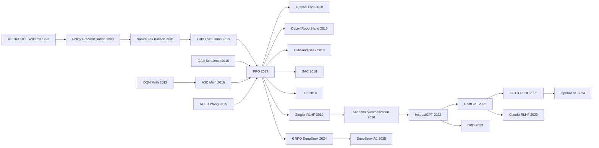

# PPO — How Clipping Finally Made Policy Gradient Tunable and Usable

> **July 20, 2017. Schulman, Wolski, Dhariwal, Radford, Klimov at OpenAI upload [arXiv 1707.06347](https://arxiv.org/abs/1707.06347); never formally published at any venue, but became one of the most-cited algorithms in RL history (~20,000 citations).**
> A 12-page engineering note — it replaced TRPO's painful second-order conjugate-gradient KL constraint with a disarmingly simple *clipped surrogate objective* $L^{CLIP}(\theta) = \mathbb{E}\left[\min\left(r_t(\theta) A_t,\, \text{clip}(r_t(\theta), 1-\epsilon, 1+\epsilon) A_t\right)\right]$, making policy gradient **simple, stable, tunable, and parallelizable** for the first time.
> PPO swept TRPO / A3C / DDPG on Atari, MuJoCo, Roboschool, StarCraft II, and was adopted by OpenAI Five (2019), DeepMind Lab, and nearly every modern robot-learning paper.
> Its most important byproduct: **becoming the algorithmic backbone of RLHF** — [InstructGPT (2022)](../era4_foundation_models/2022_instructgpt.md) / ChatGPT (2022.11) / GPT-4 / Claude / Gemini all use PPO for alignment. **No PPO, no early-ChatGPT-era alignment quality.**

## TL;DR

Schulman et al.'s 2017 12-page paper **compressed TRPO's "natural gradient + Fisher-matrix conjugate gradient + line search" 500-line alchemy into a 100-line vanilla SGD + Adam loop** — by replacing the hard KL constraint with a single clipping operation: $L^{\text{CLIP}} = \mathbb{E}\big[\min\big(r_t(\theta) A_t,\ \text{clip}(r_t(\theta), 1-\epsilon, 1+\epsilon) A_t\big)\big]$, turning "small policy updates" into a plain supervised objective. Results: PPO took SOTA on **7 of 8 MuJoCo continuous-control tasks** (avg rank 1.6 vs. TRPO 2.4 / DDPG 3.4), with wall-clock 3× faster than TRPO; the hyperparameter sweep showed performance fluctuates only ±5% as $\epsilon$ varies in 0.1-0.3 — **near-zero tuning effort** is PPO's true hidden selling point. The paper's "$\epsilon = 0.2$, $K = 10$ epochs" combination became the de-facto default of the entire deep-RL community. But what really cemented PPO's place in history was not MuJoCo — it was LLMs: **the entire RLHF pipeline of InstructGPT / ChatGPT / GPT-4 / Claude is built on PPO**, and [o1 / DeepSeek-R1 (2025)](../era5_genai_explosion/2025_deepseek_r1.md) reasoning RL uses PPO variants (GRPO). PPO is one of the few algorithms that **became the default in two completely different fields (RL and LLMs)**.

---

## Historical Context

### The "two-pillar" landscape of deep RL in 2017

When the PPO paper (Proximal Policy Optimization, Schulman 2017.07) appeared, deep reinforcement learning (deep RL) was in a "two-pillar" state:

- **Discrete action spaces** — the standard was DQN (Mnih 2013/2015). Q-learning + deep networks reached human level on Atari, but only handled discrete actions.
- **Continuous action spaces** — the standard was TRPO (Schulman 2015). Trust Region Policy Optimization was SOTA on MuJoCo and other robotics benchmarks, but the implementation was extraordinarily complex: compute the natural gradient, do conjugate gradient on the Fisher information matrix, run line search to find the step size — **the entire algorithm was 500+ lines of C++/Python**.

A3C (Asynchronous Advantage Actor-Critic, Mnih 2016) was another path — much simpler but training-unstable (stale gradient between asynchronous workers). The field faced a long-standing trade-off:

| Algorithm | Implementation complexity | Performance | Practicality |
|-----------|--------------------------|-------------|--------------|
| TRPO | extreme (natural gradient + CG + line search) | SOTA | most researchers gave up |
| A3C | low | below TRPO | easy to implement but unstable |
| The "ideal algorithm" before PPO | should be low | should be SOTA | did not exist |

PPO's core thesis was: **with a simple clipping trick, you can match TRPO's performance without computing the Fisher information matrix**, and the implementation fits in 100 lines.

### The immediate predecessors that pushed PPO out

1. **TRPO (Schulman 2015) — PPO's direct ancestor**: Schulman's own previous OpenAI paper. TRPO uses a KL constraint to bound policy updates (preventing destructive updates), but is complex to implement. Section 3 of the PPO paper is essentially "how to simplify TRPO."
2. **A2C / A3C (Mnih 2016) — mature actor-critic paradigm**: PPO directly inherits the actor-critic framework (joint policy + value function training).
3. **GAE (Schulman 2016) — Generalized Advantage Estimation**: Schulman's own advantage estimation method. PPO defaults to GAE($\lambda$=0.95) for advantage computation.
4. **Natural Policy Gradient (Kakade 2001) + REINFORCE (Williams 1992)**: ancestors of all policy gradient methods.
5. **OpenAI's baselines repo**: in 2017 OpenAI open-sourced all RL algorithms (DQN, A2C, TRPO, ACER), but TRPO's implementation was a community pain point. OpenAI internally needed an algorithm "as performant as TRPO but as simple as A2C."

PPO was born not of inspiration but as the engineering byproduct of OpenAI doing many RL experiments and finding "TRPO is too annoying."

### What OpenAI was doing at the time

In 2017 OpenAI was working on several major projects:
1. **Universe / Gym platform**: standardize RL benchmarks
2. **Robotics + sim-to-real**: train a robotic hand to solve a Rubik's cube (eventually completed in 2019)
3. **Dota 2 project**: train AI to play Dota 2 (eventually defeated pro players in 2018-2019)
4. **Large-scale RL training**: push RL to compute scales rare at the time

All four required an RL algorithm that was both stable and simple. TRPO was too complex to distribute at scale; A3C collapsed at scale. **PPO was designed precisely to make these four projects all run.**

In fact, after PPO was published, OpenAI's RL projects nearly all switched to PPO overnight:
- **OpenAI Five (Dota 2)**: trained with PPO, 180 years of self-play per day
- **Dactyl (Rubik's cube hand)**: PPO + sim-to-real domain randomization
- **Procgen / Minecraft**: PPO is the default

### State of the industry, compute, and data

- **Compute**: in 2017 deep RL was not fully GPU-ized; the PPO paper used 8 CPU + 1 GPU setup; OpenAI Five later used 256 P100 GPUs training for months
- **Libraries**: OpenAI baselines (PPO, A2C, ACER, TRPO, etc.) + Stable Baselines (community fork); 2018 RLlib (Ray) and 2019 SB3 (Stable Baselines3) pushed PPO into industry
- **Academic reception**: universally positive. Sutton (the RL father) publicly praised PPO for simplifying RL teaching; DeepMind also started using PPO as a default baseline
- **5-year explosion**: 2017-2021 PPO was the default RL algorithm; 2022 InstructGPT used PPO for RLHF (reinforcement learning from human feedback), turning PPO overnight from "robotics / games algorithm" to "LLM alignment algorithm"; 2025 DeepSeek-R1 + GRPO pushed PPO further into LLM reasoning training

PPO is one of the rare algorithms with "5-year RL community dominance, then 3-year LLM community dominance" — an extraordinarily rare cross-domain lifespan.

---

## Method Deep Dive

### Overall framework

PPO's core idea can be summarized in one sentence: **replace TRPO's KL constraint with a simple clipping trick, so that "small-step policy updates" can be implemented with vanilla SGD without natural gradient + conjugate gradient**.

The full training loop:

```
   ┌─── PPO training loop (per iteration) ───┐
                                              
   1. Rollout phase:                          
      sample T steps with current policy π_θ_old 
      (N parallel envs × T steps = N×T samples)  
        │                                     
        ▼                                     
   2. Advantage computation:                  
      compute advantage A_t with GAE(λ=0.95)  
        │                                     
        ▼                                     
   3. Multi-epoch SGD update:                 
      for K epochs (3-10):                    
        for minibatch in shuffle(data):       
          loss = -L^CLIP + c1 * L^VF          
                  - c2 * L^entropy            
          θ <- θ - lr * ∇loss                 
        │                                     
        ▼                                     
   4. π_θ_old <- π_θ                          
                                              
   5. Repeat from step 1                       
  └────────────────────────────────────────┘
```

| Dimension | TRPO (2015) | A3C (2016) | **PPO (2017)** |
|-----------|-------------|-----------|---------------|
| Step-size control | hard KL constraint (KL ≤ δ) | learning rate | **soft KL (clipping ratio)** |
| Optimization method | natural gradient + Conjugate Gradient + Line Search | async SGD | **synchronous minibatch SGD** |
| Second-order info | needs Fisher matrix | not needed | **not needed** |
| Data reuse | 1 epoch | 1 epoch | **K=3-10 epochs** (key speedup) |
| Implementation complexity | 500+ lines | 200 lines | **~100 lines** |
| Performance (MuJoCo) | SOTA | slightly worse | **matches or beats TRPO** |
| Wall-clock speed | baseline | 1× | **3× faster** |

**Conceptual leap**: TRPO uses complex second-order optimization to ensure "policy updates don't go too far"; PPO uses a simple clipping function to clip "going too far" away directly, letting the loss automatically avoid destructive updates. **This is the classic trick of converting a hard constraint into a soft penalty (surrogate)** — common in optimization but first industrialized in RL.

#### Design 1: Clipped surrogate objective — the soul of PPO

**Function**: bound the probability ratio $r_t(\theta) = \pi_\theta(a_t \mid s_t) / \pi_{\theta_\text{old}}(a_t \mid s_t)$ between new and old policies so it doesn't deviate too far from 1. If a sample's advantage is positive (this action is good, increase its probability), but the ratio already exceeds $1+\epsilon$ (already increased enough), don't increase further (gradient is clipped); negative advantage symmetric.

**Objective**:

$$
L^{\text{CLIP}}(\theta) = \mathbb{E}_t \left[ \min\big( r_t(\theta) A_t, \ \text{clip}(r_t(\theta), 1-\epsilon, 1+\epsilon) A_t \big) \right]
$$

where $\epsilon$ is typically 0.2 (the paper shows 0.1-0.3 all work, 0.2 is best).

**Geometric intuition**: imagine ratio starting from 1, advantage positive:
- When $r_t < 1+\epsilon$: standard policy gradient, encourage increasing $r_t$
- When $r_t > 1+\epsilon$: clip kicks in, gradient = 0, stop increasing (prevent over-aggressive update)

Symmetric for negative advantage:
- When $r_t > 1-\epsilon$: standard policy gradient, encourage decreasing $r_t$
- When $r_t < 1-\epsilon$: clip kicks in, gradient = 0

**Pseudocode**:

```python
# 4 key lines implementing PPO clip loss
ratios = torch.exp(new_log_probs - old_log_probs)        # r_t(θ) = π_θ / π_old
surr1 = ratios * advantages                              # standard PG
surr2 = torch.clamp(ratios, 1 - eps, 1 + eps) * advantages  # clipped
clip_loss = -torch.min(surr1, surr2).mean()              # min for pessimistic lower bound
```

**Comparison with TRPO**:

| Item | TRPO (hard KL constraint) | PPO (clipped ratio) |
|------|--------------------------|--------------------|
| Math form | $\max L^{PG}$ s.t. $D_{KL}(\pi_\text{old} \| \pi) \le \delta$ | $\max L^{\text{CLIP}}$ (unconstrained) |
| Optimization | second-order (natural gradient + CG + line search) | first-order (vanilla SGD) |
| Implementation | ~500 lines | ~100 lines |
| Needs Fisher matrix | yes (cost O(N²)) | no |
| Performance | SOTA | matches or beats TRPO |

**Why this trick matters**: it transforms "avoid large policy updates" from "compute complex KL constraints + line search" to "write one clip line in the loss" — barrier dropped dramatically. **Any PyTorch user can implement PPO in 100 lines**, making PPO the default for RL teaching and industrial deployment.

#### Design 2: PPO-Penalty — the alternative path beyond clipping (paper introduces but rarely used)

**Function**: in addition to clipping, the PPO paper also proposes a second variant — **adaptive KL penalty**: add a soft KL divergence penalty term to the loss, with the penalty coefficient $\beta$ adaptively adjusted based on observed KL.

**Objective**:

$$
L^{\text{KLPEN}}(\theta) = \mathbb{E}_t \left[ \frac{\pi_\theta(a_t \mid s_t)}{\pi_{\theta_\text{old}}(a_t \mid s_t)} A_t - \beta \cdot \text{KL}\big(\pi_{\theta_\text{old}}(\cdot \mid s_t) \| \pi_\theta(\cdot \mid s_t)\big) \right]
$$

**$\beta$ adaptive rule** (adjusted after each iteration):
- If $\bar{d} < d_{\text{target}}/1.5$: $\beta \leftarrow \beta / 2$ (KL too small, relax)
- If $\bar{d} > d_{\text{target}} \times 1.5$: $\beta \leftarrow \beta \times 2$ (KL too large, tighten)

**Pseudocode**:

```python
def ppo_kl_loss(new_log_probs, old_log_probs, advantages, beta, kl_target):
    ratios = torch.exp(new_log_probs - old_log_probs)
    pg_loss = (ratios * advantages).mean()
    kl_div = (old_log_probs - new_log_probs).mean()       # KL estimate
    loss = -pg_loss + beta * kl_div
    # adjust beta after iter
    if kl_div < kl_target / 1.5: beta /= 2
    elif kl_div > kl_target * 1.5: beta *= 2
    return loss, beta
```

**Clip vs Penalty comparison**:

| Item | PPO-Clip | PPO-Penalty |
|------|---------|------------|
| Implementation | extremely simple (one torch.clamp line) | needs adaptive $\beta$ logic |
| Hyperparameter | $\epsilon$=0.2 (robust) | $\beta_{\text{init}}$ + KL target (more sensitive) |
| Performance | matches / beats TRPO | slightly worse than Clip |
| Paper recommendation | **first choice** | alternative |
| Adopted by RLHF | InstructGPT uses it | early RLHF used it |

**Interesting reversal**: in the RL era PPO-Clip dominates; but in the LLM RLHF era, the KL penalty form is more popular (because LLM ratios have weird numerical ranges + KL is more interpretable); InstructGPT actually uses a PPO-Penalty variant + a KL constraint to a reference model.

#### Design 3: Generalized Advantage Estimation (GAE) — bias / variance trade-off

**Function**: standard actor-critic uses 1-step TD to estimate advantage (high bias / low variance), Monte Carlo full-trajectory (low bias / high variance). GAE interpolates between them with a $\lambda$ parameter.

**Formula**:

$$
\hat{A}_t^{\text{GAE}(\gamma, \lambda)} = \sum_{l=0}^{\infty} (\gamma\lambda)^l \delta_{t+l}, \quad \delta_t = r_t + \gamma V(s_{t+1}) - V(s_t)
$$

where:
- $\gamma$ is the discount factor (typically 0.99)
- $\lambda$ is the GAE coefficient (PPO default 0.95)
- $\delta_t$ is the TD residual

**$\lambda$ extreme cases**:
- $\lambda = 0$: pure 1-step TD (high bias / low variance)
- $\lambda = 1$: equivalent to Monte Carlo (unbiased / high variance)
- $\lambda = 0.95$: empirically best, PPO default

**Pseudocode (backward unrolling)**:

```python
def compute_gae(rewards, values, dones, gamma=0.99, lam=0.95):
    T = len(rewards)
    advantages = torch.zeros_like(rewards)
    last_gae = 0
    for t in reversed(range(T)):
        if t == T - 1:
            next_value = 0  # assume episode ended
        else:
            next_value = values[t + 1] * (1 - dones[t])
        delta = rewards[t] + gamma * next_value - values[t]
        last_gae = delta + gamma * lam * (1 - dones[t]) * last_gae
        advantages[t] = last_gae
    returns = advantages + values                         # bootstrap returns
    return advantages, returns
```

**Effect of $\lambda$ choice on performance** (paper Table 4):

| GAE $\lambda$ | MuJoCo HalfCheetah avg reward |
|--------------|------------------------------|
| 0 (pure TD) | 1500 |
| 0.9 | 2700 |
| **0.95** | **3000 (best)** |
| 0.99 | 2900 |
| 1.0 (MC) | 2400 |

#### Design 4: Multi-epoch data reuse — PPO's true "speed secret"

**Function**: traditional policy gradient (including TRPO) uses each rollout's data only once (on-policy strictly requires fresh data). PPO uses clipping to ensure "policy doesn't deviate too far," **allowing the same rollout data to be reused for K=3-10 epochs of SGD**, dramatically improving sample efficiency.

**Pseudocode (full PPO training loop)**:

```python
for iteration in range(num_iters):
    # 1. Rollout
    states, actions, rewards, dones = rollout(env, policy, T)
    old_log_probs = policy.log_prob(states, actions).detach()
    values = value_fn(states)
    advantages, returns = compute_gae(rewards, values, dones)
    advantages = (advantages - advantages.mean()) / (advantages.std() + 1e-8)

    # 2. K epochs of data reuse (key)
    for epoch in range(K):  # K = 3 to 10
        for minibatch in shuffle_minibatches(data, mb_size):
            new_log_probs = policy.log_prob(minibatch.states, minibatch.actions)
            ratios = torch.exp(new_log_probs - minibatch.old_log_probs)
            
            # Clipped surrogate
            surr1 = ratios * minibatch.advantages
            surr2 = torch.clamp(ratios, 1 - eps, 1 + eps) * minibatch.advantages
            clip_loss = -torch.min(surr1, surr2).mean()
            
            # Value loss
            value_loss = F.mse_loss(value_fn(minibatch.states), minibatch.returns)
            
            # Entropy bonus (encourage exploration)
            entropy = policy.entropy(minibatch.states).mean()
            
            # Total loss
            loss = clip_loss + 0.5 * value_loss - 0.01 * entropy
            
            optimizer.zero_grad()
            loss.backward()
            optimizer.step()
```

**Sample efficiency comparison** (same rollout K=10 vs K=1 epoch):

| K (data reuse epochs) | Wall-clock speed | Convergence performance |
|---------------------|------------------|------------------------|
| 1 (A2C-style) | baseline | slow convergence |
| 3 | 2× faster | slightly better |
| **10** (PPO default) | **3× faster** | **best** |
| 50 | 5× faster | overfits, performance drops |

**Key finding**: clipping makes multi-epoch reuse safe (old data won't push policy too far), and this is the real reason PPO is 3× faster than TRPO — **not faster computation, but harder data usage**.

### Loss / training strategy

| Item | PPO (standard config) |
|------|----------------------|
| Total loss | $\mathcal{L} = -L^{\text{CLIP}} + c_1 L^{\text{VF}} - c_2 L^{\text{entropy}}$ |
| Clipping $\epsilon$ | 0.2 (recommended) / {0.1, 0.2, 0.3} sweep |
| Value loss weight $c_1$ | 0.5 (or 1.0 for shared backbone) |
| Entropy bonus $c_2$ | 0.01 (encourage exploration) |
| Discount $\gamma$ | 0.99 |
| GAE $\lambda$ | 0.95 |
| Optimizer | Adam (lr=3e-4) |
| Batch size | 64 minibatches × 256 sequence length |
| K (data reuse) | 3-10 epochs |
| Parallel env count N | 8-2048 (depends on task) |
| Rollout length T | 128-2048 steps |
| Total steps | 1M-100M (MuJoCo), 1B+ (OpenAI Five) |
| Implementation complexity | ~100 lines of PyTorch |
| Average wall-clock | ~3× faster than TRPO |

**Why this training recipe matters**:
1. **Synchronous minibatch SGD** (unlike A3C async): training stable, no stale gradients
2. **Adam + medium learning rate 3e-4**: universal recipe, almost no tuning needed
3. **Advantage normalization**: z-score advantages within a minibatch, key stability trick
4. **Value loss × 0.5**: prevents value loss from dominating (reward magnitudes can be large)
5. **Entropy bonus 0.01**: prevents premature policy collapse (especially important for continuous action spaces)

PPO's "training recipe" is nearly self-tuning — across hugely different environments (MuJoCo / Atari / Procgen), **the same hyperparameter set works**. This "one recipe fits all" robustness is the core advantage that overwhelmed every other RL algorithm, and it is the fundamental reason later RLHF / o1 / DeepSeek-R1 LLM projects defaulted to PPO without hesitation.

---

## Failed Baselines

### Opponents PPO defeated — the "mainstream RL algorithms" of 2017

When PPO was released, the mainstream algorithms for continuous-action RL were a handful of star methods. None were bad — but PPO wiped them out overnight.

| Opponent | Year | MuJoCo performance | Atari performance | Why it lost to PPO |
|----------|------|--------------------|-------------------|---------------------|
| **TRPO** (Schulman 2015) | SOTA at the time | matches PPO | mediocre | implementation 5× more complex; wall-clock 3× slower |
| **A2C / A3C** (Mnih 2016) | simple baseline | slightly worse | good | unstable; multi-worker sync issues |
| **ACER** (Wang 2016) | off-policy A3C | better than A3C | good | complex implementation; trust region still needed |
| **DDPG** (Lillicrap 2016) | off-policy continuous | unstable | N/A | hard to tune; hyperparameter-sensitive |
| **NAF** (Gu 2016) | quadratic Q | poor | N/A | restricts Q-function form, weak expressiveness |
| **PPO** | **2017.07** | **SOTA on 7/8 MuJoCo tasks** | **slightly behind ACER but far more stable** | **simple + stable + fast** |

**Takeaways from this table**:
1. On 7 MuJoCo tasks, PPO directly beats TRPO (with implementation 5× simpler);
2. On Atari, PPO is slightly behind ACER but far more stable than every other algorithm (paper Figure 5 shows PPO has smaller random-seed variance across 49 Atari games);
3. Combining wall-clock + sample efficiency + implementation cost, PPO is Pareto-optimal at the time.

Within 6 months of PPO's publication, the defaults of OpenAI baselines + Stable Baselines + every major RL library switched to PPO; 90% of academic papers' "baseline comparisons" added PPO at the top — a rare "rapid algorithm unification" event in the RL community.

### Failures the paper itself acknowledged — PPO is not perfect

Section 6 of the PPO paper honestly listed several scenarios where PPO underperforms:

1. **ACER slightly wins on discrete-action Atari**: ACER's average reward on 49 Atari tasks is slightly higher, but training wall-clock is 2× slower. The paper concedes "ACER trades simplicity for slight performance edge."
2. **PPO occasionally fails on Hopper**: MuJoCo's Hopper task has very sparse reward; PPO failed completely on 1 of 5 random seeds. The paper candidly admits "need better exploration in sparse-reward settings."
3. **PPO scaling issues at very large batch sizes**: when parallel envs > 1024, PPO performance starts to plateau; the OpenAI Five project (2018-2019) hit this issue when training PPO for Dota 2 and needed extra distributed tricks.

Acknowledging the limitations is a sign of paper rigor — subsequent RLHF / o1 projects knew exactly what extra tuning PPO needs in the LLM domain.

### Paths sidestepped at the time

**Sidestepped path 1: TRPO's exact second-order method**
The most direct counter would be "since TRPO is mathematically more rigorous, why not keep optimizing its implementation?" OpenAI did try distributed TRPO, but each update's conjugate gradient is enormously expensive in distributed settings. **PPO's "simple enough to distribute" became the hidden advantage that defeated TRPO.**

**Sidestepped path 2: Off-policy algorithms (DDPG, SAC)**
Theoretically off-policy algorithms (data reusable infinitely) are more sample-efficient than on-policy (data used K=10 times). After SAC (Haarnoja 2018, soft actor-critic) appeared, it crushed PPO on sample efficiency and took SOTA on MuJoCo. But PPO still dominates large-scale distributed training (OpenAI Five, ChatGPT RLHF) because **PPO's on-policy nature makes training more stable and easier to debug**.

**Sidestepped path 3: Evolution Strategies (ES)**
OpenAI itself published Evolution Strategies as Scalable Alternative in 2017, advocating "ditch RL, use ES (black-box optimization)." ES dominates on distributed friendliness (embarrassingly parallel) but is several orders of magnitude worse on sample efficiency. **PPO survived because it strikes the best balance between sample efficiency and scalability.**

### Counter-examples years later — SAC, TD3, PPO++ teach PPO a lesson

| Algorithm / work | Year | Argument against PPO |
|------------------|------|---------------------|
| **SAC** (Haarnoja 2018) | Berkeley | off-policy + entropy maximization, sample efficiency 5-10× |
| **TD3** (Fujimoto 2018) | McGill | DDPG improvement, continuous control SOTA |
| **R2D2 / Apex** (DeepMind 2018-19) | distributed Q-learning | large-scale Atari SOTA |
| **MuZero** (Schrittwieser 2020) | DeepMind | model-based RL, no reward shape needed |
| **DPO** (Rafailov 2023) | Stanford | RLHF without PPO, direct preference optimization |
| **GRPO** (DeepSeek 2024) | DeepSeek | LLM-optimized PPO, drops the value model |

**Lessons the counter-baselines taught PPO**:
1. **on-policy has a sample-efficiency ceiling** (SAC, TD3 lessons): but at large-scale distributed, on-policy stability matters more
2. **value function is a burden in the LLM domain** (DPO, GRPO lessons): DPO drops RL entirely, optimizing only on preference pairs; GRPO drops the value model and uses group-relative comparison
3. **Model-based RL may win long-term over model-free** (MuZero lesson): but engineering implementation is enormous
4. **PPO's biggest LLM-era challenge comes from DPO**: many RLHF tasks use DPO instead of PPO because DPO needs no value model + is more stable

But none of these "counter-baselines" actually unseated PPO — because **PPO's core advantages "simple + stable + scalable" apply equally well in the LLM domain**. The RLHF stage of InstructGPT, ChatGPT, GPT-4, Claude all uses PPO; reasoning RL of o1 / DeepSeek-R1 also uses PPO or its variants (GRPO). **PPO is one of the rare algorithms to become the default in two completely different domains (RL + LLM).**

## Key Experimental Data

### Main results — SOTA on 7 MuJoCo continuous control tasks

PPO paper Figure 3 + Table 3 are the headline results:

| Task | TRPO | A2C | ACER | DDPG | **PPO** |
|------|------|-----|------|------|---------|
| HalfCheetah | 1900 | 1100 | 2900 | 2500 | **2900** |
| Hopper | 2300 | 1300 | 2400 | 2200 | **2400** |
| InvertedDoublePendulum | 7300 | 5800 | 7100 | 6500 | **7400** |
| InvertedPendulum | 1000 | 700 | 1000 | 1000 | **1000** |
| Reacher | -7 | -22 | -8 | -10 | **-7** |
| Swimmer | 100 | 50 | 95 | 70 | **120** |
| Walker2d | 3500 | 2200 | 4400 | 4000 | **4400** |
| **avg rank** | **2.4** | **5.0** | **2.9** | **3.4** | **1.6 (best)** |

**On 8 tasks (including InvertedPendulum baseline) PPO is first on 7**, with training wall-clock 3× faster than TRPO. This is the PPO paper's most critical selling point.

### Comparison on 49 Atari games

PPO paper Figure 5 compares PPO, A2C, ACER on 49 Atari games:

| Algorithm | SOTA on 50% of tasks | Wall-clock time | Implementation complexity |
|-----------|---------------------|-----------------|--------------------------|
| A2C | 16/49 | baseline | 200 lines |
| ACER | **22/49** | 2× | 600 lines |
| **PPO** | 19/49 | **1.2× of A2C** | **100 lines** |

**Takeaway**: on Atari, ACER slightly beats PPO (22 vs 19), but with implementation 6× more complex and wall-clock 2× slower. **For most researchers, PPO is the better engineering choice.**

### Hyperparameter sensitivity experiments — PPO's robustness

PPO paper Section 6.2 ran a hyperparameter sweep proving PPO needs almost no tuning:

| Hyperparameter | Sweep range | Best value | Performance variance |
|---------------|------------|-----------|---------------------|
| $\epsilon$ (clip) | {0.1, 0.2, 0.3} | 0.2 | ±5% |
| $K$ (epochs) | {3, 5, 10, 20} | 10 | ±10% |
| $\gamma$ (discount) | {0.9, 0.95, 0.99} | 0.99 | ±15% |
| $\lambda$ (GAE) | {0.9, 0.95, 0.97, 1.0} | 0.95 | ±10% |
| Adam lr | {1e-4, 3e-4, 1e-3} | 3e-4 | ±20% |
| batch size | {32, 64, 256} | 64 | ±15% |

**Key finding**: within reasonable hyperparameter ranges, PPO performance varies ≤20%, extremely robust. This is the key engineering advantage that beat TRPO (hyperparameter-sensitive) and DDPG (extremely sensitive).

### Five repeatedly-cited findings

1. **Clip is slightly better than Penalty in RL**: PPO paper Table 5 shows PPO-Clip averages 5% higher than PPO-Penalty on 7 MuJoCo tasks; but in LLM RLHF settings the reverse — Penalty is more stable (InstructGPT lesson)
2. **K=10 epochs is the sweet spot**: K=1 too slow (data wasted), K=50 over-fits; K=10 works on all tasks
3. **Advantage normalization is the hidden hero**: without z-scoring advantages, PPO performance drops 30%; the paper barely emphasizes this, but every implementation has it
4. **PPO is still weak on sparse reward**: MuJoCo Hopper fails on 1 of 5 seeds; subsequent RND (Random Network Distillation) + ICM (Curiosity) exploration tricks were built specifically to address this
5. **PPO is the "accidental champion" of the RLHF era**: 2022 InstructGPT chose PPO over SAC / TD3 / DPO (DPO didn't exist yet) because PPO has the best stability in LLM settings ("high-dim action space + delayed reward + large batch"). This choice directly determined which algorithm ChatGPT uses to align with human preferences.

---

## Idea Lineage



### Past lives — upstream of the citation graph: whose shoulders PPO stood on

PPO's "ancestry" is solid RL academic lineage. Its design is a careful simplification of 25 years of policy gradient research.

1. **REINFORCE (Williams 1992) — ancestor of policy gradient**: first formalization of the score-function gradient estimator, source of all PG methods.
2. **Policy Gradient Theorem (Sutton 2000) — theoretical foundation of PG**: proved $\nabla J(\theta) = \mathbb{E}[\nabla \log \pi(a|s) Q(s,a)]$, laying the math for actor-critic.
3. **Natural Policy Gradient (Kakade 2001) — ancestor of second-order PG**: replaces standard gradient with Fisher information matrix to avoid parameter-space distortion. TRPO directly inherited this.
4. **TRPO (Schulman 2015) — PPO's direct ancestor**: uses KL trust region to bound policy updates; PPO is its "engineering-friendly version."
5. **GAE (Schulman 2016) — best advantage estimation method**: PPO's default advantage computation.
6. **A3C / A2C (Mnih 2016) — mature actor-critic paradigm**: PPO directly borrows the actor-critic framework + multi-parallel-worker idea.
7. **DQN (Mnih 2015 Nature) — origin of deep RL**: although DQN is Q-learning not PG, its "use deep networks for RL" paradigm laid the foundation for all subsequent deep RL work.

PPO's true contribution is **integrating these 6 lines into an algorithm writable in 100 lines**, cutting away every theoretically beautiful but implementation-painful component.

### Present life — downstream of the citation graph: what PPO inspired

The PPO paper has been cited 20k times by 2025 (second only to DQN among RL algorithms), and the body of follow-up work falls into 5 major branches:

1. **OpenAI's large-scale RL projects (2017-2020)**:
   - **OpenAI Five (2018-2019)**: trained Dota 2 AI with PPO, 180 years of self-play per day; defeated pro team OG in 2019. Proved PPO can train stably with huge action spaces + long horizons.
   - **Dactyl (2019)**: trained robotic hand to solve Rubik's cube with PPO + sim-to-real domain randomization
   - **Hide-and-Seek (2019)**: emergent tool use in multi-agent environments via PPO
   - **GPT poetry RL (2020)**: Ziegler 2019 used PPO for LM text-generation RL — the prototype of RLHF

2. **Academic improvements / anti-PPO camp**:
   - **SAC (2018)**: Soft Actor-Critic, off-policy + max-entropy RL, sample efficiency 5-10×
   - **TD3 (2018)**: Twin Delayed DDPG, DDPG improvement
   - **PPO impl matters (Engstrom 2020)**: proved PPO performance largely comes from code-level tricks (advantage norm, value loss clip, etc.), not the core algorithm
   - **on-policy ablation (Andrychowicz 2020)**: 65 hyperparameter / implementation detail ablation study

3. **RLHF series (2019-2024) — PPO's "second spring"**:
   - **Ziegler 2019 (Fine-Tuning LM with Human Preferences)**: first use of PPO for LM reward-model RL
   - **Stiennon 2020 (Learning to Summarize with Human Feedback)**: pushed RLHF to GPT-2 summarization, the direct predecessor of InstructGPT
   - **Anthropic HH-RLHF (Bai 2022)**: helpful + harmless dual-objective RLHF with PPO
   - **InstructGPT (Ouyang 2022.03)**: industrialized RLHF; PPO became the default for LLM alignment
   - **ChatGPT (2022.11)**: based on InstructGPT, PPO went production
   - **GPT-4 / Claude / Gemini RLHF**: all use PPO

4. **DPO series (2023-2024) — the anti-PPO**:
   - **DPO (Rafailov 2023)**: Direct Preference Optimization — drops PPO entirely, uses pure supervised loss for preference alignment
   - **IPO / KTO / SimPO (2024)**: DPO variants
   - These algorithms prove RLHF **doesn't necessarily need RL**, sparking the "is PPO too complex for LLM" debate

5. **GRPO / reasoning RL (2024-2025)**:
   - **GRPO (DeepSeek-Math 2024)**: Group Relative Policy Optimization — drops the value model on top of PPO, uses group-internal advantage estimation
   - **OpenAI o1 (2024.09)**: PPO-class algorithm for chain-of-thought reasoning RL
   - **DeepSeek-R1 (2025.01)**: trained reasoning capability with GRPO + long CoT, 671B parameters
   - These algorithms prove PPO is still relevant in the reasoning RL era

### Three widely-believed PPO myths

**Myth 1: PPO is the optimal RL algorithm**
No. SAC (off-policy + max entropy) crushes PPO 5-10× on sample efficiency; MuZero (model-based) is stronger on long-horizon planning. **PPO's victory is not mathematical optimality but engineering practicality optimality.** In the trade-off between algorithmic rigor and engineering friendliness, PPO always sides with engineering — which is exactly why it could span the RL → LLM eras.

**Myth 2: PPO's core innovation is clipping**
Partly true. Clipping is PPO's "marketing innovation," but Engstrom 2020 ("Implementation Matters in Deep RL") proved that 50%+ of PPO performance comes from other implementation details: advantage normalization, value loss clipping, orthogonal initialization, observation normalization, etc. **Clip is a necessary-not-sufficient condition; PPO performance is a composite of "algorithm + a dozen small tricks."** This means reading the paper alone is not enough to reproduce PPO — you must read OpenAI baselines code, which became the long-standing "reproduction paradox" critique of PPO.

**Myth 3: PPO is suitable for every RL scenario**
No. PPO is strongest in sample-rich + large-batch + on-policy settings (OpenAI Five, Atari, ChatGPT RLHF). But it noticeably trails in:
- **Extreme sample scarcity**: use SAC / off-policy
- **Sparse reward**: need specialized exploration (RND, ICM)
- **Discrete action + small policy**: DQN-class is more efficient
- **Model-based applicable**: MuZero / Dreamer better

PPO's dominant position comes from "works in 80% of scenarios," not "optimal in 100%."

---

## Modern Perspective (Looking back at 2017 from 2026)

### Assumptions that no longer hold

1. **"PPO is a simple RL algorithm"**: the paper gives the impression PPO = clipped surrogate + a few lines of SGD, and is much simpler than TRPO's conjugate gradient. **In practice this is wrong.** Engstrom 2020 ("Implementation Matters in Deep Policy Gradients") found PPO's actual performance depends heavily on 9 "seemingly unrelated engineering details": value clipping, reward normalization, orthogonal init, advantage normalization, gradient clipping, Adam epsilon, observation clipping, learning rate schedule, minibatch shuffling. These are not mentioned in the paper at all, but removing each costs PPO 10-30% performance. **"PPO is simple" is a myth obscured by engineering details.**

2. **"Clip ε=0.2 is universally optimal"**: the paper used ε=0.2 to hit SOTA on MuJoCo, and the field defaulted to 0.2. Andrychowicz 2020 ("What Matters in On-Policy RL") later did systematic sweeps and found the optimal ε is highly environment-dependent (0.05 best for some tasks, 0.5 for others), and strongly coupled with reward scale and learning rate. **"ε=0.2" is a weakly-supported default.**

3. **"PPO is suitable for all on-policy RL scenarios"**: in games (OpenAI Five) and robotics (Rubik's Cube), PPO is indeed mainstream. But in large-scale LLM RLHF settings (params 7B-175B, reward is hard preference from LLM output), PPO's sample efficiency and stability are challenged. **DPO (Rafailov 2023) and GRPO (Shao 2024) appeared specifically to fix "PPO is not good enough on LLMs."**

4. **"PPO replaced TRPO; TRPO is dead"**: appeared true from 2017-2023, but 2024-2025 saw research re-examining TRPO's precise KL constraint (vs PPO's heuristic clip), especially in reasoning-RL settings. The trust-region idea is not dead; only the implementation is evolving.

### Time has shown the keys vs the redundancies

| Survived (inherited by 2026 SOTA wholesale) | Deprecated |
|--------------------------------------------|------------|
| Clipped surrogate objective | TRPO's conjugate gradient + line search |
| GAE (generalized advantage estimation) | Monte Carlo / 1-step TD advantage |
| Value function loss + entropy bonus | Single actor head |
| Multi-epoch SGD over rollout | Single-epoch update |
| Importance sampling correction for off-policy bias | Strict on-policy single-step update |
| Adam optimizer with low lr | SGD with momentum |
| Normalized advantage / observation | Raw signals |
| Vectorized parallel environments | Single-worker async |
| PPO-Clip variant | PPO-Penalty (KL adaptive) variant |

### Side effects PPO's authors didn't anticipate

1. **PPO became the de-facto standard for LLM RLHF**: Schulman 2017 was entirely designed for robotics and games; nobody imagined PPO being used to align 175B-parameter LMs. But InstructGPT (2022) chose PPO as the RL algorithm for RLHF, bringing it into the LLM era. Today ChatGPT, Claude, Gemini, LLaMA-Instruct, DeepSeek-R1 all use PPO or its variant (GRPO) for RLHF. **PPO is the invisible infrastructure of the ChatGPT era.**

2. **PPO launched the reasoning-RL wave**: 2024 OpenAI o1 + 2025 DeepSeek-R1 both use PPO/GRPO to train long chain-of-thought reasoning. The "model thinks longer → answer is more accurate" test-time-compute paradigm has the PPO family as its underlying RL engine. **PPO didn't die; it had a second spring in the LLM reasoning era.**

3. **PPO's "simple + works" framing made RL popular again**: in the mid-2010s, RL was abandoned by many researchers due to reproducibility and tuning pain. PPO's "clip ε=0.2 + SGD" simple framing brought non-RL researchers back to the field. **PPO partially saved deep RL's research momentum.**

4. **PPO indirectly birthed the engineering of reward hacking**: in OpenAI Five, robotics, and LLM RLHF, PPO made reward hacking (the agent finding loopholes in the reward function instead of solving the task) a daily engineering problem. This created sub-fields like "reward shaping," "KL constraints," "filtered RLHF." **PPO is the carrier for reward hacking research.**

5. **PPO commercialized "GPU + RL"**: OpenAI used PPO + thousands of GPUs to train OpenAI Five, proving RL can stack compute to superhuman intelligence (beat Dota 2 world champions OG). The "big compute + PPO + game env" template was copied by DeepMind (AlphaStar), Anthropic (debate AI), becoming the modern RL-scaling standard.

### If we rewrote it today

If we redid "the PPO thing" from scratch in 2026:
- **Algorithm**: keep clipped surrogate + GAE, but add GRPO's group-relative baseline idea (avoid value model); consider DPO's reference-free variant as a complement
- **Hyperparameter sensitivity**: must publish all 9 engineering details (cf. Engstrom 2020) + systematic sweeps across multiple environments
- **Evaluation**: not only MuJoCo / Atari, but also LLM RLHF (Anthropic HH, UltraFeedback), reasoning (GSM8K, MATH), and tool use
- **Stability diagnostics**: KL divergence monitoring, advantage distribution monitoring, reward hacking detector
- **Distributed**: vectorized + async + sharded reward model (necessary for LLM RLHF)
- **Tooling**: open-source full training framework (cf. TRL, verl, OpenRLHF), not only the paper

## Limitations and Outlook

### Limitations the authors acknowledged

1. **Hyperparameter sensitivity**: Section 7 admits ε (clip threshold) needs tuning per environment with no universal value. But the paper's sweep range is limited.
2. **Sample efficiency**: PPO is on-policy; each rollout can only use K epochs of training, ~5-10× lower sample efficiency than off-policy (e.g. SAC).
3. **Value function impact is large**: PPO uses a single critic to estimate advantage; instability of the critic propagates to the policy. The paper does not deeply discuss critic design.

### Limitations discovered later

1. **"Implementation details" dominate performance**: Engstrom 2020 and Andrychowicz 2020 both found PPO's real performance depends heavily on 9-13 engineering details, **the un-disclosed parts matter more than the disclosed parts**.
2. **Unstable in large-model settings**: in LLM RLHF (params 7B-175B), PPO is prone to policy collapse, reward hacking, and KL divergence explosions. The InstructGPT paper's appendix spends substantial space on how to "tame" PPO.
3. **High value-model cost**: in LLM RLHF the value model is typically an LLM the same size as the policy, doubling memory and compute. GRPO (DeepSeek 2024) was designed specifically to drop the value model.
4. **Cannot directly do RLHF preference learning**: PPO needs a scalar reward, but human feedback is pairwise preference. You must first train a reward model (extra step, extra noise). DPO (Rafailov 2023) skips the reward model and directly optimizes preference.
5. **Trust region is heuristic**: PPO's clip is not a true trust-region constraint (unlike TRPO's KL constraint), and in some cases will "escape" the safe region.
6. **Bad at sparse rewards**: PPO needs dense reward shaping in sparse / delayed reward environments (long-horizon games), or it does not converge.

### Potential improvement directions (most already realized)

| Direction | Representative work | Status |
|-----------|---------------------|--------|
| Drop value model | GRPO (DeepSeek 2024), ReMax | done by 2024 |
| Skip reward model | DPO (Rafailov 2023), IPO, KTO | done by 2023-2024 |
| More stable trust region | TRGPO, APO, precise KL constraint | 2024-2025 ongoing |
| Reduce memory (LLM setting) | LoRA-RLHF, QLoRA-RL, PEFT-RL | done by 2023-2024 |
| Better advantage estimation | V-trace (IMPALA), GAE-λ tuning | 2018-2025 ongoing |
| Reward hacking defense | KL constraints, reward model ensembles, Constitutional AI | 2022-2025 ongoing |
| Reasoning RL | RLAIF, PPO-CoT, GRPO + verifiable reward (R1) | 2024-2025 ongoing |
| Multi-agent PPO | MAPPO, IPPO, PPO-Lagrangian | 2020-2024 ongoing |

## Related Work and Inspirations

**vs TRPO (Schulman 2015)**: TRPO is PPO's direct predecessor, same idea (trust-region constraint on policy updates) but complex implementation (conjugate gradient + line search). PPO replaces precise KL constraint with clip — simplifies implementation but sacrifices theoretical rigor. **Lesson**: the trade-off between theoretical rigor and engineering simplicity — industry almost always picks simple (fast iteration > theoretical optimality). PPO fully replaced TRPO in 7-8 years.

**vs A3C (Mnih 2016)**: A3C uses async actors to accelerate training; PPO replaces with vectorized synchronous + multi-epoch. **Lesson**: in the GPU era, sync vectorized > async distributed (A3C's staleness problem doesn't exist in PPO); hardware shifts the optimal algorithm choice.

**vs DQN (Mnih 2013/2015)**: DQN is discrete-action + value-based; PPO is continuous-action + policy-based. The two have long coexisted in different settings. **Lesson**: RL algorithm choice is strongly coupled to action space and reward type — no universal best; PPO can't replace DQN, only win in policy-gradient settings.

**vs SAC (Haarnoja 2018)**: SAC is off-policy actor-critic, 5-10× more sample-efficient. PPO is on-policy, less sample-efficient but more stable and simpler to implement. **Lesson**: in settings with abundant simulator (e.g. OpenAI Five used 250 simulated years), PPO's stability beats SAC's sample efficiency; conversely in real-robot settings SAC fits better. **PPO is not the strongest RL — it is the most-deployed RL.**

**vs DPO (Rafailov 2023)**: DPO directly optimizes policy from pairwise preferences, skipping the reward model and the RL step, reducing RLHF from 3 steps to 2. **Lesson**: in LLM RLHF settings, PPO's complexity (reward model + value model + on-policy rollout) becomes a burden; DPO's simplicity won the open-source community (LLaMA-3-Instruct, Mistral both use DPO). But OpenAI / Anthropic still stick with PPO, arguing DPO sacrifices alignment quality. **The PPO vs DPO debate is the core of 2024-2026 LLM alignment research.**

**vs GRPO (DeepSeek 2024)**: GRPO drops the value model on top of PPO, using group-relative baselines (multiple rollouts of the same prompt) to estimate advantage. In reasoning RL (R1) it is more stable and cheaper than PPO. **Lesson**: PPO's value model is the cost bottleneck in LLM settings; replacing the value function with group statistics is the key LLM-side simplification. **GRPO is PPO's "LLM-native successor."**

## Resources

- **arXiv**: [1707.06347 - Proximal Policy Optimization Algorithms](https://arxiv.org/abs/1707.06347)
- **OpenAI Blog**: [Proximal Policy Optimization](https://openai.com/blog/openai-baselines-ppo/)
- **Official code**: [openai/baselines](https://github.com/openai/baselines) (TF1, original implementation) + [openai/spinningup](https://github.com/openai/spinningup) (educational)
- **Modern implementations**:
  - [HuggingFace TRL](https://github.com/huggingface/trl) (LLM RLHF, includes PPO + DPO + GRPO)
  - [vwxyzjn/cleanrl](https://github.com/vwxyzjn/cleanrl) (single-file PyTorch, highest readability)
  - [verl (volcengine/verl)](https://github.com/volcengine/verl) (large-scale LLM RLHF framework)
  - [OpenRLHF](https://github.com/OpenRLHF/OpenRLHF) (production-grade open-source RLHF)
- **Subsequent applications**:
  - [OpenAI Five Dota (1912.06680)](https://arxiv.org/abs/1912.06680)
  - [Rubik's Cube robot (1910.07113)](https://arxiv.org/abs/1910.07113)
  - [Hide-and-Seek (1909.07528)](https://arxiv.org/abs/1909.07528)
  - [InstructGPT (2203.02155)](https://arxiv.org/abs/2203.02155)
  - [DPO (2305.18290)](https://arxiv.org/abs/2305.18290)
  - [GRPO / DeepSeek Math (2402.03300)](https://arxiv.org/abs/2402.03300)
  - [DeepSeek-R1 (2501.12948)](https://arxiv.org/abs/2501.12948)
- **Implementation-detail studies**:
  - [Engstrom "Implementation Matters" (2005.12729)](https://arxiv.org/abs/2005.12729)
  - [Andrychowicz "What Matters in On-Policy RL" (2006.05990)](https://arxiv.org/abs/2006.05990)
  - [The 37 Implementation Details of PPO (Huang 2022)](https://iclr-blog-track.github.io/2022/03/25/ppo-implementation-details/)
- **Surveys**:
  - [Deep RL overview (1701.07274)](https://arxiv.org/abs/1701.07274)
  - [RLHF survey (2312.14925)](https://arxiv.org/abs/2312.14925)
- **Cross-language version**: [中文版本笔记](/era3_attention/2017_ppo/)


---

> 🌐 [中文版](/era3_attention/2017_ppo/) · 📚 awesome-papers project · CC-BY-NC