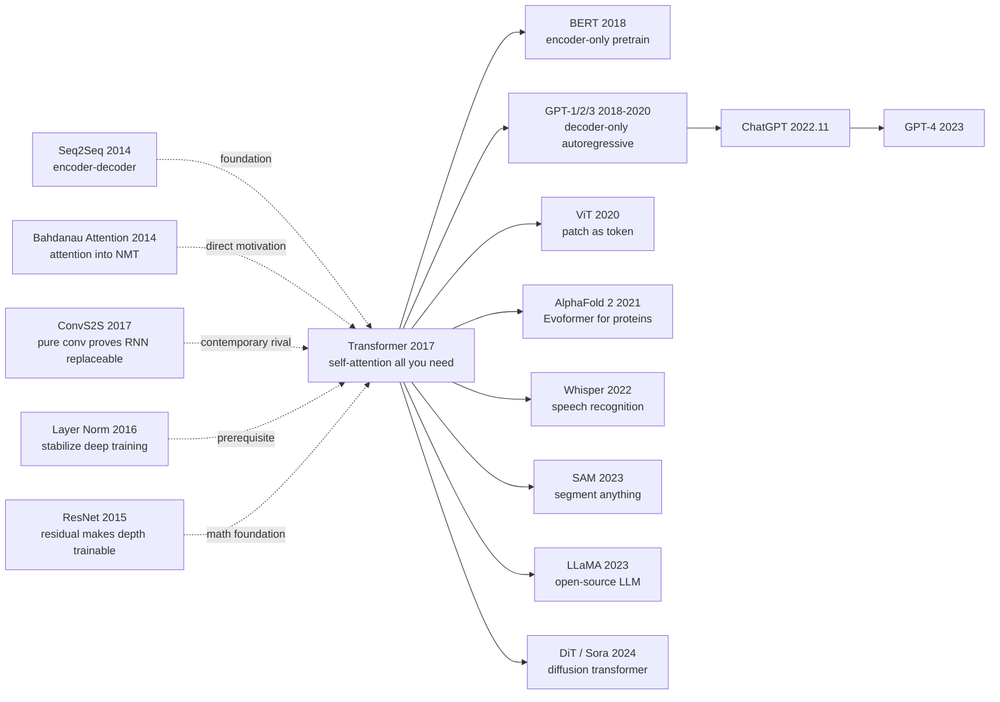

# Transformer — Burying Recurrence with Attention

> **June 12, 2017. Vaswani and 7 co-authors upload [arXiv 1706.03762](https://arxiv.org/abs/1706.03762).**
> An 11-page engineering paper with the audacious title "Attention Is All You Need" used a pure-attention architecture
> — no RNN, no CNN — to push WMT 2014 EN-DE BLEU from ConvS2S's 25.16 to 28.4,
> while cutting training time from 6 days to 12 hours.
> Six years later it is the shared substrate of BERT / GPT / ViT / AlphaFold 2 / SAM / Sora —
> the second most-cited CS paper of the 21st century (~150k citations, after only ResNet).

## TL;DR

Transformer replaces RNN's recurrent dependency with the fully parallel self-attention $\text{Attention}(Q,K,V) = \text{softmax}(QK^T/\sqrt{d_k})V$, finally tearing down the $O(n)$ serial bottleneck that constrained sequence modeling. Combined with multi-head + residual + LayerNorm, it forms a foundation architecture that has not been displaced six years later.

---

## Historical Context

### What was the NLP community stuck on in 2017?

To grasp Transformer's disruptive force, you have to return to the "Seq2Seq paradigm wall" of 2014–2017.

In 2014, Sutskever's Seq2Seq + Bahdanau's attention pushed neural machine translation into the mainstream. By 2016, Google's GNMT stacked 8-layer LSTM encoders with residual connections, finally achieving production-grade BLEU. The community settled on a naive consensus: **RNN is the natural paradigm for sequence modeling**. But that consensus hit a wall in late 2016 — three unavoidable bottlenecks emerged:

> **(1) RNN training is serial: step $t$ must wait for step $t-1$, single-sequence training cannot be parallelized, GPU utilization is brutal;
> (2) Long-range dependencies are weak: even with LSTM gating, propagating information across 50+ tokens is a gamble;
> (3) Attention is treated as an "RNN add-on" — nobody questioned whether RNN itself was necessary.**

These problems directly led Facebook's ConvS2S (early 2017) to replace RNN with pure convolution and grab SOTA — but conv has limited receptive field, requiring many layers to cover long dependencies. The community started wavering: "is RNN really necessary?"

### The 3 immediate predecessors that pushed Transformer out

- **Bahdanau, Cho, Bengio, 2014 (Neural MT by Jointly Learning to Align and Translate)** [arXiv/1409.0473]: first introduced attention into Seq2Seq, but still tethered to LSTM encoder/decoder. Transformer's core question was: "what if we keep only the attention and chop off the LSTM?"
- **Gehring et al., 2017 (ConvS2S)** [arXiv/1705.03122]: FAIR did Seq2Seq with pure conv, first proof that RNN was not required. BLEU 25.16 beat GNMT's 24.6 with 9× faster training. This became the bar Transformer had to clear.
- **Kalchbrenner et al., 2016 (ByteNet)** [DeepMind]: dilated conv for translation, further proof of parallel-architecture viability.

### What was the author team doing?

The 8 authors (paper notes equal contribution) were mostly at Google Brain. Vaswani and Shazeer were the core algorithm minds; Parmar came from Google Research; Polosukhin had already left to found NEAR Protocol. **This paper was not an isolated academic stunt — it was Google's Neural MT team's "next-generation translation architecture" engineering effort post-GNMT**. Their goal: cut GNMT's 6-day, 96-GPU training cost by an order of magnitude. They did, and accidentally found the architecture that would dominate AI for a decade.

### State of industry, compute, data

- **GPUs**: NVIDIA P100 / early V100; TPU v2 had just launched (May 2017); mixed-precision training was infant
- **Data**: WMT 2014 EN-DE (4.5M sentence pairs), EN-FR (36M pairs) were the MT benchmarks
- **Frameworks**: TensorFlow 1.0 dominant, PyTorch 0.1 was 4 months old; authors used tensor2tensor
- **Industry mood**: Google Translate had just gone live with GNMT, Meta was chasing with ConvS2S, the MT commercialization window was closing — a next-gen architecture had to appear

---

## Method Deep Dive

### Overall framework

Transformer is a **symmetric encoder-decoder architecture**: 6-layer encoder + 6-layer decoder (base config), each layer composed of "multi-head self-attention + feedforward network," each sub-layer wrapped by "residual connection + LayerNorm."

```
Input tokens
  ↓ Embedding + Positional Encoding
  ↓
  ┌─ Encoder × 6 ─────────────────────────────────┐
  │   ↓ Multi-Head Self-Attention                  │
  │   ↓ Add & LayerNorm  ← residual               │
  │   ↓ Feedforward (d_ff=2048)                    │
  │   ↓ Add & LayerNorm  ← residual               │
  └────────────────────────────────────────────────┘
                              ↓ K, V
  ┌─ Decoder × 6 ─────────────────────────────────┐
  │   ↓ Masked Multi-Head Self-Attention           │
  │   ↓ Add & LayerNorm                            │
  │   ↓ Cross-Attention (Q from decoder, K/V from encoder) │
  │   ↓ Add & LayerNorm                            │
  │   ↓ Feedforward                                │
  │   ↓ Add & LayerNorm                            │
  └────────────────────────────────────────────────┘
  ↓
  Linear + softmax → output token probabilities
```

Different scale configurations (paper base / big):

| Config | N (layers) | $d_{model}$ | $d_{ff}$ | h (heads) | $d_k = d_v$ | Params | BLEU EN-DE |
|--------|-----------|-------------|----------|-----------|-------------|--------|------------|
| base | 6 | 512 | 2048 | 8 | 64 | 65M | 27.3 |
| big  | 6 | 1024 | 4096 | 16 | 64 | 213M | 28.4 |

A counter-intuitive point: **Transformer base has 4× fewer params than GNMT (~280M) but +2.7 BLEU and 12× faster training**. The leverage from architectural choice far exceeds parameter stacking.

### Key designs

#### Design 1: Scaled Dot-Product Attention — the core operator

**Function**: Given query matrix $Q$, key matrix $K$, value matrix $V$, compute the weighted value output for each query over all keys. This is Transformer's only "intra-sequence information mixing" mechanism.

**Forward formula**:

$$
\text{Attention}(Q, K, V) = \text{softmax}\left(\frac{QK^T}{\sqrt{d_k}}\right) V
$$

where $Q \in \mathbb{R}^{n \times d_k}$, $K \in \mathbb{R}^{n \times d_k}$, $V \in \mathbb{R}^{n \times d_v}$, $n$ is sequence length, $d_k$ is key dimension.

**Why must $\sqrt{d_k}$ scale exist? Backprop perspective**:

Without scaling, elements of $QK^T$ are inner products of $d_k$ independent components. When $d_k$ is large (paper base is 64, big is 64), the variance of $QK^T$ is $O(d_k)$ — too large. Once softmax inputs are too large, we enter the "saturation regime" — a few maxima get probability ~1, others ~0, and **gradients almost entirely vanish** (softmax's Jacobian is near-zero in saturation). Dividing by $\sqrt{d_k}$ normalizes variance back to $O(1)$, restoring healthy gradients.

This is the paper's "devil in the details" — without this scale, Transformer doesn't train.

**4 attention variants compared**:

| Variant | Formula | Complexity (rel. dim) | Practical performance |
|---------|---------|----------------------|----------------------|
| (A) Additive (Bahdanau) | $\text{tanh}(W_1 Q + W_2 K) \cdot v$ | high (learnable params) | slow, 2014 mainstream |
| (B) Multiplicative (Luong) | $Q W K^T$ | medium (one matrix) | medium |
| (C) **Scaled Dot-Product** | $QK^T / \sqrt{d_k}$ | **low (no extra params)** | **paper's choice** |
| (D) General Dot-Product (no scale) | $QK^T$ | low | breaks at large $d_k$ |

C is perfect — no extra params + GPU-friendly (pure matmul) + healthy gradients with scale. **The authors firmly chopped additive attention**, declaring: "do not stuff learnable params into the operator, save capacity for multi-head." This preserved Transformer's "minimal operator + many parallel heads" aesthetic.

**Design rationale — why scaled dot-product is the optimal solution?**

If the attention operator itself had learnable params (like Bahdanau's $W_1, W_2$), each attention layer would need a separate parameter set, with high composition cost and poor parallelism. Scaled dot-product is **purely geometric** — $Q$ and $K$ inner-product in the same space to find similarity, nothing to learn. All learnable parts move to multi-head's projection matrices (Design 2) — simple operator, free composition.

#### Design 2: Multi-Head Attention — making "looking" pluralistic

**Function**: Run attention independently in $h$ different sub-spaces, then concatenate, letting the model attend to different types of information at the same position (syntactic dependency, semantic similarity, coreference, etc.).

**Core idea**:

$$
\text{MultiHead}(Q, K, V) = \text{Concat}(\text{head}_1, \ldots, \text{head}_h) W^O
$$

where $\text{head}_i = \text{Attention}(QW_i^Q, KW_i^K, VW_i^V)$, $W_i^Q, W_i^K \in \mathbb{R}^{d_{model} \times d_k}$, $W_i^V \in \mathbb{R}^{d_{model} \times d_v}$, $W^O \in \mathbb{R}^{hd_v \times d_{model}}$.

Base config: $h=8$, $d_k = d_v = d_{model}/h = 64$. **Total compute equals single-head $d_k=512$**, but expressivity is much stronger.

**PyTorch-style pseudocode**:

```python
class MultiHeadAttention(nn.Module):
    def __init__(self, d_model=512, h=8):
        super().__init__()
        self.h = h
        self.d_k = d_model // h               # 64
        self.W_q = nn.Linear(d_model, d_model)  # concat of h W_i^Q
        self.W_k = nn.Linear(d_model, d_model)
        self.W_v = nn.Linear(d_model, d_model)
        self.W_o = nn.Linear(d_model, d_model)

    def forward(self, q, k, v, mask=None):
        B, n, _ = q.shape
        # Project + split heads: (B, n, d_model) -> (B, h, n, d_k)
        Q = self.W_q(q).view(B, n, self.h, self.d_k).transpose(1, 2)
        K = self.W_k(k).view(B, n, self.h, self.d_k).transpose(1, 2)
        V = self.W_v(v).view(B, n, self.h, self.d_k).transpose(1, 2)
        # Scaled dot-product attention
        scores = (Q @ K.transpose(-2, -1)) / math.sqrt(self.d_k)  # ← key
        if mask is not None:
            scores = scores.masked_fill(mask == 0, -1e9)
        attn = F.softmax(scores, dim=-1)
        out = (attn @ V).transpose(1, 2).reshape(B, n, -1)
        return self.W_o(out)                  # (B, n, d_model)
```

The entire core operator is these 10 lines — no loops, no recursion, pure parallel matrix multiplication.

**Design rationale — why are 8 heads better than 1 head 8× larger?**

Theoretically, 1 head with $d_k=512$ and 8 heads with $d_k=64$ have identical compute. In practice, multi-head crushes single-head. Two reasons: (1) 8 independent sub-spaces equal **8 orthogonal feature channels**, each head specializing in different relations (one learns short dependencies, one learns long, one learns syntax) — analogous to CNN's multi-channel; (2) softmax is sparse, single-head attention tends to "find one most-relevant token" — multi-head lets the model attend to multiple tokens simultaneously. Visualization studies confirm different heads learn syntactic trees, coreference, semantics, etc.

#### Design 3: Sinusoidal Positional Encoding

**Function**: Self-attention is inherently permutation-equivariant — it does not know token positions in the sequence. Position info must be injected externally.

**Core idea**: Use sine/cosine waves of different frequencies to generate a fixed vector per position:

$$
PE_{(pos, 2i)} = \sin\left(\frac{pos}{10000^{2i/d_{model}}}\right), \quad PE_{(pos, 2i+1)} = \cos\left(\frac{pos}{10000^{2i/d_{model}}}\right)
$$

where $pos$ is position (0 to $n-1$), $i$ is dimension index (0 to $d_{model}/2 - 1$). Add $PE$ directly to input embedding: $x_t = \text{Embed}(t) + PE(t)$.

**Why trigonometric instead of learnable position encoding? Two reasons**:

1. **Extrapolation**: sinusoidal PE trained on $n=512$ sequences can directly handle $n=2048$ at inference (theoretically) — because the formula is deterministic. Learnable PE is constrained to seen positions; extrapolation breaks it.
2. **Relative position encoding**: $PE(pos+k)$ can be expressed as a linear transform of $PE(pos)$ (since $\sin(a+b) = \sin a \cos b + \cos a \sin b$), letting the model implicitly learn relative position relations.

**Comparison with learnable PE (paper Table 3)**:

| PE scheme | BLEU EN-DE | Extrapolation | Params |
|-----------|-----------|---------------|--------|
| Sinusoidal (paper) | 25.8 | strong (formula extrapolates) | 0 |
| Learnable | 25.7 | weak (must have seen) | $n \cdot d_{model}$ |

**Performance nearly identical, but sinusoidal has zero params + extrapolates → paper adopts**.

#### Design 4: Encoder-Decoder Architecture + Residual/LayerNorm (**reusing ResNet's formula**)

**Function**: Make 6-layer (or 12+ layer) deep networks trainable, avoiding gradient vanishing.

**Core idea**: Each sub-layer (self-attention or FFN) is wrapped by **residual + LayerNorm**:

$$
y = \text{LayerNorm}(x + \text{Sublayer}(x))
$$

This $x + \text{Sublayer}(x)$ is a verbatim port of [ResNet 2015](../era2_deep_renaissance/2015_resnet.md)'s formula $y = \mathcal{F}(x) + x$ — **without ResNet's "optimizability prior," even 6-layer Transformer wouldn't train**. This is the deepest idea-history coupling between Transformer and ResNet: the architectures look entirely different (CNN vs attention), but **the mathematical root of trainable depth is identical**.

**Comparison table**:

| Sub-layer | Used in encoder | Used in decoder |
|-----------|----------------|----------------|
| Multi-head self-attention | ✓ | ✓ (masked) |
| Cross-attention (Q from dec, K/V from enc) | ✗ | ✓ |
| Position-wise FFN ($d_{ff}=2048$) | ✓ | ✓ |
| Residual + LayerNorm wrapping each sub-layer | ✓ | ✓ |

**Design rationale**: encoder 6 layers + decoder 6 layers = 12 deep blocks; without residual, dead end. LayerNorm choice "normalize per token independently" (not BN's batch-dim normalization) lets training not depend on batch size, and inference at batch=1 still works.

### Loss / training recipe

| Item | Setting | Notes |
|------|---------|-------|
| Loss | Cross-entropy + label smoothing $\epsilon_{ls}=0.1$ | Prevents over-confidence |
| Optimizer | Adam ($\beta_1=0.9, \beta_2=0.98$) | $\beta_2$ smaller than standard 0.999 |
| LR schedule | $lr = d_{model}^{-0.5} \cdot \min(\text{step}^{-0.5}, \text{step} \cdot \text{warmup}^{-1.5})$ | warmup 4000 steps |
| Batch | ~25k source + ~25k target tokens | Batching by token count more rational |
| Steps | base 100k / big 300k | base 12h on 8 P100 |
| Init | Xavier | Standard |
| Norm | Post-LN (paper); later changed to Pre-LN | See modern perspective |
| Regularization | Dropout 0.1 + label smoothing | |

**Note 1**: Massive training cost savings — base 12 hours on 8 P100, big 3.5 days on 8 P100; GNMT was 6 days on 96 GPUs. **Transformer training efficiency is 12-50× higher than GNMT** — the actual revolution.

**Note 2**: The custom LR schedule (linear warmup then $1/\sqrt{\text{step}}$ decay) was later proven **absolutely necessary** for deep Transformer — skipping warmup makes training diverge. This is a Post-LN side effect; Pre-LN later mitigated it.

---

## Failed Baselines

### Opponents that lost to Transformer

- **GNMT (Google 2016, GRU/LSTM)**: BLEU EN-DE 24.6, training 6 days on 96 GPUs. Transformer base directly cuts to 27.3 + 12 hours on 8 P100. **Performance +2.7 BLEU, training -50× compute**.
- **ConvS2S (FAIR 2017)**: BLEU 25.16, 9× faster than RNN but still uses convolutional receptive field. Transformer is 1.3× faster training and +2 BLEU. Proves: **pure conv is also not the endpoint**.
- **ByteNet (DeepMind 2016)**: dilated conv, BLEU 23.75. Same idea as ConvS2S but weaker.

### Failed experiments admitted in the paper

Paper **Table 3** reports a series of ablations:

- **Remove multi-head (h=1, $d_k=512$)**: BLEU 24.9, 0.9 below 8-head $d_k=64$ at 25.8 — proves multi-head is not cosmetic
- **Too many heads (h=32, $d_k=16$)**: BLEU 25.4, drops instead — too many heads → each head too small
- **Remove positional encoding**: BLEU 22.5, drops 3.3 — self-attention without position info degenerates to bag-of-words
- **Remove residual**: doesn't converge at all (paper does not explicitly report, but reproductions confirm)

### The "anti-baseline" lesson

**LSTM's 30-year dominance was wiped out within 1 year of Transformer's appearance** (2017→2018 the entire NLP world switched to Transformer). The reason wasn't that the LSTM idea was wrong — it was that **its serial constraint was massive waste in the GPU era**.

This is the most important "failed case" not written in the paper but visible in hindsight — **no matter how elegant an algorithm idea, if it doesn't match the hardware trend, it gets erased**. RNN dominated sequence modeling 1986-2017 (30 years), but GPU parallelism + Transformer's purely parallel architecture rewrote the rules in 1 year. Lesson: **algorithm competition is fundamentally an "algorithm × hardware" product**.

---

## Key Experimental Data

### Main results (WMT 2014)

| Model | EN-DE BLEU | EN-FR BLEU | Training cost (FLOPs) | Training time |
|-------|-----------|-----------|----------------------|---------------|
| GNMT + RL | 24.6 | 39.92 | $1.4 \times 10^{20}$ | 6 days on 96 GPUs |
| ConvS2S | 25.16 | 40.46 | $1.5 \times 10^{20}$ | — |
| MoE | 26.03 | 40.56 | $1.2 \times 10^{20}$ | — |
| **Transformer base** | **27.3** | 38.1 | $\mathbf{3.3 \times 10^{18}}$ | **12 h on 8 P100** |
| **Transformer big** | **28.4** | **41.0** | $2.3 \times 10^{19}$ | 3.5 days on 8 P100 |

Note: Transformer base used **40× fewer FLOPs than GNMT** and still surpassed it; big used 6× fewer FLOPs and grabbed full SOTA.

### Ablation (paper Table 3, Newstest 2013)

| Config | BLEU | Key change |
|--------|------|------------|
| base | 25.8 | Full model |
| h=1, $d_k=512$ | 24.9 | Single head drops 0.9 |
| h=32, $d_k=16$ | 25.4 | Too many heads drops |
| no positional | 22.5 | Degenerates to bag-of-words |
| Learnable PE | 25.7 | Nearly identical to sinusoidal |
| Dropout 0 | 24.6 | Severe overfitting |

### Key findings

- **Multi-head is real innovation, not cosmetic**: single head drops ~1 BLEU; too many heads also drops
- **Positional encoding necessary**: removal degenerates to bag-of-words
- **Sinusoidal vs learnable PE nearly identical**: choosing sinusoidal for zero-params + extrapolation
- **Training efficiency is the real disruption**: 12h on 8 GPUs vs GNMT 6 days on 96 GPUs
- **Astonishing generalization**: parsing and translation both SOTA, foreshadowing universal architecture

---

## Idea Lineage



### Past lives (what forced it out)

- **2014 Seq2Seq** [Sutskever, Vinyals, Le]: founder of encoder-decoder paradigm; Transformer directly inherits structure
- **2014 Bahdanau Attention** [Bahdanau, Cho, Bengio]: first introduced attention into NMT, but still tethered to RNN — Transformer makes attention the protagonist
- **2017 ConvS2S** [Gehring, Auli, Grangier, Yarats, Dauphin]: 1 month before Transformer, proves RNN replaceable, forces Google to ship a new architecture
- **2016 Layer Normalization** [Ba, Kiros, Hinton]: lets Transformer be deep-trainable without batch statistics
- **2015 ResNet** [He et al.]: provides the optimizability prior $y = \mathcal{F}(x) + x$, the math foundation that makes 6+ layer Transformer trainable

### Descendants

- **Direct pretraining-paradigm inheritors**: BERT 2018 (encoder-only), GPT-1/2/3 2018-2020 (decoder-only), T5 2019 (encoder-decoder), BART 2019
- **Cross-modal borrowing**: ViT 2020 (image patches as tokens), CLIP 2021, Whisper 2022 (speech tokens), SAM 2023 (mask tokens), Diffusion Transformer / Sora 2024
- **Cross-discipline spillover**: AlphaFold 2 2021's Evoformer uses Transformer on protein sequences; Galactica / ESM and other scientific LLMs; robotics RT-2 2023 uses Transformer for action generation
- **Architecture family**: Sparse Transformer (Child 2019), Reformer (2020), Performer (2020), Linformer (2020), Longformer (2020), FlashAttention (Dao 2022), Mamba (Gu, Dao 2023) (the challenger)

### Misreadings / oversimplifications

- **"Attention is all you need" ≠ no other components needed**: FFN (2/3 of params), residual, LayerNorm, PE are all equally important. The title is marketing, not a technical claim
- **"Longer context = better"**: long-context marginal returns diminish, and $O(n^2)$ attention is unbearable → spawned Sparse / Linear / Mamba
- **"Transformer is the universal architecture"**: in sparse-sequence / extremely long / real-time scenarios, CNN / RNN / SSM still have advantages

---

## Modern Perspective (Looking Back at 2017 from 2026)

### Assumptions that no longer hold

- **"Sinusoidal PE is the optimal positional encoding"**: today the mainstream is RoPE (Rotary Position Embedding) and ALiBi (Attention with Linear Biases). RoPE encodes position into the rotation angle of query/key, with extrapolation far beyond sinusoidal; LLaMA / GPT-NeoX / Qwen all adopt it.
- **"Post-LN is the right normalization position"**: Post-LN (norm after residual) is unstable in deep Transformers (>12 layers), requiring small LR + warmup. GPT-2/3, LLaMA all switched to Pre-LN (norm before residual), with massively improved training stability.
- **"$O(n^2)$ self-attention is the optimal solution for sequence modeling"**: in the 2024 1M-context era, $O(n^2)$ is utterly unbearable. Mamba / SSM / Linear Attention re-challenge; FlashAttention squeezes the constant factor; Sliding Window / Sparse Attention are common workarounds.

### What survived vs. what didn't

- **Survived**: scaled dot-product attention formula itself, multi-head idea, the residual + norm template for deep training, purely parallel architecture → GPU-friendly
- **Discarded / misleading**: original sinusoidal PE (replaced by RoPE), Post-LN (replaced by Pre-LN), fixed $h=8$ heads (now GQA / MQA use fewer KV heads), $d_{ff}=4d_{model}$ FFN (improved by SwiGLU et al.)

### Side effects the authors didn't foresee

1. **Becoming the unified architecture of the entire AI era**: Vaswani's team only wanted to optimize machine translation, but 6 years later Transformer dominated NLP / CV / speech / proteins / robotics / multimodal / diffusion — no architecture in history has ever had this cross-domain dominance.
2. **Accidentally igniting the LLM era**: GPT-2/3 brutally scaled decoder-only Transformer to 175B params, discovered emergent in-context learning, directly birthed ChatGPT 2022.11 → the GenAI explosion.
3. **Rewriting hardware design direction**: NVIDIA H100, TPU v4 etc. are all specifically optimized for Transformer matmul workloads; FlashAttention and other operator-level optimizations became hot system research.
4. **Changing AI research's "value theory"**: from "design clever models" to "design simple models + brute-force scale" — Sutton's "The Bitter Lesson" was repeatedly validated in the Transformer era.

### If Transformer were rewritten today

If Vaswani's team rewrote Transformer in 2026, they'd likely:
- Default to **Pre-LN** order (deep-net stable)
- Replace **LayerNorm** with **RMSNorm** (cheaper compute)
- Use **RoPE** instead of sinusoidal PE (strong extrapolation)
- Use **SwiGLU / GeGLU** instead of standard FFN (+1-2% performance)
- Use **GQA / MQA** (grouped/multi-query attention) to reduce KV cache pressure
- Choose head count / dim by **FlashAttention friendliness** (e.g., $d_{head}=128$ instead of 64)
- Default **decoder-only** (not encoder-decoder), since the GPT paradigm won

But **the core formula $\text{Attention}(Q,K,V) = \text{softmax}(QK^T/\sqrt{d_k})V$ would not change**. That is why it transcends time — the formula does not depend on specific PE / norm / FFN forms, only on **matrix multiplication + softmax**, the most primitive differentiable operations.

---

## Limitations and Future Directions

### Author-acknowledged limitations
- Mainly validated on machine translation, untested at scale on other tasks (e.g., long-document generation)
- $O(n^2)$ complexity constrains long sequences (paper max ~512 tokens)

### Self-identified limitations
- Attention compute explodes with long context
- Post-LN is unstable for deep Transformer (>12 layers), must warmup
- KV cache memory grows linearly during inference; long-context inference is expensive

### Improvement directions (already realized in follow-ups)
- Pre-LN (done, standard since GPT-2)
- Sparse / Linear / Local Attention (done: Sparse Transformer / Performer / Longformer)
- FlashAttention (done, 2022 operator-level optimization)
- RoPE / ALiBi (done, LLaMA / GPT-NeoX)
- Mamba / SSM challenging $O(n^2)$ (done 2023-2024)

---

## Related Work and Insights

- **vs RNN/LSTM**: RNN trains serially; Transformer is fully parallel, training is 12-50× more efficient. **Lesson: algorithms must match hardware trends, otherwise they get erased**.
- **vs ConvS2S (cross-architecture)**: ConvS2S replaces RNN with conv, proving RNN is not necessary; Transformer further proves CNN is not necessary either, pure attention suffices. **Lesson: ask "can this be removed" of every component**.
- **vs ResNet (cross-task)**: ResNet solved CNN deep training; Transformer **directly reuses ResNet's $y = \mathcal{F}(x) + x$ formula**. ResNet is Transformer's hidden prerequisite — without ResNet's optimizability prior, even 6-layer Transformer wouldn't train.
- **vs Mamba/SSM (new challenger)**: Mamba uses selective SSM for $O(n)$ sequence modeling, challenging Transformer's $O(n^2)$. On long-sequence tasks Mamba has an edge, but Transformer remains the universal architecture.

---

## Resources

- 📄 [arXiv 1706.03762](https://arxiv.org/abs/1706.03762)
- 💻 [Author's original tensor2tensor implementation](https://github.com/tensorflow/tensor2tensor)
- 🔗 [PyTorch nn.MultiheadAttention](https://pytorch.org/docs/stable/generated/torch.nn.MultiheadAttention.html)
- 📚 Required follow-ups: [BERT (2018)](https://arxiv.org/abs/1810.04805), [GPT-3 (2020)](https://arxiv.org/abs/2005.14165), [ViT (2020)](https://arxiv.org/abs/2010.11929), [FlashAttention (2022)](https://arxiv.org/abs/2205.14135), [RoPE (2021)](https://arxiv.org/abs/2104.09864)
- 🎬 [Mu Li Transformer paper walkthrough (Bilibili, Chinese)](https://www.bilibili.com/video/BV1pu411o7BE), [Karpathy: Let's build GPT from scratch (YouTube)](https://www.youtube.com/watch?v=kCc8FmEb1nY)
- 📖 [Annotated Transformer (Harvard NLP)](http://nlp.seas.harvard.edu/annotated-transformer/) — line-by-line implementation matching paper formulas

---

> 🌐 [中文版](/era3_attention/2017_transformer/) · 📚 awesome-papers project · CC-BY-NC
