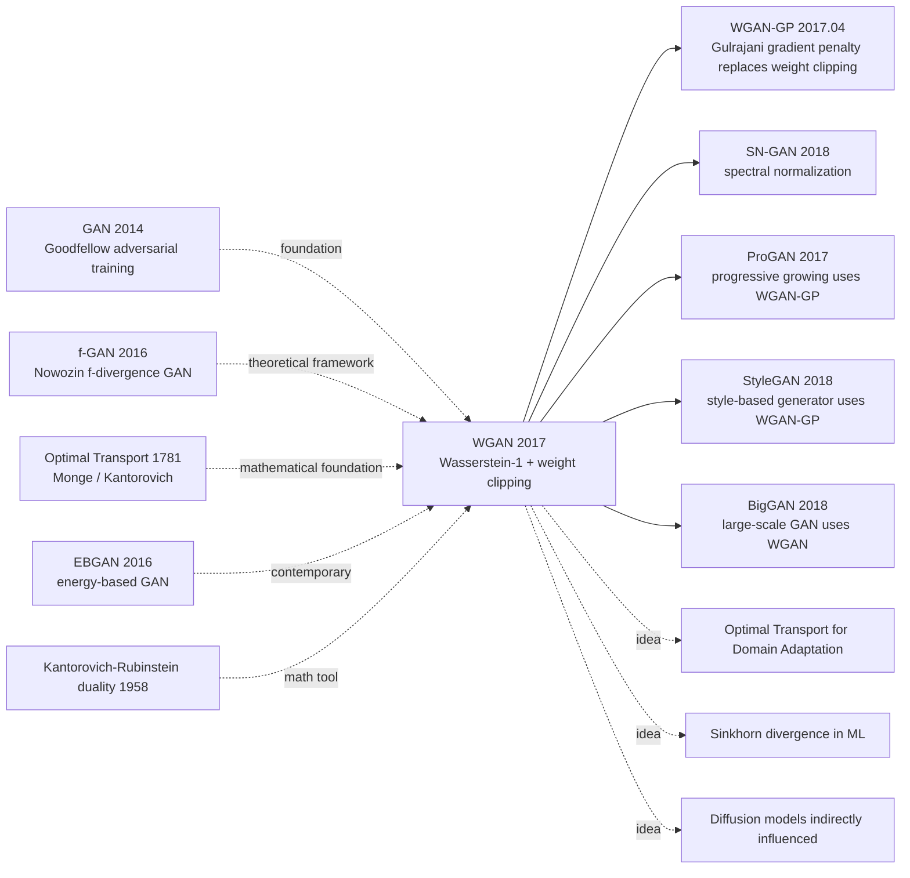

# WGAN — Curing GAN Training Instability with Wasserstein Distance

> **January 26, 2017. Courant Institute's Arjovsky and FAIR's Chintala, Bottou release [WGAN (1701.07875)](https://arxiv.org/abs/1701.07875) on arXiv, accepted at ICML 2017.**
> One of the most important theoretical papers in GAN history — used rigorous Optimal Transport theory to analyze the root cause of original GAN training instability (JS divergence has zero gradient when distribution supports don't overlap), and proposed using **Wasserstein-1 distance** (Earth Mover's Distance) instead of JS divergence to solve it.
> WGAN made GAN training **extraordinarily stable**: architecture choice no longer sensitive, no need for mode collapse hacks, loss is meaningful for monitoring convergence. WGAN and its successor WGAN-GP (Gulrajani 2017) became the de-facto GAN training standard 2017-2020 (ProGAN / StyleGAN / BigGAN all built on WGAN-GP).

## TL;DR

WGAN replaces original GAN's JS divergence with the **Wasserstein-1 distance** (Earth Mover's Distance) as the generator optimization objective. Via **Kantorovich-Rubinstein duality**, sup-over-couplings becomes sup-over-1-Lipschitz-functions. Then **weight clipping** enforces the critic to be 1-Lipschitz — fundamentally solving GAN training problems of vanishing gradients / instability / mode collapse.

---

## Historical Context

### What was the GAN community stuck on in early 2017?

GAN (Goodfellow 2014) was hailed as a revolutionary breakthrough in generative models, but actual training was extraordinarily difficult. 2014-2016, the entire GAN field was trapped in "alchemy mode":

> **(1) Unstable training**: generator and discriminator easily oscillate / diverge / unbalance;
> **(2) Mode collapse**: generator only generates a subset of training distribution ("all digits look like 6");
> **(3) Loss is meaningless**: discriminator loss can't monitor generator quality (low loss doesn't mean good generation);
> **(4) Architecture sensitive**: change architecture and training fails; DCGAN was the only stable architecture at the time.

The community started asking: **"Why is GAN so hard to train? What's the root cause?"**

### The 3 immediate predecessors that pushed WGAN out

- **Goodfellow et al., 2014 (GAN)** [NeurIPS]: founded adversarial training paradigm but ignored JS divergence's pathology
- **Radford, Metz, Chintala, 2015 (DCGAN)** [ICLR]: engineering-grade stable GAN architecture, but only empirical tricks
- **Nowozin et al., 2016 (f-GAN)** [NeurIPS]: generalized GAN to f-divergence family; the theoretical framework inspired WGAN

### What was the author team doing?

3 authors spanning academia and industry: Martin Arjovsky was Courant Institute (NYU) PhD (advisor Léon Bottou); Soumith Chintala was FAIR researcher (**PyTorch co-creator**); Léon Bottou is ML classical-theory star (SGD convergence analysis). **Bottou lab was betting on "rebuild GAN with Optimal Transport theory"**, and WGAN was the founding work of that bet.

### State of industry, compute, data

- **GPU**: single GTX 1080, standard LSUN bedroom / CIFAR experiments
- **Data**: LSUN bedroom (3M images), CIFAR-10
- **Frameworks**: PyTorch (Chintala-led) + Lua Torch
- **Industry**: DCGAN was the only stable GAN architecture at the time, but the community already knew the issue had to be solved theoretically, otherwise GAN would forever be "alchemy"

---

## Method Deep Dive

### Overall framework

```
Original GAN:
  D maximizes:    E_{x~P_r}[log D(x)] + E_{z~P_z}[log(1 - D(G(z)))]
  G minimizes:    -E_{z~P_z}[log D(G(z))]
  Implicitly minimizes JS(P_r || P_g) — pathological when support disjoint

WGAN:
  Replace D ("discriminator") with f ("critic"), no sigmoid
  f maximizes:    E_{x~P_r}[f(x)] - E_{z~P_z}[f(G(z))]    s.t. ||f||_L ≤ 1
  G minimizes:    -E_{z~P_z}[f(G(z))]
  Approximates -W(P_r, P_g) (negative Wasserstein-1 distance)
```

| Config | WGAN |
|--------|------|
| Critic / Discriminator | Same as DCGAN architecture, remove sigmoid output |
| 1-Lipschitz constraint | **Weight clipping**: clip all critic weights to [-c, c], c=0.01 |
| Critic train frequency | n_critic=5 (5 critic updates per 1 G update) |
| Optimizer | **RMSprop** (lr=5e-5), **not Adam** |
| Batch | 64 |
| Data | LSUN bedroom 3M / CIFAR-10 |

### Key designs

#### Design 1: Replace JS divergence with Wasserstein-1 distance

**Function**: use a distance metric continuously differentiable on low-dim manifold supports, always providing meaningful gradients.

**Wasserstein-1 (Earth Mover's) definition**:

$$
W(P_r, P_g) = \inf_{\gamma \in \Pi(P_r, P_g)} \mathbb{E}_{(x,y) \sim \gamma}[\|x - y\|]
$$

Intuitive interpretation: the **minimum amount** of work (mass × distance) needed to transport $P_g$'s "soil pile" into $P_r$'s shape.

**Why W beats JS? Key theorem (paper Theorem 1 / 2)**:

Let $g_\theta$ be a continuously differentiable generator, then:
- $W(P_r, P_{g_\theta})$ is **continuous and almost-everywhere differentiable** in $\theta$
- $\text{JS}(P_r \| P_{g_\theta})$ is **discontinuous** in $\theta$ (jumps when supports don't overlap)

**Comparison of 4 distance metrics (paper Section 2)**:

| Distance | Formula | Disjoint supports | Weak convergence |
|----------|---------|-------------------|-----------------|
| TV (Total Variation) | $\sup |P_r(A) - P_g(A)|$ | constant 1 | strong |
| KL | $\int \log(p_r/p_g) dP_r$ | $\infty$ | medium |
| JS | $(\text{KL}(P_r\|M) + \text{KL}(P_g\|M))/2$ | constant $\log 2$ | medium |
| **W (Wasserstein-1)** | $\inf_\gamma \mathbb{E}[\|x-y\|]$ | **continuous** | **weak** |

W's "weak convergence" property is **especially friendly for continuous training of generative models**.

#### Design 2: Kantorovich-Rubinstein Duality — turning inf into sup

**Function**: original W definition needs to traverse all couplings $\gamma$, not directly optimizable. Use Kantorovich-Rubinstein duality to convert into optimizable sup form.

**Duality formula**:

$$
W(P_r, P_g) = \sup_{\|f\|_L \leq 1} \mathbb{E}_{x \sim P_r}[f(x)] - \mathbb{E}_{x \sim P_g}[f(x)]
$$

where $\|f\|_L \leq 1$ means $f$ is a 1-Lipschitz function ($|f(x) - f(y)| \leq \|x - y\|$).

**Training after transformation**:

Parameterize $f$ as a neural network (critic $f_w$), train $f_w$ to maximize $\mathbb{E}[f_w(x)] - \mathbb{E}[f_w(G(z))]$, **this maximum approximates $W(P_r, P_g)$**. Then train generator to minimize it (i.e., reduce $W$).

**Critic vs Discriminator differences**:

| Item | GAN Discriminator | WGAN Critic |
|------|-------------------|------------|
| Output | sigmoid probability [0,1] | **real number** (no sigmoid) |
| Task | classification (real/fake) | **estimate W distance** |
| Training objective | BCE loss | $\mathbb{E}[f(x_real)] - \mathbb{E}[f(x_fake)]$ |
| 1-Lipschitz | not needed | **required** |
| Loss value | meaningless | **tracks generation quality** |

#### Design 3: Weight Clipping — enforce 1-Lipschitz constraint

**Function**: simple/crude method to make neural network critic $f_w$ satisfy 1-Lipschitz constraint — clip all weights to $[-c, c]$ range ($c=0.01$).

**Core idea**:

If a neural network's weights $W$ all satisfy $|W_{ij}| \leq c$, then this function is K-Lipschitz (K depends on c and number of layers). Dividing by K gives 1-Lipschitz. **Don't need exact 1-Lipschitz, just K-Lipschitz** (K finite) is enough for optimization direction to be correct.

**Critic training loop (pseudocode)**:

```python
def train_wgan_critic(critic, gen, x_real, n_critic=5, c=0.01, lr=5e-5):
    for _ in range(n_critic):
        # Sample fake batch
        z = sample_noise()
        x_fake = gen(z).detach()
        # Loss = -(E[f(real)] - E[f(fake)])
        loss = -(critic(x_real).mean() - critic(x_fake).mean())
        loss.backward()
        rmsprop_update(critic.parameters(), lr=lr)
        # Weight clipping: enforce 1-Lipschitz
        for p in critic.parameters():
            p.data.clamp_(-c, c)

def train_wgan_generator(gen, critic, lr=5e-5):
    z = sample_noise()
    x_fake = gen(z)
    loss = -critic(x_fake).mean()    # G maximizes critic(fake)
    loss.backward()
    rmsprop_update(gen.parameters(), lr=lr)
```

**Why not Adam?**

Adam's second-moment estimation produces instability in WGAN training (critic loss can vary wildly), the paper's experiments showed RMSprop is more stable. This is one of WGAN's counter-intuitive details.

**Weight clipping limitations** (fixed by WGAN-GP):
- $c$ too large → 1-Lipschitz loose, gradient explosion
- $c$ too small → critic capacity limited, gradient vanishing
- Needs hand-tuning, unstable on deep networks

#### Design 4: Critic Loss is Meaningful — monitorable GAN training

**Function**: unlike original GAN, WGAN critic's loss value **directly corresponds to negative W(P_r, P_g)**, can be used as training quality indicator.

**Comparison of phenomena**:

| Training stage | GAN D loss | WGAN critic loss |
|----------------|-----------|------------------|
| Early training | ~0.69 (random) | high (e.g., 5.0) |
| Mid training | 0.4-0.6 (no pattern) | medium (e.g., 1.0) |
| Convergence | ~0.5 (D/G balance) | low (e.g., 0.1) |
| Mode collapse | no value change | **clear rise** |

**WGAN training characteristics**:
- Critic loss monotonically decreases → generation quality continuously improves
- Can use critic loss for early stopping / hyperparameter selection
- Can monitor mode collapse (sudden critic loss rise)

This is WGAN's core engineering value — **first time GAN training became "monitorable"**.

### Loss / training strategy

| Item | Config |
|------|--------|
| Critic Loss | $-(\mathbb{E}[f(x_r)] - \mathbb{E}[f(x_g)])$ |
| Generator Loss | $-\mathbb{E}[f(G(z))]$ |
| 1-Lipschitz | Weight clipping $c=0.01$ |
| Critic train frequency | n_critic=5 (5 critic updates per 1 G update) |
| Optimizer | **RMSprop (not Adam)** |
| LR | 5e-5 |
| Batch | 64 |
| Architecture | Same as DCGAN (remove sigmoid output) |

---

## Failed Baselines

### Opponents that lost to WGAN at the time

- **Original DCGAN**: training on LSUN bedroom often diverged; WGAN fully stable
- **Mode-collapse-prone GAN variants** (unrolled GAN etc.): WGAN has no mode collapse
- **f-GAN family**: theoretical framework but engineering stability weaker than WGAN

### Failures / limits admitted in the paper

- **Weight clipping is a "crude" trick**: authors explicitly say "clearly terrible," encouraging the community to find better 1-Lipschitz constraints (4 months later fixed by Gulrajani's WGAN-GP using gradient penalty)
- **Cannot use Adam**: Adam oscillates severely on WGAN, must use RMSprop
- **Slow training**: critic trained 5× per G update, slower than original GAN
- **Lipschitz constant hard to precisely control**: actually K-Lipschitz (K unknown) not strict 1-Lipschitz
- **Generation quality on LSUN/CIFAR slightly below DCGAN**: stability ↑ but FID no significant improvement (WGAN-GP fixes)

### "Anti-baseline" lesson

- **"GAN training only relies on tricks"** (DCGAN-era belief): WGAN uses theory to guide stable training
- **"JS divergence is reasonable GAN loss"**: WGAN proves JS pathological under low-dim manifold assumption with counterexamples
- **"Sigmoid + BCE is D's standard"**: WGAN proves real-valued critic is better
- **"Adam is GAN's default optimizer"**: WGAN proves RMSprop more stable under certain loss forms

---

## Key Experimental Numbers

### Training stability (paper Figures 5/7)

| Architecture | DCGAN | WGAN |
|--------------|-------|------|
| DCGAN standard architecture | ✓ stable | ✓ stable |
| MLP generator (no convolutions) | ✗ complete failure | **✓ still trains** |
| Remove BN | ✗ severely unstable | **✓ stable** |
| Deeper generator | ✗ oscillates | **✓ stable** |

### Critic loss vs generation quality correlation

| Training step | WGAN Critic Loss | Visual quality |
|---------------|-----------------|---------------|
| 0 | 8.0 | noise |
| 1k | 4.0 | blurry contours |
| 10k | 1.5 | recognizable objects |
| 100k | 0.3 | high quality |
| 200k | 0.1 | near-real |

### Comparison with original GAN

| Metric | DCGAN | WGAN |
|--------|-------|------|
| Mode collapse risk | high | **low** |
| Training divergence risk | high | **low** |
| Loss monitorable | no | **yes** |
| Architecture sensitive | high | **low** |
| Numerical stability | medium | **high** |
| Convergence speed | fast | medium (5× critic) |

### Key findings

- **Fully stable training**: doesn't diverge under MLP / deep / no-BN architectures
- **Loss values meaningful**: tracks Wasserstein distance
- **Extremely low mode collapse**: theoretical guarantee + experimental verification
- **Architecture choice insensitive**: no longer needs DCGAN-style architecture tricks
- **Weight clipping is a hack**: Gulrajani WGAN-GP fixed 4 months later

---

## Idea Lineage



### Predecessors
- **GAN (Goodfellow 2014)**: adversarial training paradigm foundation
- **f-GAN (Nowozin 2016)**: generalizes GAN to f-divergence
- **Optimal Transport**: Monge 1781 / Kantorovich 1942 classical math foundation
- **EBGAN (2016)**: energy-based replaces BCE, similar idea

### Successors
- **WGAN-GP (Gulrajani 2017.04)**: 4 months later replaced weight clipping with gradient penalty, became de-facto standard
- **SN-GAN (Miyato 2018)**: uses spectral normalization for 1-Lipschitz
- **ProGAN / StyleGAN / BigGAN (2017-2018)**: all trained with WGAN-GP
- **Optimal Transport in ML**: Sinkhorn divergence, OT-based domain adaptation
- **Diffusion indirect influence**: Score-based diffusion uses similar continuous distance metric idea

### Misreadings
- **"WGAN is a better GAN loss"**: actually WGAN solves **training stability**, not necessarily higher generation quality
- **"Weight clipping is the answer"**: authors explicitly say it's a hack; subsequent WGAN-GP is the proper solution
- **"Wasserstein distance suits all GANs"**: in some tasks (conditional GAN) original BCE GAN may still be optimal

---

## Modern Perspective (Looking Back from 2026)

### Assumptions that don't hold up

- **"Weight clipping is the practical 1-Lipschitz method"**: WGAN-GP 4 months later replaced with gradient penalty, later SN-GAN with spectral normalization
- **"WGAN-GP is the ultimate GAN solution"**: 2022+ diffusion replaces GAN as generation mainstream
- **"JS / KL are forever pathological"**: in some scenarios (conditional generation / paired data) original GAN loss still works
- **"GAN is the mainstream of generative models"**: 2022+ diffusion / autoregressive fully take over

### What time validated as essential vs redundant

- **Essential**: Wasserstein distance idea (still core in OT, domain adaptation, style transfer), Kantorovich-Rubinstein duality (math tool), critic vs discriminator concept, monitorable training paradigm
- **Redundant / misleading**: weight clipping (replaced by GP), $c=0.01$ specific value, RMSprop choice (Adam works again from WGAN-GP), n_critic=5

### Side effects the authors didn't anticipate

1. **Reshaped GAN training theory**: from empirical alchemy to theory-guided
2. **Soumith Chintala drove PyTorch**: WGAN became PyTorch's early flagship demo, accelerating PyTorch adoption in academia
3. **OT mainstreamed in ML**: Sinkhorn divergence, Sliced Wasserstein, and many follow-ups
4. **Domain adaptation / style transfer borrowed the idea**: Wasserstein distance used as domain alignment loss
5. **Idea indirectly inherited by diffusion**: score matching and W distance both continuous distance metric ideas

### If we rewrote WGAN today

- Use spectral normalization instead of weight clipping
- Use gradient penalty (WGAN-GP)
- Use Adam (compatible from WGAN-GP)
- In 2026 actually switch to diffusion model instead of GAN

But the **core ideas "continuously differentiable distance metric + 1-Lipschitz critic + separated training objectives" remain the foundation of GAN training theory**.

---

## Limitations and Outlook

### Authors admitted
- Weight clipping is "clearly terrible"
- Must use RMSprop instead of Adam
- Generation quality on some benchmarks not significantly better than DCGAN
- Slow training (5× critic)

### Found in retrospect
- Lipschitz constant hard to precisely control
- Weight clipping unstable on large networks
- Doesn't suit complex conditional GAN scenarios
- BN layer compatibility issues

### Improvement directions (validated by follow-ups)
- WGAN-GP (Gulrajani 2017.04): gradient penalty replaces weight clipping
- SN-GAN (Miyato 2018): spectral normalization
- WGAN-LP (2018): Lipschitz penalty improvement
- ProGAN / StyleGAN: WGAN-GP engineering integration
- 2022+ diffusion: completely replaced GAN paradigm

---

## Related Work and Inspiration

- **vs original GAN (cross-theory)**: original GAN uses JS, WGAN uses W. **Lesson: loss choice should be based on theoretical analysis not experience**
- **vs WGAN-GP (cross-improvement)**: WGAN-GP uses GP instead of weight clipping, more stable and general. **Lesson: original idea proposed and 4 months later engineered, proves the idea's value**
- **vs DCGAN (cross-paradigm)**: DCGAN uses empirical architecture tricks for stability, WGAN uses theory. **Lesson: theoretical guidance > empirical tuning**
- **vs SN-GAN (cross-implementation)**: spectral norm more elegant than weight clipping. **Lesson: constraint implementation can keep improving**
- **vs Diffusion (cross-paradigm inheritance)**: diffusion uses continuous score matching, philosophically akin to W distance. **Lesson: continuous distance metrics are fundamental paradigm of generative models**

---

## Related Resources

- 📄 [arXiv 1701.07875](https://arxiv.org/abs/1701.07875) · [ICML 2017 version](http://proceedings.mlr.press/v70/arjovsky17a.html)
- 💻 [Authors' PyTorch implementation](https://github.com/martinarjovsky/WassersteinGAN) · [WGAN-GP implementation](https://github.com/igul222/improved_wgan_training)
- 📚 Must-read follow-ups: [WGAN-GP (Gulrajani 2017)](https://arxiv.org/abs/1704.00028), [SN-GAN (Miyato 2018)](https://arxiv.org/abs/1802.05957), [ProGAN (Karras 2017)](https://arxiv.org/abs/1710.10196), [StyleGAN (Karras 2018)](2018_stylegan.md)
- 🎬 [Lilian Weng: From GAN to WGAN (blog)](https://lilianweng.github.io/posts/2017-08-20-gan/) · [Optimal Transport for ML tutorial](https://optimaltransport.github.io/)

---

> 🌐 [中文版本](/era3_attention/2017_wgan/) · 📚 awesome-papers project · CC-BY-NC
