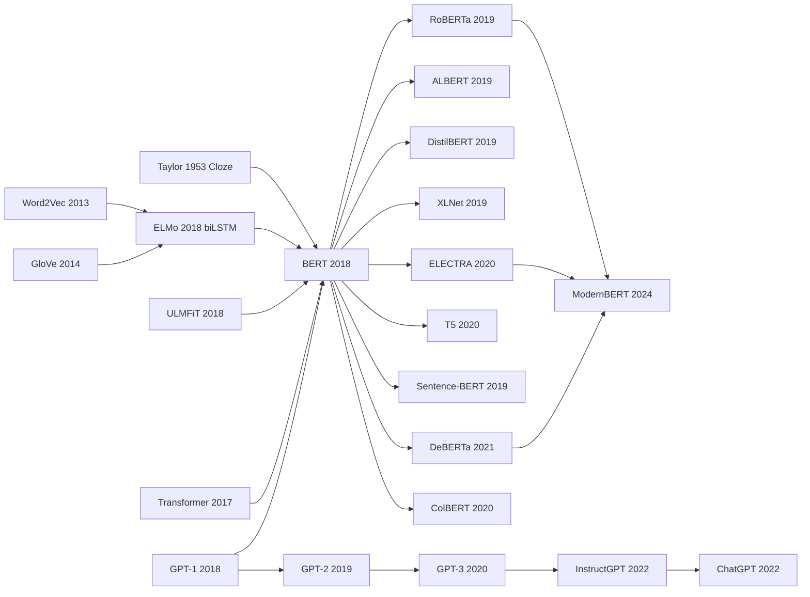

# BERT — Ushering NLP into the Pretraining Era via Masked Language Modeling

> **October 11, 2018. Devlin, Chang, Lee, Toutanova at Google AI Language upload [arXiv 1810.04805](https://arxiv.org/abs/1810.04805); won NAACL Best Paper Award in June 2019.**
> The paper that lifted [Transformer (2017)](2017_transformer.md)'s encoder out and pretrained it with **Masked Language Modeling (MLM) + Next Sentence Prediction (NSP)** — pushing GLUE from [ELMo (2018)](2018_elmo.md)'s 71.0 to 80.5, and for the first time letting a model **surpass humans on SQuAD 1.1 / 2.0** while sweeping all 11 NLU benchmarks.
> Within 12 months Google deployed BERT into its search engine (affecting ~10% of all queries globally); from 2018-2020, almost every NLP paper was either a BERT variant or a BERT application — RoBERTa / ALBERT / DistilBERT / SpanBERT / ELECTRA, 100+ derivatives.
> Four years later, decoder-only GPT-3 / ChatGPT stole the spotlight, **but BERT remains the de facto industrial standard for retrieval / classification / NER**, and the "pretrain + fine-tune" paradigm it codified defines an entire decade of NLP.

## TL;DR

Devlin et al.'s 2018 NAACL Best Paper used a deceptively wasteful training objective — **Masked Language Modeling**, which randomly masks 15% of tokens and asks the model to recover them via $P(x_i \mid x_{\setminus i})$ — to elegantly bypass the "bidirectional LMs cheat by seeing the future" dead end, letting Transformers achieve **deep bidirectional encoding** for the first time: every token simultaneously sees its left and right context. With a lightweight Next Sentence Prediction auxiliary task and BookCorpus + Wikipedia (3.3B tokens) for pretraining, BERT **swept SOTA on 11 NLP tasks at once** — the GLUE average jumped from [GPT-1 (2018)](2018_gpt1.md)'s 70.0 to **82.1 (+12.1)**, SQuAD v1.1 F1 climbed to **93.2**, and SWAG leapt by **+27.1 points** — a clean sweep with virtually no precedent in NLP history. From that day on, "pretrain + fine-tune" replaced "train one model from scratch per task" as the standard NLP recipe. But BERT's victory was locally correct: at 110M-340M parameters and 3B tokens, bidirectional really does win; once budgets are loosened by 100×, however, unidirectional LM's scalability + zero-shot ability + generative interface flip the verdict — four years later [GPT-3 (2020)](../era4_foundation_models/2020_gpt3.md) used pure unidirectional + scale to grind the entire BERT lineage into the ground. **BERT taught the world that "pretrain + fine-tune" is the right answer for NLP — but its specific "bidirectional + MLM" recipe was overturned, generation by generation, by its own children.**

---

## Historical Context

### NLP's "pretrain + fine-tune" was still ugly in 2018

To grasp the disruptive force of BERT's October 2018 arXiv post, you have to remember what NLP looked like at the time.

The "static word vector" paradigm — Word2Vec from 2013 and GloVe from 2014 — had ruled NLP for five solid years. Each word got a fixed 300-dimensional vector regardless of context. "Bank" in "river bank" and "bank account" was the same vector. Everyone knew this was wrong, but downstream models (BiLSTM + attention + char-CNN + pointer + assorted tricks) could squeeze out task-by-task SOTA, so the community made do.

2018 cracked the paradigm open. In February ELMo (Peters et al., NAACL 2018 Best Paper) trained bidirectional LSTMs as language models on large corpora, then served their hidden states as contextual features to downstream models — the first time word representations actually saw context. But ELMo was **feature-based**: the pretrained model was frozen and concatenated as features into task-specific architectures. In January, ULMFiT (Howard & Ruder, ACL 2018) showed LM pretraining + discriminative fine-tuning could win text classification, but it used RNNs. In June, GPT-1 (Radford et al., OpenAI tech report) put a Transformer decoder under unidirectional LM pretraining + fine-tune, and **one model swept 9 SOTAs** — the first time "unified architecture + task-agnostic pretraining + minimal task heads" worked end-to-end in NLP.

When BERT hit arXiv in October 2018, **GPT-1's unified-architecture-plus-fine-tune paradigm was just four months old**. But GPT-1 was unidirectional (a decoder only sees left context). Devlin's team's central insight: "if we swap the architecture for an encoder (bidirectional) and design a novel pretraining objective that avoids cheating, we'll do better." They then pushed GLUE to 80.5 (from prior SOTA ~73), pushed SQuAD to 90.9 F1, and **broke 11 NLP tasks' SOTAs overnight**. The single most influential NLP paper of the late 2010s.

### The immediate predecessors that pushed BERT out

- **Transformer, 2017** [Vaswani et al., NeurIPS 2017]: BERT's entire architectural skeleton is 12-24 layers of Transformer encoder block, unmodified. **No Transformer, no BERT.**
- **GPT-1, June 2018** [Radford et al., OpenAI tech report]: the four-month-earlier sibling competitor that proved "Transformer + LM pretraining + fine-tune" was viable in NLP across the board. The entire framing of the BERT paper is "we do what GPT-1 didn't — bidirectional."
- **ELMo, Feb 2018** [Peters et al., NAACL Best Paper]: biLSTM bidirectional contextual embeddings, but shallow (just 2 biLSTM layers) and feature-concatenated. BERT's Table 5 specifically compares an ELMo-style LTR+RTL concat baseline, showing **shallow concat is far worse than deep joint bidirectional**.
- **ULMFiT, Jan 2018** [Howard & Ruder, ACL 2018]: the first systematic recipe for "LM pretraining + discriminative fine-tuning" in NLP text classification (discriminative fine-tuning, slanted triangular learning rates, gradual unfreezing). BERT extended this transfer-learning philosophy from RNN to Transformer.
- **Cloze procedure, 1953** [Taylor, Journalism Quarterly]: a 65-year-old psychology paper originally designed to measure text readability — punch out every Nth word in a passage and ask subjects to fill in the blank. **BERT's MLM is essentially this Cloze test resurrected as a deep-learning training objective.** A 1953 cognitive-psychology construct rebooted as the NLP revolution of 2018.

### What was the author team doing?

**Jacob Devlin** was at Google AI Language (later Google Research NLP), having previously worked on machine translation (multiple top ranks in NIST translation evaluations). **Ming-Wei Chang** and **Kenton Lee** were SQuAD/QA regulars with deep experience in reading comprehension. **Kristina Toutanova** was a long-time NLP veteran (Penn Treebank era), expert in syntactic parsing and "classical NLP."

The combination was crucial: Devlin understood large-scale training and translation; Chang and Lee owned QA; Toutanova owned the broader NLP picture. After GPT-1 dropped in June 2018, they quickly decided to **swap the decoder for an encoder and design a no-cheating bidirectional objective**. Google AI Language had Cloud TPU pod allocations (DeepMind was also fighting for TPUs internally, but Google AI's allocation was prioritized differently); 16 TPUs × 4 days could train BERT-Large.

The BERT paper hit arXiv on October 11, 2018, and **passed 1000 citations within three months** — one of the fastest-spreading papers in NLP history. It won NAACL 2019 Best Paper. By 2026 it has accumulated **120k+ citations**, second only to the Transformer paper and the second-most-cited work in NLP.

### State of the industry, compute, and data

The 2018 stack of compute, data, and tooling was a different world from today:

- **Training**: BERT-Large ran on 16 Cloud TPUs (v3 generation) × 4 days, hardware rental ~$7000; BERT-Base on 4 TPUs × 4 days, ~$1500. **An industrial-grade investment for the time** — academic groups simply couldn't reproduce.
- **Inference**: BERT-Base (110M params) ran on a single GPU; BERT-Large (340M) needed 16GB+ VRAM; 2018 had no mainstream FP16 inference, and quantization wasn't mature.
- **Data**: BookCorpus (800M words) + English Wikipedia (2.5B words) = 3.3B tokens. Tiny by 2025 LLM standards (GPT-3 used 300B tokens), but one of the largest pretraining corpora in NLP history at the time.
- **Frameworks**: original BERT shipped on TensorFlow 1.x. HuggingFace's `transformers` library wouldn't appear until September 2019 (initially called `pytorch-pretrained-bert`). BERT's viral spread owes a great deal to HuggingFace porting it to PyTorch and providing a clean API.
- **Industry mood**: nobody was talking about "LLM" or "AGI" in public; the Transformer paper was only one year old. The mainstream NLP loop was "pick a task → design a task-specific architecture → tune hyperparameters to chase SOTA." After BERT, **almost every NLP subfield turned overnight to "fine-tune BERT"**, and dozens of task-specific architectures were obsoleted within six months. The fastest paradigm shift in the discipline's history.

---

## Method Deep Dive

### Overall framework

BERT's core innovation is not the Transformer encoder itself (that is Vaswani 2017's contribution). It is **assembling "bidirectional Transformer + a pretraining objective that cleverly avoids cheating + minimal task-specific heads at fine-tune time" into a unified paradigm that wins every NLP task**. The pipeline has two stages:

```
  ┌──────────────── Stage 1: Pretraining ────────────────┐
                                                         
   BookCorpus 800M + Wikipedia 2500M = 3.3B tokens       
        │                                                
        ▼                                                
   Build (sentence_A, sentence_B) pairs                  
        │ 50% true continuation / 50% random             
        ▼                                                
   [CLS] sent_A [SEP] sent_B [SEP]                       
        │ randomly mask 15% of tokens                    
        ▼                                                
   12-24 layer Transformer encoder                       
        │                                                
        ├─── MLM head: predict masked tokens             
        └─── NSP head: predict IsNext binary             
                                                         
   16 TPUs × 4 days → BERT-Large 340M params             
  └────────────────────────────────────────────────────┘

  ┌──────────────── Stage 2: Downstream fine-tune ────────────────┐
                                                                  
   Pretrained BERT weights                                         
        │                                                         
        ▼                                                         
   Any NLP task (11 SOTAs: GLUE, SQuAD, SWAG ...)                 
        │                                                         
        ▼                                                         
   Add 1 task head (a single linear layer)                        
        │                                                         
        ▼                                                         
   Fine-tune end-to-end for 2-3 epochs                            
        │                                                         
        ▼                                                         
   SOTA on 11 NLP tasks                                           
                                                                  
  └──────────────────────────────────────────────────────────────┘
```

| Model | Architecture | Directionality | Representation transfer | Downstream adaptation |
|-------|--------------|----------------|------------------------|----------------------|
| Word2Vec / GloVe (2013-14) | shallow lookup | N/A (static) | word vector lookup | feed into any model |
| ELMo (2018) | 2-layer biLSTM | bidirectional (shallow concat) | feature-based (frozen) | concat into task model |
| ULMFiT (2018) | AWD-LSTM | unidirectional | fine-tune | discriminative LR + gradual unfreeze |
| GPT-1 (2018) | 12-layer Transformer decoder | unidirectional (L→R) | fine-tune | add task head |
| **BERT (2018)** | **12/24-layer Transformer encoder** | **bidirectional (deep joint)** | **fine-tune** | **add 1 linear layer** |

Where is the **conceptual leap**? Every prior "bidirectional" work was "concat of two unidirectional LMs" (ELMo concatenates the outputs of an L→R LSTM and an R→L LSTM). BERT is the first to achieve **every layer at every token sees both sides + jointly optimized** — the precise meaning of "Deep Bidirectional" in the title. But this immediately raises a problem: the naive bidirectional LM cheats (each token can indirectly see itself through other layers), and the MLM "fill-in-the-blank" objective is the trick that breaks the cheat.

#### Design 1: Masked Language Model (MLM) — solving the cheating problem of bidirectional LM

**Function**: a naive bidirectional LM is infeasible — if every token can see itself, the model just copies input to output and "predicts" itself, the loss is zero forever, nothing is learned. BERT's solution: randomly pick 15% of input tokens, replace them with `[MASK]`, and only ask the model to predict the masked positions. The "fill in the blank" objective sidesteps cheating.

**Concrete strategy**: of the 15% selected tokens:
- **80% truly replaced with `[MASK]`**: standard masking
- **10% replaced with a random token**: prevents the model from assuming `[MASK]` always means "this position is unknown"
- **10% kept unchanged**: forces the model to re-evaluate even when the input is correct

**Objective**:

$$
\mathcal{L}_{\text{MLM}} = -\sum_{i \in \mathcal{M}} \log p(x_i \mid x_{\setminus \mathcal{M}})
$$

where $\mathcal{M}$ is the set of masked positions and $x_{\setminus \mathcal{M}}$ is everything outside the mask (visible).

**Why this trick matters**: the raw `[MASK]` token never appears at fine-tune time, creating train-test mismatch; the 80/10/10 split keeps the model from over-relying on the special `[MASK]` and instead teaches a robust "any position may need re-prediction" representation.

**Pseudocode**:

```python
# Input: tokens = ['the', 'cat', 'sat', 'on', 'the', 'mat']
# Randomly pick 15% (here, suppose cat and mat)
mask_positions = [1, 5]
labels = [-100] * 6                                # -100 = no loss
for pos in mask_positions:
    labels[pos] = tokens[pos]                       # ground truth
    r = random.random()
    if r < 0.8:    tokens[pos] = '[MASK]'           # 80% mask
    elif r < 0.9:  tokens[pos] = random_vocab()     # 10% random
    # else 10% keep original
input_ids = tokenizer(tokens)
logits = bert(input_ids)                            # (B, L, V)
loss = F.cross_entropy(logits.view(-1, V), labels.view(-1), ignore_index=-100)
```

**Comparison with ELMo's bidirectional scheme**:

| Scheme | Mathematical form | Deep bidirectional? | Training efficiency | Cheating risk |
|--------|-------------------|---------------------|---------------------|---------------|
| ELMo L→R + R→L | $p(x_i \| x_{<i}) \cdot p(x_i \| x_{>i})$ then concat | No (concat only at top) | High (standard LM) | None |
| Naive bidirectional LM | $p(x_i \| x_{<i}, x_{>i})$ | Yes | Untrainable (cheats) | **Fatal** |
| **BERT MLM** | **$p(x_i \| x_{\setminus \mathcal{M}})$ at masked positions only** | **Yes** | **Medium (only learn 15% positions)** | **None** |

#### Design 2: Next Sentence Prediction (NSP) — sentence-pair pretraining for QA / NLI

**Function**: MLM is token-level pretraining, but tasks like SQuAD (QA) and MNLI (NLI) need to understand the **relationship between two sentences**. NSP is a binary classification task: given sentences A and B, does B truly follow A in the original document?

**Data construction**:
- 50% positive: (A, A's actual next sentence in the document)
- 50% negative: (A, a random sentence from the corpus)

**Input format**: `[CLS] sentence_A [SEP] sentence_B [SEP]`, where `[SEP]` is a separator. The final hidden state of `[CLS]` passes through a linear + softmax for the binary prediction.

**Objective**:

$$
\mathcal{L}_{\text{NSP}} = -\log p(\text{IsNext} \mid h_{\text{[CLS]}})
$$

**Total pretraining loss** = $\mathcal{L}_{\text{MLM}} + \mathcal{L}_{\text{NSP}}$, weighted 1:1 and optimized end-to-end.

**Pseudocode**:

```python
# Build (A, B) pairs
if random.random() < 0.5:
    sent_A, sent_B, is_next = doc[i], doc[i+1], 1   # positive
else:
    sent_A, sent_B, is_next = doc[i], random_doc()[j], 0   # negative
input_ids = '[CLS]' + sent_A + '[SEP]' + sent_B + '[SEP]'
hidden = bert(input_ids)                              # (B, L, H)
cls_logit = nsp_head(hidden[:, 0])                    # take [CLS] → (B, 2)
loss_nsp = F.cross_entropy(cls_logit, is_next)
```

**Ablation effect** (paper Table 5):

| Configuration | MNLI-m acc | SQuAD F1 |
|---------------|-----------|----------|
| BERT-Base full | 84.4 | 88.5 |
| **Without NSP** | 83.9 | 87.9 |

NSP contributes only ~0.5-1 point — **far less important than MLM**. A year later, RoBERTa (2019) proved that fully removing NSP is even slightly better (the conjecture: NSP is too easy and traps the model in suboptimal solutions). **NSP is BERT's classic case of "right intuition, wrong execution."**

#### Design 3: WordPiece + segment + position embeddings — input representation that supports sentence pairs

**Tokenization**: WordPiece subword tokenization (30k vocabulary), handles OOV — unknown words get cut into known subword pieces (`playing` → `play` + `##ing`). This is BERT's unsung hero for cross-language and cross-domain generalization.

**Input representation = token embed + segment embed + position embed**:
- **Token embedding**: 30k × 768-dim lookup
- **Segment embedding**: only 2 vectors (`E_A`, `E_B`), marking whether a token belongs to sentence A or B
- **Position embedding**: 512 learned position vectors (**not sinusoidal**) — a small but real divergence from the original Transformer paper

Final input: `embed(token) + embed(segment) + embed(position)`, summed (not concatenated).

**Special tokens**:
- `[CLS]`: leading position; final hidden state used for sentence-level classification
- `[SEP]`: separator between sentence A and sentence B
- `[MASK]`: the "hole" placeholder for the MLM stage

| Vocabulary scheme | Vocab size | OOV handling | Multilingual / cross-domain |
|-------------------|-----------|--------------|----------------------------|
| Word2Vec / GloVe | millions | UNK | poor |
| ELMo char-CNN | character-level | natural | medium |
| BPE (Sennrich 2016) | ~30k subwords | natural | good |
| **WordPiece (BERT)** | **30k subwords** | **natural** | **good** |

#### Design 4: Fine-tuning recipe — minimal task-specific architecture

BERT's most revolutionary engineering contribution may actually be this: **for nearly every NLP task, you only need to add one linear layer on top of BERT and fine-tune end-to-end for 2-3 epochs to get SOTA**.

| Task type | Hidden state used | Task head |
|-----------|------------------|-----------|
| Sentence classification (CoLA, SST-2) | `h_{[CLS]}` | linear → softmax over labels |
| Sentence-pair classification (MNLI, QQP) | `h_{[CLS]}` | linear → softmax over labels |
| Sequence labeling (NER, POS) | `h_i` (per token) | linear → softmax over tags |
| QA span prediction (SQuAD) | `h_i` (per token) | 2 linear: start logit + end logit |

**Pseudocode for SQuAD span prediction**:

```python
hidden = bert(input_ids, segment_ids)               # (B, L, 768)
start_logits = start_head(hidden).squeeze(-1)        # (B, L)
end_logits = end_head(hidden).squeeze(-1)            # (B, L)
loss = (F.cross_entropy(start_logits, start_pos) +
        F.cross_entropy(end_logits, end_pos)) / 2
```

**Hyperparameter sweep**: learning rate from {2e-5, 3e-5, 5e-5}; batch 16 or 32; epochs 2/3/4. This tiny search space was hardened by HuggingFace into the standard NLP fine-tune recipe of 2019-2022. **"Just add one linear layer" sounds anodyne, but this single sentence killed off the entire 2010s industry of task-specific architectures.**

### Loss / training strategy

| Item | BERT-Base | BERT-Large |
|------|-----------|-----------|
| Layers / hidden / heads | 12 / 768 / 12 | 24 / 1024 / 16 |
| Parameters | 110M | 340M |
| Total loss | $\mathcal{L}_{\text{MLM}} + \mathcal{L}_{\text{NSP}}$ | same |
| Optimizer | Adam ($\beta_1$=0.9, $\beta_2$=0.999, $\epsilon$=1e-6) | same |
| Learning rate | 1e-4 with 10k warmup → linear decay | same |
| Batch size | 256 sequences × 512 tokens | same |
| Training steps | 1M (about 40 epochs over 3.3B tokens) | same |
| Activation | **GELU** (not ReLU) | same |
| Norm placement | **Post-LN** (matches original Transformer) | same |
| Dropout | 0.1 (attention + FFN) | same |
| Init | truncated normal $\sigma$=0.02 | same |
| Mask rate | 15% (80/10/10 split) | same |
| Hardware | 4 TPUs × 4 days | **16 TPUs × 4 days** |
| Estimated cloud cost | ~$1500 | ~$7000 |

**Why this training recipe matters**: BERT's "magic" is not a single novel component but the **coherence of the entire recipe** — GELU is more stable than ReLU in deep Transformers; Post-LN at 24 layers needs warmup to avoid divergence; mask rate 15% was an empirical guess (later RoBERTa tried 10-40% to little difference); the LR=1e-4 + 10k warmup + linear decay schedule became the default for almost every Transformer pretraining since. **The paper's true contribution is "we tried X combinations and this one works on 11 tasks"** — a victory of engineering-experience density.

At fine-tune time the learning rate must drop four orders of magnitude to 2e-5 (BERT overfits downstream small data trivially), batch shrinks to 16/32, and epochs cap at 2-3 — another empirical recipe baked into HuggingFace as the default.

---

## Failed Baselines

### Opponents BERT defeated — the "mainstream solutions" of 2018

When BERT was released, the "default answers" in NLP were a handful of star methods. None were bad — but the GLUE leaderboard wiped them out overnight.

| Opponent | Year | GLUE Score (retrospect) | Why it lost to BERT |
|----------|------|------------------------|---------------------|
| ELMo + task-specific BiLSTM | 2018.02 | 71.0 | feature-based (frozen); downstream model still hand-designed |
| GPT-1 | 2018.06 | 75.1 | unidirectional (L→R only); sentence-pair tasks suffer |
| CoVe (McCann 2017) | 2017 | 66.0 | repurposed translation encoder; weak transfer signal |
| ULMFiT | 2018.01 | 70.4 | LSTM capacity insufficient; clunky discriminative fine-tune |
| BiDAF (former QA SOTA) | 2017 | N/A (only SQuAD 77.3 F1) | task-specific architecture, no reuse |
| Attention-only context matching | 2017-18 | 70-72 | no pretraining, relies entirely on in-domain data |
| **BERT-Large** | **2018.10** | **80.5** | **+5 point generation gap** |

What does "+5 points on GLUE" mean? Historically, NLP gained 1-2 points a year and that was big news; BERT lifted SOTA on every task by 5+ points in a single paper — the entire field was stunned. Within 6 months of release, nearly every NLP paper on arXiv shipped a "vs BERT" comparison table — a clear paradigm shift.

### What the paper itself admitted failed — the LTR + RTL concat ablation

In Section 5.1 the BERT paper honestly ran an experiment asking, "what if we trained two unidirectional LMs and concatenated them like ELMo?" Answer: **it really is worse**.

| Configuration | MNLI-m acc | SQuAD F1 |
|---------------|-----------|----------|
| BERT-Base full (MLM + NSP) | 84.4 | 88.5 |
| **No NSP** (MLM only) | 83.9 | 87.9 |
| **LTR & No NSP** (left-to-right LM only) | 82.1 | 84.3 |
| **LTR & No NSP + BiLSTM** (concat a BiLSTM on top) | 82.1 | 86.6 |
| **LTR + RTL (concat bidirectional)** | 81.3 | 80.9 |

The last row simulates ELMo's bidirectional approach — **worse than the pure unidirectional LTR**. This was a surprising result: simply "concatenating" bidirectional representations is harmful (the conjecture: the two directions' representation spaces are misaligned, and forced concat injects noise). **This row deserves its own museum exhibit**: it proves "deep joint bidirectional" and "two unidirectional LMs concatenated" are fundamentally different things, and only MLM can deliver the former.

### Counter-examples from a year later — RoBERTa / XLNet / ELECTRA teach BERT a lesson

Ironically, BERT's "engineering-experience density" became its ceiling. Within 12 months:

| Model | Released | What changed | GLUE | Lesson |
|-------|----------|--------------|------|--------|
| **RoBERTa** (Liu 2019.07) | FAIR | drop NSP; same mask rate; 10× data; 10× steps; dynamic masking | 88.5 | "BERT was undertrained"; NSP is baggage |
| **XLNet** (Yang 2019.06) | CMU + Google | permutation LM replaces MLM; fixes train-test mismatch | 89.0 | the `[MASK]` token really is a BERT pain point |
| **ALBERT** (Lan 2019.09) | Google | cross-layer parameter sharing; factorized embedding; replace NSP with SOP | 89.4 | NSP was wrong, SOP is right |
| **ELECTRA** (Clark 2020) | Google + Stanford | replace MLM with RTD (real-vs-fake token discrimination); 4× param efficiency | 88.6 | learning from only 15% positions is too inefficient |

**Core arguments against BERT**:
1. **NSP is wrong** (validated independently by RoBERTa and ALBERT)
2. **`[MASK]` causes train-test mismatch — need a smarter objective** (XLNet, ELECTRA)
3. **15% mask rate is too inefficient** (ELECTRA 2020)
4. **3.3B tokens is far from enough** (RoBERTa scales to 160GB ≈ 30B tokens)

**The entire BERT architecture was de-facto replaced by RoBERTa in 2020** — HuggingFace default downloads, production deployments, research baselines all migrated to RoBERTa. But the academic community still credits BERT: BERT is the paradigm originator; RoBERTa is just the engineering optimization within the same paradigm.

### Another path side-stepped at the time — GPT's "scaling-only" philosophy

The most profound "counter-proposal" was actually OpenAI's GPT line. GPT-1 (2018.06, four months before BERT) bet the opposite way: **stay unidirectional + grow parameters + scale up data**.

| Dimension | BERT philosophy | GPT philosophy |
|-----------|----------------|---------------|
| Directionality | bidirectional (use MLM to swap for cheating) | unidirectional (standard LM, no trick needed) |
| Capacity focus | params 110M-340M, pretrain data 3.3B tokens | params unbounded (GPT-3 175B), data unbounded (300B tokens) |
| Downstream adaptation | fine-tune | zero/few-shot in-context learning (post GPT-3) |
| Optimization target | SOTA on GLUE/SQuAD | emergent behavior on every conceivable language task |

In 2018-2019, BERT crushed GPT-1 (GLUE 80.5 vs 75.1), and the field believed "bidirectional > unidirectional." Then GPT-3 arrived in 2020, and the bet-everything-on-scale path proved that **scaling matters more than directionality**: 1.5B GPT-2 → 175B GPT-3, and the unidirectional decoder approach overtook the BERT family in zero-shot; in 2022 ChatGPT pushed this path to product, and the BERT line was nearly fully marginalized in the generative-AI wave.

**The lesson the counter-baselines taught BERT**: BERT's "correct" answer in 2018 (bidirectional > unidirectional) was a "local correct" — at the fixed budget of 110M-340M params and 3.3B tokens, bidirectional really is better; but once budgets opened up (params 100×, data 100×), unidirectional's scalability + zero-shot capability + generative interface won out instead. **BERT taught the world that "pretrain + fine-tune" is the right answer for NLP, but its specific "bidirectional + MLM" recipe was overturned by its own children, generation by generation.**

## Key Experimental Data

### Main results — SOTA on 11 NLP tasks at once

| Task | Task type | Metric | Prior SOTA | BERT-Base | BERT-Large | Improvement |
|------|-----------|--------|-----------|-----------|-----------|-------------|
| GLUE total | 9-task average | acc/F1/corr | 70.0 (GPT-1) | 79.6 | **82.1** | +12.1 |
| MNLI-m | NLI | acc | 80.6 | 84.6 | **86.7** | +6.1 |
| QQP | sentence-pair similarity | F1/acc | 66.1 | 71.2 | **72.1** | +6.0 |
| QNLI | NLI | acc | 82.3 | 90.5 | **92.7** | +10.4 |
| SST-2 | sentiment analysis | acc | 91.3 | 93.5 | **94.9** | +3.6 |
| CoLA | grammatical acceptability | MCC | 45.4 | 52.1 | **60.5** | +15.1 |
| STS-B | semantic similarity | Pearson/Spearman | 80.0 | 85.8 | **86.5** | +6.5 |
| MRPC | sentence-pair paraphrase | F1/acc | 84.8 | 88.9 | **89.3** | +4.5 |
| RTE | NLI (small dataset) | acc | 56.0 | 66.4 | **70.1** | +14.1 |
| **SQuAD v1.1** | **QA span extraction** | **F1** | **88.5 (multi-model ensemble)** | **88.5** | **90.9 (single) / 93.2 (ensemble)** | **+4.7** |
| **SQuAD v2.0** | **QA + unanswerable** | **F1** | **74.6** | **78.7** | **83.1** | **+8.5** |
| SWAG | commonsense reasoning | acc | 59.2 (ESIM+ELMo) | 81.6 | **86.3** | +27.1 |

**SWAG +27.1 points** — a jump of this magnitude is virtually unprecedented in NLP history. The key signal across this whole table: BERT's contribution is not a single-task breakthrough but **fresh SOTAs on all 11 tasks, with most improvements equaling 1-2× the total progress that task had seen in the previous several years**. This "across-the-board crush" is the fundamental reason the paper won NAACL 2019 Best Paper.

### Ablation — which designs actually matter

Paper Table 5 (Effect of Pre-training Tasks):

| Task | MNLI-m acc | QNLI acc | MRPC acc | SST-2 acc | SQuAD v1.1 F1 |
|------|-----------|---------|---------|-----------|--------------|
| BERT-Base full | 84.4 | 88.4 | 86.7 | 92.7 | 88.5 |
| No NSP | 83.9 | 84.9 | 86.5 | 92.6 | 87.9 |
| LTR & No NSP (unidirectional LM) | 82.1 | 84.3 | 77.5 | 92.1 | 84.3 |
| LTR & No NSP + BiLSTM | 82.1 | 84.1 | 75.7 | 91.6 | 86.6 |

Paper Table 6 (Effect of Model Size):

| Layers (L) | Hidden (H) | Heads (A) | LM ppl (dev) | MNLI-m acc | MRPC acc |
|-----------|-----------|----------|--------------|-----------|---------|
| 3 | 768 | 12 | 5.84 | 77.9 | 79.8 |
| 6 | 768 | 3 | 5.24 | 80.6 | 82.2 |
| 6 | 768 | 12 | 4.68 | 81.9 | 84.8 |
| 12 | 768 | 12 (**Base**) | 3.99 | 84.4 | 86.7 |
| **24** | **1024** | **16 (Large)** | **3.23** | **86.6** | **89.0** |

**Key findings**:
1. **Bigger is monotonically better**: 3 layers to 24 layers, every order of magnitude still climbs without saturation — this is the earliest "transformer scaling works" signal, a year before GPT-2/3's scaling laws
2. **MLM > NSP**: dropping NSP costs 0.5 points; dropping MLM (becoming a unidirectional LM) costs 2-4 points
3. **"Bidirectional" must be deep joint**: tacking on a BiLSTM (shallow bidirectional) is worse than pure unidirectional LM
4. **Small datasets like MRPC benefit most from pretraining**: MRPC 84.8 → 89.3 (+4.5); this foreshadowed "BERT is the savior of small data," and 2019 saw an explosion of low-resource NLP tasks (medical, legal, biology)

### Five repeatedly-cited conclusions from the ablations

1. **3.3B tokens of pretraining data is not enough**: RoBERTa later used 10× data and gained another 5+ points → 2020 consensus "BERT was undertrained"
2. **Fine-tuning over-fits trivially**: MRPC has only 3.7k training samples; >3 epochs over-fits → field default became epochs ≤ 3
3. **Small learning rate is critical**: fine-tune LR must be ≤ 5e-5; above that, catastrophic forgetting → "fine-tune LR is 100× smaller than pretrain LR" became iron law
4. **`[MASK]` train-test mismatch is real**: feature-based BERT (frozen) is more stable than fine-tuned BERT on some tasks → a year later XLNet / ELECTRA were built specifically to fix this
5. **GPU/TPU consumption explodes**: a single BERT-Large pretrain costs ~$7000, downstream fine-tune adds 100+ runs → in 2019 NLP research started a compute arms race; small institutions could only fine-tune (not pretrain) → "BERT pushed NLP into the compute era"

---

## Idea Lineage



### Past lives — upstream of the citation graph: whose shoulders BERT stood on

BERT's "ancestry" is a remarkably crowded citation graph. Its birth was not a flash of genius but a careful integration of five years of NLP research from 2013-2018.

1. **Cloze test (Taylor 1953) — methodological grandfather across 65 years**: the MLM "fill-in-the-blank" idea comes directly from a 1953 psycholinguistics Cloze test (covering a word and asking humans to fill it in to measure language ability). Section 3.1 of the BERT paper honestly cites this old reference. **This is one of the most distant ancestral citations in any NLP paper**, and a reminder: good ideas have no age, only a question of fit.

2. **Word2Vec / GloVe (2013-14) — cornerstone of word embeddings**: Mikolov's skip-gram and Pennington's GloVe industrialized "word meaning comes from context." BERT inherits this core belief but makes a key upgrade: from static word vectors (one fixed vector per word) to **context-sensitive dynamic vectors** (the same word has different representations in different sentences).

3. **ELMo (Peters 2018.02) — first formal attempt at deep bidirectional + dynamic context**: ELMo built "context-sensitive word vectors" eight months before BERT, but used two unidirectional LSTMs concatenated. The BERT paper repeatedly cites ELMo as "the closest competitor" and uses the LTR+RTL ablation (Section 5.1) to prove that deep joint bidirectional is much better than shallow concat bidirectional.

4. **ULMFiT (Howard & Ruder 2018.01) — the slogan "pretrain LM then fine-tune"**: ULMFiT was the first to clearly say, "NLP can borrow from ImageNet: pretrain an LM, then fine-tune to downstream tasks." This framing was wholesale adopted by BERT, GPT, and the entire field — to this day NLP's default paradigm is the one ULMFiT proposed.

5. **Transformer (Vaswani 2017) — the indispensable backbone**: BERT directly uses the Transformer encoder (without cross-attention), with the only changes being learned position embeddings instead of sinusoidal. Vaswani didn't even imagine "BERT-style usage" at the time (a single-sentence aside in the paper: "can be used as encoder for any sequence task") — Transformer is BERT's physical foundation, but BERT is what showed the world the true power of the Transformer encoder.

### Present life — downstream of the citation graph: what BERT inspired

The BERT paper has been cited 120k times by 2025, and the body of follow-up work falls into four major branches:

1. **Same-paradigm optimization (the "BERT was undertrained" camp)**:
   - **RoBERTa** (Liu 2019): drop NSP, 10× data, longer training → GLUE 88.5
   - **ALBERT** (Lan 2019): parameter sharing for memory savings → SOP replaces NSP
   - **DistilBERT** (Sanh 2019): knowledge distillation → 60% params, 97% performance
   - **MultiBERTs** (Sellam 2022): train 25 BERTs with different seeds to study random-seed effects

2. **Change the pretraining objective**:
   - **XLNet** (Yang 2019): permutation LM solves the `[MASK]` mismatch
   - **ELECTRA** (Clark 2020): replaced token detection, 4× parameter efficiency
   - **DeBERTa** (He 2021): disentangled attention (separate content + position) + enhanced mask decoder

3. **Change architecture / application direction**:
   - **Sentence-BERT** (Reimers 2019): siamese BERT produces sentence embeddings, opens the dense-retrieval era
   - **ColBERT** (Khattab 2020): late interaction, BERT for industrial retrieval
   - **BERT-of-Theseus** (Xu 2020): module-replacement compression
   - **T5** (Raffel 2020): text-to-text unification, combines BERT's encoder + GPT's decoder into seq2seq

4. **Application explosion**: BioBERT (medical), SciBERT (scientific papers), FinBERT (finance), LegalBERT (legal), Multilingual BERT (104 languages), ColBERT (search), RAG (retrieval-augmented generation) — almost every vertical produced "its own BERT" in 2019-2021.

5. **Modern continuation ModernBERT (2024)**: by HuggingFace + Answer.AI, combines all the optimizations of RoBERTa/ELECTRA/DeBERTa + RoPE + Flash Attention, demonstrating that encoder-only is still useful in 2024 (dense retrieval, reranking, classification).

### Three widely-believed BERT myths

**Myth 1: BERT invented the Transformer**
No. The Transformer is Vaswani 2017's work. BERT uses the Transformer encoder stack with some detail tweaks (learned position embeddings instead of sinusoidal, GELU instead of ReLU). BERT's contribution is "how to use the Transformer for pretraining," not "invention of the Transformer."

**Myth 2: BERT proved bidirectional is better than unidirectional**
**Only true at the specific 2018-2019 budget**. At fixed param and data budget, bidirectional (MLM) does fit understanding tasks (NLI, QA) better than unidirectional (standard LM). But GPT-3 (2020) proved: **as long as scale is sufficient**, unidirectional generalizes perfectly and even better (zero-shot, generation). Today's mainstream models (GPT-4, Claude, LLaMA) are all unidirectional decoders. **The bidirectional advantage was actually a "trick under constrained compute," not a paradigm truth.**

**Myth 3: NSP is the key to BERT's success**
Quite the opposite. RoBERTa (2019) + ALBERT (2019) independently proved that **NSP can be fully removed and is even harmful**. BERT's own ablation also shows NSP contributes only 0.5-1 point. **NSP is the single most overrated component in the BERT paper**, but because it appeared in the abstract and introduction, many secondary explainer materials over the next 1-2 years treated it as core. Today, almost no SOTA implementation of BERT-style models includes NSP.

---

## Modern Perspective (Looking back at 2018 from 2026)

### Assumptions that no longer hold

1. **"Bidirectional (seeing both sides) is necessarily better than unidirectional (left-only) for understanding"**: the BERT paper's core thesis. True at 2018-2019 compute (MLM 110M-340M params crushed unidirectional GPT-1 117M). But GPT-3 (2020, 175B params) + ChatGPT (2022) proved: **with sufficient scale, unidirectional + autoregressive generation can do both understanding and generation well**. Today's LLMs are all unidirectional decoders, and the "bidirectional understanding + unidirectional generation" dichotomy has been unified. BERT's "understanding-specialized model" identity actually became its ceiling.

2. **"NSP (next sentence prediction) helps the model learn inter-sentence relationships"**: BERT's abstract listed NSP as one of two main innovations. RoBERTa (2019) + ALBERT (2019) independently proved NSP can be fully removed and is even harmful (the task is too easy and the model gets stuck in suboptima). **NSP is the part of the BERT paper that least survives replication.**

3. **"The `[MASK]` token is OK; the 80/10/10 split makes up for the train-test mismatch"**: in practice, the mismatch is real. XLNet (permutation LM) and ELECTRA (replaced token detection) were designed specifically to address this and both outperformed BERT. **`[MASK]` is an engineering kludge, not an elegant solution.**

4. **"3.3B tokens is plenty; more data hits diminishing returns"**: completely wrong. RoBERTa (160GB) + T5 C4 (750GB) + GPT-3 (300B tokens) wave after wave proved BERT's training was far insufficient. **"BERT was undertrained" became 2019-2020 academic consensus**, leading to all subsequent SOTA being 10-100× BERT's data. Chinchilla (2022) further proved that the data/parameter ratio is what really matters.

### Time has shown the keys vs the redundancies

| Survived (inherited by 2026 SOTA wholesale) | Deprecated |
|--------------------------------------------|------------|
| Pretrain + fine-tune / adapt two-stage paradigm | NSP (next sentence prediction) |
| Transformer as universal backbone | Task-specific LSTM/CNN architectures |
| Subword tokenization (WordPiece/BPE/SentencePiece) | Old word vector schemes with OOV → UNK |
| Context-sensitive dynamic representation | Static word vectors (Word2Vec / GloVe) |
| Benchmarks (GLUE / SQuAD) driving progress | Each paper finding its own dataset to spin |
| Adam + warmup + linear decay LR schedule | SGD + step decay |
| HuggingFace Transformers-style open ecosystem | Each lab writing its own training loop |
| MLM (still the standard objective for encoder-only models) | `[MASK]` token's train-test mismatch engineering |

### Side effects BERT's authors didn't anticipate

1. **BERT launched the "Transformer takes over the world" process**: 2018 BERT made NLP 100% Transformer; 2020 ViT brought CV to Transformer; 2022 AlphaFold2, 2023 Whisper, Sora pushed Transformer into every modality. **BERT is not the inventor of the Transformer, but is the kick that took the Transformer out of NLP and into being a universal architecture.**

2. **BERT indirectly enabled prompt engineering / in-context learning**: the BERT fine-tune paradigm dominated 2019-2021, but after GPT-3 (2020) introduced in-context learning, the field began asking "why must we fine-tune?" The two paths merged in 2022-2023: BERT-style "task head + fine-tune" + GPT-style "prompt + in-context" became modern LLMs' dual capability of supporting both fine-tune and prompting.

3. **BERT brought NLP into a real compute arms race**: a single BERT-Large pretraining cost ~$7000, with hundreds of downstream fine-tunes on top. This made it impossible for small research groups to pretrain — only fine-tune; it spawned HuggingFace (offering pretrained weight downloads) + the academic "model zoo" culture; in 2020 GPT-3 + 2023 GPT-4 expanded this "compute gap" to 7-9 orders of magnitude. BERT was the start of this trajectory.

4. **BERT made AI safety a formal ML topic**: before BERT, "model bias" was a niche concern of a few NLP scholars; after BERT, because the same BERT was deployed to high-stakes domains (search, hiring, lending, justice), bias / fairness / robustness became mainstream NeurIPS / ICML topics overnight. The staged-release policies of GPT-2 / GPT-3 / ChatGPT all owe to fairness discussions from the BERT era.

### If we rewrote it today

If we redid "the BERT thing" from scratch in 2026:
- **Architecture**: keep Transformer encoder, but switch LayerNorm to Pre-LN (more stable), attention to Flash Attention (faster), positions to RoPE (longer context) — basically what ModernBERT already did
- **Pretraining objective**: drop NSP; upgrade MLM to ELECTRA-style replaced token detection (4× param efficiency); raise mask rate from 15% to 30-40% (RoBERTa + MosaicBERT validated)
- **Data scale**: from 3.3B tokens to 1-2T tokens (Chinchilla optimal at 110M params is ~2.2B tokens, but in practice over-training is more stable)
- **Split objectives**: BERT-style encoder still has a market (dense retrieval, reranking, classification), coexisting with GPT-style decoder; ModernBERT (2024) proves this path is alive
- **Tokenizer**: WordPiece upgraded to SentencePiece + BBPE; vocab size from 30k to 50k-100k
- **Fine-tune alternatives**: add LoRA / Adapter / Prompt-tuning so a single BERT serves 100+ tasks at once

## Limitations and Outlook

### Limitations the authors acknowledged

1. **MLM training inefficiency**: only 15% of tokens are learned per step, 6× slower than GPT's "100% tokens per step." Appendix C calls this "trade-off for bidirectionality."
2. **`[MASK]` train-test mismatch**: at fine-tune time `[MASK]` doesn't appear in inputs, causing distribution mismatch between pretrain and fine-tune. The 80/10/10 trick mitigates but is admittedly imperfect.
3. **NSP design may be too easy**: Section 5.1 hints that NSP's effect is small in the LTR + RTL configuration but doesn't reflect further (that reflection was left to RoBERTa).

### Limitations discovered later

1. **"BERT was undertrained"**: 3.3B tokens / 1M steps is far below optimal, wasting model capacity. RoBERTa proved 10× training brings 4-5 points.
2. **NSP task design was wrong**: too easy (random sentence vs true continuation), the model can cheat by topic words. ALBERT proved SOP (same-document adjacent sentences in correct or swapped order) is the right inter-sentence task.
3. **Catastrophic forgetting is severe**: a slightly large fine-tune LR forgets pretraining knowledge, requiring ULMFiT-style discriminative LR or later LoRA.
4. **Zero generation capability**: BERT is encoder-only and cannot generate long text; this nearly fully marginalized it during the 2022 ChatGPT wave.
5. **Multilingual unevenness**: mBERT (multilingual version) underperforms drastically on low-resource languages compared to English, reflecting the "shared subword vocab + data imbalance" problem and prompting solutions like XLM-R.

### Potential improvement directions (most already realized)

| Direction | Representative work | Status |
|-----------|---------------------|--------|
| Drop NSP / better inter-sentence task | RoBERTa, ALBERT (SOP) | done by 2019 |
| Fix `[MASK]` mismatch | XLNet, ELECTRA | done by 2019-2020 |
| Improve param efficiency | DistilBERT, ALBERT, ELECTRA | done by 2019-2020 |
| Longer context | Longformer, BigBird, ModernBERT (8k) | 2020-2024 |
| Multilingual | XLM-R, mBERT | 2019-2020 |
| Unify with decoder | T5, BART, UnifiedQA | done by 2020 |
| Modernization (RoPE, FlashAttn) | ModernBERT (2024) | done by 2024 |
| BERT for retrieval / embeddings | Sentence-BERT, ColBERT, E5 | 2019-2024 ongoing |

## Related Work and Inspirations

**vs ELMo (Peters 2018.02)**: ELMo also wanted "context-sensitive word vectors," using two unidirectional LSTMs concatenated. BERT used Transformer encoder + MLM to achieve deep joint bidirectional, beating ELMo by 5-10 points. **Lesson**: shallow bidirectional ≠ deep bidirectional; architecture choice (Transformer vs LSTM) + objective design (MLM vs LM concat) jointly determine the outcome — you cannot look at only one dimension.

**vs GPT-1 (Radford 2018.06)**: GPT-1 used Transformer decoder + unidirectional LM + fine-tune; BERT used Transformer encoder + bidirectional MLM + fine-tune. The two paradigms are highly similar and both opened the "pretrain + fine-tune" NLP paradigm, but GPT-1 lost to BERT at the time. **Lesson**: at 2018 compute, bidirectional won; but unidirectional could scale to GPT-3, while bidirectional could not (MLM cannot directly do generation) — long-term route choice matters more than short-term victory.

**vs Word2Vec (Mikolov 2013)**: Word2Vec is static word vectors; BERT is context-sensitive dynamic vectors. Word2Vec industrialized "word representation = context statistics"; BERT upgraded to "word representation = contextual neural function." **Lesson**: a good idea (context → representation) can have its form upgraded from a lookup table to a deep neural network — the essence stays, but capacity is night-and-day different.

**vs RoBERTa (Liu 2019.07)**: a victory of same-paradigm engineering optimization. RoBERTa barely changes the architecture, just drops NSP + adds data + adds training time, and beats BERT by 4-5 points. **Lesson**: BERT's "we tried many combinations and this one works" left a lot of un-optimized engineering space; any paradigm paper should be assumed "undertrained," with significant follow-up engineering room.

**vs InstructGPT / ChatGPT (OpenAI 2022)**: BERT's "task head + fine-tune" and ChatGPT's "prompt + RLHF + zero-shot" are two fundamentally different downstream-adaptation paths. The BERT path dominated 2018-2021; the ChatGPT path dominated post-2022. **Lesson**: fine-tune is "model adapts to task"; prompting is "task adapts to model"; once models become large and general enough, the center of gravity shifts from the former to the latter. The BERT fine-tune paradigm is not dead (dense retrieval, classification still use it), but has retreated from mainstream to niche.

## Resources

- **arXiv**: [1810.04805 - BERT: Pre-training of Deep Bidirectional Transformers for Language Understanding](https://arxiv.org/abs/1810.04805)
- **Official code**: [google-research/bert](https://github.com/google-research/bert) (TensorFlow, original implementation, mostly archived)
- **HuggingFace implementation**: [transformers/bert](https://github.com/huggingface/transformers) (PyTorch, the de-facto industry standard)
- **NAACL 2019 Best Paper announcement**: [NAACL 2019 Best Papers](https://naacl2019.org/blog/best-papers/)
- **Follow-up optimizations**:
  - [RoBERTa (1907.11692)](https://arxiv.org/abs/1907.11692)
  - [ALBERT (1909.11942)](https://arxiv.org/abs/1909.11942)
  - [DistilBERT (1910.01108)](https://arxiv.org/abs/1910.01108)
  - [XLNet (1906.08237)](https://arxiv.org/abs/1906.08237)
  - [ELECTRA (2003.10555)](https://arxiv.org/abs/2003.10555)
  - [DeBERTa (2006.03654)](https://arxiv.org/abs/2006.03654)
  - [T5 (1910.10683)](https://arxiv.org/abs/1910.10683)
  - [ModernBERT (2024.12)](https://arxiv.org/abs/2412.13663)
- **Explainers**:
  - [Jay Alammar - The Illustrated BERT, ELMo, and co.](http://jalammar.github.io/illustrated-bert/) (the classic illustrated guide)
  - [BERTology (Rogers 2020)](https://arxiv.org/abs/2002.12327) (survey of BERT's inner mechanisms)
  - [Foundation Models (Bommasani 2021)](https://arxiv.org/abs/2108.07258) (places BERT in foundation-model history)
- **Cross-language version**: [中文版本笔记](/era3_attention/2018_bert/)


---

> 🌐 [中文版](/era3_attention/2018_bert/) · 📚 awesome-papers project · CC-BY-NC