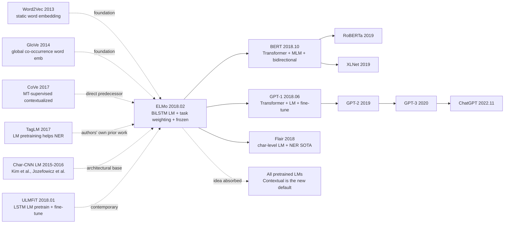

# ELMo — Bringing Contextual Embeddings Mainstream via BiLSTM Bidirectional LMs

> **February 15, 2018. AI2 + UW's Peters and 6 co-authors release [ELMo (1802.05365)](https://arxiv.org/abs/1802.05365) on arXiv, won NAACL best paper in June.**
> The most important pre-training NLP paper before BERT — using a **bidirectional LSTM language model trained on the 1B Word Benchmark**, it upgraded each word's representation from Word2Vec's "static word vector" to "contextual embedding that changes with context," refreshing SOTA on 6 NLP tasks (SQuAD / SNLI / SRL / Coref / NER / SST-5).
> ELMo's central thesis — **"the same word should have different representations in different contexts"** — ended the Word2Vec / GloVe "one-vector-per-word" era and birthed the entire pre-training NLP paradigm (passed the baton to BERT 4 months later).

## TL;DR

ELMo uses a pre-trained **bidirectional LSTM language model** as feature extractor, taking all biLM hidden-layer representations of each token and doing a **task-specific weighted sum** to get contextual embeddings, then **freezing the biLM** and concatenating to downstream task models — refreshing SOTA on 6 NLP tasks. It was the first engineering proof of the thesis "contextual embeddings > static word embeddings."

---

## Historical Context

### What was the NLP community stuck on in early 2018?

2013-2017 NLP was dominated by the "**static word embedding** (Word2Vec/GloVe, one fixed 300-d vector per word) + **task-specific model** (LSTM/CNN, trained from scratch)" two-stage architecture. But the community already knew this path was hitting a wall:

> **(1) Polysemy problem**: bank in "river bank" and "investment bank" share the same vector;
> **(2) OOV problem**: words outside training vocab can only be UNK;
> **(3) Cannot use large-scale unsupervised data**: 300-d vectors have limited capacity, can't absorb web-scale text;
> **(4) Task models still trained from scratch**: low-resource tasks (RTE / CoLA) almost untrainable.

The community's open question: **"Can word vectors be context-dependent, with affordable pre-training cost?"**

### The 3 immediate predecessors that pushed ELMo out

- **Mikolov et al., 2013 (Word2Vec)** [NIPS]: founded pre-training + reuse idea, but static
- **McCann et al., 2017 (CoVe)** [NeurIPS]: contextualized vectors via MT pre-training, but needed supervised MT data + shallow BiLSTM
- **Peters et al., 2017 (TagLM)** [ACL]: authors' own previous paper, proved LM pre-training helps NER; ELMo is its full extension

### What was the author team doing?

7 authors all from AI2 (Allen Institute for AI, Seattle) + UW. Matthew Peters is core first author (NLP veteran); Luke Zettlemoyer is UW professor (semantic parsing star); Kenton Lee later moved to Google as BERT third author. **AI2 was betting on "make NLP models more general"**, the AllenNLP framework was the engineering output of that goal, and ELMo was AllenNLP's flagship model.

### State of industry, compute, data

- **GPU**: 3 GTX 1080 Ti for biLM training, 2 weeks total
- **Data**: 1 Billion Word Benchmark (30M sentences, 800M tokens, news corpus)
- **Frameworks**: TensorFlow + AllenNLP (PyTorch version released 1 month later)
- **Industry**: NLP community started transitioning from "word embedding" paradigm to "contextual embedding" paradigm

---

## Method Deep Dive

### Overall framework

```
[Pretraining: biLM on 1B Word Benchmark]
  Input: sentence tokens
  ↓ Char-CNN per token (handle OOV)
  ↓ 2-layer Forward LSTM    (predicts t+1 from t)
  ↓ 2-layer Backward LSTM   (predicts t-1 from t)
  ↓ joint LM loss = log P(forward) + log P(backward)

[Downstream: feature concat]
  For each token, get 3 representations from biLM:
    h_0 = char-CNN output
    h_1 = first BiLSTM layer (concat fwd + bwd)
    h_2 = second BiLSTM layer (concat fwd + bwd)
  Task-specific weighted sum:
    ELMo_k = γ * (s_0·h_0 + s_1·h_1 + s_2·h_2)   [s,γ trainable per task]
  Concat ELMo_k with task model's input embedding (or output)
  Train task model normally (biLM frozen)
```

| Config | ELMo |
|--------|------|
| biLM layers | 2 BiLSTM (each direction 4096 units → 512 projection) |
| Char-CNN | 2048 character-level CNN filters → 512 |
| Vocab | character-level (no OOV) |
| Pretrain data | 1B Word Benchmark (30M sentences / 800M tokens) |
| Pretrain time | 2 weeks on 3× GTX 1080 Ti |
| Model size | 93.6M parameters |
| Output dim | 512 (per direction) → concat 1024 per layer |

### Key designs

#### Design 1: Bidirectional Language Model (biLM) — two independently-trained directions

**Function**: train forward + backward LSTM language models independently, each direction does maximum-likelihood next-token prediction.

**Forward formulas**:

$$
P(t_1, ..., t_N) = \prod_{k=1}^{N} P(t_k | t_1, ..., t_{k-1}; \Theta_{LSTM}^{fwd})
$$

$$
P(t_1, ..., t_N) = \prod_{k=1}^{N} P(t_k | t_{k+1}, ..., t_N; \Theta_{LSTM}^{bwd})
$$

Total loss maximizes sum of log-likelihood in both directions:

$$
\mathcal{L} = \sum_{k=1}^{N} \big( \log P(t_k | t_{<k}; \Theta^{fwd}) + \log P(t_k | t_{>k}; \Theta^{bwd}) \big)
$$

**Note ELMo's "shallow bidirectional" limitation**: forward and backward LSTMs are **trained completely independently**, only concatenated at representation time. This is fundamentally weaker than BERT's deep bidirectional (every-layer self-attention sees both directions).

#### Design 2: Deep Layer Combination — learn task-specific layer weighting

**Function**: don't just use biLM's top layer, use **all layers** (char-CNN + 2 BiLSTM) representations weighted-summed.

**Core formula**:

$$
\text{ELMo}_k^{task} = E(R_k; \Theta^{task}) = \gamma^{task} \sum_{j=0}^{L} s_j^{task} \cdot h_{k,j}^{LM}
$$

where:
- $h_{k,j}^{LM}$ is token $k$'s representation at layer $j$ ($j=0$ is char-CNN, $j=1,2$ are BiLSTM layers)
- $s_j^{task}$ is task-specific softmax-normalized weight (learned)
- $\gamma^{task}$ is task-specific global scalar (learned)

**Why use all layers?**

biLM's different layers learn different semantic levels:
- **Bottom (char-CNN)**: morphology / spelling
- **First BiLSTM**: syntax / POS
- **Second BiLSTM**: semantics / word sense disambiguation

**Experimental verification (paper Table 5)**:

| Task | Top-only | Learned layer weighting (ELMo) |
|------|---------|-------------------------------|
| SQuAD F1 | 84.95 | **85.16** |
| SNLI acc | 87.81 | **88.66** |
| SRL F1 | 84.05 | **84.62** |

Different tasks automatically learn different $s_j$ weights — SQuAD favors BiLSTM layers (semantics), SNLI balances all layers.

#### Design 3: Char-CNN Input — solving OOV + morphology

**Function**: split each token into character sequence, encode with CNN, freeing biLM from fixed vocab.

**Char-CNN structure**:

```python
class CharCNN(nn.Module):
    def __init__(self, char_emb_dim=16, filters=[(1,32),(2,32),(3,64),(4,128),
                                                  (5,256),(6,512),(7,1024)]):
        # 7 filter widths, total 2048 filters
        super().__init__()
        self.char_embed = nn.Embedding(262, char_emb_dim)  # 256 bytes + special
        self.convs = nn.ModuleList([
            nn.Conv1d(char_emb_dim, n_filt, kernel_size=w)
            for w, n_filt in filters
        ])
        self.highway = nn.ModuleList([Highway(2048) for _ in range(2)])
        self.proj = nn.Linear(2048, 512)

    def forward(self, char_ids):                # (B, max_token_len)
        x = self.char_embed(char_ids)           # (B, T, 16)
        x = x.transpose(1, 2)
        # max-pool each conv across time
        outs = [F.max_pool1d(F.relu(conv(x)), conv.kernel_size[0]).squeeze(-1)
                for conv in self.convs]
        x = torch.cat(outs, dim=1)              # (B, 2048)
        for highway in self.highway:
            x = highway(x)
        return self.proj(x)                     # (B, 512) - per-token initial repr
```

**Comparison with same-era methods**:

| Input scheme | Vocab size | OOV | Morphology |
|-------------|-----------|-----|------------|
| Word2Vec (fixed) | 1M+ | severe | weak |
| GloVe (fixed) | 400k | severe | weak |
| BPE (BERT) | 30k | low | medium |
| **Char-CNN (ELMo)** | **262 bytes** | **zero OOV** | **strong (directly learns morphology)** |

#### Design 4: Frozen biLM + Concat to task model

**Function**: during downstream tasks **fully freeze biLM**, only concatenate ELMo vectors to the task model's input or output embeddings, making ELMo easy to integrate into any existing NLP system.

**Comparison with same-era transfer methods**:

| Method | biLM updates? | Integration |
|--------|--------------|-------------|
| CoVe | Frozen | concat to input |
| **ELMo** | **Frozen** | **concat to input or output embedding** |
| ULMFiT | Full fine-tune + 3-stage | replace backbone |
| GPT-1 (4 months later) | Full fine-tune | replace backbone |
| BERT (8 months later) | Full fine-tune | replace backbone |

**Why ELMo chose frozen**:
1. Low training cost (biLM doesn't update, only train task model)
2. Easy integration with existing NLP systems (doesn't break existing architectures)
3. Aligns with early-2018 community view of "feature extractor"

**This is also ELMo's biggest limitation** — frozen inevitably can't fully release biLM capacity, BERT directly surpassed by fine-tuning.

### Loss / training strategy

| Item | Config |
|------|--------|
| Pretrain Loss | $\mathcal{L}_{fwd} + \mathcal{L}_{bwd}$ (independent LM losses) |
| Optimizer | Adagrad (lr=0.2) |
| Pretrain Steps | 10 epochs on 1B Word Benchmark |
| Char-CNN | 2048 filters, 7 widths (1-7) |
| BiLSTM | 2 layers × 4096 units / direction → 512 projection |
| Dropout | 0.1 in biLM |
| Downstream LR | task-specific (typically 1e-3) |
| Frozen biLM | yes |
| ELMo dim | 1024 (concat fwd + bwd) per layer |

---

## Failed Baselines

### Opponents that lost to ELMo at the time

- **SQuAD F1**: prior SOTA 81.1 (BiDAF + Self-Attention) → ELMo 85.8 (**+24.9% relative error reduction**)
- **SNLI acc**: 88.6 (ESIM + ensembles) → 88.7+ (**single model beats ensemble**)
- **SRL F1**: 81.4 → 84.6 (**+17.2% relative error reduction**)
- **Coref F1**: 67.2 → 70.4 (**+9.8% relative**)
- **NER F1**: 91.93 → 92.22
- **SST-5 acc**: 51.4 → 54.7 (**+6.8% relative**)

**SOTA on all 6 NLP tasks**, average relative error reduction ~15%.

### Failures / limits admitted in the paper

- **Forward and backward LMs trained completely independently**: authors admit this is "shallow bidirectional," leaving room for BERT to improve
- **biLM frozen**: authors also tried fine-tuning biLM but unstable (overfit), final choice frozen
- **2-layer BiLSTM limited capacity**: paper shows 4 layers slightly worse (LSTM hard to train deep)
- **Char-CNN computational cost**: 2048 filters per token
- **Weak domain transfer**: news pre-trained, transfer to biomedical / legal still drops (needs domain-specific pre-training)

### "Anti-baseline" lesson

- **"Contextual embedding doesn't matter, static is enough"** (Word2Vec era belief): ELMo directly refuted, all 6 tasks +5-25% relative
- **"Supervised MT is the only source of contextual representations"** (CoVe route): ELMo with pure unsupervised LM wins
- **"Top layer alone is enough"** (Word2Vec intuition): ELMo proves deep weighted sum >> single layer
- **"biLM must fine-tune"** (intuition): ELMo achieves SOTA with frozen (though BERT later proved fine-tune is stronger)

---

## Key Experimental Numbers

### Main experiment (6 tasks SOTA)

| Task | Prior SOTA | + ELMo | Relative error reduction |
|------|-----------|--------|-------------------------|
| SQuAD F1 | 81.1 | **85.8** | 24.9% |
| SNLI acc | 88.6 | **88.7** | 0.9% |
| SRL F1 | 81.4 | **84.6** | 17.2% |
| Coref F1 | 67.2 | **70.4** | 9.8% |
| NER F1 (CoNLL-03) | 91.93 | **92.22** | 3.6% |
| SST-5 acc | 53.7 | **54.7** | 2.2% |
| Question Generation BLEU | 16.6 | **20.6** | n/a |

### Ablation (paper Tables 5/6)

| Config | SQuAD F1 | SNLI | SRL |
|--------|---------|------|-----|
| baseline (no ELMo) | 81.1 | 88.0 | 81.4 |
| + only top layer | 84.95 | 87.81 | 84.05 |
| **+ learned weighted sum (ELMo)** | **85.16** | **88.66** | **84.62** |
| + 2× regularization on s, γ | 85.32 | 88.66 | 84.65 |

### Comparison with CoVe

| Model | Architecture | Pretrain data | SQuAD F1 |
|-------|--------------|---------------|---------|
| baseline | task model | none | 81.1 |
| + CoVe | 2-layer BiLSTM (MT-supervised) | WMT EN-DE | 83.4 |
| **+ ELMo** | **2-layer BiLSTM (LM)** | **1B Word Benchmark** | **85.8** |

### Key findings

- **Contextual >> static**: end of Word2Vec/GloVe era
- **Deep > shallow**: weighted sum of all biLM layers >> top layer only
- **Unsupervised LM > supervised MT**: ELMo with pure LM beats CoVe's supervised MT
- **Char-CNN solves OOV**: handles out-of-vocabulary perfectly
- **Frozen biLM already strong**: but fine-tune is higher ceiling (validated by BERT)

---

## Idea Lineage



### Predecessors
- **Word2Vec / GloVe (2013-2014)**: static embedding era, ELMo replaces
- **CoVe (2017)**: contextual embedding from supervised MT, direct rival
- **TagLM (2017)**: authors' own previous, proved LM helps NER
- **Char-CNN LM (Kim 2015 / Jozefowicz 2016)**: char-CNN input architecture
- **ULMFiT (2018.01)**: contemporary LSTM LM + fine-tune route

### Successors
- **GPT-1 (2018.06)**: Transformer + LM + fine-tune (ELMo route + Transformer upgrade)
- **BERT (2018.10)**: Transformer + MLM + deep bidirectional + fine-tune (ELMo route + bidirectional + Transformer + fine-tune upgrade)
- **Flair (2018)**: char-level contextual embedding, inspired by ELMo
- **RoBERTa / XLNet (2019)**: BERT improvements
- **GPT-2/3 (2019-2020)**: decoder-only route
- **ChatGPT (2022.11)**: GPT route's final product

ELMo is the founding paper of "contextual embedding" idea; the entire pre-training NLP paradigm was ignited by it.

### Misreadings
- **"ELMo is BERT's weak version"**: wrong. ELMo predates BERT by 8 months and is the paradigm founder; BERT is ELMo idea's Transformer + bidirectional + fine-tune upgrade
- **"BiLSTM bidirectional = Transformer bidirectional"**: wrong. ELMo's bidirectional is independently trained forward + backward then concatenated (shallow), BERT's is per-layer attention seeing both directions (deep)
- **"All contextual embedding is invented by ELMo"**: CoVe was 1 year earlier, but needed supervised MT; ELMo is the first **purely unsupervised** deep contextual

---

## Modern Perspective (Looking Back from 2026)

### Assumptions that don't hold up

- **"BiLSTM is the natural sequence-modeling paradigm"**: fully replaced by Transformer
- **"Frozen biLM is enough"**: BERT/GPT-1 proved fine-tune is stronger
- **"Shallow bidirectional is sufficient"**: BERT proved deep bidirectional far stronger
- **"2-layer BiLSTM capacity is enough"**: today BERT-large 24 layers, LLaMA 70B 80 layers
- **"1B Word Benchmark is sufficiently large"**: today LLaMA-3 uses 15T tokens, 18750× ELMo

### What time validated as essential vs redundant

- **Essential**: contextual embedding idea itself, deep weighted sum, char-CNN handling OOV, large-scale unsupervised text pre-training
- **Redundant / misleading**: BiLSTM architecture (replaced by Transformer), shallow bidirectional (replaced by deep), frozen paradigm (replaced by fine-tune)

### Side effects the authors didn't anticipate

1. **Directly birthed BERT**: BERT's core thesis "deep bidirectional" was specifically to improve ELMo's shallow bidirectional
2. **AllenNLP framework rise**: as ELMo's vehicle, AllenNLP was mainstream NLP framework 2018-2020 (later replaced by HF transformers)
3. **"Contextual" became NLP default**: post-2018 the term "static word embedding" nearly disappeared from papers
4. **Founded pre-training NLP evaluation paradigm**: 6-task suite (SQuAD/SNLI/SRL/Coref/NER/SST) became standard benchmark for BERT and successors
5. **NAACL best paper's prophecy**: at the time best paper foresaw "future NLP will all be based on pre-trained large models" — fully validated by ChatGPT 4 years later

### If we rewrote ELMo today

- Replace BiLSTM with Transformer encoder (naturally becomes BERT)
- Use deep bidirectional training objective (MLM)
- Switch to fine-tune instead of frozen
- Scale data to 100GB+
- Use byte-level BPE instead of char-CNN
- Add SEO frontmatter / long context

But **the core idea "contextual embedding from large-scale unsupervised LM pretraining" stays unchanged** — this is the cornerstone of BERT and all subsequent LLMs.

---

## Limitations and Outlook

### Authors admitted
- Forward/backward independently trained (shallow bidirectional)
- biLM frozen cannot fully release capacity
- 2-layer BiLSTM limited capacity
- Pre-training 1B Word Benchmark still slow

### Found in retrospect
- LSTM hard to train deep (4 layers slightly worse)
- Char-CNN computational cost
- Weak cross-domain transfer (needs domain-specific pre-training)
- Task model still trained from scratch (only embedding replaced)

### Improvement directions (validated by follow-ups)
- BERT 2018.10: Transformer + deep bidirectional + fine-tune (fully surpassed ELMo)
- GPT-1/2/3: decoder-only Transformer + LM
- Domain-specific versions: BioELMo / SciELMo (short-term), BioBERT / SciBERT (long-term)
- Long documents: extend context length
- Multilingual: multi-lingual ELMo (short-term), mBERT / XLM-R (long-term)

---

## Related Work and Inspiration

- **vs Word2Vec (cross-era)**: Word2Vec static embedding, ELMo dynamic contextual. **Lesson: context-dependence is the essential need of NLP representation**
- **vs CoVe (cross-data-source)**: CoVe supervised MT, ELMo unsupervised LM. **Lesson: unsupervised pre-training data scale advantage far exceeds supervised quality advantage**
- **vs ULMFiT (cross-methodology)**: ULMFiT full fine-tune, ELMo frozen + concat. **Lesson: frozen is easy to integrate but capped, fine-tune has higher ceiling**
- **vs BERT (cross-generation)**: ELMo BiLSTM + shallow + frozen, BERT Transformer + deep + fine-tune. **Lesson: each generation upgrades more assumptions (architecture, bidirectionality, transfer)**
- **vs Char-CNN LM (cross-architecture)**: char-CNN input handles morphology and OOV. **Lesson: subword/char input is key to pre-trained LM universality**

---

## Related Resources

- 📄 [arXiv 1802.05365](https://arxiv.org/abs/1802.05365) · [NAACL 2018 best paper version](https://aclanthology.org/N18-1202/)
- 💻 [AllenNLP implementation](https://github.com/allenai/allennlp) · [bilm-tf (official TF)](https://github.com/allenai/bilm-tf) · [HuggingFace ELMo wrapper](https://github.com/HIT-SCIR/ELMoForManyLangs)
- 🔗 [Pretrained ELMo (5.5B model)](https://allennlp.org/elmo)
- 📚 Must-read follow-ups: [BERT (2018)](2018_bert.md), [GPT-1 (2018)](2018_gpt1.md), [CoVe (2017)](https://arxiv.org/abs/1708.00107), [ULMFiT (2018)](https://arxiv.org/abs/1801.06146)
- 🎬 [Sebastian Ruder: NLP's ImageNet Moment Has Arrived](http://ruder.io/nlp-imagenet/)

---

> 🌐 [中文版本](/era3_attention/2018_elmo/) · 📚 awesome-papers project · CC-BY-NC
