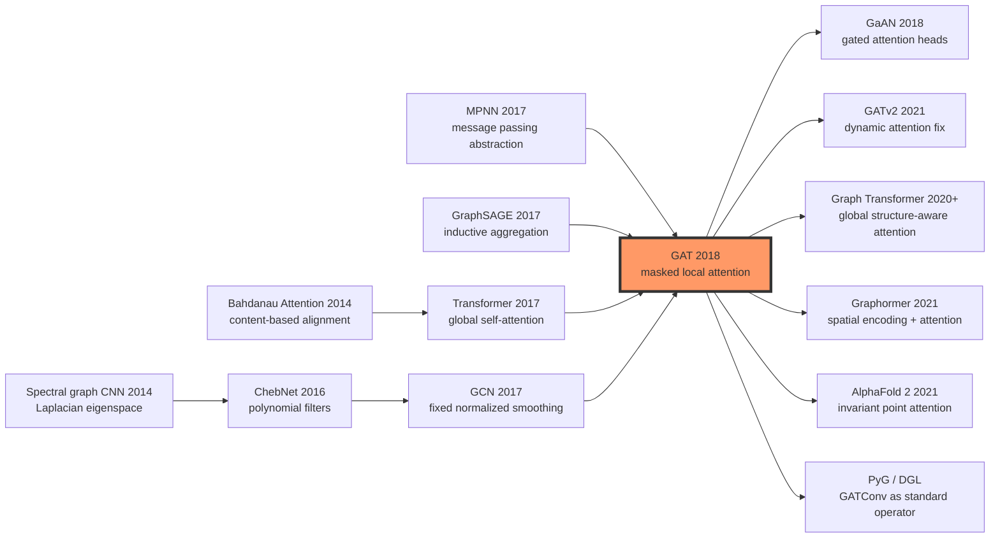

# Graph Attention Networks (GAT) — Attention as a Learnable Graph Edge

> **On October 30, 2017, Petar Veličković, Guillem Cucurull, Arantxa Casanova, Adriana Romero, Pietro Liò, and Yoshua Bengio released [Graph Attention Networks (1710.10903)](https://arxiv.org/abs/1710.10903), later accepted by ICLR 2018.** GCN had just made graph convolution feel simple by turning every node's neighborhood into a fixed degree-normalized average. GAT asked the next, sharper question: what if every edge weight were computed on the fly from node features, the way attention scores are computed in a Transformer, but masked to the sparse one-hop graph? The headline number was the PPI inductive Micro-F1 jump to **0.973**; the deeper legacy was that graph edges stopped being only topology and became learnable, context-dependent computation.

## TL;DR

Graph Attention Networks (GAT), published at ICLR 2018 by Veličković, Cucurull, Casanova, Romero, Liò, and Bengio, replaced the fixed degree-normalized averaging of [GCN (2017)](2017_gcn.md) with masked self-attention over graph neighborhoods. For an edge from neighbor $j$ to node $i$, GAT computes $e_{ij}=\mathrm{LeakyReLU}(\vec{a}^{T}[W\vec{h}_i\Vert W\vec{h}_j])$, normalizes it as $\alpha_{ij}=\mathrm{softmax}_{j\in\mathcal{N}_i}(e_{ij})$, and updates the node by a weighted sum of transformed neighbor features. That small-looking substitution changes the modeling premise: topology no longer dictates message strength by a static constant such as $1/\sqrt{d_i d_j}$; the features of the two nodes decide which edges deserve attention. The gains on citation networks were modest but real, moving GCN from 81.5 / 70.3 to 83.0 / 72.5 on Cora / CiteSeer. The decisive result was inductive PPI, where GraphSAGE-LSTM's roughly 0.612 Micro-F1 was pushed to 0.973 by GAT.

The counterintuitive lesson is that GAT did not simply copy [Transformer (2017)](2017_transformer.md) onto graphs. It cut global self-attention down to masked local attention, so the layer still scales linearly in graph size, roughly $O(|V|FF' + |E|F')$, while gaining anisotropic, feature-dependent aggregation. That compromise became the template for a decade of graph learning: GATv2 corrected the original layer's static-attention weakness, Graph Transformers and Graphormer moved attention back toward global structural reasoning, and AlphaFold 2's Invariant Point Attention showed how relation-aware attention could survive in 3D scientific modeling. GAT's lasting gift is the idea that an edge can be not merely an observed link, but a learnable computational decision.

---

## Historical Context

### What graph learning was stuck on in 2017

In 2017, graph neural networks had just moved past the question of whether neural networks could be trained on graphs at all. [GCN (2017)](2017_gcn.md) compressed spectral graph convolution into a one-line normalized adjacency propagation rule and showed that semi-supervised node classification could be trained end to end. GraphSAGE, also in 2017, showed that if the learned function depends only on local neighborhoods rather than a fixed training graph, it can transfer to unseen nodes and graphs. Gilmer and four coauthors' MPNN framework gave molecular graph learning a general message-passing language. Yet most of these methods still treated neighbors as a set to be averaged, summed, sampled, or pooled.

The uncomfortable fact was that real graph neighbors are not equal. In a citation graph, one cited paper may carry the central topic while another is incidental noise. In a protein-protein interaction graph, one edge may reflect a strong functional relation while another may be a weak experimental signal. GCN weights are determined by degree normalization; GraphSAGE mean and pooling aggregators are hand-chosen functions. They propagate information, but they do not directly answer, during the forward pass, which neighbor is worth listening to more.

### The three forces that led to GAT

The first force was **GCN's fixed weighting**. GCN can be read as degree-normalized averaging over a node and its neighbors. The weight is determined by topology, not by node content. That makes GCN simple, stable, and elegant, but also isotropic: neighbors differ because of degree, not because one neighbor is semantically more relevant than another.

The second force was **GraphSAGE's pressure toward inductive learning**. Industrial graphs and biological graphs constantly receive new nodes, new subgraphs, and sometimes entirely new graphs. A model that only works on the single graph seen during training is awkward for recommendation, molecular screening, fraud detection, and other live settings. GraphSAGE made the idea of learning a local aggregation function central; GAT kept that inductive ambition but replaced the aggregator with learnable edge-level attention.

The third force was **the shock of Transformer self-attention**. In 2017, Vaswani and seven coauthors showed that relationships between tokens could be computed dynamically by content rather than carried through recurrence. GAT's key intuition is that self-attention over a sequence is attention over a complete graph of tokens; graph attention is the same operation masked by the adjacency matrix, so only one-hop neighbors participate.

### Where the author team stood

First author Petar Veličković was working at the University of Cambridge with Pietro Liò's group on graph learning and biological networks. Guillem Cucurull, Arantxa Casanova, and Adriana Romero connected the work to the MILA / Canadian deep learning ecosystem, and Yoshua Bengio's coauthorship tied it naturally to the broader history of neural attention and representation learning. The team sat exactly at the intersection GAT needed: graph-structured scientific data on one side, neural attention mechanisms on the other.

The paper did not try to build a large system. Its ambition was narrower and cleaner: define a reusable **graph attention layer**, show that it can replace GCN's fixed propagation rule, and demonstrate that the same layer works for both transductive node classification and inductive multi-label classification. That minimality made GAT easy to adopt; it quickly became a standard layer in graph learning libraries.

### Data, compute, and engineering context

By today's standards, the experiments were small. Cora, CiteSeer, and Pubmed are citation networks with thousands to tens of thousands of nodes; PPI is an inductive benchmark made of multiple protein-protein interaction graphs. The main experiments fit comfortably on the single-GPU hardware of the time. The official TensorFlow code was released as `PetarV-/GAT`, and later PyTorch, DGL, and PyG implementations made GATConv a basic operator.

That small scale helps explain why GAT spread so quickly. It was not a result squeezed out by massive compute. It was a layer definition that could be reimplemented in a few dozen lines: linear projection, edge scoring, neighborhood softmax, multi-head aggregation. This combination of low engineering barrier and high conceptual clarity made GAT one of the first GNN papers, after GCN, to become both a textbook topic and a library primitive.

---

## Method Deep Dive

### Overall framework

The minimal unit of GAT is a **graph attention layer**. The input is a graph $G=(V,E)$ and node features $h_i$; the output is an updated representation $h'_i$ for every node. Unlike GCN, which first builds a normalized adjacency matrix and then multiplies it with node features, GAT computes an attention score on each edge and applies a softmax only inside the node's one-hop neighborhood.

```
Graph G=(V,E), node features H
  ↓ shared linear projection W
Projected features Wh_i
  ↓ edge scoring on (i,j), j in N_i
Attention logits e_ij
  ↓ masked neighborhood softmax
Normalized coefficients alpha_ij
  ↓ weighted neighbor aggregation, K heads
Updated node features h'_i
```

| Component | GCN choice | GAT choice | Effect |
|-----------|------------|------------|--------|
| Edge weight | Degree-normalized constant | Feature-dependent attention score | Isotropic to anisotropic aggregation |
| Neighborhood | One-hop neighbors + self-loop | One-hop neighbors + self-loop | Preserves local message passing |
| Generalization | Original protocol mostly transductive | Local function can run on new graphs | Supports PPI inductive task |
| Computation | Sparse matrix multiply | Sparse edge-level attention | More flexible but more memory-hungry |

### Key designs

#### Design 1: Masked self-attention makes edge weights learnable

GAT first transforms every node with a shared matrix $W$, then scores the transformed center node $i$ against each transformed neighbor $j$:

$$
e_{ij}=LeakyReLU(a^T[Wh_i || Wh_j])
$$

Here $a$ is a shared single-layer attention vector, and `||` denotes concatenation. Attention is computed only inside the true neighbor set $N_i$, so this is not Transformer-style fully connected attention; it is local attention masked by graph structure. The logits are then normalized inside the neighborhood:

$$
alpha_{ij}=exp(e_{ij}) / sum_{k in N_i} exp(e_{ik})
$$

The node update is a weighted neighbor sum:

$$
h'_i=sigma(sum_{j in N_i} alpha_{ij}Wh_j)
$$

The important phrase is not merely “uses attention.” It is the scope of that attention. GAT does not let every node see every other node. The graph is a hard constraint: only pairs connected by an edge are scored. This preserves sparsity while giving each node a content-adaptive local filter.

#### Design 2: Multi-head attention stabilizes small-graph learning

Graph datasets are often smaller and sparser than image or text datasets, so a single attention head can be noisy early in training. GAT borrows the multi-head idea from the Transformer and runs $K$ independent attention heads in parallel. Hidden layers usually concatenate the heads:

$$
h'_i=concat_{k=1..K} sigma(sum_{j in N_i} alpha^k_{ij} W^k h_j)
$$

The output layer averages heads instead, producing a more stable class distribution:

$$
h'_i=sigma((1/K) sum_{k=1..K} sum_{j in N_i} alpha^k_{ij} W^k h_j)
$$

On citation networks, a common configuration is eight heads in the first layer, each producing eight features, concatenated into a 64-dimensional hidden vector; the final layer maps to the class count. This is not a large model, but it gives the layer several independent views of neighbor relevance.

#### Design 3: No eigenspace dependency gives natural inductive behavior

Early spectral graph convolution methods depended on the eigenspace of the graph Laplacian; when the graph changes, the frequency basis changes too. GCN had already compressed the spectral derivation into a local propagation rule, but its standard experiments were still transductive on a single fixed graph. GAT's parameters are only $W$ and $a$. They are not tied to a graph's node count, Laplacian eigenvectors, or particular adjacency matrix.

A trained GAT layer can therefore be applied directly to a new graph. If the new graph provides node features and edges, the model can compute attention from the features of the two incident nodes and pass messages. The PPI benchmark tests precisely this setting: train on one set of protein-protein interaction graphs and evaluate on unseen graphs.

#### Design 4: Linear-complexity compromise, not a full graph Transformer

Applying a Transformer directly to $N$ graph nodes would create an $O(N^2)$ attention matrix. GAT restricts candidate pairs to edges with an adjacency mask, so the complexity is approximately:

$$
O(|V|FF' + |E|F')
$$

The first term is the shared linear projection for all nodes, and the second is edge scoring plus aggregation. For sparse graphs, this is linear in graph size, but the constant is larger than GCN because attention logits, softmax weights, and multi-head intermediate values must be stored per edge. This is GAT's central engineering tradeoff: more edge-level computation in exchange for learnable neighbor selection.

### Training objective and complexity

| Item | Typical setting in the paper |
|------|------------------------------|
| Citation-network architecture | Two-layer GAT, first layer 8 heads × 8 hidden features |
| Activation | ELU in hidden layers |
| Regularization | Feature dropout + attention dropout |
| PPI architecture | Wider multi-layer multi-head GAT for multi-label classification |
| Complexity | About $O(|V|FF' + |E|F')$ |
| Output | Softmax for transductive classification; sigmoid / multi-label loss for PPI |

```python
import torch
import torch.nn as nn
import torch.nn.functional as F

class SparseGATLayer(nn.Module):
    def __init__(self, in_dim, out_dim, heads=8, negative_slope=0.2):
        super().__init__()
        self.heads = heads
        self.proj = nn.Linear(in_dim, heads * out_dim, bias=False)
        self.attn_src = nn.Parameter(torch.empty(heads, out_dim))
        self.attn_dst = nn.Parameter(torch.empty(heads, out_dim))
        self.leaky_relu = nn.LeakyReLU(negative_slope)
        nn.init.xavier_uniform_(self.attn_src)
        nn.init.xavier_uniform_(self.attn_dst)

    def forward(self, x, edge_index):
        src, dst = edge_index
        h = self.proj(x).view(x.size(0), self.heads, -1)
        logits = (h[src] * self.attn_src).sum(-1) + (h[dst] * self.attn_dst).sum(-1)
        logits = self.leaky_relu(logits)
        alpha = edge_softmax(dst, logits)
        msg = h[src] * alpha.unsqueeze(-1)
        return scatter_sum(msg, dst, dim=0, dim_size=x.size(0)).flatten(1)
```

This conceptual code highlights a difference between the paper formula and modern implementations. The paper writes attention as concatenation $[Wh_i || Wh_j]$; sparse implementations often split it into source-node and target-node terms for parallelism. Mathematically the goal is the same: every edge receives a learnable weight.

| Method | Aggregation weight | Dynamic? | Naturally inductive? | Main cost |
|--------|--------------------|----------|----------------------|-----------|
| DeepWalk / node2vec | Random-walk co-occurrence | No | No | Cannot directly use node features |
| GCN | Degree normalization | No | Limited | Fixed isotropic smoothing |
| GraphSAGE-mean | Mean / pooling | Partial | Yes | Neighbors still mostly equal |
| **GAT** | **Edge-level attention** | **Yes** | **Yes** | **Higher memory from multi-head attention** |
| Graph Transformer | Global attention + structural encoding | Yes | Yes | $O(N^2)$ or requires sparsification |

---

## Failed Baselines

### GCN fixed smoothing: every neighbor speaks at the same kind of scale

GCN is the most direct and most respectable baseline for GAT. Its strength is its simplicity: propagate degree-normalized neighbor information and apply a learnable linear transformation. The same simplicity creates a hard limit. Edge weights are determined by graph structure, not node content. For the same center node, a highly topic-relevant neighbor and a cross-class noisy neighbor can receive similar weights if their degrees are similar.

GAT does not fix GCN by changing the optimizer. It changes the inductive bias. GCN assumes local smoothing is usually beneficial; GAT lets the model learn which neighbors should be smoothed in and which should be downweighted. On homophilous citation networks, this produces only one or two accuracy points. On more heterogeneous and relationally complex graphs, the distinction matters much more.

### DeepWalk / node2vec feature blindness: node vectors are not local functions

DeepWalk and node2vec turn random walks on a graph into sentence-like sequences and train node embeddings with word-vector objectives. This route was powerful in 2014-2016 because it was simple, scalable, and required little manual graph feature engineering. Its failure mode is equally clear: the embedding table is bound to node IDs in the training graph. When new nodes arrive, one often needs new walks and retraining; high-dimensional node text, attributes, or molecular features do not naturally enter the model.

GAT replaces a lookup-table representation with a function of node features and neighbor features. A new node with features and edges can receive a representation through a forward pass. That is not only an engineering convenience; it moves graph learning from static embedding tables toward deployable neural operators.

### GraphSAGE uniform aggregation: inductive, but not always selective

GraphSAGE is GAT's strongest same-era baseline. It already addressed inductive learning and used sampling to control neighborhood size. Its problem is not generalization; it is how to model neighbor importance. The mean aggregator averages neighbors. The pooling aggregator transforms and pools them. The LSTM aggregator even adds an order-sensitive mechanism. None of these explicitly learns a center-node-dependent weight for each edge.

That is why the PPI result is so persuasive. GraphSAGE-LSTM reaches roughly 0.612 Micro-F1 on PPI, already stronger than many shallow methods. GAT reaches 0.973. In multi-label, cross-graph tasks with complex local relations, fine-grained neighbor selection matters more than the mere existence of an inductive framework.

## Key Experimental Numbers

### Transductive node classification: Cora / CiteSeer / Pubmed

GAT first evaluates transductive node classification on three classic citation networks. Test nodes are already present in the same graph during training, but their labels are hidden; the benchmark mainly tests whether the model can propagate semantics from few labels through graph structure.

| Method | Cora accuracy | CiteSeer accuracy | Pubmed accuracy | Main weakness |
|--------|---------------|-------------------|-----------------|---------------|
| DeepWalk | 67.2 | 43.2 | 65.3 | Does not use node features |
| Planetoid | 75.7 | 64.7 | 77.2 | Heavy random-walk semi-supervised objective |
| Chebyshev | 81.2 | 69.8 | 74.4 | Spectral polynomial is more complex and less portable |
| GCN | 81.5 | 70.3 | 79.0 | Fixed normalized weights |
| **GAT** | **83.0 ± 0.7** | **72.5 ± 0.7** | **79.0 ± 0.3** | Ties GCN on Pubmed |

These numbers show that GAT was not a demolition of GCN on small citation graphs. It gains 1.5 points on Cora, 2.2 points on CiteSeer, and roughly ties on Pubmed. The historical point is not that every table is a blowout; it is that attention is trainable, stable, and at least competitive as a neighborhood aggregation rule.

### Inductive multi-label classification: the decisive PPI gap

The PPI benchmark better exposes GAT's distinct contribution. Training and test graphs are different, the task is protein function multi-label classification, and the metric is Micro-F1. This requires learning a transferable local relation function, not memorizing node positions in one graph.

| Method | PPI Micro-F1 | Failure point |
|--------|--------------|---------------|
| Random | 0.396 | No graph learning |
| MLP | 0.422 | Ignores edge structure |
| DeepWalk | 0.407 | Transductive embedding transfers poorly |
| GraphSAGE-GCN | 0.500 | Fixed graph-convolution aggregation is weak |
| GraphSAGE-mean | 0.598 | Mean aggregation is too coarse |
| GraphSAGE-LSTM | 0.612 | Inductive but lacks edge-level selection |
| **GAT** | **0.973** | Attention aggregation removes the main bottleneck |

The PPI jump is the most historically memorable number in the GAT paper. It told later researchers that when graph edges differ strongly in semantic importance, learnable neighbor selection can beat more elaborate samplers, longer random walks, or deeper smoothing layers.

### Ablations and training signals

The paper also highlights the importance of multi-head attention and attention dropout. A single attention head can be unstable; concatenating heads lets several local filters work in parallel. Dropping attention weights prevents the model from collapsing too early onto a few edges.

| Design choice | Role | Typical risk when removed | Later influence |
|---------------|------|---------------------------|-----------------|
| Multi-head concatenation | Reduces attention variance | Unstable training on small graphs | Became default in GNN attention |
| Averaging heads at output | Stabilizes class probabilities | More volatile logits | Adopted by PyG / DGL implementations |
| Attention dropout | Avoids relying on a few edges | Overfits noisy edges | Influenced graph regularization practice |
| Adjacency mask | Preserves sparse computation | Degenerates into expensive global attention | Influenced sparse Transformer variants |

### What to be careful about when reading the results

GAT's citation-network gains should not be presented as a universal replacement for GCN. On low-noise, highly homophilous, massive recommendation graphs, later minimalist models such as LightGCN remain strong precisely because they avoid expensive feature transformations and attention. GAT's best regime is when local neighbors differ semantically, edge importance must be inferred from features, and the task can afford the additional memory cost.

---

## Idea Lineage

### Predecessors: spectral graph convolution, message passing, and neural attention converge

GAT did not grow out of a single paper. One lineage is spectral graph convolution: Bruna and two coauthors defined convolution in the eigenspace of the graph Laplacian, ChebNet reduced the cost with polynomial filters, and GCN compressed the idea into first-order local smoothing. A second lineage is message passing: MPNN described graph neural networks through message, aggregation, and update functions, while GraphSAGE emphasized that these functions should transfer to unseen graphs. A third lineage is neural attention: Bahdanau attention made content-based alignment trainable, and the Transformer turned self-attention into a general sequence layer.

GAT joins these three lines. It keeps the local graph structure of GCN / MPNN, inherits GraphSAGE's inductive ambition, and compresses Transformer-style content-dependent weighting into one-hop neighborhoods. It does not discard graph structure; it uses graph structure as the attention mask.



### Successors: from local attention to Graph Transformers

After GAT, “attention as an edge weight” quickly became common language in graph learning. GaAN added gates over different heads, trying to learn which heads matter. Heterogeneous graph attention networks and relational GAT variants extended the idea to multiple node types and edge types. DGL, PyG, and TensorFlow GNN turned GATConv into an entry-level operator. For many students, GAT became the second graph neural layer learned after GCN.

The longer branch is Graph Transformers. GAT performs attention only inside one-hop neighborhoods. Graph Transformer and Graphormer reopen global attention and then inject structural bias through shortest-path distance, edge encodings, centrality encodings, or positional encodings. In one sentence: GAT shrinks the Transformer down to graph neighborhoods, while Graphormer injects graph structure into a Transformer. The directions are opposite, but the question is shared: relation strength should be learned, not only specified by hand-crafted topological constants.

### Misreadings: attention weights are not explanations, and GAT is not every graph model

The most common misreading of GAT is to treat attention weights as explanations. A high-weight neighbor did contribute strongly in one layer and one head, but that does not make it causally important, nor does it guarantee a human-interpretable edge semantics. After multiple layers, multiple heads, dropout, and nonlinearities, a single head's attention map is closer to one frame of internal computation than to a final reason.

A second misreading is to use GAT and Graph Transformer interchangeably. Original GAT is still a message-passing GNN: its receptive field grows with depth, and one layer sees only one-hop neighbors. Modern Graph Transformers usually allow global node interaction and then tell the model about graph structure with positional, edge, or path encodings. This difference changes their tradeoffs in scale, expressivity, over-smoothing, and over-squashing.

A third misreading is that dynamic attention automatically solves all GNN weaknesses. GAT weakens the fixed-smoothing problem, but it does not eliminate oversquashing, long-range dependency difficulty, large-graph sampling cost, or error propagation on heterophilous graphs. It gave later work a powerful primitive, not a finish line.

---

## Modern Perspective (Looking Back from 2026)

### From challenging GCN to becoming a standard operator

Looking back from 2026, GAT has moved from “a clever variant of GCN” to a basic layer in the graph neural network toolbox. It is not always the strongest baseline. On massive recommendation graphs and low-feature graphs, simple propagation models can be cheaper and more stable. But GAT changed the language researchers use for graph learning: an adjacency matrix is not only a given structure, but also the candidate set for attention; an edge is not merely present or absent, but can receive a feature-conditioned strength.

That meaning is larger than the three citation-network tables in the original paper. Later work such as GATv2, Graphormer, HGT, GraphGPS, and AlphaFold 2-style relational attention modules all extend the same idea at different levels: relations in structured data are not dead constants. They can be conditioned, reweighted, and reinterpreted.

### Assumptions that did not hold up

First, **attention weights are naturally dynamic** turned out to be too optimistic. In 2021, GATv2 pointed out that the original scoring form can induce static attention rankings in some settings: for a given node, the ranking among neighbors may be less query-dependent than the name suggests. This critique does not erase GAT's historical value, but it reminds us that the presence of an attention formula is not the same as full query-conditioned expressivity.

Second, **local one-hop attention is enough for graph relations** does not always hold. GAT is still constrained by the message-passing paradigm. Long-distance information must travel through many layers and can suffer from oversquashing: many remote signals are compressed into finite-dimensional vectors. The rise of Graph Transformers, subgraph GNNs, and path-encoding methods reflects the limits of one-hop local aggregation.

Third, **attention is interpretable** must be treated carefully. GAT attention scores are useful windows into model behavior, but they are not rigorous explanations. Different heads may play different roles; some heads may be mostly regularization or redundancy; and a high-weight edge can be correlated with the decision without being causally decisive.

### What time validated as essential versus incidental

| Design | Later status | Reason |
|--------|--------------|--------|
| Masked neighborhood attention | Core legacy | Preserves sparse graph structure while learning edge weights |
| Multi-head mechanism | Core engineering trick | Reduces variance, improves stability, became library default |
| LeakyReLU + concatenation scoring | Replaceable detail | GATv2 and dot-product attention offer alternatives |
| Full-batch small-graph training | Historical condition | Large graphs require sampling, partitioning, or fused kernels |
| Attention visualization | Useful but limited | Helps diagnosis but is not causal explanation |

The core of GAT is not a particular activation function, nor the requirement to use concatenation scoring. What survived is the abstraction: learn relation strength under graph constraints.

### Side effects the authors did not anticipate

GAT brought attention into graph learning, and with it came attention's engineering burden. Every edge in every head needs logits, normalized weights, and messages. On small graphs this is harmless; on billion-edge graphs it becomes a systems problem. The later effort spent on fused sparse attention, mini-batch neighbor sampling, and CPU-GPU pipelines is partly the engineering bill for layers like GAT.

Another side effect is benchmark storytelling. The PPI score of 0.973 was so striking that many follow-up papers treated attention as an almost automatic improvement. But on highly homophilous graphs or low-noise recommendation graphs, extra attention parameters do not necessarily help and can overfit. GAT therefore teaches a second lesson: a more flexible inductive bias is not automatically a better production model.

### If we rewrote GAT today

A 2026 rewrite of GAT would likely do four things. First, it would use GATv2-style scoring or dot-product attention as the default layer to avoid the static-attention criticism. Second, it would include large-graph mini-batch experiments from the beginning, reporting throughput, memory, and edge-count scaling instead of only accuracy. Third, it would treat heterophily, long-range reasoning, and oversquashing as failure analyses, rather than only showing homophilous citation networks and PPI. Fourth, it would discuss attention interpretability more cautiously, presenting attention maps as diagnostic signals rather than explanatory guarantees.

## Limitations and Outlook

### Limits admitted by the paper or exposed by the experiments

GAT's complexity is linear in the number of edges, but the constant from multi-head attention is not small. For large graphs, every edge needs logits, softmax weights, and messages, making the layer more expensive than a single sparse matrix multiplication in GCN. The original experiments were relatively small, so they did not fully expose industrial-scale throughput and memory bottlenecks.

A second limit is that GAT's advantage depends on a learnable relationship between node features and edge importance. If node features are weak, if edges mostly encode collaborative-filtering signals, or if neighborhoods are highly homogeneous, attention can become an expensive noise amplifier. GAT also does not fundamentally solve deep GNN over-smoothing, oversquashing, or long-range dependency problems.

### Limits visible in retrospect

GAT attention is local and layerwise. That makes it an excellent primitive for adaptive edge weighting, but not a complete structural reasoning system. Complex tasks often require paths, subgraphs, motifs, global constraints, geometry, or positional information. One-hop attention alone can still miss the remote evidence that determines a label.

There is also a narrative limit. GAT is often summarized as “putting Transformers on graphs.” That phrase is useful, but it hides the more important engineering judgment: GAT did not copy global attention; it used an adjacency mask to preserve sparse graph computation.

### Improvement directions validated by follow-up work

Follow-up work splits into four broad routes. GATv2 changes the scoring function to improve expressivity. Graph Transformer and Graphormer add global attention plus structural encodings for long-range reasoning. GraphSAINT, Cluster-GCN, neighbor sampling, and fused kernels address scalability. HGT, R-GAT, and GraphGPS push attention toward heterogeneous graphs, positional encodings, and hybrid local-global architectures.

These works do not overturn GAT. They answer the questions GAT left open: how to make attention truly dynamic, how to let local messages see far away, how to scale edge-level computation, and how to make graph structure richer than a one-hop adjacency list.

## Related Work and Inspiration

- **GCN (2017)**: fixed normalized neighborhood aggregation, the direct reference point for GAT.
- **GraphSAGE (2017)**: centered inductive graph learning, the same-era comparison for generalization.
- **MPNN (2017)**: supplied the message-passing language; GAT can be read as a message function with attention.
- **Transformer (2017)**: provided the self-attention mechanism, while GAT's key move was adjacency masking and sparse localization.
- **GATv2 (2021)**: diagnosed the static-attention issue in original GAT and is essential for understanding the limitation.
- **Graphormer (2021)**: represents the route from local GAT-style attention toward global structure-aware attention.

## Related Resources

- Paper: [Graph Attention Networks](https://arxiv.org/abs/1710.10903)
- Official code: [PetarV-/GAT](https://github.com/PetarV-/GAT)
- Common PyTorch implementation: [Diego999/pyGAT](https://github.com/Diego999/pyGAT)
- PyG docs: [GATConv](https://pytorch-geometric.readthedocs.io/en/latest/generated/torch_geometric.nn.conv.GATConv.html)
- DGL tutorial: [Graph Attention Networks](https://docs.dgl.ai/en/latest/tutorials/models/1_gnn/9_gat.html)
- Follow-up: [How Attentive are Graph Attention Networks?](https://arxiv.org/abs/2105.14491)


---

> 🌐 [中文版](/era3_attention/2018_gat/) · 📚 awesome-papers project · CC-BY-NC