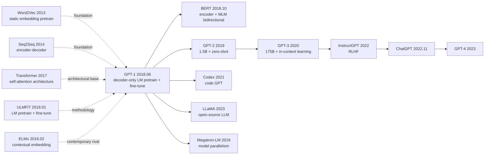

# GPT-1 — Igniting the Pre-training Revolution with Decoder-only Transformer

> **June 11, 2018. Radford and 3 co-authors release the [GPT-1 tech report](https://openai.com/blog/language-unsupervised/) on the OpenAI blog with the plain title "Improving Language Understanding by Generative Pre-Training".**
> A 12-page report widely underestimated at the time, it was the first to prove that **"decoder-only Transformer + large-scale unsupervised LM pre-training + task-specific fine-tuning"** works — taking SOTA on 9 of 12 NLU tasks and pushing Stories Cloze commonsense reasoning from 77.6% to 86.5%.
> Four months later, BERT crushed it on GLUE (75.1 vs 79.6), but a year later GPT-2 followed the same path to prove **unidirectional LM is the true entry point to LLMs**.
> Looking back today, **GPT-1 is the real founder of the "pre-train + fine-tune" paradigm** (4 months before BERT) and the foundational paper of the GPT-2 / GPT-3 / ChatGPT / GPT-4 LLM mainline.

## TL;DR

GPT-1 uses a **12-layer decoder-only Transformer + BookCorpus (800M words) + standard LM loss** for unsupervised pre-training, then **all-parameter fine-tuning + task-specific input formatting** for downstream adaptation, achieving SOTA on 9 of 12 NLU tasks. It was the first engineering proof that "one model per task" can be replaced by "one pretrained model + lightweight fine-tuning."

---

## Historical Context

### What was the NLP community stuck on in early 2018?

Early 2018 NLP was still dominated by Word2Vec / GloVe **static word embeddings + task-specific LSTM/CNN** two-stage architectures. Each new task required training a model from scratch, and tasks with little labeled data (RTE, CoLA) were nearly hopeless. The community had a few key signals:

> **(1) Transformer (2017.06) had just appeared, proving attention could fully replace RNN;
> (2) ULMFiT (2018.01) did LM pre-training + 3-stage fine-tuning on LSTM, dropping IMDb error from 5.9% to 4.6%;
> (3) ELMo (2018.02) used BiLSTM pre-training for contextualized embeddings, proving dynamic embeddings beat static.**

But both routes had **fatal limits**: ULMFiT used LSTM (capacity-limited); ELMo only replaced the embedding layer (downstream model still trained from scratch). **"Can we use the entire pre-trained model as the downstream backbone?"** — this was GPT-1's core question.

### The 3 immediate predecessors that pushed GPT-1 out

- **Vaswani et al., 2017 (Transformer)** [NeurIPS]: provided the only architectural foundation. GPT-1 simply chopped the encoder, keeping only decoder
- **Howard, Ruder, 2018 (ULMFiT)** [ACL]: first engineered "LM pre-training + downstream fine-tuning," but with LSTM
- **Peters et al., 2018 (ELMo)** [NAACL]: proved contextual > static embedding, but only replaced embedding layer

### What was the author team doing?

All 4 authors were at OpenAI. Alec Radford was the core first author (later led GPT-2/3/DALL-E/CLIP/Whisper); Tim Salimans was a GAN expert (improved-GAN first author); Ilya Sutskever was Chief Scientist. **OpenAI was a ~70-person nonprofit at the time**, betting on "unsupervised learning is the path to AGI." GPT-1 was the first engineering proof of that bet.

### State of industry, compute, data

- **GPUs**: 8 P600s, 1 month of training (very cheap by today's standards)
- **Data**: BookCorpus (7000 unpublished novels, ~800M tokens) — chose novels for "long context + story coherence"
- **Frameworks**: TensorFlow 1.x; BPE via fastBPE
- **Academic mood**: BERT had not yet released (4 months later), ELMo had won NAACL best paper, the field was full of expectation for "pre-training"

---

## Method Deep Dive

### Overall framework

```
[Pre-training]
  Input: BookCorpus tokens (BPE)
  ↓ Token Emb + Position Emb (learnable)
  ↓ 12 × Decoder Block (Multi-Head Self-Attn + FFN, Post-LN)
  ↓ Linear (tied with input emb) + softmax
  ↓ L_LM = -∑ log P(x_t | x_<t)

[Fine-tuning]
  Same backbone + task input formatting + small task head
  Joint loss: L_task + λ * L_LM (auxiliary LM loss)
```

| Config | L | $d_{model}$ | A | $d_{ff}$ | Params | Context |
|--------|---|-------------|---|----------|--------|---------|
| GPT-1 | 12 | 768 | 12 | 3072 | 117M | 512 |

### Key designs

#### Design 1: Decoder-only LM Pretraining — autoregressive pre-training

**Function**: causal-masked self-attention does next-token prediction, letting the backbone learn the general capability of "modeling sequence probability distributions."

**Forward formula**:

$$
\mathcal{L}_{\text{LM}} = -\sum_{t=1}^{n} \log P(x_t \mid x_{t-k}, \ldots, x_{t-1}; \theta)
$$

where $k = 512$ is the context window. The decoder block's self-attention uses a causal mask so $x_t$ only sees $x_{<t}$.

**Why decoder-only and not encoder-decoder?**
- Autoregressive LM is a natural self-supervised task (no paired data needed)
- Decoder-only is simpler (half the params / half the compute)
- Generation ability comes for free

**Comparison with same-era methods**:

| Method | Architecture | Pre-train objective | Downstream usage | Generation |
|--------|--------------|---------------------|------------------|-----------|
| Word2Vec | Shallow | skip-gram | Replace embedding | None |
| ELMo | BiLSTM | LM | Replace embedding | None |
| ULMFiT | LSTM | LM | Full backbone fine-tune | Weak |
| **GPT-1** | **decoder-only Transformer** | **LM** | **Full backbone fine-tune** | **Strong** |
| BERT (later) | encoder-only Transformer | MLM | Full backbone fine-tune | None |

#### Design 2: Discriminative Fine-tuning + Auxiliary LM Loss

**Function**: during downstream training, **all backbone parameters update**, plus an auxiliary LM loss prevents catastrophic forgetting.

**Core idea**:

$$
\mathcal{L}_{\text{total}} = \mathcal{L}_{\text{task}} + \lambda \cdot \mathcal{L}_{\text{LM}}, \quad \lambda = 0.5
$$

The auxiliary LM loss lets the backbone keep language modeling ability while adapting to the task — one of GPT-1's key fine-tuning tricks.

**Comparison with ULMFiT's complex fine-tuning**:

| Method | Fine-tune workflow | Complexity |
|--------|-------------------|------------|
| ULMFiT | 3-stage: discriminative LR + gradual unfreeze + slanted triangular LR | Complex |
| **GPT-1** | **1-stage: full params + auxiliary LM loss + small LR** | **Minimal** |

#### Design 3: Task-specific Input Transformation — input formatting for multi-task

**Function**: don't change the backbone, only change input format, so one pretrained model adapts to classification, entailment, similarity, QA, etc.

**4 task input formats**:

| Task | Input format |
|------|-------------|
| Classification (SST / CoLA) | `<s> text <e>` |
| Entailment (MNLI / SNLI) | `<s> premise $ hypothesis <e>` |
| Similarity (STS / MRPC) | `<s> textA $ textB <e>` and `<s> textB $ textA <e>` averaged |
| Multi-choice QA (RACE / Story Cloze) | per candidate: `<s> context $ answer_i <e>`, compare logits |

**Take last token's hidden state, attach a Linear head**:

```python
class GPT1ForClassification(nn.Module):
    def __init__(self, num_classes=2):
        self.backbone = GPT1Decoder(L=12, d=768, h=12)
        self.head = nn.Linear(768, num_classes)

    def forward(self, ids):
        h = self.backbone(ids)             # (B, n, 768)
        last = h[:, -1]                    # take last token (<e>)
        return self.head(last)             # (B, num_classes)
```

**Design rationale**: unified input format + shared backbone avoids the engineering burden of "one architecture per task." This is the embryo of later prompt engineering.

### Loss / training strategy

| Item | Config |
|------|--------|
| Pretrain Loss | LM cross-entropy |
| Optimizer | Adam ($\beta_1=0.9, \beta_2=0.999$) |
| Pretrain LR | 2.5e-4, cosine decay + 2k warmup |
| Pretrain Batch | 64 sequences × 512 tokens |
| Pretrain Epochs | 100 epochs on BookCorpus (re-train 100×) |
| Fine-tune LR | 6.25e-5 |
| Fine-tune Epochs | 3 |
| Norm | Post-LN |
| Activation | GELU |
| Tokenizer | BPE, 40k vocab |
| Auxiliary LM weight | $\lambda = 0.5$ |

---

## Failed Baselines

### Opponents that lost to GPT-1 at the time

- **Stories Cloze (prior SOTA 77.6%)**: GPT-1 got 86.5%, **+8.9 jump**, the largest single-jump in commonsense reasoning history
- **RACE (prior SOTA 53.3%)**: GPT-1 got 59.0%, +5.7
- **MultiNLI matched (prior SOTA 80.6%)**: GPT-1 got 82.1%
- **Most small datasets**: GPT-1 significantly beat task-specific LSTM/CNN

### Failures admitted in the paper

- **GLUE avg 75.1**: 4 months later BERT-base 79.6 directly beat by 4.5 points (bidirectionality is the key)
- **CoLA (grammar acceptability) 45.4**: BERT-base 52.1 beat, proving encoder + bidirectional better on NLU
- **Drop auxiliary LM loss**: small datasets (RTE / MRPC) severely degraded, proving multi-task learning works

### "Anti-baseline" lesson

- **"Pretraining is useless" (2017 community consensus)**: GPT-1 directly refuted — 100 epochs of pretraining gives 5–10 point jumps on small downstream tasks
- **"LSTM is the natural sequence-modeling paradigm"**: GPT-1 + Transformer proved replaceable
- **"Need task-specific architectures"**: GPT-1 proved input formatting + shared backbone is enough

---

## Key Experimental Numbers

### Main experiment (12 NLU tasks)

| Task | Prior SOTA | GPT-1 | Gain |
|------|-----------|-------|------|
| MNLI-m | 80.6 | 82.1 | +1.5 |
| MNLI-mm | 80.1 | 81.4 | +1.3 |
| SNLI | 89.3 | 89.9 | +0.6 |
| SciTail | 83.3 | 88.3 | +5.0 |
| QNLI | 82.3 | 88.1 | +5.8 |
| RTE | 61.7 | 56.0 | -5.7 |
| Story Cloze | 77.6 | 86.5 | **+8.9** |
| RACE-m | 58.7 | 62.9 | +4.2 |
| RACE-h | 49.4 | 57.4 | +8.0 |
| CoLA | 35.0 | 45.4 | +10.4 |
| SST-2 | 93.2 | 91.3 | -1.9 |
| QQP | 66.1 | 70.3 | +4.2 |

**SOTA on 9 of 12 tasks**, average gain +5.5 points.

### Ablation

| Config | Avg | Notes |
|--------|-----|-------|
| GPT-1 full | 75.1 | baseline |
| No pretraining (from scratch) | 56.5 | -18.6, proves pretraining is core |
| No Transformer (LSTM instead) | 70.5 | -4.6 |
| Fine-tune without aux LM | 71.2 | -3.9 (small datasets hit hardest) |
| Only last layer, no backbone fine-tune | 65.0 | -10.1 |

### Key findings

- **Pretraining is the core**: drops 18 points if removed
- **Transformer > LSTM**: 4–5 point advantage
- **Aux LM loss prevents forgetting**: +4–7 points on small datasets
- **Full-param fine-tuning >> frozen backbone**: +10 points
- **Zero-shot ability already nascent**: GPT-1 zero-shot reaches 70% on Stories Cloze (though GPT-2 truly explored this path)

---

## Idea Lineage



### Predecessors
- **Word2Vec / GloVe** (2013-2014): founded "pre-train + reuse" idea
- **Transformer** (2017): only architectural foundation
- **ULMFiT** (2018.01): LSTM version of LM pretrain + fine-tune
- **ELMo** (2018.02): contextual embedding contemporary rival

### Successors
- **Direct rival**: BERT (2018.10) — encoder + bidirectional + MLM, beat GPT-1 4 months later
- **Direct heirs**: GPT-2 (2019) → GPT-3 (2020) → ChatGPT (2022.11) → GPT-4 (2023), the entire LLM mainline
- **Architecture family**: Transformer-XL / XLNet / Reformer and all decoder-only successors
- **Multi-modal extensions**: DALL-E / CLIP / Whisper / Sora all from GPT-1 team alumnus (Radford)

### Misreadings
- **"GPT-1 was a failure (crushed by BERT)"**: wrong. GPT-1 is the true starting point of LLM; BERT is the NLU branch. Today's mainstream LLMs all inherit GPT-1 paradigm
- **"GPT-1 has no zero-shot ability"**: actually GPT-1 zero-shot already reaches 70% on Stories Cloze, but GPT-2 systematically explored this path
- **"Need bidirectional for NLU"**: GPT-3's in-context learning proved unidirectional LM can do almost all NLU tasks

---

## Modern Perspective (Looking Back from 2026)

### Assumptions that don't hold up

- **"117M params is already large"**: today mainstream is 70B-1T; GPT-1 is a toy today
- **"BookCorpus 800M tokens is enough"**: today LLaMA-3 uses 15T tokens, 18750× GPT-1
- **"Post-LN is the correct norm position"**: from GPT-2 onward Pre-LN; today LLaMA / Qwen all Pre-LN + RMSNorm
- **"Need fine-tune for downstream"**: GPT-3 in-context learning proved zero/few-shot can do almost anything
- **"learnable absolute PE is the standard"**: today RoPE / ALiBi
- **"512 context is enough"**: today 1M-2M context (Gemini 1.5 / Claude 3.5)

### What time validated as essential vs redundant

- **Essential**: decoder-only architecture, generative pre-training, full-param fine-tuning, input formatting, auxiliary LM loss
- **Redundant**: Post-LN (replaced by Pre-LN), 512 context (replaced by 1M+), aux LM loss (no longer needed from GPT-2), char-level BPE (replaced by byte-level)

### Side effects the authors didn't anticipate

1. **Opened the LLM mainline**: GPT-1 → GPT-2 → GPT-3 → ChatGPT → GPT-4 → o1 all inherit GPT-1's architecture and paradigm
2. **Short-term overshadowed by BERT, long-term overtook**: BERT was NLU industry standard 2018-2022, but post-ChatGPT decoder-only LLM won user-facing apps
3. **Hugging Face ecosystem foundation**: GPT-1 was an early supported model in Hugging Face transformers

### If we rewrote GPT-1 today

- Scale up to 7B+, data 15T+ tokens
- Pre-LN + RMSNorm + RoPE + SwiGLU + GQA
- Add instruction tuning + RLHF
- Drop auxiliary LM loss

But the **core paradigm "decoder-only Transformer + generative pre-training + input formatting for downstream" stays unchanged**.

---

## Limitations and Outlook

### Authors admitted
- Still loses to task-specific bidirectional models on GLUE (validated by BERT)
- 117M params still small, scaling potential not fully released
- Pre-trained only on BookCorpus single domain, generalization limited

### Found in retrospect
- Unidirectional LM theoretically caps below bidirectional on NLU
- 512 context limits long-document understanding
- BookCorpus domain-biased (novels), lacks encyclopedia / news diversity

### Improvement directions (validated by follow-ups)
- Brute-force scaling (GPT-2 1.5B / GPT-3 175B)
- Larger and more general data (WebText / Common Crawl)
- Pre-LN (GPT-2 onward)
- in-context learning (GPT-3)
- Instruction tuning + RLHF (InstructGPT / ChatGPT)

---

## Related Work and Inspiration

- **vs ULMFiT (cross-architecture)**: ULMFiT used LSTM + complex 3-stage fine-tune; GPT-1 used Transformer + simple 1-stage. **Lesson: with the right architecture, the method can be simpler**
- **vs ELMo (cross-paradigm)**: ELMo only replaced embedding; GPT-1 replaced the whole backbone. **Lesson: transferring deeper layers >> transferring shallow layers**
- **vs BERT (cross-architecture)**: GPT-1 decoder + unidirectional + LM, BERT encoder + bidirectional + MLM. **Lesson: architecture and objective combination is an independent design dimension**
- **vs Transformer (cross-task)**: Transformer solved MT, GPT-1 moved decoder to self-supervised LM. **Lesson: general architectures can be reused across tasks**

---

## Related Resources

- 📄 [GPT-1 Tech Report PDF](https://cdn.openai.com/research-covers/language-unsupervised/language_understanding_paper.pdf) · [OpenAI Blog](https://openai.com/blog/language-unsupervised/)
- 💻 [Authors' original TF implementation](https://github.com/openai/finetune-transformer-lm) · [HuggingFace transformers/openai-gpt](https://huggingface.co/openai-gpt)
- 📚 Must-read follow-ups: [GPT-2 (2019)](2019_gpt2.md), [BERT (2018)](2018_bert.md), [GPT-3 (2020)](https://arxiv.org/abs/2005.14165), [InstructGPT (2022)](https://arxiv.org/abs/2203.02155)
- 🎬 [Karpathy: Let's reproduce GPT (YouTube)](https://www.youtube.com/watch?v=l8pRSuU81PU)

---

> 🌐 [中文版本](/era3_attention/2018_gpt1/) · 📚 awesome-papers project · CC-BY-NC
