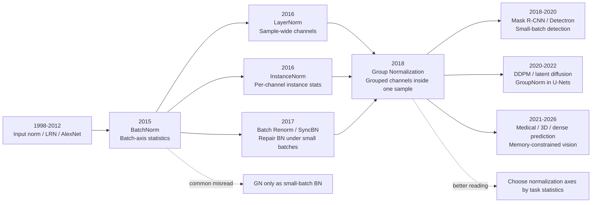

# Group Normalization - Freeing Normalization from Batch Size

> **On March 22, 2018, Yuxin Wu and Kaiming He at Facebook AI Research uploaded [arXiv:1803.08494](https://arxiv.org/abs/1803.08494), later published at ECCV 2018.** The paper did not introduce a deeper backbone or a new detection framework. It targeted a daily engineering contradiction that had become too normal to notice: BatchNorm was nearly perfect for large-batch ImageNet training, yet brittle in detection, segmentation, and video models where memory forced one or two images per GPU. GN's answer was only a reshape: split channels into groups, compute mean and variance inside each group, and ignore the batch axis. At batch size 2, ResNet-50 with BN reports 34.7% ImageNet error; GN stays at 24.1%. That 10.6-point gap turned normalization from "collect enough examples first" into "a single image can carry its own stable statistics."

## TL;DR

Wu and He's ECCV 2018 paper **Group Normalization** changes the axis of normalization rather than the backbone: for a feature tensor $x\in\mathbb{R}^{N\times C\times H\times W}$, split channels into $G$ groups and normalize over $(C/G,H,W)$ with $\mu_i=\frac{1}{|S_i|}\sum_{k\in S_i}x_k$ and $\hat{x}_i=(x_i-\mu_i)/\sqrt{\sigma_i^2+\epsilon}$, instead of computing statistics across the batch as BatchNorm (2015) does. The failed baseline it displaced was not large-batch BN on ImageNet, where BN remained excellent; it displaced the small-batch vision compromises around frozen BN, SyncBN, Batch Renormalization, LayerNorm, and InstanceNorm. On ResNet-50 ImageNet, BN jumps to 34.7% validation error at batch size 2 while GN remains at 24.1%; on COCO, Mask R-CNN R50-FPN with a long schedule improves from the frozen-BN baseline's 38.6/34.5 box/mask AP to 40.8/36.1 with GN. The downstream impact runs through diffusion U-Nets, high-resolution segmentation, 3D vision, and medical imaging: normalization is not merely an optimizer accessory, because the statistical axis decides whether a model can train under the memory constraints real vision systems actually face.

---

## Historical Context

### The small-batch anxiety of vision tasks in 2018

By 2018, computer vision did not lack strong backbones. ResNet had made 50-, 101-, and 152-layer networks routine; FPN and Mask R-CNN had moved detection and instance segmentation into the COCO era; video recognition was extending 2D CNNs into 3D spatiotemporal convolutions. On the surface, the main pressure was depth, capacity, and input resolution. In practice, one smaller number often governed the entire experiment: how many images still fit on each GPU.

BatchNorm had become almost an organ of CNNs after 2015. It stabilized training with mini-batch means and variances, while adding useful stochastic regularization. In ImageNet classification, settings such as 32 images per GPU and 256 images total made BN statistics reliable. Detection, segmentation, and video understanding were not that world. Detection and segmentation used high-resolution inputs, RoI heads, mask heads, and FPN pyramids; video models added a temporal axis, and a 32- or 64-frame clip could consume enormous memory.

The result was awkward: the tasks that needed high resolution and complicated heads most were exactly the tasks with the smallest per-GPU batch size; the smaller the batch, the less reliable BN statistics became. Fast/Faster R-CNN and Mask R-CNN often used **Frozen BN**: take the running mean and variance from ImageNet pretraining, turn BN into a fixed linear layer, and stop normalizing during fine-tuning. This avoided training collapse, but created pretraining/fine-tuning inconsistency and left new heads without reliable normalization.

### BatchNorm's success left a side effect

BN was so successful that the community partly fused "training deep CNNs" with "having a large batch." This coupling was invisible in large-scale classification, where images were small, batches were large, and BN noise regularized. In detection and 3D video, it became a hidden tax on architecture design. Researchers had to trade off longer clips, higher resolution, larger models, and reliable BN statistics.

Several patches existed. Frozen BN sacrificed fine-tuning adaptation; SyncBN synchronized statistics across GPUs but required communication and hardware scale, and constrained asynchronous training; Batch Renormalization added $r,d$ correction terms but remained batch-dependent; LayerNorm ignored the batch axis but normalized all channels together, a coarse assumption for CNN features; InstanceNorm normalized each channel independently, useful for style transfer but weak for recognition because it discarded cross-channel contrast.

GN's entrance was clean: do not repair BN by engineering a bigger effective batch; instead, define a normalization axis that never needed the batch. It sits between the LayerNorm extreme and the InstanceNorm extreme by grouping channels. That small axis choice changed the question from "how can BN survive small batches?" to "can CNN normalization be batch-independent by construction?"

### The FAIR context behind the paper

Yuxin Wu and Kaiming He were both at Facebook AI Research. Kaiming He had already been central to ResNet, Faster R-CNN, Mask R-CNN, and FPN, which matters. GN did not drop from abstract normalization theory; it grew out of everyday detection and segmentation systems. FAIR's Detectron codebase was a main experimental platform for these tasks, and frozen BN had become a visible engineering habit there.

That also explains the paper's three-part evaluation: ImageNet, COCO, and Kinetics. ImageNet shows GN is not merely a small-batch hack; at regular batch size it remains close to BN. COCO shows it solves the real fine-tuning problem in detection and instance segmentation. Kinetics shows that in 3D video, GN lets memory be spent on temporal context instead of satisfying BN's appetite for examples.

### Immediate predecessors that pushed GN out

| Predecessor | Normalization axis | Contribution then | What GN inherits or changes |
|-------------|--------------------|-------------------|-----------------------------|
| BatchNorm 2015 | $(N,H,W)$ | Stabilized CNN training and became default in ResNet/Inception | Keeps learnable $\gamma,\beta$, removes batch dependence |
| LayerNorm 2016 | $(C,H,W)$ | Batch-free and useful for RNN/sequence models | Shows batch-free is possible, but all-channel assumption is too coarse for CNNs |
| InstanceNorm 2016 | $(H,W)$ | Removes instance style statistics in style transfer | Keeps batch-free computation, restores grouped cross-channel information |
| Batch Renorm / SyncBN 2017-2018 | batch correction / cross-device batch | Repairs small-batch BN behavior | Still preserves batch statistics; GN changes the statistical axis |

Together these lines pushed the problem directly toward GN: a normalization layer needed BN's optimization stability and affine freedom without requiring the task to satisfy a large-batch premise first. GN's simplicity is the point. It adds no communication, no running correction machinery, and no new training system. It only changes the set $S_i$ over which statistics are computed: a group of channels inside the same image.

---

## Method Deep Dive

### Overall framework: moving from the batch axis to grouped channel axes

The method section of Group Normalization is short because the actual move is singular: redefine where normalization statistics come from. BatchNorm estimates the mean and variance of each channel across the batch and spatial positions. GN takes each image independently, splits its channels into groups, and estimates statistics only inside the same image, the same channel group, and the spatial positions. It does not add a correction term to BN, nor does it synchronize many GPUs to manufacture a larger effective batch. It decouples normalization from batch size as an external condition.

Let the input feature be $x\in\mathbb{R}^{N\times C\times H\times W}$. For an element $i=(i_N,i_C,i_H,i_W)$, the whole family of feature normalization layers can be written as one template:

$$
\hat{x}_i = \frac{x_i - \mu_i}{\sigma_i}
$$

The mean and standard deviation come from a statistical set $\mathcal{S}_i$:

$$
\mu_i = \frac{1}{m}\sum_{k\in\mathcal{S}_i}x_k, \qquad
\sigma_i = \sqrt{\frac{1}{m}\sum_{k\in\mathcal{S}_i}(x_k-\mu_i)^2 + \epsilon}
$$

BN, LN, IN, and GN differ not in the shape of the formula, but in the definition of $\mathcal{S}_i$:

$$
\begin{aligned}
\mathcal{S}^{BN}_i &= \{k\mid k_C=i_C\} && \text{over } (N,H,W),\\
\mathcal{S}^{LN}_i &= \{k\mid k_N=i_N\} && \text{over } (C,H,W),\\
\mathcal{S}^{IN}_i &= \{k\mid k_N=i_N, k_C=i_C\} && \text{over } (H,W),\\
\mathcal{S}^{GN}_i &= \{k\mid k_N=i_N, \lfloor k_C/(C/G)\rfloor=\lfloor i_C/(C/G)\rfloor\} && \text{over } (C/G,H,W).
\end{aligned}
$$

Finally, GN keeps the learnable affine transform inherited from BN:

$$
y_i = \gamma_{i_C}\hat{x}_i + \beta_{i_C}
$$

This formula explains GN's character. It preserves the optimization benefit of feature normalization and the per-channel learnable scale/shift, while removing noisy batch estimation, train/test behavior mismatch, and the awkward need to freeze BN during transfer.

| Method | Statistical axes | Batch-size dependent | Typical strength | Problem in the GN paper |
|--------|------------------|----------------------|------------------|-------------------------|
| BN | $(N,H,W)$ | Yes | Large-batch ImageNet classification | ResNet-50 error rises to 34.7% at batch size 2 |
| LN | $(C,H,W)$ | No | RNN / Transformer-style sequence models | All-channel statistics are coarse for CNNs; ImageNet error 25.3% |
| IN | $(H,W)$ | No | Style transfer and instance-level style removal | Per-channel isolation is too narrow; ImageNet error 28.4% |
| GN | $(C/G,H,W)$ | No | Small-batch vision, detection, segmentation, video | Slightly worse by 0.5 point when BN has large-batch regularization |

### Key design 1: the statistical set $\mathcal{S}_i$ is the real innovation

GN is counter-intuitive because it does not first explain why BN works and then imitate BN. It asks a more practical question: does a CNN feature tensor contain a statistical unit more reliable than the whole batch and more expressive than a single channel? The answer is the channel group. CNN channels are not unstructured vectors. Early layers may contain orientation, color, and frequency responses; deeper layers may contain texture, part, and shape responses. Estimating statistics over a group of related channels is finer than LayerNorm's all-channel mixing and broader than InstanceNorm's single-channel isolation.

The paper motivates this with classical hand-engineered features. SIFT, HOG, GIST, and Fisher Vectors all divide features into local or orientation groups and normalize within groups. GN ports that old computer-vision intuition into deep CNNs. A group is not a semantically pre-labeled part; it is an intermediate-granularity statistical assumption. The assumption is weak enough for the network to adapt through channel ordering, but strong enough that normalization does not degenerate into isolated per-channel processing.

From an optimization view, GN's statistics always come from the current sample itself. The normalization of an image does not change because another image happened to be placed in the same mini-batch. The same image therefore sees the same normalization rule during training and inference. BN's advantage is stable statistics and useful stochastic regularization when the batch is large. GN's advantage is that when task memory constraints squeeze batch size to 1 or 2, the statistical object still contains $C/G\times H\times W$ values and does not collapse.

### Key design 2: 32 groups are not magic, but a useful middle granularity

The paper uses $G=32$ by default. Later implementations often treat this as a fixed habit, but in the paper it is more like a robust middle point: when $G=1$, GN becomes LayerNorm, sharing one statistic across all channels; when $G=C$, GN becomes InstanceNorm, giving each channel its own statistic. Thirty-two groups sit between those extremes, giving each group enough channels without mixing every semantic response into a single population.

The ImageNet ablation supports this reading. With a fixed group count, $G=32$ gives 24.1% validation error on ResNet-50; $G=64/16/8/4/2$ stays around 24.4-24.7%, while $G=1$ (LN) reaches 25.3%. With a fixed number of channels per group, 16 channels/group is best at 24.2%; 1 channel/group (IN) reaches 28.4%. The lesson is not that 32 is mandatory. The lesson is that grouped channels are a better CNN recognition assumption than either extreme.

| Setting | Meaning | ImageNet ResNet-50 error | Reading |
|---------|---------|---------------------------|---------|
| $G=1$ | Equivalent to LN | 25.3% | All-channel statistics are too coarse |
| $G=32$ | Paper default | 24.1% | Robust middle point |
| $G=64$ | Finer groups | 24.6% | Slightly worse but usable |
| 16 channels/group | Fixed channels per group | 24.2% | Very close to the default |
| 1 channel/group | Equivalent to IN | 28.4% | Loses cross-channel information |

### Key design 3: one rule for training, transfer, and inference

BN carries an engineering complexity that is easy to understate. During training it uses mini-batch statistics; during inference it uses running mean and variance. During classification pretraining the batch is large; during detection fine-tuning the batch is small. If BN is updated during fine-tuning, its statistics are noisy. If it is frozen, it becomes a fixed linear layer and may no longer match the new task distribution. Frozen BN in Mask R-CNN and Faster R-CNN is exactly this compromise.

GN avoids the state machine. It has no population statistics, no running mean, and no separate train/inference behavior. During detection fine-tuning, replacing BN with GN in the backbone, box head, and mask head gives every newly initialized convolution a functioning normalization layer. In video models, the spatial axes simply become $(T,H,W)$ and statistics are still computed over grouped channels and spatiotemporal positions. When transferring from ImageNet to COCO or Kinetics, the normalization rule does not suddenly change.

This design is particularly visible in the COCO experiments. The paper notes that directly fine-tuning BN at detection batch size 2 loses roughly 6 AP, while frozen BN is stable but performs no actual normalization during fine-tuning. GN's gain comes from two places: pretrained features transfer under a consistent rule, and newly initialized heads receive a trainable normalization layer.

### Key design 4: a few reshape operations are enough for existing frameworks

GN's engineering impact is tied to the simplicity of its implementation. A normalization layer that requires cross-device communication, special synchronization, or complicated correction can easily remain a paper trick. GN only needs reshape, moment computation, and reshape back. The TensorFlow code in the paper is almost the entire idea of modern `GroupNorm` implementations.

```python
def group_norm(x, gamma, beta, groups=32, eps=1e-5):
    # x: [N, C, H, W]
    n, c, h, w = x.shape
    x = x.reshape(n, groups, c // groups, h, w)
    mean = x.mean(axis=(2, 3, 4), keepdims=True)
    var = ((x - mean) ** 2).mean(axis=(2, 3, 4), keepdims=True)
    x = (x - mean) / (var + eps) ** 0.5
    x = x.reshape(n, c, h, w)
    return x * gamma + beta
```

The design aesthetic is to put the complexity in the choice of statistical axis, not in the training system. SyncBN needs cross-device synchronization, Batch Renorm needs extra $r,d$ constraints and schedules, and Frozen BN needs management of pretrained statistics. GN depends only on the current tensor. That made it easy for Detectron, PyTorch, medical-imaging codebases, and diffusion U-Nets to adopt.

### Relation to BN/LN/IN

GN is often misread as "BN for small batches." A more precise description is that it organizes normalization as a spectrum of axis choices. BN chooses the batch axis, LN chooses all channels inside a sample, IN chooses one channel inside a sample, and GN chooses a group of channels inside a sample. It is not a BN patch. It fills the missing middle cell after BN, LN, and IN are written in the same formula.

This also explains why GN's influence did not appear as loudly as ResNet or Transformer. It changed the trainable boundary of many models. When resolution, video length, 3D volumes, or diffusion U-Net memory pressure prevent the batch from becoming large, GN lets researchers spend memory on model capacity or context instead of satisfying batch statistics. It is less visible than a new backbone, but it acts like a quiet bearing inside many later vision systems.

---

## Failed Baselines

### Failed baseline 1: small-batch BatchNorm is not mild degradation, but statistical distortion

The most damaging baseline in the GN paper is ordinary BN. On ImageNet with ResNet-50 and 32 images per GPU, BN reports 23.6% validation error while GN reports 24.1%, so BN remains slightly stronger. But when per-GPU batch size drops to 2, BN becomes 34.7% and GN stays at 24.1%. This is not a small fluctuation caused by imperfect tuning. The object estimated by BN has changed: each channel's mean and variance come from the spatial positions of only two images, and sampling noise is large enough to push the normalized feature distribution away from the training objective.

This failure matters because it breaks a common misconception: BN's issue is not that "smaller batches train a bit slower." The normalized values themselves become noisy random variables. BN remains usable when batch size drops from 32 to 16 to 8; at 4 and 2, errors rise to 27.3% and 34.7%. GN's curve is nearly flat: 24.1, 24.2, 24.0, 24.2, 24.1. Performance is determined mostly by the model and optimizer, not by which other images happened to share the mini-batch.

| per-GPU batch size | BN error | GN error | GN relative to BN |
|--------------------|----------|----------|-------------------|
| 32 | 23.6% | 24.1% | -0.5 points |
| 16 | 23.7% | 24.2% | -0.5 points |
| 8 | 24.8% | 24.0% | +0.8 points |
| 4 | 27.3% | 24.2% | +3.1 points |
| 2 | 34.7% | 24.1% | +10.6 points |

### Failed baseline 2: Frozen BN removes real normalization from detection fine-tuning

The common patch in detection and segmentation systems was Frozen BN. It uses the running mean and variance saved during ImageNet pretraining and turns BN into a fixed linear layer, $y=\frac{\gamma}{\sigma}(x-\mu)+\beta$. This prevents small-batch statistics from exploding, but it also means the new task, new resolution, and new RoI distribution are not normalized from current data during fine-tuning.

The GN paper shows the cost directly on COCO Mask R-CNN. With a ResNet-50 C4 backbone, Frozen BN gives 37.7 box AP / 32.8 mask AP, while GN gives 38.8 / 33.6. With ResNet-50 FPN and the long schedule, Frozen BN gives 38.6 / 34.5 and GN reaches 40.8 / 36.1. More importantly, the paper tried directly fine-tuning BN at detection batch size 2 and found a roughly 6 AP drop, so that variant was not a serious table baseline.

Frozen BN fails not by numerical collapse, but by turning representation adaptation static. For newly initialized box heads and mask heads, BN is meaningless if frozen; if unfrozen, its statistics are unreliable. GN lets those heads contain genuine normalization during training. That is why the FPN ablation can raise box AP from 38.6 to 39.5 by adding GN only to the box head.

### Failed baseline 3: LN, IN, Batch Renorm, and SyncBN each solve only half the problem

LayerNorm and InstanceNorm avoid the batch axis, but their statistical axes lie at two extremes. LN mixes all channels in one image, a coarse assumption for CNN recognition. IN normalizes each channel independently, useful for style transfer but weak for cross-channel contrast. At ImageNet batch size 32, LN gives 25.3%, IN gives 28.4%, and GN gives 24.1%. The result says that "not using the batch" is insufficient; the crucial choice is the within-sample granularity.

Batch Renorm still repairs BN from inside the BN framework, using $r,d$ to constrain the gap between current batch statistics and population statistics. The paper carefully tuned ResNet-50 with $r_{max}=1.5,d_{max}=0.5$; at batch size 4, BR gives 26.3% error, better than BN's 27.3% but still 2.1 points worse than GN's 24.2%. SyncBN moves the problem into the system layer: synchronizing statistics across GPUs increases effective batch size, but adds communication, hardware-scale requirements, and constraints on asynchronous training. It remains inelegant for small-resource or high-resolution settings.

### Experiment key data: GN becomes more valuable as memory pressure grows

The experimental design is restrained. ImageNet first shows GN is not merely a small-batch rescue trick. COCO then shows it solves a real transfer problem. Kinetics finally shows it can release temporal context. Across the three settings, the same pattern appears: when BN lives in its ideal environment, GN is close but slightly weaker; when the task must trade batch size for resolution, heads, or temporal length, GN's advantage grows quickly.

| Scenario | BN / common practice | GN | Key message |
|----------|----------------------|----|-------------|
| ImageNet R50, batch 32 | 23.6% top-1 error | 24.1% | BN is still slightly stronger with large batches |
| ImageNet R50, batch 2 | 34.7% | 24.1% | GN is 10.6 error points lower |
| COCO Mask R-CNN R50-C4 | 37.7 / 32.8 AP | 38.8 / 33.6 AP | GN beats Frozen BN during fine-tuning |
| COCO Mask R-CNN R50-FPN long | 38.6 / 34.5 AP | 40.8 / 36.1 AP | box +2.2, mask +1.6 |
| COCO from scratch R101-FPN | SyncBN R50 34.5 box AP | GN R101 41.0 / 36.4 AP | GN supports strong from-scratch detectors |
| Kinetics R50-I3D, 64 frames | 73.3 / 90.8 top-1/top-5 | 74.5 / 91.7 | GN lets longer clips show their benefit |

These numbers define GN's role. It was not designed to beat BN on large-batch ImageNet classification. It was designed to release trainability from batch-size constraints. Its decisive wins occur in detection, segmentation, video, medical imaging, and diffusion models, where memory is consumed by input structure. BN needs an ideal training environment. GN behaves more like a default insurance policy for real training environments.

---

## Idea Lineage

### Before GN: from local response, to batch statistics, to channel groups

GN has two ancestors. One is normalization as an optimization tool: early input standardization, AlexNet's Local Response Normalization, and then BatchNorm (2015), which made hidden-layer normalization a default component of deep networks. BN's success convinced the community that controlling intermediate feature distributions could make very deep networks easier to train.

The other ancestor is the group as a natural unit of visual representation. SIFT, HOG, and GIST did not treat all dimensions as an undifferentiated vector. They grouped dimensions by orientation, spatial cell, frequency, or local descriptor and normalized within those groups. ResNeXt, MobileNet, and ShuffleNet then turned group, depthwise, and channel-shuffle operations into CNN design tools. GN sits at the crossing of these lines: it inherits BN's optimization goal, but takes its statistical axis from classical vision and modern grouped-channel design.

This also clarifies GN's relation to LN and IN. LN proved that batch-free normalization could train models, but its main stage was RNNs and later Transformers. IN proved that per-instance statistics were useful for generation and style transfer, but recognition suffered when channel contrast was over-erased. GN filled the missing middle level for CNN recognition.

### After GN: the default layer in diffusion U-Nets and high-resolution vision

GN's downstream impact is clearest in models whose natural batch size is small. Diffusion U-Nets process high-resolution features, skip connections, multi-scale attention, and long training schedules; their effective batch size is rarely as comfortable as ImageNet classification. DDPM (2020) and later diffusion U-Nets widely use GroupNorm or conditional variants of GroupNorm. Stable Diffusion's latent diffusion lineage continues the same habit. In these models, GN is not a paper ablation. It is a default building block.

The same role appears in medical imaging, 3D vision, remote sensing, and dense prediction. Inputs may be 3D volumes, ultra-high-resolution images, sparse point-cloud projections, or long video clips. Batch size is hard to enlarge. What researchers need is to spend memory on spatial or temporal context rather than on satisfying BN's statistics. GN returns that choice to model design.

### Misreadings: GN is not merely "BN for small batches"

The most common misreading is to treat GN as a BN replacement only for small batches. That statement is not false, but it is too narrow. The lasting principle is that a normalization layer's statistical axis should match the task's resource constraints and representation structure. Language models moved toward LN and RMSNorm because sequence modeling does not naturally depend on image channel groups. Diffusion and segmentation models often use GN because high-resolution vision is batch-size constrained. Large-batch classification can still use BN because batch statistics are accurate and regularizing there.

Another misreading is that GN is always better than BN. The paper is honest: at regular ImageNet batch size, BN is 23.6% and GN is 24.1%, because GN loses part of BN's stochastic regularization. GN's value is not universal dominance. It is that when BN's premise fails, one no longer has to patch the problem through freezing, synchronization, or shrinking the input.

### Mermaid lineage map



| Descendant | What it inherited | How it changed the idea |
|------------|-------------------|--------------------------|
| Mask R-CNN / Detectron | Normalization works in both backbone and heads under small batches | Moved the idea from classification to detection / segmentation fine-tuning |
| DDPM / diffusion U-Net | Batch-independent normalization as a default block | Combined GN with timestep embeddings and AdaGN / scale-shift conditioning |
| Medical and 3D vision | Stable training at batch size 1-2 | Extended axes from 2D $(H,W)$ to 3D $(D,H,W)$ or spacetime $(T,H,W)$ |
| Normalization-free networks | Inherited GN's question in reverse | Tried to remove normalization, but needed more complex initialization and recipes |

GN's place in idea history is not "a trick with higher AP." It is the point where the statistical object of normalization became explicit. Once you ask which elements belong in $\mathcal{S}_i$, normalization is no longer a black-box layer. It becomes a joint assumption about data structure, hardware constraints, and optimization path.

---

## Modern Perspective

### Assumptions that no longer hold

First, the paper still assumes that visual CNNs are the main stage. In 2018, GN targeted the ResNet, Mask R-CNN, and I3D line of convolutional vision systems. From a 2026 view, the normalization landscape is more fragmented. Transformer backbones typically use LayerNorm, RMSNorm, or variants; visual generation U-Nets and dense prediction models often use GN; large-batch classification or detection may still use BN or SyncBN. GN did not become the universal normalization layer for all models. It became a strong default for small-batch high-resolution vision.

Second, the paper treats $G=32$ as a robust default, but does not solve how groups should be learned. A modern redesign might tie grouping to channel semantics, attention heads, conditional modulation, or hardware layout, rather than slicing channels in fixed order. GN's groups are static and assume adjacent channels form reasonable groups. That is good enough for ordinary CNNs, but not necessarily optimal in hybrid architectures, dynamic channel reordering, or cross-modal features.

Third, GN gives up part of BN's stochastic regularization. The paper already observes that GN has lower training error but slightly higher validation error at regular large-batch ImageNet settings, suggesting that it acts more like an optimization stabilizer and less like a random regularizer. Modern practice usually fills that gap with data augmentation, dropout, stochastic depth, weight decay, or EMA.

### If rewritten today

If GN were rewritten today, the method section would probably place it in a broader normalization design space: statistical axes, affine parameters, conditional modulation, running statistics or not, mean-centering or RMS-only scaling, and alignment with attention/head structure. It would be mapped against RMSNorm, ScaleNorm, EvoNorm, Batch-Channel Norm, AdaGN, and normalization-free networks, not only BN/LN/IN.

The experiments would also expand. Beyond ImageNet, COCO, and Kinetics, a modern paper would likely include diffusion U-Nets, latent diffusion, medical segmentation, 3D detection, large-resolution semantic segmentation, and extreme batch-size-1 settings. Stronger ablations would ask: does GN's gain come from batch independence or from grouped-channel statistics? Should group count change by stage? Is AdaGN simply GN turned into a stronger conditional injection interface?

Implementation would receive a different emphasis. `torch.nn.GroupNorm(num_groups, num_channels)` is now a standard layer; many models write Conv-GN-SiLU as a template. In 2018, "a few lines of code" argued for adoptability. Today it is ordinary engineering knowledge.

### Limitations, related work, and resources

GN has three main limitations. First, it is not a free lunch: in large-batch classification, BN's statistical noise can regularize, and GN often needs other regularizers to close the gap. Second, fixed grouping is an assumption rather than a learned result. If channel ordering lacks semantic locality, within-group statistics may not be optimal. Third, GN solves the statistical-axis problem, not every normalization-related issue: deep residual scaling, optimizer hyperparameters, mixed-precision stability, and activation-scale control in very large models remain separate problems.

Related work is easiest to read in three lines. The foundational normalization line includes BatchNorm (2015), LayerNorm, InstanceNorm, WeightNorm, and Batch Renorm. The vision-systems line includes Mask R-CNN, FPN, Detectron, and I3D. The downstream-use line includes DDPM, latent diffusion / Stable Diffusion, medical-imaging U-Net variants, and normalization-free networks. The primary resources are the paper [arXiv:1803.08494](https://arxiv.org/abs/1803.08494) and FAIR Detectron's [GN project code](https://github.com/facebookresearch/Detectron/tree/master/projects/GN).

| Resource | Use | Note |
|----------|-----|------|
| arXiv:1803.08494 | Original paper | Most complete formulas and ImageNet/COCO/Kinetics tables |
| Detectron GN project | Official implementation and COCO configs | Shows how GN replaces Frozen BN |
| PyTorch `GroupNorm` | Modern framework implementation | Batch-independent by default, common in Conv-GN-Activation blocks |
| DDPM / latent diffusion code | Downstream influence examples | GN is often combined with conditional modulation |

### What readers should take away

The deeper lesson of Group Normalization is that a normalization layer is not a neutral plugin. It writes assumptions about data, hardware, and optimization into a statistical set. BN assumes the mini-batch is a trustworthy population approximation. LN assumes all channels inside a sample can share scale. IN assumes each channel should be handled independently. GN assumes a group of channels and spatial positions provides stable statistics. Change the statistical set, and the boundary of trainable tasks changes.

That is why GN belongs in a classic-paper list. It does not provide a module as visually iconic as ResNet's residual block, and it did not redirect the entire AI backbone the way Transformer did. It solved a quieter but very real problem: when the real task refuses to give you an ideal batch size, the model still has to train. That problem reappeared in detection, segmentation, video, medical imaging, and diffusion generation. GN's answer was simple enough to become one of the least visible and most reliable layers in those systems.


---

> 🌐 [中文版](/era3_attention/2018_group_norm/) · 📚 awesome-papers project · CC-BY-NC