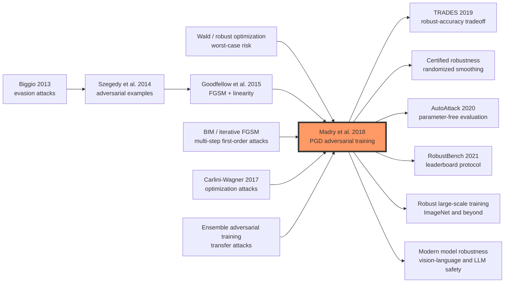

# PGD Adversarial Training — Robustness as Min-Max Optimization

> **On June 19, 2017, Aleksander Madry, Aleksandar Makelov, Ludwig Schmidt, Dimitris Tsipras, and Adrian Vladu posted [arXiv 1706.06083](https://arxiv.org/abs/1706.06083), later published at ICLR 2018.** The paper did not propose a new layer, a new vision backbone, or a cleaner benchmark trick. Its move was colder: write adversarial robustness as a min-max problem, let the attacker maximize loss inside an ε-ball, then train the model on that worst-case point. PGD became the field's stress test. Their MNIST model still reached **89.3%** under 100-step, 20-restart white-box PGD; CIFAR-10 still reached **45.8%** under 20-step PGD at ε=8. After this paper, a defense could no longer be judged by whether it survived one named attack. It had to say what threat model it optimized, how hard the inner maximization was, and whether the evaluation was stronger than the training adversary.

## TL;DR

PGD adversarial training, published at ICLR 2018 by Madry, Makelov, Schmidt, Tsipras, and Vladu, turned adversarial robustness from “patch the model against this particular attack” into a robust-optimization objective: $min_θ E_{(x,y)∼D}[max_{δ∈S} L(θ,x+δ,y)]$, where the inner adversary searches an allowed set $S={δ: ||δ||∞≤ε}$ for the highest-loss perturbation and the outer learner minimizes that worst-case loss. The failed baseline it replaced was [FGSM adversarial training (2014)](../era2_deep_renaissance/2014_adversarial_examples.md) and the broader family of defenses tuned to named attacks, detectors, or distillation tricks. A naturally trained MNIST model in the paper reached 99.2% clean accuracy, but collapsed to 6.4% under FGSM; FGSM-trained models could also suffer label leaking and did not become reliably robust to iterative PGD. Madry's recipe used randomly initialized multi-step PGD as a “first-order adversary,” yielding 89.3% MNIST accuracy under 100-step, 20-restart white-box PGD and 45.8% CIFAR-10 accuracy under 20-step white-box PGD.

The counterintuitive lesson is that the paper did not prove neural networks globally safe. It did something more durable for empirical research: it made robustness a reproducible optimization protocol. TRADES, AutoAttack, RobustBench, certified robustness, and large-scale robust ImageNet training all inherit or correct this protocol. Even the post-[Transformer (2017)](2017_transformer.md) era keeps the same uncomfortable question: a stronger model is not necessarily safer under local worst-case perturbations.

---

## Historical Context

### 2014 to 2017: adversarial examples became a security problem

In 2014, Szegedy and coauthors exposed an awkward fact: a deep network could assign a completely wrong high-confidence label to an input that looked almost unchanged to humans. In 2015, Goodfellow, Shlens, and Szegedy interpreted the phenomenon through approximate linearity in high-dimensional space and introduced FGSM: take one step in the sign of the input gradient and a strong adversarial example appears. At that stage, the field had discovered a vulnerability, but it had not yet agreed on what a serious defense should mean.

By 2016-2017, the problem looked less like a curiosity and more like security engineering. Neural networks were moving into autonomous driving, medical imaging, and content moderation. Carlini-Wagner attacks showed that defensive distillation was not reliable. Tramèr and coauthors studied transferability and made black-box attacks feel practical through substitute models. A defense paper that only said “we survive FGSM” was no longer convincing, because a slightly stronger iterative optimizer could often get around it.

### Why older defenses were not enough

The PGD paper was not targeting a single failed method. It was targeting an evaluation habit. Many defenses were tied to a particular attack: FGSM adversarial training used one-step linearization; defensive distillation changed softmax temperature; feature squeezing and detectors tried to identify abnormal inputs or activations. These methods could work against the attack they were designed around, but they rarely stated what guarantee remained if the attacker changed the optimization procedure.

Madry's central language shift was to replace the attack-defense contest with “threat model plus worst-case optimization.” Once the allowed perturbation set is specified, such as $||δ||∞≤ε$ for images, the defense should not merely block one script. It should make every allowed perturbation low-loss. This view places attack and training in the same formula: the attack is the inner maximization, and the defense is the outer minimization.

### The MIT paper changed the question

The author team was at MIT, with roots in optimization, theoretical computer science, and machine learning. The paper has that flavor: it does not begin by promising a new architecture. It first asks what the security objective is. The authors borrow the form of robust optimization, going back to Wald-style worst-case risk, and attach it to input perturbations in deep learning.

The real question then becomes: the inner maximization is highly non-concave and the outer training problem is highly non-convex, so can we solve the resulting saddle-point problem well enough in reasonable time? If not, robust optimization is only a beautiful formula. If yes, adversarial training can become a reproducible protocol rather than a heuristic. Madry's empirical claim is the latter: random-restart PGD finds local maxima that are far apart in input space, yet their loss values are highly concentrated, so PGD can serve as a strong representative of first-order adversaries.

### Data, compute, and engineering context

The experiments center on MNIST and CIFAR-10. Today those benchmarks look small, but in 2017 they were ideal for asking a cleaner question: under a controlled threat model, can strong iterative attacks and adversarial training form a closed loop? MNIST uses a two-convolution network with perturbation radius $ε=0.3$. CIFAR-10 uses ResNet and a 10-times-wider variant with radius $ε=8$ in the paper's 0-255 pixel-scale notation.

The engineering move mattered too. The paper released `MadryLab/mnist_challenge` and `MadryLab/cifar10_challenge`, inviting the community to attack the models. That is a cultural ancestor of later robustness evaluation: RobustBench, AutoAttack, and attack checklists all inherit the idea that a defense must survive evaluation stronger than the one its authors happened to train against.

---

## Method Deep Dive

### Overall framework

The PGD paper can be compressed into one sentence: define what the attacker is allowed to do, then train the model against the worst input that attacker can find. It replaces ordinary empirical risk minimization with robust risk minimization. Standard training minimizes loss on natural samples. PGD adversarial training first searches the perturbation set around each sample for the highest-loss point, then updates the model on that point.

| Component | Ordinary ERM | PGD adversarial training | Role |
|-----------|--------------|--------------------------|------|
| Input | Natural sample $x$ | Worst perturbed sample $x+δ$ | Average-case point to local worst-case point |
| Attack | No inner attack during training | Multi-step PGD approximates inner maximization | Keeps pressure on the model |
| Defense objective | Clean accuracy | Adversarial loss | Accountable to a threat model |
| Evaluation | Natural test set | White-box PGD / CW / transfer attacks | Checks whether the model only adapted to one attack |

The important part is not the string “PGD” itself. It is the embedding of an attack algorithm into the training objective. PGD was the strongest practical first-order inner solver at the time; if a later threat model or inner optimizer is better, the formula still survives.

### Design 1: the robust-optimization formula states the defense target

The paper's central object is a saddle-point problem:

$$
min_θ ρ(θ),  ρ(θ)=E_{(x,y)∼D}[ max_{δ∈S} L(θ,x+δ,y) ]
$$

Here $S$ is the allowed perturbation set, and the paper mainly uses $S={δ: ||δ||∞≤ε}$. The inner $max$ is the attacker: search inside the ε-ball for the input that makes the current model incur the largest loss. The outer $min$ is the learner: change parameters so that this worst-case loss becomes small.

This formula makes robustness auditable. If the inner maximization were solved globally and the adversarial loss were nearly zero, then no perturbation inside $S$ could create high loss. In practice the global maximum is unavailable, so the paper's claim is more careful: PGD provides a strong empirical guarantee against a class of first-order adversaries, not a mathematical certificate.

### Design 2: PGD as the “universal first-order adversary”

FGSM can be read as one step of inner maximization: $x_adv=x+ε sign(∇_x L(θ,x,y))$. PGD repeats that move and projects back to the allowed set after each step:

$$
x^{t+1}=Proj_{x+S}(x^t + α sign(∇_x L(θ,x^t,y)))
$$

The paper stresses random starts. If PGD begins only at the natural sample $x$, it may explore a narrow path inside the ε-ball. Starting from many random points inside the ball and then performing projected gradient ascent scans the local loss landscape more systematically. With $10^5$ random restarts, the authors observed that different local maxima were far apart in input space, but their final loss values were highly concentrated. That observation supports the use of PGD as a representative first-order attack.

| Attack | Steps | Random start? | Main issue | Role in the PGD paper |
|--------|-------|---------------|------------|-----------------------|
| FGSM | 1 | No | Narrow attack, label leaking | Failed baseline |
| R+FGSM | 1 plus random perturbation | Yes | Stronger than FGSM but shallow | Intermediate baseline |
| PGD | Multi-step | Yes | More expensive | Main training and evaluation attack |
| CW | Multi-step optimization | Configurable | Different loss, higher cost | Independent strong evaluation |

### Design 3: put PGD inside the training loop

During training, PGD is not merely a testing script. It is the inner subroutine for every batch. The loop is: add a random perturbation, run K PGD steps to approximate the worst-case point, compute loss on those adversarial examples, and update model parameters. The paper also notes that the same example appears across epochs, so each future encounter gives a new random start; multiple restarts inside every batch are usually unnecessary.

```python
def pgd_adversarial_training(model, batch, eps, alpha, steps, optimizer):
    x, y = batch
    delta = uniform(-eps, eps, shape=x.shape)
    for _ in range(steps):
        delta.requires_grad_(True)
        loss = cross_entropy(model(x + delta), y)
        grad = autograd_grad(loss, delta)
        delta = delta + alpha * sign(grad)
        delta = clamp(delta, -eps, eps).detach()
        delta = clamp(x + delta, 0, 1) - x
    optimizer.zero_grad()
    robust_loss = cross_entropy(model(x + delta), y)
    robust_loss.backward()
    optimizer.step()
```

In this pseudocode, `delta` is the state of the inner adversary. The outer optimizer does not see the average natural-sample loss. It sees the approximate worst-case loss found by PGD. Intuitively, this pushes the decision boundary away from the whole ε-ball around each training example.

### Design 4: capacity is not an accessory; it is a prerequisite for robustness

One underappreciated conclusion is that a strong adversary is not free. Small models may fail to learn. The authors widen a small MNIST convolutional network step by step and compare ResNet with a 10-times-wider variant on CIFAR-10. The conclusion is direct: if capacity is insufficient, PGD training can force the model to sacrifice natural accuracy or even converge to predicting a single class; once capacity is large enough, the saddle-point objective decreases much more meaningfully.

This result has been rediscovered many times. A robust decision boundary is usually more complex than a natural decision boundary because it must separate whole ε-balls around samples, not isolated points. Larger models, longer training, and stronger augmentation are often not cosmetic SOTA chasing; they provide the function space needed for this thick boundary.

### Training details and complexity

MNIST uses 40 PGD steps, step size 0.01, and radius $ε=0.3$. CIFAR-10 training uses 7 PGD steps with step size 2, while the strongest white-box evaluation uses 20 steps at radius $ε=8$. These numbers embody a tradeoff: a stronger inner PGD makes training slower; a weak inner PGD risks teaching the model only the training attack.

In complexity terms, PGD adversarial training multiplies each batch by K inner attack steps plus one outer update. With K=7, training costs roughly 7-8 times natural training. Later methods such as fast adversarial training, free adversarial training, and YOPO all try to reduce this multiplier, but they still use the Madry objective as the reference point.

---

## Failed Baselines

### FGSM adversarial training: one step is too narrow, and the signal can be exploited

The most direct baseline replaced by the PGD paper is FGSM adversarial training. FGSM is clean as an idea: move once in the sign of the input gradient, push the example to the boundary of the $\epsilon$-ball, and train on that perturbed sample. The problem is that it only sees a first-order linearization of the local loss landscape, and it takes only one step. If a model sees that fixed pattern repeatedly during training, it may learn not that the whole perturbation set is safe, but that this particular one-step perturbation carries exploitable label information.

The paper describes this as label leaking: FGSM perturbations can encode class-correlated patterns, so accuracy on FGSM examples may even exceed accuracy on natural examples. That is not a successful defense. It is contamination of the evaluation target by the training procedure. Multi-step random-start PGD is designed to remove this loophole: the attacker should not start from a fixed point and take one move; it should repeatedly ascend and project from varied points in the perturbation set, approximating a real local worst case.

### Defensive distillation: changing gradient shape is not the same as lowering worst-case risk

Defensive distillation was one of the prominent defenses around 2016. It trained teacher and student models with high-temperature softmax outputs, aiming to smooth the decision surface and reduce gradients. Carlini-Wagner attacks soon showed that the method often made the original attack's gradient information worse without making the model genuinely low-loss throughout the allowed perturbation set. Once the attacker changed the loss or optimization procedure, the defense could collapse.

The PGD paper does not single out defensive distillation as its only target, but it gives a more general diagnostic language. If a defense merely makes one attack script hard to optimize, while leaving $max_{\delta \in S} L(\theta, x+\delta, y)$ high, it has solved an optimization illusion rather than robustness. “Gradient masking” later became one of the most common review warnings in robustness papers, and the Madry paper helped make that cultural shift possible.

### Detectors and input preprocessing: finding abnormality is not resisting white-box attack

Another family of failed baselines includes detectors, feature squeezing, input quantization, denoising, and preprocessing defenses. Their logic is that adversarial examples differ from natural examples in some detectable statistics, so one can detect or clean them before classification. This can help in black-box or weak white-box settings, but once the threat model allows the attacker to know the detector, the attack objective becomes: fool the classifier and bypass the detector.

In the Madry view, those components are folded into the model and loss. As long as the attacker can differentiate through the whole system, the object to evaluate is still worst-case loss, not a standalone detection accuracy. This influenced later evaluation practice: robustness moved from “did this module block the attack?” toward “how much end-to-end accuracy remains under adaptive attack?”

### Transfer-only or single-script evaluation: the attack budget is too weak

Many papers around 2017 reported transfer attacks, FGSM, BIM, or a small number of white-box iterative attacks. The issue is not that these attacks are useless. The issue is that a single attack does not represent a threat model. If a defense works only for one step size, one loss, or one initialization, it may have overfit the evaluation script.

The random-restart experiments in the PGD paper address exactly this concern. The authors start from many random points in the perturbation set and observe the local maxima reached by PGD. The maxima can be far apart in input space, but their final losses are very close. This is not a theorem, but it is a strong empirical reason to treat random-restart PGD as a stress test that is hard to bypass within the class of first-order adversaries.

## Key Experimental Numbers

### MNIST: from fragile high accuracy to an attackable challenge

MNIST is the paper's cleanest experimental sandbox. A naturally trained model is nearly perfect on clean test data, but collapses under simple attacks. PGD adversarial training sacrifices some clean accuracy and gains much higher accuracy against strong white-box PGD.

| Model / evaluation | Clean accuracy | FGSM / one-step attack | Strong PGD / restarts | Reading |
|--------------------|----------------|------------------------|-----------------------|---------|
| Naturally trained MNIST | 99.2% | 6.4% | Nearly collapses | Clean accuracy says little about local robustness |
| FGSM adversarial training | Appears high | May show label leaking | Unstable against multi-step PGD | The training attack is too weak |
| PGD adversarial training | Around 98% | Stable | 89.3% with 100 steps and 20 restarts | Effective against a strong first-order attack |
| Small-capacity model only | Drops sharply | Unstable | Can predict one class | Capacity cannot support the saddle point |
| Wider-capacity model | Better clean / robust balance | More stable | Robust loss decreases clearly | Robustness needs function space |

The historical importance of these numbers is not MNIST itself. It is the evaluation posture: the authors released challenge models and invited outside attackers. Robustness began to move from author self-evaluation toward community attempts to break the defense.

### CIFAR-10: robustness shows its real cost

CIFAR-10 is closer to realistic vision than MNIST. Under an $L_\infty$ threat model with $\epsilon=8$, the paper trains ResNet and a much wider ResNet, showing that robustness is not a free add-on: clean accuracy decreases, training cost multiplies, and model capacity matters.

| Setting | Training attack | Evaluation attack | Representative result | Meaning |
|---------|-----------------|-------------------|-----------------------|---------|
| Naturally trained CIFAR-10 | None | 20-step PGD | Robust accuracy near 0 | Standard ERM boundaries sit too close to data |
| PGD-trained ResNet | 7-step PGD | 20-step PGD | About 45% robust accuracy | Strong training attacks raise the lower bound |
| 10x wider model | 7-step PGD | 20-step PGD / CW | More stable than narrow models | Capacity affects saddle-point optimization |
| Black-box transfer attack | Substitute model | Transfer | Weaker than white-box threat | White-box PGD is the stricter evaluation |

The 45.8% figure looks modest today, but it had two values at the time. First, it showed that strong white-box robustness was not impossible. Second, it made the cost explicit: robust CIFAR-10 is a much harder problem than ordinary CIFAR-10.

### Random restarts and loss concentration: PGD was not chosen casually

The most methodological experiment in the paper studies the inner optimization landscape. The authors start PGD from many random points inside the perturbation set and compare the local maxima it reaches. The locations can differ substantially, but the final losses are tightly concentrated.

| Object observed | Phenomenon | Paper's interpretation | Influence on later work |
|-----------------|------------|------------------------|-------------------------|
| Many random starts | Converge to different locations | The non-concave landscape has many local peaks | Random restarts are needed |
| Final loss values | Highly concentrated | First-order attacks find similarly bad points | PGD can serve as a strong representative attack |
| Landscape after adversarial training | Harder to find high loss | Outer training raises local robustness | The training / evaluation loop is meaningful |

This observation also explains the paper's careful wording. PGD is not a global optimality certificate. It is an empirically strong and stable first-order adversary. AutoAttack and RobustBench later continue the same principle: trust broad, parameter-robust attack coverage more than one hand-tuned attack run.

### Capacity observation: robust models must learn thicker boundaries

The paper repeatedly emphasizes that robustness requires larger capacity. This point is often overshadowed by the PGD training recipe, but it mattered for the next decade. Natural classification separates training points; $L_\infty$ robust classification must separate small boxes around those points. Geometrically, the model needs a thicker, more complex decision boundary that stays farther away from the data.

Therefore, failure under PGD adversarial training is not always because the attack is too strong. It can mean that model capacity, training time, or optimization budget is insufficient. Later WideResNet, PreAct ResNet, large-scale augmentation, and semi-supervised robust training all respond to this observation: robustness is not a post-processing plug-in. It changes the design of model, data, and compute budget together.

---

## Idea Lineage

### Predecessors: robust optimization, adversarial examples, and strong evaluation converge

The PGD paper did not descend from one deep learning trick. One lineage is robust optimization and minimax decision-making: since Wald-style worst-case risk, the question has been how a decision maker should control loss when the environment chooses the least favorable input. A second lineage is machine-learning security: Biggio studied evasion attacks against linear classifiers and SVMs, and Szegedy and coauthors brought adversarial examples into modern deep networks. A third lineage is the attack algorithm itself: FGSM showed that one gradient step could be damaging, BIM / iterative FGSM showed that multi-step attacks were stronger, and Carlini-Wagner attacks broke many defenses that had looked effective.

The Madry paper joins these lines. It does not treat attack and defense as two competing script libraries. It places them in the same saddle-point objective. The attacker performs the inner maximization; the learner performs the outer minimization. PGD's role is to turn that abstract objective into a runnable, reproducible, challengeable experimental protocol.



### Successors: from PGD recipe to the shared language of robustness research

After 2018, PGD adversarial training quickly became the default baseline. A new defense that did not compare against Madry-style PGD training was hard to take seriously in the robustness community. TRADES made the tradeoff between robust accuracy and natural accuracy more explicit, controlling the boundary with a KL term. MART, AWP, RST, and semi-supervised robust training continued to modify objectives, regularization, and data sources. They do not all copy the exact hyperparameters of the Madry paper, but they accept the same core premise: training must face a strong inner adversary.

The other successor line is evaluation. AutoAttack combines APGD, FAB, Square Attack, and related components to reduce hand-tuning. RobustBench turns models, threat models, and attack protocols into a public leaderboard. Athalye and coauthors' “Obfuscated Gradients” checklist made gradient masking a standard defense-paper warning. The Madry paper changed more than a training method. It shaped reviewing norms: strong white-box attacks, random restarts, explicit threat models, and public code became part of the field's basic etiquette.

### Misreadings: PGD is not a safety certificate, and it is not the end of all attacks

The most common misreading is to treat “PGD robust” as “safe.” PGD covers a specified perturbation set and a class of first-order adversaries. If the threat model changes to $L_2$, spatial transformation, patch attack, physical-world attack, distribution shift, or semantic perturbation, robustness from PGD training may not transfer. Even inside the same $L_\infty$ ball, PGD is a strong empirical attack, not a global maximization certificate.

A second misreading is that adversarial training merely means running a few more attack steps during training. The threat model and objective are the real objects. If $\epsilon$ is inappropriate, or if the inner attack is too weak, the model may exhibit catastrophic overfitting, gradient masking, or adaptation only to the training attack. PGD is a tool, not a clean bill of health.

A third misreading is to interpret lower robust accuracy as training failure. After the Madry paper, more work showed that natural accuracy and robust accuracy can trade off in real ways; some non-robust features useful for ordinary classification are deliberately discarded by adversarial training. A robust model is not an ordinary model with armor bolted on. It is often learning a different classification rule.

---

## Modern Perspective (Looking Back from 2026)

### From a defense recipe to an evaluation culture

Looking back from 2026, PGD adversarial training has become more than a training recipe. It raised the minimum unit of discussion in robustness papers from “this attack script” to “threat model, inner optimization, outer training, and independent evaluation.” That language still works today. Whether the subject is image classification, speech recognition, diffusion models, vision-language models, or LLM jailbreaks, the first question is what the attacker is allowed to do, and the second is whether the model merely adapted to the evaluation script.

The paper also made “publicly accepting attacks” an academic posture. The MadryLab MNIST and CIFAR challenges were not ordinary code releases; they placed models in front of the community for white-box attacks. RobustBench, AutoAttack, AdvBench, and jailbreak benchmarks inherit the same spirit. Robustness cannot be declared only by the authors of a defense. It needs stronger, more independent, more adaptive attacks.

### Assumptions that did not hold up

First, **PGD is a sufficient representative of all threat models** did not hold up. PGD is very strong for small-norm $L_p$ perturbations, but real systems also face rotation, cropping, patches, lighting, physical printing, semantic rewrites, prompt injection, and multi-turn interaction attacks. PGD clarifies one family of threat models. It does not cover safety in general.

Second, **empirical robustness naturally extrapolates** did not hold up. A model robust on CIFAR-10 at $L_\infty$ radius 8 is not thereby robust on ImageNet, OpenImages, medical images, or real camera data. Robustness depends sharply on the data distribution, perturbation set, and evaluation protocol.

Third, **a strong enough inner attack lets outer training solve the problem** was too optimistic. Strong PGD training is expensive, can trade off natural accuracy, often needs larger models and more data, and can optimize irrelevant robustness if the threat model is wrong. Robust training is one part of security engineering, not the whole of security engineering.

### What time validated as essential versus incidental

| Design / claim | Later status | Reason |
|----------------|--------------|--------|
| Min-max robust optimization formula | Core legacy | Gives defenses an auditable objective |
| Random-restart multi-step PGD | Core empirical tool | Exposes fragility under first-order threat models |
| Explicit $L_\infty$ threat model | Necessary but insufficient | Enables comparison but cannot represent all safety risks |
| MNIST / CIFAR challenge | Evaluation-culture legacy | Encouraged public models, public attacks, and public rankings |
| PGD equals safety | Corrected by time | Applies only to the specified perturbation and attack family |

What survived is not a fixed step count or step size. It is a research habit: state what the attacker can do, evaluate worst cases with a strong enough inner search, and submit the training method to external evaluation that is harsher than the training adversary.

### If we rewrote the PGD paper today

A 2026 rewrite would broaden the experiments. Beyond MNIST and CIFAR-10, it would likely include ImageNet subsets, physical perturbations, semantic perturbations, patch attacks, out-of-distribution tests, and safety evaluations for generative models or VLMs. It would also discuss adaptive attacks earlier: the attacker knows the defense, training objective, and preprocessing, and can combine losses and initializations.

The training section would also report compute more systematically. The 7-8x cost of PGD training was already visible in 2018; in the age of large models it is impossible to ignore. A modern version would compare fast/free adversarial training, TRADES, AWP, large-scale data, self-supervised pretraining, and certified methods, treating clean accuracy, robust accuracy, and compute as joint metrics rather than reporting robust accuracy alone.

## Limitations and Outlook

### Limits admitted by the paper or exposed by the experiments

The clearest limit is that the paper gives empirical robustness, not a formal certificate. Failure to find an attack with PGD does not prove no attack exists. As long as the inner maximization lacks a global optimality guarantee, the robustness conclusion depends on attack strength. This is not a flaw in the paper so much as the reality of non-convex deep learning.

A second limit is the narrow threat model. The paper mainly studies small $L_\infty$ perturbations. That set is convenient for pixel-space image experiments, but it does not perfectly match human perception, physical-world variation, or semantic change. One $L_\infty$ perturbation may be visible to humans, while a meaning-preserving semantic rewrite may lie entirely outside the set.

A third limit is the cost and accuracy tradeoff. PGD training is expensive, usually lowers clean accuracy, and is sensitive to capacity, augmentation, and training schedule. The paper already saw the capacity issue, but it took the following decade to unfold the full role of data scale and training technique.

### Limits visible in retrospect

The powerful narrative of the PGD paper had a side effect: the robustness community spent a long time highly concentrated on fixed $L_p$ benchmarks. That concentration created comparability, but it also narrowed the field of view. Many real attacks are not tiny pixel perturbations. They are object-level changes, sensor changes, text prompts, tool calls, or human-in-the-loop strategies.

Another limit is that robust training can be mistaken for a model property rather than a system property. Deployment also involves input pipelines, sensors, compression, thresholds, human review, monitoring, rollback, and permission boundaries. PGD optimizes local classifier loss. System safety needs a larger loop.

### Improvement directions validated by follow-up work

Follow-up work splits roughly into five routes. TRADES and MART modify the objective to handle the robust-natural tradeoff more explicitly. AWP, extra data, and semi-supervised robust learning improve training stability and data supply. AutoAttack and RobustBench improve evaluation protocols. Randomized smoothing, interval bound propagation, and convex relaxation provide certified radii. Physical, semantic, patch, and jailbreak attacks expand the threat model toward real system boundaries.

None of these routes overturn the Madry paper. They fill in the same map. PGD adversarial training marked the main road of empirical robust optimization; later work keeps asking about certificates, cost, scalability, threat-model realism, and system-level safety.

## Related Work and Inspiration

- **Szegedy et al. (2014)**: brought adversarial examples in modern deep networks to mainstream attention.
- **Goodfellow et al. (2015)**: introduced FGSM and the linearity explanation, the most direct predecessor attack.
- **Carlini-Wagner (2017)**: broke defensive distillation with optimization attacks and pushed evaluation standards upward.
- **Athalye et al. (2018)**: systematized obfuscated gradients and, together with Madry-style evaluation, shaped defense-review culture.
- **TRADES (2019)**: wrote the robust-natural accuracy tradeoff as a more explicit optimization objective.
- **AutoAttack / RobustBench (2020-2021)**: institutionalized strong evaluation and public robustness leaderboards.

## Related Resources

- Paper: [Towards Deep Learning Models Resistant to Adversarial Attacks](https://arxiv.org/abs/1706.06083)
- Official MNIST challenge: [MadryLab/mnist_challenge](https://github.com/MadryLab/mnist_challenge)
- Official CIFAR-10 challenge: [MadryLab/cifar10_challenge](https://github.com/MadryLab/cifar10_challenge)
- Robustness benchmark: [RobustBench](https://robustbench.github.io/)
- Evaluation tool: [AutoAttack](https://github.com/fra31/auto-attack)
- Background tutorial: [Adversarial Robustness - Theory and Practice](https://adversarial-ml-tutorial.org/)


---

> 🌐 [中文版](/era3_attention/2018_pgd/) · 📚 awesome-papers project · CC-BY-NC