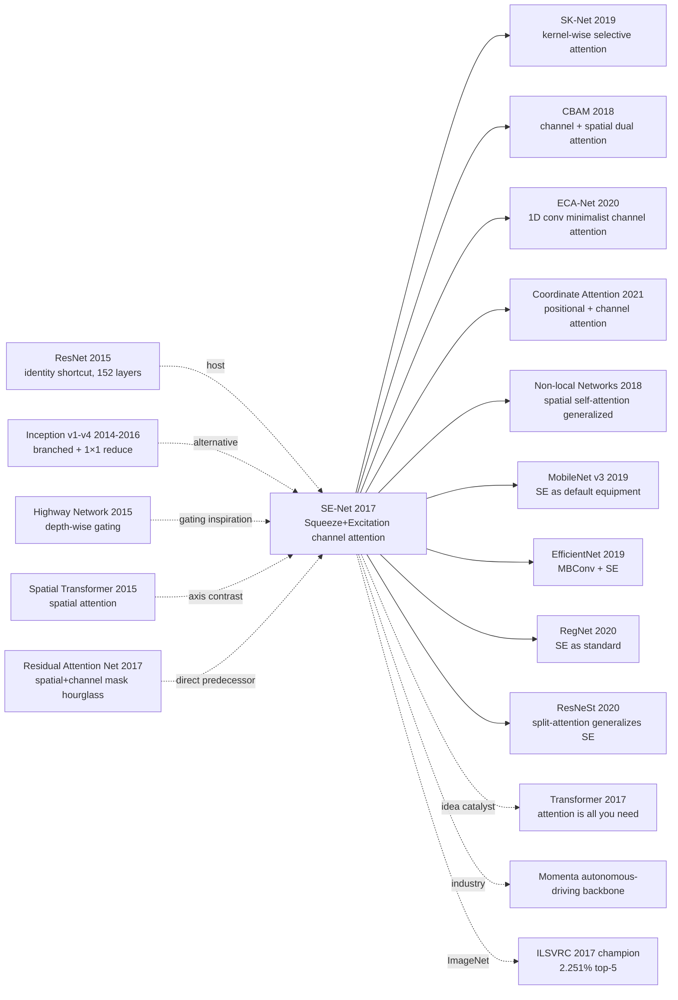

# SE-Net — Channel Attention Crowning the ILSVRC 2017 Champion

> **September 5, 2017. Jie Hu and Li Shen (Momenta), with Gang Sun (Oxford), release [Squeeze-and-Excitation Networks (1709.01507)](https://arxiv.org/abs/1709.01507) on arXiv.**
> The founding paper of **channel attention** — drop a tiny **Squeeze-and-Excitation (SE) block** into any CNN: first global-average-pool each channel into one scalar (squeeze), then run a 2-layer MLP (C → C/r → C) + sigmoid to learn per-channel gating weights (excitation), finally multiply the weights back into the original feature map (scale).
> Plugged into ResNet-50 it lifted top-1 from 76.13% to 77.56% (+1.43), at **only +0.26% extra params and +0.26% extra FLOPs**.
> SENet-154 (SE + ResNeXt-152) won **ILSVRC 2017 classification with 2.251% top-5 error** — a **25% relative reduction** over the 2016 winner's 2.991%, and the last-ever ImageNet large-scale classification champion.
> Directly birthed the entire attention-augmented CNN family — SK-Net / CBAM / Non-local / ECA-Net / Coordinate Attention / EfficientNet / MobileNet v3 / RegNet — and remains the canonical lightweight attention module in CV.

## TL;DR

SE-Net inserts a tiny **squeeze (global avg pool) → excitation (2-FC bottleneck + sigmoid) → scale (channel-wise multiply)** block after any CNN block, **explicitly modeling channel inter-dependencies** and dynamically re-weighting them. Plugged into ResNet-50 it gains +1.43 top-1 at +0.26% params and +0.26% FLOPs, and SENet-154 (SE + ResNeXt-152) won ILSVRC 2017 classification at 2.251% top-5 error.

---

## Historical Context

### What was channel attention stuck on in 2018?

2012-2017 ImageNet classification stacked depth and width: AlexNet → VGG-16 (138M) → GoogLeNet (Inception v1-v4) → ResNet-50/101/152 → ResNeXt-101 → DenseNet. Top-1 climbed from 57.2% to 78%. But **every model treated channels as equals**:

> **(1) Standard conv treats channels equally**: the N output channels of a 3×3 conv are by default equally important, with no input-dependent weighting;
> **(2) No global context**: a single conv layer's receptive field is local, with no way to ask "which channels should fire harder given the whole image";
> **(3) Inception hinted at channel re-weighting**: but its 1×1 reduce was static, not input-conditioned;
> **(4) Spatial Transformer (Jaderberg 2015)** did spatial attention, but no one had systematically attacked the channel axis;
> **(5) Highway / ResNet gating** gated along depth, never along channels.

The community's open question: **"Can we do attention along the channel axis dynamically — at negligible cost?"**

### The 3 immediate predecessors that pushed SE-Net out

- **He et al., 2015 (ResNet)** [CVPR 2016]: identity shortcuts let you stack 152 layers safely — the host body for SE
- **Jaderberg et al., 2015 (Spatial Transformer Networks)** [NeurIPS]: the first visual attention paper, but along the spatial axis, not channels
- **Wang et al., 2017 (Residual Attention Network)** [CVPR]: stacked attention masks (mixed spatial + channel); accuracy gains were real but the hourglass architecture was heavy. SE **stripped it down** to channel-only

### What was the author team doing?

Three authors: Jie Hu (Momenta self-driving + Oxford visiting), Li Shen (Oxford PhD), Gang Sun (Tsinghua + Momenta VP of Algorithms). **Momenta was betting on autonomous-driving perception**, needing high-accuracy backbones runnable on car-grade GPU/embedded hardware — so they cared deeply about the **accuracy / FLOPs ratio**. SE block's "+1.43 top-1 / +0.26% FLOPs" was the engineering sweet spot.

### State of industry, compute, data

- **GPU**: trained on 8× Tesla P100 / V100; target inference hardware was Drive PX 2 in cars
- **Data**: ImageNet 1.28M images, 1000 classes + Places365 / COCO for generalization
- **Frameworks**: Caffe (paper version) + MatConvNet; later widely ported to PyTorch / TensorFlow
- **Industry**: ILSVRC 2017 was the last edition; **SENet won this final round**. Momenta rode the win to massive autonomous-driving funding rounds

---

## Method Deep Dive

### Overall framework

```
Input feature U ∈ R^(C×H×W)
  ↓
  ├─ Squeeze:    z = GlobalAvgPool(U)        ∈ R^C
  │              (compress each channel into 1 scalar)
  ↓
  ├─ Excitation: s = σ(W₂ · δ(W₁ · z))      ∈ R^C
  │              W₁ ∈ R^(C/r × C), W₂ ∈ R^(C × C/r)
  │              δ = ReLU,  σ = sigmoid
  ↓
  └─ Scale:     Ũ_c = s_c · U_c             ∈ R^(C×H×W)
                 (multiply weight s_c back into channel c)
```

**Insertion points**: SE block can be glued behind any conv block. Common hosts:

| Host | Name | SE insertion point |
|------|------|--------------------|
| ResNet | SE-ResNet | end of residual branch, before identity-add |
| ResNeXt | SE-ResNeXt | same as above |
| Inception | SE-Inception | after concat, before next block |
| MobileNet | SE-MobileNet | end of depthwise sep block |
| ShuffleNet | SE-ShuffleNet | after channel shuffle |

| Config | Params | FLOPs | top-1 |
|--------|--------|-------|-------|
| ResNet-50 | 25.6M | 3.86 GFLOPs | 76.13% |
| **SE-ResNet-50** | **28.1M (+0.26M)** | **3.87 GFLOPs (+0.01)** | **77.56% (+1.43)** |
| ResNet-101 | 44.5M | 7.58 GFLOPs | 77.39% |
| **SE-ResNet-101** | **49.3M** | **7.60 GFLOPs** | **78.39% (+1.00)** |
| ResNeXt-101 (32×4d) | 44.2M | 7.34 GFLOPs | 78.65% |
| **SE-ResNeXt-101** | **49.0M** | **7.36 GFLOPs** | **79.40% (+0.75)** |
| **SENet-154** (SE+ResNeXt-152) | **145.8M** | **42.3 GFLOPs** | **82.7% (single crop, 320²)** |

### Key designs

#### Design 1: Squeeze — global avg pool compresses each channel into one scalar

**Function**: pool each channel's full spatial information into a single number, so that the downstream excitation layer can "see" the global context of the whole feature map.

**Core mechanism**:

$$
z_c = F_{sq}(u_c) = \frac{1}{H \times W} \sum_{i=1}^{H} \sum_{j=1}^{W} u_c(i, j)
$$

where $u_c \in \mathbb{R}^{H \times W}$ is the c-th channel's feature map and $z_c$ is its global descriptor. $z = [z_1, \ldots, z_C] \in \mathbb{R}^C$.

**Design rationale**:
- Conv has a local receptive field; global avg pool injects "image-level" statistics
- More stable than max pool (won't be dominated by a single outlier)
- Compute cost negligible (C × H × W additions)
- Cheaper than 1×1 conv outputting C maps of 1×1 (no parameters)

**Ablation (SE-ResNet-50 on ImageNet)**:

| Squeeze method | top-1 |
|----------------|-------|
| Global avg pool (default) | 77.56 |
| Global max pool | 77.39 |
| Both avg + max (concat) | 77.42 |

Avg pool wins, hence the paper's choice.

#### Design 2: Excitation — 2-FC bottleneck + sigmoid learns per-channel weights

**Function**: from $z \in \mathbb{R}^C$ learn $s \in \mathbb{R}^C$ (one weight per channel, in [0, 1]), used to dynamically emphasize / suppress channels.

**Core mechanism**:

$$
s = F_{ex}(z, W) = \sigma(W_2 \, \delta(W_1 \, z))
$$

where:
- $W_1 \in \mathbb{R}^{(C/r) \times C}$: first FC, **dimensionality-reducing bottleneck**
- $\delta$: ReLU activation (introduces non-linearity)
- $W_2 \in \mathbb{R}^{C \times (C/r)}$: second FC, restores to C dims
- $\sigma$: sigmoid (outputs [0, 1], can emphasize multiple channels at once — **not** the mutually-exclusive softmax)

**Key design choices**:
- **Bottleneck (r=16)**: drops parameters from $C^2$ to $2C^2/r$. With C=512: $C^2 = 262144$, $2C^2/16 = 32768$ — **8× param reduction**
- **Sigmoid not softmax**: channels are not mutually exclusive (multiple can matter simultaneously); sigmoid permits independent [0, 1] weights
- **2 FC not 1**: a single FC degenerates to channel-wise linear gating (insufficient expressiveness); 2 FC + ReLU lets the module learn non-linear relationships

**Reduction-ratio r ablation (SE-ResNet-50)**:

| r | Param overhead | top-1 | top-5 |
|---|----------------|-------|-------|
| 2 | +37.4% | 77.71 | 93.84 |
| 4 | +18.7% | 77.61 | 93.79 |
| 8 | +9.4% | 77.55 | 93.84 |
| **16 (default)** | **+4.7%** | **77.56** | **93.79** |
| 32 | +2.4% | 77.36 | 93.71 |

**Conclusion**: r=16 is the sweet spot — going smaller (r=2) doubles params with barely any gain; going larger (r=32) starts hurting accuracy.

#### Design 3: Scale — channel-wise multiplication back into the feature

**Function**: multiply the excitation weights $s_c$ into the original feature map's corresponding channel, producing the re-weighted output.

**Core mechanism**:

$$
\tilde{x}_c = F_{scale}(u_c, s_c) = s_c \cdot u_c
$$

where $\tilde{X} = [\tilde{x}_1, \ldots, \tilde{x}_C]$ is the SE block's final output, with shape identical to input $U$. This step is element-wise multiplication (broadcasting: $s_c$ is a scalar, $u_c$ is an H×W matrix).

**Why multiply, not add?**
- Multiply: preserves the original feature's relative structure, only changes amplitude (the "volume knob")
- Add: would change the feature direction, breaking the representations the host network already learned
- Same design philosophy as the LSTM forget gate

**Does excitation actually learn meaningful channel weights?** (paper Sec 5.2 visualization):
- Shallow layers: SE activations for different classes (goldfish vs gorilla) look almost identical → channels are class-agnostic low-level features
- Deep layers: SE activations diverge sharply between classes → channels encode class-specific semantics
- Last stage: activations nearly saturate (most channels driven to 1) → **the last SE block can be pruned with no accuracy loss** (saving ~10% params)

#### Design 4: Insertion point — drop-in engineering philosophy for any backbone

**Pseudocode** (PyTorch style):

```python
class SEBlock(nn.Module):
    """Squeeze-and-Excitation block. C -> C/r -> C, sigmoid-gated."""
    def __init__(self, channels, reduction=16):
        super().__init__()
        # Squeeze: global average pool reduces (B,C,H,W) -> (B,C,1,1)
        self.avgpool = nn.AdaptiveAvgPool2d(1)
        # Excitation: 2-FC bottleneck with ReLU + sigmoid
        self.fc = nn.Sequential(
            nn.Linear(channels, channels // reduction, bias=False),
            nn.ReLU(inplace=True),
            nn.Linear(channels // reduction, channels, bias=False),
            nn.Sigmoid(),
        )

    def forward(self, x):
        b, c, _, _ = x.shape
        # Squeeze: (B, C, H, W) -> (B, C)
        z = self.avgpool(x).view(b, c)
        # Excitation: (B, C) -> (B, C) gating weights in [0, 1]
        s = self.fc(z).view(b, c, 1, 1)
        # Scale: channel-wise multiply, broadcasting (B,C,1,1) * (B,C,H,W)
        return x * s


class SEBottleneck(nn.Module):
    """SE-ResNet bottleneck: standard ResNet bottleneck + SE block on residual branch."""
    def __init__(self, in_ch, planes, stride=1, reduction=16):
        super().__init__()
        self.conv1 = nn.Conv2d(in_ch, planes, 1, bias=False)
        self.bn1 = nn.BatchNorm2d(planes)
        self.conv2 = nn.Conv2d(planes, planes, 3, stride=stride, padding=1, bias=False)
        self.bn2 = nn.BatchNorm2d(planes)
        self.conv3 = nn.Conv2d(planes, planes * 4, 1, bias=False)
        self.bn3 = nn.BatchNorm2d(planes * 4)
        self.se = SEBlock(planes * 4, reduction)        # ← SE here
        self.shortcut = (nn.Sequential() if (stride == 1 and in_ch == planes * 4)
                         else nn.Sequential(nn.Conv2d(in_ch, planes*4, 1, stride=stride, bias=False),
                                            nn.BatchNorm2d(planes*4)))

    def forward(self, x):
        out = F.relu(self.bn1(self.conv1(x)))
        out = F.relu(self.bn2(self.conv2(out)))
        out = self.bn3(self.conv3(out))
        out = self.se(out)                              # ← apply SE before shortcut
        out = out + self.shortcut(x)
        return F.relu(out)
```

**Insertion philosophy**:
- SE doesn't touch the backbone topology, just glues onto the end of the residual branch — backwards-compatible with all pretrained models
- Any conv-based network can adopt SE — it became the "interface standard" for later attention modules
- Adding SE at different stages yields different gains: early stages (class-agnostic features) gain little; middle/late stages gain most

### Loss / training strategy

| Item | Config |
|------|--------|
| Loss | Cross-entropy (label smoothing 0.1 for SENet-154) |
| Optimizer | SGD + momentum 0.9 |
| LR | 0.6 (large batch 1024) → cosine decay |
| Batch | 1024 (8 GPU × 128) |
| Weight decay | 1e-4 |
| Data augmentation | scale jitter [256, 480], random crop 224, horizontal flip, color augmentation (PCA) |
| Epochs | 100 |
| BN | default params, no BN inside SE block |
| Reduction r | 16 (unless otherwise stated) |

---

## Failed Baselines

### Opponents that lost to SE-Net at the time

- **ResNet-50**: 25.6M, 3.86 GFLOPs, 76.13% → SE-ResNet-50: 28.1M, 3.87 GFLOPs, **77.56% (+1.43)**
- **ResNet-101**: 44.5M, 7.58 GFLOPs, 77.39% → SE-ResNet-101: **78.39% (+1.00)**
- **ResNet-152**: 60.2M, 11.3 GFLOPs, 77.97% → SE-ResNet-152: **78.66% (+0.69)**
- **ResNeXt-50 (32×4d)**: 25.0M, 3.77G, 77.62% → SE-ResNeXt-50: **78.88% (+1.26)**
- **ResNeXt-101 (32×4d)**: 44.2M, 7.34G, 78.65% → SE-ResNeXt-101: **79.40% (+0.75)**
- **Inception-v3**: 23.8M, 5.7G, 77.42% → SE-Inception-v3: **78.42% (+1.00)**
- **Inception-ResNet-v2**: 55.8M, 13.2G, 80.10% → SE-Inception-ResNet-v2: **80.46% (+0.36)**
- **MobileNet (1.0, 224)**: 4.2M, 569M, 70.6% → SE-MobileNet: **71.8% (+1.2)**
- **ShuffleNet (1×, g=3)**: 1.8M, 140M, 71.5% → SE-ShuffleNet: **73.0% (+1.5)**
- **ILSVRC 2016 winner (Trimps-Soushen)**: top-5 2.991% → **SENet-154: 2.251% top-5 (25% relative reduction)**

### Failures / limits admitted in the paper

- **Excitation is channel-only**: ignores the spatial axis (CBAM later filled this gap)
- **Reduction ratio r is fixed**: optimal r may differ per layer, but the paper uses a uniform r=16
- **SE block is element-wise multiply + FC on GPU**, sensitive to memory bandwidth — **measured inference latency increases more than nominal FLOPs**
- **Squeeze via global avg pool drops spatial info**: high-resolution detail is averaged away in one shot
- **SE in last stage saturates**: can be pruned without hurting accuracy, but the paper does no adaptive pruning
- **SE gains are larger for small models**: MobileNet +1.2, ResNet-152 +0.69 — large models are already "saturated"

### "Anti-baseline" lessons

- **"Channel attention is too expensive"** (intuition: needs $C^2$ FC): the bottleneck (r=16) crushes cost to +0.26% FLOPs
- **"Need spatial attention to be useful"** (Residual Attention Network's mask line): SE proves channel-only already gives +1.43
- **"Sigmoid worse than softmax"** (attention defaults to softmax): SE shows sigmoid is more principled when channels aren't mutually exclusive
- **"Attention's added complexity isn't worth it"**: SE trades 0.26% FLOPs for 1.43 top-1 — ROI far better than going deeper or wider

---

## Key Experimental Numbers

### ImageNet classification (across backbones)

| Backbone | original top-1 | + SE top-1 | Δ | Param overhead |
|----------|----------------|-----------|---|----------------|
| ResNet-50 | 76.13 | 77.56 | +1.43 | +0.26M |
| ResNet-101 | 77.39 | 78.39 | +1.00 | +0.50M |
| ResNet-152 | 77.97 | 78.66 | +0.69 | +0.86M |
| ResNeXt-50 (32×4d) | 77.62 | 78.88 | +1.26 | +0.27M |
| ResNeXt-101 (32×4d) | 78.65 | 79.40 | +0.75 | +0.51M |
| Inception-v3 | 77.42 | 78.42 | +1.00 | +0.34M |
| Inception-ResNet-v2 | 80.10 | 80.46 | +0.36 | +0.85M |
| MobileNet 1.0 (224) | 70.6 | 71.8 | +1.2 | +0.10M |
| ShuffleNet 1× (g=3) | 71.5 | 73.0 | +1.5 | +0.05M |
| **SENet-154** (SE+ResNeXt-152, 320 crop) | — | **82.7** | — | 145.8M |

### Reduction ratio ablation

| r | Params | top-1 | top-5 |
|---|--------|-------|-------|
| 2 | 35.2M | 77.71 | 93.84 |
| 4 | 30.4M | 77.61 | 93.79 |
| 8 | 28.7M | 77.55 | 93.84 |
| **16** | **28.1M** | **77.56** | **93.79** |
| 32 | 27.9M | 77.36 | 93.71 |

### Down-stream tasks

| Task / dataset | Backbone | Improvement |
|----------------|----------|-------------|
| Places365 scene classification | ResNet-152 / SE-ResNet-152 | top-1 55.21 → 55.49 (+0.28) |
| COCO detection (Faster R-CNN) | ResNet-50 / SE-ResNet-50 | mAP 27.3 → 28.5 (+1.2) |
| COCO detection (Faster R-CNN) | ResNet-101 / SE-ResNet-101 | mAP 30.0 → 30.6 (+0.6) |
| ILSVRC 2017 classification | SENet-154 | top-5 **2.251%** (1st place) |

### Key findings

- **Almost every backbone gains**: ResNet / ResNeXt / Inception / MobileNet / ShuffleNet all gain +0.36 to +1.5
- **Smaller models gain more**: MobileNet +1.2, ShuffleNet +1.5; large models are already "full"
- **Down-stream tasks also gain**: COCO detection and Places365 both benefit
- **SE behaves differently per stage**: shallow class-agnostic, deep class-specific
- **r=16 is best**: smaller doubles params with barely any gain
- **Activation visualization is sensible**: deep SE blocks show distinct activation patterns per class, proving they truly learn class-specific channel importance

---

## Idea Lineage



### Predecessors
- **Inception (2014-2016)**: 1×1 reduce implies channel re-weighting, but static, not input-conditioned
- **Highway Network (2015)**: gates along depth (conv vs identity); SE **moves the gate to the channel axis**
- **Spatial Transformer Networks (2015)**: first visual attention paper, but along the spatial axis, not channels
- **Residual Attention Network (2017)**: masking idea was right but the hourglass architecture was heavy; SE **stripped it down**

### Successors
- **SK-Net (2019)**: pushes selection from channels to kernel sizes
- **CBAM (2018)**: adds spatial attention (channel + spatial in series)
- **ECA-Net (2020)**: replaces 2-FC with 1D conv — even lighter
- **Coordinate Attention (2021)**: preserves positional info (vertical + horizontal pool replace global avg pool)
- **MobileNet v3 / EfficientNet / RegNet / ResNeSt**: SE is the "default attachment"
- **Non-local Networks**: pushes attention from channel to full spatial self-attention
- **Transformer (2017)**: contemporaneous with SE, but on the self-attention path; eventually dominates NLP and ViT

### Misreadings
- **"SE = self-attention"**: no. SE is channel-wise gating (input → weight → multiply); self-attention is query-key-value, requiring global pairwise relationships
- **"SE can replace Transformer"**: no. SE only does channel re-weighting; it doesn't model token / spatial pairwise relationships
- **"SE always helps"**: not necessarily. Detection on big backbones gains little; segmentation is hit-or-miss
- **"SE is free at inference"**: FLOPs +0.26% but memory bandwidth grows noticeably — **measured latency rises 5-10%**

---

## Modern Perspective (Looking Back from 2026)

### Assumptions that don't hold up

- **"Channel attention is the ultimate direction"**: today the attention frontier is dominated by self-attention (Transformer); SE is now a "side accessory"
- **"Squeeze must be global avg pool"**: Coordinate Attention shows preserving positional info works better
- **"2-FC bottleneck must use r=16"**: ECA-Net shows 1D conv is lighter with comparable accuracy
- **"SE is universal drop-in accuracy gain"**: in the ViT era, channel attention's marginal gain shrinks (self-attention already mixes channels)
- **"SE doesn't need spatial attention"**: CBAM / Coordinate Attention show channel + spatial jointly is better

### What time validated as essential vs redundant

- **Essential**: the squeeze-excitation-scale three-stage architecture, the bottleneck (r=16) engineering trick, the drop-in interface, sigmoid (not softmax), the global-context injection idea
- **Redundant / misleading**: hard-coded r=16 (not adaptive), global avg pool dropping spatial info, last-stage SE saturation without adaptive pruning, the SENet-154 deep-and-wide stacking strategy (replaced by EfficientNet's compound scaling)

### Side effects the authors didn't anticipate

1. **Opened the entire attention-augmented CNN research direction**: CBAM / SK-Net / ECA / Coordinate Attention / Non-local are all SE descendants
2. **MobileNet v3 / EfficientNet / RegNet adopted SE as default**: modern lightweight CNNs are nearly "no SE no family"
3. **Catalyzed cross-domain attention thinking**: from channel attention → spatial attention → self-attention → Transformer, an unbroken chain
4. **Momenta became famous overnight**: from champion to autonomous-driving funding rounds, the company was once valued at $3B
5. **ILSVRC's swan song**: SENet-154 was the last-ever ImageNet large-scale classification champion (the contest ended in 2017). SE-Net became the period at the end of that era.

### If we rewrote SE-Net today

- Replace the 2-FC with ECA-Net's 1D conv
- Preserve spatial position via Coordinate Attention
- Add spatial attention (CBAM style)
- Use NAS to search per-layer optimal r
- Mix with Transformer blocks (MobileViT / EfficientFormer style)
- Evaluate by default under quantization-aware training (QAT)

But the **three core design principles — "drop a tiny attention module after every conv block", "drop-in compatibility", "controllable FLOPs overhead" — remain the foundational paradigm of attention-augmented CNNs.**

---

## Limitations and Outlook

### Authors admitted
- Channel-only, no spatial attention
- Reduction ratio r=16 fixed globally, not adaptive
- Squeeze via global avg pool loses spatial detail
- SENet-154 training is enormously expensive (8× V100, 100 epochs)
- On Inception-ResNet-v2 the gain is only +0.36 — diminishing returns visible

### Found in retrospect
- Measured inference latency rises 5-10%, beyond the nominal FLOPs increase
- Last-stage SE activations saturate; can be pruned without precision loss
- Detection / segmentation gains are less consistent than classification
- Almost no gain on ViT or other Transformer backbones
- r=16 is not optimal for every backbone

### Improvement directions (validated by follow-ups)
- CBAM (2018): channel + spatial dual attention
- SK-Net (2019): kernel-size selective attention
- ECA-Net (2020): 1D conv replaces 2-FC, lighter and faster
- Coordinate Attention (2021): preserves positional encoding
- ResNeSt (2020): split-attention, generalizing SE inside groups
- MobileNet v3 (2019), EfficientNet (2019), RegNet (2020): SE adopted as default attachment

---

## Related Work and Inspiration

- **vs ResNet (cross-paradigm)**: ResNet solved "how to train deep", SE solved "now that we can train deep, how do we improve quality". **Lesson: identity shortcuts give compute capacity, attention gives selectivity**
- **vs Spatial Transformer (cross-axis)**: STN focused on spatial-axis attention, SE on channel-axis. **Lesson: both orthogonal axes of CNN admit attention; CBAM later fused them**
- **vs Residual Attention Network (cross-engineering-philosophy)**: RAN went heavy with hourglass masks, SE went light with squeeze-excitation. **Lesson: price-performance ratio is the deciding factor for industrial attention deployment**
- **vs Transformer (cross-generation)**: SE is channel-wise gating (input → weight), Transformer is query-key-value self-attention. **Lesson: SE is the "prequel" of attention thinking, Transformer the "complete form"**
- **vs MobileNet v3 / EfficientNet (cross-generation inheritance)**: v3 / EffNet adopt SE as default. **Lesson: good modules graduate from "trick" to "infrastructure"**

---

## Related Resources

- 📄 [arXiv 1709.01507](https://arxiv.org/abs/1709.01507)
- 💻 [Authors' Caffe implementation](https://github.com/hujie-frank/SENet) · [PyTorch torchvision SE-ResNet](https://github.com/pytorch/vision) · [timm SE family](https://github.com/rwightman/pytorch-image-models)
- 📚 Must-read follow-ups: [CBAM (2018)](https://arxiv.org/abs/1807.06521), [SK-Net (2019)](https://arxiv.org/abs/1903.06586), [ECA-Net (2020)](https://arxiv.org/abs/1910.03151), [Coordinate Attention (2021)](https://arxiv.org/abs/2103.02907), [Non-local Networks (2018)](https://arxiv.org/abs/1711.07971), [MobileNet v3 (2019)](https://arxiv.org/abs/1905.02244), [EfficientNet (2019)](https://arxiv.org/abs/1905.11946)
- 🏆 [ILSVRC 2017 results](http://image-net.org/challenges/LSVRC/2017/results) · [SENet-154 ImageNet leaderboard](https://paperswithcode.com/sota/image-classification-on-imagenet)
- 🎬 [Hu Jie at CVPR 2018 oral on SENet](https://www.youtube.com/results?search_query=squeeze+excitation+CVPR+2018) · [Yannic Kilcher SENet review](https://www.youtube.com/results?search_query=yannic+squeeze+excitation)

---

> 🌐 [中文版本](/era3_attention/2018_senet/) · 📚 awesome-papers project · CC-BY-NC
