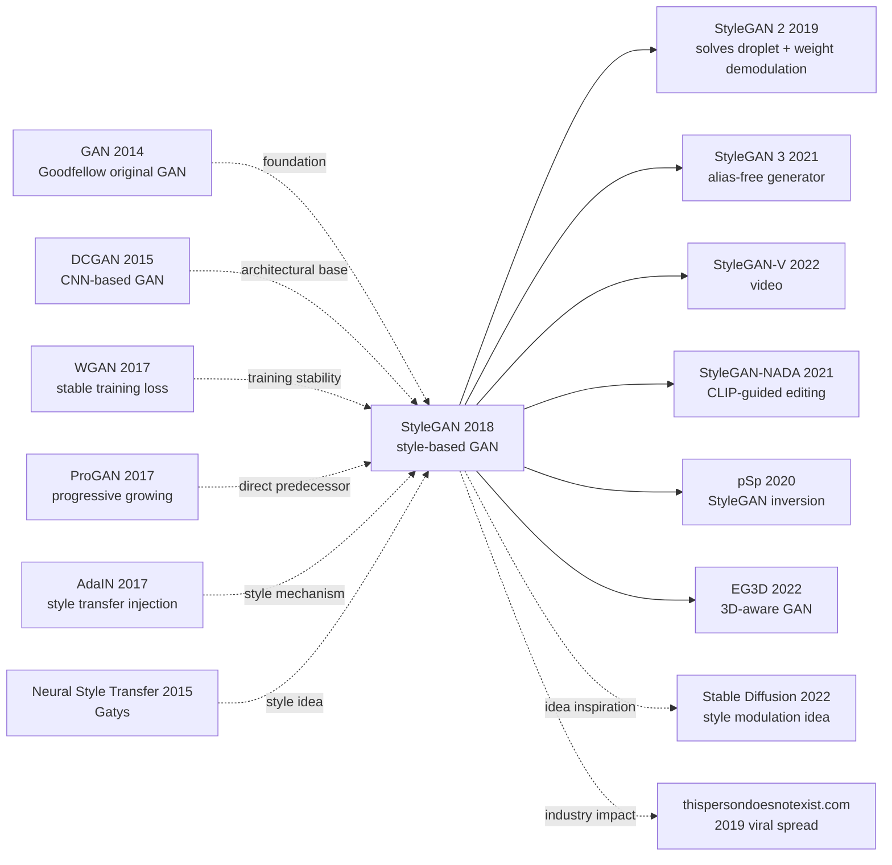

# StyleGAN — Pushing GAN to Photorealistic Face Generation via Style Modulation

> **December 12, 2018. NVIDIA's Karras and 2 co-authors release [StyleGAN (1812.04948)](https://arxiv.org/abs/1812.04948) on arXiv.**
> An extension of Progressive GAN (2017), it redesigned the generator into "style-based architecture" — using a mapping network to map latent $z$ to intermediate latent space $\mathcal{W}$, then injecting style at each layer via AdaIN (Adaptive Instance Normalization), plus noise input controlling stochastic detail.
> On FFHQ (NVIDIA's own 70k high-quality faces) it reached FID 4.40, the first time GAN-generated 1024×1024 faces became **visually indistinguishable from real photos**, opening the engineering reality of the "deepfake era" and igniting viral apps like "this-person-does-not-exist.com".

## TL;DR

StyleGAN redesigns the GAN generator as "mapping network ($z \to \mathcal{W}$) + AdaIN style injection at each layer + noise input controlling stochastic detail," letting different semantic levels of generated images (coarse: pose / mid: hairstyle / fine: skin tone freckles) be controlled independently, dropping FFHQ 1024×1024 face FID from ProGAN's 7.79 to 4.40 — first achievement of photorealistic quality.

---

## Historical Context

### What was the GAN community stuck on in 2018?

2014-2018 GAN went through 4 years of rapid evolution: DCGAN (2015) / ProGAN (2017) / WGAN (2017). But by end of 2018, the strongest ProGAN on 1024×1024 faces still had visible artifacts (eye asymmetry, blurry backgrounds, inconsistent skin tones). **The community's core question: "can we make GAN-generated images visually indistinguishable from real photos?"**

> **(1) Latent space $z \sim \mathcal{N}(0, I)$ forces entanglement — changing one dimension often changes multiple semantic attributes;
> (2) Coarse style control granularity — can't "change only hair, not face";
> (3) Stochastic details (skin pores / hair strands) depend on conv accidentally learning, unstable quality;
> (4) FID still 7+, far from real photo FID < 5.**

### The 3 immediate predecessors that pushed StyleGAN out

- **Karras et al., 2017 (Progressive GAN)** [ICLR 2018]: authors' own previous paper, used progressive growing for stable 1024×1024 training. StyleGAN directly inherits this training mechanism
- **Huang & Belongie, 2017 (AdaIN)** [ICCV]: in style transfer, used instance normalization affine params to inject style. StyleGAN moves it to GAN
- **Karras et al., 2017 (StyleGAN training data contribution)**: same period released FFHQ dataset (70k 1024×1024 high-quality faces)

### What was the author team doing?

3 authors all from NVIDIA Research (Helsinki / Finland). Tero Karras is GAN engineering main force (ProGAN / StyleGAN 1/2/3 / Adaptive Discriminator Augmentation all led by him); Aila / Laine are NVIDIA long-term graphics researchers. **NVIDIA's goal then was to push GAN to industrial-grade quality**, making generative model a flagship use case for NVIDIA GPUs.

### State of industry, compute, data

- **GPU**: 8 V100s, FFHQ 1024×1024 trained 1 week
- **Data**: FFHQ (NVIDIA's own crawled and cleaned 70k Flickr high-quality faces) + LSUN (bedrooms / churches / cats etc.)
- **Frameworks**: TensorFlow + Adaptive Mixed Precision
- **Industry**: deepfake (2017) had brought GAN into public view; StyleGAN directly birthed thispersondoesnotexist.com, pushing GAN onto social media

---

## Method Deep Dive

### Overall framework

```
[Mapping Network f]
  z ∈ Z ~ N(0,I)  (512-d)
  ↓ 8-layer MLP
  w ∈ W           (512-d, more disentangled)

[Synthesis Network g]
  Constant input (4×4×512)  ←  start from learned const, not z
  ↓ Conv 3×3 + AdaIN(w) + noise
  ↓ Upsample 8×8
  ↓ Conv 3×3 + AdaIN(w) + noise
  ... 9 resolution levels: 4 → 8 → 16 → 32 → 64 → 128 → 256 → 512 → 1024 ...
  ↓ to_RGB (1024×1024×3)

[Discriminator]
  Mirror of synthesis (no AdaIN), progressive growing
```

| Config | Params | FFHQ FID | Key feature |
|--------|--------|----------|-------------|
| ProGAN baseline | 23M | 7.79 | direct $z$ input |
| + Mapping network | 23M | 7.79 | added 8-layer MLP $f$ |
| + AdaIN | 23M | 6.81 | style injected via AdaIN |
| + Constant input | 23M | 6.55 | generator starts from learned const |
| + Noise input | 24M | 5.16 | added noise for stochastic detail |
| **+ Mixing regularization** | **24M** | **4.40** | **style mixing training** |

### Key designs

#### Design 1: Mapping Network $f: \mathcal{Z} \to \mathcal{W}$ — decouple latent space

**Function**: use 8-layer MLP to map Gaussian-distributed $z$ to intermediate latent $w$, freeing $w$ space from Gaussian-forced entanglement.

**Forward formula**:

$$
w = f(z), \quad f: \mathbb{R}^{512} \to \mathbb{R}^{512}, \quad f = \text{MLP}_{8\text{-layer}}
$$

**Why need intermediate latent?**

Using $z$ directly forces generator to map Gaussian-shaped input to training data manifold (e.g., face manifold). The two shapes are very mismatched → generator forcefully distorts feature axes, causing entanglement (one axis controls multiple attributes).

**Mapping network's role**: let $w$ space deform freely (not Gaussian-constrained), easier to "capture" the true semantic manifold of training data → each $w$ dimension corresponds to a purer semantic attribute.

**Experimental verification of disentanglement**: using Path Length and Linear Separability metrics, $\mathcal{W}$ has ~30% better disentanglement than $\mathcal{Z}$.

#### Design 2: AdaIN (Adaptive Instance Normalization) — style injection

**Function**: at each generator layer, use $w$ as style modulator, controlling channel-wise statistics of feature maps via affine parameters.

**Core formula**:

$$
\text{AdaIN}(x_i, y) = y_{s,i} \frac{x_i - \mu(x_i)}{\sigma(x_i)} + y_{b,i}
$$

where $x_i$ is the $i$-th channel feature map, $\mu$ and $\sigma$ are instance normalization statistics; $y_{s,i}, y_{b,i}$ are style params from $w$ via learned affine $A$:

$$
(y_s, y_b) = A(w)
$$

**Why instance norm instead of batch norm?**

- IN normalizes over H×W, removing each channel's spatial statistics → letting style params $y_s, y_b$ fully determine that layer's style
- BN normalizes across batch, introducing inter-batch coupling, unsuitable for "independent control" goal

**Style injection's hierarchical semantics**:

- **Coarse layers (4×4 - 8×8)**: pose / hair style / overall shape
- **Mid layers (16×16 - 32×32)**: facial feature positions / hairstyle / eye shape
- **Fine layers (64×64 - 1024×1024)**: skin tone / micro-expressions / texture details

**Style mixing training**: each batch uses two different $w_1, w_2$, first X layers use $w_1$, last Y layers use $w_2$. This forces generator to learn **layer-wise style independence**, enabling style mixing at inference ("use A's pose + B's hairstyle + C's skin tone").

#### Design 3: Noise Input — control stochastic details

**Function**: at each layer add independent Gaussian noise (per-pixel), letting generator use noise to generate "meaningless but realistic" details (e.g., hair strand directions / skin pore positions).

**Forward formula**:

$$
x' = \text{Conv}(x) + B \cdot n, \quad n \sim \mathcal{N}(0, I)_{H \times W}
$$

$B$ is learned per-channel scale. $n$ is spatial Gaussian noise, independently sampled per image.

**Why need separate noise input?**

If generator must use $w$ to generate all details (including "which hair strand is where"), these stochastic details consume $w$ capacity, hurting disentanglement. **Offload stochastic details to noise input**, letting $w$ focus on semantic control, noise handle "meaningless but realistic" high-frequency texture.

**Experimental phenomenon**: fix $w$, vary noise → same person but different hair strand details; fix noise, vary $w$ → completely different people. **Perfect disentanglement**.

#### Design 4: Constant Input + Style Mixing Regularization

**Function**: generator no longer starts from $z$, but from learned 4×4×512 constant; all variation injected via AdaIN + noise.

**Core ideas**:

- **Constant input**: all images share same starting point, differences entirely from style + noise injection
- **Style mixing regularization**: 50% probability during training to mix two $w$, forcing layer-wise independence

**Pseudocode**:

```python
class StyleGANSynthesis(nn.Module):
    def __init__(self, w_dim=512, max_resolution=1024):
        super().__init__()
        self.const = nn.Parameter(torch.randn(1, 512, 4, 4))
        self.blocks = nn.ModuleList()
        for res in [8, 16, 32, 64, 128, 256, 512, 1024]:
            self.blocks.append(StyleBlock(in_ch=512, out_ch=512, w_dim=512))
        self.to_rgb = nn.Conv2d(512, 3, 1)

    def forward(self, w_list):                     # w_list: per-block w (style mixing)
        x = self.const.expand(w_list[0].size(0), -1, -1, -1)
        for i, block in enumerate(self.blocks):
            x = block(x, w_list[i])                # AdaIN + noise + conv + upsample
        return self.to_rgb(x)

class StyleBlock(nn.Module):
    def forward(self, x, w):
        x = F.interpolate(x, scale_factor=2, mode='bilinear')
        x = self.conv1(x)
        # noise injection
        x = x + self.B * torch.randn_like(x)
        # AdaIN
        y_s, y_b = self.affine(w).chunk(2, dim=1)
        x = y_s.unsqueeze(-1).unsqueeze(-1) * \
            ((x - x.mean([2,3], keepdim=True)) / (x.std([2,3], keepdim=True) + 1e-8)) + \
            y_b.unsqueeze(-1).unsqueeze(-1)
        return x
```

### Loss / training strategy

| Item | Config |
|------|--------|
| Loss | WGAN-GP (consistent with ProGAN) |
| Optimizer | Adam ($\beta_1=0, \beta_2=0.99$, lr=1e-3) |
| Batch | 32 (1024×1024) |
| Progressive growing | 4×4 → 1024×1024 progressive, 4M images per resolution |
| Style mixing ratio | 50% batches |
| R1 regularization | every 16 steps (ProGAN didn't have) |
| Mapping network LR | 100× lower than synthesis network (anti-instability) |

---

## Failed Baselines

### Opponents that lost to StyleGAN at the time

- **ProGAN baseline**: FFHQ FID 7.79 → StyleGAN 4.40, **+44% quality improvement**
- **BigGAN (Brock 2018)**: ImageNet SOTA but only 256/512 resolution and class-conditional; StyleGAN wins on 1024×1024 unconditional
- **Glow / RealNVP** (flow models): theoretically rigorous but generation quality far worse than GAN
- **VAE family**: severe blurriness, GAN wins big

### Failures / limits admitted in the paper

- **"Water droplet" artifacts**: weird high-intensity droplet patterns on certain feature maps (StyleGAN 2 fixes via weight demodulation)
- **Eye / teeth symmetry**: occasionally asymmetric (generator lacks global receptive field)
- **Imperfect attribute mixing**: e.g., age + gender still partially coupled
- **Unstable training**: mapping network must use low LR
- **Weak class-conditional support**: only unconditional generation
- **High data demand**: needs 70k+ high-quality same-domain images

### "Anti-baseline" lesson

- **"Direct $z$ input is the GAN standard interface"**: StyleGAN proved adding mapping network + style modulation greatly improves
- **"GAN doesn't need explicit disentanglement interface"**: StyleGAN proved designing the interface lets disentanglement emerge
- **"Stochastic details accidentally learned by conv"**: StyleGAN explicitly separates noise input, quality leaps

---

## Key Experimental Numbers

### Main experiment (FFHQ 1024×1024 FID)

| Method | FID ↓ | Params |
|--------|-------|--------|
| ProGAN baseline | 7.79 | 23M |
| + bilinear upsample/downsample | 6.81 | 23M |
| + Mapping network ($f$) | 6.81 | 24M |
| + AdaIN | 6.55 | 24M |
| + Constant input | 5.06 | 24M |
| + Noise input | 4.94 | 24M |
| **+ Mixing regularization** | **4.40** | **24M** |

### Disentanglement metrics

| Space | Path Length | Linear Separability |
|-------|-------------|---------------------|
| $\mathcal{Z}$ (Gaussian) | 415 | 8.4 |
| **$\mathcal{W}$ (mapped)** | **265 (-36%)** | **5.5 (-35%)** |

$\mathcal{W}$ significantly better disentangled than $\mathcal{Z}$.

### Cross-domain generalization

| Dataset | StyleGAN FID | Prior SOTA |
|---------|-------------|-----------|
| FFHQ 1024 | **4.40** | 7.79 (ProGAN) |
| LSUN-Bedroom 256 | **2.65** | 8.34 |
| LSUN-Car 512 | **3.27** | 21.3 |
| LSUN-Cat 256 | **8.53** | 37.5 |

### Key findings

- **Mapping network + AdaIN are core**: missing one drops ~1 FID
- **Noise input critical for stochastic details**: removing makes details visibly blurry
- **Style mixing regularization key**: removing causes inter-layer style coupling
- **Cross-domain universal**: faces / bedrooms / cars / cats all SOTA
- **Disentanglement emerges**: never explicitly supervised, but $\mathcal{W}$ space auto-disentangles

---

## Idea Lineage



### Predecessors
- **GAN (2014)**: Goodfellow original adversarial training paradigm
- **DCGAN (2015)**: CNN-based GAN
- **WGAN / WGAN-GP (2017)**: stable training
- **ProGAN (2017)**: progressive growing for stable 1024×1024 training
- **AdaIN (2017)**: style injection in style transfer

### Successors
- **StyleGAN 2 (2019)**: solves "water droplet" artifacts, introduces weight demodulation and path length regularization
- **StyleGAN 3 (2021)**: solves texture sticking, alias-free generator
- **StyleGAN-V (2022)**: video generation
- **StyleGAN-NADA / DragGAN (2021-2023)**: CLIP-guided text editing, point-drag editing
- **3D-aware GAN**: EG3D / pi-GAN use StyleGAN architecture for 3D-consistent images
- **GAN inversion family**: pSp / e4e / ReStyle / HyperStyle — map real images to $\mathcal{W}$ space for editing
- **Diffusion borrowed the idea**: Stable Diffusion's cross-attention conditioning is isomorphic to AdaIN's style modulation

### Misreadings
- **"StyleGAN is the deepfake culprit"**: StyleGAN is unconditional generation (not targeting real people), but engineering capability was abused. NVIDIA's follow-up research includes detecting StyleGAN-generated images
- **"Diffusion fully replaced StyleGAN"**: in unconditional generation / single-domain high-quality, StyleGAN remains very strong; diffusion wins on conditional / multi-domain
- **"Style control is StyleGAN-exclusive"**: the idea has been widely adopted by diffusion / Transformer-based generation

---

## Modern Perspective (Looking Back from 2026)

### Assumptions that don't hold up

- **"GAN is the ultimate image generation method"**: from 2022, diffusion models (Stable Diffusion / DALL-E 2 / Imagen) became new mainstream due to better training stability + text conditioning + diversity than GAN
- **"Progressive growing is necessary"**: StyleGAN 2 dropped progressive, better results
- **"AdaIN is the best style injection"**: StyleGAN 2 replaced AdaIN with weight demodulation, solving droplet
- **"Single-domain training is enough"**: today multi-domain / multi-modal is new mainstream (CLIP conditioning / Diffusion)
- **"FFHQ 70k is large"**: today LAION-5B has 5B images

### What time validated as essential vs redundant

- **Essential**: mapping network ($z \to w$) idea, style modulation interface, noise input decoupling details, style mixing training, $\mathcal{W}$ space disentanglement
- **Redundant**: AdaIN (replaced by weight demodulation), progressive growing (replaced by multi-scale loss), constant input (diffusion doesn't need)

### Side effects the authors didn't anticipate

1. **Deepfake / fake news PR crisis**: StyleGAN directly birthed thispersondoesnotexist.com (2019) and other viral apps, triggering deepfake regulation discussion
2. **GAN inversion / editing brand-new research direction**: StyleGAN's disentangled $\mathcal{W}$ space made real-image editing possible, birthing pSp / e4e / DragGAN and many follow-ups
3. **3D / video generation**: EG3D / StyleGAN-V extended 2D StyleGAN to 3D / video
4. **Idea inherited by diffusion**: Stable Diffusion's cross-attention conditioning is essentially an extension of AdaIN
5. **NVIDIA GPU marketing**: StyleGAN became a flagship demo for NVIDIA GPUs, pushing consumer-grade GPUs into the AI sphere

### If we rewrote StyleGAN today

- Drop progressive growing
- Use weight demodulation instead of AdaIN
- Add alias-free upsample (StyleGAN 3)
- Add CLIP conditioning (controllable generation)
- Switch to diffusion instead of GAN (for conditional generation)

But the **core paradigm "mapping network + style modulation + layered injection" remains one of the best practices for disentangled controllable generation**.

---

## Limitations and Outlook

### Authors admitted
- "Water droplet" artifacts (StyleGAN 2 solved)
- Eye / teeth symmetry occasionally fails
- Only unconditional, lacks class-conditional
- Mapping network unstable training (must use low LR)
- 1024×1024 training cost high

### Found in retrospect
- $\mathcal{W}$ space still not perfectly disentangled
- Multi-face / complex scenes weak
- Doesn't apply to imperfect domains (e.g., handwriting / sketches)
- GAN training mode collapse risk remains

### Improvement directions (validated by follow-ups)
- StyleGAN 2 (2019): weight demodulation + path length reg
- StyleGAN 3 (2021): alias-free
- StyleGAN-NADA (2021): CLIP-guided
- DragGAN (2023): interactive editing
- Switch to diffusion (2022+): stable training + diversity

---

## Related Work and Inspiration

- **vs ProGAN (cross-generation inheritance)**: ProGAN solved stable 1024 training, StyleGAN added style control interface on top. **Lesson: training mechanism and architecture design are orthogonal dimensions, can be optimized separately**
- **vs DCGAN (cross-generation)**: DCGAN introduced CNN, StyleGAN introduced style modulation. **Lesson: each generation of GAN makes more inductive bias explicit**
- **vs AdaIN (cross-task)**: AdaIN was for style transfer, StyleGAN moved it to generation. **Lesson: good building blocks can transfer across tasks**
- **vs Diffusion (cross-paradigm)**: Diffusion uses iterative denoising, StyleGAN uses one-shot forward. **Lesson: generation paradigm evolution is constant trade-off of quality + control + diversity**
- **vs CLIP (cross-modal)**: late-period StyleGAN combined with CLIP (StyleGAN-NADA / DragGAN) enables text control. **Lesson: strong single-modal model + cross-modal grounding is a powerful combination**

---

## Related Resources

- 📄 [arXiv 1812.04948](https://arxiv.org/abs/1812.04948) · [CVPR 2019 version](https://openaccess.thecvf.com/content_CVPR_2019/papers/Karras_A_Style-Based_Generator_Architecture_for_Generative_Adversarial_Networks_CVPR_2019_paper.pdf)
- 💻 [Authors' original TF implementation](https://github.com/NVlabs/stylegan) · [PyTorch reimplementation](https://github.com/rosinality/style-based-gan-pytorch)
- 🔗 [thispersondoesnotexist.com](https://thispersondoesnotexist.com/) · [FFHQ dataset](https://github.com/NVlabs/ffhq-dataset)
- 📚 Must-read follow-ups: [StyleGAN 2 (2019)](https://arxiv.org/abs/1912.04958), [StyleGAN 3 (2021)](https://arxiv.org/abs/2106.12423), [DragGAN (2023)](https://arxiv.org/abs/2305.10973)
- 🎬 [Two Minute Papers: StyleGAN](https://www.youtube.com/watch?v=kSLJriaOumA)

---

> 🌐 [中文版本](/era3_attention/2018_stylegan/) · 📚 awesome-papers project · CC-BY-NC
