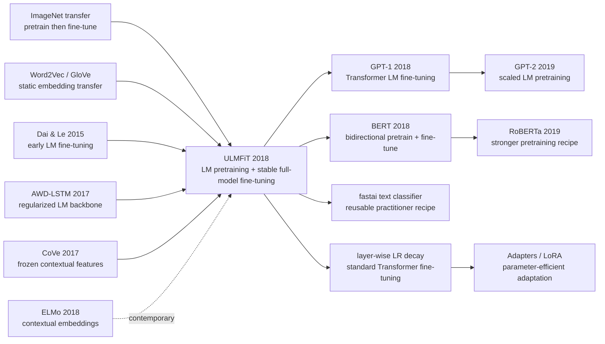

# ULMFiT — Making Language Model Fine-tuning Work

> **In January 2018, Jeremy Howard and Sebastian Ruder uploaded [arXiv:1801.06146](https://arxiv.org/abs/1801.06146), a paper with the almost understated title “Universal Language Model Fine-tuning for Text Classification.”** There was no Transformer in it, no trillion-token corpus, no giant accelerator story. The model was a 3-layer AWD-LSTM. Yet the paper made the claim that became NLP’s default operating system: a pretrained language model should not merely supply frozen word features; with the right fine-tuning recipe, the whole model can transfer. ULMFiT lowered IMDb error from the then-common 5.9% to 4.6%, and with only 100 labeled examples could match models trained from scratch on 10-100x more data. BERT and GPT soon overshadowed it architecturally, but ULMFiT framed the question first: NLP needed its own ImageNet moment.

## TL;DR

Howard and Ruder’s ACL 2018 ULMFiT moved NLP transfer learning from “download Word2Vec/GloVe vectors” to “pretrain an entire language model, then fine-tune the whole model without destroying it.” The recipe is simple in hindsight: train an AWD-LSTM language model on WikiText-103, adapt it to the target corpus with $\mathcal{L}_{LM}=-\sum_t \log p(x_t\mid x_{<t})$, then fine-tune the classifier with discriminative fine-tuning, slanted triangular learning rates, and gradual unfreezing. The defeated baseline was not one model but a whole era: CoVe/ELMo-style frozen features, scratch-trained CNN/LSTM classifiers, and Dai & Le-style LM fine-tuning that needed huge in-domain corpora. ULMFiT cut IMDb test error to 4.6% (CoVe 8.2%, previous common SOTA 5.9%), lowered AG error from DPCNN’s 6.87% to 5.01%, and with only 100 labeled examples matched scratch training with 10-100x more data. The counter-intuitive lesson is that ULMFiT was quickly replaced architecturally by [GPT-1](2018_gpt1.md) and [BERT](2018_bert.md), but not methodologically: modern Transformer fine-tuning, layer-wise LR decay, adapters, and LoRA still solve the same problem it named first — move the model toward a new task while keeping the pretrained knowledge alive.

---

## Historical Context

### Why NLP was missing an ImageNet moment in late 2017

By late 2017, computer vision treated transfer learning as ordinary practice: pretrain on ImageNet, then fine-tune the convolutional network for detection, segmentation, or fine-grained classification. NLP was still shallower. Word2Vec, GloVe, and fastText mattered enormously, but they mostly transferred the embedding layer; sentence classification, question answering, and natural language inference still required task-specific LSTM/CNN/attention architectures, with most parameters trained from random initialization. On small and medium datasets such as IMDb or TREC, that meant slow training, severe overfitting, and fragile hyperparameter tuning.

The awkward part was that language-model pretraining was not a new thought. Dai and Le 2015 had explored semi-supervised sequence learning, CoVe 2017 transferred representations from a machine-translation encoder, and ELMo would soon show that contextual embeddings were powerful. But these methods often treated the pretrained model as a feature extractor, required large in-domain corpora, or suffered catastrophic forgetting during fine-tuning. ULMFiT’s question was not “does a language model contain knowledge?” It was the more practical one: **how do you fine-tune a language model so it remembers general language while adapting to a target task?**

### The three threads that directly pushed ULMFiT out

- **ImageNet fine-tuning**: vision had already proved that “general pretraining + task fine-tuning” beats scratch training; ULMFiT explicitly framed language modeling as the NLP counterpart of ImageNet.
- **Dai & Le 2015**: an early systematic attempt at LM fine-tuning, but ULMFiT notes that it overfit even with 10k labeled examples and required millions of in-domain documents.
- **AWD-LSTM 2017**: Merity and colleagues made LSTM language modeling strong with weight dropout, variational dropout, and careful regularization; ULMFiT used it directly as the backbone, keeping the contribution focused on transfer.
- **CoVe / hypercolumns / ELMo-style features**: these methods proved transfer worked, but also exposed the ceiling of frozen or concatenated features.

### The author team and fast.ai’s unusual position

Jeremy Howard was not a typical academic NLP first author. He came from Kaggle, startups, and the fast.ai education community, and cared deeply about whether ordinary practitioners could use models with less labeling and less architecture design. Sebastian Ruder had long worked on transfer learning, multi-task learning, and optimization, and helped turn the practical recipe into a clean research argument. That pairing matters: ULMFiT’s contribution was not a flashier network, but a set of training practices made reusable.

The paper’s open-source link points to `nlp.fast.ai/ulmfit`, and the ideas later entered the fastai library. Its temperament differed from the same-year Google/OpenAI path: BERT and GPT became the “stronger architecture + larger pretraining” industrial route; ULMFiT was the “make existing models fine-tune reliably” practitioner route. That is why it mattered so much to smaller teams and applied NLP users.

### Compute, data, and task atmosphere at the time

ULMFiT pretrained on WikiText-103: 28,595 Wikipedia articles and roughly 103M words. Tiny by today’s standards, but enough in early 2018 to answer the core question: with one general LM and a small amount of target text, can we transfer across tasks? The paper used six text-classification datasets covering sentiment, question classification, and topic classification, from TREC-6’s 5.5k examples to Yelp-full’s 650k.

The goal was not just leaderboard theater. It was to make the word “universal” mean something operational. The same 3-layer AWD-LSTM, largely the same hyperparameters, and the same three-stage process worked on long movie reviews, short questions, news titles, and encyclopedia topics. ULMFiT was therefore a paradigm calibration: it told the NLP community that transfer learning was not an embedding file, but a pretrained model that could be safely adapted.

---

## Method Deep Dive

### Overall pipeline: three stages, not one end-to-end giant model

ULMFiT’s methodology is deliberately restrained: it does not invent a new task, a new decoder, or a complex task-formatting scheme. It transfers a strong language model to classification in three steps. The three panels in the paper’s Figure 1 are essentially the early form of “pretrain -> adapt -> fine-tune.”

| Stage | Input | Parameters updated |
|-------|-------|--------------------|
| General-domain LM pretraining | General text from WikiText-103 | All AWD-LSTM language-model parameters |
| Target task LM fine-tuning | Unlabeled/labeled target-task text | Same LM, all parameters with layer-wise learning rates |
| Target task classifier fine-tuning | Labeled target-task examples | LM backbone + new classifier head, gradually unfrozen |

The three stages separate two risks. **Distribution shift** is absorbed by target-task LM fine-tuning; **supervised task adaptation** is handled by classifier fine-tuning. Jump directly from a general LM to a classifier, and small supervised datasets can damage the model. Use only frozen representations, and the classifier cannot fully access high-level language knowledge. ULMFiT’s core contribution is the controlled path between those extremes.

### Key design 1: AWD-LSTM LM pretraining — obtain transferable language priors first

ULMFiT uses Merity et al.’s AWD-LSTM rather than a plain LSTM. AWD-LSTM’s key is not architectural ornamentation but regularization: embedding dropout, variational dropout, weight dropout, and activation regularization work together to suppress RNN overfitting. The paper stresses that it is “a regular LSTM” with no attention, shortcut connections, or sophisticated additions. That sentence matters: if a strongly regularized LSTM can transfer, the bottleneck is not whether Transformers exist, but whether the fine-tuning recipe is mature.

The pretraining objective is the standard next-token language-model loss:

$$
\mathcal{L}_{LM} = -\sum_{t=1}^{T} \log p(x_t \mid x_{<t}; \theta)
$$

| Component | Paper setting | Why it matters |
|-----------|---------------|----------------|
| Pretraining corpus | WikiText-103, 28,595 articles, roughly 103M words | General enough, trainable at 2018 cost |
| Embedding | 400 dimensions | Keeps parameter count manageable for small tasks |
| LSTM depth | 3 layers | Enough hierarchy for discriminative learning rates |
| Hidden size | 1150 hidden activations per layer | Standard strong AWD-LSTM configuration |
| BPTT | sequence length 70, variable-length BPTT | Preserves efficiency on longer documents |
| Dropout | layer 0.4 / RNN 0.3 / embedding 0.05 / weight 0.5 | Prevents the LM from overfitting during adaptation |

The design rationale is to load the model with “language common sense” first: morphology, syntax, long-range dependencies, and sentiment tendencies come from the LM task rather than from a few thousand labeled examples. The counter-intuitive point is that the pretraining corpus need not be perfectly in-domain; the second stage exists to absorb the domain gap.

### Key design 2: Discriminative fine-tuning — different layers get different learning rates

ULMFiT observes that RNN layers have a hierarchy similar to CNN layers: lower layers are more general, upper layers more task-specific. It therefore avoids one learning rate for all parameters and assigns each layer $l$ its own $\eta^l$:

$$
\theta_t^l = \theta_{t-1}^l - \eta^l \nabla_{\theta^l} J(\theta)
$$

The empirical rule is to choose the last-layer learning rate $\eta^L$, then decay downward with $\eta^{l-1}=\eta^l/2.6$. It sounds like a hyperparameter detail, but it targets catastrophic forgetting directly: layers near the input behave like language infrastructure and should move slowly; layers near the output behave like task interfaces and can move faster.

| Layer level | What it captures | ULMFiT update strategy |
|-------------|------------------|------------------------|
| Lower layers | word form, phrases, local syntax | small learning rate, preserve as much as possible |
| Middle layers | syntactic relations, style, domain vocabulary | medium learning rate, adapt gently |
| Upper layers | sentiment, topic, classification-relevant patterns | larger learning rate, move quickly toward the task |

This idea later reappeared in Transformer fine-tuning as layer-wise learning-rate decay. The common BERT practice of using smaller learning rates at the bottom and larger ones near the top is essentially ULMFiT’s principle in a Transformer body.

### Key design 3: Slanted triangular learning rates — rush to a good region, then refine

Layer-wise rates are not enough; the time schedule also matters. ULMFiT proposes slanted triangular learning rates (STLR): linearly increase the learning rate for the first 10% of training to move quickly into a task-suitable region, then linearly decay for the remaining 90% to refine without forgetting.

$$
\begin{aligned}
cut &= \lfloor T \cdot cut\_frac \rfloor \\
p &= \begin{cases}
t/cut, & t < cut \\
1 - \frac{t-cut}{cut \cdot (1/cut\_frac - 1)}, & t \ge cut
\end{cases} \\
\eta_t &= \eta_{max} \cdot \frac{1 + p \cdot (ratio - 1)}{ratio}
\end{aligned}
$$

The paper’s defaults are $cut\_frac=0.1$, $ratio=32$, and $\eta_{max}=0.01$. STLR is related to Leslie Smith’s triangular learning rates, but ULMFiT shapes it into “one short rise + one long decay,” which is better suited to small-data fine-tuning.

```python
def discriminative_stlr(max_lr, num_layers, total_steps, cut_frac=0.1, ratio=32):
    layer_lrs = [max_lr / (2.6 ** (num_layers - 1 - layer)) for layer in range(num_layers)]
    cut = int(total_steps * cut_frac)
    for step in range(total_steps):
        if step < cut:
            progress = step / max(cut, 1)
        else:
            progress = 1 - (step - cut) / max(cut * (1 / cut_frac - 1), 1)
        scale = (1 + progress * (ratio - 1)) / ratio
        yield [lr * scale for lr in layer_lrs]
```

The design rationale is simple: small-data fine-tuning is hurt both by “moving too slowly to learn the task” and by “moving too fast and erasing pretraining.” STLR uses the short high-learning-rate phase for the former and the long decay for the latter.

### Key design 4: Gradual unfreezing + concat pooling — do not swallow the whole model at once

The third stage attaches two linear blocks as the classifier head. The head is trained from scratch, which makes this stage the most dangerous. If every layer is unfrozen immediately, the classification loss can disturb the pretrained representation. ULMFiT therefore starts with the last layer unfrozen, trains the unfrozen set for one epoch, then unfreezes one additional lower layer at a time until all layers train together. This resembles Felbo et al.’s chain-thaw, but expands the trainable set gradually rather than training only one layer at a time.

The classifier input is not only the final hidden state. In long-text classification, the decisive signal may occur anywhere in the document, so ULMFiT concatenates the final state, max pooling, and mean pooling:

$$
\mathbf{h}_c = [\mathbf{h}_T, \mathtt{maxpool}(\mathbf{H}), \mathtt{meanpool}(\mathbf{H})]
$$

where $\mathbf{H}=\{\mathbf{h}_1,\ldots,\mathbf{h}_T\}$. This small step matters for IMDb-like multi-paragraph reviews because sentiment evidence does not need to be compressed into the final token. The paper also introduces BPTT for Text Classification (BPT3C): split long documents into fixed-length batches, initialize each batch with the previous final state, track hidden states used for pooling, and backpropagate through the batches that contributed to the prediction.

### Loss / training strategy

ULMFiT is not one isolated trick; it is a set of constraints that cover each other’s weaknesses. A strong LM provides priors, target LM fine-tuning absorbs distribution shift, and the classifier stage uses layer-wise rates, STLR, and gradual unfreezing to avoid forgetting. The paper also keeps default hyperparameters largely consistent across datasets, tuning mainly epochs and dropout.

| Item | Setting | Role |
|------|---------|------|
| Backbone | AWD-LSTM, 3 layers, 400 embedding, 1150 hidden | strongly regularized language model |
| General pretraining | WikiText-103 | learn general language priors |
| Target LM fine-tuning LR | base 0.004 | adapt to domain text |
| Classifier fine-tuning LR | base 0.01 | adapt to labels |
| Optimizer | Adam, $\beta_1=0.7$, $\beta_2=0.99$ | better suited here than default Adam |
| Batch size | 64 | kept uniform across tasks |
| Pooling | last + max + mean | captures local strong signals in long text |
| Bidirectionality | train forward/backward LM classifiers and average | IMDb single model 5.30 to bidirectional 4.58 |

Today these tricks look plain. In early 2018, they decomposed the folk problem “fine-tuning NLP models breaks” into a controllable workflow. ULMFiT’s real contribution was turning transfer learning from a paper intuition into an engineering default.

---

## Failed Baselines

### The approaches ULMFiT beat at the time

ULMFiT’s “failed baselines” were not just individual low scores. Several default assumptions in pre-2018 NLP transfer learning failed together: transferring only embeddings was not enough, concatenating frozen contextual features was still capped, and naive full-model fine-tuning forgot too much.

| Approach / Baseline | Representative | Where it lost |
|---------------------|----------------|---------------|
| Frozen feature transfer | CoVe / hypercolumns / ELMo-style use | pretrained model does not adapt to the task, limiting the ceiling |
| Scratch-trained classifier | oh-LSTM, virtual adversarial, CNN/LSTM | each task starts over, poor sample efficiency with few labels |
| Deep text CNN | DPCNN, char-level CNN | strong on large data but cannot reuse general language knowledge |
| Early LM fine-tuning | Dai & Le 2015 | overfit even with 10k labels and required millions of in-domain documents |
| CV-style last-layer tuning | Last-layer fine-tuning | 16.09% validation error on TREC-6, worse than scratch training |

The last row is especially revealing. The vision habit “freeze the backbone and train the last layers” did not transfer cleanly to NLP because text classification often requires reshaping the entire sequence representation. ULMFiT’s gradual unfreezing is not mere conservatism; it teaches the model classification first, then lets upper and lower layers move together progressively.

### Failed experiments acknowledged in the paper

- **No pretraining**: IMDb/TREC-6/AG validation errors are 5.63 / 10.67 / 5.52; with WikiText-103 pretraining they become 5.00 / 5.69 / 5.38, almost halving TREC-6.
- **Vanilla LM**: without AWD-LSTM regularization, IMDb/TREC-6/AG are 5.98 / 7.41 / 5.76; AWD-LSTM gives 5.00 / 5.69 / 5.38. LM quality directly sets the transfer ceiling.
- **Regular full fine-tuning**: target LM fine-tuning with plain full updates gives 6.54 on TREC-6, worse than no fine-tuning at 6.38; adding discriminative LR and STLR reaches 5.69.
- **Classifier full fine-tuning is too aggressive**: the paper’s curves show full fine-tuning often reaches low error after the first epoch, then rebounds as supervised training erases pretrained knowledge.
- **Cosine annealing is not a universal substitute**: it is slightly better on AG, but worse than STLR on IMDb/TREC-6; small data needs a shorter rise and longer decay.

These failures make ULMFiT’s contribution precise. The point is not the vague statement “pretraining helps,” but the sharper claim: pretraining becomes reliably useful only when paired with the right fine-tuning dynamics.

---

## Key Experimental Data

### Main results: six text-classification datasets

The paper reports test error rate throughout; lower is better. ULMFiT reaches or sets state of the art on all six datasets, mostly with the same hyperparameters and the same workflow.

| Dataset | Task type | Strongest comparison | Baseline error | ULMFiT error |
|---------|-----------|----------------------|----------------|--------------|
| IMDb | Sentiment | oh-LSTM / virtual adversarial | 5.9 | **4.6** |
| TREC-6 | Question | LSTM-CNN | 3.9 | **3.6** |
| AG | Topic | DPCNN | 6.87 | **5.01** |
| DBpedia | Topic | DPCNN | 0.88 | **0.80** |
| Yelp-bi | Sentiment | DPCNN | 2.64 | **2.16** |
| Yelp-full | Sentiment | DPCNN | 30.58 | **29.98** |

IMDb is the cleanest number: CoVe is 8.2, strong LSTM/CNN systems are around 5.9, and ULMFiT’s bidirectional model reaches 4.6. It did not design an IMDb-specific architecture; it moved a general language model into the task safely.

### Key ablations: which step actually mattered?

| Ablation setting | IMDb | TREC-6 | AG | Lesson |
|------------------|------|--------|----|--------|
| Without pretraining | 5.63 | 10.67 | 5.52 | small data depends heavily on general LM priors |
| With pretraining | **5.00** | **5.69** | **5.38** | pretraining sharply lowers error |
| Vanilla LM | 5.98 | 7.41 | 5.76 | a plain LM transfers, but unreliably |
| AWD-LSTM LM | **5.00** | **5.69** | **5.38** | regularized LM is the key substrate |
| No LM fine-tuning | 6.99 | 6.38 | 6.09 | general-domain knowledge alone is not enough |
| Full + discr + STLR | **5.00** | **5.69** | **5.38** | target-domain LM adaptation is necessary |
| From scratch classifier | 9.93 | 13.36 | 6.81 | scratch classification is sample-inefficient |
| Freez + discr + STLR | **5.00** | **5.69** | 5.38 | the three fine-tuning tricks complement one another |

TREC-6 is the most elegant contrast: no pretraining is 10.67, pretraining is 5.69; scratch classification is 13.36, full ULMFiT is 5.69. For a short-question dataset with only 5.5k training examples, pretraining is not decoration — it is the difference between brittle and viable.

### Low-label behavior and bidirectionality

| Phenomenon | IMDb | AG | TREC-6 |
|------------|------|----|--------|
| 100 labeled examples, supervised ULMFiT | matches scratch training with 10x data | matches scratch training with 20x data | clearly beats scratch training |
| 100 labeled examples, semi-supervised ULMFiT | matches scratch training with 100x data | matches scratch training with 50x data | close to supervised setting |
| Extra unlabeled data | 50k IMDb documents | 100k AG documents | smaller gain for short texts |
| Bidirectional ensemble | single model 5.30 -> bidirectional 4.58 | paper reports overall boost | forward/backward averaging is steadier |

The low-label experiment is the most underrated part of ULMFiT. It foreshadows a later large-model norm: labeled examples are not always the bottleneck; the bottleneck is whether the pretrained model can turn unlabeled text structure into transferable parameters.

### Key findings

- **Small data benefits most**: TREC-6 and IMDb gain much more from pretraining/fine-tuning than large Yelp-full.
- **LM quality sets the ceiling**: under the same fine-tuning recipe, AWD-LSTM clearly beats a vanilla LM.
- **Target-domain LM fine-tuning is not optional**: even after WikiText-103, continued training on target text improves classification.
- **Fine-tuning dynamics matter more than model ornamentation**: a regular LSTM with the right recipe beats more elaborate task-specific architectures.
- **Bidirectionality is a bonus, not the core**: the forward model already works; forward/backward averaging moves IMDb from 5.30 to 4.58.

---

## Idea Lineage



### Past lives (what forced it out)

ULMFiT’s first past life comes from vision. Work by Yosinski and others on transferable features, plus the reuse of ImageNet models for detection and segmentation, gave Howard and Ruder a clean analogy: a language model could be NLP’s ImageNet. That analogy sounds ordinary now, but it was sharp at the time because NLP still mostly understood transfer as “initialize the embedding layer.”

The second past life comes from early semi-supervised NLP. Dai and Le 2015 had already fine-tuned language models, but the results and applicability were not stable enough; CoVe and ELMo showed that contextual representations mattered, yet leaned toward frozen or concatenated features. ULMFiT joined the clues: language modeling is the source task, target-task text handles domain adaptation, and labels only draw the final decision boundary.

The third past life is AWD-LSTM. Without Merity et al.’s strongly regularized LM, ULMFiT might have collapsed under RNN overfitting. Choosing AWD-LSTM also clarified the contribution boundary: borrow the strongest available architecture, and innovate in the fine-tuning dynamics.

### Descendants

| Descendant | What it inherited | What it changed |
|------------|-------------------|-----------------|
| GPT-1 | LM pretraining + downstream fine-tuning | replaced AWD-LSTM with decoder-only Transformer |
| BERT | full pretrained-model fine-tuning | replaced unidirectional LM with MLM + NSP encoder-only pretraining |
| fastai text classifier | three-stage fine-tuning recipe | packaged the paper’s tricks for practitioners |
| Layer-wise LR decay | discriminative layer-wise learning rates | made layer decay systematic for Transformers |

ULMFiT’s influence on GPT-1 and BERT is easy to understate because those models had stronger and more famous architectures. But methodologically, ULMFiT had already written the basic sentence of later NLP pretraining papers: learn general language on a large corpus, then fine-tune the whole model with a small amount of task data. GPT-1 swapped the backbone for a Transformer decoder; BERT swapped the objective for MLM; T5, RoBERTa, and DeBERTa kept optimizing data and objectives. The underlying paradigm is the one ULMFiT made explicit.

The longer-term descendants live in fine-tuning technology. Layer-wise learning-rate decay, adapter tuning, LoRA, and prefix tuning all handle the same tension: a new task must change the model, but pretrained knowledge must not be erased. ULMFiT’s discriminative fine-tuning and gradual unfreezing are early, simple, and very legible versions of that line.

### Misreadings / oversimplifications

- **“ULMFiT was just a small LSTM-era episode”**: architecturally, yes; methodologically, no. It systematized full LM pretraining + fine-tuning before GPT-1 and BERT made it famous.
- **“Its contribution was AWD-LSTM”**: AWD-LSTM was the borrowed backbone. The paper’s contribution is the three-stage transfer workflow and fine-tuning dynamics.
- **“Transformer made ULMFiT obsolete”**: the specific model became obsolete; the problem did not. BERT instability, LLM adapter design, and LoRA rank choices still balance catastrophic forgetting against task adaptation.
- **“If pretraining is large enough, fine-tuning tricks stop mattering”**: scale helps, but instruction tuning, RLHF, adapters, and continual learning make stable adaptation more important, not less.

ULMFiT’s place in idea history is a bridge: it comes from static embeddings and frozen features, and points toward fully pretrained models. The bridge itself was quickly replaced by larger ones, but it first proved that the river could be crossed.

---

## Modern Perspective (Looking Back at 2018 from 2026)

### Assumptions that no longer hold

First, **AWD-LSTM was not the final form of pretrained language models**. A few months after ULMFiT, GPT-1, BERT, and later Transformer pretrained models showed that RNNs had a sequential bottleneck, a capacity ceiling, and poor scaling efficiency. ULMFiT’s three-stage workflow survived; the LSTM backbone left the main road quickly.

Second, **text classification was not the endpoint task for pretrained models**. ULMFiT mainly validated sentiment, question, and topic classification, which can make it look like a classifier paper. GPT and BERT showed that the same pretrain/fine-tune idea scales to natural language inference, QA, extraction, generation, retrieval, code, and multimodal tasks. What ULMFiT underestimated was not transfer learning itself, but how much task territory transfer learning would swallow.

Third, **gradual unfreezing is not the only stable fine-tuning method**. After BERT, common practice became full-parameter fine-tuning with small learning rates and warmup, or parameter-efficient updates such as adapters and LoRA. Gradual unfreezing is natural for a 3-layer LSTM; it becomes clunky for 24-layer or 96-layer Transformers. But the underlying principle still holds: input-near and output-near parameters should not be treated identically.

### What survived vs. what did not

| Design | Does it survive today? | Judgment |
|--------|------------------------|----------|
| “Pretrain the whole LM, then fine-tune” | survives | default paradigm for NLP and LLMs |
| Target-domain continued pretraining | survives | domain-adaptive / continued pretraining remains common |
| Discriminative fine-tuning | survives as an idea | becomes layer-wise LR decay and parameter groups |
| Slanted triangular LR | partially survives | exact shape is rare, but warmup + decay is standard |
| Gradual unfreezing | context-dependent | useful for small transfer; large Transformers prefer LoRA/adapters |

The most durable idea is the perspective of “fine-tuning dynamics.” ULMFiT did not reduce transfer learning to “better initialization.” It treated the training process itself as the object of design: when to update, which layer to update, how large the learning rate should be, and how to avoid forgetting. That is exactly what large-model post-training still cares about in 2026.

### If ULMFiT were rewritten today

If ULMFiT were rewritten in 2026, the backbone would almost certainly become a decoder-only or encoder-only Transformer, the pretraining corpus would expand from WikiText-103 to web-scale or at least domain-scale data, and the tokenizer would move from word/RNN habits to BPE or SentencePiece. The target tasks would not stop at text classification; they would include NLI, QA, generative classification, and instruction following.

| 2018 ULMFiT | Likely 2026 replacement | Reason |
|-------------|-------------------------|--------|
| AWD-LSTM | DeBERTa/RoBERTa/T5 or a small decoder LM | stronger capacity and parallelism |
| WikiText-103 | large web corpus + domain continued pretraining | broader language and domain coverage |
| Gradual unfreezing | LoRA / adapters / selective freezing | better fit for deep Transformers |
| STLR | cosine/linear warmup-decay + scheduler search | tooling and experience matured |
| Plain classifier head | prompt/classification-head dual path | supports generative and discriminative evaluation |
| Forward/backward LM ensemble | one bidirectional encoder or decoder prompting | Transformer absorbs contextual modeling |

But the paper’s central question would not change: **how do we move pretrained knowledge into a new task without erasing it?** Today’s LoRA learning rates, adapter locations, and instruction-tuning data mixtures answer the same question ULMFiT posed.

---

## Limitations and Future Directions

### Author-acknowledged limitations

The paper itself notes that ULMFiT is validated only on text classification. The method can extend to sequence labeling, but more complex tasks such as natural language inference and question answering may require new ways to pretrain and fine-tune. The authors also acknowledge that WikiText-103 is not the richest possible pretraining corpus; larger, broader, and more domain-relevant data could improve results.

Another direction the authors explicitly call out is understanding what knowledge a pretrained LM captures and how that knowledge changes during fine-tuning. That question remains unsolved in 2026; the object has simply shifted from a 3-layer LSTM to hundred-billion-parameter Transformers.

### Self-identified limitations

ULMFiT’s scope is constrained by text classification. It does not truly solve span extraction, structured prediction, multi-sentence reasoning, or open-ended generation, nor does it present strong evidence for cross-lingual transfer. The word “universal” is more accurately read as “one workflow covers many text-classification datasets.”

The engineering recipe is also still hyperparameter-sensitive: dropout, learning rate, epochs, and unfreezing order all require experience. fastai packaged that experience well, but this also shows that ULMFiT is not a plug-and-play theory result; it is a deeply practical training craft.

### Improvement directions already confirmed by follow-ups

- **Stronger backbones**: GPT-1, BERT, RoBERTa, and T5 proved that Transformers are the scalable pretrained substrate.
- **Larger and more diverse data**: from WikiText-103 to Common Crawl, Books, C4, and The Pile, pretraining data scale became decisive.
- **More stable adaptation**: warmup, layer-wise decay, weight decay, adapters, LoRA, and prompt tuning are later answers to ULMFiT’s problem.
- **Unified task formatting**: GPT turns many classification tasks into generation/next-token prediction; T5 turns every task into text-to-text.
- **Continued pretraining**: domain-adaptive and continual pretraining in medicine, law, and code directly inherit ULMFiT’s target LM fine-tuning idea.

---

## Related Work and Insights

ULMFiT’s relationship with ELMo is the most subtle. ELMo is more of a representation paper: pretrain bidirectional LMs, then feed hidden states as contextual embeddings to downstream models. ULMFiT is more of an adaptation paper: the pretrained LM itself becomes the downstream backbone and must be fine-tuned. BERT later merged the two: contextual representation is the model’s internal state, and fine-tuning updates the whole backbone.

Compared with GPT-1, ULMFiT’s strength is that it first explained why fine-tuning breaks and how to make it not break; its weakness is that the backbone could not scale. Once GPT-1 replaced LSTM with a Transformer decoder, many ULMFiT procedures could be simplified. But GPT-1 still inherited the most important grammar: pretrain a language model, then fine-tune it for downstream tasks.

| Comparison | Relationship to ULMFiT | Insight |
|------------|------------------------|---------|
| ELMo | same-era contextual LM, but more feature-based | fine-tuning has a higher ceiling; frozen features integrate easily |
| GPT-1 | methodological heir, architectural replacement | with the right backbone, the recipe can be simpler |
| BERT | makes full-model fine-tuning mainstream | ULMFiT’s layer-wise idea still supports stable adaptation |
| LoRA / adapters | parameter-efficient descendants | updating fewer parameters is another way to avoid forgetting |
| Domain-adaptive pretraining | direct heir of target LM fine-tuning | domain text remains a cheap transfer signal |

ULMFiT’s biggest lesson is that a classic paper need not change the world with a new operator. Sometimes it changes the world by turning a fragile cluster of practices into a transmissible workflow. It did not define the large-model architecture, but it defined the problem: how a pretrained model becomes a task model safely.

---

## Resources

| Type | Resource | Notes |
|------|----------|-------|
| Paper | [arXiv 1801.06146](https://arxiv.org/abs/1801.06146) | original ACL 2018 paper |
| Code / models | [nlp.fast.ai/ulmfit](https://nlp.fast.ai/ulmfit) | open-source models and code entry point |
| Backbone | [AWD-LSTM paper](https://arxiv.org/abs/1708.02182) | regularized LM used by ULMFiT |
| Follow-up | [GPT-1](2018_gpt1.md) / [BERT](2018_bert.md) | Transformer-era heirs of pretrain/fine-tune |
| Context | [ELMo](2018_elmo.md) / [GPT-2](2019_gpt2.md) | same-era contextual features and later scaling path |

The best way to read ULMFiT is not as an obsolete LSTM classifier. Read it as a narrow bridge in 2018: static embeddings and task-specific models on one side, BERT/GPT-style full-model pretraining on the other. ULMFiT proved the bridge could hold.


---

> 🌐 [中文版](/era3_attention/2018_ulmfit/) · 📚 awesome-papers project · CC-BY-NC