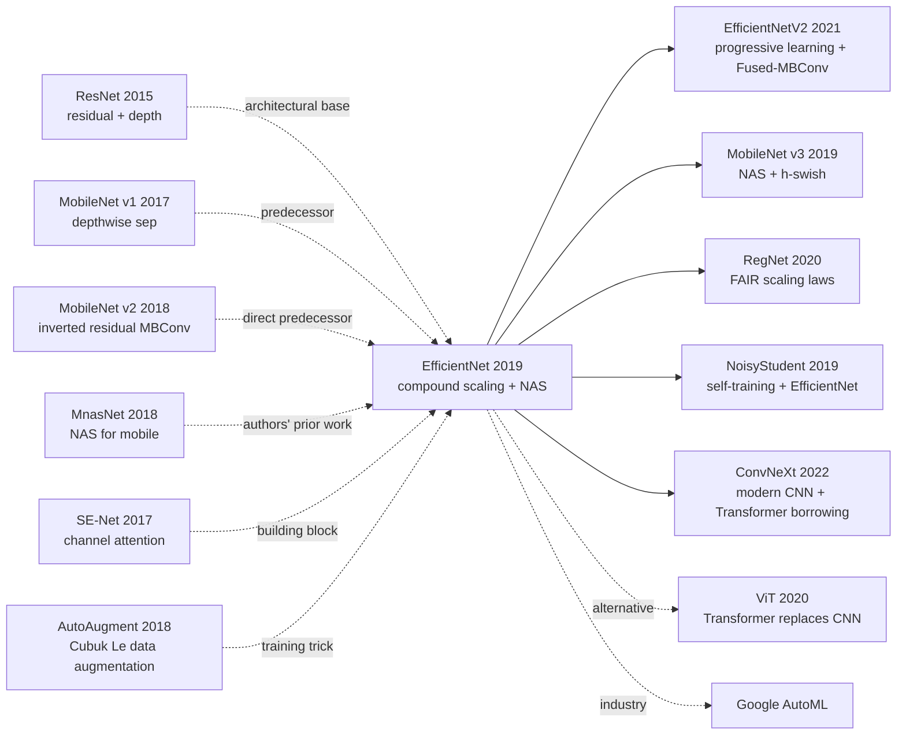

# EfficientNet — Redefining CNN Efficiency via Compound Scaling

> **May 28, 2019. Google Brain's Tan & Le release [EfficientNet (1905.11946)](https://arxiv.org/abs/1905.11946) on arXiv, accepted at ICML 2019.**
> The most important paper in CNN scaling history — first to systematically study "how to scale up models," proposing the **compound scaling** principle: **depth / width / input resolution must scale by fixed proportions simultaneously**, instead of tweaking one dimension at a time as before.
> Used NAS to search baseline EfficientNet-B0 (5.3M params), then generated B1-B7 via compound scaling. **EfficientNet-B7 (66M params) achieves 84.4% top-1 on ImageNet, beating prior SOTA GPipe (557M params) by 0.1%, but with 8.4× fewer params and 6.1× faster inference**.
> EfficientNet dominated 2019-2021 ImageNet leaderboards and birthed EfficientNetV2 / MobileNetV3 / ResNeSt / RegNet — the CNN apex before the ViT era.

## TL;DR

EfficientNet uses **compound scaling** ($d=\alpha^\phi, w=\beta^\phi, r=\gamma^\phi$, constraint $\alpha \cdot \beta^2 \cdot \gamma^2 \approx 2$) to scale depth / width / resolution at fixed proportions simultaneously, paired with the NAS-searched EfficientNet-B0 baseline (MBConv + SE blocks). From B0 (5.3M / 0.39G FLOPs / 77.3%) to B7 (66M / 37G FLOPs / 84.4%), it covers 8 SOTA models along the Pareto frontier.

---

## Historical Context

### What was the CNN scaling community stuck on in 2019?

2012-2018 ImageNet SOTA evolved: AlexNet (60M, 57.2%) → VGG (138M, 71.5%) → Inception v3 (24M, 78%) → ResNet-50 (25M, 76%) → ResNet-152 (60M, 78.6%) → ResNeXt-101 (84M, 80.5%) → SENet-154 (146M, 82.7%) → GPipe (557M, 84.3%). But **all scaling was ad-hoc**:

> **(1) Deeper** (ResNet 50→101→152): returns diminish quickly, gains drop +2 → +0.6 → +0.4
> **(2) Wider** (WideResNet widening ResNet): saturates quickly
> **(3) Higher resolution** (raising input image): memory explosion + returns saturate
> **(4) Three dimensions interdepend**: but no one systematically studied the dependency

The community's open question: **"When growing all three dimensions simultaneously, what proportion?"** GPipe with 557M brute-force scaling was the limit, but extremely inefficient.

### The 3 immediate predecessors that pushed EfficientNet out

- **Sandler et al., 2018 (MobileNet v2)** [CVPR]: proposed inverted residual + linear bottleneck (MBConv), EfficientNet's building block
- **Tan et al., 2018 (MnasNet)** [CVPR 2019]: authors' previous paper, NAS for mobile CNN; search space and method directly reused for EfficientNet
- **Hu et al., 2017 (SE-Net)** [CVPR 2018]: channel attention module embedded in EfficientNet's MBConv

### What was the author team doing?

2 authors all from Google Brain. Mingxing Tan is NAS / efficient CNN main force (MnasNet / EfficientNet / EfficientNetV2 / NoisyStudent etc.); Quoc V. Le is Google senior researcher (NAS / Seq2Seq / AutoAugment co-author). **Google Brain was betting on "automated model design + systematic scaling" strategy** at the time, EfficientNet was the representative work.

### State of industry, compute, data

- **TPU**: training B7 on 256 TPU v3 took ~5 days
- **Data**: ImageNet 1.28M training + 50k validation
- **Frameworks**: TensorFlow + in-house NAS framework (based on MnasNet)
- **Industry**: CV community fervent about "accuracy leaderboards"; Google / FAIR / NVIDIA competing for ImageNet SOTA

---
## Method Deep Dive

### Overall framework

```
Step 1: NAS Search
  Goal: find best architecture under mobile FLOPs constraint
  Search space: MBConv (mobile inverted bottleneck) + SE block
  → EfficientNet-B0 (5.3M params, 0.39B FLOPs, 77.3% top-1)

Step 2: Compound Scaling
  Constraint: depth=α^φ, width=β^φ, resolution=γ^φ
              s.t. α·β²·γ² ≈ 2 (FLOPs ≈ 2^φ)
  Grid search small (φ=1) → α=1.2, β=1.1, γ=1.15
  Generate B1, B2, ..., B7 by setting φ=1, 2, 3, ..., 7
```

| Model | φ | depth | width | resolution | params | FLOPs | top-1 |
|-------|---|-------|-------|-----------|--------|-------|-------|
| B0 | 0 | 1.0 | 1.0 | 224 | 5.3M | 0.39G | 77.3% |
| B1 | 1 | 1.2 | 1.1 | 240 | 7.8M | 0.70G | 79.2% |
| B2 | 2 | 1.4 | 1.2 | 260 | 9.2M | 1.0G | 80.3% |
| B3 | 3 | 1.7 | 1.3 | 300 | 12M | 1.8G | 81.6% |
| B4 | 4 | 2.0 | 1.4 | 380 | 19M | 4.2G | 82.9% |
| B5 | 5 | 2.4 | 1.6 | 456 | 30M | 9.9G | 83.6% |
| B6 | 6 | 2.8 | 1.8 | 528 | 43M | 19G | 84.0% |
| **B7** | **7** | **3.2** | **2.0** | **600** | **66M** | **37G** | **84.4%** |

### Key designs

#### Design 1: Compound Scaling Formula — systematic CNN scaling

**Function**: turn "how to scale up CNN" from ad-hoc empirical practice to formula-guided.

**Core formula**:

Define baseline network depth $d_0$, width $w_0$, resolution $r_0$. On the new model:

$$
d = \alpha^\phi, \quad w = \beta^\phi, \quad r = \gamma^\phi
$$

Subject to:

$$
\alpha \cdot \beta^2 \cdot \gamma^2 \approx 2, \quad \alpha \geq 1, \beta \geq 1, \gamma \geq 1
$$

Intuition: FLOPs proportional to depth $d$, width squared $w^2$, resolution squared $r^2$, so FLOPs $\propto d \cdot w^2 \cdot r^2 = (\alpha \beta^2 \gamma^2)^\phi \approx 2^\phi$. **φ +1 → FLOPs doubled**.

**Grid search** (paper Section 3.3): fix φ=1, in small search space find best $(\alpha, \beta, \gamma)$, found:

$$
\alpha = 1.2, \quad \beta = 1.1, \quad \gamma = 1.15
$$

Verify: $1.2 \cdot 1.1^2 \cdot 1.15^2 = 1.2 \cdot 1.21 \cdot 1.3225 = 1.92 \approx 2$ ✓

Then **fix this ratio set**, increase φ to generate B1, B2, ..., B7.

**Comparison with single-dimension scaling**:

| Scaling method | Example | top-1 increment from B0 (77.3%) | FLOPs |
|---------------|---------|---------------------------------|-------|
| width only (×2 w) | β=2 | +2.1 (79.4) | 0.93G |
| depth only (×2 d) | α=2 | +2.4 (79.7) | 0.84G |
| resolution only (×2 r) | γ=2 | +2.1 (79.4) | 1.30G |
| **compound (B3, φ=3)** | α=1.7,β=1.3,γ=1.5 | **+4.3 (81.6)** | **1.8G** |

Compound scaling significantly wins under similar FLOPs.

#### Design 2: NAS-searched EfficientNet-B0 baseline — starting point determines ceiling

**Function**: use NAS to find the best architecture under mobile-FLOPs constraint as baseline, avoiding scaling on a weak baseline.

**Search method**: based on MnasNet's NAS framework, search objective:

$$
ACC(m) \times \left[\frac{\text{FLOPs}(m)}{T}\right]^w
$$

where $T=400M$ is target FLOPs, $w=-0.07$ is tradeoff factor.

**Search space (which architectural hyperparams)**:
- Convolutional ops: regular conv, depthwise conv, MBConv (mobile inverted bottleneck)
- Kernel size: 3 or 5
- Squeeze-and-Excitation ratio: 0 or 0.25
- Skip ops: pooling, identity, none
- Channel size, number of layers per block

**Searched EfficientNet-B0 architecture**:

| Stage | Operator | Resolution | Channels | Layers |
|-------|----------|-----------|----------|--------|
| 1 | Conv 3×3 | 224×224 | 32 | 1 |
| 2 | MBConv1, k3×3 | 112×112 | 16 | 1 |
| 3 | MBConv6, k3×3 | 112×112 | 24 | 2 |
| 4 | MBConv6, k5×5 | 56×56 | 40 | 2 |
| 5 | MBConv6, k3×3 | 28×28 | 80 | 3 |
| 6 | MBConv6, k5×5 | 14×14 | 112 | 3 |
| 7 | MBConv6, k5×5 | 14×14 | 192 | 4 |
| 8 | MBConv6, k3×3 | 7×7 | 320 | 1 |
| 9 | Conv 1×1 + Pool + FC | 7×7 | 1280 | 1 |

#### Design 3: MBConv + SE Block — efficient building block

**Function**: each MBConv block (mobile inverted bottleneck conv) consists of expand → depthwise → SE → project 4 steps, plus residual connection.

**MBConv structure**:

```python
class MBConv(nn.Module):
    def __init__(self, in_ch, out_ch, kernel=3, stride=1, expand_ratio=6, se_ratio=0.25):
        super().__init__()
        hidden_ch = in_ch * expand_ratio
        # Step 1: Expand (1×1 conv)
        self.expand = nn.Sequential(
            nn.Conv2d(in_ch, hidden_ch, 1, bias=False),
            nn.BatchNorm2d(hidden_ch),
            nn.SiLU())                                # Swish/SiLU activation
        # Step 2: Depthwise conv
        self.depthwise = nn.Sequential(
            nn.Conv2d(hidden_ch, hidden_ch, kernel, stride=stride,
                      padding=kernel//2, groups=hidden_ch, bias=False),
            nn.BatchNorm2d(hidden_ch),
            nn.SiLU())
        # Step 3: SE block
        squeeze_ch = max(1, int(in_ch * se_ratio))
        self.se = nn.Sequential(
            nn.AdaptiveAvgPool2d(1),
            nn.Conv2d(hidden_ch, squeeze_ch, 1),
            nn.SiLU(),
            nn.Conv2d(squeeze_ch, hidden_ch, 1),
            nn.Sigmoid())
        # Step 4: Project (1×1 conv, no activation)
        self.project = nn.Sequential(
            nn.Conv2d(hidden_ch, out_ch, 1, bias=False),
            nn.BatchNorm2d(out_ch))
        self.use_residual = (stride == 1 and in_ch == out_ch)

    def forward(self, x):
        out = self.expand(x)
        out = self.depthwise(out)
        out = out * self.se(out)              # SE attention
        out = self.project(out)
        if self.use_residual:
            out = out + x                     # Inverted residual
        return out
```

**4 key building block choices**:
- **MBConv**: expand → depthwise → project, parameter-efficient
- **SE block**: channel attention, free +1% accuracy
- **SiLU/Swish activation**: $\text{SiLU}(x) = x \cdot \sigma(x)$, smoother than ReLU
- **Inverted residual**: skip connect in expanded space

#### Design 4: Training Augmentation — AutoAugment + Stochastic Depth + Dropout

**Function**: use various regularizations to prevent overfitting in large models.

**Key regularization tricks**:

| Trick | Effect |
|-------|--------|
| **AutoAugment** | NAS-searched data augmentation policy (rotation/shear/color jitter etc.) |
| **Dropout** | B0 0.2 → B7 0.5 (more dropout for larger models) |
| **Stochastic Depth** | randomly drop layers during training, more stable for deep nets |
| **Label Smoothing** | 0.1 |
| **EMA weights** | maintain EMA weights as inference weights |
| **Larger LR + warmup** | adapts to TPU large batch |

### Loss / training strategy

| Item | Config |
|------|--------|
| Loss | Cross-entropy + label smoothing 0.1 |
| Optimizer | RMSprop with momentum 0.9, decay 0.9 |
| LR | 0.256, decay 0.97 every 2.4 epochs |
| Batch | 4096 (256 TPU v3) |
| Weight decay | 1e-5 |
| Dropout | 0.2 (B0) → 0.5 (B7) |
| Activation | SiLU/Swish |
| Training epochs | 350 |
| Augmentation | AutoAugment + RandAugment |

---

## Failed Baselines

### Opponents that lost to EfficientNet at the time

- **GPipe** (Google 2018, 557M params): ImageNet 84.3% → EfficientNet-B7 84.4% (66M params, **8.4× fewer**)
- **AmoebaNet-B (NAS-search)** (135M, 83.5%) → B6 (43M, 84.0%, **3.1× fewer**)
- **ResNeXt-101 + SE** (146M, 82.7%) → B5 (30M, 83.6%, **4.9× fewer**)
- **NASNet-A** (89M, 82.7%) → B4 (19M, 82.9%, **4.7× fewer**)
- **ResNet-50** (26M, 76.0%) → **B0 (5.3M, 77.3%, 5× fewer + 1.3% higher)**

### Failures / limits admitted in the paper

- **NAS search expensive**: B0 baseline NAS search cost thousands of TPU-hours
- **Depthwise conv slow on GPU**: actual GPU inference EfficientNet not necessarily faster than ResNet (depthwise conv weakly optimized)
- **Slow training**: B7 trains 5 days on 256 TPU
- **Large model OOM**: B6/B7 inference on single V100 needs large memory
- **Compound scaling coefficients fixed**: α=1.2/β=1.1/γ=1.15 not necessarily optimal on different baselines

### "Anti-baseline" lesson

- **"Single-dimension scaling is enough"** (ResNet-152, WideResNet): EfficientNet proved three-dimension synergistic scaling far better
- **"Scale up is ad-hoc engineering"**: EfficientNet proposed systematic principle
- **"Accuracy first"** (GPipe route): EfficientNet brought Pareto frontier perspective to CV
- **"Hand-designed architecture > NAS"** (some SOTA belief): EfficientNet with NAS baseline + scaling fully wins

---

## Key Experimental Numbers

### ImageNet main experiment

| Model | Params | FLOPs | top-1 | top-5 |
|-------|--------|-------|-------|-------|
| ResNet-50 | 26M | 4.1G | 76.0 | 93.0 |
| ResNet-152 | 60M | 11G | 78.6 | 94.3 |
| Inception-ResNet-v2 | 56M | 13G | 80.1 | 95.1 |
| ResNeXt-101 | 84M | 32G | 80.9 | 95.6 |
| AmoebaNet-A | 87M | 23G | 82.8 | 96.1 |
| AmoebaNet-C | 155M | 41G | 83.5 | 96.5 |
| GPipe | **557M** | - | 84.3 | 97.0 |
| **EfficientNet-B7** | **66M** | **37G** | **84.4** | **97.1** |

### Single/dual/triple dimension scaling comparison (Section 3.3)

| Scaling | top-1 increment from B0 | FLOPs |
|---------|-------------------------|-------|
| width only (β=2) | +2.1 (79.4) | 0.93G |
| depth only (α=2) | +2.4 (79.7) | 0.84G |
| resolution only (γ=2) | +2.1 (79.4) | 1.30G |
| **compound (B3)** | **+4.3 (81.6)** | **1.8G** |

### Transfer learning (paper Table 5)

| Dataset | EfficientNet | Prior SOTA | Improvement |
|---------|-------------|-----------|-------------|
| CIFAR-10 | 98.9 | 98.4 | +0.5 |
| CIFAR-100 | 91.7 | 89.3 | +2.4 |
| Birdsnap | 81.8 | 81.2 | +0.6 |
| Stanford Cars | 93.6 | 94.7 | -1.1 (slight loss) |
| Flowers | 98.8 | 97.7 | +1.1 |
| FGVC Aircraft | 92.9 | 92.9 | tie |
| Oxford Pets | 95.4 | 95.9 | -0.5 |

### Key findings

- **Compound scaling works on all 8 scales**
- **B7 8.4× fewer params beats GPipe**: parameter efficiency unprecedented
- **Transfer learning also SOTA**: 5 of 8 transfer datasets beat prior
- **NAS baseline more important than hand-designed**: ResNet baseline + compound scaling worse than EfficientNet family

---

## Idea Lineage



### Predecessors
- **ResNet (2015)**: architectural foundation
- **MobileNet v1/v2 (2017-2018)**: MBConv block source
- **MnasNet (2018)**: authors' previous NAS for mobile
- **SE-Net (2017)**: channel attention building block
- **AutoAugment (2018)**: training augmentation

### Successors
- **EfficientNetV2 (2021)**: authors' own improvement, progressive learning + Fused-MBConv
- **MobileNet v3 (2019)**: NAS searches smaller mobile models
- **RegNet (Facebook 2020)**: another branch of scaling laws CNN
- **NoisyStudent (2019)**: authors' use of EfficientNet + self-training to push ImageNet to 88.4%
- **ConvNeXt (2022)**: modern CNN, borrowing from Transformer
- **ViT era (2020+)**: Vision Transformer beats EfficientNet on large datasets

### Misreadings
- **"EfficientNet is the ultimate ImageNet solution"**: 2020+ ViT/Swin/MAE fully surpass
- **"Compound scaling coefficients are universal"**: α/β/γ on different baselines need re-search
- **"Pareto optimal = actual optimal"**: on GPU EfficientNet slower than ResNet (depthwise conv slow)

---

## Modern Perspective (Looking Back from 2026)

### Assumptions that don't hold up

- **"CNN is the ultimate ImageNet architecture"**: ViT/Swin (2020+) fully surpass
- **"Compound scaling is universal law"**: on ViT scaling proportions completely different
- **"66M params is large model"**: today ViT-G 1.8B / SAM 1B
- **"ImageNet 1.28M is reasonable benchmark size"**: today LAION-5B 5B images
- **"Depthwise sep is mobile optimal"**: today MobileViT / EfficientFormer with attention + conv hybrid

### What time validated as essential vs redundant

- **Essential**: compound scaling idea (borrowed by ViT/Swin), NAS baseline + scaling framework, SiLU/Swish activation, SE integration
- **Redundant / misleading**: α=1.2/β=1.1/γ=1.15 specific values (baseline-dependent), AutoAugment complex policy (replaced by RandAugment), EfficientNet B0 NAS search (v2 simplified to hand-designed)

### Side effects the authors didn't anticipate

1. **Pareto frontier perspective entered mainstream**: subsequent ImageNet papers must report params/FLOPs/accuracy 3-axis comparison
2. **NoisyStudent + EfficientNet pushed ImageNet to 88.4%**: with self-training + 300M unlabeled data
3. **AutoML industry rise**: Google AutoML / Vertex AI all based on NAS + EfficientNet ideas
4. **Changed CV paper writing**: previously only reported top-1, after must report efficiency frontier
5. **Ended by ViT era but ideas remain**: Swin/SwinV2/CoAtNet all use compound scaling ideas

### If we rewrote EfficientNet today

- Use EfficientNetV2's Fused-MBConv instead of MBConv (GPU-friendly)
- Use progressive learning (start small res, gradually scale up)
- Add ViT elements (CoAtNet-style conv + attention hybrid)
- Use ConvNeXt block instead of MBConv
- Default RandAugment instead of AutoAugment
- Scale data to ImageNet-21k pre-training

But the **core principle "compound scaling synergizing three dimensions" remains the foundation of today's ViT/Swin/CoAtNet scaling**.

---

## Limitations and Outlook

### Authors admitted
- NAS search expensive (thousands of TPU-hours)
- B7 training slow (5 days on 256 TPU)
- Depthwise conv slow on GPU
- α/β/γ coefficients baseline-dependent
- Memory limited (B7 inference needs large memory)

### Found in retrospect
- Some transfer datasets slightly lose (Stanford Cars / Pets)
- GPU inference speed worse than theoretical FLOPs prediction
- Training hyperparameter sensitive

### Improvement directions (validated by follow-ups)
- EfficientNetV2 (2021): Fused-MBConv + progressive learning
- NoisyStudent (2019): self-training pushed to 88.4%
- ConvNeXt (2022): modern CNN
- Transition to ViT/Swin (2020+)

---

## Related Work and Inspiration

- **vs single-dimension scaling (cross-paradigm)**: previously ResNet-50→152 single-dimensional depth scaling, EfficientNet three-dimensional synergistic. **Lesson: scaling is multi-dimensional, not single-knob tuning**
- **vs MnasNet (cross-scale)**: MnasNet only searches mobile, EfficientNet searches baseline + scaling. **Lesson: NAS small baseline + law amplification = efficient route**
- **vs GPipe (cross-parameter-efficiency)**: GPipe brute force 557M, EfficientNet smart 66M. **Lesson: 8.4× param efficiency proves the leverage of architecture + scaling design**
- **vs ViT (cross-architecture)**: ViT beats EfficientNet on large data. **Lesson: CNN era ends, but scaling laws still guide ViT**
- **vs MobileNet v3 (cross-contemporary)**: MobileNet v3 uses NAS for mobile, EfficientNet uses NAS + scaling for general. **Lesson: NAS + scaling is more general than NAS alone**

---

## Related Resources

- 📄 [arXiv 1905.11946](https://arxiv.org/abs/1905.11946) · [ICML 2019](http://proceedings.mlr.press/v97/tan19a.html)
- 💻 [Authors' TF implementation](https://github.com/tensorflow/tpu/tree/master/models/official/efficientnet) · [PyTorch Image Models (timm)](https://github.com/rwightman/pytorch-image-models)
- 🔗 [HuggingFace EfficientNet](https://huggingface.co/google/efficientnet-b7)
- 📚 Must-read follow-ups: [EfficientNetV2 (2021)](https://arxiv.org/abs/2104.00298), [MobileNet v3 (2019)](https://arxiv.org/abs/1905.02244), [NoisyStudent (2019)](https://arxiv.org/abs/1911.04252), [ConvNeXt (2022)](https://arxiv.org/abs/2201.03545)
- 🎬 [Yannic Kilcher: EfficientNet paper review](https://www.youtube.com/watch?v=3svIm5UC94I)

---

> 🌐 [中文版本](/era3_attention/2019_efficientnet/) · 📚 awesome-papers project · CC-BY-NC
