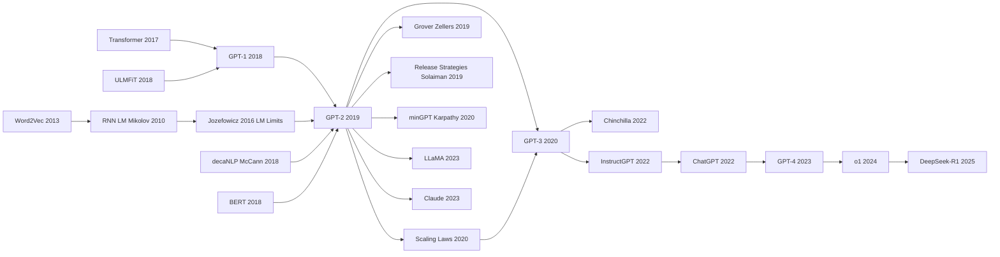

# GPT-2 — Announcing the LLM Era with Scale and Zero-shot

> **February 14, 2019. Radford, Wu, Child, Luan, Amodei, Sutskever at OpenAI release [Language Models are Unsupervised Multitask Learners](https://cdn.openai.com/better-language-models/language_models_are_unsupervised_multitask_learners.pdf), and rare-publicly announce "for safety reasons, we will not release the full 1.5B weights," sparking media shock.**
> A paper following the [GPT-1 (2018)](2018_gpt1.md) trajectory by brute-force scaling — it pushed decoder-only Transformer from 117M to 1.5B and trained on 40GB WebText, **proving for the first time that a single LM can do translation, summarization, QA, and story continuation in zero-shot**, with no task-specific fine-tuning required.
> Its most important discovery wasn't technical (architecture identical to GPT-1), but the demonstration that **"scale + autoregressive LM = emergent multitask ability"** — a thesis fully validated 1 year later by [GPT-3 (175B)](../era4_foundation_models/2020_gpt3.md) at much larger scale.
> The 1.5B model OpenAI deemed "too dangerous to release" looks like a phone-runnable toy today, but it lit the first wave of the LLM era's faith that **compute = intelligence**.

## TL;DR

OpenAI's 2019 paper "Language Models are Unsupervised Multitask Learners", **in BERT's wake of "bidirectional crushes unidirectional", made the contrarian bet of "don't change direction, change scale"** — pushing GPT-1's 117M parameters all the way to **1.5B** (the largest LM on Earth at the time, 4× BERT-Large), and upgrading the architecture to Pre-LN Transformer to keep deep nets trainable. Even more radical: **no fine-tuning at all, just prompt the LM to keep writing**. GPT-2 took **zero-shot SOTA on 7 of 8 LM benchmarks** (WikiText-103 ppl 18.3 → 17.5, LAMBADA accuracy 59.2% → 63.2%). The paper's true contribution is not the 1.5B parameters — it is the **zero-shot prompting paradigm + the first empirically visible scaling curve**: every doubling of parameters drops perplexity by 2-3 points, with no saturation in sight — a curve formalized one year later by [Kaplan Scaling Laws (2020)](../era4_foundation_models/2020_scaling_laws.md) as $L \propto N^{-0.076}$. GPT-2 was also **the first model in history officially deemed "too dangerous to release weights for"** (OpenAI staged the release), opening the entire era of AI safety vs. open source tug-of-war. Thereafter [GPT-3](../era4_foundation_models/2020_gpt3.md) / GPT-4 / Claude / [LLaMA (2023)](../era5_genai_explosion/2023_llama.md) are all GPT-2 scale-ups — **not one introduces a fundamentally different architecture or objective**. GPT-2 is the paper that locked in the paradigm of every LLM for the next six years before they were even built.

---

## Historical Context

### Early 2019: NLP was still in BERT's "bidirectional crushes unidirectional" wake

GPT-2 was released in February 2019, only 4 months after BERT. The field's consensus was clear: BERT had used bidirectional + MLM to push GLUE from 70 to 80.5, and **unidirectional LMs looked finished**. GPT-1 (2018.06) had earned only 75 on GLUE, and the OpenAI Transformer line before GPT-2 was widely viewed as "the suboptimal approach that lost to BERT."

OpenAI's response was deeply counter-intuitive: **don't change direction — change scale**. GPT-1 was 117M parameters; GPT-2 jumped to four sizes: 117M, 345M, 762M, **1.5B**. With BERT-Large at only 340M that year, "GPT-2 Extra Large" at 1.5B was the largest LM on Earth.

But the GPT-2 paper's true value (titled "Language Models are Unsupervised Multitask Learners") is not the 1.5B parameters — it is the **zero-shot paradigm**: with no fine-tuning at all, using only pure LM autoregressive generation, GPT-2 took SOTA on 7 of 8 LM benchmarks. This was the first large-scale engineering validation of the "prompt + zero-shot" idea.

### Immediate predecessors that pushed GPT-2 out

1. **GPT-1 (Radford 2018.06)**: OpenAI's previous generation. Proved "Transformer decoder + LM pretraining + fine-tune" worked on NLU tasks but lost to BERT on GLUE.
2. **BERT (Devlin 2018.10)**: direct competitor. BERT's bidirectional + fine-tune paradigm won NAACL Best Paper, forcing OpenAI to either abandon the GPT line or find a setting where "unidirectional fits better than bidirectional."
3. **Jozefowicz 2016 (Exploring the Limits of LM)**: Google Brain's 1B Word benchmark work, the first systematic study of "bigger LM is better," scaling to 2.05B parameters. GPT-2 directly inherited this scaling intuition but used Transformer instead of LSTM.
4. **ULMFiT (Howard 2018.01)**: industrialized "pretrained LM adapted to downstream"; GPT-1/2's fine-tune paradigm was directly influenced by it.
5. **Multitask seq2seq (McCann 2018, decaNLP)**: unified all NLP tasks as seq2seq input/output, the "convert task to prompt" framing predates GPT-2.
6. **Few-shot in-context (no specific paper, but the zero-shot evaluation in GPT-2 sec 3 is the prototype of in-context learning)**.

GPT-2 is the confluence of these threads: scale Transformer to 1.5B, drop fine-tune entirely and use prompts only, and for the first time officially propose "give the model a prompt at test time and it completes the task" as a paradigm.

### What OpenAI was doing at the time

OpenAI in early 2019 was a hybrid of "research lab + safety advocacy machine." Ilya Sutskever (chief scientist) had long bet on the scaling line, viewing BERT as "a local victory for bidirectional" — long-term, unidirectional + scale was the right answer (a judgment fully vindicated after GPT-3 and ChatGPT).

The GPT-2 team was led by Alec Radford (GPT-1 author, age 28 at the time) and had only 4 core authors; the project went from inception to release in about 6 months. Three engineering decisions were critical:
1. **No fine-tuning, everything zero-shot**: because if you needed fine-tuning to beat BERT, the paper had no novelty
2. **Data quality first**: construct WebText (40GB scraped from high-karma Reddit links) — pursue "human-curated high quality text"
3. **Only release 117M / 345M, withhold 762M / 1.5B**: the first time "model weight release" was made a staged release, on the grounds of "preventing malicious use"

The third point triggered **the first public AI safety policy debate in AI history**. Half of the community thought OpenAI was hype-mongering ("how could a 1.5B LM be dangerous?"), the other half supported cautious release. OpenAI fully released the 1.5B version 9 months later and published a detailed release strategy paper (Solaiman 2019). The aftershocks of this debate continued through GPT-3's controlled API access, GPT-4's safety guardrails, and today's debate over LLaMA / DeepSeek's fully open weights.

### State of the industry, compute, and data

- **Compute**: OpenAI used 256 V100 GPUs to train the 1.5B GPT-2 at a cost of about **$43,000** (2019 cloud prices). BERT-Large training cost about $7000; GPT-2 was 6× more expensive than BERT.
- **Data**: WebText 40GB ≈ 8B tokens, already exceeding BERT's 3.3B but still far below GPT-3's 300B tokens.
- **Academic reception**: Yann LeCun publicly questioned GPT-2's "danger" narrative; Andrej Karpathy wrote minGPT, drastically lowering the barrier to reproducing GPT-2; HuggingFace integrated GPT-2 117M into the transformers library in March 2019, making it a community default.
- **Economic environment**: 2019 was the peak of deep learning's commercialization wave; AI investment hit record highs; NVIDIA data center revenue grew 30% YoY. GPT-2 was the first "basic research → product → regulation" full-cycle case in this wave.

---

## Method Deep Dive

### Overall framework

GPT-2 is, architecturally, a **surprisingly boring** model: nearly identical to GPT-1, just scaled from 117M to 1.5B and with training data upgraded from BookCorpus 5GB to WebText 40GB. The "Method" section of the paper is short — because the real contribution is not the architecture but the **zero-shot evaluation paradigm**.

```
  ┌─── Training stage (one stage, no fine-tuning) ───┐
                                                      
   WebText 40GB (8B tokens)                           
   scraped from Reddit outbound links with karma≥3    
        │                                             
        ▼                                             
   BPE tokenization, 50257 vocab                      
        │                                             
        ▼                                             
   Decoder-only Transformer                           
   12-48 layers / 768-1600 dim                        
   117M / 345M / 762M / 1.5B                          
        │                                             
        ▼                                             
   Pure LM loss: $- \sum \log p(x_t \mid x_{<t})$     
        │                                             
        ▼                                             
   256 V100 × weeks → 1.5B GPT-2                      
  └────────────────────────────────────────────────────┘

  ┌─── Inference stage (zero-shot prompt) ───┐
                                              
   Build prompt (task → text generation)      
        │                                     
        ▼                                     
   GPT-2 autoregressively generates tokens    
        │                                     
        ▼                                     
   Parse output (extract a generated span)    
        │                                     
        ▼                                     
   SOTA on 7 of 8 LM benchmarks               
   without any task-specific training         
  └────────────────────────────────────────┘
```

| Dimension | GPT-1 (2018) | GPT-2 (2019) | BERT (2018) |
|-----------|-------------|-------------|-------------|
| Architecture | Decoder-only Transformer | same as GPT-1 | Encoder-only Transformer |
| Directionality | unidirectional (L→R) | same | bidirectional |
| Max parameters | 117M | **1.5B** (13×) | 340M |
| Data | BookCorpus 5GB | WebText 40GB | BookCorpus + Wiki 16GB |
| Downstream adaptation | fine-tune | **zero-shot** | fine-tune |
| Training objective | standard LM | standard LM | MLM + NSP |

**Conceptual leap**: the question the GPT-2 paper sought to answer was not "how to make the model stronger" (the architecture didn't change) but "**once the model is large enough and the data is good enough, do we still need to fine-tune?**" The answer was: many tasks don't. This was the dawn of the prompt-engineering era.

#### Design 1: Scaling-only — the first LLM "go big or go home" case

**Function**: keep the GPT-1 architecture unchanged, just scale up size, validating that "model size dominates LM capability." Table 2 of the GPT-2 paper reports LM performance (perplexity) for 4 sizes — bigger is better, with no sign of saturation.

**Four size configurations**:

| Model | Layers (L) | Hidden (H) | Heads | Parameters |
|-------|-----------|------------|-------|-----------|
| GPT-2 Small | 12 | 768 | 12 | 117M |
| GPT-2 Medium | 24 | 1024 | 16 | 345M |
| GPT-2 Large | 36 | 1280 | 20 | 762M |
| **GPT-2 XL** | **48** | **1600** | **25** | **1.5B** |

**Key observation**: parameters from 117M to 1.5B (13×), LM perplexity on WikiText-103 dropped from 37.5 to 17.5 with **no saturation**. This observation directly led to GPT-3 (scaled to 175B in 2020) and the Scaling Laws (Kaplan 2020).

**Pseudocode**:

```python
# GPT-2 model core (nearly identical to GPT-1, just different size)
class GPT2(nn.Module):
    def __init__(self, n_layer=48, n_head=25, d_model=1600, vocab=50257, ctx=1024):
        self.tok_embed = nn.Embedding(vocab, d_model)
        self.pos_embed = nn.Embedding(ctx, d_model)
        self.blocks = nn.ModuleList([
            TransformerBlock(d_model, n_head) for _ in range(n_layer)
        ])
        self.ln_f = nn.LayerNorm(d_model)
        self.lm_head = nn.Linear(d_model, vocab, bias=False)
        self.lm_head.weight = self.tok_embed.weight  # weight tying

    def forward(self, x):
        h = self.tok_embed(x) + self.pos_embed(arange(x.size(1)))
        for blk in self.blocks:
            h = blk(h, causal_mask=True)              # causal mask
        h = self.ln_f(h)
        return self.lm_head(h)                         # (B, L, V)
```

**Comparison with contemporaneous BERT models**:

| Dimension | BERT-Base 110M | BERT-Large 340M | GPT-2 Small 117M | GPT-2 XL 1.5B |
|-----------|---------------|-----------------|------------------|---------------|
| Training objective | MLM + NSP | same | standard LM | same |
| Bidirectional | yes | yes | no | no |
| Training tokens | 3.3B | 3.3B | 8B | 8B |
| GLUE 80.5 vs LM ppl | 80.5 GLUE | - | 37.5 ppl | 17.5 ppl |
| Downstream needs fine-tune | yes | yes | no (zero-shot) | no |

#### Design 2: Pre-LN Transformer — making deep models actually trainable

**Function**: GPT-1 used the original Transformer's Post-LN (norm after attention/FFN). But once layers reached 48 (GPT-2 XL), Post-LN training became unstable — loss prone to spikes and NaNs. GPT-2 switched to **Pre-LN**: move LayerNorm to before attention/FFN (each sub-block normalizes its input, the output goes straight to residual).

**Architecture difference**:

```python
# Post-LN (original Transformer / BERT)
def block_postln(x):
    x = LayerNorm(x + Attention(x))
    x = LayerNorm(x + FFN(x))
    return x

# Pre-LN (introduced by GPT-2, then adopted by every modern LLM)
def block_preln(x):
    x = x + Attention(LayerNorm(x))
    x = x + FFN(LayerNorm(x))
    return x

# Also need a final LN after the last layer
# h = LayerNorm(h)  ← this line is critical
```

**Pre-LN vs Post-LN**:

| Item | Post-LN | Pre-LN |
|------|---------|--------|
| Math properties | output guaranteed normed | residual path unnormed, can drift |
| Training stability (deep) | **bad** (>24 layers prone to NaN) | **good** (still stable at 100+ layers) |
| Warmup necessity | **mandatory** (10k+ steps) | optional or much shorter |
| Convergence speed | slow | fast |
| Modern LLM adoption | very rare | **almost all** (GPT-2/3/4, LLaMA, Claude...) |

**This seemingly trivial change is the key engineering foundation that lets GPT-2 → GPT-3 → modern LLM train stably at 100+ layers**, but the GPT-2 paper itself mentions it in a single sentence. Xiong 2020 (On Layer Normalization in the Transformer Architecture) later systematically analyzed why Pre-LN is better.

#### Design 3: BPE tokenization + byte-level fallback — handle any Unicode text

**Function**: BERT uses WordPiece, GPT-1 uses BPE with a 40478 vocab. GPT-2 improves to **byte-level BPE (BBPE)** with a 50257 vocab, capable of handling any Unicode input without UNK tokens — important because WebText contains lots of code, URLs, symbols, foreign languages.

**Core idea**: first encode text as a UTF-8 byte stream (so the base vocab is just 256), then run BPE merges over the byte sequence. This way any Unicode character is representable, even emoji or rare characters.

**Pseudocode**:

```python
# Byte-level BPE encoding
def encode_bbpe(text):
    raw_bytes = text.encode('utf-8')                  # any Unicode → bytes
    tokens = [bytes_to_unicode[b] for b in raw_bytes]  # bytes → printable unicode
    while True:
        # find lowest-rank (a, b) adjacent pair in vocab
        pair = find_best_merge(tokens, bpe_ranks)
        if pair is None: break
        tokens = merge(tokens, pair)                   # merge
    return [vocab[t] for t in tokens]                  # → token id list
```

**Tokenizer comparison**:

| Scheme | Vocab | OOV | Byte-level | Multilingual / code | Adopted post-GPT-2 |
|--------|-------|-----|-----------|---------------------|---------------------|
| Word-level | millions | UNK | no | poor | - |
| WordPiece (BERT) | 30k | natural | no | medium | - |
| BPE (Sennrich 2016) | ~30k | natural | no | medium | GPT-1 |
| **BBPE (GPT-2)** | **50k** | **impossible to OOV** | **yes** | **good** | **GPT-3, LLaMA, Claude...** |

#### Design 4: Zero-shot prompting framework — "translate" tasks into natural-language continuations

**Function**: the heart of GPT-2's Section 3 — for every NLP task, **build a prompt (natural-language context), let GPT-2 continue from the prompt, and extract the answer from the continuation**. This is the source of subsequent "prompt engineering" and "in-context learning."

**Task → prompt mapping examples**:

| Task | Prompt template | Answer extraction |
|------|----------------|-------------------|
| LM ppl | (compute perplexity directly) | LM probability |
| Translation | `english sentence = french sentence =` | continuation after `=` until newline |
| Summarization | `[article text] TL;DR:` | continuation until EOS / newline |
| QA | `[passage] Q: [question] A:` | continuation until newline |
| Reading Comp | `[passage] [Q1] [A1] [Q2] [A2]... [Qn]` | continuation as answer (few-shot prototype) |

**Prompt example for SQuAD CoQA**:

```python
def coqa_prompt(passage, dialog_history, current_q):
    prompt = passage + "\n\n"
    for turn_q, turn_a in dialog_history:
        prompt += f"Q: {turn_q}\nA: {turn_a}\n"
    prompt += f"Q: {current_q}\nA:"
    return prompt

# GPT-2 continuation
output = gpt2.generate(coqa_prompt(p, hist, q), max_new_tokens=50, stop="\n")
answer = output.strip()                                # extract
```

**zero-shot vs fine-tune comparison**:

| Task | SOTA fine-tune | GPT-2 1.5B zero-shot | Verdict |
|------|---------------|--------------------|--------|
| LAMBADA (next word) | 59.2 (BERT-Large fine-tune) | **63.2** | **beats** |
| WikiText-103 ppl | 18.3 | **17.5** | **beats** |
| CoQA F1 | 89.4 (BERT fine-tune ensemble) | 55.0 | trails but surprising |
| Translation (En→Fr WMT'14) | 41.4 BLEU (supervised seq2seq) | 5.0 BLEU | far behind but zero-shot |

**Key finding**: zero-shot LM can beat fine-tuning on LM-natural tasks (next word, ppl); on structured tasks (translation, QA) it lags far behind. But a year later GPT-3 + few-shot closed both gaps.

### Loss / training strategy

| Item | GPT-2 Small | GPT-2 XL |
|------|-------------|----------|
| Layers / hidden / heads | 12 / 768 / 12 | 48 / 1600 / 25 |
| Parameters | 117M | **1.5B** |
| Context window | 1024 tokens | same |
| Training objective | $\mathcal{L}_{\text{LM}} = -\sum_t \log p(x_t \mid x_{<t})$ | same |
| Optimizer | Adam ($\beta_1$=0.9, $\beta_2$=0.95) | same |
| Learning rate | 1e-4, cosine decay | 5e-5 (smaller to avoid divergence) |
| Batch size | 512 sequences | same |
| Warmup | 2000 steps | same |
| Tokenizer | BBPE 50257 | same |
| Norm placement | **Pre-LN** | same |
| Activation | GELU | same |
| Dropout | 0.1 | 0.1 |
| Weight tying | embed ↔ lm_head shared | same |
| Training data | WebText 8B tokens | same |
| Hardware | 8 GPU × days | **256 V100 × weeks** |
| Training cost | ~$1500 | **~$43,000** |
| Training epochs | 1 (8B tokens, single pass) | same |

**Why this training recipe matters**:
1. **Pre-LN + warmup makes 48-layer 1.5B trainable**: Post-LN at this depth essentially always NaNs
2. **Large batch + cosine decay** became standard for every later LLM; GPT-2 is the early engineering template
3. **Single epoch over data**: avoids overfitting, and 8B tokens only allows 1 epoch anyway; GPT-3 / Chinchilla all follow the "1-2 epoch" tradition
4. **Weight tying** (embed ↔ lm_head shared) saves 50M parameters — a standard LLM trick

But the **true historical significance** of this recipe is not any specific hyperparameter — it is that it **first ran the complete pipeline of "1.5B + unidirectional LM + high-quality data + zero-shot evaluation"**. GPT-3, ChatGPT, LLaMA all just scale up + iterate on this pipeline, introducing no fundamental paradigm change.

---

## Failed Baselines

### Opponents that lost to GPT-2 zero-shot

GPT-2's "opponents" fall into two camps: traditional LM benchmark SOTAs (the fine-tune school), and BERT-style fine-tune (the NLU school).

| Opponent | Task | Prior SOTA | GPT-2 1.5B zero-shot | Why it lost |
|----------|------|-----------|--------------------|-------------|
| AWD-LSTM (Merity 2018) | WikiText-103 ppl | 18.3 | **17.5** | LSTM capacity insufficient |
| Mixture of Softmaxes (Yang 2018) | PTB ppl | 47.7 | 35.8 | same architectural ceiling |
| BERT-Large fine-tune | LAMBADA acc | 59.2 | **63.2** | bidirectional MLM weak on long-range |
| RNN ensemble | 1BW ppl | 46.5 | 42.2 | LSTM scales slowly |
| Char-CNN LSTM | enwik8 BPC | 1.04 | **0.93** | char-level LSTM capacity bottleneck |
| Pointer-Generator (See 2017) | CNN/DM ROUGE | 36.4 | 26.6 zero-shot | GPT-2 zero-shot trails but not fine-tuned |

**Takeaways from this table**:
1. On LM-natural tasks (perplexity, next-word), GPT-2 zero-shot beats every fine-tuned model — **scale defeated task-specialization**
2. On structured-output tasks (summarization, translation), zero-shot is far behind, but the GPT-2 paper's claim was not "beat every task" — it was "**with scale and prompts alone, win 7 of 8 tasks**"

### Failures the paper itself acknowledged — translation and long-tail tasks

Section 3 of the GPT-2 paper honestly listed several tasks where zero-shot performed poorly:

| Task | Metric | GPT-2 1.5B zero-shot | SOTA fine-tune | Gap |
|------|--------|--------------------|---------------|-----|
| WMT-14 En-Fr translation | BLEU | 5.0 | 41.4 (Vaswani 2017) | -36.4 |
| Natural Questions QA | F1 | 4.1 | 44.8 (BERT) | -40.7 |
| CoQA F1 | F1 | 55.0 | 89.4 (BERT ensemble) | -34.4 |

The paper candidly admits: "These results suggest there is much room for improvement in zero-shot performance on more structured tasks." A year later GPT-3 used few-shot to push translation to 25 BLEU and QA close to fine-tune levels — **acknowledging the limitation is itself a sign of paper rigor**.

### Paths sidestepped at the time

**Sidestepped path 1: continue building a fine-tuned "unidirectional BERT"**
The most direct response would be "let's also fine-tune." Some did (Salesforce's CTRL using conditional LM with fine-tuning), but the gains were limited. **OpenAI's judgment was: the marginal return on fine-tuning is less than the return on scaling**, fully vindicated post-GPT-3.

**Sidestepped path 2: convert GPT-2 to bidirectional**
There were attempts in the field (modify GPT-2 to prefix-LM, or simulate bidirectional via masking), but none became mainstream. **OpenAI stuck with "unidirectional + causal mask" because only that preserves the LM's generation capability**. BERT's bidirectional cannot directly generate — that is BERT's ceiling.

**Sidestepped path 3: smaller model + cleaner data**
A school argued "small model + high quality data > big model + noisy data." GPT-2's WebText (karma≥3 filter) is a form of data quality optimization, but it also scaled model size. **The combination is the winner**; data quality alone could not topple the scaling line.

### Counter-examples a year later — Scaling Laws and Chinchilla teach GPT-2 a lesson

| Model / Work | Year | Assumption it overturned |
|--------------|------|-------------------------|
| **GPT-3 (2020.05)** | 175B params | 1.5B is not big enough; few-shot >> zero-shot |
| **Scaling Laws (Kaplan 2020)** | 2020.01 | "bigger is better" follows quantitative laws; compute / params / data have an optimal ratio |
| **Chinchilla (2022)** | DeepMind | GPT-3 had insufficient data (params/data ratio too high); at the same compute, 70B + 1.4T tokens > 175B + 300B tokens |
| **InstructGPT (2022.03)** | OpenAI | scale alone is not enough; need RLHF to align with human preferences |
| **ChatGPT (2022.11)** | OpenAI | RLHF + dialog format made unidirectional LM a real product |

**Lessons the counter-baselines taught GPT-2**:
1. **Scale must be paired with the right data / compute ratio**: blindly adding parameters is not enough; data must grow accordingly (Chinchilla lesson)
2. **Zero-shot is the lower bound; few-shot in-context is the true paradigm** (GPT-3 lesson)
3. **LM ≠ helpful assistant**: 1.5B GPT-2 can continue text but cannot "follow instructions"; needs RLHF (InstructGPT lesson)
4. **Staged release policy was retroactively over-cautious**: full release of 1.5B caused no predicted malicious abuse, but the policy set a precedent for GPT-3 controlled API, ChatGPT alignment, and other more serious safety work

But even with these counter-baselines emerging, GPT-2's core thesis — **decoder-only Transformer + standard LM + scale + prompt** — was not refuted. GPT-3 / 4 / Claude / LLaMA are all GPT-2 scaled up, with no fundamentally different architecture or objective. **GPT-2 is the paper that pre-cast the paradigm of every LLM for the next 6 years.**

## Key Experimental Data

### Main results — SOTA on 7 of 8 LM benchmarks

Table 3 of the GPT-2 paper is the headline result table:

| Dataset | Metric | Prior SOTA | GPT-2 117M | GPT-2 345M | GPT-2 762M | **GPT-2 1.5B** |
|---------|--------|-----------|-----------|-----------|-----------|---------------|
| LAMBADA | acc / ppl | 59.2 / 99.8 | 45.99 / - | 55.48 / - | 60.12 / - | **63.24 / 8.63** |
| LAMBADA | ppl (only) | 99.8 | - | - | - | **8.63** |
| WikiText-2 | ppl | 39.14 | 29.41 | 22.76 | 19.93 | **18.34** |
| WikiText-103 | ppl | 18.3 | 37.50 | 26.37 | 22.05 | **17.48** |
| PTB | ppl | 46.54 | 65.85 | 47.33 | 40.31 | **35.76** |
| enwik8 | BPC | 0.99 | 1.16 | 1.01 | 0.97 | **0.93** |
| text8 | BPC | 1.08 | 1.17 | 1.06 | 1.02 | **0.98** |
| 1BW | ppl | 21.8 | 75.20 | 55.72 | 44.575 | 42.16 |
| CBT-CN | acc | 85.7 | 87.65 | 92.35 | 93.45 | **93.30** |
| CBT-NE | acc | 82.3 | 83.4 | 87.10 | 88.0 | **89.05** |

**SOTA on 7 of 8 benchmarks; the only miss is 1BW** (because 1BW's training set overlaps with WebText, OpenAI deliberately held out the overlap for rigor, hence the lower score).

**Key finding**: every row shows "bigger params → better score" with no saturation. This figure was the academic community's first clear empirical evidence that "scaling laws work for LMs," in early 2019.

### Ablation — size is the dominant factor

Figure 1 of the GPT-2 paper plots all-task average ppl as a function of model size (log):

| Model size | Avg ppl | Relative gap to largest |
|-----------|---------|------------------------|
| 117M | ~37 | +110% |
| 345M | ~24 | +35% |
| 762M | ~20 | +12% |
| **1.5B** | **17.5** | **0% (best)** |

**Slope ≈ -log(N)**: each doubling of parameters reduces perplexity by ~2-3 points. This curve was systematized later by Kaplan 2020 (Scaling Laws), which gave the quantitative relation $L \propto N^{-0.076}$.

**Zero-shot performance across model sizes** (from paper Figure 4):

| Task | 117M | 345M | 762M | 1.5B | Trend |
|------|------|------|------|------|-------|
| LAMBADA | 46% | 55% | 60% | **63%** | monotone up |
| Children's Book | 88% | 92% | 93% | **93%** | near-saturated |
| WikiText-103 ppl | 37.5 | 26.4 | 22.0 | **17.5** | monotone down |
| Reading Comp F1 | 30 | 47 | 55 | **63** | strong scaling |
| Translation BLEU | 1.5 | 3.4 | 4.3 | **5.0** | weak scaling (still far below fine-tune) |
| Summarization R-L | 19 | 24 | 26 | **27** | weak scaling |
| Q&A F1 | 1.0 | 2.4 | 3.4 | **4.1** | very weak scaling |

**Key findings**:
1. **Different tasks scale differently**: LM-natural tasks (LAMBADA) scale strongly with size; structured tasks (QA, translation) scale weakly. This foreshadowed the "emergent abilities" phenomenon discovered in the GPT-3 era: certain capabilities only manifest above a scale threshold.
2. **Zero-shot has bounded scope**: pure LM continuation still lags badly on many tasks; needs GPT-3's introduction of few-shot prompting to break through.

### Five repeatedly-cited findings

1. **Scaling does not saturate**: 117M → 1.5B continues to climb, 1.5B has not peaked → directly led to GPT-3's 175B (100×)
2. **Data 1 epoch is enough**: 8B tokens × 1 pass already learns SOTA, avoids traditional ML's multi-epoch overfitting
3. **Pre-LN is necessary for deep training**: only Pre-LN keeps 48 layers stable; Post-LN frequently NaNs at 24+ layers
4. **Memorization phenomenon**: GPT-2 can verbatim reproduce certain training-set passages — opening the LLM memorization vs generalization debate; later Carlini 2021 (Extracting Training Data) studied it systematically
5. **BBPE was the right tokenizer choice**: 50257 vocab + byte-level fallback lets the model process any Unicode input; GPT-3 / LLaMA / Claude all inherited it

---

## Idea Lineage



### Past lives — upstream of the citation graph: whose shoulders GPT-2 stood on

GPT-2's "ancestry" looks simple at first — a scaled-up version of GPT-1. But on close inspection, it is the confluence of 5 thought lines.

1. **RNN LM (Mikolov 2010) — industrial starting point of "neural networks for LM"**: early replacement of statistical LM with RNN, hitting SOTA on PTB. GPT-2 inherits the belief that "LM is the foundational NLP task."
2. **LSTM LM scaling (Jozefowicz 2016) — earliest systematic evidence that "bigger LM is better"**: Google Brain pushed LSTM to 2.05B parameters and showed that 1B Word benchmark perplexity kept dropping. GPT-2 borrowed this scaling intuition directly but switched to Transformer (better for scaling).
3. **Transformer (Vaswani 2017) — indispensable backbone**: Decoder-only Transformer + causal mask is the physical foundation of the GPT line. Vaswani 2017 was a seq2seq encoder-decoder; OpenAI's simplification (decoder only) became the LLM standard.
4. **ULMFiT (Howard 2018.01) + GPT-1 (Radford 2018.06) — "LM pretraining + downstream adaptation" paradigm**: GPT-2 inherits this pipeline; the contribution is "**adaptation can be a zero-shot prompt instead of fine-tuning**."
5. **decaNLP / McCann 2018 — "unify all NLP tasks as seq2seq"**: industrialized "translation = text generation, QA = text generation, summarization = text generation." GPT-2 zero-shot prompting is the logical conclusion of this idea.
6. **BERT (Devlin 2018.10) — opposing competitor + defensive reference**: GPT-2's paper repeatedly compares to BERT, arguing that "unidirectional + scale + zero-shot" is another viable route. The GPT-2 paper's BERT citations are essentially "competitor defense" framing.

GPT-2's true contribution is not inventing any new component, but **integrating these 6 lines + adding the staged-release safety framing**, formally cementing "LLM" as a research paradigm for the first time.

### Present life — downstream of the citation graph: what GPT-2 inspired

The GPT-2 paper has been cited 12k times by 2025, and its body of follow-up work is enormous, falling into 5 major branches:

1. **Direct scale-up series (the GPT family)**:
   - **GPT-3 (Brown 2020.05)**: 175B params (100× GPT-2), introduced few-shot in-context learning, formally opening the "prompt is the new fine-tune" paradigm
   - **InstructGPT (Ouyang 2022.03)**: added RLHF on top of GPT-3, transforming the "LM continuation engine" into an "instruction follower"
   - **ChatGPT (OpenAI 2022.11)**: InstructGPT + dialog UI + ongoing RLHF, becoming the fastest-growing product in human history (1M users in 5 days)
   - **GPT-4 (OpenAI 2023.03)**: multimodal + larger scale + more RLHF, became industry default
   - **o1 (OpenAI 2024.09) / o3 / GPT-5**: added reasoning RL on top of GPT-4, opened the "test-time compute" paradigm

2. **Scaling Laws series (theorizing GPT-2's scaling intuition)**:
   - **Kaplan 2020 Scaling Laws**: quantitatively gives $L \propto N^{-0.076}$, proving scaling is a power law not saturating
   - **Chinchilla (Hoffmann 2022)**: corrects Kaplan, identifying the optimal N/D ratio (1 unit of params → 20 tokens)
   - **Emergent Abilities (Wei 2022)**: discovers that some capabilities only appear above a scale threshold — a precise characterization of the "tasks scale unevenly" phenomenon GPT-2 had hinted at

3. **Open weights / replication camp**:
   - **GPT-J (EleutherAI 2021)**: 6B open-source GPT
   - **OPT (Meta 2022)**: 175B open-source GPT
   - **LLaMA (Meta 2023)**: 7B-65B open-source LLM, became the cornerstone of the open-source community
   - **Claude (Anthropic 2023)**: undisclosed size but same GPT-2 paradigm
   - **DeepSeek-V3 / R1 (2024-2025)**: efficient GPT-2 paradigm implementations from Chinese labs

4. **Safety / Release Policy camp**:
   - **Grover (Zellers 2019)**: uses GPT-2-style generation for fake news + trains a discriminator
   - **Release Strategies (Solaiman 2019)**: GPT-2 staged-release retrospective paper
   - **Constitutional AI (Bai 2022 Anthropic)**: lets the LLM critique and revise itself
   - **GPT-4 System Card (2023)**: comprehensive safety review referencing GPT-2's staged release

5. **Teaching / replication camp**:
   - **minGPT (Karpathy 2020)**: 300-line PyTorch reproduction of GPT, made GPT-2 pedagogical
   - **nanoGPT (Karpathy 2022)**: minGPT training version, can train GPT-2-Small on a single GPU
   - **transformer-from-scratch tutorials**: nearly all use GPT-2 as the walking-through template

### Three widely-believed GPT-2 myths

**Myth 1: GPT-2 was too dangerous so OpenAI dared not release**
Looking back, the 1.5B GPT-2 produced essentially no serious malicious applications. The staged-release policy of that year is now widely considered **over-cautious or even PR play** (Yann LeCun, Anima Anandkumar, and others publicly questioned it). But the true historical value of this debate is not "was it correct then" — it is **the framing it laid down for subsequent more serious safety work like GPT-3 controlled API, GPT-4 red-teaming, Claude Constitutional AI**. "AI model weight release requires accountability evaluation" was first formally proposed by GPT-2.

**Myth 2: GPT-2 was OpenAI's BERT counter-strike**
Inaccurate. GPT-2 was not built to fight BERT (OpenAI's internal roadmap predates BERT's release). GPT-2 is the natural continuation of GPT-1, an extension of Ilya Sutskever's long-term scaling bet. After BERT appeared, OpenAI's reaction was "speed up GPT-2 + strengthen the zero-shot argument," but the paradigm choice was settled long before. **GPT-2 is not reactive work; it is the embodiment of the scaling faith.**

**Myth 3: GPT-2's core innovation is the 1.5B parameters**
No. 1.5B was big for 2019 NLP but not impossible (Jozefowicz 2016 had already trained a 2.05B LSTM LM). GPT-2's true core innovation is the **zero-shot prompting framework**: turning tasks into prompts and letting the LM continue. This framing was inherited wholesale by GPT-3 / ChatGPT / Claude and became the way every LLM user interacts with models today. **1.5B is the means; prompt-as-task-API is the end.**

---

## Modern Perspective (Looking back at 2019 from 2026)

### Assumptions that no longer hold

1. **"1.5B is already a large model; bigger is unnecessary"**: the GPT-2 paper doesn't say this explicitly, but Section 7 (Future Work) clearly assumes 1.5B is near a practical ceiling. **Completely wrong.** GPT-3's 175B (100×) proved scaling didn't saturate at all; GPT-4, Claude, Gemini are all estimated at 1T-parameter scale. **"Big" was 1.5B in 2019; it is 1T in 2026 — a 1000× increase in 6 years.**

2. **"Zero-shot is the highest form of prompt-based"**: the GPT-2 paper does every task as zero-shot (each prompt has no example). But GPT-3 (2020) proved **few-shot in-context learning** is a stronger paradigm: adding 1-32 examples in the prompt boosts performance by tens of points over zero-shot. **"Prompt" is not "task template" — it is "in-context learning."**

3. **"WebText 40GB is the upper limit of high-quality data"**: at the time, Reddit karma≥3 was thought to be a strict enough filter. Later RedPajama, Common Crawl processing (C4, RefinedWeb) proved you can reach 1-15TB of high-quality data. GPT-2's data scale is "small data" by today's standards.

4. **"Safety = don't release weights"**: the implicit logic of GPT-2's staged release. Later LLaMA, Mistral, DeepSeek fully open-sourced and triggered no predicted disasters; meanwhile ChatGPT, GPT-4 closed-source APIs caused just as much abuse. **The relationship between open vs closed and safety is far more complex than GPT-2-era thinking.**

5. **"LM continuation is all there is to a helpful AI"**: GPT-2 implicitly assumes "good enough LM = good enough AI assistant." InstructGPT (2022) and ChatGPT (2022) proved: between an LM continuation engine and a helpful assistant lies an RLHF alignment step. **Pure LM is raw capability, not product.**

### Time has shown the keys vs the redundancies

| Survived (every 2026 LLM still uses) | Deprecated / corrected |
|---------------------------------------|------------------------|
| Decoder-only Transformer | Encoder-only / encoder-decoder (only in niche scenarios) |
| Autoregressive LM training objective | MLM (only encoder-only) |
| Pre-LN (corrected Post-LN instability) | Post-LN (largely retired) |
| BBPE / byte-level tokenization | Word-level / WordPiece (replaced) |
| Prompt-as-task-API paradigm | task-specific fine-tune head |
| Scaling-as-a-bet strategy | small model + complex architecture |
| GELU + weight tying + 1k+ context | RNN / LSTM architectures |
| Single epoch over data | Multi-epoch (only when data ≪ params) |
| Staged release / responsible disclosure framing | "fully open" vs "fully closed" binary |
| Few-shot in-context (later) | zero-shot only (GPT-2 itself) |

### Side effects GPT-2's authors didn't anticipate

1. **GPT-2 made "prompt engineering" a new profession**: in 2019 zero-shot prompts were a research trick; post-ChatGPT 2023, prompt engineer became a job title. GPT-2 is the "ancestor" of this profession, but no one anticipated this at the time.

2. **GPT-2 made fake news / disinformation an ML research topic**: the staged-release policy directly catalyzed Grover (Zellers 2019), AI-text detectors (GPTZero, OpenAI Classifier), watermarking, and other subfields. GPT-2 is not dangerous, but it **made "verifying authenticity of LLM-generated content" a long-term research direction**.

3. **GPT-2 completed OpenAI's transformation from "lab → AI company → product company"**: before GPT-2, OpenAI was a nonprofit research lab; the attention from GPT-2's staged release, plus Sutskever's scaling faith, made OpenAI commit to "closed + product + commercialization." GPT-3 turning capped-profit, GPT-4's closed API, ChatGPT commercialization — the chain starts with GPT-2.

4. **GPT-2 indirectly hatched an "OpenAI-replication" open-source ecosystem**: because OpenAI didn't release weights, the community split into "replicators" (EleutherAI, HuggingFace, Stability AI, Meta LLaMA, DeepSeek) and "OpenAI camp." This 6-year open vs closed standoff started with GPT-2's staged release.

### If we rewrote it today

If we redid "the GPT-2 thing" from scratch in 2026:
- **Architecture**: keep Pre-LN Transformer; switch attention to Flash Attention 2 + GQA (Grouped Query Attention); positions to RoPE; context from 1024 to 128k+
- **Objective**: keep LM loss; can add mid-training MTP (multi-token prediction); can add packing for token utilization
- **Data**: from 40GB to 5-15TB; with dedup, quality filtering, safety filtering; Chinchilla ratio ~20 token/param
- **Tokenizer**: keep BBPE; vocab to 100k-200k for multilingual support; introduce multimodal tokens (image, audio)
- **Training scale**: from 1.5B to 10-100B (consumer models), 1T+ (frontier models)
- **Post-training**: must include SFT + RLHF + Constitutional AI; safety + helpfulness dual optimization
- **Release**: open lightweight version (7-30B) + closed API (frontier version); each release with system card + red team report

## Limitations and Outlook

### Limitations the authors acknowledged

1. **Zero-shot is weak on structured tasks**: translation, QA, summarization zero-shot performance far below fine-tune. Section 3 lists the gaps directly and concedes "there is much room for improvement on more structured tasks."
2. **Possible data overlap**: WebText has content overlap with some downstream benchmarks (1BW, CBT); OpenAI uses 8-gram overlap analysis in Section 4 to estimate "contamination is insignificant in most datasets" but admits this is a potential issue.
3. **Generated content has poor factual accuracy**: GPT-2 is an LM, doesn't know "facts," only learns statistical patterns; the paper concedes generated articles can be "factually wrong but fluent."
4. **High training cost**: a single 1.5B GPT-2 pretrain costs ~$43k; downstream research barrier is high; the paper calls for more efficient training methods.

### Limitations discovered later

1. **Insufficient data quality vs safety filtering**: WebText contains lots of harmful, biased, copyrighted content; 2020 Carlini proved GPT-2 can verbatim memorize training-set passages, raising privacy and copyright debates
2. **NSP-equivalent thinking still unconquered**: GPT-2 cannot directly do "understanding multi-document relations" tasks (needs GPT-3 + chain-of-thought to solve)
3. **Hallucination is severe**: GPT-2 is the earliest "serious hallucination case set"; in 2024 it's still the #1 unsolved problem of LLMs
4. **Tension between safety and openness**: staged release proved neither safe nor open; LLaMA / DeepSeek fully open didn't trigger predicted disasters; meanwhile ChatGPT / GPT-4 closed brought prompt injection, jailbreak, and other issues
5. **Zero-shot limitations**: many tasks require few-shot to work; GPT-2's pure zero-shot framing is "premature minimalism" by 2026 standards

### Potential improvement directions (most already realized)

| Direction | Representative work | Status |
|-----------|---------------------|--------|
| Larger scale | GPT-3 (175B), GPT-4 (~1T), Gemini Ultra | done by 2020-2023 |
| Few-shot in-context | GPT-3 prompt design | done by 2020 |
| Instruction tuning | InstructGPT, FLAN, Alpaca | done by 2021-2023 |
| Preference alignment | RLHF (ChatGPT), DPO, Constitutional AI | done by 2022-2023 |
| Reasoning | Chain-of-Thought, o1, DeepSeek-R1 | done by 2022-2025 |
| Multimodal | CLIP, Flamingo, GPT-4V | done by 2021-2023 |
| Long context | Claude 100k, Gemini 2M | done by 2023-2024 |
| Efficient inference | quantization, GPTQ, vLLM | done by 2022-2024 |
| Open-weight | LLaMA, Mistral, DeepSeek | done by 2023-2025 |
| Hallucination mitigation | RAG, fact-checking, Self-consistency | 2022-2025 ongoing |

## Related Work and Inspirations

**vs GPT-1 (Radford 2018.06)**: architecture is essentially identical; scale grows from 117M to 1.5B (13×), data from 5GB to 40GB (8×). GPT-1 used fine-tune for downstream; GPT-2 used zero-shot prompts. **Lesson**: when both model and data scale up substantially, **the adaptation method can shift from fine-tune to prompt** — this is where the paradigm leap actually happens.

**vs BERT (Devlin 2018.10)**: bidirectional vs unidirectional, MLM vs LM, fine-tune vs zero-shot — total opposition. BERT dominated 2018-2020, the GPT route surpassed it after 2020. **Lesson**: at fixed budget bidirectional fits understanding better, but unidirectional can scale to a unified generation + understanding + reasoning interface; **long-term, route generality wins, not single-task performance**.

**vs Jozefowicz 2016 (LM Limits)**: also a "scale up an LM and see" work, but with LSTM, scaling slowed past 2B. GPT-2 swapped LSTM for Transformer, and the scaling curve never saturated. **Lesson**: success of the scaling line depends on both the courage to "add size" and whether the backbone supports scaling; pick the wrong backbone (LSTM) and the scaling story can't go far.

**vs GPT-3 (Brown 2020.05)**: 100× scale + few-shot in-context learning. GPT-3 is technically just an incremental improvement over GPT-2 (no new architecture), but the discoveries of emergent abilities + in-context learning made "GPT-2 → GPT-3" the largest leap in LLM history. **Lesson**: keep paradigm consistency + scale 100×, easier to produce a giant leap than switching paradigms; **"boring but well-executed" scaling has the best long-term odds**.

**vs ChatGPT (OpenAI 2022.11)**: from "LM continuation engine" to "helpful assistant." ChatGPT = GPT-3 + RLHF + dialog format + ongoing fine-tune. **Lesson**: between raw capability (GPT-2/3) and product (ChatGPT) lies an alignment step; the product value of pure "model paper" is limited — must be paired with "how do users actually use it" product engineering. GPT-2 is the seed of capability; ChatGPT is the fruit of product.

## Resources

- **OpenAI tech report**: [Better Language Models and Their Implications (OpenAI Blog 2019.02)](https://openai.com/research/better-language-models)
- **Full paper PDF**: [Language Models are Unsupervised Multitask Learners (not on arXiv, OpenAI direct release)](https://cdn.openai.com/better-language-models/language_models_are_unsupervised_multitask_learners.pdf)
- **Official code & models**: [openai/gpt-2](https://github.com/openai/gpt-2) (includes 117M, 345M, 762M, 1.5B weights)
- **HuggingFace implementation**: [transformers/gpt2](https://github.com/huggingface/transformers) (industry standard)
- **Pedagogical replication**:
  - [Karpathy minGPT](https://github.com/karpathy/minGPT) (300 lines PyTorch)
  - [Karpathy nanoGPT](https://github.com/karpathy/nanoGPT) (trainable version)
  - [Karpathy YouTube: Let's build GPT from scratch](https://youtu.be/kCc8FmEb1nY)
- **Release policy debate**:
  - [Release Strategies and the Social Impacts of Language Models (Solaiman 2019)](https://arxiv.org/abs/1908.09203)
  - [GPT-2 Final Release Update (OpenAI 2019.11)](https://openai.com/research/gpt-2-1-5b-release)
- **Subsequent GPT series**:
  - [GPT-3 (2005.14165)](https://arxiv.org/abs/2005.14165)
  - [InstructGPT (2203.02155)](https://arxiv.org/abs/2203.02155)
  - [GPT-4 Technical Report (2303.08774)](https://arxiv.org/abs/2303.08774)
  - [o1 System Card (2024.09)](https://openai.com/index/openai-o1-system-card/)
- **Scaling Laws series**:
  - [Kaplan Scaling Laws (2001.08361)](https://arxiv.org/abs/2001.08361)
  - [Chinchilla (2203.15556)](https://arxiv.org/abs/2203.15556)
  - [Emergent Abilities (2206.07682)](https://arxiv.org/abs/2206.07682)
- **Explainers**:
  - [Jay Alammar - The Illustrated GPT-2](http://jalammar.github.io/illustrated-gpt2/) (the classic illustrated guide)
  - [GPT-2 replication tutorials (HuggingFace)](https://huggingface.co/docs/transformers/model_doc/gpt2)
- **Cross-language version**: [中文版本笔记](/era3_attention/2019_gpt2/)


---

> 🌐 [中文版](/era3_attention/2019_gpt2/) · 📚 awesome-papers project · CC-BY-NC