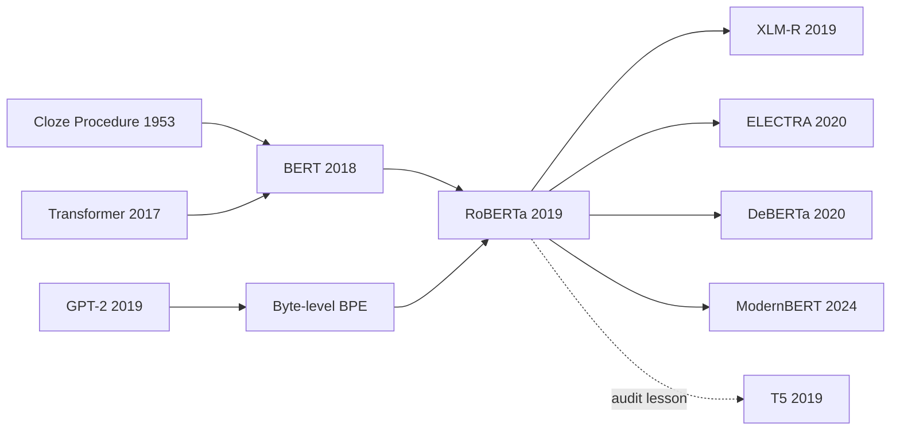

# RoBERTa — The Engineering Audit That Re-trained BERT Properly

> **On July 26, 2019, Yinhan Liu, Myle Ott, Naman Goyal, Jingfei Du, Mandar Joshi, Danqi Chen, Omer Levy, Mike Lewis, Luke Zettlemoyer, and Veselin Stoyanov from Facebook AI and the University of Washington uploaded [arXiv 1907.11692](https://arxiv.org/abs/1907.11692).** The counterintuitive part is that RoBERTa barely invents a new model: it keeps [BERT](2018_bert.md)'s encoder and keeps masked language modeling. The blade lands on the training recipe. Dynamic masks replace static masks, NSP disappears, data grows from 16GB to 160GB, batches jump to 8K sequences, and training runs long enough that the same basic objective catches or beats XLNet on GLUE, SQuAD, and RACE. RoBERTa reads like a sober engineering audit: before naming a new pretraining objective, first check whether the old one was simply undertrained.

## TL;DR

Liu, Ott, Goyal, Du, Joshi, Chen, Levy, Lewis, Zettlemoyer, and Stoyanov's 2019 RoBERTa paper, later published at ICLR 2020, does not replace [BERT (2018)](2018_bert.md)'s core objective. It argues that the same masked language modeling loss, $\mathcal{L}_{MLM}=-\sum_{i\in M}\log p(x_i\mid x_{\setminus M})$, remains highly competitive once the training recipe is no longer underpowered. RoBERTa changes static masks into masks sampled on the fly, removes Next Sentence Prediction, packs full sentences, switches to byte-level BPE, trains with 8K-sequence batches, expands the corpus from 16GB to 160GB, and runs up to 500K steps. The result is a GLUE test average of **88.5**, SQuAD 2.0 test F1 of **89.8**, and RACE test accuracy of **83.2**. Its defeated baseline is not a single model so much as a 2019 narrative: XLNet suggested permutation language modeling was the crucial advance, while ALBERT and SpanBERT emphasized new objectives and parameterization. RoBERTa's reply is more awkward and more useful: first control data, batch size, training length, masking, tokenizer, and fine-tuning protocol. Later systems such as [T5 (2019)](2019_t5.md), XLM-R, ELECTRA, and DeBERTa inherited that lesson. Many pretraining papers mix method with budget; RoBERTa made the field treat that mixture as an experimental variable rather than a heroic invention.

---

## Historical Context

### 2019 after BERT was victorious but unsettled

After [BERT](2018_bert.md) appeared in October 2018, NLP almost immediately adopted a simple story: Transformer encoder + MLM + NSP was the right answer for language understanding. Within months, the strong baseline for GLUE, SQuAD, RACE, NER, retrieval, question answering, and recommendation became “fine-tune BERT.” The shift was so fast that many follow-up papers had not yet answered a basic question: what exactly made BERT win? Was it the bidirectional encoder, masked language modeling, next sentence prediction, BookCorpus plus Wikipedia, or Google's TPU-backed training budget?

The first half of 2019 made the question messier. OpenAI's GPT-2 scaled a unidirectional decoder to 1.5B parameters and used WebText to show a competing path based on scale plus a generative interface. XLNet proposed permutation language modeling in June, arguing that it could keep dense autoregressive training while exposing bidirectional context. SpanBERT, ERNIE, MASS, UniLM, and related models introduced new masking units, sentence tasks, entity tasks, and encoder-decoder variants. Scores kept rising, but the causal story was blurry because training data, batch size, steps, tokenizer, and fine-tuning tricks often changed together.

RoBERTa enters exactly that atmosphere. Its posture is unusual for a “new model” paper: it does not replace the Transformer block, does not invent a new attention mechanism, and does not sell an elegant successor to NSP. It treats BERT as an engineering system to retrain, ablate, and compare under more controlled conditions. The abstract states the problem bluntly: pretraining is expensive, many datasets are private, and hyperparameters strongly affect final results. RoBERTa's historical value is that it moved the contest from “whose objective has the more exciting name?” back to “have we controlled the experiment?”

### Why the FAIR and University of Washington team was suited to the job

The author team also explains the paper's tone. Myle Ott and the fairseq group had deep experience with large-scale sequence modeling and distributed training. Omer Levy, Luke Zettlemoyer, and Veselin Stoyanov knew NLP benchmarks and representation learning. Danqi Chen and Mandar Joshi were deeply involved in reading comprehension and question answering. Yinhan Liu, Naman Goyal, and Jingfei Du turned the research question into reproducible experiments and released models. RoBERTa is less a single flash of inspiration than a systematic replication enabled by mature infrastructure.

That matters. The original BERT implementation lived in TensorFlow 1.x and Google's TPU ecosystem. Many research groups could fine-tune downloaded checkpoints but could not realistically reproduce pretraining from scratch. RoBERTa released PyTorch/fairseq code and models, pushing BERT-scale pretraining toward a more open engineering ecosystem. It also collected CC-News and combined it with OpenWebText, Stories, BookCorpus, and Wikipedia, bringing publicly describable English pretraining data to 160GB and making it easier to compare data scale against objective-function novelty.

## Background and Motivation

### The problem was not to reinvent BERT, but to separate variables

The BERT paper bundled two kinds of contributions. One was conceptual: a deep bidirectional encoder trained with MLM. The other was a concrete recipe: static masks, NSP, 16GB of data, 256-sequence batches, 1M updates, shorter sequences for most of training, and a 30K WordPiece vocabulary. Many follow-up papers compared “our new objective + more data + larger batches + longer training” against the original BERT numbers. Scores improved, but readers could not tell whether the gains came from the objective or from the budget.

RoBERTa's motivation is to cut that knot. It first fixes the BERT-base architecture for controlled replication, then studies masking strategy, input format, NSP, batch size, tokenizer, data size, and number of updates one by one. Only then does it aggregate the choices at BERT-large scale and ask a sharper question: if the MLM objective is left intact and BERT is trained more carefully, can it catch the post-BERT methods? The paper's answer is yes, and often it can surpass them.

### The four concrete questions RoBERTa wanted to answer

First, does BERT's static masking waste data? The original implementation created masks during preprocessing and duplicated the data ten times, so the same sentence could see the same mask multiple times across 40 epochs. RoBERTa switches to dynamic masking, resampling the mask each time the sequence is fed to the model. The change becomes especially important for longer training and larger corpora.

Second, is NSP really necessary? BERT argued that NSP helped sentence-relation tasks. RoBERTa finds that removing NSP and using full-sentence or document-sentence packing is at least no worse and usually better. That result changed the default recipe for later encoder pretraining.

Third, was BERT undertrained? RoBERTa expands data from 16GB to 160GB, raises the batch to 8K sequences, and pushes training from 100K to 300K and 500K steps. Each increase in data or training length helps, and the longest run shows no clear sign of overfitting.

Fourth, do tokenizer and public data affect what looks like “model innovation”? RoBERTa adopts GPT-2-style byte-level BPE with a 50K vocabulary, avoiding heuristic tokenization and `[UNK]`. This is not the dominant source of its score gains, but it makes large, diverse, multi-domain data easier to encode consistently.

---

## Method Deep Dive

### Overall framework

RoBERTa's method can be summarized in one sentence: **keep BERT's model and MLM objective, then rewrite the training recipe systematically**. The paper explicitly begins its analysis with the BERT-base configuration, $L=12, H=768, A=12$, about 110M parameters. The final main model uses BERT-large scale, $L=24, H=1024, A=16$, about 355M parameters. This is not a “RoBERTa architecture”; it is a “RoBERTa pretraining approach.”

| Component | Original BERT recipe | RoBERTa recipe | Why it matters |
|-----------|----------------------|----------------|----------------|
| Architecture | Transformer encoder | Mostly unchanged encoder | Avoids mixing architecture changes into the study |
| Objective | MLM + NSP | MLM only | Tests whether NSP is actually needed |
| Masking | Static preprocessing, data duplicated 10 times | Resampled dynamically at input time | Reduces wasted repeated masks |
| Input | Segment-pair, often two fragments | Full-sentences / doc-sentences | Uses 512-token contexts more fully |
| Data | BookCorpus + Wikipedia, about 16GB | Five corpora totaling 160GB | Controls for data-scale effects |
| Optimization | Batch 256, 1M steps | Batch 8K, up to 500K steps | Better suited to distributed training |
| Vocabulary | 30K WordPiece | 50K byte-level BPE | Reduces preprocessing and `[UNK]` dependence |

The training objective is still MLM: select a token set $M$ and minimize $-\sum_{i\in M}\log p(x_i\mid x_{\setminus M})$. In other words, RoBERTa does not reject BERT's core objective. It rejects the assumption that the hyperparameter recipe in the BERT paper already represented the ceiling of MLM.

### Design 1: Dynamic masking turns the same sentence into more training signal

The original BERT implementation performed masking during preprocessing. To avoid giving each example only one mask forever, it duplicated the training data ten times; across 40 epochs, the same sequence could still appear with the same mask roughly four times. For short training this was tolerable. Once training became longer and data larger, static masks started wasting possible context combinations.

RoBERTa's dynamic masking is simple: resample 15% of tokens when each batch is built, while keeping BERT's 80/10/10 rule. Table 1 reports that at BERT-base scale, dynamic masking is comparable or slightly better than static masking: SQuAD 2.0 F1 moves from 78.3 to 78.7, and SST-2 from 92.5 to 92.9. The numbers are not theatrical, but the scalability matters: when training stretches from 100K to 500K steps, the model is no longer memorizing the same holes.

```python
def roberta_mask(tokens, mask_rate=0.15):
    labels = [-100] * len(tokens)
    for index in sample_positions(tokens, rate=mask_rate):
        labels[index] = tokens[index]
        draw = random.random()
        if draw < 0.8:
            tokens[index] = "<mask>"
        elif draw < 0.9:
            tokens[index] = random_bpe_token()
        else:
            tokens[index] = tokens[index]
    return tokens, labels
```

The pseudocode looks almost identical to BERT. The difference is when it runs: not once offline during preprocessing, but repeatedly inside the data loader. This “small” change later became the default option for MLM pretraining.

### Design 2: Remove NSP and reorganize the input

BERT's NSP objective concatenates two segments as `[CLS] A [SEP] B [SEP]` and predicts whether B follows A. RoBERTa argues that at least two variables are entangled here: whether the NSP loss exists, and whether inputs are short sentence pairs or 512-token segment/document blocks. The paper therefore compares four formats.

| Input format | NSP | Construction | SQuAD 1.1/2.0 | MNLI-m | RACE |
|--------------|-----|--------------|---------------|--------|------|
| segment-pair | yes | BERT-style segment pairs | 90.4/78.7 | 84.0 | 64.2 |
| sentence-pair | yes | Natural sentence pairs, shorter | 88.7/76.2 | 82.9 | 63.0 |
| full-sentences | no | Consecutive sentences may cross documents | 90.4/79.1 | 84.7 | 64.8 |
| doc-sentences | no | Consecutive sentences within documents | 90.6/79.7 | 84.7 | 65.6 |

The conclusion is clean: natural sentence pairs hurt because inputs are too short and the model learns less long-range dependence. Removing NSP with full/doc sentence packing does not hurt and usually helps. RoBERTa ultimately chooses full-sentences not because it has the absolute best score, but because it gives more stable batch sizes and cleaner comparisons. That engineering judgment is typical of the paper: best leaderboard number and best experimental control are not always the same thing.

### Design 3: Larger batches, more data, longer training

RoBERTa's sharpest claim is that “BERT was significantly undertrained.” The paper first explains compute equivalence: BERT-base with batch 256 and 1M steps is roughly equivalent to batch 2K for 125K steps or batch 8K for 31K steps. Large batches scale better through gradient accumulation and distributed data parallelism, and with tuned learning rates they improve MLM perplexity and downstream performance.

| batch | steps | peak lr | MLM ppl | MNLI-m | SST-2 |
|-------|-------|---------|---------|--------|-------|
| 256 | 1M | 1e-4 | 3.99 | 84.7 | 92.7 |
| 2K | 125K | 7e-4 | 3.68 | 85.2 | 92.9 |
| 8K | 31K | 1e-3 | 3.77 | 84.6 | 92.8 |

The final RoBERTa-large run uses 8K-sequence batches, 30K warmup steps, peak learning rate 4e-4, Adam $\beta_2=0.98$, linear decay, and up to 500K steps. Data expands from BookCorpus + Wikipedia at 16GB to a mixture including CC-News at 76GB, OpenWebText at 38GB, and Stories at 31GB, over 160GB in total. The ablation is persuasive: with the same BERT-large architecture, Books+Wiki at 100K steps already gives SQuAD 1.1/2.0 of 93.6/87.3; adding 160GB data gives 94.0/87.7; training to 300K gives 94.4/88.7; and 500K reaches 94.6/89.4. Every row still improves.

### Design 4: Byte-level BPE reduces hidden tokenizer assumptions

BERT uses a 30K WordPiece vocabulary and heuristic tokenization before training. RoBERTa borrows GPT-2's byte-level BPE, using bytes as base units, training a 50K subword vocabulary, avoiding extra preprocessing, and eliminating unknown tokens. The paper admits that early experiments showed byte-level BPE was slightly worse on some tasks; it is not the primary source of the score gains. But it is more robust for large, diverse, web-like corpora such as OpenWebText and CC-News.

| Tokenizer | Vocabulary | Preprocessing dependence | `[UNK]` | Natural setting |
|-----------|------------|--------------------------|---------|-----------------|
| BERT WordPiece | 30K | More heuristic rules | Can appear | Cleaned Wikipedia/Books |
| GPT-2 byte BPE | 50K | Starts directly from bytes | Mostly unnecessary | Web, news, multi-domain text |
| RoBERTa choice | 50K byte BPE | Unified with fairseq pipeline | No unknown-token dependence | 160GB mixed corpus |

This piece is often overlooked, but it points to an old pretraining problem: the tokenizer is not a neutral pipe. Vocabulary size, byte-level encoding, and preprocessing rules all change the training distribution and therefore affect “fair replication.” RoBERTa does not dress the tokenizer up as a conceptual breakthrough. It treats it as one component of a robust training recipe, which is exactly the temperament of the paper.

---

## Failed Baselines

### What RoBERTa beat was not BERT, but uncontrolled variables

RoBERTa's most interesting “failed baseline” is not a single old model that suddenly stopped working. It is the set of attractive 2019 narratives that the paper forced to cool down. BERT had already shown that encoder-only MLM was powerful. XLNet, SpanBERT, ALBERT, ERNIE, and related systems proposed new objectives or structures. RoBERTa asks: how much of the reported improvement truly comes from the new objective? If BERT is retrained with comparable data, training length, and serious fine-tuning, does the gap remain?

| Rival or narrative | Claim at the time | RoBERTa's counterevidence | Core lesson |
|--------------------|-------------------|---------------------------|-------------|
| Original BERT recipe | MLM + NSP was already strong enough | Removing NSP, dynamic masking, and more training make it much stronger | Original recipe was not the ceiling |
| XLNet | Permutation LM is the key breakthrough | RoBERTa with MLM catches or beats many XLNet results | Objectives cannot be compared apart from budget |
| sentence-pair NSP | Sentence-pair tasks need NSP | sentence-pair+nsp performs clearly worse | Inputs that are too short hurt more than the loss helps |
| private large-data advantage | Stronger models may just have more data | RoBERTa builds CC-News and other describable corpora | Data sources must be transparent |
| leaderboard ensemble | Multi-tasking or ensembling is required to top GLUE | RoBERTa reaches GLUE 88.5 with single-task fine-tuning ensembles | The training recipe itself is very strong |

This is why RoBERTa differs from a conventional failed-baselines section. It does not use a new module to knock out an old module. It rebuilds the baseline properly and forces all later methods to compare against a stronger reference point. In a real sense, the thing RoBERTa defeats is the habit of using an undertrained BERT as a straw baseline.

### Negative and inconvenient results inside the paper

Not every RoBERTa change improves scores. First, sentence-pair+nsp is clearly worse: SQuAD 1.1/2.0 falls from 90.4/78.7 in segment-pair to 88.7/76.2, MNLI-m from 84.0 to 82.9, and RACE from 64.2 to 63.0. This suggests that part of BERT's apparent “sentence relation” success may have come from longer segments rather than NSP itself.

Second, byte-level BPE is slightly worse on some early tasks. The paper still adopts it because universal encoding and no `[UNK]` are more robust for large mixed corpora. There is no varnish here: RoBERTa acknowledges that the tokenizer is not the main source of score gains, but a choice for engineering robustness.

Third, doc-sentences is slightly better than full-sentences in some scores, but it creates variable batch sizes because examples near document boundaries can be shorter. The final system chooses full-sentences for more stable experiments. That trade-off captures the paper's temperament: it is willing to give up a tiny local optimum for cleaner system-level comparison.

### Why these baselines lost

RoBERTa's underlying explanation is that pretraining comparisons are easily contaminated by budget variables. Ten times more data, five times longer training, thirty-two times larger batches, and a broader fine-tuning learning-rate sweep can all make a supposedly novel objective look superior. If we only compare final leaderboard scores, engineering variables masquerade as algorithmic variables.

This is also RoBERTa's methodological correction to 2019 NLP. BERT pushed the field into the compute era, but paper writing still often followed small-model habits: introduce a new objective, report a better number, claim a better method. RoBERTa insists that the training regime is part of the method. That insistence later became common sense for foundation-model papers: data, tokenizer, number of training tokens, batch size, learning-rate schedule, and filtering rules are all components of the model.

## Key Experimental Data

### Ablation: engineering improvements accumulate row by row

RoBERTa's central ablation is Table 6: hold the BERT-large architecture and MLM objective fixed, then increase data and training length step by step. The important signal is not one number but the absence of saturation.

| Configuration | data | bsz | steps | SQuAD 1.1/2.0 | MNLI-m | SST-2 |
|---------------|------|-----|-------|---------------|--------|-------|
| RoBERTa + Books/Wiki | 16GB | 8K | 100K | 93.6/87.3 | 89.0 | 95.3 |
| + additional data | 160GB | 8K | 100K | 94.0/87.7 | 89.3 | 95.6 |
| + pretrain longer | 160GB | 8K | 300K | 94.4/88.7 | 90.0 | 96.1 |
| + pretrain even longer | 160GB | 8K | 500K | 94.6/89.4 | 90.2 | 96.4 |
| BERT-large | 13GB | 256 | 1M | 90.9/81.8 | 86.6 | 93.7 |
| XLNet-large + extra data | 126GB | 2K | 500K | 94.5/88.8 | 89.8 | 95.6 |

The force of the table is that RoBERTa does not win through a new objective. It wins through the old objective trained properly. SQuAD 2.0 rises from BERT-large's 81.8 to 89.4, MNLI-m from 86.6 to 90.2, and SST-2 from 93.7 to 96.4. Those gaps are large enough to reinterpret the source of progress in a whole wave of post-BERT papers.

### Final benchmarks: GLUE, SQuAD, and RACE all hold

The final model stands on three benchmarks at once. GLUE leaderboard test average reaches 88.5, slightly above XLNet's 88.4. SQuAD 2.0 test F1 reaches 89.8, especially strong among systems not using extra QA data. RACE test accuracy reaches 83.2, above XLNet-large's 81.7.

| Benchmark | Setting | BERT-large | XLNet-large | RoBERTa | Note |
|-----------|---------|------------|-------------|---------|------|
| GLUE test avg | ensemble, single-task fine-tune | - | 88.4 | 88.5 | July 25, 2019 leaderboard |
| MNLI test | matched/mismatched | - | 90.2/89.8 | 90.8/90.2 | SOTA on 4/9 GLUE tasks |
| SQuAD 1.1 dev | single model | 90.9 F1 | 94.5 F1 | 94.6 F1 | Only SQuAD data |
| SQuAD 2.0 test | single model | - | 89.1 F1 | 89.8 F1 | XLNet number uses extra data |
| RACE test | single model | 72.0 | 81.7 | 83.2 | Leads on middle and high splits |

Historically, GLUE 88.5 is not the whole legacy. More important is that RoBERTa institutionalized “fair comparison.” After it, if a pretraining paper says it beats BERT, readers naturally ask: how does it compare to RoBERTa? Is the data the same? Are the training tokens the same? Is the fine-tuning sweep the same? That is why it belongs among the classic papers.

---

## Idea Lineage

### Mermaid citation graph



### Before: from Cloze to BERT, then to “replication is a contribution”

RoBERTa's distant ancestor is the Cloze test: remove words from text and ask readers to recover them from context. BERT moved that idea into a Transformer encoder, using MLM to avoid the self-peeking problem of naive bidirectional language modeling. Transformer supplied the architecture, Cloze supplied the training task, and BERT combined them into the pretrain-and-fine-tune paradigm.

RoBERTa's ancestry also includes GPT-2. It does not inherit GPT-2's decoder-only path, but it does inherit byte-level BPE and the data intuition behind WebText/OpenWebText: real web text is messy, yet its scale and diversity are valuable. RoBERTa is therefore a hybrid node. Its model skeleton comes from BERT, part of its tokenizer and data philosophy comes from GPT-2, and its experimental temperament comes from the machine-translation tradition of large batches, distributed training, and careful replication.

More importantly, RoBERTa elevates “replication” into a first-class contribution. In the small-model era, replication was often treated as low prestige. In the pretraining era, replication is itself a scientific question, because training budget, data filtering, and hyperparameter choices can change the conclusion. RoBERTa is an early marker of that turn.

### After: the encoder family after RoBERTa

XLM-R almost directly ports the RoBERTa recipe to the cross-lingual setting: much larger multilingual data, no NSP, MLM, and RoBERTa-style training. It becomes the strong baseline for multilingual encoders. DeBERTa inherits the RoBERTa training base and improves structure through disentangled attention and enhanced decoding. ELECTRA picks up RoBERTa's sample-efficiency question, noting that MLM supervises only 15% of tokens per step, then uses replaced token detection so every position contributes signal.

T5 inherits the lesson more methodologically. It performs a larger text-to-text transfer study, systematically comparing objectives, data, architecture, and scale. Together, RoBERTa and T5 move 2019 pretraining research away from isolated SOTA claims and toward controlled-variable studies. The data tables, token counts, training-step reports, ablations, and scaling curves now expected in foundation-model papers have early forms in work like RoBERTa and T5.

### Misreading: reducing RoBERTa to “just remove NSP”

The most common misreading is to summarize RoBERTa as “BERT without NSP.” Removing NSP matters, but the paper's claim is heavier: BERT-style MLM depends strongly on the training regime. Dynamic masking, full-sentences input, 8K batches, 160GB data, 500K steps, byte-level BPE, and fine-tuning sweeps together make RoBERTa.

The second misreading is to treat it as mere engineering tuning with no conceptual contribution. That reverses the point. RoBERTa's contribution is not a new module; it is the elevation of engineering variables into scientific variables. It forces later papers to admit that when training budgets differ, leaderboard scores alone cannot prove that an objective is better.

The third misreading is to think RoBERTa proved encoders would dominate decoders long term. It proved that under 2019 NLU benchmarks and the fine-tuning paradigm, MLM encoders remained highly competitive. Two or three years later, GPT-3, InstructGPT, and ChatGPT showed that decoder-only generative interfaces would become the main stage. But for retrieval, reranking, classification, embeddings, and low-latency understanding tasks, RoBERTa's descendants remain very much alive.

---

## Modern Perspective

### Assumptions that did not survive

First, RoBERTa still assumes that discriminative benchmarks such as GLUE, SQuAD, and RACE can stand in for “language understanding.” From 2026, that assumption is clearly too narrow. The center of gravity for language models has moved from classification, multiple choice, and extractive QA toward open generation, tool use, long context, multi-turn interaction, and preference alignment. RoBERTa is extremely strong on NLU benchmarks, but it has no natural text-generation interface and cannot perform in-context learning like decoder-only LLMs.

Second, it still treats fine-tuning as the main downstream adaptation mode. That was completely reasonable in 2019. After GPT-3 in 2020, prompting and in-context learning began to unsettle it. After ChatGPT in 2022, instruction tuning and RLHF shifted the center from “adapt the model to the task” toward “make the model understand instructions.” RoBERTa was not wrong; it belonged to the final high point of fine-tuning as the default entry point.

Third, RoBERTa assumes that scaling encoder pretraining will keep delivering NLU gains. Locally, it does. But it does not anticipate the product advantage of the generative route. An encoder can understand sentences very well, but it cannot directly write emails, explain code, call tools, or sustain a conversation. Interface form eventually changed the social impact of model families.

### What still survives in 2026

| Surviving lesson | Where it appears today | Why it is not obsolete |
|------------------|------------------------|------------------------|
| Training budget must be controlled | Token/compute tables in LLM technical reports | Methods cannot be compared without budget control |
| Data size and data quality are part of the method | Chinchilla, LLaMA, Gemini, Qwen | Data is not just background infrastructure |
| Tokenizers affect conclusions | byte BPE, SentencePiece, tiktoken | Vocabulary changes the training distribution |
| Strong baselines matter more than new modules | modern ablations / evaluation suites | Weak baselines manufacture fake novelty |
| Encoders still fit discriminative tasks | retrieval, reranking, embedding, classification | Low latency, low cost, stable representations |

RoBERTa's lasting value is not that it ultimately defeated decoders. It is that it taught the community how to compare pretraining methods. When reading technical reports for GPT, LLaMA, Claude, Gemini, or Qwen today, the RoBERTa-style questions are still there: what is the data, how many tokens, how long was training, how large was the batch, was the baseline retuned, and was the evaluation fair?

## Limitations and Future Directions

### Three kinds of limitations

The first kind is acknowledged by the paper itself. RoBERTa does not systematically study architecture changes and explicitly leaves larger or different architectures to future work. It also admits that data size and data diversity are coupled in its experiments, so it cannot strictly separate “more data” from “more domains.” The benefit of byte-level BPE is also not fully isolated.

The second kind was clearer in hindsight. MLM still supervises only masked tokens, making it less sample-efficient than ELECTRA-style replaced-token detection. Encoder-only models cannot directly generate text, making them hard to turn into ChatGPT-like products. GLUE, SQuAD, and RACE were later squeezed by benchmark-specific tricks and do not represent open-ended language ability.

The third kind is ecological. RoBERTa's strength comes from large-scale training, and one day on 1024 V100 GPUs was unrealistic for most labs. It helped create an open-checkpoint culture, but also deepened the pattern in which a few institutions pretrain and most groups fine-tune. GPT-3 and GPT-4 later amplified that structure by orders of magnitude.

## Related Work and Insights

### Relationship to neighboring papers

Compared with [BERT (2018)](2018_bert.md), RoBERTa is the strongest internal audit: it keeps BERT's core, removes NSP, expands data and training, and shows that the original recipe was far from saturated. Compared with XLNet, it is a warning that “new objective” is not automatically the causal factor. Permutation LM is interesting, but if BERT-style MLM is trained more thoroughly, the gap disappears or narrows.

Compared with SpanBERT, ALBERT, and ELECTRA, RoBERTa sits at a fork. SpanBERT explores what to mask, ALBERT explores parameter efficiency and a better sentence-order task, and ELECTRA attacks MLM's inefficiency. RoBERTa first calibrates the standard BERT training regime to a strong enough level. Without that calibration, many later efficiency or architectural improvements would be hard to measure fairly.

Compared with [T5 (2019)](2019_t5.md), the two papers define the second wave of 2019 pretraining research. The goal is no longer merely to invent an objective, but to systematically compare objective, data, model, training length, and downstream format. T5 moves toward text-to-text and encoder-decoder modeling; RoBERTa defends encoder-only modeling. Both make pretraining research feel more like experimental science.

## Resources

### Reading and code

- **arXiv paper**: [1907.11692 - RoBERTa: A Robustly Optimized BERT Pretraining Approach](https://arxiv.org/abs/1907.11692)
- **Official implementation**: [fairseq RoBERTa examples](https://github.com/pytorch/fairseq/tree/main/examples/roberta)
- **Model card and modern use**: [HuggingFace roberta-base](https://huggingface.co/roberta-base)
- **Predecessor**: [BERT: Pre-training of Deep Bidirectional Transformers for Language Understanding](https://arxiv.org/abs/1810.04805)
- **Contemporary comparison**: [XLNet: Generalized Autoregressive Pretraining for Language Understanding](https://arxiv.org/abs/1906.08237)
- **Methodological successor**: [T5: Exploring the Limits of Transfer Learning with a Unified Text-to-Text Transformer](https://arxiv.org/abs/1910.10683)
- **Sample-efficiency direction**: [ELECTRA: Pre-training Text Encoders as Discriminators Rather Than Generators](https://arxiv.org/abs/2003.10555)
- **Modern encoder revival**: [ModernBERT](https://arxiv.org/abs/2412.13663)
- **Cross-lingual extension**: [XLM-R](https://arxiv.org/abs/1911.02116)
- **Cross-language version**: [中文版](/era3_attention/2019_roberta/)


---

> 🌐 [中文版](/era3_attention/2019_roberta/) · 📚 awesome-papers project · CC-BY-NC