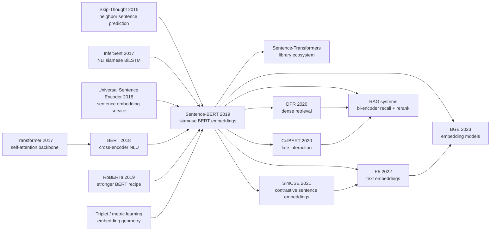

# Sentence-BERT — Turning BERT into a Sentence Embedding Engine

> **August 27, 2019. Nils Reimers and Iryna Gurevych from UKP Lab / TU Darmstadt upload [arXiv 1908.10084](https://arxiv.org/abs/1908.10084).** The paper does not invent a new Transformer block, nor does it pretrain a larger language model. It asks a much more operational question: if [BERT](2018_bert.md) needs to cross-encode every sentence pair, can we instead encode each sentence once and compare vectors with cosine similarity? That small interface change turns an almost unusable 2019 workflow into infrastructure: finding the closest pair among 10,000 sentences drops from **49,995,000 BERT forward passes / about 65 hours** to **10,000 encodings / about 5 seconds**. SBERT's historical importance is not a leaderboard headline; it is the moment BERT stopped being only a careful judge of two sentences and became a semantic coordinate system that could be indexed, searched, clustered, and shipped.

## TL;DR

Reimers and Gurevych's 2019 EMNLP-IJCNLP paper, Sentence-BERT, turns [BERT (2018)](2018_bert.md) from a cross-encoder into a tied-weight siamese / triplet bi-encoder: each sentence first becomes $s=\mathrm{pool}(\mathrm{BERT}(x))$, and sentence pairs are trained with NLI classification over $(u, v, |u-v|)$, STS regression over $\cos(u,v)$, and triplet learning via $\max(\|s_a-s_p\|-\|s_a-s_n\|+\epsilon,0)$. The failed baseline it replaces is brutally concrete: vanilla BERT/RoBERTa can be accurate on STS only by running a forward pass for every pair, so 10,000 sentences require $n(n-1)/2=49{,}995{,}000$ computations and about 65 hours on a V100; simply stealing BERT's `[CLS]` vector is worse, averaging only **29.19** Spearman across seven STS tasks, below averaged GloVe's **61.32**. SBERT's NLI fine-tuning plus mean pooling pushes unsupervised STS averages to **76.55/76.68** for SBERT/SRoBERTa while reducing semantic search to roughly **5 seconds of encoding plus 0.01 seconds of cosine comparison**. Where [T5 (2019)](2019_t5.md) unified NLP as a text-to-text interface, SBERT unified retrieval as an embedding interface: bi-encoder recall, cross-encoder reranking, vector databases, RAG, SimCSE, E5, and BGE all inherit the same bargain. The counterintuitive lesson is that the paper wins by giving something up: it sacrifices pair-level cross-attention so that BERT can become an indexable semantic space.

---

## Historical Context

### 2019: BERT was powerful, but not built for “find similar sentences”

After BERT appeared in October 2018, the NLP community quickly converged on a new default: if a task can be phrased as “input one sentence” or “input two sentences,” concatenate tokens as `[CLS] A [SEP] B [SEP]`, let Transformer self-attention compare the two texts across layers, and attach a classification or regression head to `[CLS]`. This was extremely effective on GLUE, SQuAD, and STS Benchmark because BERT could compare words, phrases, and contexts jointly.

Retrieval and clustering, however, are not “given a sentence pair, judge similarity.” They are “given a collection, find nearest neighbors.” If a corpus contains $n$ sentences, a cross-encoder needs $n(n-1)/2$ forward passes. The SBERT paper makes the problem impossible to ignore: 10,000 sentences require 49,995,000 BERT computations, about 65 hours on a V100. Quora has more than 40 million questions; cross-encoding a new question against the whole collection would take more than 50 hours. BERT was a very precise microscope for sentence pairs, not a search engine.

The awkward part was that many users were already pretending BERT produced sentence embeddings: pass one sentence through BERT, take `[CLS]` or average token vectors, then use cosine similarity. The paper's experiments puncture that habit. Across seven STS datasets, BERT `[CLS]` averages only 29.19 Spearman, and averaged BERT token vectors reach 54.81; the former is far below averaged GloVe at 61.32. BERT's pretraining objective makes `[CLS]` useful for a task head, but it does not automatically make `[CLS]` a semantically meaningful geometric coordinate.

### The predecessor lines that pushed SBERT out

SBERT is not an isolated invention. Skip-Thought in 2015 tried to learn sentence vectors by predicting neighboring sentences. InferSent in 2017 trained a siamese BiLSTM on SNLI/MultiNLI and showed that natural language inference data can teach sentence-level semantics. Universal Sentence Encoder in 2018 packaged Transformer/DAN models into a usable sentence embedding service. BERT then pushed contextual encoding much higher, while keeping the cross-encoder interface.

The most important predecessor is **InferSent**. It already used sentence-pair features such as $(u, v, |u-v|, u*v)$ for NLI classification, then treated the single-sentence encoder output as a sentence embedding. SBERT's move is clear: keep InferSent's siamese training philosophy, replace the BiLSTM with BERT/RoBERTa, and make inference “encode each sentence once + compare by cosine.” This is not innovation by ornament; it is an interface transplant.

The other predecessor is metric learning and triplet networks. Face recognition and image retrieval had long understood that nearest-neighbor search needs a space where anchors are close to positives and far from negatives. SBERT brings that idea to sentences and keeps three training entrances: NLI classification, STS regression, and Wikipedia-section triplets.

### The author team and UKP Lab's position

Nils Reimers and Iryna Gurevych were at UKP Lab, TU Darmstadt. The lab had long worked on argument mining, semantic similarity, information retrieval, and practical NLP tooling. SBERT's problem statement is very engineering-minded: not “how do we add 0.3 to a leaderboard,” but “how do we make BERT usable for semantic search, clustering, and large-scale deduplication.” This also explains why the paper spends real space on computation speed, smart batching, AFS cross-topic generalization, and Wikipedia triplets rather than only STS Benchmark.

The paper appeared at EMNLP-IJCNLP 2019, and the code was released as `sentence-transformers`. That name later became as important as the paper title: it turned SBERT from a method paper into a standard library, centered on the simple interface `SentenceTransformer.encode()`. After 2020, many practitioners first encountered dense retrieval not through DPR or ColBERT papers, but through `pip install sentence-transformers`.

### Industry demand was already waiting for it

Industrial NLP in 2019 had many “BERT is accurate but too slow” use cases: FAQ matching, duplicate question detection, customer-support retrieval, candidate-document recall, similar-review clustering, topic deduplication, and entity-description matching. TF-IDF/BM25 was fast but semantically shallow; cross-encoder BERT was semantically strong but could not scan a full corpus; USE and InferSent were usable but capped by earlier encoder designs. SBERT landed exactly in the middle: it kept BERT's pretrained knowledge while compressing sentences into vectors that could be cached, indexed, and searched.

Its historical role is therefore unusual. BERT represents the “pretrain + fine-tune” era; SBERT is the adapter that lets pretrained models enter retrieval systems. It did not kill cross-encoders. It clarified the two-stage pattern that later became standard: use a bi-encoder for fast recall, then a cross-encoder for reranking. Modern RAG, enterprise search, embedding APIs, and vector databases all show the early outline that SBERT made practical.

---

## Method Deep Dive

### Overall framework

SBERT's core change can be stated in one sentence: split BERT's cross-encoder into two tied single-sentence encoders and force them to produce comparable fixed-size vectors. Vanilla BERT on STS receives `[CLS] s_1 [SEP] s_2 [SEP]`, lets the two sentences interact through self-attention at every layer, and outputs a score. This architecture is accurate because it can perform fine-grained token-to-token alignment; but it cannot cache a standalone representation for each sentence, so every new candidate sentence triggers another full network pass.

SBERT instead uses two identical BERT/RoBERTa branches. Sentence $s_1$ passes through the encoder to produce token hidden states, and $s_2$ passes through the same encoder to produce its own hidden states; the branches share all parameters. A pooling operation compresses each sentence's token states into vectors $u$ and $v$. During training, the objective depends on the available labels: classification, regression, or triplet loss. During inference, the task head is removed; only the vectors remain, compared by cosine / Manhattan / Euclidean distance.

| Dimension | BERT cross-encoder | SBERT bi-encoder | Consequence |
|-----------|--------------------|------------------|-------------|
| Input | `[CLS] A [SEP] B [SEP]` | encode A and B separately | SBERT can cache sentence vectors |
| Interaction | cross-sentence attention at every layer | alignment learned by loss, no inference interaction | slightly less exact, massively scalable |
| Complexity | $O(n^2)$ Transformer passes | $O(n)$ encodings + vector similarity | 10,000 sentences: 65h to about 5s |
| Typical use | reranking, fine judgments | recall, clustering, dedup, ANN search | later two-stage retrieval pattern |

### Key designs

#### Design 1: Siamese / triplet structure — shared weights, not shared input

**Function**: teach BERT that a sentence inspected alone must still land in a semantic space. Two sentences are no longer concatenated into one sequence; they enter the same encoder separately. Weight sharing is essential: if the two branches had separate parameters, their spaces could drift. With sharing, every sentence is mapped by the same function $f_\theta(x)$ into one coordinate system.

This design inherits metric learning's basic intuition: the model should learn a space, not merely predict a label. NLI labels provide weak supervision for “near/far” semantics; STS scores provide continuous similarity; Wikipedia section triplets provide anchor-positive-negative ordering constraints.

| Training data | Structure | Supervision | Kept at inference |
|---------------|-----------|-------------|-------------------|
| SNLI + MultiNLI | siamese pair | 3-way NLI label | sentence vector + cosine |
| STS Benchmark | siamese pair | 0-5 similarity score | sentence vector + cosine |
| Wikipedia sections | triplet | positive closer than negative | sentence vector + nearest neighbor |
| AFS arguments | siamese pair | argument similarity | sentence vector + cosine |

#### Design 2: Pooling — `[CLS]` is not automatically a sentence vector

**Function**: BERT outputs hidden states for tokens, not a sentence embedding. SBERT adds pooling over the output layer and evaluates three strategies: use `[CLS]`, mean-pool all token vectors, or max-over-time pool all token vectors. The default is **MEAN**.

Why does mean pooling matter? In original BERT pretraining, `[CLS]` mostly serves NSP and downstream classification heads; it is not trained to be a geometrically comparable sentence representative. Mean pooling is simple, but it spreads contextual information from all tokens into one vector, and NLI/STS losses then shape that averaged vector. The ablation shows pooling has modest impact under the NLI classification objective; under STSb regression, MEAN reaches 87.44, CLS reaches 86.62, and MAX collapses to 69.92.

| Pooling | STSb dev after NLI training | STSb dev after STS regression | Explanation |
|---------|-----------------------------|-------------------------------|-------------|
| MEAN | **80.78** | **87.44** | default; stable full-sentence information |
| MAX | 79.07 | 69.92 | too spiky for Transformer token states |
| CLS | 79.80 | 86.62 | usable, less stable than mean |
| Raw BERT CLS | 29.19 (7 STS avg.) | - | not directly geometric |

#### Design 3: Three objectives — classification, regression, and triplet for three data types

**Classification objective** is used for NLI. Given sentence embeddings $u$ and $v$, SBERT concatenates $(u, v, |u-v|)$ and feeds it into a softmax classifier over entailment / contradiction / neutral. The paper tries adding $u*v$, but in this architecture it slightly hurts; the crucial feature is $|u-v|$, which gives the classifier a direct per-dimension distance signal.

$$
o = \mathrm{softmax}(W_t [u; v; |u-v|])
$$

**Regression objective** is used for STS. Training directly aligns vector cosine similarity with human similarity labels using MSE loss; inference also uses cosine, keeping the training and retrieval interfaces consistent.

$$
\mathcal{L}_{\mathrm{STS}} = \left(\cos(u,v) - y\right)^2
$$

**Triplet objective** is used for Wikipedia sections. Given anchor $a$, positive $p$, and negative $n$, it requires the anchor-positive distance to be at least $\epsilon$ smaller than the anchor-negative distance. The paper uses Euclidean distance and margin $\epsilon=1$.

$$
\mathcal{L}_{\mathrm{tri}} = \max(\|s_a-s_p\| - \|s_a-s_n\| + \epsilon, 0)
$$

#### Design 4: Inference interface — encode, index, then rerank

SBERT's most durable contribution is not the loss but the inference interface. Once a model can turn sentences into fixed-dimensional vectors, it can plug into vector indexes, nearest-neighbor search, clustering algorithms, and deduplication pipelines. The paper already reports the practical shift: encoding 10,000 SBERT vectors takes about 5 seconds, full cosine comparison takes about 0.01 seconds, and optimized index structures can reduce Quora-style similar-question lookup to milliseconds.

```python
from sentence_transformers import SentenceTransformer, util

model = SentenceTransformer("bert-base-nli-mean-tokens")
corpus_emb = model.encode(corpus_sentences, normalize_embeddings=True)
query_emb = model.encode([query], normalize_embeddings=True)
scores = util.cos_sim(query_emb, corpus_emb)[0]
top_ids = scores.argsort(descending=True)[:100]
```

The trade-off behind this interface is explicit: SBERT gives up the fine-grained interaction of a cross-encoder, so first-stage ranking will not always beat BERT cross-encoding; but it compresses a million-scale corpus to a hundred-scale candidate set, where a cross-encoder can rerank. DPR, ColBERT, monoT5 reranking, and RAG pipelines all follow this division of labor: fast recall first, precise reranking second.

### Loss / training strategy

The training recipe is deliberately plain, which is why it spread. The NLI stage merges SNLI's 570k sentence pairs with MultiNLI's 430k pairs, trains a 3-way softmax for one epoch, uses batch size 16, Adam, learning rate $2\mathrm{e}{-5}$, 10% linear warmup, and MEAN pooling by default. The STS stage fine-tunes on STS Benchmark with the regression objective; the triplet stage trains for one epoch on about 1.8M Wikipedia section triplets.

| Item | Configuration |
|------|---------------|
| Backbone | BERT-base / BERT-large / RoBERTa-base / RoBERTa-large |
| Default pooling | MEAN over token output vectors |
| NLI data | SNLI 570k + MultiNLI 430k |
| NLI loss | cross-entropy over entailment / contradiction / neutral |
| STS loss | cosine similarity + MSE |
| Triplet loss | Euclidean distance, margin $\epsilon=1$ |
| Optimizer | Adam, lr $2\mathrm{e}{-5}$, batch 16, 10% warmup |
| Training cost | NLI fine-tuning under 20 minutes (reported) |

The crucial point is that SBERT does not require BERT pretraining from scratch. It is a lightweight fine-tuning recipe: take existing BERT/RoBERTa weights, use pair/triplet supervision to reshape the output space into comparable vectors. That is exactly why it could become a library and an ecosystem so quickly.

---

## Failed Baselines

### Failed baseline 1: vanilla BERT cross-encoder is too expensive

The most elegant part of the SBERT paper is that it does not hide computational complexity in an appendix; it puts it in the abstract and the first screen of the introduction. BERT/RoBERTa as cross-encoders can indeed score STS pairs accurately. But they do not produce independent sentence embeddings, so the corpus cannot be encoded offline. Every candidate pair must be concatenated and forwarded again.

| Scenario | Cross-encoder BERT | SBERT | Difference |
|----------|--------------------|-------|------------|
| closest pair among 10,000 sentences | 49,995,000 passes, about 65h | 10,000 encodings, about 5s | quadratic Transformer passes to linear encoding |
| similar question in 40M Quora questions | 50h+ per query | milliseconds with an index | unusable to online service |
| hierarchical clustering | requires all pair scores | cluster vectors directly | clustering becomes a tool |
| reranking | high precision | first-stage recall less fine than cross-encoder | later complementary pattern |

This is not a “BERT mistake”; it is an interface mismatch. Cross-attention is precise, but every pair must be recomputed. Semantic search needs cacheability and indexability. SBERT reframes the problem from “a stronger sentence-pair model” to “a more usable single-sentence representation.”

### Failed baseline 2: using `[CLS]` directly as a sentence vector

In 2019 many tutorials and repositories treated BERT's `[CLS]` as a sentence embedding. The intuition looked plausible: is `[CLS]` not the whole-sequence representation? SBERT's experiments show that this intuition is dangerous under the geometric interface of cosine similarity. BERT `[CLS]` averages only 29.19 Spearman across seven STS tasks; averaged token embeddings reach 54.81. Both numbers show that “strong contextual encoding” does not imply “good vector space.”

| Method | Avg. Spearman over 7 STS tasks | Conclusion |
|--------|--------------------------------|------------|
| Avg. GloVe embeddings | 61.32 | old static vectors are more cosine-friendly |
| Avg. BERT embeddings | 54.81 | contextual, but not trained as similarity space |
| BERT CLS-vector | 29.19 | raw `[CLS]` is not a sentence embedding |
| SBERT-NLI-large | 76.55 | NLI supervision successfully shapes the space |
| SRoBERTa-NLI-large | 76.68 | RoBERTa backbone helps slightly, not the essence |

These numbers became a standard warning in embedding tutorials: a pretrained encoder's pooled output is not a free sentence embedding. To make cosine meaningful, the geometry must be trained with a similarity-related objective.

### Failed baseline 3: InferSent / USE hit a ceiling

InferSent and Universal Sentence Encoder were not weak baselines. They represented the strongest usable sentence-embedding routes of 2017-2018: one trained a BiLSTM on NLI, the other packaged Transformer/DAN encoders into a sentence embedding service. SBERT beats them not by inventing a new loss, but by putting BERT's contextual knowledge into the same siamese training framework.

| Model | 7-STS avg. | SentEval avg. | Main limitation |
|-------|------------|---------------|-----------------|
| InferSent-GloVe | 65.01 | 85.59 | BiLSTM capacity and pretrained knowledge are limited |
| Universal Sentence Encoder | 71.22 | 85.10 | strong on QA/forum-like data, uneven coverage |
| SBERT-NLI-base | 74.89 | 87.41 | slower, but stronger semantic space |
| SBERT-NLI-large | 76.55 | 87.69 | one of the strongest general sentence vectors then |

One detail matters: USE is better on SICK-R and TREC, which the paper attributes to USE being trained on QA pages and forums. SBERT is not an absolute victory on every distribution; it is better understood as a much stronger default initialization: BERT knowledge plus NLI shaping.

### Failed baseline 4: SBERT itself still loses to cross-encoders

SBERT is not a universal replacement. In the supervised STS Benchmark setup, the paper shows that BERT cross-encoders remain more accurate: BERT-NLI-STSb-large reaches 88.77, while SBERT-NLI-STSb-large reaches 86.10. The reason is straightforward: a cross-encoder lets tokens from both sentences attend to each other at every layer, which is ideal for fine-grained judgment. SBERT compresses each sentence before comparison, and compression loses interaction information.

The sharper failure is AFS cross-topic evaluation: SBERT-base falls from 74.13 Spearman in 10-fold validation to 50.65 in the cross-topic setup; BERT-base also drops, but remains at 57.23. Argument similarity is not just semantic closeness; it requires the same claim and the same reasoning. On unseen topics, a standalone sentence vector struggles to encode enough argument structure.

This failure clarifies SBERT's historical role. It does not “replace BERT”; it turns BERT into a candidate generator. Production systems later rarely rely on one SBERT model for all ranking. They use SBERT / DPR / E5 / BGE for recall, then a cross-encoder or LLM reranker for precision.

## Key Experimental Data

### Unsupervised STS: SBERT repairs BERT's output space

| Model | STS12 | STS13 | STS14 | STS15 | STS16 | STSb | SICK-R | Avg. |
|-------|-------|-------|-------|-------|-------|------|--------|------|
| Avg. GloVe | 55.14 | 70.66 | 59.73 | 68.25 | 63.66 | 58.02 | 53.76 | 61.32 |
| Avg. BERT | 38.78 | 57.98 | 57.98 | 63.15 | 61.06 | 46.35 | 58.40 | 54.81 |
| BERT CLS | 20.16 | 30.01 | 20.09 | 36.88 | 38.08 | 16.50 | 42.63 | 29.19 |
| InferSent-GloVe | 52.86 | 66.75 | 62.15 | 72.77 | 66.87 | 68.03 | 65.65 | 65.01 |
| USE | 64.49 | 67.80 | 64.61 | 76.83 | 73.18 | 74.92 | **76.69** | 71.22 |
| SBERT-NLI-large | 72.27 | **78.46** | **74.90** | 80.99 | 76.25 | **79.23** | 73.75 | 76.55 |
| SRoBERTa-NLI-large | **74.53** | 77.00 | 73.18 | **81.85** | **76.82** | 79.10 | 74.29 | **76.68** |

The point is not that SBERT wins every individual dataset. The point is the average generational jump: roughly +11.5 over InferSent and +5.4 over USE, while quantifying just how poor raw BERT sentence vectors were.

### Supervised STS: the boundary of speed-for-accuracy

| Model | STSb Spearman | Training setup | Meaning |
|-------|---------------|----------------|---------|
| BERT-STSb-base | 84.30 ± 0.76 | STSb only | accurate cross-encoder, not indexable |
| SBERT-STSb-base | 84.67 ± 0.19 | STSb only | nearly no loss at base scale |
| SRoBERTa-STSb-base | **84.92 ± 0.34** | STSb only | best base model |
| BERT-NLI-STSb-large | **88.77 ± 0.46** | NLI + STSb | highest cross-encoder ceiling |
| SBERT-NLI-STSb-large | 86.10 ± 0.13 | NLI + STSb | 2.7 points lower, but searchable |
| SRoBERTa-NLI-STSb-large | 86.15 ± 0.35 | NLI + STSb | close to SBERT |

This table encodes a durable rule of thumb: if you have dozens of candidates, cross-encoder is better; if you have hundreds of thousands, millions, or tens of millions, a bi-encoder must go first.

### AFS / WikiSec / SentEval: transferability and boundaries

| Task | Data scale / setup | Main result | Interpretation |
|------|--------------------|-------------|----------------|
| AFS 10-fold | 6,000 argument pairs | SBERT-large 75.93 Spearman, BERT-large 76.38 | near cross-encoder within-topic |
| AFS cross-topic | leave-one-topic-out | SBERT-large 53.10, BERT-large 60.34 | unseen argument structure remains hard |
| WikiSec triplets | 1.8M train / 222,957 test | SBERT-large 0.8078 accuracy, Dor et al. 0.74 | triplet loss clearly works |
| SentEval | 7 transfer classification tasks | SBERT-large 87.69 avg., InferSent 85.59 | sentence vectors also transfer as features |

These experiments show SBERT's dual nature: it is general enough to work across STS, transfer classification, and Wikipedia triplets; it also suffers compression loss on argument structure, out-of-domain semantics, and tasks needing fine token alignment.

### Computational efficiency: the paper's real killer feature

| Model | CPU sentences/s | GPU sentences/s | Note |
|-------|-----------------|-----------------|------|
| Avg. GloVe | 6469 | - | extremely fast, semantically weak |
| InferSent | 137 | 1876 | faster on CPU, slightly slower than SBERT smart batching on GPU |
| Universal Sentence Encoder | 67 | 1318 | about 55% slower than SBERT smart batching |
| SBERT-base | 44 | 1378 | Transformer encoding is heavier |
| SBERT-base + smart batching | 83 | 2042 | +89% CPU, +48% GPU |

If you measure only embedding throughput, SBERT loses to GloVe. If you measure only pairwise accuracy, SBERT loses to the strongest cross-encoder. But production systems optimize for “accurate enough + fast enough + indexable.” SBERT found the best 2019 point in that triangle.

---

## Idea Lineage



### Predecessors: whose shoulders it stood on

SBERT's upstream history splits into three lines. The first is the “sentence vector” line: Skip-Thought tried to learn general sentence representations by predicting neighboring sentences; InferSent used SNLI/MultiNLI supervision to inject inference semantics into sentence vectors; Universal Sentence Encoder turned sentence vectors into an engineering service. This line answered the question: sentences should have vector representations.

The second line is “pretrained Transformers”: [Transformer](2017_transformer.md) provides the backbone, [BERT](2018_bert.md) provides a strong contextual encoder, and RoBERTa provides a stronger training recipe. SBERT does not alter the Transformer architecture; it alters how the architecture is used, from pairwise judgment to single-sentence encoding.

The third line is metric learning. Triplet loss, face recognition, and image retrieval had already shown that vector spaces do not become useful automatically; tasks must shape the geometry. SBERT treats NLI, STS, and Wikipedia triplets as shaping signals for a space where sentence distances are meaningful.

### Successors: what it enabled

The direct successor is the `sentence-transformers` ecosystem. It did more than reproduce SBERT: it productized pooling, losses, dataset readers, model hub integration, batch encoding, vector normalization, and cross-encoder reranking. For many developers, SBERT was not a paper but one line: `model.encode()`.

On the research side, DPR brought bi-encoders into open-domain QA retrieval; ColBERT accepted that a single vector compresses too much and introduced late interaction over token vectors; SimCSE retrained sentence embeddings through dropout noise and contrastive learning; E5, GTE, and BGE added instructions, query/document prefixes, and broad contrastive corpora to the same interface. They do not all reuse SBERT's exact losses, but they inherit the system shape: turn text into vectors, then index and retrieve.

On the industry side, SBERT descendants entered vector databases, RAG, enterprise search, support QA, code retrieval, recommendation recall, deduplication, and clustering. Modern embedding APIs are often much larger and trained on more complex mixtures, but the core API remains the same: input text, output vector, rank by distance.

### Three common misreadings

**Misreading 1: SBERT is just BERT plus mean pooling.** No. Raw mean-pooled BERT scores only 54.81 on STS; SBERT's essential move is siamese/triplet fine-tuning that makes the space comparable. Pooling is the interface; supervision is the geometry.

**Misreading 2: SBERT proves bi-encoders are better than cross-encoders.** Also no. The paper's own supervised STSb results show cross-encoders remain more accurate. SBERT proves that bi-encoders are indispensable at large candidate scale, not superior for every pairwise decision.

**Misreading 3: SBERT's contribution is only retrieval speed.** Speed is the surface. The deeper contribution is turning pretrained language model outputs into storable objects: vectors can be computed offline, versioned, indexed, clustered, monitored, cached, and joined with business databases. That is a key step in moving models into information systems.

---

## Modern Perspective

### Assumptions that no longer hold

**Assumption 1: NLI fine-tuning is enough to define universal sentence embeddings.** This was reasonable in 2019 because SNLI/MultiNLI were among the few million-scale, high-quality sentence-pair supervision sources. But SimCSE, Contriever, E5, and BGE later showed that NLI is a good starting point, not the endpoint. Large weakly supervised query-document pairs, contrastive learning, hard negative mining, instruction prefixes, and mixed-domain corpora all change retrieval quality substantially.

**Assumption 2: one vector is enough to represent a text.** SBERT's single-vector interface is extremely successful, but ColBERT, SPLADE, and late-interaction retrievers show that some retrieval tasks need token-level or sparse+dense matching. One vector is the easiest deployment compromise, not the upper bound of information preservation.

**Assumption 3: cosine similarity is the final semantic interface.** Cosine makes systems simple, stable, and indexable. Modern embedding models, however, often distinguish query embeddings from document embeddings, use asymmetric prompts, and rely on learned rerankers to correct vector-space bias. SBERT's cosine interface remains the base layer, but it no longer carries the final judgment alone.

**Assumption 4: BERT/RoBERTa encoders are the best backbone.** In 2026, embedding models may come from encoder-only models, decoder hidden states, dual-tower systems, MoE encoders, multilingual encoders, or long-context models. SBERT's core is not the specific BERT backbone; it is the bi-encoder system protocol.

### What time validated as essential vs replaceable

| What survived | What was gradually replaced |
|---------------|-----------------------------|
| bi-encoder: offline encoding + online nearest-neighbor search | using only NLI as primary training data |
| siamese / triplet / contrastive training idea | belief in raw `[CLS]` or simple pooling alone |
| cosine / dot product as index-friendly interface | shallow supervision without hard negatives |
| bi-encoder recall + cross-encoder rerank two-stage pattern | expecting bi-encoder to solve all ranking alone |
| `sentence-transformers` style model hub and API | English-only, short-sentence, STS-style coverage |

The most durable piece is the interface: text goes in, vectors come out, vectors can be cached, indexed, and compared in batches. The exact training recipe has changed many times; the interface has barely moved.

### Side effects the authors did not anticipate

1. **The vector database boom**: SBERT made “store natural language in a vector database” an ordinary engineering choice. The spread of Milvus, FAISS, Pinecone, Weaviate, Qdrant, and related systems depends on this stable embedding interface.

2. **The default recall layer for RAG**: after 2020, RAG systems needed to find candidate evidence from large corpora before handing it to a generator. SBERT is not all of RAG, but it defined the usable shape of early dense recall.

3. **Productized embedding APIs**: embedding services from OpenAI, Cohere, Voyage, Jina, BAAI, and others are essentially stronger versions of the SBERT interface: input text, return vector, rank by distance.

4. **Evaluation migrated away from STS alone**: STS Spearman is central in the paper, but industrial embeddings later care more about MTEB, BEIR, Recall@k, nDCG, domain retrieval, and multilingual robustness. SBERT opened the door and also exposed that STS is not real retrieval.

### If we rewrote SBERT today

If the paper were redone in 2026, the bi-encoder core would remain, but training and evaluation would be modernized completely: the data would not be only SNLI/MultiNLI, but a mixture of NLI, STS, QA pairs, click data, weakly supervised query-document pairs, synthetic hard negatives, and instruction pairs; the loss would not be only softmax / MSE / triplet, but InfoNCE, multi-negative contrastive learning, in-batch negatives, and teacher cross-encoder distillation; the backbone might be ModernBERT, DeBERTa, XLM-R, an E5-style encoder, or a long-context encoder; evaluation would cover MTEB/BEIR, multilingual retrieval, long documents, code, medical, legal, and safety-sensitive settings.

The core paragraph would stay unchanged: cross-encoders are accurate but $O(n^2)$; bi-encoders trade interaction for $O(n)$ encoding and an indexable space. That trade-off remains the foundation of retrieval systems.

## Limitations and Outlook

### Limitations acknowledged or exposed by the paper

The first limitation is compression loss. Once a sentence is compressed into one fixed vector, word alignment, negation scope, numeric comparison, entity relations, and argument structure are flattened. The large AFS cross-topic drop is evidence: same claim plus same reasoning cannot be solved easily by one generic semantic coordinate.

The second limitation is data dependence. NLI supervision teaches entailment, contradiction, and neutrality, but retrieval is often asymmetric query-document matching, not “are these two sentences semantically equivalent?” This is why later E5/BGE-style models introduce query/document prompts and retrieval corpora.

The third limitation is length. Original SBERT is mainly a sentence or short-paragraph model. BERT's 512-token cap and mean pooling are not ideal for long documents. Real systems need chunking, hierarchical embeddings, late interaction, or multi-vector representations.

### Limitations discovered later

| Limitation | Follow-up direction | Representative route |
|------------|--------------------|----------------------|
| single-vector compression is too strong | late interaction / multi-vector | ColBERT |
| NLI data mismatches retrieval distribution | query-document contrastive training | DPR, E5, BGE |
| lacks hard negatives | cross-encoder mining / in-batch negatives | ANCE, RocketQA |
| English and short-sentence bias | multilingual, multidomain, multitask mixtures | LaBSE, mE5, BGE-M3 |
| STS metrics are too narrow | large retrieval benchmarks | BEIR, MTEB |

### Outlook

SBERT's descendants are no longer merely “sentence embedding models”; they are text representation infrastructure. Future embedding models will handle longer contexts, stronger multilinguality, tools and code, task instructions, and will face new issues around privacy, copyright, deletion, and vector-database security. Even if the model becomes decoder hidden states or a multi-vector retriever, SBERT's basic engineering protocol remains: turn text into comparable objects so information systems can invoke language-model semantics through nearest-neighbor search.

## Related Work and Inspiration

**vs BERT (2018)**: BERT is a strong cross-encoder; SBERT turns it into a cacheable bi-encoder. Lesson: model capability must match the system interface; highest pairwise accuracy is not the same as deployable retrieval capability.

**vs InferSent (2017)**: InferSent had already shown that NLI supervision can train sentence embeddings; SBERT greatly raises the ceiling by swapping the backbone to BERT. Lesson: an old paradigm meeting a new backbone can matter faster than an entirely new architecture.

**vs Universal Sentence Encoder (2018)**: USE is closer to a productized sentence embedding service; SBERT is closer to an open, trainable recipe. Lesson: good APIs and reproducible training both matter, and the latter more easily creates a research ecosystem.

**vs DPR / ColBERT (2020)**: DPR applies bi-encoders to QA evidence retrieval; ColBERT repairs single-vector loss with late interaction. Lesson: SBERT defines first-stage recall, but retrieval systems keep tuning the speed/interaction trade-off.

**vs SimCSE / E5 / BGE (2021-2023)**: these works add contrastive learning, instructions, hard negatives, and broad weak supervision to embeddings. Lesson: SBERT's interface survived, while data and losses kept evolving.

## Related Resources

- Original paper: [arXiv 1908.10084 - Sentence-BERT: Sentence Embeddings using Siamese BERT-Networks](https://arxiv.org/abs/1908.10084)
- Official code and ecosystem: [UKPLab/sentence-transformers](https://github.com/UKPLab/sentence-transformers)
- Documentation: [Sentence Transformers Documentation](https://www.sbert.net/)
- Related models: [all-MiniLM-L6-v2](https://huggingface.co/sentence-transformers/all-MiniLM-L6-v2), [multi-qa-mpnet-base-dot-v1](https://huggingface.co/sentence-transformers/multi-qa-mpnet-base-dot-v1)
- Follow-up papers: [DPR](https://arxiv.org/abs/2004.04906), [ColBERT](https://arxiv.org/abs/2004.12832), [SimCSE](https://arxiv.org/abs/2104.08821), [E5](https://arxiv.org/abs/2212.03533), [BGE](https://arxiv.org/abs/2309.07597)
- Evaluation benchmarks: [BEIR](https://arxiv.org/abs/2104.08663), [MTEB](https://arxiv.org/abs/2210.07316)


---

> 🌐 [中文版](/era3_attention/2019_sentence_bert/) · 📚 awesome-papers project · CC-BY-NC