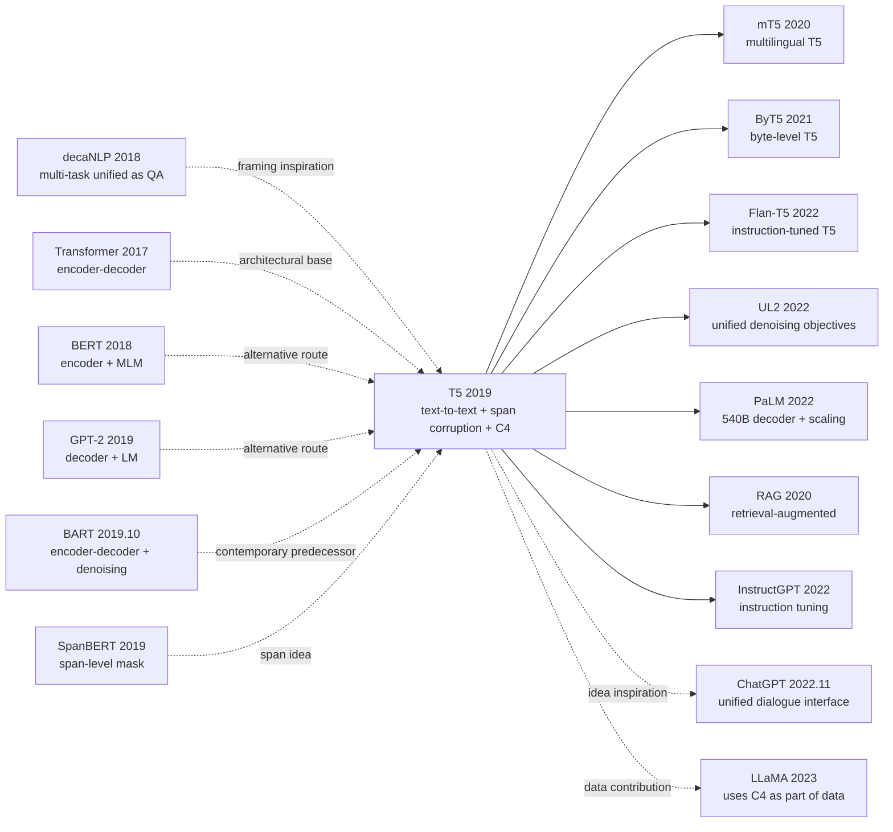

# T5 — Unifying All NLP Tasks as Text-to-Text

> **October 23, 2019. Raffel and 8 co-authors release [T5 (1910.10683)](https://arxiv.org/abs/1910.10683) on arXiv, 53 pages (67 with appendices), one of the most systematic transfer learning experimental reports in NLP history.**
> A paper with **no "new" model components**, but rigorously control-tested all the scattered transfer-learning design choices since BERT — architecture (encoder-only / decoder-only / encoder-decoder), pre-training objective (LM / MLM / span corruption), data scale (10GB - 1TB), model size (60M - 11B) — and gave a clear recommendation: **"encoder-decoder + span corruption + C4 + large model" is the strongest combo**.
> T5 also released **C4 (Colossal Clean Crawled Corpus, 750GB)**, today still a core data source for LLaMA / Falcon / RedPajama. Its 11B model swept SOTA on 24 benchmarks including GLUE / SuperGLUE / SQuAD.

## TL;DR

T5 **unifies all NLP tasks (classification / translation / summarization / QA / text similarity) into "text input → text output" format**, paired with **encoder-decoder Transformer + span corruption pre-training + 750GB C4 corpus**, proving this unified framework refreshes SOTA on all 24 benchmarks — marking NLP's transition from "per-task model" to "per-corpus model" paradigm.

---

## Historical Context

### What was the NLP community stuck on in 2019?

2018-2019 was NLP's "pre-training explosion" year: BERT (2018.10) / GPT-2 (2019.02) / RoBERTa (2019.07) / XLNet (2019.06) / ALBERT (2019.09) — 5 milestones in one year. But these works each made different design choices: BERT used encoder-only + MLM, GPT-2 used decoder-only + LM, XLNet used permutation LM, ALBERT cut params with sharing. **The community lacked a unified controlled experiment to answer "which design is actually best."**

> **(1) Architecture: encoder-only / decoder-only / encoder-decoder — which is strongest?
> (2) Pre-training objective: LM / MLM / span corruption / shuffle — which is most effective?
> (3) Data scale: 10GB / 100GB / 1TB — how much gain from each?
> (4) Model scale: 100M / 1B / 11B — which can scale up?
> (5) Task format: how to unify classification / regression / sequence labeling / QA?**

T5's goal was to **do full-factor controlled experiments across these 5 dimensions with a unified framework**, then combine the best of each dimension into the final model.

### The 3 immediate predecessors that pushed T5 out

- **Devlin et al., 2018 (BERT)**: encoder-only + MLM paradigm
- **Radford et al., 2019 (GPT-2)**: decoder-only + LM + zero-shot
- **Lewis et al., 2019 (BART)**: encoder-decoder + denoising pre-training (4 months before T5)

### What was the author team doing?

9 authors all from Google Research. Colin Raffel (first author, later moved to HuggingFace and founded Answer.AI); Noam Shazeer is co-author of Transformer + MoE pioneer (later founded Character.AI); Peter Liu is Google Brain text summarization expert. **Google Brain NLP team's goal was "find NLP's unified paradigm"**, T5 was the engineering output of that goal.

### State of industry, compute, data

- **TPU**: T5-11B trained on 1024 TPU v3 for ~2 weeks, estimated cost ~$1.3M
- **Data**: self-crawled and cleaned **C4 (750GB)**, heuristically filtered from Common Crawl
- **Frameworks**: TensorFlow + Mesh-TensorFlow (early model parallelism)
- **Industry**: NLP industry started big bets on pre-trained models, T5 was Google's key engineering competing with OpenAI's GPT-2/3 line

---

## Method Deep Dive

### Overall framework

```
[Pre-training: Span Corruption on C4 (750GB)]
  Input:  "Thank you <X> me to your party <Y> week"
  Target: "<X> for inviting <Y> last <Z>"
  ↓ Encoder-Decoder Transformer
  ↓ Cross-entropy on target tokens
[Fine-tuning: Multi-task with task prefix]
  All tasks formatted as text-to-text
  Same encoder-decoder + small LR fine-tune
```

| Config | T5-Small | T5-Base | T5-Large | T5-3B | T5-11B |
|--------|---------|---------|----------|-------|--------|
| Params | 60M | 220M | 770M | 3B | 11B |
| Encoder layers | 6 | 12 | 24 | 24 | 24 |
| $d_{model}$ | 512 | 768 | 1024 | 1024 | 1024 |
| $d_{ff}$ | 2048 | 3072 | 4096 | 16384 | 65536 |
| Heads | 8 | 12 | 16 | 32 | 128 |

### Key designs

#### Design 1: Text-to-Text Unified Framework — task prefix + text output

**Function**: turn classification / regression / sequence labeling / QA / translation / summarization all into "prefixed input text → output text."

**4 task type unified examples**:

| Task type | Input | Output |
|-----------|-------|--------|
| Classification (GLUE/SST-2) | `sst2 sentence: it is great.` | `positive` |
| Regression (GLUE/STS-B) | `stsb sentence1: ... sentence2: ...` | `3.4` (text representation, discretized to 0.2 intervals) |
| Translation (WMT EN-DE) | `translate English to German: Hello` | `Hallo` |
| Summarization (CNN/DM) | `summarize: <article>` | `<summary>` |
| QA (SQuAD) | `question: ... context: ...` | `answer text` |
| NLI (MNLI) | `mnli premise: ... hypothesis: ...` | `entailment / neutral / contradiction` |

**Comparison with BERT / GPT multi-task approaches**:

| Model | Multi-task approach | Task interface |
|-------|---------------------|---------------|
| BERT | Add different head per task | Classification head / span head / token head |
| GPT-2 | Prompt + zero-shot | Auto-regressive generation |
| **T5** | **Unified text-to-text + task prefix** | **Encoder-decoder generation** |

**Design rationale**: text-to-text interface fully shifts task differences to input format; model architecture + loss + training pipeline fully unified — peak engineering of transfer learning.

#### Design 2: Span Corruption Pre-training Objective — continuous version of BERT MLM

**Function**: randomly select continuous spans to mask, let the model predict the masked spans.

**Core mechanism**:

Input "Thank you for inviting me to your party last week"
Randomly select 15% tokens to form spans (avg length 3):
- "for inviting" → replace with `<X>`
- "last" → replace with `<Y>`

**Input**: `Thank you <X> me to your party <Y> week`
**Target**: `<X> for inviting <Y> last <Z>` (each span marked with unique sentinel token, ending with `<Z>`)

Loss is still cross-entropy on target tokens, but **only computed on sentinel + span tokens**.

**Comparison of 5 pre-training objectives (paper Table 4)**:

| Objective | Description | GLUE | SQuAD F1 | Translation BLEU |
|-----------|-------------|------|---------|-----------------|
| Standard LM | $P(x_t \| x_{<t})$ (GPT-style) | 73.78 | 78.94 | 26.0 |
| BERT-style MLM | 15% single-token mask | 82.96 | 86.78 | 26.7 |
| Deshuffling | shuffle tokens, reorder | 73.17 | 73.93 | 25.4 |
| **Span Corruption (T5)** | **15% span mask (avg length 3)** | **83.28** | **87.24** | **27.6** |
| Random Replace + Reconstruct | replace with random token | 79.37 | 80.94 | 26.5 |

**Span Corruption wins across the board**, and **target sequence is much shorter than BERT MLM** (only outputs masked spans, saving compute).

#### Design 3: Encoder-Decoder Architecture — controlled experiment shows it's optimal

**Function**: use standard Transformer encoder-decoder (nearly identical to original Transformer), not BERT's encoder-only or GPT's decoder-only.

**3 architecture controlled experiments (paper Table 2)**:

| Architecture | Param sharing | GLUE | SQuAD F1 | Translation BLEU |
|--------------|---------------|------|---------|-----------------|
| Encoder-Decoder (standard Transformer) | No | 83.28 | **87.24** | **27.6** |
| Encoder-Decoder (shared params) | Yes | 82.81 | 86.34 | 27.4 |
| Decoder-only (GPT-style) | - | 78.94 | 84.59 | 26.5 |
| Encoder-only (BERT-style) | - | N/A for generation | 84.81 | - |

**Encoder-Decoder wins on generation tasks (translation / summarization)**, also slightly wins on NLU. This is T5's most counter-current finding — when BERT (encoder-only) dominated NLU and GPT (decoder-only) dominated generation, T5 proved encoder-decoder is strongest on both under unified framework.

**T5's small differences from original Transformer**:
- **Pre-LN** (consistent with GPT-2)
- **Remove embedding bias**
- **Remove layer norm bias**
- **Relative Position Bias** (no sinusoidal / learnable absolute PE, instead relative position bias added to attention logits)

#### Design 4: C4 Dataset — 750GB cleaned Common Crawl

**Function**: build a **massive, high-quality, public** pre-training corpus, solving the problem that BookCorpus / Wikipedia are too small.

**Cleaning rules (heuristic filtering)**:

1. Keep only sentences ending in `.`, `!`, `?`, `"` (remove fragments)
2. Filter pages with fewer than 5 sentences (remove skeleton pages)
3. Dedup (sentence-level)
4. Filter pages with bad words (use List-of-Bad-Words)
5. Filter "JavaScript must be enabled" pages (failed JS render)
6. Filter "lorem ipsum" placeholders
7. Filter pages with many `{` `}` (code / JSON)

Final: from Common Crawl (April 2019 snapshot) ~6TB cleaned to **750GB / 156B tokens**.

**Pseudocode**:

```python
def build_c4(common_crawl_dump):
    docs = []
    for page in common_crawl_dump:
        if not page.text:
            continue
        sentences = split_sentences(page.text)
        if len(sentences) < 5:
            continue
        sentences = [s for s in sentences if s.endswith(('.', '!', '?', '"'))]
        if any(bad_word in page.text for bad_word in BAD_WORDS):
            continue
        if 'javascript must be enabled' in page.text.lower():
            continue
        if '{' in page.text or '}' in page.text:
            continue
        docs.append(' '.join(sentences))
    docs = dedup_by_sentence(docs)
    return docs                                  # 750GB / 156B tokens
```

**Comparison with same-era datasets**:

| Dataset | Scale | Source | Public | Cleaning intensity |
|---------|-------|--------|--------|-------------------|
| BookCorpus | 5GB | Novels | Yes | Low |
| WikiText-103 | 0.5GB | Wikipedia | Yes | High |
| WebText (GPT-2) | 40GB | Reddit high-karma | **No** | Medium |
| **C4 (T5)** | **750GB** | **Common Crawl** | **Yes** | **High (heuristic)** |
| The Pile (2020) | 825GB | 22 domains | Yes | Medium |

C4 was the **largest publicly cleaned pre-training corpus** at the time; it remains (2026) a core data source for LLaMA / Falcon / RedPajama.

### Loss / training strategy

| Item | Config |
|------|--------|
| Pretrain Loss | Span corruption cross-entropy |
| Optimizer | AdaFactor (not Adam, saves memory) |
| LR | 1e-3 inverse-square-root schedule |
| Pretrain Batch | 128 sequences × 512 tokens |
| Pretrain Steps | 524k (~1T tokens, 1/3 epoch on C4) |
| Fine-tune LR | 1e-3 |
| Fine-tune Steps | 262k (per task) |
| Norm | Pre-LN, no bias |
| Position | Relative position bias |
| Activation | ReLU (base/large) / GeGLU (11B version) |
| Tokenizer | SentencePiece, 32k vocab |

---

## Failed Baselines

### Opponents that lost to T5 at the time

- **GLUE leaderboard**: T5-11B avg 90.3, beats RoBERTa-large 88.5 (+1.8) and XLNet-large 89.5
- **SuperGLUE**: T5-11B 89.3, beats prior SOTA RoBERTa 84.6 (+4.7), first to surpass human baseline 89.0
- **CNN/DM summarization**: ROUGE-L 21.55 → 28.07 (+6.5)
- **WMT EN-DE translation**: 28.4 (Transformer) → 29.4 (T5-11B)
- **SQuAD 1.1**: F1 93.1 → 95.1, **first time surpassing supervised BERT ensemble SOTA**

### Failures / limits admitted in the paper

- **Decoder-only loses to encoder-decoder on generation tasks**: contrary to GPT route's bet, but authors honestly report
- **Span corruption gap to BERT MLM is small**: only obvious on generation tasks, NLU +0.3
- **Multi-task training slightly loses to single fine-tune**: T5 also tried mixed multi-task fine-tuning, but slightly worse than single (paper Table 14)
- **11B model still not saturated on some tasks (e.g., ReCoRD)**: hints scaling can continue, leading to GPT-3 175B
- **C4 cleaning heuristics are simple**: today LM-based filtering / dedup is more refined

### "Anti-baseline" lesson

- **"Encoder-only is the king of NLU"** (BERT route belief): T5 proved encoder-decoder under unified framework also gets NLU SOTA
- **"Decoder-only is the king of generation"** (GPT route belief): T5 reversed on generation tasks
- **"BookCorpus + Wikipedia is enough"** (community common belief): T5 with 750GB C4 proved data scale matters
- **"Per-task fine-tune is best practice"**: T5 proved **per-corpus pretrain + unified fine-tune** is the ceiling
- **"Need new architecture innovation to progress"**: T5 proved **rigorous controlled experiments + select optimal combination + scale up** beats new architecture

---

## Key Experimental Numbers

### Main experiment (24 benchmark SOTA)

| Benchmark | Prior SOTA | T5-11B | Gain |
|-----------|-----------|--------|------|
| GLUE | 88.5 (RoBERTa) | 90.3 | +1.8 |
| SuperGLUE | 84.6 (RoBERTa) | 89.3 | +4.7 |
| SQuAD 1.1 F1 | 93.1 | 95.1 | +2.0 |
| SQuAD 2.0 F1 | 88.6 | 90.6 | +2.0 |
| CNN/DM ROUGE-L | 21.55 | 28.07 | +6.5 |
| WMT EN-DE BLEU | 28.4 | 29.4 | +1.0 |
| WMT EN-FR BLEU | 41.0 | 41.5 | +0.5 |
| ReCoRD acc | 84.0 | 90.6 | +6.6 |
| MultiRC F1a | 83.4 | 87.4 | +4.0 |
| BoolQ acc | 87.1 | 91.2 | +4.1 |

### Architecture + objective control (paper Table 2 + 4)

| Architecture | Objective | GLUE | SQuAD F1 |
|-------------|-----------|------|---------|
| Encoder-Decoder | Span | **83.28** | **87.24** |
| Encoder-Decoder | LM | 80.88 | 84.45 |
| Decoder-only | LM | 78.94 | 84.59 |
| Decoder-only | Span | 79.46 | 84.85 |
| Encoder-only | MLM | - | 84.81 |

### Scaling (paper Table 14)

| Model | Params | C4 train tokens | GLUE | SQuAD F1 | CNN/DM ROUGE-L |
|-------|--------|-----------------|------|---------|---------------|
| T5-Small | 60M | 137B | 77.4 | 79.10 | 19.24 |
| T5-Base | 220M | 137B | 82.7 | 85.44 | 20.34 |
| T5-Large | 770M | 137B | 86.4 | 89.40 | 21.10 |
| T5-3B | 3B | 1.0T | 88.5 | 91.26 | 22.54 |
| **T5-11B** | **11B** | **1.0T** | **89.7** | **91.44** | **23.06** |

**All dimensions improve monotonically, no saturation**.

### Key findings

- **Encoder-decoder + span corruption is the strongest combination**
- **C4 750GB significantly improves over BookCorpus 5GB** (+5-7 GLUE points)
- **Scaling to 11B still monotonic**: hints GPT-3 decision was reasonable
- **Multi-task training slightly loses to single fine-tune**: transfer learning still mainly per-task
- **Task prefix format details matter**: good prefixes give +1-2 points

---

## Idea Lineage



### Predecessors
- **Transformer (2017)**: encoder-decoder architectural foundation
- **BERT (2018)**: encoder + MLM control
- **GPT-2 (2019)**: decoder + LM control
- **decaNLP (2018)**: early framing of multi-task unified as QA
- **SpanBERT (2019)**: span-level mask idea
- **BART (2019.10)**: 4 months before T5, encoder-decoder + denoising

### Successors
- **Multilingual / cross-modal extensions**: mT5 2020, ByT5 2021, PaLM 2022 (scales T5 paradigm to 540B)
- **Instruction tuning**: Flan-T5 2022 (first to do instruction tuning on T5, opening instruction-tuning paradigm)
- **Objective improvements**: UL2 2022 (unified multiple denoising objectives), PEGASUS 2020 (gap-sentence summarization pre-training)
- **Retrieval augmentation**: RAG 2020 (adds retrieval on T5 backbone)
- **Data contribution**: C4 to date (2026) remains core data source for LLaMA / Falcon / RedPajama and other open LLMs
- **Idea inherited by GPT-3 paradigm**: text-to-text interface is essentially the embryo of in-context learning

### Misreadings
- **"T5 is BERT's upgrade"**: wrong. T5 is the third path beyond BERT/GPT (encoder-decoder + span)
- **"Text-to-text must be optimal interface"**: on classification tasks, task-specific heads may still be more precise
- **"11B is the NLP endpoint"**: GPT-3 175B 4 months later proved scaling can continue 16×

---

## Modern Perspective (Looking Back from 2026)

### Assumptions that don't hold up

- **"Encoder-decoder is the best architecture"**: post-ChatGPT era decoder-only LLMs (GPT-4 / Claude / LLaMA) crush encoder-decoder in user-facing apps. But **T5 remains gold standard in backend embedding / dense retrieval / summarization tasks**
- **"11B is large enough"**: today mainstream is 70B-1T, T5-11B is medium-sized vs GPT-4 / Claude 3.5
- **"Per-task fine-tune is best practice"**: overturned by in-context learning + RLHF — GPT-3+ doesn't need task-specific fine-tune
- **"C4 heuristic cleaning is enough"**: today LM-based filtering is more refined
- **"Encoder-decoder is more training-efficient than decoder-only"**: refuted — FlashAttention + KV cache make decoder-only inference more efficient

### What time validated as essential vs redundant

- **Essential**: text-to-text unified framework, span corruption objective, C4 dataset, rigorous controlled experiment methodology, encoder-decoder advantage on generation
- **Redundant / misleading**: sentinel token design (GPT-3 in-context learning doesn't need it), relative position bias (replaced by RoPE), AdaFactor (replaced by Adam + ZeRO)

### Side effects the authors didn't anticipate

1. **C4 became NLP data infrastructure**: today 90%+ open LLMs use C4 / mC4 as part of pre-training data
2. **Flan-T5 opened instruction-tuning paradigm**: 2022 Flan-T5 fine-tuned on 1800+ tasks in instruction format, inspiring later InstructGPT / ChatGPT
3. **Unified text-to-text interface fully inherited by ChatGPT**: ChatGPT's dialogue format is the extreme of text-to-text
4. **Changed NLP benchmark design philosophy**: pre-T5 benchmarks were independent, post-T5 community values "unified-framework comparable"
5. **Opened systematic transfer learning research direction**: T5's controlled experiment methodology widely imitated (e.g., GPT-3's scaling laws, Chinchilla)

### If we rewrote T5 today

- Switch to **decoder-only** (per ChatGPT experience)
- Add **instruction tuning + RLHF**
- Use **byte-level BPE** (per GPT-3)
- Use **RoPE / ALiBi** instead of relative position bias
- Use **SwiGLU** instead of ReLU
- Use **GQA / MQA** to reduce KV cache
- Scale data to **15T tokens** (per LLaMA 3, Chinchilla-balanced)
- Add **LM-based filtering** (per Falcon)

But the **core ideas "text-to-text unified interface + large-scale high-quality data + rigorous controls" stay unchanged**.

---

## Limitations and Outlook

### Authors admitted
- 11B training cost is extremely high (millions of dollars), academia hard to replicate
- Multi-task training slightly loses to single fine-tune
- C4 cleaning heuristics simple, no LM-based filtering
- Sequence length only 512, long-document limited
- Cannot do zero-shot prompt (still needs fine-tuning data corresponding to task prefix)

### Found in retrospect
- Encoder-decoder cannot reuse KV cache across steps in inference, less efficient than decoder-only
- Relative position bias has weak extrapolation
- AdaFactor weaker than Adam on small models

### Improvement directions (validated by follow-ups)
- mT5 (2020): multilingual extension
- Flan-T5 (2022): instruction tuning
- UL2 (2022): unified multiple denoising objectives
- LongT5 (2022): long documents (4k+ context)
- ByT5 (2021): byte-level tokenization
- Switch to decoder-only (GPT-3/4 route)

---

## Related Work and Inspiration

- **vs BERT (cross-architecture)**: BERT encoder-only + MLM, T5 encoder-decoder + span corruption. **Lesson: encoder-decoder has architectural advantage on generation**
- **vs GPT-2 (cross-architecture)**: GPT decoder-only + LM + zero-shot, T5 encoder-decoder + span + multi-task fine-tune. **Lesson: architecture choice must match task type**
- **vs BART (cross-contemporary)**: BART proposed encoder-decoder + denoising 4 months before T5; T5 is more systematic controlled experiment. **Lesson: original ideas don't always beat thorough engineering**
- **vs Transformer (cross-task)**: Transformer solved MT, T5 generalized encoder-decoder to all NLP tasks. **Lesson: general architectures can be reused across tasks**
- **vs Flan-T5 (cross-generation)**: Flan-T5 added instruction tuning on T5, proving T5 framework perfectly compatible with instruction tuning. **Lesson: good pre-training paradigm should be easy to extend to new training objectives**

---

## Related Resources

- 📄 [arXiv 1910.10683](https://arxiv.org/abs/1910.10683) · [JMLR 2020](https://jmlr.org/papers/v21/20-074.html)
- 💻 [Authors' original TF implementation](https://github.com/google-research/text-to-text-transfer-transformer) · [HuggingFace transformers/t5](https://huggingface.co/docs/transformers/model_doc/t5)
- 🔗 [t5-base on HF Hub](https://huggingface.co/t5-base) · [t5-11b](https://huggingface.co/t5-11b) · [Flan-T5](https://huggingface.co/google/flan-t5-xxl)
- 📦 Datasets: [C4 on TF Datasets](https://www.tensorflow.org/datasets/catalog/c4) · [mC4 (multilingual)](https://huggingface.co/datasets/mc4)
- 📚 Must-read follow-ups: [mT5 (2020)](https://arxiv.org/abs/2010.11934), [Flan-T5 (2022)](https://arxiv.org/abs/2210.11416), [UL2 (2022)](https://arxiv.org/abs/2205.05131), [PaLM (2022)](https://arxiv.org/abs/2204.02311)
- 🎬 [Yannic Kilcher: T5 paper explained](https://www.youtube.com/watch?v=91iLu6OOrwk)

---

> 🌐 [中文版本](/era3_attention/2019_t5/) · 📚 awesome-papers project · CC-BY-NC
