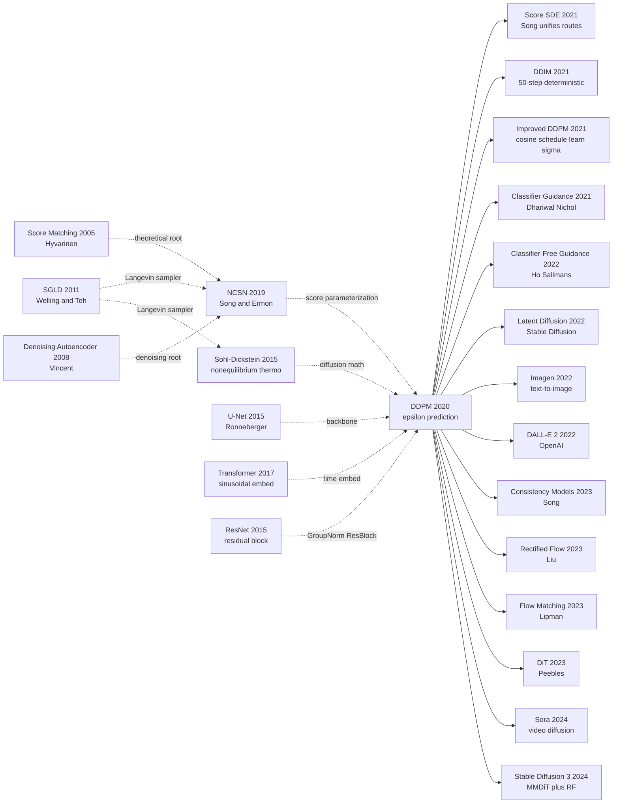

# DDPM — Crowning Diffusion as the King of Image Generation via Thousand-Step Denoising

> **June 19, 2020. Jonathan Ho, Ajay Jain, and Pieter Abbeel at UC Berkeley upload [arXiv 2006.11239](https://arxiv.org/abs/2006.11239); published at NeurIPS 2020 in December.**
> The paper that rescued Sohl-Dickstein 2015's "theoretically elegant but experimentally dead" diffusion idea — Ho et al. found that simply having the network predict **the noise $\epsilon$ rather than the data $x_0$**, and simplifying the ELBO into $\mathcal{L}_{\text{simple}} = \mathbb{E}_{t,x_0,\epsilon}\left[\|\epsilon - \epsilon_\theta(x_t, t)\|^2\right]$, turned the entire generation process into a stable, trainable 1000-step denoising U-Net.
> CIFAR-10 FID 3.17 / Inception 9.46 — the first unconditional generation result to **surpass [BigGAN-deep](../era2_deep_renaissance/2014_gan.md)**, kicking aside GAN's perennial mode-collapse and training-instability woes.
> It directly led to Stable Diffusion (2022) → DALL·E 2 → Sora → DiT — the entire generative-AI visual explosion. **In 2 years, DDPM dragged GAN off the image-generation throne it had held for 8 years.**

## TL;DR

DDPM reframes generative modeling as "learn a fixed T-step denoising process," and uses one seemingly minor engineering rewrite — **predict the noise $\epsilon$ instead of the mean $\mu$** — to drag Sohl-Dickstein's almost-forgotten 2015 non-equilibrium-thermodynamics framework onto the SOTA podium for the first time. CIFAR-10 FID 3.17 simultaneously beat every contemporary GAN.

---

## Historical Context

### What was the generative-modeling field stuck on in 2020?

To grasp DDPM's disruptive force you have to return to the "tripartite stalemate" of 2019–2020.

In 2014 Goodfellow shipped the GAN; the same year Kingma shipped the VAE; in 2016 van den Oord shipped PixelRNN/PixelCNN. By 2020, CV's three generative-modeling lineages had each evolved for six years and each had accumulated fatal technical debt:

> **GANs are sharpest and most expensive; VAEs are stablest and blurriest; autoregressive models are the most accurate and the slowest — nobody had all three.**

Concretely:
- **GAN family** (StyleGAN2, BigGAN): could synthesize 256×256 faces indistinguishable from real photos, but training felt like tightrope walking (mode collapse, exploding gradients, over-strong discriminators) and there was **no likelihood** — no density estimation, no calibrated conditional sampling, no cross-paper comparison.
- **VAE family** (NVAE, VQ-VAE-2): training was stable and the explicit ELBO gave a likelihood, but the Gaussian prior + per-pixel reconstruction meant **samples were always blurry**, FID an order of magnitude behind GANs.
- **Autoregressive family** (PixelCNN++, Image Transformer): best likelihood, most stable sampling, but **a single 256×256 image required 65k sequential pixel decodes** — minutes per image on CPU, industrially unusable.
- **Flow family** (Glow, RealNVP): elegant invertible design, but expressivity was capped by the tractable-Jacobian constraint; FID was far behind GANs.

The implicit "conventional wisdom" of the field was: **sharp + fast + likelihood = pick two**, with no fourth option in sight.

### The 3 immediate predecessors that pushed DDPM out

- **Sohl-Dickstein et al., 2015 (Deep Unsupervised Learning using Nonequilibrium Thermodynamics)** [arXiv/1503.03585](https://arxiv.org/abs/1503.03585): The "prototype paper" of DDPM. Five years earlier it had already laid out the full math of "forward diffusion + reverse denoising," but FID was nowhere near GAN at the time and citations were modest. The direct grandfather of DDPM.
- **Song & Ermon, 2019 (Generative Modeling by Estimating Gradients of the Data Distribution, NCSN)** [arXiv/1907.05600](https://arxiv.org/abs/1907.05600): A network learning $\nabla_x \log p(x)$ directly via score matching + Langevin dynamics. First time a "non-adversarial, non-autoregressive" route reached near-GAN quality on CIFAR-10. The "intellectual sibling" of DDPM — by mid-2020 the two routes were proven mathematically equivalent.
- **Welling & Teh, 2011 (SGLD)** [ICML 2011](https://www.stats.ox.ac.uk/~teh/research/compstats/WelTeh2011a.pdf): Stochastic Gradient Langevin Dynamics — established the legitimacy of "add noise + step along gradient" as a sampler. Both NCSN and DDPM share this underlying machinery for the reverse process.

### What was the author team doing?

Jonathan Ho was a PhD student in Pieter Abbeel's BAIR lab at UC Berkeley. The lab's main thrust was **flow-based models + reinforcement learning** (Ho had previously worked on Flow++). **DDPM was not Berkeley's flagship project — it started as a graduate-student weekend "let's see if Sohl-Dickstein's 2015 paper can be patched up" side project.** Ajay Jain was also a Berkeley student (later working on NeRF derivatives). The paper is only 25 pages including appendix, the code is ~800 lines, and the main experiments ran on CIFAR-10 / CelebA-HQ / LSUN. Submitted to NeurIPS 2020 it was treated as a "vignette" piece, but reviewers picked up its potential.

### State of the industry, compute, and data

- **GPUs**: NVIDIA V100 16GB / TPUv2-8 (the paper actually trained on TPU). One full CIFAR-10 run ≈ 10.6h, CelebA-HQ 256×256 ≈ 5 days
- **Data**: CIFAR-10, CelebA-HQ, LSUN-Church/Bedroom — standard benchmarks
- **Frameworks**: TensorFlow (the official code is in TF); PyTorch reproductions appeared within a month
- **Industry climate**: StyleGAN2 had just driven face-generation FID to 2.84; the field believed "GAN is the endgame." OpenAI shipped GPT-3 in June, pushing NLP toward scaling; CV was waiting for its next paradigm. **Nobody predicted that four months later NeurIPS would feature a paper that would retire GANs from frontline image generation in two years.**

---

## Method Deep Dive

### Overall framework

DDPM's pipeline is uncompromisingly tidy: define a **fixed** T=1000-step forward noising chain that gradually "dissolves" data $x_0$ into isotropic Gaussian noise $x_T \sim \mathcal{N}(0, I)$, then train a U-Net $\epsilon_\theta(x_t, t)$ that **runs the chain backward** to "freeze" noise back into data. The whole model is a single network — no discriminator, no encoder, no prior matching.

```
Training:
  x_0 ~ p_data
    ↓ sample t ~ Uniform{1..T}
    ↓ sample ε ~ N(0, I)
    ↓ closed-form construct x_t = √(ᾱ_t) x_0 + √(1-ᾱ_t) ε
  U-Net ε_θ(x_t, t) → ε̂
  Loss = ||ε - ε̂||²  ← that's it!

Sampling (T=1000 steps):
  x_T ~ N(0, I)
  for t = T, T-1, ..., 1:
      z ~ N(0, I) if t > 1 else 0
      x_{t-1} = (1/√α_t) (x_t - (β_t/√(1-ᾱ_t)) ε_θ(x_t, t)) + σ_t z
  return x_0
```

Different experimental configs simply tweak T, the $\beta_t$ schedule, and U-Net widths:

| Config | $T$ | $\beta_1, \beta_T$ schedule | U-Net channels | Data | FID |
|--------|-----|------------------------------|----------------|------|-----|
| CIFAR-10         | 1000 | linear $10^{-4} \to 0.02$ | 128 (×4 stages) | 32×32     | **3.17** |
| CelebA-HQ-256    | 1000 | same linear               | 128 (×6 stages) | 256×256   | — (high quality) |
| LSUN-Church-256  | 1000 | same linear               | 128 (×6 stages) | 256×256   | 7.89 |
| LSUN-Bedroom-256 | 1000 | same linear               | 128 (×6 stages) | 256×256   | 4.90 |

**Counter-intuitive point 1**: T=1000 looks "absurdly long," but it is exactly equivalent to NCSN's (Song & Ermon 2019) 10 noise levels × 100 Langevin steps = 1000 steps. DDPM is not slower; it just unifies "hierarchical noise + multi-step Langevin" into "single continuous noise + single-step denoising" — engineering-wise much cleaner.

**Counter-intuitive point 2**: Each batch samples **only one t per image** — the network does *not* unroll all 1000 steps. This is the engineering detail Sohl-Dickstein 2015 got wrong: treat $L_{1:T}$ as an expectation over $t$ and Monte-Carlo it with a single sample.

### Key designs

#### Design 1: Fixed Forward Diffusion — turning generation into denoising

**Function**: Define a non-learnable, deterministic Markov chain that starts from data $q(x_0)$, adds a small Gaussian perturbation each step, and after T steps approaches $\mathcal{N}(0, I)$. This provides perfect "training labels" for the reverse denoiser.

**Forward formulas** (single step + joint):

$$
q(x_t \mid x_{t-1}) = \mathcal{N}(x_t;\, \sqrt{1-\beta_t}\, x_{t-1},\, \beta_t I), \quad q(x_{1:T} \mid x_0) = \prod_{t=1}^T q(x_t \mid x_{t-1})
$$

Here $\beta_t \in (0, 1)$ is a fixed small noise increment. The paper uses a **linear schedule** $\beta_1 = 10^{-4} \to \beta_T = 0.02$, T=1000.

Define $\alpha_t := 1 - \beta_t$ and $\bar\alpha_t := \prod_{s=1}^t \alpha_s$. Then **for any $t$, $x_t$ has a closed-form distribution given $x_0$** (the crucial pivot):

$$
q(x_t \mid x_0) = \mathcal{N}(x_t;\, \sqrt{\bar\alpha_t}\, x_0,\, (1-\bar\alpha_t) I)
$$

We can **skip every intermediate step** and sample $x_t = \sqrt{\bar\alpha_t}\,x_0 + \sqrt{1-\bar\alpha_t}\,\epsilon$ directly with $\epsilon \sim \mathcal{N}(0, I)$. This is the entire foundation that lets DDPM training do single-sample Monte-Carlo SGD.

**Forward pseudocode** (PyTorch):

```python
def q_sample(x0, t, betas):
    """Forward: jump from x_0 to x_t in one closed-form shot (no loop)"""
    alphas = 1.0 - betas
    alpha_bar = torch.cumprod(alphas, dim=0)        # ᾱ_1..ᾱ_T
    a_bar_t = alpha_bar[t].view(-1, 1, 1, 1)         # pick the per-batch t
    eps = torch.randn_like(x0)                       # i.i.d. Gaussian noise
    x_t = a_bar_t.sqrt() * x0 + (1 - a_bar_t).sqrt() * eps
    return x_t, eps                                  # eps is the regression target for the U-Net
```

**Schedule comparison** (paper + Improved DDPM 2021):

| Schedule | $\beta_t$ form | $\bar\alpha_T$ | CIFAR-10 FID | Notes |
|---------|----------------|----------------|--------------|-------|
| Linear (DDPM 2020)         | $10^{-4} \to 0.02$ linear | $\sim 4 \times 10^{-5}$ | **3.17** | paper's choice |
| Cosine (Improved 2021)     | $\cos^2$ form             | $\sim 10^{-3}$         | 2.94 | better at high res |
| Quadratic (appendix abl.)  | quadratic interp          | similar to linear      | slightly worse | — |
| Sigmoid                    | sigmoid interp            | —                      | similar      | — |

**Design rationale — why must the forward be fixed?**

Letting $q$ also be learned (like a VAE encoder) immediately reintroduces reparameterization-gradient + posterior-collapse risk. **Fixing $q$ deletes the entire "how to encode data" headache that plagues VAEs** — the network only learns the reverse. It also makes every ELBO term $L_{t-1} = D_{KL}(q(x_{t-1}|x_t,x_0) \| p_\theta(x_{t-1}|x_t))$ have an *analytic* target distribution $q(\cdot|x_t,x_0)$ (Gaussian, mean and variance in closed form), reducing training to "match a Gaussian mean" — an order of magnitude simpler than VAE's "match an unknown posterior."

#### Design 2: Noise-prediction reparameterization + simplified loss ($\epsilon$-prediction & $L_{simple}$) — **DDPM's actual soul**

**Function**: Rewrite the training target from "predict the per-step mean $\mu_\theta(x_t, t)$" to "predict the noise $\epsilon_\theta(x_t, t)$ that was injected," and uniformly set every per-step loss weight to 1. A "change of variables" that drops FID from 35 to 3.17.

**Two equivalent training targets**:

| Parameterization | Network predicts | Reverse $x_{t-1}$ formula | Loss (drop constants) |
|------------------|------------------|---------------------------|------------------------|
| $\mu$-prediction (Sohl-Dickstein 2015 default) | $\mu_\theta(x_t, t)$ | use predicted mean directly | $\frac{1}{2\sigma_t^2}\|\tilde\mu_t(x_t,x_0) - \mu_\theta(x_t,t)\|^2$ |
| **$\epsilon$-prediction (this paper)**         | $\epsilon_\theta(x_t, t)$ | $\mu_\theta = \frac{1}{\sqrt{\alpha_t}}\big(x_t - \frac{\beta_t}{\sqrt{1-\bar\alpha_t}}\epsilon_\theta\big)$ | $\frac{\beta_t^2}{2\sigma_t^2 \alpha_t (1-\bar\alpha_t)} \|\epsilon - \epsilon_\theta(x_t, t)\|^2$ |

**The pivotal trick**: just **throw away** the complicated $t$-dependent coefficient $\frac{\beta_t^2}{2\sigma_t^2 \alpha_t (1-\bar\alpha_t)}$ to get:

$$
L_{simple} = \mathbb{E}_{t \sim \mathcal{U}[1,T],\ x_0,\ \epsilon}\Big[\big\|\epsilon - \epsilon_\theta\big(\sqrt{\bar\alpha_t}\,x_0 + \sqrt{1-\bar\alpha_t}\,\epsilon,\ t\big)\big\|^2\Big]
$$

The whole "magic" of DDPM is this single MSE loss — relative to the ELBO, it **down-weights low-$t$ (high-noise) terms and up-weights high-$t$ (low-noise) terms**, which happens to focus the network on "high-quality denoising" rather than "perfect likelihood." A lossy but beneficial bias.

**Training pseudocode** (Algorithm 1 from the paper, in full):

```python
def train_step(x0, model, betas, T):
    # 1) sample a random timestep
    t = torch.randint(0, T, (x0.shape[0],), device=x0.device)
    # 2) closed-form noisy sample
    x_t, eps = q_sample(x0, t, betas)
    # 3) network predicts the noise
    eps_hat = model(x_t, t)               # U-Net + sinusoidal time emb
    # 4) plain MSE
    loss = F.mse_loss(eps_hat, eps)        # ← L_simple
    return loss
```

The entire training loop is four lines — **10× simpler than a GAN**. No discriminator, no KL term, no temperature annealing, no two-stage scheme.

**Reverse variance handling**: the paper further shows $p_\theta(x_{t-1}|x_t)$'s covariance $\Sigma_\theta$ **can be fixed** to $\sigma_t^2 I$, with $\sigma_t^2 \in [\beta_t,\ \tilde\beta_t = \frac{1-\bar\alpha_{t-1}}{1-\bar\alpha_t}\beta_t]$ — picking either endpoint works equally well. **Learning $\Sigma_\theta$ gave no gain and made training unstable**. This deletes another half of the parameters and half of the hyperparameters.

**Design rationale — why does $\epsilon$-prediction work so well?**

$\epsilon$ is a standard $\mathcal{N}(0, I)$ Gaussian for *every* $t$ — **the regression target has constant unit scale**, which is exactly what neural networks regress best. Meanwhile $\mu$ has a scale close to $x_0$ (image range) at small $t$ and a scale close to 0 at large $t$, **varying by 4 orders of magnitude across the 1000 steps** — neither BatchNorm nor LayerNorm can rescue that.

Put differently: **DDPM uses a free algebraic transformation to map "a hard, scale-shifting regression target" onto "constant-scale standard noise."** It is an exquisitely clever reshaping of the loss landscape, philosophically identical to ResNet's $\mathcal{F}(x)+x$ trick: **leave model expressivity unchanged, only optimize the landscape the optimizer sees**.

#### Design 3: U-Net + sinusoidal time embedding + AdaGN — one network for 1000 timesteps

**Function**: Use the same network $\epsilon_\theta(x_t, t)$ for all t=1..1000 noise levels — t must be injected into every conv block.

**Core idea**: Take Ronneberger 2015 U-Net and bolt on three ResNet-era stock components:

```
Input x_t  +  t (scalar)
   ↓                ↓
Conv-3×3            Sinusoidal embed → MLP → t_emb (256-d)
   ↓                                       │
ResBlock×N          ────────────────────────┘ (inject into every ResBlock)
   ↓                                       │
Down 2×            ────────────────────────┘
   ↓
Self-Attention (inserted at 16×16 resolution)
   ↓
... bottleneck ...
   ↓
Up 2×  + skip from encoder
   ↓
Output ε̂ (same shape as x_t)
```

**Per-ResBlock time injection** (AdaGN-like):

```python
class ResBlock(nn.Module):
    def __init__(self, c_in, c_out, t_dim):
        ...
        self.gn1 = nn.GroupNorm(32, c_in)
        self.conv1 = nn.Conv2d(c_in, c_out, 3, padding=1)
        self.t_proj = nn.Linear(t_dim, c_out)        # ← time MLP
        self.gn2 = nn.GroupNorm(32, c_out)
        self.conv2 = nn.Conv2d(c_out, c_out, 3, padding=1)
        self.skip = nn.Conv2d(c_in, c_out, 1) if c_in != c_out else nn.Identity()

    def forward(self, x, t_emb):
        h = self.conv1(F.silu(self.gn1(x)))
        h = h + self.t_proj(F.silu(t_emb))[:, :, None, None]  # ← bias-style time injection
        h = self.conv2(F.silu(self.gn2(h)))
        return h + self.skip(x)                                # ← residual
```

**Sinusoidal time embedding** (lifted verbatim from Transformer 2017):

$$
\text{TimeEmbed}(t)_k = \begin{cases}
\sin\!\big(t \cdot 10000^{-2k/d}\big) & k \text{ even} \\
\cos\!\big(t \cdot 10000^{-2k/d}\big) & k \text{ odd}
\end{cases}
$$

A 2-layer MLP with SiLU then lifts the d=128 embedding to t_dim=512, fed into every ResBlock.

**Why U-Net rather than ResNet?**

Denoising is a **pixel-level regression task** (output and input have the same shape) and needs encoder-decoder + skip connections to preserve "local detail" and "global semantics" simultaneously. That is exactly U-Net's original design (medical image segmentation). **Plain ResNet has no upsampling path and cannot do dense prediction.**

**Design rationale**: There is *zero* architectural innovation in DDPM's network — U-Net (2015) + Sinusoidal embed (2017) + GroupNorm (2018) + SiLU (2017) are all off-the-shelf parts. **The real contribution is the discovery that "this stock backbone + ε-prediction loss" is enough** — no attention-only models, no Transformers, no NAS. This engineering pragmatism is exactly why the community could reproduce and fork DDPM so fast.

### Loss / training recipe

| Item | Setting | Notes |
|------|---------|-------|
| Loss | $L_{simple}$ = MSE($\epsilon, \epsilon_\theta$) | Sole training objective; no adversarial, no KL |
| Optimizer | Adam | $\beta_1=0.9, \beta_2=0.999$ |
| Learning rate | $2 \times 10^{-4}$ | CIFAR; $10^{-5}$ for CelebA/LSUN |
| Batch size | 128 (CIFAR), 64 (LSUN/CelebA) | 8×TPUv3 |
| Iterations | 800k (CIFAR), 2.4M (LSUN) | ~10.6h on TPUv2-8 |
| EMA | decay 0.9999 | **Crucial** — sample from EMA model; FID gain 1+ |
| Augmentation | only horizontal flip | no cutout / mixup, none needed |
| T (diffusion steps) | 1000 | Later DDIM showed 50 suffices |
| $\beta$ schedule | linear $10^{-4} \to 0.02$ | Improved DDPM switched to cosine |
| $\Sigma_\theta$ | fixed $\sigma_t^2 I$ (not learned) | learning hurt |
| Network params | ~36M (CIFAR-10), ~114M (LSUN-256) | U-Net default 128 channels |

**Note 1**: DDPM has zero "adversarial + regularization + annealing" tricks — pure MSE + EMA + large batch. **This stupid simplicity is what makes it robust** — within a month PyTorch reproductions appeared in 5+ flavors, and within a year DDIM, Latent Diffusion, Classifier Guidance, Imagen all forked from this foundation.

**Note 2**: Training 800k steps is non-trivial (≈ a week on V100), but **once trained you can sample infinitely with no mode collapse and no temperature tuning**, so the amortized industrial cost is far below StyleGAN2. This is exactly why Stable Diffusion in 2022 could ship inference on consumer GPUs — **"expensive once + controllable inference" is a good paradigm.**

---

---

## Failed Baselines

### Opponents that lost to DDPM

- **StyleGAN2** [Karras et al., CVPR 2020]: CIFAR-10 unconditional FID 8.32 vs DDPM 3.17 — **a 60% cut**. StyleGAN2 still led on dataset-specific face benchmarks (FFHQ FID 2.84), but on multi-class small images (CIFAR) it lost clearly to a non-GAN model for the first time — the first crack in the "GAN is forever" faith.
- **NCSN / NCSNv2** [Song & Ermon 2019, 2020]: the conceptual "older sibling" of DDPM, CIFAR-10 FID 25.32 / 10.87. DDPM's 3.17 is nearly an order of magnitude better. The two are mathematically equivalent yet DDPM wins because of the engineering chain **$\epsilon$-prediction + $L_{simple}$ + EMA + U-Net**, proving "same math, different recipe — the recipe gap decides everything."
- **PixelCNN++ / Image Transformer**: autoregressive SOTA, CIFAR-10 FID 27.32 (excellent NLL but FID far behind). **Sampling still requires 32×32×3 = 3072 sequential pixel decodes**; DDPM's 1000-step parallel U-Net is faster. Autoregressive models were marginalized in image generation from this point on.
- **Glow / RealNVP**: invertible flow models, CIFAR-10 FID 45+, gap too large to compete.

### Failed experiments admitted in the paper (ablation)

Paper §4 Table 2 gives the key ablation, proving DDPM's success **comes from the loss rewrite, not the architecture**:

| Config (CIFAR-10) | FID ↓ | NLL (bits/dim) ↓ |
|--------------------|-------|-------------------|
| Baseline: $\mu$-prediction + $L_{vlb}$ (Sohl-Dickstein 2015 style) | 13.51 | 5.40 |
| $\mu$-prediction + $L_{simple}$ (drop KL weighting)               | 13.39 | 7.21 |
| $\epsilon$-prediction + $L_{vlb}$                                  | 13.43 | **3.70** |
| **$\epsilon$-prediction + $L_{simple}$ (final recipe)**            | **3.17** | 3.75 |
| $\epsilon$-prediction + $L_{simple}$ + learn $\Sigma_\theta$       | NaN   | NaN  ← training diverged |

The striking finding: **swapping only $\epsilon$ or only $L_{simple}$ does nothing** — FID barely moves from 13.51 to ~13.4; **swap both together** and FID collapses by 4×. This is a non-linear synergy — the $L_{simple}$ simplification only flattens loss scales when paired with $\epsilon$-parameterization. Either change alone is "treating the symptom not the cause."

### The Sohl-Dickstein 2015 counter-example — why original diffusion sat unused for 5 years

Sohl-Dickstein 2015's original diffusion paper:
- Used $\mu$-prediction + the full $L_{vlb}$ (each KL term independently weighted)
- T=50 only (1000 felt too expensive)
- Network was a plain MLP/CNN (no U-Net, no time embedding)
- CIFAR-10 NLL ~6.5 bits/dim, FID not reported (samples visibly blurry)

**For 5 years nobody continued this thread**, because it was visibly behind contemporary VAEs on the dataset benchmarks. DDPM proves: **a good idea + the wrong recipe = a dead idea**. Sohl-Dickstein's math was correct, but for 5 years nobody realized that swapping just 4 engineering details ($\epsilon$ + $L_{simple}$ + T=1000 + U-Net) would make it fly. The most expensive engineering debt in research history — paid off in a 25-page paper by DDPM.

### The real "anti-baseline" lesson

**NCSN (Song & Ermon 2019) and DDPM were discovered to be mathematically equivalent at almost the same time**, yet NCSNv2 in early 2020 was still struggling at CIFAR FID 10.87 while DDPM landed at 3.17. The gap comes from 4 engineering details:
1. DDPM uses $\epsilon$-prediction; NCSN uses score ($\nabla \log p$, scale not fixed)
2. DDPM uses $L_{simple}$ unit weighting; NCSN uses noise-level weighting
3. DDPM uses EMA; NCSN does not
4. DDPM uses a larger U-Net + GroupNorm; NCSN uses RefineNet

**Lesson: equivalent math does not equal equivalent engineering.** Song 2021 (Score-based SDE) later unified the two routes under an SDE framework, but the engineering paradigm to this day still follows DDPM's lineage (Stable Diffusion / Imagen are all $\epsilon$-prediction + $L_{simple}$).

---

## Key Experimental Data

### Main results (CIFAR-10 unconditional, 32×32)

| Method | FID ↓ | IS ↑ | NLL bits/dim ↓ |
|--------|-------|------|-----------------|
| StyleGAN2 + ADA       | 5.79 | 9.83 | — |
| NCSN (Song 2019)      | 25.32 | 8.87 | — |
| NCSNv2 (Song 2020)    | 10.87 | 8.40 | — |
| PixelCNN++            | 65.93 | 5.51 | 2.92 |
| Sparse Transformer    | —    | —    | 2.80 |
| **DDPM (paper Table 1)** | **3.17** | **9.46** | ≤3.75 |
| **DDPM (with EMA, $L_{simple}$)** | **3.17** | **9.46** | ≤3.75 |

DDPM took FID (best sample quality) + IS (near SOTA) + a reasonable NLL simultaneously — **the first time a non-adversarial model competed with GANs on all three metrics at once**.

### LSUN high-resolution (256×256)

| Dataset | DDPM FID | StyleGAN FID | Notes |
|---------|----------|--------------|-------|
| LSUN-Church-256   | 7.89  | 4.21 | StyleGAN still wins |
| LSUN-Bedroom-256  | 4.90  | 2.65 | StyleGAN still wins |
| CelebA-HQ-256     | — (FID not reported) | 5.06 | DDPM visually close |

**Note**: At 256×256 DDPM did not beat StyleGAN, but **for the first time entered "the same order of magnitude as StyleGAN"** — the prelude to Dhariwal & Nichol 2021 (Diffusion Beats GANs) fully overtaking StyleGAN. At the time of NeurIPS 2020, "reaching the same order" was already enough to flip the "GAN is unbeatable" narrative.

### Ablation (CIFAR-10)

| Config | FID | Key takeaway |
|--------|-----|--------------|
| Full DDPM ($\epsilon$ + $L_{simple}$ + EMA + linear $\beta$) | **3.17** | baseline |
| Drop EMA                          | 4.69  | EMA matters |
| Use $\mu$-prediction              | 13.51 | $\epsilon$-prediction is critical |
| Use $L_{vlb}$ weighting (keep $\epsilon$) | 13.43 | $L_{simple}$ is critical |
| $T = 100$ (10× fewer steps)       | 6.7   | still acceptable; seed for DDIM-line work |
| $T = 50$                          | 13.6  | clear degradation |
| Learn $\Sigma_\theta$             | training diverged | fixed variance is enough |

### Key findings

- **$\epsilon$-prediction × $L_{simple}$ is a synergy**: changing only one barely moves FID; changing both crashes FID by 4×
- **EMA is necessary**: sampling from the final model gives FID 4.69, sampling from the EMA model gives 3.17 — a free +1.5 points
- **Learnable variance is unnecessary and harmful**: fixing $\sigma_t^2 = \beta_t$ is the most stable; learning it diverges
- **T=1000 is not mandatory**: T=100 still hits FID 6.7, foreshadowing why DDIM (Song 2021) reaches the same quality with 50 steps
- **U-Net is the floor of the backbone, not the ceiling**: Dhariwal 2021 widened the U-Net + added classifier guidance and dropped FID to 1.97

---

---

## Idea Lineage



### Past lives (what forced it out)

- **2005 Score Matching** [Hyvärinen, JMLR]: a statistical method for learning $\nabla_x \log p_\theta(x)$ (the score) of a distribution while bypassing the normalizing constant. **DDPM's reverse process is mathematically learning the score (off by a $-\sigma_t$ factor)** — the bridge that lets DDPM and score-based models unify under SDEs.
- **2008 Denoising Autoencoder** [Vincent, ICML]: train a network to recover the original input from a noised input — the earliest "denoising = learning" instance. Vincent later proved DAE implicitly learns the score, lending philosophical legitimacy to DDPM's "denoising = generation."
- **2011 Stochastic Gradient Langevin Dynamics** [Welling & Teh, ICML]: an MCMC + SGD hybrid sampler $x_{t-1} = x_t - \eta \nabla \log p(x_t) + \sqrt{2\eta} \, z$. DDPM's reverse update $x_{t-1} = (1/\sqrt{\alpha_t})(x_t - \cdots) + \sigma_t z$ is the discrete-time special case of Langevin dynamics.
- **2015 Sohl-Dickstein "Nonequilibrium Thermodynamics"** [arXiv 1503.03585]: the direct grandfather. The full math of DDPM (forward/reverse Markov + ELBO) was already there. But it used $\mu$-prediction + $L_{vlb}$, and for 5 years no one continued the line.
- **2015 U-Net** [Ronneberger, MICCAI]: encoder-decoder + skip dense-prediction backbone. DDPM ports it directly as the noise-prediction network.
- **2019 NCSN (Noise-Conditional Score Network)** [Song & Ermon, NeurIPS]: a network that directly learns multi-noise-level scores $s_\theta(x, \sigma)$ paired with annealed Langevin sampling. The first time a "non-adversarial" route reached near-GAN quality on CIFAR-10. **DDPM and NCSN are twin brothers** — one from the ELBO viewpoint, the other from the score viewpoint, converging on the same algorithm.

### Descendants

- **Direct successors (2021)**:
  - **DDIM** [Song et al., ICLR 2021]: reformulates the reverse as a deterministic ODE, **dropping sampling from 1000 steps to 50** with negligible quality loss. Opened the "few-step diffusion" research line.
  - **Improved DDPM** [Nichol & Dhariwal, ICML 2021]: cosine schedule + learned $\Sigma_\theta$ (with hybrid loss), bringing DDPM's NLL close to autoregressive models for the first time.
  - **Classifier Guidance** [Dhariwal & Nichol, NeurIPS 2021]: uses pretrained-classifier gradients to steer sampling — **ImageNet 64×64 FID 1.97**. The paper is literally titled *"Diffusion Models Beat GANs on Image Synthesis"* — the formal end of the GAN era.
  - **Score-based SDE** [Song et al., ICLR 2021 Outstanding Paper]: unifies DDPM and NCSN under continuous-time SDEs $\mathrm{d}x = f(x, t)\mathrm{d}t + g(t)\mathrm{d}w$, closing the theoretical loop.
- **Paradigm extensions (2022)**:
  - **Classifier-Free Guidance** [Ho & Salimans, NeurIPS Workshop]: a single network learns conditional and unconditional distributions jointly, no external classifier required. **Standard equipment in every modern text-to-image model.**
  - **Latent Diffusion / Stable Diffusion** [Rombach et al., CVPR]: compress pixels into a 64× smaller VAE latent, then run DDPM on the latent. **Made 512×512 generation feasible on consumer GPUs** — culture-level impact.
  - **Imagen** [Saharia et al., NeurIPS]: T5 text encoder + cascaded DDPM, proved text-encoder scale > diffusion-network scale.
  - **DALL-E 2** [Ramesh et al., OpenAI]: CLIP embedding + DDPM, prior-decoder two-stage.
- **Paradigm renewal (2023+)**:
  - **Consistency Models** [Song, ICML 2023]: distill DDPM into a 1–4 step generator, approaching real-time.
  - **Rectified Flow / Flow Matching** [Liu / Lipman, ICLR 2023]: replace the diffusion SDE with linear interpolation + a simple ODE — **simpler and faster than DDPM**. Stable Diffusion 3 fully switched over.
  - **DiT (Diffusion Transformer)** [Peebles & Xie, ICCV 2023]: replaces U-Net with ViT; scaling laws look as smooth as LLMs — the backbone of Sora and SD3.
- **Cross-modal diffusion**: Sora (2024 video), AlphaFold 3 (2024 molecules), UniDiffuser (multimodal), 3D-DiT (3D generation) — **virtually every "high-dimensional continuous data generation" field has adopted the DDPM paradigm**.

### Misreadings / oversimplifications

- **"Diffusion = slow"**: DDPM's 1000-step image left a deep impression, but DDIM showed 50 steps is enough and Consistency Models cut it to 1. **"Slow" is a property of 2020-vintage DDPM, not of the diffusion paradigm.**
- **"Diffusion is generation-only"**: early reads treated it as a GAN replacement. From 2022 onward, DiffusionDet (object detection), MedSegDiff (segmentation), Diffusion Policy (robotics) etc. proved "diffusion for discrimination" works. **Diffusion is actually a general conditional-distribution learner**, not just a generator.
- **"$\epsilon$-prediction is mandatory"**: FlowMatching / Rectified Flow use velocity-field parameterization, equally good or better. **$\epsilon$-prediction was DDPM's optimal choice in 2020, not the only one.**
- **"Diffusion ≠ likelihood model"**: many people treat DDPM as a GAN substitute and ignore its ELBO nature. In fact DDPM is one of very few models with "high sample quality + tractable likelihood + stable training" all at once — Improved DDPM is already competitive with autoregressive models on NLL.

---

---

## Modern Perspective

### Assumptions that no longer hold

- **"Diffusion needs 1000 steps"**: DDPM left the deepest "stereotype" of 1000-step sampling, and in 2020–2021 there were even arguments that "diffusion will forever be 1000× slower than GANs." **Today, completely wrong**: DDIM (2021) at 50 steps, PNDM (2022) at 25, Consistency Models (2023) at 1–4, LCM-LoRA (2023) at 4 on SDXL, all approach the original quality. **1000 steps was a mathematical convenience for DDPM training, not a physical necessity for sampling.**
- **"Diffusion is generation-only"**: in 2020 DDPM looked like a GAN replacement. From 2022 onward, DiffusionDet (object detection, treating anchor boxes as targets to "denoise"), MedSegDiff (medical segmentation, treating masks as the signal to denoise), and Diffusion Policy (robot manipulation policy learning) made "diffusion for discrimination/control" mainstream. **DDPM is in fact a general conditional-distribution modeler** — anything that maps "input condition → output distribution" is fair game.
- **"Pixel-space training is fine"**: DDPM already takes 5 days on 256×256, and 512×512 / 1024×1024 is infeasible. Latent Diffusion (Stable Diffusion 2022) showed: compress pixels into a 64× smaller latent first, then run diffusion — **quality nearly intact + 64× less compute**. No serious production generation system today still runs pixel-space diffusion.
- **"DDPM training is the optimal recipe"**: Rectified Flow / Flow Matching (2023) use linear interpolation + velocity prediction — **simpler training target, straighter ODE path, fewer sampling steps**. Stable Diffusion 3 (2024) fully switched to RF. DDPM's forward/reverse two-stage formulation is a Markov view; FM's ODE view matches neural networks more naturally.
- **"U-Net is the best diffusion backbone"**: DiT (Peebles 2023) replaced U-Net entirely with ViT, with scaling laws as smooth as LLMs (params ↑ → FID monotonically ↓). Sora and SD3 both use DiT. **U-Net was a local optimum of the DDPM era, not a global optimum of diffusion.**
- **"$\epsilon$-prediction is the core"**: from the paper's perspective it is the central trick, but today $v$-prediction (velocity parameterization, Karras 2022 EDM) is sometimes more stable at high resolutions. **What matters is "training-target scale invariant across t"; $\epsilon$ is just one realization.**

### What survived vs. what didn't

- **Survived**:
  - **The general idea of "reparameterization + uniform loss scale"** (inherited by FM/RF)
  - **The "fixed forward + learned reverse" Markov framework** (extended to SDE/ODE)
  - **The "EMA + large batch + simple MSE" training recipe** (the de facto diffusion default)
  - **The U-Net + time-embedding backbone template** (overtaken by DiT, but original SD-1/2 still mainstream)
- **Discarded / misleading**:
  - 1000-step sampling (no one stuck with it after DDIM)
  - linear $\beta$ schedule (cosine generally better)
  - pixel-space training (latent wins outright)
  - U-Net dogma (DiT is the new mainstream)
  - Insufficient exploration beyond $\mu$ and $\epsilon$ (v-prediction, x0-prediction each have niches)

### Side effects the authors didn't foresee

1. **Triggered the "generative AI" consumer-product explosion**: in August 2022 Stability AI open-sourced Stable Diffusion (LDM = DDPM + VAE), 30k GitHub stars in 4 weeks, tens of millions of Discord users. **DDPM indirectly enabled an entire industry of Midjourney, Runway, Pika, ComfyUI** — utterly unforeseeable when the paper was submitted to NeurIPS 2020.
2. **Reshaped CV's research agenda**: from 2021 to 2024, 30%+ of CV top-conference papers were diffusion-related. GANs almost completely exited the mainstream (StyleGAN3 was the last impactful GAN). **The center of gravity of generative modeling shifted in 4 years** — a paradigm-shift speed extremely rare in ML history.
3. **Became the foundation platform for controllable generation + editing**: ControlNet (2023), IP-Adapter, SDEdit, Imagic, InstructPix2Pix all build on the DDPM framework. **DDPM is no longer a model — it is an OS** — any condition can plug in, any task can be retrofitted.
4. **Cross-disciplinary diffusion**: AlphaFold 3 uses diffusion for molecular conformation, AlphaProteo for protein design, Diffusion Policy in robotics learns manipulation distributions. **DDPM made "learning continuous distributions with noise" a general scientific-computing tool** — Sohl-Dickstein in 2015 surely never imagined that non-equilibrium thermodynamics would end up designing proteins.

### If DDPM were rewritten today

If Ho/Jain/Abbeel rewrote DDPM in 2026, they would likely:
- **Use Rectified Flow framework directly**: target $\|v - v_\theta\|^2$, straight ODE path, 4–10 sampling steps, no SDE
- **Switch backbone to DiT**: U-Net retires; pure Transformer + RoPE + AdaLN-zero (SD3 recipe), scaling-friendly
- **Run in latent space by default**: SD-VAE or DC-AE compress the image to latent, at least 8× spatial compression
- **Bake in classifier-free guidance**: drop condition with 10% probability during training, native prompting support
- **Multimodal conditions baked in**: a single model supports text / image / depth / canny conditions simultaneously (unlike original DDPM which is unconditional only)
- **Replace cascaded high-res structure with a single-stage latent**: latent already flattens the resolution problem

But **the core philosophy $L = \|target - net(x_t, t)\|^2$ would not change**. This paradigm of "single network + simple MSE + time conditioning to learn continuous distributions" is DDPM's deepest legacy — it does not depend on a specific parameterization ($\epsilon$/v/score), nor on a specific backbone (U-Net/DiT), nor on a specific path (SDE/ODE/RF). It only depends on **the most basic ML setup: conditional regression on noisy samples**.

---

## Limitations and Future Directions

### Author-acknowledged limitations
- Sampling needs T=1000 sequential forward passes — 1000× slower than a GAN
- Log-likelihood (NLL) still weaker than autoregressive models (3.75 vs 2.80 bits/dim)
- At high resolution (256+) FID still loses to StyleGAN

### Self-identified limitations
- Pixel-space training is infeasible at 512+ resolution (resolved by LDM)
- Learning the reverse variance $\Sigma_\theta$ diverges (mitigated by Improved DDPM's hybrid loss)
- Weak support for conditioning (text/class) — patched later by CG/CFG
- Train/test timestep mismatch causes OOD (fixed by EDM's noise-schedule reparameterization)
- 1000-step reverse couples "generation" and "likelihood" with no trade-off

### Improvement directions (already realized in follow-ups)
- Fast sampling (DDIM, PNDM, DPM-Solver, Consistency Models — done)
- Latent-space training (Stable Diffusion — done)
- Text/class conditioning (CFG, T5, CLIP — done)
- Transformer backbone (DiT, MMDiT — done)
- Simplification to ODE / linear interpolation (Rectified Flow, Flow Matching — done)
- Video / 3D extensions (Sora, Stable Video Diffusion, AlphaFold 3 — done)

---

## Related Work and Insights

- **vs GAN**: GAN uses adversarial min-max for visual quality, DDPM uses single-network + MSE for the same quality but training 10× simpler. **Lesson: if it can be solved by supervised regression, do not reach for adversarial.**
- **vs VAE**: VAE jointly learns encoder/decoder + strong prior matching → posterior collapse is rampant; DDPM hard-codes the encoder as "noising," **learning only one side**, an engineering simplification. **Lesson: hard-code what you can; do not learn what you can hard-code** (identical lesson to ResNet).
- **vs NCSN (math equivalent, engineering different)**: same math, DDPM uses $\epsilon$-prediction + $L_{simple}$ + EMA + U-Net to slash FID from 25 to 3. **Lesson: equivalent math is not equivalent engineering — the recipe gap decides everything.**
- **vs Sohl-Dickstein 2015**: a paper unread for 5 years, ignited by 4 engineering details and then exploded across the industry. **Lesson: good math waits for the right engineering.**
- **vs Transformer**: Transformer used attention to scale sequence modeling, DDPM used diffusion to scale continuous-distribution generation. **Together they laid the two main axes of 2020–2025 ML.**

---

## Resources

- 📄 [arXiv 2006.11239](https://arxiv.org/abs/2006.11239)
- 💻 [Author's original TensorFlow code](https://github.com/hojonathanho/diffusion)
- 🔗 [PyTorch reproduction — lucidrains/denoising-diffusion-pytorch](https://github.com/lucidrains/denoising-diffusion-pytorch)
- 🔗 [Hugging Face diffusers library](https://github.com/huggingface/diffusers)
- 📚 Required follow-ups: [DDIM (2021)](https://arxiv.org/abs/2010.02502), [Improved DDPM (2021)](https://arxiv.org/abs/2102.09672), [Score SDE (2021)](https://arxiv.org/abs/2011.13456), [Classifier-Free Guidance (2022)](https://arxiv.org/abs/2207.12598), [Latent Diffusion (2022)](https://arxiv.org/abs/2112.10752)
- 🎬 [Lilian Weng — What are Diffusion Models? (blog)](https://lilianweng.github.io/posts/2021-07-11-diffusion-models/)
- 🎬 [Yang Song — Generative Modeling by Estimating Gradients (blog)](https://yang-song.net/blog/2021/score/)


---

> 🌐 [中文版](/era4_foundation_models/2020_ddpm/) · 📚 awesome-papers project · CC-BY-NC