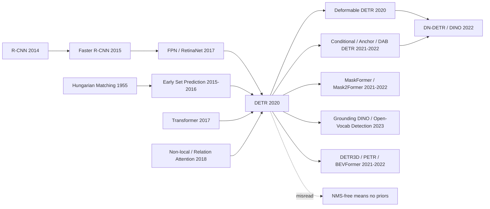

# DETR — Recasting Object Detection as Transformer Set Prediction

> **On May 26, 2020, Nicolas Carion, Francisco Massa, Gabriel Synnaeve, Nicolas Usunier, Alexander Kirillov, and Sergey Zagoruyko at Facebook AI uploaded [arXiv:2005.12872](https://arxiv.org/abs/2005.12872).** Object detection still spoke the language of anchors, proposals, RoI heads, feature pyramids, and non-maximum suppression. DETR made a stubbornly simple bet: treat the objects in an image as an unordered set, let 100 learned object queries emit all boxes in parallel, and use Hungarian matching so every ground-truth object claims exactly one prediction. It did not crush Faster R-CNN on COCO; small objects were plainly worse. But it changed what a detector could be: not a stack of detector-specific heuristics, but an end-to-end set-prediction model. Deformable DETR, DINO, Mask2Former, Grounding DINO, and much of modern open-vocabulary detection all walk through that door.

## TL;DR

Carion et al.'s ECCV 2020 DETR paper rewrites object detection from the proposal / anchor / NMS engineering pipeline inherited from [R-CNN (2014)](../era2_deep_renaissance/2014_rcnn.md) into a set-prediction problem. Given $N=100$ learned object queries, a Transformer decoder emits $\hat{y}=\{(\hat{p}_i,\hat{b}_i)\}_{i=1}^{N}$ in parallel, and Hungarian matching solves $\hat{\sigma}=\arg\min_{\sigma}\sum_i \mathcal{L}_{match}(y_i,\hat{y}_{\sigma(i)})$ so that each ground-truth object is assigned to exactly one prediction. On COCO, the R50 model reaches 42.0 AP with 41M parameters and 86 GFLOPs, matching a strengthened Faster R-CNN-FPN+ baseline at 42.0 AP. The same table exposes the trade-off: DETR loses 5.5 AP_S on small objects, gains about 7.7 AP_L on large ones, and needs a 500-epoch training schedule. Its lasting importance is not that the first version was strictly stronger. It proved that detection could drop anchors and NMS and still be competitive, extending the end-to-end [Transformer (2017)](../era3_attention/2017_transformer.md) worldview into dense visual recognition and setting up Deformable DETR, DINO, Mask2Former, and Grounding DINO.

---

## Historical Context

### Object detection was already strong in 2020, but not really end-to-end

When DETR appeared, object detection was not a field missing strong baselines. The opposite was true. After 2015, detection systems had become extremely mature: Faster R-CNN replaced selective search with RPNs, FPN solved much of multi-scale representation, Mask R-CNN extended boxes to instance masks, RetinaNet's focal loss made one-stage detectors competitive again, and FCOS / CenterNet brought anchor-free formulations to the foreground. On COCO, detectors were reliable enough for real applications, and libraries such as Detectron2 had standardized training, evaluation, and deployment.

That maturity came with a cost: object detection increasingly looked like an expert system powered by neural networks. A typical detector contained anchor shapes, anchor-to-ground-truth assignment rules, positive/negative sampling, RoIAlign, feature pyramids, box-regression parameterizations, score thresholds, NMS thresholds, and sometimes test-time augmentation. Many of those components were non-differentiable, and even the differentiable ones were not learned under one final task objective. Researchers often called detection end-to-end, but the phrase usually covered the backbone and head; proposal assignment, duplicate removal, and scale handling were still governed by hand-written rules.

DETR's question starts there: if machine translation could move from phrase tables and hand-engineered features to Transformers, could object detection move from anchors, proposals, and NMS to one learned mapping? The point was not to save a few lines of code. It was to shift detection's structural inductive bias from a hand-designed set of geometric heuristics to a model that learns a set of competing object slots.

### The Transformer wave had reached the edge of vision

The 2017 Transformer gave NLP a new default answer: once an input is represented as tokens, self-attention can model global relations directly. From 2018 to 2020, BERT, GPT-2, RoBERTa, T5, and GPT-3 scaled that paradigm. Vision was also testing attention: Non-local Networks, Attention Augmented ConvNets, and Image Transformer all suggested that convolution was not the only viable image operator.

But in May 2020, ViT had not yet become the standard visual backbone story, and Swin Transformer did not exist. Putting a Transformer into detection was not a matter of swapping the backbone. It had to answer a harder output-structure problem: an image contains a variable number of objects, the output has no canonical order, multiple boxes can heavily overlap, and the metric is sharply sensitive to localization. NLP sequence outputs have a natural order; detection outputs are sets.

That is why DETR's key move is not merely using a Transformer. It connects parallel Transformer decoding to a permutation-invariant set loss. Without Hungarian matching, 100 object queries would simply produce duplicate boxes. Without decoder self-attention, queries could not suppress one another. Without global encoder attention, the model would struggle to separate instances in crowded scenes. In DETR, the Transformer is not decoration; it is the structural device that carries the set-prediction constraint.

### FAIR's position: Detectron engineering meets NLP-style unification

The author mix is revealing. Francisco Massa and Alexander Kirillov were close to the FAIR / Detectron ecosystem and deeply familiar with Mask R-CNN, panoptic segmentation, COCO evaluation, and detector engineering. Gabriel Synnaeve and Nicolas Usunier came from a broader sequence-modeling and reinforcement-learning background. Sergey Zagoruyko had experience with residual and wide networks as well as practical implementation. In other words, this was neither a group of NLP researchers parachuting into CV nor a detector-only team tuning another head. It was a junction of two FAIR cultures: one knew exactly which detector components were hard to replace; the other believed general sequence models could absorb domain rules.

Meta's May 27, 2020 blog framed DETR as a step toward unifying NLP and computer vision. That framing matters. DETR did not primarily sell itself as a COCO leaderboard paper. It sold itself as an architectural-formulation paper. It could acknowledge the small-object and training-efficiency issues because the deeper claim was about how the detection problem should be expressed.

### The actual bet of the paper

DETR's bet can be compressed into one sentence: detection does not have to enumerate candidate boxes and then delete duplicates; it can directly output a set.

That sounds natural mathematically and dangerous in engineering. Set prediction has to solve three problems at once. First, output order is arbitrary, so the loss cannot require “prediction 7 matches object 7.” Second, prediction count is fixed while object count varies, so unused slots must learn a no-object class. Third, duplicate predictions must be penalized during training, or test-time NMS will still be needed. DETR handles the first and third issues with Hungarian matching, the second with the no-object class, and lets Transformer-decoder object queries handle communication among slots.

This is why the first DETR performance curve looks awkward: large objects improve, small objects worsen, and training is slow. It gives up many local and scale priors injected by FPNs and anchors in exchange for a more unified and extensible form. Deformable DETR, Conditional DETR, DAB-DETR, DN-DETR, and DINO all answer the same follow-up question: can we reintroduce the useful priors DETR discarded in a more learnable and less hand-engineered form?

## Background and Motivation

### The motivation was not “put a Transformer into detection”

If DETR is read only as “Transformers for object detection,” its contribution is easy to underrate. Around 2020, several works had already added attention blocks to CNN detectors: Relation Networks, non-local blocks, and attention augmented convolutions all improved performance in some settings. DETR was not satisfied with that local replacement, because adding attention still preserves the central assumption of the detector: generate many candidates first, then clean duplicates with NMS.

The pieces DETR really wanted to remove were the three most stubborn non-neural parts of the detection pipeline: anchor/proposal priors, heuristic assignment, and NMS post-processing. Its motivation was not “Transformers are stronger.” It was “can a Transformer decoder plus a set loss carry the structural constraints previously carried by those rules?” That is the meaning of End-to-End in the title: not merely that all layers are differentiable, but that final-set generation, duplicate suppression, and class/box selection are governed by one objective.

### The three problems the paper solves

First, DETR gives detection a clean set loss. Hungarian matching first creates a one-to-one assignment between predicted and ground-truth sets; classification and box-regression losses are then computed on that assignment. During training the model already knows that one object should be handled by one query, so duplicate boxes no longer need to be cleaned by NMS at test time.

Second, DETR makes object queries the central abstraction of the detector. They are not class embeddings and not anchor boxes. They are learnable slots. Each query competes with other queries through decoder self-attention, looks at image features through cross-attention, and finally decides whether to output an object. This abstraction later became a shared language across query-based detection and segmentation.

Third, DETR proves that this minimalist form is not a toy on COCO. The R50 model reaches 42.0 AP, matching a strengthened Faster R-CNN-FPN+ baseline; R101 and DC5 variants improve further; panoptic segmentation extends the same box decoder with a mask head. That gives follow-up work a clear coordinate: first-generation DETR is not the ceiling, but it is a strong enough alternative starting point.

---

## Method Deep Dive

### Overall framework

DETR can be described in one sentence: **a CNN extracts local visual features, a Transformer performs global set reasoning, and Hungarian loss aligns an unordered prediction set with an unordered ground-truth set.** It does not replace one Faster R-CNN module with a Transformer. It rewrites the detection pipeline as an image-to-set mapping.

| Module | Input | Output | Role |
|--------|-------|--------|------|
| CNN backbone | image $x \in \mathbb{R}^{3\times H_0\times W_0}$ | feature map $f \in \mathbb{R}^{C\times H\times W}$ | extract local texture, edges, parts, and semantic features |
| 1x1 projection + positional encoding | $f$ | token sequence $z_0 \in \mathbb{R}^{HW\times d}$ | project 2D features into Transformer width and restore spatial position |
| Transformer encoder | image tokens | contextual image memory | let every location see the whole image and separate instances early |
| Transformer decoder | $N=100$ object queries + image memory | $N$ object embeddings | let queries compete and read image evidence through cross-attention |
| FFN heads + Hungarian loss | object embeddings | class / box / no-object | predict the final set and match it one-to-one during training |

The counter-intuitive point is that DETR has no explicit “candidate boxes.” The 100 object queries are not 100 classes and not 100 anchors. They are closer to 100 learnable empty slots. Each slot may take responsibility for an object or may output no-object. During training, Hungarian matching decides which slot owns which ground-truth box; at test time, non-no-object slots are simply scored and ranked, with no NMS.

The difference from a traditional detector is easier to see component by component:

| Traditional detector component | Role in Faster R-CNN / RetinaNet | DETR replacement | Cost |
|--------------------------------|----------------------------------|------------------|------|
| Anchor / proposal | preset candidate geometries at each location | learned object queries + absolute box regression | weak scale prior, hurts small objects |
| Heuristic assignment | IoU thresholds or sampling rules define positives | one-to-one global Hungarian matching | sparse signal early in training |
| NMS | delete duplicate boxes at test time | loss already penalizes duplicate matches | relies on decoder communication to learn mutual exclusion |
| RoI crop / pooling | extract local features for each candidate region | cross-attention reads from global image memory | localization is harder but more unified |
| FPN multi-scale head | detect different object sizes on different feature levels | original DETR uses single-scale stride-32 / DC5 stride-16 | original AP_S is clearly lower |

### Design 1: Hungarian set loss — match first, supervise second

**Function**: change detection from “is this anchor positive?” into “what is the best one-to-one matching between the prediction set and the ground-truth set?” Let the ground-truth set be $y=\{y_i\}_{i=1}^{M}$ and the prediction set be $\hat{y}=\{\hat{y}_j\}_{j=1}^{N}$, where $N=100$ and $N>M$. The ground-truth set is padded to length $N$ with no-object entries. DETR first finds the lowest-cost permutation:

$$
\hat{\sigma}=\arg\min_{\sigma\in\Sigma_N}\sum_{i=1}^{N}\mathcal{L}_{match}(y_i,\hat{y}_{\sigma(i)})
$$

After matching, the Hungarian loss is computed on the matched pairs:

$$
\mathcal{L}_{Hungarian}(y,\hat{y})=\sum_{i=1}^{N}\left[-\log \hat{p}_{\hat{\sigma}(i)}(c_i)+\mathbf{1}_{c_i\neq\varnothing}\mathcal{L}_{box}(b_i,\hat{b}_{\hat{\sigma}(i)})\right]
$$

Here $\mathcal{L}_{box}$ is a linear combination of $\ell_1$ and generalized IoU. The classification term for the no-object class is down-weighted by a factor of 10 so that the many empty slots do not dominate the loss. The most important effect is not a single AP gain. It is that **duplicate boxes become a training-time problem**. If two queries try to predict the same object, Hungarian matching gives the ground-truth supervision to only one of them; the other is pushed toward no-object or another target.

A minimal training sketch looks like this:

```python
def detr_loss(pred_logits, pred_boxes, targets):
    cost_class = -pred_logits.softmax(-1)[:, targets.labels]
    cost_l1 = pairwise_l1(pred_boxes, targets.boxes)
    cost_giou = -generalized_iou(pred_boxes, targets.boxes)
    assignment = hungarian(cost_class + lambda_l1 * cost_l1 + lambda_giou * cost_giou)
    labels = make_no_object_labels(pred_logits, assignment, targets.labels)
    cls_loss = cross_entropy(pred_logits, labels, no_object_weight=0.1)
    box_loss = l1_and_giou(pred_boxes[assignment.pred], targets.boxes[assignment.gt])
    return cls_loss + box_loss
```

**Design motivation**: traditional detector assignment is local. Each anchor or proposal independently becomes positive or negative under IoU thresholds. DETR's assignment is global: all prediction slots compete for all ground-truth objects. This global competition makes “a set should not contain duplicates” part of the loss rather than an NMS patch after inference.

### Design 2: Object queries — turn “candidate boxes” into learnable slots

DETR's object queries are often misread as anchors under a new name. In the original DETR, queries have no preset center, width, height, or class. They are learned positional embeddings. Each query enters the decoder, attends to other queries through self-attention, attends to image memory through cross-attention, and is finally decoded by an FFN into a class and normalized box coordinates.

$$
q_k^{(0)}=e_k,\quad q_k^{(l+1)}=\operatorname{DecoderLayer}(q_k^{(l)},\{q_m^{(l)}\}_{m=1}^{N},\operatorname{Encoder}(x)),\quad \hat{y}_k=\operatorname{FFN}(q_k^{(L)})
$$

This gives object queries two meanings. Early in training they are only learnable indices. Later, they acquire soft spatial and scale preferences. The paper's slot analysis shows that different queries prefer different regions and box shapes, but not hard-coded categories: even though COCO contains almost no image with 24 giraffes of the same class, the model can still detect many same-class instances in a synthetic image. The queries have not simply memorized “how many of each class” to expect.

| Interpretation | Object query is not | Object query is closer to | Evidence |
|----------------|--------------------|---------------------------|----------|
| Class | not a car/person/dog embedding | a detection slot that can output any class | the same query may predict different classes in different images |
| Geometry | not a fixed anchor box | a slot with soft spatial/scale preference | slot visualizations show region and box-shape preferences |
| Sequence | not the k-th object in order | one candidate element in an unordered set | Hungarian loss is permutation-invariant |
| Later evolution | not the final answer | the starting point of query-based detection | DAB-DETR / DINO turn queries into dynamic anchor boxes |

**Design motivation**: object queries provide a differentiable interface for set prediction. The model needs capacity for “up to 100 objects” without first generating candidate boxes. Learned queries provide a fixed computation graph: 100 slots always exist, the loss decides which slots are active, and the decoder decides how those slots negotiate.

### Design 3: Transformer encoder-decoder — replace local candidate machinery with global attention

DETR's encoder first flattens the CNN feature map of size $H\times W$ into a token sequence. Because a Transformer is permutation-insensitive by itself, spatial positional encoding is mandatory; the paper's ablation shows that removing spatial position entirely drops AP from 40.6 to 32.8, a 7.8-point loss. The encoder's job is to let every image location see global context, encoding instance boundaries and object relations into memory before decoding.

The decoder has the more distinctive role. It does not autoregressively generate token 1, then token 2, then token 3 as in machine translation. It updates 100 queries in parallel at every layer. Self-attention among queries lets them know what others have claimed; cross-attention lets them fetch evidence from image memory. An auxiliary loss is attached after every decoder layer, forcing intermediate layers to predict objects as well. The paper reports an 8.2 AP cumulative improvement from the first to the last decoder layer.

The core attention computation remains the standard Transformer operation:

$$
\operatorname{Attention}(Q,K,V)=\operatorname{softmax}\left(\frac{QK^\top}{\sqrt{d}}\right)V
$$

But DETR changes what $Q$ means. In the encoder, $Q$ comes from image tokens. In decoder cross-attention, $Q$ comes from object queries while $K,V$ come from image memory. This is the step that hands “where should I look for a candidate region?” to query-to-image attention.

| Component | Effect when removed or weakened | Meaning |
|-----------|--------------------------------|---------|
| Encoder layers | 0 layers gives 36.7 AP; 6 layers gives 40.6 AP | global image reasoning mainly helps medium/large objects |
| Spatial positional encoding | no spatial position gives 32.8 AP | detection must know where things are; content-only attention is insufficient |
| Decoder depth | first to final layer adds +8.2 AP | multi-layer query communication gradually removes duplicates |
| FFN capacity | reducing Transformer FFNs costs about 2.3 AP | token mixing still needs enough per-token transformation |

**Design motivation**: traditional detectors explicitly tell the network “look here” through region proposals. DETR reverses the burden: image tokens first exchange information globally, then object queries learn where to attend. This is harder to train, but once it works, detection no longer needs an external rule for “where objects might be.”

### Design 4: Training recipe and scale cost — a simple architecture is not free

The easiest detail to miss in first-generation DETR is training cost. The short schedule is 300 epochs, and the main comparison uses 500 epochs; the public repository notes that 300 epochs take about six days on one 8-V100 machine. Compared with the usual 1x/3x/9x schedules for Faster R-CNN-style detectors, DETR needs far longer for its queries to learn localization, division of labor, and duplicate suppression.

$$
\mathcal{L}_{box}(b,\hat{b})=\lambda_{L1}\lVert b-\hat{b}\rVert_1+\lambda_{giou}\mathcal{L}_{GIoU}(b,\hat{b})
$$

Why so slow? One reason is sparse supervision. A dense detector produces many positive and negative anchors per image, so local regions receive abundant training signal. DETR usually sees only tens of objects per image, and most of the 100 queries are no-object. Another reason is weak scale prior. FPN gives small objects high-resolution features by design; original DETR uses a single stride-32 feature map, so some small-object information is already lost before the Transformer sees it.

| Version | GFLOPs / FPS | Params | AP | AP_S | AP_L | Observation |
|---------|--------------|--------|----|------|------|-------------|
| Faster R-CNN-FPN+ R50 | 180 / 26 | 42M | 42.0 | 26.6 | 53.4 | strong on small objects, many rules |
| DETR R50 | 86 / 28 | 41M | 42.0 | 20.5 | 61.1 | same overall AP, weak small objects, strong large objects |
| DETR-DC5 R50 | 187 / 12 | 41M | 43.3 | 22.5 | 61.1 | higher resolution, roughly double compute |
| DETR-DC5 R101 | 253 / 10 | 60M | 44.9 | 23.7 | 62.3 | strongest original configuration, still behind on small objects |

**Design motivation**: these costs explain DETR's influence. It did not win through hidden engineering tricks; it exposed its problems cleanly: slow convergence, weak small-object performance, and sparse matching. The core progress in the DETR family over the next three years mostly repaired those three points: deformable attention repaired multi-scale convergence, conditional / anchor queries repaired localization priors, and denoising / hybrid matching repaired sparse supervision. First-generation DETR's value is that it made the problem systematic enough to repair.

---

## Failed Baselines

### Faster R-CNN: the strongest baseline was not defeated

One of DETR's most honest features is that it does not turn Faster R-CNN into a straw man. The paper constructs a strengthened Faster R-CNN baseline: same data augmentation, longer 9x schedule, GIoU loss, and a highly optimized Detectron2 implementation. The result is not “Transformers immediately dominate detection.” DETR R50 and Faster R-CNN-FPN+ both reach 42.0 AP.

That matters. It means DETR's first-order contribution is not absolute accuracy but structural simplification. Traditional detectors had extremely strong local priors, especially FPN for small objects, anchors/proposals for early localization training, and NMS for duplicate removal. Those components carried years of engineering advantage on COCO. First-generation DETR removed them all at once and still matched the baseline, which was enough to show that set prediction was viable.

| Baseline / failed object | What DETR wanted to replace | Paper result | Remaining issue |
|--------------------------|-----------------------------|--------------|-----------------|
| Faster R-CNN-FPN+ | proposal + RoI + FPN + NMS | R50 ties at 42.0 AP | stronger on small objects, cheaper to train |
| Anchor-based one-stage | many default boxes + dense assignment | DETR competes without anchors | dense detectors converge faster |
| Earlier set predictors | RNNs emitting boxes sequentially | DETR's parallel decoder is more effective | first version still needs long training |
| Learnable / Soft NMS | learned post-processing | DETR removes duplicates during training | depends on decoder self-attention learning well |

### Early set prediction: the idea was right, the scale was not

DETR was not the first paper to cast detection as set prediction. Stewart et al.'s End-to-End People Detection in Crowded Scenes and Romera-Paredes's Recurrent Instance Segmentation had already used bipartite matching or recurrent decoders to emit instance sets. Their problem was not the idea; it was the engineering regime. The datasets were smaller, the baselines weaker, the decoders sequential, and the models not expressive enough to prove competitiveness on COCO-level detection.

DETR inherits two lessons from those failures. First, the loss must be permutation-invariant, or the model is punished for an arbitrary output order. Second, output elements must communicate, or duplicate predictions are inevitable. Choosing a Transformer decoder rather than an RNN decoder replaces “emit boxes one by one” with “let all slots negotiate in parallel.”

### NMS failed and succeeded at the same time

The paper's NMS analysis is unusually informative. The authors apply standard NMS to outputs from different decoder layers. At the first layer, NMS helps, because queries have not communicated enough and duplicate boxes are common. In later layers, query self-attention has learned to suppress duplicates and NMS's benefit vanishes. At the final layer, adding NMS slightly hurts AP because it removes some true positives.

This is not a simple slogan that “NMS is never needed.” The sharper conclusion is: **with enough decoder depth and auxiliary losses, the function of NMS can be internalized by attention.** But if the model is too shallow, under-trained, or query design is unstable, duplicate predictions return. DN-DETR, DINO, and hybrid matching matter because they make this internal duplicate suppression easier to learn.

### Small objects: original DETR's clearest weakness

The hardest failure case is small objects. DETR R50 reports 20.5 AP_S, while the strengthened Faster R-CNN-FPN+ baseline reports 26.6; even DETR-DC5, which changes the feature stride from 32 to 16, reaches only 22.5 AP_S. This is not noise. It follows directly from the architecture: original DETR lacks FPN-style multi-scale features, and much small-object detail is already compressed before features enter the Transformer.

| Issue | Symptom | Root cause | Later repair |
|-------|---------|------------|--------------|
| Weak small objects | DETR R50 AP_S 20.5 vs FPN+ 26.6 | single-scale stride-32 features | Deformable DETR multi-scale sparse attention |
| Slow convergence | main results use 500 epochs | one-to-one matching gives sparse supervision | Conditional / DAB / DN / DINO |
| Unstable query semantics | duplicates early in training | learned queries have no geometric prior | anchor query / dynamic anchor box |
| Many empty slots | most of 100 slots are no-object | severe class imbalance | no-object down-weighting + denoising queries |

These failures did not weaken DETR; they made it a research platform. The sign of a good paradigm is not that its first version has no flaws, but that the flaws are explicit enough to be repaired systematically.

## Key Experimental Data

### COCO detection: same AP, different error structure

The main experiment is COCO 2017 detection. The most important comparison is not the highest AP but the R50-to-R50 comparison: DETR R50 reaches 42.0 AP with 41M parameters, 86 GFLOPs, and 28 FPS; Faster R-CNN-FPN+ R50 reaches the same 42.0 AP with 42M parameters, 180 GFLOPs, and 26 FPS. DETR uses less compute and has similar speed, but the error profile changes completely: AP_S is 6.1 points lower and AP_L is 7.7 points higher.

| Model | GFLOPs / FPS | Params | AP | AP_S | AP_L |
|-------|--------------|--------|----|------|------|
| Faster R-CNN-FPN+ R50 | 180 / 26 | 42M | 42.0 | 26.6 | 53.4 |
| Faster R-CNN-R101-FPN+ | 246 / 20 | 60M | 44.0 | 27.2 | 56.0 |
| DETR R50 | 86 / 28 | 41M | 42.0 | 20.5 | 61.1 |
| DETR-DC5 R50 | 187 / 12 | 41M | 43.3 | 22.5 | 61.1 |
| DETR-DC5 R101 | 253 / 10 | 60M | 44.9 | 23.7 | 62.3 |

This table should be read as a diagnostic of paradigm replacement. If you look only at AP, DETR ties. If you look at AP_L, it shows the advantage of global attention on large objects and contextual relations. If you look at AP_S, it proves that multi-scale priors such as FPN were not disposable engineering leftovers.

### Ablation: every key design is actually doing work

The ablations show that DETR is not “just stack a Transformer.” Encoder depth, positional encoding, decoder depth, GIoU, and auxiliary losses all matter. The “no spatial positional encoding gives 32.8 AP” row is especially important: it refutes the common misunderstanding that Transformers automatically understand 2D geometry. Position must be injected explicitly.

| Ablation | Result | Interpretation |
|----------|--------|----------------|
| Encoder 0 layers | AP 36.7, AP_L 54.2 | without global image reasoning, large objects suffer most |
| Encoder 6 layers | AP 40.6, AP_L 60.2 | global context helps instance separation |
| No spatial positional encoding | AP 32.8 | detection must preserve position |
| L1 only, no GIoU | AP 35.8 | box scale invariance is insufficient |
| GIoU + L1 | AP 40.6 | the two box losses complement each other |

These numbers show that DETR's simplicity is not an aesthetic claim that “less is more.” It places a small number of structural parts in critical positions: set matching handles duplicate removal, positional encoding handles geometry, the encoder handles global scene context, the decoder handles slot competition, and GIoU handles localization quality.

### Training and implementation: simple code, expensive optimization

The DETR repository says inference can be written in 50 lines of PyTorch. That line was memorable for a reason. Without anchor generators, proposal samplers, RoIAlign, or class-specific NMS, the forward pass for one image does look more like an ordinary neural network.

Training is not equally simple. The original model needs a long schedule: 300 epochs for the short setting and 500 epochs for the main comparison. The repository reports that 300 epochs take about six days on one 8-V100 machine; the paper reports about three days on 16 V100s. DETR lowers inference and architectural complexity, but transfers part of the difficulty into optimization and training time.

### Panoptic segmentation: set prediction naturally extends to masks

DETR's panoptic result is easy to under-appreciate. The paper does not stop at box detection; it adds a mask head on top of decoder outputs and treats things and stuff as a unified set of mask predictions. Each pixel is assigned by argmax over mask scores, so overlapping-mask post-processing conflicts disappear naturally.

| Model | Backbone | PQ | PQ_th | PQ_st | Mask AP |
|-------|----------|----|-------|-------|---------|
| PanopticFPN++ | R50 | 42.4 | 49.2 | 32.3 | 37.7 |
| UPSNet-M | R50 | 43.0 | 48.9 | 34.1 | 34.3 |
| PanopticFPN++ | R101 | 44.1 | 51.0 | 33.6 | 39.7 |
| DETR R50 | R50 | 43.4 | 48.2 | 36.3 | 31.1 |
| DETR-R101 | R101 | 45.1 | 50.5 | 37.0 | 33.0 |

The interesting part is that DETR's thing mask AP is not high, yet it competes or leads in PQ, especially PQ_st. The paper suggests global reasoning is especially useful for stuff classes. This foreshadows MaskFormer and Mask2Former: segmentation does not have to remain per-pixel classification; it can be query-to-mask set prediction.

---

## Idea Lineage

### Before: from candidate regions to set prediction

DETR has two pre-histories. The first is the engineering evolution of object detection itself. R-CNN brought ImageNet CNN features into region proposals; Fast/Faster R-CNN learned shared features and proposal generation; FPN, RetinaNet, and FCOS made multi-scale and dense detection highly mature. That line kept moving toward “more accurate, faster, fewer stages,” but it never really abandoned candidate boxes and post-processing.

The second line is set prediction and attention. Hungarian matching had long been the standard tool for assignment problems. Stewart et al.'s crowded-scene detector and Romera-Paredes's recurrent instance segmentation had already tried to output sets of instances directly. Non-local Networks and Relation Networks showed that object relations could be modeled by attention-like operations. The Transformer supplied a scalable parallel decoder. DETR's originality is combining those lines: use a Transformer to model relations among object slots, and use Hungarian loss to handle permutation and duplicate removal.

| Prior idea | Representative work | What DETR inherited | What DETR changed |
|------------|---------------------|---------------------|-------------------|
| Region-based detection | R-CNN / Faster R-CNN | strong COCO discipline and box/class heads | no proposal or RoI crop dependency |
| Dense one-stage detection | YOLO / SSD / RetinaNet / FCOS | the goal of one-pass efficiency | no dense anchors or grid centers |
| Multi-scale feature prior | FPN / EfficientDet | the fact that small objects need scale information | weakened in the first version, repaired later |
| Set prediction loss | Stewart 2016 / recurrent instances | permutation-invariant matching | changes sequential RNN decoding into parallel Transformer decoding |
| Global attention | Non-local / Transformer | global relation modeling | puts attention at the detector's output structure |

### Present: how the DETR family repaired the first version

The most important DETR successors were rarely “add a bigger backbone.” They attacked the first version's three defects: slow convergence, weak small objects, and queries without geometric priors.

Deformable DETR is the most direct repair. Each query attends to a small set of sampled points over multi-scale feature maps, turning global dense attention into sparse learnable sampling. This recovers FPN-like scale information and greatly accelerates convergence. Conditional DETR, Anchor DETR, and DAB-DETR work on the spatial meaning of queries: instead of asking queries to learn geometry from scratch, they inject reference points or dynamic anchor boxes. DN-DETR and DINO go further by adding denoising queries and stronger query selection, so training is not supported only by sparse one-to-one matching.

This lineage reveals a subtle fact: many priors DETR removed were not wrong; their original implementation was too hand-engineered. Successful follow-ups did not simply return to traditional detectors. They rewrote scale, position, and dense supervision as learnable modules.

### Lateral influence: query-based vision beyond detection

DETR's influence on segmentation may be even more direct than its influence on box detection. MaskFormer rewrites semantic segmentation as mask classification: the model predicts a set of mask queries, and each query owns a region, rather than classifying every pixel independently. Mask2Former strengthens this line with masked attention and becomes a unified framework for semantic, instance, and panoptic segmentation. The move is exactly DETR-like: the output is a set of object-like elements, not a local decision at every pixel or anchor.

In open-vocabulary detection, GLIP, OWL-ViT, and Grounding DINO combine DETR / DINO-style query detectors with language alignment, making it possible to detect objects described by text. In autonomous driving, DETR3D, PETR, and BEVFormer turn queries into 3D reference points or BEV slots. By 2023-2025, query had grown from 100 detection slots in the DETR paper into a general object interface for visual systems.

### Mermaid lineage graph



### Common misread: NMS-free does not mean prior-free

The most common misread of DETR is that it proves priors are useless. The opposite is closer to the truth. First-generation DETR became weak on small objects and slow to converge precisely because it removed too many priors at once. The real lesson is not “delete all rules,” but “rewrite rules as training objectives and learnable structure.” Hungarian matching is still a strong prior: one object receives one match. Object queries are still a strong prior: the model emits a fixed number of slots. Positional encoding is still a strong prior: it tells the model that 2D geometry exists.

A second misread is that DETR is simply a Transformer victory. More precisely, it is the joint victory of a set loss and a Transformer decoder. A Transformer backbone alone does not remove NMS. Hungarian loss alone does not guarantee that queries learn mutual exclusion. DETR's place in intellectual history is the intersection of the two.

### The one-sentence inheritance chain

The R-CNN family proved that detection can run on deep features; FPN, RetinaNet, and FCOS polished detector engineering into high performance; the Transformer supplied global parallel modeling; Hungarian matching supplied set supervision. DETR fused those threads into a new problem statement: **object detection is not candidate-box filtering, but object-set generation.** Deformable DETR and DINO made that statement efficient; Mask2Former and Grounding DINO showed that it belongs not only to COCO boxes, but to broader visual object modeling.

---

## Modern Perspective

### Assumptions that no longer hold

Looking back from 2026, DETR's durable contribution is the problem reformulation; the least durable parts are several assumptions embedded in the first implementation.

First, **“pure learned queries are enough”** is only partly true. Original object queries are elegant, but they converge slowly and their localization semantics are unstable. DAB-DETR, DINO, and related successors put reference points or dynamic anchor boxes back into the query. Geometry priors still matter; they should be learnable state rather than a hand-written anchor list.

Second, **“single-scale global attention can replace FPN”** does not hold. COCO AP_S already showed that small objects need high-resolution and multi-scale paths. Deformable DETR's success confirms that queries should sparsely sample multi-scale features, not only attend to stride-32 memory.

Third, **“one-to-one matching is efficient enough by itself”** also fails. Hungarian matching gives a beautiful set definition, but supervision is sparse. DN-DETR, DINO, H-DETR, and CO-DETR strengthen training with denoising, hybrid matching, and auxiliary one-to-many assignments. End-to-end form still needs a richer optimization scaffold.

| Original assumption | 2026 judgment | Evidence | Modern correction |
|--------------------|---------------|----------|------------------|
| learned queries can learn geometry from scratch | partly true | works but converges slowly | reference points / dynamic anchors |
| single-scale feature memory is enough | false | AP_S remains weak | multi-scale deformable attention |
| NMS-free removes all duplicate issues | partly true | shallow layers still duplicate boxes | deeper decoder + denoising + hybrid matching |
| detection only needs fixed-class softmax | expanded | open-vocabulary demand rises | text-conditioned detection / grounding |
| Transformer detectors are mainly box models | expanded | segmentation/query masks become more successful | MaskFormer / Mask2Former / SAM pipelines |

### If DETR were rewritten today

A 2026 rewrite of DETR would probably not start with ResNet-50 plus a single-scale Transformer decoder. It would look closer to DINO or Grounding DINO: a strong pretrained backbone, multi-scale deformable attention, reference-point queries, denoising training, hybrid one-to-one / one-to-many assignment, and perhaps a text-conditioned or mask head.

That “modern DETR” would not betray the original paper. It would industrialize the form proposed by the original. The core remains set output: every object, mask, or text phrase is represented by a query; matching and attention decide how the queries divide labor; post-processing rules are minimized.

### Lessons still worth learning

DETR's most important lesson is that **a good research paradigm re-exposes the problem**. Traditional detectors spread duplicate removal, small-object handling, scale, assignment, and post-processing across different modules. DETR concentrates them inside set loss and a query decoder. The first version does not have to be stronger; it gives follow-up work clear coordinates.

The second lesson is that simplicity is not the same as having no priors. DETR looks simple because it compresses priors into a few critical parts: Hungarian matching, no-object class, object queries, positional encoding, and auxiliary losses. For new models, the real question is not “should we use priors?” but “should the prior be a fixed rule or a learnable structure?”

The third lesson is that end-to-end does not mean solved on the first try. DETR's end-to-end definition is beautiful, but first-generation training was expensive and small-object performance weak. It took three years of follow-up work to make the family a strong detector. End-to-end paradigms often win first in problem formulation, then later in engineering detail.

### Modern influence table

| Direction | What it inherits from DETR | Representative successors | Improvement |
|-----------|---------------------------|---------------------------|-------------|
| Efficient detection | set prediction + queries | Deformable DETR / DINO / RT-DETR | multi-scale, fast convergence, real-time deployment |
| Unified segmentation | query-to-mask set prediction | MaskFormer / Mask2Former | unifies semantic / instance / panoptic segmentation |
| Open vocabulary | query detector + language grounding | GLIP / OWL-ViT / Grounding DINO | text-conditioned classes and phrase grounding |
| Autonomous driving | object queries as 3D / BEV slots | DETR3D / PETR / BEVFormer | multi-view 3D and temporal BEV representation |
| Interactive vision | object slots as prompt interface | SAM pipelines with Grounding DINO | chain detection, segmentation, and text prompts |

## Limitations and Future Directions

### Original limitations

DETR's limitations are explicit. First, small-object performance is weak because the feature map is single-scale and low-resolution. Second, convergence is slow because one-to-one matching gives sparse supervision. Third, fixed 100 queries and fixed COCO classes are not enough for open-world recognition. Fourth, global Transformer attention is expensive on high-resolution features. Fifth, object queries are only weakly interpretable: they have spatial preferences, but they are not stable controllable interfaces.

Most of these limitations have been partly addressed, but not erased. Deformable DETR accelerates convergence but introduces more complex attention sampling. DINO becomes much stronger, but the training recipe is heavier. Grounding DINO expands to language, but depends on larger-scale pretraining and data curation. DETR's problems were not destroyed; they moved from a clean first-generation model into larger system engineering.

### Future directions

The most important future directions for DETR-like models fall into three groups. The first is open world: a query should align not only to COCO classes, but also to text, masks, 3D boxes, track IDs, and relations. The second is data efficiency: how to train stable object queries with little or weak annotation, rather than relying on large detection labels. The third is controllability: make queries user-specifiable, editable, and trackable object interfaces rather than hidden model variables.

If these directions keep progressing, DETR's final influence may not be merely “detection without NMS.” It may be a unified object-level API for vision models: a set of slots corresponds to a set of visual entities, and each entity can be classified, segmented, tracked, grounded to language, or placed in 3D space.

## Related Work and Insights

### Related-work lineage

DETR's closest related work is the R-CNN / Faster R-CNN / FPN / RetinaNet / FCOS detection line. Its more abstract relatives are Transformer, Hungarian matching, set prediction, and non-local attention. Its successors split into several families: Deformable DETR handles multi-scale convergence, Conditional/Anchor/DAB handle query geometry, DN/DINO handle training signal, MaskFormer/Mask2Former move queries to masks, and Grounding DINO/GLIP connect queries to language.

The broader research lesson is: do not only ask “can I put this general architecture into this domain?” Ask “which hand-written rules in this domain are actually expressing structural constraints, and can the constraints be learned through loss and architecture?” DETR's success is not a branding victory for Transformers. It is a victory of task reformulation.

### Research lessons for today

First, find a task that has been covered by engineering rules for too long, and state the structure behind those rules clearly. Second, do not fear a first version that exposes flaws; if the flaws are concentrated, interpretable, and repairable, the paradigm can keep growing. Third, evaluate a new paradigm beyond a single number. DETR's 42.0 AP tie looked modest, but the AP_S/AP_L split already told future researchers exactly what to repair.

## Resources

### Recommended reading

| Type | Resource | Why it matters |
|------|----------|----------------|
| Paper | [End-to-End Object Detection with Transformers](https://arxiv.org/abs/2005.12872) | original arXiv / ECCV 2020 paper |
| Code | [facebookresearch/detr](https://github.com/facebookresearch/detr) | official PyTorch code, model zoo, Colab |
| Official explainer | [Meta AI blog](https://ai.meta.com/blog/end-to-end-object-detection-with-transformers/) | non-technical release framing from May 2020 |
| Key successor | [Deformable DETR](https://arxiv.org/abs/2010.04159) | first major successor fixing small objects and convergence |
| Modern system | [Grounding DINO](https://arxiv.org/abs/2303.05499) | representative combination of DETR/DINO ideas with text grounding |

### Reproduction advice

If the goal is understanding DETR, do not begin by training the full model. Start with the official Colab or a torch hub pretrained model, and inspect decoder attention and the 100 query outputs. For actual training, start from a modern Deformable DETR or DINO implementation, because the original 500-epoch schedule is unfriendly for individual reproduction. A good reading order is: the DETR method and Table 1, Deformable DETR's multi-scale attention, DAB/DN/DINO's query and training tricks, then Mask2Former / Grounding DINO to see how queries extend to masks and language.


---

> 🌐 [中文版](/era4_foundation_models/2020_detr/) · 📚 awesome-papers project · CC-BY-NC