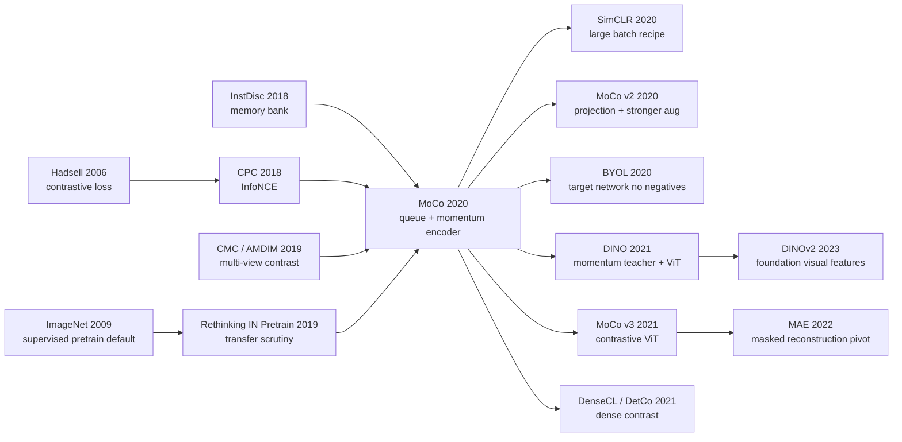

# MoCo: Queues, Momentum Encoders, and the Moment Vision Self-Supervision Became Transferable

> In November 2019, [MoCo](https://arxiv.org/abs/1911.05722) asked a deceptively sharp question: if contrastive vision learning is just dictionary lookup, why should the dictionary be only one mini-batch wide, or a full-dataset memory bank full of stale features? Kaiming He, Haoqi Fan, Yuxin Wu, Saining Xie, and Ross Girshick answered with a 65,536-entry queue and a key encoder updated by $m=0.999$ momentum. The paper did not invent a glamorous new pretext task; it made the old instance-discrimination game stable, scalable, and transferable. That is why MoCo mattered: it moved self-supervised vision from "can we get a decent ImageNet linear number?" to "can an unlabeled representation beat supervised pre-training on real detection and segmentation tasks?"

## TL;DR

MoCo, published at CVPR 2020 by Kaiming He, Haoqi Fan, Yuxin Wu, Saining Xie, and Ross Girshick, recast contrastive visual self-supervision as **dynamic dictionary lookup**. A query $q$ is trained with InfoNCE, $\mathcal{L}_q=-\log \frac{\exp(q\cdot k_+/\tau)}{\sum_i\exp(q\cdot k_i/\tau)}$, but the dictionary is not limited to the current mini-batch and is not a stale full-dataset memory bank. It is a FIFO queue, while the key encoder is updated slowly by $\theta_k\leftarrow m\theta_k+(1-m)\theta_q$. That one engineering move solved two losing baselines at once: end-to-end in-batch contrast was capped by what an 8-GPU machine could fit, and memory banks could hold many negatives but mixed features from many encoder ages. MoCo v1 reached 60.6% ImageNet linear top-1 with a standard ResNet-50, and more importantly beat supervised ImageNet pre-training on seven downstream detection/segmentation tasks. Its hidden lesson is not “invent a better pretext task”; it is “make the negative dictionary both large and consistent.” [SimCLR](2020_simclr.md) soon showed that huge batches could remove the queue, [MoCo v2](https://arxiv.org/abs/2003.04297) absorbed SimCLR-style projection heads and augmentation to reach 71.1%, and [MAE](2022_mae.md) later showed the same FAIR line pivoting from contrastive dictionaries to masked reconstruction.

---

## Historical Context

### Late 2019: vision self-supervision had BERT envy

When MoCo appeared, NLP had already been reorganized by BERT. The 2018 BERT paper made “pre-train on unlabeled data, then adapt with labels” the default recipe. Computer vision wanted the same moment, but by 2019 visual self-supervision still had not produced an answer sturdy enough for everyday use.

Supervised ImageNet pre-training was still the dependable industrial starting point. Detection, segmentation, keypoint estimation, long-tail instance segmentation: the routine was to pre-train a ResNet on ImageNet-1k labels and fine-tune. The catch was that this pipeline was shaped by a closed 1,000-class label space. It learned strong features, but those features were still molded by classification labels. Unlabeled images were far more abundant, from Instagram to Flickr to the open web, yet the field lacked a mechanism that could reliably turn those images into general visual representations.

MoCo's historical role sits right there. It did not claim that the “BERT for vision” had fully arrived; it installed a crucial piece of infrastructure. It turned contrastive learning from a collection of incompatible pretext tricks into a tunable, transferable representation-learning framework that could be trained on larger unlabeled data and evaluated in real detection and segmentation systems.

### The four pre-MoCo routes were all unstable in different ways

From 2014 to 2019, visual self-supervision roughly followed four routes.

- **Pretext-task route**: context prediction, jigsaw, rotation, colorization. Elegant, but often forced the model to solve an artificial game; ImageNet linear eval and downstream transfer were weak.
- **Generative route**: autoencoders, BiGAN, BigBiGAN. These could reconstruct or generate images, but pixel-level objectives cared too much about texture and color and not enough about recognition semantics.
- **Clustering route**: DeepCluster, LocalAgg. These could create pseudo-labels, but the training loop required repeated clustering and was awkward to operate.
- **Contrastive route**: InstDisc, CPC, AMDIM, CMC. This had the cleanest math, “pull positives together and push negatives apart,” but it stumbled on dictionary maintenance: mini-batches were too small, while memory banks were too stale.

MoCo was the engineering answer to the fourth route. It shifted the contribution away from inventing yet another pretext task and asked a simpler question: if all these methods are doing dictionary lookup, how should the dictionary be built? The answer had two conditions: **large enough, and consistent enough**.

### Direct predecessors: InstDisc, CPC, CMC, and Rethinking ImageNet Pre-training

MoCo's lineage is unusually legible.

InstDisc / NPID (Wu et al., CVPR 2018) treated every image as its own class and stored training-sample features in a memory bank. That solved the negative-count problem, but created a new one: memory-bank features were computed at many different points in training, so they came from inconsistent encoder states. MoCo inherited the instance-discrimination task but replaced the full memory bank with a shorter-lived queue.

CPC (van den Oord et al., 2018) supplied the InfoNCE loss; CMC (Tian et al., 2019) and AMDIM (Bachman et al., 2019) showed that multi-view contrast could learn visual semantics. MoCo did not overturn that math. It placed the same contrastive logic inside standard ResNet-50 pre-training and standard detection transfer pipelines, asking whether this could become general-purpose visual pre-training.

One internal predecessor is easy to miss: Kaiming He, Ross Girshick, and Piotr Dollar's 2019 *Rethinking ImageNet Pre-training*. That paper reminded the field that, on large detection datasets such as COCO, training from random initialization for long enough could approach supervised pre-training. Therefore the meaningful question was not just “does linear eval look good?” but “does the pre-trained representation actually transfer under controlled fine-tuning schedules?” MoCo inherits that evaluation philosophy. Its most powerful result is not the 60.6% linear number; it is beating supervised pre-training across seven detection/segmentation tasks.

### Why the FAIR team mattered

The author list is telling. Kaiming He, Ross Girshick, and Saining Xie represented the core 2015-2019 engineering stack of visual backbones, detection, and segmentation. Yuxin Wu was central to Detectron2 and large-scale vision training infrastructure. Haoqi Fan worked across video, visual pre-training, and scalable systems.

That explains the paper's tone. MoCo is not mainly a “new loss function” paper; it is a paper about putting self-supervision into real visual systems. It cares about whether the queue trains, whether BatchNorm leaks shortcuts, whether VOC/COCO/LVIS/Cityscapes transfer improves, and whether a noisy Instagram-1B data source can be used. This evaluation mindset separates MoCo from many self-supervised papers that reported only ImageNet linear accuracy.

## Background and Motivation

### Why large dictionaries and consistency conflict

Contrastive learning needs negatives. More negatives make it harder for the model to win with local shortcuts and make it more likely to learn discriminative semantic boundaries. But images are not word tokens; there is no natural discrete vocabulary. The “dictionary” only exists after an encoder maps images into feature space, and that encoder changes during training.

This creates MoCo's central conflict:

- **End-to-end mini-batch**: all keys are produced by the current encoder, so they are consistent; but dictionary size is limited by batch size. In the paper, even a high-end 8-GPU 32GB Volta machine could only afford batch 1024, and large-batch optimization was fragile.
- **Memory bank**: can store many, even dataset-scale, negatives; but each sample was encoded at a different time, so the features come from many historical encoders. The dictionary is large but inconsistent.

MoCo's queue plus momentum encoder is designed exactly for that conflict. The queue makes the dictionary large; the momentum encoder keeps keys from adjacent mini-batches from being encoded by wildly different networks. It is not theoretically pure. It is operationally faithful enough that every comparison made during training remains meaningful.

### Why MoCo did not invent another pretext task

MoCo deliberately uses plain instance discrimination: two augmentations of the same image are positives, different images are negatives. That choice matters because it shifts attention from task design to mechanism design.

If MoCo had also introduced a complex pretext task, readers could not tell whether the gain came from the task, the loss, dictionary size, or encoder maintenance. Instead, the paper fixes the task to the simplest one, fixes the loss to InfoNCE, fixes the backbone to standard ResNet, and compares only three mechanisms: end-to-end, memory bank, and MoCo. The conclusion is clean: **60.6% did not come from a more elaborate task; it came from finally making the dynamic dictionary both large and consistent**.

That is why MoCo became infrastructure. MoCo v2 could absorb SimCLR's projection head and stronger augmentation; MoCo v3 could move to ViTs; DenseCL and DetCo could push contrast from image-level features toward dense prediction. The original paper left behind not a fixed task, but a training skeleton whose components could be replaced.

---

## Method Deep Dive

### Overall framework

MoCo can be compressed into one sentence: **treat contrastive learning as a $(K+1)$-way dictionary lookup problem, then use a queue and a momentum encoder to make the dictionary both large and reasonably consistent**.

During training, the same image is randomly augmented twice to create $x^q$ and $x^k$. The query encoder $f_q$ produces $q=f_q(x^q)$; the key encoder $f_k$ produces $k=f_k(x^k)$, the positive key. Negatives come from a length-$K$ queue containing key representations from recent mini-batches. Each step backpropagates only through $f_q$, updates $f_k$ by exponential moving average, enqueues the current batch of keys, and dequeues the oldest keys.

| Component | MoCo v1 setting | Why it matters |
|---|---|---|
| Backbone | ResNet-50 / ResNeXt / wider ResNet | not customized for the pretext task, easy to transfer to detection/segmentation |
| Pretext task | instance discrimination | two views of one image are positives; different images are negatives |
| Dictionary | FIFO queue, main $K=65536$ | negative count is decoupled from batch size |
| Key encoder | momentum update, default $m=0.999$ | key representations drift slowly across queue entries |
| Loss | InfoNCE with temperature $\tau$ | softmax over one positive and $K$ negatives |
| IN-1M training | batch 256, 8 GPUs, 200 epochs | about 53 hours for ResNet-50 |
| Evaluation | ImageNet linear + downstream fine-tuning | the real value is transfer, not linear eval alone |

### Key designs

#### Design 1: InfoNCE as dictionary lookup — writing self-supervision as classification

**Function**: Given a query $q$, one positive key $k_+$, and $K$ negative keys, the model must identify the positive among $K+1$ candidates. Similarity is dot product, and temperature $\tau$ controls softmax sharpness.

$$
\mathcal{L}_q = -\log \frac{\exp(q\cdot k_+ / \tau)}{\sum_{i=0}^{K}\exp(q\cdot k_i / \tau)}
$$

The beauty of this formula is that it needs no image labels. Labels are created by augmentation: two views of the same image form the only positive pair, while all other images are negatives. MoCo was not the first vision paper to use InfoNCE, but it made the bottleneck explicit: the loss is not the hard part; the hard part is deciding which keys enter the softmax at every step.

**Design rationale**: Early pretext tasks often trapped models inside artificial games. InfoNCE directly optimizes separability in representation space. It lets different tasks, backbones, and data scales share one objective, which is why MoCo became a framework rather than a one-off trick.

#### Design 2: FIFO queue — decoupling dictionary size from batch size

**Function**: Encode the current mini-batch keys, enqueue them, and dequeue the oldest keys. Each batch computes only $N$ new keys but contrasts against $K$ stored historical keys.

| Mechanism | Dictionary size | Consistency | Main problem |
|---|---|---|---|
| End-to-end in-batch | limited by batch size, about 1024 max in the paper | high, current encoder | GPU memory and large-batch optimization are hard |
| Memory bank | can approach dataset scale | low, features come from many past encoders | stale features make comparisons unreliable |
| **MoCo queue** | can be set to 65,536 and beyond | medium-high, queue lifetime is short | needs a momentum encoder to control drift |

The queue is not merely “more negatives.” It moves the memory bottleneck out of the mini-batch. SimCLR solved negative count with batch 4096; MoCo solved it with batch 256 plus a queue. In 2020, that made MoCo easier to reproduce on ordinary multi-GPU machines and easier to transplant into video, detection, medical imaging, and other settings.

**Design rationale**: Images occupy a continuous high-dimensional space. With too few negatives, the representation can separate images only coarsely. With many negatives, the feature space is forced to spread out. A queue is a cheap approximation: not a full dictionary, but enough to cover many more image instances.

#### Design 3: Momentum encoder — preventing historical keys from going stale too fast

**Function**: The key encoder is not directly updated by backpropagation. It follows the query encoder by exponential moving average:

$$
\theta_k \leftarrow m\theta_k + (1-m)\theta_q
$$

where $m\in[0,1)$ and the default is $m=0.999$. Intuitively, $f_q$ is the fast student, updated by gradients every step; $f_k$ is the slow teacher, updated only by momentum. Queue entries come from several recent mini-batches. They are not encoded at the same step, but if $f_k$ changes slowly enough, those keys remain approximately consistent.

| Momentum $m$ | 0 | 0.9 | 0.99 | 0.999 | 0.9999 |
|---|---|---|---|---|---|
| ImageNet linear top-1 | fail | 55.2 | 57.8 | **59.0** | 58.9 |

This is one of MoCo's most self-validating ablations. With no momentum, the training loss oscillates and fails; $m=0.9$ degrades heavily; only $m=0.99$ to $0.9999$ enters the stable range. In other words, MoCo's queue works not because “older negatives are always better,” but because older negatives are produced by a deliberately slow-moving encoder.

**Design rationale**: The memory bank's flaw is feature-level staleness. MoCo does not try to store a more precise history for every sample. It slows down the function that creates historical keys. That is a very engineering-minded solution: do not enforce strict synchronization; just make distribution drift small enough.

#### Design 4: Shuffling BatchNorm — closing an almost invisible cheating channel

**Function**: In multi-GPU training, MoCo shuffles samples on the key branch so the key encoder's BatchNorm statistics cannot reveal which query and key came from the same sub-batch. After the forward pass, the features are unshuffled to restore positive-pair alignment.

The paper found that without this fix, the model could drive pretext-task training accuracy above 99.9% while the kNN monitor of representation quality dropped. That means the network had discovered a non-semantic shortcut: use batch-statistics signatures to identify positives rather than image content.

**Design rationale**: This matters especially in MoCo because query and key images enter training as pairs. BatchNorm's cross-sample communication can leak pairing information. Shuffling BN is not mainly about buying one point of accuracy; it protects the contrastive task from a hidden side channel.

### Loss function and training strategy

MoCo v1's pseudocode is short: backpropagate the query encoder, update the key encoder slowly, and roll the queue forward.

```python
def moco_step(images, f_q, f_k, queue, momentum=0.999, temperature=0.07):
    x_q = augment(images)
    x_k = augment(images)

    q = normalize(f_q(x_q))
    with torch.no_grad():
        shuffle_for_batchnorm(x_k)
        k = normalize(f_k(x_k))
        undo_shuffle(k)

    positive = (q * k).sum(dim=1, keepdim=True)
    negative = q @ queue.T
    logits = torch.cat([positive, negative], dim=1) / temperature
    labels = torch.zeros(len(images), dtype=torch.long, device=images.device)
    loss = F.cross_entropy(logits, labels)

    loss.backward()
    optimizer.step()                 # update f_q only
    ema_update(f_k, f_q, momentum)    # update f_k slowly
    queue.enqueue(k.detach())
    queue.dequeue_oldest()
    return loss
```

Several training details made MoCo reproducible:

- **IN-1M pre-training**: batch 256, 8 GPUs, initial learning rate 0.03, SGD momentum 0.9, weight decay 0.0001, 200 epochs, learning-rate drops at epochs 120 and 160.
- **Linear eval**: freeze the backbone and train only a fully connected classifier for 100 epochs; the classifier learning rate is grid-searched to 30, with weight decay 0.
- **IG-1B pre-training**: about 940M Instagram images, 64 GPUs, batch 1024, 1.25M iterations. The paper admits the IG-1B gain is consistent but modest, meaning instance discrimination had not yet fully exploited ultra-large noisy data.

The method-level essence is that MoCo keeps complexity in the training mechanism and leaves deployment clean. After pre-training, the queue, key encoder, and contrastive head can be thrown away. Downstream systems use ordinary ResNet features, which is why MoCo fit so naturally into real visual pipelines.

---

## Failed Baselines

### Mechanism baseline 1: end-to-end in-batch negatives lost because the dictionary was too small

End-to-end contrastive learning is the most natural design: both query and key encoders are updated by backpropagation, and all keys come from the current mini-batch, so the dictionary is perfectly consistent. Its problem is equally direct: dictionary size equals batch size. In the MoCo paper, even a high-end 8×32GB Volta machine could only afford batch 1024; beyond memory, large-batch SGD itself needed linear learning-rate scaling and had no guarantee of extrapolating to 65,536-scale negatives.

This baseline is not algorithmically wrong. It pushes the representation-learning problem onto hardware. SimCLR later showed that, with batch 4096/8192 plus LARS/TPUs, the in-batch route can be extremely strong. But under MoCo's setting, end-to-end contrast could not provide a large enough dictionary, so it became a failed route capped by compute.

### Mechanism baseline 2: memory bank lost because it was large but stale

The memory bank appears to solve negative count perfectly: store a feature for every sample and draw negatives from the global bank. InstDisc took exactly this route. MoCo's critique is that the memory bank buys size by sacrificing consistency. Each sample was encoded at a different time, so the bank mixes features produced by many historical encoders; the current query is compared with features from different training ages.

The paper gives a clean number: under the same instance-discrimination task, the same InfoNCE loss, and $K=65536$, an improved memory-bank implementation reaches 58.0%, while MoCo reaches 60.6%, a 2.6-point gap. That gap is almost the price of consistency.

| Mechanism | Representative setting | ImageNet linear top-1 | Where it loses |
|---|---|---|---|
| End-to-end | current batch negatives, about 1024 max | close to MoCo at small $K$ | negative count capped by memory and optimization |
| Memory bank | InfoNCE, $K=65536$ | 58.0% | features come from many historical encoders |
| **MoCo** | queue, $K=65536$, $m=0.999$ | **60.6%** | requires an extra key encoder and queue mechanism |

### Competitors beyond mechanism: pretext, generative, and special architectures

MoCo did not have the highest ImageNet linear number in its table. CPC v2, CMC, and AMDIM large could exceed 60.6% in some settings. But those methods often used bigger networks, special input decompositions, or more complex multi-view / patch-level structures. MoCo's central comparison was not “who is highest?” but “who gets transferable features with a standard ResNet-50, a standard transfer pipeline, and minimal task-specific architecture?”

That is why MoCo R50's 60.6% looks less flashy than AMDIM large's 68.1% but ages better historically. AMDIM large used 626M parameters; MoCo R50 used 24M. CPC v2 used a wider R170 and patch/context machinery; MoCo used ordinary ResNet features that could be plugged directly into detection systems.

### Failure experiments inside the paper: small momentum, no Shuffling BN, and linear-only evaluation

MoCo also leaves several “do not do this” lessons inside the paper.

- **No momentum**: with $m=0$, the training loss oscillates and fails, showing that the queue cannot be paired with a rapidly changing encoder.
- **Small momentum**: $m=0.9$ reaches only 55.2%, 3.8 points below $m=0.999$, showing that the key encoder must move slowly.
- **No Shuffling BN**: pretext training accuracy quickly exceeds 99.9%, while representation quality drops, meaning the model exploited BatchNorm statistics as a shortcut.
- **Linear eval only**: MoCo v1's 60.6% is not spectacular, yet downstream detection and segmentation beat supervised pre-training. Ranking only by linear eval misses the paper's real contribution.

The real failed-baseline lesson is that vision self-supervision is not a single-metric game. Large dictionary, consistent keys, leak-free training, and standard downstream transfer all need to hold at the same time.

## Key Experimental Data

### ImageNet linear evaluation: what 60.6% meant

MoCo v1's main table places it inside the long 2014-2019 line of self-supervised methods. Its absolute number is not the highest, but the constraint “standard ResNet-50 + 24M parameters + no special architecture” is the point.

| Method | Backbone / params | ImageNet linear top-1 | Note |
|---|---|---|---|
| Exemplar | R50w3× / 211M | 46.0% | early instance-style pretext |
| Jigsaw | R50w2× / 94M | 44.6% | spatial pretext |
| Rotation | Rv50w4× / 86M | 55.4% | strong pretext-task baseline |
| BigBiGAN | R50 / 24M | 56.6% | generative route |
| InstDisc | R50 / 24M | 54.0% | memory-bank ancestor |
| LocalAgg | R50 / 24M | 58.8% | aggregation / neighborhood route |
| CPC v2 | R170 wider / 303M | 65.9% | patch/context-specific structure |
| CMC | R50 L+ab / 47M | 64.1% | two-branch color-space design |
| AMDIM large | AMDIM large / 626M | 68.1% | large model, multi-scale InfoMax |
| **MoCo v1** | **R50 / 24M** | **60.6%** | standard ResNet, directly transferable |
| **MoCo v1** | **R50w4× / 375M** | **68.6%** | catches the strongest SSL when scaled |

The historical meaning of this table is that a general mechanism plus a standard backbone had entered the competitive range. MoCo was not the final SOTA; it gave later work a clean skeleton on which to stack better recipes.

### Downstream transfer: the table that changed the narrative

MoCo's strongest evidence comes from downstream tasks. The paper reports that MoCo beats ImageNet supervised pre-training on seven detection or segmentation tasks spanning VOC, COCO, LVIS, Cityscapes, and DensePose-style settings.

| Downstream task | Supervised IN-1M | MoCo IN-1M | MoCo IG-1B | Key takeaway |
|---|---|---|---|---|
| VOC detection C4 AP | 53.5 | **55.9** | **57.2** | largest gains on small-data detection |
| COCO detection C4 2× AP_box | 40.0 | **40.7** | **41.1** | beats supervised under controlled schedule |
| COCO instance seg C4 2× AP_mask | 34.7 | **35.4** | **35.6** | mask representation also benefits |
| COCO keypoint AP | 65.8 | **66.8** | **66.9** | supervised pre-training has no clear edge |
| COCO DensePose AP75 | 50.6 | **53.9** | **54.3** | localization-sensitive task gains 3.7 points |
| Cityscapes semantic mIoU | 74.6 | **75.3** | **75.5** | urban-scene segmentation beats supervised |
| VOC semantic mIoU | **74.4** | 72.5 | 73.6 | negative case: not every task wins |

This table changes MoCo's identity. If you look only at ImageNet linear eval, MoCo is a strong baseline in the 2020 contrastive wave. If you look downstream, it is evidence that unlabeled visual pre-training can replace, and sometimes outperform, labeled ImageNet pre-training.

### What the numbers taught the field

First, **linear eval is not the same as transfer value**. MoCo v1 linear reaches only 60.6%, yet its detection/segmentation transfer is strong. This foreshadows later debates around MAE-style methods, where linear probes can look mediocre while fine-tuning is excellent.

Second, **a standard backbone matters more than local SOTA**. A method that requires patchified inputs, dual branches, or custom receptive fields may win a linear table but remain awkward inside general visual systems. MoCo's ordinary ResNet form made it an industrially usable baseline.

Third, **big data is not automatic magic**. IG-1B is consistently better than IN-1M, but the gain is modest. The paper itself admits that simple instance discrimination did not fully exploit billion-scale unlabeled data. That unfinished question was later attacked by CLIP's image-text supervision, DINOv2's data filtering, and MAE's masked objective.

---

## Idea Lineage



### Before: from Siamese contrastive loss to instance dictionaries

MoCo's root is not image augmentation itself, but the older Siamese / contrastive-loss line. Hadsell, Chopra, and LeCun used contrastive loss in 2006 to learn invariant mappings: pull similar samples together, push dissimilar samples apart. In 2018, CPC organized this idea into InfoNCE, linking representation learning, mutual-information lower bounds, and softmax classification.

InstDisc was the paper that brought this line into ImageNet self-supervised vision. Its idea was bold: if there are no labels, treat each image as its own class. That moved self-supervision from “predict rotation or solve a jigsaw” toward instance-level discrimination. But InstDisc needed a memory bank, and the bank's features went stale. MoCo kept the InstDisc task and replaced the bank maintenance mechanism.

| Predecessor node | What MoCo inherited | What MoCo rewrote |
|---|---|---|
| Hadsell contrastive loss | positives close, negatives far | from pairwise margin to softmax dictionary |
| CPC / InfoNCE | $(K+1)$-way contrastive loss | from sequence/patch prediction to general visual instances |
| InstDisc | each image as its own instance | memory bank becomes queue + momentum encoder |
| CMC / AMDIM | multi-view augmentation supplies positives | removes complex view structures, keeps ordinary ResNet |
| Rethinking IN Pretrain | value downstream transfer, not classification alone | uses seven detection/segmentation tasks to prove unlabeled pre-training |
| Mahajan IG-1B | large-scale social images can pre-train vision | turns weakly supervised hashtags into unsupervised instance discrimination |

### After: MoCo as infrastructure for the joint-embedding era

After MoCo, visual self-supervision entered a brief but dense explosion. SimCLR showed that, if the batch is large enough, the queue can be removed. MoCo v2 then absorbed SimCLR's projection head and stronger augmentation, raising R50 linear accuracy from 60.6% to 71.1%. This was not a simple “who beat whom” story; the two systems completed each other. MoCo supplied the mechanism, SimCLR supplied the recipe.

BYOL and SimSiam seized a different MoCo ingredient: asymmetry between an online encoder and a target encoder. They removed explicit negatives and showed that, with target networks, stop-gradient, and predictors arranged carefully enough, representations do not necessarily collapse. DINO moved the momentum-teacher idea into ViTs and unexpectedly produced object-centric attention maps.

By 2022, MAE emerged from the same FAIR lineage and appeared to pivot from contrastive learning to reconstruction. But the underlying MoCo question did not disappear: how do we construct a stable, scalable, transferable training signal from unlabeled images? The “positive/negative dictionary” was replaced by “predictable visual structure behind a mask.”

### Misreadings: MoCo is not just “queue beats batch”

The most common misreading is to reduce MoCo to “the queue method.” That is too narrow. Post-2020 evidence shows that queue is not eternal truth: SimCLR works with huge batches, BYOL/DINO mostly remove explicit negatives, and MAE abandons contrastive loss entirely.

MoCo's durable ideas are threefold.

First, **the training mechanism matters more than the pretext-task name**. The same instance-discrimination task gives different results under end-to-end, memory-bank, and MoCo mechanisms.

Second, **self-supervised evaluation must include transfer**. MoCo's historical standing comes from detection and segmentation, not ImageNet linear eval alone.

Third, **unlabeled representation learning needs anti-cheating engineering**. Shuffling BN sounds like a minor implementation detail, but it decides whether the model learns semantics or batch-statistics signatures.

Seen today, MoCo is the bridge from the hand-crafted-pretext era to the general joint-embedding / foundation-vision era. It did not become the final form, but it made the bridge sturdy enough for SimCLR, BYOL, DINO, MAE, and DINOv2 to walk across.

---

## Modern Perspective

### Assumptions that no longer hold

- **“Negatives are necessary for self-supervised representation learning”**: MoCo's worldview assumes contrastive learning needs many negatives. After 2020, BYOL, SimSiam, Barlow Twins, VICReg, and DINO showed that negatives are not necessary; what matters is some collapse-prevention structure, such as target-network dynamics, variance/covariance constraints, predictors, or stop-gradient. MoCo's concern was right, but “must use $K$ negatives” is no longer settled truth.
- **“A queue is the best way to scale contrastive learning”**: SimCLR replaced the queue with huge batches, CLIP used image-text batches for cross-modal contrast, and SigLIP later replaced the softmax denominator with pairwise sigmoid losses. The queue was an extremely clever compromise under 2019-2020 GPU constraints, not an eternal structure.
- **“ImageNet linear eval is the central metric”**: MoCo itself already weakened this assumption. Later MAE, BEiT, iBOT, and related methods showed even more clearly that linear probes can undervalue fine-tunable nonlinear representations. Serious SSL evaluation now needs linear eval, fine-tuning, dense prediction, robustness, few-shot transfer, and out-of-distribution transfer.
- **“ConvNets are the default backbone for visual SSL”**: MoCo v1 belongs to the standard-ResNet era. After 2021, ViTs rapidly took over large-scale visual pre-training. DINO, MoCo v3, MAE, and DINOv2 all show that attention backbones fit self-supervision especially well at scale.
- **“More random unlabeled images are automatically better”**: MoCo's IG-1B gains are consistent but modest. DINOv2, CLIP, DataComp, and related lines show that filtering, deduplication, semantic coverage, image-text quality, and safety curation often matter more than raw image count.

### What aged well vs what became optional

| Paper element | Still central today? | Modern judgment |
|---|---|---|
| Momentum / target encoder | **central** | BYOL, DINO, and EMA teachers all inherit the slow-target-network idea |
| Queue dictionary | locally central | still useful for medium batch and dense contrast, but partly replaced by large-batch and negative-free methods |
| InfoNCE softmax | central but not unique | CLIP keeps it; SigLIP, Barlow Twins, and VICReg rewrite it |
| Shuffling BN / anti-cheating engineering | **central** | later SSL repeatedly confirms shortcut leakage is a first-class problem |
| ImageNet linear protocol | useful but insufficient | good diagnostic, poor proxy for all transfer value |
| Standard downstream detection/segmentation eval | **central** | still a hard test of whether visual representations are usable |

The most durable parts of MoCo are not the queue itself, but **mechanistic clarity, rigorous transfer evaluation, and anti-cheating engineering**. These are less glamorous than headline accuracy, yet they are exactly what turns a method paper into infrastructure.

### Side effects the authors could not have predicted

1. **It accelerated the SSL recipe race**: MoCo v1 appeared on arXiv in November 2019, SimCLR arrived in February 2020, and MoCo v2 absorbed SimCLR's recipe in March 2020. Within a few months, the field ran through mechanism, ablation, improved baseline, and cross-pollination.
2. **It made detection/segmentation researchers take unlabeled pre-training seriously**: self-supervised papers had often been dismissed as ImageNet-linear games; MoCo used VOC/COCO/LVIS/Cityscapes to show practical gains.
3. **It became a default baseline in medical imaging, remote sensing, and robotics**: these domains have expensive labels and abundant images. MoCo's batch-256-plus-queue recipe was friendlier than SimCLR's huge batches, so it spread quickly as a vertical-domain pre-training baseline.
4. **It helped shape foundation-vision evaluation culture**: CLIP, DINOv2, SAM, and MAE all inherit the idea that good visual pre-training must work across many downstream tasks, not only a closed-vocabulary classification number.

### If MoCo were rewritten today

If MoCo were rewritten in 2026, it probably would not be only ResNet-50 + ImageNet-1k + linear eval. A modern version would likely look like this:

- **Replace the backbone with ViT / ConvNeXt families**: report ViT-B/L/H, attention maps, dense transfer, and scaling laws.
- **Keep target networks, but make the queue only one option**: compare MoCo queues, DINO teachers, BYOL predictors, and VICReg variance/covariance terms in one unified joint-embedding framework.
- **Replace IN-1M / IG-1B with curated web-scale data**: emphasize deduplication, semantic coverage, long-tail categories, and data governance rather than only “1B images.”
- **Expand evaluation into a representation suite**: ImageNet linear would be a small table; the main table would include COCO, ADE20K, LVIS, iNat, few-shot, OOD, robustness, and retrieval.
- **Use mixed contrastive + masked-prediction objectives**: today's strongest visual representations are often neither purely contrastive nor purely reconstructive, but multi-objective hybrids.

The core philosophy would remain: **do not trust a pretty pretext-task name; ask how information flows during training, how shortcuts are blocked, and whether the representation transfers**. That is the part of MoCo that still matters after 2020-2026.

## Limitations and Future Directions

### Limitations acknowledged by the authors

- **IG-1B gains are limited**: the paper explicitly says that moving from IN-1M to IG-1B improves results consistently but only modestly, suggesting simple instance discrimination did not fully exploit non-curated large-scale data.
- **The pretext task is too simple**: the conclusion notes that MoCo could support other pretext tasks such as masked autoencoding, implying that instance discrimination is not the endpoint.
- **VOC semantic segmentation is a negative case**: MoCo lags behind supervised pre-training on VOC semantic segmentation, so unlabeled pre-training is not a universal win.
- **There are still many hyperparameters**: $K$, $m$, $\tau$, augmentation, BN shuffling, and training schedule all matter. MoCo is not a push-button recipe.

### Limitations exposed later

- **False negatives**: images from the same semantic class are treated as negatives in instance discrimination, especially harmful in fine-grained, long-tail, or multi-object images.
- **Semantic ceiling depends on augmentation choices**: if augmentation does not cover the invariances a downstream task needs, the learned representation is biased.
- **The queue still has staleness**: the momentum encoder mitigates staleness but does not remove it. Longer queues mean older keys; shorter queues reduce negative coverage.
- **Image-level contrast is not naturally dense**: MoCo transfers well, but pixel- and region-level tasks later needed DenseCL, PixPro, DetCon, and related adaptations.
- **No language alignment**: MoCo learns visual-internal structure, not CLIP-style open-vocabulary semantics.

### Improvement paths confirmed by later work

- **Recipe improvements**: MoCo v2 adds a projection head, MLP head, and stronger augmentation, raising R50 linear from 60.6% to 71.1%.
- **Backbone improvements**: MoCo v3, DINO, and MAE move self-supervision to ViTs and reveal both ViT SSL instability and scaling advantages.
- **Negative replacements**: BYOL, SimSiam, Barlow Twins, and VICReg show collapse prevention does not require explicit negatives.
- **Dense SSL**: DenseCL, PixPro, and DetCo extend instance-level contrast to local regions and pixel-level prediction.
- **Masked prediction**: MAE, BEiT, and iBOT show masked image modeling is one of the better objectives for large ViTs.

## Related Work and Insights

- **vs SimCLR**: SimCLR asks, “if the batch is large enough, can we remove the queue?” MoCo asks, “if the batch is not large enough, can we maintain a large dictionary stably?” They are not enemies; they are two hardware assumptions for the same negative-scale problem.
- **vs BYOL / DINO**: BYOL and DINO inherit MoCo's target-encoder idea, not the queue. They reveal that the slow target network is the component with the longest half-life.
- **vs CLIP**: CLIP replaces image-image contrast with image-text contrast; negatives are other captions in the batch. It inherits InfoNCE logic but swaps the source of semantics from augmentation to language.
- **vs MAE**: MAE abandons contrastive dictionaries but inherits MoCo's evaluation culture: fine-tuning, dense transfer, and large-model scaling matter more than a single linear probe.
- **vs supervised pre-training**: MoCo's key claim is not that unsupervised is always better. It proves that supervised ImageNet is not the only default entry point; labels become one useful signal among many, not a pre-training requirement.

## Resources

- 📄 [arXiv:1911.05722](https://arxiv.org/abs/1911.05722)
- 📄 [CVPR openaccess paper](https://openaccess.thecvf.com/content_CVPR_2020/html/He_Momentum_Contrast_for_Unsupervised_Visual_Representation_Learning_CVPR_2020_paper.html)
- 💻 [facebookresearch/moco](https://github.com/facebookresearch/moco)
- 📄 [MoCo v2: Improved Baselines with Momentum Contrastive Learning](https://arxiv.org/abs/2003.04297)
- 📄 [SimCLR](https://arxiv.org/abs/2002.05709)
- 📄 [BYOL](https://arxiv.org/abs/2006.07733)
- 📄 [DINO](https://arxiv.org/abs/2104.14294)
- 📄 [MAE](https://arxiv.org/abs/2111.06377)


---

> 🌐 [中文版](/era4_foundation_models/2020_moco/) · 📚 awesome-papers project · CC-BY-NC