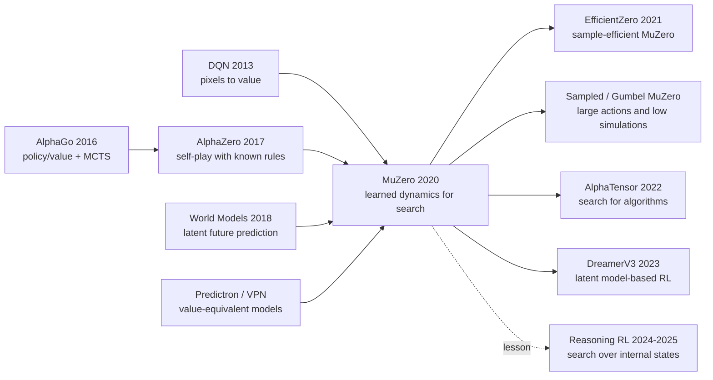

# MuZero — Planning in Unknown Worlds with a Learned Model

> **In November 2019 DeepMind posted [arXiv 1911.08265](https://arxiv.org/abs/1911.08265); in December 2020 *Nature* published [MuZero](https://www.nature.com/articles/s41586-020-03051-4).** AlphaGo needed Go rules. AlphaZero needed a legal simulator for chess, shogi, and Go. MuZero removed even that crutch: it was not told liberties, check, promotion, or the next Atari frame, yet it reached the top tier across Go, chess, shogi, and all 57 Atari games by learning a latent model that predicts only **reward, policy, and value**. The startling lesson is not that MuZero learned the world. It is sharper than that: planning does not require reconstructing the world, only learning the future facts that matter for action.

## TL;DR

MuZero, published in *Nature* in 2020 by Julian Schrittwieser, Ioannis Antonoglou, Thomas Hubert, Karen Simonyan, and 8 co-authors at DeepMind, closes the arc from [DQN (2013)](../era2_deep_renaissance/2013_dqn.md) to AlphaGo and [AlphaZero (2017)](../era3_attention/2017_alphazero.md). It keeps the planning power of MCTS plus policy/value networks, but removes AlphaZero's crucial dependency on a known rule simulator. The interface is deliberately tiny: $s^0=h_\theta(o_{1:t})$, $(r^k,s^k)=g_\theta(s^{k-1},a^k)$, and $(p^k,v^k)=f_\theta(s^k)$; the training loss asks the model to predict reward, search policy, and value, not the next pixels or a semantically valid board state. At 20B Atari frames MuZero reached 2041.1% median / 4999.2% mean human-normalized score, above R2D2's 1920.6% / 4024.9%; in the 200M-frame Reanalyze setting it reached 731.1% median, above LASER's 431%. The baseline it really replaced was not a layer or a trick, but two older beliefs: that Atari belonged to model-free RL, and that planning requires known rules. The hidden lesson is still fresh: the most useful world model need not look like the world, as long as it makes search choose better actions.

---

## Historical Context

### 2019: planning was powerful, but locked behind rules

Before MuZero, reinforcement learning had an awkward split. Systems that could plan were strong, but usually needed a trustworthy environment model; systems that did not need a model were more general, but often behaved like sophisticated reflex machines.

AlphaGo and AlphaZero lived on the first side. They connected neural networks to Monte Carlo Tree Search: the policy network narrowed the search, the value network evaluated positions, and many simulations gradually improved the policy. In Go, chess, and shogi this works beautifully because the game gives you a clean `step(state, action)` interface: legal moves, next board, terminal status, all explicitly defined. Once the rules are available, MCTS can look far into the future.

DQN, Rainbow, and R2D2 lived on the second side. They did not need Atari's internal rules; pixels and scores were enough to learn strong control policies. But they usually did not search. A forward pass produced an action value or policy distribution, the agent acted, and the long-term consequences were folded into bootstrapped targets. That is fast and broadly applicable, but weak when the task rewards actually thinking several steps ahead.

So the 2019 question was not merely "can we train a bigger network?" It was a sharper interface question: **can an agent search like AlphaZero while needing no rules, like DQN?** MuZero sits exactly in that gap.

### How three DeepMind lines converged

MuZero was not a sudden detour. It is better read as the intersection of three DeepMind lines built over the previous decade.

The first line is **pixel-to-action**. DQN showed that a convolutional network could learn control directly from raw Atari pixels, bringing deep representation learning into RL. But DQN is reactive: it learns $Q(s,a)$ without explicitly asking "if I do this, how will the future unfold?"

The second line is **search-with-value**. AlphaGo, AlphaGo Zero, and AlphaZero showed that search does not need a hand-written evaluation function; neural networks can provide both a policy prior and a value estimate, turning MCTS into a learned policy-improvement operator. The limitation is that this line still treated rules as a free resource.

The third line is **learned world models**. Predictron, Value Prediction Networks, World Models, and Dreamer all tried to make models predict the future in latent space. But many approaches still interpreted "learning a model" as "predict the next observation" or "reconstruct pixels." In Atari that is expensive in exactly the wrong way: the model may spend capacity drawing backgrounds, score flicker, and irrelevant objects rather than representing the variables that matter for action.

MuZero's spark comes from rewiring these lines: from DQN it takes "learn from pixels without rules"; from AlphaZero it takes "MCTS is a powerful policy-improvement operator"; from value-equivalent modeling it takes "the model only needs to be value-equivalent, not physically equivalent."

### The engineering conditions around publication

The engineering setting matters. By 2019-2020 DeepMind already had the AlphaZero self-play stack, distributed replay buffers, TPU clusters, and a mature training pipeline for feeding search results back into neural networks. MuZero is not a lightweight algorithm sketch that a small lab could easily reproduce; it is the next system built on top of AlphaZero's industrial machinery.

The reported setup is heavy: board games use 800 simulations per search, Atari uses 50; the training unroll is $K=5$; mini-batch size is 2048 for board games and 1024 for Atari; each task trains for 1M mini-batches. The appendix states that board games used 16 TPUs for training and 1000 TPUs for self-play, while each Atari game used 8 TPUs for training and 32 TPUs for experience generation. That scale explains why MuZero was cited quickly but fully reproduced slowly.

## Background and Motivation

### The target was not "predict the world," but "learn an abstraction that can be planned in"

Traditional model-based RL often starts from an innocent premise: first learn an environment model, then plan with it. The problem is that the phrase "environment model" easily sends the research in the wrong direction. In pixel domains, if the model is asked to predict the next RGB frame, it is being asked to solve something close to video generation; many of video generation's hardest details have no decision value at all.

MuZero's motivation is to cut that target down to the minimum. A state representation is good not because it can be decoded back into the original image, but because it supports three predictions: next reward, search-improved policy, and value. In other words, MuZero does not learn "what the world looks like." It learns "which future consequences matter for planning in this world."

That is the most modern part of the paper: the hidden state is not required to correspond to a real environment state. It can be a coordinate system invented by the model, as long as MCTS can compare action consequences reliably inside it. This choice releases model-based RL from the burden of pixel-level simulation.

### Why Atari and board games had to appear in the same paper

If judged only on board games, MuZero might look like a simplified AlphaZero. If judged only on Atari, it might look like another large deep-RL system. The paper's claim only becomes clear when the two appear together: the same algorithm can match AlphaZero in rule-defined, planning-heavy board games and beat model-free SOTA in visually complex, rule-unknown Atari.

The pairing is deliberate and effective. Board games answer "can a learned model support precise planning?" Atari answers "when there are no rules, only pixels and rewards, does planning still help?" MuZero passes both tests, which is what turns "learned model + search" from an attractive idea into a credible paradigm.

---

## Method Deep Dive

### Overall framework: putting AlphaZero search inside a learned latent world

MuZero looks superficially like AlphaZero: it has a policy/value network, uses MCTS to produce a stronger policy target, and trains the network on the improved search distribution. The real difference is inside the search tree. AlphaZero calls an external rule simulator on every edge; MuZero calls a neural dynamics function. The tree is not grown over real board states or an Atari emulator, but over hidden states maintained by the model itself.

That hidden state is not required to be interpretable. The paper is explicit: $s^k$ has no environment-state semantics; it is simply the hidden state of the overall model, and its only job is to support future policy, value, and reward prediction. This is what lets MuZero avoid the trap of next-frame pixel prediction.

$$
s^0 = h_\theta(o_1, \ldots, o_t), \qquad
(r^k, s^k) = g_\theta(s^{k-1}, a^k), \qquad
(p^k, v^k) = f_\theta(s^k)
$$

| Function | Input | Output | Role in planning |
|---|---|---|---|
| representation $h_\theta$ | observation history $o_{1:t}$ | root hidden state $s^0$ | compress the real world into a searchable state |
| dynamics $g_\theta$ | hidden state $s^{k-1}$ + hypothetical action $a^k$ | reward $r^k$ + next hidden state $s^k$ | take one imagined step |
| prediction $f_\theta$ | hidden state $s^k$ | policy $p^k$ + value $v^k$ | provide MCTS priors and leaf values |

As a data loop, MuZero is circular: actors use the current network to run MCTS, producing actions and search policies; the environment returns real rewards and new observations; trajectories enter a replay buffer; the learner samples slices, unrolls the model for $K=5$ steps, and asks every step to match reward, policy, and value targets. Better networks make better searches; better searches make better training targets.

### Key design 1: predict only the three quantities planning needs

MuZero's first cut is removing reconstruction. Many model-based RL methods try to learn a full transition model: given current pixels and an action, predict the next frame; or at least learn a latent state that can reconstruct the observation. MuZero asks the reverse question: if the model exists for planning, why learn details that do not help action selection?

So it supervises only three quantities: observed reward $u$, MCTS-generated search policy $\pi$, and n-step or final-return value target $z$. The training objective is:

$$
\ell_t(\theta)=\sum_{k=0}^{K}\left[
\ell_r(u_{t+k}, r_t^k) + \ell_v(z_{t+k}, v_t^k) + \ell_p(\pi_{t+k}, p_t^k)
\right] + c\|\theta\|^2
$$

This is the idea of a value-equivalent model: the model does not need to be equivalent to the environment transition, only equivalent for planning value. Atari background clouds, score flicker, and decorative objects may be ignored; Go liberties need not be explicitly named, as long as the model knows that certain actions lead to low value or reward. This is not laziness. It concentrates capacity on decision variables.

That choice explains why MuZero is better suited to MCTS than many "more complete" world models. A search tree needs recursive, comparable, back-up-able values, not high-definition future video.

### Key design 2: connect AlphaZero-style MCTS to learned dynamics

MuZero's search is still AlphaZero-style UCB / PUCT. Each internal node stores edge statistics $N,Q,P,R,S$: visit count, mean value, policy prior, immediate reward, and next hidden state. Selection follows the edge with maximal UCB; expansion calls dynamics and prediction once; backup propagates a discounted return including intermediate rewards along the path.

$$
a^k = \arg\max_a\left[Q(s,a) + P(s,a)\frac{\sqrt{\sum_b N(s,b)}}{1+N(s,a)}
\left(c_1 + \log\frac{\sum_b N(s,b)+c_2+1}{c_2}\right)\right]
$$

The important change is not the formula itself, but what the formula operates on. AlphaZero searches over next positions produced by true rules; MuZero searches over hidden states produced by $g_\theta$. A simulation makes at most one dynamics call and one prediction call, so the computational order per search remains comparable to AlphaZero.

For Atari-style environments with unbounded scores, MuZero min-max normalizes the $Q$ values observed inside the search tree before using PUCT, squeezing values of different scales into $[0,1]$. That avoids hand-setting score ranges for each game and continues the paper's design principle: give the algorithm as little prior structure as possible.

### Key design 3: end-to-end unrolled training

MuZero is not trained only at the root. Given a real trajectory slice from the replay buffer, it encodes the initial observation with $h_\theta$, repeatedly applies $g_\theta$ along the real action sequence, and asks $f_\theta$ to output policy/value while $g_\theta$ outputs reward at every unrolled step. The model must therefore keep hidden states useful for planning even after several recurrent applications.

Atari uses an n-step bootstrapped value target:

$$
z_t = u_{t+1} + \gamma u_{t+2} + \cdots + \gamma^{n-1}u_{t+n} + \gamma^n \nu_{t+n}
$$

Board games have no intermediate rewards, so the final outcome $\{-1,0,+1\}$ is the main supervision; Atari rewards have variable scale, so the paper uses a categorical support and invertible value transform to stabilize learning. The appendix also notes two small engineering details: each head loss is scaled by $1/K$, and the gradient at the start of the dynamics function is scaled by $1/2$, preventing gradient magnitude from exploding as the unroll length grows.

| Older route | What it learns | What it plans with | MuZero replacement |
|---|---|---|---|
| AlphaZero | policy/value under known rules | true rule simulator | replace rules with $g_\theta$ |
| DQN / R2D2 | $Q(s,a)$ or recurrent Q | no explicit search | use MCTS as policy improvement |
| Pixel world model | next frame or reconstructed observation | indirect planning over predicted pixels | learn only reward/policy/value |
| Value Prediction Network | value-oriented latent rollout | weaker or limited search | attach full AlphaZero-style MCTS |

### Key design 4: Reanalyze and scale engineering

An easily underrated piece of MuZero is Reanalyze. In ordinary training, the policy target for an old time-step comes from the network and search that existed then; once the network improves, that target can become stale. MuZero Reanalyze revisits old replay-buffer trajectories, reruns MCTS with the latest network, and trains on the fresher policy targets.

In the paper's Reanalyze setting, 80% of updates use a newly searched policy target; the value target is also bootstrapped with a newer target network. This lets the agent review old experience with a stronger mind, without collecting more environment frames. In the 200M-frame setting, MuZero Reanalyze reaches 731.1% median human-normalized score, clearly above IMPALA, Rainbow, and LASER.

Scale engineering is just as important. Board games use 800 simulations per move, Atari searches every 4 frames with 50 simulations; board-game self-play actors are heavy, Atari actors are relatively light; Atari input contains 32 RGB frames and 32 previous actions, because some Atari actions do not immediately appear in the observation. These details make MuZero a systems paper, not merely a loss function.

### A minimal pseudocode view

The pseudocode below omits distributed actors, prioritized replay, categorical supports, and other engineering details, leaving only MuZero's minimal loop.

```python
def muzero_update(trajectory, network, optimizer, K=5):
    observations, actions, rewards, search_policies, value_targets = trajectory

    hidden = network.representation(observations.history_at_t())
    total_loss = 0.0

    for k in range(K + 1):
        policy, value = network.prediction(hidden)
        total_loss += policy_loss(policy, search_policies[k])
        total_loss += value_loss(value, value_targets[k])

        if k == K:
            break

        reward, hidden = network.dynamics(hidden, actions[k])
        total_loss += reward_loss(reward, rewards[k])

    optimizer.zero_grad()
    total_loss.backward()
    optimizer.step()
```

The subtle point in this code is that `hidden` is never decoded back to pixels. If it lets `prediction` and the next `dynamics` call keep working, it is a valid state. MuZero's model is not a neural substitute for the simulator; it is an internal language built specifically for search.

---

## Failed Baselines

### Failure 1: pixel-level world models

The most direct route MuZero rejects is "first learn a model that predicts the next frame, then plan inside it." It sounds complete, but it is brittle. Atari screens contain many action-irrelevant changes: background animation, score flicker, object appearance, random noise. If the model must predict all those details, the training objective is pulled toward visual reconstruction.

Methods such as SimPLe showed that learned models for Atari were possible, but they still lagged far behind model-free SOTA on the full Atari 57 suite. The MuZero paper states the issue plainly: previous pixel-level or reconstruction-oriented methods had not built a model that enabled effective planning in visually complex domains. The failure is not simply "the model was too small." The target was wrong: optimizing a video predictor and hoping to obtain a decision model.

### Failure 2: model-free Q-learning alone

The paper includes an important ablation: inside the MuZero framework, replace the MuZero training objective with an R2D2-style model-free Q-learning objective, remove the policy/value heads and search, and keep a single Q-function head. This is a fair comparison because the network size and training budget are kept broadly comparable.

On Ms. Pac-Man, that Q-learning version reaches results similar to R2D2, but learns much more slowly and converges to a much lower final score than MCTS-based training. The experiment shows that MuZero's gain is not merely "larger backbone" or "DeepMind infrastructure." The real difference is that search produces a stronger policy-improvement target than high-bias, high-variance Q-learning targets.

### Failure 3: perfect rule simulators

AlphaZero is extremely strong in board games, but its search needs perfect rules. In board games that is acceptable; in the real world, robotics, industrial control, or complex games, it becomes the application barrier. You can read AlphaZero as an excellent planner, but every planning edge must ask an external world: "is this action legal, and what is the next state?"

MuZero's failed baseline is exactly that dependency. It does not prove rules are irrelevant; it proves rules need not be handed over as a written simulator. If a model can produce good enough reward, value, and policy inside hidden states, MCTS can operate in that internal space.

### Failure 4: more search is not automatically better

MuZero also reveals its own boundary. In Go, increasing thinking time lets the learned model scale almost like a perfect simulator; the paper reports that a model trained around a 0.1-second search budget still benefits when searched for up to 10 seconds. In Atari, the planning benefit plateaus earlier: performance improves as simulations rise to around 100, then mostly flattens or slightly declines.

This indicates remaining model error in Atari. Deeper search can accumulate learned-dynamics mistakes; if the environment is stochastic or rewards are extremely sparse, the hidden model may fail to learn reliable planning structure. Table S1's poor results on Montezuma's Revenge, Venture, and Pitfall are a useful warning: MuZero is a major advance, not a final solution to sparse exploration.

| Replaced or exposed baseline | Representative method | Why it falls short | MuZero's answer |
|---|---|---|---|
| Pixel-level model | SimPLe / next-frame models | capacity wasted on visual reconstruction; planning errors compound | predict reward/policy/value, not pixels |
| Pure Q-learning | R2D2-style ablation | noisy targets, slower learning, no explicit policy improvement | MCTS creates stronger training policies |
| Known-rule search | AlphaZero | requires a hand-written simulator, hard to transfer to unknown environments | replace simulator with learned dynamics |
| Blindly deeper search | long search in Atari | learned-model error makes gains plateau | search depth is bounded by model reliability |

## Key Experimental Data

### Board games: matching AlphaZero without knowing rules

In Go, chess, and shogi, MuZero's evaluation is straightforward: play against AlphaZero using the same 800 simulations per move and measure Elo. The results show MuZero matching AlphaZero's superhuman performance; in Go it slightly exceeds AlphaZero, despite using 16 residual blocks per node where AlphaZero used 20.

This result matters more than "another Elo gain." It shows that MuZero's hidden dynamics can support precision planning. Board games are highly sensitive to planning error: one bad move can collapse the whole game. If the learned model were merely a rough simulator, approaching AlphaZero here would be unlikely.

### Atari 57: a new SOTA in model-free territory

Atari is the opposite stress test. No rules are given, observations are pixels, dynamics are noisier, and rewards are more varied. Across all 57 Arcade Learning Environment games, MuZero sets a new mean and median human-normalized score: at 20B frames it reaches 2041.1% median / 4999.2% mean; R2D2 reaches 1920.6% / 4024.9% while using 37.5B frames.

The paper also notes that MuZero beats R2D2 in 42 of 57 games and beats the previous best model-based method, SimPLe, in every game. That combination is the persuasive part: it defeats both the model-free champion in its home territory and the earlier learned-model line.

### Reanalyze: using a newer model to relabel old experience

In the 200M-frame small-data setting, MuZero Reanalyze reaches 731.1% median human-normalized score and 2168.9% mean. The comparison is clear: IMPALA median 191.8%, Rainbow 231.1%, LASER 431%.

These numbers show that Reanalyze is not decoration. Rerunning search on old trajectories with a newer network turns the replay buffer from static memory into a dataset that can be reinterpreted. This is one reason many later offline RL, self-play, and LLM-reasoning systems take "relabel old samples with a stronger policy" seriously.

### Ablations reveal where the gain really comes from

The Ms. Pac-Man ablations are especially informative. Replacing the MuZero objective with Q-learning leaves the model far below MCTS-based training; increasing the number of simulations used during training improves both speed and final performance; even with only 6 simulations per move, fewer than the number of Ms. Pac-Man actions, MuZero still learns an effective policy.

This means search is not merely enumerating actions. It generalizes across the policy prior, value estimates, and hidden dynamics. MCTS gives the network a more structured improvement direction than a one-step Q target.

| Setting / method | Data | Median HNS | Mean HNS | Key message |
|---|---:|---:|---:|---|
| Ape-X | 22.8B frames | 434.1% | 1695.6% | distributed model-free baseline |
| R2D2 | 37.5B frames | 1920.6% | 4024.9% | previous Atari model-free SOTA |
| MuZero | 20.0B frames | 2041.1% | 4999.2% | new mean/median SOTA across 57 games |
| IMPALA | 200M frames | 191.8% | 957.6% | small-data model-free baseline |
| Rainbow | 200M frames | 231.1% | - | classic DQN-family improvement |
| LASER | 200M frames | 431% | - | strong previous small-data baseline |
| MuZero Reanalyze | 200M frames | 731.1% | 2168.9% | better sample efficiency via re-searching old data |

---

## Idea Lineage

### Past lives: three lines converge in MuZero

MuZero's intellectual position is clear: it is not merely a world-model paper, and not merely an AlphaZero engineering extension. It connects three ideas: learning control from pixels, using search to improve policies, and modeling the future in latent space.

DQN supplies the first piece: if the input is pixels and the output is action values, an agent can control Atari without hand-written features. AlphaGo and AlphaZero supply the second: search can be guided by neural networks, and MCTS is not merely an evaluation-time trick but machinery that produces better policy labels during training. World Models, Dreamer, Predictron, and Value Prediction Networks supply the third: the future can be compressed into latent space, and a latent model need not match the real world pixel by pixel.

MuZero's contribution is reshaping the third piece so the second can use it. It does not say "learn a world model and hope it helps." It trains the model directly into the interface MCTS needs.

### Present life: which later works truly inherit it

MuZero's direct descendants fall into roughly three groups.

The first is **sample-efficiency repair**. EfficientZero adds self-supervised consistency so hidden states remain more stable between real trajectories and model rollouts, addressing MuZero's "strong but expensive" profile. Gumbel MuZero and Sampled MuZero address low simulation budgets and large action spaces.

The second is **application transfer**. AlphaTensor and AlphaDev move AlphaZero/MuZero-style search-and-learn into algorithm discovery: the state is no longer a game board, but a program or tensor-decomposition process; the action is no longer a move, but an algorithm edit. What they inherit is not Atari detail, but the system idea that search can generate stronger training signals.

The third is a **parallel world-model route**. DreamerV3 does not use MCTS; it performs imagination rollouts and actor-critic learning in latent space. It is a sibling path to MuZero: one trusts tree search, the other trusts differentiable imagination and policy learning. Together they show that the central issue is compressing the future into an internal state useful for decisions.

### Misreading: it did not learn "the physical world"

The most common misreading of MuZero is that it learned the rules of the games. That is too coarse. MuZero does not explicitly learn "a Go group with no liberties is captured" or "the chess king cannot move into check." It learns that certain hidden transitions lead to certain reward, value, and policy consequences.

That difference matters. Rules are symbolic systems that are interpretable, checkable, and broadly counterfactual. MuZero's dynamics is a predictor built for search. It can be extremely strong inside the training distribution, but it is not guaranteed to answer arbitrary rule questions. Saying it "learns rules" pulls the reader back into simulator thinking; the more accurate phrase is that it learns utility dynamics sufficient for successful search.

### A lineage diagram



| Idea node | What MuZero inherits | What MuZero changes |
|---|---|---|
| DQN | learn behavior from pixels, no rules needed | add explicit search and policy improvement |
| AlphaZero | policy/value + MCTS + self-play | remove the external rule simulator |
| World Models | predict the future in latent space | do not reconstruct observations; predict planning-relevant quantities |
| Predictron / VPN | value-equivalent model idea | add actions, rewards, MCTS, and large-scale evaluation |
| EfficientZero / Sampled MuZero | reuse hidden dynamics + search | improve sample efficiency, action-space handling, and low-budget search |
| Reasoning RL | borrow the metaphor of internal-state search | replace game states with text or reasoning trajectories |

---

## Modern Perspective

### Six years later: it wins through abstraction, not through game scores

Looking back from 2026, the most durable part of MuZero is not its Atari score, nor the fact that DeepMind again won board games. Those numbers are strong, but numbers get surpassed. The idea that remains is: **a model can serve decision-making without serving reality reconstruction.**

That idea reappears in many later systems. Vision-language models need not generate pixels, retrieval models need not understand full semantics, and LLM reasoning systems need not carry an explicit world model. If an internal representation supports comparison, search, reflection, and choice, it is a useful model. MuZero is one of reinforcement learning's clearest examples of this task-relevant abstraction.

### Assumptions that no longer hold up

MuZero breaks several assumptions that were common at the time.

First, **model-based RL must predict observations**. MuZero shows that, for planning, value-equivalence matters more than pixel-equivalence. Second, **Atari belongs to model-free RL**. MuZero beats R2D2 and SimPLe across the 57-game suite, showing that a learned model can plan in visually complex domains if the objective is designed correctly. Third, **search requires true rules**. The board-game results show that learned dynamics can approach a perfect simulator even in precision-planning domains.

But some optimistic assumptions also failed. MuZero did not immediately move model-based RL into robotics and the real world. It still needs massive interaction, stable rewards, repeatable evaluation, and expensive search. The paper's promise of messy real-world environments is better read as a direction, not as a completed transfer.

### If MuZero were rewritten today

If rewriting MuZero today, I would keep the three-function interface and the search-improvement loop, but change several pieces.

First, I would add stronger self-supervised consistency so hidden states remain stable across real rollouts, model rollouts, and augmentations; EfficientZero already shows the value of this. Second, I would make the dynamics stochastic or ensemble-based, because real environments and many games are not deterministic, and a single hidden transition can become overconfident. Third, I would reduce MCTS inference cost with learned candidate pruning, Gumbel search, or sampled search for large action spaces. Fourth, I would systematize the connection between offline data and online search, turning Reanalyze from a replay trick into a general relabeling paradigm.

| 2020 setting | Possible rewrite today | Why |
|---|---|---|
| deterministic dynamics | stochastic / ensemble dynamics | handle stochastic environments and model uncertainty |
| reward/policy/value supervision only | add consistency / representation losses | improve sample efficiency and hidden-state stability |
| fixed MCTS budget | sampled / Gumbel / learned pruning | reduce search cost in large action spaces |
| replay buffer + Reanalyze | offline-online relabeling mix | use old experience and new policies more fully |

### Relationship to 2025 reasoning systems

Equating MuZero directly with LLM reasoning would be too loose. MuZero has environment interaction, verifiable reward, an MCTS tree, and a trainable dynamics model; LLM reasoning usually operates over text states, weak verification signals, and a much more open action space. They are not the same algorithm.

The intellectual echo is real, though: both try to turn one-shot reaction into internal search. MuZero expands action consequences in hidden state; systems in the o1 / DeepSeek-R1 family expand candidate solutions in text or latent reasoning trajectories. MuZero supervises an internal model with value, policy, and reward; reasoning RL uses preferences, verifiers, outcome rewards, or self-play signals to supervise reasoning paths. MuZero's useful warning for today is: do not obsess over whether the internal state "looks like the real world"; ask whether it reliably separates better actions from worse ones.

## Limitations and Future Directions

### Still hard to leave cheap simulatable environments

MuZero's title says "without rules," but it still needs an environment that can be interacted with repeatedly and scored. Atari and board games do not give rules to the agent, but the training system can still run enormous numbers of episodes. Real robotics, medical decisions, and industrial control rarely allow that kind of trial and error. Without cheap interaction, MuZero's self-play and replay loop is hard to transfer directly.

Its experimental environments are also mostly fully observable or close to it. The real world is often partially observable, non-stationary, multi-agent, delayed-reward, and noisy. Deterministic hidden dynamics faces much stronger epistemic uncertainty under those conditions.

### Inference cost and stochasticity

MuZero inference is not a single network forward pass; each action can require many MCTS simulations. Board-game 800 simulations and Atari 50 simulations are acceptable because these benchmark environments are relatively cheap. In robotics or online systems, building a tree before every action may be too slow.

Another limitation is stochasticity. The paper leaves stochastic transitions to future work, which is harmless in deterministic board games and already visible in Atari's planning plateau. In the real world, model uncertainty is stronger. MuZero's successors need explicit stochastic dynamics, risk-sensitive values, and uncertainty calibration.

## Related Work and Insights

### The best reading path around this paper

MuZero is best read with four groups of papers. Read backward to [DQN](../era2_deep_renaissance/2013_dqn.md) to see how deep RL learned control from pixels; read [AlphaGo](../era2_deep_renaissance/2016_alphago.md) and [AlphaZero](../era3_attention/2017_alphazero.md) to see how MCTS plus policy/value networks became a strong planner; read sideways to World Models, Dreamer, and Value Prediction Networks to see alternative latent model-based RL paths; read forward to EfficientZero, Sampled MuZero, Gumbel MuZero, AlphaTensor, and AlphaDev to see how MuZero's interface was adapted for better sample efficiency or broader domains.

Together these papers show a clear trend: AI systems keep moving human priors from external modules into learnable representations. AlphaGo still relied on human games and rules; AlphaGo Zero removed human games; AlphaZero unified board games; MuZero removed rules; later algorithm-discovery systems moved search and learning into program space.

### Practical lessons for researchers today

MuZero offers two practical lessons. First, align the modeling target with downstream decisions. A world model that cannot support planning is just a generator, however realistic; an abstract model that reliably improves action is useful even if it is hard to interpret. Second, search is not only an inference trick; it can be a training-signal generator. The MCTS-produced policy target is one of MuZero's central supervision signals, and that idea carries into later self-play, verifier-guided reasoning, and offline relabeling.

## Resources

### Official paper and links

- Nature paper: [Mastering Atari, Go, Chess and Shogi by Planning with a Learned Model](https://www.nature.com/articles/s41586-020-03051-4)
- arXiv preprint: [1911.08265](https://arxiv.org/abs/1911.08265)
- DeepMind official blog: [MuZero: Mastering Go, chess, shogi and Atari without rules](https://deepmind.google/discover/blog/muzero-mastering-go-chess-shogi-and-atari-without-rules/)
- Follow-up work: [EfficientZero](https://arxiv.org/abs/2111.00210), [AlphaTensor](https://www.nature.com/articles/s41586-022-05172-4), [AlphaDev](https://www.nature.com/articles/s41586-023-06004-9), [DreamerV3](https://arxiv.org/abs/2301.04104)
- Community implementation: [muzero-general](https://github.com/werner-duvaud/muzero-general)


---

> 🌐 [中文版](/era4_foundation_models/2020_muzero/) · 📚 awesome-papers project · CC-BY-NC