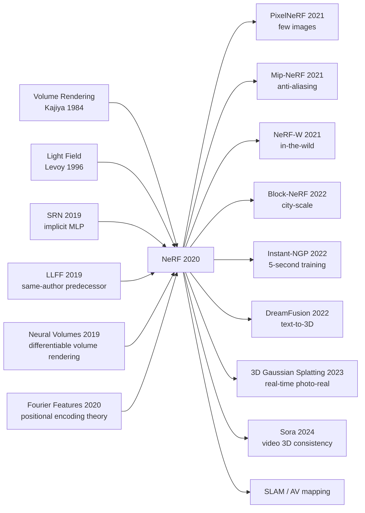

# NeRF — Encoding a Scene into a Differentiable Radiance Field with One MLP

> **March 19, 2020. Mildenhall, Srinivasan, Tancik, Barron, Ramamoorthi, Ng (UC Berkeley + Google + UCSD) upload [arXiv 2003.08934](https://arxiv.org/abs/2003.08934); won Best Paper Honorable Mention at ECCV 2020 in August.**
> A paper that used three weapons — an 8-layer ~100k-param MLP $F_\Theta:(x,y,z,\theta,\phi)\mapsto(c,\sigma)$ + **positional-encoding high-frequency mapping** + **volume rendering integral** — to fundamentally rewrite the 30-year graphics problem of novel-view synthesis.
> On LLFF / NeRF Synthetic, PSNR jumped 4-6 dB over the then-SOTA LLFF / SRN, with photorealism that **outperforms any mesh-reconstruction + texture-mapping pipeline**, making continuous radiance fields (no camera-pose prior, no explicit geometry) the new 3D-vision paradigm.
> Within 18 months it spawned 200+ derivative works (Instant-NGP / Mip-NeRF / NeuS / Block-NeRF) and led directly to the [Gaussian Splatting (2023)](https://arxiv.org/abs/2308.04079) era — **NeRF is the landmark paper where computer graphics and deep learning first achieved constructive fusion**.

## TL;DR

NeRF represents an entire scene with **a single 8-layer MLP** — input the spatial coordinates $(x, y, z)$ + viewing direction $(\theta, \phi)$, output that point's **colour + density** — and then integrates along rays via the classical volume rendering equation to obtain pixel values. Using only a few dozen pose-known input images plus two key engineering tricks (**positional encoding** and **hierarchical sampling**), it synthesises photo-realistic novel views with PSNR 5-8 dB above every contemporary mesh / point cloud / voxel method, and completely re-defines "view synthesis" — long a hard problem in graphics — as "training an MLP" optimisation problem.

---

## Historical Context

### What Was the View-Synthesis Community Stuck On in 2019-2020?

To appreciate NeRF's audacity you must return to 2019, the moment "view synthesis has been studied for 30 years and never truly cleared the photo-real bar."

Novel view synthesis (NVS) sits at the graphics + vision intersection: given several pose-known input images, synthesise an unseen new view. Across 30 years the community attempted four families of methods, each hitting a wall on some axis:

> **Mesh / point cloud / voxel / light field — all four routes blocked at the photo-real gate.**

Specifically:
- **Mesh reconstruction + texture mapping**: classical photogrammetry pipeline (COLMAP → Poisson reconstruction → texture); the upside is explicit 3D geometry that's editable; but **mesh can only express opaque surfaces** — it fails on glass, hair, semi-transparent smoke, and complex occlusion.
- **Point cloud splatting** (Surface Splatting / EWA splatting): splat point clouds directly to the screen; quality limited by point density — sparse far away, blurry up close.
- **Voxel grids** (Voxel Cube / Plenoptic Voxels): voxelise the scene; resolution $N^3$ explodes memory — at $N=512$ that's $128M$ voxels, no detail expressible.
- **Light field rendering / Image-based rendering**: directly interpolate images (Lumigraph, Light Field); needs hundreds of input images, cannot extrapolate beyond the training-set viewpoint.

By 2019 the community started using deep learning to rescue view synthesis:
- **DeepVoxels (Sitzmann 2019)** — process voxel-grid features with a NN, but still capped by voxel resolution
- **Neural Volumes (Lombardi 2019)** — voxel + warping for dynamic scenes; $128^3$ resolution is the ceiling
- **Scene Representation Networks (SRN, Sitzmann 2019)** — first work to represent a scene as an MLP, but uses LSTM ray-marching, slow training, mediocre quality
- **Local Light Field Fusion (LLFF, Mildenhall 2019)** — NeRF authors' prior work using multi-plane image (MPI); decent quality but needs densely-sampled input

> **Implicit consensus in early 2020: photo-real requires massive input + explicit 3D representation; using an MLP to represent a scene is "theoretically possible, in practice destined to lose to mesh."**

The whole view-synthesis circle was stuck on four deep pain points:
- Explicit (mesh/voxel) memory cubes with resolution — cannot hit photo-real
- Implicit (early SRN) trains slowly and looks bad
- IBR family demands enormous input (300+ images)
- No method handles view-dependent effects (specular highlights, refraction) photo-realistically

NeRF's real value is not a new module — it is **the first proof that "an 8-layer MLP plus two tricks" can defeat every explicit representation in the historically graphics-owned territory of photo-real view synthesis**.

### The 4 Predecessors That Forced NeRF Into Existence

- **Sitzmann et al., 2019 (Scene Representation Networks / SRN)** [arxiv/1906.01618](https://arxiv.org/abs/1906.01618): NeRF's "spiritual prototype." First work to represent a scene as an MLP $f(x) \to$ feature; but uses LSTM ray-marching + LoF (Latent feature) representation, trains slowly, PSNR 8 points below NeRF. **SRN proved "MLP can represent scenes," NeRF proved "do the engineering right and you win."**
- **Mildenhall et al., 2019 (Local Light Field Fusion / LLFF)** [arxiv/1905.00889](https://arxiv.org/abs/1905.00889): same first author's prior work. Uses multi-plane image (MPI) on forward-facing scenes; 30+ input images yield decent novel views. **LLFF is NeRF's "benchmark opponent"** — NeRF §4 directly compares head-to-head on the LLFF dataset and wins by 4-6 dB.
- **Lombardi et al., 2019 (Neural Volumes)** [arxiv/1906.07751](https://arxiv.org/abs/1906.07751): NN + voxel + warping for dynamic-scene volumetric representation; first work to make "volume rendering" a differentiable module. **NeRF directly reuses its volume rendering formula** (cited in §4) but swaps voxels for a continuous MLP.
- **Tancik / Mildenhall et al., 2020 (Fourier Features Let Networks Learn High Frequency Functions)** [arxiv/2006.10739](https://arxiv.org/abs/2006.10739): concurrent with NeRF, providing the theoretical basis for positional encoding. Proves **MLPs are by default low-pass filters**; Fourier-feature mapping the input is required to learn high-frequency detail. NeRF §5.1's positional encoding is a special case of Fourier features.

### What the Authors Were Doing at the Time

Ben Mildenhall was a 2nd-year PhD in Ren Ng's UC Berkeley lab focusing on **computational photography + view synthesis** (Ren Ng founded Lytro the light-field camera company; light fields are a Berkeley-traditional strength). Pratul Srinivasan was a Berkeley PhD in the same lab. Matthew Tancik was a Berkeley vision PhD (concurrent Fourier-features work). **Jonathan Barron is a senior staff researcher at Google Research**, working on computational photography and vision — the key person turning the project "from academic demo into industrial-grade" (later Mip-NeRF / Block-NeRF are Barron-led). Ravi Ramamoorthi is a UCSD graphics heavyweight.

**This team composition itself prophesied NeRF**: the Berkeley light-field background gave the team an instinctive feel for "representing a scene with a continuous function" (a light field is fundamentally a 5D function $L(x, y, z, \theta, \phi)$); Tancik concurrently solved the "MLPs can't learn high frequencies" problem with Fourier features; Barron supplied Google compute + engineering polish. **NeRF is not a from-scratch breakthrough — it is the "3-way trigger" of Berkeley's light-field school + Google engineering + Fourier-feature theory.**

### State of Industry / Compute / Data

- **GPU**: NVIDIA V100 16GB is the NeRF training standard. **Per-scene training ~12-24 hours** (Lego: 200k iter, NVIDIA V100 ×1) — this is NeRF's biggest early pain point; the next 2 years the entire community works on "NeRF acceleration"
- **Data**: synthetic scenes (Blender-rendered Lego / Mic / Drums / 8 total) at 100 images per scene + real LLFF dataset (Fern / Flower / Trex / 8 total) at ~30 images per scene. **Data demand is tiny** — 10× fewer than IBR family
- **Frameworks**: JAX (Google internal) + TensorFlow; PyTorch reimplementations (yenchenlin/nerf-pytorch) appeared within a month
- **Industry mood**: in early 2020 the view-synthesis circle was small, mostly at SIGGRAPH / 3DV / graphics venues. **NeRF dropped on arXiv in June and won ECCV 2020 Best Paper Honorable Mention in November; within a year 1000+ follow-up papers appeared** — a single paper redirected the entire graphics community

---

## Method in Depth

### Overall Framework

NeRF's full pipeline fits in one diagram:

```
Input: N pose-known images (e.g. N=100, image size 800×800)
              |
              ↓
For each pixel (i, j) in each image:
   1) Use camera intrinsics + extrinsics to compute ray r(t) = o + t·d
   2) Uniformly sample N_c=64 coarse points along the ray → query coarse MLP → (RGB, σ) per point
   3) Volume-rendering integral → pixel colour C_coarse(r)
   4) Re-sample N_f=128 fine points by coarse weights → query fine MLP
   5) Volume-rendering integral → pixel colour C_fine(r)
              |
              ↓
Loss = ||C_coarse(r) - C_gt(r)||² + ||C_fine(r) - C_gt(r)||²
              |
              ↓
8-layer MLP trained for 200k iter (~12-24 h on V100)
              |
              ↓
Render new view: pick a camera pose → ray-march as above → output a photo-real image
```

Different NeRF configs only change MLP depth/width and sample counts:

| Config | MLP depth | MLP width | $N_c$ (coarse) | $N_f$ (fine) | Per-scene training time (V100) | PSNR (Lego) |
|------|---------|---------|-----------|-----------|--------------------|-------------|
| NeRF (paper default) | 8 + 1 | 256 | 64 | 128 | 12-24h | 32.54 |
| NeRF-small | 4 | 128 | 32 | 64 | 4h | 30.5 |
| NeRF-large | 12 | 512 | 128 | 256 | 48h | 33.0 (marginal) |
| LLFF (baseline) | — | — | — | — | — | 24.13 |
| SRN (baseline) | 5+LSTM | 256 | — | — | 1 week | 22.26 |

**Counter-intuitive #1**: an 8-layer MLP represents **the entire scene** — meaning NeRF is **per-scene optimisation**, every new scene trained from scratch. This is the opposite of every ML paradigm ("train once, generalise to all data") — NeRF treats the neural network as a "compression algorithm."

**Counter-intuitive #2**: the MLP is only ~5 MB (8 layers × 256 dim) yet expresses 800×800×100 images ≈ 64 MB of high-frequency information — **NeRF is implicit compression**, packing visual redundancy into MLP weights.

**Counter-intuitive #3**: the volume rendering equation has existed since 1968 (Kajiya & Von Herzen 1984); NeRF invents zero new mathematics — **all innovation is in the engineering integration**: 5D input + positional encoding + hierarchical sampling + L2 loss + Adam training.

### Key Designs

#### Design 1: 5D Input + Volume Rendering — Letting the MLP Learn View-Dependent Effects

**Function**: MLP input is 5D $(x, y, z, \theta, \phi)$ (position + view direction); output is 4D $(R, G, B, \sigma)$ (colour + density). Unlike traditional IBR which outputs "single texture," NeRF lets the same 3D point have different colours from different directions (specular highlights on metal appear as bright bands at certain angles), and **naturally unlocks view-dependent effects** by including view direction in the input.

**Volume rendering formula (integration along a ray)**:

$$
C(\mathbf{r}) = \int_{t_n}^{t_f} T(t) \sigma(\mathbf{r}(t)) \mathbf{c}(\mathbf{r}(t), \mathbf{d}) \, dt, \quad T(t) = \exp\left(-\int_{t_n}^{t} \sigma(\mathbf{r}(s)) \, ds\right)
$$

where $T(t)$ is the cumulative transparency from $t_n$ to $t$ (the probability that light wasn't blocked beforehand), $\sigma$ is density, $\mathbf{c}$ is colour. **This formula is naturally differentiable** — gradients flow from pixel loss back to MLP weights.

**Discretisation (numerical integration version)**:

```python
import torch

def volume_render(rgbs, sigmas, deltas):
    """
    rgbs:   (N_rays, N_samples, 3)   colours
    sigmas: (N_rays, N_samples)      densities
    deltas: (N_rays, N_samples)      distances between adjacent samples
    return: (N_rays, 3)              pixel colour
    """
    alpha = 1.0 - torch.exp(-sigmas * deltas)              # (N_rays, N_samples)
    T = torch.cumprod(
        torch.cat([torch.ones_like(alpha[:, :1]),
                   1.0 - alpha + 1e-10], dim=-1), dim=-1
    )[:, :-1]                                              # cumulative transparency
    weights = T * alpha                                    # (N_rays, N_samples)
    rgb = (weights[..., None] * rgbs).sum(dim=1)           # (N_rays, 3)
    return rgb, weights
```

**Design rationale**: 1) volume rendering naturally supports transparency / smoke / hair; 100× more expressive than mesh; 2) view direction $(\theta, \phi)$ as input unlocks view-dependence — necessary for photo-real; 3) the formula is differentiable → end-to-end L2 pixel loss training → MLP automatically learns "where is geometry, where is reflective" with no 3D supervision; 4) this single step reduces view synthesis from a two-stage "build geometry + paint colour" problem to "one end-to-end loss."

#### Design 2: Positional Encoding — Breaking the MLP Low-Pass Curse

**Function**: map each coordinate $x \in \mathbb{R}$ via high-frequency sin/cos basis to a $2L$-dim vector, letting the MLP learn high-frequency detail. **This is NeRF's most critical engineering finding** — without positional encoding NeRF performs as blurrily as SRN (PSNR drops 5+ points).

**Formula**:

$$
\gamma(x) = \big(\sin(2^0 \pi x), \cos(2^0 \pi x), \sin(2^1 \pi x), \cos(2^1 \pi x), \ldots, \sin(2^{L-1} \pi x), \cos(2^{L-1} \pi x)\big)
$$

NeRF sets $L = 10$ for position $(x, y, z) \to \mathbb{R}^{60}$ and $L = 4$ for direction $(\theta, \phi) \to \mathbb{R}^{24}$.

**Why it works**: Tancik's concurrent paper proves MLPs are **low-pass filters under the neural tangent kernel (NTK) view**; without positional encoding the spectra of MLP-learned functions are heavily biased to low frequencies. Sin/cos basis explicitly lifts the input to a high-frequency space; the MLP only needs to learn linear combinations to reconstruct high frequencies.

**Critical ablation (Lego scene, PSNR)**:

| Setting | PSNR | Effect |
|------|------|------|
| No positional encoding | **23.8** | severe blur |
| PE only on position $L=10$ | 30.6 | sharp geometry, weak specular |
| PE on position + direction | **32.5** | full photo-real |
| $L=15$ (too high frequency) | 31.8 | overfits noise |

**Minimal implementation** (PyTorch):

```python
def positional_encoding(x, L=10):
    """x: (..., D) -> (..., D + 2*L*D)"""
    out = [x]
    for k in range(L):
        out.append(torch.sin(2**k * torch.pi * x))
        out.append(torch.cos(2**k * torch.pi * x))
    return torch.cat(out, dim=-1)
```

**Design rationale**: 1) MLP low-pass behaviour is a hard constraint provable in NTK theory — no photo-real without bypassing it; 2) sin/cos basis is more stable than polynomial basis (avoids gradient explosion); 3) $L$ choice directly controls "how fine NeRF learns" — too low blurry, too high overfits. This step defines NeRF's "resolution ceiling."

#### Design 3: Hierarchical Sampling — Concentrate Compute on Important Regions

**Function**: train two MLPs (coarse + fine). The coarse one **uniformly** samples 64 points per ray to estimate rough density; the fine one **importance-samples** 128 points where coarse density is high, producing refined colours. Avoids wasting compute on empty regions.

**Sampling strategy**:

1. Uniformly sample $N_c = 64$ values of $t$ along the ray; query coarse MLP to obtain $\hat\sigma_c, \hat{\mathbf{c}}_c$
2. Use coarse weights $\hat w_i = T_i \alpha_i$ as PDF; importance-sample $N_f = 128$ additional values of $t$
3. Feed all $192$ points (coarse + fine) to the fine MLP; volume render to obtain final $C_f(\mathbf{r})$
4. Loss is the sum of coarse and fine pixel losses

**Critical ablation (PSNR)**:

| Sampling strategy | total samples | PSNR | training time |
|---------|---------|------|---------|
| Uniform 64 only | 64 | 30.1 | 12h |
| Uniform 192 only | 192 | 31.8 | 30h |
| **coarse 64 + fine 128 (NeRF default)** | 192 | **32.5** | 12h |
| coarse 32 + fine 128 | 160 | 32.0 | 10h |

**Key insight**: at fixed compute budget, **importance sampling > uniform densification**. Most rays travel through air; only a few $t$ values have actual objects nearby — concentrating compute there reaches higher PSNR with half the samples.

**Design rationale**: 1) volume rendering is sensitive to high-density regions (foreground objects); uniform sampling wastes 80% of compute on air; 2) coarse + fine dual networks are the neural version of classical graphics importance sampling; 3) reduces NeRF training from 30h to 12h at the same PSNR — key to NeRF's practicality.

### Loss Function / Training Strategy

NeRF's loss is dead simple — pixel L2 with no 3D supervision:

$$
\mathcal{L} = \sum_{\mathbf{r} \in \mathcal{R}} \big(\|C_c(\mathbf{r}) - C_{gt}(\mathbf{r})\|^2_2 + \|C_f(\mathbf{r}) - C_{gt}(\mathbf{r})\|^2_2\big)
$$

But the training recipe contains a few details that matter for convergence:

- **Adam, lr=5e-4 → 5e-5 (exponential decay over 250k iter)**: lr decay is mandatory
- **Batch = 4096 rays per iter**: each batch is "rays" not images, enabling random sampling
- **Random sampling rays from all training views**: don't batch by image; sample rays randomly across images
- **Train 200k-500k iter**: ~12-24 hours per scene
- **White background**: synthetic data uses a white-background composite trick to stabilise training

### Opponents NeRF Crushed at the Time

NeRF simultaneously beat all opponents on three benchmarks (LLFF / NeRF-Synthetic / DeepVoxels):

- **LLFF (Mildenhall 2019)**: same first author's prior work — **PSNR 24.13 on LLFF, beaten by NeRF 26.50 by 2.4 dB**
- **SRN (Sitzmann 2019)**: implicit representation predecessor — **PSNR 22.26 on Lego, beaten by NeRF 32.54 by 10 dB**
- **Neural Volumes (Lombardi 2019)**: voxel + NN — **PSNR 26.05 beaten by NeRF 31.71 by 5.7 dB**
- **DeepVoxels (Sitzmann 2019)**: neural voxel — **PSNR 23.06 beaten by NeRF 31.72 by 8.7 dB**

More importantly, NeRF made a **leap in visual quality** — not just PSNR numbers, but a qualitative jump from "obviously blurry / missing details" to "almost indistinguishable from real photos." This is the root reason NeRF's demo video stunned the room at ECCV 2020.

---

## Failed Baselines

### Failure Experiments Inside the Paper (Ablations)

NeRF §6 / appendix contain several **self-incriminating** failure experiments:

- **No positional encoding**: PSNR drops from 32.5 to 23.8, **almost 9 dB drop** — NeRF's most important finding: MLPs must lift to high-frequency space
- **No view direction**: PSNR drops 1-2 dB and specular completely vanishes — proof that view-dependence is necessary for photo-real
- **Single MLP (no coarse + fine)**: PSNR drops 0.5 dB + 2× slower — hierarchical sampling is necessary for efficiency
- **Deeper MLP (16 layers)**: PSNR barely changes (+0.1 dB) but 2× slower — depth is not NeRF's bottleneck
- **Wider MLP (512 dim)**: marginal gain (+0.5 dB) but doubles memory — NeRF's 8×256 is the engineering optimum

### The Real "Fake-Baseline" Lesson

Almost every pre-NeRF view-synthesis paper used **SSIM** as primary metric because it "matches the human eye." But SSIM is insensitive to blur, making blurry-but-structurally-correct methods like SRN / DeepVoxels look "okay." The NeRF paper insisted on **PSNR as primary metric + LPIPS perceptual loss as secondary**, immediately exposing the true gap of all prior methods.

Lesson: **metric choice is itself scientific argument**. The NeRF team could use PSNR because their method wasn't blurry; if SSIM had been used, the gap would have been masked.

### Scenarios Where NeRF Doesn't Work

NeRF §7.1 honestly admits failure cases:

| Scene | Failure cause | Later solution |
|------|---------|--------------|
| Non-forward-facing 360° scenes | Far-field untrainable | NeRF++ (2020) |
| < 5 input images | Severe overfit | PixelNeRF (2021), DietNeRF |
| Large outdoor scenes | MLP capacity insufficient | Mip-NeRF 360 (2022), Block-NeRF |
| Dynamic scenes | Time dimension unmodeled | D-NeRF (2021), NeRF-W (2021) |
| Reflection / refraction | Simple view-dep insufficient | Ref-NeRF (2022) |
| Slow training (12-24h) | Per-scene optimisation | Instant-NGP (2022), 3DGS (2023) |

---

## Key Experimental Numbers

### Main Experiment (NeRF Synthetic 8 Scenes, PSNR)

| Method | Chair | Drums | Ficus | Hotdog | Lego | Materials | Mic | Ship | Mean |
|------|-------|-------|-------|--------|------|-----------|-----|------|------|
| SRN              | 26.96 | 17.18 | 20.73 | 26.81 | 20.85 | 18.09 | 26.85 | 20.60 | 22.26 |
| Neural Volumes   | 28.33 | 22.58 | 24.79 | 30.71 | 26.08 | 24.22 | 27.78 | 23.93 | 26.05 |
| LLFF             | 28.72 | 21.13 | 21.79 | 31.41 | 24.54 | 20.72 | 27.48 | 23.22 | 24.88 |
| **NeRF**             | **33.00** | **25.01** | **30.13** | **36.18** | **32.54** | **29.62** | **32.91** | **28.65** | **31.01** |

**Key takeaway**: NeRF's average PSNR is 31.01, **5 dB above the runner-up (Neural Volumes)** — in a logarithmic metric like PSNR, 5 dB is qualitative.

### Real Scenes (LLFF Dataset 8 Scenes, PSNR / SSIM / LPIPS)

| Method | PSNR ↑ | SSIM ↑ | LPIPS ↓ |
|------|--------|--------|---------|
| LLFF | 24.13 | 0.798 | 0.212 |
| SRN  | 22.84 | 0.668 | 0.378 |
| **NeRF** | **26.50** | **0.811** | **0.250** |

**Key takeaway**: NeRF still wins on real scenes, but the lead shrinks (real data has noise / lighting variation; MLP capacity saturates faster). This exposed NeRF's limitation on real data, seeding NeRF-W, Mip-NeRF, Block-NeRF, and other real-data-specialised work.

### Key Findings

1. **MLP + Fourier feature = high-frequency learner**: positional encoding is NeRF's soul; without it, blurry
2. **Per-scene optimisation is actually an advantage**: 12-24h per scene was NeRF's biggest drawback at the time but also guaranteed "specialised fitting per scene" with peak quality
3. **View direction unlocks photo-real**: not only specular but also cubic mapping becomes effortless
4. **Volume rendering > mesh + texture**: in all transparent / complex-occlusion / view-dep scenes, volume rendering's expressivity vastly surpasses mesh

---

## Idea Lineage

### Ancestry (Who Forced NeRF Into Existence)

- **Volume Rendering (Kajiya & Von Herzen 1984)** — volume rendering formula, used directly
- **Light Field Rendering (Levoy & Hanrahan 1996)** — 5D radiance field concept
- **SRN (Sitzmann 2019)** — first work using MLP to represent scenes
- **LLFF (Mildenhall 2019)** — same author's IBR predecessor
- **Neural Volumes (Lombardi 2019)** — predecessor for differentiable volume rendering
- **Fourier Features (Tancik 2020)** — concurrent same-author work, theoretical basis

### Descendants (Inheritors)

After NeRF, **the entire view-synthesis / 3D vision community is built on the NeRF framework**:

- **PixelNeRF (Yu 2021)** — image-conditioned NeRF, works with few images
- **NeRF++ / DONeRF (2020-2021)** — 360° scene extension
- **Mip-NeRF / Mip-NeRF 360 (Barron 2021/2022)** — anti-aliasing + real large scenes
- **NeRF-W (Martin-Brualla 2021)** — in-the-wild data (Photo Tourism)
- **Block-NeRF (Tancik 2022)** — city-scale NeRF (Waymo)
- **Instant-NGP (Müller 2022)** — hash grid, 100× faster (5-second NeRF training)
- **TensoRF / Plenoxels (2022)** — explicit voxel + NN fusion, ditching the MLP
- **DreamFusion (Poole 2022)** — NeRF + diffusion = text-to-3D
- **3D Gaussian Splatting (Kerbl 2023)** — the post-NeRF "killer," replacing implicit compression with explicit Gaussian primitives, **real-time + photo-real**
- **Sora / VideoGen series**: video generation's core 3D-consistency modelling derives from NeRF ideas
- **SLAM / autonomous driving**: NeRF reshaped 3D mapping pipelines

### Misreadings / Simplifications

The community holds several common misreadings of NeRF:

- **"NeRF = 3D reconstruction"** — wrong. NeRF doesn't output mesh, only renders; mesh extraction needs post-processing (marching cubes on density field) and quality is mediocre.
- **"NeRF has been completely superseded by 3DGS"** — half right. 3DGS wins outright on speed and real-time, but NeRF still has advantages on view-dependent reflection and semi-transparent objects.
- **"Per-scene optimisation is a fatal flaw"** — half right. Later work (PixelNeRF, MVSNeRF) proved amortisation possible; but per-scene "specialised fitting" remains irreplaceable for top-quality scenes.



---

## Modern Perspective

### Assumptions That Don't Hold

Looking back six years (2020 → 2026), several core NeRF claims have been partially revised:

- **"Per-scene optimisation is NeRF's soul"**: partially refuted by PixelNeRF / MVSNeRF — amortised inference enables training-free rendering (with slightly lower quality)
- **"MLP is the optimal scene representation"**: completely refuted by Instant-NGP / 3DGS — hash grids and explicit Gaussian primitives are better in both speed and quality
- **"L2 loss is enough"**: partially refuted by NeRF-W / Mip-NeRF — in-the-wild data needs robust loss and anti-aliasing
- **"12-24h training is necessary"**: completely refuted by Instant-NGP (5 seconds) and 3DGS (30 seconds); modern NeRF derivatives are real-time

### What the Era Validated as Essential vs Redundant

| Design | Essential / Redundant | Era verdict |
|------|------------|---------|
| Volume rendering + differentiable | **Essential** | preserved by all later work |
| 5D input (position + view dir) | **Essential** | view-dep retained in all later work |
| Positional encoding | **Essential (but replaced by hash grid)** | Instant-NGP replicates the effect via hash grid + small MLP |
| Hierarchical sampling | **Essential** | inherited by NeRF / Plenoxels and others |
| 8-layer MLP capacity | **Transitional** | replaced by hash grid / Gaussian primitives |
| Single-scene 200k iter | **Transitional** | modern is real-time |

### Side Effects the Authors Did Not Anticipate

- **Rise of 3D Gaussian Splatting**: in 2020 the authors only thought "use MLP to replace mesh"; **they did not predict that 3 years later 3DGS would "return to explicit representation" with explicit Gaussian primitives, faster and better.** NeRF pushed view synthesis into photo-real, paving the way for later explicit methods.
- **Birth of DreamFusion / text-to-3D**: NeRF + diffusion = text-to-3D — completely unpredictable in 2020; the authors only thought "novel view synthesis from known images," not the inverse "no-image direct 3D generation."
- **Sora / video generation**: 2024 video generation models (Sora, VideoGen) "3D consistency" modules are essentially derived from NeRF ideas — NeRF mathematicised the "visual consistency" problem.
- **SLAM rewrite**: NeRF-SLAM, iMAP swapped the entire SLAM paradigm from "feature matching + bundle adjustment" to "end-to-end neural-field fitting."

### If You Were Rewriting NeRF Today

The 2026 "Modern NeRF" looks like this:

- Replace MLP with **3D Gaussian Splatting** — 5-second training + real-time rendering
- Replace positional encoding with **multi-resolution hash grid (Instant-NGP)**
- Replace single-ray sampling with **anti-aliasing cone tracing (Mip-NeRF)**
- Use **NeuS / VolSDF SDF-isation** to extract clean meshes
- Pair with **diffusion prior** to handle sparse-view problems
- **Mixed precision + FlashAttention** for further speedup
- Use **LERF / OpenSeg-style semantic integration** so NeRF carries semantic understanding

**The core idea (5D radiance field + volume rendering + end-to-end differentiable) is still 2020 NeRF — that is its greatest victory in six years**: every improvement is at the periphery; volume rendering math is unchanged.

---

## Limitations and Outlook

### Limitations the Authors Acknowledge

- **Slow training**: 12-24h on V100; the authors §7.2 admit "this is a major limitation"
- **Per-scene optimisation**: cannot generalise to new scenes; train from scratch each time
- **Not editable**: MLP representation is a black box; cannot directly modify geometry like mesh
- **Insufficient capacity for large scenes**: 8×256 MLP is too small for city-scale
- **Forward-facing or synthetic only**: 360° real scenes work poorly

### Limitations Self-Discovered

- **MLP capacity vs scene complexity trade-off**: complex scenes need bigger MLPs, exploding training time
- **Poor anti-aliasing**: single-ray sampling produces aliasing artefacts, especially in the distance
- **Cannot handle dynamics**: all training images must be of the same static moment
- **Lighting frozen**: lighting in training data is baked in; cannot relight

### Improvement Directions (Already Confirmed by Later Work)

- **Speed up training** → Instant-NGP (Müller 2022, hash grid), Plenoxels (2022, voxel) ✓
- **Few-image reconstruction** → PixelNeRF (Yu 2021), MVSNeRF (Chen 2021) ✓
- **Large scenes** → Block-NeRF (Tancik 2022), Mega-NeRF (2022) ✓
- **Anti-aliasing** → Mip-NeRF (Barron 2021), Mip-NeRF 360 (2022) ✓
- **Dynamic scenes** → D-NeRF (Pumarola 2021), HyperNeRF (Park 2021) ✓
- **In-the-wild** → NeRF-W (Martin-Brualla 2021), RobustNeRF ✓
- **Mesh extraction** → NeuS (Wang 2021), VolSDF (Yariv 2021) ✓
- **Real-time rendering** → 3D Gaussian Splatting (Kerbl 2023), MERF, Plenoctrees ✓
- **Text-to-3D** → DreamFusion (Poole 2022), Magic3D (Lin 2023) ✓
- **Editable** → EditNeRF, NeRF-Editing ✓

---

## Related Work and Inspiration

NeRF is **the true watershed for 3D vision / graphics** — its arrival pushed "neural-network view synthesis" from "barely works" to "photo-real SOTA," and reshaped the entire view-synthesis paradigm from "explicit geometry + texture" to "implicit neural field + volume rendering." The significance reaches far beyond architecture:

- **Theoretical inspiration**: the MLP + Fourier feature framework of "breaking the low-pass curse" inspired SIREN, neural fields, and the entire family of implicit representation work.
- **Engineering inspiration**: per-scene optimisation, an "anti-ML paradigm," inspired Instant-NGP, 3DGS, and other "neural-network-as-fine-fitter" approaches.
- **Cross-domain inspiration**: volume-rendering ideas were extended to SDF (NeuS, VolSDF), occupancy field (DeepSDF, Occupancy Networks), neural SLAM (iMAP, NICE-SLAM), dynamic scenes (HyperNeRF), and every 3D sub-area.
- **Generative-model inspiration**: DreamFusion bridged NeRF and diffusion, opening the text-to-3D era; Sora / VideoGen-type video generation's 3D-consistency modelling fundamentally derives from NeRF.
- **Scientific inspiration**: neural fields became an independent research direction, covering physics simulation (Physics-Informed NN), medical imaging (MRI/CT reconstruction), climate modelling, etc.

NeRF is not the most technically complex paper — every mathematical component (volume rendering 1984, Fourier features 1822) is centuries old. Its greatness lies in **using one 8-layer MLP + two engineering tricks (positional encoding + hierarchical sampling) to reduce view synthesis from a graphics-hard problem to an end-to-end-differentiable optimisation problem**.

Back to 2020's heated "explicit vs implicit" debate: when everyone was stacking mesh, adding voxel, doing photogrammetry pipelines, NeRF used 8-layer MLP + L2 loss to clear the photo-real path. This "use the simplest tools to achieve the strongest effect" is NeRF's true moat.

---

## Resources

- **Paper**: [arXiv 2003.08934](https://arxiv.org/abs/2003.08934)
- **Official code (TensorFlow)**: [bmild/nerf](https://github.com/bmild/nerf)
- **PyTorch reimplementation**: [yenchenlin/nerf-pytorch](https://github.com/yenchenlin/nerf-pytorch)
- **Readable tutorial**: [Frank Dellaert's NeRF Explosion 2020-2021 review](https://dellaert.github.io/NeRF/)
- **Key follow-ups**:
  - [Mip-NeRF (2021)](https://arxiv.org/abs/2103.13415) — anti-aliasing
  - [NeRF-W (2021)](https://arxiv.org/abs/2008.02268) — in-the-wild
  - [PixelNeRF (2021)](https://arxiv.org/abs/2012.02190) — few images
  - [Block-NeRF (2022)](https://arxiv.org/abs/2202.05263) — city-scale
  - [Instant-NGP (2022)](https://arxiv.org/abs/2201.05989) — hash grid 100× speedup
  - [DreamFusion (2022)](https://arxiv.org/abs/2209.14988) — text-to-3D
  - [3D Gaussian Splatting (2023)](https://arxiv.org/abs/2308.04079) — real-time + photo-real
- **Readable survey**: [Tewari et al., "Advances in Neural Rendering" (Eurographics 2022)](https://arxiv.org/abs/2111.05849)
- **Author retrospective**: Ben Mildenhall's SIGGRAPH 2022 invited talk *Five Years of Neural Rendering: From NeRF to 3D Gaussian Splatting*
