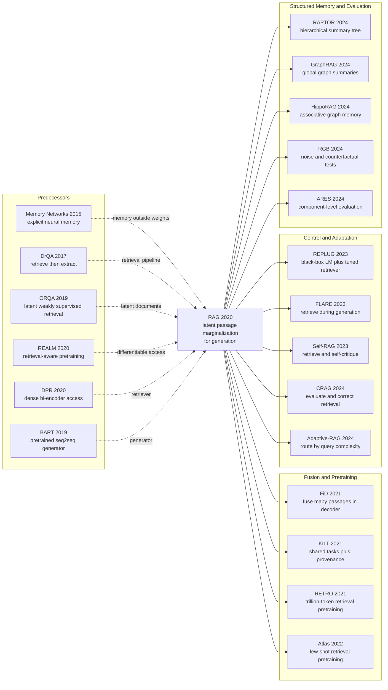

# RAG — Turning Wikipedia into Replaceable Memory for Generation

> **On May 22, 2020, Patrick Lewis, Ethan Perez, Aleksandra Piktus, and nine co-authors uploaded [arXiv:2005.11401](https://arxiv.org/abs/2005.11401), later published at NeurIPS 2020.** The strongest “closed-book” program of the moment tried to compress facts into an 11-billion-parameter T5. This paper moved part of memory out of the weights and into 21 million searchable, replaceable Wikipedia passages, then let a roughly 400M-parameter BART generator read them. The result was not merely another larger language model but a different system boundary: RAG-Sequence reached 44.5 EM on Natural Questions, ahead of T5-11B's 34.5 and DPR's 41.5; swapping 2016 and 2018 indexes changed answers about world leaders without retraining. Its most counter-intuitive legacy is that what a model knows need not be determined only by its parameters.

## TL;DR

Published at NeurIPS 2020 by Patrick Lewis, Ethan Perez, Aleksandra Piktus, and nine co-authors, RAG joins a DPR bi-encoder from the [BERT (2018)](/en/era3_attention/2018_bert/) family to a BART-large generator in a probabilistic model with a latent document $z$. RAG-Sequence evaluates $\sum_z p_\eta(z\mid x)\prod_i p_\theta(y_i\mid x,z,y_{<i})$, so one evidence passage explains a whole candidate sequence; RAG-Token moves the sum inside the product, allowing the evidence mixture to change at every token. No task-specific document labels are required: answer marginal likelihood jointly tunes the query encoder and generator while the document encoder and index stay fixed. On Natural Questions, RAG-Sequence's 626M neural components reached 44.5 EM, beating both the parametric-only T5-11B at 34.5 and DPR's retrieve-rerank-extract pipeline at 41.5. It even answered 11.8% of cases where no top-K passage contained the answer string, a subset on which an extractive reader must score zero.

The subsequent split is as important as the original result. [GPT-3 (2020)](/en/era4_foundation_models/2020_gpt3/) pushed parametric memory toward its scaling limit; [ReAct (2022)](/en/era4_foundation_models/2022_react/) turned retrieval into an explicit tool action; FiD, RETRO, Atlas, REPLUG, Self-RAG, and GraphRAG changed how many passages are fused, whether retrieval happens during pretraining, and when a system should retrieve at all. The hidden lesson is not “retrieval eliminates hallucination.” RAG's own BM25 exception, failed null-document mechanisms, and retrieval-collapse appendix show something more durable: external memory relocates part of the error surface from opaque weights into a retrieval pipeline that is inspectable and replaceable, but also noisy, stale, attackable, and in need of independent evaluation.

---

## Historical Context

### What was knowledge-intensive NLP stuck on in 2020?

By spring 2020, NLP had an apparently smooth recipe: pretrain a large model, then recast every downstream task as classification or text-to-text generation. BERT made contextual representation a general interface; BART and T5 extended that interface across classification, question answering, and summarization. Yet knowledge-intensive questions such as who held an office in a particular year or who created a work exposed a physical boundary that task unification did not remove. Facts compressed into parameters could be recovered only as reliably as the training corpus, model capacity, and prompt allowed. Updating one stale fact was difficult, and a wrong answer had no search-like evidence trail. [LAMA (Petroni et al., EMNLP 2019)](https://aclanthology.org/D19-1250/) showed that language models could act as implicit knowledge bases, while also exposing the distance between memorizing a fact and reliably accessing it. [Closed-book QA (Roberts, Raffel, and Shazeer, 2020)](https://arxiv.org/abs/2002.08910) pushed that program to T5-11B: 34.5 EM on Natural Questions, with 11 billion parameters responsible for both language competence and factual storage.

Open-domain QA, meanwhile, already knew how to open the book. [DrQA (Chen et al., ACL 2017)](https://aclanthology.org/P17-1171/) retrieved Wikipedia with sparse search and passed documents to an extractive reader. [ORQA (Lee, Chang, and Toutanova, ACL 2019)](https://aclanthology.org/P19-1612/) and [REALM (Guu et al., 2020)](https://arxiv.org/abs/2002.08909) treated retrieval as latent and began using downstream signals to train retrievers. [DPR (Karpukhin et al., EMNLP 2020)](https://aclanthology.org/2020.emnlp-main.550/) replaced BM25 with two BERT-base encoders and improved top-20 passage retrieval accuracy by 9–19 absolute points across several datasets. But these systems usually ended by extracting a span from one passage. They could locate an answer yet were poorly suited to synthesize several clues, paraphrase them into a sentence, or perform open-ended generation. Parametric models could speak but kept their evidence sealed; retrieval systems exposed evidence but constrained the output. RAG arrived at that break.

### The four lines that directly produced RAG

The first line was **external memory**. [Memory Networks (Weston, Chopra, and Bordes, 2015)](https://arxiv.org/abs/1410.3916) paired a neural model with long-term memory and learned access; [End-To-End Memory Networks (Sukhbaatar et al., 2015)](https://arxiv.org/abs/1503.08895) replaced strongly supervised steps with differentiable attention. They supplied the language for saying that memory need not equal weights, but not yet a general-purpose generator preloaded with 21 million encyclopedia passages.

The second was **open-domain retrieval QA**. DrQA established the retrieve-then-read engineering pattern, ORQA and REALM made retrieval latent, and DPR submitted arXiv:2004.04906 little more than a month before RAG, supplying a high-recall dense retriever ready for initialization. RAG did not reinvent DPR. It removed DPR from an extractive pipeline and used it as a differentiable prior $p_\eta(z\mid x)$ for generation.

The third was **pre-trained sequence-to-sequence modeling**. [BART (Lewis et al., 2019)](https://arxiv.org/abs/1910.13461) showed that a roughly 400M-parameter denoising encoder-decoder could support both understanding and generation; T5 showed that tasks could share an input-text-to-output-text interface. RAG therefore did not need to train fluency from scratch. It concatenated each passage with the input and taught BART to use retrieved evidence.

The fourth was the **parametric-memory debate**. LAMA asked whether a language model is a knowledge base, closed-book QA asked how much knowledge parameters can hold, and [kNN-LM (Khandelwal et al., ICLR 2020)](https://openreview.net/forum?id=HklBjCEKvH) inserted a nearest-neighbor datastore directly into language-model probabilities. All four lines were ready by the first five months of 2020. RAG's contribution was not inventing every part, but packaging them as one generative, latent-evidence interface that could be fine-tuned across tasks.

### Why this team could connect them

The author list is itself a roadmap. Fabio Petroni, Tim Rocktäschel, Sebastian Riedel, and Patrick Lewis worked on LAMA and sharpened the parametric-knowledge problem. Vladimir Karpukhin, Patrick Lewis, and Wen-tau Yih worked on DPR and brought dense retrieval. Mike Lewis and Naman Goyal worked on BART and supplied the sequence-to-sequence generator. RAG's twelve authors, spanning Facebook AI Research, University College London, and New York University, connected three adjacent projects in one paper. That is why the system looks “natural”: every component had already been pretrained within the collaboration; what remained was probabilistic coupling and cross-task validation.

The official NeurIPS [meta-review](https://proceedings.neurips.cc/paper_files/paper/2020/file/6b493230205f780e1bc26945df7481e5-MetaReview.html) recognized exactly this. It called the combination neat rather than strikingly novel, named novelty as the main weakness, and judged the empirical results and likely practical impact sufficient for acceptance. Six years later, that description explains more than an origin myth of sudden invention. RAG mattered because it compressed existing parts into a reusable system boundary and gave that boundary a name, not because it introduced a layer nobody had seen.

### The data, compute, and engineering boundary

The main experiments split the December 2018 English Wikipedia dump into disjoint 100-word chunks, yielding 21 million passages. A DPR document encoder embedded the corpus in advance, and FAISS performed approximate maximum-inner-product search with HNSW. Training used Fairseq, mixed precision, and eight 32 GB NVIDIA V100 GPUs. The uncompressed index occupied about 100 GB of CPU memory; a compressed index released after submission reduced that to 36 GB. In other words, 2020 RAG was not today's casual recipe of calling an embedding API and a managed vector database. It required an encyclopedia-scale offline index and a working data path between CPU retrieval and multi-GPU generation training.

Scale also dictated the design compromise. Appendix G lists 406M parameters for BART-large and 110M for each DPR BERT-base encoder, 626M neural parameters in total; the document encoder is frozen during task fine-tuning because every update would otherwise require rebuilding 21 million vectors. Only the query encoder and BART are optimized. Retrieval training uses $K\in\{5,10\}$, then each task chooses test-time K; short-answer RAG-Sequence can use 50 passages and Thorough Decoding. This was not a free trick but a concrete exchange: external storage, retrieval latency, and multiple generator paths bought updateable knowledge and relieved some pressure on parametric memory.

## Background and Motivation

### From sealed parameters to readable and writable memory

The paper calls BART's weights **parametric memory** and the Wikipedia vector index **non-parametric memory**. The operational distinction matters more than the names. Pretraining compresses linguistic regularities and common facts into parametric memory, which generalizes well but cannot precisely edit one record. Non-parametric memory preserves raw text that people can inspect, replace, and append, but its usefulness depends on retrieval. RAG refuses the forced choice. A retrieved passage mentioning “The Sun Also Rises” can cue a title-completion pattern already stored in BART. If the retrieved text contains clues rather than the literal answer, generation can still synthesize the answer. On Natural Questions, RAG answered 11.8% of cases correctly even when no top-K passage contained the answer string, showing that the two memories are complementary rather than duplicates.

The index swap makes “writable” measurable. The authors built Wikipedia indexes from December 2016 and December 2018, then queried 82 offices whose leaders changed between those dates. Matching the memory to the year produced 70% accuracy for 2016 leaders and 68% for 2018 leaders; crossing questions and memories reduced accuracy to 12% and 4%. This does not erase stale facts from the weights. It demonstrates that external memory can change system behavior without backpropagation. Updating a model shifts from retraining all knowledge toward replacing some visible source text, the engineering property later adopted by enterprise knowledge bases, live search, and private-document QA.

### The question the paper actually asks

RAG's central problem is not how to search documents. It is: **without labels identifying the correct document, how can several candidate passages enter a generation probability, and how can the final answer train retrieval in return?** The paper makes passage $z$ latent, uses $p_\eta(z\mid x)$ for DPR's retrieval prior, uses $p_\theta(y_i\mid x,z,y_{<i})$ for BART's conditional generation, and sums over top-K passages. Training therefore needs only $(x,y)$ rather than new correct-document annotation for every task.

The second question is the granularity of marginalization. Should one passage explain an entire sequence, or may each token switch evidence? RAG-Sequence and RAG-Token are the two answers. The paper does not declare a universal winner. RAG-Sequence is stronger on Natural Questions, CuratedTrec, and MS-MARCO; RAG-Token has the best Jeopardy Q-BLEU-1. How many facts a task needs, how long its output is, and how expensive decoding may be all affect the choice. Preserving two explicit probability semantics and letting evidence decide between them is one respect in which the original paper is more rigorous than the later shorthand “retrieve chunks and paste them into a prompt.”

---

## Method Deep Dive

### Overall architecture: retrieve first, then generate with documents as latent variables

RAG takes an input sequence $x$, maps it to a vector $q(x)$ with the DPR query encoder, and performs maximum-inner-product search over 21 million Wikipedia passages. Each retrieved $z_k$ is concatenated with the original input and passed through the same BART-large model. The defining step is not merely placing retrieved text in front of a generator. The system does not commit to one passage as ground truth; it treats passage identity as latent and uses retriever probability $p_\eta(z_k\mid x)$ to marginalize several conditional generation distributions $p_\theta(y\mid x,z_k)$.

```text
Input x
  -> DPR query encoder q(x)
  -> FAISS MIPS over 21M fixed passage vectors
  -> top-K {(z_k, p_eta(z_k|x))}
  -> K copies of [passage z_k ; input x]
  -> shared BART-large encoder-decoder
  -> K conditional generation distributions
  -> latent-document marginalization
  -> output y
```

| Component | Paper instantiation | Parameters/scale | State during task fine-tuning |
|---|---|---:|---|
| Query encoder | BERT-base from DPR | 110M | Updated |
| Document encoder | BERT-base from DPR | 110M | Frozen |
| Generator | BART-large | 406M | Updated |
| Non-parametric memory | Dec. 2018 Wikipedia | 21M × 100-word passages | Replaceable, no backpropagation |

A counter-intuitive point, obscured by later “naive RAG,” is that **retrieval is a probability distribution over candidate explanations, not deterministic context**. Passage A may receive a high retrieval score yet assign low probability to the target; passage B may rank slightly lower but make the answer easy to generate. Marginal likelihood sends that contrast to both the generator and query encoder. Retrieval and generation are therefore two parts of one objective, not wholly independent API calls.

### Key design 1: divide labor between parametric and non-parametric memory

**Function**: Keep linguistic regularities, common knowledge, and fluent realization in BART's weights while placing long-tail facts, traceable text, and updateable knowledge in an external index. The paper does not claim the memories are isolated. Their probabilities interact during generation, and each can complete what the other lacks.

For one passage $z$, the generator's conditional probability is:

$$
p_\theta(y\mid x,z)=\prod_{i=1}^{N}p_\theta(y_i\mid x,z,y_{1:i-1})
$$

BART receives a concatenation of passage and input. The pseudocode preserves the paper's semantics while omitting tokenization and padding; it is identical across language versions so that explanatory differences cannot masquerade as algorithmic differences.

```python
def encode_with_memory(generator, input_ids, passages):
    conditioned = []
    for passage in passages:
        # The generator receives raw, human-readable evidence plus the input.
        joint_input = concatenate(passage.token_ids, input_ids)
        conditioned.append(generator.encode(joint_input))
    return stack(conditioned)  # [batch, K, sequence, hidden]
```

| Memory type | What it stores | How it changes | Advantage | Failure mode |
|---|---|---|---|---|
| Parametric | Language and factual patterns in BART weights | Training or fine-tuning | Compression, generalization, completion | Staleness, opacity, hallucination |
| Non-parametric | Raw Wikipedia passages + dense vectors | Replace or append index | Readable, traceable, long-tail coverage | Retrieval error, corpus bias, latency |
| RAG hybrid | Product of both conditional signals | Maintain weights and index separately | Evidence guides generation; generation completes clues | May ignore or over-trust evidence |
| Parametric-only BART | Model weights only | Retraining | Simpler system | More generic, less factual paper outputs |

**Design rationale**: Closed-book T5-11B showed that more parameters improve factual QA but turned a knowledge update into a weight operation. A purely extractive reader required the answer string to occur in a retrieved passage. RAG permits a passage to supply only a clue. The Natural Questions analysis reports 11.8% accuracy when none of the top-K documents contains the answer string. This is not generation winning from nothing: external evidence narrows the semantic space, while parametric memory supplies paraphrase, relation composition, or familiar-entity completion.

The index swap sharpens the division. Across 82 leadership offices, the 2016 index paired with 2016 answers scored 70%, and the 2018 index paired with 2018 answers scored 68%; mismatches scored only 12% and 4%. Replacing the index changed answers but did not prove that conflicting facts vanished from the weights. **Hybrid memory means external evidence can dominate part of behavior, not that it overwrites everything parametric memory contains.**

### Key design 2: DPR turns retrieval into a learned prior

**Function**: Produce a fast top-K distribution from 21 million passages and let answer loss reshape the query representation. DPR is a bi-encoder: separate BERT-base networks encode documents and queries, and an inner product supplies the score.

$$
p_\eta(z\mid x)=\frac{\exp(d(z)^\top q(x))}{\sum_{z'\in\operatorname{topK}(x)}\exp(d(z')^\top q(x))},\qquad d(z)=\operatorname{BERT}_d(z),\quad q(x)=\operatorname{BERT}_q(x)
$$

The paper writes proportionality over the corpus; the implemented training and generation normalize after top-K truncation. FAISS/HNSW approximates maximum-inner-product search, returns passage IDs and scores, and a softmax produces candidate probabilities.

```python
def retrieve(query_encoder, fixed_index, input_ids, top_k):
    query = query_encoder(input_ids)              # trainable BERT_q
    scores, passage_ids = fixed_index.mips(query, top_k)
    retrieval_probs = softmax(scores, dim=-1)     # p_eta(z | x) over top-K
    passages = fixed_index.lookup_text(passage_ids)
    return passages, retrieval_probs
```

| Retrieval scheme | Representation | Learns from task answers | Role in paper | Central cost |
|---|---|---|---|---|
| BM25 | Sparse term overlap | No | Ablation | Weak synonym recall, but strong on FEVER |
| Frozen DPR | Dense BERT vectors | No | Ablation | NQ/TQA prior cannot adapt to a new task |
| Fine-tuned DPR query | Fixed $d(z)$ + trainable $q(x)$ | Yes | Main model | No gradient to documents outside top-K |
| Fully updating DPR | Trainable $d(z)$ and $q(x)$ | In principle | Not used | Requires periodically rebuilding 21M index |

**Design rationale**: Updating the document encoder immediately makes stored vectors inconsistent with their encoder, forcing a full index refresh. REALM accepted that cost during pretraining. RAG explicitly says it was unnecessary for strong performance, so it freezes $\operatorname{BERT}_d$ and tunes only $\operatorname{BERT}_q$. This consequential engineering compromise made the experiment feasible on eight V100s, while locking passage geometry to what DPR learned from Natural Questions and TriviaQA.

Table 6 supplies the critical counterexample. Dense retrieval dominates BM25 on all four QA tasks; for example, RAG-Sequence on NQ dev rises from 31.8 to 44.0. Yet BM25 scores 75.1 on FEVER-3 versus 74.5 for the main model. Entity-centered claims naturally reward lexical overlap. **DPR is not universally superior because it is newer; a retriever's inductive bias must match the task.**

### Key design 3: the marginalization order in RAG-Sequence and RAG-Token

**Function**: State exactly how much output one piece of evidence is responsible for. Both models use the same DPR and BART. Only the order of sum and product changes, yet that change produces different probability semantics and decoding costs.

RAG-Sequence first scores a complete sequence under each passage, then sums over passages:

$$
p_{\text{RAG-Sequence}}(y\mid x)\approx\sum_{z\in\operatorname{topK}(x)}p_\eta(z\mid x)\prod_{i=1}^{N}p_\theta(y_i\mid x,z,y_{1:i-1})
$$

RAG-Token instead mixes documents at each token position before multiplying positions:

$$
p_{\text{RAG-Token}}(y\mid x)\approx\prod_{i=1}^{N}\sum_{z\in\operatorname{topK}(x)}p_\eta(z\mid x)p_\theta(y_i\mid x,z,y_{1:i-1})
$$

```python
def marginal_nll(retrieval_log_probs, token_log_probs, mode):
    # token_log_probs shape: [batch, K, target_length]
    if mode == "sequence":
        per_doc_sequence = token_log_probs.sum(dim=-1)
        log_p_y = logsumexp(retrieval_log_probs + per_doc_sequence, dim=1)
    elif mode == "token":
        per_token = logsumexp(
            retrieval_log_probs.unsqueeze(-1) + token_log_probs, dim=1
        )
        log_p_y = per_token.sum(dim=-1)
    return -log_p_y.mean()
```

| Property | RAG-Sequence | RAG-Token | When identical | Paper observation |
|---|---|---|---|---|
| Latent variable | One $z$ per output sequence | One $z_i$ per token | Output length 1 | Equivalent on FEVER classification |
| Evidence switching | None within sequence | May switch between tokens | $K=1$ | Token stronger on multi-fact Jeopardy |
| Standard beam search | Not directly usable | Directly usable | Not applicable | Sequence needs per-document beams |
| Typical advantage | Sequence coherence, short answers | Multi-document composition, long generation | Task-dependent | NQ/CT/MS-MARCO favor Sequence |

The Hemingway Jeopardy visualization makes the difference concrete. A passage about “The Sun Also Rises” dominates when those tokens are generated; a different passage dominates for “A Farewell to Arms.” After the first token of a title, the posterior flattens because BART's parametric memory can complete the title. RAG-Token can change the responsible evidence within one output, while RAG-Sequence searches for one passage that explains the whole candidate well overall.

Counter-intuitively, greater flexibility does not always win. RAG-Sequence reaches 44.5 on NQ test versus Token's 44.1; CuratedTrec is 52.2 versus 50.0; and Sequence obtains 40.8/44.2 ROUGE-L/BLEU-1 on MS-MARCO versus Token's 40.1/41.5. Token-level mixing can combine information, but locally attractive evidence can also damage sequence coherence. The paper keeps both models because evidence granularity is itself a task assumption.

### Key design 4: latent training from answers and a replaceable index

**Function**: Given only input-output pairs, train retrieval toward passages that help the generator produce the target. The objective is negative marginal log likelihood:

$$
\mathcal{L}(\eta,\theta)=-\sum_j\log p_{\eta,\theta}(y_j\mid x_j)
$$

Top-K selection is discrete: gradients do not pass through FAISS to discover a document outside the current candidate set. Within top-K, however, the softmax weights $p_\eta$ are differentiable. A passage that gives the correct target higher likelihood gains probability relative to its competitors. Training therefore updates the query encoder and BART while keeping document vectors stable.

```python
def rag_training_step(batch, query_encoder, fixed_index, generator, mode):
    passages, retrieval_probs = retrieve(
        query_encoder, fixed_index, batch.input_ids, top_k=batch.top_k
    )
    token_log_probs = generator.score_targets(
        inputs=batch.input_ids,
        passages=passages,
        targets=batch.target_ids,
    )
    loss = marginal_nll(retrieval_probs.log(), token_log_probs, mode)
    loss.backward()  # updates BERT_q and BART; fixed_index/BERT_d stay frozen
    return loss
```

| Supervision signal | Required? | Where it flows | Paper evidence | Limitation |
|---|---|---|---|---|
| Target answer $y$ | Yes | Query encoder + BART | Main training on every task | Long outputs may give weak retrieval gradients |
| Gold passage ID | No | Not applicable | Even FEVER omits evidence supervision | DPR initialization saw NQ/TQA retrieval labels |
| Document-vector gradient | No | Document encoder frozen | Avoids rebuilding index | Geometry may mismatch a new domain |
| Index replacement | Optional at inference | Directly changes candidate facts | 2016/2018 leader swap | Does not resolve source conflicts automatically |

**Design rationale**: Annotating passages for every new generation task is expensive and binds retrieval to a human evidence definition. Marginalization lets the answer act as weak supervision, allowing one architecture to cover QA, Jeopardy question generation, and FEVER classification. Appendix H states the boundary: in story generation, the retriever collapsed to the same documents for every input; the generator then ignored them and performance reverted to BART. The objective produces a healthy retrieval gradient only when the task genuinely needs external facts and the target has an identifiable dependence on passages.

Index replacement is compatible with differentiable training. Freezing document vectors stabilizes geometry during optimization; replacing a complete index at inference changes memory contents behind the same embedding interface. The 2016/2018 result validates that interface and implies a production requirement: the same weights paired with a different corpus form a different knowledge system, so checkpoint versioning alone is insufficient.

### Loss, training, and decoding recipe

RAG introduces neither a new optimizer nor an auxiliary passage loss. The innovation lies in latent-document likelihood and its approximation. The reproducible settings reported by the paper are below; learning rates or batch sizes not given in the paper are deliberately not guessed.

$$
\hat{y}=\arg\max_y p_{\eta,\theta}(y\mid x)
$$

```python
def decode_rag_sequence(per_doc_beams, retrieval_log_probs, thorough=False):
    candidates = union_all(per_doc_beams)
    scores = {}
    for candidate in candidates:
        doc_scores = []
        for doc_id in range(len(per_doc_beams)):
            if candidate in per_doc_beams[doc_id] or thorough:
                seq_log_p = score_with_document(candidate, doc_id)
                doc_scores.append(retrieval_log_probs[doc_id] + seq_log_p)
        scores[candidate] = logsumexp(stack(doc_scores), dim=0)
    return max(scores, key=scores.get)
```

| Item | Paper setting | Why it matters |
|---|---|---|
| Optimizer | Adam | Optimizes query encoder and BART |
| Precision | Mixed precision | Fits multi-document generation on 8×V100 |
| Training hardware | 8 × NVIDIA V100 32 GB | Main paper environment |
| Corpus | Dec. 2018 English Wikipedia | One shared knowledge source for all tasks |
| Passage unit | Disjoint 100-word chunks | 21 million passages, no cross-chunk overlap |
| Training K | 5 or 10 | No significant training difference observed |
| QA test K | Token 15; Sequence 50 | Short answers permit more candidates |
| QA decoding | Greedy; Sequence Thorough | Beam search did not improve QA |
| MS-MARCO/Jeopardy K | 10 | Same setting for both RAG variants |
| Generation decoding | Beam 4; Sequence Fast | Thorough did not improve long generation |
| Index RAM | ~100 GB; compressed 36 GB | Retrieval can run on CPU |
| Updated parameters | BERT query + BART | Document encoder/index remain fixed |

RAG-Token can feed its marginalized next-token probability directly to ordinary beam search. RAG-Sequence must generate candidates separately per document and then sum a candidate across documents. Thorough Decoding runs extra forward passes when a candidate is absent from one passage's beam; Fast Decoding approximates those missing terms as zero. This implementation gap explains why RAG-Sequence has the simpler evidence assumption yet the more expensive inference procedure.

Finally, $K$ is not a constant for which more is always better. On NQ, Sequence improves monotonically as test-time passage count grows, whereas Token peaks at 10. On MS-MARCO, raising K improves Token ROUGE-L while reducing BLEU-1. More candidates increase recall but also dilute the posterior, add noise, and consume compute. The rerankers, query rewriting, and context compression surrounding 2026 RAG systems all address this same recall-noise-cost triangle.

---

## Failed Baselines

### The three classes of competitor that lost to RAG

The first class was the **parametric-only closed-book model**. T5-11B compressed facts into 11 billion parameters and scored 34.5 EM on Natural Questions; salient span masking raised T5-11B+SSM to 36.6. RAG-Sequence combined BART-large, two DPR BERT-base encoders, and an external index into 626M neural components and reached 44.5 on the same task. The gap cannot be attributed to BART being larger: T5 has roughly seventeen times as many parameters. The closed-book assumption was that sufficient scale reduces knowledge access to parameter decoding. RAG showed that, at 2020 model and data scale, delegating long-tail facts to searchable storage could be both more parameter-efficient and more accurate.

The parametric generation baseline was the same BART-large without retrieval. On Open MS-MARCO, BART obtained 38.2/41.6 ROUGE-L/BLEU-1, while RAG-Sequence reached 40.8/44.2, an absolute gain of 2.6 on both metrics. On Jeopardy, BART's Q-BLEU-1 was 19.7 versus RAG-Token's 22.2. More importantly, in 452 paired human comparisons, annotators selected RAG as more factual in 42.7% of pairs and BART in only 7.1%. That is not 42.7% absolute factual accuracy; it is a pairwise preference. Even with that caveat, it directly rejects the claim that fluent parametric BART was sufficient for knowledge generation.

The second class was the **retrieve-and-extract pipeline**. DPR performs dense retrieval, cross-encoder reranking, and answer-span extraction, scoring 41.5/41.1/50.6 on NQ/WQ/CT test. RAG's best scores are 44.5/45.5/52.2. Extractive systems assume the answer occurs as a contiguous span in candidate text; RAG can use a document that contains clues and let parametric memory realize a paraphrase. The paper's sharp diagnostic is the 11.8% accuracy on NQ cases where no top-K passage contains the answer string. A strict extractor has a theoretical score of zero on that subset.

The third class was **fixed or lexical retrieval**. Table 6 replaces the task-trained DPR query encoder with frozen DPR or BM25. On NQ dev, RAG-Sequence drops from 44.0 to 41.2 when frozen and 31.8 with BM25; on TriviaQA it falls from 55.8 to 52.1 and 44.1; on WebQuestions from 44.9 to 41.8 and 36.6. The failure is not retrieval itself but a retriever that never learns a task-specific query geometry from final answers.

### Approaches the authors actually tried and abandoned

The clearest failed experiment appears in Appendix F. The authors add an empty passage as a possible k+1-th result so that the model can select null when no evidence helps. They try three null logits: a learned null-document embedding, a static learned bias, and a neural predictor. None improves performance, so all are removed. Some Open MS-MARCO questions cannot be answered from Wikipedia; for those, RAG often retrieves a recurring set of documents and the generator effectively learns to ignore them. Implicit ignoring was simpler in this experiment than an explicit null gate, but it is not reliable abstention.

The second failure comes from Appendix H's preliminary story-generation experiments. The retriever collapses toward the same passages regardless of input; the generator then discovers that those passages carry no information, ignores retrieval, and reverts to BART-level behavior. The authors offer two possible causes: story generation has no explicit need for factual knowledge, or long target sequences give the retriever a diffuse, uninformative gradient. This is the paper's own hard counterexample to the proposition that latent marginal likelihood automatically learns meaningful retrieval.

The third failure concerns decoding. Beam search did not improve open-domain QA, so the paper uses greedy decoding. For RAG-Sequence on Open MS-MARCO and Jeopardy, Thorough Decoding would run an extra forward pass for every candidate missing from a document beam. It brought no gain, so the authors chose Fast Decoding, approximating a missing candidate's probability under that document as zero. They deliberately selected a cheaper but less exact probabilistic approximation.

The fourth is a supervision boundary rather than a failed module. The paper does not train FEVER's evidence-sentence extraction subtask because RAG's Wikipedia dump differs from FEVER's, preventing direct gold-evidence alignment. RAG's 72.5 on three-way classification remains 4.3 points below the engineered pipeline at 76.8; its 89.5 on two-way classification is 2.7 below a system supplied with gold evidence at 92.2. A unified architecture reduced specialized engineering but did not automatically beat task systems with stronger supervision.

### Counterexamples in the results: retrieval is not a monotonic gain

**BM25 wins on FEVER.** In Table 6, BM25 obtains 75.1/91.6 FEVER-3/2 dev accuracy, compared with 74.5/90.6 for task-tuned DPR and 72.9/89.4 for frozen DPR. FEVER claims usually name entities explicitly, making term overlap a powerful signal; semantic retrieval may return topically related passages that do not verify the claim. This counterexample later motivated hybrid search. Sparse and dense retrieval are not successive eras in which one simply replaces the other.

**More documents do not always help.** Figure 3 shows RAG-Sequence improving monotonically with more test-time passages on NQ, while RAG-Token peaks at ten. On MS-MARCO, increasing passage count raises Token's ROUGE-L but lowers BLEU-1. More documents increase recall and also posterior competition and noise. A fixed top-K cannot simultaneously suit short factual QA, long generation, and classification.

**The more flexible RAG-Token does not always win either.** It reaches 17.3/22.2 BLEU-1/Q-BLEU-1 on Jeopardy versus Sequence's 14.7/21.4, consistent with token-level evidence switching for multi-fact clues. Yet Sequence is stronger on NQ, CT, and MS-MARCO, and has higher distinct-trigram ratios. Token-level passage choice increases expressivity and the risk that locally attractive evidence produces a globally inconsistent sentence.

**Changing only the index updates only what the index can influence.** Matching 2016 and 2018 leader tests produce 70% and 68%, nowhere near 100%; mismatches still score 12% and 4%, indicating contributions from weights or stable common knowledge. Hot swapping proves behavioral change, not that parametric memory obeys, sources never conflict, or every new record will be used.

### The real anti-baseline lesson

RAG was not the first system to connect search and neural models. DrQA established retrieve-then-read three years earlier; ORQA and REALM already had latent dense retrieval; DPR was almost simultaneous; and BART supplied an off-the-shelf generator. The official meta-review even listed novelty as the primary weakness. Why did RAG become the generic term? It placed the strongest parts of competing programs behind one sufficiently simple probability interface: DPR supplied scalable access, BART supplied open output, latent marginalization removed task-specific passage labels, and one experimental suite crossed extractive-style QA, abstractive QA, question generation, and classification.

The engineering philosophy is not “end-to-end always beats a pipeline.” It is: **draw the system boundary where components are easiest to replace and errors easiest to measure.** RAG places factual text outside the weights, so corpora can be versioned; writes document probability into generation likelihood, so retrieval can be ablated; and retains Sequence and Token semantics, so failures can be attributed to evidence granularity. Later products often reduce RAG to embedding, top-K, and prompt concatenation and thereby discard the original paper's most rigorous lesson: retrieval and generation need separate evaluation, and visible evidence is not the same as an evidence-supported answer.

## Key Experimental Data

### Main results: open-domain QA and generation

The test results in Table 1 form the paper's central quantitative case. TriviaQA reports both a standard open-domain split and a TQA-Wiki split. RAG does not beat DPR's 57.9 on the standard split, but reaches 68.0 on the Wiki split comparable with T5. The precise claim is therefore new results on NQ, WQ, and CT plus a lead on TQA-Wiki under the T5-comparable setup, not an unconditional sweep of every TriviaQA split.

| Family | Model | NQ EM | TQA standard / Wiki EM | WQ EM | CT EM |
|---|---|---:|---:|---:|---:|
| Closed book | T5-11B | 34.5 | - / 50.1 | 37.4 | - |
| Closed book | T5-11B + SSM | 36.6 | - / 60.5 | 44.7 | - |
| Open book | REALM | 40.4 | - / - | 40.7 | 46.8 |
| Open book | DPR | 41.5 | 57.9 / - | 41.1 | 50.6 |
| RAG | RAG-Token | 44.1 | 55.2 / 66.1 | **45.5** | 50.0 |
| RAG | **RAG-Sequence** | **44.5** | 56.8 / **68.0** | 45.2 | **52.2** |

The generation and classification tests put the same architecture behind very different output forms. Asterisks mark external state-of-the-art systems using gold context or evidence; RAG uses neither MS-MARCO's supplied gold passages nor FEVER evidence supervision.

| Model | Jeopardy B-1 | Jeopardy QB-1 | MS-MARCO R-L | MS-MARCO B-1 | FEVER-3 Acc. | FEVER-2 Acc. |
|---|---:|---:|---:|---:|---:|---:|
| SotA with gold where marked | - | - | 49.8* | 49.9* | 76.8 | 92.2* |
| BART | 15.1 | 19.7 | 38.2 | 41.6 | 64.0 | 81.1 |
| **RAG-Token** | **17.3** | **22.2** | 40.1 | 41.5 | **72.5** | **89.5** |
| **RAG-Sequence** | 14.7 | 21.4 | **40.8** | **44.2** | equivalent | equivalent |

### Retrieval ablations and human evaluation

Table 6 is a development-set ablation and should not be mixed with the test scores above. It answers two questions at once: whether task fine-tuning changes retrieval and whether dense retrieval necessarily dominates sparse retrieval.

| Variant | NQ | TQA | WQ | CT | Jeopardy B-1 | Jeopardy QB-1 | MS R-L | MS B-1 | FVR3 | FVR2 |
|---|---:|---:|---:|---:|---:|---:|---:|---:|---:|---:|
| RAG-Token-BM25 | 29.7 | 41.5 | 32.1 | 33.1 | 17.5 | 22.3 | 55.5 | 48.4 | **75.1** | **91.6** |
| RAG-Sequence-BM25 | 31.8 | 44.1 | 36.6 | 33.8 | 11.1 | 19.5 | 56.5 | 46.9 | - | - |
| RAG-Token-Frozen | 37.8 | 50.1 | 37.1 | 51.1 | 16.7 | 21.7 | 55.9 | 49.4 | 72.9 | 89.4 |
| RAG-Sequence-Frozen | 41.2 | 52.1 | 41.8 | 52.6 | 11.8 | 19.6 | 56.7 | 47.3 | - | - |
| **RAG-Token** | **43.5** | **54.8** | **46.5** | 51.9 | **17.9** | **22.6** | 56.2 | **49.4** | 74.5 | 90.6 |
| **RAG-Sequence** | **44.0** | **55.8** | 44.9 | **53.4** | 15.3 | 21.5 | **57.2** | 47.5 | - | - |

The 452-pair Jeopardy human study uses pairwise majority judgments; each column below sums to 100%. It establishes a preference direction and must not be rewritten as absolute factuality or specificity accuracy.

| Majority judgment | More factual | More specific |
|---|---:|---:|
| BART better | 7.1% | 16.8% |
| RAG better | **42.7%** | **37.4%** |
| Both good | 11.7% | 11.8% |
| Both poor | 17.7% | 6.9% |
| No majority | 20.8% | 20.1% |

The paper also measures distinct/total trigrams without diversity-promoting decoding. RAG-Sequence is closest to gold diversity on both generation tasks, suggesting that retrieval adds not just facts but alternatives to the parametric generator's high-frequency templates.

| Model | MS-MARCO distinct trigrams | Jeopardy distinct trigrams |
|---|---:|---:|
| Gold | 89.6% | 90.0% |
| BART | 70.7% | 32.4% |
| RAG-Token | 77.8% | 46.8% |
| **RAG-Sequence** | **83.5%** | **53.8%** |

### Six key findings

1. **External memory beats closed-book storage at a comparable or smaller parameter budget.** NQ is 44.5 versus 34.5 even though T5-11B is far larger than RAG's 626M neural components; simple scaling cannot explain the gain.
2. **Generation can break the extractive upper bound.** Accuracy remains 11.8% when top-K lacks the answer string, showing that passages can provide relational clues rather than a span to copy.
3. **Task learning occurs substantially on the query side.** Frozen DPR degrades on every task relative to the tuned query encoder, evidence that answer marginal likelihood shapes retrieval rather than BART absorbing everything alone.
4. **Sparse retrieval was not made obsolete.** BM25's 75.1/91.6 on FEVER exceeds DPR's 74.5/90.6, the paper's most valuable counter-intuitive ablation.
5. **Evidence granularity changes generation behavior.** Token leads Jeopardy Q-BLEU-1; Sequence leads MS-MARCO and diversity; neither marginalization dominates every task.
6. **Updateable does not mean trustworthy.** Index swapping changes leadership answers, while the Broader Impact section acknowledges that Wikipedia contains error and bias; writable memory also opens a path for mistakes, poisoning, and adversarial text.

---

## Idea Lineage

### Citation and inheritance map



The dotted edges are not citation counts. They mark six direct inputs: the external-memory concept, a retrieve-then-read pipeline, latent retrieval, retrieval-aware pretraining, DPR access, and a BART generator. Solid edges mark system questions visibly rewritten after RAG. The layout avoids a common historical error: treating the 2020 paper as the beginning of retrieval plus generation. Its more accurate position is a convergence point that later branches into passage fusion, pretraining, black-box integration, active retrieval, structured memory, and evaluation.

### Past lives: the work that forced RAG into existence

- **2015 Memory Networks** (Weston, Chopra, and Bordes, [arXiv:1410.3916](https://arxiv.org/abs/1410.3916)): placed long-term memory and learned access inside a neural system, supplying the conceptual prototype for “memory beyond weights.” RAG replaced small memory slots with human-readable and writable raw text.
- **2017 DrQA** (Chen, Fisch, Weston, and Bordes, [ACL 2017](https://aclanthology.org/P17-1171/)): made Wikipedia-scale retrieve-then-read practical, but TF-IDF plus an extractive reader restricted output to passage spans. RAG kept retrieval scale and opened the output space.
- **2019 ORQA** (Lee, Chang, and Toutanova, [ACL 2019](https://aclanthology.org/P19-1612/)): made documents latent under question-answer supervision, the direct probabilistic ancestor of RAG's marginal likelihood, while remaining focused on extractive QA.
- **2019 BART** (Lewis et al., [arXiv:1910.13461](https://arxiv.org/abs/1910.13461)): supplied a pretrained encoder-decoder to which retrieved passages could be concatenated as ordinary text, avoiding task-by-task training of a generator from scratch.
- **2020 REALM** (Guu et al., [arXiv:2002.08909](https://arxiv.org/abs/2002.08909)): inserted dense retrieval into masked-language-model pretraining and periodically refreshed its index. RAG borrowed differentiable latent access but froze the document encoder to lower task fine-tuning cost.
- **2020 DPR** (Karpukhin et al., [EMNLP 2020](https://aclanthology.org/2020.emnlp-main.550/)): used a BERT bi-encoder to improve top-20 retrieval accuracy by 9–19 absolute points over Lucene-BM25 and directly supplied RAG's retriever initialization and 21-million-passage interface.

Two conceptual lines run between these systems. [LAMA](https://aclanthology.org/D19-1250/) demonstrated that parameters store facts, and [closed-book T5](https://arxiv.org/abs/2002.08910) demonstrated that model scale can buy QA accuracy. RAG accepted both observations but rejected the inference that all knowledge should therefore stay in parameters. [kNN-LM](https://openreview.net/forum?id=HklBjCEKvH) concurrently mixed token-level nearest-neighbor and language-model distributions, showing that a probability model could explicitly combine weights and a datastore. RAG's distinctive move was to retrieve human-readable passages and extend the combination to arbitrary sequence-to-sequence output.

### Descendants: how successors rewrote the problem

- **Direct descendants: how to fuse more passages.** [FiD (Izacard and Grave, EACL 2021)](https://aclanthology.org/2021.eacl-main.74/) independently encodes many passages and lets decoder attention aggregate them; performance improves as passage count grows. It trades RAG's explicit Sequence/Token latent mixture for direct multi-evidence fusion. [KILT (Petroni et al., NAACL 2021)](https://arxiv.org/abs/2009.02252) instead standardizes one Wikipedia snapshot, tasks, and provenance metrics so systems are measured on finding a source as well as producing an answer.
- **Across training stages: make retrieval part of pretraining.** [RETRO (Borgeaud et al., 2021)](https://arxiv.org/abs/2112.04426) retrieves neighbors from a 2-trillion-token database and trains an LM from scratch with a frozen BERT retriever and chunked cross-attention, reporting comparable Pile performance to GPT-3/Jurassic-1 with 25 times fewer parameters. [Atlas (Izacard et al., 2022)](https://arxiv.org/abs/2208.03299) pretrains a retrieval-augmented LM for few-shot knowledge tasks and exceeds 42% Natural Questions accuracy with 64 examples. RAG's task-time coupling becomes pretraining-time memory design.
- **Across model interfaces: treat the generator as a black box.** [REPLUG (Shi et al., 2023)](https://arxiv.org/abs/2301.12652) and [In-Context RALM (Ram et al., TACL 2023)](https://arxiv.org/abs/2302.00083) leave LM architecture unchanged and prepend documents; REPLUG additionally lets the frozen LM supervise its retriever. This branch gives up original RAG's end-to-end generator tuning in exchange for deployment against API-only models.
- **Active and corrective retrieval: decide when to search and whether to trust it.** [FLARE (Jiang et al., EMNLP 2023)](https://arxiv.org/abs/2305.06983) predicts the next sentence and retrieves during long-form generation when it sees low-confidence tokens. [Self-RAG (Asai et al., 2023)](https://arxiv.org/abs/2310.11511) learns retrieval and reflection tokens. [CRAG (Yan et al., 2024)](https://arxiv.org/abs/2401.15884) evaluates retrieved documents before triggering correction or web search. [Adaptive-RAG (Jeong et al., NAACL 2024)](https://arxiv.org/abs/2403.14403) routes among no-retrieval, single-step, and iterative strategies based on query complexity. All repair the original fixed-K-for-every-input assumption.
- **Across memory structures: from flat chunks to hierarchies and graphs.** [RAPTOR (Sarthi et al., 2024)](https://arxiv.org/abs/2401.18059) recursively clusters and summarizes text into a multi-level tree. [GraphRAG (Edge et al., 2024)](https://arxiv.org/abs/2404.16130) uses entity communities and pre-generated summaries for global corpus questions. [HippoRAG (Gutiérrez et al., NeurIPS 2024)](https://arxiv.org/abs/2405.14831) combines a knowledge graph with Personalized PageRank for multi-hop associative retrieval. Each observes that flat 100-word chunks work for local facts but do not naturally encode cross-passage relations.
- **Across tasks: from short QA to dialogue, tools, and long context.** [Internet-Augmented Dialogue (Komeili, Shuster, and Weston, 2021)](https://arxiv.org/abs/2107.07566) makes a dialogue model generate live web queries. [WebGPT (Nakano et al., 2021)](https://arxiv.org/abs/2112.09332) turns one-shot vector search into a browsing policy that collects references. [ReAct (2022)](/en/era4_foundation_models/2022_react/) then places search inside a Thought-Action-Observation loop. Retrieval becomes an agent action rather than preprocessing.
- **Evaluation constrains architecture in return.** [RGB (Chen et al., AAAI 2024)](https://arxiv.org/abs/2309.01431) separates noise robustness, negative rejection, information integration, and counterfactual robustness. [RECALL (Liu et al., 2023)](https://arxiv.org/abs/2311.08147) shows that external context can itself carry counterfactual knowledge. [ARES (Saad-Falcon et al., NAACL 2024)](https://aclanthology.org/2024.naacl-long.20/) and [RAGChecker (Ru et al., 2024)](https://arxiv.org/abs/2408.08067) measure context relevance, faithfulness, answer relevance, and component trade-offs. The original EM/BLEU suite no longer covers the system's failure surface.
- **Cross-disciplinary spillover: cautiously, no independently verified scientific law.** The original Broader Impact section suggests swapping in a medical index, and later surveys extend RAG across modalities and specialist domains. But deploying over medical or legal text is not evidence that RAG has transformed the methodology of medicine or law. The verified spillover is an engineering interface reused across domains; reliability remains the responsibility of each domain's data, sources, and evaluation.

### Misreadings and over-simplifications

1. **“RAG invented retrieval plus generation.”** It did not. DrQA, Wizard of Wikipedia, retrieve-and-refine, ORQA, and REALM preceded it. RAG's distinctive contribution is the combination of pretrained DPR, pretrained seq2seq generation, and latent-document marginalization as a cross-task recipe, with Sequence and Token probability semantics.
2. **“A retrieved passage is a citation, so the answer has provenance.”** The paper says retrieved knowledge can be inspected, but it has no claim-level entailment or citation-precision evaluation. A topically relevant passage need not support every generated fact; KILT, WebGPT, and ARES exist in part to close that provenance and faithfulness gap.
3. **“RAG eliminates hallucination.”** The paper reports pairwise human preference for greater factuality relative to BART and acknowledges in Broader Impact that Wikipedia can be wrong or biased. Appendix H shows retrieval collapse. RGB and RECALL later demonstrate new errors from noise, negative evidence, and counterfactual context.
4. **“RAG is just pasting top-K text into a prompt.”** That is a common 2023 black-box implementation, not the complete 2020 definition. The original model probabilistically marginalizes passages and tunes its query encoder from answer loss; one contribution of REPLUG and In-Context RALM is showing that a simplified interface can work too.
5. **“Non-parametric memory is free and unlimited.”** Index vectors receive no gradient, but they are not costless. The original 21-million-passage index occupied about 100 GB of CPU RAM, or 36 GB compressed, and each extra passage can add BART forward and decoding cost. External memory translates parameter cost into storage, retrieval, versioning, access control, and latency.

---

## Modern Perspective

### Four assumptions that no longer hold

1. **Every input should retrieve a fixed top-K.** Original RAG retrieves five or ten passages for every sample and tunes K once per task at evaluation. That is easy to implement but treats “What is 2+2?” like a multi-hop evidence problem. [Self-RAG (2023)](https://arxiv.org/abs/2310.11511) learns retrieval on demand and uses reflection tokens to assess evidence; [Adaptive-RAG (NAACL 2024)](https://arxiv.org/abs/2403.14403) routes by query complexity among no retrieval, single-step retrieval, and iterative retrieval; [FLARE (EMNLP 2023)](https://arxiv.org/abs/2305.06983) searches during generation only when predicted future tokens have low confidence. By 2026, fixed K is a useful baseline, not a system principle.
2. **Flat 100-word chunks adequately represent knowledge.** They work for local who/when/where facts but sever cross-passage relations, hierarchical themes, and corpus-level summaries. [RAPTOR (2024)](https://arxiv.org/abs/2401.18059) retrieves over a recursive summary tree at multiple abstraction levels. [GraphRAG (2024)](https://arxiv.org/abs/2404.16130) explicitly observes that ordinary RAG cannot answer global questions such as “What are the main themes in the dataset?” and builds entity communities and summaries. [HippoRAG (NeurIPS 2024)](https://arxiv.org/abs/2405.14831) combines graphs with Personalized PageRank for multi-hop association. Chunking is a memory schema, not a preprocessing detail.
3. **A pretrained DPR semantic space transfers to every task.** The original paper already refutes this on FEVER: BM25 dev accuracy is 75.1/91.6, above fine-tuned DPR's 74.5/90.6. [Contriever (2021)](https://arxiv.org/abs/2112.09118) likewise begins from the observation that supervised dense retrievers transfer poorly to domains without training data and can lose to BM25. A rigorous 2026 system treats sparse retrieval, dense retrieval, metadata filters, and reranking as composable components rather than one embedding model as universal truth.
4. **Retrieving relevant text is sufficient to reduce hallucination and provide provenance.** The original paper establishes pairwise factuality preference over BART, not claim-level attribution. [RGB (AAAI 2024)](https://arxiv.org/abs/2309.01431) finds persistent difficulty with negative rejection, information integration, and counterfactual robustness. [RECALL (2023)](https://arxiv.org/abs/2311.08147) inserts false external knowledge and shows that existing models are easily disrupted. [ARES (NAACL 2024)](https://aclanthology.org/2024.naacl-long.20/) consequently separates context relevance, answer faithfulness, and answer relevance. Visible, relevant, supporting, and correctly used evidence are four different propositions.

### What endured and what became incidental

| 2026 judgment | Original design | Why it endured or was replaced |
|---|---|---|
| Essential | Parametric + externally updateable memory | Still a clean boundary for private knowledge, fresh facts, and model capability |
| Essential | Modular retriever and generator | Enables independent replacement, versioning, evaluation, and access control |
| Essential | Evidence as an uncertain latent variable | Warns against treating the top-1 retrieval as ground truth |
| Incidental | Fixed BART-large + DPR pairing | Later systems use instruction-tuned LMs and sparse/dense/hybrid retrieval |
| Incidental | Fixed top-K and one retrieval per input | FLARE, Self-RAG, and Adaptive-RAG retrieve on demand or iteratively |
| Misleading | Retrieved passage naturally equals provenance | Later evaluation separates relevance from faithfulness |

The durable contribution is not December 2018 Wikipedia, BART, or HNSW. It is **pulling a memory interface explicitly out of model weights**. Updates, deletion, permissions, audits, and data ownership can then be discussed without retraining the generator. At the same time, original RAG's exact latent marginalization did not become the only production implementation. Black-box API systems more often prepend retrieved text, and [REPLUG](https://arxiv.org/abs/2301.12652) plus [In-Context RALM](https://arxiv.org/abs/2302.00083) show that this simplification works. “The RAG idea endured” must not be confused with “RAG-Sequence code became the standard.”

### Three side effects the authors did not anticipate

1. **A model release became a corpus-release problem.** The same checkpoint answers differently with another index, as the 2016/2018 leader swap foreshadows. Later systems add query rewriting, rerankers, filters, chunkers, and citation layers; recording only generator version cannot reproduce behavior. RAG expanded MLOps from a model artifact to an entire knowledge pipeline.
2. **Retrieval quality created an independent discipline of system evaluation.** The paper mainly reports EM, BLEU, ROUGE, and pairwise preference. KILT adds provenance; Ragas, ARES, and RAGChecker separate retrieval relevance, faithfulness, answer relevance, and component diagnostics. Failure is no longer just “the model was wrong” but also missed retrieval, wrong retrieval, ranking failure, conflicting evidence, ignored evidence, and misread evidence.
3. **Retrieval moved from preprocessing to an agent action.** Internet-Augmented Dialogue generates web queries, WebGPT learns to browse and collect references, and [ReAct (2022)](/en/era4_foundation_models/2022_react/) places search inside a Thought-Action-Observation trajectory. The one-shot $p_\eta(z\mid x)$ in RAG becomes a tool loop that may be invoked repeatedly and revised from observations, expanding the error surface from retrieval to policy, stopping, and source selection.

### If the paper were rewritten in 2026

- **Keep the two-memory boundary without binding it to BART/DPR.** The generator suite should include strong instruction-following models; retrievers should compare BM25, dense, hybrid, and reranking so one encoder's preference is not mistaken for a property of RAG.
- **Make corpus construction part of the method.** Record source licenses, timestamps, deduplication, chunk boundaries, metadata, deletion, and version hashes; compare flat chunks, hierarchical summaries, and graph memory.
- **Turn retrieval policy from fixed K into a decision.** Permit no retrieval, one retrieval, iterative retrieval, and live search, then report quality, latency, tokens, and search-call cost.
- **Elevate provenance to an output contract.** Bind every verifiable claim to passage spans and measure citation precision/recall, entailment, and unsupported-claim rate instead of presenting retrieved IDs as citations.
- **Introduce controlled bad corpora.** Test no-answer, stale, conflicting, maliciously injected, counterfactual, and access-restricted documents; measure when the model abstains, trusts parameters, or trusts external sources.
- **Compare long context directly.** [Li et al. (EMNLP Industry 2024)](https://arxiv.org/abs/2407.16833) find that sufficiently resourced long-context models win on average while RAG is markedly cheaper, and route between them with Self-Route. A new paper should report RAG, full long context, and a hybrid rather than assume retrieval is mandatory.

The minimal probabilistic skeleton should remain: retain uncertainty over candidate evidence $z$ and compare $p_\eta(z\mid x)p_\theta(y\mid x,z)$ instead of treating the first retrieval as an oracle. A reranker, LLM relevance judge, or multi-step policy may replace the original DPR softmax, but **admitting that evidence selection can fail, and carrying that uncertainty into generation and evaluation**, remains RAG's most valuable mathematical discipline.

## Limitations and Future Directions

### Limitations acknowledged by the authors

The sole knowledge source is a December 2018 snapshot of English Wikipedia. The Broader Impact section explicitly acknowledges that Wikipedia will not be fully correct or unbiased; attaching a medical index is a proposed application, not a medical-reliability result. DPR initialization used Natural Questions and TriviaQA retrieval supervision, so “no downstream passage labels” does not mean the retriever never saw relevance labels. The document encoder is frozen to avoid periodically rebuilding 21 million vectors, limiting domain adaptation. Because RAG and FEVER use different Wikipedia versions, the paper does not attempt FEVER evidence extraction.

There is also a missing layer between generation and source. The paper can display top-K passages and hot-swap indexes, but it never verifies that each generated claim is entailed by a passage. The Jeopardy human study covers 452 pairs and reports pairwise preference; some Open MS-MARCO questions cannot be answered from Wikipedia. Appendix H reports retrieval collapse in story generation, and Appendix F reports that all three null-document mechanisms failed to improve performance. These are conditions of applicability, not footnotes to the success story.

### Limitations visible in 2026 hindsight

First, top-K truncation is a non-differentiable candidate bottleneck. If the right passage never enters top-K, answer loss cannot pull it in; the query encoder can only reshape scores around candidates it encounters. Second, disjoint 100-word chunks create boundary failures by splitting titles, tables, citations, and cross-paragraph relations. Third, writable memory is also writable with error. RECALL and RGB counterfactual tests show that models can over-follow retrieved context: externalization does not remove hallucination but adds retrieval-induced hallucination and prompt-injection surfaces.

Fourth, successful hot swapping hides conflict resolution. When parametric memory, multiple sources, and temporal versions disagree, original RAG has no source-authority rule, recency policy, or calibrated uncertainty. Fifth, non-parametric does not mean cheap: the original index needs about 100 GB RAM, 36 GB compressed, and RAG-Sequence runs generation per document plus cross-beam scoring, so latency grows with K. Sixth, EM and BLEU are inadequate system metrics. They do not reveal retrieval completeness, citation correctness, appropriate abstention, or whether access control and deletion worked.

### Improvement directions validated by successors

- **Joint retrieval-generation pretraining**: The Discussion proposes pretraining both components from scratch; RETRO and Atlas pursue this for large-scale language modeling and few-shot knowledge tasks.
- **Stronger evidence fusion**: FiD lets decoder attention aggregate many independently encoded passages, directly validating that more usable evidence plus better fusion can surpass early latent mixtures.
- **Adaptive retrieval**: FLARE, Self-RAG, CRAG, and Adaptive-RAG address mid-generation queries, reflection, retrieval correction, and complexity routing, reducing noise and cost from unconditional top-K.
- **Structured and multi-scale memory**: RAPTOR, GraphRAG, and HippoRAG address long-document hierarchy, global questions, and multi-hop relations missing from a flat passage index.
- **Black-box compatibility**: REPLUG and In-Context RALM show that retrieval gains do not require modifying generator architecture, extending RAG to frozen and API-only LMs.
- **Component-level evaluation**: KILT, RGB, Ragas, ARES, RECALL, and RAGChecker make provenance, noise, faithfulness, and counterfactual robustness explicit. Future progress should not be collapsed into answer accuracy alone.

## Related Work and Insights

### Six comparisons and engineering lessons

- **vs REALM**: REALM learns latent retrieval during masked-LM pretraining and periodically refreshes its document index. RAG starts with pretrained DPR and BART, freezes the document side during task fine-tuning, and expands into open generation. RAG is easier to deploy; REALM's joint pretraining is more complete. **Lesson: decide whether retrieval belongs to foundation-model training or is a replaceable downstream component.**
- **vs DPR**: DPR ends in reranking and extraction, requiring evidence to contain the answer string. RAG can use clues and generate an answer absent verbatim from a passage, retaining 11.8% accuracy when top-K lacks the answer string. The cost is room for unsupported additions. **Lesson: extractive constraint is both a reliability guardrail and an expressivity ceiling.**
- **vs FiD**: RAG computes an explicit document mixture; FiD encodes passages independently and lets decoder attention fuse them. FiD handles many evidence pieces well but lacks the same clean posterior semantics. **Lesson: interpretable probabilistic decomposition and powerful fusion often trade off; final EM is not the only criterion.**
- **vs RETRO / Atlas**: Original RAG fine-tunes per downstream task; RETRO and Atlas move external memory into pretraining. Earlier integration teaches the model to use retrieval more deeply while increasing coupling between training and index. **Lesson: the earlier memory enters, the better a model may use it and the harder it becomes to replace independently.**
- **vs REPLUG / In-Context RALM**: Original RAG updates the query encoder and generator; black-box systems only prepend documents, improving deployment and API compatibility while leaving the generator untrained for calibration or noise rejection. **Lesson: interface compatibility is not free; compensate with faithfulness and negative-rejection tests.**
- **vs Long Context**: Long context can expose a complete corpus slice and avoid retrieval misses, while [Lost in the Middle](https://arxiv.org/abs/2307.03172) shows position-dependent evidence failures. RAG is cheaper but can split or miss evidence. A 2024 comparison finds long context stronger on average when fully resourced and RAG less costly. **Lesson: retrieval and long context are not denominations; route by problem and budget.**

## Resources

### Paper, code, and essential follow-ups

- Paper: [arXiv:2005.11401](https://arxiv.org/abs/2005.11401); [searchable HTML with appendices](https://arxiv.org/html/2005.11401)
- Archival record: [NeurIPS 2020 proceedings](https://proceedings.neurips.cc/paper/2020/hash/6b493230205f780e1bc26945df7481e5-Abstract.html); [official meta-review](https://proceedings.neurips.cc/paper_files/paper/2020/file/6b493230205f780e1bc26945df7481e5-MetaReview.html)
- Conference material: [NeurIPS 2020 virtual poster page](https://neurips.cc/virtual/2020/public/poster_6b493230205f780e1bc26945df7481e5.html) (the public page retains the poster session and preview-video entry; full video requires conference login)
- Current implementation: [Transformers RAG documentation](https://huggingface.co/docs/transformers/model_doc/rag); [RAG source modules](https://github.com/huggingface/transformers/tree/main/src/transformers/models/rag)
- Original checkpoints: [AI at Meta RAG models](https://huggingface.co/facebook/models?search=rag), including `facebook/rag-sequence-nq` and `facebook/rag-token-nq`
- Direct successors: [FiD / EACL 2021](https://aclanthology.org/2021.eacl-main.74/); [Atlas](https://arxiv.org/abs/2208.03299); [Self-RAG](https://arxiv.org/abs/2310.11511)
- Structured memory: [RAPTOR](https://arxiv.org/abs/2401.18059); [GraphRAG](https://arxiv.org/abs/2404.16130); [HippoRAG](https://arxiv.org/abs/2405.14831)
- Evaluation and surveys: [ARES / NAACL 2024](https://aclanthology.org/2024.naacl-long.20/); [RAG survey](https://arxiv.org/abs/2312.10997); [RAG vs long context](https://arxiv.org/abs/2407.16833)

No independent short-form note for arXiv:2005.11401 was found in the local `paper_notes` tree, so no placeholder internal link is invented here. The Chinese edition is supplied automatically by frontmatter and footer navigation.


---

> 🌐 [中文版](/era4_foundation_models/2020_rag/) · 📚 awesome-papers project · CC-BY-NC