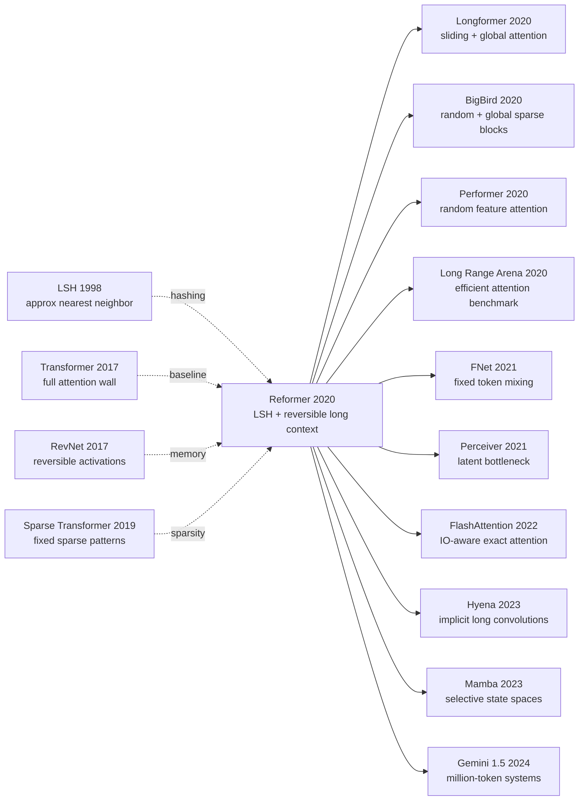

# Reformer — LSH and Reversible Layers for Million-Token Transformers

> **In January 2020, Nikita Kitaev, Lukasz Kaiser, and Anselm Levskaya used the ICLR 2020 oral paper [Reformer: The Efficient Transformer](https://arxiv.org/abs/2001.04451) to ask an uncomfortably practical question: are Transformers hard to train because they are inherently too large, or because they spend memory in the wrong places?** Standard self-attention compares every pair in a 100K-token sequence, and training stores activations layer after layer for backpropagation. Reformer answered not with another model-parallel recipe but with three algorithmic bills to cut: LSH attention to find likely neighbors, reversible residual layers to reconstruct activations instead of storing them, and chunked feed-forward/output computation to avoid the fattest intermediate tensors. Google Research described it that same month as a Transformer that could handle context windows up to one million words on a single 16GB accelerator. LSH attention did not become the dominant industrial path for LLMs, but the paper forced every later long-context system to face the same accounting problem: context length is not a marketing number; it is a memory ledger.

## TL;DR

Kitaev, Kaiser, and Levskaya's 2020 ICLR paper Reformer decomposes the long-sequence bottleneck of the Transformer (2017) into two bills: the $O(L^2)$ attention matrix and the $O(NL)$ stack of training activations. It then pays those bills separately: LSH attention hashes similar query/key vectors into the same buckets and attends within sorted chunks, while reversible residual layers reconstruct activations during backpropagation instead of storing every layer. The paper reports that reversible Transformer layers keep WMT14 En-De quality essentially intact (27.6 BLEU for a base model at 100K steps versus 27.3 for Transformer base), that LSH attention approaches full attention with enough hash rounds, and that a 12-layer Reformer can reach 1.05 bits/dim on enwik8 after longer tuning. Its real failed baseline was not a single low-performing architecture but the default engineering reflex of "keep full attention, checkpoint harder, and buy more accelerators." Later systems such as [Longformer (2020)](https://arxiv.org/abs/2004.05150), BigBird, Performer, FlashAttention, Mamba, and Gemini 1.5 all answer the same question through different mechanisms. The counterintuitive lesson is that Reformer mattered less because LSH became the winner, and more because it turned "long context" from a vague capability claim into a concrete memory-complexity ledger.

---

## Historical Context

### What was the Transformer field stuck on in 2020?

After the Transformer pushed RNNs out of the center of machine translation in 2017, the field quickly discovered an awkward fact: attention is expressive, but the bill arrives early. Sentence-level translation with tens or hundreds of tokens was manageable. BERT and GPT-2 windows of 512, 1024, or 2048 tokens already leaned on mixed precision, gradient accumulation, checkpointing, and model parallelism. Once text, music, images, or video were flattened into 10K-, 64K-, or 100K-position sequences, the standard full-attention matrix simply consumed accelerator memory.

The arithmetic in Reformer’s introduction is revealing. A 0.5B-parameter layer takes about 2GB; activations for 64K tokens, hidden size 1024, and batch size 8 also take about 2GB. By that rough single-layer accounting, a large Transformer should not be impossible on one accelerator. The real breaks appear in three places: activations must be saved layer by layer for backpropagation, feed-forward width $d_{ff}$ is often four times $d_{model}$, and attention is $O(L^2)$ in both time and memory. In other words, Transformers did not fail to grow only because parameters were too numerous; they failed because intermediate states were too fat.

Several lines were already trying to soften the problem. Sparse Transformer used fixed sparse patterns to remove many pairwise connections. Transformer-XL and Compressive Transformer extended usable history through recurrence or compressed memory. Adaptive Attention Span learned local windows per head. Memory Networks and Product Key Memory treated large memory as external lookup. Each path had a cost: sparse patterns were hand-designed, long-range access was not fully content-adaptive, or external memory required special structure. Reformer’s distinctive move was to turn “tokens with similar content should attend to each other” into approximate nearest-neighbor search, then turn activation memory into a reversible-network problem.

### The 4 predecessor lines that pushed Reformer out

- **Transformer (Vaswani et al., 2017)**: supplied scaled dot-product attention and also the $O(L^2)$ wall. Every Reformer design is aimed at preserving Transformer modeling while cutting the memory ledger.
- **Sparse Transformer (Child et al., 2019)**: proved patterned sparse attention could lengthen image and music sequences, but fixed patterns did not know content similarity. Reformer’s LSH attention can be read as content-driven sparse attention.
- **RevNet (Gomez et al., 2017)**: demonstrated “backpropagation without storing activations” through reversible residual blocks. Reformer imports that CV memory-saving trick into Transformer blocks, placing attention and feed-forward layers into the $F/G$ branches.
- **Angular LSH (Andoni et al., 2015)**: provided a practical way to hash vectors by angular distance. Reformer does not invent LSH; it inserts LSH into the inner loop of QK attention.

### What was the author team doing?

Nikita Kitaev was a UC Berkeley student, Lukasz Kaiser was at Google Research, and Anselm Levskaya was also at Google. Kaiser is an important name in the engineering history around Transformers: Tensor2Tensor, Trax, and Mesh-TensorFlow all sit in the ecosystem of making model training scalable and usable. Reformer’s official implementation lives in Google Trax, and Google Research’s January 2020 blog framed it explicitly as part of an open research engineering tradition.

That author mix shapes the paper’s tone. This is not a pure leaderboard language-model paper. It reads like a systems audit. The paper does not claim to solve every NLP benchmark, nor does it package the experiments as “million-token understanding is solved.” It says something more useful: if you really want Transformers to read whole books, long videos, or high-resolution images, first account for attention and activations precisely.

### State of industry, compute, and data

- **Hardware**: V100s and TPU v3s were the common research accelerators, and 16GB memory was still a practical boundary for many single-device experiments; “training long sequences on one accelerator” was itself a strong claim.
- **Models**: BERT, GPT-2, and T5 had shown that pretraining scaled, but their useful context windows were still hundreds to a few thousand tokens. GPT-3 had not yet been formally published, and the industrial LLM scaling wave was just beginning.
- **Tasks**: enwik8, imagenet64, and WMT14 En-De were enough to expose long-sequence and memory bottlenecks, but they were not yet today’s million-token retrieval, codebase, or video-QA workloads.
- **Community anxiety**: everyone knew long context mattered; fewer people could say exactly where the cost came from. Reformer’s historical value is that it decomposed the problem into testable algorithmic components.

## Background and Motivation

### Field status

By early 2020, Transformer had become NLP’s default backbone, but the default backbone still assumed short windows: BERT at 512, GPT-2 commonly around 1024, and T5 mainly serving text-to-text tasks. Real-world sequences were far longer. A novel may contain hundreds of thousands of words; video frames flattened into patches can produce tens of thousands of positions; even 64×64 RGB images, serialized pixel by pixel, are around 12K tokens. Standard Transformer did not merely degrade on these inputs; it often did not fit.

### Existing pain points

There were three layers of pain. First, full attention must explicitly or implicitly process every query-key similarity, and at $L=64K$ the matrix is beyond ordinary experimentation. Second, training stores every layer input for backward propagation, so depth turns into an activation stack. Third, the feed-forward sublayer often has $d_{ff}=4d_{model}$, meaning much of the memory is spent on MLP intermediate tensors rather than on attention alone.

### Core tension

Long context needs content selection. The useful operation is not “let every token inspect every other token,” but “let a token find a small set of distant tokens that might matter.” Yet if the selection mechanism itself requires computing all pairs, it has saved nothing. Reformer’s core tension is: **how can a model find candidate attention targets without first computing $QK^T$?** LSH provides an approximate answer: use random rotations and hash buckets so similar vectors collide with high probability, then run local full attention inside the sorted buckets.

### Paper objective

Reformer aims to show three things. First, LSH attention can be close enough to full attention, especially with multiple hashing rounds. Second, reversible Transformer layers can save activation memory without a major quality drop. Third, LSH, reversibility, and chunking together can train models on 64K/12K-scale sequences and make the Google-blog claim of a one-million-word window on a single 16GB accelerator a credible direction rather than a slogan.

### Core idea

Reformer’s core idea is not a single trick but a principle of retaining only necessary information. Attention is computed exactly only among likely content neighbors; layer activations are reconstructed when needed for backpropagation; feed-forward and output computations keep only chunk-local intermediate tensors. It does not overthrow the Transformer. It replaces each memory hotspot with something approximate, recomputable, or chunkable.

---

## Method Deep Dive

### Overall Framework

Reformer is best understood as “replace the three memory hotspots of a standard decoder-only Transformer one by one.” Attention changes from full softmax to an LSH approximation; the residual stack changes from non-reversible to reversible; feed-forward and output computation change from full-sequence parallel execution to chunked computation. The model still keeps the basic Transformer ingredients: embedding, multi-head attention, position-wise feed-forward layers, residual connections, and LayerNorm. It is not a new family of sequence models so much as a long-context memory surgery on the Transformer.

```text
input sequence x[1:L]
  -> token / pixel embedding + positional encoding
  -> N Reformer blocks:
       split hidden into x1, x2
       y1 = x1 + LSHAttention(LayerNorm(x2))
       y2 = x2 + FeedForward(LayerNorm(y1))   # feed-forward can run by chunks
       output hidden = concat(y1, y2)
  -> chunked output logits / loss
```

The largest difference from a standard Transformer is ordering. A standard model constructs the full $QK^T$ score matrix and then applies softmax. Reformer first uses hashing to shrink the candidate set, then applies ordinary attention inside that candidate set. In other words, it does not turn attention into an entirely different mathematical object; it lets full attention happen only inside a small neighborhood that is likely to matter.

| Component | Standard Transformer | Reformer | Main benefit | Main cost |
|-----------|----------------------|----------|--------------|-----------|
| Attention | full scaled dot-product | shared-QK + LSH bucket attention | approximate $O(L^2)$ to $O(L\log L)$ | approximation error, hash-round hyperparameter |
| Residual stack | store every layer activation | reversible residual block | activation memory no longer grows linearly with depth | recomputation in backward |
| Feed-forward | compute whole sequence at once | chunked feed-forward | avoids $bLd_{ff}$ peak | slightly slower wall-clock |
| Output loss | whole-sequence logits at once | chunked log-prob / loss | saves memory with large vocabularies | more implementation complexity |
| Position | ordinary positional encodings / axial variants | long-sequence position handling remains hard | enables longer runs | extrapolation not truly solved |

**Counter-intuition**: Reformer’s most important “capability” comes from saving memory, not from adding parameters. Its claim is not “LSH is more accurate than full attention.” It is “when full attention no longer fits, approximate attention plus reversible training makes the problem trainable again.” That is also why the paper does not apply LSH attention to WMT14 sentence translation: when examples are shorter than the typical 128-token LSH chunk, the approximation is unnecessary.

### Key Designs

#### Design 1: Shared-QK + Angular LSH Attention — find candidate neighbors without computing full $QK^T$

**Function**: Map each token’s query/key vector into a shared space, use angular locality-sensitive hashing so similar vectors collide in the same bucket with high probability, and compute attention only among tokens in the same bucket. This obtains an approximate content neighborhood without first constructing the full $L \times L$ similarity matrix.

The prerequisite is shared-QK attention: Reformer sets the key equal to a normalized query, $k_j = q_j / \|q_j\|$. Each position therefore has only one vector to hash, and query/key buckets are automatically aligned, avoiding the batching pathology where a bucket contains queries but no keys. Angular LSH uses a random rotation matrix $R$, projects vectors onto signed axes, and assigns the bucket by the largest signed projection.

$$
h(x) = \arg\max([xR; -xR]), \quad k_j = \frac{q_j}{\|q_j\|}, \quad \mathcal{P}_i = \{j : h(q_i) = h(q_j)\}
$$

**PyTorch-style pseudocode**:

```python
def angular_lsh_buckets(query_vectors, num_buckets, random_rotations):
    normalized_queries = query_vectors / query_vectors.norm(dim=-1, keepdim=True)
    projections = normalized_queries @ random_rotations
    signed_projections = torch.cat([projections, -projections], dim=-1)
    bucket_ids = signed_projections.argmax(dim=-1) % num_buckets
    return bucket_ids, normalized_queries
```

| Candidate selection | Content-driven | Requires full $QK^T$ | Long-range dependency | Reformer’s judgment |
|---------------------|----------------|----------------------|----------------------|---------------------|
| Full attention | yes | yes | strongest | accurate but too expensive |
| Local window | no | no | weak | cheap but misses distant information |
| Fixed sparse pattern | partial | no | medium | pattern is hand-designed |
| **LSH bucket** | **yes** | **no** | **strong but approximate** | paper choice |

**Design rationale**: In long text, “similar content appears again far away” is normal: variable names, entities, rhymes, and repeated image textures may be separated by thousands of positions. Fixed local windows miss those links; full attention finds them but is too expensive. LSH is the compromise. It does not guarantee every relevant token lands in the same bucket, but multiple hash rounds increase collision probability. The paper’s duplication task is built exactly to test non-local lookup: local sparse attention cannot copy the first half of the sequence, while LSH train/eval can approach perfect accuracy.

#### Design 2: Sorted Chunk Attention + Multi-round Hashing — turn irregular buckets into batchable matrices

**Function**: Raw LSH bucket sizes are uneven and awkward for GPU/TPU batching. Reformer sorts the sequence by bucket id, cuts the sorted sequence into fixed-size chunks, and lets each chunk attend to itself plus the previous chunk. This turns “same-bucket neighbors” into regular matrix computation.

Let $s_i$ be the sorted position, $m$ be chunk size, and the visible set in hash round $r$ be:

$$
\mathcal{E}^{(r)}_i = \left\{ j : \left\lfloor\frac{s^{(r)}_i}{m}\right\rfloor - 1 \leq \left\lfloor\frac{s^{(r)}_j}{m}\right\rfloor \leq \left\lfloor\frac{s^{(r)}_i}{m}\right\rfloor \right\}, \quad \mathcal{P}_i = \bigcup_{r=1}^{n_r}\mathcal{P}^{(r)}_i
$$

To avoid double-counting the same key across multiple hash rounds, the paper adds a $\log N_{i,j}$ correction in the masking term. To prevent shared-QK causal attention from always selecting the token itself, the mask also forbids $i=j$ self-attention except when no earlier token is valid.

```python
def lsh_attention_round(hidden_states, bucket_ids, chunk_size):
    order = torch.argsort(bucket_ids, stable=True)
    sorted_states = hidden_states[order]
    chunks = sorted_states.reshape(-1, chunk_size, hidden_states.size(-1))
    previous_chunks = torch.roll(chunks, shifts=1, dims=0)
    candidate_blocks = torch.cat([previous_chunks, chunks], dim=1)
    attended_chunks = attend_within_blocks(chunks, candidate_blocks)
    return invert_permutation_and_merge(attended_chunks, order)
```

| Hash rounds | Compute cost | Duplication task eval behavior | Interpretation |
|-------------|--------------|--------------------------------|----------------|
| LSH-1 | lowest | train LSH-1, eval LSH-1: 77.9% | relevant tokens are often missed |
| LSH-2 | medium | train LSH-2, eval LSH-2: 98.1% | most matches recovered |
| LSH-4 | higher | train LSH-4, eval LSH-4: 99.9% | nearly perfect |
| LSH-8 | highest | LSH-trained models eval LSH-8: 99.9-100% | more eval hashes trade compute for accuracy |

**Design rationale**: Reformer’s LSH attention is not “loop over all buckets in Python.” That would be slow on accelerators. Sorting plus chunking maps content sparsity into local dense attention, letting the hardware still use matrix multiplication. It also exposes the design’s complexity: sorting, inverse sorting, duplicate-count correction, causal masks, and chunk overflow all become part of the kernel. These details are one reason LSH attention did not become the default general-purpose LLM kernel later.

#### Design 3: Reversible Transformer Blocks — reconstruct activations during backward propagation

**Function**: The backward pass of an ordinary residual block needs stored inputs for every layer. A reversible block makes the next layer’s outputs sufficient to recover the previous layer’s inputs, so training no longer needs to keep every activation in memory. Reformer splits the hidden state into two streams and places attention and feed-forward layers into the two reversible branches.

$$
y_1 = x_1 + F(x_2), \quad y_2 = x_2 + G(y_1); \qquad x_2 = y_2 - G(y_1), \quad x_1 = y_1 - F(x_2)
$$

In Reformer, $F$ is attention and $G$ is feed-forward; LayerNorm is moved inside the residual branches. The paper also notes that for parameter-count comparability, both $x_1$ and $x_2$ keep size $d_{model}$ rather than halving the hidden size.

```python
class ReversibleTransformerBlock(nn.Module):
    def forward(self, hidden_pair):
        hidden_left, hidden_right = hidden_pair
        updated_left = hidden_left + self.attention(self.norm_attention(hidden_right))
        updated_right = hidden_right + self.feed_forward(self.norm_ffn(updated_left))
        return updated_left, updated_right

    def reverse(self, updated_pair):
        updated_left, updated_right = updated_pair
        hidden_right = updated_right - self.feed_forward(self.norm_ffn(updated_left))
        hidden_left = updated_left - self.attention(self.norm_attention(hidden_right))
        return hidden_left, hidden_right
```

| Training method | Activation memory | Extra compute | Numerical behavior | Best fit |
|-----------------|-------------------|---------------|--------------------|----------|
| Ordinary residual | grows linearly with depth | none | simplest | short sequences / small models |
| Gradient checkpointing | stores selected activations | recomputes some layers in backward | general | common large models |
| **Reversible block** | **roughly depth-independent** | **recomputes F/G in backward** | structure constrained | long-sequence deep models |

**Design rationale**: One sober point in the Reformer paper is that even if attention is cheaper, deep models can still be blocked by the activation stack. Reversible layers solve a bottleneck independent of $L^2$. Their cost is explicit: backward propagation recomputes attention and FFN, so training time increases; the architecture must also satisfy a reversible form. But in long-sequence settings, fitting into memory often matters more than saving a bit of compute.

#### Design 4: Feed-forward / Output Chunking — change peak memory, not the function

**Function**: Transformer FFN computation is independent across sequence positions. Computing the whole sequence at once and computing it chunk by chunk are mathematically identical. Reformer uses this property to split the $d_{ff}$ intermediate tensor into small pieces and reduce peak memory; for large vocabularies, output log-probabilities and loss can also be computed over sequence sections.

$$
Y_2 = [Y_2^{(1)}; \ldots; Y_2^{(c)}] = [X_2^{(1)} + \mathrm{FFN}(Y_1^{(1)}); \ldots; X_2^{(c)} + \mathrm{FFN}(Y_1^{(c)})]
$$

```python
def chunked_feed_forward(hidden_states, feed_forward, chunk_size):
    outputs = []
    for hidden_chunk in hidden_states.split(chunk_size, dim=1):
        outputs.append(feed_forward(hidden_chunk))
    return torch.cat(outputs, dim=1)
```

| Module | Standard peak memory | Chunked peak memory | Changes model function | Main cost |
|--------|----------------------|---------------------|------------------------|-----------|
| FFN hidden | $bLd_{ff}$ | $b(L/c)d_{ff}$ | no | loop / kernel launch |
| Output logits | $bL|V|$ | $b(L/c)|V|$ | no | more complex loss aggregation |
| Reversible reverse pass | full layer inputs stored | recompute by chunks | no | slower backward |

**Design rationale**: Chunking is the least “paper-like” Reformer design, yet it matters. LSH attention removes the attention matrix, reversible layers remove depth-wise activation storage, but $d_{ff}$ and vocabulary logits can still create peak-memory spikes. Chunking does not change the model, loss, or introduce approximation error. It simply admits that full-sequence parallel computation is not free. Many later long-context systems follow the same principle: optimize theoretical complexity and actual peak memory separately.

### Loss Function / Training Recipe

Reformer does not introduce a new language-modeling loss. Its experiments mainly use standard autoregressive next-token loss or the corresponding task loss. The changed parts are attention, residuals, and chunked implementation. The paper uses Adafactor for enwik8-64K and imagenet64 ablations, follows Transformer hyperparameters on WMT14 En-De, and parallelizes experiments across 8 devices.

| Dimension | Paper setting | Purpose |
|-----------|---------------|---------|
| Long-text task | enwik8-64K, $2^{16}=64K$ tokens | test ultra-long character-level language modeling |
| Image task | imagenet64, 12K-length serialized image sequence | test long-sequence image generation |
| Translation | WMT14 English-German | check whether reversible layers hurt short-sequence seq2seq BLEU |
| Ablation model | 3 layers, $d_{model}=1024$, $d_{ff}=4096$, 8 heads, batch size 8 | keep the full Transformer baseline runnable |
| Optimizer | Adafactor | reduce optimizer memory |
| Large model | up to 20-layer big Reformer | verify that deep long-sequence models fit |

The final complexity table should be read intuitively. A standard Transformer has both the $bn_hL^2$ attention term and the $bLd_{ff}n_l$ activation term. Reformer tries to compress these into terms like $bn_hLn_rc$ and $bLd_{model}$, where $n_r$ is the number of hash rounds and $c$ is the chunk-related constant. It is not a free linearization of attention; it replaces an unaffordable quadratic matrix with tunable hash-round and chunk-size budgets.

That is Reformer’s broader method lesson: a long-context model cannot report only its maximum window. It must account for four ledgers behind that window: attention compute, attention memory, activation memory, and output/logit memory. Optimizing one ledger while ignoring the other three can still leave the model impossible to run.

---

## Failed Baselines

### What was the real failed baseline?

Reformer’s failure cases should not be read as “one model scored lower than another.” Its largest baseline was the default engineering posture of 2020: keep full attention, use stronger hardware, smaller batches, shorter windows, activation checkpointing, and model parallelism to push through. That baseline is of course strong on short sequences. But once the input becomes 64K, 100K, or million-token scale, it does not lose by BLEU; it loses by not running.

| Baseline | Failure point | Paper evidence / context | Reformer’s answer |
|----------|---------------|--------------------------|-------------------|
| Full attention Transformer | $O(L^2)$ attention explodes memory/time at 64K+ | paper notes large models cannot be fine-tuned on one machine; large full baseline is too slow and memory-hungry | LSH attention |
| Memory-efficient full attention | can recompute attention matrix but still has $O(L^2)$ complexity | listed as a baseline, but saves storage rather than compute | approximate sparse candidate set |
| Fixed sparse attention | saves compute, but pattern is not content-driven | Sparse Transformer is the direct predecessor; distant relevant tokens can be missed | content-driven LSH buckets |
| Gradient checkpointing | stores fewer activations, but still grows with layers and modules | does not remove $d_{ff}$ / output-logit peaks | reversible layers + chunking |

The most important failure is “full-matrix attention as the eternal default.” Reformer does not prove full attention has worse quality. It proves that full attention has poor engineering survivability on long sequences. That distinction matters. If the task has only 128 tokens, Reformer itself does not use LSH; if the task has 64K tokens, full attention’s greater accuracy may be irrelevant because it is unaffordable.

### Counterexamples and ablations inside the paper

The cleanest counterexample is the duplication synthetic task. Each example has the form $0w0w$, and the loss is counted only on the second half; the model must copy tokens from far earlier positions. Local-window sparse attention cannot solve this in principle. The results show that a full-attention-trained model drops substantially under LSH evaluation, but models trained from scratch with LSH attention become almost perfect when evaluated with more hash rounds.

| Train / Eval | Full Attention | LSH-8 | LSH-4 | LSH-2 | LSH-1 |
|--------------|----------------|-------|-------|-------|-------|
| Full Attention | 100% | 94.8% | 92.5% | 76.9% | 52.5% |
| LSH-4 | 0.8% | 100% | 99.9% | 99.4% | 91.9% |
| LSH-2 | 0.8% | 100% | 99.9% | 98.1% | 86.8% |
| LSH-1 | 0.8% | 99.9% | 99.6% | 94.8% | 77.9% |

The table has two counterintuitive lessons. First, a model trained with full attention cannot necessarily switch painlessly to LSH at evaluation time; the attention pattern is part of the training distribution. Second, LSH-trained models can reach 99.9-100% under LSH-8 evaluation, meaning the approximation is not merely “quality loss for speed.” With train/eval consistency, the model can learn to exploit its own sparse structure.

### Failure lessons

Reformer also exposes its own boundary conditions. LSH attention requires hashing, sorting, chunking, masking, and inverse permutation. That whole pipeline is not automatically friendlier to 2020 hardware than dense matrix multiplication. If sequences are not long enough, sorting overhead can dominate the savings. Modern GPU/TPU kernels also became extremely optimized for dense attention, and FlashAttention later showed that exact attention, implemented with IO awareness, can beat complicated sparse kernels at many practical lengths.

So Reformer’s failure is not “the paper was wrong.” It is that it chose an algorithmically elegant but industrially difficult route. It successfully identified the long-sequence bill of full attention, while later production systems often paid with a different bundle: FlashAttention, paged KV cache, RoPE scaling, retrieval, block sparsity, and state-space models rather than direct LSH attention reuse.

## Key Experimental Data

### Main experimental setup

The paper deliberately chooses tasks that expose long-sequence constraints rather than only chasing short-sentence translation scores. enwik8-64K cuts character language modeling into $2^{16}=64K$ tokens; imagenet64 is serialized into roughly 12K positions; WMT14 En-De isolates the question “do reversible layers damage quality?” because short sentences do not need LSH.

| Task | Sequence length / data | Model setting | Main question |
|------|------------------------|---------------|---------------|
| Duplication synthetic | 1024 tokens | 1-layer, $d=256$, 4 heads | can LSH recover distant repetition? |
| enwik8-64K | 64K tokens | 3-layer ablation / 12-layer tuned | long-text LM and speed |
| imagenet64 | ~12K tokens | 3-layer ablation / deeper Reformer | long image-sequence generation |
| WMT14 En-De | short sentence translation | reversible encoder-decoder | do reversible layers hurt BLEU? |

### WMT14 and reversible-layer data

The WMT14 table demonstrates that reversible layers are not free, but they can preserve quality. The paper does not use LSH on WMT because all test-set sentences are shorter than the typical LSH chunk; this isolates the reversible Transformer.

| Model | BLEU | sacreBLEU uncased | sacreBLEU cased | Conclusion |
|-------|------|-------------------|-----------------|------------|
| Transformer base | 27.3 | — | — | original baseline |
| Transformer big | 28.4 | — | — | strong baseline |
| Reversible base, 100K steps | 27.6 | 27.4 | 26.9 | base quality preserved |
| Reversible base, 500K, no weight sharing | 28.0 | 27.9 | 27.4 | longer training improves it |
| Reversible big, 300K, no weight sharing | 29.1 | 28.9 | 28.4 | near / above big baseline |

These numbers show that the main risk of reversibility is not quality collapse, but implementation and recomputation cost. If a system is willing to spend backward recomputation to save memory, reversible layers are viable.

### Long-sequence and speed data

The paper does not present a neat leaderboard where “Reformer beats everything.” It gives a more systems-like evidence chain: shared-QK does not damage performance, reversible layers preserve learning curves, more LSH rounds approach full attention, LSH attention becomes relatively faster as sequences grow, and large models fit and train.

| Evidence point | Data | Meaning |
|----------------|------|---------|
| Shared-QK ablation | enwik8 curve no worse than ordinary Q/K | LSH prerequisite is acceptable |
| Reversible ablation | enwik8 / imagenet64 curves close to ordinary Transformer | saving activations need not cost much quality |
| Large Reformer | 12-layer, 20K steps, enwik8 test 1.19 bits/dim | deep long-sequence model is trainable |
| Tuned large Reformer | 12-layer longer run, enwik8 test 1.05 bits/dim | quality can improve with tuning |
| Google blog claim | up to 1M words on one 16GB accelerator | engineering ambition publicly productized |

### Key findings

- **LSH is not a plug-and-play evaluation trick**: a full-attention model drops when simply switched to LSH; LSH should be part of the training distribution.
- **Reversibility is the most stable saving**: the paper’s reversible Transformer learning curves and WMT BLEU stay close to the original model.
- **Chunking is unglamorous but necessary**: without handling $d_{ff}$ and output logits, memory saved from attention can still be consumed by MLPs or vocabulary projections.
- **The longer the sequence, the more Reformer matters**: LSH is unnecessary on short translation sentences; the asymptotic benefit appears in 64K/100K-scale settings.
- **The paper’s numbers were not the final answer**: later work such as Long Range Arena, FlashAttention, and Mamba showed that efficient attention must be evaluated with standardized tasks, kernels, and wall-clock accounting.

---

## Idea Lineage

### Mermaid Citation Graph



### Past Lives

- **1998 LSH / approximate nearest neighbor**: Reformer’s “find candidates first, compute precisely later” comes from classical approximate nearest-neighbor search. It moves candidate selection in attention away from an all-pairs neural softmax and into a discrete hash-collision structure.
- **2017 Transformer**: Transformer made all-to-all token interaction the default, but it also injected $O(L^2)$ into every long-sequence task. “Efficient Transformer” in Reformer’s title is not a decorative phrase; it is a memory audit of the original architecture.
- **2017 RevNet**: Gomez et al.’s reversible residual networks showed that deep networks need not store every activation. Reformer transports that idea from image classification into sequence modeling, placing attention and FFN into the two branches of a reversible residual block.
- **2019 Sparse Transformer**: Child et al.’s sparse patterns showed that long-sequence generation could bypass full attention, but fixed patterns lacked content adaptivity. Reformer inherits the sparsification motivation and uses LSH so tokens choose distant neighbors by content.
- **2019 Adaptive Attention Span / Product Key Memory**: these works ask the same broader question: must a Transformer treat every position as an equally plausible candidate? Reformer’s answer is “no, retrieve first.”

### Descendants

**Direct descendants**: Longformer, BigBird, ETC, Routing Transformer, Linformer, Performer, Sparse Sinkhorn Attention, Synthesizer, FNet, and Nyströmformer all belong on Reformer’s map. They do not necessarily inherit LSH, but they inherit the problem statement that full attention is not the only default. Longformer and BigBird choose sparse structures that are easier to kernelize; Performer and Nyströmformer use random-feature or low-rank approximations; FNet and Synthesizer ask more aggressively whether attention must depend on pairwise dot products at all.

**Cross-architecture borrowing**: Perceiver uses a latent bottleneck to compress huge inputs into a small set of latent queries. LongT5, Memorizing Transformer, LongNet, and Infini-attention combine long context with memory, compression, or dilation. Their mechanisms differ from Reformer, but they accept the same premise: context length must be paid for jointly by architecture and systems.

**Cross-task penetration**: OpenAlex’s citing list shows Deformable DETR, LoFTR, MaX-DeepLab, ViViT, Autoformer, Anomaly Transformer, and other vision/time-series works citing Reformer or the efficient-attention context. Long context is not only a text problem. High-resolution images, video, remote sensing, and time series all push token counts toward the full-attention boundary.

**Cross-disciplinary spillover**: There is no clean single line where Reformer itself becomes a core physics or biology method. The more accurate statement is broader: approximate retrieval, reversible computation, and chunked execution entered the toolkit of scientific ML and long-sequence modeling, but Reformer did not become a cross-disciplinary template in the way DDPM did.

### Misreadings

- **Misreading 1: Reformer = LSH attention.** That is only one third of the paper. The actual package is LSH attention plus reversible layers plus chunking. If attention alone is changed while the activation stack and $d_{ff}$ peaks remain, long-sequence training can still fail.
- **Misreading 2: Reformer proved approximate attention was the only future.** Later history did not agree. FlashAttention showed that exact attention, implemented with IO-aware kernels, can be stronger at many practical lengths; Mamba and Hyena showed another path is leaving attention. Reformer proved the full-attention bill must be optimized, not that LSH must win.
- **Misreading 3: million-token context was solved in 2020.** Google’s “1 million words on one 16GB accelerator” was a strong claim about runnable engineering, not the same as today’s million-token LLM inference, retrieval, needle-in-a-haystack, or multi-hop reasoning behavior. Fitting, training, and reliable use are three different levels.
- **Misreading 4: Reformer failed, so it is unimportant.** The LSH route did not become the mainstream, but that does not make the paper minor. Many classic papers matter because they define the problem clearly rather than leave the final module. Reformer turned long context from “give the model a bigger window” into a joint problem of attention compute, attention memory, activation memory, and kernel efficiency.

---

## Modern Perspective

### Assumptions that no longer hold

- **“LSH attention will become the default long-context kernel.”** By 2026 this does not hold. Modern LLM systems more often use FlashAttention, ring attention, paged KV cache, block sparsity, retrieval, RoPE scaling, or state-space models. The reason is not only algorithmic accuracy but kernel ecology: hash + sort + chunk + unpermute is hardware-awkward, while dense exact attention became extremely strong through IO optimization.
- **“Once attention complexity is reduced, long context is solved.”** Not true. Reformer itself already identifies activation memory, feed-forward peaks, and output logits as separate bills. Today’s long-context LLMs also face KV cache size, positional extrapolation, training length distribution, needle retrieval, multi-hop reasoning, and evaluation contamination. Attention is only one ledger.
- **“A million-token model that fits is a million-token model that understands.”** Google Research’s 2020 one-million-word claim was an engineering milestone, but today people ask whether a model can reliably find needles, synthesize across documents, preserve details, and avoid position bias across that window. Reformer addresses runnability, not the entire cognitive behavior.
- **“Approximate attention is necessarily cheaper than exact attention.”** After FlashAttention, this is no longer always true. Lower theoretical complexity does not guarantee faster wall-clock time; memory access, kernel fusion, sorting overhead, and batch shape can change the conclusion.
- **“Long context must be implemented by attention.”** Mamba, Hyena, RetNet, and RWKV reopened another route: model long-range dependencies with state spaces, implicit convolutions, or recurrent-like mechanisms, while reserving attention for local or retrieval-heavy settings.

### What history proved essential vs. redundant

The essential part of Reformer is that it split long context into multiple ledgers: attention compute, attention memory, activation memory, and FFN/output peak memory. Any serious long-context system today must account for these metrics together. It also emphasized train/eval attention-pattern consistency: one cannot casually swap a full-attention model to sparse attention and expect no degradation.

The more redundant part is the specific LSH mechanism. LSH is theoretically elegant, but in general-purpose large models it was pushed to the margins by options easier to optimize: fixed/block sparsity is easier to implement; low-rank and random-feature methods look more like matrix approximations; FlashAttention optimizes exact attention directly; SSMs avoid attention. Reversible Transformer layers also did not become the default for LLMs because large-scale training more often uses activation checkpointing, tensor/pipeline parallelism, ZeRO, and FSDP. The underlying idea of recomputation for memory, however, is very much alive.

### If Reformer were rewritten today

If Reformer were rewritten in 2026, LSH would probably not be the sole protagonist. A modern version would likely:

- **Use FlashAttention as the exact-attention baseline**, separating theoretical complexity from real kernel time.
- **Hybridize LSH with block sparse / sliding window / global tokens**, avoiding pure-hash sorting overhead and loss of local structure.
- **Put RoPE scaling / ALiBi / positional interpolation into the core experiments**, because long-context failure often comes from positional extrapolation, not only attention memory.
- **Evaluate on Long Range Arena, needle-in-a-haystack, code retrieval, and long-document QA**, rather than only enwik8 / imagenet64.
- **Include KV cache and serving cost in the design**, because modern LLM long-context bottlenecks often appear at inference time, not only during training.
- **Compare directly with SSM and recurrent alternatives**, acknowledging that long-range dependency is no longer an attention-family-only problem.

The core philosophy would remain unchanged: first ask where memory is spent, then choose the architecture. Reformer’s legacy is not LSH as the single answer, but an engineering ethic: do not hide memory accounting behind a dramatic context-length number.

## Limitations and Future Directions

### Limitations acknowledged or exposed by the paper

- LSH attention is approximate; fewer hash rounds can miss relevant tokens, and the duplication task shows clear degradation under LSH-1 evaluation.
- LSH attention is not useful for short sequences; the authors explicitly avoid it on WMT14 because test sentences are shorter than a typical 128-token chunk.
- Reversible layers save memory but require recomputation during backward propagation, so training time is not free.
- Chunking reduces peak memory but introduces extra loop / kernel overhead.
- The experiments establish “trainable and close to full attention,” but they do not create the later standardized benchmarks for long-context understanding.

### Additional limitations visible in hindsight

- **Kernel complexity**: hash, sort, unpermute, and masking are less natural for real hardware than dense matmul, so theoretical savings do not easily become wall-clock savings.
- **Positional encoding remains unresolved**: saving long-sequence attention memory does not imply that the model extrapolates to longer positions. Modern reliance on RoPE, ALiBi, and interpolation shows this is a separate problem.
- **Evaluation is not modern enough**: enwik8 bits/dim and imagenet64 generation prove trainability, but not reliable long-document reasoning, retrieval, or memory.
- **Ecosystem migration cost is high**: Reformer depends on Trax/JAX-era implementation choices and complex kernels, making reuse harder in the PyTorch/HuggingFace mainstream.
- **Reversibility constrains architecture freedom**: modern Transformer blocks often include gated MLPs, MoE, cross-attention, adapters, and LoRA; making all of that reversible is not always natural.

### Improvement directions

- **Systems**: use FlashAttention, sequence parallelism, paged attention, and ring attention as strong baselines before evaluating any sparse approximation.
- **Algorithms**: mix local, global, and retrieval attention rather than pure LSH; add learned routing or stable sorting to hash buckets.
- **Models**: combine SSM/Hyena/Mamba-style linear long-sequence modules with attention reserved for key retrieval positions.
- **Evaluation**: move from bits/dim to long-context QA, multi-hop retrieval, codebase navigation, and video temporal reasoning.
- **Training**: design train context length, inference context length, positional encoding, and data curriculum together, rather than merely stretching the window.

## Related Work and Insights

### Relationship to successor lines

Reformer’s relationship to Longformer and BigBird is a fork between “content-driven sparsity” and “structured sparsity.” Reformer is more flexible but more kernel-complex; Longformer and BigBird are more hand-designed but easier to implement reliably. Its relationship to Performer, Linformer, and Nyströmformer is a fork between “hashing neighbors” and “matrix approximation”: the former chooses candidate sets, while the latter approximates softmax or low-rank structure.

Its relationship to FlashAttention is especially interesting. FlashAttention does not reduce the $O(L^2)$ theoretical complexity, but through tiling and SRAM-aware computation it dramatically reduces real memory traffic. It reads like a reply to Reformer: before approximating the math, first implement exact attention correctly. Its relationship to Mamba and Hyena is an even larger route split: if the attention bill is too hard to pay, perhaps long-range modeling should be paid for with state spaces or long convolutions.

The research lessons are threefold. First, a complexity table is not decoration; it is the method’s central claim. Second, long context must be measured across training and inference; solving training memory alone is not enough. Third, a module can fail while its problem definition succeeds. Reformer’s LSH did not dominate LLMs, but the memory ledger it defined still dominates long-context research.

## Resources

- 📄 [arXiv 2001.04451 — Reformer: The Efficient Transformer](https://arxiv.org/abs/2001.04451)
- 📝 [OpenReview ICLR 2020 page](https://openreview.net/forum?id=rkgNKkHtvB)
- 🧠 [Google Research blog — Reformer: The Efficient Transformer](https://research.google/blog/reformer-the-efficient-transformer/)
- 💻 [Official Trax Reformer code](https://github.com/google/trax/tree/master/trax/models/reformer)
- 📚 Follow-up reading: [Longformer](https://arxiv.org/abs/2004.05150), [BigBird](https://arxiv.org/abs/2007.14062), [Performer](https://arxiv.org/abs/2009.14794), [FlashAttention](https://arxiv.org/abs/2205.14135), [Mamba](https://arxiv.org/abs/2312.00752)
- 🔍 Evaluation trail: [Long Range Arena](https://arxiv.org/abs/2011.04006), [Efficient Transformers: A Survey](https://arxiv.org/abs/2009.06732)


---

> 🌐 [中文版](/era4_foundation_models/2020_reformer/) · 📚 awesome-papers project · CC-BY-NC