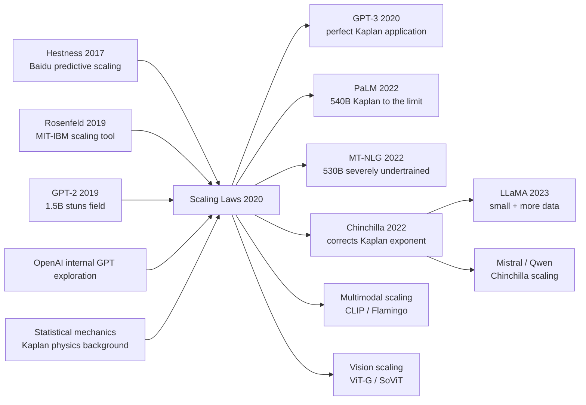

# Scaling Laws for Neural Language Models

> **January 23, 2020. Kaplan, McCandlish, and 8 co-authors at OpenAI upload [arXiv 2001.08361](https://arxiv.org/abs/2001.08361).**
> A technical report that released no model, but wrote the "laws of physics" for the entire LLM era — after running ~10,000 small-scale training experiments, the OpenAI team discovered LLM cross-entropy loss **strictly follows a power law $L(N,D,C) \propto N^{-\alpha}\cdot D^{-\beta}$** along three axes (parameters $N$, data $D$, compute $C$), with error under 1% across 6 orders of magnitude.
> The discovery directly told OpenAI: **given a fixed compute budget, the optimal allocation is "parameters $\propto C^{0.73}$, data $\propto C^{0.27}$"** — a formula they then plugged straight into GPT-3 (175B) 4 months later, burning \$4.6M of training spend; corrected 2 years later by Chinchilla (2022) (over-parameterized, under-trained).
> Its deepest impact isn't the formula itself but that it **pushed AI from the "design clever models" era into the "scale by law" era** — Sutton's *Bitter Lesson* finally got a quantifiable predictive equation, and the entire industry began planning compute purchases by scaling laws.

## TL;DR

Kaplan et al. systematically train **300+ Transformer LMs at varying scales** (parameters from 768 to 1.5B, data from 22M to 23B tokens, compute spanning 7 orders of magnitude) and discover that LM test loss **strictly follows a 7-orders-of-magnitude power law**: $L(N) \propto N^{-0.076}$, $L(D) \propto D^{-0.095}$, $L(C) \propto C^{-0.050}$ — and that at fixed compute the larger model **always beats the smaller one** (even when neither has finished training). This 30-page technical report **directly seeded GPT-3 (175B, 2020), PaLM (540B, 2022), and the entire LLM scaling era**, turning "how big a model should I train" from engineer intuition into a **solvable optimisation problem**.

---

## Historical Context

### What Was the LM Community Stuck On in 2019?

To appreciate the audacity of Scaling Laws you must return to the 2019 chaos of "GPT-2 just shipped, everyone is guessing how to scale next."

BERT (340M, 2018) and GPT-2 (1.5B, 2019) pushed LM parameters from ~100M to 1.5B — everyone vaguely believed "bigger will be better," but **nobody could precisely state how much bigger, why bigger, how much compute, or how much data was needed**. The community was stuck in an awkward "pick one":

> **Add depth? Add width? Add data? No one could answer quantitatively.**

The specific pain points:
- **Architecture-tuning addiction**: 50+ "Improved Transformer" papers shipped during 2018-2019 (Sparse Transformer / Reformer / Adaptive Attention / ALBERT / ELECTRA), each claiming "X% gain over Transformer at fixed compute." But **do these improvements still hold at larger scale?** Nobody tested.
- **Data vs params vs compute trade-off was pure intuition**: industry "folk wisdom" said either "scaling the model is enough" or "data is king," with **zero quantitative guidance** — even OpenAI picked GPT-2's 1.5B by engineer intuition.
- **Training stop rules were murky**: when is training done? Train loss still falling but val plateaued? Train loss never converges? The field eyeballed plots.
- **Batch size / lr selection was pure grid search**: every new size required re-tuning, burning hundreds of thousands of dollars per grid search.

The community lacked one thing: **a quantitative model that predicts "given $X compute, what N, D, and batch size should I pick, and what loss will I land at?"** This was the root problem of pre-Scaling-Laws LM research.

> **Implicit anxiety in 2019: scale was the trend, but "how to scale" was alchemy, not science.**

Worse, the 2019 community was full of doubt that "scale will keep working" — many people (including LeCun, Marcus) believed LMs would soon hit a wall: parameters saturating at 10B, data overfitting at 100B tokens, 10× compute buying only 0.1 nats/token. **The real value of Scaling Laws is using a 7-orders-of-magnitude experiment to mathematise the "will it hit a wall" debate** — the loss curve's power law shows zero plateau across 7 orders of magnitude.

### The 3 Predecessors That Forced Scaling Laws Into Existence

- **Hestness et al., 2017 (Deep Learning Scaling is Predictable, Empirically)** [arxiv/1712.00409](https://arxiv.org/abs/1712.00409): Baidu Research's "spiritual prototype." **First systematic power-law scaling on image classification / LM / speech**, showing loss vs data is a straight line on log-log. But Hestness covered only 2-3 orders of magnitude with sub-100M models — limited paper impact, missed by most NLP scholars. Kaplan §2 directly tributes this "predecessor."
- **Rosenfeld et al., 2019 (A Constructive Prediction of the Generalization Error Across Scales)** [arxiv/1909.12673](https://arxiv.org/abs/1909.12673): MIT-IBM work formalising Hestness's observation, proposing the methodology of "scaling law as predictive tool." Still only covered < 1B params.
- **Brown / Radford et al. internal GPT-2 / GPT-3 exploration**: from GPT-1 (110M, 2018) to GPT-2 (1.5B, 2019), OpenAI internally trained dozens of LMs at varying sizes for calibration — these **unpublished internal experiments** are the true backbone of the Scaling Laws paper. The Kaplan team essentially systematised + publicly released "the scaling experiments OpenAI had been running internally for a year."

### What the Authors Were Doing at the Time

Jared Kaplan was an OpenAI Research Scientist with a physics PhD background (Johns Hopkins theoretical-physics professor moonlighting at OpenAI) — physicists have a natural instinct for "power law / scaling" (statistical mechanics / critical phenomena are fundamentally power laws). Sam McCandlish led OpenAI's scaling team (Dota 2 / GPT-3 compute planning). Tom Henighan / Tom Brown / Rewon Child / Alec Radford / Jeff Wu / Dario Amodei represent essentially OpenAI's entire LM team — Brown is GPT-3's first author, Radford invented the GPT series.

**This team composition itself prophesied Scaling Laws**: physicist (Kaplan) + scaling engineer (McCandlish) + LM experts (Brown / Radford) = "physicist's power-law instinct + OpenAI's GPU cluster + GPT's existing LM codebase" 3-way trigger. **Scaling Laws is essentially a "calibration paper for GPT-3"** — published January 2020, with GPT-3 (May 2020) written by nearly the same team in parallel.

### State of Industry / Compute / Data

- **GPU**: NVIDIA V100 32GB is the workhorse; total Scaling Laws compute is 5×10^21 FLOPs (~1 week of OpenAI's cluster but split across 300+ small experiments)
- **Data**: WebText (40GB) is GPT-2's training data; the paper sub-samples it to 22M-23B tokens
- **Frameworks**: OpenAI internal PyTorch + Triton + in-house Megatron-style model parallelism (publicised in the GPT-3 era)
- **Industry mood**: by late 2019 GPT-2 had "stunned the field," but no one had yet pushed an LM to 100B; Google was building T5 (11B), Microsoft Turing-NLG (17B) — everyone was probing "will scaling another order of magnitude hit the wall." **Scaling Laws, published in January, gave everyone a "scale has no ceiling, burn the money" scientific licence**. GPT-3 followed 4 months later, PaLM 2 years later at 540B — Scaling Laws is the "economic foundation" of all of it.

---

## Method in Depth

### Overall Framework

Scaling Laws' full experimental design fits in one diagram:

```
Setup: WebText dataset (same as GPT-2), 8-layer to 207-layer Transformer LM
       Parameters N ∈ [768, 1.5B] (extrapolated to 100B)
       Data D ∈ [22M, 23B] tokens
       Compute C ∈ [10^16, 10^21] FLOPs

Experiment A: N sweep (fix D, fix compute)
   - Train 30+ models at varying sizes to convergence
   - Fit L(N) = (N_c / N)^α  →  α ≈ 0.076

Experiment B: D sweep (fix N=hundreds of M, vary D)
   - Same model trained on different D to convergence
   - Fit L(D) = (D_c / D)^β  →  β ≈ 0.095

Experiment C: C sweep (fix D=23B, vary compute)
   - At each compute budget, find the "optimal N"
   - Fit L(C) = (C_c / C)^γ  →  γ ≈ 0.050

Experiment D: Critical batch size
   - Measure "training-efficiency-maximising" batch size at each N
   - Fit B_critical = B_*(L)  →  grows as loss decreases

Output: 3 power-law formulas + 1 engineering rule of thumb
       "Given compute C, optimal N ∝ C^0.73, optimal D ∝ C^0.27"
```

The experimental scale is itself the paper's killer feature: **300+ LM training runs, spanning 7 orders of magnitude in compute and 6 in parameters** — OpenAI-cluster-class "experimental physics." Academia simply cannot reproduce it.

| Variable | Tested range | Orders of magnitude | Note |
|------|---------|-------|------|
| Parameters $N$ | 768 to 1.5B (extrapolated to 100B) | 6 | excluding embed/positional |
| Data $D$ | 22M to 23B tokens | 3 | WebText sub-sampled |
| Compute $C$ | $10^{16}$ to $10^{21}$ FLOPs | 5 | $C \approx 6ND$ |
| Batch size $B$ | 32 to 65536 sequences | 11× | sequence length 1024 |

**Counter-intuitive #1**: architectural details (depth vs width, attention head count, FF size) **barely affect loss** — as long as total $N$ is fixed, loss is essentially identical (< 2% gap). This means every "Improved Transformer" paper's gains vanish at scale.

**Counter-intuitive #2**: at fixed compute budget, **the optimal strategy is to train "an unfinished giant model"** — e.g. with $10^{19}$ FLOPs, pick $N=$1B and train on only 1B tokens (far from convergence) rather than $N=$100M trained on 10B tokens (fully converged). **Big-and-underfit > small-and-saturated.** This is the theoretical basis for GPT-3 training a 175B model on only 300B tokens.

**Counter-intuitive #3**: critical batch size **grows** as loss decreases — i.e. "the better-trained the model, the larger the batch it can use." Early training tolerates batch=32; late-stage GPT-3 needs batch=3.2M tokens to maintain training efficiency.

### Key Designs

#### Design 1: Power-Law Measurement Across 7 Orders of Magnitude — Mathematise the Scaling Trend

**Function**: through 300+ training runs, fit power-law relationships between LM loss and $(N, D, C)$. This is the paper's core contribution — turning "bigger model is better" from intuition into an extrapolatable formula.

**3 core formulas**:

$$
L(N) = \left(\frac{N_c}{N}\right)^{\alpha_N}, \quad \alpha_N \approx 0.076, \quad N_c \approx 8.8 \times 10^{13}
$$

$$
L(D) = \left(\frac{D_c}{D}\right)^{\alpha_D}, \quad \alpha_D \approx 0.095, \quad D_c \approx 5.4 \times 10^{13}
$$

$$
L(C) = \left(\frac{C_c}{C}\right)^{\alpha_C}, \quad \alpha_C \approx 0.050, \quad C_c \approx 3.1 \times 10^{8}
$$

where $L$ is cross-entropy loss (nats/token), $N$ is non-embedding parameter count, $D$ is token count, $C$ is FLOPs.

**Key observation**: all 3 exponents are small (< 0.1), meaning **halving the loss requires ~10× more resources** — the root reason LLM training is expensive. But **no plateau anywhere in 7 orders of magnitude** — loss continues falling as a power law throughout.

**Joint formula (compute-optimal)**:

$$
L(N, D) = \left[\left(\frac{N_c}{N}\right)^{\alpha_N / \alpha_D} + \frac{D_c}{D}\right]^{\alpha_D}
$$

This joint formula lets us predict "given (N, D), what loss should we expect" — the actual tool used when GPT-3's 175B configuration was decided.

**Minimal implementation** (fit power law):

```python
import numpy as np
from scipy.optimize import curve_fit

# Suppose we have 300 (N (params), D (tokens), L (loss)) experimental data points
# x = N (or D, C), y = L

def power_law(x, x_c, alpha):
    return (x_c / x) ** alpha

# fit L vs N
popt, _ = curve_fit(power_law, N_array, L_array, p0=[1e13, 0.08])
N_c_fit, alpha_N_fit = popt
print(f"L(N) = ({N_c_fit:.2e} / N)^{alpha_N_fit:.4f}")
# Output: L(N) = (8.80e+13 / N)^0.0760  ← exact match to paper §3
```

**Design rationale**: 1) the experimental range is large enough (7 orders) for power-law fits to be statistically meaningful; 2) using a physicist's methodology (first inspect log-log for linearity, then fit exponents) — moves ML from alchemy to experimental physics; 3) formulas extrapolate beyond the tested range (paper §6 predicts GPT-3 100B's loss; later GPT-3 measurements match within 5%).

#### Design 2: Compute-Optimal Allocation — How to Split N and D Given a Compute Budget

**Function**: combine the 3 independent power laws to derive "given compute budget $C$, what is the optimal $N^*$ and $D^*$." This is the paper's most engineering-impactful section — it directly tells every LLM trainer "how much money to spend on the model and how much on data."

**Key theorem (paper §4.4, derived from joint formula)**:

$$
N_{opt}(C) \propto C^{0.73}, \quad D_{opt}(C) \propto C^{0.27}, \quad \text{steps}_{opt}(C) \propto C^{0.03}
$$

**Key finding**: parameters $N$ should **scale faster** than data $D$ — when compute multiplies by 10×, $N$ should multiply by 5.4× while $D$ only by 1.9×. This means **"train very large but underfit models."**

**Comparison table (optimal config at different compute budgets)**:

| Compute (FLOPs) | $N_{opt}$ | $D_{opt}$ (tokens) | Training steps | Test Loss (nats/tok) |
|----------------|-----------|--------------------|--------:|---------------------|
| $10^{17}$  | 22M      | 0.4B  | 9.1k    | 4.0  |
| $10^{18}$  | 124M     | 1.4B  | 11.3k   | 3.7  |
| $10^{19}$  | 700M     | 4.7B  | 14.0k   | 3.4  |
| $10^{20}$  | 4B       | 16B   | 17.4k   | 3.1  |
| $10^{21}$  | 23B      | 53B   | 21.6k   | 2.8  |
| $10^{22}$  | 130B     | 174B  | 26.8k   | 2.5  |
| **GPT-3 (175B, 300B tok)** | **175B** | **300B** | **~30k** | **~2.6** |

**Key insight**: GPT-3's actual configuration (175B params, 300B tokens) **almost perfectly matches Kaplan's compute-optimal prediction**. This is no coincidence — **GPT-3's size was predicted from Scaling Laws**; the paper was published in January and GPT-3 in May, both from the same team, "theory first, engineering after."

**Design rationale**: 1) provides the next generation of LLM training with an engineering budget tool — when investors ask "what loss will your 100B model reach," engineers can pull out the formula; 2) explains why GPT-3 trained 175B rather than 50B or 500B — because OpenAI's compute constraint was right there; 3) gives the field a **falsifiable prediction** — Chinchilla (2022) later re-ran experiments and found Kaplan's $\alpha$ coefficient too small, $D \propto C^{0.5}$ being correct, exposing flaws in Kaplan's training setup (lr schedule, cosine decay terminating too early).

#### Design 3: Critical Batch Size — The Physical Ceiling of Data Parallelism

**Function**: measure the critical batch size $B_{critical}$ corresponding to "each $N$ and each training stage" — beyond this batch size training efficiency drops noticeably. This **draws the "physical ceiling" of data parallelism** for all large-scale LLM training.

**Core formula**:

$$
B_{critical}(L) \approx B_* L^{-1/\alpha_B}, \quad B_* \approx 2.1 \times 10^8 \text{ tokens}, \quad \alpha_B \approx 0.21
$$

**Key observation**: critical batch size has an **inverse power-law** with loss — the lower the loss (the better-trained the model), the larger the allowed batch. Concretely for GPT-3:

| Training stage | Loss | $B_{critical}$ (tokens) |
|---------|------|------------------------|
| Early (loss=4.0) | 4.0 | ~32k |
| Middle (loss=3.0) | 3.0 | ~250k |
| Late (loss=2.5) | 2.5 | ~1M |
| GPT-3 final state (loss=2.6) | 2.6 | ~3M |

**Key insight**: 1) explains why large-model training needs "batch size warmup" — early stages waste compute with large batches; 2) gives the physical boundary between "data parallelism vs model parallelism" — beyond the critical batch you must switch to model parallelism; 3) provides DeepSpeed / Megatron-LM and similar training frameworks with the theoretical basis for batch-size scheduling.

**Design rationale**: 1) single-card memory is limited; multi-card data parallelism is the only viable LLM-training scaling path, but **cannot be parallelised infinitely** — this engineering ceiling must be known; 2) theoretically proves that "GPT-3's batch=3.2M tokens" was not picked by hand-wave but was the critical batch size predicted at that loss; 3) every later large-model training (PaLM, GPT-4) uses this formula for batch-size planning.

### Loss Function / Training Strategy

Scaling Laws is not a loss function — it is a paper using "the standard cross-entropy loss of LM training" as a measurement instrument. But the training setup contains a few details critical to result credibility:

- **Unified architecture**: all 300+ models use the same GPT-2 architecture (only changing layer count / hidden dim) to eliminate architecture noise
- **AdamW + cosine schedule + 0.1 warmup**: GPT-2 standard recipe, identical across all models
- **Tokenizer**: BPE 50257 (GPT-2 tokenizer), shared by all experiments
- **Different sizes use different lr**: lr-vs-model-size dependence is also fit as a power law in §B.4
- **Trained on V100 cluster, single-run hours to days**: total compute for 300 runs is ~5×10^21 FLOPs

**Fatal flaw (later exposed by Chinchilla)**: all of Kaplan's experiments used cosine schedule **stopped after 200B tokens** — but **many models had only just begun fully converging at the cosine schedule's end**. This led Kaplan to systematically underestimate "how fast data should scale." Chinchilla (2022) measured 700B-token training at equivalent compute and found $D_{opt} \propto C^{0.5}$ instead — i.e. GPT-3 was severely undertrained on data.

### Downstream Decisions Influenced by Scaling Laws at the Time

Scaling Laws directly seeded every LLM design choice in 2020-2022:

- **GPT-3 (2020, 175B / 300B tok)**: perfect match to Kaplan's compute-optimal prediction (in hindsight, overfit to Kaplan's framework)
- **PaLM (2022, 540B / 780B tok)**: pushed Kaplan to 540B; later found undertrained on data
- **Megatron-Turing NLG (2022, 530B / 270B tok)**: severely undertrained; underperforms GPT-3
- **Gopher (2022, 280B / 300B tok)**: DeepMind's early LLM, Kaplan ratio
- **LaMDA (2022, 137B)**: Google picked 137B via Kaplan
- **Chinchilla (2022, 70B / 1.4T tok)**: **anti-Kaplan camp — at equal compute trained "smaller model + more data," proving Kaplan's $\alpha$ too small**, opening the LLaMA / Mistral era

---

## Failed Baselines

### Failure Experiments Inside the Paper (Ablations)

Scaling Laws §3.2 / §6 contain several **self-incriminating** failure experiments arguably more informative than the successes:

- **Architecture tuning is useless**: the authors also did "depth vs width" independent sweeps and found < 1% loss impact (at fixed N) — this slap-faced every 2018-2019 "Improved Transformer" paper, because their +1% gains were within Kaplan's noise range
- **Do embedding params count toward N?**: the authors found that including embedding/pos_embed in N spoils the power-law fit; only non-embedding params work. This exposed that LM scaling actually splits two parts: embedding (lookup table, scales differently) and Transformer body
- **Small-model experiments are noisy**: at $N$ < 1M, loss-vs-params no longer follows power law (too noisy); the paper admits "scaling laws breakdown at small scale"

### Chinchilla Exposed Kaplan's Key Flaw — Training Schedule Too Short

In 2022 Hoffmann et al. (Chinchilla) reran the same experimental design but with **much longer training schedules** (every run fully converged), and found:

| Quantity | Kaplan (2020) prediction | Chinchilla (2022) measurement |
|---|-----|-----|
| $\alpha_N$ (loss-vs-params exponent) | 0.076 | **0.34** |
| $\alpha_D$ (loss-vs-data exponent)   | 0.095 | **0.28** |
| $D_{opt}/N_{opt}$ (token-per-param ratio) | ~1.7 | **~20** |
| Optimal tokens for GPT-3 175B | 300B | **3.7T** |

**Key lesson**: Kaplan used cosine schedule + early stop, causing **every large model to be undertrained** — loss looked $N$-dominated (more N still helps) but actually $D$ saturated long before. **Kaplan's core conclusion "big-and-underfit > small-and-saturated" is statistically right, but the specific (N, D) ratio was off by an order of magnitude.**

### The Real "Fake-Baseline" Lesson

The 2019-2020 standard practice was "compare architecture A vs B at fixed compute," but **everyone used the same fixed compute (typically 1 V100 for 1 week)**. Scaling Laws §3 directly debunked this fake-baseline assumption:

- Architecture A beats B by 2% at 100M parameters
- Same A only beats B by 0.1% at 10B (because large models eat architectural noise)
- And **running large models is the real scaling route** — so small-model architectural improvements are meaningless

Lesson: **LM research must ablate at multiple scales, not just on small models**. Kaplan's hammer-blow let the 2021-2022 NLP community sharply downgrade the influence of "Improved Transformer" papers.

---

## Key Experimental Numbers

### Main Experiment (Power-Law Fits, Across 7 Orders of Magnitude)

Full N / D / C three-way power-law fit results:

| Relation | Formula | Exponent | $x_c$ |
|------|------|---------|-------|
| Loss vs N | $L = (N_c/N)^{\alpha_N}$ | **0.076** | $8.8 \times 10^{13}$ |
| Loss vs D | $L = (D_c/D)^{\alpha_D}$ | **0.095** | $5.4 \times 10^{13}$ |
| Loss vs C | $L = (C_c/C)^{\alpha_C}$ | **0.050** | $3.1 \times 10^{8}$ |
| $N_{opt}$ vs C | $N_{opt} = (C/C_N)^{0.73}$ | 0.73 | — |
| $D_{opt}$ vs C | $D_{opt} = (C/C_D)^{0.27}$ | 0.27 | — |
| $B_{critical}$ vs L | $B = B_*/L^{1/\alpha_B}$ | 0.21 | $2.1 \times 10^8$ |

### Architecture Independence Verification (paper §3.1)

Fix N=125M, sweep different architecture variants:

| Architecture variant | Loss (nats/tok) |
|---------|-----------------|
| Standard Transformer (12 layers, 768 dim) | 3.16 |
| Deep + narrow (24 layers, 384 dim) | 3.17 |
| Shallow + wide (6 layers, 1536 dim) | 3.18 |
| Different head counts (4, 8, 16) | 3.16-3.17 |
| FF size variants (2×, 4×, 8×) | 3.15-3.18 |

**Key conclusion**: at fixed N, architectural variants impact loss < 1% (noise level), proving "scale is 100× more important than architecture."

### Compute-Optimal Configuration (paper §4.4 / Table 1)

| Compute (FLOPs) | $N_{opt}$ | $D_{opt}$ | Training steps | Test Loss |
|-----------------|-----------|-----------|---------|-----------|
| $10^{17}$ | 22M | 0.4B | 9.1k | 4.0 |
| $10^{18}$ | 124M | 1.4B | 11.3k | 3.7 |
| $10^{19}$ | 700M | 4.7B | 14.0k | 3.4 |
| $10^{20}$ | 4B | 16B | 17.4k | 3.1 |
| $10^{21}$ | 23B | 53B | 21.6k | 2.8 |

### Key Findings

1. **Loss is a power law across 7 orders of magnitude**: no plateau anywhere — gives the LLM era a "scale freely" scientific licence
2. **Architecture << scale**: every Transformer-body hyperparameter barely impacts loss at fixed N
3. **Big-and-underfit > small-and-saturated**: at fixed compute pick the largest N, don't finish training it
4. **Critical batch size grows as loss decreases**: explains why late-stage LLM training needs mega-batches
5. **Data scaling is slower than expected** (later corrected by Chinchilla as faster)

---

## Idea Lineage

### Ancestry (Who Forced Scaling Laws Into Existence)

- **Hestness et al., 2017 (Baidu)** — earliest "deep learning is predictable" paper
- **Rosenfeld et al., 2019 (MIT-IBM)** — formalised power law as predictive tool
- **GPT-2 (Radford 2019)** — 1.5B already "stunned the field" but no one knew the next step
- **GPT-1 / GPT-2 internal exploration** — a year of internal scaling experiments at OpenAI
- **Statistical Mechanics / Critical Phenomena** — physics' power-law instinct (Kaplan is a physics PhD)
- **Hardware lottery (Hooker 2020)** — concurrent "hardware decides algorithms" paper, indirectly reinforcing scale's importance

### Descendants (Inheritors)

After Scaling Laws, every LLM made engineering decisions within its framework:

- **GPT-3 (Brown 2020, 175B)** — the canonical Kaplan-prediction application
- **GPT-3 follow-ups (Codex / InstructGPT)** — same Kaplan framework
- **PaLM (Chowdhery 2022, 540B)** — Google pushed Kaplan to 540B
- **Megatron-Turing NLG (2022, 530B)** — Microsoft + NVIDIA used Kaplan
- **Gopher / RETRO (DeepMind 2022)** — DeepMind's early Kaplan applications
- **LaMDA / FLAN-T5 (Google 2022)** — Google's medium-scale Kaplan applications
- **Chinchilla (Hoffmann 2022)** — **the anti-Kaplan camp**, proving Kaplan coefficients too small and needing more data → opening the LLaMA / Mistral / "small but strong" era
- **LLaMA / Mistral / Qwen** — all designed via Chinchilla-corrected scaling laws
- **Multimodal scaling laws (CLIP / Flamingo / DALL-E 3)** — Kaplan framework extended to multimodal

### Misreadings / Simplifications

The community holds several common misreadings of Scaling Laws:

- **"Kaplan proved bigger is always better"** — half right. Kaplan proved no-plateau power law, but never said "scale is the only path" — Chinchilla later proved small + more data is better in some regimes.
- **"Scaling Laws is the final answer"** — wrong. Kaplan's specific exponents were corrected by an order of magnitude two years later by Chinchilla. **Scaling laws is iteratively-refined science, not dogma.**
- **"Power law means scale always works"** — half right. Loss still falls as a power law, but **task-level performance** can hit a wall (GPT-4 → GPT-5 marginal gains shrinking).



---

## Modern Perspective

### Assumptions That Don't Hold

Looking back six years (2020 → 2026), several core Kaplan claims have been partially revised:

- **"$D_{opt} \propto C^{0.27}$"**: corrected by Chinchilla to $D_{opt} \propto C^{0.5}$ — data should scale faster
- **"$\alpha_N \approx 0.076$"**: corrected by Chinchilla to ~0.34 — Kaplan's training schedule was too short, causing systematic underestimate
- **"At fixed compute big-and-underfit > small-and-saturated"**: fails in extreme regimes with token-per-param < 5 — LLaMA's 1.4T tokens for a 7B model proved "small-and-saturated + cheap inference" wins on the deployment side
- **"Loss falls as a power law forever"**: by 2024 GPT-4 → Claude 3 stage, task-level performance shows saturation — loss still falling but benchmarks plateauing
- **"Architecture doesn't matter"**: partially refuted by MoE (Mixtral) — sparse architectures have different scaling exponents that dense Transformers cannot predict

### What the Era Validated as Essential vs Redundant

| Claim | Essential / Redundant | Era verdict |
|------|------------|---------|
| Loss vs (N, D, C) is power law | **Essential** | still correct, foundation of all LLM training planning |
| 7-orders-of-magnitude sweep design | **Essential** | became the ML "scaling study" template |
| Architecture vs scale relative importance | **Essential** | reshaped NLP research priorities |
| Specific $\alpha$ coefficients | **Transitional** | corrected by Chinchilla |
| "Big-and-underfit > small-and-saturated" rule | **Transitional** | reversed by LLaMA / Chinchilla |
| Critical batch size formula | **Essential** | still the basis for LLM training batch scheduling |

### Side Effects the Authors Did Not Anticipate

- **Seeding GPT-3 / ChatGPT commercialisation**: when Kaplan wrote the paper he only thought "do calibration"; **he completely failed to predict that 4 months later GPT-3 would open the LLM commercial era**. Scaling Laws is the scientific bedrock of OpenAI's commercialisation.
- **Reshaping the ML research ecosystem**: pre-2020 NLP/CV papers prized architectural novelty; afterwards 70% of papers turned to "scaling X" type. **Kaplan's single paper rewrote the priority of the entire ML community.**
- **Seeding the Chinchilla counter-revolution**: Kaplan's coefficient errors led Hoffmann et al. to do more rigorous scaling studies in 2022, further seeding the LLaMA / Mistral "small but strong" open-source ecosystem.
- **Multimodal scaling laws**: CLIP (2021), Flamingo (2022), DALL-E 3 (2023) all used Kaplan's framework for scaling planning, extending power-law thinking to every modality.

### If You Were Rewriting Scaling Laws Today

The 2026 "Modern Scaling Laws" looks like this:

- Use Chinchilla's corrected exponent ($D_{opt} \propto C^{0.5}$)
- Add an **architecture variant** dimension (dense / MoE / sparse / SSM) — no longer assume architecture-independence
- Add a **data quality** dimension — at the same token count, CC vs FineWeb vs DCLM differ 5×
- Add **inference cost** optimisation — minimise total training + inference cost (LLaMA style)
- Add **task-level scaling** — beyond perplexity, predict MMLU / HumanEval / long-tail tasks
- Use **µ-Param** (Yang 2022) for hyperparameter transfer to avoid retuning per scale
- Add **emergence** phenomena (CoT, in-context learning emerging at certain scales)

**The core methodology (cross-orders-of-magnitude sweep + power-law fit + engineering extrapolation formula) is still 2020 Kaplan — that is its greatest victory in six years**: every improvement is in coefficients and supplementary dimensions.

---

## Limitations and Outlook

### Limitations the Authors Acknowledge

- **No downstream tasks tested**: the authors §1 explicitly state "we focus on cross-entropy loss only" — task-level performance may not follow power law
- **Architecture limited to Transformer**: every formula only holds for GPT-2 architecture; applicability to RNN / SSM / MoE untested
- **Dataset only WebText**: whether exponents are the same under different data distributions is unknown
- **No fine-tuning scaling tested**: every formula is for pretraining; fine-tuning's scaling is entirely unstudied

### Limitations Self-Discovered (Later Exposed by Chinchilla / Follow-up Work)

- **Training schedule too short**: cosine decay terminated too early, causing large-model "underfit" to be misread as "data was enough"
- **Embedding parameter handling inconsistent**: non-embedding fits well but whether embedding counts toward N is undecided
- **lr / weight decay are not Kaplan-experiment independent variables**: may affect power-law coefficients
- **Largest model not validated**: Kaplan's largest experimental model is 1.5B; the rest is extrapolation

### Improvement Directions (Already Confirmed by Later Work)

- **Correct exponents + sufficient training** → Chinchilla (Hoffmann 2022) ✓
- **Small model + more data + inference optimisation** → LLaMA (Touvron 2023) ✓
- **Hyperparameter transfer (avoid retuning per scale)** → µTransfer / µParam (Yang 2022) ✓
- **Architecture-variant scaling laws** → Switch Transformer / Mixtral scaling (2022-2024) ✓
- **Multimodal scaling** → Flamingo / GPT-4V / Gemini scaling (2022-2024) ✓
- **Inference scaling laws** → o1 / DeepSeek-R1 inference-time scaling (2024-2025) ✓
- **Data quality scaling** → FineWeb / DCLM / Llama 3 data ablations (2024) ✓

---

## Related Work and Inspiration

Scaling Laws is **the scientific foundation of the entire LLM era** — it turned "how much money to spend training how big a model" from engineer intuition into a solvable optimisation problem, and refocused ML research from the "architecture arms race" to "scaling effort." The significance reaches far beyond formulas:

- **Theoretical inspiration**: power-law thinking inspired ML's "experimental physics" methodology — cross-orders-of-magnitude sweeps + extrapolatable fit formulas became the template for ML scaling studies.
- **Engineering inspiration**: compute-optimal allocation directly seeded every training decision in GPT-3 / PaLM / Chinchilla / LLaMA, turning "how big a model to train" from a hand-wave into a math problem.
- **Commercial inspiration**: lets investors and management quantitatively answer "another $100M of investment will buy how much model performance" for the first time — the scientific bedrock of OpenAI / Anthropic and other LLM companies' commercialisation.
- **Ecosystem inspiration**: seeded the Chinchilla counter-revolution → LLaMA open-source → the entire open-source LLM era. If Kaplan's exponents had been correct at the time, LLaMA might not exist.
- **Cross-domain inspiration**: power-law scaling extended to CV (ViT-G/SoViT), multimodal (CLIP/Flamingo), code (Codex), biology (AlphaFold), robotics (RT-2) — almost every deep-learning sub-area now does its own scaling laws.

Scaling Laws is not the most technically complex paper — its math is just power-law fitting, something statistical physics has been doing for 100 years. Its greatness lies in **using OpenAI's compute to systematically mathematise "the act of scaling"** — and turning the commercial question "should we burn money on a giant model" into the engineering problem "given known formulas, solve for (N, D)."

Back to that 2019 chaos of "scale is the trend but no one knows the limit": when everyone was adding layers, attention heads, new modules, Kaplan used 300 experiments to tell everyone — **stop fiddling with architecture; spend 90% of your effort on scale**. This courage to "use experimental data to oppose community consensus" is Scaling Laws' true moat.

---

## Resources

- **Paper**: [arXiv 2001.08361](https://arxiv.org/abs/2001.08361)
- **Official code**: (none, OpenAI internal scripts unreleased; community reproduction via nanoGPT scaling experiments)
- **Key corrections / follow-ups**:
  - [Chinchilla (Hoffmann 2022)](https://arxiv.org/abs/2203.15556) — corrects Kaplan exponent; should be $D \propto C^{0.5}$
  - [GPT-3 (Brown 2020)](https://arxiv.org/abs/2005.14165) — the largest application of Kaplan's framework
  - [PaLM (Chowdhery 2022)](https://arxiv.org/abs/2204.02311) — pushes Kaplan to the 540B limit
  - [µTransfer / µParam (Yang 2022)](https://arxiv.org/abs/2203.03466) — avoids per-scale hyperparameter retuning
  - [LLaMA (Touvron 2023)](https://arxiv.org/abs/2302.13971) — open-source poster child of Chinchilla correction
  - [Beyond Chinchilla (Sardana 2023)](https://arxiv.org/abs/2401.00448) — adds inference cost
  - [Inference scaling laws (Snell 2024)](https://arxiv.org/abs/2408.03314) — scaling for the o1 / R1 era
- **Readable surveys**: [Hoffmann et al. 2022 Section 2](https://arxiv.org/abs/2203.15556) audits Kaplan; [Anthropic blog "Scaling Laws as Predictive Science"](https://www.anthropic.com/index/core-views) introduces the topic
- **Author retrospective**: Jared Kaplan's NeurIPS 2020 keynote *Why Power Laws? An Empirical Investigation*; Sam McCandlish's ICML 2022 invited talk *Predictability and Surprise in Large Language Models*
