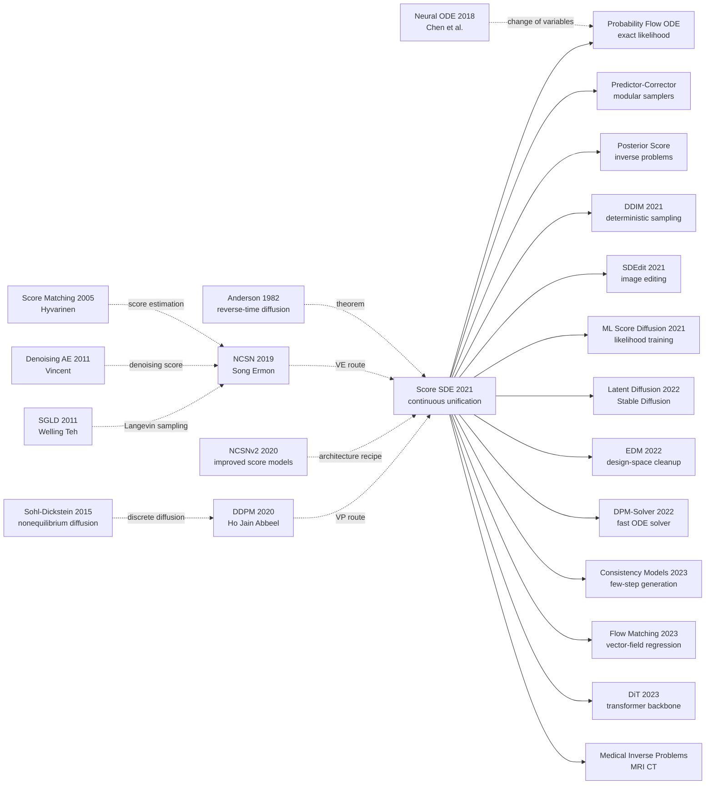

# Score SDE — Unifying Score-Based and Diffusion Models through Stochastic Differential Equations

> **On November 26, 2020, Yang Song, Jascha Sohl-Dickstein, Diederik P. Kingma, Abhishek Kumar, Stefano Ermon, and Ben Poole uploaded [arXiv:2011.13456](https://arxiv.org/abs/2011.13456), later published as an ICLR 2021 Oral paper.** The paper's hook was not simply another better sampler. It made a messy historical moment suddenly legible: NCSN-style score matching, DDPM's reverse Markov chain, Langevin dynamics, and neural ODEs were not rival tribes but different discretizations or views of one continuous-time SDE story. In one framework it gave high-quality samples, exact likelihoods through the probability-flow ODE, latent interpolation, inverse-problem conditioning, CIFAR-10 FID 2.20 / IS 9.89, 2.99 bits/dim, and 1024px score-based images. Score SDE is the paper that turned diffusion from a powerful denoising recipe into a mathematical language the next five years of generative modeling could speak.

## TL;DR

Song, Sohl-Dickstein, Kingma, Kumar, Ermon, and Poole's 2020 submission, published as an ICLR 2021 Oral paper, rewrites score-based generative modeling as a continuous-time stochastic differential equation. A forward process $\mathrm{d}\mathbf{x}=\mathbf{f}(\mathbf{x},t)\mathrm{d}t+g(t)\mathrm{d}\mathbf{w}$ diffuses data into noise; the reverse-time process $\mathrm{d}\mathbf{x}=[\mathbf{f}(\mathbf{x},t)-g(t)^2\nabla_{\mathbf{x}}\log p_t(\mathbf{x})]\mathrm{d}t+g(t)\mathrm{d}\bar{\mathbf{w}}$ turns noise back into data as soon as the time-dependent score is known. The paper did not merely beat one baseline. It put [NCSN 2019](https://arxiv.org/abs/1907.05600) annealed Langevin sampling, DDPM 2020 reverse Markov chains, neural-ODE likelihoods, and inverse-problem posterior sampling into one framework. On CIFAR-10 it moved the non-adversarial line from NCSN's FID 25.32 and NCSNv2's 10.87 past DDPM's 3.17 to FID 2.20, while also reporting 2.99 bits/dim through the probability-flow ODE. The counter-intuitive lesson is that the paper's lasting engineering impact came from a theoretical cleanup: by naming the SDE/ODE object underneath the recipes, it gave DDIM, SDEdit, DPM-Solver, EDM, Consistency Models, Flow Matching, and modern inverse-problem diffusion a shared coordinate system.

---

## Historical Context

### In 2019-2020, generative modeling still had no common map

By late 2020, image generation looked vibrant but intellectually fragmented. GANs, through StyleGAN2, BigGAN, and ADA, had pushed visual fidelity to the point where samples could look photographic, yet training still relied on adversarial min-max dynamics, likelihood was absent, and mode coverage remained hard to audit. VAEs and normalizing flows had likelihoods and probabilistic interpretations, but often lost on sharpness. Autoregressive models looked beautiful in bits/dim, but pixel-by-pixel decoding made high-resolution sampling hard to treat as an industrial default. Meanwhile, score-based generation and DDPM had both started to work, but they sounded like two languages describing the same object.

The diffusion lineage itself had two versions of the story. Sohl-Dickstein 2015 began from nonequilibrium thermodynamics and variational inference, emphasizing a fixed forward diffusion and a learned reverse chain. Song and Ermon 2019 began from score matching, emphasizing learning $\nabla_x\log p_\sigma(x)$ and using annealed Langevin dynamics to denoise across scales. When DDPM 2020 arrived, Ho, Jain, and Abbeel drove discrete diffusion to CIFAR-10 FID 3.17, but the deeper relationship between DDPM and score matching still needed a cleaner mathematical account.

### The two routes looked too different on the surface

NCSN looked like a sampler paper: choose noise scales $\sigma_1<\cdots<\sigma_N$, train a noise-conditional score network, and run Langevin MCMC from high noise to low noise. DDPM looked like a latent-variable model: define $q(x_t|x_{t-1})$, optimize a simplified ELBO, and ancestral-sample from $p_\theta(x_{t-1}|x_t)$. One spoke score matching, the other ELBO; one spoke MCMC, the other reverse Markov chains; one historically touched energy-based modeling, the other touched VAEs.

Score SDE's historical contribution was to compress those two stories into one sentence: **both push the data distribution through time into a simple prior, then reverse the process using the time-dependent score.** SMLD is a discretization of a variance-exploding SDE; DDPM is a discretization of a variance-preserving SDE. A sampling algorithm is then just a numerical method for solving the reverse-time SDE.

### The author team sat exactly at the crossing point

The author list itself reads like a lineage diagram. Yang Song and Stefano Ermon authored NCSN / NCSNv2, representing the Stanford score matching + Langevin line. Jascha Sohl-Dickstein authored the original 2015 diffusion probabilistic model, representing the nonequilibrium-thermodynamics line. Diederik P. Kingma was one of the central figures of the VAE and flow era of probabilistic generative modeling. Ben Poole and Abhishek Kumar, then at Google Brain, connected the work to large-scale experiments and likelihood/representation questions.

So Score SDE was not simply another diffusion variant from one lab. It was a meeting of several historical branches in late 2020. It put NCSN's empirical lessons, DDPM's engineering success, Anderson's 1982 reverse-time diffusion theorem, and neural-ODE change-of-variables machinery on the same table, giving the later diffusion ecosystem a coordinate system it could keep extending.

## Background and Motivation

### What problem was the paper really solving?

Read only the abstract and Score SDE looks like a theoretical unification paper. Read its 2021-2026 afterlife and it solved three very practical engineering problems.

First, **how should samplers be designed systematically?** NCSN's annealed Langevin, DDPM's ancestral sampling, ODE solvers, and MCMC correctors looked like a pile of recipes in the old frameworks. The SDE view turns them into composable predictor and corrector modules: the predictor advances along the reverse-time SDE, while the corrector uses score-based MCMC to pull the current marginal distribution back into shape.

Second, **can high-quality samples and exact likelihood coexist?** GANs had no likelihood; DDPM had an ELBO but not an exact likelihood; flows had exact likelihood but weaker samples. The probability flow ODE says that every SDE has a deterministic ODE with the same marginal distributions. Along that ODE, instantaneous change of variables gives exact likelihood. The same score model can therefore sample and estimate density.

Third, **does controllable generation always require retraining a conditional model?** Score SDE writes conditional generation as a posterior score: $\nabla_x\log p_t(x|y)=\nabla_x\log p_t(x)+\nabla_x\log p_t(y|x)$. If the gradient of the measurement or forward process $p(y|x)$ is available or approximable, an unconditional score model can solve inpainting, colorization, compressed sensing, medical reconstruction, and other inverse problems.

### Why SDE was the right language

The value of SDEs was not decorative mathematical sophistication. They gave diffusion models three missing degrees of freedom.

- **Continuous time**: the model is no longer locked to 1000 discrete steps; one can discuss arbitrary noise schedules, numerical solvers, and adaptive step sizes.
- **Unified discrete models**: SMLD, DDPM, and sub-VP are no longer three unrelated models, but choices of forward SDE and discretization.
- **A bridge to numerical analysis**: once the problem is written as an SDE/ODE, Euler-Maruyama, Runge-Kutta, predictor-corrector methods, and Hutchinson trace estimators become available to generative modeling.

That is Score SDE's deeper historical position: DDPM made diffusion useful; Score SDE made diffusion interpretable, modular, and generalizable. The former won the sample-quality fight of 2020; the latter defined the grammar by which diffusion models could be adapted into almost everything afterward.

---

## Method Deep Dive

### Overall framework

Score SDE can be summarized by one pipeline: choose a forward SDE that transports data $\mathbf{x}(0)\sim p_0$ into a simple prior $\mathbf{x}(T)\sim p_T$, train a time-dependent score network $\mathbf{s}_\theta(\mathbf{x},t)$ to approximate the score of every intermediate marginal distribution, then choose a numerical method to solve either the reverse-time SDE or the probability-flow ODE from $T$ back to $0$.

$$
\mathrm{d}\mathbf{x}=\mathbf{f}(\mathbf{x},t)\,\mathrm{d}t+g(t)\,\mathrm{d}\mathbf{w}
$$

Here $\mathbf{f}$ is the drift, $g$ is the diffusion coefficient, and $\mathbf{w}$ is a Wiener process. The forward process has no learnable parameters. That is crucial: the model is not learning how to add noise; it only learns where to denoise at each noise time.

By Anderson 1982, the reverse of a diffusion process is also an SDE:

$$
\mathrm{d}\mathbf{x}=\left[\mathbf{f}(\mathbf{x},t)-g(t)^2\nabla_{\mathbf{x}}\log p_t(\mathbf{x})\right]\mathrm{d}t+g(t)\,\mathrm{d}\bar{\mathbf{w}},\quad t:T\rightarrow 0
$$

The training problem therefore becomes score estimation:

$$
\theta^*=\arg\min_\theta\ \mathbb{E}_{t\sim U(0,T)}\mathbb{E}_{\mathbf{x}(0)}\mathbb{E}_{\mathbf{x}(t)|\mathbf{x}(0)}\left[\lambda(t)\left\|\mathbf{s}_\theta(\mathbf{x}(t),t)-\nabla_{\mathbf{x}(t)}\log p_{0t}(\mathbf{x}(t)|\mathbf{x}(0))\right\|_2^2\right]
$$

For affine SDEs such as VE, VP, and sub-VP, $p_{0t}(\mathbf{x}(t)|\mathbf{x}(0))$ is Gaussian, so the conditional score has a closed form. Training remains ordinary denoising score matching.

### Key designs

#### Design 1: Generalize finite noise scales into continuous-time SDEs

**Function**: Treat NCSN's finite noise scales and DDPM's discrete $\beta_t$ chain as discretizations of continuous SDEs. The model choice is no longer "NCSN or DDPM"; it becomes "which forward SDE, which discretization, and which solver?"

| Name | Predecessor | Continuous form | Intuition |
|------|-------------|-----------------|-----------|
| VE SDE | SMLD / NCSN | $\mathrm{d}\mathbf{x}=\sqrt{\frac{\mathrm{d}\sigma^2(t)}{\mathrm{d}t}}\mathrm{d}\mathbf{w}$ | mean fixed, variance explodes |
| VP SDE | DDPM | $\mathrm{d}\mathbf{x}=-\frac{1}{2}\beta(t)\mathbf{x}\mathrm{d}t+\sqrt{\beta(t)}\mathrm{d}\mathbf{w}$ | variance stays bounded |
| sub-VP SDE | this paper | VP with a smaller diffusion term | trades some sample quality for better likelihood |

The power of this design is that it decouples the model family from the sampler. DDPM ancestral sampling is just one discretization of the VP reverse-time SDE; NCSN annealed Langevin is a corrector-heavy sampler on the VE route. Later work can swap SDEs, solvers, and score networks without rewriting the theory.

#### Design 2: Reverse-time SDE plus predictor-corrector sampling

**Function**: Decompose sampling into two actions. A predictor numerically advances along the reverse SDE; a corrector uses score-based MCMC to repair the marginal distribution at the current noise time. Original NCSN and DDPM become special cases of the PC framework.

| Sampler | Predictor | Corrector | Meaning |
|---------|-----------|-----------|---------|
| Original NCSN sampling | identity | Annealed Langevin | correction only, no explicit prediction |
| DDPM ancestral | Ancestral / reverse diffusion | identity | prediction only, no MCMC correction |
| PC sampler | Euler / reverse diffusion / probability flow | Langevin / HMC | predict first, correct afterward |
| ODE sampler | Probability flow ODE | optional | deterministic and likelihood-capable |

A simplified PC sampler looks like this:

```python
def pc_sample(prior, timesteps, score_model, predictor, corrector):
    x = prior.sample()
    for t_next, t in reversed(list(zip(timesteps[:-1], timesteps[1:]))):
        x = predictor(x, t, t_next, score_model)
        x = corrector(x, t_next, score_model)
    return x
```

The rationale is simple: a pure predictor accumulates discretization error, while a pure corrector spends too much compute on MCMC. PC separates their responsibilities and is often more efficient than merely doubling predictor steps. Table 1 in the paper shows the same pattern: adding corrector steps often improves sample quality more effectively than naively densifying the discretization.

#### Design 3: Probability flow ODE connects diffusion to likelihood and latent space

**Function**: For any forward SDE, construct a deterministic ODE with the same marginal distribution at every time $t$. Because this ODE has no random term, it can be treated like a continuous normalizing flow for exact likelihoods, latent encoding, interpolation, and temperature scaling.

$$
\mathrm{d}\mathbf{x}=\left[\mathbf{f}(\mathbf{x},t)-\frac{1}{2}g(t)^2\nabla_{\mathbf{x}}\log p_t(\mathbf{x})\right]\mathrm{d}t
$$

After replacing the true score with $\mathbf{s}_\theta$, this is a neural ODE. With instantaneous change of variables:

$$
\log p_0(\mathbf{x}(0))=\log p_T(\mathbf{x}(T))+\int_0^T \nabla\cdot \tilde{\mathbf{f}}_\theta(\mathbf{x}(t),t)\,\mathrm{d}t
$$

The divergence term can be estimated with the Hutchinson trace estimator. This design gives one score model three identities: SDE sampler, ODE likelihood model, and invertible latent encoder. In the 2021 generative-modeling landscape that was counter-intuitive, because researchers often treated "GAN-level sample quality" and "flow-level likelihood" as mutually exclusive engineering regimes.

#### Design 4: Posterior score turns inverse problems into conditional reverse SDEs

**Function**: Given an observation $y$ and a forward measurement process $p(y|x)$, conditional generation can be performed with a posterior score rather than by retraining a conditional score model.

$$
\nabla_{\mathbf{x}}\log p_t(\mathbf{x}|y)=\nabla_{\mathbf{x}}\log p_t(\mathbf{x})+\nabla_{\mathbf{x}}\log p_t(y|\mathbf{x})
$$

Plug this posterior score into the reverse-time SDE and the sampler draws from $p(x|y)$. The paper demonstrates class-conditional CIFAR-10, LSUN inpainting, and LSUN colorization; later MRI, CT reconstruction, compressed sensing, deblurring, and super-resolution inherited this view. The core lesson is that a score model is not a fixed generator. It is a prior gradient that can be combined with a physical observation model.

### Implementation recipe

Score SDE is not theory alone; the paper gives a highly practical recipe. NCSN++ / DDPM++ largely inherit DDPM's U-Net, but add stabilizing components from the StyleGAN / BigGAN era.

| Component | Choice | Role |
|-----------|--------|------|
| Backbone | NCSN++ / DDPM++ U-Net | multi-scale image modeling with ResBlocks and attention |
| Time embedding | random Fourier features / sinusoidal | condition the network on continuous $t$ or discrete steps |
| Sampling | PC sampler, ODE sampler | trade off sample quality, speed, and likelihood |
| EMA | 0.999 for VE, 0.9999 for VP | materially stabilizes FID |
| Architecture tricks | FIR up/downsample, skip rescaling, BigGAN block | pushes score networks to GAN-level visual quality |

The best sample quality comes from NCSN++ continuous deep + VE SDE + PC sampling: CIFAR-10 FID 2.20 and IS 9.89. The best likelihood comes from DDPM++ continuous deep + sub-VP SDE + probability flow ODE: 2.99 bits/dim on uniformly dequantized CIFAR-10. That split reveals an important point: **different SDEs prefer different sample-quality/likelihood tradeoffs. Score SDE offers a design space, not a single answer.**

---

## Failed Baselines

### Routes that were unified or surpassed

Score SDE's failed baselines were not a single defeated model. They were several generative routes whose weaknesses were re-positioned by the paper:

| Route | State at the time | Why it was insufficient | Score SDE's response |
|-------|-------------------|-------------------------|----------------------|
| NCSN / SMLD | NCSN FID 25.32, NCSNv2 FID 10.87 | score matching worked, but samplers and noise scales were empirical | explain it as VE SDE, add PC samplers and NCSN++ |
| DDPM | FID 3.17, strong samples | discrete chain was elegant, but likelihood, control, and solver design were not unified | explain it as VP SDE and connect it to probability flow ODE |
| GAN | StyleGAN2-ADA unconditional FID 2.92 | sharp samples, but unstable training, no likelihood, hard-to-audit mode coverage | reach FID 2.20 without adversarial training |
| Flow / Neural ODE | clean likelihood | samples often weaker than GAN / diffusion | connect score models back to exact likelihood through probability flow ODE |

The key judgment behind this table is that Score SDE was not merely another model that beat GANs. It pulled apart the strengths of GANs, flows, DDPM, and NCSN and recombined them. It let non-adversarial generation talk about sample quality, likelihood, latent codes, and inverse problems at once, whereas before 2020 those abilities usually lived in separate model families.

### Failures revealed by the paper

One of the paper's most useful features is that it does not pretend the continuous-time framework automatically makes every sampler good. In Table 1, probability flow used as a pure ODE predictor performs poorly on the VE SDE; corrector-only sampling also loses to predictor + corrector combinations. In other words, SDE unification is not magic. Numerical solution quality still controls generation quality.

| Failure or weak point | Observed behavior | Lesson |
|-----------------------|-------------------|--------|
| Pure ODE sampling | probability-flow predictor has much worse FID on VE SDE | deterministic paths are not always best for sample quality |
| Corrector-only sampling | C2000 often loses to P2000 or PC1000 | MCMC correction cannot replace reverse dynamics |
| Discrete-model interpolation | P2000 needs ad-hoc interpolation over 1000 original noise scales | continuous-time training is cleaner than after-the-fact interpolation |
| Very high resolution | 1024px CelebA-HQ still shows facial symmetry flaws | the framework scales, but the architecture was not yet mature |

Those failures later became research entry points. DPM-Solver, EDM, PNDM, UniPC, and related work improved ODE/SDE solvers; Latent Diffusion solved pixel-space cost; DiT replaced the local-convolution bias of U-Nets; Consistency Models learned consistent maps along probability-flow trajectories directly.

### What the method did not solve

Score SDE did not solve slow sampling. PC sampling gives CIFAR-10 FID 2.20, but still requires many score function evaluations. Probability-flow ODEs can reduce NFE with adaptive solvers, yet pure ODE quality still trails SDE + corrector quality in important settings. The conclusion says this plainly: combining the stable learning of score-based models with the fast sampling of implicit models such as GANs remained an open direction.

It also did not solve natural modeling of discrete data. A score is a gradient of a continuous density, so text, discrete tokens, categorical graphs, and other non-continuous objects require relaxation, embeddings, or discrete diffusion variants. That limitation was addressed later by discrete diffusion, masked diffusion, and flow matching over simplex-like spaces.

Finally, the paper opened the solver design space, but it opened the hyperparameter space too: SDE type, $\lambda(t)$ weighting, the endpoint cutoff $\epsilon$, SNR, number of corrector steps, ODE tolerances, and EMA rate all matter. Score SDE gave the language and the framework, not a one-click optimal recipe.

---

## Key Experimental Data

### Main CIFAR-10 results

| Model | Conditioning | FID ↓ | IS ↑ | NLL bits/dim ↓ |
|-------|--------------|-------|------|----------------|
| NCSN (Song & Ermon 2019) | unconditional | 25.32 | 8.87 | — |
| NCSNv2 (Song & Ermon 2020) | unconditional | 10.87 | 8.40 | — |
| DDPM (Ho et al. 2020) | unconditional | 3.17 | 9.46 | ≤3.75 |
| StyleGAN2-ADA | unconditional | 2.92 | 9.83 | — |
| DDPM++ | unconditional | 2.78 | 9.64 | — |
| DDPM++ cont. (VP) | unconditional | 2.55 | 9.58 | 3.16 |
| DDPM++ cont. (sub-VP) | unconditional | 2.61 | 9.56 | 3.02 |
| NCSN++ cont. deep (VE) | unconditional | **2.20** | **9.89** | — |
| DDPM++ cont. deep (sub-VP) | unconditional | 2.41 | 9.57 | **2.99** |

These numbers support two complementary conclusions. First, VE + NCSN++ + PC sampling was the strongest sample-quality route, with FID 2.20 beating unconditional StyleGAN2-ADA's 2.92. Second, sub-VP + DDPM++ + probability flow ODE was the strongest likelihood route, reaching 2.99 bits/dim and putting score-based diffusion near or beyond many flow baselines.

### Sampler ablations

| Setting | Representative number or behavior | Conclusion |
|---------|-----------------------------------|------------|
| VE/SMLD predictor-only | P1000 about 4.98, P2000 about 4.88 | doubling predictor steps helps only slightly |
| VE/SMLD PC | PC1000 about 3.24 | adding a corrector is better than blindly adding steps |
| VP/DDPM predictor-only | P1000 about 3.24, P2000 about 3.21 | the DDPM discrete chain is already strong |
| VP/DDPM PC | PC1000 about 3.18 | the corrector still gives a small gain |

The point is not the last decimal. The trend is that once a score function is available, sampling no longer has to be tied to the original ancestral rule of the model paper. Score SDE made "how should we solve the reverse process?" an independent research question, which is exactly where the later fast-sampler explosion began.

### High resolution and controllable generation

| Capability | Experimental setup | Result | Meaning |
|------------|--------------------|--------|---------|
| 1024px generation | CelebA-HQ / FFHQ-style faces | first high-fidelity 1024×1024 score-based samples | proves the route scales to high-dimensional images |
| Class conditioning | CIFAR-10 + noisy classifier | generate specified classes through conditional reverse SDE | early prototype of classifier guidance |
| Inpainting | LSUN bedroom / church | one unconditional score model completes masked regions | inverse problems need not retrain the generator |
| Colorization | LSUN grayscale input | same framework produces diverse color outputs | posterior scores can express multi-solution posteriors |

These experiments may not look as product-ready as Stable Diffusion today, but in 2021 they were crucial. They showed that a score model learns a composable prior rather than a black-box generator that can only draw images from random noise.

### Key findings

- **Sample quality**: NCSN++ cont. deep (VE) pushed unconditional CIFAR-10 FID to 2.20, ahead of the then-current unconditional StyleGAN2-ADA.
- **Likelihood**: DDPM++ cont. deep (sub-VP) reached 2.99 bits/dim through the probability-flow ODE.
- **Control**: class conditioning, inpainting, and colorization all fit the posterior-score / conditional-reverse-SDE view.
- **Scalability**: 1024px samples showed score-based generation was no longer confined to CIFAR-10.
- **Most important experimental lesson**: different targets prefer different SDE / solver combinations. Score SDE's contribution is making those choices an enumerable design space.

---

## Idea Lineage



### Before it: what forced the paper into existence

- **Anderson 1982**: provides the reverse-time diffusion equation, the deepest mathematical key in the paper. Without this theorem, deriving a closed-form reverse SDE from a forward noising SDE would not be so clean.
- **Hyvarinen 2005 score matching**: showed that one can learn $\nabla_x\log p(x)$ directly without a partition function. The Score SDE network is essentially a time-dependent score estimator.
- **Vincent 2011 denoising-score connection**: explained why recovering clean data from noisy data learns a score, creating the bridge to denoising score matching.
- **Welling & Teh 2011 SGLD / Langevin MCMC**: made "take a step along the score and add noise" a legitimate sampler. NCSN's annealed Langevin and Score SDE's correctors come from this line.
- **Sohl-Dickstein 2015 diffusion probabilistic model**: the ancestor of fixed forward diffusion plus learned reverse chains. Score SDE identifies it as a discretization of a VP SDE.
- **Song & Ermon 2019/2020 NCSN/NCSNv2**: the direct predecessor based on multi-scale score matching and annealed Langevin dynamics. Score SDE identifies it as a discretization of a VE SDE.
- **Ho et al. 2020 DDPM**: pushed diffusion to GAN-level visual quality with $L_{simple}$, U-Net, and $\epsilon$-prediction. Score SDE explains theoretically why DDPM is also a score-based model.

### After it: descendants

- **DDIM / probability-flow line**: DDIM is not the same paper, but together with the probability-flow ODE it moves diffusion away from purely stochastic chains toward deterministic or non-Markovian samplers. DPM-Solver, PNDM, DEIS, and UniPC all continue the view that sampling is numerical ODE/SDE solving.
- **SDEdit / inverse-problem line**: SDEdit edits images by noising an input to an intermediate level and reversing; MRI, CT, compressed sensing, and deblurring work write posterior scores into reverse SDEs. Section 5 of Score SDE is the shared grammar for these systems.
- **Likelihood / representation line**: Maximum Likelihood Training of Score-Based Diffusion Models, probability-flow likelihood, latent interpolation, and temperature scaling inherit the idea that one score model can also provide an ODE encoding.
- **Design-space line**: EDM later decomposes noise schedules, preconditioning, solvers, and parameterizations; Flow Matching / Rectified Flow further rewrite trajectory learning as vector-field regression. They do not always keep the SDE form, but they inherit the paper's coordinate system: choose a path, then learn the score or velocity along it.
- **Modern large-model line**: Stable Diffusion, Imagen, DiT, Sora, and related systems combine DDPM, ODE, solver, and guidance ideas in engineering form. Users see text-to-image products; underneath, the system still manipulates objects Score SDE named clearly: noise time, score/velocity, solver, guidance, and latent paths.

### Misreadings and simplifications

- **"Score SDE is just the theory of DDPM"**: incomplete. It explains DDPM, but it also explains NCSN, SMLD, probability-flow likelihood, posterior scores, and inverse problems. Treating it as a DDPM footnote misses its effect on solver design and control.
- **"More complex SDEs are better"**: the paper teaches the opposite. VE, VP, and sub-VP are design choices, and different objectives prefer different SDEs. What matters is tuning the SDE, objective, solver, and architecture together.
- **"The ODE sampler solves slow sampling"**: probability-flow ODEs opened fast sampling and likelihood, but pure ODE sampling was not always the highest-quality option at the time. Later fast samplers needed better discretization, distillation, or consistency training.
- **"A score model is just a denoiser"**: in implementation this is often fine, but historically the score model is broader: a composable prior gradient. It can be combined with measurement likelihoods, classifier gradients, text guidance, and ODE solvers.
- **"The impact is only image generation"**: later robotics, protein structure, medical imaging, and scientific inverse problems all inherit the language of score/diffusion priors. Images were simply the first display where the approach exploded.

---

## Modern Perspective

### Assumptions that no longer hold

- **"The SDE form is the final answer"**: in 2021, SDEs were the cleanest unifying language. By 2026, they look more like an important intermediate layer. Flow Matching, Rectified Flow, and Consistency Models rewrite much of the problem as ODE velocity fields or consistency maps, using less stochastic-process vocabulary while preserving the idea of choosing a path from noise to data and learning the vector field along it.
- **"Score parameterization is the core of diffusion"**: modern production models often use $\epsilon$-prediction, $v$-prediction, flow velocity, rectified velocity, or direct consistency functions. The score is the cleanest theoretical object, but not always the best network output parameterization.
- **"Probability flow ODE is enough to solve sampling efficiency"**: it opened deterministic sampling and likelihoods, but the real move into 10-step, 4-step, and 1-step generation came from later DPM-Solver, EDM samplers, distillation, LCM, and Consistency Models.
- **"Pixel-space score models can scale straight to products"**: Score SDE showed 1024px samples, but the cost was large and details still had flaws. Stable Diffusion's crucial move was latent space; DiT / MMDiT later changed the backbone. Pixel-space SDEs were a proof of concept, not the final product route.
- **"Inverse problems only need the posterior-score formula"**: the formula is elegant, but real MRI, CT, deblurring, and super-resolution require measurement noise handling, operator mismatch, data consistency, guidance strength tuning, and domain priors. Later DPS, score-MRI, and Diffusion Posterior Sampling made this line engineering-ready.

### What survived vs. what became transitional

**What really survived**:

- Continuous-time perspective: noise schedules, solvers, and parameterizations became separable design dimensions.
- Reverse-time dynamics: the bridge from a learned denoiser to a generative sampler was made explicit.
- Probability-flow ODE: diffusion/score models connected to likelihood, latent encoding, ODE solvers, and distillation.
- Predictor-corrector thinking: "follow the dynamics" and "repair the marginal distribution" became separable actions, influencing later samplers and guidance interpretations.
- Posterior score: conditional generation, editing, and inverse problems entered one Bayesian-gradient language.

**What now looks transitional or less central**:

- The detailed taxonomy of SDEs is not the user-facing interface; production systems care more about NFE, quality, latency, and controllability.
- PC sampling is elegant for high-quality small images, but modern large models more often use ODE samplers, distilled samplers, or flow-based samplers.
- NCSN++ / DDPM++ were the strongest recipes at the time, but were later replaced by ADM U-Nets, LDM U-Nets, DiT, and MMDiT.
- Exact likelihood is not the main metric for image-generation products, though it remains theoretically valuable for understanding, compression, OOD behavior, and representation.

### Side effects the authors did not foresee

1. **Solver research became a main diffusion lane**: Score SDE explicitly framed sampling as numerical SDE/ODE solving, opening the door to DPM-Solver, PNDM, DEIS, UniPC, EDM samplers, and consistency distillation. Many later speedups are answers to the solver question posed here.
2. **Text-to-image systems inherited the language**: Stable Diffusion users do not say reverse-time SDE, but sampler menus containing Euler, Heun, DPM++, UniPC, SDE, and ODE are engineering echoes of this coordinate system.
3. **Inverse problems and scientific computing rediscovered generative priors**: from MRI/CT to protein structure and robot policy learning, many tasks do not need "pretty images" as much as plausible posterior samples from noisy observations. The posterior-score view gave them a common entry point.
4. **Theoretical unification encouraged engineering branching**: once NCSN, DDPM, and ODE views were placed in one framework, researchers could confidently mix and match: latent diffusion uses DDPM-style training and ODE samplers, EDM changes noise scales, Flow Matching changes the path, and Consistency Models distill ODE trajectories. Unification did not reduce branches; it made them orderly.

### If Score SDE were rewritten today

If the paper were rewritten in 2026, the core skeleton of path + vector field + solver would remain, but the presentation would be broader:

- Put SDEs, ODEs, flow matching, and rectified flow into one stochastic/interpolant framework instead of centering SDEs alone.
- Discuss score, noise, velocity, data prediction, and consistency functions together, making clear which parameterization suits which solver.
- Run default experiments in latent space and high-dimensional token/patch space, not only CIFAR-10 and CelebA-HQ.
- Include classifier-free guidance, text conditioning, and multimodal conditioning in the main text instead of only demonstrating class conditioning, inpainting, and colorization.
- Report NFE-quality curves for modern fast samplers rather than focusing on 1000/2000-step PC samplers and ODE tolerances.
- Discuss copyright, synthetic-content risk, and reliability boundaries for medical inverse problems more systematically. That was not the center of an ICLR paper in 2021; it is unavoidable in 2026.

The sentence worth preserving would not change: **if you can estimate the score at every noise time, generation, likelihood, editing, and inverse problems are different readings of the same dynamical system.**

---

## Limitations and Future Directions

### Author-acknowledged limitations

- Sampling remained slower than GANs, especially PC sampling with many score function evaluations.
- Sampler choice introduced extra hyperparameters; automatic selection and tuning remained open.
- Probability-flow ODE supported likelihood and faster sampling, but pure ODE sampling was not always best in sample quality.
- Discrete data did not naturally admit scores and required relaxation or model variants.
- High-resolution samples were feasible, but the 1024px experiments still had visible artifacts; the architecture was not mature.

### Directions later solved or still advancing

- **Fast sampling**: DDIM, PNDM, DPM-Solver, EDM, UniPC, Consistency Models, and LCM moved NFE from thousands to tens, then a few, sometimes one.
- **High-resolution efficiency**: Latent Diffusion / Stable Diffusion moved diffusion into compressed latent space and cut cost dramatically.
- **Stronger backbones**: ADM U-Nets, LDM U-Nets, DiT, and MMDiT replaced early NCSN++ / DDPM++ recipes.
- **Conditional generation**: classifier guidance, classifier-free guidance, CLIP/T5 text encoders, ControlNet, and IP-Adapter productized posterior/guidance ideas.
- **Reliable inverse problems**: DPS, score-MRI, plug-and-play diffusion, and Diffusion Posterior Sampling continue to handle measurement consistency and uncertainty.
- **Theoretical generalization**: Schrodinger bridges, optimal transport, flow matching, and rectified flow extend the paper's SDE/ODE language to more general path learning.

---

## Related Work and Insights

### Relationship to several main lines

- **vs DDPM**: DDPM is the strong engineering recipe; Score SDE is the unifying grammar. Without DDPM, Score SDE lacks proof that this route can beat GANs; without Score SDE, DDPM is easily misread as a special denoising trick.
- **vs NCSN**: NCSN is the beginning of the score route; Score SDE is the bridge back to diffusion, ODEs, and likelihood. NCSN proved scores could generate images; Score SDE proved scores could organize the whole model family.
- **vs normalizing flow**: flows have exact likelihood from the start but are constrained by invertibility. Score SDE uses the probability-flow ODE to regain likelihood after sampling, without requiring the score network itself to be invertible.
- **vs GAN**: GANs are fast and sharp but weak on training stability, likelihood, and coverage. Score SDE showed non-adversarial models can match or exceed GAN quality while retaining probabilistic meaning.
- **vs Flow Matching / Rectified Flow**: later work simplifies stochastic diffusion into deterministic vector-field regression. It does not refute Score SDE; it compresses the paper's continuous-path + solver idea into a more direct engineering form.

---

## Resources

- Paper: [arXiv:2011.13456](https://arxiv.org/abs/2011.13456)
- OpenReview: [ICLR 2021 Oral](https://openreview.net/forum?id=PxTIG12RRHS)
- Official code: [yang-song/score_sde](https://github.com/yang-song/score_sde)
- PyTorch code: [yang-song/score_sde_pytorch](https://github.com/yang-song/score_sde_pytorch)
- Author tutorial: [Generative Modeling by Estimating Gradients of the Data Distribution](https://yang-song.net/blog/2021/score/)
- Curated bibliography: [Score-Based Generative Modeling](https://scorebasedgenerativemodeling.github.io/)
- Related deep note: DDPM (2020)
- Follow-up papers: [DDIM](https://arxiv.org/abs/2010.02502), [Maximum Likelihood Training of Score-Based Diffusion Models](https://arxiv.org/abs/2101.09258), [SDEdit](https://arxiv.org/abs/2108.01073), [DPM-Solver](https://arxiv.org/abs/2206.00927), [EDM](https://arxiv.org/abs/2206.00364), [Consistency Models](https://arxiv.org/abs/2303.01469)


---

> 🌐 [中文版](/era4_foundation_models/2020_score_sde/) · 📚 awesome-papers project · CC-BY-NC