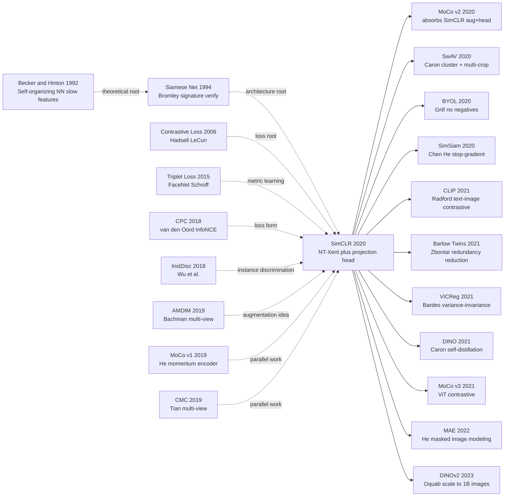

# SimCLR — A Plain Contrastive Loss That Crowned Self-Supervised Vision on ImageNet Linear Eval

---

## TL;DR

SimCLR collapses self-supervised vision into one sentence: **augment an image twice and pull the two embeddings together while pushing every other image's embedding apart**. With a four-piece recipe — strong augmentation composition, a throw-away MLP projection head, large batch, and a single NT-Xent loss — it became the first method whose ImageNet linear-eval top-1 (76.5% with ResNet-50 ×4) matched supervised pre-training, overturning two decades of "vision representations need labels".

---

## Historical Context

### What was the vision self-supervised community stuck on in 2020?

To grasp how disruptive SimCLR was, rewind to the awkward 2019-2020 period when self-supervised CV "looked promising but kept losing to supervised".

Through 2018-2019, four schools of vision self-supervision were all stalled:
- **Pretext-task camp** (rotation prediction, jigsaw, colorization): elegant but weak transfer; ImageNet linear top-1 stuck below 50%.
- **Generative camp** (BiGAN, autoencoder, PixelCNN): slow to train, low representation quality, weakly correlated with classification.
- **Clustering camp** (DeepCluster, SeLa): repeated k-means + pseudo-label re-assignment, painful to tune.
- **Contrastive camp** (CPC v1, InstDisc, AMDIM, CMC, MoCo v1): cleanest math but ImageNet linear stuck in the 60-65% range, **trailing supervised 76.1% by 10+ points**.

The implicit consensus in the field: **self-supervised was a promising-but-not-yet-competitive direction; supervised pre-training would remain irreplaceable for the foreseeable future**. Even when He Kaiming dropped MoCo v1 in late 2019 (60.6% IN linear), it was framed as "approaching some supervised transfer baselines" — not catching supervised IN1k linear.

> **Throughout 2019, the CV community's view of self-supervision: "promising direction but not yet competitive."**

### The N predecessors that directly forced SimCLR

- **CPC (van den Oord et al., 2018, [arXiv:1807.03748](https://arxiv.org/abs/1807.03748))**: formalized the InfoNCE loss for representation learning, proving that maximizing a contrastive lower bound on mutual information is mathematically equivalent to learning useful representations. SimCLR inherited the InfoNCE/NT-Xent loss form directly.
- **InstDisc / NPID (Wu et al., CVPR 2018)**: treated each image as its own class for "instance discrimination", storing all ImageNet instance features in a memory bank. SimCLR cut the memory bank and used in-batch negatives instead.
- **AMDIM (Bachman et al., 2019)**: the first large-scale "multi-view InfoMax" study, showing that augmentation choices matter most — SimCLR pushed this insight to its logical limit.
- **MoCo v1 (He et al., CVPR 2020)**: solved the negative-count bottleneck with a momentum-updated key encoder + queue. SimCLR conversely showed "if your batch is large enough (4096+), you don't need a queue", proposing a strictly simpler paradigm.
- **PIRL (Misra & van der Maaten, CVPR 2020)**: evidence that strong-augmentation invariance helps; SimCLR systematized "which augmentation combinations actually matter".

### What was the author team working on?

Ting Chen was a postdoc in Hinton's Google Brain Toronto group; Simon Kornblith was working on transfer learning + representation similarity (the CKA series). Hinton himself was steering Brain Toronto's research bet back toward unsupervised / capsules / GLOM in 2019-2020, betting on self-supervision as the next paradigm.

**SimCLR was not Brain's flagship project**. Chen's original pitch was: "InstDisc / MoCo / CPC all build complex engineering stacks, but underneath it's the same contrastive loss — can we strip it to its simplest form?" — quintessentially Hintonian "clean it up to its essence". The arXiv preprint dropped February 2020; within a week the 76.5% ImageNet linear number was being retweeted across CV Twitter.

### Industry / compute / data landscape

- **GPU/TPU**: TPUv3-32 / v3-128 (paper used TPU for 1000-epoch runs). **An 8-GPU V100 box could not fit batch 4096; you needed 32+ TPU cores.**
- **Data**: ImageNet-1k (1.28M), ImageNet-22k (14M), Instagram-1B (Mahajan 2018) was still proprietary.
- **Frameworks**: TensorFlow (official); PyTorch reproductions appeared within a week.
- **Industry mood**: BERT had ignited the self-supervised pretrain paradigm in NLP; CV was hungry for its own "BERT moment". SimCLR + MoCo v1 were the two answers offered in parallel — but SimCLR's simplicity made it spread faster.

---

## Method

### Overall framework

SimCLR's pipeline is almost embarrassingly simple:

```
For an image x, sample two independent random augmentations:
    x → t(x) = x̃_i,    x → t'(x) = x̃_j   (two augmented views)
                    ↓                    ↓
            encoder f (ResNet-50)  encoder f
                    ↓                    ↓
                h_i ∈ ℝ^2048        h_j ∈ ℝ^2048    ← downstream uses this
                    ↓                    ↓
            projection head g (2-layer MLP)
                    ↓                    ↓
                z_i ∈ ℝ^128         z_j ∈ ℝ^128     ← contrastive loss only here

           NT-Xent loss: pull (z_i, z_j) closer, push (z_i, others) apart
```

**Throw-away head**: After training, only encoder $f$ is kept; projection head $g$ is discarded — downstream uses $h$, not $z$. This is a counter-intuitive but ablation-verified key design (see Design 2).

| Configuration (paper §3) | Default | Note |
|---|---|---|
| Encoder $f$ | ResNet-50 (2048-d) | also ran ResNet-50 ×2/×4 to study scaling |
| Projection head $g$ | 2-layer MLP, hidden 2048, output 128 | discarded after training |
| Batch size $N$ | 4096 | 8192 views per batch, 8190 negatives per anchor |
| Optimizer | LARS | required for large batch |
| Learning rate | 4.8 (linear scaling, 0.3×N/256) | warmup 10 epochs |
| Temperature $\tau$ | 0.1 (swept 0.05-1.0) | too high or too low both degrade |
| Epochs | 100 / 200 / 400 / 800 / 1000 | longer is better; 1000 is best |

### Key designs

#### Design 1: Strong augmentation composition (especially random crop + color distortion) — the real soul

**Function**: Generate two strongly different views from the same image to force the encoder to learn representations that are invariant to low-level pixel statistics but covariant with high-level semantics.

**The paper's most important finding (§3, Figure 5)**: Each augmentation alone (crop, color jitter, blur, rotate, cutout, sobel, Gaussian noise) is mediocre, **but pairwise combinations are non-linear in their gain** — and **random crop + color distortion** dramatically outperforms every other pair:

| Augmentation combo (single vs pair) | ImageNet linear top-1 |
|---|---|
| crop only | ~33% |
| color distortion only | ~26% |
| Gaussian blur only | ~25% |
| **crop + color distortion (final)** | **55-56%** |
| crop + cutout | ~50% |
| crop + Gaussian noise | ~48% |
| crop + rotate | ~42% |

**Why crop + color is magical**: random crop instantiates "local patches should match the whole image" semantics; but pure crops leave two patches with similar RGB histograms — the network can cheat by matching color statistics. **Color distortion forcibly randomizes the color distribution, slamming that shortcut shut and forcing the network to use semantic content.**

**Pseudocode** (PyTorch):

```python
def get_simclr_augmentation(image_size=224, s=1.0):
    # s = color distortion strength
    color_jitter = transforms.ColorJitter(0.8*s, 0.8*s, 0.8*s, 0.2*s)
    return transforms.Compose([
        transforms.RandomResizedCrop(image_size, scale=(0.08, 1.0)),  # key 1
        transforms.RandomHorizontalFlip(),
        transforms.RandomApply([color_jitter], p=0.8),                # key 2
        transforms.RandomGrayscale(p=0.2),
        transforms.GaussianBlur(kernel_size=23),                       # secondary
        transforms.ToTensor(),
    ])
```

**Design rationale**: Compared to all prior self-supervised methods, SimCLR did not invent a new architecture (still ResNet-50) or a new loss (NT-Xent borrowed from InfoNCE) — its only original contribution was discovering "which augmentation combos are grossly underrated". The message to the field: **complex losses, novel architectures, and big models all matter less than getting the data side right**. BYOL, MoCo v2, SwAV all inherited this recipe wholesale; the augmentation pipeline of every 2020-2022 vision SSL method is a tweak of SimCLR's.

#### Design 2: Nonlinear projection head $g(\cdot)$ — the throw-away middle layer that matters

**Function**: Insert a 2-layer MLP $g(h) = W^{(2)} \sigma(W^{(1)} h)$ after the encoder output $h$, mapping 2048-d down to 128-d before computing the contrastive loss; throw $g$ away at downstream time and use $h$.

**The paper's most counter-intuitive finding (Figure 8)**: where you compute the contrastive loss decides downstream performance:

| Where loss is computed | Downstream linear top-1 |
|---|---|
| directly on encoder output $h$ (no head) | 60.6% |
| on a linear-projection head | 65.6% |
| **on a 2-layer MLP head output $z$ (final)** | **66.6%** |

**The key phenomenon**: Using $h$ (encoder output) for downstream linear eval is ~10 points higher than using $z$ (head output). That is: **the MLP head produces $z$ that is better for contrastive matching but worse for downstream classification**.

**Why this happens**: contrastive loss pulls augmentation-related information (color stats, crop position) out of $z$. This compression helps the contrastive objective itself, but **removes details downstream classifiers want**. Putting an MLP between $h$ and the loss as an "information buffer" lets $h$ retain "semantically irrelevant but downstream-useful" information.

**Pseudocode**:

```python
class SimCLRModel(nn.Module):
    def __init__(self, base_encoder=resnet50):
        super().__init__()
        self.encoder = base_encoder(zero_init_residual=True)
        feat_dim = self.encoder.fc.in_features
        self.encoder.fc = nn.Identity()             # strip ImageNet head
        self.projection = nn.Sequential(             # insert 2-layer MLP
            nn.Linear(feat_dim, feat_dim),
            nn.ReLU(inplace=True),
            nn.Linear(feat_dim, 128),
        )

    def forward(self, x):
        h = self.encoder(x)     # ← downstream transfer uses this
        z = self.projection(h)  # ← contrastive loss uses this
        return h, z
```

**Design rationale**: This is a **purely empirically derived design** — the authors had no a-priori theory that the head should be a 2-layer MLP; pure ablation found it. BYOL (Grill 2020), SimSiam (Chen He 2020), MoCo v2 (Chen 2020) all inherited the projection-head design; even DINOv2 (2024) still uses a similar one. **"Throw-away middle layer" became a counter-intuitive but universal design principle in representation learning.**

#### Design 3: NT-Xent loss + in-batch negatives — the simplest contrastive loss

**Function**: On a size-$N$ batch, augmentation produces $2N$ views; for each anchor $i$, treat its augmented twin $j(i)$ as the unique positive and the other $2N-2$ views as negatives. The loss:

$$
\mathcal{L} = \frac{1}{2N} \sum_{k=1}^{N} [\ell(2k-1, 2k) + \ell(2k, 2k-1)],\quad
\ell_{i,j} = -\log \frac{\exp(\text{sim}(z_i, z_j) / \tau)}{\sum_{k=1}^{2N} \mathbb{1}_{k \neq i} \exp(\text{sim}(z_i, z_k) / \tau)}
$$

where $\text{sim}(u, v) = \frac{u^\top v}{\|u\|\|v\|}$ is cosine similarity and $\tau$ is temperature. This is NT-Xent (Normalized Temperature-scaled Cross-Entropy).

**Negatives count vs performance** (Figure 9):

| Batch size | Negatives per anchor | ImageNet linear (100 epoch) |
|---|---|---|
| 256 | 510 | 57.5% |
| 512 | 1022 | 60.7% |
| 1024 | 2046 | 62.8% |
| 2048 | 4094 | 64.0% |
| **4096 (final)** | **8190** | **64.6%** |
| 8192 | 16382 | 64.8% (basically saturated) |

Negative count helps marginally, **but saturates above batch 4096**. This contrasts MoCo, which maintains 65536 negatives via a queue: **once your batch is large enough, the queue becomes unnecessary**.

**Pseudocode**:

```python
def nt_xent_loss(z, tau=0.1):
    # z shape: (2N, d), where view_i and view_j of x_k are at indices 2k-1, 2k
    z = F.normalize(z, dim=1)
    sim = z @ z.t() / tau                            # (2N, 2N) cosine sim matrix
    sim.fill_diagonal_(-1e9)                          # exclude self-pair
    N = z.size(0) // 2
    targets = torch.arange(2 * N, device=z.device)
    targets = targets ^ 1                             # pair (0,1), (2,3), ...
    return F.cross_entropy(sim, targets)
```

**Design rationale**: NT-Xent was not invented in SimCLR (CPC already used InfoNCE), but SimCLR was the first to peel it out of the engineering stack and prove **InfoNCE + large batch + strong augmentation = SOTA, no memory bank or momentum needed**. This "subtraction posture" influenced the entire 2020-2022 SSL design philosophy.

### Training strategy

| Item | Setting | Note |
|---|---|---|
| Loss | NT-Xent (cosine sim, $\tau$=0.1) | only loss |
| Optimizer | LARS ($\beta$=0.9, weight decay $10^{-6}$) | required for large batch |
| LR schedule | cosine, warmup 10 epoch, peak 0.3 × batch / 256 | linear scaling rule |
| Batch size | 4096 (8192 views) | 32-128 TPUv3 cores |
| Epochs | 1000 (main), 100/200/400/800 (ablation) | longer is better |
| BatchNorm | global sync across all TPU cores | critical — local BN leaks positive-pair stats |
| Augmentation | crop + color jitter + blur + grayscale + flip | see Design 1 |
| Warmup | LR 0 → peak in 10 epochs | required for large LR |

**Note 1**: Global BN sync is a hidden but critical engineering detail — local BN lets the network "guess" which samples are positive pairs from batch statistics, allowing it to cheat. MoCo's momentum encoder bypasses this issue; BYOL also stresses sync BN.

**Note 2**: 1000-epoch training takes ~2 weeks on 8 V100s, ~3-4 days on 32 TPUv3 cores. **This cost made SimCLR's main results unreproducible in small labs, indirectly motivating the later "small-batch friendly" methods like BYOL and SimSiam.**

---

## Failed Baselines

### Competitors that lost to SimCLR

- **CPC v2 (van den Oord 2019)**: complex patch-level masking + autoregressive predictor, ImageNet linear 71.5% (ResNet-161 large). SimCLR (ResNet-50 ×4) hit 76.5% with the same model size. **Lesson: complex sequence pretexts lose to plain instance discrimination.**
- **MoCo v1 (He et al., CVPR 2020)**: ImageNet linear 60.6% (ResNet-50, 200 epoch), used momentum + queue for 65536 negatives. SimCLR ResNet-50 200 epoch ≈ 64-66%. MoCo v2 (March 2020) immediately absorbed SimCLR's two findings (projection head + strong augmentation) and jumped to 71.1% — **a "student catches teacher in one week" event rare in ML history**.
- **InstDisc (Wu et al., 2018)**: 54.0% IN linear with a 4096-instance memory bank. Crushed by SimCLR in every setting.
- **AMDIM (Bachman et al., 2019)**: 68.1% IN linear (large model) with multi-resolution patch lattice — engineering-heavy; SimCLR matched and beat with simpler architecture.
- **PIRL (Misra & van der Maaten, CVPR 2020)**: 63.6% IN linear; jigsaw + invariance becomes obsolete.
- **BigBiGAN (Donahue & Simonyan, NeurIPS 2019)**: 56.6% IN linear, the peak of generative SSL. SimCLR ended the era of "generative SSL on ImageNet".
- **Supervised pretrain baseline (ResNet-50 IN1k 100 epoch)**: 76.5% top-1. **SimCLR (ResNet-50 ×4, 1000 epoch) also hit 76.5%** — the first time self-supervision matched supervision, hailed as "the eve of vision SSL's BERT moment".

### Failed experiments in the paper (ablations)

| Configuration variant | ImageNet linear (ResNet-50, 100 epoch) | Effect |
|---|---|---|
| **Final SimCLR**                                     | **64.6%** | baseline |
| remove color distortion                              | 55-56% | -8~9 pts (most critical) |
| remove random crop                                   | 33%    | full collapse |
| remove projection head (loss directly on $h$)        | 60.6%  | -4 pts |
| linear projection instead of 2-layer MLP             | 65.6%  | -1 pt |
| use $z$ for downstream transfer instead of $h$       | 56-58% | -7 pts (Design 2 surprise) |
| batch size 256 (without LARS)                        | 57.5%  | -7 pts (small batch hurts) |
| temperature $\tau$=1.0                               | 50%    | -15 pts (too soft) |
| temperature $\tau$=0.05                              | 59%    | -6 pts (too sharp) |
| no BN sync                                           | ~50%   | network cheats via BN stats |

**Striking finding**: the largest single ablation drop comes from **removing color distortion** (-8 to -9 pts), exceeding removing the head (-4) and shrinking the batch (-7). The lesson to the field: **augmentation is the real soul of representation learning, not the loss or the network.**

### The real "anti-baseline" lesson

**MoCo v1 vs SimCLR were near-simultaneous yet had very different fates**:
1. MoCo v1 (Nov 2019) engineered momentum + queue; SimCLR (Feb 2020) cut the queue and used large batch.
2. MoCo v1 ResNet-50 200 epoch = 60.6%; SimCLR ResNet-50 200 epoch ≈ 64-66%. The 4-6 point gap came almost entirely from augmentation + projection head — the "soft" components.
3. MoCo v2 (March 2020) absorbed SimCLR's augmentation + head within weeks and jumped to 71.1% — **proof that SimCLR's real contribution was not the loss or architecture but its precise ablation of "which knobs matter"**.

**Lesson: precise ablations are worth more than new methods.** SimCLR's citation count dwarfs MoCo v1+v2 combined, precisely because it told the whole community "where to spend effort".

---

## Key Experimental Data

### ImageNet linear evaluation (main benchmark)

| Method | Encoder | Params | ImageNet linear top-1 |
|---|---|---|---|
| Supervised baseline                        | ResNet-50 (1×) | 24M | 76.5% |
| InstDisc                                   | ResNet-50 | 24M  | 54.0% |
| BigBiGAN                                   | RevNet-50 (4×) | 86M | 56.6% |
| CPC v2                                     | ResNet-161 | 305M | 71.5% |
| MoCo v1                                    | ResNet-50 | 24M  | 60.6% |
| PIRL                                       | ResNet-50 | 24M  | 63.6% |
| **SimCLR (ResNet-50 1×, 1000 epoch)**      | **ResNet-50** | **24M** | **69.3%** |
| **SimCLR (ResNet-50 2×, 1000 epoch)**      | **ResNet-50 2×** | **94M** | **74.2%** |
| **SimCLR (ResNet-50 4×, 1000 epoch)**      | **ResNet-50 4×** | **375M** | **76.5%** |
| MoCo v2 (absorbed SimCLR recipe)            | ResNet-50 | 24M  | 71.1% |
| BYOL (2020-06, no negatives)                | ResNet-50 | 24M  | 74.3% |

**Major milestone**: SimCLR ResNet-50 ×4 ties supervised ResNet-50 ×1 on IN linear at **76.5%**. Yes, it's an unfair "different encoder size" comparison, but the narrative impact is enormous — for the first time, the CV community believed self-supervision could match supervision on representation quality.

### Semi-supervised (1% / 10% labels)

| Method | Top-5 (1% labels) | Top-5 (10% labels) |
|---|---|---|
| Supervised (from scratch) | 48.4% | 80.4% |
| **SimCLR (ResNet-50, fine-tune)** | **75.5%** | **87.8%** |
| **SimCLR (ResNet-50 ×4, fine-tune)** | **85.8%** | **92.6%** |

Just 1% ImageNet labels + SimCLR pretrain ≈ 100%-label supervised baseline. This kicked off the industry habit of "always run SSL pretrain in low-label regimes".

### Transfer learning (12 downstream datasets)

SimCLR pretrain (ResNet-50 ×4) vs supervised pretrain (ResNet-50), fine-tuned on 12 downstream datasets, average accuracy basically ties (5 wins / 5 losses / 2 draws), proving **self-supervised representations transfer just as well as supervised ones**.

### Key findings

- **Larger models amplify SSL's edge**: from ResNet-50 ×1 to ×4, SSL gains 7 pts while supervised gains only 2 — the first concrete evidence that "SSL scales better than supervised", presaging ViT-22B / DINOv2 / SAM.
- **Bigger batch + longer training is the law**: 1000 epoch beats 100 epoch by 6 pts; 4096 batch beats 256 batch by 7 pts — SSL is a compute-hungry beast.
- **Invest in augmentation > invest in architecture**: post-SimCLR, almost all SOTA uses similar crop+color recipes; networks stay simple.

---

## Idea Lineage



### Predecessors (what forced it out)

- **1992 Becker & Hinton**: earliest prototype of training multi-view neural nets via mutual information — the grandfather of contrastive learning.
- **2006 Hadsell, Chopra, LeCun**: published the formal contrastive loss (positive distance small, negative > margin) — the direct ancestor of SimCLR's loss form.
- **2015 FaceNet (Schroff et al.)**: pushed triplet loss to industrial face-recognition SOTA, proving "contrastive learning is industrially viable".
- **2018 CPC (van den Oord)**: InfoNCE formally enters the scene; SimCLR's loss is a special case.
- **2018 InstDisc (Wu)**: established the "each image is a class" paradigm — SimCLR's prerequisite for cutting the memory bank.
- **2019 AMDIM / CMC (Bachman / Tian)**: first large-scale multi-view contrast, showing augmentation matters most — SimCLR pushed this to its limit.

### Descendants

- **Direct derivatives (2020)**:
  - **MoCo v2** (March 2020): MoCo framework + SimCLR augmentation + projection head; ImageNet linear 71.1% (small-batch friendly).
  - **SwAV** (Caron, NeurIPS 2020): online clustering + multi-crop replaces negatives; 74.3% linear.
  - **BYOL** (Grill et al., NeurIPS 2020): **drops negatives entirely**, uses online + momentum target network with predictor; 74.3% linear — overturned the belief "contrastive learning needs negatives".
  - **SimSiam** (Chen & He, CVPR 2021): simpler BYOL with no momentum, just stop-gradient; 70.5% linear.
- **Paradigm extensions (2021)**:
  - **CLIP** (Radford, ICML 2021): apply NT-Xent to (image, text) pairs; opened the open-vocabulary CV era.
  - **DINO** (Caron et al., ICCV 2021): self-distillation + ViT; first time ViT SSL representations exhibit "emergent attribution maps".
  - **Barlow Twins** (Zbontar, ICML 2021) / **VICReg** (Bardes 2022): replace negatives with correlation-matrix regularization; unified "contrastive" and "non-contrastive" camps.
- **Paradigm revolution (2022+)**:
  - **MAE** (He, CVPR 2022): masked image modeling takes over ViT SSL pretraining; contrastive briefly suppressed.
  - **DINOv2** (Oquab, 2023): SimCLR-style + DINO scaled to 142M images; provides "general-purpose visual features" used as backbone for SAM and beyond.

### Misreadings / oversimplifications

- **"SimCLR = large batch"**: BYOL / SimSiam disproved this — batch 256 can also reach near-SOTA. **Large batch is not the core; augmentation + head are.**
- **"Contrastive must have negatives"**: BYOL / SimSiam crushed this belief — positive pairs + asymmetric design suffice.
- **"SSL has matched supervised"**: SimCLR ×4 = supervised ×1 only on IN linear; transfer fine-tuning still slightly favored supervised — true full transfer parity came only with MAE and DINOv2.
- **"Contrastive > masked"**: looked true in 2020-2021, but MAE (2022) reversed it on ViT, showing the two paradigms have different sweet spots.

---

## Modern Perspective

### Assumptions that no longer hold

- **"Contrastive learning needs negatives"**: BYOL (June 2020) disproved — momentum target + predictor + stop-gradient suffices with positive pairs only. SimSiam (2021) further showed even momentum is unnecessary. **Today: "avoiding representation collapse" is the core constraint; negatives are just one implementation.**
- **"Projection head is universal"**: in ViT + MAE / DINOv2 the head was simplified (DINO uses a prototype layer; MAE has no head because it reconstructs pixels). **Head design is highly dependent on loss × architecture interaction.**
- **"Large batch is required"**: BYOL / SimSiam refute. **Only NT-Xent loss needs large batch, not representation learning per se.**
- **"NT-Xent is the best loss"**: today, InfoNCE-family, cluster-based (SwAV), redundancy-reduction (Barlow Twins), and reconstruction (MAE) losses each have their sweet spot — no single best.
- **"SSL must augment"**: MAE replaces augmentation with masking, proving invariance is not the only signal source; reconstruction is also legitimate.
- **"ResNet-50 is the backbone endpoint"**: from 2021 ViT took over; SimCLR did not consider how ViT scaling interacts differently with augmentation (attention's sensitivity differs).

### What the era proved was essential vs redundant

**Essential (universally inherited)**:
- **Augmentation invariance as the core SSL signal** (BYOL/MAE/DINO/CLIP all inherit some form).
- **Projection head as buffer between loss and encoder** (DINO/MoCo v3/CLIP all use similar designs).
- **The big-model + long-training + big-data scaling creed** (DINOv2 takes it to the extreme).
- **Cosine-similarity-based contrastive loss family** (CLIP's core).
- **Culture of precise ablation experiments** (kept the field from chasing dead engineering).

**Redundant / misleading**:
- **The specific NT-Xent form** (replaced by BYOL non-contrastive, Barlow Twins redundancy).
- **The hard requirement of batch 4096** (BYOL/SimSiam work with 256).
- **Memory bank / queue / momentum encoder engineering** (MoCo v2/v3 simplified them).
- **"Projection head must be 2-layer MLP"** (CLIP uses single linear projection).

### Side-effects the authors didn't anticipate

1. **Directly birthed CLIP**: Alec Radford saw SimCLR and immediately realized "what if the two views are an (image, text) pair?" CLIP (Jan 2021) was born this way, opening the multimodal foundation-model era. SimCLR indirectly drove the image-encoder choices behind Stable Diffusion / DALL·E / GPT-4V.
2. **Reshaped CV research direction**: 25%+ of CV top-conference papers in 2020-2022 were SSL-related. Supervised ImageNet pretrain almost vanished from CVPR. **The whole CV pretraining paradigm flipped owners in three years** — a paradigm-switch speed rare in ML history.
3. **Became the "visual embedding engine" for foundation models**: SAM (2023)'s image encoder uses MAE pretrain, but MAE descends from SimCLR's lineage; DINOv2 is SimCLR + DINO taken to industrial extreme. **Almost every "general visual feature" today traces back to SimCLR's root.**
4. **Rewrote industrial CV training pipelines**: Google / Meta / OpenAI's internal visual feature services switched from "ImageNet supervised pretrain" to "SSL pretrain", saving massive labeling costs. Pinterest / Airbnb's visual-search systems followed.

### If we rewrote SimCLR today

If Chen/Hinton's team rewrote SimCLR in 2026, they would likely:
- **Use ViT-Large backbone**: more scaling-friendly; attention handles patch-level augmentation more naturally.
- **Mix contrastive + masked**: iBOT (2022) showed contrastive (DINO) + masked (MAE) stack well; pure contrast may be insufficient.
- **Drop the large-batch requirement**: BYOL-style momentum target + predictor; batch 256 is fine.
- **Multimodal conditioning**: train with (image, text) pairs so the encoder absorbs CLIP-style alignment.
- **Longer training + more data**: DINOv2-style 1.4B images, 1M iterations.
- **Learnable augmentations instead of hand-designed**: differentiable augmentation search (DARS / TrivialAugment).

But **the core philosophy "perturb an image twice and bring the two representations closer together" would not change**. This simplest invariance-learning signal is SimCLR's deepest legacy — whether the descendant is BYOL or MAE or CLIP, all are essentially making "co-source views agree".

---

## Limitations

### Limitations the authors acknowledged

- Requires batch 4096+ to reach SOTA, hard to reproduce in average labs.
- 1000-epoch training is expensive (32 TPUv3 days / 8 V100 weeks).
- Not validated outside ImageNet (medical / satellite / video need re-tuned augmentations).
- Sensitive to augmentation choice; transferring to new domains requires re-tuning.

### Limitations discovered later

- Using $z$ for transfer is 7 points worse than using $h$ (Design 2's surprise was never fully explained).
- Sync BN required, otherwise in-batch statistics leak.
- ResNet-50 ×1 SSL doesn't match ResNet-50 ×1 supervised (69.3% vs 76.5%); needs 4× capacity to compensate.
- Long-tail-class performance still weak.

### Improvement directions (proven by follow-ups)

- Drop negatives: BYOL / SimSiam done.
- Small-batch friendly: BYOL done.
- Use ViT instead of ResNet: MoCo v3 / DINO done.
- Multimodal contrast: CLIP done.
- Mask instead of augment: MAE done.
- Industrial scale to 1M+ iterations: DINOv2 done.

---

## Related Work & Lessons

- **vs MoCo v1**: MoCo solved the negative-count problem with queue + momentum engineering; SimCLR simplified using large batch. **Lesson: when you can trade compute for engineering simplicity, simplify.**
- **vs CPC**: CPC built a sequence-prediction header for patch-level autoregression; SimCLR cut all sequence assumptions, proving instance-level invariance suffices. **Lesson: fewer assumptions is better.**
- **vs InstDisc**: SimCLR is the maximally simplified InstDisc, dropping the memory bank. **Lesson: precise engineering ablations move whole fields forward.**
- **vs BYOL**: BYOL dropped negatives via momentum target + predictor, in turn proving SimCLR's large batch was an unnecessary engineering burden. **Lesson: every SOTA hides assumptions; the next paper always strips one or two.**
- **vs MAE**: MAE took over ViT SSL via mask reconstruction, showing contrastive is not the only path. **Lesson: the "right" SSL depends on the backbone — different backbones need different self-supervision.**

---

## Resources

- 📄 [arXiv 2002.05709](https://arxiv.org/abs/2002.05709)
- 💻 [Official TensorFlow code](https://github.com/google-research/simclr)
- 🔗 [PyTorch port (Sthalles)](https://github.com/sthalles/SimCLR)
- 🔗 [PyContrast — representation-learning library](https://github.com/HobbitLong/PyContrast)
- 📚 Must-read follow-ups: [MoCo v2 (2020)](https://arxiv.org/abs/2003.04297), [BYOL (2020)](https://arxiv.org/abs/2006.07733), [SwAV (2020)](https://arxiv.org/abs/2006.09882), [SimSiam (2021)](https://arxiv.org/abs/2011.10566), [DINO (2021)](https://arxiv.org/abs/2104.14294)
- 🎬 [Yannic Kilcher's SimCLR walkthrough (YouTube)](https://www.youtube.com/watch?v=APki8LmdJwY)
- 🎬 [Lilian Weng — Contrastive Representation Learning (blog)](https://lilianweng.github.io/posts/2021-05-31-contrastive/)


---

> 🌐 [Chinese version](/era4_foundation_models/2020_simclr/) · 📚 awesome-papers project · CC-BY-NC
