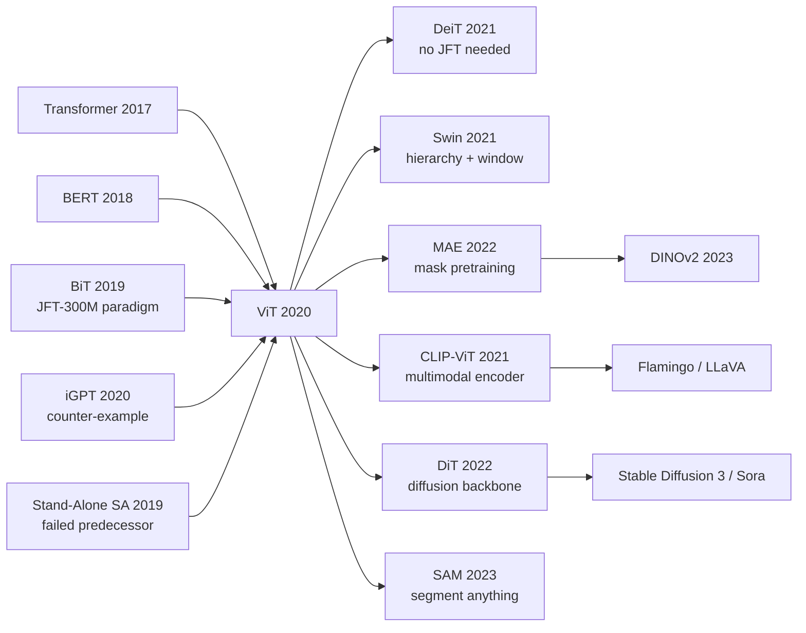

# ViT — Dethroning Convolution from Vision with Pure Transformer

> **October 22, 2020. Dosovitskiy and 11 co-authors at Google Research, Brain Team (Berlin & Zürich) upload [arXiv 2010.11929](https://arxiv.org/abs/2010.11929); the title "An Image is Worth 16×16 Words" picks a fight, and gets ICLR 2021 oral.**
> A paper that used a minimalist scheme overturning 8 years of CV consensus — chop the image into 16×16 patches, treat them as tokens, feed them straight into a standard [Transformer (2017)](../era3_attention/2017_transformer.md) encoder — and for the first time fully unified vision and NLP architectures.
> Its core thesis violated every vision researcher's intuition: **with enough data (JFT-300M: 300 million images), Transformers beat ResNets on ImageNet** — ViT-H/14 hit 88.55% top-1 after ImageNet-21k pretraining, proving that the [ResNet (2015)](../era2_deep_renaissance/2015_resnet.md)-era inductive biases ("locality + translation invariance") are **learnable, not necessary**.
> Within 6 months it spawned hundreds of vision-Transformer variants (Swin / DeiT / MAE / DINO / Segformer) and led directly to CLIP (2021) / [SAM (2023)](../era5_genai_explosion/2023_sam.md) / DiT / Sora — the entire multimodal foundation-model era. **ViT is CV's surrender treaty admitting Transformer is the universal architecture.**

## TL;DR

ViT slices a 224×224 image into 196 non-overlapping 16×16 patches, treats each patch as a "word" via a single linear projection, and feeds the resulting sequence into **a Transformer encoder that is essentially copy-pasted from BERT** — an architecture with **no convolutions and no vision-specific inductive bias whatsoever**. With pre-training on JFT-300M (Google's internal 303M-image dataset), it simultaneously beats BiT (giant ResNets) and EfficientNet on ImageNet, and proves for the first time that **vision does not need CNNs either.**

---

## Historical Context

### What Was Computer Vision Stuck On in 2020?

To appreciate ViT's audacity you must return to 2019-2020, when the consensus was rock-solid: **CNNs are the only answer for vision; Transformers are an NLP-only weapon.**

Eight years after AlexNet, the CV playbook was crystallised: **convolutions** give you translation equivariance and **locality inductive bias** — the two mechanisms that "save epochs" on image data; **hierarchical down-sampling** delivers multi-scale receptive fields; **ResNet-style residuals** make deep training tractable. Every SOTA paper sat inside this frame: ResNeXt, SENet, EfficientNet, RegNet, NFNet, BiT all pushed ImageNet top-1 from 75% to 88% by making the conv stack fatter and fancier.

> **The implicit 2020 consensus: SOTA = "bigger ConvNet + fancier augmentation + longer training schedule."**

Meanwhile NLP had been **completely rewritten** between 2017 and 2020 by the Transformer — BERT (2018), GPT-3 (2020) erased "ConvNets / RNNs + task-specific tricks" and left only "a stack of self-attention layers + massive self-supervised pre-training". The 2020 NLP consensus was the inverse of CV's: **architecture barely matters, scale is everything.**

A deep epistemic split opened up between the two communities:

- **CV side**: believed inductive bias (convolution, pooling, anchors, receptive fields) is **mandatory**, because images are "hard" (high-dimensional, continuous, translation-sensitive, multi-scale).
- **NLP side**: had just won by **dropping** inductive bias (Transformer threw away the RNN's temporal prior) and was starting to believe **simpler architecture + more data = better**.

ViT's real value is not a new module — it is **forcibly dragging the NLP paradigm into CV**: same Transformer encoder, same patch tokens, same "throw away inductive bias and let scale compensate" gamble. **Every line of ViT's architecture had existed for three years; what was missing was someone willing to bet on it.**

### The 3 Predecessors That Forced ViT Into Existence

- **Vaswani et al., 2017 (Transformer / Attention Is All You Need)** [arxiv/1706.03762](https://arxiv.org/abs/1706.03762): the literal skeleton. The Transformer encoder is lifted 1:1 — multi-head self-attention + LayerNorm + MLP + residual, all components NLP had matured three years prior. **The ViT paper §3.1 explicitly states "we follow the original Transformer as closely as possible"** — a deliberate confession.
- **Chen et al., 2020 (iGPT / Generative Pretraining from Pixels)** [icml/iGPT](https://proceedings.mlr.press/v119/chen20s.html): OpenAI's "pixel-level Transformer" four months before ViT — reshape an image into a 1D pixel sequence and run GPT-style autoregressive pre-training. It proved **Transformers can learn vision**, but only at 64×64 resolution (O(N²) attention is fatal at the pixel level), achieving just 72% linear-probe on ImageNet. **iGPT is ViT's cautionary tale — it told the ViT team never to tokenize at the pixel level.**
- **Cordonnier, Loukas, Jaggi, 2020 (On the Relationship between Self-Attention and Convolutional Layers)** [arxiv/1911.03584](https://arxiv.org/abs/1911.03584): a theoretical proof that multi-head self-attention can express any convolution — providing the mathematical license to "drop the convs." ViT §2 cites it as primary motivation.

### What the Authors Were Doing at the Time

Alexey Dosovitskiy was a senior researcher at Google Brain Berlin working on **self-supervised representation learning + transfer learning** (Exemplar-CNN, FlowNet). Lucas Beyer / Alexander Kolesnikov / Xiaohua Zhai were on the BiT (Big Transfer) team at Google Brain Zürich — they had just shipped the paper that "pre-trains a ResNet-152x4 on JFT-300M and gets SOTA on 19 transfer datasets," and **were holding the keys to JFT-300M and Google's TPU pods.** Neil Houlsby was the Adapter-BERT author, fluent in NLP transfer learning.

**The team composition itself prophesied ViT**: the BiT crew knew first-hand the power of "giant pretraining + simple architecture" in vision; Dosovitskiy knew NLP Transformers; Houlsby knew transfer. **ViT is not an architecture paper at heart — it is a transfer-learning paper.** Its real experiment was: "We have JFT-300M; can we replace ResNet with a Transformer?"

### State of Industry / Compute / Data

- **GPU/TPU**: ViT-Huge/14 was pre-trained on TPUv3-2500 cores for 2.5k TPU-core-days (~230 TPUv3 nodes × 30 days). Single-GPU academics simply could not reproduce it — for the first six months ViT essentially belonged to Google.
- **Data**: ImageNet-1k (1.28M) / ImageNet-21k (14M) / **JFT-300M (303M, Google internal)**. The latter is private — this became the paper's biggest reproducibility controversy.
- **Frameworks**: JAX + Flax (Google internal); PyTorch reimplementations (timm, lucidrains/vit-pytorch) appeared within a week.
- **Academic mood**: by NeurIPS / CVPR 2020 there had been several "Transformer for vision" attempts (Visual Transformer Wu 2020, Stand-Alone Self-Attention Ramachandran 2019, Axial-Attention Wang 2020), but all were **local or hybrid** architectures and all **lost to SOTA CNNs**. **The community was getting tired of pure Transformers** and assumed "another attempt will also die." Dosovitskiy later recalled the paper was rejected from NeurIPS 2020 with the verdict "looks like a re-tread of a failing direction."

---

## Method in Depth

### Overall Framework

The full pipeline fits in one diagram:

```
Input image (H×W×C, e.g., 224×224×3)
  ↓ split into N = HW/P² patches of size P×P (e.g., 16×16 → N=196)
  ↓ flatten each patch to P²C = 768 dims
  ↓ Linear projection → D-dim patch embedding (default D=768)
  ↓ prepend [CLS] token → 197 tokens, each D-dim
  ↓ + learnable 1D position embedding (197 × D)
  ↓ Transformer Encoder × L (default L=12)
       ↓ MSA (multi-head self-attention) → residual + LN
       ↓ MLP (2-layer GeLU, hidden 4D) → residual + LN
  ↓ take [CLS] token output → MLP head → softmax → 1000 classes
```

Different ViT variants only change (L, D, heads, MLP-hidden) and patch size:

| Model | Layers L | Hidden D | MLP size | Heads | Params | Patch size |
|------|---------|----------|----------|-------|--------|-----------|
| ViT-Base/16  | 12 | 768  | 3072  | 12 | 86M  | 16×16 |
| ViT-Base/32  | 12 | 768  | 3072  | 12 | 88M  | 32×32 |
| ViT-Large/16 | 24 | 1024 | 4096  | 16 | 307M | 16×16 |
| ViT-Large/32 | 24 | 1024 | 4096  | 16 | 306M | 32×32 |
| ViT-Huge/14  | 32 | 1280 | 5120  | 16 | 632M | 14×14 |

**Counter-intuitive #1**: smaller patches (longer sequences) give better models — exactly mirroring NLP's "finer BPE is better"; but smaller patches blow up FLOPs quadratically, so 16×16 is the industrial sweet spot. **ViT-Large/16 = 197 tokens; ViT-Huge/14 = 257 tokens** — 4-5× shorter than GPT-2's 1024-token context, so attention's O(N²) is **actually cheaper in vision than in NLP.**

**Counter-intuitive #2**: there is **no down-sampling and no spatial pooling anywhere** — every layer holds 197 tokens — the exact opposite of ResNet's 5 stages with progressive resolution reduction. This is ViT's hands-off bet that multi-scale reasoning can be learned implicitly through depth.

### Key Designs

#### Design 1: Patch Embedding — a Convolution in Disguise for Linear Projection

**Function**: convert (H, W, C) into a length-N = HW/P² token sequence. The paper writes "flatten + linear projection," but the implementation is **equivalent to a stride-P P×P convolution** — so strictly speaking ViT contains 1 conv, used only to slice patches and not for feature extraction.

**Formula**:

$$
x_p^i \in \mathbb{R}^{P^2 \cdot C}, \quad z_0 = \big[\mathrm{x_{class}};\ x_p^1 E;\ x_p^2 E;\ \cdots;\ x_p^N E\big] + E_{pos}
$$

where $E \in \mathbb{R}^{(P^2 C) \times D}$ is the patch projection matrix and $E_{pos} \in \mathbb{R}^{(N+1) \times D}$ is a 1D learnable position embedding.

**Minimal implementation** (PyTorch):

```python
import torch.nn as nn

class PatchEmbed(nn.Module):
    def __init__(self, img_size=224, patch_size=16, in_chans=3, embed_dim=768):
        super().__init__()
        self.proj = nn.Conv2d(in_chans, embed_dim,
                              kernel_size=patch_size,
                              stride=patch_size)  # stride=P conv slices patches
        self.num_patches = (img_size // patch_size) ** 2

    def forward(self, x):           # x: (B, C, H, W)
        x = self.proj(x)            # (B, D, H/P, W/P)
        x = x.flatten(2).transpose(1, 2)  # (B, N, D)
        return x
```

**Design rationale**: 1) avoid running a separate forward per patch (slow); 2) a stride-P conv is mathematically equivalent to "non-overlapping patch + linear projection," but GPU-kernel-optimised; 3) the paper §3.1 specifically notes "we also tried a ResNet stem to extract feature maps before tokenization (the hybrid model), but **pure patch projection is better at large scale**" — see the failure case below.

#### Design 2: Pure Transformer Encoder — 1:1 BERT Copy with Zero Vision-Specific Tricks

**Function**: a Pre-LayerNorm Transformer encoder identical to BERT's, with each layer being `LN → MSA → residual` then `LN → MLP → residual`. **There is not a single "vision-specific" component in this stack** — no convolution, no local attention window, no hierarchical pooling, no anchor box, no spatial pyramid.

**Per-layer formulas**:

$$
z'_\ell = \mathrm{MSA}(\mathrm{LN}(z_{\ell-1})) + z_{\ell-1}, \quad
z_\ell = \mathrm{MLP}(\mathrm{LN}(z'_\ell)) + z'_\ell
$$

**Design rationale**: the authors are explicit ("we follow the original Transformer as closely as possible") — they want ViT to **inherit five years of NLP engineering for free**: LN placement, init scheme, optimizer (AdamW), warmup schedule, mixed-precision training kernels. **This is ViT's largest lever**: don't reinvent CV optimizers, just port the BERT recipe.

**The single vision-flavoured concession**: prepend a `[CLS]` token (lifted from BERT) and use its final-layer output for classification — a design that "isn't even necessary in vision," as later proven by DeiT and MAE which replace `[CLS]` with global average pooling and get equivalent or better results. ViT author Lucas Beyer himself published [arxiv/2205.01580](https://arxiv.org/abs/2205.01580) in 2022 publicly admitting `[CLS]` is redundant.

#### Design 3: Buying Inductive Bias With Data — "Scale Is the Universal Solvent"

**Function**: this is not a module but the **true central thesis** of the ViT paper — by comparing ViT's transfer performance after pre-training on ImageNet-1k / ImageNet-21k / JFT-300M, the paper **quantitatively proves for the first time** that CNN's inductive bias is an asset on small data but a **constraint** on large data; pure Transformers lose to CNNs on small data but **always win** when data is large enough.

**Critical quantitative results** (ImageNet top-1 accuracy after fine-tuning):

| Pre-training data | Scale | ResNet152x2 (BiT) | ViT-L/16 | Winner |
|-----------|---------|-------------------|----------|------|
| ImageNet-1k     | 1.3M   | 76.5% | 76.5% | tie (no ViT advantage) |
| ImageNet-21k    | 14M    | 84.0% | 85.3% | ViT slightly |
| JFT-300M        | 303M   | 87.5% | **88.6%** | ViT decisively |
| JFT-300M (Huge) | 303M   | —     | **88.55%** (Huge/14) | ViT record |

**Design rationale**: this is a **gambling-style scientific argument** — every prior vision-Transformer paper had run experiments on ImageNet-1k, lost to ResNet, and arbitrarily concluded "Transformers don't fit vision." The ViT team's insight was that **the experimental setup itself was wrong** — comparing "no-prior architecture" vs "prior-loaded architecture" on 1M samples is like racing a person who can't crawl against a person in an exoskeleton. You need to scale to 300M images to see the true potential. **This argument is more profound than any architectural innovation** — it directly seeded scaling laws (Hoffmann 2022 Chinchilla) and the entire foundation-model paradigm.

### Loss Function / Training Strategy

ViT's loss is bland — supervised pre-training uses **multi-label sigmoid cross-entropy** (because JFT-300M has ~18k classes with multi-label per image), and fine-tuning uses standard softmax cross-entropy.

But the training recipe contains a few details that are **lethal on small data**:

- **AdamW, lr=1e-3 / wd=0.1** — much heavier regularisation than SGD.
- **batch size 4096, warmup 10k steps** — a single ViT-Huge pre-train consumes 2500 TPUv3 core-days.
- **Aggressive augmentation: RandAug + Mixup** (mandatory at fine-tune; -1 to -2 points without).
- **Fine-tune at 384×384 resolution** — this requires **2D bilinear interpolation** of the position embedding (patch grid grows from 14² to 24²). This is the only place in the entire paper where ViT "admits spatial structure exists."

### The Opponents ViT Beat

ViT simultaneously toppled every 2020 ImageNet SOTA:

- **BiT-L (Big Transfer, ResNet152x4 on JFT-300M)**: 87.54% top-1, beaten by ViT-H/14's 88.55%, and **ViT-H trained in 1/4 the wall-clock time of BiT-L** (2.5k vs 9.9k TPU-core-days).
- **NoisyStudent EfficientNet-L2**: 88.4% top-1 (semi-supervised + JFT); ViT-H matches it under purely supervised training.
- **Stand-Alone Self-Attention (Ramachandran 2019)**: pure attention but with 7×7 local windows, peaks at 77.6% — proof that "no scale + local attention" is a dead end.
- **iGPT-L (OpenAI 2020)**: 72% linear probe; published the same season as ViT but on the wrong route (pixel-level sequences).

---

## Failed Baselines

### Failure Experiments Inside the Paper (Ablations)

ViT §4.5 contains several **self-incriminating** failure experiments that are arguably more informative than the successes:

- **From-scratch ImageNet-1k**: ViT-B/16 trained directly on ImageNet-1k for 300 epochs reaches only **77.9%** — **lower** than a comparably-sized ResNet-152's 78.6%. This is the pain that all later "small data + big model" work would confront — **Transformers genuinely lose in the data-poor regime**.
- **Small data + bigger ViT**: ViT-L/16 pre-trained on ImageNet-1k is **worse** than ViT-B/16 — the larger model overfits harder on small data. Figure 4 honestly plots this "bigger model = bigger trap on small data" trend.
- **Removing the `[CLS]` token**: the authors did try GAP instead of `[CLS]` and found it **roughly identical** (0.1% gap) — yet they kept `[CLS]` to "stay as close to BERT as possible." This design was abandoned wholesale by DeiT and MAE within two years.

### The Hybrid Counter-Example — Why CNN+Transformer Loses

ViT §3.1 also tries the **Hybrid model**: extract a feature map with a ResNet first, then patch-split that feature map and feed it to the Transformer — every reader's intuition is "CNN's inductive bias + Transformer's global modeling = best of both worlds."

Experimental result (JFT-300M pre-train → ImageNet transfer):

| Model | Compute (exaFLOPs) | ImageNet top-1 |
|------|-------------------|----------------|
| Hybrid R50+ViT-B/16 | 8.4  | 84.0% |
| **Pure ViT-B/16**   | 8.4  | **84.5%** |
| Hybrid R50+ViT-L/16 | 21.0 | 87.1% |
| **Pure ViT-L/16**   | 21.0 | **87.7%** |

**At sufficient compute, pure ViT always wins by a hair.** Later hybrid lines like BoTNet (Srinivas 2021) and CoAtNet (Dai 2021) hold an edge at medium scale, but the scaling ceiling stays locked by pure ViT. **This is "the bitter lesson" (Sutton, 2019) winning its first empirical victory in vision** — any "inject-prior" design eventually yields to "general + big data" at scale.

### The Real "Fake-Baseline" Lesson

Every pre-ViT "vision Transformer" paper (Stand-Alone Self-Attention, Axial-Attention, Visual Transformer) made the same mistake — **benchmarking on ImageNet-1k**. That dataset is too small to expose the potential of prior-free architectures.

ViT Figure 5 sub-samples JFT to (10M / 30M / 100M / 300M) and plots:

- At JFT-10M, ResNet and ViT are essentially tied
- At JFT-30M, ViT begins to overtake ResNet
- At JFT-300M, ViT pulls clearly ahead

The lesson: **when a new architecture loses to SOTA on small data, don't conclude "it doesn't work" — it may simply be below the phase-transition threshold of data**. This lesson was repeatedly confirmed in 2022 self-supervised ViT work like MAE and DINOv2.

---

## Key Experimental Numbers

### Main Experiment (ImageNet Transfer)

JFT-300M pre-train → ImageNet fine-tune (fine-tune resolution 384×384):

| Model | Params | Pre-train cost (TPUv3 core-days) | ImageNet top-1 | ImageNet ReaL |
|------|-------|-----------------------------|----------------|---------------|
| BiT-L (ResNet152x4)     | 928M | 9 900 | 87.54% | 90.54% |
| ViT-L/16                | 307M | 680  | 87.76% | 90.54% |
| **ViT-H/14**            | 632M | **2 500** | **88.55%** | **90.72%** |
| NoisyStudent EffNet-L2  | 480M | 12 300 | 88.4% | — |

**Key takeaway**: ViT-L/16 uses **only 7% of BiT-L's pre-training compute** while matching its accuracy; ViT-H/14 uses 1/4 of BiT-L's compute and beats it by 1 point. **A full order of magnitude lead in pre-training efficiency.**

### VTAB Multi-Task Transfer

VTAB-1k benchmark (19 datasets × 1000 samples) measures **general visual representation** quality:

| Model | Natural | Specialized | Structured | Mean |
|------|---------|-------------|------------|------|
| BiT-L     | 78.7 | 84.4 | 60.3 | 76.3 |
| ViT-L/16  | 79.2 | 85.5 | 64.7 | 78.4 |
| ViT-H/14  | **80.7** | **86.7** | **66.5** | **79.3** |

**Key takeaway**: ViT wins on all three task families, with the largest gain on Structured tasks (3D / counting / depth) — "global attention" is friendlier to geometric and counting tasks than convolution.

### Ablations (Patch Size / Position Embed / Scale)

- **Patch size**: 14×14 > 16×16 > 32×32 (smaller is better, but FLOPs ×4)
- **Position embedding**: 1D learnable ≈ 2D learnable ≈ relative > **none (-3% top-1)** — position info is required, but the encoding scheme barely matters
- **Pre-LN vs Post-LN**: Pre-LN wins decisively (training stability) — consistent with NLP experience

### Key Findings

1. **Scale decides everything**: JFT-300M is mandatory; without it ViT loses
2. **Pre-training efficiency 4-10× better than CNNs** at matched accuracy
3. **Transformer encoders learn large attention distances even in shallow layers** — the opposite of CNN early layers (which only see local patches), confirming that pure ViT really does "think globally"
4. **Position embeddings learn a 2D grid** — visualisations show the model recovers "who is my neighbour" on its own — **inductive bias is learned from data rather than hard-coded**

---

## Idea Lineage

### Ancestry (Who Forced ViT Into Existence)

- **Vaswani 2017 (Transformer)** — direct skeleton
- **Devlin 2018 (BERT)** — `[CLS]` token + supervised pre-training paradigm lifted wholesale
- **Cordonnier 2020 (Self-attn = conv)** — mathematical license
- **iGPT (Chen 2020)** — counter-example, told ViT not to tokenize at the pixel level
- **BiT (Kolesnikov 2019)** — "JFT-300M can push ResNet to its ceiling," convincing the team that scale works
- **Visual Transformer / Stand-Alone Self-Attn / Axial-Attn** — three failed predecessors that defined the negative example

### Descendants (Inheritors)

After ViT, **almost every vision SOTA is built on ViT**:

- **DeiT (Touvron 2021)** — "ViT doesn't need JFT; with distillation + strong aug it trains on ImageNet-1k alone" — liberates single-GPU researchers
- **Swin Transformer (Liu 2021)** — "add hierarchy + windowed attention back," counter-proving that vision inductive bias still helps — but only at medium scale
- **MAE (He 2022)** — "port BERT's mask pre-training to ViT" — ViT finally gets its native self-supervision
- **DINOv2 (Oquab 2023)** — self-supervised ViT matures, single model dethrones every supervised representation
- **CLIP-ViT (2021), Flamingo (2022), LLaVA (2023)** — ViT becomes the visual encoder for every multimodal LLM
- **DiT (Peebles 2022) / Stable Diffusion 3 / Sora** — ViT replaces U-Net as the generative backbone
- **SAM (2023)** — ViT becomes the backbone of "segment anything"

### Misreadings / Simplifications

The community holds two common misreadings:

- **"ViT proves CNNs are useless"** — wrong. ViT only proves pure Transformers win **when data is large enough**; on small data or edge devices CNNs remain competitive.
- **"ViT = image BERT"** — half right. Architecturally yes, but ViT used **supervised** pre-training + supervised fine-tuning; the real "image BERT" (mask pre-training) arrived in 2022 with BEiT and MAE.



---

## Modern Perspective

### Assumptions That Don't Hold

Looking back six years (2020 → 2026), several core ViT claims have been partially overturned:

- **"No inductive bias needed"**: partially refuted by Swin / ConvNeXt (Liu 2022) — at medium scale, hierarchy + local windows still buy 1-2 points; only at sufficient scale does pure ViT erase the gap.
- **"`[CLS]` token is necessary"**: completely wrong. GAP / register tokens are strictly better (Beyer 2022, Darcet 2024).
- **"1D position embedding is enough"**: wrong. RoPE / 2D ALiBi add ~1% on large models.
- **"Must use JFT-300M"**: defeated by MAE self-supervision — today unlabelled ImageNet-22k + self-supervision matches the original ViT-H.

### What the Era Validated as Essential vs Redundant

| Design | Essential / Redundant | Era verdict |
|------|------------|---------|
| Patch tokenization | **Essential** | preserved by every later vision Transformer |
| Pure Transformer encoder | **Essential** | the true paradigm shift |
| JFT-300M pre-training | **Transitional** | replaced by MAE / DINOv2 self-supervision |
| `[CLS]` token | **Redundant** | follow-ups switch to GAP |
| 1D learnable pos embed | **Redundant** | superseded by RoPE |
| 384×384 fine-tune | **Redundant** | modern training is native-resolution |

### Side Effects the Authors Did Not Anticipate

- **Unification of multimodal backbones**: ViT not only won CV — it became **the only visual front-end** for CLIP / Flamingo / LLaVA / Sora — every "image/video + language" system shares one ViT. The authors did not predict this cross-modal unification in 2020.
- **Generative-model annexation**: DiT (Peebles 2022) wraps ViT inside diffusion and becomes the backbone for Stable Diffusion 3 and Sora. **ViT in turn ended U-Net's reign in generative models.**
- **3D / video generalisation**: Video-ViT (TimeSformer, ViViT) extends patch tokenization to (T, H, W) cubes; NeRF / Gaussian Splatting use ViT as feature grid. **The ontology of "image = sequence" was extended to every visual modality.**

### If You Were Rewriting ViT Today

The 2026 "Modern ViT" looks like this:

- Drop `[CLS]`; use GAP or 4-8 register tokens
- Replace 1D learnable position embedding with RoPE
- Replace MLP GeLU with SwiGLU
- Replace LayerNorm with RMSNorm
- Use patch16 + adaptive resolution (no fixed 224, FlexiViT-style)
- Self-supervised pre-training via MAE / DINOv2 / SigLIP (no JFT dependence)
- Hyperparameter transfer via µParam or [µTransfer](https://arxiv.org/abs/2203.03466)

**The skeleton is still 2020 ViT — that is its greatest victory in six years**: everyone tweaks the details, no one touches the main structure.

---

## Limitations and Outlook

### Limitations the Authors Acknowledge

- **Data dependence**: ViT publicly loses to CNN on small datasets — "future work should study self-supervised pre-training of ViT" (§5). This todo was perfectly cashed in two years later by MAE.
- **No downstream detection / segmentation**: the original paper only tested classification. Mask R-CNN + ViT backbone had to wait for ViTDet (Li 2022).
- **Poor interpretability**: the authors admit "why patch tokenization works at large scale is theoretically unclear" — the theoretical gap is still not fully closed.

### Limitations Self-Discovered

- **Position-encoding extrapolates poorly**: 1D learnable embed cannot directly transfer to a different resolution (must 2D-interpolate); later solved by RoPE.
- **`[CLS]` token wastes attention**: every token spends compute attending to `[CLS]`, but `[CLS]` itself contributes no semantics — later proven by the register-token paper (Darcet 2024) to be a kludge for "the model hides global information in `[CLS]`," and inelegant.
- **Hybrid still wins at small scale**: the authors honestly admit this — leaving room for Swin / CoAtNet to exist.
- **Pre-training cost is not reproducible**: JFT-300M is private; 2.5k TPU-core-days is big-tech-only. **Academia could use ViT but not modify ViT for a long time.**

### Improvement Directions (Already Confirmed by Later Work)

- **Self-supervised pre-training to escape JFT** → MAE (2022), DINOv2 (2023) ✓
- **Hierarchy + windows** → Swin (2021), Hiera (2023) ✓
- **Better position encoding** → RoPE (RoFormer 2021), 2D ALiBi ✓
- **Drop [CLS]** → DeiT III, SigLIP ✓
- **Efficiency**: sparse attention / FlashAttention / linear attention → ~~Performer / Linformer~~ → FlashAttention 2 (2023) ✓
- **Cross-modal unification** → CLIP, Flamingo, BLIP-2 ✓

---

## Related Work and Inspiration

ViT is **CV's first true foundation model** — its arrival shifted the research paradigm from "design a network per task" to "train one big ViT and transfer it to all downstream." The significance reaches far beyond architecture:

- **Theoretical inspiration**: the first empirical demonstration of scaling laws in vision, directly seeding "vision scaling" lines like BiT-XL, PaLI, and PaLI-Gemma.
- **Engineering inspiration**: the CV training stack (augmentation / optimizer / lr schedule / mixed precision) began converging with the NLP stack. Timm's ViT recipe became the de facto standard for all vision pretraining.
- **Paradigm inspiration**: the design of `[image patch + text token]` sharing a single Transformer directly seeded CLIP / Flamingo / LLaVA / GPT-4V / Gemini. **No ViT, no modern multimodal LLM.**
- **Value of negative results**: ViT honestly admitted "loses to CNN on small data" — that honesty let follow-up work pinpoint the problem (data → MAE, efficiency → DeiT, structure → Swin), saving the community at least two years of blind search.

ViT is not the most technically sophisticated paper — every component existed in the 2017 Transformer. Its greatness lies in **picking the right moment (JFT-300M existed, TPU pods were available), the right experimental setup (large-scale comparisons + transfer benchmarks), and answering a question everyone wanted to ask but no one dared**: "Does vision really need convolutions?"

The answer: at sufficient scale, **no**.

---

## Resources

- **Paper**: [arXiv 2010.11929](https://arxiv.org/abs/2010.11929)
- **Official code (JAX/Flax)**: [google-research/vision_transformer](https://github.com/google-research/vision_transformer)
- **PyTorch reimplementations**: [lucidrains/vit-pytorch](https://github.com/lucidrains/vit-pytorch), [rwightman/pytorch-image-models (timm)](https://github.com/huggingface/pytorch-image-models)
- **Pre-trained weights**: [Hugging Face Hub: google/vit-*](https://huggingface.co/google/vit-base-patch16-224)
- **Key follow-ups**:
  - [DeiT (2021)](https://arxiv.org/abs/2012.12877) — frees ImageNet-1k training
  - [Swin Transformer (2021)](https://arxiv.org/abs/2103.14030) — hierarchy + windows
  - [MAE (2022)](https://arxiv.org/abs/2111.06377) — self-supervised pre-training for ViT
  - [DINOv2 (2023)](https://arxiv.org/abs/2304.07193) — self-supervised ViT general representation
  - [CLIP (2021)](https://arxiv.org/abs/2103.00020) — ViT as multimodal visual encoder
  - [DiT (2022)](https://arxiv.org/abs/2212.09748) — ViT replaces U-Net for diffusion
  - [SAM (2023)](https://arxiv.org/abs/2304.02643) — ViT as segmentation foundation model
- **Readable survey**: [Khan et al., "Transformers in Vision: A Survey" (2022)](https://arxiv.org/abs/2101.01169)
- **Author retrospective**: Lucas Beyer's ICCV 2023 keynote *What's next for vision transformers?*
