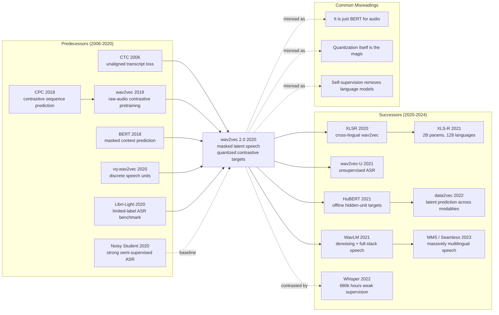

# wav2vec 2.0 - Speech Recognition After 53k Hours of Listening and 10 Minutes of Labels

> **On June 20, 2020, Alexei Baevski, Henry Zhou, Abdelrahman Mohamed, and Michael Auli at Facebook AI uploaded [arXiv:2006.11477](https://arxiv.org/abs/2006.11477).** The paper's drama was not merely another lower WER on LibriSpeech; it changed what counted as the scarce resource in speech recognition. Instead of assuming that every language needed hundreds or thousands of transcribed hours before ASR could work, wav2vec 2.0 asked the model to listen first: pre-train on raw audio, mask latent speech spans, identify the right quantized unit, and only then fine-tune with CTC. With 53k hours of unlabeled LibriVox audio and only ten minutes of transcribed speech, it reached 4.8/8.2 WER on LibriSpeech test-clean/test-other; with one hour of labels it beat the previous 100-hour semi-supervised systems. It made speech SSL feel like BERT had finally arrived for audio, but with a harder input space and a much more consequential promise for low-resource languages.

## TL;DR

Baevski, Zhou, Mohamed, and Auli's NeurIPS 2020 wav2vec 2.0 rewrites speech recognition from "collect many transcribed hours, then train an acoustic model" into "learn from raw audio first, then calibrate with a tiny amount of text." The core recipe is: a CNN converts waveform into latent frames $z_t$; roughly half the latent time steps are masked; a Transformer produces contextual states $c_t$; a product quantizer supplies discrete target units $q_t$; and the pretraining objective $\mathcal{L}_m=-\log \frac{\exp(\mathrm{sim}(c_t,q_t)/\kappa)}{\sum_{\tilde q\in Q_t}\exp(\mathrm{sim}(c_t,\tilde q)/\kappa)}+\alpha\mathcal{L}_d$ asks the model to pick the right quantized unit among 100 distractors before CTC fine-tuning turns the representation into transcripts. The baselines it displaced were not weak toys: two-stage vq-wav2vec / Discrete BERT pipelines and Noisy Student-style semi-supervised ASR. With only ten minutes of labels plus 53k hours of unlabeled audio it reached 4.8/8.2 WER on LibriSpeech test-clean/test-other; with one hour of labels it beat the previous 100-hour semi-supervised systems. Much as BERT (2018) made masked pretraining the default in text and SimCLR (2020) made contrastive representation learning credible in vision, wav2vec 2.0 made large-scale speech SSL feel like the new ASR substrate rather than a clever regularizer. The counterintuitive lesson is sharp: to learn transcription with little text, the model first has to build a discrete, predictable world inside raw sound.

---

## Historical Context

### The speech-recognition bottleneck in 2020

By 2020 automatic speech recognition was no longer a HMM-GMM story. End-to-end models, CTC, RNN-T, Transformer Transducers, and Conformers were all in play, and English read-speech benchmarks such as LibriSpeech had been pushed to very low WER. But those results shared a costly assumption: **you first need many hours of transcribed audio**. The paper opens with the uncomfortable global fact that the world has close to 7,000 spoken languages, while only a tiny fraction can provide hundreds or thousands of hours of clean transcription.

That made ASR and NLP feel like different worlds at the same moment. NLP had already been rebuilt around "pre-train on massive unlabelled text, then fine-tune": BERT, GPT-2, and RoBERTa made this the default recipe. Speech recognition still looked like "collect labels again for every language, domain, accent, and channel." The issue was not just cost. Speech annotation is slower than text annotation because a transcriber must listen through the audio; dialect, accent, overlapping speakers, noise, and named entities all raise the price. For low-resource languages, labels were not merely sparse; they were often the reason a project could not start.

wav2vec 2.0 targets exactly that economic mismatch: **audio is abundant; transcription is scarce**. The web, podcasts, broadcasts, audiobooks, call centers, and public archives contain vast amounts of unlabelled speech. If a model can first learn stable acoustic and phonological structure from that audio, then use a small amount of text to align the representation to writing, the economics of ASR change.

### Self-supervision was arriving from text and vision

wav2vec 2.0 did not appear in isolation. From 2018 to 2020, the strongest cross-modal trend in machine learning was self-supervised pretraining: BERT learned textual context by masking tokens, GPT learned language distributions by next-token prediction, CPC learned sequence representations with contrastive predictive coding, and SimCLR / MoCo made visual self-supervision competitive with supervised pretraining.

Speech had its own precursors. The 2019 wav2vec paper had already shown that contrastive prediction over raw waveform helps ASR; ICLR 2020 vq-wav2vec discretized speech into intermediate units that behaved like rough "speech tokens." But two problems remained. First, discretization and contextual modeling often happened in separate stages, so errors from the first stage became frozen. Second, speech has no natural word boundaries or tokens: the model has to learn both "what the units are" and "how context predicts them."

This is why wav2vec 2.0 smells like BERT but cannot simply copy BERT. In text, `[MASK]` hides a word or subword. In speech, there is only continuous waveform. The paper's core engineering judgment is to compress waveform into short latent frames with a CNN, mask those latent frames, and let a Transformer recover a **discrete target learned by the model itself**. This turns "speech has no vocabulary" into "learn a vocabulary during pretraining."

### Facebook AI's speech line before wav2vec 2.0

The author team was not an outsider arriving in ASR. Facebook AI already had fairseq, wav2letter++, wav2vec, vq-wav2vec, and Libri-Light as a continuous speech stack. Michael Auli's group had a useful overlap: they understood NLP pretraining, had scalable speech training infrastructure, and could ship open models through fairseq rather than leaving the paper as a closed recipe.

Alexei Baevski drove a sequence of related projects from vq-wav2vec to wav2vec 2.0 and later data2vec; Abdelrahman Mohamed brought long experience in speech recognition and neural acoustic modeling; Michael Auli anchored the fairseq and Facebook NLP/speech systems side. The result has a visible cross-domain flavor: **use the pretraining logic of NLP to solve the labeling economics of speech.**

### Engineering conditions at publication time

wav2vec 2.0 is often described as conceptually simple, but it was not a toy experiment. The paper pre-trains on 960 hours of LibriSpeech and on 53.2k hours of LibriVox / Libri-Light audio. BASE uses 64 V100 GPUs for about 1.6 days; LARGE uses 128 V100 GPUs for about 2.3 days on LibriSpeech and about 5.2 days on the 53.2k-hour setup. This is an early foundation-model shape in 2020 terms: not yet billion-scale, but already "large unlabelled data + large model + downstream fine-tuning."

When Meta AI released the blog post and open models on September 24, 2020, the headline was not the equation; it was the industrially legible number: **ten minutes of transcription plus 53k hours of unlabelled audio reached 5.2/8.6 WER on clean/noisy LibriSpeech**. The arXiv abstract reports the final test-clean/test-other numbers as 4.8/8.2. Either way, the story is the same: label time can shrink from 100 hours to one hour or even ten minutes without ASR collapsing.

---

## Background and Motivation

### Problem definition

The problem can be stated in one line: **given abundant unlabelled speech $x$ and a small amount of transcribed speech $(x, y)$, how do we first learn a transferable speech representation and then attach it to text with CTC?** This differs from ordinary acoustic-model training. Standard training directly minimizes transcript loss and overfits when labels are tiny; wav2vec 2.0 first constructs a no-text pretraining task that forces the model to predict masked speech structure.

The task has three difficulties. First, speech is continuous waveform, not discrete tokens like text. Second, speech units have variable length and no explicit phoneme boundaries; a 25 ms slice may cover only part of a phoneme. Third, many continuous signal details are irrelevant to ASR: microphone response, background noise, speaker timbre, and room acoustics can make waveform reconstruction the wrong objective. The model should preserve linguistically useful information, not recording conditions.

### Core objective

wav2vec 2.0 is not trying to solve fully unsupervised ASR in one step. It is a more pragmatic two-stage recipe: learn representations from unlabelled audio, then fine-tune on a small amount of transcription. This avoids the hardest alignment problem in fully unsupervised speech recognition while directly attacking the real bottleneck: many languages can collect unlabelled audio, but cannot organize large-scale transcription.

The technical objective is equally explicit: combine vq-wav2vec's discrete units, BERT's masking, CPC / SimCLR's contrastive loss, and CTC's weak-alignment training into one pipeline. The novelty is less any single module than the division of labor: the CNN handles waveform, the Transformer handles long context, the quantizer supplies only targets, the contrastive loss makes those targets abstract enough, and CTC grounds the pretrained representation in written text.

---

## Method Deep Dive

### Overall framework

wav2vec 2.0 is a four-stage pipeline: **raw waveform -> CNN latents -> Transformer context -> contrastive learning over quantized targets -> CTC fine-tuning**. It does not start from human-designed filterbanks and does not require phoneme boundaries. The input is raw audio $x$; the feature encoder $f$ maps waveform into latent representations $z_1,\dots,z_T$; the context network $g$ receives a partially masked latent sequence and produces contextual representations $c_1,\dots,c_T$; the quantizer discretizes the unmasked $z_t$ into targets $q_t$; and the pretraining objective asks $c_t$ to identify the true $q_t$ among distractors.

The most important detail is: **the Transformer input stays continuous; only the prediction target is discrete**. If the input is also quantized, the Transformer loses too much acoustic detail before contextual modeling begins. If the target is continuous, the model can waste capacity predicting speaker, channel, noise, and other irrelevant details. wav2vec 2.0 keeps continuous inputs for context and uses discrete targets to force more language-relevant abstraction.

| Component | BASE | LARGE | Why it matters |
|---|---:|---:|---|
| Feature encoder | 7 temporal conv blocks | same | maps waveform to 49 Hz latent frames |
| Transformer | 12 layers, 768 dim, 8 heads | 24 layers, 1024 dim, 16 heads | provides sequence context over masked spans |
| Quantizer | G=2, V=320 | G=2, V=320 | up to 102.4k codeword combinations |
| Pretraining scale | 64 V100, 1.6 days on LS-960 | 128 V100, 2.3 days on LS-960 / 5.2 days on LV-53k | makes low-label transfer work |

The training loop compresses to this pseudocode:

```python
def wav2vec2_pretrain(waveform):
    z = feature_encoder(waveform)              # [T, d], about one frame every 20 ms
    mask = sample_span_mask(z, p=0.065, M=10)  # about 49% latent steps masked
    z_masked = replace_with_mask_embedding(z, mask)
    c = transformer_context(z_masked)          # contextual states
    q = product_quantizer(z.detach())          # discrete targets from unmasked latents
    positives = q[mask]
    negatives = sample_distractors(q, mask, K=100)
    loss = contrastive(c[mask], positives, negatives) + 0.1 * diversity_loss(q)
    return loss
```

### Key design 1: From raw waveform to latent frames

The feature encoder is seven temporal-convolution blocks, each containing 1D convolution, layer normalization, and GELU. The strides are `(5,2,2,2,2,2,2)` and kernel widths are `(10,3,3,3,3,2,2)`, yielding a roughly 49 Hz latent sequence: adjacent latent frames are about 20 ms apart and each frame has a receptive field of about 25 ms.

The point is not that CNNs are novel. The point is to turn high-frequency waveform into a token-like sequence a Transformer can process. Feeding 16 kHz raw audio directly into a Transformer would turn a 15-second crop into 240k samples, making attention impossible. The CNN stride compresses it into roughly 750 latent steps, a length that starts to resemble a textual sequence.

$$
z_1,\dots,z_T = f(x), \qquad c_1,\dots,c_T = g(\mathrm{mask}(z_1,\dots,z_T))
$$

Here $f$ handles local acoustics and $g$ handles long context. A subtle implementation choice matters during fine-tuning: the feature encoder is frozen. Only the Transformer and the output head adapt to CTC. This reduces overfitting in tiny-label settings and prevents ten minutes of labels from destroying the low-level acoustic representation learned during pretraining.

### Key design 2: Mask in latent space

wav2vec 2.0 masks neither waveform nor spectrograms. It masks the CNN feature encoder's latent frames. The paper uses $p=0.065$: sample a subset of time steps as starting indices, then mask the following $M=10$ latent steps from each start; spans may overlap. For a 15-second clip, about 49% of latent steps become masked, with an average span length of 14.7 steps, or roughly 299 ms.

This differs from BERT's 15% token masking because speech is highly redundant. Neighboring 20 ms frames are very similar; masking only one frame lets the model solve the task by local interpolation. Masking nearly 300 ms of consecutive speech forces the Transformer to use broader context. The appendix ablations make the same point: shorter/easier masking can improve the self-supervised prediction accuracy while hurting downstream WER.

### Key design 3: Quantized targets and contrastive loss

The quantizer uses product quantization: $G=2$ codebooks, each with $V=320$ entries. One entry is selected from each codebook and concatenated, giving a theoretical $320^2=102{,}400$ combinations. Selection uses Gumbel-softmax with a straight-through estimator, so the forward pass is a hard codeword but gradients can still flow.

$$
p_{g,v} = \frac{\exp((l_{g,v}+n_v)/\tau)}{\sum_{k=1}^{V}\exp((l_{g,k}+n_k)/\tau)}, \qquad n_v=-\log(-\log u_v)
$$

For each masked time step $t$, the model uses context output $c_t$ to distinguish the true quantized target $q_t$ from $K=100$ distractors sampled from other masked positions in the same utterance. The loss is an InfoNCE-style objective over cosine similarity, plus a codebook diversity loss that encourages uniform use of codebook entries.

$$
\mathcal{L}_m = -\log \frac{\exp(\mathrm{sim}(c_t,q_t)/\kappa)}{\sum_{\tilde q\in Q_t}\exp(\mathrm{sim}(c_t,\tilde q)/\kappa)}, \qquad
\mathcal{L}=\mathcal{L}_m+\alpha\mathcal{L}_d
$$

The key is not discretization by itself, but where discretization happens. The paper's ablation shows that continuous input + quantized targets gives 7.97 dev WER; quantizing both input and target worsens to 12.18; continuous targets worsen to 8.58. In other words, the model needs continuous input to model context, but discrete targets to avoid treating noise, speaker identity, and channel details as the prediction object.

### Key design 4: CTC fine-tuning

After pretraining, wav2vec 2.0 adds a randomly initialized linear projection on top of the Transformer to output character classes: for LibriSpeech, 29 character-related tokens plus a word-boundary token. Fine-tuning uses CTC loss, so no frame-level alignment is required; the model learns to collapse frame-level outputs into text. In low-label settings, the paper trains only the output classifier for the first 10k updates before updating the Transformer; the feature encoder remains frozen.

| Design choice | Alternative it avoided | Evidence in paper | Lesson |
|---|---|---|---|
| Continuous Transformer input, quantized target | quantize both input and target | 7.97 WER vs 12.18 WER | keep acoustic detail for context, abstract target for prediction |
| Latent-span masking | single-frame or waveform masking | 49% masked, mean 299 ms span | speech needs long missing spans to avoid local interpolation |
| Contrastive target selection | waveform or filter-bank reconstruction | continuous target worsens to 8.58 WER | do not reward recording-condition reconstruction |
| CTC fine-tuning | full seq2seq training from tiny labels | 10 min / 1 h settings remain trainable | weak alignment is enough once representations are strong |

This table also explains why wav2vec 2.0 became the starting point for HuBERT, WavLM, and XLS-R. It defined the interface for speech SSL. The frontend can change, the target can change, and the loss can change, but the frame of "pretrain a contextual speech encoder on large unlabelled audio, then fine-tune with few labels" remained.

---

## Failed Baselines

wav2vec 2.0 matters not only because it works, but because it clarifies why several plausible speech-pretraining routes were not enough. It is not just a bigger model; it is a precise set of choices about the objective and the information bottleneck.

### Failed baseline 1: Pure supervised ASR

Pure supervised systems were already strong in high-resource English. ContextNet, Conformer, Transformer Transducer, CTC Transformer, and related systems could push LibriSpeech to low WER. But these systems assumed 100 hours, 960 hours, or more transcribed speech. When labels shrink to ten minutes or one hour, a standard acoustic model rapidly overfits: it can memorize a few utterances but cannot learn stable phonological structure.

wav2vec 2.0's contrast is striking: ten minutes of labels means only 48 recordings, averaging 12.5 seconds each. In traditional ASR this is barely enough to train a usable acoustic model. After LARGE pretraining on 53.2k hours of unlabelled audio, however, Transformer-LM decoding reaches 4.8/8.2 WER. The pure supervised route fails because of data economics, not because of one missing architectural tweak.

### Failed baseline 2: Two-stage vq-wav2vec / Discrete BERT

The vq-wav2vec and Discrete BERT route first learns discrete speech units and then trains a contextual model over those units. The idea is natural: if BERT needs tokens, turn speech into tokens first. But the two-stage process has a problem: the quantizer's errors in stage one become inherited by stage two; the context model only sees a sequence already compressed by a separate model.

wav2vec 2.0's correction is "continuous input, discrete target." The Transformer sees continuous latents that still carry acoustic detail, while only the prediction target is quantized. The ablation shows that quantizing both input and target worsens dev WER from 7.97 to 12.18. This explains why earlier discretization pipelines stalled. Discretization is not wrong; closing the information gate too early is wrong.

### Failed baseline 3: Reconstruction or continuous-target SSL

Another intuitive route is reconstruction: mask a segment of audio and reconstruct waveform, filterbanks, or continuous latents. The problem is that many reconstructable details are useless for ASR. Background noise, speaker timbre, room acoustics, and microphone response all help reconstruction but should not dominate representation learning.

The continuous-target ablation gives direct evidence. Continuous input + continuous target yields 8.58 dev WER, worse than continuous input + quantized target at 7.97. More interestingly, continuous targets make the pretraining classification task easier: training accuracy for identifying the correct latent rises from 62% to 78%, yet downstream WER gets worse. This is a classic self-supervised learning lesson: **an easier pretext task is not necessarily a better representation task**.

### Failed baseline 4: Complex self-training

Noisy Student / iterative pseudo-labeling represented the strong semi-supervised ASR line in 2020: train a teacher, pseudo-label unlabelled audio, filter, train a student, and repeat. The system is effective, but it is engineering-heavy and depends on decoders, pseudo-label quality, filtering heuristics, and multi-round tuning.

wav2vec 2.0's advantage is a shorter pipeline: pretrain once on unlabelled audio, fine-tune once on labelled audio. Against Noisy Student's 4.2/8.6 WER in the 100-hour setting, wav2vec 2.0 LARGE reaches 2.3/5.0 with LibriSpeech-960 pretraining and 100-hour fine-tuning; with one hour of labels it still reaches 3.9/7.6. The paper does not prove self-training useless; it proves representation pretraining can remove much of the label-scarcity burden before pseudo-labeling even enters.

| Baseline | Why it looked reasonable | Where it failed | wav2vec 2.0 correction |
|---|---|---|---|
| Pure supervised ASR | strong on 960h English | collapses under 10 min / 1 h labels | pretrain on raw unlabelled audio |
| Two-stage discrete units | BERT needs tokens | early quantization loses context detail | continuous input, quantized target |
| Reconstruction / continuous target | natural for autoencoding | learns speaker/noise/channel shortcuts | contrastive target over discrete units |
| Iterative self-training | strong semi-supervised baseline | complex multi-round pseudo-label pipeline | one pretrain phase, one CTC fine-tune phase |

---

## Key Experimental Data

wav2vec 2.0's experiments show more than "pretraining helps." They establish three claims: pretraining becomes more valuable as labels shrink; more unlabelled audio stabilizes low-resource transfer; and the placement of the discrete target determines performance.

### Key data 1: Ten minutes and one hour of labels

The historically memorable result is the low-resource setting. LARGE pretraining on 53.2k hours of LibriVox / Libri-Light audio, followed by ten minutes of labeled fine-tuning and Transformer-LM decoding, gives 4.8/8.2 WER on LibriSpeech test-clean/test-other. That label set has only 48 annotated recordings, averaging 12.5 seconds. With one hour of labels, the same 53.2k-hour pretraining gives 2.9/5.8; even with only LibriSpeech-960 unlabelled pretraining, one hour gives 3.9/7.6.

### Key data 2: 100 hours and 960 hours

In the 100-hour setting, Noisy Student is the strong baseline, with 4.2/8.6 WER on test-clean/test-other. wav2vec 2.0 LARGE, pretrained on the same 960 hours of LibriSpeech audio and fine-tuned on 100 hours, reaches 2.3/5.0, a 45%/42% relative WER reduction. This matters because 100 hours is not a toy low-resource setting; it is the upper limit many real speech projects can afford.

With the full 960 hours labeled, LARGE plus 53.2k hours of unlabelled pretraining reaches 1.8/3.3, especially strong on noisy test-other compared with many contemporary supervised and semi-supervised systems. Pretraining is not merely a crutch for tiny labels; in high-resource settings it still improves robustness.

| Setting | Unlabeled pretrain | Labeled data | Decoder | test-clean / test-other WER |
|---|---:|---:|---|---:|
| Low-resource extreme | 53.2k h LibriVox | 10 min | Transformer LM | 4.8 / 8.2 |
| Low-resource | 53.2k h LibriVox | 1 h | Transformer LM | 2.9 / 5.8 |
| Comparable to Noisy Student | 960 h LibriSpeech | 100 h | Transformer LM | 2.3 / 5.0 |
| High-resource | 53.2k h LibriVox | 960 h | Transformer LM | 1.8 / 3.3 |
| TIMIT phoneme recognition | 960 h LibriSpeech | TIMIT | no LM | 7.4 / 8.3 PER |

### Key data 3: TIMIT and ablations

TIMIT phoneme recognition is a more direct test of "speech units." wav2vec 2.0 LARGE pretrained on LibriSpeech-960 and fine-tuned on TIMIT without a language model reaches 7.4 dev PER / 8.3 test PER; vq-wav2vec gives 9.6/11.6, and original wav2vec gives 12.9/14.7. This supports the paper's claim that the discrete latents do relate to phonetic structure.

The quantization ablation explains the method more than any prose summary:

| Input to Transformer | Target in contrastive loss | dev WER | Interpretation |
|---|---|---:|---|
| continuous | quantized | 7.97 | best balance of context detail and abstract target |
| quantized | quantized | 12.18 | too much input information lost |
| quantized | continuous | 11.18 | worst of both worlds |
| continuous | continuous | 8.58 | target contains nuisance details |

This table is almost the method's thesis: **do not discretize speech too early, and do not ask the model to predict an overly detailed continuous signal**. A good self-supervised target must sit exactly between "predictable" and "useful for downstream recognition."

---

## Idea Lineage

wav2vec 2.0 is a convergence point for speech self-supervision in 2020: CPC gives it the contrastive objective, BERT gives it masked pretraining, vq-wav2vec gives it discrete speech units, and CTC gives it a practical low-label fine-tuning route. Its descendants are equally legible: HuBERT changes the target, WavLM broadens the task coverage, XLS-R scales languages, data2vec abstracts the objective across modalities, and Whisper challenges it from the weakly supervised side.



### Before: From CPC to BERT-ified speech

The first ancestor is **CTC (2006)**. Without CTC, wav2vec 2.0's low-label fine-tuning would be difficult, because the model needs to map audio to characters without frame-level alignment. CTC supplies the weak-alignment loss that lets a pretrained encoder plus a simple linear head become an ASR system.

The second line is **CPC / wav2vec**. CPC showed that contrastive prediction from context can learn useful sequence representations; wav2vec 2019 moved that idea to raw speech. wav2vec 2.0 inherits this discriminative objective rather than a reconstruction-style autoencoder objective.

The third line is **BERT / masked prediction**. BERT made "mask part of the input and use context to recover it" the dominant pretraining template. wav2vec 2.0's key move is acknowledging that speech has no pre-existing tokens, then building them with CNN latents plus a quantizer.

The fourth line is **vq-wav2vec / Discrete BERT**. They proved that discrete speech units are useful, but also exposed the weakness of a two-stage pipeline. wav2vec 2.0 inherits them carefully: keep discrete targets, reject discrete inputs.

### After: Five branches grown from wav2vec 2.0

The first branch is cross-lingual learning. XLSR and XLS-R extend wav2vec 2.0-style pretraining to multilingual unlabelled audio; XLS-R reaches 2B parameters, 128 languages, and nearly half a million hours of public speech. This line turns the paper's low-resource-language promise into a real research program.

The second branch changes the target. HuBERT replaces the online quantizer with offline k-means hidden units and turns masked prediction into a more classification-like task. WavLM adds denoising so representations serve not only ASR but also speaker, emotion, separation, and other full-stack speech tasks.

The third branch is unsupervised ASR. wav2vec-U segments unlabelled audio with wav2vec representations and learns a phoneme mapping with adversarial training, reducing TIMIT unsupervised PER from 26.1 to 11.3. This shows that strong speech representations can move the hardest no-label recognition problem substantially.

The fourth branch is unified self-supervision. data2vec stops predicting discrete speech units and instead predicts a teacher network's contextual latent representations, using one objective for speech, vision, and language. It abstracts wav2vec 2.0's lesson: the important idea is masked-view prediction of full-view representation, not the speech unit itself.

The fifth branch is weak-supervision as a challenge. Whisper trains on 680k hours of multilingual weakly supervised transcripts and emphasizes zero-shot robustness rather than few-label fine-tuning. It does not refute wav2vec 2.0; it shows that once enough noisy labels exist, the industrial route may shift from "self-supervision + tiny labels" to "weak supervision + very large labels."

### Misreadings: Three common distortions

**Misreading 1: wav2vec 2.0 is simply BERT for audio.** The phrase is useful but too coarse. BERT's tokens are human-defined vocabulary items; wav2vec 2.0's tokens are learned short acoustic units. BERT masks 15% of tokens; wav2vec 2.0 masks about 49% of latent steps. BERT uses vocabulary softmax; wav2vec 2.0 uses contrastive loss and codebook diversity. The paradigm is similar; the mechanics are not.

**Misreading 2: Quantization itself is the magic.** The ablation says the opposite: quantization in the wrong place hurts badly. Quantizing the input as well as the target worsens WER from 7.97 to 12.18; continuous targets invite nuisance-detail prediction. The magic is not "discrete" but the information bottleneck of "continuous context + discrete target."

**Misreading 3: Self-supervised pretraining removes language models.** The strongest low-resource numbers in the paper rely heavily on Transformer-LM decoding. Without an LM, the ten-minute setting remains very weak. The language model constrains phonetic/character guesses into plausible word sequences. wav2vec 2.0 reduces acoustic labeling needs; it does not make textual priors irrelevant.

---

## Modern Perspective

### Assumptions that did not survive

1. **"The target for speech SSL should be learned online."** wav2vec 2.0's online Gumbel quantizer is elegant, but HuBERT showed that offline k-means targets can match or exceed wav2vec 2.0 if they are consistent enough. Later systems often care more about target stability and scalability than about end-to-end elegance.
2. **"ASR is the only central downstream task."** The paper is organized around LibriSpeech WER. WavLM, SUPERB, and related work show that universal speech representations also need to serve speaker verification, emotion recognition, diarization, speech separation, and intent classification. ASR is one outlet of a speech foundation model, not the whole story.
3. **"Unlabelled data is always more important than weakly labelled data."** Whisper showed that 680k hours of weakly supervised transcripts can be extremely strong for zero-shot robustness. From a 2026 view, pure self-supervision and weak supervision are not mutually exclusive ideologies; they fit different data regimes. If noisy transcripts are abundant, weak supervision is direct. If only raw audio exists, wav2vec 2.0-style SSL remains the realistic route.
4. **"Low-resource transfer can mostly come from English pretraining."** XLS-R, MMS, Seamless, and related work show that multilingual pretraining itself is crucial. English LibriSpeech is a useful method-validation platform, but real low-resource speech needs cross-lingual unit sharing, broad phonological coverage, and harder data governance.

### What proved essential vs incidental

| Element | 2020 role | 2026 judgment | Why |
|---|---|---|---|
| Masked latent prediction | core | still central | speech SSL still relies on missing-span contextual learning |
| Continuous input + discrete target | core | partly central | HuBERT changes target construction but keeps target abstraction |
| Gumbel product quantizer | mechanism | replaceable | offline clusters and teacher latents often work better at scale |
| LibriSpeech WER as main metric | evaluation anchor | too narrow | SUPERB / multilingual / robustness tasks reveal more dimensions |

### If wav2vec 2.0 were rewritten today

If I rewrote this paper in 2026, I would keep the core frame: large-scale raw-speech pretraining followed by low-label CTC or seq2seq fine-tuning. But I would change three things. First, the target would not be only an online quantizer; I would systematically compare HuBERT-style cluster targets, data2vec-style teacher latents, and phoneme-aware pseudo targets. Second, evaluation would not stop at LibriSpeech WER; it would include SUPERB, Common Voice, multilingual ASR, speaker tasks, noise robustness, and domain shift. Third, training data would expand from English audiobooks to multilingual, multidomain, multi-accent audio, with explicit discussion of licensing and dialect coverage.

What would not change is the paper's central philosophy: **a speech model should first learn structure from the auditory world itself, then use text to name that structure**. That reverses the order assumed by purely supervised ASR, and it is the paper's most durable contribution.

---

## Limitations and Future Directions

### Limitations acknowledged by the authors

The paper already notes that further gains may come from stronger seq2seq architectures and a word-piece vocabulary. It uses character-level CTC, whose vocabulary does not perfectly match the word-level Transformer LM, delaying decoder feedback. The evaluation is also concentrated on LibriSpeech, Libri-Light, and TIMIT, leaving language diversity, accent diversity, and real noise conditions underexplored.

### Limitations visible from 2026

The largest limitation is that the benchmark is too English, too audiobook-like, and too ASR-centric. LibriSpeech is clean read speech; it differs sharply from telephone calls, meetings, noisy streets, child speech, code-switching, and multi-speaker audio. Second, the strongest ten-minute results depend heavily on an external LM; without an LM, WER remains high, meaning acoustic representation and lexical prior are still separated. Third, although the model learns short discrete units, their relation to human phonemes, syllables, and word boundaries remains post-hoc analysis rather than a controllable interface.

### Improvement directions

Several later directions have already proved useful: HuBERT-style offline targets, WavLM-style denoising, XLS-R-style multilingual scaling, data2vec-style teacher latents, Whisper-style weakly supervised scale, and MMS / Seamless-style massively multilingual speech. The most valuable future question is not merely how to lower WER by another 0.1; it is how to make speech foundation models responsible to low-resource languages, dialect coverage, fairness, privacy, and deployment cost.

---

## Related Work and Insights

### Relationship to neighboring classics

| Work | Relation to wav2vec 2.0 | What changed after it | Lasting lesson |
|---|---|---|---|
| BERT | supplies masked contextual pretraining template | speech needs learned units, not fixed tokens | modality matters even when the recipe rhymes |
| CPC / wav2vec | supplies contrastive sequence prediction | masking and quantized targets improve transfer | predictive coding becomes more useful with BERT-style context |
| HuBERT | replaces online quantizer with offline hidden units | target consistency beats target elegance | stable pseudo-labels can outperform end-to-end cleverness |
| WavLM | adds denoising and full-stack speech goals | speech SSL expands beyond ASR | representation should preserve speaker and environment when useful |
| Whisper | uses weak supervision at massive scale | challenges pure SSL in high-resource web settings | labels are not binary; noisy labels can scale too |

The most useful research lessons are threefold. First, a pretraining task should not reward the wrong information; speech reconstruction can learn recording conditions, while quantized targets force abstraction. Second, the position of the information bottleneck matters more than the module name; quantization at the input and quantization at the target are not equivalent. Third, low-resource is not just a benchmark label but a real constraint in products and language ecosystems; wav2vec 2.0 mattered because it changed the answer to "how much transcription is enough to begin?"

---

## Resources

- Paper: [arXiv:2006.11477](https://arxiv.org/abs/2006.11477)
- Code and pretrained models: [fairseq wav2vec examples](https://github.com/pytorch/fairseq/tree/main/examples/wav2vec)
- Release post: [Meta AI - Wav2vec 2.0: Learning the structure of speech from raw audio](https://ai.meta.com/blog/wav2vec-20-learning-the-structure-of-speech-from-raw-audio/)
- Follow-up: [HuBERT](https://arxiv.org/abs/2106.07447), [WavLM](https://arxiv.org/abs/2110.13900), [XLS-R](https://arxiv.org/abs/2111.09296), [data2vec](https://arxiv.org/abs/2202.03555), [Whisper](https://arxiv.org/abs/2212.04356)
- Benchmark context: [LibriSpeech](https://www.openslr.org/12), [Libri-Light](https://ai.meta.com/blog/a-new-open-benchmark-for-speech-recognition-with-limited-or-no-supervision/), [SUPERB](https://superbbenchmark.org/)


---

> 🌐 [中文版](/era4_foundation_models/2020_wav2vec2/) · 📚 awesome-papers project · CC-BY-NC