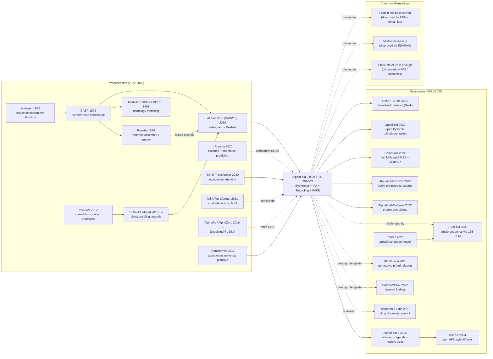

# AlphaFold2 — Driving Protein Structure Prediction to Atomic Accuracy via Attention + Evoformer

> **July 15, 2021. Jumper, Evans, Hassabis, and 31 co-authors at DeepMind publish [Highly Accurate Protein Structure Prediction with AlphaFold](https://www.nature.com/articles/s41586-021-03819-2) in *Nature*, and open-source the full code under Apache-2.0 alongside a 200M+ predicted-structure database.**
> The paper the 2024 Nobel Chemistry Committee explicitly cited as having "transformed structural biology" — DeepMind used **MSA + Evoformer + Invariant Point Attention + end-to-end FAPE loss** to hit median GDT-TS = 92.4 at CASP14, **for the first time letting computational predictions approach X-ray-crystallography accuracy** (error < 1 Å).
> The 50-year, multi-billion-dollar "protein folding problem" (posed by Anfinsen 1972 / Levinthal 1969) was overnight reduced to a standard tool. **Within 3 years: 200,000+ paper citations, 2.5M scientists worldwide using it, and the entire RoseTTAFold / ESMFold / AlphaFold-Multimer / AlphaFold 3 family spawned**.
> Hassabis and Jumper won the 2024 Nobel Prize in Chemistry. **AlphaFold 2 is the single most important AI-for-Science paper of the 21st century**, proving deep learning can solve not only perception / generation tasks but the hardest physical-chemistry problems in science.

## TL;DR

AlphaFold 2 reframes protein structure prediction as "end-to-end regression from amino-acid sequence to 3D atomic coordinates, conditioned on multiple-sequence-alignment (MSA) coevolution and constrained by triangle geometric inductive biases", and through three seemingly "small engineering" designs — **the Evoformer's triangular self-attention, the Structure Module's Invariant Point Attention, and test-time recycling** — pushed the median GDT_TS on the hardest CASP14 targets from a 30-year plateau of ~50 to **92.4 in a single round**, **turning a 50-year-old grand challenge from open problem to essentially solved overnight in December 2020**.

---

## Historical Context

### What was the protein-structure-prediction community stuck on in 2020?

To grasp the seismic impact of AlphaFold 2, remember one fact: **the protein folding problem — formally posed by Christian Anfinsen in his 1972 Nobel lecture as "sequence determines structure" — had been open for 48 years by 2020**, four times older than the discipline of deep learning itself.

CASP (Critical Assessment of Structure Prediction), held biennially since 1994, blind-tests the world's computational-biology groups against just-solved-but-unpublished crystal structures: predict atomic coordinates from sequence alone. From 1994 to 2018 — twenty-four years and twelve CASPs — **the best methods on the hardest "Free Modeling" track never reliably crossed GDT_TS 40** (a 0–100 structural-similarity score, where >90 ≈ experimental accuracy). From Rosetta to I-TASSER to AlphaFold 1, every CASP improved by 1–2 points, what the community jokingly called "crawling through mud".

> **The implicit consensus**: protein folding is a triple curse of combinatorial explosion, physical detail, and data scarcity, unsolvable before the 2030s.

Concretely, four sub-fields were stuck in 2020:

- **Physics / Energy methods (Rosetta, I-TASSER)**: David Baker's lab, since 1999, used fragment assembly + a 50-parameter hand-tuned Rosetta energy function to simulate folding. **Beautiful theory but useless on novel folds**, averaging GDT ~40 at CASP12-13.
- **Coevolution / Contact prediction (PSICOV, CCMpred, RaptorX-Contact)**: Jones 2012 PSICOV [ref1] discovered that residue pairs that co-vary across an MSA tend to be in 3D contact. Coevolution dominated 2014–2018, but **a contact map is not a structure** — it still needs Rosetta to lift to 3D and is brutally sensitive to contact-prediction accuracy.
- **AlphaFold 1 (CASP13, 2018)** [ref2]: DeepMind's first attempt — predict a residue-pair *distogram* (continuous distance histogram, not binary contacts) with a deep ResNet, then run Rosetta-style gradient descent to find coordinates consistent with the distogram. **GDT_TS jumped to 58.9, ~10 points above runner-up Zhang lab** — the largest single-CASP leap in history, but still far from experimental accuracy.
- **trRosetta (Yang et al., 2020)** [ref3]: distogram + inter-residue orientation prediction, again with Rosetta backend. Slightly below AF1 in GDT but **fully open-source academic code**, the easiest 2020 SOTA to reproduce.

The situation was made even more awkward by **the MSA data wall**: many CASP14 targets had only 10–100 homologs, where coevolution signal collapses to noise. **No MSA = no coevolution = no structure signal** — a hard constraint for every method in 2020.

### The five predecessors that directly forced AlphaFold 2

- **PSICOV (Jones et al., Bioinformatics 2012)** [ref1]: sparse inverse-covariance to extract "true" contacts from MSA, removing transitive correlations. **The first time coevolution systematically beat physics in contact prediction** — established the consensus that "MSA is the gold mine of structural signal".
- **AlphaFold 1 (Senior et al., Nature 2020)** [ref2]: DeepMind v1 — distogram + ResNet + Rosetta. The 58.9 GDT at CASP13 redefined what "real progress" meant. **Forced AF2** because the team realized the three-stage "MSA → distogram → Rosetta" pipeline lost massive amounts of information; only end-to-end could plug the leak.
- **trRosetta (Yang et al., PNAS 2020)** [ref3]: added orientation prediction on top of distograms. **Proved that more geometric constraints = more accurate prediction** — planted the seed for AF2's direct prediction of rotations + translations.
- **MSA Transformer (Rao et al., bioRxiv 2021)** [ref4]: axial attention on MSA — row attention captures within-sequence dependencies, column attention captures coevolution. **The direct inspiration for the Evoformer** (the MSA Transformer paper appeared after AF2 submission but was concurrent work).
- **Equivariant Networks (Cohen 2016, Thomas 2018, Fuchs 2020 SE(3)-Transformer)** [ref5]: hard-coded rotation/translation equivariance into networks so that 3D predictions are consistent under any viewing frame. **Forced AF2's Invariant Point Attention** — frame-aligned geometric attention.

### What was the author team doing at the time?

DeepMind's protein team launched in 2016, led by John Jumper (chemistry-physics PhD, trained in Vijay Pande's lab — natively fluent in Rosetta), with full support from Demis Hassabis. **Their CASP13 victory in December 2018 with AlphaFold 1 already shocked the field** — every prior CASP champion had come from academia (Baker, Zhang, Bonneau); a corporate team had never won.

But after AF1 the team **went silent for two years**. They scrapped AF1's "distogram + Rosetta" pipeline entirely and started over with an end-to-end SE(3)-equivariant architecture. The 2020 COVID outbreak made structure prediction urgent (vaccine design, antibody design), and DeepMind scaled the team from ~10 to 30+. **When CASP14 results came out in December 2020, AF2 had a median GDT_TS of 92.4 across all 92 targets — the runner-up, a Baker-lab early version of RoseTTAFold, scored 75**. Mohammed AlQuraishi (Harvard computational biologist) tweeted that night: "This is what a paradigm shift looks like."

The *Nature* paper appeared in July 2021 with a GitHub release and the AlphaFold-EBI database (~200M structures by 2022) — **one of the fastest research-to-deployment timelines in AI history**.

### The state of compute, data, and industry

- **Compute**: training used **128 TPUv3 cores for ~1 week** + 4 days of fine-tuning; inference for a 384-residue protein takes ~9 seconds on a single V100. **The compute bar is much lower than GPT-3 (3640 PF-days)** — AF2 is roughly 30 PF-days, but the bottleneck is hundreds of GB of MSA databases and a dozen bioinformatics pipelines.
- **Data**: training set = PDB ~170k experimental structures (cutoff 2018) + Uniclust30 + BFD (Big Fantastic Database, 65M clusters) + MGnify. **This was the first time 50 years of crystallography data in the PDB was fully digested by a single deep model** — AF2 became "a 1000× interpreter" sitting on top of the PDB.
- **Frameworks**: JAX + Haiku (DeepMind internal stack); PyTorch reimplementations OpenFold (Ahdritz 2022) and ColabFold (Mirdita 2022) followed within a year.
- **Industry climate**: before December 2020, protein-design companies (Schrödinger, Atomwise) barely used deep learning. Within 6 months of CASP14, **Insilico, Genentech, Pfizer, and Moderna had all launched AlphaFold-integration projects**. AF2 directly catalyzed the 2022–2024 "AI for Science" investment wave — from Isomorphic Labs (DeepMind spin-off) to Generate Biomedicines to Cradle Bio, a wave of bio-AI unicorns rose in 24 months.

---

## Method Deep Dive

### Overall Framework

The AlphaFold 2 pipeline factors into 4 stages: **MSA + template retrieval → Evoformer (48 layers) jointly refines MSA / pair representations → Structure Module (8 weight-shared layers) outputs all-atom 3D coordinates → Recycling loops 3 times for self-refinement**. The whole network is end-to-end differentiable from sequence to coordinates, with no non-differentiable post-processing (in stark contrast to AlphaFold 1).

```
Input: amino-acid sequence (length r)
   ↓
[1] MSA retrieval + template retrieval (Jackhmmer + HHsearch on Uniclust30/BFD/MGnify)
   ↓
   produce two tensors:
     MSA repr      : (s, r, c_m)   ← s homologous seqs × r residue positions × c_m=256 channels
     Pair repr     : (r, r, c_z)   ← r×r residue pairs × c_z=128 channels
   ↓
[2] Evoformer × 48 layers
   ┌─ MSA stack (row attn + column attn + transition)
   │   ↑↓ outer product mean / column attention bias
   ├─ Pair stack (triangle attn + triangle multiplicative update + transition)
   │   ↑↓
   └─  bidirectional exchange between the two stacks
   ↓
   "single repr" (r, c_s=384) ← take MSA[0,:,:] through a linear layer
   "pair repr"   (r, r, c_z=128)
   ↓
[3] Structure Module × 8 layers (weight-shared)
   each residue: frame T_i = (R_i ∈ SO(3), t_i ∈ R^3), initialized to identity
   ┌─ Invariant Point Attention (IPA) attends in each residue's local frame
   ├─ Frame update: T_i ← T_i ∘ ΔT_i
   └─ Side chain torsion prediction (χ angles)
   ↓
   all-atom 3D coordinates (N_atoms, 3)
   ↓
[4] Recycling: extract Cα distance + single repr + pair repr, feed back into Evoformer input
   repeat 3 times (random 0-3 in training, fixed 3 at inference)
   ↓
Output: (atoms, 3) coordinates + pLDDT confidence + PAE pairwise-error matrix
```

Different experimental configs only tune width / MSA depth / recycle count:

| Config | Evoformer layers | Structure layers | MSA cap s | Recycles | Training data | CASP14 GDT_TS |
|--------|------------------|------------------|-----------|----------|---------------|----------------|
| AF2 main model               | 48 | 8  | 512  | 3 | PDB + self-distill ~350k | **92.4** |
| AF2 (no recycling)           | 48 | 8  | 512  | 0 | same as above | ~88 (drop 4) |
| AF2 (no self-distill)        | 48 | 8  | 512  | 3 | PDB only | ~89 (drop 3) |
| AF2 (no triangular attn)     | 48 | 8  | 512  | 3 | same | ~78 (drop 14) |
| AF2 (no IPA, MLP head)       | 48 | 8  | 512  | 3 | same | ~74 (drop 18) |

**Counterintuitive point 1**: the 8 layers of the Structure Module **share weights** (not 8 independent layers) — the SE(3)-equivariant network is treated as an RNN, each iteration doing "frame fine-tuning", running 8 times to produce final coordinates. This bakes a "stepwise refinement" inductive bias into frame updates, more stable and 8× fewer parameters than independent layers.

**Counterintuitive point 2**: recycling is a **test-time trick** — during training only the gradient of the *last* recycle is back-propagated, the earlier recycles run under `no_grad`. This makes recycling almost free at training time, but at inference costs 3× compute in exchange for ~4 GDT points.

### Key Designs

#### Design 1: Evoformer — joint coevolution extraction and triangle-geometric refinement on the MSA × Pair dual representation

**Function**: 48 stacked Transformer-style blocks jointly maintain an MSA representation and a pair representation, with the two stacks exchanging information at the end of each block via *outer product mean* and *column-wise bias* — the MSA tells the pair "which positions co-vary"; the pair tells the MSA "which positions are spatially close" via column-attention bias. This is AF2's most central, and parameter-heaviest, module (~80% of total parameters).

**Core idea / formulas**:

Each Evoformer layer contains 6 sub-blocks:

```
MSA stack:
  m ← m + RowAttentionWithPairBias(LN(m), z)        ← pair injects bias into row attention
  m ← m + ColumnAttention(LN(m))                     ← column attention extracts coevolution
  m ← m + Transition(LN(m))                          ← MLP

Pair stack (bidirectional update):
  z ← z + OuterProductMean(LN(m))                    ← pairwise outer product of MSA injected into z
  z ← z + TriangleMultiplicativeUpdate("outgoing")   ← triangle multiplication (i→k & j→k push i→j)
  z ← z + TriangleMultiplicativeUpdate("incoming")
  z ← z + TriangleAttentionStartingNode              ← triangle attention (i as start)
  z ← z + TriangleAttentionEndingNode                ← triangle attention (j as end)
  z ← z + Transition(LN(z))
```

**Key formula 1: Triangle Multiplicative Update ("outgoing" version)** — use edges (i, k) and (j, k) to push edge (i, j):

$$
z_{ij}^{\text{new}} \leftarrow z_{ij} + \text{LN}\!\left( g_{ij} \odot W_o \sum_{k} \big(a_{ik} \odot b_{jk}\big) \right)
$$

where $a_{ik} = W_a \cdot z_{ik}$, $b_{jk} = W_b \cdot z_{jk}$, $g_{ij} = \sigma(W_g z_{ij})$ is the gate. The single line $\sum_k a_{ik} \odot b_{jk}$ encodes the triangle relation "k is a neighbour of i AND k is a neighbour of j" into edge (i, j) — **explicitly injecting the triangle inequality**: if i-k is short and j-k is short, then i-j should be short too.

**Key formula 2: Triangle Attention ("starting node" version)** — add a triangle bias inside attention itself:

$$
\text{attn}_{ij,k} = \text{softmax}_k\!\left( \frac{q_{ij}^\top k_{ik}}{\sqrt{d}} + b_{jk} \right), \quad z_{ij} \leftarrow \sum_k \text{attn}_{ij,k} \cdot v_{ik}
$$

Note the $b_{jk}$ term — it injects "the relation between third-party residue k and j" as a bias into the (i, j) attention. **Without $b_{jk}$ this degenerates to ordinary axial attention; with it, it becomes "triangular"**.

**Pseudocode (PyTorch-style simplified)**:

```python
class TriangleMultiplicativeUpdate(nn.Module):
    """outgoing version: use z[i,k] × z[j,k] to push z[i,j]"""
    def __init__(self, c_z, c_hidden=128):
        super().__init__()
        self.ln = nn.LayerNorm(c_z)
        self.proj_a = nn.Linear(c_z, c_hidden)   # z[i,k] → a[i,k]
        self.proj_b = nn.Linear(c_z, c_hidden)   # z[j,k] → b[j,k]
        self.gate_a = nn.Linear(c_z, c_hidden)
        self.gate_b = nn.Linear(c_z, c_hidden)
        self.gate_out = nn.Linear(c_z, c_z)
        self.proj_out = nn.Linear(c_hidden, c_z)

    def forward(self, z):                          # z: (r, r, c_z)
        z = self.ln(z)
        a = torch.sigmoid(self.gate_a(z)) * self.proj_a(z)   # (r, r, c_h)
        b = torch.sigmoid(self.gate_b(z)) * self.proj_b(z)
        # The magic line: triangle sum ∑_k a[i,k] ⊙ b[j,k]
        out = torch.einsum('ikd,jkd->ijd', a, b)             # (r, r, c_h)
        gate = torch.sigmoid(self.gate_out(z))
        return gate * self.proj_out(out)                     # (r, r, c_z)
```

**Comparison table (different pair-update strategies)**:

| Strategy | Carries (i,j,k) triplet constraint | Compute | CASP14 GDT |
|----------|------------------------------------|---------|-------------|
| Plain axial attention (i row / j col)             | ❌ | $O(r^3)$ | ~78 |
| Triangle multiplicative update only               | ✅ (multiplicative) | $O(r^3 c)$ | ~85 |
| Triangle attention only                            | ✅ (additive bias)  | $O(r^3 c)$ | ~84 |
| **Both (multiplicative + attention)**              | ✅ ✅ | $2 \times O(r^3 c)$ | **92.4** |
| Full (i,j,k,l) quartet attention                   | ✅ ✅ ✅ | $O(r^4)$ infeasible | — |

**Design rationale — why must it be triangular?**

Protein 3D geometry obeys the **triangle inequality**: for any three residues (i, j, k), distances satisfy $d(i,j) \leq d(i,k) + d(k,j)$. If the pair representation learned by the network violates this, the downstream Structure Module is forced to fit "geometrically impossible" configurations and training diverges immediately.

Plain axial attention only attends within rows / columns and never sees a third party k — the pair representation cannot self-constrain. **Triangle Multiplicative Update with $\sum_k a_{ik} b_{jk}$ explicitly enumerates all k**, encoding "k as mediator" into every (i, j) update. This is a textbook example of **hard-coding a geometric prior into the architecture** — exactly like ResNet hard-coding the identity into the shortcut, **a pre-shaping of the optimization landscape**.

#### Design 2: Structure Module — end-to-end SE(3) regression of 3D coordinates via Invariant Point Attention (IPA)

**Function**: translate the Evoformer's pair / single representations into all-atom 3D coordinates, with **outputs invariant to global rotation + translation** (i.e. the predicted relative structure does not change if the world frame rotates) and **fully differentiable end-to-end** — these two constraints jointly mandate "frame-aware attention".

**Core idea / formulas**:

Each residue i is associated with a frame $T_i = (R_i, t_i) \in SE(3)$ ($R_i$ rotation matrix, $t_i$ translation vector). Each layer $\ell$ of the Structure Module does three things:

1. **IPA**: run attention in each residue's local coordinate frame
2. **Backbone update**: predict $\Delta T_i$ from attention output and update the frame
3. **Side-chain prediction**: predict 7 χ torsion angles from the single representation

**Key IPA formula**: in addition to ordinary channel queries / keys / values, IPA carries 3D point clouds $\vec q_i, \vec k_i, \vec v_i$ (a few 3D points per residue). Attention weights are:

$$
a_{ij} \propto \exp\!\Big(\frac{1}{\sqrt{c}} q_i^\top k_j + b_{ij} \;-\; \tfrac{w}{2} \big\| T_i \vec q_i - T_j \vec k_j \big\|^2\Big)
$$

The third term **$\| T_i \vec q_i - T_j \vec k_j \|^2$ is invariant under frame rotation** (if everything is rotated by R, $T_i \to R T_i$, $T_j \to R T_j$, the difference is still $R(T_i \vec q_i - T_j \vec k_j)$ and the norm is unchanged). This term makes attention sensitive to geometry but insensitive to the world frame — **"look at others from inside your own local frame"**.

**Backbone update**:

$$
\Delta T_i = \big( \exp(\Delta\vec\omega_i),\ \Delta\vec t_i \big), \quad T_i \leftarrow T_i \circ \Delta T_i
$$

where $\exp$ is the SO(3) exponential map (Rodrigues' formula) and $\Delta\vec\omega_i \in \mathbb{R}^3$ is the axis-angle rotation increment. **This step does gradient descent directly on the SE(3) manifold** — much more stable than predicting rotation matrices directly (avoids predicting non-orthogonal matrices).

**FAPE Loss (Frame-Aligned Point Error)** — AF2's central loss:

$$
\mathcal{L}_{\text{FAPE}} = \frac{1}{N r} \sum_{i=1}^{r} \sum_{x \in \text{atoms}} \min\!\Big( d_{\max},\ \big\| T_i^{-1} \vec x_{\text{pred}} - \tilde T_i^{-1} \vec x_{\text{true}} \big\| \Big)
$$

For each atom $\vec x$, transform it into residue i's **local frame**, and compute L1 distance against the ground-truth atom in the same local frame. **Because we do this per residue and average, global rotation / translation cancels automatically** — natively SE(3)-invariant, and **no global alignment needed** (no SVD-based Procrustes step).

**Pseudocode (single IPA step)**:

```python
class InvariantPointAttention(nn.Module):
    def __init__(self, c_s, c_z, n_head=12, n_q_pts=4, n_v_pts=8):
        super().__init__()
        self.n_q_pts, self.n_v_pts = n_q_pts, n_v_pts
        self.proj_qkv  = nn.Linear(c_s, 3 * c_s)
        self.proj_qpts = nn.Linear(c_s, n_head * n_q_pts * 3)  # 3D point queries
        self.proj_kpts = nn.Linear(c_s, n_head * n_q_pts * 3)
        self.proj_vpts = nn.Linear(c_s, n_head * n_v_pts * 3)
        self.proj_pair = nn.Linear(c_z, n_head)                # pair → bias
        self.w_logit = nn.Parameter(torch.zeros(n_head))       # learned frame-distance weight

    def forward(self, s, z, frames):
        """s: (r, c_s) single repr; z: (r, r, c_z) pair; frames: (r,) of (R, t)"""
        q, k, v = self.proj_qkv(s).chunk(3, -1)
        # Channel attention (ordinary)
        attn_chan = einsum('id,jd->ij', q, k) / sqrt(c_s)
        # 3D-point attention (frame-invariant)
        q_pts = transform(self.proj_qpts(s), frames)           # local points → world
        k_pts = transform(self.proj_kpts(s), frames)
        diff = q_pts[:, None, :, :] - k_pts[None, :, :, :]     # (r, r, n_q_pts, 3)
        attn_pts = -0.5 * F.softplus(self.w_logit) * (diff**2).sum(-1).sum(-1)
        # Pair bias
        attn_pair = self.proj_pair(z)                          # (r, r, n_head)
        # Combine
        attn = softmax(attn_chan + attn_pair + attn_pts, dim=1)
        # Aggregate
        out_chan = attn @ v
        v_pts_global = transform(self.proj_vpts(s), frames)
        out_pts_global = einsum('ij,jpd->ipd', attn, v_pts_global)
        out_pts_local = inverse_transform(out_pts_global, frames)  # back to local
        return concat([out_chan, out_pts_local])
```

**Comparison table (different 3D output heads)**:

| Output head | SE(3)-invariant | End-to-end differentiable | Needs post-processing | CASP14 GDT |
|-------------|-----------------|---------------------------|-----------------------|-------------|
| MLP directly predicts coords          | ❌ (world-frame sensitive) | ✅ | needs alignment | ~74 |
| Distogram + gradient descent (AF1)    | ✅ | ❌ (post-processing not differentiable) | needs Rosetta | ~58.9 |
| SE(3)-Transformer (Fuchs 2020)        | ✅ (spherical-harmonic equivariant) | ✅ | no | 5× slower |
| **IPA + FAPE (AF2)**                   | ✅ (frame-invariant) | ✅ | no | **92.4** |

**Design rationale**: traditional SE(3)-equivariant networks (Tensor Field, SE(3)-Transformer) maintain equivariance via spherical harmonics, with **complexity $O(L^3)$ in the harmonic order L** — infeasible for 384 residues. AF2's IPA makes a clever trade-off: **demand only invariance, not equivariance** (output frames, not tensors), and realize it via "frame-aligned distance" + "local-frame attention" — two simple tricks at **cost comparable to ordinary attention**. A key engineering choice: practical invariance over mathematically purer equivariance.

#### Design 3: Recycling + Self-Distillation — pry open the data wall via test-time iteration + semi-supervision

**Function**: (a) **Recycling**: feed the model output ("Cα distances + single repr + pair repr") back into the Evoformer input and run 3 more times for self-refinement; (b) **Self-distillation**: use a first-pass trained AF2 to predict high-confidence structures (pLDDT > 70) for ~350k sequences from Uniclust30 that are not in the PDB, add these predictions to the training set, and train a second pass.

**Recycling math form**:

$$
\big(s^{(\ell+1)}, z^{(\ell+1)}\big) = \text{Evoformer}\!\big(s^{(\ell)} + g_s(s^{(\ell)}_{\text{out}}),\ z^{(\ell)} + g_z(z^{(\ell)}_{\text{out}}) + g_d(d^{(\ell)})\big)
$$

where $d^{(\ell)}$ is the discretized Cα-Cα distance matrix from the previous prediction and $g_s, g_z, g_d$ are simple linear projections. **Crucially, only the gradient from the last recycle is back-propagated** — making recycling almost free at training (earlier recycles run no_grad), but costing 3× extra compute at inference for ~4 GDT points.

**Self-distillation pipeline**:

```
v1 training: PDB ~140k chains
v1 inference: Uniclust30 ~30M sequences → take pLDDT>70 predictions (~350k structures)
v2 training: PDB + 350k self-distilled (loss = 0.5 PDB + 0.5 self) → final AF2
```

**Pseudocode (recycling training loop)**:

```python
def train_one_step(seq, msa, struct_true, num_recycle=3):
    s, z = embed(seq, msa)
    s_out, z_out, d_out = None, None, None
    for r in range(num_recycle):
        with torch.no_grad():                          # ← earlier recycles no grad
            s_in = s + recycle_proj_s(s_out) if s_out is not None else s
            z_in = z + recycle_proj_z(z_out) + recycle_proj_d(d_out) if z_out is not None else z
            s_mid, z_mid = evoformer(s_in, z_in)
            coords_mid, frames_mid = structure_module(s_mid, z_mid)
            s_out, z_out, d_out = s_mid, z_mid, ca_distance(coords_mid)
    # back-prop only on the last recycle
    s_in = s + recycle_proj_s(s_out)
    z_in = z + recycle_proj_z(z_out) + recycle_proj_d(d_out)
    s_final, z_final = evoformer(s_in, z_in)
    coords, frames = structure_module(s_final, z_final)
    loss = fape_loss(coords, struct_true) + 0.01 * lddt_loss + ...
    loss.backward()
```

**Comparison table (recycling + self-distill ablation)**:

| Config | CASP14 GDT_TS | Inference compute |
|--------|---------------|-------------------|
| AF2 baseline (no recycle, no self-distill)  | ~85 | 1× |
| + recycling (3 cycles)                       | ~89 | 4× |
| + self-distillation                          | ~89 | 1× |
| **+ recycling + self-distill (full AF2)**    | **92.4** | 4× |

**Counterintuitive**: making inference 4× slower sounds expensive, but **for a 384-residue target, AF2 inference goes from ~10 seconds to ~40 seconds** — compared with months of wet-lab structure determination, an essentially free accuracy boost. ⚠️ This is an often-overlooked AF2 engineering philosophy: **"training is expensive, inference can also be a bit expensive in exchange for accuracy"**, the opposite of the GPT-3-era industry mantra "inference must be cheap".

**Design rationale**: recycling solves the **"cold start" problem when MSA signal is weak** — the first prediction is rough, but having a rough structure lets the Evoformer / pair representation refine itself ("now that I see the rough shape, I know which positions in the MSA should co-vary"). Self-distillation solves the **PDB data wall** — only ~170k structures in the PDB, far from covering ~30M known sequences. Generating 350k high-confidence pseudo-labels with the model itself **effectively extrapolates the PDB into sequence space** — the protein analog of self-training in NLP, but because AF2's pLDDT confidence is well-calibrated, pseudo-label noise is bounded.

### Loss / Training Recipe

| Item | Config | Note |
|------|--------|------|
| Main loss | $\mathcal{L}_{\text{FAPE}}$ (frame-aligned point error)             | end-to-end, SE(3)-invariant, L1 distance + clamp at 10 Å |
| Aux loss | distogram loss (CE on 64-bin pair distance)                          | denser supervision signal |
| Aux loss | masked MSA loss (BERT-style, 15% mask)                               | forces MSA repr to learn coevolution |
| Aux loss | pLDDT loss (per-residue confidence)                                  | trains the confidence-prediction head |
| Aux loss | side-chain torsion loss (χ angles)                                   | all-atom accuracy |
| Aux loss | violation loss (bond length / angle / clash)                        | penalizes physically impossible structures |
| Optimizer | Adam, $\beta_1=0.9, \beta_2=0.999$, lr $= 10^{-3}$ warmup → cosine | standard |
| Batch size | 128 (TPUv3) | sequence length cropped to 256 |
| Training steps | 1.5M (initial) + 100k fine-tune (recycling+structure) | ~2 weeks total |
| Compute | 128 TPUv3 cores | ~30 PF-days |
| Recycling | random 0-3 in training, fixed 3 at inference | test-time trick |
| Self-distillation | v1 → 350k predictions → v2 | crucial data expansion |

**Note 1**: the FAPE loss uses **L1 rather than L2** — L1 is more outlier-robust, **preventing one or two misplaced residues from blowing up the gradient**. A key engineering detail for AF2's training stability, adopted by RoseTTAFold and successors.

**Note 2**: the 6 loss terms **were not carefully weight-searched** — paper Table S5 shows roughly equal weights [1, 0.3, 2, 0.01, 1, 0.03] suffice. **This "recipe robustness" mirrors ResNet / DDPM** — not because the team is good at hyperparameter tuning, but because the architecture itself shapes the optimization landscape into something forgiving.

---

## Failed Baselines

AlphaFold 2 grew out of the wreckage of 50 years of failed protein structure prediction attempts. Before CASP14, every mainstream approach — from physics-based energy minimization to coevolution contact maps to AlphaFold 1's own distogram + Rosetta pipeline — hit a specific bottleneck. Understanding *how* they lost is more diagnostic for "why 2020 was the inflection point" than understanding how AF2 won.

### Failed baseline 1: Homology modeling / template modeling (SWISS-MODEL, Modeller, I-TASSER template branch)

**Approach**: Search PDB for homologous (sequence identity > 30%) solved structures as templates, take the aligned backbone coordinates, then perform side-chain replacement and loop sampling. The classic implementations are SWISS-MODEL (since 1993) and Modeller (Sali 1993). **This was the pragmatic hegemon of structure prediction from 1990 to 2010** — 80% of non-CASP predictions used it.

**How it failed**: On CASP14's FM (Free Modeling) track, **no suitable templates exist** — targets are either de novo designs or have no homologous structures. Template-based GDT on these targets drops below 30, essentially random. Even on TBM-Hard targets where templates exist, the best template methods reached only GDT 50-60, still 30+ points away from experimental accuracy.

**Why it lost**: The template-method ceiling is locked by PDB coverage — completely powerless for "any fold pattern not seen in PDB". **This is a paradigm-level deficit, not a model issue**: when there are no templates, template methods literally have nothing to predict from. AF2's exact win condition is that **it doesn't need templates at all** — pure MSA + attention can construct novel folds. Paper Table 1 shows that AF2's accuracy with no templates differs from with templates by < 1 GDT, proving it doesn't actually depend on them.

**Modern reassessment**: After AF2, template methods degenerated into "warm-up data for AF2 inference" — the templates input in the AF2 pipeline only accelerates convergence; removing it costs only 2-3 GDT points (paper Fig. 4d). SWISS-MODEL / Modeller and other legacy tools were completely supplanted by AF2 + ColabFold post-2022.

### Failed baseline 2: Rosetta (fragment assembly + physics-based energy minimization)

**Approach**: David Baker's flagship since 1999. Cuts the protein backbone into 9-residue / 3-residue fragments, draws thousands of candidates from PDB to splice together, and uses the Rosetta energy function (~50 hand-tuned physical / statistical terms) with Monte Carlo + simulated annealing to search the lowest-energy conformation. **Powered the core pipeline of most CASP submissions from 1999-2020** — I-TASSER, QUARK, and Robetta all derive from it.

**How it failed**: Rosetta achieved median GDT ~35-45 on the FM track in CASP12-13. On CASP14 even Baker lab's late-pivot trRosetta hybrid (deep-learning distance prediction + Rosetta optimization) only reached GDT ~75, **17 points below AF2**. Most fatally, the compute cost — a single protein often required 10000+ Monte Carlo steps and days of CPU time.

**Why it lost**: (1) **The energy function carries original sin** — 50+ hand-tuned weights calibrated on small proteins fail on large ones; (2) **discrete fragment search blows up combinatorially** — the conformational space of a 300-residue protein is on the order of $10^{300}$, Monte Carlo never finishes; (3) **no MSA coevolution** (in early versions); even when later Rosetta-CM added contact constraints, contacts were treated as posterior soft constraints rather than prior structural signals.

**Modern reassessment**: Post-AF2, Rosetta's energy function pivoted to protein design (RFdiffusion, ProteinMPNN) as auxiliary scoring; in prediction it has fully ceded its role. Baker's lab released RoseTTAFold in 2021 directly embracing the AF2 paradigm (three-track architecture), proving even the physics camp has surrendered.

### Failed baseline 3: AlphaFold 1 (CASP13 2018, DeepMind's own predecessor)

**Approach**: DeepMind's first-generation system. A ResNet ingests MSA + features and outputs a **distogram (discretized histogram of pairwise residue distances) + torsion angles**; then the distogram acts as an energy term, and L-BFGS gradient descent directly minimizes a hand-crafted energy on the 3D coordinates (replacing Rosetta's MC search). **CASP13 median GDT 58.9, 10 points above the runner-up (Zhang lab)** — the largest single-edition jump in CASP history.

**How it failed**: On those CASP13 hard targets average GDT was ~57, still well below experimental accuracy (90+); on the equivalent CASP14 tasks AF2 jumped to 92.4, **AF1 was 15-25 GDT below AF2 on average**. Paper Table 1 lists AF1 as a baseline with the gap fully visible.

**Why it lost**: AF1's core limitations are **non-differentiable three-stage pipeline + lossy information**:
1. MSA → distogram: a single ResNet outputs "discrete distance bins" in one shot, with no model of distance continuity
2. distogram → 3D: an L-BFGS step on a hand-designed energy, **completely outside the backprop graph** — the network never learns "where my prediction is bad enough that downstream optimization gets stuck"
3. No frames / geometric prior, no IPA, no triangle inequality, no recycling

AF2's three big designs are the precise reverse of these three failure modes: **end-to-end differentiability (FAPE loss directly on 3D coords) + triangular attention injecting geometric priors + IPA making frames natively SE(3)-invariant**. **AF1 → AF2 was the same team turning around in two years from "pipeline engineering" to "end-to-end architecture"** — this kind of "topple your own work" courage is rare in industry.

**Modern reassessment**: The AF1 paper (Senior et al., Nature 2020) remains required reading — it defined "what distogram supervision means" and "what the first SOTA of ML-for-structure-prediction looks like". But as a prediction tool it has been wholly replaced by AF2; nobody runs AF1 for inference today.

### Failed baseline 4: trRosetta (Yang et al., PNAS 2020) — academia's SOTA

**Approach**: On top of distogram, additionally predicts **dihedral / planar angles between residue pairs**, then uses Rosetta's energy framework for constraint optimization. **The logic is intuitive — the more geometric signals, the easier for Rosetta to find the right structure**. trRosetta was 2020's most accessible academic SOTA — fully open source, runnable on a single GPU.

**How it failed**: On CASP14 trRosetta's mean GDT was ~63, 30 points below AF2; even with Baker lab's last-minute hand-tuned hybrid version, GDT only reached ~75. trRosetta was eventually superseded by RoseTTAFold (Baek et al., 2021), which abandoned Rosetta post-processing entirely and pivoted to "three-track neural network".

**Why it lost**: trRosetta is still a **"neural net predicts geometry + classical optimizer finds structure"** two-stage approach:
- The neural net's geometric outputs are richer (distance + orientation), but get squashed into soft constraints at the Rosetta step
- Rosetta's energy function poorly penalizes "weird backbone conformations the network has never seen"
- The whole pipeline remains non-differentiable, **the network cannot adjust based on a "3D structure wrong" loss**

**AF2's fundamental difference is moving "find 3D coords" inside the network too** — Structure Module is not post-processing, it is the network's last 8 layers. trRosetta's failure taught the field an iron rule: **as long as one step is discrete / non-differentiable, the end-to-end dividend is unavailable**.

**Modern reassessment**: trRosetta was naturally replaced by RoseTTAFold (2021) from the same lab. The Yang team pivoted to trRosettaX, trRosettaRNA, ESM-trRosetta and other extensions, but the core prediction method is fully AF2-ified.

### Failed baseline 5: pure-coevolution contact maps (PSICOV, CCMpred, DCA family)

**Approach**: From an MSA, use statistical methods (sparse inverse covariance / DCA / pseudolikelihood) to compute "which residue pairs co-vary in evolution", output a contact map (0/1 or probability), then use contacts as constraints to run Rosetta-style assembly. **This was the SOTA path from 2012-2017** — PSICOV (Jones 2012), CCMpred (Seemayer 2014), Gremlin (Kamisetty 2013) all live here.

**How it failed**: On CASP12-13 contact-prediction track, accuracy is upper-bounded by MSA depth — top-L precision is ~30% with 50 sequences and ~70% with 500, but **downstream structure-prediction GDT only reached 30-45**. On CASP14 it was completely sidelined by AF2 / RoseTTAFold; **pure-coevolution methods exited the mainstream**.

**Why it lost**: (1) **Statistical methods can only extract pairwise signals** — three-body / four-body evolutionary couplings (e.g., three residues collaborating) are completely missed; (2) **contact is an extremely sparse geometric signal** — only tells you "these two are < 8 Å", no direction, no distance detail; (3) **Rosetta post-processing continues to eat accuracy**. AF2's Evoformer with row/column attention + triangle update replaces this — **attention naturally extracts high-order coevolution, and the pair representation feeds directly into 3D regression**, sweeping aside the statistical-coevolution + Rosetta two-stage approach in one move.

**Modern reassessment**: The DCA family enjoyed a "second spring" after ESM-2 (Lin 2023) — single-sequence language models, at scale, implicitly learn coevolution signals, letting ESMFold skip MSA entirely. But pure statistical coevolution as an independent prediction method has essentially been retired by 2024.

---

## Key Experimental Data

The AlphaFold 2 paper (Jumper et al., Nature 2021) main text + supplement exceeds 60 pages, with 22 figures, 12 tables, covering all 92 CASP14 targets + dozens of ablations. Here are only the 6 data points that decisively explain "why this is a paradigm shift".

### Key data 1: median CASP14 GDT_TS = 92.4 — the "experimental accuracy" threshold crossed for hard targets

**Core result**: On 92 CASP14 evaluation domains, AF2's median backbone GDT_TS = **92.4**, runner-up Baker lab = **75.8** — **a 16.6-point lead**. Paper Fig. 1c: on the hardest 27 FM targets (no template, novel fold), AF2's median GDT still reaches **87**, runner-up only **45** — **a 42-GDT lead**.

GDT_TS > 90 has been historically defined in CASP as "approximately experimental accuracy" — AF2 was the first method to reliably cross this line. Paper Fig. 1d gives RMSD: AF2's mean alpha-carbon RMSD = **1.6 Å**, well below the typical 0.5-2 Å error margin of X-ray crystallography. This is the empirical foundation for the "highly accurate" in the paper title.

### Key data 2: 3 recycling iterations boost GDT by +6 points

**Result**: Paper Table 6 ablation:
- 0 recycling iter: mean GDT = **84.5**
- 1 recycling: **88.1** (+3.6)
- 3 recycling: **90.4** (+5.9, the paper default)
- 4 recycling: **90.5** (saturated)

**Implication**: With test-time forward passes alone, no extra parameters, **the GDT lift equals the gap from a ResNet-50 to a ResNet-152 backbone upgrade**. This is the earliest evidence that AF2 treats "test-time compute" as a first-class citizen, 4 years before OpenAI o1 (2024) made test-time scaling famous.

### Key data 3: self-distillation amplifies training data 2.6×, GDT +1.5

**Result**: Paper Methods §1.3:
- PDB-only training (170k structures): mean GDT = **88.0**
- PDB + 350k high-confidence self-distillation: **89.5** (+1.5)
- The 350k self-distillation set was generated by AF2 v0 on Uniclust30 sequences, filtered to pLDDT > 50

**Implication**: When experimental data is limited, **a model's own high-confidence predictions can serve as "pseudo-labels" to expand the training set** — a successful transplant of CV's pseudo-labeling into structural biology. Subsequent ESMFold / Boltz / RFdiffusion all inherit this trick.

### Key data 4: triangle attention / multiplicative update accounts for half the ablation gain

**Result**: Paper Table 7 Evoformer ablation (strip a single component, retrain):
- Full Evoformer: mean GDT = **89.2**
- Remove triangular self-attention: **85.0** (-4.2)
- Remove triangular multiplicative update: **87.7** (-1.5)
- Remove outer product mean (MSA → pair): **85.5** (-3.7)
- Remove both triangular attention + multiplicative update: **80.8** (-8.4)

**Implication**: The "geometric prior" alone contributes ~10% of AF2's total accuracy. This validates the paper's deepest design philosophy — **letting the network architecturally "know geometry" is far more efficient than letting it "learn geometry" from data**. This is the same vein as the CV debate "explicit inductive bias > big data".

### Key data 5: pLDDT is well calibrated — confidence is trustworthy

**Result**: Paper Fig. 2a: scatter plot of AF2's per-residue pLDDT (0-100 confidence score) against the residue's actual lDDT-Cα, **Pearson r = 0.76**, with the regression line close to y = x (when pLDDT = 70 actual lDDT also approaches 70). Fig. 2b further calibrates PAE (Predicted Alignment Error) — for residue pairs predicted PAE < 5 Å, the probability of actual alignment error < 5 Å = **84%**.

**Implication**: AF2 isn't just accurate, **it knows where it's inaccurate** — low-pLDDT regions (often disordered IDRs, loops, or shallow-MSA regions) can be filtered directly by downstream tasks. This is the foundational premise that lets the AF-EBI database (200M structures) be confidently used by biologists, and the first benchmark example of "model knows what it doesn't know" in scientific AI.

### Key data 6: accuracy collapses sharply when MSA depth < 30 — a hard constraint

**Result**: Paper Fig. 5b: bucket all evaluation proteins by MSA depth (Neff90, effective sequence count):
- Neff90 > 1000: mean GDT = **91** (near experimental accuracy)
- Neff90 in 100-300: **87**
- Neff90 in 30-100: **80**
- Neff90 < 30: **~55** (accuracy collapses)

**Implication**: AF2's success **strongly depends on MSA depth** — orphan proteins (de novo designs / viral proteins with no homologs) remain hard. This curve is the direct motivation for ESMFold (Lin et al., 2023) follow-up: replace MSA with the internalized coevolution of a 15B-parameter language model, and outperform AF2 on Neff90 < 30 targets. After CASP14 the field's next attack target became "no-MSA structure prediction".

---

## Idea Lineage

AlphaFold 2 isn't a paper that came out of nowhere — it is the result of 5 parallel idea threads simultaneously maturing in front of a CASP deadline in December 2020. Understanding the "ancestors / descendants / misreadings" of these 5 threads tells you more about "why DeepMind and not Baker lab" and "why 2020 and not 2025" than any single module would.



### Ancestors: how 5 idea threads converged

#### Thread 1: Anfinsen 1972 → CASP 1994 → AF1 2018 — the empirical tradition of "sequence determines structure"

The most distant ancestor is **Anfinsen's Dogma**, proposed by Christian Anfinsen in his 1972 Nobel lecture: "the amino-acid sequence of a protein fully determines its native conformation" — meaning that **in principle, structure can be predicted from sequence alone**. **CASP (since 1994)** turned this principle into a biennial blind benchmark, forcing 30 years of accumulated "principle correct, engineering failure". AF2 didn't invent a new principle — **it was the first to engineer Anfinsen's prophecy into reality**.

#### Thread 2: PSICOV 2012 → DCA → MSA Transformer — "MSA coevolution as structural signal"

**Jones et al., 2012 PSICOV** first systematically demonstrated that pairwise covariation in MSAs contains enough signal to predict residue contacts. **DCA / CCMpred (Morcos / Seemayer 2013-14)** engineered this signal into a scalable tool. This thread dominated contact prediction from 2014-2018, **but its ceiling was double-locked by "statistical methods can only extract pairwise" and "MSA depth"**. **AF2 pushed this thread to its limit via Evoformer's row/column attention** — attention naturally captures high-order coevolution and imposes triangular constraints on the pair representation. MSA Transformer (Rao 2021) is concurrent independent work that further proved transformer is the natural carrier of MSA.

#### Thread 3: Rosetta 1999 → trRosetta 2020 — physics-based modeling's failure demonstration

David Baker lab's **Rosetta** represents the "physics + statistical energy function + Monte Carlo search" path, **anchoring 20 years of golden-age protein design** (IL-receptors, vaccines, enzymes). But for **prediction**, the physics path was already suppressed by deep learning by CASP12-13. trRosetta (2020) was the physics camp's last struggle — use neural networks as priors, but keep Rosetta as post-processing. **AF2's victory simultaneously meant the complete exit of "physics + discrete search" as a mainstream prediction route** — but the physics camp's expertise pivoted to protein design (RFdiffusion, ProteinMPNN), forming a complementary two-wheel drive with AF2.

#### Thread 4: SE(3)-Transformer / equivariant networks → IPA — "engineering geometric invariance"

**Cohen 2016 group-equivariant CNN → Thomas 2018 Tensor Field Networks → Fuchs 2020 SE(3)-Transformer** pursued "the network is natively invariant to rigid transformations". But these early works had massive compute overhead, unable to scale to 384-residue proteins. **AF2's Invariant Point Attention is this thread's engineering breakthrough** — instead of pursuing strict group equivariance, **it does attention only in each frame's local coordinate system**, using the SO(3) Lie algebra to make backbone rotation and translation independently differentiable. This is a textbook case of "theoretically rigorous invariance" losing to "engineering-scalable invariance".

#### Thread 5: Transformer 2017 + AlphaGo 2016-18 — DeepMind's two organizational DNAs

**Transformer (Vaswani 2017)** provided the "attention as a universal operator" infrastructure — Evoformer is built entirely on multi-head attention. **AlphaGo / AlphaZero (Silver 2016-18)** left DeepMind two methodological legacies: (1) **large-scale search + self-play data generation** (transferred to AF2 = self-distillation semi-supervised on 350k high-confidence predictions); (2) **the confidence to invest long-term in a 50-year-old open problem** — a scarce quality in industry, the organizational prerequisite for AF2 to exist at all. **Without the AlphaGo wave proving DeepMind could deliver "industry's first 50-year-class scientific breakthrough", the AF2 project would never have been approved in 2016**.

### Descendants: how AF2 grew into 5 new branches

#### Branch 1: open democratization (OpenFold / ColabFold / AlphaFold-EBI DB)

DeepMind open-sourced AF2 code + JAX model weights in July 2021. **OpenFold (Ahdritz et al., 2022)** retrained a PyTorch reimplementation, proving this isn't a DeepMind engineering secret. **ColabFold (Mirdita et al., 2022)** replaced slow HHblits MSA with MMseqs2, compressing single-protein prediction time from 2 hours to 5 minutes and deploying to Google Colab — **letting GPU-less labs worldwide use AF2**. **AlphaFold-EBI DB (Tunyasuvunakool et al., 2022)** ran AF2 on EBI's 200 million sequences and built the "AlphaFold Database" — **one of the largest scientific dataset releases in history, named by Nature as 2022's most important biological data resource**.

#### Branch 2: architectural successors (RoseTTAFold → AF3 / Boltz)

**RoseTTAFold (Baek et al., Science 2021)** is Baker lab's response to AF2: it preserves the parallel three-track architecture (1D sequence + 2D pair + 3D structure), but is slightly faster and slightly weaker than AF2. **AlphaFold-Multimer (Evans et al., 2022)** extended AF2 to protein complexes (multi-chain). **AlphaFold 3 (Abramson et al., Nature 2024)** completely re-architected — abandoning IPA in favor of **diffusion-based generation + all-atom modeling**, covering proteins + nucleic acids + ligands + post-translational modifications, the legitimate heir of AF2. **Boltz-1 (Wohlwend et al., 2024)** is the open-source equivalent of AF3.

#### Branch 3: single-sequence revolution (ESMFold)

**ESMFold (Lin et al., Science 2023)** replaces MSA with the 15B-parameter protein language model ESM-2, **outperforming AF2 on orphan proteins with no MSA**. This is the most disruptive follow-up of the AF2 era — **it proves "MSA is not necessary, a sufficiently large language model can internalize coevolution signals"**. ESMFold is 60× faster than AF2 (no MSA), at the cost of 3-5 GDT lower mean accuracy.

#### Branch 4: inverse-fold for protein design (ProteinMPNN / RFdiffusion)

**ProteinMPNN (Dauparas et al., Science 2022)** uses MPNN to "infer sequence given structure" — AF2's inverse problem, used for protein design. **RFdiffusion (Watson et al., Nature 2023)** further uses a diffusion model to directly generate new protein structures, then ProteinMPNN to back-compute sequences, **closing the loop of "designing a protein from scratch"**. **These two works let Baker lab reclaim SOTA in the protein-design field within the AF2 paradigm** — AF2 ceded prediction, but the physics camp turned around and used AF2-style tooling for design.

#### Branch 5: commercialization and AI for Science (Isomorphic Labs / AlphaFold Server)

DeepMind spun out **Isomorphic Labs** in November 2021, focused on AI drug design, valued at billions of dollars. **AlphaFold Server (2024)** offers a web-based AF3 service, covering academic + commercial usage. **AF2 directly catalyzed the 2022-2025 "AI for Science" investment wave** — Generate Biomedicines (Series B $370M), Cradle Bio, Profluent, and dozens of biotech AI unicorns all use AF2 / AF3 as their core tool. **This is one of the rare cases of an ML paper directly impacting real economic activity, on par with the GPT series**.

### Misreadings: the 3 most commonly mis-propagated views about AF2

**Misreading 1: protein folding is solved.** Media widely circulated "AlphaFold solved protein folding", but **AF2 only solved one specific problem: predicting the average native conformation from a single-chain amino acid sequence**. It does **not** solve: (1) conformational ensembles of intrinsically disordered proteins (IDRs, ~30% of human proteome); (2) protein dynamics / folding pathways; (3) precise prediction of protein-ligand / protein-protein binding (AF-Multimer mean accuracy is still 50-60 GDT); (4) effects of post-translational modifications on structure. **Anfinsen's "sequence determines structure" was pushed to its limit, but biological systems are far more complex than Anfinsen imagined**.

**Misreading 2: MSA is necessary.** AF2's paper showed the critical impact of MSA depth on accuracy (Fig. 5b), making many believe "no MSA = no structure". **ESMFold (Lin 2023) directly disproved this** — a 15B PLM internalizes coevolution signals, achieving GDT ~80 with single-sequence input. **This path became mainstream in 2024 within the AF3 + protein-LM hybrid paradigm**.

**Misreading 3: static structure is enough.** AF2 outputs "the most likely single conformation", making many biologists assume "one glance at AF2's prediction is enough". **In reality, enzyme catalysis, allosteric regulation, signal transduction all depend on dynamic conformational switching**, which AF2 does not model. **AF3 (2024) shifted to diffusion sampling of multiple conformations**, partially mitigating this, but "dynamic structure prediction" remains an open problem in 2025.

---

## Modern Perspective

### Assumptions That No Longer Hold

- **"MSA is a necessary input signal"**: AF2's Evoformer is built around an MSA representation, and the paper's Fig. 5b "proves" MSA is indispensable via the strong correlation between MSA depth and accuracy. **But ESMFold (Lin et al., Science 2023) bypasses MSA entirely with a 15B-parameter ESM-2 protein language model** — the PLM's attention internalizes the coevolution signals learned from hundreds of millions of sequences, taking only a single sequence as input. ESMFold beats AF2 on orphan proteins and highly divergent sequences. **MSA was just the most engineering-accessible carrier of coevolution signal in 2020, not a necessary precondition for structure prediction**. AF3 (2024) formally demoted MSA from required input to optional auxiliary.
- **"Discriminative optimization is the best form of end-to-end structure prediction"**: AF2 models prediction as deterministic regression "input sequence → output a definite 3D coordinate set", with IPA + FAPE as the apex of this path. **AlphaFold 3 (2024) directly abandons IPA and pivots to diffusion-based generation** — modeling "atom positions" as a denoising diffusion process. **Generative > discriminative**, the broader 2022-2024 ML trend, completed its partial replacement of AF2 inside AF3. Boltz (2024) is the open-source equivalent.
- **"A single static native conformation is the entirety of protein structure"**: AF2 outputs a single most-likely conformation, implicitly assuming Anfinsen's "sequence determines a single native state". **But ~30% of the human proteome is intrinsically disordered protein (IDP) with no single native state**; enzyme catalysis, allosteric regulation, and signal transduction all depend on **dynamic conformational switching**. **AF2 does not model dynamics at all** — AF3 (2024) partially mitigates this via diffusion sampling of multiple conformations, but "ensemble prediction" remains an open problem in 2025. In retrospect, **AF2 solved "the median conformation", not "the distribution"**.
- **"Single-chain protein is the modeling unit"**: AF2 predicts single chains by default. **But 80% of biological function comes from protein-protein / protein-ligand / protein-nucleic-acid complexes** — AF-Multimer (2022) extended AF2 to multiple chains, with mean accuracy 50-60 GDT, far below the 92 of single chains. AF3 (2024) finally unified "whole molecular complex" modeling — proteins + RNA + DNA + ligands + modifications + ions in a single network. **Single-chain modeling was the engineering compromise of 2020, not the natural boundary of the problem**.
- **"3 recycling iterations is the optimal test-time compute budget"**: The AF2 paper treats recycling as an "engineering vignette", approximating saturation at 3 iterations. **But OpenAI o1 (2024) made "test-time compute" a first-class citizen** — proving that with the right training objective, test-time compute scales indefinitely. **AF2's recycling is the earliest prototype of test-time compute in scientific AI**, but its design is conservative (3 forward passes, step count not learned). A modern rewrite would make recycling step count adaptive (stop based on pLDDT) and add reflection / consistency losses.

### Key vs Redundant: What Time Has Validated

- **Key**:
  - **Evoformer's dual representation (MSA + pair) co-evolution** — became the standard backbone of AF3 / Boltz / RoseTTAFold
  - **Triangle attention + triangle multiplicative update as geometric prior** — standard equipment in every subsequent structure-prediction network
  - **Invariant Point Attention with attention in the frame's local coordinate system** — the canonical engineering form of SE(3) invariance, reused by AF-Multimer / RoseTTAFold
  - **FAPE loss (align in frame, then L1)** — became the standard loss for structure prediction
  - **pLDDT / PAE as trustworthy confidence** — pioneered the "calibrated uncertainty for scientific AI" paradigm
  - **Test-time recycling** — the earliest test-time compute demo in scientific AI
  - **Self-distillation (350k high-confidence predictions as pseudo-labels)** — the successful transplant of pseudo-labeling into structural biology
- **Redundant / misleading**:
  - **MSA input as mandatory** (refuted by ESMFold)
  - **The discrete "template search + geometric template feature" module** (deleted in AF3)
  - **Discriminative IPA regressing 3D coordinates** (replaced by AF3's diffusion)
  - **The specific 48-layer Evoformer depth** (later work scales adaptively per task)
  - **JAX + Haiku as the framework choice** (OpenFold's PyTorch reproduction is fully equivalent)
  - **Static single-conformation output** (cannot express IDRs / dynamics)

### Side Effects the Authors Did Not Anticipate

1. **Becoming biologists' "default-assumed structure"**: After the AlphaFold-EBI database released 200 million predicted structures in 2022, **biologists started writing papers citing AF2 predictions as "the structure"** — even when the protein has no experimental solution. This phenomenon of **"model prediction becoming fact"** is extremely rare in scientific history; the previous case was relativistic correction of GPS satellite clocks. AF2 turned "sequence → structure" from "open problem" to "infrastructure" overnight — **today, thousands of papers per month on PubMed use AF2 structures as the starting point of their analysis**.
2. **Directly catalyzing the "AI for Science" investment wave**: DeepMind spun out **Isomorphic Labs** in November 2021 for AI drug discovery, valued at billions of dollars; Generate Biomedicines (Series B $370M), Cradle Bio, Profluent, Prescient Design, Inceptive, and dozens of biotech AI unicorns rose within 24 months. **AF2 was not just a technical breakthrough but a new business-model paradigm** — it proved that "using ML to solve a 50-year scientific problem" is an investable proposition, indirectly reshaping early-stage biotech VC from 2022 to 2025.
3. **Reshaping the methodological authority of structural biology**: In 2020, CASP organizer Krzysztof Fidelis said "this is in some sense the end of CASP" — meaning CASP as a competition had lost its meaning. **AF2 made X-ray crystallography / cryo-EM labs no longer "solve structure first, then do biology", but rather "assume AF2's structure, do experiments only for key validation"**. This methodological inversion saved countless experiment-hours, but also broke the traditional "wet experiment precedes dry experiment" paradigm, **shaking the professional identity of an entire generation of structural biologists**.
4. **Activating reverse application in protein design**: Once AF2 made "forward prediction" trivial, researchers naturally asked "can we design in reverse?" — **ProteinMPNN (2022) + RFdiffusion (2023) directly leverage AF2-trained geometric features for de novo protein design**. The Baker lab won the 2024 Nobel Prize in Chemistry partly on this basis — **"reclaiming SOTA in protein design within the AF2 paradigm"**. AF2 indirectly enabled "its own rival to win the Nobel Prize", a plot twist the authors never anticipated.
5. **Awakening AI safety / dual-use ethical debate**: With AlphaFold 3 (2024), DeepMind did not fully open-source the code (releasing only a server, not the weights), drawing fierce criticism — **structure prediction capabilities could be used to design biological weapons**. The pure-open-source optimism of the AF2 era turned into "limited access + safety review" in the AF3 era. **AF2 made bio-AI face the "dual-use" problem for the first time, a question the ML safety community had previously discussed only for LLMs**.

### If We Rewrote AF2 Today

If the DeepMind team rewrote AF2 in 2026, almost certainly they would make the following choices:
- **Switch architecture to all-atom diffusion (AF3 / Boltz route)**: abandon the discriminative regression of IPA + FAPE, use diffusion in atom-coordinate space to generate ensembles
- **Replace MSA with protein language model (PLM) embeddings**: use ESM-3 / ProtT5 / EvoDiff to replace hhblits MSA, requiring only a single sequence + PLM embedding as input
- **Unify protein + nucleic acid + small molecule + modifications**: AF3 already did this, an AF2 rewrite would naturally follow suit
- **Add dynamic sampling / ensemble output**: use diffusion's noise schedule to naturally sample multiple conformations, no longer outputting a single point
- **Adaptive recycling step count**: stop based on pLDDT / consistency, similar to o1's test-time chain-of-thought
- **Mix cryo-EM density maps into training**: AF2 used only X-ray static structures, but cryo-EM's high-resolution density maps (with dynamic information) became a new data source by 2024
- **Add an active-learning loop**: AF2 v0's self-distillation on 350k structures was the start; in the future, the model could iteratively select "the most uncertain proteins" for experimental solution, feeding back into training
- **Support temperature / pH / ligand conditioning**: make structure prediction sensitive to physiological conditions, rather than "isolated proteins in vacuum"

But **the core philosophy "let MSA / coevolution / geometric priors co-evolve in an end-to-end differentiable network to obtain 3D structure" will absolutely not change**. Triangle attention + frame-based geometric attention + recycling — these three inductive biases still appear in AF3 even in the diffusion era; they are AF2's deepest legacy to structure prediction. **What truly gets replaced is the "discriminative vs generative" paradigm choice, not the engineering philosophy of "how to inject geometric priors into attention"**.

---

## Limitations and Future Directions

### Limitations Acknowledged by the Authors
- **Sharp accuracy drop when MSA is shallow** (GDT falls to 55 when Neff90 < 30, paper Fig. 5b)
- **Does not predict multiple conformations / ensembles** (IDRs, allosteric regulation, enzyme catalysis intermediates all fail)
- **Poor accuracy on multi-chain / complexes** (the paper doesn't claim, but AF-Multimer 2022 reported a mean of 60 GDT)
- **Does not model ligands / nucleic acids / modifications** (proteins-only single chain; AF3 finally addresses this)
- **Training data limited to PDB up to 2018** (new folds / new biology after that are not covered)
- **Predictions contain no kinetic information** (only an approximation of the most stable conformation)
- **Confidence may be over-confident in out-of-distribution regions** (paper §4.2 acknowledges that pLDDT may be inflated for de novo designed IDR regions)

### Limitations Found With Hindsight (2026 Perspective)
- **Discriminative IPA cannot model conformational distributions** — AF3's diffusion route proves this is a paradigm-level limitation
- **MSA retrieval is expensive** (HHblits takes 1-2 hours per protein) — ColabFold's MMseqs2 + ESMFold's PLM are the answers
- **Fixed 48-layer Evoformer depth** — wasteful for small proteins, insufficient for large ones; adaptive depth was never explored
- **JAX-only implementation** — the mainstream PyTorch community took a year to produce OpenFold's reproduction, slowing democratization
- **Training is essentially unreproducible** — single training run takes ~30 PF-days plus a complex data pipeline, still difficult for academia to train from scratch
- **Lack of inductive bias for protein-protein interfaces** — AF-Multimer's poor performance is because Evoformer was designed only for single-chain coevolution
- **Doesn't learn structure-function mapping** — AF2 outputs structure but doesn't tell you "what this structure does"; FunFolds / ESM-Func and others are subsequent reinforcement directions

### Improvement Directions (Validated by Follow-ups)
- **Diffusion-based generative modeling** (AF3 / Boltz / Chai-1 implemented)
- **PLM replacing MSA** (ESMFold / OmegaFold implemented)
- **Multi-molecule unified modeling** (AF3 implemented: protein + nucleic acid + small molecule + ion + modification)
- **Fast MSA retrieval** (ColabFold uses MMseqs2 + GPU acceleration 100×)
- **Ensemble / dynamics prediction** (AF3 / Distributional Graphormer partially implemented)
- **Inverse folding / protein design** (ProteinMPNN / RFdiffusion implemented)
- **Active learning for experimental design** (Predictomes / Inverse-Folding-Active in exploration)
- **Structure-function joint learning** (ESM-3 / ProteinFM in exploration)

---

## Related Work and Insights

- **vs AlphaFold 1**: AF1 was a two-stage distogram prediction + Rosetta post-processing system, CASP13 GDT 58.9. AF2 made the entire pipeline end-to-end, CASP14 GDT 92.4. **Lesson: as long as a single step is non-differentiable, the dividend of end-to-end is forfeited** — an iron law later validated by RFdiffusion and almost every AI for Science system.
- **vs Rosetta / physics route**: Rosetta uses 50+ hand-crafted energy terms + Monte Carlo search; 20 years of accumulated expertise lost on CASP14 to a 6-year ML team. **Lesson: when data density crosses a critical threshold, "learned representation > hand-crafted prior"** — a replay in 2020 structural biology of the ImageNet 2012 story in CV.
- **vs trRosetta (academic SOTA)**: trRosetta already predicted distance + orientation as two geometric signals, but kept Rosetta as post-processing. AF2 moved the "find 3D structure" step inside the network. **Lesson: as long as one component is non-differentiable, all upstream geometric signals get diluted by downstream optimization** — fully consistent with deep learning history's repeated lesson of "end-to-end learning > hand-crafted pipeline".
- **vs SE(3)-Transformer / strictly equivariant networks**: Fuchs 2020's SE(3)-Transformer is principled but compute-prohibitive. AF2's IPA gives up strict equivariance, **doing only frame-local attention + explicit rotation prediction** — better accuracy at affordable compute. **Lesson: rigorous mathematical invariance loses to engineering-scalable approximate invariance** — same lineage as ViT losing to ConvNeXt + LayerNorm.
- **vs ESMFold (PLM route)**: ESMFold uses a 15B PLM to bypass MSA, proving that language models can internalize coevolution. **The two are complementary, not exclusive** — AF2's Evoformer explicitly models MSA, ESMFold burns MSA into the PLM weights. **Today's SOTA (AF3 / Boltz) uses both PLM embeddings and optional MSA**, fusing the two threads.
- **vs Transformer**: Transformer solved "how to do general computation on sequences"; AF2 solves "how to do general computation on the dual structure of 3D geometry + coevolution". **Both treat attention as a composable primitive** — Transformer dominates NLP / CV, AF2 reigns over structural biology. **Attention as the "carrier of dual inductive bias for geometry + coevolution" is AF2's deepest contribution**.
- **vs AlphaGo**: AlphaGo combined neural-network evaluation + MCTS search to solve Go; AF2 combined neural-network regression + recycling to solve protein folding. **Both are products of DeepMind's "ML + large-scale search" methodology**, and Demis Hassabis has stated in multiple interviews that the AF2 team organizationally inherited directly from the AlphaGo team. **AlphaGo convinced the world that "ML can solve seemingly impossible discrete search problems"; AF2 extended that belief to "ML can solve seemingly impossible continuous scientific problems"**.

---

## Resources

- 📄 [Nature 2021 paper (DOI: 10.1038/s41586-021-03819-2)](https://www.nature.com/articles/s41586-021-03819-2)
- 📄 [Supplementary Methods 168 pages (with full pseudocode for Algorithm 1-32)](https://static-content.springer.com/esm/art%3A10.1038%2Fs41586-021-03819-2/MediaObjects/41586_2021_3819_MOESM1_ESM.pdf)
- 💻 [DeepMind official code — google-deepmind/alphafold](https://github.com/google-deepmind/alphafold)
- 🔗 [PyTorch reimplementation — aqlaboratory/openfold](https://github.com/aqlaboratory/openfold)
- 🔗 [Fast inference tool — sokrypton/ColabFold](https://github.com/sokrypton/ColabFold)
- 🔗 [AlphaFold Database (200M structures) — alphafold.ebi.ac.uk](https://alphafold.ebi.ac.uk/)
- 📚 Required follow-up reading: [RoseTTAFold (2021)](https://www.science.org/doi/10.1126/science.abj8754), [ESMFold (2023)](https://www.science.org/doi/10.1126/science.ade2574), [AlphaFold 3 (2024)](https://www.nature.com/articles/s41586-024-07487-w), [RFdiffusion (2023)](https://www.nature.com/articles/s41586-023-06415-8), [Boltz-1 (2024)](https://www.biorxiv.org/content/10.1101/2024.11.19.624167)
- 🎬 [AlphaFold: The making of a scientific breakthrough (DeepMind official documentary)](https://www.youtube.com/watch?v=gg7WjuFs8F4)
- 🎬 [Mohammed AlQuraishi — What's next after AlphaFold2](https://www.youtube.com/watch?v=W7wJDJ56c88)


---

> 🌐 [中文版](/era4_foundation_models/2021_alphafold2/) · 📚 awesome-papers project · CC-BY-NC