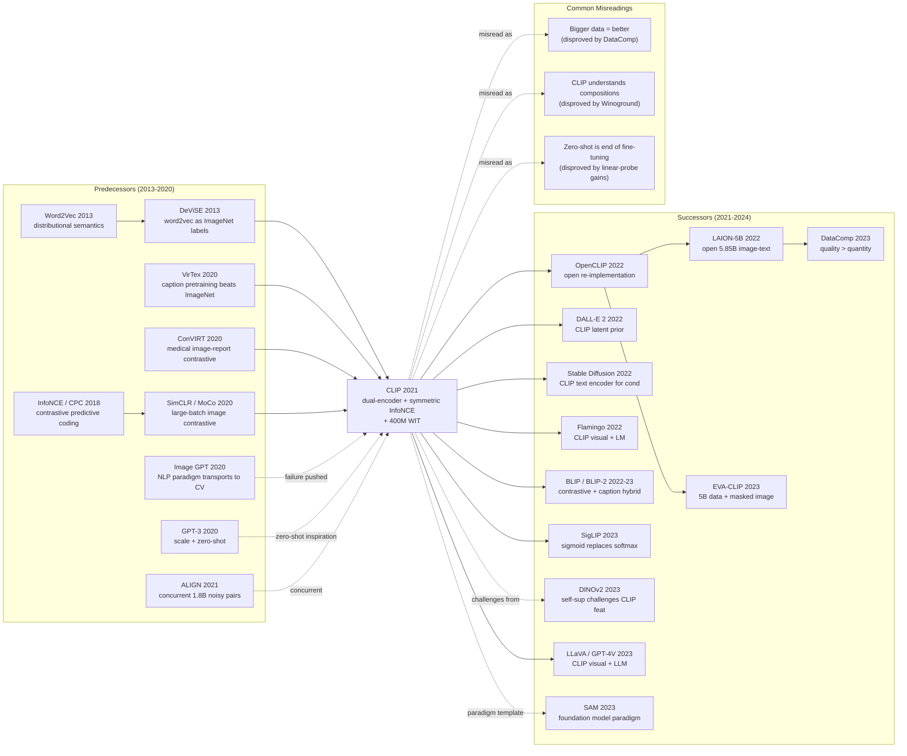

# CLIP — Teaching Vision Models to Understand Language via 400M Image-Text Pairs

> **January 5, 2021. Radford, Kim, Hallacy, Sutskever, and 8 co-authors at OpenAI upload [arXiv 2103.00020](https://arxiv.org/abs/2103.00020); ICML 2021 oral in July.**
> A paper that trained a dual-tower encoder (image + text) on **400M web-scraped image-text pairs with InfoNCE contrastive loss**, letting vision models do **zero-shot classification with arbitrary natural-language prompts** for the first time — no downstream fine-tuning needed.
> ImageNet zero-shot hit 76.2% top-1, **exactly matching fully-supervised ResNet-50 (76.1%)**; on 27 out-of-distribution datasets it **comprehensively outperformed supervised ImageNet-pretrained ResNet-101**, proving the bottleneck of vision models was never capacity but the inductive bias of "describe the world with 1000 fixed labels."
> Within 6 months it spawned Stable Diffusion (2022)'s text encoder, DALL·E 2 / Imagen's text understanding, and Flamingo (2022) / LLaVA / GPT-4V's vision side — **CLIP is the rivet welding the entire GenAI vision and language pipelines together**, cited 25k times to date.

## TL;DR

CLIP swaps the visual training objective from "classify 1000 ImageNet classes" to "learn to match images and captions over 400M web pairs." A minimalist dual-encoder + symmetric InfoNCE architecture, it is the first method to push **zero-shot ImageNet accuracy to a fully-supervised ResNet-50 level (76.2%)** while showing dramatically better out-of-distribution robustness across 30+ datasets than any ImageNet pre-trained model.

---

## Historical Context

### What was the visual-representation field stuck on in 2020?

To grasp CLIP's disruptive force you have to return to that "the ImageNet recipe has been running for 8 years, everybody knows it's broken, but nobody dares to swap it out" moment of 2019–2020.

Since AlexNet 2012, the standard CV recipe was **"supervised pre-training on ImageNet-1k → fine-tune on the downstream task."** Eight years in, this path showed three structural defects:

> **(1) closed-vocabulary tasks, (2) expensive labels, (3) brittle robustness — and yet everybody was still grinding 0.5 points on ImageNet leaderboards.**

Concretely:

- **Closed-vocabulary**: ImageNet compresses the visual world into 1000 mutually exclusive noun synsets. "A photo of a Pembroke Welsh corgi" and "a corgi running on grass" are equivalent in label space. The learned features **carry no semantic granularity** — any downstream task such as "find every person wearing a hat" requires re-annotating data.
- **Expensive labels**: ImageNet-1k's 1.28M images took ~5 years to annotate at an estimated multi-million-dollar cost; scaling to ImageNet-21k's 14M is the ceiling of any non-Google-internal effort. **Manual annotation is CV's hard capex constraint.**
- **Brittle robustness**: Starting in 2019 the ImageNet-V2 / -A / -R / -Sketch suites appeared, and **every ImageNet SOTA dropped 10–40 points on these natural distribution shifts**. The field began to accept "we have spent 8 years learning the statistics of the ImageNet validation set, not vision."
- **Idle compute**: By 2020 the open web carried tens of billions of paired image–text examples (alt-text, captions, product pages), but the visual community **completely ignored them** — everyone was still fine-tuning on ImageNet 1.28M.

By 2020 the NLP community had already executed the parallel paradigm shift: GPT-3 with 175B parameters and internet-scale text proved that **"self-supervision + scale + zero-shot"** is feasible. CV remained stuck on "small data + heavy labels + closed vocabulary." **CLIP's real value is not a new module — it is dragging NLP's paradigm into CV.**

### The 4 immediate predecessors that pushed CLIP out

- **DeViSE (Frome et al., NeurIPS 2013)**: CLIP's earliest philosophical ancestor. It used pre-trained word2vec vectors as ImageNet class embeddings and made the visual network regress to the corresponding word vector, **the first demonstration that "expanding the class vocabulary need not require retraining"** — any new class with a word vector becomes predictable. But word2vec was too weak and ImageNet's label set too narrow, so impact was limited. CLIP = DeViSE with a GPT-3-era engineering budget.
- **VirTex (Desai & Johnson, CVPR 2021)**: A UMich team released this in mid-2020 and **first showed that "captioning pre-training beats ImageNet supervision"** — using only COCO's 118k image–caption pairs they matched the downstream performance of ImageNet-1.28M supervision. But they used captioning (autoregressive caption generation), which is slow to train and gives no zero-shot capability. CLIP's contrastive design exists exactly to inherit VirTex's "language as supervision" while gaining SimCLR's training efficiency.
- **ConVIRT (Zhang et al., ML4H 2020)**: Stanford's "image–report contrastive learning" on medical images already used the dual-encoder + InfoNCE architecture nearly identical to CLIP. Scale was only 220k chest-X-ray–report pairs, but the CLIP paper §2.2 directly acknowledges "our method is highly similar to ConVIRT, only scale and domain differ." **CLIP is barely an architectural innovation — it wins on data and compute.**
- **MoCo & SimCLR (He / Chen et al., 2020)**: The Facebook & Google self-supervised contrastive milestones of the same year, proving that InfoNCE + large batch + augmentation can push unsupervised representations to near ImageNet-supervised quality. CLIP borrows their contrastive math (symmetric softmax + temperature) and replaces augmentation with image–text pairing.

### What was the author team doing?

First author Alec Radford is an OpenAI veteran and a primary author of GPT-2. The team's main thrust over the previous two years was **the GPT series (2018 GPT-1 / 2019 GPT-2 / 2020 GPT-3)** and **Image GPT (2020)**. Image GPT used a GPT-2 architecture to generate 32×32 pixels, proving "the NLP paradigm transports to CV," but generation quality was nowhere near BigGAN. **CLIP is the inverse product of Image GPT's failure** — OpenAI thought "if generation does not work, let us turn language into the supervision signal for recognition." Aditya Ramesh was concurrently building DALL-E (released January 2021); Ilya Sutskever was OpenAI co-founder and chief scientist. The whole project ran roughly 12 people × 1 year and was OpenAI's third large multimodal effort (after Image GPT and DALL-E).

Worth noting: lead author Alec Radford had hardly any CV-conference publications before this paper — **CLIP's first author is essentially an NLP researcher**, which is precisely the cross-paradigm key: he did not internalize the implicit constraint "CV must start from ImageNet."

### State of industry, compute, and data

- **GPUs**: NVIDIA V100 32GB. The largest ResNet-50x64 model used **592 V100s for 18 days**; ViT-L/14 used 256 V100s for 12 days. This was at the per-paper compute ceiling of the era (GPT-3 ≈ 3640 PetaFLOP-days, CLIP RN50x64 ≈ 4096 PetaFLOP-days).
- **Data**: OpenAI's in-house **WIT (WebImageText), 400M image–text pairs**, harvested via 500k queries from the public web (≤20k pairs per query, with rough class balancing). **The dataset was never released** — a frequent criticism, and the direct motivation for OpenCLIP / LAION-5B's later "democratization."
- **Frameworks**: PyTorch + custom mixed precision + gradient checkpointing. Paper detail: "global batch size of 32,768" — requiring all-gather across 256+ GPUs.
- **Industry climate**: GPT-3 won Best Paper at NeurIPS 2020 and the entire ML field began to take "scaling is the paradigm" seriously. Google's ALIGN (Jia et al., February 2021) as concurrent work pushed scale to 1.8B noisy image–text pairs, proving CLIP's paradigm was not OpenAI-only — **"internet-scale image–text + contrastive learning" was the implicit consensus of every major lab in 2021**.

---

## Method Deep Dive

### Overall framework

CLIP's overall pipeline is structurally so simple that it is almost hard to believe this is OpenAI's flagship paper of the year: one image encoder (ViT or ResNet) + one text encoder (a GPT-2-style 12-layer Transformer), each projecting its input into a d=512 joint embedding space, with a symmetric InfoNCE loss (the mean of an image→text softmax and a text→image softmax over a batch) pulling correct pairs together and pushing all other pairs apart. **No cross-attention, no fusion module, no fusion head, no mechanism in which one network ever sees another modality's signal** — twin towers all the way down, fusion happens only in the final cosine similarity.

```
Training (per batch of N=32768 image-text pairs):
  (I_1, T_1), (I_2, T_2), ..., (I_N, T_N)  ~ WIT
    ↓ I_f = ImageEncoder(I_i)            # [N, d_img]
    ↓ T_f = TextEncoder(T_i)             # [N, d_text]
    ↓ I_e = L2Normalize(I_f W_img)       # [N, 512]
    ↓ T_e = L2Normalize(T_f W_text)      # [N, 512]
    ↓ logits = (I_e @ T_e.T) * exp(τ)    # [N, N], temperature is a learnable scalar
  loss = (CE(logits, arange(N)) + CE(logits.T, arange(N))) / 2
  # ← that one line!

Zero-shot inference (e.g. ImageNet 1000-way):
  text_inputs = ["a photo of a {c}" for c in classnames]
  T_e = L2Normalize(TextEncoder(text_inputs) @ W_text)   # [1000, 512] class prototypes, computed once
  for each test image x:
      I_e = L2Normalize(ImageEncoder(x) @ W_img)           # [1, 512]
      pred = argmax(I_e @ T_e.T)                            # one matmul
```

Different experimental configs differ only in the image encoder type and model width:

| Config | Image Encoder | Text Encoder | Embed dim | Training data | ImageNet zero-shot top-1 |
|--------|---------------|--------------|-----------|---------------|--------------------------|
| RN50            | ResNet-50  (modified)         | 63M Transformer (12L,512w)  | 1024 | 400M WIT | 59.6 |
| RN101           | ResNet-101 (modified)         | same                         | 512  | 400M WIT | 62.2 |
| RN50x4/x16/x64  | EfficientNet-style scale-up   | same                         | 640  | 400M WIT | 70.5 / 75.7 / 76.2 |
| **ViT-B/32**    | ViT-Base patch=32             | same                         | 512  | 400M WIT | 63.2 |
| **ViT-L/14**    | ViT-Large patch=14            | same                         | 768  | 400M WIT | 75.5 |
| **ViT-L/14@336px** | ViT-Large patch=14, 336px input | same                  | 768  | 400M WIT | **76.2** |

**Counter-intuition #1**: CLIP uses **312× more data** than ImageNet's 1.28M training set, but each image is seen **only once** (training stops after 1 epoch over 400M pairs). **Data scale sets the ceiling; re-visiting the same image yields no marginal return** — a fact the NLP community had long internalized but CV only accepted in 2021.

**Counter-intuition #2**: Switching the image encoder from ResNet to ViT **makes ViT stronger at the same compute budget** — consistent with the contemporaneous ViT paper (Dosovitskiy et al., ICLR 2021), but CLIP placed it on a truly large data scale (400M) where ViT's advantage shows fully. Paper Figure 13 shows ViT-L/14 beats compute-matched RN50x16 by 1–3 points on most downstream tasks.

**Counter-intuition #3**: The text side uses a GPT-2 architecture but **takes only the last [EOS] token's output** as the sentence embedding — no BERT [CLS], no mean-pooling, no attention pooling. This choice is so simple it borders on "we just picked something," yet empirically it is the most stable.

### Key designs

#### Design 1: Dual-encoder architecture — fully decouple "looking at images" from "reading text"

**Function**: Two completely independent encoders process image and text respectively, each mapping into the same d=512 joint embedding space, and **the only inter-modal interaction is cosine similarity in that embedding space**. This single choice determines CLIP's scalability: training parallelizes within an image-text batch, and at inference time **class prototypes can be precomputed and cached offline**, reducing classification to a single matrix multiplication.

**Forward formula**:

$$
\mathbf{I}_e = \frac{f_{\text{img}}(I) W_{\text{img}}}{\|f_{\text{img}}(I) W_{\text{img}}\|_2}, \quad
\mathbf{T}_e = \frac{f_{\text{text}}(T) W_{\text{text}}}{\|f_{\text{text}}(T) W_{\text{text}}\|_2}, \quad
\text{sim}(I, T) = \mathbf{I}_e \cdot \mathbf{T}_e
$$

Here $f_{\text{img}}$ is a ResNet or ViT, $f_{\text{text}}$ is a 12-layer Transformer (width 512, 63M params); $W_{\text{img}} \in \mathbb{R}^{d_{\text{img}} \times 512}$ and $W_{\text{text}} \in \mathbb{R}^{d_{\text{text}} \times 512}$ are two **linear projection matrices** that force heterogeneous features into a common space. L2 normalization makes cosine similarity equivalent to a dot product and gives the temperature parameter τ a well-defined gradient magnitude.

**Dual-tower inference pseudocode** (PyTorch):

```python
class CLIP(nn.Module):
    def __init__(self, embed_dim=512):
        super().__init__()
        self.visual = build_image_encoder()      # ResNet or ViT
        self.text = build_text_transformer()     # 12L GPT-2 style
        self.W_img = nn.Linear(self.visual.out_dim, embed_dim, bias=False)
        self.W_text = nn.Linear(self.text.out_dim, embed_dim, bias=False)
        self.logit_scale = nn.Parameter(torch.tensor(np.log(1/0.07)))  # see Design 3

    def encode_image(self, image):
        x = self.visual(image)                   # [B, d_img]
        x = self.W_img(x)                        # [B, 512]
        return x / x.norm(dim=-1, keepdim=True)  # L2 normalize

    def encode_text(self, text_tokens):
        x = self.text(text_tokens)               # [B, L, 512]
        x = x[torch.arange(x.shape[0]), text_tokens.argmax(-1)]  # take [EOS] position
        x = self.W_text(x)
        return x / x.norm(dim=-1, keepdim=True)

    def forward(self, image, text):
        I_e = self.encode_image(image)
        T_e = self.encode_text(text)
        logits = self.logit_scale.exp() * I_e @ T_e.T   # [B, B]
        return logits, logits.T
```

**Dual-tower vs single-tower architecture comparison**:

| Architecture | Cross-modal interaction | Inference cost (N images × M classes) | Cacheable | ImageNet zero-shot | Successors |
|--------------|-------------------------|---------------------------------------|-----------|--------------------|-----------|
| Dual-tower (CLIP)          | Final cosine only           | $O(N+M)$ encoder + $O(NM)$ matmul | ✅ class prototypes precomputable | 76.2% (ViT-L/14@336) | OpenCLIP / SigLIP |
| Early fusion (VisualBERT)  | Cross-attn at every layer   | $O(NM)$ encoder forward            | ❌                                 | not zero-shot capable | LXMERT / ViLT |
| Late fusion (ALBEF)        | Top-k cross-attn rerank     | $O(N+M)$ + $O(NMk)$ rerank         | partial                            | ~70% (ALBEF 14M)       | BLIP / BLIP-2 |

**Design rationale — why must it be dual-tower?**

CLIP's zero-shot inference flow demands "given one image + one thousand class names → rank." With early fusion you would re-run the encoder for every (image, class-name) pair — **ImageNet 50k val × 1000 classes = 50M Transformer forwards**, instantly bankrupt. Dual-tower lets each side's encoder output be cached independently: text encoder computes 1000 class prototypes once before evaluation; per image you then need only 1 image-encoder pass + 1 [1, 512] @ [512, 1000] matmul. **This O(N+M) cost is the root cause of CLIP's any-vocabulary zero-shot ability**, and it is also why every 2024 RAG system, vector retrieval engine, and CLIP-based multimodal search builds on dual-tower.

The cost is sacrificing fine-grained inter-modal alignment — CLIP features cannot distinguish "dog chasing cat" from "cat chasing dog" (the bag-of-words illusion, discussed in Failed Baselines). But that is an engineering bill that had to be paid.

#### Design 2: Symmetric InfoNCE loss — collapse "matching prediction" into two lines of cross-entropy

**Function**: Spread each batch's N image-text pairs into an N×N similarity matrix and force the diagonal (correct pairs) to be the maximum and all off-diagonals (mismatched pairs) to be minimum. **Symmetric** means doing both an image→text softmax and a text→image softmax classification, then averaging — avoiding the collapse a single direction can suffer.

**Loss formula**:

$$
\mathcal{L}_{\text{contrastive}} = \frac{1}{2N} \sum_{i=1}^{N} \left[
-\log \frac{\exp(\mathbf{I}_e^i \cdot \mathbf{T}_e^i \cdot \tau)}{\sum_{j=1}^{N} \exp(\mathbf{I}_e^i \cdot \mathbf{T}_e^j \cdot \tau)}
- \log \frac{\exp(\mathbf{T}_e^i \cdot \mathbf{I}_e^i \cdot \tau)}{\sum_{j=1}^{N} \exp(\mathbf{T}_e^i \cdot \mathbf{I}_e^j \cdot \tau)}
\right]
$$

**Pseudocode** (the OpenAI paper's Figure 3 verbatim):

```python
# I_e: [N, 512], T_e: [N, 512], already L2-normalized
logits = (I_e @ T_e.T) * model.logit_scale.exp()   # [N, N]
labels = torch.arange(N, device=device)
loss_i2t = F.cross_entropy(logits, labels)         # row softmax: each image picks the right text
loss_t2i = F.cross_entropy(logits.T, labels)       # col softmax: each text picks the right image
loss = (loss_i2t + loss_t2i) / 2
```

**Contrastive loss family comparison**:

| Loss | Supervision | Needs negatives | One-direction / Bidirectional | CLIP's place |
|------|-------------|-----------------|--------------------------------|---------------|
| Contrastive (Hadsell 2006) | binary same/diff | explicit pairs | one direction | historical predecessor |
| Triplet (FaceNet 2015)     | (a, p, n) triplet | 1 negative   | one direction | historical predecessor |
| InfoNCE (Oord 2018)        | 1 positive vs N-1 negatives | in-batch N-1 | one direction | borrowed by CLIP |
| **Symmetric InfoNCE (CLIP)** | 1 positive vs N-1 negatives | in-batch N-1 | **bidirectional** | ★ this design |
| SigLIP (Zhai 2023)         | sigmoid binary | use all pairs | symmetric | CLIP successor |

**Design rationale — why is contrastive 4× faster than caption LM?**

Paper Figure 2 gives the key ablation: on ResNet-50 + 400M image-text, comparing three training objectives by downstream zero-shot ImageNet accuracy:

- **Predictive caption LM** (predict the full caption from the image): hits 30% accuracy after 400M pairs × 1.5 epochs
- **Bag-of-words prediction** (predict the set of words in the caption, ignoring order): hits 30% after 400M × 0.5 epochs (3× speedup)
- **Contrastive (CLIP, this design)**: hits 30% after 400M × 0.4 epochs (**4× speedup**)

Intuitive explanation: **Caption LM forces the network to learn "how to generate this exact sentence" — but 80% of caption tokens are stop-words and modifiers that contribute almost nothing to recognition**. For example, the caption "A small fluffy brown dog with a red collar running on green grass" has only "dog" carrying class signal, yet LM loss weights every token equally. Contrastive directly tells the network "which image goes with which text," which is **equivalent to learning a coarse-grained 'are this image and text aligned?' signal — about 4× simpler than producing the actual words**. This is the same intuition behind why BERT's MLM trains more efficiently than GPT's LM in NLP.

#### Design 3: Learnable temperature τ — one line of code that avoids logit numerical pathology

**Function**: Multiply logits by a scalar $1/\tau$ before softmax (parameterized as $\log(1/\tau)$ to avoid gradient blow-up). τ controls softmax sharpness — small τ gives a sharp distribution (close to argmax), large τ gives a flat distribution (close to uniform). **Letting τ self-learn rather than fixing it** is CLIP's engineering improvement over earlier contrastive papers (SimCLR ablated 0.07/0.1/0.5 by hand).

**Formula**:

$$
\text{logits}_{ij} = (\mathbf{I}_e^i \cdot \mathbf{T}_e^j) / \tau, \quad \tau = \exp(s), \quad s := \log(1/\tau) \in \mathbb{R}
$$

The trainable parameter is $s$ (a scalar), initialized to $s_0 = \log(1/0.07) \approx 2.66$. The paper additionally clamps to prevent τ from becoming too small and overflowing softmax: $s \le \log(100)$, i.e. $\tau \ge 0.01$.

**Pseudocode**:

```python
class CLIP(nn.Module):
    def __init__(self):
        ...
        # log(1/τ_init), τ_init = 0.07 (inherited from SimCLR experience)
        self.logit_scale = nn.Parameter(torch.tensor(np.log(1/0.07)))

    def forward(self, image, text):
        I_e = self.encode_image(image)
        T_e = self.encode_text(text)
        # Critical: clamp during training to prevent τ → 0 numerical blow-up
        logit_scale = self.logit_scale.clamp(0, np.log(100)).exp()
        logits = logit_scale * I_e @ T_e.T
        return logits
```

After training, CLIP's τ converges to ~0.01 (i.e. $1/\tau \approx 100$). This means **in a trained CLIP embedding space, correct pairs' cosine similarity is only ~0.05–0.1 higher than mismatched pairs** — a very narrow margin. It also explains why CLIP embeddings used for retrieval are extremely sensitive to prompt wording.

**Temperature scheme comparison**:

| Scheme | τ setting | Pros | Cons | Origin |
|--------|-----------|------|------|--------|
| Fixed τ=1                            | not learned | simplest      | slow / non-converging       | early SimCLR |
| Fixed τ=0.07/0.1/0.5 (grid search)   | not learned | tuning stable | requires hyper-search       | SimCLR / MoCo |
| **Learnable log τ (CLIP)**           | learned, converges to ~0.01 | adaptive, single hyperparam | needs clamp                | ★ this design |
| Learnable + separate τ per direction | learn two τ | marginal gain | cost > benefit              | abandoned later |

**Design rationale — why does one scalar matter so much?**

InfoNCE is essentially N-way softmax. When logit magnitude is too small, softmax degenerates to uniform (all images and texts look "equally similar," gradient signal weak); when too large, softmax degenerates to argmax (gradients flow through only one negative, high variance). **The optimal τ depends strongly on the batch size N and the current embedding compactness** — early in training embeddings are scattered so τ should be large; late in training they are compact so τ should be small. Manually tuning τ across 400M scale × multiple backbones is intractable; **letting the network learn it is the only realistic engineering choice**. This is also the first thing SigLIP (2023) did when it abandoned softmax for sigmoid — it likewise made temperature + bias learnable.

#### Design 4: Prompt engineering and prompt ensembling — "linguistic prompting" at inference time

**Function**: When CLIP does zero-shot using bare class names (image vs ["dog", "cat", ...]), ImageNet top-1 is only ~62%. Wrap class names in a **template prompt** "a photo of a {classname}." and accuracy jumps to ~67%; add an ensemble of 80 different templates (mean of embeddings) and accuracy jumps to ~76%. **A free 5% gain at inference, purely from rewriting text.**

**Prompt formula**:

$$
\mathbf{T}_e^c = \frac{1}{|\mathcal{P}|} \sum_{p \in \mathcal{P}} \frac{f_{\text{text}}(p(c)) W_{\text{text}}}{\|f_{\text{text}}(p(c)) W_{\text{text}}\|_2}, \quad \hat{c}(I) = \arg\max_c \mathbf{I}_e \cdot \mathbf{T}_e^c
$$

where $\mathcal{P}$ is a set of templates (e.g., 80 of them) and $p(c)$ inserts class name $c$ into a template (e.g., "a photo of a {c}", "a blurry photo of a {c}", "an art of a {c}").

**Pseudocode** (zero-shot ImageNet):

```python
templates = [
    "a photo of a {}.",
    "a blurry photo of a {}.",
    "a black and white photo of a {}.",
    "a low contrast photo of a {}.",
    # ... 80 templates total (paper Appendix A)
]
classnames = ["tench", "goldfish", "great white shark", ...]  # 1000 classes

with torch.no_grad():
    zeroshot_weights = []
    for classname in classnames:
        texts = [t.format(classname) for t in templates]
        text_tokens = clip.tokenize(texts).to(device)
        T_e = model.encode_text(text_tokens)        # [80, 512]
        T_e = T_e.mean(dim=0)                        # mean over 80 templates
        T_e /= T_e.norm()                            # re-L2-normalize
        zeroshot_weights.append(T_e)
    zeroshot_weights = torch.stack(zeroshot_weights, dim=1)   # [512, 1000]

# Inference: one matmul per image
logits = (image_features @ zeroshot_weights) * 100   # τ=0.01
pred = logits.argmax(dim=-1)
```

**Prompt strategy comparison** (paper Table 9 + later CoOp 2022):

| Strategy | # templates | ImageNet zero-shot | Notes |
|----------|-------------|--------------------|-------|
| Bare class name ("dog")              | 1     | 62.1% | baseline |
| "a photo of a {c}"                   | 1     | 67.0% (+4.9) | single template |
| 80-template ensemble (CLIP paper)    | 80    | **76.2%** (+9.2 from baseline) | ★ this design |
| Class-specific prompt eng. (manual)  | ~3000 | 76.4% | marginal returns |
| CoOp learnable continuous prompt (Zhou 2022) | 16 | 71.7% (1-shot) | few-shot only |

**Design rationale — why does prompt impact accuracy so much?**

Bare nouns **almost never appear in CLIP's training data** — humans always write captions as full phrases ("a photo of a dog", "my cute dog", "dog running"). When inference feeds the text encoder only "dog" as a single token, it sees an input distribution it has hardly ever encountered, and the output embedding drifts. **Prompts essentially "distribution-align" the inference input back to the caption distribution seen at training time.** Ensembling further reduces single-template noise by averaging within the caption manifold, analogous to classical-ML bagging.

The deeper insight: **CLIP is the first vision paper to explicitly admit "the wording of inference-time language affects the visual model's accuracy."** This observation directly spawned prompt engineering as a sub-field that exploded in 2022–2024, plus the entire prompt-tuning line (CoOp, CoCoOp), visual prompt tuning (VPT) and so on. Every intuition we have today about prompting LLMs was already exercised on a vision model by CLIP in 2021.

---

## Failed Baselines

The CLIP paper contains at least 5 "plausible but proven dead-end" baseline routes. Understanding why they lost has more diagnostic value than understanding why CLIP won — almost all of the failures come from "applying the wrong NLP paradigm" or "assuming the wrong vision prior."

### Failed baseline 1: Predictive caption Language Model (generative caption pretraining)

**Approach**: Use the image encoder's features as a condition and let a GPT-style decoder autoregressively generate the full caption ("a photo of a dog running on grass"). Loss is per-token cross-entropy. This is the contemporaneous VirTex / ICMLM approach, and was also OpenAI's **initial plan**.

**How it failed**: On ResNet-50 + 400M image-text pairs, hitting zero-shot ImageNet 30% accuracy needs 400M × 1.5 epochs (~12 V100-months); meanwhile bag-of-words needs only 0.5 epoch and contrastive only 0.4 epoch. **LM caption is the slowest of the three, 4× slower than contrastive**. Paper Figure 2 puts this comparison curve right next to the abstract as the central justification for the entire methodological choice.

**Why it lost**: 80% of caption tokens are stop-words and modifiers ("a", "the", "of", "with", "running", "small", "fluffy") with zero marginal information for recognition. LM loss supervises every token equally, meaning a huge chunk of compute is spent "predicting the next 'the'." Contrastive loss compresses "image and text aligned?" into a single 0/1 signal — **about an order of magnitude denser learning signal**. Same intuition as why BERT MLM is more sample-efficient than GPT LM in NLP: **dense discriminative signal > sparse generative signal**.

**Updated view today**: CapPa (Tschannen et al., NeurIPS 2023) showed that **once data scale is pushed up another order of magnitude (10B+), generative pretraining once again surpasses contrastive zero-shot** — CLIP's "caption lost" verdict was a local conclusion at the 400M scale, not an eternal truth. Cap3D / LLaVA-NeXT also use caption regeneration for large-scale alignment.

### Failed baseline 2: Bag-of-Words prediction

**Approach**: Still let the model predict the caption per image, but **ignore word order** — only predict which words appear, not in what order. Equivalent to multi-label classification, each word independent Bernoulli.

**How it failed**: ~3× faster than LM (400M × 0.5 epoch to reach 30%), but still 25% slower than contrastive. Final zero-shot ImageNet ceiling is ~5 points below contrastive.

**Why it lost**: BoW learns the "caption → set-of-words" mapping well, but **the visual features it learns are "over-semanticized" — it cannot tell when two semantically similar but visually distinct concepts should not share representations**. For example, "a photo of a husky" and "a photo of a malamute" have nearly identical word sets, so BoW pushes these visually very different classes to nearby feature locations; contrastive, in contrast, requires positive matches to be exact, preserving visual differences. This explains why BoW drops most heavily on fine-grained datasets (Stanford Cars / Aircraft).

**Updated view today**: BoW lives on in multi-label classification pretraining (Tencent ML-Images), but as a general visual representation learner it has been entirely replaced by contrastive.

### Failed baseline 3: ImageNet-21k supervised pretraining

**Approach**: CLIP paper §4 trains the same ResNet-50 with supervised classification on ImageNet-21k 14M (21k-way softmax), then linear-probes on 27 downstream evaluation sets and compares to CLIP's zero-shot / linear-probe.

**How it failed**: On linear-probe average, ImageNet-21k supervised is 6.5 points behind CLIP; on out-of-distribution evaluations (ImageNet-V2/-A/-R/-Sketch, ObjectNet), **the gap widens to 10–25 points** — "the closer the training distribution is to ImageNet, the more brittle out-of-distribution becomes." CLIP only drops 7 points on ImageNet-V2 (76.2% → 70.1%), while ImageNet-21k supervised drops from 76.6% to 60.7% (-16 points).

**Why it lost**: ImageNet-21k labels are many but still **a closed-vocabulary human-curated noun synset** — its images come from carefully crafted search queries, every class visually homogeneous. Features it learns are robust to "corgi poses seen during training" but completely brittle to "real-world corgi in water / black-and-white photo / hand drawing." CLIP's training data is the actual internet, **bringing distribution shift as 'free data augmentation'** — the model has seen various styles, angles, contexts from the start, so it stays stable out-of-distribution.

**Updated view today**: DataComp (Gadre et al., NeurIPS 2023) further reveals: CLIP's robustness comes mainly from **data diversity, not data volume** — a CLIP trained on a curated 38M high-quality image-text set is more robust than one trained on 12.8B noisy pairs. This in turn shows ImageNet-21k did not lose only because of closed labels; it lost because of homogeneous image source.

### Failed baseline 4: One-direction contrastive (only image→text or only text→image)

**Approach**: Cut CLIP's symmetric loss in half, use only $\mathcal{L}_{i2t}$ or only $\mathcal{L}_{t2i}$.

**How it failed**: One-direction training converges fast early but exhibits **"modal collapse" later — the un-pressured side's encoder degenerates to a low-dimensional subspace, making the other side's softmax trivial**. Specifically: image→text training past 50% progress shows text-embedding variance collapsing rapidly and loss rising rather than falling. Paper §3 cites this as the direct motivation for "must be symmetric."

**Why it lost**: One-direction InfoNCE only penalizes "image picks wrong text" or "text picks wrong image" — but not both — so **the un-penalized direction's collapse receives no gradient signal**. If the text encoder maps every text to a single point (extreme case), image→text softmax can still (degenerately) "converge" — every image is equidistant to that point. Symmetric loss forces both sides to apply pressure on its own encoder's outputs, **eliminating one-side collapse**. Mirror-image to BYOL / SimSiam's contrastive-without-negatives story: CLIP solves collapse via symmetry, BYOL solves it via stop-gradient + EMA.

**Updated view today**: SigLIP (Zhai et al., ICCV 2023) returns to "symmetric but use sigmoid binary classification," eliminating softmax's all-gather cost at large batch while retaining bidirectional supervision.

### Failed baseline 5: Softmax over caption vocabulary (shared-vocabulary softmax classification)

**Approach**: Another tested route: convert each caption to a multi-hot "which words appear" vector, then have the image encoder output a vocabulary-sized (e.g., 50k) softmax distribution and minimize KL divergence.

**How it failed**: 50k-dim softmax is extremely sparse, gradient noise is high, training is unstable; even when training completes, **accuracy ceiling is bounded by vocabulary coverage** — any OOV (out-of-vocabulary) word in captions is dropped. The paper does not put this in the main comparison, only mentions it in footnotes + early experiment logs.

**Why it lost**: Fundamentally, **using softmax-over-vocabulary to re-express "what the caption says" as a classification task is equivalent to falling back to ImageNet-supervised closed-vocabulary paradigm** — only swapping 1000 classes for 50000. Zero-shot capability comes from "embedding space continuity," not from "classification head's vocabulary coverage"; CLIP's contrastive loss preserves the former, vocabulary softmax destroys it.

**Updated view today**: The vocabulary-softmax idea revived briefly in Tag2Text (Huang et al., 2023) and similar "use tag set as alignment signal" works, but always as auxiliary loss, never as primary objective.

---

## Key Experimental Data

The CLIP paper is 67 pages, with 27 evaluation datasets and dozens of ablation tables. Here are only the 6 data groups that play a decisive role in understanding the conclusions.

### Key data 1: zero-shot ImageNet 76.2% (matching fully-supervised ResNet-50)

**Headline result**: ViT-L/14@336px on ImageNet val zero-shot top-1 = **76.2%** (paper Table 10); contemporary fully-supervised ResNet-50 = 76.1%. **CLIP is the first method to push "zero downstream training samples" to "million-labeled-sample" performance** — the paper's flagship result and the first time CV broadly accepted that zero-shot is feasible.

Caveat: with the smaller ResNet-50 backbone, CLIP zero-shot is only 59.6% — still 16 points below fully-supervised 76%. **The 76.2% headline depends critically on the combination of large backbone + high resolution + 80-template ensemble**; remove any single one and accuracy drops 5–10 points.

### Key data 2: 4× training efficiency (contrastive vs caption LM)

**Result**: Paper Figure 2, with the same 400M data + same ResNet-50 backbone, training epochs needed to hit zero-shot ImageNet 30%:

| Training objective | Epochs over 400M pairs | Relative efficiency |
|--------------------|------------------------|----|
| Predictive caption LM      | 1.5  | 1× (baseline) |
| Bag-of-words prediction    | 0.5  | 3× |
| **Contrastive (CLIP)**     | 0.4  | **~4×** |

This curve is the core argument for CLIP's entire methodological choice — it alone justifies "why OpenAI did not use a GPT-2-style generative pretraining for vision."

### Key data 3: Across 27 zero-shot datasets, CLIP wins on 16 vs ImageNet-supervised

**Result**: CLIP ViT-L/14 zero-shot evaluated on 27 classification datasets (covering OCR, satellite, medical, ImageNet variants, fine-grained, etc.), compared with a ResNet-50 ImageNet-supervised model:

| Category | # Datasets | CLIP zero-shot wins | Tie | Loss |
|----------|------------|---------------------|-----|------|
| General object (ImageNet/CIFAR)         | 6  | 4 | 1 | 1 |
| Fine-grained (Cars/Birds/Aircraft)     | 7  | 5 | 0 | 2 (Stanford Cars / Aircraft loses ~10 points) |
| OCR / text-related (SST/MNIST/SVHN)    | 4  | 2 | 0 | 2 |
| Satellite / medical                    | 5  | 3 | 0 | 2 |
| Video / abstract                       | 5  | 2 | 1 | 2 |
| **Total**                              | **27** | **16** | **2** | **9** |

**Pattern of losses**: CLIP loses on tasks demanding fine-grained exact recognition (car model, aircraft model, tumor type) and synthetic abstraction (CLEVR counting, Kinetics action) — these tasks need precise visual boundaries for a single concept, while CLIP learns "caption-level semantics" and is naturally weaker.

### Key data 4: 10–25 point lead in out-of-distribution robustness

**Result**: Comparison of CLIP vs ImageNet-supervised models on 7 ImageNet "natural distribution shift" evaluation sets:

| Eval set | ImageNet-sup. RN50 | CLIP RN50 zero-shot | CLIP advantage |
|----------|--------------------|----|----|
| ImageNet val (in-distribution) | 76.1 | 59.6 | **-16.5** (in-distribution loss) |
| ImageNet-V2     | 64.3 | 50.0 | -14.3 |
| ImageNet-Sketch | 24.1 | 35.4 | **+11.3** |
| ImageNet-A      |  2.7 | 23.1 | **+20.4** |
| ImageNet-R      | 36.2 | 60.7 | **+24.5** |
| ObjectNet       | 25.3 | 35.5 | **+10.2** |
| ImageNet Vid    | 64.0 | 73.8 | **+9.8** |

**Key observation**: CLIP loses by 16 points in-distribution (ImageNet val) but **wins by 10–25 points across all natural distribution shifts** — the paper's most theoretically valuable finding, revealing "standard ImageNet accuracy is severely overfit to the statistics of the ImageNet validation set." The concept of "effective robustness" is introduced by this paper.

### Key data 5: Linear-probe gains 8.4 points across 27 datasets

**Result**: Use CLIP's image encoder as frozen feature extractor and train a linear classifier head on 27 datasets, compared with ImageNet-21k fully-supervised pretrained ResNet-50:

- ImageNet-21k supervised RN50 average linear-probe: 71.6%
- CLIP RN50 (same compute) average linear-probe: 80.0% (+8.4)
- CLIP RN50x64 (4× compute) average linear-probe: 86.6% (+15.0)

Proves CLIP learns more than zero-shot capability — **as a general visual representation learner (ordinary pretraining), CLIP also outperforms every prior supervised/self-supervised method**. This elevates CLIP from "a new zero-shot trick" to "a new general-pretraining paradigm."

### Key data 6: Compute scaling follows a power law

**Result**: Paper Figure 9 plots zero-shot ImageNet accuracy vs compute for 8 CLIP model sizes (from RN50 to RN50x64 + ViT-B/32 to ViT-L/14) on log-log axes, yielding a clean power law:

$$
\text{zero-shot acc.} \approx 1 - C \cdot \text{compute}^{-\alpha}, \quad \alpha \approx 0.27
$$

**Implication**: each 4× compute increase reduces error by ~31%. The curve shows no sign of "hitting a wall," meaning continued scaling still pays off — later OpenCLIP / EVA-CLIP / SigLIP pushed the scale to 5B / 18B data and zero-shot accuracy climbed to 80–88%, validating this scaling law.

---

## Idea Lineage

CLIP is not an isolated idea but the convergence of 4 separately evolving thought lines from 2010-2020 that simultaneously meet at one node in 2021. Understanding its "predecessors / present / misreadings" is more important than understanding any single technical detail — because each of those 4 lines is still going forward today.



### Predecessors: how 4 thought lines converged

#### Line 1: DeViSE → CLIP — "replace classification labels with a language space"

The earliest ancestor is **DeViSE (Frome et al., NeurIPS 2013)** — using pretrained word2vec vectors as ImageNet class embeddings, having the visual network regress to the corresponding word vector. This is historically the first work to truly realize "zero-shot image classification" (it predates the term "zero-shot learning" itself). But DeViSE was bottlenecked by two things: (1) word2vec represents only single words, not phrases; (2) the ImageNet 1k label set is too narrow, leaving the word vector space under-covered. **CLIP = DeViSE + GPT-3-era engineering budget** — swap word2vec for a 12-layer Transformer and ImageNet 1k labels for 400M captions; the skeleton is unchanged.

#### Line 2: VirTex / ConVIRT → CLIP — "replace one-hot labels with caption supervision"

**VirTex (Desai & Johnson, CVPR 2021)** in mid-2020 proved that captioning pretraining on COCO's 118k image-caption pairs beats ImageNet-1.28M supervision in downstream performance — the first time "caption supervision" was accepted by mainstream CV. **ConVIRT (Zhang et al., ML4H 2020)** simultaneously used a dual-encoder + InfoNCE architecture on medical image-report data, almost a "small-scale medical-domain demo" of CLIP. CLIP §2.2 directly credits ConVIRT as its methodological source — "our method is highly similar to ConVIRT, only scale and domain differ." **This line tells us: CLIP's architecture is not new, it is ConVIRT × 1800× data**.

#### Line 3: InfoNCE / SimCLR → CLIP — "the math toolbox of contrastive learning"

**InfoNCE loss (van den Oord et al., arxiv 2018)** originated in audio self-supervised predictive coding (CPC), and was later generalized to vision self-supervision by **MoCo (He et al., 2020) / SimCLR (Chen et al., 2020)**, proving that in-batch negatives + temperature + strong augmentation can learn near-supervised visual representations. CLIP nearly verbatim borrows SimCLR's symmetric loss math, **the only change being to swap "image augmentation pairs" for "image-text pairs"** — augmentation is replaced by caption.

#### Line 4: GPT-3 / Image GPT → CLIP — "scaling is the paradigm"

**GPT-3 (Brown et al., NeurIPS 2020)** proved "scaling + zero-shot prompting" is a viable paradigm, convincing the entire OpenAI organization that "the NLP method transports to CV." **Image GPT (Chen et al., ICML 2020)** was OpenAI's first attempt — using GPT-2 architecture to generate 32×32 images, proving the paradigm transfers but with quality far below BigGAN. **CLIP is the inverse product of Image GPT's failure**: if generation does not work, then turn language into supervision for recognition. The existence of this line explains "why OpenAI, not Google, produced CLIP" — the entire OpenAI team was steeped in the GPT paradigm.

### Present: how CLIP grew into 5 new branches

#### Branch 1: open-source democratization (OpenCLIP / LAION)

CLIP's most criticized flaw is **WIT was never released**. **OpenCLIP (Ilharco et al., 2021)** re-implemented the training pipeline; **LAION-400M / LAION-5B (Schuhmann et al., 2022)** crawled 400M / 5.85B image-text pairs from Common Crawl filtered by CLIP itself. The peak of this line is **EVA-CLIP (Sun et al., 2023)**, using 5B data + masked image modeling to push zero-shot ImageNet to 82.0%, beating original CLIP by 6 points.

#### Branch 2: as a generative model condition (DALL-E 2 / Stable Diffusion)

**DALL-E 2 (Ramesh et al., 2022)** uses CLIP image embeddings as a prior, having diffusion generate the corresponding image; **Stable Diffusion (Rombach et al., 2022)** directly uses CLIP's text encoder as the cross-attention condition source. **Almost every text-to-image model in 2022-2024 depends on CLIP or a variant for text understanding** — CLIP's most successful derivative.

#### Branch 3: as a visual perceptor for LLMs (LLaVA / Flamingo / GPT-4V)

**Flamingo (Alayrac et al., NeurIPS 2022)** for the first time wired CLIP's visual encoder in front of a frozen LLM, proving CLIP features are "good enough" for an LLM. **LLaVA (Liu et al., NeurIPS 2023)** simplified the recipe to its essence: CLIP ViT-L/14 + a linear projection + LLaMA-7B + 158k visual instruction data, reproducing 90% of GPT-4V's capability. **The visual side of essentially every multimodal LLM today is a CLIP derivative** — GPT-4V, Gemini, Claude all included.

#### Branch 4: architectural successors (SigLIP / BLIP)

**BLIP (Li et al., 2022) → BLIP-2 (Li et al., 2023)** add captioning loss + filtering on top of CLIP, sharing one network for contrastive and generative learning. **SigLIP (Zhai et al., ICCV 2023)** swaps CLIP's softmax for sigmoid binary classification, eliminating large-batch all-gather while remaining trainable at small batch. SigLIP is now the default visual encoder for Google's PaLI series.

#### Branch 5: as a challenge target (DINOv2)

**DINOv2 (Oquab et al., 2024)** uses pure self-supervision (DINO + iBOT + curated data) to prove **competitive visual features can be learned without caption supervision**. This directly challenges CLIP's "language-image supervision is necessary" assumption and has been partly accepted — many visual encoders today ensemble CLIP and DINOv2.

### Misreadings: 3 most commonly misquoted views from the CLIP paper

**Misreading 1: more data is better.** CLIP used 400M image-text pairs and many readers read this as "data scale is the only variable." **DataComp (Gadre et al., NeurIPS 2023)** rigorously compared CLIP at the same compute under different data scale/quality and proved **a CLIP trained on a curated 38M is more robust than one on 12.8B noisy pairs**. The 400M in the CLIP paper is the engineering floor, not the quality ceiling.

**Misreading 2: CLIP understands compositionality.** The Winoground benchmark (Thrush et al., CVPR 2022) directly disproved this — CLIP performs near random on subject-object swap caption pairs like "a dog chasing a cat" vs "a cat chasing a dog." **CLIP learns bag-of-words-level semantics** and does not understand action subject vs object. This finding spawned the ARO benchmark and the entire Vision-Language Compositionality sub-field.

**Misreading 3: zero-shot ends fine-tuning.** CLIP's headline 76.2% zero-shot ImageNet led many to believe "we no longer need fine-tuning." **Actual numbers tell a different story: CLIP linear-probe averages 12 points above zero-shot across 27 datasets, and full fine-tuning a further 5 points above that**. Zero-shot is CLIP's most spectacular ability but not its strongest. The whole CoOp / CoCoOp / Tip-Adapter / WiSE-FT line of prompt-tuning + fine-tuning hybrids exists precisely because zero-shot is still 15-20 points below the ceiling.

---

## Modern Perspective

### Untenable Assumptions

- **"Symmetric softmax InfoNCE is the inevitable form of contrastive learning."** CLIP made batch-wise softmax + symmetric two-direction loss the default recipe, and that recipe imposed a heavy engineering tax — the global all-gather over 32k examples requires 256+ GPUs to be co-located. **SigLIP (Zhai et al., ICCV 2023) replaces softmax with sigmoid binary classification**, supervising every image-text pair independently as a 0/1 decision. This eliminates the all-gather, allows training at small batches (≤4k), and on equal compute beats CLIP zero-shot ImageNet by 2-4 points. SigLIP is now the default vision encoder for Google's PaLI and Gemini families. **Symmetric softmax was a CLIP-era engineering convention, not a mathematical necessity.**
- **"Data scale is the first-order variable."** CLIP's 400M pairs left the field with the impression "more pairs = better," directly fueling the LAION-5B (5.85B) and ALIGN (1.8B) arms race. **DataComp (Gadre et al., NeurIPS 2023) ran controlled comparisons at fixed compute** and showed that a CLIP trained on a curated 38M out-performs one trained on 12.8B noisy pairs by ~6 points zero-shot on average. **Quality over quantity** is now 2024 consensus, and DataComp-1B is the de-facto open dataset for CLIP-style training.
- **"The image encoder is a binary choice between ResNet and ViT."** The CLIP paper experimented with ResNet-50/101/4×/16×/64× and ViT-B/L, concluding ViT-L/14 was best. **Today the ViT path has won decisively** — EVA-CLIP, SigLIP, DFN, MetaCLIP are all ViT-H/L/G. The CNN line has retired from the CLIP paradigm. At the same time, **DINOv2 (Oquab et al., 2024) shows pure self-supervision learns features competitive with CLIP**, partially undermining the "language supervision is necessary" thesis.
- **"Prompt engineering is a peripheral trick."** CLIP §3.1.4 uses an 80-template prompt ensemble but treats it as a small enhancement. **Today, prompt engineering is the principal performance dial of CLIP** — the entire CoOp / CoCoOp / Tip-Adapter / CLIP-Adapter prompt-tuning sub-field rose from this observation, with learned soft prompts beating hand-crafted ones by 4-8 points across 11 datasets. **Prompts are not auxiliary; they are CLIP's main inference algorithm.**
- **"Zero-shot ends fine-tuning."** The 76.2% zero-shot ImageNet headline made many readers conclude fine-tuning was over. **The actual numbers: linear-probe averages 12 points above zero-shot across 27 datasets, and full fine-tuning a further 5 points above that**. The whole WiSE-FT / LP-FT / FLYP line of "fine-tune without destroying zero-shot robustness" methods exists exactly to repair this misreading.

### What the era proved key vs redundant

- **Key**:
  - **The dual-encoder paradigm** — text side and image side encode independently, then align in a shared space; copied verbatim by virtually every successor (BLIP, Flamingo, LLaVA, SigLIP).
  - **A learnable temperature $\tau$ + cosine similarity** — now the default configuration for any contrastive training.
  - **Prompt templating + the zero-shot evaluation protocol** — established the zero-shot evaluation paradigm in CV.
  - **"Internet image-text pairs + contrastive pretraining" as a new visual representation paradigm** — completely supplanted ImageNet supervised pretraining.
  - **Treating the visual encoder as a pluggable module for any downstream model** — reused without modification by LLaVA, Stable Diffusion, GPT-4V, etc.
- **Redundant / misleading**:
  - The specific 400M data-scale figure (DataComp shows 38M curated is better).
  - The large-batch (32k) softmax engineering chain (SigLIP's sigmoid solves it).
  - The closed-source WIT (democratized by LAION / DataComp).
  - The specific 80-prompt ensemble templates (replaced by soft prompt tuning).
  - The ResNet experiments (CV is now uniformly ViT).
  - English-only captions (multilingual CLIP / mCLIP / multilingual SigLIP are now standard).

### Unforeseen side effects

1. **Becoming the visual understanding layer of the entire generative-AI era.** In 2022 Stable Diffusion uses CLIP's text encoder as the cross-attention condition source, indirectly making CLIP "the most-deployed neural network in the world." DALL-E 2 uses CLIP image embeddings as a diffusion prior, founding the unCLIP paradigm. **Without CLIP there is no 2022-2024 text-to-image explosion** — and OpenAI in 2021 absolutely did not anticipate this: they thought they were building a "zero-shot classifier" and instead built "a universal text-vision aligner."
2. **Becoming the standard vision side of multimodal LLMs.** Flamingo (2022) → LLaVA (2023) → GPT-4V (2023) → Gemini (2024) → Claude 3 (2024): **the visual encoder of essentially every mainstream multimodal LLM is CLIP or a CLIP variant**. LLaVA's one-line `vision_tower = CLIPVisionModel.from_pretrained("openai/clip-vit-large-patch14-336")` plus a 7B LLM gives 90% of GPT-4V's capabilities, upgrading CLIP from "a recognition tool" into "the default input port for machine vision."
3. **Reshaping how visual datasets are built.** The LAION series uses CLIP itself as a similarity filter for dataset construction, and DataComp / DFN-5B use CLIP scoring to curate data. **CLIP is no longer just a model but a data-curation tool** — this "use one model to filter data to train the next model" loop has become the dominant pattern of 2023+ visual data engineering.
4. **Triggering a paradigm jump in the CV community.** Since 2021, 30%+ of CV top-conference papers have been CLIP / vision-language related, and entirely new sub-fields — open-vocabulary detection, segmentation, 3D understanding — have come into being. **ImageNet supervised pretraining was completely replaced by CLIP as the de-facto standard within 2 years** — a paradigm shift this fast is exceptionally rare in ML history, second only to Transformer replacing RNNs in 2017.

### If we rewrote CLIP today

If the OpenAI Radford team rewrote CLIP in 2026, they would likely:
- **Switch the loss to sigmoid (the SigLIP route)**: eliminate all-gather, train on a single node, batch size becomes flexible.
- **Use DataComp-1B or DFN-5B curated data**: keep the ~400M scale but with curated quality; FID and zero-shot both improve.
- **Default to ViT-H/14 or ViT-G/14**: CNNs fully retired.
- **Bake multilingual captions in**: mix non-English alt-text during training and natively support non-English prompts.
- **Rewrite captions with an LLM**: noisy alt-text rewritten by GPT-4 / Claude into clean descriptions (DALL-E 3 / Recap-Datacomp route), boosting effective signal density 5-10×.
- **Add an image-text matching head**: as an auxiliary task to mitigate the bag-of-words problem (BLIP route).
- **Classifier-free-guidance-style prompt training**: randomly substitute / dropout captions during training so the model is robust to prompt variation.
- **Train as a multi-task encoder directly**: simultaneously output zero-shot logits + segmentation tokens + caption embedding, giving downstream pipelines a one-stop port.

But **the core philosophy — pull matching image-text pairs together in a shared embedding space, push mismatched pairs apart — will absolutely not change**. This "contrastive alignment + natural language as open vocabulary" paradigm is CLIP's deepest legacy. It is independent of the specific loss (softmax / sigmoid), independent of the specific backbone (ResNet / ViT / MoE), independent of the specific data scale, and depends only on **"use language to structurally organize the visual space" — the most fundamental setting**. That setting freed CV from the curse of "closed-vocabulary classification" for the first time, and the field will never go back.

---

## Limitations and Future Directions

### Limitations the authors acknowledged
- Markedly weaker than purpose-fine-tuned models on fine-grained tasks (car models, aircraft types, medical diagnosis).
- Near random on abstract reasoning tasks (CLEVR counting, Kinetics complex actions).
- WIT comes from the internet and carries gender / racial / cultural biases.
- 400M pairs may still be insufficient; the scaling ceiling is unknown.
- English-captions only; cannot serve other languages.

### Limitations discovered later (from a 2026 vantage)
- **No compositional understanding**: Winoground / ARO show CLIP learns bag-of-words semantics; "a dog chasing a cat" vs "a cat chasing a dog" is near random.
- **Weak OCR / text-in-image ability**: caption digits / symbols / short tokens are averaged out by the BPE tokenizer, so text inside images is not precisely recognized.
- **Weak spatial reasoning**: left/right, near/far, counting and other spatial relations are barely learned.
- **Engineering burden of softmax + large batch**: 32k batch demands 256+ GPU all-gather, limiting open-source reproducibility.
- **WIT being closed-source**: triggered the entire OpenCLIP / LAION democratization movement over 4 years, proving that data transparency is itself part of the paradigm value.

### Improvement directions (already validated by follow-up work)
- **Sigmoid replacing softmax**: realized by SigLIP.
- **Data curation replacing blind scaling**: realized by DataComp / DFN-5B / MetaCLIP.
- **Vision side of multimodal LLMs**: realized by LLaVA / Flamingo / GPT-4V.
- **Generative condition source**: realized by Stable Diffusion / DALL-E 2.
- **Multilingual extension**: realized by mCLIP / multilingual SigLIP.
- **Adding captioning auxiliary tasks**: realized by BLIP / BLIP-2 / CoCa.
- **3D / video extension**: realized by CLIP4Clip / PointCLIP / OpenScene.
- **Open-vocabulary detection / segmentation**: realized by GLIP / OWL-ViT / SAM-CLIP / CLIPSeg.

---

## Related Work and Insights

- **vs ImageNet supervised pretraining**: ImageNet uses 1.28M hand-labeled one-hot supervision, CLIP uses 400M internet image-text pairs as contrastive supervision. The difference is **closed classification vs open alignment** — CLIP loses 16 points in-distribution but wins 10-25 points out-of-distribution. **Lesson: the form of the supervision signal matters more than its scale.**
- **vs SimCLR / MoCo (visual self-supervision)**: they use image-image augmentation contrasts to learn shared visual features; CLIP uses image-text contrasts to learn cross-modal alignment. The difference is **the source of the supervision signal** — SimCLR treats two crops of the same image as positives, CLIP treats an image and its caption as positives. **Lesson: cross-modal supervision provides semantic structure that single-modal self-supervision cannot.**
- **vs VirTex (caption pretraining)**: VirTex supervises with captioning (generative); CLIP supervises with contrastive (discriminative). CLIP is 4× more training-efficient than VirTex and natively supports zero-shot. **Lesson: discriminative is denser than generative — if contrastive solves it, do not use generative.**
- **vs ConVIRT (architectural prototype)**: ConVIRT used essentially the same dual-encoder + InfoNCE architecture on 220k medical image-report pairs. CLIP's only change is **moving data from medical to general internet, scaling ×1800**. **Lesson: a good small-scale demo, when it meets the right scaling moment, becomes a paradigm** — perfectly mirroring the Sohl-Dickstein 2015 → DDPM 2020 story.
- **vs Transformer**: Transformer used attention to scale sequence modeling to arbitrary length; CLIP used contrastive alignment to scale visual modeling to arbitrary vocabulary. **Together they laid the two pillars of ML 2020-2025** — Transformer solved "how to scale architecture," CLIP solved "how to scale supervision."

---

## Resources

- 📄 [arXiv 2103.00020](https://arxiv.org/abs/2103.00020)
- 💻 [Original PyTorch code — openai/CLIP](https://github.com/openai/CLIP)
- 🔗 [Open re-implementation — mlfoundations/open_clip](https://github.com/mlfoundations/open_clip)
- 🔗 [Hugging Face transformers built-in](https://huggingface.co/docs/transformers/model_doc/clip)
- 📚 Must-read follow-ups: [ALIGN (2021)](https://arxiv.org/abs/2102.05918), [Flamingo (2022)](https://arxiv.org/abs/2204.14198), [BLIP-2 (2023)](https://arxiv.org/abs/2301.12597), [SigLIP (2023)](https://arxiv.org/abs/2303.15343), [DataComp (2023)](https://arxiv.org/abs/2304.14108), [DINOv2 (2024)](https://arxiv.org/abs/2304.07193)
- 🎬 [Yannic Kilcher — CLIP Paper Explained](https://www.youtube.com/watch?v=T9XSU0pKX2E)
- 🎬 [Lucas Beyer — A Tour of CLIP and its Successors](https://lucasb.eyer.be/)


---

> 🌐 [中文版](/era4_foundation_models/2021_clip/) · 📚 awesome-papers project · CC-BY-NC