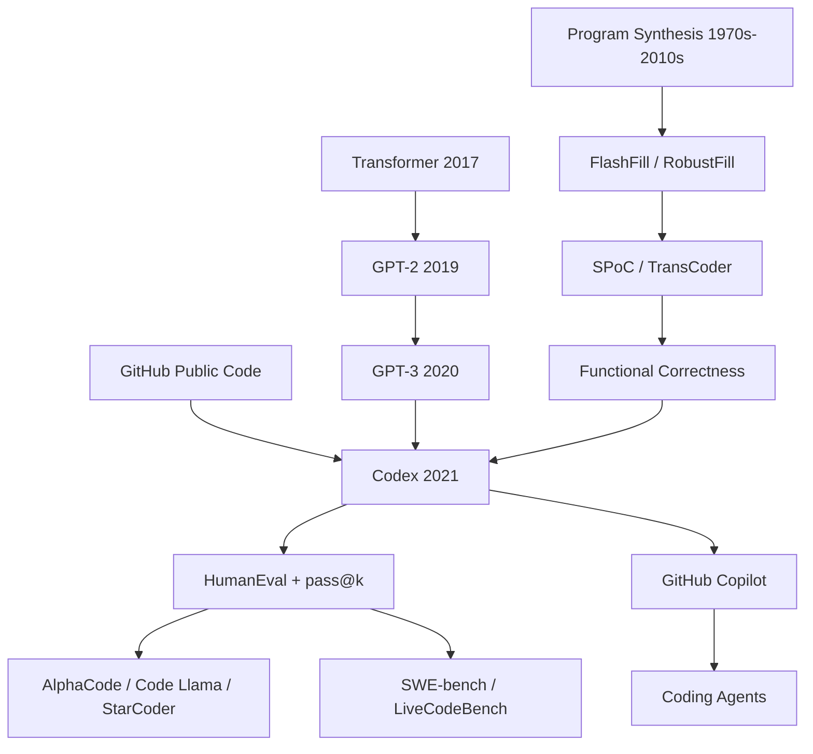

# Codex — Evaluating Large Language Models Trained on Code

> **July 7, 2021: Mark Chen, Jerry Tworek, Heewoo Jun, Qiming Yuan, and 54 co-authors uploaded [arXiv:2107.03374](https://arxiv.org/abs/2107.03374).** The paper did not introduce a new Transformer layer or a chat interface. Its move was blunter: fine-tune GPT on public GitHub code, then ask whether the generated Python programs actually pass unit tests on 164 handwritten tasks. The answer was jarring for 2021: GPT-3 was essentially at 0 on HumanEval, GPT-J reached 11.4%, Codex-12B reached 28.8% with one sample and roughly 70% with 100 samples. A month later OpenAI Codex entered API private beta; a little earlier, GitHub Copilot had already put a production descendant inside the IDE. The paper marks the moment software engineering began shifting from “humans write, machines autocomplete” toward “machines draft, humans verify.”

## TL;DR

Chen et al. 2021 turned the GPT-3 (2020) recipe from internet text into executable code: take a decoder-only GPT model with up to 12B parameters, fine-tune it on public GitHub Python, train with the ordinary next-token loss $\mathcal{L}=-\sum_t \log p_\theta(x_t\mid x_{<t})$, and evaluate it not by BLEU but by functional correctness on HumanEval, 164 handwritten Python tasks with unit tests. The paper’s key metric, $\mathrm{pass@}k=\mathbb{E}[1-\binom{n-c}{k}/\binom{n}{k}]$, captured the operational reality of code generation: if a user or tool can sample multiple candidates and run tests, one correct program is enough. Against the baselines that mattered in 2021, GPT-3 was near 0, GPT-J-6B was 11.4%, and TabNine was 2.6% pass@1; Codex-12B reached 28.8% with a single sample and roughly 70% with 100 samples. The hidden lesson is that Codex did not “solve programming” by understanding software like a senior engineer. It closed a new loop among natural-language intent, public code pretraining, stochastic sampling, and executable verification. InstructGPT (2022), AlphaCode, Code Llama, SWE-bench, and today’s coding agents are successive attempts to widen that loop from standalone functions to real repositories.

---

## Historical Context

### Why code generation felt like a demo, not a capability, before 2021

Machine code generation was not an empty field before Codex. FlashFill synthesized string transformations from input-output examples; DeepCoder searched programs in a small DSL; SPoC generated C++ from pseudocode; CodeBERT and CodeSearchNet aligned natural language and code for retrieval and understanding. The problem was that most systems were bounded in three ways: restricted languages, restricted tasks, and restricted evaluation. They could show compelling examples in controlled settings, but they did not answer the question working programmers cared about: if I give you a natural-language intent, can you write Python that actually passes tests?

GPT-3 made that question suddenly sharper in 2020. GPT-3 had not been explicitly trained as a program synthesizer, yet early OpenAI experiments showed it could generate rudimentary functions from Python docstrings. The Codex paper states the motivation plainly: GPT-3 already displayed simple programming ability, so the authors hypothesized that a specialized GPT model trained on public code could excel at coding tasks. Codex therefore did not begin from programming-language theory. It began from the scaling intuition of large language models: if next-token prediction captures the statistics of natural language, might code, a highly structured and testable form of text, be an even better target?

| Time | Event | Meaning for Codex |
|------|-------|-------------------|
| 2017 | Transformer published | Made the decoder-only GPT/Codex backbone possible |
| 2019 | GPT-2 showed large-scale generation | Made “one model across many text tasks” an OpenAI through-line |
| 2020 | GPT-3 demonstrated few-shot scaling | Codex inherited GPT-3 architecture and scaling intuition |
| 2021-06 | GitHub Copilot technical preview | Code models entered IDE products before the research paper landed |
| 2021-07 | Codex paper uploaded to arXiv | HumanEval and pass@k became public coordinates for code LLMs |

### Why OpenAI, GitHub, and 2021 mattered

Codex emerged at a very specific industrial intersection. OpenAI had the GPT-3 training stack and large decoder-only model expertise; GitHub had the world’s largest public code ecosystem; Microsoft Azure supplied training infrastructure; and developers already accepted autocomplete as a normal part of the IDE. Connect those pieces and the model is no longer just a program-synthesis prototype in a paper. It can suggest the next line of code inside VS Code.

The author block itself shows this was not an ordinary academic project. Mark Chen, Jerry Tworek, Heewoo Jun, Qiming Yuan, and 54 co-authors were primarily at OpenAI, with a few contributors listing Anthropic AI or Zipline affiliations for work performed while at OpenAI. The acknowledgements thank GitHub for partnering to build Copilot and Microsoft Azure for supporting model training infrastructure. That context matters: the Codex paper is both a research paper and a technical explanation after a product had already reached developers. It is not merely asking “can we top a benchmark?” It is asking “how should a model already entering IDEs be evaluated and discussed safely?”

OpenAI’s August 10, 2021 Codex announcement reinforced the same framing. It described Codex as a descendant of GPT-3 trained on natural language plus billions of lines of source code from public sources; said Codex was strongest in Python but proficient in JavaScript, Go, Perl, PHP, Ruby, Swift, TypeScript, Shell, and more; and advertised a 14KB Python context compared with GPT-3’s 4KB. The paper evaluated Python function synthesis. The product narrative already positioned Codex as an interface for controlling software with natural language. Research and product were unusually close here.

### Why HumanEval had to be handwritten

The most important historical move in Codex was not only the model training; it was the creation of HumanEval. The paper emphasizes that the training data came from a large fraction of public GitHub code, which already contains many competition problems, interview solutions, tutorials, and test answers. If the authors had evaluated directly on public LeetCode, Codeforces, or APPS problems, it would have been hard to tell whether the model was solving tasks or recalling seen solutions. HumanEval therefore used 164 handwritten Python function problems. Each problem included a signature, docstring, placeholder body, and unit tests, with an average of 7.7 tests per problem.

This shifted code-model evaluation from “does the generated text resemble an answer?” to “does the generated program execute correctly?” BLEU, exact match, and CodeBLEU penalize equivalent programs written differently, and they can reward code that resembles the reference while being logically wrong. HumanEval’s decision was rougher and more engineering-like: put the candidate in a sandbox, run the tests, and mark it pass or fail. It is imperfect because tests are incomplete, but it is much closer to the feedback loop of software development than string similarity.

HumanEval also legitimized multiple attempts. Traditional benchmarks often emphasize one-shot accuracy, but programmers naturally run, fail, edit, and rerun. Codex encoded that reality into pass@k: generate k samples and count the problem solved if any one sample passes the tests. The coding-model community inherited that metric almost verbatim.

## Background and Motivation

### Research question: does the model complete code, or solve tasks?

Codex was not asking whether a language model could emit strings that look like code. GPT-3 had already shown that. The real question was whether a model given a function signature and docstring could generate a body that satisfies the semantic constraints in the docstring. That separates code completion from program synthesis. Completion often needs local syntax and project style; synthesis must translate natural-language requirements into executable behavior.

Standalone Python functions were a conservative but clever midpoint. They avoided repository dependencies, filesystem state, package versions, databases, network calls, and other engineering complications, while preserving algorithms, simple math, string processing, list processing, and edge cases. The task was narrow enough to test automatically, yet broad enough to expose whether the model actually bound operations and variables described in the docstring.

### Motivation 1: use scale to test “code is language”

The training-side motivation was direct: public GitHub contained enough code, and code itself carries natural-language comments, docstrings, variable names, README files, tests, and commit traces. The paper used a May 2020 scrape of 54 million public GitHub repositories, first yielding 179GB of unique Python files under 1MB, then 159GB after filtering autogenerated files, unusually long lines, and files with low alphanumeric content. For a 12B-parameter model, that made the distribution of Python programs large enough to learn.

Codex did not simply reuse the GPT-3 tokenizer unchanged. The paper notes that the GPT-3 text tokenizer is inefficient for code, especially because whitespace is expensive to represent. The authors added tokens for whitespace runs of different lengths, reducing the number of tokens needed for code by about 30%. That detail is easy to miss, but it captures Codex’s engineering nature: if indentation carries Python semantics, the tokenizer cannot treat whitespace as ordinary textual noise.

### Motivation 2: turn generation into search with tests

The second motivation was to turn stochastic decoding into verifiable search. One sample is not the endpoint; if a system can generate 100 candidates and run unit tests, the model’s output distribution becomes a searchable space. The abstract reports Codex-12B solving 28.8% with one sample and 70.2% with 100 samples; the main table reports pass@100 in the same direction at 72.31%. This is not just a language-modeling win. It is a “generate + filter” win.

That also explains why the paper spends so much space on sandboxing. Running model-generated code is inherently risky: GitHub contains malicious programs, and generated programs may read files, access the network, or persist state. The public HumanEval repository still leaves the execution call commented out and asks users to read the warning about not running untrusted code outside a robust security sandbox. Codex’s evaluation loop was tied to safety engineering from day one, not bolted on later.

### Motivation 3: create a public language for the Copilot era

If you look only at the model, Codex is GPT fine-tuning. If you look only at the product, it is the completion model behind Copilot. What the paper left behind as shared language is HumanEval, pass@k, and functional correctness. Without them, AI programming assistants would have to persuade users through demo videos. With them, the community could at least argue whether one model was stronger than another under the same task, sampling budget, and test standard.

That language also exposed its own limits: 164 functions are not software engineering, pass@k can reward brute-force sampling, and unit tests can be accidentally satisfied. But many historically important benchmarks are valuable not because they are perfect, but because they give a field its first shared coordinate system. Codex/HumanEval played for code models a role similar to ImageNet for vision, GLUE for NLP, and MMLU for general knowledge: it first made the argument measurable, and then later work could show why the measurement was not hard or realistic enough.

---

## Method Deep Dive

### Overall framework: GPT learns text, then code, then tests become the judge

Codex can sound almost too simple if summarized in one sentence: take a GPT model, continue next-token prediction on GitHub Python, and use docstring prompts to complete function bodies. It introduced no new attention layer, no explicit program executor inside the model, and no AST search procedure. The paper’s contribution was to connect three previously separate pieces into a loop: large-scale code corpora, stochastic sampling, and executable unit tests.

The training objective remained ordinary autoregressive language modeling. Given a token sequence $x_1,\ldots,x_T$, the model minimizes:

$$
\mathcal{L}_{\text{code}}(\theta)=-\sum_{t=1}^{T}\log p_\theta(x_t\mid x_{<t}).
$$

At inference time, a HumanEval prompt consists of a function header and docstring. The model continues with a function body until it hits stop sequences such as a new `def`, `class`, or `print`. Each candidate is placed in a sandbox and executed against unit tests. In that loop, “code generation” becomes a stochastic proposal generator, and the unit tests become the verifier.

| Model/system | Training or data | HumanEval pass@1 | HumanEval pass@100 | Role in the paper |
|--------------|------------------|------------------|--------------------|-------------------|
| GPT-3 | General natural-language GPT | near 0% | near 0% | Shows generic LMs do not automatically program |
| GPT-J-6B | The Pile, about 8% GitHub | about 11.4% | about 27.7% | Code exposure yields nonzero ability |
| TabNine | Commercial code-completion system | 2.6% | 7.6% | Industrial autocomplete baseline |
| Codex-300M | GitHub Python fine-tuning | 13.17% | 36.27% | Small model already beats GPT-J/TabNine |
| Codex-12B | GitHub Python fine-tuning | 28.81% | 72.31% | Main result: code fine-tuning plus sampling works |

### Design 1: GitHub Python fine-tuning extracts the “code distribution” from general language

Codex’s first design layer is data. From a May 2020 scrape of 54 million public GitHub repositories, the authors collected Python files: unique files under 1MB first yielded 179GB; after filtering likely autogenerated files, average line length over 100, maximum line length over 1000, and files with low alphanumeric content, they kept 159GB. The point was not to obtain perfect code. It was to mostly expose the model to Python that human developers would read and write.

This differs from training a code model from scratch. GPT pretraining had already learned English, Markdown, web text, mathematical symbols, JSON, command-line snippets, and some code; Codex shifted probability mass toward “code following natural-language intent.” In conditional-probability terms, it nudged a general model $p_{\theta_0}(x_t\mid x_{<t})$ toward a code-biased model $p_{\theta_c}(x_t\mid x_{<t}, \text{Python/GitHub})$.

The hidden benefit is that the prompt interface did not need to be redesigned. A user can write an English docstring and the model continues in Python; an IDE can pass preceding code and get the next line; an API call can ask “explain this function” or “translate this to TypeScript.” Natural language and code appearing in the same token stream was the weak constraint of GPT, and it is why Codex became a product rather than a narrow program synthesizer.

### Design 2: tokenizer compression for code protects the context budget

One of the most engineering-heavy but crucial changes was adding whitespace-run tokens to the tokenizer. In Python, indentation is syntax, not formatting; code also contains far more repeated spaces and newlines than natural-language text. The GPT-3 tokenizer represents such whitespace inefficiently, reducing how much code can fit in a 4KB or 14KB context. Codex added tokens for whitespace runs of different lengths and reduced code token counts by about 30%.

This looks like a low-level detail, but it matters enormously for code models. Code tasks often need the signature, docstring, helper functions, local naming patterns, imports, and indentation structure at once. Saving 30% of tokens is like seeing a large extra slice of context, especially when context windows were short in 2021. It also explains why OpenAI’s announcement emphasized a roughly 14KB Python memory for Codex compared with GPT-3’s 4KB: the user experience of a coding assistant depends not only on parameter count, but on how much relevant code fits into the prompt.

| Component | Ordinary GPT text modeling | Codex adjustment | Why it mattered |
|-----------|----------------------------|------------------|-----------------|
| Data | Large web/book/mixed text | 159GB filtered GitHub Python | Moves probability mass toward executable code |
| Tokenizer | Natural-language fragments | Adds whitespace-run tokens | Cuts code token count by about 30% |
| Prompt | Arbitrary text continuation | Header + docstring + body | Turns intent into conditional generation |
| Stop rule | Generate until length limit | Stop on `def/class/print`, etc. | Prevents extra functions/statements from spilling out |

### Design 3: HumanEval plus pass@k turns code generation into executable probability

Codex’s longest-lived design is the evaluation, not the model. HumanEval gives each task as a Python function prompt, the model generates a completion, and the harness runs assertions. For each task, the paper samples $n=200$ candidates, counts how many pass tests as $c$, and computes pass@k with an unbiased estimator:

$$
\mathrm{pass@}k = \mathbb{E}_{\text{Problems}}\left[1-\frac{\binom{n-c}{k}}{\binom{n}{k}}\right].
$$

That formula matters. It is not the naive $1-(1-\hat p)^k$, which is biased with finite samples; the paper even provides a numerically stable implementation to avoid overflow from large binomial coefficients. More importantly, pass@k makes “multiple attempts” an explicit budget: as k grows, the model can use higher temperature for diversity, and the task counts as solved if any sample is correct.

```python
import numpy as np

def estimate_pass_at_k(num_samples, num_correct, k):
    if num_samples - num_correct < k:
        return 1.0
    return 1.0 - np.prod(1.0 - k / np.arange(num_samples - num_correct + 1, num_samples + 1))

# In Codex-style evaluation, run this per task, then average across tasks.
```

This small evaluator changed community intuition. In natural-language generation, many-sample decoding can look like benchmark gaming. In code generation, if tests exist, sampling is search. Codex showed that temperature should also depend on k: for a 679M-parameter model, the optimal temperature was about $T^*=0.2$ for pass@1 and $T^*=0.8$ for pass@100. Low temperature gives the best single guess; high temperature covers more of program space.

### Design 4: Codex-S and sample ranking treat model outputs as a candidate set

Base Codex was fine-tuned on the distribution of GitHub files, while HumanEval asks for standalone functions synthesized from docstrings. The paper therefore built a closer training distribution: it curated tasks, filtered for problems Codex-12B could solve with 100 samples and stable tests, then further supervised-fine-tuned on standalone functions, producing Codex-S. The design is mildly recursive: use the model to help filter data, then train a model closer to the evaluation distribution.

The gain was clear. The figure caption reports Codex-S solving 37.7% with one sample, compared with Codex-12B’s 28.8%; when selecting from 100 samples using unit tests, the figure reports 77.5%. Even without hidden tests for filtering, mean token log-probability helped rank multiple samples. The paper found mean log-prob ranking better than random selection, while sum log-prob could be worse because it tends to prefer short completions.

This foreshadowed the central idea behind later coding agents: one model output is not the final answer, but a candidate, a search frontier, something that can be tested, ranked, back-translated, or reviewed by a human. Codex-S, Codex-D, mean log-prob ranking, and unit-test filtering were all 2021 attempts to attach a verifier to that frontier.

### Why such a simple method changed the field

Codex did not frame programming as AST construction, type inference, or symbolic search. It treated programs as conditionally generated text. Yet it also refused to evaluate code as text similarity; evaluation returned to execution and tests. That combination is counterintuitive: pure language modeling at training time, pure software engineering at evaluation time. The mismatch is the source of the method’s power.

Methodologically, Codex left four paths for later code LLMs. First, scale code-pretraining data and model size. Second, expand evaluation from HumanEval to APPS, MBPP, LiveCodeBench, and SWE-bench. Third, expand verifiers from unit tests to compilers, static analysis, CI, user feedback, and reward models. Fourth, turn one completion into an agent loop: generate, run, observe errors, edit, and run again. From today’s perspective, the 12B parameter count is not the most important artifact. The important artifact is that Codex wrote down the loop.

---

## Failed Baselines

### Failure 1: GPT-3 could look like code, but almost never pass tests

Codex’s most persuasive baseline was GPT-3. Since Codex is essentially GPT fine-tuning, if GPT-3 had already performed well on HumanEval, then code fine-tuning would have been an incremental improvement. The result was the opposite: comparable GPT models were near 0 on HumanEval. This does not mean GPT-3 knew no Python. It could produce snippets that looked syntactically plausible and complete common patterns. But HumanEval asked for executable semantics: edge cases, variable binding, return values, empty lists, casing, recursion, sorting, and mathematical constraints. Unit tests stripped away the surface fluency.

That failure mattered because it corrected an early misunderstanding: code generation was not merely a side effect of prompting a natural-language model. Public code data, tokenization, context length, sampling strategy, and executable evaluation all had to be part of the system. Codex’s 28.8% pass@1 was striking precisely because GPT-3’s near-zero starting point made the jump visible.

### Failure 2: BLEU and string matching reward the wrong similarity

A second failed baseline was the evaluation metric itself. Code has a property natural language lacks: many programs can be functionally equivalent while textually different, and two textually similar programs can differ by one boundary condition and become wrong. The paper computed BLEU for Codex-12B HumanEval samples and found heavy overlap between the BLEU distributions of correct and incorrect solutions. Improving BLEU therefore did not imply improving functional correctness.

This later became common sense in code LLM evaluation, but in 2021 it was not obvious. NLP had long relied on BLEU, ROUGE, and exact match; code also had structure-aware similarity metrics such as CodeBLEU. Codex pushed evaluation toward execution: if two programs pass the tests, textual difference should not matter; if a program resembles the reference but fails tests, similarity should not rescue it.

### Failure 3: commercial autocomplete is not program synthesis

The TabNine baseline is historically revealing. TabNine was a mature commercial code-completion system, yet it achieved only 2.6% pass@1 and 7.6% pass@100 on HumanEval, roughly equivalent to Codex-12M, one of the smallest models in the suite. That showed IDE autocomplete and docstring-to-function synthesis are not the same task. Autocomplete is strong at local statistics: variable names, common APIs, and boilerplate for the next line. HumanEval requires global constraints and function-level correctness.

This does not make autocomplete unimportant. It shows that Copilot/Codex changed the product boundary. Traditional completion reduces keystrokes when the developer already knows what to write; Codex starts to propose a full implementation from intent. That role shift creates productivity, but also over-reliance: users may treat a plausible full function as an answer rather than as a candidate to test and review.

### Failure 4: weak tests and public problem sets turn benchmarks into memorization games

The Codex paper also implicitly criticized many early code benchmarks. APPS, Codeforces, LeetCode, and public GitHub tasks are valuable, but they are vulnerable to contamination for a model trained on a large fraction of public code. The paper notes that Codeforces problems already had more than ten public repositories containing solutions; that is exactly why HumanEval had to be handwritten.

The subtler issue is weak tests. If tests are incomplete, a model can generate code that passes tests while being semantically wrong. In related work, the paper points to generate-and-validate patch generation, where algorithms can pass weak test suites by deleting functionality that failed. Codex did not solve this problem; it made it explicit. Later SWE-bench, LiveCodeBench, private tests, and CI-based evaluation all broaden the same testing surface.

| Baseline / failure target | What it seemed able to do | HumanEval or paper conclusion | Exposed problem |
|---------------------------|---------------------------|-------------------------------|-----------------|
| GPT-3 | Write plausible code from docstrings | Comparable GPT models near 0% | Text generation is not executable correctness |
| BLEU / exact match | Measure similarity to a reference | Correct and wrong BLEU distributions overlap | String similarity is not functional equivalence |
| TabNine | Mature IDE autocomplete | 2.6% pass@1, 7.6% pass@100 | Local completion is not function synthesis |
| Public contest tasks with weak tests | Large and realistic-looking | May be contaminated or test-gamed | Benchmarks need handwritten/updated/hidden tests |

## Key Experimental Data

### Main HumanEval result: fine-tuning and sampling each tell half the story

HumanEval’s main table gives the clearest scale. Codex-300M reached 13.17% pass@1, already near GPT-J-6B’s 11.4%; Codex-2.5B reached 21.36%; Codex-12B reached 28.81%. At pass@100, the gap widened: Codex-12B reached 72.31%. The abstract uses a more conservative phrasing, saying 100 samples per problem solve 70.2%. Both point to the same conclusion: code fine-tuning makes one sample usable, and many-sample decoding turns “occasionally correct” into “most tasks have at least one correct candidate.”

| Model | Parameter scale | pass@1 | pass@10 | pass@100 | Key interpretation |
|-------|-----------------|--------|---------|----------|--------------------|
| Codex-300M | 300M | 13.17% | 20.37% | 36.27% | Small model already exceeds GPT-J pass@1 |
| Codex-2.5B | 2.5B | 21.36% | 35.42% | 59.50% | Scale gives smooth gains |
| Codex-12B | 12B | 28.81% | 46.81% | 72.31% | Main model, largest many-sample gain |
| Codex-S-12B | 12B + supervised functions | 37.7% | not listed in main table | 77.5% with unit-test selection | Matching the task distribution helps |
| GPT-J-6B | 6B | about 11.4% | not listed in main table | about 27.7% | Code exposure in The Pile is not enough to catch Codex |

### APPS result: moving from functions to contests immediately hurts

APPS is a harder competitive-programming dataset with 5000 training and 5000 test problems. Tasks usually require full programs that read from stdin and print to stdout, not standalone functions. The Codex paper did not fine-tune on APPS; it used a 1-shot formatting hint and sampled up to 1000 solutions. It also used the three public input/output examples in problem statements to filter candidates.

The result is instructive. Codex-12B raw pass@1000 on introductory problems was about 25.02%, and filtered pass@1 was about 22.78%; on competition-level problems, raw pass@1000 was only 3.23%, and filtered pass@1 was about 3.04%. Codex was not a general entity that “knew how to program.” It was very strong at short function synthesis; once tasks required complex algorithms, I/O protocols, efficiency, and hidden tests, capability contracted quickly.

| APPS setting | Introductory | Interview | Competition | Key interpretation |
|--------------|--------------|-----------|-------------|--------------------|
| GPT-Neo 2.7B raw pass@1 | 3.90% | 0.57% | 0.00% | The APPS-paper baseline was weak |
| 1-shot Codex raw pass@1 | 4.14% | 0.14% | 0.02% | One sample is almost useless on harder tasks |
| 1-shot Codex raw pass@1000 | 25.02% | 3.70% | 3.23% | Large sampling recovers some search depth |
| 1-shot Codex filtered pass@1 | 22.78% | 2.64% | 3.04% | Public-example filtering improves usable selection |

### Failure-mode data: chained operations and variable binding are hard

The limitations section is unusually candid. First, Codex is not sample-efficient to train: it sees hundreds of millions of lines of code, yet a strong student after an introductory CS course should solve a larger fraction of HumanEval than Codex-12B. Second, on synthetic chained-docstring tasks, each added basic operation drops pass rate by roughly a factor of 2 to 3. Third, the model binds operations to the wrong variables, especially when both the number of variables and operations in the docstring increase.

Those failures still feel familiar today. Code LLMs often write locally plausible fragments but break under long constraints, state updates, variable correspondence, and edge cases. Codex stated the issue early: this is not a syntax failure but a specification-binding failure. The model can generate programs that look like correct solutions, but it has no stable internal guarantee that every natural-language constraint has been executed.

### Safety and deployment data: evaluation itself is a risk model

The Codex paper did not bury safety at the edge of the appendix; it made it central to deploying code generation. The HumanEval harness must run untrusted code, so the paper designed a sandbox whose goals were to prevent generated programs from modifying the environment, gaining persistence, accessing sensitive resources, or exfiltrating data. The public repository README also strongly advises against running generated code outside a robust sandbox and deliberately comments out the execution call.

The broader safety discussion covers over-reliance, automation bias, insecure-code suggestions, malicious use, energy use, and legal issues. The paper is careful: at the then-current capability level, Codex did not materially lower the barrier to malware development, but it could still generate components usable in more complex malicious systems and it frequently used insecure cryptographic configurations. That stance shaped later code-assistant evaluation: the question is not only “can it write code?” but also “will users overtrust it, can it execute dangerous side effects, and can it copy or generate code it should not?”

---

## Idea Lineage

### Before: from program synthesis to “code is internet text”

Codex has two ancestral lines. The first is program synthesis: Manna and Waldinger’s automatic program construction, FlashFill’s example-driven synthesis, RobustFill, DeepCoder, and SPoC all assumed that programs should be searched for or constructed. This line is strong at verification, constraints, and interpretability; it is weak at absorbing the messy but huge real-code distribution found on GitHub.

The second line is large language modeling: Transformer, GPT-2, and GPT-3 showed that next-token prediction can compress large-scale text into a generative model. Codex’s key jump was to place code inside the second line while bringing the first line’s execution-based verification back in. It did not abandon neural generation, and it did not abandon correctness; it tied them together with HumanEval and pass@k.



### After: code models spread along three routes after Codex

The first route was open models and data. Codex did not release weights or the training dataset; HumanEval was open, the model was not. Later CodeGen, SantaCoder, StarCoder, Code Llama, and DeepSeek-Coder turned “public-code pretraining plus code instruction/infilling/completion” into an open ecosystem. Codex proved the route; successors moved it out of the OpenAI API.

The second route was competitive programming and execution search. AlphaCode pushed “many-sample generation plus filtering” toward Codeforces-style problems, expanding from hundreds of samples to much larger candidate pools and using clustering, filtering, and tests to choose submissions. The idea is deeply Codex-like: the model does not answer once; it produces a cloud of possible programs, and evaluators/selectors decide what to submit.

The third route was repository-level agents. HumanEval functions are short and stateless; real software engineering requires reading issues, locating files, editing multiple modules, running tests, and reacting to failure logs. SWE-bench, RepoBench, code-repair benchmarks, and coding agents extend the Codex loop into “generate patch + execute tests + iterate.” Today’s agents are no longer merely completion models, but their minimal loop is still Codex-shaped: intent -> code -> execution feedback -> selection/update.

| Successor direction | Representative work/system | Codex inheritance | Mutation |
|---------------------|----------------------------|------------------|----------|
| Open code LLMs | StarCoder / Code Llama / DeepSeek-Coder | GitHub-scale code pretraining | More attention to open data, licenses, infilling, instruction |
| Competitive programming | AlphaCode | Many-sample generation + filtering | Larger sample pools and harder algorithmic tasks |
| Evaluation upgrades | MBPP / LiveCodeBench / SWE-bench | Functional correctness | New tasks, real issues, and CI beyond short functions |
| Product assistants | Copilot / Cursor / coding agents | Natural-language-to-code in the IDE | From completion to multi-file edits and tool use |
| Safety governance | sandbox / insecure-code evals | Untrusted generated code must be isolated | Adds supply-chain, license, privacy, and security policy concerns |

### Misreadings: Codex is not a “programmers are replaced” paper

The most common misreading is to treat Codex as saying “AI can code, therefore programmers disappear.” The paper’s own data pushes back. Codex-12B reaches only 28.8% with one sample; APPS competition raw pass@1000 is only 3.23%; chained docstrings lose a factor of 2 to 3 in pass rate per added operation; the model binds operations to the wrong variables and suggests insecure configurations. Codex proves that a model can propose candidate programs, not that it can accept software-engineering responsibility.

The second misreading is to treat pass@k as raw real-world ability. pass@100 or pass@1000 matters only when a verifier exists. Without unit tests, hidden tests, or human review, many-sample generation simply produces more plausible errors. Codex’s real lesson is that generation and verification must be designed together. Showcasing only the generator removes the most important half of the paper.

The third misreading is to treat HumanEval as a permanent standard. HumanEval’s historical value is enormous, but its 164 handwritten tasks were quickly learned by models and prompt engineering, and they became attractive contamination targets. It is a shared coordinate, not a destination. LiveCodeBench and SWE-bench are direct responses to HumanEval being too short, too static, and too function-level.

### Historical position: turning AI coding from an NLP branch into a software-engineering problem

Codex occupies an unusual historical position. It sits after GPT-3 and right before or alongside Copilot; one foot is in NLP scaling, the other in software engineering’s testing culture. The paper’s lasting impact is not an architectural trick, but the relocation of code LLM evaluation from “a branch of language modeling” back to the engineering question that programs must execute correctly.

In one sentence, Codex changed program generation from “can a model write text that looks like code?” to “can a model search for correct programs under executable feedback?” That is why it influenced benchmarks, products, agents, safety, and the open-source community at once. It is not the final answer, but it is the starting point that nearly every later answer has to address.

---

## Modern Perspective

### Looking from 2026: what held up

Codex’s most durable judgment is that functional correctness would become the center of code-model evaluation. After 2021, nearly every serious code-generation benchmark involves execution, tests, compilation, or CI: MBPP continues short-function evaluation; APPS and CodeContests push toward competition problems; SWE-bench moves to real GitHub issues; LiveCodeBench keeps updating tasks to reduce contamination. They all answer the same question: does the generated artifact hold under an executable standard?

The second durable judgment is that sampling matters. AlphaCode, later coding agents, self-repair, test-time compute, and pass@k curves all treat multiple attempts as part of capability. For code this is not cheating; it resembles development. Write a candidate, run it, see the failure, try another candidate. Codex did not have an explicit agent loop, but it already made “candidate set + verifier” the evaluation object.

The third durable judgment is that safety and product experience cannot be separated. The HumanEval README’s sandbox warning looks like an evaluation detail, but it is the original sin of every coding assistant: once model output can be executed, errors and misuse affect user machines, dependency chains, data, and production systems. Today’s IDE agents, terminal agents, and CI agents are all rediscovering that warning.

### Assumptions that did not hold: HumanEval can stand for programming ability

The least durable assumption is that a short-function set like HumanEval can represent programming ability for long. In 2021 it was necessary because the field needed its first shared coordinate. By 2026 it is too small, too static, too vulnerable to training contamination, and too easily gamed by prompt engineering and memorization. A model can score high on HumanEval while failing to edit a real repository, read failure logs, resolve dependencies, or respect architectural boundaries.

The second assumption to revise is that pass@k directly translates into user value. pass@100 is meaningful when hidden tests exist; real users often lack complete tests, or the tests themselves are wrong. Many-sample generation can create more candidates, but it can also create more plausible security bugs, license risks, and maintenance burdens. Modern coding assistants must turn “generate more” into “verify better,” or pass@k becomes a compute-fueled illusion.

The third assumption is that larger models naturally become more aligned. The Codex paper already saw signs pointing the other way: larger models could become better at imitating bugs in the prompt, and automation bias becomes more dangerous as capability rises. The agent era has made this sharper. More capable code models need boundaries, auditing, permission controls, and rollback mechanisms.

| Implicit 2021 assumption | 2026 status | Why it needs revision |
|--------------------------|-------------|----------------------|
| HumanEval represents coding ability | It represents short-function synthesis | Real engineering has repository state, dependencies, CI, collaboration |
| Higher pass@k is always better | It needs verifiers and cost constraints | Without tests, many samples amplify plausible wrong candidates |
| Copilot is just autocomplete | It has expanded into agentic coding | Tool use and multi-file edits enlarge the risk surface |
| Open-source code can directly be training data | It needs license/privacy/governance | Data ownership and similar-code generation remain contested |
| Safety can rely on careful users | It needs system-level guardrails | Users are affected by automation bias |

### If this paper were rewritten today

If Codex were rewritten in 2026, the first change would be replacing a single benchmark with a layered evaluation suite. Short functions would remain as a quick sanity check; live problems would reduce contamination; repository-level issue repair would measure engineering ability; security tasks would probe dangerous behavior; license and memorization probes would assess data risk; and human-in-the-loop studies would measure how developers actually use suggestions.

The second change would be treating the verifier as part of the system. The 2021 paper separates model and evaluation: the model generates, external tests judge. A modern version would naturally describe a full system: generator + executor + selector + repairer + permission controller. It would report token cost, wall-clock latency, test budget, flake rate, sandbox-escape risk, and CI failure categories, not only pass@1/pass@100.

The third change would be more serious data transparency. Codex trained on public GitHub, but the exact dataset was not released and neither were the weights. Later StarCoder/BigCode work showed that code models need finer governance: license filtering, opt-out, PII removal, dataset documentation, and near-duplicate analysis. Today that is not an optional ethics paragraph; it is infrastructure for trusting code models.

### From Codex to coding agents: the real change is the boundary of responsibility

Codex let models write functions; coding agents let models modify projects. That sounds like a scale-up, but it is really a boundary shift. If a function completion is wrong, a user may inspect it. If a multi-file patch is wrong, it can introduce hidden regressions, break security policy, violate architectural conventions, or run dangerous terminal commands. Codex’s sandbox warning becomes a permission model in the agent era: what can the model read, edit, execute, connect to, and when must a human confirm?

Codex’s modern meaning is therefore not simply “AI can code.” It is that code generation became a foundational capability requiring engineering governance. It placed model capability, evaluation standards, product entry points, and risk models on the same table for the first time. Every later system, whether an open code LLM, a Copilot-like assistant, or an autonomous coding agent, expands that table.

## Limitations and Future Directions

### Limitations of the paper itself

The paper’s largest limitation is narrow evaluation. HumanEval’s 164 tasks are all short Python functions. They do not cover large projects, external dependencies, performance constraints, concurrency, databases, UI, cloud APIs, build systems, or long-term maintenance. The APPS result already showed that capability drops quickly when the task becomes competitive programming or full-program synthesis. The paper admits coding is a broad activity, but its main result can still be misread as representing “programming ability.”

The second limitation is reproducibility. HumanEval is open, but the Codex weights, training data, filtering details, and production model are not. The paper says a distinct production version of Codex powers GitHub Copilot, meaning the publicly evaluated research model and the model users encountered in the product are not identical. That is understandable for industrial research, but it leaves gaps for academic understanding, social-impact analysis, and legal debate.

The third limitation is that tests are not correctness. HumanEval averages 7.7 tests per problem, which covers only limited paths. Passing tests does not prove the full specification; failing tests can also reflect ambiguous assumptions. Codex launched functional correctness as the central direction, but it did not solve specification completeness.

### Future direction: code models will look like engineering systems, not single models

Future code-generation research will increasingly look less like “train a model” and more like “build an engineering system.” The model proposes candidates; retrieval finds repository context; parsers and type checkers enforce structure; unit and integration tests provide execution feedback; static analyzers and security scanners evaluate risk; human review handles intent and responsibility. Codex is the prototype of the generator side of this system.

Further out, the value of code models may not be saving a few keystrokes, but turning natural-language requirements into runnable artifacts: scripts, tests, data analyses, microservices, migration patches, and experiment pipelines. The risks scale the same way. The closer the model gets to production, the less pass@k can stand alone. Real metrics will include maintainability, security, latency, cost, review burden, rollback safety, and fit with team workflow.

## Related Work and Insights

### Related work: Codex connects two literatures

The first literature is code intelligence: CodeBERT, CodeSearchNet, CodeXGLUE, TransCoder, SPoC, and APPS. These works had already shown that code and natural language can be jointly modeled, and that functional correctness can be more meaningful than exact match. Codex pushed those ideas to GPT scale and made them mainstream through the Copilot product context.

The second literature is LLM scaling and alignment: GPT-2, GPT-3, scaling laws, learning from human feedback, and InstructGPT. Codex inherited scaling’s capabilities and exposed a code-specific form of alignment early: models imitate bugs, suggest insecure code, and encourage over-reliance. That connection explains why code models now belong simultaneously to NLP, programming languages, software engineering, security, and HCI.

### Insight: a code-model paper should also write down the verifier

Codex gives later researchers a practical lesson: do not report only the generator. Code tasks naturally have execution feedback, so papers should state the verifier, test coverage, sampling budget, failure taxonomy, and safety boundary. Otherwise a beautiful pass@1 number is hard to translate into real engineering value.

A second lesson is that benchmarks must refresh over time. HumanEval’s success led to overuse; once a benchmark is repeatedly trained on, prompted against, and leaked, it shifts from “ability measurement” to “community folklore.” LiveCodeBench’s continuously updated tasks and SWE-bench’s real issues are corrections to the side effects of Codex’s own success.

## Resources

### Primary materials

| Type | Name | Link |
|------|------|------|
| Paper | Evaluating Large Language Models Trained on Code | https://arxiv.org/abs/2107.03374 |
| Code/data | HumanEval evaluation harness | https://github.com/openai/human-eval |
| Product post | OpenAI Codex announcement | https://openai.com/index/openai-codex/ |
| Follow-up benchmark | SWE-bench | https://www.swebench.com/ |
| Follow-up benchmark | LiveCodeBench | https://livecodebench.github.io/ |

These resources are best read together. The arXiv paper explains the model and evaluation; the HumanEval README exposes the security boundary around executing untrusted code; the OpenAI announcement shows how Codex was productized; SWE-bench and LiveCodeBench show how the 2021 short-function evaluation regime was replaced by repository-level and dynamic-task evaluation after 2024.


---

> 🌐 [中文版](/era4_foundation_models/2021_codex/) · 📚 awesome-papers project · CC-BY-NC