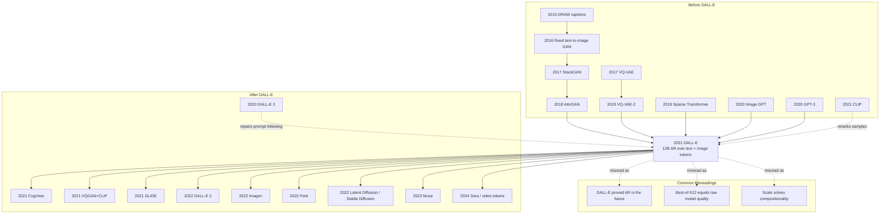

# DALL-E — Recasting Text-to-Image Generation as Language Modeling

> **On January 5, 2021, OpenAI introduced [DALL-E](https://openai.com/index/dall-e/); on February 24 it posted the paper as [arXiv:2102.12092](https://arxiv.org/abs/2102.12092).** This was not the best image generator by today's standards: its 256x256 samples blur, it often breaks object binding, and the public demos were chosen by CLIP reranking from hundreds of candidates. But the conceptual move was electric. DALL-E said that text-to-image generation could be treated as one long language-modeling problem: tokenize the caption, tokenize the image, concatenate both streams, and let a 12B autoregressive Transformer continue the sequence. DALL-E 1 did not win the diffusion era; it lit the fuse that made the diffusion era legible.

## TL;DR

Ramesh, Pavlov, Goh, Gray, and four co-authors turned text-to-image generation from a field of MS-COCO/CUB-specific GAN architectures, auxiliary losses, and extra annotations into a GPT-style sequence modeling problem. DALL-E first trains a discrete VAE that compresses a $256\times256$ image into a $32\times32=1024$ grid of visual tokens from an 8192-way vocabulary, then concatenates up to 256 BPE text tokens with those image tokens and trains a 12B sparse Transformer to maximize $p_\psi(y,z)=\prod_t p(s_t\mid s_{<t})$. Without training on MS-COCO captions, its samples beat DF-GAN in human evaluation 90.0% of the time for realism and 93.3% for caption match; on CUB it was nearly 40 FID points behind the best domain-specific baseline, exposing the boundary of the result: scale bought generality, not magic specialization.

DALL-E 1 was quickly surpassed by GLIDE, DALL-E 2, Imagen, and Stable Diffusion (2022), all of which moved the frontier toward diffusion. But together with same-day CLIP (2021), it changed the coordinate system of multimodal AI: CLIP showed that images could be recognized through language supervision, while DALL-E showed that images could be generated as language-model continuations. The counterintuitive lesson is that DALL-E's durable contribution was not the 12B autoregressive sampler itself; it was the interface of discretizing visual worlds into predictable tokens and letting natural language steer them. VQGAN, Parti, Muse, VQ-Diffusion, DALL-E 3, and later video-token systems all inherit or repair that interface.

---

## Historical Context

### Why pre-2020 text-to-image looked like specialized small-model engineering

Before DALL-E, text-to-image generation was not framed as a foundation-model problem. It looked more like visual synthesis engineering on small datasets. A typical paper optimized around MS-COCO, CUB-200, or Oxford Flowers: encode the caption with an RNN or attention module, feed that embedding into a multi-scale GAN, and stabilize the result with object-part labels, segmentation masks, text-image matching losses, attention maps, dynamic memory, or extra discriminators. StackGAN painted a 64x64 image and then super-resolved it to 256x256; AttnGAN used word-level attention for local detail; DM-GAN introduced a memory module to recover missing text information; DF-GAN simplified the fusion pathway. Each step moved the field toward "fit this benchmark better."

The core problem was not that GANs were foolish. The task definition was narrow. These models learned the sentence style of MS-COCO captions, the object distribution of COCO, and the auxiliary losses designed by the paper authors. Once the prompt became "a tapir made of accordion" or "an armchair in the shape of an avocado," there was no stable training support. Worse, the visual appeal of GAN-era papers often depended on heavy sample selection. What looked like open-ended creation was often conditional distribution fitting on a fixed dataset. DALL-E's rebuttal was blunt: if small models require that many hand-built assumptions, perhaps the missing ingredient is scale and general sequence modeling, not yet another GAN module.

### GPT-3 and Image GPT gave OpenAI the wrong-useful clue

By 2020 OpenAI had already been reshaped by GPT-3. The 175B-parameter language model sent a strong signal: when model size, data, and context length are large enough, a task need not always become a supervised head; many behaviors can be elicited from the same language model by prompting. Image GPT then moved that intuition into pixels, treating 32x32 images as pixel-token sequences and training a GPT-2-style Transformer. Image GPT did not make beautiful images, but it proved that "vision can be serialized" was not empty rhetoric.

DALL-E grew between these two projects. It inherited GPT-3's scaling belief and Image GPT's assumption that images can be represented as token sequences, but it avoided Image GPT's fatal context-length problem. Instead of predicting every pixel of a 256x256x3 image, it first used a dVAE to compress the image into 1024 visual tokens. Visual generation could then fit inside a 1280-token context: up to 256 text tokens plus 1024 image tokens. DALL-E did not invent the Transformer or the discrete visual codebook. Its historical contribution was to assemble those pieces into a proposition that was instantly legible: **text-to-image generation can be language-model continuation.**

### DALL-E and CLIP split the job on the same day

On January 5, 2021, OpenAI released DALL-E and CLIP together. In hindsight the pairing looks deliberate: DALL-E generated, CLIP judged. The interactive examples in the DALL-E blog were not single samples per prompt; OpenAI generated 512 candidates and used CLIP to rerank them, displaying the top 32. The early DALL-E spectacle already depended on an independent image-text matching model as a search procedure.

That split also explains the later fate of the two lines. DALL-E 1 as a generator was quickly surpassed by diffusion models because autoregressive token-by-token sampling was slow and prone to local error accumulation. CLIP as a discriminative aligner became infrastructure: DALL-E 2 used CLIP latents, early Stable Diffusion used a CLIP text encoder, and the VQGAN+CLIP community experiments treated CLIP as an external semantic and aesthetic guide. The DALL-E story is therefore slightly ironic. It proved that language could control images, but the same-day CLIP often became the more durable interface for making that control reusable.

## Background and Motivation

### Goal: recast image generation as language modeling

The paper's motivation can be compressed into one tension: traditional text-to-image systems improved fidelity on fixed datasets by adding structural assumptions, while open-ended prompts require world knowledge, attribute binding, style, location, material, text rendering, and implicit background completion. These are hard to enumerate through special-purpose modules. DALL-E replaced "design a structure" with "model a unified stream": discretize the image, discretize the text, and learn their joint distribution in a Transformer.

The goal was not simply to minimize MS-COCO FID. If that were the only objective, specialized GANs and later diffusion models could win with less compute. DALL-E was chasing zero-shot flexibility: produce comparable samples on MS-COCO without training on its captions; attempt strange concept combinations; use language plus a partially observed image to perform rudimentary image-to-image translation. Its successes and failures test one question: can scale move image generation from benchmark engineering toward foundation-model behavior?

---

## Method Deep Dive

### Overall framework

DALL-E is a two-stage compression-and-continuation system. Stage one trains a discrete VAE that compresses a 256x256 RGB image into a 32x32 grid of discrete visual tokens. Stage two freezes that visual tokenizer, concatenates text tokens and image tokens into one sequence, and trains a decoder-only sparse Transformer autoregressively. At inference time, the model first reads the text, generates 1024 image tokens from left to right, and the dVAE decoder reconstructs the image. In practice, many candidates are sampled and then reranked by CLIP.

| Stage | Input | Model | Output | Key number |
|---|---|---|---|---|
| Stage 1 | 256x256 RGB image | dVAE encoder/decoder | 32x32 visual tokens | 8192 codebook |
| Stage 2 | text tokens + image tokens | 12B sparse Transformer | joint token distribution | 1280 context |
| Sampling | text prompt | autoregressive sampling | 512 candidate images | temperature 1 |
| Selection | prompt + candidates | CLIP/contrastive model | top-k samples | top 32 shown |

The core data flow is:

```python
def dalle_generate(prompt, transformer, dvae, clip_ranker, num_samples=512):
    text_tokens = bpe_encode(prompt.lower(), max_len=256)
    candidates = []
    for _ in range(num_samples):
        image_tokens = autoregressive_sample(
            transformer,
            prefix=text_tokens,
            length=32 * 32,
            temperature=1.0,
        )
        image = dvae.decode(image_tokens.reshape(32, 32))
        candidates.append(image)
    return clip_ranker.top_k(prompt, candidates, k=32)
```

This pseudocode exposes DALL-E 1's fundamental trade-off. It delegates all complex visual generation to one unified Transformer, making the concept extremely simple. But each image requires 1024 sequential token decisions and is usually wrapped in a best-of-512 search, so sampling is expensive. Later diffusion models did not reject language-conditioned visual generation; they rejected token-by-token autoregression as the best generator.

### Key design 1: dVAE visual vocabulary — turn pixels into predictable words first

**Function**: Feeding 256x256x3 pixels directly into a Transformer would create 196608 positions, far beyond practical context length and heavily biased toward short-range pixel texture. DALL-E first trains a dVAE that compresses an image into 32x32=1024 discrete tokens, each chosen from 8192 possible codes. This shrinks the context by a factor of 192, so the Transformer sees "visual words" rather than raw pixels.

$$
\log p_{\theta,\psi}(x,y) \geq \mathbb{E}_{z\sim q_\phi(z\mid x)}\left[\log p_\theta(x\mid y,z)-\beta D_{KL}\big(q_\phi(z\mid x)\,\|\,p_\psi(y,z)\big)\right]
$$

Here $q_\phi$ is the dVAE encoder's 32x32 categorical distribution, $p_\theta$ is the dVAE decoder, and $p_\psi$ is the later Transformer prior. In practice the paper uses a Gumbel-softmax relaxation rather than VQ-VAE's online cluster assignment; the KL weight rises to $\beta=6.6$, the relaxation temperature anneals to $1/16$, and the reconstruction term uses a logit-Laplace likelihood.

| Visual representation | Token count | Vocabulary/value | Advantage | Cost |
|---|---:|---:|---|---|
| Raw pixels | 196608 | 256/channel | no compression loss | context impossible |
| Image GPT 32x32 pixels | 3072 | 256/channel | simple serialization | resolution too low |
| VQ-VAE-2 latent | multi-scale | learned codebook | high quality | complex training/sampling |
| DALL-E dVAE | 1024 | 8192 | fits inside 1280 tokens | loses high-frequency detail |

**Design motivation**: the dVAE is not trying to make the best possible reconstruction. It is trying to make images readable by a Transformer. Figure 1 explicitly admits that fur texture, storefront text, and thin illustration lines can be lost; the main object structure remains recognizable. The choice turns DALL-E from a pixel-level image model into a visual-token language model, trading high-frequency fidelity for unified multimodal modeling.

### Key design 2: single-stream autoregressive Transformer — text and image share one sequence

**Function**: DALL-E does not inject text as an external condition into an image generator. It concatenates text tokens and image tokens into a sequence of at most 1280 tokens. The Transformer first reads text, then predicts image tokens step by step. Every image token can attend to all text tokens in all 64 layers, while image-to-image attention uses row, column, and convolutional sparse masks to reduce long-sequence cost.

$$
s = [y_1,\ldots,y_m, z_1,\ldots,z_{1024}],\quad
p_\psi(y,z)=\prod_{t=1}^{m+1024}p_\psi(s_t\mid s_{<t})
$$

The training loss normalizes text and image cross-entropies separately and weights them by $1/8$ and $7/8$, because the main objective is image modeling. The model is a 12B decoder-only sparse Transformer: 64 layers, 62 attention heads, head size 64, and $d_{model}=3968$. The text vocabulary contains 16384 BPE tokens; the image vocabulary contains 8192 visual codes.

| Design choice | DALL-E implementation | Why it matters | Later fate |
|---|---|---|---|
| Conditioning | text and image in one stream | closest to GPT, most unified | DALL-E 2 switches to CLIP latents |
| Image order | 32x32 raster tokens | simple to train | AR sampling is slow |
| Attention | row/column/conv sparse masks | makes 1280 context trainable | rewritten by DiT/latent diffusion |
| Loss weighting | text 1/8, image 7/8 | avoids over-focusing on caption LM | later models use conditional objectives |

**Design motivation**: single-stream modeling maximizes the "treat everything as language" principle. It needs no cross-attention module, no special fusion block, and no dataset-specific conditional head. The cost is that image generation must queue token by token, local mistakes propagate, and the model spends capacity on both the text distribution and the image distribution. DALL-E's elegance comes from the unified interface; its weakness comes from the same interface.

### Key design 3: sparse attention, mixed precision, and distributed training — 12B does not train itself

**Function**: Half of the DALL-E paper reads less like an architecture paper and more like a 2021 large-model training incident report. The 12B model used 1024 16GB V100 GPUs; the model alone consumes about 24GB in 16-bit storage, exceeding one GPU. The team combined parameter sharding, activation checkpointing, per-resblock gradient scaling, PowerSGD low-rank gradient compression, and custom 16-bit formats to finish 430000 updates.

$$
\text{PowerSGD compression ratio}=1-\frac{5r}{8d_{model}},\quad r=896,\ d_{model}=3968\Rightarrow \text{about }86\% \text{ communication saved}
$$

The hardest mixed-precision issue was underflow: gradients from later resblocks become tiny, and ordinary loss scaling cannot cover the dynamic range of a 12B model. DALL-E maintains a separate gradient scale for each resblock, skips updates when nonfinite values appear, and adjusts the scales over training. This is not the conceptual core of the generator, but it is the engineering condition that made the generator exist.

| Engineering problem | Direct consequence | DALL-E solution | Cost |
|---|---|---|---|
| 12B does not fit one card | 24GB > 16GB V100 | parameter sharding across 8-GPU machines | communication complexity |
| 16-bit gradient underflow | later gradients become zero | per-resblock gradient scaling | complex training logic |
| slow cross-machine bandwidth | all-reduce bottleneck | PowerSGD low-rank compression | approximate gradients |
| activation memory pressure | batch/model size constrained | activation checkpointing | recompute backward pass |

**Design motivation**: if GPT-3 showed that scale creates capabilities, DALL-E showed that multimodal generation makes scale harder. Visual token sequences are heavier than plain text, and the dVAE decoder plus sample reranking add extra cost. These engineering details are unusually explicit because the modern ZeRO/FSDP/bf16 stack was not yet a turnkey answer. DALL-E's method is simple; its training system is not.

### Key design 4: CLIP reranking — put a grading model behind the generator

**Function**: DALL-E's public examples are usually not "sample once and show it." OpenAI samples $N=512$ candidates, then uses a pretrained contrastive model (CLIP) to score image-caption match and selects the top-k for display or evaluation. Figures 6 and 9(c) show that increasing reranking sample size improves MS-COCO FID and IS, with diminishing returns after about 32 candidates, though the default remains 512.

$$
\hat{x}=\arg\max_{x_i\sim p_\psi(\cdot\mid y),\ i=1\ldots N}\; \mathrm{CLIPScore}(x_i,y),\quad N=512
$$

This turns generation into "generate + search": the Transformer proposes diverse candidates, and CLIP chooses those more aligned with the prompt. It resembles VQ-VAE-2 rejection sampling and foreshadows diffusion guidance, except DALL-E's guidance is offline posterior filtering rather than trajectory-level control during sampling.

| Selection strategy | Changes training | Changes sampling trajectory | Candidates needed | Effect |
|---|---|---|---:|---|
| single ancestral sample | no | no | 1 | cheap but unstable |
| DALL-E CLIP rerank | no | no | 32-512 | much better alignment |
| CLIP guidance | no | yes | optimized each step | stronger but unstable |
| classifier-free guidance | condition dropout at training | yes | 1 trajectory | diffusion-era standard |

**Design motivation**: the Transformer learns a joint distribution $p(y,z)$, but a single ancestral sample is not guaranteed to be the most aesthetically convincing or prompt-aligned output. CLIP reranking separates "what the model can generate" from "what we are willing to show," dramatically improving perceived quality. It also warns the reader that the 2021 DALL-E shock was a system capability: a large generator plus a large evaluator, not a naked sampler alone.

---

## Failed Baselines

### Old routes that DALL-E defeated

- **The AttnGAN / DM-GAN / DF-GAN benchmark-GAN route**: these systems were closer to specialized synthesizers tuned for MS-COCO. DALL-E did not train on MS-COCO captions, yet in human evaluation its samples beat DF-GAN 90.0% of the time for realism and 93.3% for caption match. DALL-E did not win every metric; it won subjective quality and semantic fit under open prompting.
- **Text-to-image systems requiring extra annotations**: after Reed, many methods added object-part labels, segmentation masks, fine-grained user attention, or other supervision. DALL-E's argument was that complex side information could be partly replaced by scale and weak web image-text supervision. That claim holds better for broad web distributions than for specialized datasets.
- **The direct-pixel Image GPT route**: Image GPT proved that vision can be serialized, but 32x32 resolution was too low; directly predicting 256x256 pixels would be context-length suicide. DALL-E's dVAE visual vocabulary repairs Image GPT: keep GPT-style training, drop pixel-level context.
- **The "show one ancestral sample" generation paradigm**: DALL-E's public effect depends on CLIP best-of-512 reranking, so the bare generator is not stable. Earlier GAN papers were also criticized for cherrypicking; DALL-E's difference is making selection a reproducible discriminative reranking step rather than manual curation.
- **The small-dataset generalization story**: older papers also claimed zero-shot transfer to held-out categories, but usually inside one dataset's split. DALL-E's zero-shot is closer to "never trained on this benchmark's captions, then evaluate directly," which is conceptually closer to foundation-model evaluation.

### Failed experiments the paper exposes itself

DALL-E is useful partly because the paper does not hide every failure. It explicitly states that the dVAE loses detail, variable binding is inconsistent, CUB remains far behind domain-specific methods, and web training data overlaps with validation images enough to require deduplication controls. The claim is not "a general model crushes every specialist model." The claim is "a general model is now strong enough that open-ended text-to-image generation becomes worth betting on."

| Failure point | Paper/blog evidence | Direct cause | Later repair direction |
|---|---|---|---|
| lost high-frequency detail | fur, storefront text, thin lines distorted by dVAE | 8x spatial compression + 8192 discrete codes | stronger VAE / latent diffusion |
| unstable variable binding | hedgehog-in-sweater prompt can dress both animals | AR token model lacks compositional constraint | better captions + cross-attn + VLM feedback |
| poor CUB performance | nearly 40 FID points behind leading prior | specialized fine-grained distribution | fine-tuning / domain data |
| data-overlap risk | 21% MS-COCO, 12% CUB image overlap | web crawl includes validation images | dedup + data governance |
| display depends on reranking | default N=512 CLIP rerank | high variance single samples | guidance / diffusion prior |

The lesson is that DALL-E's failures are not footnotes; they are the roadmap for later models. Lost detail motivates better autoencoders. Binding failures motivate prompt recaptioning and stronger text encoders. Slow sampling and reranking dependence motivate diffusion guidance. Specialized-distribution failure motivates fine-tuning and adapters.

## Key Experimental Data

### MS-COCO: zero-shot, yet human raters preferred it to DF-GAN

DALL-E's strongest experiment is not a single FID number. It is the combination of zero-shot evaluation and human preference. The paper samples images for MS-COCO captions and compares them to DF-GAN. In five-vote tasks, DALL-E's sample is chosen as more realistic 90.0% of the time and as better matching the shared caption 93.3% of the time. This does not mean FID is universally dominated; the paper says DALL-E is within about 2 FID points of the best prior approach, and light blurring helps it, indicating the dVAE sacrifices high frequencies but preserves semantic structure.

| Metric/setting | DALL-E result | Comparison | Interpretation |
|---|---:|---|---|
| training mode | zero-shot | prior work trained on COCO | no COCO captions used |
| human realism | 90.0% majority vote | DF-GAN | humans usually prefer DALL-E |
| human caption match | 93.3% majority vote | DF-GAN | stronger semantic alignment |
| FID statement | within about 2 points | best prior approach | not a clean metric sweep |
| dedup control | 21% overlap removed check | MS-COCO val | no significant change |

The 2021 implication was large: an internet-scale image-text model could skip benchmark-specific caption training and still compete on the benchmark. It moved the GPT-3 story of pretraining plus zero-shot evaluation into visual generation.

### CUB and specialized distributions: scale is not a cure-all

CUB is the paper's most important negative result. The bird dataset stresses fine-grained texture, local morphology, and specialist species distinctions, while DALL-E's broad internet distribution underserves those details. The paper states that DALL-E is nearly 40 FID points worse than the leading prior on CUB and suggests that zero-shot approaches may be less competitive on specialized distributions than fine-tuned models.

| Dataset | DALL-E condition | Key number | Conclusion |
|---|---|---:|---|
| MS-COCO | broad scene captions | 90.0/93.3 human preference vs DF-GAN | broad semantic advantage |
| CUB-200 | fine-grained bird captions | nearly 40 FID gap | specialized distributions still need adaptation |
| CUB overlap | web crawl may contain images | 12% overlap | removal does not erase the gap |
| future direction | fine-tuning | explicitly left open | scale + adaptation |

In hindsight this negative result is mature. Foundation models provide broad priors; specialist tasks then use fine-tuning, adapters, LoRA, or retrieval to close gaps. DALL-E wrote that boundary into the 2021 experiments.

### Reranking and capability examples: the attractive results come from generation plus search

The OpenAI blog showcases concept composition, attribute control, text rendering, camera/viewpoint change, interior and fashion design, geography and time knowledge, Raven-matrix-style visual reasoning, and image-to-image translation. The paper is more careful: these abilities appear "with varying degrees of reliability." The crucial detail is that examples are usually obtained by CLIP-reranking 512 candidates and showing the top 32, not by one-shot sampling.

| Capability | Representative prompt | Reliability judgment | Later influence |
|---|---|---|---|
| concept composition | avocado armchair / tapir made of accordion | striking but unstable | creative generation enters public view |
| attribute binding | hedgehog in sweater walking a dog | often confuses subjects | compositionality benchmarks grow |
| text rendering | neon sign reads backprop | short words possible but error-prone | DALL-E 3 improves it much later |
| image-to-image | same cat as sketch on bottom | rudimentary | inpainting/editing lineage |
| CLIP reranking | best of 512 | greatly improves presentation | precursor to guidance thinking |

Together these experiments show that DALL-E's "zero-shot" is not the same thing as zero-shot classification. It is a large generative model exhibiting callable abilities on tasks it was not explicitly trained for. The examples are theatrical and fragile at the same time; the combination is exactly why the paper mattered.

---

## Idea Lineage

DALL-E's lineage is not simply "text-to-image moved from GANs to Transformers." It connects four lines: caption-conditioned generation wanted language to control images, VQ-VAE wanted images to become discrete symbols, Sparse Transformer wanted long sequences to be trainable, and GPT-3 wanted prompting to become a universal interface. DALL-E fused those lines into one sentence: give images a vocabulary, then let a language model write images.



### Before: from caption-GAN to visual tokens

The first predecessor line is **caption-conditioned generation**. Mansimov's DRAW, Reed's GAN, StackGAN, AttnGAN, DM-GAN, and DF-GAN all asked the same question: how can a caption become an image? They gradually added multi-scale generation, attention, matching losses, and fusion modules, but their data scale remained constrained by MS-COCO and CUB. DALL-E inherited the problem and discarded most of the hand-built structure.

The second predecessor line is **discrete visual representation**. VQ-VAE and VQ-VAE-2 showed that images can be represented through discrete codebooks, and token-level generation can avoid the dimensional burden of pixel space. DALL-E's dVAE is less a pristine compressor than a tokenizer built for a Transformer: the point of the visual token is to make images predictable by a language model.

The third predecessor line is **long-sequence Transformer engineering**. Sparse Transformer supplied row, column, and convolutional attention masks so long-sequence generation would not collapse under dense-attention cost. DALL-E's 1280-token context looks modest now, but in 2021 training it with 12B parameters on 16GB V100s lived at the engineering boundary.

The fourth predecessor line is **the GPT-3 / Image GPT faith in prompting**. DALL-E did not design separate task heads for "draw an avocado chair," "render text," or "perform image-to-image translation." It believed these abilities could emerge from one joint distribution. That belief is familiar now; in 2021 image generation it was radical.

### After: DALL-E brings text-to-image into the foundation-model narrative

DALL-E's most direct descendants are discrete-token systems such as CogView, Parti, and Muse. They continue to treat images as token sequences, swapping in better tokenizers, larger models, or masked generation. Another descendant is the VQGAN+CLIP community line: because DALL-E did not release the full 12B system, the community assembled available VQGANs and CLIP into prompt-driven image generators, spreading the DALL-E imagination into open-source culture.

The larger successor line is diffusion. GLIDE explicitly compares CLIP guidance with classifier-free guidance and is preferred by human raters over DALL-E. DALL-E 2 replaces autoregressive image tokens with a CLIP-latent prior plus a diffusion decoder. Imagen uses a T5 text encoder and diffusion to reach COCO zero-shot FID 7.27. Latent Diffusion / Stable Diffusion moves generation into continuous latent space and wins the ecosystem through open weights. They all defeat DALL-E 1 in one sense, but they defeat the implementation, not the goal.

| Idea thread | Before DALL-E | DALL-E's turn | Later inheritors |
|---|---|---|---|
| language controls images | caption-GAN / AttnGAN | prompt control via language modeling | DALL-E 2 / Imagen / SD |
| visual discretization | VQ-VAE / VQ-VAE-2 | 1024 visual tokens become generation units | Parti / Muse / VQ-Diffusion |
| large-model scaling | GPT-3 / Image GPT | 12B multimodal AR model | CogView / Parti / Sora |
| post-generation selection | VQ-VAE-2 rejection sampling | CLIP best-of-512 rerank | CLIP guidance / CFG |
| capability presentation | benchmark sample grid | prompt gallery becomes product narrative | DALL-E 3 / Midjourney / SD community |

### Misreading: DALL-E is not just "scale up the GAN"

The first misreading is to treat DALL-E as a bigger generator after GANs. That misses the real paradigm shift: DALL-E stops designing special-purpose image synthesizers and instead compresses images into tokens for a general sequence model. GANs were image-domain generators; DALL-E was the language-model world taking over image generation.

The second misreading is to treat best-of-512 examples as raw model quality. DALL-E's public result is a system capability: the AR generator proposes candidates, and the CLIP evaluator chooses samples. Ignoring this search step overestimates single-sample reliability and underestimates CLIP's role in early GenAI image systems.

The third misreading is that scale solved compositionality. The paper's own hedgehog-in-sweater example says the opposite: the model often binds attributes to the wrong object. DALL-E made the compositionality problem more visible; it did not solve it. Winoground, DrawBench, T2I-CompBench, DALL-E 3 recaptioning, and VLM feedback all continue this unfinished problem.

---

## Modern Perspective

### Assumptions that no longer hold

- **"Autoregressive visual tokens are the text-to-image backbone"**: DALL-E 1's central assumption was that GPT-style next-token prediction could directly serve as the image-generation backbone. After 2022, GLIDE, Imagen, DALL-E 2, and Stable Diffusion showed that diffusion and flow models are better suited to image quality, parallelism, and control. AR visual tokens are not dead, as Parti and Muse still explore them, but mainstream production systems no longer draw images by sampling 1024 tokens sequentially.
- **"A discrete dVAE is faithful enough"**: DALL-E's dVAE was historically important, but its high-frequency detail, text, and thin-line losses are obvious. Latent Diffusion moved to continuous latents, and SDXL/SD3 keep upgrading the VAE. A visual tokenizer must serve generation quality, not merely make the Transformer trainable.
- **"CLIP reranking can substitute for generation-time control"**: best-of-512 works for demos, but it is expensive and cannot repair every structural error. In the diffusion era, classifier-free guidance, negative prompts, ControlNet, IP-Adapter, and VLM feedback move control into the sampling trajectory and conditioning interface. Offline reranking becomes auxiliary rather than central.
- **"More web image-text pairs naturally produce compositionality"**: DALL-E's binding failures, CLIP's Winoground failures, and early Stable Diffusion's hands/text/spatial-relation failures all show that web scale is not compositional understanding. The post-DALL-E-3 lesson is closer to: high-quality captions, LLM rewriting, preference feedback, and dedicated benchmarks all matter.
- **"256x256 is enough to demonstrate capability"**: in 2021, 256x256 was startling. In 2026, users expect 1024x1024, multi-image consistency, local editing, style preservation, and video continuity. DALL-E 1's resolution was historically sufficient and product-wise obsolete.

### Time-tested essentials

- **Visual token/latent as intermediate interface**: whether discrete tokens or continuous latents, modern generation systems almost always leave pixel space first. DALL-E's dVAE, LDM's VAE, and video models' spatiotemporal patches live on the same line of thought.
- **Language as the main control surface for visual generation**: DALL-E turned the prompt gallery into the standard capability demo. Modern image, video, 3D, and audio generation still revolve around natural-language prompts.
- **System view: generator plus evaluator**: DALL-E used CLIP reranking; later systems use CLIP guidance, CFG, reward models, aesthetic predictors, VLM critique, and safety filters. A generative model is now a sampler plus scorer plus editor plus policy layer.
- **Zero-shot evaluation as a paradigm**: DALL-E imported GPT-3's pretrain-then-evaluate story into text-to-image generation. Zero-shot and few-shot prompt capability remain central to foundation-model evaluation.

### Side effects the authors did not foresee

1. **The social impact on visual work became larger than the paper's conclusion**: the OpenAI blog already mentioned economic effects, bias, and ethical challenges, but the 2022-2024 reality was far bigger than the 2021 tone: illustration, advertising, game concept art, stock imagery, and copyright litigation were all pulled into generative imagery.
2. **Prompt engineering became a public skill**: DALL-E let non-researchers see that a sentence could control visual output. Midjourney, Stable Diffusion, and DALL-E 3 turned prompt writing into a creative craft.
3. **Closed demos stimulated open alternatives**: DALL-E 1 did not release full weights. The community answered with VQGAN+CLIP and later Stable Diffusion. Closed shock plus open catch-up became a recurring rhythm of GenAI.
4. **Evaluation moved from FID to human preference and complex prompts**: DALL-E's human evaluation, DrawBench, GenEval, T2I-CompBench, and VLM-as-judge all say the same thing: FID cannot describe prompt following, compositional relations, and aesthetic quality.

### If we were to rewrite it today

A 2026 rewrite of DALL-E 1 would probably not be "a larger sparse AR Transformer." It would likely use a higher-quality latent tokenizer, a DiT/MMDiT or rectified-flow backbone, a T5/LLM-grade text encoder, and LLM/VLM recaptioning. The training data would be deduplicated, copyright-filtered, safety-classified, and richly captioned before training. Sampling would include CFG or flow guidance rather than relying only on offline CLIP reranking. The model would natively support editing, inpainting, style reference, multi-image consistency, and short video extension.

One core would not change: **turn visual objects into an intermediate representation that the model can manipulate, then let natural language control the generation of that representation.** DALL-E 1's particular generator is obsolete; the interface is not.

## Limitations and Future Directions

### Limitations already admitted by the paper

- dVAE reconstruction loses high-frequency details, especially text, thin lines, and texture.
- Variable binding is unstable; complex attribute combinations confuse colors, clothing, or subject relations.
- The specialized fine-grained CUB dataset remains far behind domain-specific methods.
- Web training data can contain bias, duplicates, validation-image overlap, and copyright/ethical risk.
- Public-looking quality depends strongly on CLIP reranking; single-sample ability is less stable than the examples suggest.
- Training cost is extreme: 1024 V100s and 12B parameters are not an academic reproduction setting.

### Limitations clearer from the 2026 vantage point

- AR sampling latency and quality/cost trade-off are poor for interactive products.
- 256x256 resolution is below modern image-generation standards.
- Plain caption supervision is insufficient for fine spatial relations and readable text.
- The paper lacks an explicit safety and provenance layer, which later copyright and deepfake debates made unavoidable.
- The full weights were not released, limiting academic reproduction and systematic ablation.
- Evaluation still leans on COCO/CUB/FID/IS, far from the long-tail complexity of real user prompts.

### Improvement directions already validated

Diffusion and flow replacing AR as the main generator has been validated by GLIDE, DALL-E 2, Imagen, LDM, and SD3. Stronger text encoders are validated by Imagen, DALL-E 3, PixArt, and SD3. Continuous latents are validated by LDM and Stable Diffusion. High-quality captioning and recaptioning are validated by DALL-E 3 and later open training recipes. Controllable generation is validated by ControlNet, IP-Adapter, InstructPix2Pix, and GLIGEN. Safety and data governance have moved from paper-side notes to launch requirements.

## Related Work and Insights

### Comparison with later routes

DALL-E 1 is best treated today as a turning point, not an endpoint. It connects backward to GANs and VQ-VAE, and forward to diffusion, CLIP latents, latent diffusion, masked token generation, and prompt-heavy creative tools. When comparing these routes, do not look only at FID. Look at generation cost, controllability, openness, text understanding, and ecosystem accessibility.

| Work | Relationship to DALL-E | Where it beats DALL-E | What it still inherits |
|---|---|---|---|
| CLIP (2021) | same-day release, reranks DALL-E samples | becomes the more general vision-language interface | language-supervised vision |
| GLIDE (2021) | OpenAI diffusion successor | human raters prefer it; supports editing | text-conditioned generation |
| DALL-E 2 (2022) | official successor | CLIP latent + diffusion quality | language controls images |
| Imagen (2022) | Google diffusion route | T5 language understanding, COCO FID 7.27 | large-scale zero-shot |
| Stable Diffusion (2022) | open ecosystem winner | latent diffusion + open weights | image-text foundation-model story |
| DALL-E 3 (2023) | prompt-following repair | recaptioning and text rendering | DALL-E brand and goal |

The takeaway is direct: a paper can lose on the final technical route and still win historically by rewriting the problem. DALL-E 1's AR image generator is not today's standard, but it moved text-to-image from small benchmarks into the large-model era. Later winners chose better tools inside the problem space it opened.

## Resources

### Essential reading

- Original paper: [Zero-Shot Text-to-Image Generation](https://arxiv.org/abs/2102.12092)
- OpenAI blog: [DALL-E: Creating images from text](https://openai.com/index/dall-e/)
- Code and dVAE: [openai/DALL-E](https://github.com/openai/DALL-E)
- Same-day partner: CLIP (2021)
- Official successor: [DALL-E 2 / CLIP latents](https://openai.com/index/hierarchical-text-conditional-image-generation-with-clip-latents/)
- Diffusion turn: [GLIDE](https://arxiv.org/abs/2112.10741), [Imagen](https://arxiv.org/abs/2205.11487), Latent Diffusion / Stable Diffusion
- Discrete-token successors: [Parti](https://arxiv.org/abs/2206.10789), [Muse](https://arxiv.org/abs/2301.00704)
- Evaluation catch-up: DrawBench, GenEval, T2I-CompBench, Winoground


---

> 🌐 [中文版](/era4_foundation_models/2021_dalle/) · 📚 awesome-papers project · CC-BY-NC