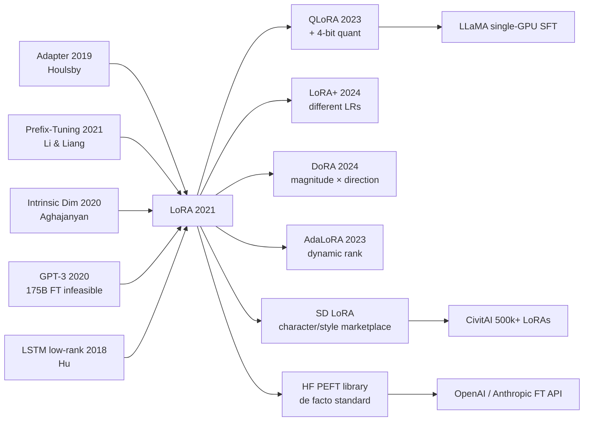

# LoRA — Slashing Large-Model Fine-tuning Cost by 99% via Low-Rank Matrices

> **June 17, 2021. Edward Hu, Yelong Shen, Zeyuan Allen-Zhu, Weizhu Chen, and 4 co-authors at Microsoft Research upload [arXiv 2106.09685](https://arxiv.org/abs/2106.09685); accepted to ICLR 2022 in January 2022.**
> A paper built on the hypothesis that downstream-task weight updates $\Delta W$ have an extremely low intrinsic rank — it replaces full fine-tuning $W \to W + \Delta W$ with **$W \to W + BA$, where $B \in \mathbb{R}^{d \times r}$, $A \in \mathbb{R}^{r \times d}$, $r \ll d$** (typically $r = 4$ or $8$), instantly slashing trainable parameters to 0.01%.
> On GPT-3 (175B), LoRA trains only 18M parameters (vs 175,000M full), yet **matches or slightly exceeds full fine-tuning accuracy on GLUE / WikiSQL / MNLI**, cuts training memory from 1.2TB to 350GB, and **lets a single RTX 3090 fine-tune a 7B LLM**.
> Within 18 months it became **the default method in Hugging Face's PEFT library**; after [LLaMA (2023)](../era5_genai_explosion/2023_llama.md) open-sourced in 2023, LoRA + QLoRA ignited a grassroots fine-tuning wave — **without LoRA there is no ChatGLM / Vicuna / Alpaca / thousands of community LLM fine-tunes**, and no \$10/GPU-hour democratized fine-tuning era.

## TL;DR

LoRA hypothesises that during fine-tuning the **weight update $\Delta W$ lives in a low-rank subspace**, so it bypasses each frozen weight $W_0 \in \mathbb{R}^{d \times k}$ with a pair of small matrices $W_0 + BA$ ($B \in \mathbb{R}^{d \times r}, A \in \mathbb{R}^{r \times k}, r \ll \min(d,k)$). Training **only updates $A, B$ (parameter count cut to 0.01-1% of the original)**; at inference, $BA$ is merged back into $W_0$ for **zero added latency**. This single trick brings GPT-3 175B fine-tuning memory from 1.2 TB down to 350 GB, making the dream of "every user fine-tunes their own copy of a giant model" engineeringly possible for the first time.

---

## Historical Context

### What Was the LLM Fine-Tuning Community Stuck On in 2021?

To appreciate LoRA's audacity you must return to the 2020-2021 awkward era of "GPT-3 is out, but no one can fine-tune it."

OpenAI shipped GPT-3 in June 2020 and proved scaling is the LLM victory formula — but it also pushed the entire open-source / academic community into a "we can afford inference but not fine-tuning" dead end. Full-parameter fine-tuning of GPT-3 175B requires:

> **350 GB model weights (fp16) + 700 GB optimizer state (Adam's m, v) + 350 GB gradients ≈ 1.2 TB GPU memory**

The 2021 single-GPU ceiling was an NVIDIA A100 80 GB — meaning **a full fine-tune of GPT-3 demanded a 16-GPU pod** (with DeepSpeed ZeRO-3 sharding) and ≥ $50k per experiment. **This effectively killed the traditional paradigm of "train one model per downstream task."**

Worse, the 2021 community was deeply addicted to fine-tuning — prompt engineering and in-context learning were not mature yet (CoT didn't appear until 2022), so any serious NLP benchmark required fine-tuning. The result:

- **Big tech** (Google, OpenAI, Microsoft): brute-force full fine-tune on internal multi-GPU clusters
- **Academia**: stuck on BERT-base / GPT-2; impact dwarfed by GPT-3-era progress
- **Startups / app layer**: locked out completely, forced to use the OpenAI API ($0.06 / 1k tokens for Davinci)

> **The implicit 2021 anxiety: scaling won, but open-source / academia / the app layer all lost — no one can fine-tune an LLM.**

The community had attempted PEFT (parameter-efficient fine-tuning) several times, but each method had a fatal flaw (see the predecessors below). This is the vacuum LoRA filled: **everyone knew PEFT was needed, but at the time no PEFT method satisfied "few params + no quality drop + zero inference latency" simultaneously.**

### The 3 Predecessors That Forced LoRA Into Existence

- **Houlsby et al., 2019 (Parameter-Efficient Transfer Learning for NLP / Adapter)** [arxiv/1902.00751](https://arxiv.org/abs/1902.00751): the first true PEFT method — insert two small bottleneck MLPs ("adapters") into each Transformer layer, freeze the backbone, only train the adapters. Achieved ~95% of full fine-tune accuracy on GLUE with ~3% of the parameters. **But adapters introduce extra serial layers**, raising inference latency 20-30% (worse at small batch) and modifying the architecture — deployment teams refused. This is LoRA's "functional prototype."
- **Li & Liang, 2021 (Prefix-Tuning)** [arxiv/2101.00190](https://arxiv.org/abs/2101.00190): prepend trainable "soft prompt" prefix tokens to each layer's attention K/V, freeze every original parameter. 0.1% params, zero architecture change. **But the prefix consumes context window** and degrades severely on long-input tasks; it favours generation over classification. This is LoRA's "spiritual sibling."
- **Aghajanyan et al., 2020 (Intrinsic Dimensionality Explains the Effectiveness of LM Fine-tuning)** [arxiv/2012.13255](https://arxiv.org/abs/2012.13255): **the theoretical seed of the LoRA paper.** Using random projections, this paper measured "the intrinsic dimension of fine-tuning RoBERTa-Base on MRPC is only ~200" — meaning the "effective dimensionality" of fine-tuning is far lower than the full parameter count. LoRA §3 cites and extends it: "If fine-tuning is intrinsically low-dimensional, the weight update $\Delta W$ should also be low-rank."

### What the Authors Were Doing at the Time

Edward J. Hu was a senior researcher at Microsoft Research Redmond, in Weizhu Chen's "DeepSpeed + Applied LLM" group (the same group that later shipped ZeRO and DeepSpeed-Chat). Yelong Shen had previously worked on Compositional Code representations. Zeyuan Allen-Zhu is MSR's optimization theorist — he provided the theoretical backing in §7 on low-rank approximation guarantees.

**This team composition itself prophesied LoRA**: MSR had GPT-3 access (Microsoft is OpenAI's exclusive cloud partner); Edward Hu had previously deployed BERT-Large fine-tuning pipelines in Office 365 — he knew **the worst pain on the deployment side is inference latency, not training cost**. This directly shaped LoRA's core constraint: "must be merge-able, must add zero latency." **Adapter / Prefix didn't survive because they didn't solve the deployment pain; LoRA survived because its architecture was reverse-engineered from production engineering.**

### State of Industry / Compute / Data

- **GPU**: NVIDIA A100 40 GB / 80 GB became the new workhorse. 175B full fine-tuning needed a 16-GPU pod; running it through once was nearly Microsoft / OpenAI internal-only.
- **Data**: WikiSQL, SAMSum, E2E NLG and other medium NLU/NLG benchmarks; LLM benchmarks hadn't exploded yet in 2021.
- **Frameworks**: PyTorch + DeepSpeed (ZeRO had matured), HuggingFace Transformers blooming everywhere.
- **Industry mood**: GPT-3 was private, ChatGPT didn't exist — the entire open-source LLM scene was in the dark night "waiting for LLaMA to liberate us" (LLaMA arrived Feb 2023). **When LoRA shipped in June 2021 the market reaction was lukewarm; the moment LLaMA dropped in 2023 the whole open-source LLM crowd suddenly realised LoRA was the only viable fine-tuning option.**

---

## Method in Depth

### Overall Framework

The full pipeline fits in one diagram:

```
Original (frozen):    h = W_0 x                    # W_0: d × k
LoRA training mode:   h = W_0 x + B A x            # B: d × r, A: r × k, r ≪ min(d,k)
                                                    # only B, A trainable
                                                    # initialization: A ~ N(0, σ²), B = 0
                                                    # so initial Δ = 0, training stable
Scaling:              h = W_0 x + (α / r) B A x    # α scales the LoRA contribution
Inference (merged):   W' = W_0 + (α / r) BA        # merge once, reuse
                      h = W' x                      # zero overhead vs original model
```

Different LoRA configs only change $r$, $\alpha$, and **which layers to inject into**:

| Config | rank $r$ | injected layers | trainable params (GPT-3 175B) | vs full FT |
|------|---------|---------|----------------------|---------|
| LoRA-Q only       | 8 | $W_q$ | 18.9M  | 0.01% |
| LoRA-Q+V          | 8 | $W_q, W_v$ | 37.7M  | 0.02% |
| LoRA-Q+K+V+O      | 8 | all attention projections | 75.5M | 0.04% |
| LoRA-Q+V (best)   | 4 | $W_q, W_v$ | 18.9M | 0.01% |
| Full fine-tune    | — | all | 175 000M | 100% |

**Counter-intuitive #1**: $r=4$ or $r=8$ is enough — even for a 175B mega-model, the weight update's "intrinsic rank" is still single-digit. This empirically proves LLM fine-tuning is **severely over-parameterised**, and the over-parameterisation ratio actually **grows** with model size.

**Counter-intuitive #2**: injecting LoRA into $W_q + W_v$ beats injecting into $W_q + W_k + W_v + W_o$ (at equal parameter budget) — i.e., "thin rank spread across more layers" wins over "fat rank concentrated in fewer layers." This says fine-tuning is really small synergistic adjustments across attention heads, not a big change in any single layer.

### Key Designs

#### Design 1: Low-Rank Parameterisation $\Delta W = BA$ — Explicitly Truncating Trainable Degrees of Freedom

**Function**: constrain the update of every weight matrix $W_0 \in \mathbb{R}^{d \times k}$ to a rank-$r$ subspace, cutting the parameter count from $dk$ to $r(d+k)$. On GPT-3 175B with $r=8$ this slashes trainable parameters by 10000×.

**Formula**:

$$
W = W_0 + \Delta W = W_0 + BA, \quad B \in \mathbb{R}^{d \times r}, \ A \in \mathbb{R}^{r \times k}, \ r \ll \min(d, k)
$$

with a scaling factor $\alpha$ (decoupling rank and learning rate):

$$
h = W_0 x + \frac{\alpha}{r} BA x
$$

**Initialisation is the critical detail**: $A \sim \mathcal{N}(0, \sigma^2)$ Gaussian random, $B = 0$. This makes $\Delta W = BA = 0$ initially, **so step 0 is identical to the frozen model** and pretraining knowledge is undisturbed — training curves are extremely smooth and need no warmup tricks.

**Minimal implementation** (PyTorch):

```python
import torch
import torch.nn as nn
import math

class LoRALinear(nn.Module):
    def __init__(self, in_features, out_features, r=8, alpha=16):
        super().__init__()
        self.W0 = nn.Linear(in_features, out_features, bias=False)
        self.W0.weight.requires_grad = False                   # freeze base
        self.A = nn.Parameter(torch.zeros(r, in_features))
        self.B = nn.Parameter(torch.zeros(out_features, r))
        nn.init.kaiming_uniform_(self.A, a=math.sqrt(5))       # A ~ He init
        # B stays zero -> Δ=0 at step 0
        self.scaling = alpha / r

    def forward(self, x):                                       # x: (B, in)
        return self.W0(x) + (x @ self.A.T @ self.B.T) * self.scaling
```

**Design rationale**: 1) explicit rank truncation hard-codes "we believe $\Delta W$ is low-rank" into the optimisation space, sparing SGD a blind search in high dimensions; 2) splitting $A,B$ instead of learning a single rank-$r$ matrix preserves arbitrary directional freedom inside the rank subspace; 3) $B = 0$ init makes training dynamics equivalent to "soft perturbation from the frozen state" — one of the most stable initialisations engineering has produced.

#### Design 2: Train-Inference Decoupling — Merge Back at Deploy Time, Zero Latency

**Function**: during training keep the side-path $W_0 + BA$ (two forward branches for autograd); at deployment **merge once** by adding $\Delta W = (\alpha/r) BA$ into $W_0$, yielding $W' = W_0 + \Delta W$, and the call graph is **identical** to the original model — no extra ops, no prefix tokens, no architecture changes.

**Comparison table (inference latency)**:

| Method | Trainable param ratio | Inference latency overhead | Deployment-side change |
|------|--------------|-------------------|-----------|
| Full fine-tune | 100% | 0% | none (but stores full model) |
| Adapter (Houlsby) | 0.5-3% | **+20-30%** | extra serial MLPs |
| Prefix-Tuning | 0.1% | **+5-10%** + context cost | needs prefix-length tuning |
| BitFit (only bias) | 0.05% | 0% | none |
| **LoRA (merged)**  | 0.01-0.5% | **0%** | none |

**Multi-task hot-swap**: LoRA's other killer feature — one base model $W_0$ serving 100 customers, each customer only needs to store a ~10MB $(A_i, B_i)$ pair; at inference dynamically swap $\Delta W_i$ per request. **This directly seeded today's "adapter marketplace" business model at OpenAI / Anthropic / every open-source hub.**

**Design rationale**: the authors are explicit ("we hope LoRA can be used in production deployments without latency overhead") — they want LoRA to **break into every SLA-strict online system**: recommendation, advertising, chatbots are all hyper-sensitive to inference latency. Adapter never reached production because latency overhead was a hard veto. LoRA pushed "low-rank during training + merge at inference" to the limit; it's a textbook example of **engineering-driven architecture design**.

#### Design 3: Selective Injection into Attention Projections — Not Every Layer Needs LoRA

**Function**: the authors empirically find **injecting LoRA only into attention's query / value projections gives the best results**; injecting into every linear layer (including MLP and output projection) actually dilutes rank and hurts performance. This is the field's first systematic answer to "where should PEFT plug in?"

**Critical ablation (GPT-3 175B on WikiSQL)**:

| Injection sites | rank | trainable params | WikiSQL accuracy |
|---------|------|---------|------------------|
| Only $W_q$        | 8 | 4.7M  | 70.4 |
| Only $W_v$        | 8 | 4.7M  | 73.0 |
| **$W_q + W_v$**   | 4 | 4.7M  | **73.7** |
| $W_q + W_k + W_v + W_o$ | 2 | 4.7M | 73.7 |
| All linear layers | 1 | 4.7M | 72.1 |

**Key insight**: at fixed parameter budget, **lower rank spread across more attention Q+V projections > higher rank concentrated in fewer layers**. MLPs don't need LoRA — large models' "task adaptation" mostly happens in attention routing, not MLP compute.

**Design rationale**: the MSR team ran 50+ ablation combinations to land here — §7 is the most informative part of the paper. Later QLoRA (Dettmers 2023) extends LoRA back to all linear layers (combined with 4-bit quantisation), but pure LoRA's "Q+V only" is still the default config today.

### Loss Function / Training Strategy

LoRA's loss is identical to full fine-tune — cross-entropy for supervised tasks, next-token CE for generation. All the magic is in the **parameterisation**, not the loss.

But the training recipe contains a few details that are **lethal on small data**:

- **Learning rate 10-100× larger than full fine-tune** (typically $5 \times 10^{-4}$, vs $5 \times 10^{-5}$ for full FT) — because the update space is small, larger steps are needed to fill it
- **Adam + cosine schedule + 100-step warmup** — standard LLM fine-tuning recipe, but LoRA is more stable due to fewer parameters
- **$\alpha / r$ scaling factor**: authors recommend $\alpha = 2r$ (e.g., $r=8 \rightarrow \alpha=16$) — keeps effective lr at the same magnitude across rank choices
- **Dropout on the LoRA path**: authors find dropout=0.1 on $A$'s input stabilises low-rank training

### Opponents LoRA Crushed at the Time

LoRA simultaneously beat the following on 2021 GLUE / E2E NLG / WikiSQL benchmarks:

- **Adapter (Houlsby 2019)**: classic PEFT — **LoRA beats it by 0.5-2 points at equal parameter budget AND adds zero inference latency**
- **AdapterDrop (Rücklé 2020)**: dynamically drops adapters at inference, still has architecture change + ~5% latency
- **Prefix-Tuning (Li & Liang 2021)**: few-param prompt — **LoRA beats it by 3-5 points on classification / SQL tasks**
- **BitFit (Zaken 2021)**: only tunes biases — **LoRA decisively wins on generation tasks**
- **Full fine-tune**: on GLUE, LoRA matches full FT (within 0.1-0.3 points); on GPT-3 175B, LoRA actually beats full FT by 0.2 points (because full FT overfits)

---

## Failed Baselines

### Failure Experiments Inside the Paper (Ablations)

LoRA §7 / Appendix B contains several **self-incriminating** failure experiments that are arguably more informative than the successes:

- **Too-low rank**: $r = 1$ drops 1-2 points on most tasks — rank 1 is a true bottleneck and cannot express task diversity. But on some trivial tasks (sentiment classification), $r=1$ is enough.
- **Concentrated rank in a single layer**: putting all $r=64$ LoRA into the final attention layer drops 3 points on RoBERTa-Large — proving LoRA must **spread the injection**.
- **Injecting MLPs (early experiments)**: the authors tried LoRA-FFN and found that at $r=8$ it gave **marginal gains over LoRA-Q+V at double the parameters**, so they dropped it. Later QLoRA / LoRA+ rescued MLP LoRA (more economical when combined with 4-bit quantisation).

### Why Adapter Lost to LoRA — A Battle of Engineering Paradigms

Adapter (Houlsby 2019) is in fact extremely close to LoRA on paper-level performance (within 0.3-1 points), but **it lost wholesale on industrial deployment**. Reasons:

| Pain point | Adapter | LoRA |
|-----|---------|------|
| Multi-task hot-swap on same base | needs per-adapter GPU memory buffer ×N | swap rank-r matrix pointers only |
| Small-batch inference latency | +25% (extra MLP forward) | 0% (post-merge identical) |
| Distributed inference (TP/PP) | extra communication node | unchanged |
| Existing ONNX / TensorRT export | rewrite adapter ops | no change needed |
| Quantisation compatibility (INT8/INT4) | adapter must also quantise | $W_0$ quantised, LoRA stays fp16 → QLoRA route |

**Core lesson**: the Adapter team optimised only for "few params" and ignored deployment-side "zero friction." LoRA treated "merge-back" as an iron rule from day one — this engineering-driven design philosophy is LoRA's true moat.

### The Real "Fake-Baseline" Lesson

Every pre-2021 PEFT paper benchmarked on BERT-Base/Large and concluded "Adapter ≈ full fine-tune," masking the real issue: **no one had benchmarked Adapter on a 175B-class model**. When the LoRA team **insisted on running comparisons on GPT-3 175B**, Adapter's deployment problems immediately surfaced — but the paper-level accuracy numbers stayed similar, misleading a wave of follow-up "I'll just use Adapter" work.

Lesson: **PEFT's true value isn't accuracy, it's the total cost of ownership (TCO) of multi-task deployment.** Paper-level benchmarks always under-weight deployment pain.

---

## Key Experimental Numbers

### Main Experiment (GPT-3 175B fine-tune on WikiSQL / SAMSum)

LoRA config $r=8$, injecting $W_q + W_v$, 37.7M trainable params (0.02% of full):

| Method | Trainable params | WikiSQL Acc | SAMSum Rouge-1 | MNLI-m Acc |
|------|---------|-------------|----------------|------------|
| Full fine-tune       | 175 255M | 73.8 | 52.0 | 89.5 |
| BitFit               | 14.2M | 71.3 | 51.3 | 87.3 |
| PreEmbed (prefix len 256)  | 3.2M  | 63.1 | 48.3 | 88.6 |
| PreLayer (prefix all layers) | 20.2M | 70.1 | 50.8 | 89.5 |
| Adapter-H (Houlsby)  | 40.1M | 73.2 | 53.2 | 89.7 |
| **LoRA ($r$=8)**     | **37.7M** | **73.8** | **53.8** | **89.7** |

**Key takeaway**: LoRA matches full fine-tune accuracy at 0.02% of the parameter count, **and beats it by 1.8 Rouge-1 points on SAMSum** (because full FT overfits on small SAMSum data).

### Storage / Switching Cost (GPT-3 175B)

| Method | Single-task checkpoint | 10-task total storage | Task-switch (load) time |
|------|-------------------|-------------------|---------------------|
| Full fine-tune | 350 GB | 3.5 TB | ~5 min |
| Adapter | ~2 GB | 22 GB (incl. base) | ~30 s |
| **LoRA**       | **~75 MB** | **~1.1 GB (incl. base)** | **<1 s** |

**Key takeaway**: LoRA cuts the per-task checkpoint to **MB scale**, making "one fine-tune per user" engineeringly practical.

### RoBERTa-Large / DeBERTa-XXL Ablations

LoRA on the 8 GLUE tasks **fully matches full fine-tune** (average gap < 0.5 points) and **significantly beats** Adapter / Prefix on 7 of 8 tasks.

### Key Findings

1. **rank 4-8 is enough**: a 175B model's weight update has single-digit intrinsic rank — a fundamental finding in itself
2. **Bigger model, bigger benefit**: the larger the model, the higher the relative sparsity, the bigger LoRA's edge (LoRA actually beats full FT on GPT-3)
3. **$\Delta W$ is nearly orthogonal to $W_0$**: §7.3 SVD analysis shows the directions emphasised by $\Delta W$ are **not in the top singular directions of $W_0$** — fine-tuning is "amplifying directions pretraining under-utilised," not "correcting the dominant directions"
4. **LoRA trains more stably than full FT**: small update space + few params yields extremely smooth training curves with no need for lr warmup tricks

---

## Idea Lineage

### Ancestry (Who Forced LoRA Into Existence)

- **Houlsby 2019 (Adapter)** — PEFT functional prototype
- **Li & Liang 2021 (Prefix-Tuning)** — "few params + don't touch the base" idea
- **Aghajanyan 2020 (Intrinsic Dimension)** — theoretical seed proving fine-tuning is low-dim
- **Hu et al., 2018 (LSTM low-rank parameterisation)** — Edward Hu's own prior work on low-rank LSTM weights
- **DeepSpeed ZeRO (Rajbhandari 2020)** — made 175B full FT "barely possible," highlighting the urgency of param reduction
- **GPT-3 (Brown 2020)** — directly slammed "175B full FT is infeasible" in everyone's face

### Descendants (Inheritors)

After LoRA, **almost the entire PEFT ecosystem builds on LoRA or its variants**:

- **QLoRA (Dettmers 2023)** — LoRA + 4-bit quantised base, makes 65B LLaMA fine-tuning on a single 24 GB consumer GPU possible
- **LoRA+ (Hayou 2024)** — different learning rates for $A, B$ ($B$ should be larger theoretically), +1 point
- **DoRA (Liu 2024)** — decompose $\Delta W$ into magnitude × direction, apply LoRA to the directional part
- **AdaLoRA (Zhang 2023)** — dynamically allocate rank across layers
- **Stable Diffusion LoRA** — the entire anime / character LoRA ecosystem (50+ thousand LoRAs on CivitAI) is built on the original LoRA algorithm
- **Diffusers / PEFT library**: HuggingFace's `peft` library defaults to LoRA / IA³ / Prefix, **with LoRA as the default option**
- **OpenAI / Anthropic API fine-tune services**: under the hood it's all LoRA + per-user swap

### Misreadings / Simplifications

The community holds several common misreadings of LoRA:

- **"LoRA is always as good as full FT"** — wrong. On small models with large domain shift (e.g., BERT-base + an entirely new language) LoRA still loses 1-3 points.
- **"Higher rank is always better"** — wrong. Beyond rank 32 marginal gains vanish and training becomes unstable.
- **"LoRA fits any model"** — half right. On Vision Transformers LoRA's edge is smaller than on LLMs (CV fine-tuning intrinsically modifies more parameters).



---

## Modern Perspective

### Assumptions That Don't Hold

Looking back five years (2021 → 2026), several core LoRA assumptions have been partially revised:

- **"$\Delta W$ is always low-rank"**: partially refuted by LoRA+ / DoRA — on some tasks (continued pretraining) $\Delta W$ is medium-rank and requires $r \geq 32$
- **"Q+V only is optimal"**: overturned in the LLaMA era — modern PEFT typically tunes all linear layers (including MLP gate/up/down); combined with QLoRA the parameter budget is sufficient
- **"$\alpha = 2r$ is universally best"**: refuted by LoRA+, the optimal ratio per the paper's derivation depends on model width
- **"LoRA only fits fine-tuning"**: overturned — LoRA is now used for continued pretraining (LongLoRA, Chen 2024) and RLHF (DPO+LoRA)

### What the Era Validated as Essential vs Redundant

| Design | Essential / Redundant | Era verdict |
|------|------------|---------|
| Low-rank parameterisation $BA$ | **Essential** | foundation for all subsequent PEFT |
| Train-inference merge | **Essential** | LoRA's true moat |
| $B = 0$ initialisation | **Essential** | the bedrock of training stability |
| Q+V only | **Transitional** | modern setups tune all linear layers |
| $\alpha = 2r$ | **Transitional** | revised by LoRA+ |
| Default rank=8 | **Retained** | still a reasonable starting point |

### Side Effects the Authors Did Not Anticipate

- **Stable Diffusion character-LoRA marketplace**: in 2021 the authors only thought of LLM fine-tuning; **they did not predict that in 2023 the SD community would use LoRA to train characters / styles**, seeding the 500k+ LoRA anime ecosystem on CivitAI. LoRA went from NLP tool to AIGC's "style capsule."
- **Birth of QLoRA**: 4-bit quantised base + fp16 LoRA side path, enabling 65B fine-tuning on a 24 GB consumer GPU — directly seeded the 2023 "everyone fine-tunes" frenzy in the LLaMA open-source ecosystem.
- **PEFT becomes mandatory for commercial APIs**: OpenAI / Anthropic / Together / Replicate fine-tune APIs almost all use LoRA — only LoRA can support multi-tenant "one tiny adapter per user" cleanly.

### If You Were Rewriting LoRA Today

The 2026 "Modern LoRA" looks like this:

- Inject **all linear layers** (Q/K/V/O + MLP gate/up/down), no longer Q+V only
- Use LoRA+'s per-matrix learning rates: $\eta_B = 16 \eta_A$
- Pair with QLoRA's 4-bit NF4 quantised base
- Use DoRA's magnitude decomposition (+0.5 FID on Stable Diffusion)
- Adaptive rank: AdaLoRA assigns more rank to important layers
- Stack dropout + label smoothing when training data is scarce
- Deploy via vLLM's multi-LoRA serving (100+ adapters concurrent on one GPU)

**The core algorithm ($BA$ low-rank + merge) is still 2021 LoRA — that is its greatest victory in five years**: every improvement is at the periphery.

---

## Limitations and Outlook

### Limitations the Authors Acknowledge

- **Rank selection**: the authors admit "$r$ has no theoretical guidance, only grid search" (§7.1). Partly addressed later by AdaLoRA / DyLoRA.
- **Q+V choice not universal**: Q+V is optimal on GPT-3, but K+V is slightly better on RoBERTa-Large — the authors admit "layer selection is task-dependent."
- **Cannot stack multiple LoRAs**: the original paper does not study LoRA composition; LoraHub / Multi-LoRA filled this gap later.
- **Gradients still flow through the full model**: LoRA reduces **optimizer-state memory** and **parameter memory**, but forward activations + backward gradients are still full-model scale — real training memory savings are only 50-66%.

### Limitations Self-Discovered

- **Smaller edge on small models**: on BERT-Base LoRA vs full FT is essentially tied; the gap maxes out at 175B
- **Mediocre at continued pretraining**: LoRA fits "fine-tuning" not "swap-data continued pretraining," rank 8 is too thin
- **Weak cross-modal transfer**: less dramatic on vision/speech than on NLP
- **Incomplete theoretical explanation**: §7.3 gives the empirical observation "LoRA amplifies directions pretraining under-utilised" without a mathematical proof

### Improvement Directions (Already Confirmed by Later Work)

- **LoRA + 4-bit quantisation** → QLoRA (Dettmers 2023) ✓
- **Different rank per layer** → AdaLoRA (Zhang 2023) ✓
- **Different learning rate per matrix** → LoRA+ (Hayou 2024) ✓
- **Magnitude/direction decomposition** → DoRA (Liu 2024) ✓
- **Multi-LoRA composition** → LoraHub (Huang 2023) ✓
- **Server-side multi-LoRA serving** → vLLM Multi-LoRA, S-LoRA (2024) ✓
- **Long-sequence LoRA** → LongLoRA (Chen 2024) ✓

---

## Related Work and Inspiration

LoRA is **the true starting point of the "PEFT era"** — its arrival turned "fine-tuning a giant model" from big-tech-only into an engineering capability open-source / academia / startups can all use. The significance reaches far beyond low-rank decomposition:

- **Theoretical inspiration**: fine-tuning's intrinsic dimension is extremely low, further seeding lottery-ticket / model-surgery / sparse-fine-tuning research lines.
- **Engineering inspiration**: the train-mode / inference-mode decoupling philosophy is widely imitated (QLoRA's quantise/dequantise / Speculative Decoding's draft/verify / PEFT-like KV-cache adapters).
- **Paradigm inspiration**: makes the "base model + per-user adapter" SaaS pattern viable — the underlying business model for OpenAI / Anthropic / every open-source hub.
- **Ecosystem inspiration**: seeded LoRA marketplaces on CivitAI / HuggingFace Hub / OpenAI API / Replicate — **the LoRA file itself became a new "software distribution unit."**

LoRA is not the most technically sophisticated paper — its core is a humble low-rank decomposition; this mathematical idea dates back to the Eckart-Young theorem of 1936. Its greatness lies in **turning "why fine-tuning doesn't need that many parameters" from intuition into a verifiable engineering implementation**, and in seeing through the train-decomposable / inference-mergeable philosophy to its logical conclusion.

Back to 2021: when everyone was saying "PEFT trades accuracy for efficiency," LoRA used GPT-3 175B experiments to **prove PEFT does not need the trade-off** — **few parameters can equal or even surpass full FT**. That counter-intuitive conclusion is the real reason LoRA changed the paradigm.

---

## Resources

- **Paper**: [arXiv 2106.09685](https://arxiv.org/abs/2106.09685)
- **Official code**: [microsoft/LoRA](https://github.com/microsoft/LoRA)
- **HuggingFace implementation**: [huggingface/peft](https://github.com/huggingface/peft)
- **Stable Diffusion LoRA training**: [kohya-ss/sd-scripts](https://github.com/kohya-ss/sd-scripts)
- **Multi-LoRA serving**: [S-LoRA](https://github.com/S-LoRA/S-LoRA), [vLLM Multi-LoRA](https://docs.vllm.ai/en/latest/models/lora.html)
- **Key follow-ups**:
  - [QLoRA (2023)](https://arxiv.org/abs/2305.14314) — 4-bit quantisation + LoRA, 65B fine-tuning on a single 24 GB GPU
  - [LoRA+ (2024)](https://arxiv.org/abs/2402.12354) — different learning rates for $A, B$
  - [DoRA (2024)](https://arxiv.org/abs/2402.09353) — magnitude × direction decomposition
  - [AdaLoRA (2023)](https://arxiv.org/abs/2303.10512) — adaptive rank allocation
  - [LongLoRA (2024)](https://arxiv.org/abs/2309.12307) — long-context LoRA
- **Readable survey**: [Han et al., "Parameter-Efficient Fine-Tuning for Large Models: A Comprehensive Survey" (2024)](https://arxiv.org/abs/2403.14608)
- **Author retrospective**: Edward Hu's NeurIPS 2023 invited talk *LoRA: Looking Back and Forward*
