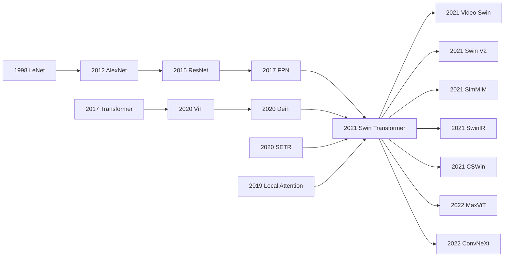

# Swin Transformer - Turning ViT into a General-Purpose Vision Backbone with Shifted Windows

> **On March 25, 2021, Ze Liu, Yutong Lin, Yue Cao, Han Hu, and four co-authors uploaded [arXiv:2103.14030](https://arxiv.org/abs/2103.14030); later that year, the paper won the ICCV 2021 Marr Prize.** The surprising move was not simply "Transformers beat CNNs." Swin Transformer won by putting several CNN-like biases back into the Transformer: hierarchy, locality, translation-aware relative position, and feature maps that downstream detectors could actually consume. A small shifted-window trick turned ViT from a single-scale ImageNet classifier into a drop-in replacement for ResNet/FPN backbones, reaching 87.3 top-1 on ImageNet, 58.7 box AP / 51.1 mask AP on COCO, and 53.5 mIoU on ADE20K. In hindsight, Swin was the interface adapter that let vision Transformers enter dense prediction and production model zoos.

## TL;DR

Liu, Lin, Cao, Hu, and four co-authors published Swin Transformer at ICCV 2021 as a practical answer to a problem left open by ViT (2020): how can a Transformer become a general-purpose visual backbone rather than a single-scale ImageNet classifier? Swin builds a four-stage patch-merging pyramid and replaces global self-attention, $\Omega(\text{MSA})=4hwC^2+2(hw)^2C$, with fixed-window attention, $\Omega(\text{W-MSA})=4hwC^2+2M^2hwC$, then shifts the window partition in alternating blocks so neighboring windows exchange information without paying sliding-window memory cost. The failed baselines are concrete: DeiT-S needs extra deconvolution layers to fit Cascade Mask R-CNN and reaches only 48.0 box AP / 41.4 mask AP, while Swin-T reaches 50.5 / 43.7 at comparable scale; the non-shifted window variant falls from 50.5 / 43.7 to 47.7 / 41.5. The largest system reports 87.3 ImageNet top-1, 58.7 COCO box AP / 51.1 mask AP, and 53.5 ADE20K mIoU. Its long-term impact was to make "Transformer as backbone" a default assumption for detection, segmentation, video, medical imaging, and image restoration. The hidden lesson is almost anti-triumphalist: Swin did not prove that CNN inductive biases were obsolete. It proved that a Transformer had to relearn scale, locality, translation-aware position, and hardware-friendly memory access before it could replace CNNs in real visual systems.

---

## Historical Context

### 2020: Transformers had won NLP, but had not yet taken over vision

By 2020 it was no longer plausible to describe the Transformer as just an NLP module. From the 2017 Transformer to BERT in 2018 and GPT-3 in 2020, language modeling had shown a new recipe: if tokenization is reasonable, the model scales, and the objective is simple, attention can absorb massive data and produce transfer behavior. Vision researchers naturally wanted the same thing, but the translation was not mechanical. Text tokens are discrete and sequence lengths are often manageable; image pixels are dense 2D grids, and object scale can range from a few pixels to the whole image. Global self-attention over every patch pair grows quadratically with token count, while detection and segmentation are exactly the tasks that demand high-resolution feature maps.

Early vision Transformers therefore succeeded under an implicit boundary: they were closer to image classifiers than to the backbone of a full visual system. ViT split an image into 16x16 patches, fed them to a standard Transformer, and achieved striking classification results at JFT-300M scale. DeiT showed that careful training could make ViT work on ImageNet-1K alone. But neither line answered the more industrial question: can one remove ResNet from Mask R-CNN, UPerNet, FPN, RetinaNet-style systems and plug in a Transformer without rewriting the entire visual stack? That is Swin Transformer's historical position. It was not the first paper to use a Transformer on images. It was the paper that convinced many CV engineers that a Transformer could be a general-purpose backbone.

### ViT and DeiT solved classification, not dense prediction

ViT's structure is beautifully clean: fixed patches, a single-scale token sequence, global attention, and a class token for classification. This is elegant on ImageNet, but it exposes an interface problem on COCO or ADE20K. Object detection needs features for objects at different scales; segmentation needs pixel-level prediction; FPN and U-Net-like modules expect feature maps at H/4, H/8, H/16, and H/32. ViT provides one low-resolution sequence. To attach it to detection, one must add deconvolution or reshaping layers to manufacture hierarchy; to process higher resolutions, global attention makes compute balloon.

The Swin paper states this problem sharply in experiments. DeiT-S must add deconvolution layers to connect to Cascade Mask R-CNN and reaches 48.0 box AP / 41.4 mask AP. Swin-T directly emits hierarchical features at comparable scale and reaches 50.5 / 43.7, with higher FPS. On ADE20K, DeiT-S with UPerNet gets 44.0 mIoU, while Swin-T gets 46.1 and Swin-S reaches 49.3. The failure is not "Transformers cannot recognize images." The failure is "a single-scale Transformer does not serve dense-vision interfaces." Swin's answer is deliberately engineering-minded: if downstream systems require a pyramid, the Transformer backbone should grow a pyramid itself.

### MSRA's angle: do not throw away every CNN bias

The authors came from Microsoft Research Asia, and that is more than a line in the affiliation field. MSRA had been deeply involved in the evolution of visual backbones, detection, segmentation, and engineering frameworks through the 2010s. The team understood that a backbone being "good" is not measured only by ImageNet top-1. If it cannot provide multi-scale features to detectors, cannot run at high resolution, and cannot be absorbed by existing recipes, then a pretty classification number will not replace CNNs in real pipelines.

This explains Swin's taste. On the surface it is a Transformer paper; structurally it is deeply CNN-like. Patch merging plays the role of pooling or stride. Local windows play the role of local receptive fields. The four stages resemble ResNet C2-C5. Relative position bias retains translation-aware spatial prior. Shifted windows act like an attention-based communication mechanism across local blocks. The paper does not treat CNN inductive bias as obsolete baggage. It translates those biases into a Transformer-compatible form. That "conservative radicalism" is why Swin could persuade both the Transformer community and the detection/segmentation engineering community in 2021.

### Why this paper won the Marr Prize

The ICCV 2021 Marr Prize did not merely reward a new attention trick. It rewarded a moment when a paradigm transition became operational: Transformers stopped being heroes of classification papers and became infrastructure for the visual task stack. The numbers in Swin's abstract are symbolic: 87.3 ImageNet-1K top-1, 58.7 COCO test-dev box AP / 51.1 mask AP, and 53.5 ADE20K mIoU. These cover classification, detection, instance segmentation, and semantic segmentation, which matters more than a single leaderboard win.

More importantly, Swin gave later vision papers a reusable language: local windows reduce complexity, hierarchy adapts to dense prediction, and a small cross-window mechanism restores information flow. That language spread quickly into Video Swin, SwinIR, Swin-Unet, SwinV2, CSWin, Focal Transformer, and MaxViT, while also provoking ConvNeXt to show that modernized CNNs could still compete. A paper that only wins tables often stops at the leaderboard. Swin gave the field a common interface to argue with, and that is the kind of influence a Marr Prize paper tends to have.

## Background and Motivation

### The three hard requirements of a visual backbone

A general-purpose visual backbone is not just a network that maximizes classification accuracy. It must satisfy at least three hard requirements. First, **multi-scale representation**: small objects, bodies, roads, sky, and text can all appear in the same image, so downstream tasks need semantic features at different resolutions. Second, **affordable high resolution**: detection and segmentation commonly use inputs with 800-1600 pixel sides, and full attention over all tokens is not acceptable. Third, **interface compatibility**: FPN, UPerNet, Mask R-CNN, Cascade Mask R-CNN, MMDetection, and MMSegmentation already form mature pipelines, so a backbone should ideally emit feature maps like a ResNet rather than require the entire downstream stack to be rewritten.

CNNs satisfy these requirements naturally, but pay for them with weak direct long-range modeling and a reliance on many local convolution layers to expand receptive field. A standard Transformer has global interaction by default, but is unfriendly to all three requirements. Swin's motivation is to find a practical point between these extremes: keep the expressive Transformer block, while reintroducing the scale, locality, pyramid structure, and memory-access patterns that real visual systems need.

### Swin's core problem definition

The Swin paper's real question can be written in one sentence: **can we build a Transformer backbone that emits hierarchical features like a CNN, scales linearly like local convolution, and still uses attention to model content-dependent relations?** This is not a purely theoretical question. It is an interface question. The model must classify on ImageNet, serve as a detector backbone on COCO, connect to UPerNet on ADE20K, and maintain acceptable throughput on V100 GPUs.

That problem definition explains why every Swin design is restrained. It does not introduce a complicated cross-modal module, a flashy token-pruning mechanism, or a fully global attention approximation. It does four things: patch partition, patch merging, window attention, and shifted windows. Each one maps to a clear failure mode. Patch partition turns pixels into tokens; patch merging solves multi-scale representation; window attention solves complexity; shifted windows solve window isolation. The design is not theatrical, but it is rare in a useful way: every component has a boundary and a job.

### It solved an interface problem, not one benchmark

Many papers tell the story "we improve dataset X by Y points." Swin certainly has strong numbers, but its deeper contribution is aligning Transformers with the engineering interface of vision. The four COCO framework experiments make this especially clear: Cascade Mask R-CNN, ATSS, RepPointsV2, and Sparse R-CNN all improve by +3.4 to +4.2 box AP when the backbone is swapped from ResNet-50 to Swin-T. That means Swin was not tuned for one detector head. It behaved like a genuinely replaceable base model.

This is why model libraries adopted Swin so quickly. A new backbone can have high academic value, but if it requires a new training pipeline, new augmentations, new detection heads, new mask heads, new losses, and new deployment kernels, diffusion is slow. Swin's victory was that it looked like a Transformer but behaved like a ResNet for users: give it an image, receive multi-scale features, attach FPN or UPerNet as before. This replaceability is an engineering virtue many revolutionary architectures lack.

### The paper's real bet

Swin's bet was not "window attention will be the final form of visual modeling." From the vantage point of 2026, that would be too narrow: large ViTs, ConvNeXt, CNN-Transformer hybrids, masked image modeling, and open-vocabulary VLMs all occupy their own ecological niches. Swin's real bet was different: for a vision Transformer to become infrastructure, it must redesign token scale and computation graph rather than copy the NLP Transformer unchanged.

That bet still holds. Whether today's system uses Swin, ViTDet, ConvNeXt, InternImage, Mamba-style vision blocks, or token mixers inside diffusion and VLMs, the underlying constraints remain: high-resolution images have too many tokens, object scale varies widely, downstream interfaces need hierarchical semantics, and hardware dislikes irregular memory access. Swin Transformer's historical value is that it compressed these constraints into one clean, trainable, replaceable backbone that could win the big tables.

---

## Method Deep Dive

### Overall framework: a four-stage pyramid Transformer

Swin Transformer is easiest to understand as "ResNet's four-level feature pyramid rewritten with Transformer blocks." The input image is first split into non-overlapping 4x4 patches. Each patch's RGB values are flattened into a 48-dimensional vector and projected into a C-dimensional token by a linear layer. The network then has four stages. Stage 1 keeps the H/4 x W/4 resolution. Stage 2, Stage 3, and Stage 4 use patch merging to reduce resolution to H/8, H/16, and H/32 while expanding channels from C to 2C, 4C, and 8C. Inside each stage, Swin Transformer blocks alternate regular window attention, W-MSA, and shifted-window attention, SW-MSA.

| Model | C | Block depths | Typical scale | ImageNet-1K top-1 |
|---|---:|---:|---:|---:|
| Swin-T | 96 | {2,2,6,2} | 29M / 4.5G | 81.3 |
| Swin-S | 96 | {2,2,18,2} | 50M / 8.7G | 83.0 |
| Swin-B | 128 | {2,2,18,2} | 88M / 15.4G | 83.5 |
| Swin-L | 192 | {2,2,18,2} | 197M / 103.9G at 384 | 87.3 with 22K pretrain |

The most important part of this design is not any single module. It is the output interface. Downstream systems built around CNN backbones expect C2/C3/C4/C5-style feature maps for FPN or decoders, and Swin provides the same resolutions. This is why it can naturally replace ResNet or ResNeXt. The detection and segmentation experiments repeatedly emphasize the same point: do not rewrite a Transformer for every task; first make the Transformer a competent backbone.

### Key design 1: Patch merging gives the Transformer an FPN interface

Patch merging is Swin's downsampling layer. Between stages, it concatenates features from each neighboring 2x2 group of tokens into a 4C-dimensional vector, then projects it to 2C with a linear layer. Token count falls by a factor of four, spatial resolution halves, and channels double, which is very close to stride-2 downsampling in a CNN.

$$
\mathbf{x}_{i,j}^{(s+1)} = W_m\,[\mathbf{x}_{2i,2j}^{(s)};\mathbf{x}_{2i+1,2j}^{(s)};\mathbf{x}_{2i,2j+1}^{(s)};\mathbf{x}_{2i+1,2j+1}^{(s)}], \quad W_m \in \mathbb{R}^{4C \times 2C}
$$

This step solves two ViT pain points. First, a single-scale token sequence is awkward for dense prediction; patch merging directly produces H/4, H/8, H/16, and H/32 outputs. Second, visual objects vary in scale; deeper tokens need larger receptive fields and denser semantics. Swin does not compensate for a single-scale representation with a complicated decoder. It makes scale emerge inside the backbone.

| Design choice | Output form | Effect on detection/segmentation | Cost |
|---|---|---|---|
| ViT single-scale sequence | one low-resolution token grid | needs deconvolution to attach FPN/UPerNet | many interface patches |
| CNN stride/pooling | C2-C5 feature maps | mature downstream ecosystem | weak direct long-range modeling |
| Swin patch merging | H/4 to H/32 token maps | drop-in ResNet backbone replacement | downsampling rule remains hand-designed |

### Key design 2: Window MSA turns quadratic attention back into linear scaling

Standard self-attention lets every token attend to every other token. If a feature map has h x w patches and channel dimension C, the token-token attention term grows with (hw)^2. Swin partitions the feature map into fixed M x M windows and computes self-attention only inside each window. M is 7 by default. Once window size is fixed, complexity grows linearly with image size.

$$
\Omega(\text{MSA}) = 4hwC^2 + 2(hw)^2C, \qquad \Omega(\text{W-MSA}) = 4hwC^2 + 2M^2hwC
$$

This formula is Swin's engineering ledger. The first term, 4hwC^2, comes from Q/K/V and output projections and is shared by both versions. The second term is where attention interactions differ. Global MSA compares every token pair. Window attention lets each token interact with only M^2 local neighbors. As long as M is fixed, compute grows linearly with h*w.

| Attention type | Interaction range | Scaling with image size | Hardware friendliness | Role in Swin |
|---|---|---|---|---|
| Global MSA | all image tokens | quadratic | large matrices, high memory | ViT baseline |
| Window MSA | fixed M x M local window | linear | batched windows parallelize well | Swin base operator |
| Sliding-window attention | one local neighborhood per query | linear but key sets differ | inefficient memory access | replaced by Swin |
| Shifted Window MSA | shifted fixed windows | linear | cyclic shift + mask | Swin key operator |

### Key design 3: Shifted windows let local windows talk to each other

Pure window attention isolates windows. Swin's solution is not to enlarge every window or insert global attention layers, but to shift the window partition by half a window in alternating blocks. Block l uses regular W-MSA. Block l+1 uses SW-MSA after a cyclic shift toward the upper-left. A window in the second block then covers regions that belonged to multiple windows in the previous block, allowing information to cross window boundaries.

$$
\begin{aligned}
\hat{\mathbf{z}}^{l} &= \text{W-MSA}(\text{LN}(\mathbf{z}^{l-1})) + \mathbf{z}^{l-1}, \\
\mathbf{z}^{l} &= \text{MLP}(\text{LN}(\hat{\mathbf{z}}^{l})) + \hat{\mathbf{z}}^{l}, \\
\hat{\mathbf{z}}^{l+1} &= \text{SW-MSA}(\text{LN}(\mathbf{z}^{l})) + \mathbf{z}^{l}, \\
\mathbf{z}^{l+1} &= \text{MLP}(\text{LN}(\hat{\mathbf{z}}^{l+1})) + \hat{\mathbf{z}}^{l+1}.
\end{aligned}
$$

The implementation trick is cyclic shift plus an attention mask. Directly shifting windows creates more boundary windows; the paper's simple example turns 2x2 windows into 3x3 windows, a 2.25x increase. Swin first cyclically shifts the feature map so the number of batched windows stays constant. Since a shifted batched window may contain sub-regions that are not adjacent in the original image, an attention mask prevents those sub-regions from attending to each other. The result is a compromise: cross-boundary communication like sliding windows, but batching efficiency like non-overlapping windows.

```python
def swin_block_pair(tokens, window_size=7, shift_size=3):
    x = tokens + window_msa(layer_norm(tokens), window_size)
    x = x + mlp(layer_norm(x))

    shifted = cyclic_shift(x, shifts=(-shift_size, -shift_size))
    shifted = shifted + masked_window_msa(layer_norm(shifted), window_size)
    shifted = shifted + mlp(layer_norm(shifted))
    return cyclic_shift(shifted, shifts=(shift_size, shift_size))
```

The ablation shows that this is not decorative. Without shifting, Swin-T gets 80.2 ImageNet top-1, 47.7 box AP / 41.5 mask AP on COCO, and 43.3 mIoU on ADE20K. With shifted windows, those become 81.3, 50.5 / 43.7, and 46.1. The largest gains appear in detection and segmentation, which is exactly where cross-window context propagation matters most.

### Key design 4: Relative position bias keeps a translation-aware visual prior

The original Transformer has no convolution-like translation structure. ViT usually adds absolute position embeddings to input tokens, but dense prediction cares more about relative spatial relations: how far apart two patches are and in what direction. Swin adds a 2D relative position bias to each attention head by injecting the bias into the QK similarity logits.

$$
\text{Attention}(Q,K,V)=\text{SoftMax}\left(\frac{QK^\top}{\sqrt{d}}+B\right)V, \quad B \in \mathbb{R}^{M^2 \times M^2}, \quad \hat{B}\in\mathbb{R}^{(2M-1)\times(2M-1)}
$$

The learned object is the smaller \(\hat{B}\), because the relative displacement between any two tokens in an M x M window lies within a two-dimensional range of \([-M+1,M-1]\). When fine-tuning with a different window size, the paper transfers this bias table with bicubic interpolation.

| Position scheme | ImageNet top-1 | COCO box/mask AP | ADE20K mIoU | Conclusion |
|---|---:|---:|---:|---|
| no pos. | 80.1 | 49.2 / 42.6 | 43.8 | unstable for classification and segmentation |
| abs. pos. | 80.5 | 49.0 / 42.4 | 43.2 | classification slightly improves, dense prediction drops |
| abs.+rel. pos. | 81.3 | 50.2 / 43.4 | 44.0 | stacking both is worse than relative only |
| rel. pos. | 81.3 | 50.5 / 43.7 | 46.1 | default, strongest for dense prediction |

The historical irony is important. ViT was often narrated as abandoning convolutional inductive bias, but Swin's dense-prediction ablations say the opposite: visual tasks still benefit from a translation-aware prior. Swin does not return to convolution kernels. It learns relative position bias in the attention logits. That does not negate Transformers; it teaches them to think spatially in a visual way.

---

## Failed Baselines

### Failure 1: treating ViT or DeiT as a dense-prediction backbone

ViT and DeiT gave Transformers confidence in vision classification, but they were not ready-made dense-prediction backbones. They emit a single-scale token grid and lack ResNet C2-C5-style multi-level features. For a fair comparison, the Swin paper adds deconvolution layers to DeiT-S so it can construct hierarchical features and connect to Cascade Mask R-CNN and UPerNet. That patch already shows that the baseline interface is unnatural.

The numbers are direct. Under Cascade Mask R-CNN on COCO, DeiT-S gets 48.0 box AP / 41.4 mask AP, while Swin-T gets 50.5 / 43.7 at comparable scale, with DeiT-S running at 10.4 FPS and Swin-T at 15.3 FPS. On ADE20K, DeiT-S with UPerNet gets 44.0 mIoU, while Swin-T gets 46.1. The failure is not that DeiT cannot classify images. The failure is that dense prediction is not one image and one label; it is a spatially aligned stack of feature maps.

### Failure 2: using window attention without shifting

Window attention solves complexity but creates "window islands." If every layer uses the same non-overlapping windows, tokens inside a window interact, while information across a boundary must wait for patch merging or much deeper layers. This may be tolerable for classification; it is much more harmful for detection and segmentation, where boundaries, context, and cross-region relations matter directly.

Swin's ablation quantifies the failure. Without shifting, Swin-T gets 80.2 ImageNet top-1, 47.7 box AP / 41.5 mask AP on COCO, and 43.3 mIoU on ADE20K. With shifted windows, the same metrics become 81.3, 50.5 / 43.7, and 46.1. The classification gain is only +1.1, but COCO box AP rises +2.8 and ADE20K rises +2.8. That difference shows the real value of shifted windows: not just another point on ImageNet, but making local attention useful for spatially dense tasks.

### Failure 3: the gap between sliding-window elegance and hardware reality

Sliding-window attention looks like the natural local-attention design: every query attends to its local neighborhood, much like convolution. The problem is that attention is not convolution. Convolution shares kernel weights at all positions and is heavily optimized by hardware libraries. Sliding-window attention gives each query a different key set, making memory access and batching less efficient. The Swin paper cites Stand-Alone Self-Attention and Local Relation Networks as this earlier line and explicitly notes their real latency weakness.

Swin's shifted window is an engineering answer to that failure. It does not give each query a distinct neighborhood. It keeps the batched form of non-overlapping windows, then uses cyclic shift plus masking to simulate cross-window connectivity. The paper reports that shifted-window architectures are 4.1/1.5, 4.0/1.5, and 3.6/1.5 times faster than sliding-window variants for Swin-T/S/B under naive/kernel implementation comparisons, while keeping similar accuracy. The lesson is worth remembering: a useful algorithm is not measured only by FLOPs. Memory access pattern matters.

### Failure 4: position encoding recipes that do not transfer from classification to dense prediction

ViT usually uses absolute position embedding, but that recipe is unstable for dense prediction. Absolute position tells the model where a patch is in the image. Relative position tells the model how far apart two patches are and in which direction. Detection and segmentation often need the latter, especially when attention is computed inside local 2D windows.

Swin's position ablation is instructive. Without position encoding, Swin-T gets 80.1 top-1, 49.2 / 42.6 AP, and 43.8 mIoU. Absolute position embedding gives 80.5, 49.0 / 42.4, and 43.2. Relative position bias gives 81.3, 50.5 / 43.7, and 46.1. Absolute position slightly helps classification but hurts COCO and ADE20K. The failure shows that a positional recipe that works for classification does not necessarily transfer to dense prediction; a vision backbone needs a more relative geometric prior.

| Failed route | Why it looked plausible | Evidence in the paper | Swin's correction |
|---|---|---|---|
| Direct DeiT backbone | strong classifier, simple structure | COCO 48.0 / 41.4, ADE20K 44.0 | four-stage hierarchy |
| Fixed windows only | linear complexity | no shift gives COCO 47.7 / 41.5, ADE20K 43.3 | alternating shifted windows |
| Sliding-window attention | natural local interaction | much worse real latency | non-overlap windows + cyclic shift |
| Absolute position | mature ViT classification recipe | dense prediction worse than relative bias | 2D relative position bias |
| Pure CNN backbone | mature engineering ecosystem | lower AP/mIoU under matched frameworks | CNN interface + attention expression |

## Key Experimental Data

### ImageNet-1K / 22K: beating DeiT and ViT at comparable complexity

The ImageNet experiments first show that Swin did not trade away classification ability for detection and segmentation. Under regular ImageNet-1K training, Swin-T reaches 81.3 top-1 with 29M parameters and 4.5G FLOPs, 1.5 points above the similarly sized DeiT-S. Swin-B reaches 83.5 at 224 resolution, 1.7 points above DeiT-B at 81.8; at 384 resolution it reaches 84.5, 1.4 points above DeiT-B at 83.1. With ImageNet-22K pretraining, Swin-B at 384 reaches 86.4 and Swin-L reaches 87.3.

| Model | Pretrain | Resolution | Params/FLOPs | top-1 |
|---|---|---:|---:|---:|
| DeiT-S | ImageNet-1K | 224 | 22M / 4.6G | 79.8 |
| Swin-T | ImageNet-1K | 224 | 29M / 4.5G | 81.3 |
| DeiT-B | ImageNet-1K | 224 | 86M / 17.5G | 81.8 |
| Swin-B | ImageNet-1K | 224 | 88M / 15.4G | 83.5 |
| ViT-B/16 | ImageNet-22K | 384 | 86M / 55.4G | 84.0 |
| Swin-B | ImageNet-22K | 384 | 88M / 47.0G | 86.4 |

### COCO: swapping the backbone improves four detector frameworks

The strength of the COCO section is not one detector head. It is that four different frameworks improve. Cascade Mask R-CNN, ATSS, RepPointsV2, and Sparse R-CNN keep the same training settings and replace only the ResNet-50 backbone with Swin-T. Each gets +3.4 to +4.2 box AP. This shows that the gain comes from the backbone representation rather than one detector-specific tuning choice.

| Framework | ResNet-50 box AP | Swin-T box AP | Gain | Note |
|---|---:|---:|---:|---|
| Cascade Mask R-CNN | 46.3 | 50.5 | +4.2 | same 3x schedule |
| ATSS | 43.5 | 47.2 | +3.7 | same multi-scale training |
| RepPointsV2 | 46.5 | 50.0 | +3.5 | same AdamW setup |
| Sparse R-CNN | 44.5 | 47.9 | +3.4 | backbone swap only |
| HTC++ test-dev | 56.0 previous box AP | 58.7 Swin-L | +2.7 | system-level SOTA |

### ADE20K: hierarchy lets Transformers truly enter semantic segmentation

Semantic segmentation depends even more on spatial detail and multi-scale context than detection. ADE20K shows that Swin combines naturally with UPerNet. Swin-T reaches 46.1 mIoU, Swin-S 49.3, ImageNet-22K-pretrained Swin-B 51.6, and Swin-L 53.5. Compared with the previous strong transformer segmentation baseline, SETR at 50.3, Swin-L is higher by 3.2.

| Method | Backbone | Pretrain | ADE20K val mIoU | Note |
|---|---|---|---:|---|
| UPerNet | ResNet-101 | ImageNet | 44.9 | CNN baseline |
| UPerNet | DeiT-S | ImageNet-1K | 44.0 | needs deconv interface patch |
| UPerNet | Swin-T | ImageNet-1K | 46.1 | same UPerNet framework |
| UPerNet | Swin-S | ImageNet-1K | 49.3 | no 22K pretrain |
| SETR | T-Large | ImageNet-22K | 50.3 | previous SOTA |
| UPerNet | Swin-L | ImageNet-22K | 53.5 | +3.2 over SETR |

### Ablation: the most convincing evidence is not the top score

The top score shows that the system is strong; ablation explains why. Swin's key ablations all point to the same conclusion: a vision Transformer backbone cannot live on the word "attention" alone. It needs cross-window communication, relative position bias, and hardware-friendly local computation. The shifted-window and relative-bias gains are larger on COCO and ADE20K than on ImageNet, showing that these designs serve the structural needs of dense prediction.

| Ablation | ImageNet top-1 | COCO box/mask AP | ADE20K mIoU | Reading |
|---|---:|---:|---:|---|
| w/o shifting | 80.2 | 47.7 / 41.5 | 43.3 | window islands hurt dense tasks |
| shifted windows | 81.3 | 50.5 / 43.7 | 46.1 | cross-window communication works |
| no pos. | 80.1 | 49.2 / 42.6 | 43.8 | spatial prior is insufficient |
| abs. pos. | 80.5 | 49.0 / 42.4 | 43.2 | classification recipe fails dense tasks |
| rel. pos. | 81.3 | 50.5 / 43.7 | 46.1 | relative geometry is most stable |

---

## Idea Lineage

### Before Swin: the convergence of convolutional pyramids and Transformers

Swin has two ancestry lines. One is the CNN-backbone line: LeNet showed that local convolution fits vision, AlexNet pushed deep CNNs onto ImageNet, ResNet made deep backbones trainable, FPN turned multi-scale feature maps into the standard detection interface, and U-Net/UPerNet made encoder-decoder structure common sense for segmentation. The other is the Transformer line: Attention Is All You Need gave the general self-attention block, ViT split images into patches and showed classification was possible, and DeiT compressed the ViT training recipe down to ImageNet-1K.

Swin's novelty was not inventing a third line from scratch. It stitched the two lines together. It accepted the Transformer's token mixing and content-dependent attention, while also accepting CNN hierarchy, locality, and downstream interfaces. This was not mere compromise. It was an honest response to visual constraints: images have 2D space, scale variation, high resolution, and mature dense-prediction toolchains. Ignore those constraints and a Transformer can look elegant while remaining hard to use.

### Swin's position: turning ViT into a replaceable ResNet-like backbone

If ViT's question was "can a Transformer see images?", Swin's question was "can a Transformer be used like ResNet?" Those are very different questions. ViT proved the potential of the model family on classification benchmarks. Swin proved interface transfer across detection, segmentation, video, and low-level vision. It moved the vision Transformer from task model to backbone model.

That position shaped Swin's influence. Many later papers did not inherit every shifted-window detail. They inherited the problem setting of a hierarchical Transformer backbone. CSWin changed window geometry, Focal Transformer changed local-global interaction, MaxViT used block/grid multi-axis attention, SwinV2 addressed large-capacity and high-resolution training, and ConvNeXt answered from the opposite direction by modernizing CNNs. Swin became a reference point: either explain why you beat it, or explain why you do not need its hierarchy and locality.

### After Swin: SwinV2, Video Swin, SimMIM, and task transfer

The most direct descendants came from the same ecosystem. SwinV2 handled larger capacity and higher-resolution training with scaled cosine attention, post-normalization, and log-spaced continuous position bias. Video Swin extended 2D shifted windows into spatiotemporal windows for action recognition. SimMIM combined masked image modeling with Swin and SwinV2, showing that hierarchical backbones could also benefit from self-supervised pretraining.

Task transfer shows the value of Swin's interface even more clearly. SwinIR uses Swin blocks for super-resolution, denoising, and JPEG artifact removal. Swin-Unet and Swin UNETR put Swin into medical segmentation. StyleSwin places shifted-window attention inside a GAN generator. Mask2Former and OneFormer-style segmentation systems often use Swin as a strong backbone. This spread shows that Swin's key legacy was not one COCO score, but the default mental model that high-resolution visual tasks can use Transformer backbones.

### Side branches: how the local-attention family spread

After Swin, local attention did not converge to one form. CSWin uses cross-shaped windows to make horizontal and vertical stripe interactions easier. Focal Transformer brings fine local tokens and coarse distant tokens into attention together. MaxViT alternates block attention and grid attention. MViT and PVT-style models use pooling or pyramid reduction for dense tasks. ViTDet shows that a large ViT can also enter detection with a simple feature pyramid.

These side branches show that Swin's shifted window was not the endpoint. It was a successful intermediate language. It made the problem clear: how locality gives affordable computation, how cross-region information flows, and how hierarchical features enter downstream interfaces. Later papers can replace any one part, but they rarely escape those three questions.

### Misreading: Swin does not mean "window attention equals CNN"

A common misreading reduces Swin to "Transformers returned to convolution." That statement catches one half of the truth: Swin does bring back locality and hierarchy. The other half is just as important: inside each window, the operator is still content-dependent self-attention, not a fixed convolution kernel; relative position bias is a learned spatial relation, not hard translation equivariance; shifted windows let information flow according to token content, not according to fixed kernel weights.

The more accurate statement is that Swin puts CNN engineering interfaces and Transformer content-adaptive modeling inside one backbone. It is not a regression to CNNs, nor a pure-Transformer victory declaration. It is a mature compromise with visual constraints as of 2021. The compromise mattered because nearly every strong visual foundation model since then has made a similar budget allocation among global modeling, local prior, scale control, and hardware efficiency.

### Mermaid lineage graph



| Node | Relation to Swin | Inheritance or divergence |
|---|---|---|
| FPN / U-Net | source of the visual pyramid interface | Swin recreates multi-scale outputs via patch merging |
| ViT / DeiT | direct Transformer predecessors | Swin keeps the block, redesigns scale and complexity |
| SETR / PVT | parallel dense-Transformer exploration | Swin offers a more practical backbone via shifted windows |
| SwinV2 / Video Swin | official descendants | expand capacity, resolution, and spatiotemporal modeling |
| CSWin / Focal / MaxViT | local-attention side branches | rewrite window geometry or local-global paths |
| ConvNeXt | reverse influence | proves CNNs can compete again with modern recipes |

---

## Modern Perspective

### Looking back from 2026: Swin won the backbone engineering interface

From 2026, Swin Transformer's most durable contribution is not whether shifted windows are the best attention form. It is how a Transformer backbone should plug into visual engineering systems. Today's strong visual systems are diverse: large ViTs enter detection through feature pyramids, ConvNeXt and InternImage-style convolutional or convolution-like models remain competitive, DINO/MAE/CLIP-style pretraining changes how backbones are trained, and SAM plus open-vocabulary segmentation put prompts and mask decoders at the center. None of these lines invalidate Swin's core diagnosis: high-resolution vision needs token-budget control, multi-scale outputs, and local/global interaction that hardware can execute.

Swin is therefore closer to an interface standardization moment than a final architectural answer. It told researchers: if you want to propose a vision Transformer, do not report ImageNet top-1 only. Explain high resolution, FPN interfaces, segmentation decoders, and window or token memory access. Once that standard existed, later papers had to speak on the same engineering ledger.

### Assumption that did not hold up 1: local windows are the final vision Transformer form

In 2021 it was tempting to think shifted windows might become the standard answer for vision Transformers. A few years later, local windows are only one answer. ViTDet shows that large ViTs plus a simple feature pyramid can do detection well. MaxViT and CSWin rewrite window shape. MViT and PVT-style models use token downsampling instead of fixed windows. SAM-style models use scale, data, and prompt decoders to redistribute the work of dense prediction.

This does not weaken Swin. It clarifies its real value: problem definition. Local windows are not the endpoint, but "high-resolution tokens cannot all attend globally by default" remains true. Swin's shifted window was one of the cleanest feasible solutions in 2021, not the only template for all future visual models.

### Assumption that did not hold up 2: hierarchy must come from a hand-built pyramid

Swin constructs hierarchy manually through patch merging, which was the most stable choice at the time. Later masked image modeling, DINO-style self-supervision, and large-scale VLM pretraining showed that models can learn strong representations with weaker structural assumptions. Large ViTs can also provide dense-prediction scale information through intermediate features, adapters, or simple feature pyramids. In other words, hierarchical representation remains important, but it need not always take Swin's four-stage patch-merging form.

The more accurate modern statement is: visual systems need some scale organization, not necessarily a fixed pyramid. Fixed pyramids are interpretable, deployable, and easy to attach to existing frameworks. Their weakness is that scale boundaries are manual and token-budget allocation is rigid. Future models may allocate resolution and compute more dynamically, but they are still responding to the scale problem Swin foregrounded.

### Assumption that did not hold up 3: dense prediction only needs a stronger backbone

In the Swin era, the backbone was still the central lever for detection and segmentation performance. That remains partly true, but it is no longer complete. Mask2Former, SAM, open-vocabulary detection, and grounded segmentation show that decoders, query design, prompt representation, language alignment, and data scale matter just as much. A strong backbone can provide good features, but it cannot alone solve open vocabulary, interactive segmentation, long-tail categories, or multimodal grounding.

Swin's limitation is therefore clear. It made the Transformer a strong visual feature extractor, but it did not redefine the input-output protocol of vision tasks. CLIP changed the label space, DETR changed detection into set prediction, and SAM changed the prompt interface for segmentation. Swin changed the backbone. Its influence is deep, but the layer of influence is specific.

### If Swin Transformer were rewritten today

If Swin were rewritten today, the core structure would probably keep three ideas: hierarchical outputs, local computation, and cross-region communication. The implementation would be more modern. Training would likely assume stronger augmentation, EMA, layer scale, AdamW large-batch recipes, and masked image modeling or DINO/CLIP-style pretraining. Architecturally, it might use smoother position bias, more flexible window/grid attention, sparse global tokens, or task-adaptive token pruning. Deployment would consider fused kernels, FlashAttention-style primitives, ONNX/TensorRT, and mobile memory layout from day one.

More importantly, a 2026 Swin would probably not be framed only as a "backbone for recognition." It would discuss open-vocabulary recognition, image-text pretraining, segmentation prompts, video/3D/medical transfer, and its relation to diffusion or VLM encoders. The 2021 Swin connected Transformers to visual backbones; a modern version would need to connect the backbone to the foundation-model workflow.

### The lesson that still holds

Swin's strongest lesson is engineering taste: an architecture becomes infrastructure only when it respects downstream interfaces and hardware reality. The most elegant part of the paper is not a complicated formula. It is the small shifted-window trick satisfying three conditions at once: linear complexity, cross-window connection, and batching efficiency. Patch merging is similar. It is not the theoretically optimal form of scale modeling, but it was the most direct way to let a Transformer enter existing detection and segmentation stacks.

That taste still matters. In the large-model era, it is easy to treat scale as the universal explanation, but visual systems are still constrained by resolution, memory, latency, decoder interfaces, annotation, and deployment environment. Swin's value is the reminder that classic papers do not always win by the boldest assumption. Sometimes they win by putting the right constraints into the model structure so the system can finally be used at scale.

| 2021 view | 2026 correction | Insight that remains |
|---|---|---|
| shifted windows may be the standard vision attention | one of many local/global mixing designs | high-resolution token budget must be controlled |
| four-stage patch merging is the natural hierarchy | hierarchy may come from adapters, FPN, pretrained features, or dynamic tokens | dense prediction needs scale organization |
| stronger backbone is enough for detection/segmentation | decoders, prompts, language alignment, and data also matter | backbone interface still shapes the system |
| CNNs will be fully replaced by Transformers | ConvNeXt shows CNNs can be modernized | CNN bias remains a useful design language |

## Limitations and Future Directions

### Limitation 1: window boundaries and long-range relations still propagate indirectly

Shifted windows fix fixed-window isolation, but they are not global attention. Information between distant tokens still propagates through multiple layers, patch merging, or later decoders. For large objects, cross-image layout, global reasoning, and open-vocabulary localization, that indirect propagation may be insufficient. Later MaxViT, Focal Transformer, ViTDet, and SAM-style systems all redistribute the budget between local and global interaction in one way or another.

### Limitation 2: the highest-scoring systems rely on heavy recipes

Swin's structure is clean, but the top systems are not lightweight. ImageNet-22K pretraining, HTC++, multi-scale testing, strong augmentation, long schedules, and UPerNet/Mask R-CNN engineering all contribute to the final numbers. The paper makes backbone-only comparisons and is careful about fairness, but readers still need to separate architectural contribution from system recipe contribution. This is why ConvNeXt later sparked discussion: many apparent architecture gaps shrink under modern training recipes.

### Limitation 3: open vocabulary and generative vision are not its home territory

Swin is a visual backbone. It does not handle natural-language label spaces or provide a promptable mask interface. CLIP and ALIGN changed open-vocabulary visual classification; SAM changed segmentation interaction; diffusion and VLM systems place visual encoders inside generation and multimodal reasoning chains. Swin can serve as a feature extractor or module in such systems, but it does not itself define a new semantic interface.

### Outlook: locality, scale, and token budget remain infrastructure problems

Future visual models will keep changing names: window attention, state-space blocks, dynamic token sparsity, implicit neural representations, multimodal encoders. The names will change; the underlying problems will not. How to control tokens at high resolution, how to combine local texture and global semantics, how to provide usable scale for dense tasks, and how to make the model actually fast on GPUs or edge devices are all issues Swin placed near the center early.

## Related Work and Insights

### Insight for backbone design

Swin tells backbone designers not to optimize only one task leaderboard. Optimize the conditions for adoption by downstream systems. Output scales, feature semantics, latency, memory, training stability, and model-library interfaces are all part of architecture quality. If a model can replace ResNet smoothly, it will diffuse much faster than a model that scores highly on one isolated task.

### Insight for visual foundation models

Visual foundation models need more than large data and large networks. They need the right token organization. CLIP, DINO, MAE, SAM, and related lines all handle the question of how images are tokenized, how spatial structure is preserved, and how usable representations are emitted. Swin's contribution was to make hierarchical token organization part of that conversation.

### Insight for engineering deployment

The Swin paper spends nontrivial space discussing the real latency of sliding windows and the batching advantage of cyclic shift. This is not always common in academic architecture papers. It reminds us that FLOPs are not the whole deployment cost. Memory access pattern, kernel fusion, batch shape, and whether framework primitives are optimized can decide whether a method enters model libraries and products.

### Insight for research taste

Swin's research taste is "few key structures, clear interface problem." It does not stake novelty on a pile of complex modules. It maps each component to a failed baseline. That style is worth learning from: a good method section should not merely describe what the model looks like; it should make the reader see why each design has to exist.

| Audience | Reusable lesson | Possible misuse |
|---|---|---|
| Backbone research | output interface and downstream compatibility are part of architecture quality | comparing only on ImageNet |
| Dense prediction | multi-scale features remain a basic need | treating pyramids as the only answer |
| Efficient attention | FLOPs and latency must both be checked | ignoring kernel and memory reality |
| Foundation models | token organization affects transfer | assuming scale solves everything |

## Resources

### Paper and official implementation

| Resource | Link | Use |
|---|---|---|
| arXiv paper | [2103.14030](https://arxiv.org/abs/2103.14030) | original paper, abstract, version history |
| ICCV OpenAccess | [CVF page](https://openaccess.thecvf.com/content/ICCV2021/html/Liu_Swin_Transformer_Hierarchical_Vision_Transformer_Using_Shifted_Windows_ICCV_2021_paper.html) | official proceedings page and citation metadata |
| Official code | [microsoft/Swin-Transformer](https://github.com/microsoft/Swin-Transformer) | ImageNet models, downstream task entry points, follow-up projects |
| Object detection code | [Swin-Transformer-Object-Detection](https://github.com/SwinTransformer/Swin-Transformer-Object-Detection) | COCO / MMDetection entry point |
| Semantic segmentation code | [Swin-Transformer-Semantic-Segmentation](https://github.com/SwinTransformer/Swin-Transformer-Semantic-Segmentation) | ADE20K / MMSegmentation entry point |

### Follow-up papers

SwinV2 is the most direct extension, focused on large-capacity and high-resolution training. Video Swin shows that shifted windows extend to spatiotemporal modeling. SimMIM places Swin in masked image modeling. SwinIR, Swin-Unet, and Swin UNETR show transfer to image restoration and medical segmentation. ConvNeXt is the reverse paper one should read alongside Swin to understand its historical impact.

### Suggested reading path

To understand Swin systematically, first read ViT (2020) and DeiT to see the strength and limits of single-scale Transformers. Then read Figure 2, Table 1, Table 2, and Table 4 of the Swin paper to capture complexity, COCO/ADE20K results, and ablations. Finally read SwinV2 and ConvNeXt to see how the 2022 community answered Swin along two paths: scaling Transformers and reviving CNNs.


---

> 🌐 [中文版](/era4_foundation_models/2021_swin_transformer/) · 📚 awesome-papers project · CC-BY-NC