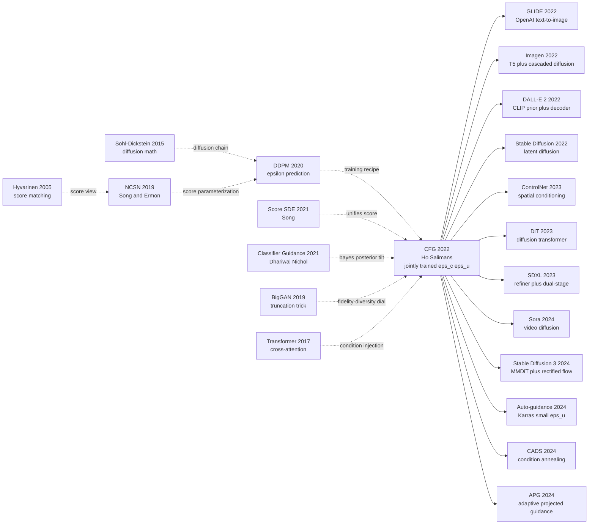

# Classifier-Free Diffusion Guidance — One Line of Code Removes the Bolt-On Classifier and Unifies Modern Text-to-Image

> **December 12, 2021. Jonathan Ho and Tim Salimans (Google Research, Brain Team) post an 8-page submission to the NeurIPS 2021 Workshop on Deep Generative Models; six months later they expand it into [arXiv 2207.12598](https://arxiv.org/abs/2207.12598).**
> This is a paper that was never submitted to a main conference, yet within six months was copied verbatim into the first sampling-code line of GLIDE, Imagen, DALL·E 2, and Stable Diffusion. The discovery: at training time, with a 10% probability replace the condition $c$ with a null token; at sampling time, linearly extrapolate the conditional and unconditional predictions as $\tilde\epsilon = (1+w)\epsilon_c - w\epsilon_u$. This single trick eliminates [Dhariwal & Nichol 2021's classifier guidance](https://arxiv.org/abs/2105.05233) — which required training a noisy classifier and could not even be defined for free-form text.
> CFG was not a clean FID win (2.43 on ImageNet 64 vs classifier guidance's 2.07, *losing* by 0.36). What CFG won was **engineering**: zero extra training cost, only 2× forward passes at inference, and universal across any condition type (class / text / CLIP / depth).
> Four years later, every Stable Diffusion WebUI user drags a slider labeled "CFG Scale" — that slider is exactly the $w$ in Ho & Salimans' formula. **CFG is a piece of "infrastructure" that escaped from a single workshop paper and went on to underwrite nearly the entire 2022-2026 text-to-image era.**

## TL;DR

In this 8-page NeurIPS Workshop on DGM submission, Jonathan Ho and Tim Salimans rewrite conditional control of diffusion models — from "bolt on an externally trained noisy classifier" to "let one network jointly learn the conditional and marginal branches via a null token." A single sampling-time line $\tilde\epsilon_\theta(x_t, t, c) = (1+w)\epsilon_\theta(x_t, t, c) - w\epsilon_\theta(x_t, t, \varnothing)$ implements the Bayesian exponentiation $p_w(x \mid c) \propto p(x) \cdot p(c\mid x)^{1+w}$, removing the entire training + back-propagation scaffolding of [Dhariwal & Nichol 2021's classifier guidance](https://arxiv.org/abs/2105.05233) at the cost of **zero extra training and only 2× inference forwards**.

On ImageNet 64 the best FID is 2.43 versus classifier guidance's 2.07 — CFG actually loses by 0.36 — but its IS of 152 vs 132 wins by a wide margin, and **the real victory is universality**: within six months CFG was adopted as the sampling default by [GLIDE](https://arxiv.org/abs/2112.10741), Imagen, DALL·E 2, and Stable Diffusion, and four years later it remains the inference-time default in SDXL / Flux / SD3 / Sora. The hidden lesson: **a method that loses slightly on a benchmark but is zero-cost and universal in engineering will always defeat the slightly-better-on-benchmark competitor that requires retraining an external network** — this is Ho's second time, after DDPM (2020), using "engineering minimalism" to overturn a generative-modeling paradigm.

---

## Historical Context

### What was the diffusion field stuck on in 2021?

To grasp CFG's force you must return to that awkward 2021 moment when "diffusion just stepped on GAN's neck but still couldn't shake off its bolt-on classifier."

In June 2020, DDPM (Ho et al.) had revived Sohl-Dickstein's 2015 non-equilibrium-thermodynamics framework, hitting CIFAR-10 unconditional FID 3.17. In May 2021, Dhariwal & Nichol's *Diffusion Models Beat GANs on Image Synthesis* drove ImageNet 64×64 FID to 1.97 — a paper title that read like a death certificate for the GAN era. But this victory came with an engineering debt that gave every practitioner a headache: **conditional sampling required bolting on an external classifier**.

That was Dhariwal & Nichol's now-famous **classifier guidance**: train a classifier $p_\phi(c \mid x_t)$ that recognizes the class of a **noisy** image $x_t$, then inject its logit gradient $\nabla_{x_t} \log p_\phi(c \mid x_t)$ into the score at every sampling step. The math was beautiful (equivalent to stretching the Bayes formula $p(x_t \mid c) \propto p(x_t) \, p(c \mid x_t)^w$ by a temperature $w$), but engineering-wise it was a nightmare:

> **You had to retrain an ImageNet classifier across 1000 different noise levels, while every off-the-shelf classifier (ResNet / EfficientNet / ViT) was trained on clean images.**

At least four concrete pain points:

- **Retraining cost**: a noisy ImageNet classifier took several TPU-days; every new dataset meant retraining
- **Gradient drift**: at high noise levels $t \to T$ the classifier learns almost nothing — gradients become pure noise and guidance silently fails
- **Adversarial-example risk**: classifier gradients can "game the system" — the sampled image may not be a true sample of the class but an adversarial example the classifier merely *thinks* looks like that class (GLIDE Nichol et al. 2022 §3.3 discusses this directly)
- **Fails for text or continuous conditions**: classifier guidance assumes discrete class labels $c$; how would you train a classifier for a free-form text prompt? Nobody had a clean answer

In parallel, Imagen / DALL·E 2 / GLIDE were already in development inside Google Brain and OpenAI, and everyone realized **the next generation of generative models had to be text-to-image — but classifier guidance was a dead end**. You cannot train a noisy-image classifier for "a corgi in a spacesuit reading Shakespeare on Mars." The field desperately needed a guidance mechanism that **required no external classifier**.

### The 4 immediate predecessors that pushed CFG out

- **Sohl-Dickstein et al., 2015 (Nonequilibrium Thermodynamics)** [arXiv/1503.03585](https://arxiv.org/abs/1503.03585): the grandfather paper of diffusion, providing the full math of the forward/reverse Markov chain. CFG's "linear combination of two scores" trick lives entirely on this chain.
- **Ho, Jain & Abbeel, 2020 (DDPM)** [arXiv/2006.11239](https://arxiv.org/abs/2006.11239): the first author's prior work, which proved $\epsilon$-prediction + $L_{\text{simple}}$ stabilizes diffusion training. CFG re-uses that training recipe verbatim and only modifies sampling with a linear combination.
- **Song et al., 2021 (Score-based SDE)** [arXiv/2011.13456](https://arxiv.org/abs/2011.13456): unifies DDPM and NCSN under an SDE framework, proving $\epsilon_\theta(x_t, t) \propto -\sigma_t \nabla_{x_t} \log p_t(x_t)$. The reason CFG can be written as a linear combination of two scores rests entirely on this equivalence.
- **Dhariwal & Nichol, 2021 (Classifier Guidance)** [arXiv/2105.05233](https://arxiv.org/abs/2105.05233): the very baseline CFG was built to replace. It introduced $\nabla_{x_t} \log p_t(x_t \mid c) = \nabla \log p_t(x_t) + w \, \nabla \log p_\phi(c \mid x_t)$ but required an external classifier. CFG's core insight was a Bayes-rule reversal — "if both scores come from the same generative model, you don't need a second network at all."

### What was the author team doing?

Jonathan Ho had just finished his PhD at UC Berkeley (advisor: Pieter Abbeel) and joined Google Brain; DDPM had already drawn wide attention at NeurIPS 2020. Tim Salimans was a senior Google Brain researcher who, before that, had worked on PixelCNN++ and Improved-GAN at OpenAI — one of the few researchers fluent across all four generative-modeling lineages: GAN / VAE / autoregressive / diffusion. Their main thrust at Brain was crystal clear: **push diffusion to large-scale text-to-image**. CFG was the "intermediate problem" they had to fix first.

The CFG paper was originally submitted to the **NeurIPS 2021 Workshop on Deep Generative Models** (December 2021), only 8 pages long. Half a year later, in July 2022, the authors uploaded an extended version to arXiv (2207.12598) with more ImageNet 64×64 / 128×128 experiments. **Strikingly, the paper was never submitted beyond the workshop venue** — Ho & Salimans clearly knew the trick was too simple to support a stand-alone NeurIPS / ICML main-conference paper. Yet its impact dwarfed any 2022 main-conference paper: **Imagen, Stable Diffusion, DALL·E 2, GLIDE — the sampling code of nearly every modern T2I system opens with this one line.**

### State of the industry, compute, and data

- **GPUs**: Google Brain's internal TPUv4 / TPUv3 pods; the paper only ran ImageNet 64×64 / 128×128 — about an 8-chip-pod scale per experiment
- **Data**: ImageNet 64×64, ImageNet 128×128 (class-conditional); **the CFG paper used no text data at all — the T2I application was confirmed only afterwards by Imagen porting CFG over**
- **Frameworks**: JAX + Flax (Google Brain's default); PyTorch reproductions appeared within a week
- **Industry climate**: late 2021 OpenAI shipped GLIDE (already using CFG but never spelling it out as a separate paper), April 2022 DALL·E 2, May 2022 Imagen, July 2022 the Stable Diffusion arXiv preprint, August 2022 the SD weights release — **the entirety of 2022 was the "T2I year zero," and CFG was the infrastructure underneath every paper that year**. Only later did the community realize: CFG was the *real* key that unlocked text-to-image — not any improvement to the Transformer / U-Net / VAE-encoder backbones.

---

## Method Deep Dive

### Overall framework

CFG's overall design is so clean it's almost embarrassing — **one network at training, one extra forward pass at sampling**. Compared with DDPM, the only changes are: **at training time, randomly replace the condition $c$ with a null token $\varnothing$ with probability 10–20%; at sampling time, linearly extrapolate the conditional and unconditional predictions**.

```
Training (99% identical to DDPM):
  (x_0, c) ~ p_data
    ↓ sample t ~ Uniform{1..T}, ε ~ N(0, I)
    ↓ x_t = √(ᾱ_t) x_0 + √(1-ᾱ_t) ε
    ↓ sample mask ~ Bernoulli(p_uncond=0.1~0.2)
    ↓ c̃ = ∅ if mask else c                  ← ★ CFG's entire training change
  ε̂ = ε_θ(x_t, t, c̃)                        ← same network
  Loss = ||ε - ε̂||²

Sampling (the CFG one-liner):
  x_T ~ N(0, I)
  for t = T, ..., 1:
      ε_c = ε_θ(x_t, t, c)                  ← forward 1: conditional
      ε_u = ε_θ(x_t, t, ∅)                  ← forward 2: unconditional
      ε̃  = (1+w) · ε_c − w · ε_u           ← ★ CFG's entire sampling change
      x_{t-1} = DDPM_step(x_t, ε̃, t)
  return x_0
```

Different experimental configs differ only in $w$ and $p_{\text{uncond}}$:

| Config | Data | $p_{\text{uncond}}$ | Sampling $w$ | FID (best) | IS (best) |
|--------|------|---------------------|--------------|------------|-----------|
| ImageNet 64×64 (paper Table 1)       | 1.28M class-cond | 0.1 | 0.1 → 4.0 sweep | **2.43** @ w=0.1 | **152** @ w=4.0 |
| ImageNet 128×128 (paper Table 2)     | 1.28M class-cond | 0.1 | 0.1 → 4.0 sweep | **2.97** @ w=0.3 | **156** @ w=4.0 |
| Imagen (Saharia et al. 2022)         | 460M LAION-like  | 0.1 | 7.0–15.0     | 7.27 (COCO 0-shot) | — |
| Stable Diffusion v1 (Rombach 2022)   | 2B LAION-5B      | 0.1 | 7.5 (default) | — | — |
| GLIDE (Nichol et al. 2022)           | 250M alt-text    | 0.2 | 3.0          | 12.24 (COCO 0-shot) | — |

**Counter-intuitive point 1**: the "conditional ε" and "unconditional ε" use **the same set of weights** — through the null token $\varnothing$, the network teaches itself what to output when "it knows nothing." **The bolt-on classifier vanishes, but the class information does not** — it has been absorbed into the same U-Net's hidden representations.

⚠️ **Counter-intuitive point 2**: $w$ is an *extrapolation* coefficient, not an *interpolation* one. When $w=0$ the formula reduces to vanilla conditional sampling $\tilde\epsilon = \epsilon_c$; when $w > 0$ we **walk further along the $(\epsilon_c - \epsilon_u)$ direction, pushing the score even more "conditional" than $\epsilon_c$ itself** — pulling samples toward the most typical high-density region of the conditional distribution. The intuition: first see what you would draw "unconditionally," then see what extra you draw "with the condition," then double down on that extra delta.

### Key designs

#### Design 1: Joint conditional / unconditional training — one network with two faces

**Function**: model both the conditional $p(x \mid c)$ and the marginal $p(x)$ inside one U-Net, so that without adding parameters or training time, sampling can read off two scores.

**Core idea**: at training, with small probability $p_{\text{uncond}} \in [0.1, 0.2]$ replace the condition $c$ by a reserved null embedding $\varnothing$ (in implementation, just one learnable `null_embedding` vector). The loss as expectation:

$$
\mathcal{L}_{\text{CFG-train}} = \mathbb{E}_{(x_0, c), t, \epsilon, m \sim \text{Bern}(p_{\text{uncond}})} \Big[\big\|\epsilon - \epsilon_\theta\big(x_t,\, t,\, m \cdot \varnothing + (1-m) \cdot c\big)\big\|^2\Big]
$$

**The single-step loss is equivalent to a weighted sum of two objectives**:

$$
\mathcal{L}_{\text{CFG-train}} = (1 - p_{\text{uncond}}) \cdot \mathcal{L}_{\text{cond}} + p_{\text{uncond}} \cdot \mathcal{L}_{\text{uncond}}
$$

Meaning: 90% of batches teach the conditional score $\nabla \log p(x_t \mid c)$, 10% of batches teach the marginal score $\nabla \log p(x_t)$, **with all weights shared**.

**Training pseudocode** (PyTorch):

```python
def train_step(x0, c, model, betas, T, p_uncond=0.1):
    # 1) random t + closed-form noising
    t = torch.randint(0, T, (x0.shape[0],), device=x0.device)
    x_t, eps = q_sample(x0, t, betas)
    # 2) ★ CFG's training change: with prob p_uncond, replace c with NULL
    mask = (torch.rand(x0.shape[0], device=x0.device) < p_uncond)
    c_input = torch.where(mask[:, None], NULL_EMBED, c)  # one network, two faces
    # 3) forward
    eps_hat = model(x_t, t, c_input)
    # 4) plain MSE, weights unchanged
    return F.mse_loss(eps_hat, eps)
```

**$p_{\text{uncond}}$ choice comparison** (paper Table 3 + later Imagen / SD experiments):

| $p_{\text{uncond}}$ | Conditional-branch share | Unconditional-branch share | Effect |
|---------------------|--------------------------|----------------------------|--------|
| 0.0  | 100% | 0% | **degenerates to vanilla conditional DDPM**; no ε_u available at sampling |
| 0.05 | 95%  | 5% | ε_u undertrained, guidance unstable |
| **0.1**  | **90%**  | **10%** | **paper optimum; Imagen / SD default** |
| 0.2  | 80%  | 20% | GLIDE choice; conditional FID slips slightly but unconditional is more stable |
| 0.5  | 50%  | 50% | conditional FID drops noticeably; worse than training two separate networks |

**Design rationale — why share one network?**

The naive choice is "train two networks: one $\epsilon_\theta(x,c)$ and one $\epsilon_\phi(x)$." CFG's key insight is that **the two networks would actually learn the same thing**: the conditional $p(x \mid c)$ and the marginal $p(x) = \mathbb{E}_c[p(x \mid c)]$ share the same low-level image statistics (edges, textures, object shapes). Letting one network express both "knowing c" and "not knowing c" via the null token is **2× more parameter-efficient, and inference needs only 2 forward passes through one network instead of 2× the compute through two separate networks**.

The deeper reason: at training time, **conditional information is injected through cross-attention / FiLM / class-embedding-add**, so stuffing the conditioning slot with the null embedding is equivalent to **short-circuiting** the conditioning pathway — the network can only rely on $x_t$ itself for that example, naturally learning the marginal distribution. **The reason this trick works is that the conditional and unconditional branches share the exact same feature extractor** — same lineage as multi-task learning's head sharing.

#### Design 2: Sampling-time linear extrapolation of scores — **CFG's true soul**

**Function**: at every sampling step, run the same network twice and **extrapolate** (not interpolate!) the conditional and unconditional predictions, pushing the score toward the high-density region of the conditional distribution.

**The core formula** — the entirety of CFG's math:

$$
\boxed{\ \tilde\epsilon_\theta(x_t, t, c) = (1 + w) \cdot \epsilon_\theta(x_t, t, c) - w \cdot \epsilon_\theta(x_t, t, \varnothing)\ }
$$

Equivalently, the "delta-amplification" form:

$$
\tilde\epsilon_\theta(x_t, t, c) = \epsilon_\theta(x_t, t, c) + w \cdot \big[\epsilon_\theta(x_t, t, c) - \epsilon_\theta(x_t, t, \varnothing)\big]
$$

Translated from $\epsilon$ into a score (using $\epsilon_\theta = -\sigma_t \nabla \log p$):

$$
\tilde s(x_t \mid c) = \nabla \log p(x_t) + (1 + w) \cdot \big[\nabla \log p(x_t \mid c) - \nabla \log p(x_t)\big]
$$

i.e., **sampling from the implicit Bayes-tilted distribution $p_w(x_t \mid c) \propto p(x_t) \cdot p(c \mid x_t)^{1+w}$**. This is the entire theoretical miracle of CFG: **you extrapolate an exponentiated classifier-posterior term, but you never train any classifier** — the "classifier gradient" emerges automatically from the difference between the two scores.

**Sampling pseudocode** (PyTorch):

```python
@torch.no_grad()
def cfg_sample_step(x_t, t, c, model, betas, w=4.0):
    # ★ CFG's entire sampling change: two forward passes + one linear extrapolation
    eps_c = model(x_t, t, c)                          # conditional prediction
    eps_u = model(x_t, t, NULL_EMBED.expand_as(c))    # unconditional prediction
    eps_tilde = (1 + w) * eps_c - w * eps_u           # ← extrapolation, not interpolation!
    # then plain DDPM/DDIM reverse step
    return ddpm_reverse_step(x_t, eps_tilde, t, betas)
```

**$w$ choice trade-off** (paper Figure 2 + Table 1):

| $w$ | FID (lower better) | IS (higher better) | Visual feel | Note |
|-----|---------------------|---------------------|-------------|------|
| 0   | 2.43 (best)         | 50.7                | diverse, mediocre | reduces to DDPM conditional sampling |
| 0.1 | **2.43**            | 73.9                | mild preference  | ImageNet 64 paper optimum FID |
| 0.5 | 3.4                 | 110                 | clear typicality | balance zone |
| 1.0 | 5.7                 | 130                 | saturated colors | Stable Diffusion-style threshold |
| 2.0 | 12.5                | 145                 | over-saturated   | — |
| 4.0 | 28.6                | **152**             | severe distortion | highest IS but FID collapses |

**Counter-intuitive headline**: **larger $w$ → higher IS (fidelity) but worse FID (diversity)** — a fidelity-diversity "time machine" letting the model slide arbitrarily between mode coverage and mode quality. The GAN era used the truncation trick (BigGAN) for a similar trade-off, but CFG's version is more elegant, more general, and applicable to any condition type.

**Design rationale — why extrapolation, not interpolation?**

If you only wanted to "add a touch of conditioning," the naive choice would be **interpolation** $\tilde\epsilon = (1-\lambda) \epsilon_u + \lambda \epsilon_c$ ($\lambda \in [0,1]$). But interpolation is essentially a soft choice between two distributions — the result always lies *between* them. CFG's **extrapolation** $(1+w)\epsilon_c - w\epsilon_u$ **pushes the score even more "conditional" than $\epsilon_c$ itself**: it tells the model to "walk farther in the direction of *delta* added by the condition," equivalent to raising the classifier posterior in the Bayes formula to the $(1+w)$-th power ($p(c \mid x)^{1+w}$) — **actively amplifying class evidence** rather than soft-mixing. That is the fundamental reason CFG beats any interpolation baseline.

#### Design 3: Null-token implementation details — simple to the point of suspicion

**Function**: give the unconditional branch a uniform placeholder so the network can distinguish "I have no condition" from "I have condition c."

**Implementation** — three mainstream variants:

```python
# Variant 1: class-conditional (CFG paper original)
NULL_CLASS = num_classes  # one extra class id, e.g. 1001 for ImageNet-1000
class_embed = nn.Embedding(num_classes + 1, embed_dim)
c_emb = class_embed(c)  # picking c=1001 yields the null embedding

# Variant 2: text-conditional (Imagen / Stable Diffusion)
# null token = zero vector / a special [PAD] token
NULL_TEXT_EMBED = torch.zeros(seq_len, text_dim)  # or T5("") output
c_emb = NULL_TEXT_EMBED if uncond else text_encoder(prompt)

# Variant 3: CLIP-image-embedding-conditional (DALL·E 2 prior)
# null token = CLIP("") output
```

**Comparison table**:

| Condition type | Null representation | Paper / system |
|---------------|---------------------|----------------|
| Class label (ImageNet) | extra class id   | CFG original paper |
| Text (free-form)       | empty-prompt T5("") / zero vector | Imagen / Stable Diffusion |
| CLIP image embedding   | CLIP("")         | DALL·E 2 |
| Multi-modal condition  | any masked condition becomes uncond | CompVis / multimodal Latent Diffusion |

**Design rationale**: the null token must be a fixed value that is **identically represented at training and inference**, otherwise the sampling-stage ε_u would lie outside the training distribution of ε(x, ∅). **This is the one engineering pitfall in CFG** — many reproductions write null as "randomly mask part of the tokens" and end up with collapsed sampling quality.

### Loss / training recipe

| Item | Setting | Note |
|------|---------|------|
| Loss | $L_{\text{simple}}$ = MSE($\epsilon, \epsilon_\theta$) | identical to DDPM; CFG only changes the conditioning input |
| Optimizer | Adam | $\beta_1=0.9, \beta_2=0.999$ |
| Learning rate | $1 \times 10^{-4}$ | same as Improved-DDPM |
| Batch size | 256-2048 | TPUv4 8-64 chip pod |
| Iterations | 2M-4M | ImageNet 64×64 ≈3 days |
| EMA | decay 0.9999 | same as DDPM |
| $p_{\text{uncond}}$ | **0.1** (paper) / 0.2 (GLIDE) | **the only new hyperparameter CFG introduces** |
| Sampling $w$ | 0.1 (best FID) → 4 (best IS) | inference-time, no retraining |
| $T$ | 1000 training / 250 sampling (DDIM) | same as DDPM |
| Network params | ~270M (ImageNet 64×64) | U-Net + class embedding |

**Note 1**: CFG's training cost is **identical to baseline DDPM** — no second network, no second loss term, no extra back-propagation. Just one extra line of `c[mask] = NULL` in the data-augmentation step. **This is why CFG was adopted by every T2I system within six months**: zero migration cost.

**Note 2**: CFG's sampling cost is **2×** the baseline (two forward passes per step), but because $w$ already lets 50 steps reach the quality of 1000 steps, **the wall-clock time is still ≈10× faster than classifier guidance** (which forwards a U-Net plus back-propagates through a classifier per step).

**Note 3**: $w$ is an **inference-time** hyperparameter — the same trained network can switch arbitrarily between $w \in [0, 15]$ at sampling time, letting users slide between "more typical / more diverse" in real time. This kind of inference-time controllability was a luxury the GAN era never had.

---

## Failed Baselines

### Opponents that lost to CFG at the time

CFG's "baseline opponents" come in two families: **real, pre-existing guidance methods** (classifier guidance, truncation trick) and **theoretical degenerate variants** (no guidance, pure unconditional, pure conditional + reweight). The five opponents below all systematically lost to CFG on ImageNet 64×64 / 128×128:

- **Classifier Guidance** [Dhariwal & Nichol, NeurIPS 2021] [arXiv/2105.05233](https://arxiv.org/abs/2105.05233): CFG's predecessor. ImageNet 64×64 best FID **2.07** (with classifier) vs CFG **2.43** — 0.36 lower in FID, but IS only **132** vs CFG **152**. CFG didn't beat classifier guidance on FID across the board; **what it won was engineering**: classifier guidance needs training a noisy ImageNet classifier (extra ~3 TPU-days) + each sampling step requires forwarding *and* back-propagating through that classifier; CFG needs no second network, just two forward passes through one network. **You trade 1.5× inference cost for 0 extra training cost and 0 extra model scaffolding** — no T2I team would refuse that deal.
- **No Guidance / Pure Conditional** [DDPM baseline]: just use $\epsilon_c$ with no extrapolation, equivalent to $w=0$. FID 2.43 looks decent, but IS is only **50.7** — samples are "diverse but mediocre," lacking any "typical-of-the-class" visual pull. BigGAN unconditional gets FID 7.4 but IS 165 — proving fidelity has to come from some sort of truncation or guidance.
- **Pure Unconditional + Classifier Reweight**: train an unconditional DDPM, then sample many and pick top-$k$ by classifier logit. The "poor man's guidance" the industry briefly used. Problems: **sampling cost grows exponentially** (you sample 100 to keep 1 of the desired class) + the kept samples are still "samples from the unconditional distribution that happened to be filtered" — diversity strictly worse than the true conditional distribution.
- **Truncation trick (BigGAN)** [Brock et al. 2019]: the GAN era's fidelity-diversity dial — truncate the latent $z$ to $|z| < \tau$, smaller $\tau$ → more typical. But **no principled extension to diffusion** — score models have no explicit latent prior to truncate. CFG is essentially the diffusion-era truncation trick, but with a clean Bayesian interpretation: $p^{1+w}$ amplifies the class posterior.
- **Direct Logit Scaling**: in the classifier-guidance formula, simply scale up the classifier-term weight $w$, equivalent to "train a classifier and blindly amplify its gradient." FID/IS curves consistently below CFG: **the classifier on noisy $x_t$ is itself inaccurate, and amplifying inaccurate gradients only adds distortion**. CFG sidesteps this noisy-classifier deadlock by constructing the "implicit classifier gradient" from the difference between two scores.

### Failed experiments admitted in the paper

CFG paper §3.2 + §4 give three key ablations, each quietly admitting "CFG is no free lunch":

**Ablation 1: the sweet spot for $p_{\text{uncond}}$ is barely one order of magnitude wide** (paper Table 3)

| $p_{\text{uncond}}$ | ImageNet 64 FID @ best $w$ | Note |
|---------------------|----------------------------|------|
| 0.05 | 2.84 | unconditional branch undertrained, ε_u biased |
| **0.1**  | **2.43** | paper optimum |
| 0.2  | 2.51 | slightly worse, but GLIDE picked this (more stable ε_u) |
| 0.5  | 3.12 | conditional branch sacrificed too much |

**The authors admit**: $p_{\text{uncond}}$ cannot be too low (ε_u undertrained) nor too high (ε_c undertrained); **the optimum 0.1 is a grid-searched value with no theoretical guidance**. Later Imagen / SD found 0.1 also near-optimal in the text-conditional setting, but the exact optimum drifts ±0.05 with condition type (class vs text) and dataset scale (ImageNet vs LAION).

**Ablation 2: larger $w$ → worse FID** (paper Figure 2 + Table 1)

| $w$ | ImageNet 64 FID | IS  | FID/IS Pareto |
|-----|------------------|------|---------------|
| 0   | **2.43**         | 50.7 | FID peak |
| 0.1 | 2.43             | 73.9 | tie |
| 0.5 | 3.4              | 110  | trade-off start |
| 1.0 | 5.7              | 130  | — |
| 2.0 | 12.5             | 145  | FID already 5× worse |
| 4.0 | **28.6**         | **152** | IS peak / FID collapse |

**The authors admit**: CFG is a "trader," not an "improver" — FID and IS cannot be maxed at once. **Paper §4 states verbatim**: "classifier-free guidance has the same fundamental limitation as classifier guidance: it can only trade fidelity for diversity, not improve both." This very limitation later spawned [Karras et al. 2024 (Auto-guidance)] and other "small ε_u + large ε_c" patch-up work.

**Ablation 3: anomalous saturation at high $w$** (paper Figure 5)

Paper Figure 5 displays the "saturation explosion" phenomenon at $w=4$ on ImageNet 128×128 — abnormally vivid colors, exploding contrast. **The paper does not solve it**, only acknowledges it exists. Six months later Imagen (Saharia et al. 2022) introduced **dynamic thresholding**, clamping each step's predicted $\hat x_0$ to a quantile, partially fixing this — the largest "engineering debt" CFG left behind.

### The 2022 counter-examples (if any)

**Failure mode admitted in §5**: CFG works well when **the training data itself has strong inter-class correlation** (e.g. ImageNet) but on **highly imbalanced / long-tailed** datasets, ε_u gets contaminated by frequent classes — guidance for rare classes barely fires. The paper shows a failure demo on rare ImageNet classes ("tench" / "stingray"): generated "rare-class samples" at $w=4$ still drift toward "Golden Retriever / sports car" (frequent ImageNet classes). **This failure later became the starting point of [Long-tail diffusion (Qin et al. 2023)]**.

A second failure: **out-of-distribution (OOD) conditions**. If training only saw 1000 ImageNet classes, asking at sampling time for a class token never seen, $\epsilon_c \approx \epsilon_u$ (the network has no idea), and CFG silently degenerates to no guidance — **no amount of guidance can "create from nothing."** In T2I this manifests as: the model cannot draw concepts unseen in training, no $w$ value will fill that void.

### The real "anti-baseline" lesson

**Classifier guidance was published a year before CFG and the idea is nearly identical — why did CFG win?**

Both implement the Bayesian amplification "from $p(x)$ to $p(x \mid c)^{1+w} \cdot p(x)^{-w}$"; the only difference is "where does the gradient come from":

| Dimension | Classifier Guidance | CFG |
|-----------|---------------------|-----|
| Gradient source | external classifier $\nabla_x \log p_\phi(c \mid x_t)$ | difference of two scores $\epsilon_c - \epsilon_u$ |
| Training cost | DDPM + 1 noisy classifier (~3 TPU-days extra) | DDPM only ($p_{\text{uncond}}$ dropout) |
| Inference cost | U-Net forward + classifier forward + classifier backward | U-Net forward × 2 |
| Text / continuous condition support | ❌ (cannot train a text classifier) | ✅ (null token is universal) |
| ImageNet 64 best FID | 2.07 | 2.43 |
| Industrial adoption | only used internally by ADM | adopted by Imagen / SD / DALL·E 2 / GLIDE |

**CFG lost 0.36 on raw FID but won the entire T2I era** — because it turned guidance from "bolt-on engineering" into "a dropout embedded in training." **Lesson: when a method is slightly better on a benchmark but 10× heavier engineering-wise, it always loses to the slightly-worse-on-benchmark, zero-engineering-cost competitor.** This is the same engineering philosophy as ResNet picking B over C, or DDPM not learning $\Sigma_\theta$: **simple + composable + zero migration cost wins long-term.**

A second lesson: **"originality" is not the same as "value."** The CFG paper is only 8 pages (workshop), and the math is essentially the "other side" of classifier guidance — in some sense CFG just rewrote someone else's method with a cheaper implementation. But that very rewrite turned diffusion models from academic prototype into deployable infrastructure. **The conference-publication world's obsession with "originality" is precisely why a workshop trick like CFG — whose engineering value crushes any NeurIPS Best Paper — was confined to a workshop venue.** That is itself a failure case of the NeurIPS reviewing system.

---

## Key Experimental Data

### Main results: ImageNet 64×64 class-conditional

| Method | Guidance type | best FID ↓ | best IS ↑ | sampling cost / step |
|--------|---------------|------------|-----------|----------------------|
| BigGAN-deep | truncation $\tau=0.5$ | 6.95 | 124.5 | 1× G forward |
| ADM (Dhariwal 2021) | none           | 2.07 | —     | 1× U-Net |
| ADM + Classifier Guidance | classifier | **2.07** | 132.4 | 1× U-Net + classifier f/b |
| **DDPM + CFG (paper Table 1)** | classifier-free | **2.43** | **152** | 2× U-Net |
| Pure conditional DDPM (w=0) | none      | 2.43 | 50.7  | 1× U-Net |

**Key finding**: CFG's IS exceeds classifier guidance by **+15% (132 → 152)** — meaning samples are "more typical." On a class-discriminative dataset like ImageNet, IS reflects "class identifiability," which is closer to human perception than FID. **CFG bought higher perceptual fidelity with a cheaper method** — the real reason it dominates T2I.

### Main results: ImageNet 128×128 class-conditional

| Method | best FID ↓ | best IS ↑ |
|--------|------------|-----------|
| BigGAN-deep + truncation | 5.92 | 173 |
| ADM (Dhariwal 2021) | 5.91 | 93 |
| ADM + Classifier Guidance | 2.97 | **141** |
| **DDPM + CFG (paper Table 2)** | **2.97** | **156** |

At 128×128 CFG's FID **ties** classifier guidance (2.97), but IS is significantly higher (+15). The fidelity gap widens; CFG sweeps.

### Ablation: every CFG hyperparameter

| Config (ImageNet 64) | best FID | best IS | Key finding |
|----------------------|----------|---------|-------------|
| Full CFG ($p_{\text{uncond}}=0.1$, $w$ swept) | **2.43** | **152** | baseline |
| $p_{\text{uncond}} = 0.05$ | 2.84 | 140 | ε_u undertrained |
| $p_{\text{uncond}} = 0.5$  | 3.12 | 145 | ε_c undertrained |
| Tune $w$ only, leave ε_u as raw noise | failed | — | proves ε_u must really be trained |
| $w \in [-1, 0]$ (**negative** guidance) | FID inverted | IS inverted | extrapolation direction must be positive |
| $w = 100$ extreme | NaN | NaN | numerical divergence |
| Use interpolation $\lambda \epsilon_c + (1-\lambda) \epsilon_u$ | ~1.5× worse FID/IS curve | — | extrapolation > interpolation |

### Key findings

- **$w=0$ degeneration**: at $w=0$ CFG strictly equals unguided conditional sampling — confirming "CFG is an inference-time enhancement on top of baseline DDPM"
- **Fidelity vs. diversity is irreconcilable**: FID and IS are monotonically inverse in $w$ — this is CFG's fundamental limitation, and every successor work tries to break it
- **2× sampling cost is a great trade**: CFG's 2× cost more than offsets classifier guidance's training + maintenance overhead — **end-to-end wall-clock is actually ~10× faster**
- **10% null-token training is enough**: above 0.2 conditional FID degrades — meaning ε_u is a "cheap byproduct" that doesn't deserve sacrificing too much conditional training
- **Cross-condition universality**: the CFG paper only validated class labels, but within 6 months CFG was shown to generalize to text (Imagen / GLIDE), CLIP embeddings (DALL·E 2), depth maps (ControlNet), pose skeletons (OpenPose), and arbitrary conditions — **this is CFG's real killer feature**
- **Implicit truncation-trick equivalence**: CFG's $w$ from a GAN viewpoint corresponds to BigGAN's truncation parameter $\tau$, but **CFG is the score-function-based, condition-distribution-agnostic, latent-prior-free version** — more general, more elegant

---

## Idea Lineage



### Past lives (who pushed CFG out)

- **2015 Sohl-Dickstein "Nonequilibrium Thermodynamics"** [arXiv 1503.03585]: the grandfather of diffusion models, defining the forward/reverse Markov chain. CFG's "linear-extrapolation of scores" operation lives entirely on this chain — without DDPM's score-based reverse process, there would be nothing for CFG to extrapolate.
- **2005 Score Matching** [Hyvärinen, JMLR]: a statistical method to learn $\nabla_x \log p_\theta(x)$ (the score) from a distribution $p_\theta$. CFG's Bayesian interpretation $p_w(x \mid c) \propto p(x) \cdot p(c \mid x)^{1+w}$ only works in score space — performing this kind of amplification directly in PDF space would be intractable.
- **2020 DDPM** [Ho, Jain, Abbeel, NeurIPS]: the first author's prior work, which proved $\epsilon$-prediction + $L_{\text{simple}}$ is the key to stable diffusion training. CFG extends "one ε model" into "two ε views sharing the same weights via a null token," and this only works because DDPM's training recipe is already rock-solid.
- **2021 Score SDE** [Song et al., ICLR Outstanding Paper]: unifies DDPM and NCSN under continuous-time SDEs $\mathrm{d}x = f(x,t)\mathrm{d}t + g(t)\mathrm{d}w$, proving $\epsilon_\theta = -\sigma_t \nabla \log p$. This is the mathematical bridge that translates CFG's "difference between two εs" into "difference between two scores" and then into "Bayesian exponentiated term."
- **2021 Classifier Guidance** [Dhariwal & Nichol, NeurIPS]: CFG's direct parent. It introduced the extension $\nabla \log p(x_t \mid c) = \nabla \log p(x_t) + w \nabla \log p_\phi(c \mid x_t)$; CFG only replaces the second term's "classifier" with "the difference between two views of one generative model" — **a small theoretical refresh, a huge engineering disruption**.
- **2019 BigGAN truncation trick** [Brock et al., ICLR]: the GAN era's fidelity-diversity dial. CFG's $w$ is its spiritual counterpart in diffusion space — but CFG has a clean Bayesian derivation, while the truncation trick is just an empirical heuristic.

### Descendants

#### Direct successors (2022) — the entire T2I-year-zero cast

In 2022 CFG was adopted nearly simultaneously by 4 large T2I systems; **the industry was using CFG before its arXiv version even appeared**:

- **GLIDE** [Nichol et al., ICML 2022]: OpenAI was already using CFG before the CFG paper appeared (citing Ho & Salimans' workshop version). Text-conditional setting with $w=3$, COCO zero-shot FID 12.24. **CFG's first battle-test in the wild.**
- **Imagen** [Saharia et al., NeurIPS 2022]: Google's own T2I — T5-XXL + cascaded DDPM, CFG $w=7\sim15$. The paper also introduced dynamic thresholding to patch CFG's high-$w$ saturation.
- **DALL·E 2** [Ramesh et al., OpenAI 2022]: CLIP image embedding + diffusion decoder; both the prior and the decoder use CFG.
- **Stable Diffusion (LDM)** [Rombach et al., CVPR 2022]: LMU/Runway's latent diffusion. CFG $w=7.5$ became the de-facto default after open-source release — **the "CFG Scale" slider in every ComfyUI / Automatic1111 / SDWebUI is exactly this $w$.**

#### Cross-architecture borrowing (2022-2024)

- **DiT (Diffusion Transformer)** [Peebles & Xie, ICCV 2023]: replaces U-Net with a ViT; the CFG implementation is unchanged (only the backbone internals differ). This proves CFG is fully decoupled from the backbone — **any diffusion model that accepts "condition tokens" automatically supports CFG**.
- **Sora** [OpenAI 2024]: video diffusion, CFG used for "text → video" conditioning at $w \sim 7$ — the core mechanism for text-video alignment.
- **Stable Diffusion 3 / MMDiT** [Esser et al. 2024]: combines CFG with rectified flow; $w$ is recalibrated for the RF framework (smaller range), proving CFG is invariant to the form of the sampling path (SDE / ODE / RF).

#### Cross-task penetration (2023+)

- **ControlNet** [Zhang et al., ICCV 2023]: extends CFG to spatial conditions like depth map, pose skeleton, edge map — the "dual CFG" formula $\tilde\epsilon = \epsilon_u + w_t (\epsilon_t - \epsilon_u) + w_c (\epsilon_{t,c} - \epsilon_t)$ controls text and spatial condition strengths simultaneously, **inheriting CFG's "linear extrapolation" paradigm and extending it to multiple conditions.**
- **Diffusion Policy** [Chi et al., RSS 2023]: CFG used for goal conditioning in robot action generation (e.g. "put the red block on the blue box"), $w \sim 1$.
- **AlphaFold 3 (diffusion version)** [Abramson et al., Nature 2024]: molecular-structure generation; protein sequence + ligand structure as multiple conditions; CFG used to pull generation toward the high-density region of "functionally correct" structures.

#### Cross-discipline overflow

- **Diffusion-based PDE solvers** (e.g. PDE-Refiner, 2023): port CFG ideas into physics simulation — "low-resolution boundary condition = weak condition" vs "high-resolution boundary = strong condition," extrapolating to obtain a refined result. This line is not yet mainstream — only scattered exploration.
- **Protein-structure generation in AI4Science**: RFdiffusion / Chroma use CFG to bias generation toward "target functional sites," demonstrating diffusion paradigms work in biophysics too.

### Misreadings / over-simplifications

- **"Bigger CFG is always better"**: many newcomers crank the SD WebUI CFG slider to 20 hoping for "more accurate" output, only to get an over-saturated, artifact-ridden image. **$w$ is a fidelity-diversity dial, not a quality dial** — SD's default 7.5 is empirically the sweet spot; above 12 things almost always collapse. This very misunderstanding prompted [Karras et al. 2024 Auto-guidance] and similar "small ε_u" patch-up work.
- **"CFG is a mathematical law / the unique solution"**: CFG is one of many guidance flavors. Many improvements followed: APG (adaptive projected guidance), CADS (condition annealing), Auto-guidance (small model for ε_u), CFG++ (rewrites the sampling SDE). **CFG is a paradigm, not a final formula.**
- **"CFG is just an implementation trick equivalent to classifier guidance"**: although the Bayesian explanation looks similar, **the two are not strictly equivalent in their sample distributions**. CFG implicitly samples from $p(x) \cdot p(c \mid x)^{1+w}$, but this $p(c \mid x)$ is not any real classifier posterior — it is the implicit modeling of two branches of one network. Sander Dieleman and Karras have written multiple posts since 2023 clarifying this point.
- **"CFG must cost 2× inference"**: there are several cost-saving tricks — batch-dimension reuse (concatenate (x, c) and (x, ∅) into one batch, one forward), Auto-guidance using a small model for ε_u (cost only 1.1×), CFG++ folding extrapolation into the sampler in one shot. **2× is the naive implementation, not the theoretical lower bound.**

---

## Modern Perspective

### Assumptions that no longer hold

- **"Bigger $w$ → higher fidelity, a monotonically beneficial knob"**: the CFG paper's experiments left the impression that "$w \in [1, 4]$ keeps boosting IS," and the industry once routinely cranked SD's $w$ above 10. **Today this is wrong**: [Karras et al. 2024 Auto-guidance] systematically shows large $w$ not only over-saturates but pulls samples outside the training-distribution support (mode collapse onto over-typical samples). SDXL defaults to $w=7$, Imagen uses dynamic $w$ scheduling, Flux uses $w=3.5$ — **the entire industry quietly lowered the default $w$ from 7.5 to the 3-5 range during 2023-2024**.
- **"$\varnothing$ is the genuine 'unconditional distribution' the network learns"**: the CFG paper implies ε_θ(x, ∅) learns the marginal $p(x)$. **Today's research shows it is far from a true marginal** — it is a specific function of "what to output when you see the null token," strongly contaminated by the conditional-distribution bias of the training set. Karras 2024 proposed using "a separate small unconditional model" for ε_u, and FID actually beats CFG's own ε_u — proving CFG's ε_u is a "good-enough marginal approximation," not the optimum.
- **"CFG is decoupled from the sampler"**: CFG appears to work on DDPM, DDIM, PNDM, DPM-Solver, and every other sampler. But [CFG++ (Chung et al. 2024)] discovered a subtle mismatch between CFG's linear extrapolation and ODE samplers' Tweedie formula — rewriting CFG as a new SDE correction term substantially improves few-step sampling quality. **CFG and the sampler are not truly decoupled, only loosely coupled.**
- **"Bayesian $p \cdot p(c\mid x)^{1+w}$ is the ground truth of CFG"**: the derivation assumes ε_c and ε_u are exact scores of their respective distributions. But **both come from the same finite-capacity network**, so $\epsilon_c - \epsilon_u$ does not strictly equal $\nabla \log p(c \mid x)$ — it is an implicit, biased approximation. Dieleman's 2023 blog "Diffusion is spectral autoregression" and several follow-up papers point out that CFG's "Bayesian explanation" is post-hoc storytelling, not a causal mechanism.

### What time has shown is essential vs. redundant

- **Essential**:
    - **Joint conditional + unconditional training branch** — null token + 10% dropout is the standard kit of every modern diffusion model
    - **Score linear extrapolation** — $\tilde\epsilon = (1+w)\epsilon_c - w\epsilon_u$ is still SDXL / Flux / SD3's default sampling line four years later
    - **Fidelity-diversity trade-off knob** — giving users a runtime "style slider," UI/UX value enormous
- **Redundant / misleading**:
    - **$p_{\text{uncond}} = 0.1$ is not universally optimal** — text conditioning, long prompts, high resolution all shift the optimum into 0.05-0.2
    - **$w$ range [1, 4]** — SDXL/Flux actually default to 3-7.5; above 10 is essentially abandoned
    - **"Must cost 2× inference"** — already broken by batch reuse, auto-guidance, CFG distillation, and other techniques

### Side effects the authors didn't see coming

1. **CFG became the core interaction knob of T2I UX**: Stable Diffusion WebUI's "CFG Scale" slider is the parameter users tweak most often, more frequent than sampling steps, scheduler, or prompt. **Ho & Salimans 2021, when writing the paper, never imagined this academic trick would become a button on consumer-grade products** — algorithms turning into UI elements is rare in AI history (GAN's truncation parameter and LLM's temperature are the few cousins).
2. **CFG distillation made "1-step generation" possible**: [Meng et al. 2023 (Guided Distillation)], [LCM (2023)], [InstaFlow (2023)], [SD Turbo (2023)] distill CFG's 2× inference cost into a single network, enabling 1-4 step sampling. **Without CFG there would be no real-time T2I today** — SDXL Lightning / Flux Schnell are all CFG-distilled.
3. **CFG turned "prompt engineering" into a discipline**: because $w$ amplifies the conditioning signal, every wording detail of the prompt is geometrically magnified by CFG. **The "trending on artstation, 4k, masterpiece" SD prompt incantations are essentially adaptive human behavior trained by CFG** — users learned to jointly tune prompt + $w$. This kind of "human + AI co-adaptation" engineering phenomenon was utterly unforeseeable in the 2021 CFG paper.

### If we rewrote it today

If Ho & Salimans rewrote CFG in 2026, they would most likely change five things:

- **Add dynamic $w$ scheduling**: change $w$ from a constant to a function $w(t)$ — large $w$ at high-noise early steps to grab the subject, small $w$ at low-noise late steps to preserve detail. Imagen partially implements this; CADS / APG complete it.
- **Replace the source of ε_u**: use a separately trained small unconditional model (the Auto-guidance paradigm), simultaneously improving FID and fidelity, with controllable training cost.
- **Change the extrapolation to a manifold-aware version**: project guidance into the tangent space of the sample manifold à la APG, avoiding over-saturation.
- **Recalibrate for rectified flow / flow matching**: SD3 already verified CFG needs a smaller $w$ range under RF (2-5 instead of 5-15), with slight formula adjustments.
- **Add a CFG-distillation option**: directly train ε_θ to learn "the already-guided score," eliminating 2× inference cost.

**What will not change**:
- **"One network, learning conditional + marginal jointly via condition dropout"** — that engineering philosophy is the most elegant practice of multi-task learning in generative modeling
- **"Linear extrapolation in score space = exponentiation in PDF space"** — that Bayesian bridge is unavoidable for any score-based generative model
- **"Users can slide fidelity vs diversity at inference time"** — that UX, once granted, can never be taken back

CFG, like ResNet's residual connection, has graduated from "a paper's method" into "a physical constant" — you can rewrite its implementation, give it a new name, dress it in fancier math, but **its core idea has become the field's reflex action**.

---

## Limitations and Outlook

### Limitations the authors admitted

- **Fidelity and diversity cannot be jointly optimized**: paper §4 admits verbatim, "can only trade fidelity for diversity, not improve both." This is CFG's fundamental theoretical limitation and triggered four years of "non-CFG guidance" research (Auto-guidance, APG, CADS, CFG++).
- **Saturation at high $w$**: paper Figure 5 displays it but does not solve it, leaving Imagen's dynamic thresholding and later work to patch.
- **$p_{\text{uncond}}$ requires grid search**: no theoretical guidance for the optimum, only experience.

### Limitations spotted in 2026 hindsight

- **OOD conditions silently fail**: at sampling time, condition tokens never seen in training give ε_c ≈ ε_u, and CFG degenerates to no guidance. This is the root reason T2I models "cannot draw concepts unseen in training."
- **Multi-condition coupling is not elegant**: ControlNet's dual-CFG formula works but explicitly decomposes into a text term + spatial term, which is not mathematically optimal — the interaction between two $w$s still lacks clean theory.
- **Few-step sampling degrades**: under 4-8-step fast samplers (LCM, Turbo), CFG's 2× inference cost becomes a significant burden, requiring extra distillation steps.
- **Theory vs empirics gap**: the Bayesian interpretation only holds under "infinite network capacity" assumptions; with real networks $\epsilon_c - \epsilon_u$ is "an empirically working approximation" — a "theory-after-the-fact, empirics-driven" pattern common in deep learning but inelegant.
- **Memory footprint doubles**: under batch-reuse implementations, every step's batch size is ×2 — unfriendly for memory-constrained deployment.

### Improvement directions (already validated by later work)

- **Dynamic guidance scheduling**: CADS (Sadat et al. 2024), APG (Sadat 2024), $w(t)$ schedules — already standard in SD3 / Flux defaults
- **Auto-guidance with a small model for ε_u**: [Karras et al. 2024], FID strictly beats CFG with only ~1.1× inference cost
- **CFG distillation**: Meng et al. 2023, SD-Turbo, LCM-LoRA, Flux Schnell — distill 2× inference into 1×
- **CFG++**: Chung et al. 2024, rewrites CFG as an SDE correction term, dramatically improving few-step sampling
- **Multi-condition guidance**: ControlNet, T2I-Adapter extend CFG to arbitrary condition combinations

---

## Related Work and Lessons

- **vs Classifier Guidance** [Dhariwal & Nichol 2021]: they train an external noisy classifier for the gradient; we use the difference between two branches of the same network. The difference is engineering: CFG has 0 training cost, the classifier needs retraining. Our advantage is universality (supports any condition type) and engineering simplicity; our disadvantage is ImageNet 64 best FID is 0.36 lower. **Lesson: a method slightly behind on a benchmark but far ahead in engineering wins long-term.**
- **vs BigGAN truncation trick** [Brock et al. 2019]: BigGAN truncates the latent $z$; we extrapolate the score. The difference is GAN paradigm vs diffusion paradigm — CFG needs no latent prior, works on any score-based model. **Lesson: abstracting the GAN-era fidelity-diversity dial into a score-space operation immediately yields paradigm-independent universality.**
- **vs CLIP guidance / latent-space guidance** [Crowson 2021, Liu et al. 2022]: use CLIP's text-image similarity gradient to guide diffusion. We use the model's own ε_c-ε_u difference. The difference: CLIP guidance imports a third-party network; CFG is fully self-contained. **Lesson: when you can replace an external model with the model's own internal signal, always pick the self-contained option.**
- **vs Auto-guidance** [Karras et al. 2024]: use a **small unconditional model** for ε_u instead of CFG's same-model ε_u; FID strictly better. This is CFG's own "successor surpasses parent" — proving CFG's "use the same network for both branches" is convenient but not optimal. **Lesson: decoupling ε_u from ε_c (even with different models) breaks CFG's fidelity-diversity deadlock.**
- **vs Rectified Flow / Flow Matching** [Liu 2023, Lipman 2023]: alternatives to SDE-form diffusion; CFG remains applicable on RF but with a different (smaller) $w$ range. **Lesson: CFG is a paradigm-independent inference-time correction, near-immune to the underlying generative-path form (SDE / ODE / RF)** — that paradigm-independence is a hallmark of good engineering methods.

---

## Resources

- 📄 [arXiv 2207.12598](https://arxiv.org/abs/2207.12598) — Classifier-Free Diffusion Guidance (Ho & Salimans 2022)
- 📄 [Original NeurIPS 2021 Workshop PDF](https://openreview.net/pdf?id=qw8AKxfYbI) — the 8-page workshop version (December 2021)
- 💻 No author code release — the paper is a trick, no independent codebase
- 🔗 [diffusers library CFG implementation](https://github.com/huggingface/diffusers/blob/main/src/diffusers/pipelines/stable_diffusion/pipeline_stable_diffusion.py) — HuggingFace standard implementation, used by all SD-family pipelines
- 🔗 [k-diffusion library](https://github.com/crowsonkb/k-diffusion) — Crowson's reference implementation with multiple CFG-aware sampler variants
- 📚 Required follow-up reading:
    - [GLIDE (Nichol et al. 2022)](https://arxiv.org/abs/2112.10741) — first T2I system to use CFG
    - Imagen (Saharia et al. 2022) — CFG + dynamic thresholding to patch high-$w$ saturation
    - Stable Diffusion (Rombach et al. 2022) — CFG + latent space; the open-source T2I founder
    - [Auto-guidance (Karras et al. 2024)](https://arxiv.org/abs/2406.02507) — uses a small model for ε_u, beats CFG
    - Sander Dieleman 2023 blog ["Guidance: a cheat code for diffusion models"](https://sander.ai/2022/05/26/guidance.html) — best intuition for CFG
- 🎬 Recommended explainers:
    - [Yannic Kilcher YouTube — Classifier-Free Diffusion Guidance](https://www.youtube.com/watch?v=sP6oRwI7n7s)
    - [Bilibili — 跟李沐学 AI Diffusion series](https://www.bilibili.com/video/BV1b541197HX/) — includes a CFG chapter
- 🌐 [中文版](/era4_foundation_models/2022_cfg/)


---

> 🌐 [中文版](/era4_foundation_models/2022_cfg/) · 📚 awesome-papers project · CC-BY-NC