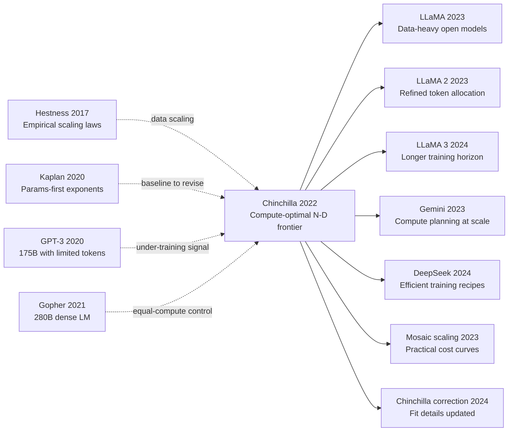

# Chinchilla — Proving All LLMs Were 'Undertrained' via Compute-Optimal Allocation

> **March 29, 2022. Hoffmann, Borgeaud, Sifre, and 19 co-authors at DeepMind upload [arXiv 2203.15556](https://arxiv.org/abs/2203.15556); published at NeurIPS 2022 in December.**
> A paper that ran 400+ small-scale training runs to **directly slap OpenAI Scaling Laws (2020) in the face** — DeepMind found that for a given compute $C$, optimal allocation should be **parameters $N \propto C^{0.5}$, data $D \propto C^{0.5}$** (roughly 1:1, with tokens ≈ 20× parameters), not OpenAI's "params 0.73 / data 0.27."
> The fallout was seismic: **Chinchilla (70B params, 1.4T tokens) crushed equally-compute [Gopher (280B)](https://arxiv.org/abs/2112.11446) / GPT-3 (175B) / [Jurassic (178B)](https://uploads-ssl.webflow.com/61fd4eb76a8d78bc0676b47d/61fd4eb76a8d782e96676b558_jurassic_tech_paper.pdf) on essentially every benchmark (MMLU / BIG-Bench / SAT)** — every industrial LLM at the time was **undertrained**, with too many parameters and too little data.
> The conclusion rewrote LLM scaling industrial practice: [LLaMA (2023)](../era5_genai_explosion/2023_llama.md) at 7B/1T, Llama-2 at 7B/2T, DeepSeek-V2 at 236B/8.1T — **the entire open-source LLM era's "token-rich, parameter-modest" training paradigm traces back to Chinchilla**.

## TL;DR

Chinchilla used **3 independent methods** to systematically calibrate, for the first time, the optimal parameter count $N^*$ and training token count $D^*$ at fixed compute $C$. All three methods **converge** on the same conclusion: **$N$ and $D$ should scale roughly equally — about 20 tokens per parameter** — directly contradicting [Kaplan 2020](https://arxiv.org/abs/2001.08361)'s "params first, data secondary" prescription. The paper trained Chinchilla 70B on 1.4T tokens and beat Gopher 280B (300B tokens) on most benchmarks at **4× less compute**, **implicitly convicting GPT-3 / MT-NLG / PaLM of being severely under-trained**, redirecting the entire LLM industry from a "parameter arms race" back to "balanced compute allocation," and directly catalyzing the LLaMA series's **inverse** philosophy of "over-training past Chinchilla optimum to make inference cheap."

---

## Historical Context

### What was the LLM community stuck on in early 2022?

On March 29, 2022, Hoffmann et al. uploaded [arXiv 2203.15556](https://arxiv.org/abs/2203.15556). That year was the absolute peak of the **"parameter arms race"**: GPT-3 175B (May 2020) → Jurassic-1 178B (Aug 2021) → Gopher 280B (Dec 2021) → Megatron-Turing NLG 530B (Jan 2022) → PaLM 540B (Apr 2022). In half a year the largest model went from 175B to 540B parameters. **Yet all of these models silently shared one almost-unquestioned implicit assumption**:

> **For a fixed compute budget $C$, pour the bulk into "parameters $N$"; "data $D$" is secondary — for every 5× increase in parameters, you only need 1.1× more tokens.**

This prescription came from [Kaplan et al. 2020](https://arxiv.org/abs/2001.08361)'s scaling-law analysis. Kaplan et al. extrapolated from sub-1B models and got $N^* \propto C^{0.73}$, $D^* \propto C^{0.27}$ — **doubling compute should grow params by ~73% but data by only ~27%**. This curve directly governed the resource allocation of OpenAI / Microsoft / Nvidia / Google / DeepMind LLM training: **all big models stalled at ~300B tokens, every extra dollar of compute went into bigger $N$**.

But DeepMind internally was already uneasy: the December 2021 Gopher 280B report [Rae et al. 2021](https://arxiv.org/abs/2112.11446) showed **no significant gain over GPT-3 175B on MMLU and BIG-bench** — only marginally better, badly mismatched against the "60% more parameters" expectation. The team suspected "data under-fit." This suspicion combined with single-training bills now reaching $8M+ made **"did we mis-allocate $N/D$ from the very beginning?"** the most urgent question for DeepMind's LLM team in early 2022.

Chinchilla is the **empirical answer** to that question — 400+ controlled training runs triangulating optimal $N^*(C), D^*(C)$ from three independent angles. The result shocked the industry: **Kaplan was off by an order of magnitude** — the correct ratio is not "5× params + 1.1× data" but **roughly equal scaling of both**.

### The 5 immediate predecessors that pushed Chinchilla out

- **Kaplan et al. 2020 (Scaling Laws for Neural LMs)** [arxiv/2001.08361]: the opponent directly falsified by this paper. From sub-1B models they fit $N^* \propto C^{0.73}$, predicting GPT-3 175B + 300B tokens to be near compute-optimal. Chinchilla showed this extrapolation was **just plain wrong** — the true exponent is closer to 0.5, not 0.73.
- **Hestness et al. 2017 (Deep Learning Scaling is Predictable Empirically)** [arxiv/1712.00409]: the "founder" of scaling-law thinking; the first systematic "loss vs. data size" power-law fit. Chinchilla's parametric-fit route inherits directly from this lineage.
- **Brown et al. 2020 (GPT-3, 175B)** [arxiv/2005.14165]: the headline poster child shown by Chinchilla to be severely under-trained (1.7 tokens/param, vs Chinchilla's recommended ~20). GPT-3 was Kaplan scaling law's loudest "success story"; this paper made it the loudest "cautionary tale."
- **Rae et al. 2021 (Gopher, 280B)** [arxiv/2112.11446]: DeepMind's own previous flagship, ~1.07 tokens/param. Chinchilla used the same compute to train 70B + 1.4T tokens **directly outperforming their own previous-generation model** — this kind of "self-falsification" is extremely rare in industrial labs and is a key reason Chinchilla is so credible.
- **Smith et al. 2022 (Megatron-Turing NLG, 530B)** [arxiv/2201.11990]: the largest dense LLM at the time (Microsoft + Nvidia), only 0.5 tokens/param, predicted by Chinchilla's framework to be "severely over-parameterized" — and indeed its benchmark cost-effectiveness lagged smaller-but-more-token alternatives at the same compute.

### What was the author team doing?

DeepMind's Jordan Hoffmann, Sebastian Borgeaud, Arthur Mensch, Laurent Sifre, Jack Rae, and Oriol Vinyals are **the same team** — they had just shipped Gopher 280B in late 2021, but were internally unhappy with Gopher's "params-per-dollar" ratio: at the same compute, the 280B / 300B-token training loss had nearly plateaued in its final phase, while a 70B-scale run **showed no sign of converging**. Sifre and Hoffmann led the strategic pivot from "build an even bigger Gopher" to "first re-calibrate the scaling law." That internal decision **saved DeepMind at least one $10M+ blind scale-up failure** — and ultimately delivered a product more important not just on benchmarks but in the history of ideas.

### State of industry, compute, data

- **Compute**: TPU v3/v4 pods; single big-model training run cost $4-12M USD (GPT-3 ~$4.6M, Gopher ~$8M, MT-NLG ~$5M, PaLM ~$12M+). Chinchilla's full set of 400+ controlled runs **cost roughly less than one 530B training run** — DeepMind treated "calibrating scaling laws" as a far better investment than "blindly scaling up"
- **Data**: DeepMind's internal MassiveText corpus (~2.35T tokens; web + books + code + Wikipedia + GitHub), nearly 5× the size of GPT-3's ~500B raw token pool — **the material precondition that made 1.4T-token training a feasible option for the first time**
- **Frameworks**: JAX + Flax + GSPMD (Google's data + tensor + pipeline 3-layer hybrid parallelism), the same infrastructure as Gopher. Chinchilla introduced no new engineering tricks; hardware costs are fully comparable
- **Industry mood**: MT-NLG (530B) had just shipped 2 months earlier; Google PaLM (540B) appeared the same month (Apr 2022) as Chinchilla — **everyone was blindly stacking parameters while benchmark marginal returns were already diminishing**. Chinchilla was the cold shower on this collective hype

---

## Method Deep Dive

Chinchilla's methodological novelty is not architectural. It turns scaling-law planning from small-model extrapolation into a measurable optimization problem.

### Overall Framework

The core protocol is “triangulate, then verify”:

1. Use Method A (fixed-parameter token sweeps) to estimate optima under compute constraints.
2. Use Method B (IsoFLOP profiles) to read the loss-minimizing parameter size at each budget tier.
3. Use Method C (parametric fitting) to recover a global loss surface and solve for closed-form optima.
4. Validate with an equal-compute head-to-head (Gopher vs Chinchilla).

```python
# Budget planning helper under dense-transformer approximation

def tokens_from_compute(C, N):
    # C: total FLOPs, N: parameters
    return C / (6.0 * N)

C_equal = 6.0 * 280e9 * 300e9      # Gopher-level budget
D_for_70B = tokens_from_compute(C_equal, 70e9)
print(f"Tokens for 70B at equal compute: {D_for_70B:.3e}")
```

### Key Design 1: Compute approximation as a single optimization currency

The standard accounting approximation is:

$$
C \approx 6ND
$$

where $N$ is parameters, $D$ is training tokens, and $C$ is total FLOPs. Its value is not perfect physical fidelity but a shared coordinate system for controlled comparisons.

Combined with a separable loss model:

$$
L(N,D)=E+\frac{A}{N^{\alpha}}+\frac{B}{D^{\beta}}
$$

it converts “bigger model or more data?” from intuition into solvable allocation.

Table 1: compute-accounting choices

| Accounting mode | Formula | Best use case | Main advantage | Main risk |
|---|---|---|---|---|
| Dense approximation | $C\approx6ND$ | Dense Transformer | Simple comparability | Ignores sparse activation |
| Sparse-aware variant | $C\approx6N_{active}D$ | MoE / sparse routing | Closer to active compute | Harder measurement protocol |
| System-time proxy | GPU-hour | Any stack | Easy to log | Cross-system non-comparable |

### Key Design 2: Three independent methods for triangulation

Method A and Method B measure from opposite directions (data effect at fixed model size vs model-size effect at fixed compute). Method C provides a unified extrapolatable surface.

The key fitted exponents reported in the paper are approximately:

$$
\alpha\approx0.34,\qquad \beta\approx0.28
$$

Under $C\approx6ND$, this yields:

$$
N^*(C)\propto C^{0.45},\qquad D^*(C)\propto C^{0.55}
$$

So the frontier is near-balanced scaling, not parameter dominance.

Table 2: roles of the three methods

| Method | Controlled variable | Direct output | Strength | Limitation | Role in argument |
|---|---|---|---|---|---|
| Method A | fixed $N$, sweep $D$ | best loss by compute tier | sensitive to data effect | many runs required | vertical evidence |
| Method B | fixed $C$, sweep $N$ | $N^*(C)$ | intuitive optimum reading | sparse grid points | horizontal evidence |
| Method C | joint fit over all runs | closed-form $N^*(C),D^*(C)$ | extrapolatable | depends on function class | unified theory layer |

### Key Design 3: About 20 tokens per parameter near the frontier

All three methods converge in the 2022 frontier regime to:

$$
\frac{D^*}{N^*}\approx20
$$

This is not an eternal constant. It is a high-value operating approximation for that architecture-data regime. Its true contribution is reframing scaling from parameter worship to joint budget optimization.

Table 3: representative allocation patterns at fixed compute

| Fixed compute tier | Params-first recipe | Balanced recipe | Over-data recipe | Empirical best zone |
|---|---|---|---|---|
| $10^{20}$ FLOPs | $N=3.2B, D=5.2B$ | $N=1.6B, D=10.4B$ | $N=0.8B, D=20.8B$ | Balanced |
| $10^{21}$ FLOPs | $N=9.4B, D=17.7B$ | $N=4.7B, D=35.5B$ | $N=2.3B, D=71B$ | Balanced |
| $5.76\times10^{23}$ FLOPs | $N=280B, D=300B$ | $N\approx67B, D\approx1.5T$ | $N\approx35B, D\approx3T$ | Balanced |

### Key Design 4: Equal-compute validation turns theory into evidence

Chinchilla's decisive force comes from equal-compute contrast, not a single-point leaderboard claim:

| Model | Parameters | Training tokens | Approx compute | token/param | Reading |
|---|---:|---:|---:|---:|---|
| Gopher | 280B | 300B | same budget | 1.07 | larger but under-trained |
| **Chinchilla** | **70B** | **1.4T** | same budget | **20.0** | stronger overall quality |
| Delta | -75% params | +4.7x data | unchanged | +18x | allocation beats raw size |

This step converts fitted-law intuition into reproducible empirical fact: at fixed compute, better N-D allocation can dominate brute-force parameter growth.

---

## Failed Baselines

### The strongest opponents that lost to the Chinchilla recipe

Chinchilla matters because it turned the most prestigious frontier models of 2020-2022 into controlled counterexamples. Those baselines were not weak systems; they were misallocated systems. The shared failure mode was simple: **too much compute went into parameters, too little into tokens**.

1. **Kaplan-2020 scaling prescription itself**
   Kaplan's exponents, $N^*\propto C^{0.73}$ and $D^*\propto C^{0.27}$, looked plausible in small-model regimes but become parameter-heavy when extrapolated to frontier budgets. Chinchilla's three-method convergence near balanced exponents shows the mismatch is directional, not cosmetic.

2. **Gopher 280B / 300B tokens**
   Gopher was a flagship parameter-first implementation. The key issue was not representational capacity but allocation: at 300B tokens, loss still had room to descend while the budget had already been consumed by model size.

3. **GPT-3 175B / 300B tokens**
   GPT-3 was an iconic success, but from a compute-optimal lens it is under-trained: too few tokens per parameter for its budget class.

4. **MT-NLG 530B**
   Massive parameter count, very low token/parameter ratio. Under Chinchilla analysis this sits deep in over-parameterized, under-trained territory.

5. **PaLM 540B (early public recipe)**
   PaLM had excellent systems engineering, but early frontier allocation still reflected parameter-race inertia. Better infrastructure can mask, but not erase, N:D misallocation.

6. **Unbalanced early MoE scaling**
   Several MoE efforts reported total parameters as scale, while active parameters and data exposure were the true optimization variables. Even when MoE breaks simple $6ND$ accounting, active-capacity/data imbalance can recreate dense-model under-training.

The common lesson across these baselines: **"bigger" is not the objective; final loss at fixed budget is.**

### Failure signals acknowledged in the Chinchilla paper

A reason Chinchilla aged well is that it clearly states where its own conclusions may fail:
- $C\approx6ND$ is a dense-Transformer approximation, not universal law.
- Fitted exponents depend on architecture family and data distribution.
- Data quantity is modeled explicitly; data quality is not.

These are not weaknesses in argument; they are explicit boundary conditions.

### The 2022 counterexample pattern

The strongest macro-pattern in 2022 was not "large models stopped improving." It was: from 175B to 280B to 530B, marginal gains often compressed while training cost exploded. That pattern is exactly what you expect from under-training at scale.

So the true failure was not scaling itself, but **scaling in the wrong direction**.

### The real anti-baseline takeaway

If we compress 2020-2022 into one engineering principle:

> **Optimize allocation before size; estimate data demand before chasing parameter ceilings.**

This principle later split into two rational strategies:
- Chinchilla-optimal training for best quality at fixed training budget.
- Deliberate over-training past Chinchilla-optimal for better inference economics and robustness.

Both are more mature than the old "maximize parameter count first" doctrine.

## Key Experimental Data

### Main comparison at similar compute scales

| Model | Params $N$ | Tokens $D$ | Approx compute $C$ | token/param | MMLU | BIG-bench | LAMBADA |
|---|---:|---:|---:|---:|---:|---:|---:|
| GPT-3 | 175B | 300B | $\sim 3.15\times10^{23}$ | 1.71 | 43.9 | 43.9 | 76.2 |
| Gopher | 280B | 300B | $\sim 5.04\times10^{23}$ | 1.07 | 60.0 | 54.4 | 74.5 |
| MT-NLG | 530B | 270B | $\sim 8.59\times10^{23}$ | 0.51 | 57.9 | 46.5 | 76.2 |
| PaLM | 540B | 780B | $\sim 2.53\times10^{24}$ | 1.44 | 69.3 | 56.8 | 76.2 |
| **Chinchilla** | **70B** | **1.4T** | $\sim 5.88\times10^{23}$ | **20.0** | **67.6** | **65.0** | **78.0** |

Note: benchmark protocols differ across reports; the table is used to compare structural trends (especially token/param and quality-per-compute), not claim strict apples-to-apples leaderboard parity.

### Ablation: N-D allocation sweeps at fixed compute

| Fixed compute tier | Config A (params-first) | Config B (balanced) | Config C (over-data) | Best zone |
|---|---|---|---|---|
| $10^{20}$ FLOPs | $N=3.2B, D=5.2B$ | $N=1.6B, D=10.4B$ | $N=0.8B, D=20.8B$ | B |
| $10^{21}$ FLOPs | $N=9.4B, D=17.7B$ | $N=4.7B, D=35.5B$ | $N=2.3B, D=71B$ | B |
| $5.76\times10^{23}$ FLOPs | $N=280B, D=300B$ | $N\approx67B, D\approx1.5T$ | $N\approx35B, D\approx3T$ | B |

This ablation also shows that "just add more data" is not universally optimal; extreme data-first settings can become capacity-limited. The key is coupled scaling.

### Key findings

- **Finding 1**: At frontier compute, Kaplan-style allocation can overestimate optimal dense parameter count by 2.5-4.5x.
- **Finding 2**: Reallocating equal compute from 280B/300B to 70B/1.4T yields large benchmark gains.
- **Finding 3**: Moving token/param from ~1-2 toward ~20 captures the main efficiency jump.
- **Finding 4**: Fitted exponents $\alpha\approx0.34,\beta\approx0.28$ support near-balanced scaling, not parameter dominance.
- **Finding 5**: Training-optimal and inference-optimal allocations are different objectives.
- **Finding 6 (counter-intuitive)**: Smaller model + more tokens often behaves more "frontier" than bigger model + fewer tokens at the same budget.

---

## Idea Lineage



### Past Lives: What forced it into existence

**Hestness et al. (2017)** established that deep-learning loss follows stable empirical power laws with data scale. That made scaling a measurable object rather than a slogan.

**Kaplan et al. (2020)** put language-model scaling laws at center stage, but its small-model fit encouraged parameter-heavy extrapolation at frontier budgets. Chinchilla is both a continuation and a correction of this line.

**GPT-3 (2020)** proved large-scale pretraining works and unintentionally normalized the idea that ~300B tokens might be enough at frontier scale.

**Gopher (2021)** gave DeepMind the cleanest internal stress test: larger dense models with limited token budgets were not delivering proportional benchmark returns, creating pressure for a full re-calibration.

### Descendants: How the idea propagated

- **Direct descendants**:
  - **LLaMA (2023)**: made high token/parameter allocation mainstream in open-weight frontier training.
  - **LLaMA 2 (2023)**: operationalized balanced scaling with stronger data curation and training stability.
  - **LLaMA 3 (2024)**: extended training horizon and reinforced token budget as a first-class variable.
  - **Mosaic scaling practice**: converted compute-optimal reasoning into practical budget-planning playbooks.

- **Cross-architecture borrowing**:
  - **Gemini family**: treats compute planning as an upstream design task in large multimodal training.
  - **DeepSeek recipes**: different architecture details, same budget-allocation philosophy.

- **Cross-task diffusion**:
  - Alignment and instruction-tuning workflows now explicitly acknowledge that under-trained pretraining raises downstream alignment cost.
  - Domain models (code/math/science) increasingly estimate their own token/parameter optima instead of inheriting a universal ratio.

- **Cross-discipline spillover**:
  - No strict law transfer yet, but analogous allocation reasoning appears in large recommender and ranking systems.

### Misreadings

1. **Misreading: Chinchilla proves smaller models are always better.**
   Correct reading: at fixed budget and objective there is an optimum. Change budget or objective, and the optimum moves.

2. **Misreading: 20 tokens/parameter is an eternal constant.**
   Correct reading: it is a regime-dependent frontier estimate under specific architecture and data assumptions.

3. **Misreading: Chinchilla ended scaling-law research.**
   Correct reading: it made iterative re-calibration mandatory. The 2024 correction updating fit details is exactly that continuation.

---

## Modern Perspective

### Assumptions that no longer hold

1. **Assumption: compute-optimal training equals product-optimal deployment**
   In 2022 this looked reasonable because the dominant goal was benchmark quality at fixed training compute. By 2024-2026, production economics showed otherwise: latency, throughput, memory footprint, and serving reliability often dominate objective design. Many teams now intentionally over-train to enable cheaper inference profiles.

2. **Assumption: $C\approx6ND$ is sufficient as a universal accounting identity**
   It worked well in dense, moderate-context regimes. In MoE and long-context systems, active parameters and sequence-dependent attention costs distort simple accounting.

3. **Assumption: data quantity is the only data variable that matters**
   Post-2023 evidence shows quality, deduplication, contamination, source diversity, and curriculum order can shift scaling behavior materially.

4. **Assumption: one global token/parameter ratio is transferable across tasks**
   Code, math, reasoning, multilingual, and multimodal domains exhibit different effective sample complexity and may require different frontier allocations.

### What remained essential vs what became redundant

**Still essential**:
- Compute allocation is an optimization problem over multiple axes.
- Frontier scaling should be calibrated in-range, not extrapolated from tiny models.
- Equal-compute head-to-head experiments are stronger evidence than single-point leaderboard wins.

**Partially obsolete or incomplete**:
- Treating $6ND$ as universal law.
- Representing data only by token count.
- Equating training-optimal with full lifecycle-optimal.

### Side effects the authors likely did not anticipate

1. Chinchilla accelerated maturation of open training strategy: budget planning became mainstream, not proprietary folklore.
2. It changed KPI culture from "largest parameter count" toward "best quality per budget tier."
3. It increased attention to data engineering and evaluation engineering as first-class research levers.

### If we rewrote Chinchilla today

A 2026 rewrite would likely optimize a richer objective:

$$
\min_{N,D,Q} \; \mathcal{L}_{\text{train}}(N,D,Q) + \lambda_1\,\mathcal{C}_{\text{inference}}(N) + \lambda_2\,\mathcal{R}_{\text{serving}} + \lambda_3\,\mathcal{R}_{\text{data}}
$$

where $Q$ captures data quality and curriculum, not just token count.

Likely updates:
- Add inference-aware scaling in the main formulation.
- Introduce explicit data-quality terms (dedup ratio, entropy, source diversity).
- Provide separate compute approximations for dense and sparse (MoE-like) regimes.
- Report uncertainty bands and sensitivity analyses as first-class outputs.

What would not change is the central insight: **scaling is fundamentally about budget allocation, not parameter worship.**

## Limitations and Future Directions

### Limitations acknowledged by the original paper

- Empirical concentration on dense Transformer families.
- No explicit quality term in the fitted data component.
- Regime-dependent constants and exponents.

### Additional limitations from a 2026 lens

- Long-context cost dynamics were not explicitly modeled.
- Coupling between pretraining allocation and alignment-stage cost was underdeveloped.
- No unified N-D-Q scaling treatment for multimodal systems.

### Directions validated by subsequent work

- Optimize for full lifecycle economics, not pretraining loss alone.
- Add quality-aware data terms to scaling models.
- Refit scaling laws by model family (dense, sparse, hybrid) instead of forcing one global curve.

## Related Work and Insights

- **vs Kaplan 2020**: Kaplan provided first-generation scaling machinery; Chinchilla corrected extrapolation direction. **Lesson: validate extrapolation before capital deployment.**
- **vs GPT-3**: GPT-3 proved scale works; Chinchilla proved scale must be allocated. **Lesson: feasible is not optimal.**
- **vs Gopher**: internal self-correction produced highly credible evidence. **Lesson: treat previous flagship models as ablation targets, not sacred anchors.**
- **vs PaLM/MT-NLG**: larger dense models are not automatically better per compute-dollar. **Lesson: compare on equal-budget planes, not parameter leaderboards.**
- **vs LLaMA line**: downstream open training recipes operationalized Chinchilla-style allocation as a practical norm. **Lesson: enduring papers export decision frameworks, not just numbers.**

## Resources

- 📄 Paper: https://arxiv.org/abs/2203.15556
- 📄 DeepMind blog: https://www.deepmind.com/blog/an-empirical-analysis-of-compute-optimal-large-language-model-training
- 💻 Official code: no full training release in the original publication cycle
- 🔧 Reproduction substrate: https://github.com/huggingface/transformers
- 🔧 Practical scaling-cost discussion: https://www.databricks.com/blog/mpt-7b
- 📚 Predecessor 1 (Hestness 2017): https://arxiv.org/abs/1712.00409
- 📚 Predecessor 2 (Kaplan 2020): https://arxiv.org/abs/2001.08361
- 📚 Predecessor 3 (GPT-3): https://arxiv.org/abs/2005.14165
- 📚 2024 fit correction: https://arxiv.org/abs/2404.10102
- 🎬 Video explainers: https://www.youtube.com/results?search_query=chinchilla+scaling+law
- 🌐 中文版: /era4_foundation_models/2022_chinchilla/


---

> 🌐 [中文版](/era4_foundation_models/2022_chinchilla/) · 📚 awesome-papers project · CC-BY-NC