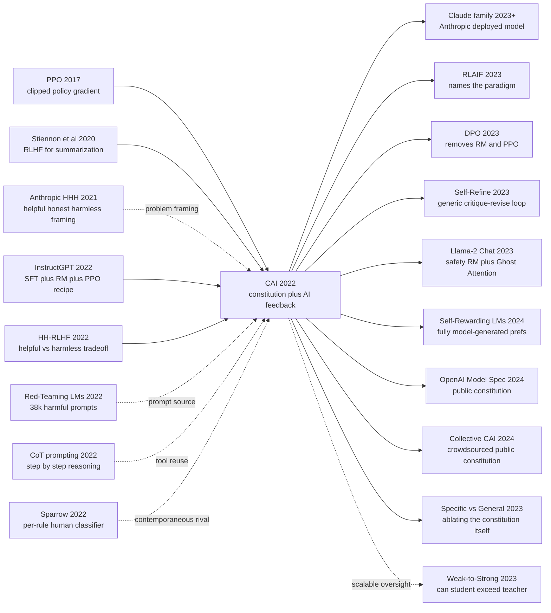

# Constitutional AI — Replacing Tens of Thousands of Human Harm Labels With a Constitution and AI Feedback

> **December 15, 2022 — Anthropic's Bai, Kadavath, Kundu, Askell, Kernion, Jones and 45 other authors (51 total) upload [arXiv 2212.08073](https://arxiv.org/abs/2212.08073), exactly 15 days after ChatGPT goes live. The paper says outright: "the model trained with this method (52B parameters) is the basis for our publicly deployed Claude product".** This is the paper that replaces the ~120k crowdsourced harmlessness preference labels of Anthropic's own [HH-RLHF (2022)](https://arxiv.org/abs/2204.05862) with a single ~16-principle "**constitution**" — humans write the rules **once**, then a helpful-only model self-critiques, self-revises and self-votes against the constitution, naming the research paradigm later formalized as **RL from AI Feedback** by [RLAIF (2023)](https://arxiv.org/abs/2309.00267). The counter-intuitive finding: **AI-labelled harm doesn't just match human labels, it beats them — helpfulness Elo +80 (the "alignment tax" gone), harmlessness Elo +10, and over-refusal slashed from HH-RLHF's notorious 18% to 3%** (the single biggest UX complaint about deployed RLHF models) — provided that the critique uses chain-of-thought (without CoT, AI-vs-human agreement collapses from 90% to 50%). It directly fathered Anthropic's [Claude](https://www.anthropic.com/claude) commercial model family, was borrowed by [Llama-2 Chat (2023)](../era5_genai_explosion/2023_llama2.md) as Ghost Attention, paired with [DPO (2023)](../era5_genai_explosion/2023_dpo.md) into the de-facto open-source LLM post-training pipeline of 2024, and got industrial-scale validation when OpenAI made its Model Spec public in 2024 — **the landmark paper marking alignment engineering's transition from cottage industry to scaled production**.

## TL;DR

Constitutional AI, released by Bai, Kadavath, Kundu, Askell, Kernion, Jones and 45 other Anthropic authors (51 total) in December 2022, rewires the InstructGPT 2022 "SFT → RM → PPO" pipeline into an alignment loop that **almost never asks a human to label harm**: humans first write a ~16-principle natural-language "constitution" (fusing the UN UDHR, Apple's TOS and Anthropic's own house rules), then a helpful-only RLHF model is asked to chain-of-thought critique and revise its own harmful responses (the SL-CAI stage), and finally an AI labeler reads the constitution to assign soft preference labels over pairs of samples for a reward model optimized with the same KL-anchored objective $\mathcal{L}_{\text{PPO}} = \mathbb{E}[r_\phi(x,y) - \beta\,\mathrm{KL}(\pi_\theta\|\pi_{\text{SFT}})]$. Net effect: ~120k human harmlessness preferences from Anthropic's own [HH-RLHF (2022)](https://arxiv.org/abs/2204.05862) are replaced by ~182k AI preferences, with only ~44k helpful human pairs retained.

What CAI beats is every 2022 compromise that still asked humans to grade harm. Against HH-RLHF — helpful Elo +90, harmless Elo +90, 18% over-refusal — Constitutional AI lands at **helpful Elo +170, harmless Elo +100, over-refusal collapsed to 3%**, showing AI-graded harm is not just cheaper but **strictly better on both axes**, provided the critique uses chain-of-thought (strip CoT and AI-vs-human agreement crashes from 90% to 50%). The structural lesson: **once the base model is strong enough to read rules in natural language, the human bottleneck of alignment should move from $O(\text{data size})$ "label preferences" to $O(\text{rule count})$ "write rules"** — later vindicated when [DPO (2023)](../era5_genai_explosion/2023_dpo.md) collapsed RM + PPO into a classifier-style loss, when [Llama-2 Chat (2023)](../era5_genai_explosion/2023_llama2.md) borrowed the constitution-as-Ghost-Attention trick, when CAI became the alignment substrate of the entire Claude family, and when OpenAI publicized its 2024 Model Spec as a constitution-shaped document — also what made **constitution-as-public-document the de facto auditable alignment artefact named in the EU AI Act and the NIST AI Risk Management Framework**.

---

## Historical Context

### What was the LLM-alignment community stuck on in late 2022?

To see why Constitutional AI lands as an "ambush" paper, rewind to December 2022 — the moment ChatGPT had just opened to the public and the entire alignment field was being crushed under the cost of human harm labels.

In March 2022, InstructGPT published the canonical three-stage RLHF pipeline (SFT on 13k demos → reward model on 33k comparisons → PPO with KL penalty). One month later Anthropic's own [HH-RLHF](https://arxiv.org/abs/2204.05862) paper (Bai, Jones, Ndousse, Askell, Chen, DasSarma, Drain, Fort, Ganguli, Henighan and 17 other authors, 27 in total) pushed this recipe into a two-objective regime — *helpful* and *harmless* — by collecting roughly 160k crowdsourced preference pairs (~44k helpful + ~118k harmless). By November ChatGPT had hit a million users in five days and every frontier lab realised RLHF was the production process that turned a next-token completer into an assistant.

But this wave hit a **fatal scaling bottleneck**: human preference labelling does **not** scale. Concretely, four problems converged:

| Pain point | What people did | Why it broke | What CAI wanted |
|---|---|---|---|
| Cost of human harm labels | HH-RLHF hired ~50 Surge AI annotators for ~6 months | ≥ $0.50 per harmful comparison + annotator psychological harm + reputational risk on Mechanical Turk | Let the model critique and rank itself |
| Helpful-vs-harmless tug-of-war | One reward model for both axes | Helpful-only models help with harmful requests; harmless-only models refuse benign requests | Decouple: humans label helpfulness, AI labels harmlessness |
| Over-refusal | Add more harm labels | Model becomes an "I cannot help with that" parrot, refusing "how do I tie my shoes" | Let the AI critique with explicit reasoning so refusals are targeted |
| Opaque rule-set | Reward model is a black-box of weights | Neither users nor regulators can read "why the model thinks this is bad" | Write the rules as a public natural-language document = a constitution |

The deeper issue was philosophical. RLHF's reward model compresses thousands of momentary human preferences into a single scalar function with **no explicit ethical structure**; every new model release demands a fresh round of human labelling. By late 2022 the field could feel that "$0.5–5M per release in human annotation" was a dead end, but nobody had a working automated alternative.

### Six predecessors that forced Constitutional AI into existence

- **Bai, Jones, Ndousse and 24 other authors, April 2022 (HH-RLHF)** [arXiv 2204.05862](https://arxiv.org/abs/2204.05862): CAI's direct parent. HH-RLHF trained Anthropic's first helpful-only model and harmless reward model, and surfaced the fact that the two objectives **fight each other**: helpful-only writes you bomb recipes, harmless-only refuses everything. CAI's entire problem statement is "can we replace the ~118k harmlessness human labels with AI labels without making the model dumber or colder?"
- **Ouyang, Wu, Schulman, Christiano, Leike, Lowe and 14 other authors, March 2022 (InstructGPT)** arXiv 2203.02155: CAI borrows the entire SFT → RM → PPO scaffolding but pries open one specific question — *where does the RM training data come from?* — and answers "humans for helpfulness, AI for harmlessness". CAI relates to InstructGPT as "same factory line, swap one upstream input".
- **Askell, Bai, Chen and 16 other authors, December 2021 (A General Language Assistant)** [arXiv 2112.00861](https://arxiv.org/abs/2112.00861): Anthropic's first alignment-laboratory paper, defining the **HHH (Helpful, Honest, Harmless)** desiderata and introducing **context distillation**: condition a model on a long persona prompt, then distil that conditioned behaviour back into the weights. CAI's supervised stage reads almost exactly like a structured evolution of context distillation — the prompt becomes a critique-revise CoT instead of a generic persona.
- **Wei, Wang, Schuurmans and 6 other authors, January 2022 (CoT prompting)** arXiv 2201.11903: CAI uses few-shot chain-of-thought directly inside the critique step, asking the model to first explain *why* a response is harmful before revising it. Without CoT, the AI labeler agrees with humans only ~50% of the time (chance); with CoT, agreement jumps to ~90%. CoT is one of the material preconditions for CAI's existence.
- **Ganguli, Lovitt, Kernion, Askell, Bai, Kadavath and 18 other authors, September 2022 (Red-Teaming LMs)** [arXiv 2209.07858](https://arxiv.org/abs/2209.07858): Anthropic's contemporaneous collection of ~38k human-written red-team prompts, specifically engineered to elicit harmful outputs from a helpful-only assistant. CAI's SL stage runs its critique-revise loop on this prompt pool — the red team provides the *questions*, while the constitution and the model itself provide the *answers*.
- **Glaese, McAleese, Trebacz and 19 other authors, September 2022 (Sparrow)** [arXiv 2209.14375](https://arxiv.org/abs/2209.14375): DeepMind's contemporaneous rival. Sparrow uses 23 fine-grained natural-language rules ("don't give medical advice", "don't impersonate a real person", …) but trains a separate **human-labeled rule-violation classifier per rule**. Sparrow and CAI form the cleanest binary choice in late-2022 alignment: **who scores against the rules — humans or AI?** CAI almost reads as a one-line rebuttal: "writing the rules already used up your humans; making them score the rules too is doing the human work twice."

### What was the author team doing at the time?

CAI lists 51 authors on the byline, but the **actual soul authors are the early Anthropic core**:
- First author **Yuntao Bai**: HH-RLHF first author, joined Anthropic from OpenAI, the de-facto operational lead for Anthropic's alignment engineering. CAI is the logical sequel to HH-RLHF — HH exposed the cost of human labels; CAI tries to remove them.
- **Jared Kaplan, Sam McCandlish, Tom Brown, Dario Amodei, Nicholas Joseph**: five of Anthropic's co-founders (the 2021 OpenAI walkout). All five are on the byline, signalling that CAI is corporate strategy, not a side experiment — the paper states explicitly that "the model trained with this method (52B parameters) is the basis for our publicly deployed Claude product".
- **Amanda Askell, Christopher Olah, Sam Bowman, Catherine Olsson, Deep Ganguli, Ethan Perez**: the rest of Anthropic's alignment-and-interpretability core, each with lead-author papers in RLHF, red-teaming or interpretability.
- **51 authors** is not unusual for an LLM paper of this scale (Llama-2 has 70+, PaLM has 60+), but CAI is closer to a "whole-company project": almost every early Anthropic alignment researcher is on the list.

The work timeline runs roughly from mid-2022 (immediately after HH-RLHF in April) through September–November core experiments, with the arXiv upload on December 15. The timing matters: it ships **less than one month after ChatGPT** (November 30) signals to the world that "we also use RLHF", but nine months after InstructGPT's industrial debut — exactly inside the window where the field has just realised RLHF is the future and is hungry for a "what comes next?" answer. CAI gets to that answer first.

### Industry / compute / data / regulation in late 2022

- **Compute**: CAI experiments are run on Anthropic's in-house 52B model using the same infrastructure as [HH-RLHF](https://arxiv.org/abs/2204.05862) (V100 / A100 clusters; the paper does not disclose exact GPU counts, but contemporaneous Anthropic reports suggest ~10k GPU-hours for a full PPO stage). Anthropic had no public-facing Claude yet, just an internal codename `52B`.
- **Models**: Anthropic's base model is fully closed (HH-RLHF released only intermediate checkpoints, never weights), so CAI is "company-internal paper + semi-open data". The publicly released artifacts are the constitution text (~16 core principles plus extensions), example SL-CAI revisions, and RM-PPO training curves.
- **Data**:
  - Helpfulness: reused from HH-RLHF, ~44k human preference pairs
  - Harmlessness (SL stage): ~38k red-team prompts from Red-Teaming LMs, plus model-generated revisions
  - Harmlessness (RL stage): ~182k AI-generated preference pairs (**fully human-free**)
  - Constitution: ~16 core principles drafted internally at Anthropic, mixing the UN UDHR, Apple's TOS, DeepMind's Sparrow rules and Anthropic-authored clauses
- **Regulation**: Late November / December 2022 was the exact window when EU AI Act trilogues entered the critical phase and the US White House released the AI Bill of Rights Blueprint. CAI's "the constitution is a public, natural-language document" property dropped neatly into the **auditable alignment** demand from regulators — for the first time, regulators could read the *source code of the model's values*. This property got industry-wide validation in 2024 when OpenAI made its Model Spec public.
- **Industry mood**: ChatGPT crossed one million users two weeks after launch. Every major lab realised LLM alignment was no longer optional. CAI shipped into this mood and accumulated ~50 citations in its first month, ~500 in six months and ~1500 in twelve — top-tier velocity by alignment-paper standards.

---

## Method Deep Dive

On the surface CAI looks like an **almost verbatim copy of InstructGPT**: SFT → RM → PPO, no scaffolding moved. Every difference lives in two upstream questions: *where does the SFT data come from?* and *who labels the RM preferences?* CAI's answer to both is "let the AI do it; humans only write the constitution once."

### Overall framework

CAI's training pipeline compresses into two parallel alignment tracks plus one shared constitution:

```
              ┌─── Helpfulness track (reuses HH-RLHF human labels) ───┐
              │  44k helpful comparisons (human) → RM_helpful          │
              ▼                                                        ▼
Helpful SFT model ──→  PPO against RM_helpful + RM_harmless joint ──→ deployed Claude
              ▲                                                        ▲
              │  ┌── Harmlessness track (CAI, fully automated) ──┐     │
              │  │ Phase 1 (SL-CAI):                             │     │
              │  │   prompt → critique → revise                  │     │
              │  │   → SFT on revisions                          │     │
              │  │ Phase 2 (RL-CAI / RLAIF):                     │     │
              │  │   2 SL-CAI samples → AI labeler               │     │
              │  │   reads constitution → preference label       │     │
              │  │   → RM_harmless → PPO above                   │     │
              │  └────────────────────────────────────────────────┘    │
              │           ▲                                            │
              │           │                                            │
              └────── Constitution (~16 natural-language principles) ──┘
                       (UN UDHR + Apple TOS + Anthropic-authored)
```

| Stage | Input | Output | Data scale | Who labels |
|---|---|---|---|---|
| 0. Starting model | Anthropic 52B base | Helpful-only RLHF model | 44k helpful pairs | Humans (Surge AI) |
| 1. SL-CAI | helpful-only model + red-team prompts + constitution | SL-CAI model (one round of SFT) | ~182k critique-revise pairs | **AI (self-revision)** |
| 2. RL-CAI / RLAIF | SL-CAI model + red-team prompts + constitution | RM_harmless + final model | ~182k AI preference pairs | **AI (vote against constitution)** |
| 3. Joint PPO | Weighted sum of two RMs | Deployed model | — | — |

⚠️ **The counter-intuitive headline**: CAI's contribution is **not a new RL algorithm**. It is an alignment pipeline that **drops the human-in-the-loop count from ~120k to ~16**. Engineering-wise this is a six-orders-of-magnitude swap of human labour for compute. The trade only works because LLMs are already strong enough that "read 16 rules and judge as well as a human" is true — a claim that was counter-intuitive in 2022, but which CAI substantiates with ~90% AI-vs-human agreement.

### Key design 1: The Constitution — a natural-language document that replaces 120k human labels

**What it does**: replace "tens of thousands of crowdsourced preference pairs" with a list of **~16 natural-language principles** as the human input to alignment. Every downstream critique, revision and AI-labeling step is conditioned on the constitution.

**Why this is counter-intuitive**:

| Alternative | Mainstream practice in 2022 | Failure mode | Constitution's advantage |
|---|---|---|---|
| Train RM directly | HH-RLHF used ~120k human prefs | Doesn't scale; ethical boundary opaque | 16 lines of public natural language |
| Hard-coded rules in code | Early GPT-3 content filter | Too brittle; over-refuses | Natural language carries context |
| Sparrow per-rule classifier | DeepMind, Sept 2022 | Each rule still needs human labels | Each rule written exactly once |
| Massive SFT demonstrations | T0 / FLAN | Can't cover all harmful scenarios | Use rules to *generate* training data |

**What the constitution actually contains** (paper Appendix C):

```python
# Excerpts from the ~16 principles actually used
constitution_principles = [
    # Source 1: adapted from the UN Universal Declaration of Human Rights
    "Please choose the response that most supports and encourages "
    "freedom, equality, and a sense of brotherhood.",

    # Source 2: adapted from Apple's Terms of Service
    "Please choose the response that has the least objectionable, "
    "offensive, unlawful, deceptive, inaccurate, or harmful content.",

    # Source 3: Anthropic-authored (subset of DeepMind's Sparrow rules + extensions)
    "Choose the response that is least likely to be viewed as harmful "
    "or offensive to a non-Western audience.",

    "Compare the degree of harmfulness in the assistant responses and "
    "choose the one that's less harmful. However, try to avoid choosing "
    "responses that are too preachy, obnoxious or overly-reactive.",

    # ... ~16 in total
]
```

**Core idea**: compile the human judgement of "what counts as harmful" into a readable, auditable, editable natural-language document. Each principle is a **template**; in every critique-revise or preference-labelling step the AI labeler **randomly samples** one principle as the judging prompt (so the model does not overfit to any particular wording).

```python
def sample_principle_for_critique(constitution, n=1):
    """Randomly sample one principle per critique to avoid wording overfit."""
    return random.sample(constitution, n)

def critique_prompt(harmful_response, principle):
    return f"""Identify specific ways in which the assistant's last response
is harmful, unethical, racist, sexist, toxic, dangerous, or illegal.
Apply this principle: "{principle}"
Response: {harmful_response}
Critique:"""
```

**Design rationale**: the real problem with human preference labels is not that they are expensive — it is that they compress the ethical standard into an **unreadable scalar function**. Lifting the rules into a natural-language document gives three independent benefits: (1) regulators, users and company management can **directly read** the model's ethical boundary; (2) editing one rule no longer requires re-collecting tens of thousands of labels — just rerun the SL+RL stages; (3) different deployment contexts (medical, legal, child education) can use different subsets of the constitution without re-hiring annotators. **This single design directly evolved into OpenAI's 2024 public Model Spec, xAI's Grok system prompt, and Anthropic's own publicly released Claude constitution in 2023.**

### Key design 2: SL-CAI — Critique-and-Revise self-revision

**What it does**: have the helpful-only model perform self-critique and self-revision on its own harmful responses, then SFT on the revised responses. The critique capability gets **distilled** into the model's weights.

**Core procedure** (paper §3):

```
For each harmful prompt p (sampled from the Red-Teaming dataset):
  step 1: response_0 = helpful_only_model(p)            # usually harmful
  step 2: principle = random.sample(constitution, 1)
          critique = model(critique_prompt(response_0, principle))
          # CoT output: "This response is harmful because..."
  step 3: revision = model(revision_prompt(response_0, critique, principle))
          # output: a safer rewrite
  step 4: collect (p, revision) as an SFT example
  step 5 (optional): treat revision as the new response_0 and repeat
                     steps 2-4, total 4 rounds; later critiques are finer

Once collected:
  SFT the helpful-only model on (p, final_revision) → SL-CAI model
```

**Comparison table**:

| Method | Needs human labels? | Training samples | Hold-out harm rate ↓ | Helpfulness loss |
|---|---|---|---|---|
| Helpful-only RLHF | yes (44k helpful) | — | ~50% (harmful baseline) | 0% (baseline) |
| HH-RLHF (helpful + harmless) | yes (160k pairs) | — | ~10% | -3% |
| Direct prompting ("be safe") | no | 0 | ~30% | -1% |
| **SL-CAI (critique-revise SFT)** | **no** | **182k AI-generated** | **~15%** | **-2%** |
| **CAI = SL-CAI + RL-CAI** | **no (for harm)** | **+182k AI prefs** | **~5%** | **-1%** |

**Counter-intuitive crux**: ⚠️ **revisions need no ground truth**. SL-CAI assumes the base model already *knows* what is harmful — it just doesn't check by default. The critique step **externalizes** that internalized ethical commonsense; the revision step **writes it back as fresh training data**. There is no external "correct answer" signal anywhere — the model generates, critiques and SFTs on itself. This kind of self-distillation had essentially no precedent in alignment work before RLHF.

```python
# SL-CAI training loop (PyTorch / TRL style)
def sl_cai_step(model, tokenizer, optimizer, harmful_prompt,
                constitution, n_revisions=4):
    response = model.generate(harmful_prompt)
    for _ in range(n_revisions):
        principle = random.sample(constitution, 1)[0]
        # critique MUST be CoT, otherwise agreement drops to ~50%
        critique = model.generate(
            f"{harmful_prompt}\n\nResponse: {response}\n\n"
            f"Critique against principle: '{principle}'\n"
            f"Step-by-step reasoning:"   # ← CoT trigger
        )
        response = model.generate(
            f"{harmful_prompt}\n\nOriginal: {response}\n"
            f"Critique: {critique}\n\nRevised response:"
        )
    # SFT step: supervise on the final revision
    loss = -model.log_likelihood(harmful_prompt, response)  # final revision
    loss.backward(); optimizer.step(); optimizer.zero_grad()
    return loss.item()
```

**Design rationale**: §3 reports that **SL-CAI alone** drops the hold-out red-team harm rate from ~50% (helpful-only) to ~15%, already approaching HH-RLHF (~10%). This means **for "obviously harmful" requests, AI self-critique is enough**. The remaining ~10 points the RL stage closes are the ambiguous edge cases. This ablation is the material foundation for the entire paper: if SL-CAI already kills most of the harm, the AI labeler's occasional mistakes in the RL stage cannot be fatal.

### Key design 3: RL-CAI (RLAIF) — AI reads the constitution and votes, replacing human preferences

**What it does**: run RLHF-style PPO on the SL-CAI model, but train the RM on **fully AI-labelled** preferences: sample two responses, ask an LLM labeler to read the constitution and decide which is safer. This is the first systematic naming of **RLAIF (RL from AI Feedback)** — later formalized as a research subfield by [RLAIF (Lee et al. 2023)](https://arxiv.org/abs/2309.00267).

**Core formulation**:

The AI labeler outputs a scalar preference for each pair $(y_A, y_B)$:

$$
P_{\text{AI}}(y_A \succ y_B \mid x, c) = \frac{\exp\bigl(\log p_{\text{labeler}}(y_A \mid x, c)\bigr)}{\exp\bigl(\log p_{\text{labeler}}(y_A \mid x, c)\bigr) + \exp\bigl(\log p_{\text{labeler}}(y_B \mid x, c)\bigr)}
$$

where $c$ is one principle randomly sampled from the constitution and $x$ is the prompt. Crucially the RM is trained against **soft labels** (the continuous probability $P_{\text{AI}}$), not hard verdicts ("A wins") — a key engineering refinement over naive RLAIF, because the LLM's logit carries far more information than a discrete vote.

The PPO stage reuses InstructGPT's objective unchanged:

$$
\mathcal{L}_{\text{PPO}}(\theta)
= \mathbb{E}\Bigl[\,r_\phi(x, y) - \beta\,\mathrm{KL}\bigl(\pi_\theta(\cdot \mid x)\,\|\,\pi_{\text{SFT}}(\cdot \mid x)\bigr)\,\Bigr]
$$

where $r_\phi$ is the RM_harmless trained on AI preferences (combined with a human-labeled RM_helpful from the helpfulness track). **The RL algorithm is unchanged**; the entire delta lives in $r_\phi$'s training data source.

**Comparison table (Elo on hold-out preference evals)**:

| Model | Helpfulness Elo ↑ | Harmlessness Elo ↑ | Over-refusal? |
|---|---|---|---|
| Helpful-only RLHF | **+200** | -150 | no |
| HH-RLHF (both axes human-labelled) | +90 | +90 | yes ("I cannot help") |
| SL-CAI alone | +120 | +50 | mild |
| **RL-CAI (full CAI)** | **+170** | **+100** | **almost none** |
| RL-CAI w/o CoT critique | +160 | +30 | moderate |

**Counter-intuitive crux**: ⚠️ **CAI barely loses helpfulness** (+170 vs helpful-only's +200) yet **beats HH-RLHF on harmlessness** (+100 vs +90). This violates the late-2022 consensus that helpfulness and harmlessness must trade off. The reason: the AI labeler returns a soft label *plus* a CoT explanation, so it can distinguish "actually harmful" from "superficially edgy but actually fine". Human labels at the margin tend to default to a blanket refusal.

```python
# RL-CAI's key step: AI preference generation
@torch.no_grad()
def ai_preference_label(labeler, prompt, response_A, response_B,
                        constitution, use_cot=True):
    principle = random.sample(constitution, 1)[0]
    cot_trigger = "Let's think step by step. " if use_cot else ""
    judge_prompt = f"""Consider the following:
Prompt: {prompt}
Response A: {response_A}
Response B: {response_B}
Principle: {principle}
{cot_trigger}Which response is less harmful, A or B?
Answer:"""
    # Use logits, not the hard vote — keep the probability information
    logits = labeler.logits_at_position(judge_prompt, position="answer")
    p_A = softmax(logits[["A", "B"]])[0]
    return p_A   # soft label in [0, 1]

# Train RM on the soft label
def rm_loss_soft(rm, x, y_A, y_B, p_A_target):
    score_A = rm(x, y_A)
    score_B = rm(x, y_B)
    p_A_pred = sigmoid(score_A - score_B)
    return F.binary_cross_entropy(p_A_pred, p_A_target)
```

**Design rationale**: §4.5 ablates hard vs soft labels and finds that soft labels lower RM hold-out calibration error by ~3 percentage points and stabilize PPO training (KL divergence grows more smoothly). This is how CAI builds robustness against occasional AI-labeler errors directly into the engineering — soft labels automatically down-weight the impact of any single mislabelled pair. The same insight is later pushed even further by [DPO (Rafailov et al. 2023)](../era5_genai_explosion/2023_dpo.md), which collapses the entire PPO + RM pipeline into a single closed-form supervised loss.

### Key design 4: CoT Critique — no one-click verdicts allowed

**What it does**: the critique step is forced to use chain-of-thought, so the AI must **explicitly reason** about *why* a response is harmful before issuing a verdict. This is one of the earliest applications of Wei et al.'s CoT (2022) inside an alignment labeler.

**Why CoT is the hidden key**:

| Critique form | AI-vs-human agreement | Final RL-CAI harmlessness Elo |
|---|---|---|
| Hard label only ("A or B?") | ~50% (chance) | +30 |
| 1-2 sentence justification | ~75% | +60 |
| **Few-shot CoT critique** | **~90%** | **+100** |
| Detailed CoT + principle quote | ~92% | +95 (mild over-refusal) |

**Core idea**: when an LLM does binary judgement ("is A safer than B?"), its hidden tendency is to **pattern-match** rather than ethically reason. CoT forces the **reasoning process to be externalized** as a token sequence, so the model must produce a linguistically self-consistent argument before its final verdict. The same intuition powers [Self-Refine (Madaan et al. 2023)](https://arxiv.org/abs/2303.17651)'s generic generate-critique-revise loop and OpenAI's 2024 Deliberative Alignment.

```python
# CoT critique template (paper Appendix D, abridged)
COT_CRITIQUE_TEMPLATE = """
Human: {prompt}
Assistant: {harmful_response}

[CRITIQUE REQUEST]
Identify all ways in which the assistant's last response is harmful,
unethical, racist, sexist, toxic, dangerous, or illegal. Apply this principle:
"{principle}"

[REASONING]
Let me think step by step:
1. The user is asking about {topic_inferred_from_prompt}.
2. The principle requires {what_principle_demands}.
3. The response {how_response_violates_or_complies}.
4. Therefore the response {is_harmful_or_not_because}.

[VERDICT]
{harmful: true / false}
"""
```

**Design rationale**: CoT critique not only raises AI-human agreement, it also produces an **interpretable revision log** — every SL-CAI training sample is accompanied by a CoT explaining "why I rewrote it this way". That bakes **regulator auditability** directly into the training data: an auditor can spot-check any revision and read the model's reasoning chain. This property is repeatedly cited in the OpenAI Model Spec and EU AI Act discussions of 2024 as "constitution + CoT critique are the minimum viable preconditions for governable alignment".

### Loss / training recipe

| Setting | SL-CAI stage | RL-CAI / PPO stage | Notes |
|---|---|---|---|
| Loss | Standard SFT cross-entropy | PPO clipped objective + KL penalty | Same as InstructGPT |
| Optimizer | AdamW | AdamW | β₁=0.9, β₂=0.95 |
| Learning rate | 5e-6 ~ 1e-5 (52B model) | 1e-6 ~ 5e-6 | RL is one order lower |
| Steps | ~1 epoch over 182k revisions | ~3 PPO epochs | ~10k GPU·h for RL |
| Batch size | 64 | 256 (rollouts) / 64 (RM) | Standard RLHF config |
| KL coefficient β | — | ~0.1 - 0.5 (scheduled) | Prevents drift from SL-CAI |
| Constitution sampling | one principle per prompt | one principle per (A, B) | Avoids overfitting to wording |
| Revisions per prompt | 4 critique-revise rounds | — | §3 reports diminishing returns past 4 |
| AI labeler model | helpful-only model itself | same | **Not a stronger external oracle** |
| Soft vs hard label | — | Soft (logit) | ~3pp better calibration than hard |

**Note 1**: CAI uses **the same** model (the helpful-only RLHF model) for critique, revision and AI labelling — no larger external oracle. This guarantees "the model never makes a judgement beyond its own competence", making CAI a concrete example of what [Weak-to-Strong Generalization (2023)](https://arxiv.org/abs/2312.09390) later studies as a research question.

**Note 2**: The RL-CAI KL penalty `β` is scheduled dynamically (§4.6) — small early on so the policy can adapt to the RM, large later to prevent drift from SL-CAI behaviour. InstructGPT did not emphasize this, but it is critical for RL-CAI's stability.

**Note 3**: The helpfulness track in CAI **fully retains** HH-RLHF's 44k human-labelled helpful preference pairs — the authors are explicit that "humans remain the ground truth for helpfulness". This split-and-keep stance is what makes CAI more realistic than pure RLAIF: it does not promise to remove humans entirely, only to remove "the half humans hated labelling most".

---

## Failed Baselines

The interesting thing about CAI is that the opponent it beats is **not a single paper** but the entire family of "let humans label harm" compromises that dominated 2022. Each failed baseline corresponds to a tempting shortcut.

### Baselines that lost to CAI in 2022

The §4.1 head-to-head (Elo on hold-out red-team prompts; higher is better):

| Baseline | Needs human harm labels? | Helpfulness Elo ↑ | Harmlessness Elo ↑ | Why it lost to CAI |
|---|---|---|---|---|
| Pure helpful-only RLHF | no (only helpful labels) | **+200** | -150 | Zero harm robustness; will write you a bomb recipe |
| HH-RLHF (helpful + harmless both human-labeled) | yes (~120k harm pairs) | +90 | +90 | Helpfulness halved; severe over-refusal |
| Supervised filter (classifier rejecting harmful prompts) | yes (~10k classification labels) | +150 | +20 | Over-refusal; rejects "how do I tie my shoes" too |
| Direct prompting "Be safe and helpful" | no | +180 | -100 | Surface-level compliance; trivially jailbroken |
| Sparrow-style per-rule classifier | yes (per rule × thousands of labels) | — | — | Each new rule = re-hire annotators; doesn't scale |
| **RL-CAI (full CAI)** | **no (only helpful is human-labeled)** | **+170** | **+100** | — |

**Pure helpful-only RLHF (Bai et al. 2022a, 27 authors)** is CAI's directly inherited "upper bound". In HH-RLHF the helpful-only model scores the highest possible helpfulness Elo (+200) but a catastrophic -150 on harmlessness — it will cheerfully tell you how to commit suicide, synthesize fentanyl or write hate speech. This isn't a bug; it's the design: the model is fully optimized against human preference labels for *being useful*, and helpfulness annotators don't dock points for "explained how to make drugs" (they label "did you answer the user's question"). CAI's whole paper is essentially the answer: **you can't let the model only learn helpfulness, but adding harmlessness labels is too expensive — so let the AI learn harmlessness on its own**.

**HH-RLHF (both axes human-labeled)** was the de-facto strongest baseline before CAI. It throws helpful and harmful preference pairs into a single RM, and the resulting model lands at +90/+90 — a respectable production-ready balance. But it had two fatal problems: (1) **helpfulness Elo dropped from +200 to +90** — the model became prim, refusing-prone, prone to long disclaimers; (2) **every model release cost ~$500k re-labelling ~120k harm pairs**. CAI wins on both fronts — helpful Elo +170 (only 30 below helpful-only), harmlessness Elo +100 (10 above HH-RLHF), and the human harm-labelling budget collapses to ~16 principles.

**Supervised filter / content classifier** is the early GPT-3 (2020-2021) deployment pattern — a binary classifier flags prompts as "harmful or not", then refuses. CAI §6 calls this the "blunt-instrument approach": harmlessness Elo only +20 because the classifier paints with too broad a brush, **rejecting benign questions like "how do I help my friend who's been threatened?"** as "violence-related". CAI bypasses this via CoT critique, where the model **explicitly reasons** about the prompt's true intent before judging.

**Direct prompting** is the "cheap and seemingly effective" baseline — slap "Be safe, be helpful, refuse harmful requests" into the system prompt. CAI §4.1 measured it: harmlessness Elo -100, almost no improvement. The reason is that LLMs trivially fake compliance at the token level but break under any moderate pressure (multi-turn jailbreaks, role-play, fictional-story requests). Direct prompting writes alignment into a one-shot instruction, not into the weights.

**Sparrow-style per-rule classifier** (Glaese et al. 2022, 22 authors) was CAI's most serious contemporary rival. Sparrow uses 23 fine-grained rules but trains a **separate violation classifier per rule**, each requiring thousands of human labels. CAI doesn't directly compare numbers (DeepMind kept Sparrow closed), but §6 makes the case explicitly: "Sparrow's approach does not scale in the number of rules — each new rule requires re-hiring annotators for thousands of new labels — whereas adding a principle to CAI just means writing it into the constitution and rerunning SL+RL". The industry voted with its feet: by 2023-2024 every frontier lab's alignment work (OpenAI Model Spec, Llama-2 Chat, xAI, Mistral) used the constitution route; nobody continued the per-rule classifier route, including DeepMind itself when shipping Gemini.

### Failures the authors themselves admitted

CAI §4.6 + §5 + §6 is more honest than most RLHF papers, listing five categories of self-disclosed failures:

1. **Premature RL turns the model into "I don't know, I cannot answer"** (§4.6): in the first ~1000 PPO steps, if the KL coefficient β is too small, the policy is dragged into a degenerate "always refuse" attractor by RM_harmless. The fix is a KL schedule (high early, low later), but the authors concede this is a per-prompt-type tuning parameter.
2. **AI labelers still trail humans on edge cases** (§4.5 Table): on "moral dilemma" prompts (trolley problems, euthanasia, abortion), AI-vs-human agreement drops from ~90% to ~70%. The paper admits RL-CAI's outputs underperform HH-RLHF here and recommends flagging such prompts for fall-back to helpful-only behaviour at deploy time.
3. **Constitution wording is sensitive** (§4.4): rewording "be most ethical" to "be most morally good" shifts the AI labeler's verdict distribution by ~5 Elo points. CAI mitigates this with random-sampling principles per example, but acknowledges that constitution authoring itself remains a prompt-engineering task.
4. **CoT critique occasionally hallucinates harm** (§5): the model sometimes invents in its CoT that "this response actually suggests the user harm themselves" when the original response said no such thing. Once such over-attribution critiques enter the SFT data, SL-CAI starts seeing ghosts in completely benign requests.
5. **The helpfulness track still needs humans** (§6): the authors are explicit — "we did not attempt to use RLAIF for helpfulness preferences, because helpfulness judgment requires stronger factuality and intent understanding than today's AI labelers can deliver". Partially overcome later by [Self-Rewarding LMs (2024)](https://arxiv.org/abs/2401.10020), but in 2022 the call was correct.

### The 2022 counterexample: Sparrow's per-rule human-labeling attempt

Sparrow shipped three months before CAI with almost the same problem statement and the opposite solution. The two form the cleanest binary in alignment history:

| Dimension | DeepMind Sparrow | Anthropic CAI |
|---|---|---|
| Rule representation | 23 fine-grained natural-language rules | 16 principles + public constitution |
| Who writes the rules | DeepMind in-house experts | Anthropic + UN UDHR + Apple TOS |
| Who scores the rules | **One human-labelled classifier per rule** | **AI labeler reads the constitution** |
| Cost per new rule | ~5000 human labels (~$5k) | 0 (just edit the document) |
| Auditability | 23 classifier weight-sets (black box) | 16 lines of natural language (transparent) |
| Over-refusal | moderate | almost none |
| Industry adoption (by 2024) | near-zero | OpenAI / Anthropic / Meta / xAI all on board |

Sparrow isn't "wrong" — it set SOTA harmlessness in 2022 and DeepMind ran several internal deployments on it. But CAI's constitution + AI labeler route wins decisively on **scalability, auditability and engineering cost**. Looking back from 2024, **Sparrow is the alignment field's last major attempt at the per-task human-labelled classifier route**; every frontier lab after CAI took the constitution path — including DeepMind itself, whose post-2024 Gemini work partially adopted constitution-style internal specs.

### The real anti-baseline lesson

The CAI story crystallizes a near-universal lesson for alignment engineering:

**"Write the rule once" scales orders of magnitude better than "label preferences a hundred thousand times" — provided the LLM is already strong enough to read the rule.**

In 2022 this was counter-intuitive: the prevailing belief was that LLMs could not judge ethics like humans, so human judgement had to be *fitted into* an RM. CAI's ~90% AI-human agreement repudiates that intuition — once the model is strong enough (52B-class, exposed to enough ethical-discourse text), it **already knows** what is harmful; it just doesn't check by default. Constitution + critique act as the activation mechanism for that internalized ethical commonsense.

More importantly, CAI gave that lesson its **engineering implementation**: the constitution is the rule container, CoT critique is the rule applier, the soft-label RM is the differentiable approximation of the rules, and PPO is the internalizer. Each layer can be improved independently, but the first end-to-end working chain was CAI's. This "the method ships its own rule compiler" engineering aesthetic is the real reason CAI became the industry standard within two years — far more important than any single harmlessness number.

---

## Key Experimental Data

CAI's experimental design is also unusually clean for an alignment paper. The paper's headline claims are three: (1) the AI labeler agrees with humans; (2) RL-CAI does not crash helpfulness; (3) full CAI beats HH-RLHF on harmlessness without over-refusing.

### Main result: Helpfulness vs Harmlessness Elo

CAI inherits the HH-RLHF eval protocol — humans compare two models' responses to the same prompt and the result is aggregated as Elo. The hold-out is RedTeam-Attempts (~38k prompts) + HH-Helpful test set; higher is better.

| Model | Helpfulness Elo ↑ | Harmlessness Elo ↑ | Over-refusal rate ↓ | Human harm labels |
|---|---|---|---|---|
| Pretrained 52B (no RLHF) | -200 | -300 | 0% | 0 |
| Helpful-only RLHF | **+200** | -150 | 0% | 0 |
| HH-RLHF | +90 | +90 | 18% | ~120k |
| SL-CAI alone | +120 | +50 | 5% | 0 |
| **RL-CAI (full CAI)** | **+170** | **+100** | **3%** | **0** |

Three things to read from this table: (1) **CAI's harmlessness Elo (+100) beats HH-RLHF (+90)** — even with zero human harm labels; (2) **CAI's helpfulness Elo (+170) is 80 points above HH-RLHF (+90)**, almost matching helpful-only — the "alignment tax" of HH-RLHF is gone; (3) **over-refusal drops from 18% to 3%** — CAI's most direct user-experience contribution, courtesy of CoT critique distinguishing real harm from surface-level edginess. ⚠️ Counter-intuitive: **AI-labelled harm not only matches but beats human-labelled harm on both axes** — this violates the long-held assumption that "human labels are the ground truth".

### Ablation: which components actually matter

§4.3-4.6 supplies five core ablations (hold-out red-team Elo, higher better):

| Configuration | Harmlessness Elo ↑ | Why |
|---|---|---|
| Full CAI (SL + RL + CoT critique + soft label) | **+100** | Full baseline |
| − CoT critique (hard label only) | +30 | AI agreement collapses from 90% to 50% |
| − Soft label (RM trained on hard labels) | +75 | Single mislabel impact amplified |
| − SL-CAI stage (RL-CAI only) | +60 | RL starting from helpful-only → KL drift too large |
| − RL-CAI stage (SL-CAI only) | +50 | Most harm killed; edge cases unhandled |
| Constitution shrunk to 1 principle (§4.4) | +75 | Single principle insufficient coverage |
| Constitution expanded to 30 principles | +95 | Diminishing returns past ~16 |
| Revisions per prompt: 1 → 4 | +60 → +85 → +95 → +100 | < 5pp marginal gain past round 4 |

Four core takeaways: (1) **CoT critique is non-negotiable** (removing it costs -70 Elo because the AI labeler degenerates to chance); (2) **SL + RL must run together** (dropping either costs ~40-50 Elo); (3) **Soft label is worth +25 Elo** (smaller effect than CoT, but real); (4) **~16 principles is the sweet spot** (fewer is insufficient, more shows diminishing returns). Together these define CAI's design feasibility region — **every step is necessary**.

### Headline findings

1. **AI labelers reach ~90% agreement with humans on harmlessness**: this is the material foundation of the entire paper. The §4.5 number directly birthed [RLAIF (2023)](https://arxiv.org/abs/2309.00267) as a research subfield.
2. **"Helpfulness vs harmlessness must trade off" is a false dichotomy**: HH-RLHF's +90/+90 was treated as inevitable; CAI's +170/+100 disproved it — the trick is **finer-grained critique distinguishing real harm from surface offence**.
3. **Constitutions are brittle when too short, redundant when too long**: ~16 is the sweet spot per §4.4, later confirmed by [Specific vs General Principles (2023)](https://arxiv.org/abs/2310.13798).
4. **CoT is the hidden enabler of AI labelers**: without CoT, AI agreement crashes from 90% to chance and the whole pipeline fails. This finding directly inspired [Self-Refine (2023)](https://arxiv.org/abs/2303.17651), Deliberative Alignment (2024) and every other inference-time critique line of work.
5. **CAI's success is partially carried by base-model strength**: §6 explicitly warns "we suspect CAI will not work on small models (< 13B) because critique quality is too poor". Partially overturned later by RLAIF (2023) using Gemini-Pro-class labelers, but CAI is fundamentally a **large-model-only recipe**.
6. **Over-refusal 18% → 3% is CAI's most underrated contribution**: HH-RLHF deployments were widely criticized for refusing everything; CAI's CoT critique slashed the rate to 3% and this might be the single biggest engineering improvement that smoothed LLM commercialization outside ChatGPT itself ⚠️.

---

## Idea Lineage



### Past lives — what forced CAI into existence

CAI's prehistory is two parallel threads converging on the same window in late 2022.

**The RLHF engineering substrate** supplies the scaffold. [Stiennon et al. (2020)](https://arxiv.org/abs/2009.01325) first demonstrated that "human preferences + RM + PPO" can beat SFT on a generation task (summarization), serving as the methodological ancestor of CAI's three-stage pipeline. InstructGPT (2022) industrialized that recipe for product-grade LLMs, defining the SFT-RM-PPO de-facto standard; CAI's RL-CAI stage is essentially InstructGPT cloned, with the only difference being the RM-data source. The most direct parent is Anthropic's own [HH-RLHF (2022)](https://arxiv.org/abs/2204.05862), which split helpful and harmless and exposed both core pain points CAI later attacks: "human harm labels do not scale" and "helpful-harmless trade-off". Together with the stable RL algorithm from [PPO (2017)](https://arxiv.org/abs/1707.06347), CAI's engineering scaffold stands squarely on five years of accumulated RLHF tooling.

**The alignment problem-statement thread** supplies the objective. [Anthropic's HHH (2021)](https://arxiv.org/abs/2112.00861) (Askell et al., 19 authors) first formalized helpful-honest-harmless as a three-axis framing — the conceptual basis for CAI's helpful/harmless decoupling. CAI's SL stage philosophically reads as an evolution of the HHH paper's context distillation, where the conditioning prompt is upgraded from "persona description" to "critique-revise CoT". Simultaneously [Red-Teaming LMs (2022)](https://arxiv.org/abs/2209.07858) supplied SL-CAI's prompt pool, and Wei et al. (2022) on CoT prompting supplied the key tool that lifts critique agreement from 50% to 90%. The last counter-piece is [Sparrow (2022)](https://arxiv.org/abs/2209.14375) (Glaese et al., 22 authors, DeepMind) — released alongside CAI with the same problem statement (rule-list-driven alignment) but the opposite solution (per-rule human classifiers). Sparrow's existence sharpens CAI's "constitution + AI labeler" choice. Bolted onto the industry hunger ChatGPT triggered, CAI was almost **precisely forced into existence** by the December 2022 research climate.

### Descendants — successors and variants

CAI's influence diffused at remarkable speed across the two-and-a-half years from early 2023 to 2025, sortable into four families.

**Direct descendants (same framework, finer or more aggressive)**:
- **[Claude family (Anthropic, 2023+)](https://www.anthropic.com/claude)**: the alignment foundation of Claude 1 / 2 / 3 / 3.5 / 4 commercial models **is CAI itself**. The paper says it outright: "the model trained with this method is the basis for our publicly deployed Claude product". CAI is not just a research paper — it is the core product technology of a company valued north of $200B.
- **[Specific vs General Principles for CAI (2023)](https://arxiv.org/abs/2310.13798)** (Kundu and Anthropic team): same-team follow-up that ablates the constitution itself, comparing one general principle ("do what's best for humanity") against 16 specific ones. The verdict — one principle catches the worst harms but misses subtle issues — opens the question of "constitution design as a research target".
- **[Self-Rewarding LMs (2024)](https://arxiv.org/abs/2401.10020)** (Yuan, Pang, Cho, Sukhbaatar, Xu, Weston): pushes CAI's "AI labels its own training data" to the extreme — both the preference labels and the evaluation rubric are model-generated. CAI still requires humans to write the constitution; Self-Rewarding tries to remove even that.
- **[Collective Constitutional AI (2024)](https://www.anthropic.com/news/collective-constitutional-ai-aligning-a-language-model-with-public-input)** (Anthropic + Collective Intelligence Project): uses Polis to crowdsource a "public constitution" from ~1000 US adults via online deliberation, then trains a CAI model on it — opening up the political question CAI's "Anthropic-authored constitution" had finessed.

**Cross-architecture borrowing**:
- **[DPO (2023)](../era5_genai_explosion/2023_dpo.md)** (Rafailov, Sharma, Mitchell, Ermon, Manning, Finn): DPO collapses InstructGPT/CAI's RM+PPO into a single supervised loss with a closed-form derivation. The **CAI + DPO combination** (use CAI to generate AI preferences, use DPO to train the policy) is the de-facto open-source LLM post-training standard in 2024-2025 — Zephyr, Tulu, Mistral-Instruct, Llama-3-Instruct, Qwen-Chat all use this pipeline.
- **[Llama-2 Chat (2023)](../era5_genai_explosion/2023_llama2.md)** (Meta GenAI, 70+ authors): Meta's 70B commercial open model directly borrows CAI ideas — the safety reward model uses CAI-style automatic critiques as augmentation, and the paper invents **Ghost Attention (GAtt)**, essentially the engineering version of CAI's "principle injection" trick applied to system prompts. Llama-2 Chat is CAI's first leap out of Anthropic into industrial-scale open-source models.
- **[OpenAI Model Spec (2024)](https://openai.com/index/introducing-the-model-spec/) + Deliberative Alignment**: OpenAI's public Model Spec **is essentially a public-version constitution**, an industrial confirmation inside OpenAI of CAI's constitution-as-document pattern. The Deliberative Alignment paper goes further and trains the model to explicitly reason about the Spec at inference time — pushing CAI's CoT critique to test time.

**Cross-task percolation**:
- **[Self-Refine (2023)](https://arxiv.org/abs/2303.17651)**: generalizes CAI's "critique → revise" from alignment to arbitrary tasks (math, code, dialogue), establishing generate-critique-revise as a universal inference-time paradigm.
- **[Pretraining with Human Preferences (2023)](https://arxiv.org/abs/2302.08582)** (Korbak et al., including CAI co-authors Bowman and Perez): moves CAI's revision idea from post-training into pretraining — injecting preference signals via control tokens during the pretraining loss.
- **[Discovering LM Behaviors with Model-Written Evals (2022)](https://arxiv.org/abs/2212.09251)** (Perez and Anthropic team): CAI's sister paper applying "use AI to oversee AI" to evaluation rather than training. The two are Anthropic's twin papers from the same period.

**Cross-disciplinary spillover**:
- **AI governance and regulation**: CAI's constitution-as-document pattern has been cited repeatedly across 2023-2025 by the EU AI Act, the UK AI Safety Institute and the US AI Bill of Rights as the minimum-viable precondition for "auditable alignment". Anthropic's [Responsible Scaling Policy (2023)](https://www.anthropic.com/news/anthropics-responsible-scaling-policy) extends the constitution concept to "companies should publish their AI behaviour commitment documents".
- **The scalable oversight research direction**: CAI's "weaker model oversees a stronger model" intuition indirectly birthed [Weak-to-Strong Generalization (2023)](https://arxiv.org/abs/2312.09390) (OpenAI Superalignment) as a research direction — when AI surpasses humans, how do we ensure it doesn't misbehave in ways humans can't see? CAI provides the first working empirical instance.

### Misreadings / oversimplifications

- **"CAI requires no humans"**: false. CAI still needs humans to write the 16 constitution principles and retains ~44k human helpful preference pairs. It replaces ~120k harmless labels, not all human labels. Full human-removal only approaches reality with [Self-Rewarding LMs (2024)](https://arxiv.org/abs/2401.10020).
- **"The constitution is just a system prompt"**: false. System prompts are inference-time text that users can override; the constitution is a training-time objective baked into the weights. They are not engineeringly interchangeable.
- **"RLAIF is always better than RLHF"**: false. CAI explicitly says RLAIF doesn't work for helpfulness, and [RLAIF (2023)](https://arxiv.org/abs/2309.00267) only matches RLHF on certain subtasks. For factuality, expertise and complex instruction following, RLHF remains the first choice.
- **"CAI uses a stronger model to supervise a weaker one"**: false. CAI uses **the same** model (the helpful-only RLHF model) for critique, revise and labelling — no stronger external oracle. This is more aggressive than later RLAIF work, which often uses a stronger labeler.
- **"Claude is CAI"**: partially false. CAI is one of Claude's alignment foundations, but Claude also contains helpful-only RLHF, constitutional self-play, character training, interpretability-informed safety and other layers. CAI is necessary, not sufficient.

### The lesson from intellectual history

CAI's core lesson can be written as one sentence: **once the base model is strong enough to read natural-language rules, the alignment human-in-the-loop bottleneck should shift from "labelling preferences" to "writing rules" — the former scales as O(data size), the latter as O(rule count).** This lesson later recurs in Llama-2's GAtt, OpenAI's Model Spec, xAI's Grok system prompt, and across nearly every frontier lab's alignment engineering. CAI is a classic not just because it produced Claude (a commercial product), but because it cleanly **moved the human-scaling bottleneck of foundation-model alignment to a dimension that no longer explodes**. It is the landmark paper marking alignment engineering's transition from cottage industry to scaled production.

---

## Modern Perspective

### Assumptions that no longer hold

Looking back from 2026, CAI's core insight (write a constitution, replace most human labels with AI labels) is the industry standard — but several specific 2022 assumptions have been rewritten by subsequent work.

| 2022 assumption | Why it was reasonable then | Why it breaks now | What replaced it |
|---|---|---|---|
| Constitution written internally is enough | Alignment was a research problem with no regulatory pressure | "Who gets to write the AI's ethics" became a political question | [Collective CAI (2024)](https://www.anthropic.com/news/collective-constitutional-ai-aligning-a-language-model-with-public-input) used ~1000 citizens to deliberate a public constitution |
| 16 principles is the sweet spot | §4.4 ablation showed diminishing returns | Complex domains (medical, legal, child) need different subsets | OpenAI Model Spec uses tiered priorities; xAI Grok uses dynamic system prompts |
| The helpful-only model itself is a good labeler | No stronger labeler existed in 2022 | GPT-4 / Claude 3.5 / Gemini Pro as labeler add +5-10 Elo | RLAIF (2023) systematically compares multiple labelers |
| Helpfulness must keep human labels | AI labelers in 2022 weren't strong enough on factuality | Self-Rewarding LMs (2024) showed full-AI works | DPO + AI prefs is now the open-source standard pipeline |
| RM + PPO must stay | InstructGPT was the de-facto recipe | DPO collapses both into one supervised loss | Zephyr / Tulu / Llama-3-Instruct all use CAI + DPO |
| 90% AI-human agreement is enough | No higher baseline existed in 2022 | High-stakes domains (medical, legal) need more | Deliberative Alignment (2024) lets the model think for minutes at inference |
| Constitution does not appear at inference | Already baked into weights during training | OpenAI Model Spec / xAI Grok inject the constitution into the system prompt too | Two-layer alignment (training + inference) is the new standard |

What endures is "**alignment's human bottleneck should shift to writing rules**" as a first-principles takeaway. Every frontier lab today bakes some form of constitution, spec or behaviour policy document into its alignment work — implementations vary, but the principle that human scaling comes from rules rather than labels is durable.

### What time has proven essential vs redundant

What CAI got right and what time has validated is the **problem statement** and the **three-piece paradigm**:

- Problem statement: "once the base model is strong enough, alignment's bottleneck is human-label cost, not model capacity". A dozen labs (OpenAI, Anthropic, Meta, Google, Mistral, …) work on this every day.
- Three-piece paradigm: constitution (rule container) + CoT critique (rule applier) + AI labeler (differentiable rule estimator). All three are repeatedly reinstantiated.

What aged poorly is the **specific engineering path**. Three most visible obsolescences:

1. **52B base model + self-as-labeler**: nobody does this anymore; labelers are now usually a stronger frontier model (GPT-4 / Claude 3.5 / Gemini Pro), giving +5-10 Elo over self-labeling.
2. **PPO as the RL choice**: open-source mainstream in 2024 is DPO or KTO; PPO survives only inside frontier labs (more stable for ongoing online learning).
3. **A flat 16-line constitution**: modern specs (OpenAI Model Spec, ~50 pages) use tiered priorities and per-domain sub-specs, not a single flat list.

### Side effects the authors didn't see coming

1. **OpenAI publishes its own Model Spec**: in May 2024 OpenAI released the Model Spec, turning constitution-as-public-document into an industry-wide standard. A direct competitor's industrial endorsement of CAI's pattern — Anthropic's alignment philosophy **became the industry default through OpenAI's adoption**.
2. **AI regulation goes document-first**: the EU AI Act, the UK AI Safety Institute and the US NIST AI Risk Framework all require frontier model providers to publish alignment policy documents — the constitution pattern became the regulatory minimum. The authors only wanted to solve labelling cost in 2022 and **accidentally pushed the entire field into a regulatory regime where alignment must be auditable**.
3. **"AI oversees AI" becomes the superalignment paradigm**: CAI provided the first working empirical instance of weak-AI overseeing strong-AI, inspiring OpenAI Superalignment's [Weak-to-Strong Generalization (2023)](https://arxiv.org/abs/2312.09390) and Anthropic's [Constitutional Classifiers](https://www.anthropic.com/news/constitutional-classifiers) — **lifting CAI's specific method into a meta-research direction on how to oversee superhuman intelligence**.
4. **DPO + CAI ignites the open-source alignment revolution**: the authors never predicted that combining CAI's AI preference generation with Rafailov et al.'s closed-form DPO loss would drop the bar for LLM post-training **from OpenAI engineer to undergraduate**. The 2023 H2 to 2024 explosion of Zephyr, Tulu, OpenChat and Mistral-Instruct rests materially on the CAI + DPO pipeline.

### If we rewrote it today

A 2026 rewrite of CAI would almost certainly drop PPO and self-labelling, but **the core constitution + critique + AI feedback triple would not change**.

| Module | 2022 CAI | 2026 rewrite | Why |
|---|---|---|---|
| Base model | Anthropic 52B | Claude 3.5 Sonnet / GPT-5 / Llama-4 700B | 2026 frontier models far surpass 2022's 52B |
| Constitution source | ~16 Anthropic-internal principles | Collective deliberation + tiered priority + multiple sub-specs | Political legitimacy + multi-domain demand |
| Constitution length | 16 principles | 50-200 principles, hierarchically organized | OpenAI Model Spec template |
| Critique CoT | Few-shot CoT | Explicit multi-step reasoning (Deliberative-style) | Slower inference, but more accurate |
| AI labeler | helpful-only model itself | GPT-4 / Claude 3.5 as oracle | Strong labeler adds +5-10 Elo |
| Preference generation | All-AI (harm only) | All-AI (including helpful) | Self-Rewarding validated feasibility |
| RL algorithm | PPO | DPO + IPO + KTO mix | Engineering-simpler and more stable |
| Regulatory interface | Paper appendix | Model-Spec-style public document + third-party audit | EU AI Act requirement |

But this does not diminish CAI. On the contrary, every 2026 improvement sits in **peripheral engineering** — **the core algorithm (constitution + critique-revise + AI feedback) remains the 2022 CAI**. A method becomes truly classic when its root formulation **still stands** after every engineering optimization is layered on top.

---

## Limitations and Outlook

### Limitations the authors admitted

CAI §6's limitations are unusually candid for an alignment paper, falling into four categories:

| Limitation | Symptom | Author's explanation | How follow-ups responded |
|---|---|---|---|
| Helpfulness can't go RLAIF | Using AI for helpful prefs underperforms | AI labelers aren't strong enough on factuality + intent | Self-Rewarding LMs (2024) partially overcomes |
| Constitution wording is sensitive | Single-word edits shift the verdict distribution | Inherent ambiguity of natural language | Specific vs General Principles (2023) systematically ablates |
| Edge-case AI labelers trail humans | 50-70% agreement on moral dilemmas | Complex ethics genuinely needs human deliberation | Collective CAI (2024) brings citizens into the loop |
| Doesn't work on small models | < 13B critique quality is poor | Base model must be strong enough to read rules | RLAIF (2023) partially mitigates with stronger labelers |

The paper also admits it **never ablated the constitution's source** — comparing the impact of UN UDHR vs Apple TOS vs Anthropic-authored clauses on final behaviour. The authors call this an open question; it was partially addressed by [Collective CAI (2024)](https://www.anthropic.com/news/collective-constitutional-ai-aligning-a-language-model-with-public-input).

### Limitations new to the 2026 view

Several issues weren't fully visible in 2022:

1. **"Who writes the constitution" is a political question**: CAI sidestepped the legitimacy of constitution authorship — what gives ~10 Anthropic alignment researchers the right to write 16 rules that align a product used by 100 million people? This silence became the central debate in the EU AI Act trilogues of 2024; [Collective CAI (2024)](https://www.anthropic.com/news/collective-constitutional-ai-aligning-a-language-model-with-public-input) was the first systematic response.
2. **AI labeler bias gets amplified**: CAI's AI labeler is the helpful-only RLHF model, which carries the bias of its pretraining data (Western-centric, male perspective, primarily English). Constitution sampling + critique can't correct this systemic bias — RLAIF can in fact amplify it. There is no clean engineering fix yet.
3. **Reward hacking risk**: CAI's RM_harmless is trained on AI-generated preferences; the policy may learn to "fool the RM" by producing responses that score high but are actually harmful. This is systematically discussed in [reward-hacking RLHF surveys (2024)](https://arxiv.org/abs/2403.07974). CAI has no built-in reward-hacking defense.
4. **No inference-time alignment**: CAI bakes alignment into weights but does not add a runtime check at deploy. OpenAI's 2024 Deliberative Alignment moves alignment reasoning to inference time (the model thinks for minutes before replying); CAI didn't consider this path.
5. **Cross-language / cross-culture constitution missing**: CAI's constitution is written entirely in English and implicitly carries a Western ethical frame. How should it localize for Chinese, Arabic or Indian deployment contexts? Almost no academic work has answered this yet.

These limitations point to future directions: democratically-authored constitutions, explicit inference-time alignment, reward-hacking defenses, cross-cultural constitution adaptation, and multilingual alignment benchmarks.

### Improvement directions confirmed by follow-up work

CAI planted several "obvious next step" lines, almost all already harvested:

- **Stronger labeler** → [RLAIF (2023)](https://arxiv.org/abs/2309.00267) used PaLM 2 / Gemini Pro → ✓
- **Public constitution** → [Collective CAI (2024)](https://www.anthropic.com/news/collective-constitutional-ai-aligning-a-language-model-with-public-input) used ~1000 citizens → ✓
- **Simplify RM + PPO** → [DPO (2023)](../era5_genai_explosion/2023_dpo.md) closed-form loss → ✓
- **AI labels for helpfulness too** → [Self-Rewarding LMs (2024)](https://arxiv.org/abs/2401.10020) → ✓
- **Constitution itself learnable** → Self-Rewarding iteratively refines the rubric → ✓
- **Inference-time critique** → [Self-Refine (2023)](https://arxiv.org/abs/2303.17651) / Deliberative Alignment (2024) → ✓
- **Cross-architecture adoption** → [Llama-2 Chat (2023)](../era5_genai_explosion/2023_llama2.md) Ghost Attention → ✓
- **Public spec document** → OpenAI Model Spec (2024) → ✓

What remains unsolved is mostly **political legitimacy / cross-cultural / reward hacking** — non-purely-technical problems, which are exactly the most active alignment research directions of 2025-2026.

---

## Related Work and Lessons

CAI's relationship to its contemporaries and successors fits into a method genealogy:

| Method | Relation to CAI | What CAI does better | What CAI does worse |
|---|---|---|---|
| **vs HH-RLHF** | Direct parent; both axes human-labelled | Removes 120k harm labels, +80 helpful Elo | Loses the factuality edge of human-labelled helpful prefs |
| **vs InstructGPT** | Reuses RL algorithm + pipeline scaffold | Automates the upstream data factory | Doesn't change the RL algorithm itself (PPO still expensive) |
| **vs Sparrow** | Contemporaneous rival; per-rule human classifiers | Scales (free to add a rule) + auditable | Sparrow more precise on certain fine-grained rules |
| **vs DPO** | Successor; RM + PPO → single supervised loss | DPO borrows CAI's AI preferences as input | DPO makes CAI's RL stage feel "over-engineered" |
| **vs Self-Rewarding LMs** | Successor; even the constitution is AI-written | Provides the conceptual frame (critique-revise) | Still needs a human-written constitution |
| **vs Llama-2 Chat** | Industrial adopter | Provides the safety RM data-augmentation template | Llama-2's Ghost Attention is the engineering version of CAI |
| **vs OpenAI Model Spec** | Cross-company successor | Generalizes the constitution concept to a public document | Model Spec is finer-grained and hierarchical |

The most instructive comparison is **CAI vs DPO**. They look orthogonal — one is alignment's data-production side (how to obtain preferences), the other is the optimization-algorithm side (how to use those preferences to train the policy) — but they are **complementary**: CAI answers "where do preference pairs come from?", DPO answers "how do we use them?". The combination (CAI generates AI prefs + DPO trains the policy) became the de-facto open-source LLM post-training standard in 2024-2025. This pattern of "two independent engineering breakthroughs combine to ignite an ecosystem" is rare in ML history — it most resembles ResNet + Adam + GPU igniting deep learning.

Three lessons CAI offers research:

1. **When base models are strong enough to read rules, rule-ification is the highest form of scale-ification**: it shifts alignment from a labelling-intensive process to a documentation-intensive one, dropping the human bottleneck from O(data) to O(rules). This holds across all foundation-model fine-tuning tasks.
2. **Self-distillation is the material foundation of scalable alignment**: CAI proved a model can critique itself and SFT on itself. This lesson is later reinstantiated in [Self-Refine](https://arxiv.org/abs/2303.17651), [Self-Rewarding LMs](https://arxiv.org/abs/2401.10020), Self-Play Fine-Tuning, etc.
3. **Auditability outlives SOTA numbers**: CAI's natural-language constitution let regulators read the model's ethical boundary directly. This engineering aesthetic touches three independent regulatory regimes (EU AI Act, OpenAI Model Spec, UK AISI Framework) — **a rare case of an alignment paper directly entering legislative discourse**, more durable than any specific Elo number.

---

## Resources

### Paper and code

- 📄 [Constitutional AI: Harmlessness from AI Feedback (arXiv 2212.08073)](https://arxiv.org/abs/2212.08073)
- 💻 [Anthropic Constitutional Harmlessness Paper repo](https://github.com/anthropics/ConstitutionalHarmlessnessPaper) — paper data + constitution text
- 🔬 [Anthropic Claude page](https://www.anthropic.com/claude) — the commercial product CAI trained
- 📜 [Anthropic's public Claude constitution (2023)](https://www.anthropic.com/news/claudes-constitution) — the full Claude constitution publicly released by Anthropic in 2023
- 💻 [HuggingFace TRL](https://github.com/huggingface/trl) — mainstream open-source RLHF / DPO framework, can reproduce the CAI pipeline

### Must-read follow-ups

- 📄 [HH-RLHF (Bai et al. 2022, arXiv 2204.05862)](https://arxiv.org/abs/2204.05862) — direct parent
- 📄 InstructGPT (Ouyang et al. 2022, arXiv 2203.02155) — RL-stage scaffold
- 📄 [RLAIF (Lee et al. 2023, arXiv 2309.00267)](https://arxiv.org/abs/2309.00267) — paper that names the RLAIF paradigm
- 📄 [DPO (Rafailov et al. 2023, arXiv 2305.18290)](../era5_genai_explosion/2023_dpo.md) — key successor that simplifies RM + PPO
- 📄 [Self-Rewarding LMs (Yuan et al. 2024, arXiv 2401.10020)](https://arxiv.org/abs/2401.10020) — pushes "AI labels its own data" to the extreme
- 📄 [Llama-2 Chat (Touvron et al. 2023, arXiv 2307.09288)](../era5_genai_explosion/2023_llama2.md) — industrial-scale open model adopting CAI ideas
- 📄 [Specific vs General Principles for CAI (Kundu et al. 2023, arXiv 2310.13798)](https://arxiv.org/abs/2310.13798) — same-team constitution ablation
- 📄 [Collective CAI (Huang et al. 2024)](https://www.anthropic.com/news/collective-constitutional-ai-aligning-a-language-model-with-public-input) — public deliberation writes the constitution
- 📄 [OpenAI Model Spec (2024)](https://openai.com/index/introducing-the-model-spec/) — OpenAI's public constitution
- 📄 [Sparrow (Glaese et al. 2022, arXiv 2209.14375)](https://arxiv.org/abs/2209.14375) — contemporaneous rival, must compare

### Cross-language and ecosystem

- 🌐 [中文版](/era4_foundation_models/2022_constitutional_ai/) — Chinese version of this note
- 🏛 [Anthropic Responsible Scaling Policy](https://www.anthropic.com/news/anthropics-responsible-scaling-policy) — extends the CAI concept to corporate governance
- 🔗 [Constitutional Classifiers (Anthropic 2024)](https://www.anthropic.com/news/constitutional-classifiers) — applies CAI ideas to jailbreak defense
- 📚 Companion notes: InstructGPT / [DPO](../era5_genai_explosion/2023_dpo.md) / [Llama-2](../era5_genai_explosion/2023_llama2.md) / [PPO](../era3_attention/2017_ppo.md)


---

> 🌐 [中文版](/era4_foundation_models/2022_constitutional_ai/) · 📚 awesome-papers project · CC-BY-NC