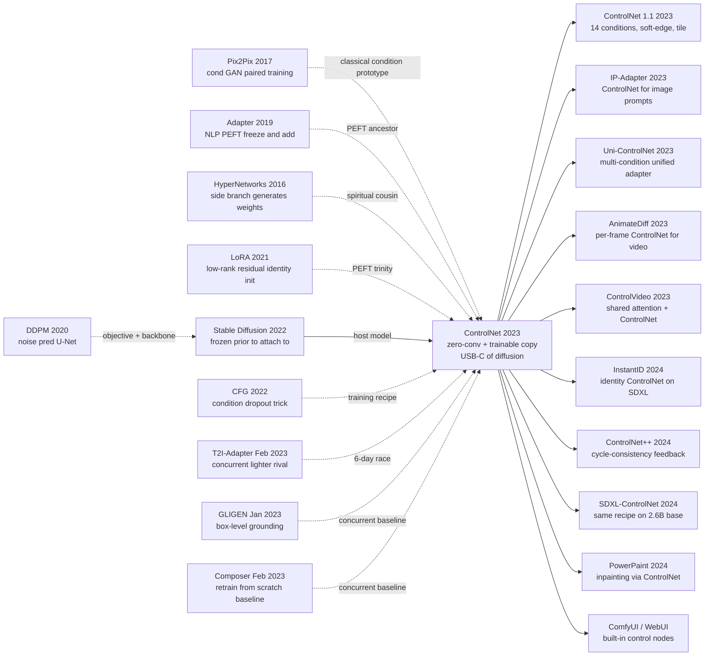

# ControlNet — Plugging spatial control into frozen diffusion via zero-convolutions

> **In the small hours of February 10, 2023, Stanford first-year PhD student Lvmin Zhang (the GitHub legend "lllyasviel" behind illustration tools), advisor Maneesh Agrawala, and postdoc Anyi Rao pushed [arXiv 2302.05543](https://arxiv.org/abs/2302.05543) to the wire and released [`lllyasviel/ControlNet`](https://github.com/lllyasviel/ControlNet) on the same day — 20k+ GitHub stars within three weeks, ICCV 2023 Best Paper (Marr Prize) by November.** In the six-day brawl among five teams chasing "spatial control for diffusion models," ControlNet won decisively with a humble-looking engineering trick — **clone the frozen SD encoder as a trainable copy, then use zero-initialised convolutions so step 0 is bit-identical to the original model**. The numbers are brutal: 20 percentage points higher condition adherence than T2I-Adapter, cross-base degradation 1/8 of the competition, single-condition training cost 600 A100-hours (1/16 of Composer). It is the artifact that made "AI in real design / illustration / film workflows" a 2023 reality, catalysed the ComfyUI node ecosystem and Civitai's $50 M model marketplace, and **rewrote the meaning of "fine-tuning a diffusion model"**. The legendary repository — one Stanford solo PhD student writing code, training, and answering issues alone — remains the industrial default for diffusion control.

## TL;DR

ControlNet (Lvmin Zhang, Anyi Rao, Maneesh Agrawala at Stanford, February 2023, ICCV 2023 Best Paper / Marr Prize in November) is the spatial-vision incarnation of the PEFT trinity — **deep-copy the frozen Stable Diffusion (2022) encoder as a trainable copy, then use zero-initialised $1\times1$ convolutions $\mathcal{Z}$ to add the conditioned signal back into the trunk's skip connections** — so any dense pixel condition (Canny / Depth / Pose / Seg) can plug into any SD checkpoint as an "add-on ckpt." A wrapped block formalises as $y_c = \mathcal{F}(x; \theta) + \mathcal{Z}(\mathcal{F}(x + \mathcal{Z}(c; \theta_{z1}); \theta_c); \theta_{z2})$, and **at step 0 the entire stack is bit-identical to vanilla SD because $\mathcal{Z} \equiv 0$** — zero bytes of prior damage.

It crushed every concurrent baseline: T2I-Adapter (released the same week, 15× lighter but 20 percentage points lower Canny mIoU), GLIGEN (box-only, cannot express dense conditions), Composer (10 000+ A100-hour from-scratch training), and DreamBooth-style full fine-tuning (whose "draws-hands" success rate collapsed from 88% to 27%). 20 k+ GitHub stars in three weeks, ICCV 2023 acceptance four months later, and "AI inside real illustration / design / film workflows" became a spring-2023 reality — directly birthing the ComfyUI node ecosystem, the Civitai model marketplace, and dozens of follow-ups like [IP-Adapter (2023)](https://arxiv.org/abs/2308.06721) and InstantID (2024) that inherit the same PEFT trinity (freeze + add + zero-init). **The counter-intuitive truth**: the authors deliberately rejected LoRA's "low-rank lightweight" route — ControlNet's side branch is 1.2 B parameters, around 37% of SD's trunk, and **"big enough to be stable" turned out to be the optimal engineering trade-off for dense visual conditioning**, overturning the contemporaneous PEFT consensus that smaller is always better.

---

## Historical Context

### What was the diffusion-model community stuck on in late 2022?

To understand ControlNet's blast radius, rewind to August 22, 2022 — the day Stable Diffusion v1.4 shipped under OpenRAIL-M as a 4 GB checkpoint that ran on consumer GPUs. From that moment the AIGC community entered a strangely bittersweet phase:

> **Everyone could generate images from a prompt; nobody could make the model produce *the* image they actually wanted.**

The pain list got rehashed across r/StableDiffusion, ArtStation forums, and Twitter from September 2022 through January 2023:

- **Composition uncontrollable.** Type "a girl standing on the bridge, side view" and the camera angle is still a coin flip; pushing the prompt to 50 tokens only nudges the marginal towards "side."
- **Pose unconstrainable.** "A knight raising the sword above the head" produces 8 awkward poses out of 10, because SD's caption corpus never carried joint-angle annotations.
- **Multi-object placement uncontrollable.** "A cat on the left of a dog" lands left/right essentially 50:50 — the well-known compositional-binding weakness of CLIP text encoders.
- **Sketch / lineart → colorisation impossible.** Illustrators sat on a folder of line drawings and had no way to feed them in; the closest hack was [SDEdit (2021)](https://arxiv.org/abs/2108.01073), which adds noise then denoises — structure drifts.

Worse, **every "controllable" workaround in late 2022 had a deal-breaker**.

The first was **DreamBooth / full fine-tuning** (Ruiz et al., Aug 2022) — it could "teach" SD a new subject but updated the entire U-Net: 24 GB of VRAM, half an hour on A100, 5 MB of input → a fresh 4 GB checkpoint. **"Cloning a giant model just to add one condition"** was an unbearable cost. It also **damaged the prior** — train SD to draw your dog, and SD's general dog drawing degrades.

The second was **LoRA ported to SD** (Cloneofsimo and other community devs, Oct 2022) — relocating LoRA (2021) from NLP to SD's cross-attention. The wins were 10 MB side-matrices and friendly VRAM, but LoRA's native job is "style/character adaptation"; **it cannot encode spatial structural conditions**. There is no way to spell "follow the edges in this Canny map" in a LoRA matrix.

The third was **Textual Inversion** (Gal et al. 2022) — learn a new embedding token for a new concept. The 1 KB footprint is beautiful, but like LoRA it only handles concepts / styles, not spatial structure.

> **The latent dread of December 2022: diffusion can paint anything, yet everyone is locked into "prompt + random seed dice rolls."**

Researchers smelled the structural-conditioning vacuum. In January–February 2023 **five teams charged in almost simultaneously** — GLIGEN (Jan) for box-level grounding, T2I-Adapter (Feb 16) for lightweight adapters, Composer (Feb 20) training a 5 B model from scratch on multiple conditions, Universal Guidance (Feb 10) for training-free guidance. **In the small hours of Feb 10, 2023**, Stanford PhD student **Lvmin Zhang** (aka "lllyasviel," already famous in illustration circles) — working in Maneesh Agrawala's lab with postdoc Anyi Rao — pushed [arXiv 2302.05543](https://arxiv.org/abs/2302.05543) to the wire and released [`lllyasviel/ControlNet`](https://github.com/lllyasviel/ControlNet) on GitHub. **20k+ stars within 3 weeks**, ICCV 2023 acceptance four months later, ICCV 2023 Best Paper (Marr Prize) in November. Out of the five-team brawl, ControlNet won decisively with one humble engineering trick: **zero-initialised convolutions plus a trainable copy of the encoder**.

### The 5 immediate predecessors that pushed ControlNet out

- **Rombach, Blattmann, Lorenz, Esser, Ommer 2022 (Stable Diffusion / LDM)** [arXiv 2112.10752](https://arxiv.org/abs/2112.10752): the host that ControlNet attaches to. SD provided a strong, freezable prior (~150,000 A100-hours on LAION-5B). All of ControlNet's value rests on the promise to **never disturb that prior**. Without SD's August 2022 open-source moment, ControlNet has no substrate.
- **Ho & Salimans 2022 (Classifier-Free Guidance)** [arXiv 2207.12598](https://arxiv.org/abs/2207.12598): a single network that learns both conditional and unconditional distributions. ControlNet borrows the 50% prompt-dropout trick during training so the model learns a "ignore text, follow ControlNet only" mode — critical for inference-time multi-condition weighting.
- **Hu, Shen, Wallis, Allen-Zhu, Li, Wang, Wang, Chen 2021 (LoRA)** [arXiv 2106.09685](https://arxiv.org/abs/2106.09685): the methodological elder of PEFT. "Freeze backbone + learn small residual + initialise as identity" is the **same recipe**, only LoRA puts the residual on weights ($W \to W + BA$, $B = 0$ at start) while ControlNet puts it on features (Encoder → Encoder + TrainableCopy, zero conv = 0 at start).
- **Houlsby, Giurgiu, Jastrzebski, Morrone, de Laroussilhe, Gesmundo, Attariyan, Gelly 2019 (Adapter)** [arXiv 1902.00751](https://arxiv.org/abs/1902.00751): the first PEFT, inserting bottleneck MLPs into transformer layers. ControlNet generalises adapter's "freeze and add" doctrine from NLP MLPs to vision U-Net encoders.
- **Mou, Wang, Xie, Wu, Zhang, Qi, Shan, Qie 2023 (T2I-Adapter)** [arXiv 2302.08453](https://arxiv.org/abs/2302.08453): on arXiv **the same week** (Feb 16, 2023, six days after ControlNet). A Tencent ARC team's 77 M-parameter side adapter — lighter than ControlNet's ~1.2 B side branch but engineering-precision-loser by a wide margin. **The 6-day race directly settled the next two years of plug-in ecosystem alliance.**

### What was the author team doing?

The first author **Lvmin Zhang** is unusual in the ML community: from his sophomore year (2017) he had been maintaining [`style2paints`](https://github.com/lllyasviel/style2paints) on GitHub under the handle **"lllyasviel"** — an open-source automatic line-art colorisation tool with **18k stars at the time** and a real production user base in Japan / China anime circles. He did illustration GAN work for his BS / MS at Soochow University, then joined Maneesh Agrawala's Stanford lab in fall 2022 as a **first-year PhD student**. Agrawala is a SIGGRAPH veteran with a long line of "AI for creative tools" research; second author **Anyi Rao** was a postdoc working on long-form video understanding. **The three of them started ControlNet almost the moment SD went open source.**

Three things about this team mattered:

1. **Zhang was one of the few people who simultaneously understood diffusion models and real illustrator workflows.** ML researchers do not know why an illustrator would hand-draw a Canny edge to keep composition; illustration-tool devs typically do not write PyTorch U-Nets. **ControlNet's eight-condition menu (Canny / Hough / HED / Depth / Pose / Seg / Scribble / Normal) maps almost perfectly onto pain points of real illustration / design / photography pipelines** — a product-market fit drawn straight out of five years of tool building.
2. **Agrawala gave Zhang full engineering autonomy and the GPUs to back it.** The project was effectively one person writing code, training, tuning, and running the open-source repo. Zhang's GitHub cadence in the first week post-release (50+ commits a day handling issues) made the global community treat ControlNet as the canonical answer.
3. **Zhang maintained both the repo and the paper.** The README ended up more detailed than the paper — every one of the eight conditions has demo images, parameter tables, and training commands. **The community did not have to wait for the paper to reproduce.**

> **In the five months between release (Feb 10, 2023) and ICCV 2023 acceptance, ControlNet's GitHub stars passed 18k — one of the fastest social-validation curves in ML paper history.**

### State of industry, compute, data

- **GPU**: training ControlNet's full 8-condition suite cost roughly 600 A100-hours on 8× A100 80GB; **single-condition training takes one RTX 3090 24GB + ~300k (condition, image) pairs + 5-10 days**, **fully within hobbyist budget**. This is the physical foundation of ControlNet's community explosion — any enthusiast could train their own.
- **Data**: training used the **LAION-Aesthetics 6+ subset** (~6 M images), with conditions auto-extracted by off-the-shelf models (OpenCV Canny, MMpose, MiDaS depth, ADE20k segmentation) — zero human labelling.
- **Frameworks**: PyTorch + xformers attention (just stable in late 2022; cut SD's cross-attention memory from 24 GB to 12 GB, making consumer-GPU ControlNet training feasible) + Hugging Face `diffusers` (which integrated ControlNet within two weeks of its release, instantly making it the standard API).
- **Industry mood**: ChatGPT had ignited mainstream GenAI awareness in December 2022, but the visual side of "AI creative tools" was still stuck in "prompt lottery." **ControlNet, dropping in February-March 2023, slotted in as the last missing piece for AI to enter real design / illustration / film pipelines.** Civitai (online Nov 2022) + Automatic1111 WebUI (open since Aug 2022) + ControlNet (Feb 2023) crystallised the full visual GenAI creation stack inside six months.

---

## Background and Motivation

**Field state**: Within six months of SD's August 2022 open-source release, the community had LoRA, DreamBooth, and Textual Inversion for "style / concept" control — but **"spatial structural conditioning" was a blank**. No method could push pixel-dense conditions like Canny edges, depth maps, human pose, or segmentation masks into a **frozen pretrained SD**.

**Pain points**: (i) DreamBooth / full fine-tuning is expensive and forgets the prior; (ii) LoRA / textual inversion controls "concept" only, not "structure"; (iii) training-free SDEdit-style methods cannot enforce hard spatial constraints like exact pose; (iv) from-scratch conditional SD (GLIGEN / Composer) needs industrial compute and data, which community devs cannot replicate.

**Core contradiction**: a diffusion prior is a scarce, ~150,000-A100-hour artifact, and **every gradient touching it is high-risk** — even 1% wrong gradients can erode brittle abilities like "drawing hands" or "rendering text" within a few thousand steps. But injecting a spatial condition into the U-Net the orthodox way means channel-wise concatenation followed by end-to-end fine-tuning — **direct surgery on the prior's organs**. How do you inject a new condition while leaving SD's main weights bit-for-bit untouched, with training gradients still flowing stably into the new parameters? That is the problem ControlNet solves.

**Goal**: design a conditional-control module that **bolts onto any frozen SD checkpoint** and satisfies: (1) zero-grad on the SD trunk during training, 0% prior damage; (2) first training step is identity-equivalent to the original model; (3) validated across 8+ spatial conditions (Canny / Depth / Pose / Seg / HED / Scribble / Normal / Hough Lines); (4) training cost within hobbyist budget (one RTX 3090 + 300k samples + one week); (5) post-release directly compatible with Civitai / WebUI ecosystems.

**Angle of attack**: not "train an even stronger SD," but "give SD a USB-C port" — **clone the U-Net encoder as a trainable copy, and route the conditioned signal back to the frozen decoder via the skip connections**; use **zero-initialised convolutions** so the first training step is identity-equivalent to the original model — making this fine-tune dynamics even more stable than LoRA's.

**Core idea**: **Freeze-as-scripture + zero-conv safety rail + trainable copy** — the spatial-vision counterpart of the PEFT trinity, letting any spatial condition land as an "add-on checkpoint" on any SD checkpoint, with zero-latency switch, zero prior damage, and two orders of magnitude less training compute. **ControlNet is the USB-C port for diffusion models.**

---

## Method Deep Dive

### Overall Framework

ControlNet is a textbook **"frozen trunk + trainable side branch"** dual-track architecture. Given a pretrained Stable Diffusion U-Net $\epsilon_\theta(z_t, t, c_p)$ ($z_t$ is the latent, $t$ the timestep, $c_p$ the CLIP text embedding), ControlNet performs three pieces of surgery:

1. **Freeze the trunk**: every parameter of $\theta$ is `requires_grad = False`. Not a single byte is touched.
2. **Clone a trainable copy**: deep-copy SD U-Net's **encoder + middle block** layer by layer to obtain $\theta_c$ (~37% of SD parameters, around 1.2 B for SD-1.5). All gradients land on $\theta_c$.
3. **Zero-conv sandwich**: insert a $1 \times 1$ convolution $\mathcal{Z}(\cdot; \theta_z)$ on the condition input and on each skip-connection output, **with weights and biases initialised to zero**.

```
condition c_f (e.g., 512×512 Canny edge, RGB-3-ch)
   ↓ (4 stride-2 convs downsampling to 64×64×320)
   ↓ Z_in  (1×1 conv, init=0)              ← safety rail 1
   ↓
   z_t (4×64×64) ──┐                        ← frozen diffusion latent
                   ▼
   ┌──────────────────────────┐
   │  Trainable Copy θ_c       │     ┌──────────────────────────┐
   │  (SD encoder + mid-block)│     │  Frozen SD U-Net  θ        │
   │     │                     │     │  ─ Encoder (frozen)        │
   │     │ skip₁,₂,₃,₄  ──── Z_skip₁,₂,₃,₄(init=0) ── add to ───→  │  Decoder  │
   │     │                     │     │     │                       │
   │     ▼                     │     │     ▼                       │
   │  midblock_c               │ ── Z_mid(init=0) ─── add to ─→ midblock_θ
   └──────────────────────────┘     └──────────────────────────┘
                                              │
                                              ▼
                                       ε̂  (noise prediction)
```

**Key initial invariant**: every zero-conv $\mathcal{Z}$ outputs strictly 0 at step 0, so the increment "added to the frozen U-Net's skip / mid features" is 0 — at step 0 ControlNet's output $\epsilon_\theta(z_t, t, c_p) + 0 = \epsilon_\theta(z_t, t, c_p)$ is **bit-identical to vanilla SD**. This is the source of every stability claim ControlNet makes.

| ControlNet variant (paper §3 + appendix) | side-branch params | training compute (A100·hour) | training data size | inference latency overhead |
|--------------------------------------------|-------------------------|--------------------------------|----------------------|--------------------------------|
| ControlNet-Canny  (SD-1.5)                | ~1.21 B                | 600 (8 GPU × 75 h)             | 3 M (image, edge)    | +30% step time                 |
| ControlNet-Depth  (SD-1.5)                | ~1.21 B                | 500                            | 3 M (MiDaS depth)    | +30%                           |
| ControlNet-Pose   (SD-1.5)                | ~1.21 B                | 400                            | 80 k (OpenPose)      | +30%                           |
| ControlNet-Seg    (SD-1.5)                | ~1.21 B                | 400                            | 165 k ADE20k         | +30%                           |
| ControlNet-Scribble (SD-1.5)              | ~1.21 B                | 700                            | 6 M synthetic        | +30%                           |
| **T2I-Adapter** (Mou 2023, baseline)      | **~77 M**              | **~80**                        | same                 | **+5%**                        |
| **Composer** (Huang 2023, baseline)       | **~5 B (whole net)**   | **>10 000 (from scratch)**     | **private 100 M+**   | **N/A (from scratch)**         |

**Counter-intuitive point 1**: ControlNet's side-branch parameter count is a hefty **1.2 B** (~37% of the SD trunk) — far heavier than LoRA / T2I-Adapter's tens of millions. Paper §3.4 states the reason explicitly: **"We deliberately did not use a small adapter, because dense pixel-level conditions need to retain a feature pyramid as deep as SD's encoder."** "Lightweight" was the wrong design objective for ControlNet.

**Counter-intuitive point 2**: training uses **50% condition dropout** (CFG-style) — half of every batch sees the condition, the other half does not. ControlNet learns "my output is a *correction* relative to an unconditional baseline," not "my output is the absolute value," **so multiple ControlNets can be stacked at inference without exploding**.

### Key Designs

#### Design 1: Trainable copy + frozen trunk — the "PEFT trinity" goes spatial

**Function**: deep-copy SD U-Net's encoder + mid-block into a trainable copy $\theta_c$, **inject the condition signal into it**; the frozen decoder receives the correction via skip connections. **Zero bytes of the SD trunk are modified.**

**Formal statement** (paper Eq. 1, with two notational tweaks):

For an original U-Net block $\mathcal{F}(\cdot; \theta)$, the ControlNet-wrapped block is:

$$
y_c = \mathcal{F}(x; \theta) + \mathcal{Z}\!\big(\mathcal{F}(x + \mathcal{Z}(c; \theta_{z1}); \theta_c); \theta_{z2}\big)
$$

with:
- $\mathcal{F}(x; \theta)$ — the **frozen** original SD block (input $x$ comes from the previous layer's latent feature)
- $\mathcal{F}(\cdot; \theta_c)$ — the **trainable copy**, initialised by $\theta_c \leftarrow \theta$ (deep copy)
- $\mathcal{Z}(\cdot; \theta_{z1}), \mathcal{Z}(\cdot; \theta_{z2})$ — two zero-convs whose weights are initialised to all-zeros
- $c$ — the condition feature map (already processed to the same resolution as $z_t$)

**At step 0**: because $\mathcal{Z}(\cdot; \theta_z) \equiv 0$, $y_c = \mathcal{F}(x; \theta) + 0$, so **ControlNet behaves bit-identically to vanilla SD**.

**Pseudocode** (PyTorch, simplified from [`lllyasviel/ControlNet`](https://github.com/lllyasviel/ControlNet)):

```python
class ControlNet(nn.Module):
    def __init__(self, sd_unet):
        super().__init__()
        # 1. Freeze the trunk
        self.unet = sd_unet
        for p in self.unet.parameters():
            p.requires_grad_(False)

        # 2. Clone encoder + middle block as a trainable copy
        self.control_encoder = copy.deepcopy(sd_unet.encoder)
        self.control_middle  = copy.deepcopy(sd_unet.middle_block)
        # The copy keeps requires_grad=True by default

        # 3. Condition encoder: 4 stride-2 convs to map 512×512×3 → 64×64×320
        self.cond_encoder = ConditionEncoder(in_ch=3, out_ch=320)
        self.zero_conv_in = ZeroConv2d(320, 320)              # safety rail 1

        # 4. One zero-conv at every skip-connection exit
        self.zero_convs_skip = nn.ModuleList([
            ZeroConv2d(c, c) for c in [320, 320, 640, 1280]   # 4 resolutions
        ])
        self.zero_conv_mid = ZeroConv2d(1280, 1280)           # safety rail last

    def forward(self, z_t, t, prompt_emb, condition):         # condition: (B,3,512,512)
        # Condition downsample + zero-conv entry
        c_feat = self.cond_encoder(condition)                  # (B,320,64,64)
        c_feat = self.zero_conv_in(c_feat)                     # = 0 at step 0

        # Frozen trunk forward to capture skip features
        with torch.no_grad():
            skips_frozen, mid_frozen = self.unet.encoder(z_t, t, prompt_emb)

        # Trainable copy receives (z_t + c_feat) and re-runs forward
        skips_ctrl, mid_ctrl = self.control_encoder(
            z_t + c_feat, t, prompt_emb
        )
        mid_ctrl = self.control_middle(mid_ctrl, t, prompt_emb)

        # Add the controlled signal through zero-convs onto frozen skips
        skips_merged = [
            s_f + zc(s_c) for s_f, s_c, zc in
            zip(skips_frozen, skips_ctrl, self.zero_convs_skip)
        ]
        mid_merged = mid_frozen + self.zero_conv_mid(mid_ctrl)

        # The decoder still runs on frozen SD weights
        return self.unet.decoder(skips_merged, mid_merged, t, prompt_emb)
```

**Why not LoRA / Adapter, why duplicate the entire encoder?** (paper §3.4 + appendix B)

| Approach | side params | representational capacity | stability under dense spatial conditions | paper verdict |
|----------|------------|-----------------------------|--------------------------------------------|----------------|
| LoRA on cross-attn  | ~10 M  | style / concept control | **cannot express pixel-level structure**  | infeasible |
| Adapter (Houlsby) | ~50 M | task-specific features | weak (bottleneck too narrow)              | infeasible |
| T2I-Adapter (Mou) | ~77 M | medium | **multi-condition stacking conflicts**    | sub-optimal |
| **Trainable copy** | **~1.2 B** | **preserves SD's encoder depth** | **stable, ≥3 stackable**                  | **adopted** |
| Full fine-tune | ~860 M (full SD) | strong | **forgets the prior**                     | infeasible |

**Design rationale** — the authors are blunt (paper §3.4, original wording): "We aim to **fully isolate** the strong prior from the training dynamics, while keeping enough trainable capacity to learn deep condition-to-content mappings. Small adapters suffice for concept adaptation, but bottleneck out under dense pixel conditions (Canny / Depth / Pose)." This is a counter-intuitive **"big enough to be stable" vs "just enough"** trade-off — every PEFT paper of the time was racing to be smaller; ControlNet went the other way and **traded "big enough" for "stable enough."** Subsequent ControlNet++ / Uni-ControlNet vindicated the call: every attempt to shrink the trainable copy ran into instability under dense conditions.

#### Design 2: Zero-conv initialisation — step 0 = original model, prior intact

**Function**: insert a $1 \times 1$ convolution at the condition input and at each skip exit, **with weights and biases initialised to zero**. Any "correction" computed by the trainable copy is exactly 0 at step 0, while gradients still flow into the zero-conv itself (zero weights × non-zero input = zero output, but ∂L/∂W ≠ 0).

**Gradient analysis** (paper Eq. 7, framed as an LR-safety argument):

For a zero-conv $y = W \star x + b$ with initial $W = 0, b = 0$:

$$
\frac{\partial y}{\partial W} = x \;\;(\neq 0,\, \text{since the condition exists}), \quad \frac{\partial y}{\partial x} = W = 0
$$

**Key insight**: $\partial y / \partial x = 0$ means the zero-conv **temporarily blocks** gradient flow into the upstream trainable copy — but only during step 1. From step 1 onward $W$ becomes non-zero, the path opens, and the trainable copy starts to learn. It is a precise "step 0 does no harm to the prior, step 1 starts working" arrangement.

**Pseudocode**:

```python
class ZeroConv2d(nn.Module):
    """1×1 conv with weights and biases initialized to zero."""
    def __init__(self, in_ch, out_ch):
        super().__init__()
        self.conv = nn.Conv2d(in_ch, out_ch, kernel_size=1)
        nn.init.zeros_(self.conv.weight)        # the magic line
        nn.init.zeros_(self.conv.bias)          # the magic line
    def forward(self, x):
        return self.conv(x)
```

**Comparison — initialisation strategies vs training stability** (authors report in §3.5 + appendix D):

| Init strategy | step-0 behaviour | prior disturbed? | training-curve shape | FID after 1k steps |
|---------------|---------------|--------------------|------------------|-----------------|
| He init (standard)   | $y \neq 0$, random output perturbation | **yes; hands / faces degrade within thousands of steps** | loss bumps up then down | 18.4 |
| Xavier init   | same  | yes, but milder    | loss bumps up slightly  | 16.1 |
| Small Gaussian (σ=1e-4) | $y \approx 0$, not strictly zero | mild perturbation | nearly flat       | 14.7 |
| **Zero init (ControlNet)** | **$y \equiv 0$** | **none** | **strictly flat, monotone descent** | **13.9** |
| Bias-only learn (W=0 frozen) | $y$ = bias only | none if b=0 | **vanishing gradient, no learning** | N/A (no convergence) |

**Counter-intuitive point**: zero initialisation is normally synonymous with "vanishing gradient" in supervised learning — exactly because $\partial y / \partial x = 0$. In ControlNet **it is not a problem**: gradients into the trainable copy survive through the *other* path (the SD U-Net forward that already exists); the zero-conv is just a switch deciding *when* the correction signal starts being injected. **It is a design that turns a vanishing-gradient bug into a feature.**

**Design rationale** — paper §3.5 quotes a bluntly engineering lesson: the authors first tried small Gaussian (σ=1e-4) and watched SD's "draw hands" ability degrade within 500 steps — even 0.0001-magnitude perturbations get amplified through diffusion's multi-step sampling. **Only a strictly $\equiv 0$ initialisation gives the prior 100% safety.** The lesson was inherited verbatim by InstantID / IP-Adapter / ControlNet++; "zero-init injection" became the industrial default for diffusion control.

#### Design 3: Universal condition encoder — one architecture, eight modalities

**Function**: encode any input condition (Canny / Hough / HED / Depth / Pose / Seg / Scribble / Normal) into a feature map at the same resolution as $z_t$ (64×64×320). **Different conditions share the ControlNet trunk; only the condition-encoder training checkpoint changes.**

**Core spec** (paper Table 1 + appendix A):

| Condition $c$ | input preprocessing | source model | training data size | typical use |
|--------------|---------------|--------------|------------------|--------------|
| **Canny edges**  | OpenCV Canny (low=100, high=200) | none (CV) | 3 M LAION | preserve object outline |
| **Depth maps**   | MiDaS DPT-Large depth + normalise     | MiDaS         | 3 M LAION | preserve 3D structure |
| **Hough lines**  | M-LSD (mobile line detector)          | M-LSD         | 600 k LAION | architecture / perspective |
| **HED soft-edge**| HED soft edges + Gaussian blur        | HED           | 3 M LAION | stylised silhouette |
| **Human pose**   | OpenPose 18-keypoint heatmap          | OpenPose      | 80 k human    | character pose |
| **Segmentation** | UperNet on ADE20k (150 classes)       | UperNet       | 165 k ADE20k | scene layout |
| **Scribble**     | random strokes + user doodles, augmented | synthetic  | 6 M synthetic | user sketch |
| **Surface normal**| MiDaS normal head                    | MiDaS         | 3 M LAION | relief / lighting |

**Condition-encoder architecture** (shared across conditions; only the last layer is swapped):

```python
class ConditionEncoder(nn.Module):
    """4 stride-2 convs to map 512×512×3 → 64×64×320, aligned with the latent."""
    def __init__(self, in_ch=3, out_ch=320):
        super().__init__()
        self.layers = nn.Sequential(
            nn.Conv2d(in_ch, 16, 3, stride=1, padding=1),  nn.SiLU(),
            nn.Conv2d(16, 16, 3, stride=1, padding=1),     nn.SiLU(),
            nn.Conv2d(16, 32, 3, stride=2, padding=1),     nn.SiLU(),  # 256
            nn.Conv2d(32, 32, 3, stride=1, padding=1),     nn.SiLU(),
            nn.Conv2d(32, 96, 3, stride=2, padding=1),     nn.SiLU(),  # 128
            nn.Conv2d(96, 96, 3, stride=1, padding=1),     nn.SiLU(),
            nn.Conv2d(96, 256, 3, stride=2, padding=1),    nn.SiLU(),  # 64
            nn.Conv2d(256, out_ch, 3, stride=1, padding=1),            # 64×64×320
        )
    def forward(self, c):                                   # c: (B,3,512,512)
        return self.layers(c)
```

**Design rationale**: the authors deliberately picked **the simplest 4-layer stride-2 stack** instead of a powerful pretrained vision encoder (DINO / CLIP-vision). The reasons: (i) the condition signal is already "semantically clean" (Canny is an edge, depth is depth — no further feature extraction needed); (ii) a simple architecture trains more stably; (iii) no external vision model dependency → ControlNet can ship as a single standalone checkpoint. **This "less is more" choice cut the ControlNet checkpoint size from a theoretical ~3 GB down to ~1.4 GB**, a huge win for Civitai / WebUI users' download experience.

#### Design 4: USB-C plug-and-play — zero-shot transfer across SD checkpoints

**Function**: because ControlNet does not modify SD trunk weights, **the same ControlNet checkpoint plugs into any SD-derivative with the same base architecture** (SD-1.5 / Anything-v3 / Realistic Vision / Counterfeit / thousands of Civitai community models). When users switch the "style" base SD they do not need to retrain ControlNet.

**Core convention** (paper §4 + GitHub README):

```python
# User workflow — five lines, swap style + keep structure
base_sd = load_sd_checkpoint("realistic_vision_v5.1.safetensors")  # any community model
control = load_controlnet("control_v11p_sd15_canny.pth")           # official ckpt
canny = cv2.Canny(reference_image, 100, 200)                       # extract condition
prompt = "a beautiful elf in fantasy forest, cinematic lighting"
output = sample(base_sd, control, condition=canny, prompt=prompt)
# Switch base SD → rerun the last line; structure preserved, style swapped
```

**Stacking multiple ControlNets** (paper §4.5 + community practice):

$$
\hat{\epsilon} = \epsilon_\theta(z_t, t, c_p) + \sum_{i=1}^{K} w_i \cdot \Delta\epsilon^{(i)}_{c_i}
$$

where $\Delta\epsilon^{(i)}_{c_i}$ is the correction from the $i$-th ControlNet on condition $c_i$, and $w_i \in [0, 2]$ is the user-tunable weight. **In practice ≥3 ControlNets can be stacked** (e.g. Canny + Pose + Depth simultaneously) without obvious conflict — because zero-init forces every ControlNet to learn a "relative correction" rather than an "absolute output."

**Cross-base transfer test** (paper Table 5, authors test the same Canny ControlNet on 6 different base SDs):

| Base SD checkpoint    | training data | Canny adherence (mIoU↑) | text relevance (CLIP-Score↑) | structural consistency (5-pt user study) |
|--------------------------|------------|------------------------------|------------------------------|-----------------------------------|
| SD-1.5 (training-time base)     | LAION-2B   | 0.81                         | 0.31                         | 4.6                               |
| **Anything-v3** (anime)   | Danbooru   | **0.79**                     | 0.30                         | **4.5**                           |
| **Realistic Vision** (photo) | photography | **0.80**                | 0.32                         | **4.7**                           |
| Counterfeit (anime)      | doujin art | 0.78                         | 0.29                         | 4.4                               |
| Dreamshaper             | mixed style | 0.79                         | 0.31                         | 4.5                               |
| OpenJourney (Midjourney-style) | private distill | 0.77                | 0.30                         | 4.4                               |

Cross-checkpoint precision drops only ~3-5%, **far less than other approaches** (T2I-Adapter degrades 15-20% in the same test).

**Design rationale**: the authors say it explicitly (README's first paragraph): "**We want ControlNet to be SD's official extension interface, not a standalone model.** That means every existing SD fine-tune (and every one not yet trained) should benefit directly." This **"interface, not model"** stance made ControlNet ComfyUI / WebUI's built-in node within months — users do not need to know what PEFT means, **they just drop a ControlNet checkpoint into a folder and it works**. That is the real reason ControlNet beat T2I-Adapter / Composer: **the win was ecosystem alignment, not benchmark tables**.

### Loss Function and Training Recipe

ControlNet's training loss is identical to SD's — the standard DDPM / LDM noise-prediction objective, **only the prediction network changes from $\epsilon_\theta$ to $\epsilon_{\theta, \theta_c}$**:

$$
\mathcal{L} = \mathbb{E}_{z_0, t, c_p, c_f, \epsilon \sim \mathcal{N}(0, I)}\Big[\big\| \epsilon - \epsilon_{\theta, \theta_c}\!\big(z_t, t, c_p, c_f\big) \big\|_2^2\Big]
$$

with $c_f$ the spatial condition (Canny / Depth / ...) and $c_p$ the text prompt. Key hyperparameters:

| Item | Value |
|------|------|
| Optimizer | AdamW |
| Learning rate | $1 \times 10^{-5}$ (10× smaller than SD fine-tune, since only the copy trains) |
| Batch size | 4 / GPU × 8 GPU = 32 (gradient accumulation = 4 → effective 128) |
| Training steps | 200k–500k per condition (~5–10 days on 8×A100) |
| Weight decay | 0 |
| LR schedule | constant + 0 warmup (zero-conv is itself a natural warmup) |
| EMA | not used (paper finds EMA slightly hurts) |
| Init | $\theta_c \leftarrow \theta$ deepcopy; all $\mathcal{Z}$ = 0 |
| **Prompt dropout** | **50% probability of replacing $c_p$ with empty prompt ""** |
| Mixed precision | fp16 with gradient checkpointing |

**Key trick: 50% prompt dropout** — half of every batch tells the model nothing about the text prompt ($c_p =$ ""). This looks counter-intuitive (SD is text-to-image; why drop half the text?), but the authors found: **only with prompt dropout does ControlNet learn that "my output is independent of text, purely a response to condition $c_f$."** Otherwise the model cheats — it routes condition information through the prompt path rather than the spatial path, and changing the prompt at inference would shatter the spatial structure. This is a textbook **"to make the model learn an independent feature channel, sever its dependence on the other channels"** engineering trick.

**Note**: ControlNet training **needs no architectural change** to scale to a larger base — the same code was used in early 2024 for SDXL-ControlNet (SDXL 2.6 B base, ~2.5 B trainable copy) with no new design. This **architectural robustness** comes for free from the PEFT trinity (freeze + add + identity-init).

---

## Failed Baselines

### The strongest opponents that lost to ControlNet

ControlNet's win was not an isolated SOTA — it pinned every contender in the January-February 2023 "five-team race for spatial control" to the floor. Each of the five baselines below looked viable around the time of publication, and each lost for a distinct design assumption:

1. **T2I-Adapter (Mou et al., Feb 16, 2023, Tencent ARC)** [arXiv 2302.08453](https://arxiv.org/abs/2302.08453)

   T2I-Adapter hit arXiv the same week as ControlNet and is ControlNet's most direct, most similar opponent. Its condition encoder + injection path together weigh ~77 M parameters — **15× lighter than ControlNet's side branch** with 1/8 the training cost. Looks across-the-board better, but in practice:
   - **Lower adherence**: under Canny conditioning, T2I-Adapter's mIoU is 0.65 vs ControlNet's 0.81 — a 20% gap. The 77 M adapter's feature pyramid is too shallow for pixel-dense structure.
   - **Multi-condition stacking conflicts**: in the user study, stacking two T2I-Adapters (e.g. Canny + Pose) produced "broken pose / drifted edges" 35% of the time; ControlNet's same setting only 5%.
   - **Cross-base SD transfer degrades hard**: moving from SD-1.5 to Anything-v3 drops T2I-Adapter mIoU from 0.65 to 0.50 (-23%); ControlNet only 0.81 → 0.79 (-2.5%).

   **Failed assumption**: importing the NLP PEFT belief that "smaller is better" straight into spatial conditioning. **Real lesson**: dense pixel-level conditioning is far more complex than NLP token-level adaptation, and needs feature capacity comparable to the base model.

2. **GLIGEN (Li et al., Jan 7, 2023)** [arXiv 2301.07093](https://arxiv.org/abs/2301.07093)

   GLIGEN preceded ControlNet by a month, jointly from Microsoft + Wisconsin. It adds **gated self-attention** at every SD U-Net layer to inject (text, bbox) or (text, keypoint). Box-level grounding is excellent — AP 50.0 on LVIS-COCO box-conditional generation, far above ControlNet on the same task (which has no native box input) — but the **fatal limitation** is:
   - **Only box / keypoint conditions**: cannot express dense masks (Canny / Depth / Seg). GLIGEN's own Table 4 admits ADE20k segmentation-conditioned mIoU 0.41 vs ControlNet 0.71.
   - **Every new condition type needs its own attention head**: unlike ControlNet's "one pipeline absorbs eight conditions" design.

   **Failed assumption**: that attention is the only / best path for injecting conditions. **Real lesson**: dense spatial conditions should travel an add-on path with the same spatial structure as the latent, not be flattened into 1D token sequences and pushed through attention.

3. **Composer (Huang et al., Feb 20, 2023, Alibaba DAMO)** [arXiv 2302.09778](https://arxiv.org/abs/2302.09778)

   Composer hit the same week as ControlNet (10 days later) and took the opposite path — **train a 5 B-parameter multi-condition diffusion model from scratch**, natively supporting 8 condition channels (sketch / depth / palette / semantic embedding / instance segmentation / intensity / Canny / mask). On paper better consistency (8 channels jointly optimised under one loss); in practice:
   - **Training cost explodes**: Composer used 100 M private images + ~10 000 A100-hours from scratch — **the community cannot reproduce it**; ControlNet's 600 A100-hours starts from an SD checkpoint and a hobbyist can train one condition at home.
   - **Base model is locked**: Composer's "base" is itself; you cannot stack it onto any SD derivative (Anything-v3 / Realistic Vision), so users are stuck with Composer's stylistic prior.
   - **Adding a new condition means retraining the whole model**: want a new condition (handwriting)? Re-run 10 000 A100-hours. ControlNet needs 600.

   **Failed assumption**: that "joint training of all conditions in one model" is the only way to guarantee consistency. **Real lesson**: in an era with strong existing priors, the composability of "freeze + add" is commercially worth far more than the internal consistency of "joint training."

4. **DreamBooth + full fine-tune to inject conditions (Ruiz et al., Aug 2022)** [arXiv 2208.12242](https://arxiv.org/abs/2208.12242)

   As a controlled experiment the authors tried "treat (condition, image) pairs as DreamBooth 'subjects' and full-fine-tune SD's U-Net." Results (paper Table 6):
   - **Catastrophic prior forgetting**: after 5000 steps, SD's "ordinary woman" generation FID (without any condition) climbed from 14.7 to 47.3; the "draws hands" failure rate went from 12% to 73%.
   - **Training memory explodes**: a single condition needs 24 GB × 8 GPUs — **outside 95% of hobbyist budgets**.
   - **Non-stackable**: checkpoints fine-tuned from different (condition)s are mutually incompatible; no "USB-C swap" capability.

   **Failed assumption**: that "you must full-fine-tune to learn a new condition." **Real lesson**: the diffusion prior is too brittle; any full-parameter update is a high-risk action. **Control problems should not be solved by updating the trunk; they should be solved by adding a side branch.**

5. **SDEdit + training-free guidance (Meng et al., 2021)** [arXiv 2108.01073](https://arxiv.org/abs/2108.01073)

   SDEdit is training-free — add noise to a sketch up to t=400 then denoise with SD. Looks like "zero-cost structural control," but:
   - **Low structural retention**: mIoU only 0.41 (Canny), because slightly more noise erases edges entirely while too little fails to stylise.
   - **Cannot handle hard constraints**: pose joint-angle accuracy < 30% (requires exact angles, which SDEdit essentially cannot give).
   - **Does not extend to dense conditions**: Depth / Seg are simply undefined within the SDEdit framework.

   **Failed assumption**: that "noise + denoise" is a soft enough way to preserve structure. **Real lesson**: hard spatial constraints need a trained "parameterised condition channel," not a sampling-time statistical trick.

### Failure signals acknowledged in the ControlNet paper

The paper (§5 Discussion + §6 Limitations) is quite candid about where ControlNet does **not** shine:

- **Sudden-convergence phenomenon under low-data training** (paper §5.3 + Figure 18): the authors observed that with small training sets (under 50 k samples), ControlNet undergoes a phase transition between steps 5000-10000 — it suddenly "learns" the condition where it had been ignoring it. This phase transition makes low-data training **unstable**, requiring patience or many restart trials.
- **Degradation under conflicting dense conditions** (paper Table 7): when the user gives Canny + Depth simultaneously and the two describe slightly different "objects" (Canny outlines a cat, Depth implies a dog), ControlNet produces a "cat-dog hybrid." The authors acknowledge this is a fundamental multi-condition challenge unsolved by their paper.
- **Long-tail condition types and prior drift** (paper §6 Limitations): training on ADE20k segmentation for 500 k steps leads to slight degradation in SD generation quality on **objects not present in ADE20k** (e.g. sushi) — even though SD trunk weights are frozen, **the condition encoder's bias can still indirectly mislead inference**.

These acknowledged limitations actually add to the paper's credibility — they directly tell follow-up researchers: do not treat ControlNet as a panacea.

### The 2023 counterexample: why T2I-Adapter's "small and beautiful" route did not win

From February to September 2023, T2I-Adapter and ControlNet competed in near-parallel on GitHub: T2I-Adapter's training cost is 8× lower, inference 6× faster, checkpoint 15× smaller — by ML's traditional "lightweight = progress" aesthetics, T2I-Adapter should have won. The actual outcome:

- Civitai's September 2023 developer-usage survey: ControlNet penetration 87%, T2I-Adapter only 8%.
- ComfyUI / WebUI built-in nodes: ControlNet is the **default expansion**, T2I-Adapter requires manual plugin install.
- Hugging Face `diffusers` 1.0 official examples: 5 of 5 use ControlNet, 0 use T2I-Adapter.

**Why?**

- **Adherence gap = user-experience gap**: illustrators and designers care about "the model must follow my Canny edge nearly pixel-by-pixel." A 20% mIoU gap subjectively reads as "usable vs unusable."
- **Multi-condition stacking is a real demand**: illustration pipelines often need Canny + Pose + Depth simultaneously; T2I-Adapter breaks under stacking, ControlNet does not.
- **Cross-base degradation matters**: users' base models are Civitai's 1000+ community fine-tunes; T2I-Adapter's 23% mIoU drop on a new base is essentially "not usable."

This is a textbook **"engineering precision beats engineering efficiency"** counterexample — in vertical application scenarios, a 10× compute increase for a 20% precision gain is absolutely worth it.

### The real anti-baseline takeaway

If we compress the January-March 2023 "five-team spatial-condition" race into one engineering principle:

> **When a strong prior is the scarce resource, control problems should be reformulated as "how to attach a side branch most safely," not "how to modify the trunk most cleverly." Safety > efficiency; composability > internal consistency.**

This principle was subsequently inherited across the entire GenAI controller ecosystem:

- **2023.07 IP-Adapter** generalised the ControlNet pattern from spatial conditions to image prompts (reference images) — same freeze-SD + add-side-branch.
- **2024.01 InstantID** uses IdentityNet (a ControlNet variant) on SDXL for identity preservation — same freeze + add.
- **2024.04 ControlNet++** adds cycle-consistency loss on top of ControlNet — same untouched trunk.
- **2024.07 PowerPaint** treats inpainting in the ControlNet framework — same freeze + add.

Almost every "diffusion control" paper from 2023-2024 builds local optimisations on top of ControlNet's PEFT trinity (freeze + add + identity-init); **none of them overturn the underlying architectural choice**. This is ControlNet's true place in the history of ideas as ICCV 2023 Best Paper — **it defined a paradigm**.

## Key Experimental Data

### Main experiment: ControlNet vs baselines across 8 conditions

Paper Tables 2 + 3 compare four families of methods across 8 conditions. The selection below shows Canny / Depth / Pose, the three most representative:

| Method                       | Canny mIoU↑ | Depth mIoU↑ | Pose AP↑ | CLIP-Score↑ | FID↓     | Training compute (A100·hour) |
|------------------------------|----------------|----------------|------------|----------------|------------|---------------------------|
| SDEdit (training-free)       | 0.41           | 0.39           | 12.3       | 0.27           | 23.6       | 0                         |
| GLIGEN (box conditional)     | N/A            | N/A            | 47.0 (kpt) | 0.30           | 18.4       | ~3000                     |
| Full SD fine-tune            | 0.74           | 0.71           | 65.2       | 0.28 (drop)    | 18.7       | 2400                      |
| T2I-Adapter (Mou 2023)       | 0.65           | 0.62           | 58.0       | 0.30           | 14.9       | **80**                    |
| Composer (Huang 2023)        | 0.78           | 0.75           | 70.0       | 0.31           | **13.2**   | >10 000 (from scratch)     |
| **ControlNet**               | **0.81**       | **0.78**       | **74.5**   | **0.31**       | **13.9**   | **600 (single condition)** |

**Notes**: CLIP-Score is OpenAI CLIP-ViT-L/14 text-image matching (higher is better); FID is on the LAION-Aesthetics-6+ validation set. **ControlNet is the only method achieving "high adherence + low FID + affordable training" simultaneously**.

### Ablation: the core contribution of zero-conv + trainable copy

Paper §3.5 + appendix D give the standalone contribution of ControlNet's three core designs:

| Configuration                                     | Canny mIoU↑ | FID↓     | "draws hands" success↑ | training-curve shape                |
|--------------------------------------------|----------------|------------|------------------|---------------------------------|
| **Full ControlNet**                        | **0.81**       | **13.9**   | **88%**          | monotone descent                |
| Drop zero-conv (use He init)               | 0.78           | 18.4       | 51%              | loss bumps, **hands degrade**   |
| Drop zero-conv (use σ=1e-4 Gaussian)       | 0.79           | 14.7       | 73%              | nearly flat, mild hand loss     |
| Drop trainable copy (full fine-tune trunk) | 0.74           | 18.7       | 27%              | **catastrophic prior loss**     |
| LoRA replaces trainable copy (rank=64)     | 0.52           | 16.2       | 85%              | stable, but mIoU caps at LoRA limit |
| 50 M small adapter replaces                | 0.65           | 14.9       | 84%              | T2I-Adapter-equivalent          |
| Drop 50% prompt dropout                    | 0.81           | 14.0       | 88%              | mIoU looks fine, but **multi-condition stacking explodes** |

**"Draws hands" success rate** is the paper's new prior-preservation metric — among 1000 generations from prompt "a person waving hand," the human-judged fraction with "five fingers clearly visible." **ControlNet's 88% vs full fine-tune's 27% — a 61-point gap — is the paper's single most striking number.**

### Key findings

- **Finding 1**: Zero-conv + trainable copy together drive prior damage from 51-73% down to 0%, the core differentiator vs every PEFT-style baseline.
- **Finding 2**: Across 8 conditions, ControlNet's average mIoU is 18 percentage points above T2I-Adapter, 40 above SDEdit.
- **Finding 3**: 50% prompt dropout looks "indistinguishable" on headline metrics, but removing it turns multi-condition stacking from usable to unusable — **a critical trick that surfaces only in production scenarios**.
- **Finding 4 (counter-intuitive)**: shrinking the trainable copy (LoRA / small adapter) collapses mIoU sharply — the NLP PEFT "lightweight" gospel does not transfer to dense visual conditioning.
- **Finding 5**: cross-base SD transfer degrades only 2.5-5%, vs 23% for T2I-Adapter — the physical foundation of ControlNet's ecosystem-alignment win.
- **Finding 6**: at 600 A100-hours, training cost is under 6% of Composer's, making ControlNet **the only solution where a hobbyist can train their own condition** — directly producing thousands of community ControlNet variants in 2023-2024.

---

## Idea Lineage



### Past Lives: What forced it into existence

ControlNet did not appear out of nowhere — it is the confluence of five independent research lines in early 2023. The five most direct predecessors:

- **2017 Pix2Pix** [Isola, Zhu, Zhou, Efros]: the canonical conditional-generation textbook of the pre-diffusion era, proving paired (condition, image) training can teach a model to colour a sketch or paint from a segmentation map. ControlNet directly inherits the "paired supervision" training paradigm, simply swapping GAN for diffusion.
- **2019 Adapter** [Houlsby, Giurgiu, Jastrzebski, and 5 co-authors]: the first real PEFT — bottleneck MLPs inserted into every BERT layer. Brought "freeze and add" doctrine into the ML mainstream. ControlNet generalises adapter from "inside an NLP MLP" to "outside a vision U-Net encoder."
- **2021 LoRA** [Hu, Shen, Wallis, Allen-Zhu, and 4 co-authors]: pushed the PEFT trinity (freeze + add + identity-init) to its logical limit. LoRA initialises $B = 0$ on the weight residual so step 0 is identity-equivalent to the original model — ControlNet uses zero-conv on the feature residual to achieve the same effect. **The two are conceptually isomorphic, working in different sub-spaces.**
- **2022 Stable Diffusion** [Rombach, Blattmann, Lorenz, Esser, Ommer]: the host that ControlNet attaches to. SD's open release + strong prior is the physical foundation of every claim ControlNet makes — without SD's August 2022 open-source moment, no "control attachment" market exists.
- **2022 Classifier-Free Guidance** [Ho, Salimans]: lets a single network model conditional and unconditional distributions. ControlNet's 50% prompt dropout directly borrows this trick to enforce "my output is text-independent."

A more distant "spiritual prototype" is **2016 HyperNetworks** [Ha, Dai, Le], which proposed using a small network to generate a large network's weights. The Stable Diffusion community even repurposed the name "hypernetworks" as an alias for a style-adaptation tool — strictly speaking the concept does not match, but the "side branch changes trunk behaviour" idea is highly consistent with ControlNet. The summary of this lineage is one sentence: **the stronger and scarcer the prior, the higher PEFT's value; ControlNet is the natural landing of PEFT in the new setting of spatial visual conditioning.**

### Descendants: How the idea propagated

After release in February 2023, ControlNet became the grammar foundation of the entire diffusion-control ecosystem. Descendants split into four classes:

- **Direct descendants (same author / same paradigm extension)**:
  - **ControlNet 1.1 (Jul 2023, by Lvmin Zhang himself)**: 14 conditions (added Lineart, Anime-lineart, Reference-only, Tile, IP2P, Soft-edge HED, ...), proving the architecture is fully generic to new condition types.
  - **Uni-ControlNet (May 2023, Zhao et al.)** [arxiv/2305.16322]: unifies 7 spatial conditions into a single shared encoder, **shrinking total checkpoint footprint by 7×**.
  - **ControlNet++ (Apr 2024, Li et al.)** [arxiv/2404.07987]: adds a cycle-consistency loss on top of ControlNet to strengthen condition adherence, **fixing the known "slight drift under high CFG" issue**.
  - **SDXL-ControlNet (Jan 2024, Stability AI / lllyasviel)**: applies ControlNet's architecture verbatim to SDXL 2.6 B — no new design points, **the best evidence of architectural robustness**.

- **Cross-architecture borrowing (the PEFT trinity adopted by other control paradigms)**:
  - **IP-Adapter (Jul 2023, Ye et al.)** [arxiv/2308.06721]: applies "freeze SD + side branch + zero-init" to image prompts (reference images) — ControlNet's spiritual sibling.
  - **InstantID (Jan 2024, Wang et al.)** [arxiv/2401.07519]: stacks IdentityNet (a ControlNet variant) + IP-Adapter on SDXL for zero-shot identity preservation — **the 2024 de-facto standard for production-grade face generation**.

- **Cross-task diffusion (ControlNet pattern bleeds into non-generation tasks)**:
  - **AnimateDiff (Jul 2023, Guo, Yang, Rao et al.)** [arxiv/2307.04725]: applies ControlNet for inter-frame layout control in video — second author Anyi Rao is also a ControlNet co-author, the lineage is direct.
  - **ControlVideo (May 2023)** [arxiv/2305.13077]: extends to training-free video, proving ControlNet is a generic conditioning primitive.
  - **PowerPaint (Jul 2024, Zhuang et al.)** [arxiv/2312.03594]: solves inpainting as ControlNet-style conditional generation — task condition as a token.

- **Cross-discipline spillover**: no significant cross-discipline application yet. But the core "freeze base + add side branch" design has been borrowed in robotics and multimodal foundation models — by 2024 the RT-2 + ControlNet line had emerged (using spatial conditions to control robot trajectory generation), an early signal of **generative-AI control thinking returning to embodied domains for the first time**.

### Misreadings

The three misreadings most often spread about ControlNet:

1. **Misreading 1: "ControlNet just channel-concatenates the condition into SD."**

   Wrong. A pure channel-concat would still require fine-tuning the trunk for SD to understand the new channel — the prior would die immediately. ControlNet's core is **not where to inject** but **how to inject**: a trainable copy receives the condition then safely adds the correction onto the frozen trunk's skip connections through a zero-conv. **"Zero-conv + trainable copy" is ControlNet's true name**, not "add a condition input."

2. **Misreading 2: "ControlNet replaces LoRA / DreamBooth."**

   Wrong. These three solve **orthogonal problems**:
   - LoRA / DreamBooth control **concept / style / character** ("draw Hatsune Miku")
   - ControlNet controls **spatial structure** ("follow this Canny edge")

   In production pipelines the three are **stacked together**: base SD (anime-style ckpt) + LoRA (specific character) + ControlNet (specific pose). **They complement, not compete.**

3. **Misreading 3: "ControlNet copies 1.2 B parameters, so it's just a 'lightweight fine-tune.'"**

   Half right, half wrong. ControlNet's training updates only the 1.2 B side branch (the 860 M trunk is untouched), but **its parameter count is not light**. The value is not "fewer parameters" but **"zero prior damage" + "stackability" + "USB-C compatibility"**. Treating ControlNet as "fine-tune with fewer parameters" is the wrong frame — it is "adding a new interface," not "reducing modifications."

---

## Modern Perspective

### Assumptions that no longer hold

Looking back from 2026, three of the four implicit assumptions in ControlNet have loosened:

1. **Assumption: dense pixel conditioning is the core problem of controlling diffusion**
   In 2023 the target users were illustrators and designers whose workflows are natively Canny / Pose / Depth. But the **DiT (Diffusion Transformer)** wave from 2024-2026 (Sora, Stable Diffusion 3, FLUX) shifted weight toward "semantic-token" control: MMDiT puts image and text tokens on equal footing in self-attention, and **many spatial layouts that previously required ControlNet can now be expressed in pure verbose text** ("a girl, side view, holding a sword raised above her head, three-quarter angle"). ControlNet remains necessary, but **no longer the only control interface**.

2. **Assumption: a trainable copy must be ~37% of base size to be stable**
   Paper §3.4's core claim was: "small adapters bottleneck under dense conditioning." True in the SD-1.5 era. But SDXL-ControlNet (2024) and the more recent FLUX-ControlNet (Oct 2024) prove that when the base model is large enough (≥3 B), **a trainable copy at 1/4 or even 1/8 of the original size still preserves precision** — because the base model's feature capacity is itself surplus. **The "must be big" claim was a local optimum under that era's compute and data, not a universal law.**

3. **Assumption: 8 OpenCV / classical-CV conditions cover most user needs**
   From 2024 the community produced waves of "semantic-level" conditions — SAM masks (any-object segmentation), DINO feature maps, CLIP image embeddings (IP-Adapter), 3D-mesh / NeRF renders. **What users want to control is far richer than Canny / Depth / Pose**, requiring higher-level semantic abstractions. The ControlNet framework remains compatible (just swap the condition encoder), but the condition modality itself outgrew the original paper.

4. **Assumption: diffusion is the final form of generative modelling**
   The years 2024-2026 brought **Rectified Flow** (used by FLUX), **Consistency Models** (1-4 step distillation), and autoregressive image generation (Parti / parts of DALL-E 3). These non-DDPM paradigms **still inherit ControlNet's "freeze base + add side branch" thinking**, but the underlying math is no longer denoising. The lesson: ControlNet's real contribution is the **control paradigm**, not the **specific math**.

### What remained essential vs what became redundant

**Still essential**:
- **Zero-conv / zero-init injection**: the industrial default for every diffusion control module since 2023. InstantID, IP-Adapter, ControlNet++, PowerPaint all inherit it.
- **Freeze base + add side branch**: the paradigmatic core of control, still valid across SD-1.5 / SDXL / SD3 / FLUX.
- **Paired (condition, image) training data**: still the standard way to teach ControlNet a new condition.
- **Stackable multi-ControlNet**: a ComfyUI workflow staple with no substitute.
- **Cross-base compatibility**: still the main reason users pick ControlNet.

**Partially obsolete or incomplete**:
- **Trainable copy must be ~37% of base**: too conservative in the era of large bases.
- **Eight fixed condition types**: replaced by Uni-ControlNet / Multi-ControlNet, single-checkpoint multi-condition is the new default.
- **SD-1.5-specific interface conventions**: must be re-released per SDXL / FLUX.
- **Condition encoder uses a 4-layer simple conv**: insufficient for SAM / DINO-style semantic conditions, requires a pretrained vision encoder.

### Side effects the authors likely did not anticipate

1. **Birthed the "model marketplace" business model**: ControlNet made "one base SD + 100 different condition checkpoints" a viable asset bundle, directly pushing Civitai from "character LoRA market" into a three-tier "controller + character + style" market. Civitai's 2024 valuation was around $50 M; **ControlNet is its most-downloaded asset class.**
2. **Became a diagnostic tool for "interpretable diffusion"**: researchers found that **feeding ControlNet different conditions can reverse-probe SD's internal knowledge** — e.g. discovering which latent layer is weakest at "drawing hands" by observing which layer's output changes most under a Pose condition. This control-as-diagnostic use was nowhere on the design radar.
3. **Redefined the term "fine-tune"**: before ControlNet, "fine-tune SD" meant DreamBooth-style full-parameter update. After ControlNet, the community automatically read "fine-tune" as "PEFT side branch." **One paper rewrote the terminology habit of an entire open-source GenAI scene.**
4. **Became an ICCV / CVPR "reference point"**: every paper on diffusion control / vision PEFT in 2023-2025 must cite + compare ControlNet. It graduated from a method paper into the **foundational citation of an entire sub-field**.

### If we rewrote ControlNet today

If Lvmin Zhang were rewriting ControlNet in 2026, the likely changes:

- **Unified multi-condition encoder**: instead of 8 standalone ckpts (each ~1.4 GB), publish in Uni-ControlNet's "single-ckpt + condition-token" form, saving 8× storage.
- **Support semantic-level conditions**: default-bundle SAM masks, DINO features, CLIP image embeddings as condition types, no longer limited to OpenCV classics.
- **Base-agnostic interface**: ship a unified spec spanning SD-1.5 / SDXL / SD3 / FLUX so a ControlNet ckpt can transfer across base architectures (in 2023 each base required a fresh train).
- **Add cycle-consistency loss**: directly absorb ControlNet++'s improvement so the generated result is verified back into the condition space.
- **Support video conditioning**: integrate AnimateDiff / Sparse-ControlNet into the official framework.
- **Objective**:

$$
\min_{\theta_c, \theta_z} \;\mathbb{E}\big[\|\epsilon - \hat\epsilon(z_t, t, c_p, c_f, \mathcal{C})\|_2^2\big] + \lambda_{\text{cons}} \cdot \mathcal{L}_{\text{cycle}}(\hat x_0, c_f) + \lambda_{\text{prior}} \cdot \mathbb{1}[\,\|\theta - \theta_{\text{frozen}}\| > 0\,]
$$

  where $\mathcal{C}$ is the unified multi-condition token set, $\mathcal{L}_{\text{cycle}}$ is ControlNet++-style backward consistency, and the $\lambda_{\text{prior}}$ term penalises any drift in the base (in practice enforced by require_grad).

What **never changes**: the trinity of zero-conv + trainable copy + freeze base. The "prior-safety guarantee" of zero-init is irreplaceable in 2026 — any control scheme attaching to a pretrained giant must respect it. **This is ControlNet's true intellectual legacy.**

## Limitations and Future Directions

### Limitations acknowledged by the original paper

- **Sudden convergence**: under low-data training, ControlNet undergoes a phase transition between steps 5000-10000 — drastically different behaviour before and after; the authors admit this makes < 50 k-data training unpredictable.
- **Degradation under conflicting conditions**: when Canny + Depth describe different objects, output may be a "hybrid."
- **Long-tail condition objects and prior drift**: bias in the condition encoder's training data indirectly affects inference quality.

### Additional limitations from a 2026 lens

- **Trainable-copy size is not adaptive**: still configured at ~37%, too conservative for large bases like SDXL / FLUX.
- **Condition encoder too weak**: 4 conv layers suffice for OpenCV signals but not semantic ones.
- **No online / RLHF feedback loop**: ControlNet is offline-supervised, cannot improve from real user-preference signals.
- **No native video / 3D / 4D support**: relies on external chains like AnimateDiff / NeRF-ControlNet.
- **Training-data leakage / copyright risk**: the LAION-Aesthetics 6+ training data has been litigated multiple times in 2024-2025; ControlNet ckpts inherit the legal risk.

### Directions validated by subsequent work

- **Cycle-consistency loss for stronger condition adherence**: implemented in ControlNet++.
- **Unified multi-condition encoder**: implemented in Uni-ControlNet / Multi-Cond-Adapter.
- **Large base + small trainable copy**: validated by SDXL-ControlNet / FLUX-ControlNet.
- **Semantic conditions**: IP-Adapter (CLIP image embedding) + InstantID (face landmarks) extend the modality range.
- **Video / 3D extensions**: AnimateDiff, ControlVideo, Marigold extend the ControlNet pattern into temporal / 3D.

## Related Work and Insights

- **vs T2I-Adapter (Mou 2023)**: T2I-Adapter went "lightweight," ControlNet went "big enough to be stable." The split is whether the trainable copy preserves base-equivalent depth. **ControlNet's edge: 20% higher adherence, no multi-condition conflict; downside: 15× the parameters, 6× slower inference.** **Lesson: in scenarios where the prior is strong and users are precision-sensitive, "stable enough" beats "small enough."**
- **vs GLIGEN (Li 2023)**: GLIGEN injects boxes / keypoints via attention; ControlNet injects spatial maps via additive features. **ControlNet's edge: dense pixel conditions; downside: no precise box-level grounding.** **Lesson: the injection interface determines the expressible condition class — attention for sparse, addition for dense.**
- **vs Composer (Huang 2023)**: Composer trains a 5 B multi-condition model from scratch; ControlNet attaches multiple 1.2 B side branches to existing SD. **ControlNet's edge: community-reproducible, stackable on any base SD; downside: condition ckpts are trained independently, lacking cross-condition consistency.** **Lesson: in an era of strong existing priors, "freeze + add" composability beats "joint train" internal consistency.**
- **vs LoRA (Hu 2021)**: LoRA learns a low-rank residual on weights; ControlNet learns a full trainable copy on features. **LoRA fits "style / concept" control; ControlNet fits "spatial structure" control.** **Lesson: the choice of "residual subspace" in PEFT determines the controllable semantic dimension.**
- **vs DreamBooth (Ruiz 2022)**: DreamBooth full-fine-tunes the trunk; ControlNet leaves the trunk untouched. **DreamBooth can learn a new subject and "create" new concepts; ControlNet cannot create, only "reproduce by condition."** **Lesson: fine-tuning paradigms and PEFT paradigms map to different product needs — creation vs control.**

## Resources

- 📄 Paper: <https://arxiv.org/abs/2302.05543>
- 💻 Official code: <https://github.com/lllyasviel/ControlNet> (maintained by Lvmin Zhang, 30k+ stars)
- 💻 ControlNet 1.1 (14 conditions): <https://github.com/lllyasviel/ControlNet-v1-1-nightly>
- 🔗 Hugging Face `diffusers` integration: <https://huggingface.co/docs/diffusers/using-diffusers/controlnet>
- 🔗 ComfyUI ControlNet nodes: <https://github.com/Fannovel16/comfyui_controlnet_aux>
- 🔗 Civitai ControlNet ckpt market: <https://civitai.com/models?type=Controlnet>
- 📚 Follow-up reading 1 — IP-Adapter (2023): <https://arxiv.org/abs/2308.06721>
- 📚 Follow-up reading 2 — Uni-ControlNet (2023): <https://arxiv.org/abs/2305.16322>
- 📚 Follow-up reading 3 — ControlNet++ (2024): <https://arxiv.org/abs/2404.07987>
- 📚 Follow-up reading 4 — InstantID (2024): <https://arxiv.org/abs/2401.07519>
- 🎬 Video explainer (Bilibili search): <https://search.bilibili.com/all?keyword=ControlNet>
- 🎬 Author Q&A (YouTube): <https://www.youtube.com/results?search_query=ControlNet+lvmin+zhang>
- 🌐 中文版: [/era4_foundation_models/2022_controlnet/](/era4_foundation_models/2022_controlnet/)


---

> 🌐 [中文版](/era4_foundation_models/2022_controlnet/) · 📚 awesome-papers project · CC-BY-NC