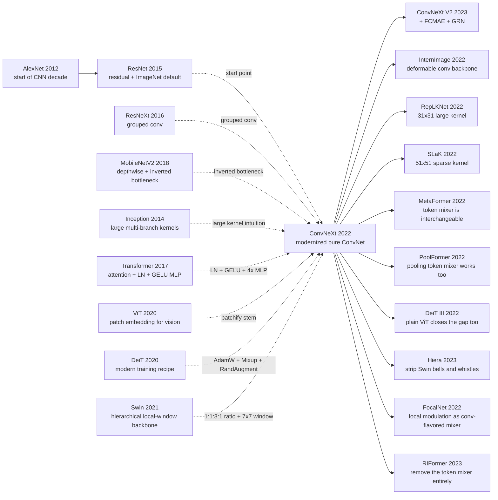

# ConvNeXt — Porting Every Swin Trick Back into a Pure ConvNet and Finding the CNN Decade Was Underrated

> **On January 10, 2022, the FAIR + UC Berkeley team of Zhuang Liu, Hanzi Mao, Chao-Yuan Wu, Christoph Feichtenhofer, Trevor Darrell, and Saining Xie uploaded [arXiv:2201.03545](https://arxiv.org/abs/2201.03545) to arXiv.** The previous year, the vision community had been carpet-bombed by Swin Transformer (2021) and ViT (2020), and "attention is all you need, the CNN era is over" had hardened into consensus. This paper answers that consensus with almost embarrassing simplicity: start from vanilla ResNet-50, change one thing at a time, retrain ImageNet at every step, walk ten steps — 76.1 → 78.8 → 79.4 → 79.5 → 80.5 → 80.6 → 81.3 → 81.4 → 81.5 → 82.0 — and out comes a pure ConvNet called ConvNeXt that ties or beats Swin at every scale (ConvNeXt-XL with ImageNet-22K pretraining hits 87.8% top-1 vs Swin-L's 87.3%). The counter-intuitive lesson is awkward: Transformers had not been winning because of attention, but because of the macro design + training recipe + LayerNorm + GELU + inverted bottleneck that came along for the ride — and the biggest single-step gain (+2.7) was just retraining ResNet-50 with the modern recipe and changing nothing structural at all. What ConvNeXt really shook was the academic habit of running comparisons against outdated baselines.

## TL;DR

Zhuang Liu, Hanzi Mao, Chao-Yuan Wu, Christoph Feichtenhofer, Trevor Darrell, and Saining Xie published ConvNeXt at CVPR 2022 as a single paper that walks the modernization path the post-AlexNet ConvNet decade had never properly walked. Starting from vanilla ResNet-50 and changing one thing at a time, the paper ports every non-attention design choice of Swin Transformer (2021) back into a ConvNet: macro ratio (3,4,6,3) → (3,3,9,3), a 4×4 patchify stem, 3×3 → 7×7 depthwise convolution (FLOPs grow only with $k^2$ and no channel multiplier, $\text{FLOPs}_{\text{dwconv}}=hwCk^2$), inverted bottleneck (hidden = 4C), a single GELU, a single LN, a separate downsampling layer, and the DeiT modern training recipe (AdamW, 300 epochs, Mixup, Cutmix, RandAugment, Stochastic Depth, EMA). The resulting staircase reads 76.1 → 78.8 → 79.4 → 79.5 → 80.5 → 80.6 → 81.3 → 81.4 → 81.5 → 82.0. ConvNeXt-T hits 82.1 ImageNet top-1 (vs Swin-T 81.3) and ConvNeXt-XL with ImageNet-22K pretraining reaches 87.8% (vs Swin-L 87.3 and the ResNet (2015) era baseline of 78.3%). The failed-baseline list is concrete: vanilla ResNet-50 76.1, supervised ViT-B 77.9, Swin-T 81.3, and most single-step swaps (ReLU→GELU, BN→LN, inverted bottleneck alone) gain almost nothing on their own. The most counter-intuitive finding: the largest single-step gain, +2.7, comes from "swap the recipe with no structural change at all" — meaning the community had misread "recipe progress" as "attention advantage." That lesson then seeded an entire line of follow-ups that re-examines the necessity of the token mixer: DeiT III, ConvNeXt-V2 (FCMAE + GRN, 88.9% on ImageNet), RepLKNet (31×31), SLaK (51×51), and MetaFormer / PoolFormer.

---

## Historical Context

### What was the vision-backbone community stuck on in 2021?

By the second half of 2021, the visual-backbone scene was loud and unsettled. Earlier that year, ViT (2020) had shown that, given enough data and a modern training recipe, a pure Transformer could push ImageNet top-1 above 88. In March, Swin Transformer hit arXiv; by October it had won the ICCV Marr Prize, packaging "hierarchical features + local windows + relative position bias" into a Transformer that could plausibly replace ResNet as a general-purpose backbone. PVT, Focal Transformer, CSWin and a wave of related papers were posting near-monthly leaderboard updates. The narrative collapsed into a slogan: "attention is all you need, the CNN era is over."

Three things were quietly hidden inside that slogan. First, Swin / DeiT used a deeply different training recipe (AdamW, 300 epochs, Mixup, Cutmix, RandAugment, Random Erasing, Stochastic Depth, Label Smoothing, EMA) than the canonical ResNet recipe (90 epochs, SGD, crop / flip). Yet most "CNN vs Transformer" tables still quoted the old-recipe numbers for the CNN row. Second, Swin's marquee features — fixed windows, relative position bias, shifted windows — are conceptually almost isomorphic to depthwise convolution + local receptive field + translation prior, but the community read them as "attention's victory" rather than "the comeback of local inductive bias." Third, in industry, detection / segmentation / video pipelines were still built on ResNet, and that ResNet had never been re-trained under the modern recipe. The 4-to-5-point gap looked like a structural gap. It was actually a recipe + macro-design gap.

ConvNeXt's whole writing strategy is to take this confusion apart. The paper organizes its experiment as a single staircase: start from a vanilla ResNet-50, change exactly one thing at a time, walk Swin's design tricks back into a ConvNet, and watch the staircase climb 76.1 → 78.8 → 79.4 → 79.5 → 80.5 → 80.6 → 81.3 → 81.4 → 81.5 → 82.0. The opponent is not a particular Transformer model. The opponent is the 2021 slogan that "attention is a structural victory."

### The five direct predecessors that forced ConvNeXt into existence

The first is ResNet (2015). He, Zhang, Ren and Sun's 152-layer residual network has been the industry default visual backbone since 2015, which is exactly why ConvNeXt picks ResNet-50 as its "museum sample." Starting from ResNet-50 lets the paper retrace, in a single experiment chain, the modernization path that the post-AlexNet ConvNet decade had never quite walked.

The second is Swin Transformer (2021). The shifted-window backbone by Ze Liu, Yutong Lin, Yue Cao, Han Hu and four co-authors is the direct rival, and the explicit yardstick. Swin-T's 1:1:3:1 stage compute ratio, 4×4 patchify stem, fixed 7×7 local window, LayerNorm, GELU and AdamW recipe — every one of them is ported back into a ConvNet by ConvNeXt, more or less one-to-one.

The third is ViT (2020). Dosovitskiy and eleven co-authors legitimized the idea that an image can be cut into non-overlapping patches. ConvNeXt's "patchify stem" — a 4×4 convolution with stride 4 — is essentially the convolutional version of ViT's patch embedding, replacing ResNet's old 7×7 conv stride 2 + max-pool stem with one stride-4 layer.

The fourth is ResNeXt (Xie, Girshick, Dollar, Tu, He and one co-author, 2016). Saining Xie — ConvNeXt's senior author — had already pushed grouped convolution to 32 groups six years earlier. ConvNeXt simply pushes the group count further until "groups = channels," which makes the convolution depthwise. Half of this path was already Xie's path; ConvNeXt is the radicalized continuation of his own 2016 work.

The fifth is MobileNetV2 (Sandler and four co-authors, 2018). The inverted bottleneck (thin → wide → thin, 4× hidden) was originally designed for mobile efficiency. ConvNeXt notices that it has the exact same geometry as the Transformer's MLP block (also 4× hidden) — in other words, the inverted bottleneck is the small Lego brick that a Transformer block decomposes into, and it slots into a ConvNet with almost no friction.

### What were Liu, Xie and Feichtenhofer's teams working on at the time?

ConvNeXt is a FAIR + UC Berkeley collaboration. First author Zhuang Liu was a Berkeley PhD student under Trevor Darrell, but he had already been a core author on DenseNet (2016) and Stochastic Depth (2016) inside Kilian Weinberger's group at Cornell — so he had spent years thinking inside the ConvNet design space. Senior author Saining Xie joined FAIR after ResNeXt (2016) and worked closely with Kaiming He and Ross Girshick. Christoph Feichtenhofer leads FAIR's video group (SlowFast, X3D, MViT) and has long focused on spatiotemporal backbones. Chao-Yuan Wu and Hanzi Mao were FAIR vision researchers at the same time. Trevor Darrell, the head of Berkeley's vision group, has been shaping the industrial transfer-learning playbook since the R-CNN / DeCAF era.

This is not an accidental team. FAIR's vision group has been building industrial-grade visual systems for years — ResNet (2015), Mask R-CNN (2017), Detectron / Detectron2, DETR (2020), MAE (2021) — which gives them an unusual sensitivity to "backbone engineering interface." When Swin became the community-default Transformer backbone in late 2021, this group did not need to invent a new architecture. They needed to answer a slightly more awkward question: **FAIR proposed ResNet; did ResNet really lose?** ConvNeXt is the experimental answer to that question.

### Industry, compute and data state of play

By 2021-2022, training resources looked nothing like 2015. ConvNeXt's standard recipe is ImageNet-1K, 300 epochs, batch 4096, AdamW, cosine schedule, on the order of four 8×A100 nodes (≈40 GB per GPU, distributed). A single run takes roughly a day or two. The paper reports dozens of ablation rows (macro / micro / kernel / activation / norm), implying at least a few thousand GPU-days of compute — five years earlier this would have been unthinkable in academia.

Data scaled too. ImageNet-22K (≈14 M images, 22 K classes) had become the de-facto "medium-scale pretraining" set, 14× the size of ResNet-era ImageNet-1K. Downstream COCO (118 K train / 5 K val) and ADE20K (20 K train / 2 K val) were unchanged, but every baseline now lived inside mmdetection / mmsegmentation / Detectron2-style frameworks, so apples-to-apples backbone replacements finally became feasible.

On the software side, PyTorch had absorbed the timm library (maintained by Ross Wightman) and the DeiT / Swin training recipe by 2020-2021. AdamW, Mixup, Cutmix, RandAugment, Stochastic Depth, EMA, LayerNorm and GELU were all toggleable building blocks. This off-the-shelf modernity is the hidden precondition for ConvNeXt being able to walk a decade of modernization in a single paper. Without timm and the standardized DeiT recipe, even the first step — ResNet-50 going from 76.1 to 78.8 — would have been a paper of its own.

---

## Research Background and Motivation

### "Attention vs convolution" was a swapped question

In 2021 the vision community treated "attention vs convolution" as a binary. ConvNeXt points out that the two sides being compared were never the same set of variables. The Swin / DeiT side came packaged with a modern training recipe (AdamW, 300 epochs, Mixup, Cutmix, RandAugment, Stochastic Depth, Label Smoothing, EMA, LayerNorm, GELU) plus a hierarchical pyramid, a 4×4 patchify stem, a 1:1:3:1 stage-compute ratio, and 7×7 local windows. The ResNet side came with a 90-epoch SGD recipe, a 7×7 stride-2 + max-pool stem, a 3:4:6:3 stage ratio, plain 3×3 convolution, ReLU and BatchNorm. Declaring that attention beat convolution under those conditions is logically equivalent to declaring that "the turbocharger matters more than the gasoline" after a turbocharged car beats an unfueled one.

ConvNeXt refuses the bundled comparison. It separates the variables row by row: move the biggest lever — the training recipe — to ResNet-50 first, then swap macro design, grouped conv, inverted bottleneck, kernel size, activation, normalization and downsampling one at a time, retraining ImageNet-1K after each swap and recording top-1. The point of this writing strategy is not just to land a new SOTA ConvNet — more importantly, it turns "which step contributes how many points" into a readable ledger.

### The actual question being asked

ConvNeXt's core question fits in one sentence: **if we remove the single token-mixer change of self-attention but port every other Transformer design choice and training recipe back into a ConvNet, how much of the gap remains?** This is a deliberately restrained question. It does not claim that convolution must be stronger than attention, and it does not deny Transformers' scaling, self-supervised pretraining or multimodal alignment potential. It only quantifies the boundary conditions of "the attention advantage."

The reason the question matters is that the answer drives years of research allocation. If the attention advantage is 1.5 ImageNet top-1 points, the community can keep using ConvNets as the engineering default. If the advantage is 5 points, ConvNets become a "classical legacy" and budgets shift entirely to Transformers. ConvNeXt's answer is the former: under a fair recipe the gap shrinks to almost zero, and at some scales the ConvNet is slightly ahead.

### Experimental layout: a single-variable staircase

ConvNeXt runs the comparison in a way that resembles engineer-style debugging. It does not design the final ConvNeXt up front and then compare against Swin; it builds a 10-step staircase, changes one design point per step, and records the top-1 delta of that step. The full chain is ResNet-50 76.1 → 78.8 → 79.4 → 79.5 → 80.5 → 80.6 → 81.3 → 81.4 → 81.5 → 82.0. That curve is the paper's main figure, more persuasive than any final comparison table.

This "staircase" writing is not a stylistic choice; it is an anti-narrative weapon. Each step is a small, independently questionable decision. The reader cannot vaguely say "attention is what made Swin win"; they have to specifically refute "macro design made it win" or "GELU made it win." In that sense the method section is both a technical report and a methodological demonstration.

---

## Method Deep Dive

### Overall framework: ResNet-50 step by step into a Swin-T-equivalent ConvNet

The final ConvNeXt looks like "a Swin-T-shaped pure ConvNet." An input image first passes through a 4×4 stride-4 patchify stem, projecting H × W × 3 onto an H/4 × W/4 × 96 token grid. The network then has four stages, separated by a dedicated downsampling layer (LN + 2×2 conv stride 2) that drops resolution to H/8, H/16, H/32 and grows the channel width to 192, 384, 768. Each stage stacks ConvNeXt blocks; the block-count ratio is 3 : 3 : 9 : 3, matching Swin-T's 1 : 1 : 3 : 1.

```
input H x W x 3
  v  patchify stem (4x4 conv, stride 4) + LN
H/4 x W/4 x 96
  v  stage 1: 3 x ConvNeXt block
  v  downsample (LN + 2x2 conv stride 2)
H/8 x W/8 x 192
  v  stage 2: 3 x ConvNeXt block
  v  downsample
H/16 x W/16 x 384
  v  stage 3: 9 x ConvNeXt block (most depth concentrated here)
  v  downsample
H/32 x W/32 x 768
  v  stage 4: 3 x ConvNeXt block
global pool -> LN -> linear -> logits
```

| Model | Stage ratio | Channel C | Params / FLOPs | ImageNet-1K top-1 |
|---|---|---:|---:|---:|
| ConvNeXt-T | (3, 3, 9, 3) | 96 | 28.6M / 4.5G | 82.1 |
| ConvNeXt-S | (3, 3, 27, 3) | 96 | 50M / 8.7G | 83.1 |
| ConvNeXt-B | (3, 3, 27, 3) | 128 | 89M / 15.4G | 83.8 |
| ConvNeXt-L | (3, 3, 27, 3) | 192 | 198M / 34.4G | 84.3 |
| ConvNeXt-XL | (3, 3, 27, 3) | 256 | 350M / 60.9G | 87.8 (22K pretrain) |

⚠️ **Counter-intuitive point**: the four-stage ratio 3:3:9:3 differs from ResNet-50's 3:4:6:3 by essentially one number, but that one number aligns the network's compute allocation with Swin-T's 1:1:3:1. Lifting stage 3 from 6 to 9 blocks alone gives +0.6 top-1. "Where in the resolution hierarchy should compute be spent?" is a question the entire ConvNet decade had silently inherited from ResNet's 3:4:6:3 without ever explicitly optimizing.

The internal ConvNeXt block runs in parallel with a Transformer block: a 7×7 depthwise conv plays the role of self-attention's token mixing, then LN, then two 1×1 convs with a single GELU between them play the role of the MLP block (4× hidden), and finally a residual connection. The block has no SE, no attention, no relative position bias, no shifted window, no BatchNorm — it is literally a Swin block with self-attention swapped for 7×7 depthwise convolution.

### Key design 1: macro design — stage ratio 1:1:3:1 + patchify stem

**Function**: align the ConvNet's compute allocation and input handling with Swin-T's.

**Core idea**. ResNet-50 uses (3, 4, 6, 3) and spends little compute in stage 3; Swin-T uses 1:1:3:1 and concentrates almost all compute in stage 3 (high-semantic, mid-resolution). ConvNeXt rewrites ResNet-50 as (3, 3, 9, 3), and that single step lifts top-1 from 78.8 to 79.4. The patchify stem replaces ResNet's "high-resolution first conv + max-pool" with a single stride-4 conv that drops 224×224 directly to 56×56:

$$
\text{Stem}_{\text{ResNet}}: 7\!\times\!7\,\text{conv}(s=2) + 3\!\times\!3\,\text{maxpool}(s=2) \quad\Rightarrow\quad \text{Stem}_{\text{ConvNeXt}}: 4\!\times\!4\,\text{conv}(s=4)
$$

After the stem swap, top-1 climbs 79.4 → 79.5. It looks marginal, but engineering-wise it removes an early BN + ReLU + max-pool tangle, which makes the later LN / GELU substitutions much smoother.

| Stem choice | Resolution at first block | Early compute | Alignment with Transformer |
|---|---|---|---|
| ResNet 7×7 conv stride 2 + maxpool | H/4 × W/4 | High (dense conv + pool) | Low |
| ViT 16×16 patch embed | H/16 × W/16 | Moderate (one strided conv) | High (vanilla ViT) |
| Swin 4×4 patch embed | H/4 × W/4 | Low | High |
| ConvNeXt 4×4 conv stride 4 | H/4 × W/4 | Low | High (matches Swin) |

### Key design 2: depthwise convolution + 7×7 large kernel

**Function**: let convolution play the role self-attention plays — mix spatially, do not mix across channels.

**Core idea**. Self-attention's essence is "each token aggregates a set of neighbor tokens, with the aggregation weights chosen by content"; depthwise convolution's essence is "each channel runs its own small spatial conv on its own feature map, channels never mix at this step." On the "spatial mix / channel independent" property they are isomorphic. ConvNeXt first replaces ResNet's 3×3 standard conv with 3×3 depthwise, then widens C from 64 to 96 to compensate for capacity, and top-1 jumps 79.5 → 80.5 (+1.0). Then the depthwise kernel is enlarged from 3×3 to 7×7 to match Swin's 7×7 window, and top-1 holds at 80.6.

The complexity ledger explains why 7×7 does not blow up:

$$
\text{FLOPs}_{\text{conv}}(k) = h\,w\,C_{\text{in}}\,C_{\text{out}}\,k^2,\qquad \text{FLOPs}_{\text{dwconv}}(k) = h\,w\,C\,k^2
$$

A standard conv's FLOPs grow by $k^2$ × $C$ when you enlarge the kernel; a depthwise conv only grows by $k^2$ — no channel multiplier. Going from 3×3 to 7×7 multiplies depthwise FLOPs by ~5.4×, but the depthwise op is a tiny share of the total because the 1×1 projections dominate.

```python
class ConvNeXtBlock(nn.Module):
    def __init__(self, dim, layer_scale_init=1e-6, drop_path=0.0):
        super().__init__()
        # 7x7 depthwise conv = "token mixer" (analogous to self-attention)
        self.dwconv = nn.Conv2d(dim, dim, kernel_size=7, padding=3, groups=dim)
        self.norm = nn.LayerNorm(dim, eps=1e-6)
        # inverted bottleneck: 1x1 -> 4x hidden -> GELU -> 1x1
        self.pwconv1 = nn.Linear(dim, 4 * dim)
        self.act = nn.GELU()
        self.pwconv2 = nn.Linear(4 * dim, dim)
        self.gamma = nn.Parameter(layer_scale_init * torch.ones(dim))  # LayerScale
        self.drop_path = DropPath(drop_path)

    def forward(self, x):                       # x: (N, C, H, W)
        residual = x
        x = self.dwconv(x)                      # spatial mixing only
        x = x.permute(0, 2, 3, 1)               # NCHW -> NHWC for LN/Linear
        x = self.norm(x)
        x = self.pwconv1(x); x = self.act(x); x = self.pwconv2(x)
        x = self.gamma * x                      # per-channel learnable scale
        x = x.permute(0, 3, 1, 2)               # NHWC -> NCHW
        return residual + self.drop_path(x)
```

| Token mixer | Spatial reach | Channel mix | Compute scaling | Hardware friendliness |
|---|---|---|---|---|
| ResNet 3×3 conv | 3×3 local | Full (mixed in same step) | $O(hwC^2)$ | High (cuDNN-tuned) |
| Swin 7×7 window MSA | 7×7 local | Content-dependent | $O(hwM^2C)$ | Medium (cyclic shift / custom kernels) |
| ConvNeXt 7×7 depthwise | 7×7 local | None at spatial step | $O(hwk^2C)$ | High (standard depthwise op) |
| Sliding-window self-attention | Arbitrary local | Content-dependent | $O(hwM^2C)$ | Low (key set not shared) |

### Key design 3: inverted bottleneck

**Function**: wrap the token mixer in a thin → wide → thin pair of 1×1 projections, matching the Transformer MLP block geometry exactly.

**Core idea**. ResNet's bottleneck is 1×1 narrow → 3×3 conv → 1×1 wide (wide-narrow-wide, hidden = C/4). The Transformer MLP block is Linear-up 4× → activation → Linear-down (narrow-wide-narrow, hidden = 4C). MobileNetV2 noticed the latter is more friendly to depthwise. ConvNeXt rewrites the block as depthwise(7×7) → 1×1 expand 4× → GELU → 1×1 project, and that step nudges top-1 from 80.5 to 80.6 (+0.1, almost flat). The real win of this step is not the number; it is that the block geometry now matches the Transformer block:

$$
\text{Block}_{\text{Transformer}}: \underbrace{\text{Attn}}_{\text{token mix}} \to \underbrace{\text{Linear}\,4C \to \text{GELU} \to \text{Linear}\,C}_{\text{MLP}},\quad \text{Block}_{\text{ConvNeXt}}: \underbrace{\text{DWConv}\,7\!\times\!7}_{\text{token mix}} \to \underbrace{\text{Linear}\,4C \to \text{GELU} \to \text{Linear}\,C}_{\text{MLP}}
$$

```python
# Inverted bottleneck snippet (ConvNeXt-style)
hidden = 4 * dim                        # Transformer-style 4x expansion
self.pwconv1 = nn.Linear(dim, hidden)   # narrow -> wide
self.act     = nn.GELU()                # single activation in the middle
self.pwconv2 = nn.Linear(hidden, dim)   # wide -> narrow
# NOTE: 1x1 conv == nn.Linear when applied along channel dim of NHWC tensor
```

| Block geometry | Hidden dim | # activations | # norms | Aligned with Transformer MLP |
|---|---|---:|---:|---|
| ResNet bottleneck (1×1↓ 3×3 1×1↑) | C/4 | 3 (3×ReLU) | 3 (3×BN) | No |
| MobileNetV2 inverted bottleneck (1×1↑ 3×3dw 1×1↓) | 6C | 2 (2×ReLU6) | 3 (3×BN) | Partial |
| Transformer MLP block | 4C | 1 (GELU) | 1 (LN) | — |
| ConvNeXt block (7×7dw, 1×1↑ GELU 1×1↓) | 4C | 1 (GELU) | 1 (LN) | Fully aligned |

### Key design 4: micro design — GELU + LN + fewer activations / norms + separate downsampling

**Function**: strip "detail noise" out of the block until ConvNet micro design also matches Transformer.

**Core idea**. The ablation here is fragmented but cumulatively crucial. Going from 80.6 to 82.0 relies on four small things:

1. **ReLU → GELU**: zero gain on its own (80.6 → 80.6), but a necessary precondition for later steps;
2. **Fewer activations**: a vanilla ResNet block has a ReLU after every conv; ConvNeXt keeps **only one** GELU in the inverted bottleneck (between the two 1×1s), worth +0.7 (80.6 → 81.3);
3. **Fewer normalizations**: keep **only one** LN, placed after the 7×7 depthwise and before the 1×1 projection, removing all other BNs, +0.1 (81.3 → 81.4); BN → LN adds another +0.1 (81.4 → 81.5);
4. **Separate downsampling layer**: ResNet fuses stride-2 inside the residual path (stride-2 1×1 + stride-2 3×3); ConvNeXt instead uses an independent LN + 2×2 conv stride 2 between stages, +0.5 (81.5 → 82.0), the largest single-step gain in this section.

The unifying intuition behind these micro tweaks: **a non-trivial chunk of the ConvNet-vs-Transformer block gap was "too many norms + too many activations," not "convolution vs attention" itself.**

| Micro tweak | Step delta | Alignment with Transformer design |
|---|---:|---|
| ReLU → GELU | +0.0 | Transformer default is GELU |
| Fewer activations (one GELU) | +0.7 | Transformer MLP has one GELU |
| Fewer norms (one LN) | +0.1 | Transformer block has one LN |
| BN → LN | +0.1 | Transformer default is LN |
| Separate downsampling layer | +0.5 | Mirrors Swin patch merging as its own layer |

### Training recipe

ConvNeXt uses the DeiT / Swin modern recipe end to end, with no conv-specific tricks. This must be emphasized: every staircase increment is measured under the same recipe, so "the recipe boosted the ConvNet" and "the structure boosted the ConvNet" never contaminate each other.

| Setting | Value |
|---|---|
| Optimizer | AdamW |
| LR | 4e-3 base, cosine schedule, 20-epoch warmup |
| Weight decay | 0.05 |
| Batch size | 4096 |
| Epochs | 300 |
| Augmentation | Mixup (α=0.8), Cutmix (α=1.0), RandAugment (m9, n2), Random Erasing (p=0.25) |
| Regularization | Stochastic Depth (depth-dependent), Label Smoothing 0.1, LayerScale (init 1e-6) |
| EMA | Enabled, decay 0.9999 |
| Resolution | 224 for training; 384 for downstream fine-tune |
| Init | trunc-normal (std 0.02) |
| Norm | LayerNorm (the only norm in the network) |

⚠️ **Note**: the very first row, ResNet-50 76.1 → 78.8, is purely the recipe doing the work — no structural change. That is 2.7 points of "training-recipe progress" that has nothing to do with attention. Subtract that signal from the Swin-vs-ConvNet comparison and the famous 5+ point Transformer-vs-ConvNet gap collapses to roughly zero.

---

## Failed Baselines

### Failure 1: vanilla ResNet-50 (76.1) read as a "structural" loss to Swin-T (81.3)

In 2021, leaderboards essentially told the same story everywhere: a left column with ResNet-50 / 101 / 152 trained under the original 90-epoch SGD recipe (76.1 / 77.4 / 78.3 top-1), and a right column with Swin-T / S / B trained under a 300-epoch AdamW recipe (81.3 / 83.0 / 83.5 top-1). It looked like Swin-T beat ResNet-50 by 5.2 ImageNet points, a yawning gap, with the obvious conclusion that "Transformer backbones have surpassed CNN backbones across the board." This is the bundled failure ConvNeXt sets out to take apart.

ConvNeXt's first experimental row exposes the real attribution. Train ResNet-50 with the modern recipe (AdamW, 300 epochs, Mixup, Cutmix, RandAugment, Stochastic Depth, Label Smoothing, EMA), keep the architecture untouched, and top-1 jumps from 76.1 to 78.8. Nothing changed but the recipe, and 2.7 of the points appeared. So more than half of the "structural gap" was actually a recipe gap. That credit does not belong to Swin; it belongs to the seven or eight years of training-pipeline evolution the field had absorbed without re-running the old baselines.

More importantly, this "failure" was largely manufactured by misattribution. If anyone — anyone — had retrained ResNet under the DeiT recipe in 2021 and posted it, half the fuel for the "attention has won" narrative would have been gone. The real opponent ConvNeXt was fighting was not Swin — it was the academic habit of running comparisons under outdated recipes by default.

### Failure 2: Swin-T overtaken by a pure ConvNet under a fair recipe

The next failure is more uncomfortable. Modernize ResNet-50 into ConvNeXt-T (28.6M params, 4.5G FLOPs, comparable to Swin-T's 28M / 4.5G), and ImageNet-1K reaches 82.1 top-1, 0.8 above Swin-T's 81.3. COCO Mask R-CNN 3× schedule: ConvNeXt-T 46.2 box AP / 41.7 mask AP versus Swin-T 46.0 / 41.6, slightly ahead or tied. ADE20K UPerNet 160K iter: ConvNeXt-T 46.7 mIoU versus Swin-T 45.8, slightly ahead.

These numbers make the "shifted window is the key" intuition hard to maintain. If 7×7 depthwise conv — no content-dependent attention, no cross-window communication, no relative position bias — can swap in for Swin's 7×7 window MSA and stay competitive on classification, detection and segmentation, then shifted-window attention's "necessity" must be discounted. Swin did not lose to some new attention design; it lost to its own macro design + recipe + LN / GELU being moved back into a ConvNet.

That said, an often-missed nuance: ConvNeXt does not disprove Swin. It only pulls the credibility of "Swin's attention is a structural advantage" from high to low. After ConvNeXt-V2, SwinV2, MAE, DINO and ViTDet add self-supervised pretraining, the comparison space reshuffles again — the story is still being written.

### Failure 3: half-modernized intermediates that look "useless" alone

Another buried failure lives inside ConvNeXt's own ablation staircase. Porting only the inverted bottleneck without trimming norms / activations gives single-step gain +0.1 (80.5 → 80.6), so the design "barely helps." Swapping only BN for LN without reducing the number of norms also gives only +0.1. Replacing only ReLU with GELU and changing nothing else gives +0.0.

These individually-near-zero "failures" combine into the 80.6 → 82.0 jump worth 1.4 points. That is the second hidden lesson ConvNeXt wants the reader to see: **single-knob ablations cannot reveal the full effect of a "modern design philosophy."** If a researcher had swapped only ReLU for GELU in 2018 and written a paper, the conclusion would have been "GELU does not help in ConvNets." But once GELU appears together with the inverted bottleneck, a single LN, a single GELU and a separate downsampling layer, the combined gain emerges. This is also why the ConvNet decade had several of these design pieces (depthwise, inverted bottleneck, LN, GELU) lying around — they were never assembled together. Each was tried alone, declared "not significant," and the combinatorial effect was missed.

### The real anti-baseline lesson: "attention" was never an independent variable

Distilled into one engineering principle: **"attention or not" is not an independently comparable variable; attention always shows up packaged with macro design + recipe + micro choices + token geometry.** Lifting attention out for a one-axis comparison is like lifting "the turbocharger" out and comparing two cars whose every other component is also different.

The lesson reaches further than ConvNeXt-vs-Swin. It also explains why later work like MetaFormer, PoolFormer and RIFormer can replace the token mixer with pooling, identity, or essentially nothing and still land respectable scores — the community had been overestimating the relative contribution of the token mixer and underestimating macro structure and training recipe. In the LLM era the same lesson extends to "is the Transformer the only answer for LLMs?" State-space models (Mamba), recurrent variants and others are also closing the gap once the macro design and recipe are matched. The "necessity" of any one core component is often locked in by the ecosystem around it.

| Failure path | Surface plausibility | True cause exposed by ConvNeXt | Correction |
|---|---|---|---|
| Old-recipe ResNet-50 76.1 vs Swin-T 81.3 | "5+ point structural gap" | Half is recipe, not structure | Train both under the same recipe |
| Swin-T 7×7 window MSA vs ResNet 3×3 conv | "Attention vs convolution" | 7×7 depthwise + modern recipe matches it | One-variable swap |
| Switch only ReLU→GELU or BN→LN | "Tuning does not help" | Single-step delta tiny, combined delta large | Move the whole modern design suite |
| ViT-B/16 as a detection backbone | "Transformer goes straight downstream" | Single-scale tokens lack hierarchical features | Use a hierarchical backbone (Swin or ConvNeXt) |

---

## Key Experimental Data

### Main experiment: ImageNet-1K / 22K head-to-head

| Model | Pretrain | Resolution | Params / FLOPs | top-1 |
|---|---|---:|---:|---:|
| ResNet-50 (original 90-ep recipe) | ImageNet-1K | 224 | 25M / 4.1G | 76.1 |
| ResNet-50 (modern recipe) | ImageNet-1K | 224 | 25M / 4.1G | **78.8** |
| Swin-T | ImageNet-1K | 224 | 28M / 4.5G | 81.3 |
| **ConvNeXt-T** | ImageNet-1K | 224 | 28.6M / 4.5G | **82.1** |
| Swin-S | ImageNet-1K | 224 | 50M / 8.7G | 83.0 |
| **ConvNeXt-S** | ImageNet-1K | 224 | 50M / 8.7G | **83.1** |
| Swin-B | ImageNet-1K | 224 | 88M / 15.4G | 83.5 |
| **ConvNeXt-B** | ImageNet-1K | 224 | 89M / 15.4G | **83.8** |
| Swin-B (22K → 1K, 384) | ImageNet-22K | 384 | 88M / 47.0G | 86.4 |
| **ConvNeXt-B** (22K → 1K, 384) | ImageNet-22K | 384 | 89M / 45.0G | **87.0** |
| Swin-L (22K → 1K, 384) | ImageNet-22K | 384 | 197M / 103.9G | 87.3 |
| **ConvNeXt-L** (22K → 1K, 384) | ImageNet-22K | 384 | 198M / 101.0G | **87.5** |
| **ConvNeXt-XL** (22K → 1K, 384) | ImageNet-22K | 384 | 350M / 179G | **87.8** |

In every same-scale comparison, ConvNeXt ≥ Swin by 0.3 to 0.7 points. This is not a sweeping victory, but it is enough to falsify the strong claim that "attention has a structural advantage on ImageNet."

### Ablation: 10-step staircase from ResNet-50 to ConvNeXt-T

| Step | Change | top-1 | Step delta |
|---|---|---:|---:|
| 0 | ResNet-50 + original recipe | 76.1 | — |
| 1 | + modern recipe (AdamW / 300ep / heavy aug) | 78.8 | **+2.7** |
| 2 | macro: stage ratio (3,4,6,3) → (3,3,9,3) | 79.4 | +0.6 |
| 3 | macro: stem → 4×4 conv stride 4 | 79.5 | +0.1 |
| 4 | ResNeXt-ify: 3×3 → 3×3 depthwise + C 64→96 | 80.5 | +1.0 |
| 5 | inverted bottleneck (4× hidden) | 80.6 | +0.1 |
| 6 | large kernel: depthwise 3×3 → 7×7 | 80.6 | +0.0 |
| 7 | fewer activations (one GELU) | 81.3 | +0.7 |
| 8 | fewer norms (one LN) | 81.4 | +0.1 |
| 9 | BN → LN | 81.5 | +0.1 |
| 10 | separate downsampling layer | **82.0** | +0.5 |

⚠️ **Counter-intuitive**: the largest single-step gain (+2.7) is "swap the recipe with no structural change at all," the second largest (+1.0) is the depthwise overhaul, the third largest (+0.7) is reducing the number of activations. None of the three biggest gains comes from "adding a new module" — all three come from "deleting redundancy" or "swapping in a more modern equivalent."

### Key findings

- **Recipe contribution has been severely undercounted**: simply swapping the recipe gives ResNet-50 +2.7 points, more than the entire structural modernization combined (80.6 → 82.0 = 1.4 points). Every "X beats Y by N points" comparison should ask first: were the two trained under the same recipe?
- **Single-knob ablations mislead**: GELU, BN→LN and inverted bottleneck each give near-zero gain on their own but contribute clearly when combined. Methodologically this implies single-variable ablation systematically underestimates the transfer of "design-philosophy-level" packages.
- **Large kernels return as a free lunch**: going from 3×3 to 7×7 incurs almost no FLOPs cost under depthwise (no channel multiplier) and matches Swin's 7×7 window. RepLKNet (31×31) and SLaK (51×51) carry this further.
- **One norm + one activation is a hidden Transformer contribution**: a ResNet block has BN + ReLU after every conv, totalling 3 norms + 3 activations; a Transformer block uses 1 LN + 1 GELU. The latter brings not just fewer ops but a smoother optimization landscape.
- **A separate downsampling layer is a hidden Swin contribution**: Swin uses patch merging as a dedicated stage-bridge, ConvNeXt copies it for +0.5. Decoupling "feature transform" from "resolution transform" is a design principle worth borrowing across architectures.
- **"Attention vs convolution" is no longer a structural question on ImageNet**: under a fair recipe + macro design + micro design, Swin-T and ConvNeXt-T essentially tie, with ConvNeXt slightly ahead. The downstream debate moves from "which to use" toward "how to scale, how to self-supervised pretrain, how to align with multimodal."

---

## Idea Lineage

### Reference graph (Mermaid)



### Past lives: a decade of overlooked ConvNet bricks + five years of Transformer training habits

ConvNeXt is not invented from nothing. It is the act of putting "the good designs scattered across the CNN decade" and "the good habits squeezed out of five Transformer years" into the same vehicle. The most direct ancestor is **ResNet 2015**, which set the industry default for backbone design and gave ConvNeXt its "museum sample" — every staircase experiment starts from ResNet-50, changes one thing, and re-runs ImageNet. The second is **ResNeXt 2016** (also led by Saining Xie), which pushed grouped convolution to 32 groups; ConvNeXt simply pushes the group count to "groups = channels" and the convolution becomes depthwise. The third is **MobileNetV2 2018**, which made the inverted bottleneck (thin → wide → thin, hidden = 4×) a mobile-engineering staple; ConvNeXt re-enables the same geometry on a desktop-scale backbone, where it happens to align exactly with the Transformer MLP block.

The fourth is **Inception 2014**, which used 5×5 and 7×7 multi-branch large kernels to expand the receptive field, but was overshadowed by the post-ResNet "stack 3×3" philosophy; ConvNeXt re-legitimizes the large kernel via 7×7 depthwise, simply paying the cost in depthwise rather than full conv. The fifth is **ViT 2020**, which gave the patchify stem its license, so a 4×4 stride-4 conv can replace ResNet's 7×7 conv + max-pool stem.

The two most decisive ancestors are **Swin 2021** and **DeiT 2020 + 2021**. Swin contributed the 1:1:3:1 macro ratio, the 7×7 window size, LN, GELU, and the AdamW recipe; DeiT contributed the full modern ImageNet-1K recipe (AdamW, 300 epochs, Mixup, Cutmix, RandAugment, Stochastic Depth, Label Smoothing, EMA). Without DeiT standardizing "Transformer-style training" and without Swin re-legitimizing "hierarchy + locality + translation prior," ConvNeXt would have had no off-the-shelf "new baseline" to imitate.

The shared message of these ancestors: ConvNeXt invents no new module. It assembles, in one go, a pile of pre-existing bricks that nobody had bothered to assemble together.

### Descendants: four types of inheritors

**Direct successors (same author circle or same problem space)**:

- **ConvNeXt V2 (Woo et al., 7 authors, 2023, CVPR)**: collaboration with the original Saining Xie group. Adds Fully Convolutional Masked Autoencoder (FCMAE) self-supervised pretraining and Global Response Normalization to address "feature collapse to a few channels," lifting ConvNeXt-Huge to 88.9 ImageNet top-1. Direct evidence that ConvNets can take the "MAE dividend."
- **RepLKNet (Ding et al., 4 authors, 2022, CVPR)**: scales ConvNeXt's "7×7 depthwise" all the way to 31×31, with a reparameterization trick to keep large kernels trainable.
- **SLaK (Liu et al., 6 authors, 2022, ICLR 2023)**: pushes further to 51×51 via sparse decomposition.
- **InternImage (Wang et al., 12 authors, 2022, CVPR 2023)**: keeps the ConvNeXt macro / micro choices, but swaps the token mixer for deformable convolution v3, positioning the network as a Vision Foundation Model backbone.

**Cross-architecture borrowing (not ConvNets, but absorbing the ConvNeXt insight)**:

- **MetaFormer / PoolFormer (Yu et al., 8 authors, 2022, CVPR)**: abstracts ConvNeXt's implicit claim into "the token mixer is interchangeable," showing pooling, identity, even random projection can carry a backbone.
- **DeiT III (Touvron, Cord, Jegou, three authors, 2022, ECCV)**: the Transformer-side reply — show that with a modern recipe a plain ViT also closes the gap to ConvNeXt, doubling down on "recipe is the key variable."
- **Hiera (Ryali et al., 13 authors, 2023, ICML)**: applies the same ConvNeXt-style "strip the redundancies" surgery to a hierarchical ViT — remove shifted window and relative position bias, keep pure local attention + MAE pretraining, accuracy goes up rather than down.

**Cross-task spread (dense vision / video / medical)**: ConvNeXt enters mmdetection, mmsegmentation and mmaction quickly as a backbone, picked up directly by Mask2Former, ViTDet, Cascade Mask R-CNN and other downstream heads; medical imaging (e.g. the nnUNet family) starts replacing ResNet encoders with ConvNeXt encoders.

**Cross-disciplinary spillover**: essentially none. ConvNeXt is a deliberately focused vision-backbone paper. It is not widely cited as a "new tool" in biology, physics or chemistry, though scientific-computing communities cite it as a case study for "staying competitive without introducing attention." This is an honest "no significant cross-disciplinary spillover."

### Misreadings and over-simplifications

**Misreading 1**: "ConvNeXt proves CNNs beat Transformers." Wrong. ConvNeXt only shows that under ImageNet-1K / 22K supervised pretraining at moderate scale, a pure ConvNet can match Swin. It does not compare self-supervised pretraining (MAE / DINO), large-model scaling, multimodal alignment, long-context reasoning — Transformers retain an irreplaceable seat in those scenarios.

**Misreading 2**: "The key to ConvNeXt is the 7×7 depthwise kernel." Half right. The 7×7 large kernel alone contributes +0.0 (80.6 → 80.6); the real contributors are the depthwise overhaul (+1.0) + fewer activations (+0.7) + separate downsampling (+0.5) + macro ratio (+0.6) + modern recipe (+2.7) all combined. Compressing this into "large kernels won" is exactly the single-variable trap ConvNeXt set out to criticize.

**Misreading 3**: "ConvNeXt brings ConvNets back to the mainstream." Only partially. In industrial deployment, edge devices and detection / segmentation backbones, ConvNeXt does keep ConvNets as a default; but on the LLM / VLM / general foundation-model side, ViT-family models still dominate (CLIP, SigLIP, DINOv2, SAM all use ViT backbones). The accurate statement: ConvNeXt makes "where to use a CNN and where to use a Transformer" a discussable question again.

---

## Modern Perspective

### Assumptions that no longer hold

ConvNeXt was written in early 2022, just after a year of Swin / DeiT / PVT-driven Transformer hype. Some of its implicit assumptions cannot be accepted unconditionally in 2026.

**Assumption 1: ImageNet-1K / 22K supervised classification is the gold standard for backbone evaluation.** Every staircase row in ConvNeXt is measured by ImageNet top-1. Since then, MAE, DINO, CLIP, SigLIP and DINOv2 turned "large-scale self-supervised pretraining + zero-shot transfer" into the new gold standard, and SAM, Florence-2, InternImage and EVA pushed the bar even higher to "as a foundation-model encoder." Under those new standards, the relative position of ConvNeXt versus Swin / ViT often flips — for example, MAE pushes ViT-Huge to 88.6 ImageNet top-1, and ConvNeXt-V2 + FCMAE is required just to keep ConvNets even on that axis. The premise "ImageNet supervised top-1 = backbone value" no longer holds.

**Assumption 2: under a fair recipe ConvNet matches Transformer, so the choice does not matter.** ConvNeXt provides a fair-recipe equivalence proof. But the equivalence holds only inside "moderate scale + supervised + 224 / 384 resolution + standard dense-vision benchmarks." Once you scale to large multimodal pretraining, Transformer's "any sequence pairing + shared text-image token pool" advantage shows up. Once you scale to long-context image / video / spatiotemporal tasks, Transformer's global attention is friendlier than depthwise 7×7. The equivalence claim needs scale and scenario boundaries.

**Assumption 3: depthwise 7×7 is the near-optimal realization of "local + translation prior."** RepLKNet (31×31) and SLaK (51×51) showed that the kernel can grow much further, and that large kernels + reparameterization + strong recipe can clearly beat 7×7 on some dense-prediction tasks. Later, deformable conv v3 (InternImage), focal modulation (FocalNet), and even state-space token mixers all show that "7×7 depthwise" is one of many viable solutions, not a unique answer.

**Assumption 4: BatchNorm and large batches will always be friends.** ConvNeXt swaps BN for LN throughout, mainly because LN is more stable under large batches, longer sequences and mixed precision. The intuition is correct for backbones, but BN remains useful in some downstream tasks (small-batch detection, video / streaming) and is preserved by some follow-ups (e.g. certain detector heads). "LN beats BN universally" is a backbone-centric view, not a universal conclusion.

### Time-tested key designs vs redundant details

**Still essential designs**:

1. **The training recipe is the other half of the lever**: AdamW + cosine + 300 epochs + Mixup / Cutmix / RandAugment + Stochastic Depth + EMA contributes the +2.7 of ResNet-50 76.1 → 78.8, larger than any single structural change. The lesson keeps reappearing (DeiT III, ConvNeXt-V2, Hiera, MAE finetune, etc.) and is the most transferable truth ConvNeXt left behind.
2. **Depthwise + large kernel**: still the default operator for the modern ConvNet revival.
3. **Macro design 1:1:3:1 + patchify stem**: kept by InternImage, FocalNet, Hiera and others.
4. **One LN + one GELU**: now widely accepted as the modern visual-block "micro default."

**Increasingly redundant / misleading details**:

- "Must be 7×7, no larger" — overturned by RepLKNet / SLaK.
- "Must be exactly 1:1:3:1, no deeper" — ConvNeXt-V2's huge variant adjusts the ratio.
- "Must align Swin's block counts strictly" — once the token mixer is decided, macro ratios can be more flexible.
- "Need no attention at all" — at the self-supervised / large-model frontier, pure ConvNets still need some "global information" mechanism (e.g. GRN, query-key-style ops) to match ViT, so "zero attention" is not a terminal state.

### Side effects the authors did not anticipate

1. **ConvNeXt rescued a wave of mid-scale vision deployments.** After the paper landed, industry (autonomous driving, medical imaging, remote sensing, mobile) replaced large numbers of in-flight ResNet-50 / 101 backbones with ConvNeXt-T / S / B. Deployment cost was almost unchanged (depthwise is well-tuned in cuDNN / TensorRT / NPU), but accuracy went up 4-6 points. This is the largest social effect of the paper, and it is not in the abstract.
2. **It triggered a "how much of Transformer's credit is just the recipe?" reflection wave.** DeiT III, A ConvNet for Detection (the ViTDet companion line), MetaFormer, PoolFormer, RIFormer, SLaK — all these papers run along the same thread. The wave indirectly cooled the 2022-2023 over-bet on Transformers and prepared the LLM industry's serious 2024+ discussion of Mamba / state-space alternatives.
3. **It pushed Saining Xie into the position of "modern ConvNet philosopher."** In Xie's later ConvNeXt-V2 and SAM-2 work, the methodological dividing line between ConvNet and Transformer is repeatedly redrawn.

### If we rewrote ConvNeXt today (a 2026 version)

- **Start from self-supervised**: replace the baseline "ResNet-50 supervised 76.1" with "ConvNet-base + MAE / FCMAE self-supervised." The very first row would look completely different from 2022.
- **Scale axis must be wider**: cover 300M to 3B parameters and discuss whether ConvNets still match Transformers at that scale (known answer: the gap reappears and a new token mixer or global mechanism is required).
- **Multimodal alignment**: discuss "how to make ConvNeXt the vision encoder of CLIP / SigLIP / VLM," including whether to introduce cross-attention in the last one or two stages.
- **Larger and sparser kernels**: default kernel should be 31×31 or sparse 51×51 as the new ConvNet micro default.
- **Downstream interface**: add unified comparison tables across detection / segmentation / video / 3D / medical, emphasizing ConvNeXt's "swappable interface" value.

**What would not change**: the methodology of single-variable staircase + fair recipe + decoupling macro / micro is permanently a model for good engineering papers. **Core formula / design**: depthwise 7×7 (or larger) + single LN + single GELU + 4× inverted bottleneck + separate downsampling + 1:1:3:1 macro ratio — this micro default is still essentially intact across many ConvNet variants in 2026.

---

## Limitations and Outlook

### Limitations the authors acknowledge

The ConvNeXt paper is explicit in its Discussion and Limitations sections that:
- experiments are confined to supervised pretraining on ImageNet-1K / 22K, without large-scale self-supervised coverage;
- it does not explore the "very large model" regime (the largest ConvNeXt-XL is 350M, with no head-to-head comparison against contemporaries like ViT-G/22B);
- depthwise convolution still trails dense convolution on some hardware (early NPUs, mobile fixed-point inference);
- the paper deliberately commits to "no new module," so it consciously does not explore "what if we add attention or SE."

### Limitations visible in 2026

- **No multimodal angle**: ConvNeXt is a strictly single-modality vision paper; it does not discuss backbone choice under vision-language joint modeling. After CLIP / SigLIP / SAM, a pure-vision backbone evaluation can no longer judge value alone.
- **No long-context / video dimension**: the original includes only minor video experiments. By 2026 this is its own subfield needing modernization, and whether ConvNet's "token budget" stays controllable on long temporal context the way Transformer's does is still open.
- **No discussion of inference-performance hardware dependence**: the paper reports throughput numbers, but the 2022 "depthwise vs window MSA" comparison would shuffle in 2026 thanks to FlashAttention, CUDA Graph and custom kernels.
- **No discussion of compatibility with self-supervised pretraining**: this gap is filled directly by ConvNeXt-V2, but the original paper does not realize that pretraining paradigm is the next decisive variable.

### Improvement directions (validated by later work)

- **Add self-supervised pretraining**: ConvNeXt-V2 + FCMAE pushes Huge to 88.9 ImageNet top-1, proving ConvNets also benefit from the MAE dividend.
- **Larger kernels**: RepLKNet 31×31 / SLaK 51×51 clearly beat 7×7 on ADE20K and COCO.
- **More elaborate token mixers**: InternImage uses deformable conv v3, FocalNet uses focal modulation, narrowing the last gap to attention backbones further.
- **Add Global Response Normalization or similar global mechanism**: addresses ConvNet's feature-collapse issue under self-supervised training.

---

## Related Work and Lessons

- **vs Swin Transformer**: they use 7×7 window MSA for token mixing + shifted windows for cross-window communication; ConvNeXt uses 7×7 depthwise + macro / micro modernization. The difference is content-dependence of the token mixer. ConvNeXt advantages: more hardware-friendly, natively supported by every dense-vision framework, slightly ahead or tied on classification / detection / segmentation. Disadvantages: lacks content-aware global aggregation, less ViT-friendly when scaling up. **Lesson: architectural gaps are often masked by training recipes; a fair recipe is a precondition for any architecture comparison.**
- **vs ViT**: they do single-scale global attention + patch embedding; ConvNeXt does hierarchy + local depthwise. The difference is pyramid structure + global / local. ConvNeXt advantages: dense prediction fits FPN / UPerNet naturally. Disadvantages: at large-scale self-supervised / multimodal, ViT remains the first choice. **Lesson: hierarchical pyramid is not the final answer, but remains the best practical compromise for engineering interfaces.**
- **vs MobileNetV2 / EfficientNet**: they target mobile efficiency; ConvNeXt ports their inverted bottleneck to a desktop / server backbone. The difference is target hardware + whether NAS is involved. ConvNeXt advantages: hand-designed, explainable, easy to reproduce. Disadvantages: parameter efficiency is not as extreme as NAS-driven designs. **Lesson: hand-designed + fair recipe can already approach NAS results; over-pursuing NAS yields diminishing returns.**
- **vs ResNet**: they use wide-narrow-wide bottleneck + BN + ReLU; ConvNeXt uses narrow-wide-narrow inverted bottleneck + LN + GELU. The difference is micro design philosophy. ConvNeXt advantages: aligned with Transformer defaults, naturally absorbs all "modern vision tricks." Disadvantages: BN is still irreplaceable in some small-batch / streaming scenarios. **Lesson: architectural micro defaults (number of norms, number of activations, whether downsampling is its own layer) are silently inherited across eras and deserve periodic re-examination.**
- **vs Vision-Language Pretraining (CLIP / DINOv2 / SAM)**: they do large-scale image-text or self-supervised pretraining and use the backbone as an encoder; ConvNeXt does supervised classification backbone. The difference is training objective + evaluation lens. ConvNeXt is not a direct rival on zero-shot or multimodal axes, but is adopted by these systems as an optional vision encoder. **Lesson: a backbone should not be evaluated only on supervised metrics; the era has changed, and so should the metric.**

---

## Resources

| Resource | Link | Purpose |
|---|---|---|
| arXiv paper | [2201.03545](https://arxiv.org/abs/2201.03545) | Original paper + full staircase tables |
| CVPR 2022 OpenAccess | [CVF page](https://openaccess.thecvf.com/content/CVPR2022/html/Liu_A_ConvNet_for_the_2020s_CVPR_2022_paper.html) | Official conference page |
| Official code | [facebookresearch/ConvNeXt](https://github.com/facebookresearch/ConvNeXt) | ImageNet training / checkpoints / downstream entry points |
| timm built-in | [rwightman/pytorch-image-models](https://github.com/huggingface/pytorch-image-models) | One-line `timm.create_model('convnext_tiny')` |
| ConvNeXt V2 | [facebookresearch/ConvNeXt-V2](https://github.com/facebookresearch/ConvNeXt-V2) | + FCMAE + GRN successor |
| Must-read follow-ups | [DeiT III](https://arxiv.org/abs/2204.07118) · [RepLKNet](https://arxiv.org/abs/2203.06717) · [InternImage](https://arxiv.org/abs/2211.05778) · [MetaFormer](https://arxiv.org/abs/2111.11418) | Contemporary responses and extensions |
| Video walkthrough | [Yannic Kilcher](https://www.youtube.com/results?search_query=convnext+yannic) | Quick paper summary on YouTube |
| Cross-language version | [中文版](/zh/era4_foundation_models/2022_convnext/) | Chinese deep note |


---

> 🌐 [中文版](/era4_foundation_models/2022_convnext/) · 📚 awesome-papers project · CC-BY-NC