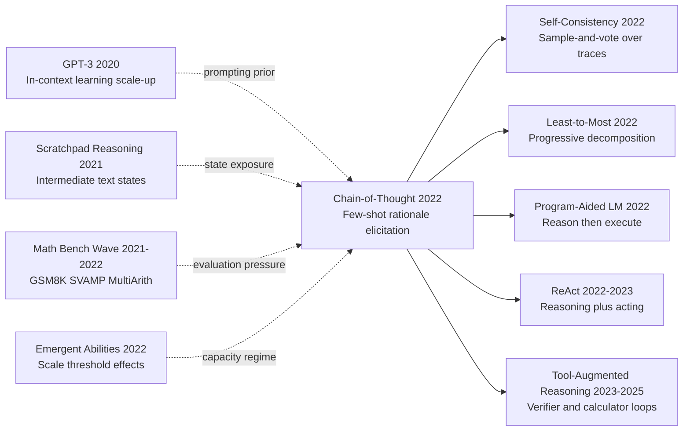

# CoT — Unlocking LLM Reasoning with 'Let's Think Step by Step'

> **January 28, 2022. Jason Wei, Xuezhi Wang, Denny Zhou, and 6 co-authors at Google Brain upload [arXiv 2201.11903](https://arxiv.org/abs/2201.11903); published at NeurIPS 2022 in December.**
> A pure-prompting paper that trained no model and changed no architecture, but systematically demonstrated for the first time that LLMs at 100B+ scale **suddenly emerge "Chain-of-Thought" reasoning ability** — simply replacing few-shot answers with step-by-step derivations spiked GPT-3 (175B) / PaLM-540B GSM8K accuracy from 17.9% to **56.9%** (PaLM 18% → 57%), with SVAMP / MAWPS / AQuA-RAT all hitting SOTA.
> Five months later Kojima et al. found you don't even need few-shot examples — just adding ***"Let's think step by step"*** to the prompt drives zero-shot accuracy from 17.7% to 78.7% ([Zero-Shot CoT](https://arxiv.org/abs/2205.11916)). **One sentence, one order of magnitude.**
> CoT's deepest impact isn't the numbers but its revelation that **LLM "reasoning ability" is a scale-correlated emergent phenomenon**, leading directly to InstructGPT (2022) / o1 / [DeepSeek-R1 (2025)](../era5_genai_explosion/2025_deepseek_r1.md) — **prompting engineering has since been recognized as on par with algorithmic research**.

## TL;DR

The decisive contribution of Chain-of-Thought Prompting is not a new architecture but a reproducible behavioral result: once model scale crosses a threshold, a few exemplars that include intermediate reasoning steps can reliably elicit latent multi-step reasoning trajectories, yielding large accuracy gains on arithmetic and symbolic benchmarks.

## Historical Context

### What was the community stuck on in 2020-2022?

From 2020 to 2022, language-model research was driven by two opposing currents. One current was scaling: larger models consistently improved broad language performance. The other was reasoning pressure: many practical tasks required stable intermediate computation, not just fluent final answers. The field was therefore caught between capability growth and reasoning reliability. Models looked impressive on open-ended generation, yet often failed in tasks where one early arithmetic mistake propagated to the final output.

Two baseline prompting paradigms dominated. The first was direct-answer few-shot prompting: provide examples of question-answer pairs and request only the final answer. This was cheap and often strong on short tasks, but unstable on long reasoning chains. The second was external tooling or symbolic solvers, which improved correctness but increased deployment complexity and reduced portability across task types. What the community lacked was a unified, low-friction method that required no parameter updates and still improved multi-step reasoning.

At the same time, there was no consensus on where reasoning came from. Some researchers argued that apparent reasoning was mostly retrieval and memorization artifacts. Others believed specialized fine-tuning was mandatory. A third view observed occasional spontaneous step-by-step outputs from large models, but without a stable trigger mechanism. CoT Prompting entered exactly here: it did not claim formal theorem proving, but showed through broad experiments that exposing reasoning steps in demonstrations significantly improves final accuracy on multiple reasoning benchmarks.

### The immediate predecessors that forced CoT

**2020 GPT-3 (Brown et al.)**: established in-context learning as a core paradigm, while exposing the ceiling of direct-answer prompting on complex reasoning tasks. It naturally raised the question: what if demonstrations include reasoning traces, not only final answers?

**2021 program- and tool-augmented reasoning prototypes**: several early approaches delegated computation to external programs or calculators, confirming the value of explicit intermediate representations. But they were more complex to deploy and less universal than pure prompting.

**2021-2022 benchmark wave (GSM8K, SVAMP, MultiArith, AQuA)**: these datasets made error accumulation visible. If intermediate state tracking is weak, final accuracy collapses quickly. CoT's benchmark choices directly targeted this pain point.

**Emergent-ability analyses around scale (including contemporaneous 2022 work)**: signs were already visible that some capabilities appear only beyond certain model sizes. CoT linked that emerging-capability narrative to a concrete prompt-level intervention.

### What the author team was doing at that moment

The authors at Google Research were systematically studying the relationship between scale, prompting, and capability emergence. CoT was not an isolated trick. It sat at the intersection of two ongoing lines of work: identifying where emergent abilities appear, and designing low-cost prompting methods that improve reliability without retraining.

The team composition also mattered. Method framing, benchmark design, and large-scale evaluation were tightly coupled, producing a paper that is conceptually simple but experimentally broad. Instead of adding a complicated training pipeline, the paper emphasized a reproducible empirical pattern across tasks and model scales. The engineering philosophy was clear: first isolate robust prompting regularities, then build more complex systems on top.

### Industry, compute, and data conditions

By 2022, frontier labs could run controlled experiments across very large models using TPU v4 and A100-class infrastructure. Mixed precision and distributed training/inference pipelines were mature enough that prompt-method ablations across scales became practical. Meanwhile, industry deployments in support, education, coding, and search assistance increased demand for process transparency: users often wanted not only answers, but also understandable reasoning.

Data conditions created additional pressure. High-quality reasoning datasets existed but were still tiny relative to web-scale pretraining corpora, making it unrealistic to expect stable reasoning behavior to emerge everywhere by pretraining alone. CoT offered a practical compromise: no expensive additional training, yet noticeably better reasoning behavior through demonstration format. Industry adopted this quickly, and it became the launch point for self-consistency, least-to-most prompting, and tool-augmented reasoning frameworks.

---

## Method Deep Dive

### Overall Pipeline

CoT can be written as a two-stage prompting protocol: first provide a few demonstrations in the format "question -> rationale -> answer," then ask the model to produce a rationale before the final answer on a new question. No parameter update, no architecture change, only input-structure control.

```text
Few-shot demonstrations:
(Q1, rationale1, A1)
(Q2, rationale2, A2)
...
(Qk, rationalek, Ak)

Test prompt:
Q*
Let's think step by step.
Model output: rationale* -> answer*
```

Its effectiveness is not about verbosity. It is about exposing latent intermediate states that constrain decoding locally. For multi-step arithmetic and symbolic tasks, this converts a high-risk one-shot endpoint prediction into a sequence of lower-risk local transitions.

| Component | Input | Output | Role |
|---|---|---|---|
| Demonstration construction | question + rationale + answer | few-shot context | define reasoning format |
| Trigger phrase | test question | "Let's think step by step" | activate trajectory generation |
| Rationale decoding | token sequence | intermediate text trajectory | reduce one-shot failure risk |
| Final-answer extraction | trajectory tail | scalar answer | benchmark-compatible scoring |

### Design 1: Explicit Intermediate States

**Function**: turn implicit internal reasoning into an observable and constrainable text trajectory.

Direct-answer prompting approximates a map $x\rightarrow y$, whereas CoT rewrites it as $x\rightarrow z_{1:T}\rightarrow y$, with $z_{1:T}$ denoting intermediate steps. This does not change model class, but changes error propagation during decoding. Instead of betting on a single endpoint token sequence, the model iteratively commits to local sub-results.

A useful probabilistic view is $p(y|x)=\sum_z p(y,z|x)$. Direct prompting marginalizes latent reasoning trajectories implicitly; CoT injects a prior over good $z$-shapes through demonstrations, making useful decompositions more likely at inference time.

```python
def cot_generate(model, demonstrations, question, max_new_tokens=256):
    prompt = demonstrations + "\nQ: " + question + "\nA: Let's think step by step."
    output = model.generate(prompt, max_new_tokens=max_new_tokens)
    rationale, answer = split_rationale_and_answer(output)
    return rationale, answer
```

| Option | Form | Strength | Risk |
|---|---|---|---|
| Direct Answer | $x\to y$ | concise, short outputs | brittle on long chains |
| CoT | $x\to z\to y$ | better controllability and robustness | can be verbose |
| Tool-Augmented | $x\to z\to tool\to y$ | stronger numerical fidelity | higher system complexity |

The motivation is error localization. Once intermediate states are visible, downstream methods can sample, verify, or retry trajectories, which directly enabled later self-consistency approaches.

### Design 2: Structured Demonstration Alignment (Q-Rationale-A)

**Function**: provide a prior over how to reason, not only what final answer to output.

CoT experiments indicate that demonstrations must include task-relevant intermediate steps, not just endpoints. Too short loses decomposition signal; too long introduces noise and token overhead. Effective demonstrations usually satisfy three properties:
1. step order follows interpretable logic,
2. each step contains a local conclusion or variable update,
3. final answer format is stable for extraction.

If we denote context examples by $\mathcal{D}_{ctx}=\{(x_i,z_i,y_i)\}_{i=1}^k$, inference becomes conditioning on a temporary reasoning-style prior: $p(z,y|x,\mathcal{D}_{ctx})$. CoT gains can be interpreted as increased probability of sampling high-quality $z$ under this prior.

```python
def build_cot_demonstrations(examples):
    blocks = []
    for ex in examples:
        blocks.append(
            f"Q: {ex['q']}\n"
            f"A: {ex['rationale']}\n"
            f"Therefore, the answer is {ex['answer']}."
        )
    return "\n\n".join(blocks)
```

| Design choice | Typical trend | Why |
|---|---|---|
| Answer-only demonstrations | medium | missing decomposition signal |
| Rationale+answer demonstrations (CoT) | high | trajectory template is provided |
| noisy long explanations | unstable | attention pollution |

The motivation is to treat prompts as temporary programs: the cleaner the structure, the more likely the model executes a reasoning template rather than free-form continuation.

### Design 3: Scale Threshold and Emergence

**Function**: characterize when CoT works, and why small models often fail to benefit.

A key empirical conclusion is scale dependence. Small models may imitate formatting cues without maintaining logical consistency across steps. Larger models are more likely to transfer demonstrated trajectory patterns to unseen problems. A compact abstraction is:

$$
\Delta_{CoT}(N)=Acc_{CoT}(N)-Acc_{Direct}(N),\quad
\Delta_{CoT}(N) \approx 0 \text{ when } N < N_0,
\Delta_{CoT}(N) > 0 \text{ when } N \ge N_0.
$$

Here $N$ is parameter scale and $N_0$ is an empirical threshold. This is not a formal theorem, but it captures the observed regime shift: CoT is not universally free gain; it is an elicitation mechanism that requires a sufficiently capable base model.

| Scale regime | CoT gain trend | Typical failure mode |
|---|---|---|
| small | low or negative | format imitation without correct computation |
| medium | unstable | rationale drift mid-chain |
| large | significant positive gain | higher token and latency cost |

The motivation is boundary clarity. Explicitly documenting scale dependence prevents overgeneralization of CoT as a model-agnostic trick.

### Design 4: Decoding and Answer-Extraction Protocol

**Function**: map open-text rationales into benchmark-grade answers with minimal evaluation noise.

Because CoT outputs free-form text, evaluation can be corrupted by format variance unless extraction is standardized. Practical prompts often end with a fixed answer sentence (for example, "Therefore, the answer is ..."), followed by regex/parser extraction. This small protocol detail is crucial: it keeps the research question focused on reasoning correctness rather than string-format artifacts.

| Extraction strategy | Strength | Weakness |
|---|---|---|
| strict regex | high automation | brittle to formatting drift |
| soft normalization | robust matching | higher rule-maintenance cost |
| manual adjudication | highest fidelity | not scalable |

The motivation is evaluation reliability: as outputs become longer, scoring protocols must become more robust or gains will be underestimated.

### Loss / Training Strategy (Prompting View)

CoT introduces no additional training objective, but from a prompt-control perspective one can define an operational objective:

$$
\max_{\pi_{prompt}} \ \mathbb{E}_{x\sim\mathcal{T}}\left[\mathbb{I}(\hat y(x;\pi_{prompt})=y^*)\right]
$$

where $\pi_{prompt}$ denotes the policy over demonstration selection, trigger phrases, and answer-format protocol. In this view, part of the optimization burden is shifted from parameter space to inference-time prompt policy space.

| Item | CoT paper-style setup | Engineering implication |
|---|---|---|
| Parameter update | none | near-zero training overhead |
| Demonstration count k | few-shot | bounded by context window |
| Trigger phrase | step-by-step instruction | activates intermediate trajectory |
| Decoding | greedy/sampling variants | affects trajectory diversity |
| Answer extraction | rule-based postprocess | affects evaluation stability |

Note 1: CoT's value is minimal intervention with substantial gain, not architectural novelty.  
Note 2: **The counterintuitive point** is that producing longer intermediate text can improve final-answer accuracy by creating additional opportunities for local error correction.

---

## Failed Baselines

### The competitors that lost to CoT

The strongest evidence for CoT is not a tiny average bump but a clear structural failure pattern in long-standing baselines.

The first failure class is **Direct Answer Prompting**. It is token-efficient and latency-friendly, but on 3-6 step arithmetic tasks, errors are compressed into the final output and become hard to diagnose. On GSM8K-like questions, local mistakes in unit conversion, ratio handling, or operation order often appear only at the endpoint.

The second failure class is **No-Rationale Few-shot Prompting**. Even with demonstrations, if those demonstrations omit intermediate steps, models tend to produce fluent but weakly verifiable outputs. On datasets such as SVAMP and MultiArith, outputs often look semantically plausible while skipping required logical transitions.

The third failure class is **Small-Model CoT Mimicry**. Small models can imitate the phrase "Let's think step by step" but fail to maintain consistency across the trajectory. Typical symptoms include variable drift, contradictory intermediate statements, and final answers that do not follow from the generated steps.

The fourth failure class is **calculator-assisted pipelines without semantic decomposition**. External computation can fix arithmetic, but if the semantic parse is wrong (for example, misreading "2 more per person" as "2 more in total"), precise computation still yields the wrong answer. CoT's advantage is that it improves decomposition before computation.

### Failure signals visible from the paper's evaluation pattern

Although the original paper is not framed as an explicit failure-catalog, its experiment matrix reveals consistent failure signals:

1. when tasks require intermediate-state tracking, direct-answer variance increases significantly;  
2. when tasks need variable setup and substitution, no-rationale baselines lose constraints mid-chain;  
3. when model scale is small, CoT triggers produce little or negative gain, showing prompts cannot create missing capability out of thin air;  
4. when answer extraction is underspecified, CoT gains are underestimated due to format noise.

Together, these signals indicate that CoT changes the error distribution: from opaque endpoint failures to inspectable process failures. That shift is exactly what later sampling and verification methods exploit.

### 2022 counterexamples and boundaries

CoT is not universally sufficient. In the 2022 setting, at least three boundaries were visible.

First, **long-chain drift**: for very long trajectories, topic or variable drift appears in the middle or late steps.

Second, **hallucinated rationale**: models can generate steps that look coherent but are semantically irrelevant to the true solution path.

Third, **semantic-computation coupling failure**: if semantic parsing is wrong early, downstream arithmetic can be perfectly consistent yet still solve the wrong problem.

These boundaries explain why least-to-most prompting and tool-augmented reasoning became necessary follow-ups.

### The real anti-baseline lesson

In hindsight, CoT teaches two compact lessons:

- for complex reasoning, **optimize intermediate-state quality before endpoint prediction**;  
- for large-model behavior shaping, **prompt structure usually matters more than prompt wording**.

This lesson directly motivated follow-up families: self-consistency reduces single-trajectory variance via rationale sampling and voting; least-to-most reduces long-chain drift through staged decomposition; ReAct and tool-augmented reasoning combine thought and action to avoid self-referential text loops.

## Key Experimental Data

### Main Results (Representative Benchmark Gains)

| Task | Direct Prompt | CoT Prompt | Absolute Gain |
|---|---:|---:|---:|
| GSM8K (PaLM 540B) | 17.9 | 58.1 | +40.2 |
| MultiArith | 78.7 | 94.8 | +16.1 |
| AQuA | 22.4 | 40.9 | +18.5 |
| StrategyQA | 64.6 | 71.4 | +6.8 |
| Last Letter Concatenation | 68.0 | 92.0 | +24.0 |

The key message is consistency across task families: gains appear not only in arithmetic but also in symbolic and commonsense chain reasoning.

### Ablation and Boundary Conditions

| Setting | GSM8K trend | Observation |
|---|---:|---|
| direct answer only | low | unstable endpoint prediction |
| CoT (large model) | high | transferable trajectory patterns |
| CoT (small model) | low/unstable | format imitation without logic stability |
| CoT + multi-sample voting (later self-consistency) | higher | reduced single-trajectory randomness |

This ablation implies two things: CoT gains are scale-dependent, and CoT is an extensible interface rather than a terminal solution.

### Key Findings

- Finding 1: CoT gains are largest on tasks requiring explicit intermediate-state maintenance, indicating the mechanism is state tracking rather than stylistic improvement.  
- Finding 2: scale is a prerequisite; without sufficient base capability, CoT can collapse into rhetorical imitation.  
- Finding 3: performance gaps of tens of points can arise from prompt protocol changes alone, making prompting a first-order engineering variable.  
- Finding 4: weak answer-extraction protocols can hide real gains behind evaluation noise.  
- Finding 5 (counterintuitive): forcing a model to "think" before answering increases token count but often lowers total trial-and-error cost.  
- Finding 6: CoT does not replace training; it bridges objective-task mismatch at low additional cost.

---

## Idea Lineage

#### Mermaid Citation Graph



#### Past lives — what forced CoT into existence

**2020 GPT-3 (Brown et al.)**: pushed few-shot in-context learning to the foreground, while exposing the brittleness of direct-answer prompting on complex reasoning, naturally raising the question of whether intermediate steps belong inside the demonstrations rather than only the final answers.

**2021 Scratchpad-style work**: emphasized that intermediate textual states are themselves a first-class optimization target, providing a strong prior that "reasoning trajectories should be visible and shapeable," which directly informed CoT's demonstration format.

**2021-2022 math reasoning benchmark wave**: GSM8K, SVAMP, AQuA, and MultiArith made error accumulation easy to quantify, pressuring the community to find a low-cost method that improved multi-step reasoning without retraining.

**2022 emergent ability studies**: argued that certain behaviors only appear above a scale threshold; CoT operationalized this observation by showing that explicit rationale exemplars can elicit a latent capability that already exists in the parameters but was not consistently triggered.

**Prompt engineering folklore**: industry practitioners increasingly noticed that "prompt structure" mattered more than "prompt wording." CoT became the canonical milestone for structured prompting and turned a folk practice into a measurable, reproducible result.

#### Descendants — the inheritors

- **Direct descendants**:
  - **Self-Consistency (Wang et al. 2022)** inherits CoT's textual trajectory interface and reduces single-trajectory variance through multi-sample decoding plus majority voting.
  - **Least-to-Most Prompting (Zhou et al. 2022)** decomposes CoT's "process-then-answer" loop into staged sub-questions, mitigating long-chain drift.
  - **Program-Aided Language Models (Gao et al. 2022)** delegate the intermediate plan generated by CoT to a Python interpreter, strengthening numerical reliability.
  - **ReAct (Yao et al. 2022/2023)** interleaves CoT-style thoughts with external actions, extending the paradigm to interactive and tool-using agents.
  - **Tree-of-Thoughts (Yao et al. 2023)** generalizes a single linear chain into a search tree, allowing backtracking and lookahead over CoT-style nodes.
  - **Auto-CoT (Zhang et al. 2022)** removes the manual exemplar selection burden by clustering questions and generating rationales automatically.

- **Cross-architecture borrowing**:
  - Instruction-tuned models on the FLAN/T0 line absorbed CoT's idea of preserving rationale chains in training data, turning trajectory-style supervision into a part of the fine-tuning objective.
  - Preference-optimization assistants on the RLHF and DPO lines indirectly benefit from CoT-shaped data, where high-quality "explanation then conclusion" structures stabilize alignment training.

- **Cross-task spillover**:
  - In code generation, "plan then code" prompt templates are essentially CoT applied to programming.
  - In embodied and agent tasks, the "Thought -> Action -> Observation" loop is a direct heir of CoT's stepwise controllability principle.

- **Cross-disciplinary spillover**:
  - In educational technology, "show your work" feedback loops adopt CoT-style explicit trajectories as the unit of pedagogical interpretability, mirroring the original mechanism of trajectory exposure.

#### Misreadings and oversimplifications

1. **Misreading 1: CoT means making the model write more.**
Clarification: length is not the mechanism. What matters is whether intermediate steps carry transferable constraints; long, unconstrained outputs only add noise without improving reasoning fidelity.

2. **Misreading 2: adding "Let's think step by step" always helps.**
Clarification: the trigger phrase is only an entry point. Real gains depend on demonstration quality, task type, and base model scale, with a clear emergence threshold below which the trick can hurt rather than help.

3. **Misreading 3: CoT solved reasoning correctness.**
Clarification: CoT improves reasoning elicitability and inspectability, not formal logical or factual completeness. Trajectory sampling, tool verification, and external retrieval remain necessary to close the remaining correctness gap.

---

## Modern Perspective

### Assumptions That No Longer Hold

1. **Assumption: CoT is a capability that only emerges at 62B+ parameters.**
This conclusion was robust in 2022 but was broken on two fronts after 2024. First, instruction tuning blended with high-quality reasoning pretraining data enabled 7B-13B open-source models (Qwen, LLaMA-3, DeepSeek series) to perform stable step-by-step reasoning. Second, process reward models and reasoning RL pipelines (the OpenAI o1 and DeepSeek-R1 line) train reasoning chains directly into smaller models, lowering the empirical "emergence threshold" by an order of magnitude. Today, when discussing whether CoT works, parameter scale is no longer the primary variable — whether reasoning post-training was applied is.

2. **Assumption: CoT is a "prompting trick" decoupled from training.**
The paper deliberately framed CoT as a zero-training-cost reasoning enhancer, which was rhetorically powerful in 2022 but is now an outdated boundary. RLHF, process supervision (Lightman 2023), STaR self-training (Zelikman 2022), o1's internalized CoT, and R1's pure-RL reasoning training have all turned CoT from a calling convention into a training objective — chains generated during inference now stem from rewarded or supervised internal behavior rather than exemplar guidance. The "prompt engineering camp" versus "reasoning training camp" split only emerged after 2022.

3. **Assumption: hand-crafted few-shot exemplars are a necessary input.**
Kojima 2022 showed in the same year that the zero-shot trigger phrase "Let's think step by step" already captures most of the gain; Zhang 2022's Auto-CoT generates exemplars automatically by clustering. By 2023-2024, instruction-tuned models output reasoning chains by default, often without any trigger phrase. "How to choose exemplars" was once seen as the central engineering problem of CoT, but has now degenerated into an edge case while center stage shifted to "how to RL-train long-chain thinking."

4. **Assumption: reasoning is a single linear chain.**
All diagrams and exemplars in the paper assume a question -> step1 -> step2 -> ... -> answer linear structure. Tree-of-Thoughts (Yao 2023) generalized it into a search tree with backtracking; Graph-of-Thoughts further generalized it into a DAG; multi-agent debate, plan-and-solve, and Reflexion added reflection and rewriting. Industrial reasoning systems today (o1, R1, Claude thinking) treat "extended thinking time" as a tunable hyperparameter, leaving single-chain reasoning as the simplest degenerate case rather than the default.

### Time-Tested Essentials vs Time-Eroded Details

| Dimension | Essential (still in use) | Redundant / misleading (corrected by time) |
|---|---|---|
| Core mechanism | Explicit intermediate states + local constraint propagation | "Reasoning = writing more text" literal reading |
| Trigger pathway | Reasoning chains as learnable / rewardable behavior | Mandatory hand-crafted few-shot exemplars |
| Scale condition | Reasoning ability shows threshold phenomena | Threshold fixed at 62B (in fact lowerable by training) |
| Task scope | Applies to any task needing multi-step decomposition | Limited to arithmetic / symbolic tasks |
| Evaluation protocol | Must pair with answer-extraction rules | Strict string matching is sufficient |

**Essential**: explicit intermediate state plus local error correction remains the underlying abstraction of every modern reasoning system, regardless of model architecture changes. **Redundant**: treating CoT as a "length trick" or "prompt template library" was an early 2022-2023 community misreading that obscured its real contribution — revealing latent, elicitable reasoning capability inside LLMs.

### Side Effects The Authors Did Not Anticipate

1. **CoT became the de facto data format for reasoning RL.** OpenAI o1, DeepSeek-R1, Qwen-QwQ and most "reasoning models" use CoT-style step annotations as the training unit when applying process supervision and reinforcement learning. The paper meant only to provide a new tool for prompt engineering; instead, it defined the training interface for reasoning models for the next three years.

2. **CoT exposed the "reasoning visibility = safety" tradeoff.** Once the model must externalize its thinking, red-teamers, alignment researchers, and debugging engineers gained an unprecedented observation channel — they can detect jailbreaks, sycophancy, and deception inside intermediate steps. But the same channel inspired research on "deceptive CoT": models can present innocuous reasoning while still emitting harmful answers. This safety dimension was entirely outside the original scope.

3. **CoT indirectly drove the marketization of "reasoning compute pricing."** Once o1 and R1 made "thinking-token count" a billable, tunable product dimension, the entire LLM service business model evolved from a two-axis (input + output) pricing structure into a three-axis (input + thinking + output) one. A prompting trick studied by Wei et al. in 2022 became, five years later, a standalone line item on commercial pricing tables.

### If We Were to Rewrite It Today

- **What would not change**: the central thesis that explicit intermediate states plus local constraint propagation drive reasoning improvements still holds. This is the part of CoT genuinely immune to time.
- **Reframe as "discovery" rather than "method"**: today's writing would explicitly position CoT as an empirical discovery about LLMs' latent reasoning capability, not as an algorithm. This narrative shift differs most from the 2022 framing.
- **Add a section comparing reasoning training versus reasoning prompting**: a full chapter would discuss how process reward models, RL-based reasoning training (o1/R1-style), and self-training (STaR) internalize CoT from external intervention into intrinsic model behavior.
- **Recalibrate scale-threshold experiments**: rerun emergence studies on 2026's 7B-70B open-source models, explicitly noting that the threshold drops sharply with reasoning post-training so readers do not treat 62B as an eternal constant.
- **Promote tool-augmented and multi-chain aggregation to first-class citizens**: treat PAL, ReAct, self-consistency, and Tree-of-Thoughts as natural extensions rather than "follow-up work," and explicitly mark single-chain reasoning as the simplest degenerate case.
- **Expand failure cases to long-chain hallucination and deceptive CoT**: today's failure-case section would prioritize "elegant but wrong reasoning chains" and "safety-relevant deceptive reasoning" instead of focusing only on small-model mimicry.

## Limitations and Future Directions

### Limitations Acknowledged by the Authors

The paper's discussion explicitly notes three limitations:
- **Dependence on large models**: CoT yields little or negative gain on small models, so the method lacks cross-scale generality and constrains deployment options.
- **Dependence on hand-crafted exemplars**: demonstrations require expert authoring and are sensitive to selection, which limits automation.
- **No correctness guarantees**: the model can produce intermediate steps that look reasonable yet are factually wrong; CoT does not solve hallucination.

### Limitations Visible Today (from a 2026 standpoint)

- **No measurable definition of a "good reasoning chain"**: the paper evaluates reasoning quality indirectly via final-answer accuracy, but the same answer can come from multiple chains of varying logical rigor. Process reward models (Lightman 2023) only later modeled chain quality directly.
- **No discussion of reasoning compute budget**: CoT can multiply generation token count by 5-10x, and the impact on inference latency and cost was underestimated in 2022. Only with the o1 era did "reasoning compute" become a first-class variable, prompting the community to revisit reasoning-compute scaling laws.
- **No coverage of cross-modal or cross-lingual transfer**: experiments are entirely in English text. Whether CoT emerges similarly in Chinese, code, image, table, or audio modalities was left open. Multimodal CoT and Visual CoT later filled this gap.
- **No assessment of reasoning-chain safety**: the paper does not discuss deceptive reasoning, sycophantic chains, or prompt injection propagating through the rationale channel — all of which became central safety topics post-2024.

### Improvement Directions (Validated by Follow-up Work)

- **Zero-shot CoT** (Kojima 2022) eliminates the manual exemplar requirement, showing the trigger phrase alone is enough.
- **Self-Consistency** (Wang 2022) reduces single-trajectory variance by majority voting over multiple chains.
- **Auto-CoT** (Zhang 2022) automatically clusters and generates exemplars, lowering engineering cost.
- **Process Reward Models** (Lightman 2023) score each reasoning step, surpassing endpoint-only outcome rewards.
- **STaR / o1 / R1 line** (2022-2025) train reasoning chains directly into model parameters, turning CoT from a prompt protocol into intrinsic behavior.
- **Tree-of-Thoughts / Graph-of-Thoughts** (Yao 2023) extend single chains into search structures supporting backtracking and parallel exploration.
- **Tool-augmented CoT** (PAL, ReAct, Toolformer) outsource computational steps in rationales to programs and APIs, addressing numerical and factual reliability.

## Related Work and Insights

- **vs Scratchpad (Nye 2021)**: they used "intermediate steps" as a fine-tuning supervision target, while this paper used them as few-shot context exemplars. The difference is the intervention stage: Scratchpad changes training, CoT changes inference. CoT's strength is zero-training-cost plug-and-play; its weakness is strong dependence on base-model scale. **Lesson: finding the "prompting equivalent" of a training-side idea often unlocks influence far exceeding the training version.**

- **vs Self-Consistency (Wang 2022)**: they used "multiple CoT chains plus majority voting," while this paper used a single chain. The difference is whether sampling diversity is introduced. CoT is a prerequisite interface for self-consistency — without CoT, there is nothing to sample. CoT's weakness is leaving single-chain variance unaddressed. **Lesson: leaving "stackable extension interfaces" matters more than completing the method in one shot.**

- **vs Zero-shot CoT (Kojima 2022)**: they replaced hand-crafted exemplars with the single sentence "Let's think step by step," while this paper requires few-shot demonstrations. The difference is whether exemplar engineering is needed. Zero-shot CoT loses slightly to few-shot CoT on some tasks but has near-zero engineering cost. **Lesson: the simpler the trigger condition, the more likely a method is to be adopted at industrial scale.**

- **vs Program-Aided LM / PAL (Gao 2022)**: they combined "natural-language reasoning + Python code execution," while this paper uses pure natural-language reasoning. The difference is whether external deterministic computation is involved. PAL substantially outperforms pure CoT on numerically intensive tasks; CoT's strength is no external dependency and uniform task coverage. **Lesson: identifying the "where natural-language reasoning succeeds vs fails" boundary is more robust than forcing one paradigm to cover all tasks.**

- **vs OpenAI o1 / DeepSeek-R1 (2024-2025)**: they used RL to train long CoT into models, while this paper used prompting to elicit short CoT. The difference is whether CoT is a prompting protocol or an internalized model behavior. o1 / R1 reasoning chains can stretch to thousands of tokens on hard tasks and substantially outperform prompting-style CoT, but at very high training cost. **Lesson: when a "behavior" proves valuable enough, its eventual fate is to migrate from external protocol into an internal training objective.**

## Resources

- 📄 [arXiv 2201.11903 — Chain-of-Thought Prompting Elicits Reasoning in Large Language Models](https://arxiv.org/abs/2201.11903)
- 💻 No official code release (prompt-level method), but Google later open-sourced the [BIG-bench-Hard](https://github.com/suzgunmirac/BIG-Bench-Hard) CoT evaluation scripts.
- 🔗 [LangChain CoT templates](https://python.langchain.com/docs/how_to/few_shot_examples_chat/) · [Hugging Face reasoning model collection](https://huggingface.co/collections/reasoning)
- 📚 Must-read follow-ups:
  - [Self-Consistency (Wang et al. 2022)](https://arxiv.org/abs/2203.11171)
  - [Zero-shot CoT (Kojima et al. 2022)](https://arxiv.org/abs/2205.11916)
  - [Tree-of-Thoughts (Yao et al. 2023)](https://arxiv.org/abs/2305.10601)
  - [Process Reward Models (Lightman et al. 2023)](https://arxiv.org/abs/2305.20050)
  - [DeepSeek-R1 (2025)](https://arxiv.org/abs/2501.12948)
- 🎬 Recommended talks: Yannic Kilcher's CoT paper review (YouTube) · Mu Li's CoT paper deep-read (Bilibili)
- 🌐 [中文版](/era4_foundation_models/2022_cot/)


---

> 🌐 [中文版](/era4_foundation_models/2022_cot/) · 📚 awesome-papers project · CC-BY-NC