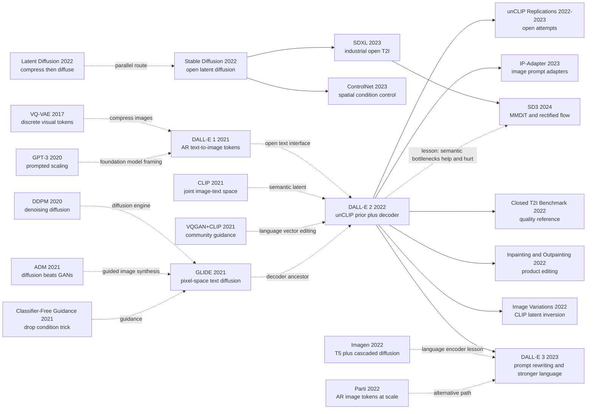

# DALL-E 2 - Rewriting Text-to-Image as CLIP-Latent Imagination plus Diffusion Rendering

> **On April 13, 2022, Aditya Ramesh, Prafulla Dhariwal, Alex Nichol, Casey Chu, and Mark Chen at OpenAI released [arXiv:2204.06125](https://arxiv.org/abs/2204.06125).** The surprising move in DALL-E 2 was not simply scaling DALL-E 1. It split text-to-image into two stages: first let CLIP “imagine” an image embedding in semantic space, then ask a diffusion decoder to render pixels from that embedding. OpenAI’s public page framed the jump as 4x resolution and reported raters preferring DALL-E 2 over DALL-E 1 for caption matching 71.7% of the time and photorealism 88.8% of the time. The paper’s quieter result is even more revealing: against GLIDE, unCLIP was not a clean photorealism knockout, but it preserved far more diversity under guidance. That made DALL-E 2 the closed-source quality benchmark of 2022, and the bright sealed display case that Stable Diffusion’s open ecosystem would soon answer.

## TL;DR

DALL-E 2 turns the 2021 DALL-E recipe, “autoregressively continue text tokens into image tokens,” into a hierarchical generation problem over CLIP latents. A prior samples a CLIP image embedding $z_i$ from a caption $y$; a diffusion decoder then samples pixels from that embedding, giving the factorization $P(x\mid y)=P(x\mid z_i,y)P(z_i\mid y)$. This 2022 OpenAI paper did not release weights like CLIP (2021), and it did not ignite an open creator ecosystem like Stable Diffusion (2022). Its historical role is more specific: DALL-E 1 proved text could generate images, GLIDE proved diffusion could produce high-quality text-conditioned images, and DALL-E 2 showed that a CLIP image embedding could serve as a semantic bottleneck so guidance could improve fidelity without collapsing sample diversity.

The important numbers are not only OpenAI’s public claim that DALL-E 2 produced 4x higher-resolution images than DALL-E 1 and was preferred by raters 71.7% for caption matching and 88.8% for photorealism. The paper’s more diagnostic comparison is against GLIDE: diffusion-prior unCLIP reaches only 48.9% human preference for photorealism and 45.3% for caption similarity, so it is not a clean quality knockout, but it reaches 70.5% preference for diversity. It reports zero-shot MS-COCO FID 10.39, and in the small-model prior ablation a full unCLIP stack scores FID 7.99, beating a text-embedding decoder at 9.16 and zero-shot feeding of CLIP text embeddings into the unCLIP decoder at 16.55. The hidden lesson is that DALL-E 2 wins not because “CLIP understands everything,” but because it explicitly lets CLIP keep semantics and style while leaving pixel detail to a diffusion decoder; the same choice also imports CLIP’s weaknesses in compositional binding, rendered text, and fine scene detail.

---

## Historical Context

### In 2021 text-to-image stood at a three-way fork

Before DALL-E 2, text-to-image generation was no longer a single technical route. By 2021 there were three plausible paths, each powerful and each visibly flawed.

The first was **DALL-E 1's discrete-token route**. OpenAI released DALL-E 1 in January 2021: a dVAE compressed a $256\times256$ image into a $32\times32=1024$ grid of discrete visual tokens, and a 12B autoregressive Transformer predicted those image tokens after the text tokens. The route was beautifully unified: vision became language-model continuation. Its weaknesses were just as clear: sampling was sequential, high-frequency detail was damaged by the dVAE and codebook, and the public effect depended heavily on CLIP reranking. DALL-E 1 proved that arbitrary text could drive image generation, but it did not yet feel like a deployable high-fidelity image system.

The second was **GLIDE's pixel-diffusion route**. Also from OpenAI, GLIDE showed in late 2021 that text-conditioned diffusion plus classifier-free guidance could produce images much more photorealistic than DALL-E 1 and could support editing. Its problem was not inability to draw. It was the classic fidelity-diversity trade-off induced by guidance: raise the scale, and images become more realistic and prompt-aligned, but semantic diversity shrinks and samples converge toward similar compositions. For a creative tool this is a serious defect, because users do not only want “the one image most consistent with the caption”; they want a set of distinct visual options to choose from.

The third path was **community CLIP-guided generation**. In 2021, VQGAN+CLIP, CLIP-guided diffusion, The Big Sleep, and similar experiments exploded across Twitter, Colab, and digital-art communities. They used CLIP as an external aesthetic or semantic judge, steering a generator toward text through gradients or search. The route was exciting but unstable: CLIP liked typography, symbols, and texture shortcuts; optimization was slow; results often felt more like art experiments than product systems. But it exposed a crucial signal: CLIP space really did contain coordinates for manipulating image semantics and style.

DALL-E 2 is the compromise among those three routes. It keeps DALL-E 1's open text interface, borrows GLIDE's diffusion decoder for pixel quality, and internalizes the community's CLIP-guided semantic space as a model latent rather than an external optimizer.

### CLIP made semantic space feel like infrastructure

CLIP's role is easy to understate. DALL-E 2 does not simply feed a text encoder into a U-Net. It first generates a **CLIP image embedding**. In 2022 that was a bold move, because it promoted CLIP from an evaluation/retrieval model into the latent-variable space of the generative process.

CLIP's training objective maps images and text into a shared vector space. This space is not pixel space, and it is not DALL-E 1's local-texture dVAE token space. It blends object identity, style, scene, material, and semantic similarity. The paper's bet is: if a decoder can invert a CLIP image embedding into an image, and a prior can generate plausible image embeddings from captions, then text-to-image can be split into two cleaner problems:

- Text to visual semantics: $P(z_i\mid y)$, deciding what visual concepts the caption may correspond to.
- Visual semantics to pixels: $P(x\mid z_i,y)$, deciding which concrete image renders that concept.

This split has a strong intuition: guidance no longer has to directly reshape the whole image distribution. The prior first samples different $z_i$ values, already representing different compositions, object details, and styles. Decoder guidance then only sharpens each sampled interpretation. Fidelity can rise without collapsing diversity the way GLIDE does under high guidance.

### The OpenAI team and the April 2022 release

The five authors of DALL-E 2 sit directly on OpenAI's generative-model line. Aditya Ramesh was first author of DALL-E 1. Prafulla Dhariwal and Alex Nichol were central to OpenAI's diffusion route: Dhariwal and Nichol wrote Diffusion Models Beat GANs, and Nichol was a key author across improved diffusion and GLIDE. Casey Chu and Mark Chen contributed to OpenAI's multimodal and large-model engineering. The author list itself reveals the paper's nature: not a minor revision of DALL-E 1, but **a merger between the DALL-E line and the diffusion line**.

OpenAI released the paper and the DALL-E 2 demo on April 13, 2022. The public saw 1024×1024 samples such as “astronaut riding a horse” and “teddy bear on Times Square,” plus variations, inpainting, and outpainting. The paper's more technical name is **unCLIP**, because the model approximates the inverse of the CLIP image encoder. The name is precise. DALL-E 2 is not “CLIP drawing images.” It first compresses the visual world into a CLIP semantic bottleneck, then trains a diffusion decoder to decode that bottleneck back into images.

The release also landed at a delicate industry moment. In April 2022, DALL-E 2 still required a waitlist and did not release weights. In May 2022, Google released Imagen, even more visually impressive and also closed. In August 2022, Stable Diffusion v1 opened its weights and rewrote the ecosystem. In hindsight, DALL-E 2 is the high-water mark of closed text-to-image: it defined what users expected AI image generation to do, but left the mass community explosion to a different architecture-and-release strategy.

## Background and Motivation

### Core motivation: generate image semantics first, then render pixels

DALL-E 2's motivation is not just lower FID. It addresses a common generative-model tension: strong guidance improves image quality, but strong guidance also destroys diversity. Pixel-space diffusion systems such as GLIDE put all information in one denoising trajectory. The model decides “what to draw” and “how to render it clearly” at the same time. Increase guidance scale and both processes tighten together, yielding sharper but more homogeneous samples.

DALL-E 2 separates “what to draw” from “how to render.” The prior samples $z_i$, which determines high-level visual semantics. The decoder conditions on $z_i$ to render pixels. Different $z_i$ values can encode different interpretations of the same prompt: different compositions, camera angles, materials, and styles. Decoder guidance can sharpen each interpretation without necessarily dragging every interpretation toward the same visual mode. The diversity result in Table 1 is the paper's key validation of this design.

### Why not simply continue DALL-E 1 or GLIDE

If OpenAI had continued DALL-E 1, the system would still inherit the limits of autoregressive visual tokens: slow generation, discrete-codebook detail loss, and sequential prediction over 1024 image tokens with error accumulation. DALL-E 1's historical value was opening the imagination of “image generation as language modeling,” but high-quality text-to-image in 2022 was already moving toward diffusion.

If OpenAI had simply continued GLIDE, the system would gain strong photorealism and editing ability, but it would not explain why high guidance hurts diversity, and it would not naturally support “generate variations of this image while preserving semantics and style.” DALL-E 2's CLIP latent makes image variation a built-in capability: encode an input image to $z_i$, sample the decoder from random DDIM latents, and the result preserves the semantics and style CLIP considers important while changing non-essential details.

So DALL-E 2's goal can be summarized in three moves: turn CLIP from evaluator into semantic latent variable; replace DALL-E 1's discrete autoregressive pixel route with a diffusion decoder; and find a better trade-off among photorealism, caption match, and diversity than GLIDE. It is not the final answer, but it wires together the three most important ingredients of 2022 text-to-image: CLIP, diffusion, and classifier-free guidance.

---

## Method Deep Dive

### Overall framework: unCLIP is a two-level generative model

The paper is titled Hierarchical Text-Conditional Image Generation with CLIP Latents, and the method is called **unCLIP**. The name explains the method: CLIP encodes images into semantic embeddings, and unCLIP trains a generative system to invert those embeddings back into images. The full stack consists of two main models and two super-resolution models:

| Component | Input | Output | Model type | Key role |
|---|---|---|---|---|
| CLIP encoder | image/text | $z_i$, $z_t$ | frozen ViT-H/16 CLIP | shared semantic space |
| Prior | caption $y$, text embedding $z_t$ | CLIP image embedding $z_i$ | AR prior or diffusion prior | imagine visual semantics |
| Decoder | $z_i$ and optional caption $y$ | 64x64 image | 3.5B GLIDE-style diffusion | render pixels |
| Upsampler 1 | 64x64 image | 256x256 image | 700M diffusion upsampler | recover resolution |
| Upsampler 2 | 256x256 image | 1024x1024 image | 300M diffusion upsampler | final high-res output |

The core factorization is:

$$
P(x\mid y)=P(x,z_i\mid y)=P(x\mid z_i,y)P(z_i\mid y).
$$

Here $x$ is the image, $y$ is the caption, and $z_i$ is the CLIP image embedding. The second factor $P(z_i\mid y)$ is the prior: given a caption, imagine a plausible CLIP image vector. The first factor $P(x\mid z_i,y)$ is the decoder: given that image vector, render concrete pixels. CLIP itself is frozen during prior and decoder training.

As pseudocode, DALL-E 2's sampling pipeline is short:

```python
def unclip_sample(caption, clip, prior, decoder, upsampler_256, upsampler_1024):
    text_embedding = clip.encode_text(caption)          # z_t, frozen CLIP
    image_embedding = prior.sample(caption, text_embedding)  # z_i ~ P(z_i | y)
    image_64 = decoder.sample(image_embedding, caption)      # x_64 ~ P(x | z_i, y)
    image_256 = upsampler_256.sample(image_64)
    image_1024 = upsampler_1024.sample(image_256)
    return image_1024
```

The counter-intuitive point is that text does not directly determine every detail of the final image. Text first determines a CLIP image embedding, and that embedding preserves only the semantics, style, and layout that CLIP considers important. The decoder then fills in texture, local shape, and pixel detail. DALL-E 2's strengths and weaknesses both come from this bottleneck: it preserves semantics and style for variations, but it loses information for object-attribute binding, spelling, and complex local detail.

### Key design 1: CLIP image embedding as semantic bottleneck

**Function**: turn text-to-image from “sample pixels directly from text” into “sample image semantics first, then render pixels.” The CLIP image embedding $z_i$ is the system's intermediate currency: the prior generates it, the decoder inverts it, and image variation or text diff operations revolve around it.

DALL-E 2 uses an internally trained CLIP. The image encoder is a ViT-H/16 over 256x256 images, width 1280, with 32 Transformer blocks; the text encoder is width 1024 with 24 Transformer blocks. CLIP is trained from a mix of the CLIP and DALL-E datasets, about 650M images total. The prior, decoder, and upsamplers are trained only on the DALL-E dataset, about 250M images, because adding the noisier CLIP data hurt generation quality in early evaluations.

| Design choice | DALL-E 2 choice | Why it matters | Failure mode |
|---|---|---|---|
| Latent space | CLIP image embedding | keeps semantic/style information | loses spelling and exact binding |
| CLIP weights | frozen during generation training | stable target for prior and decoder | cannot adapt to decoder needs |
| Image embedding dimension | 1024 before PCA/compression | rich enough for semantics | not a full image code |
| Dataset split | 650M for CLIP, 250M for generator | noisy data ok for contrastive learning, harmful for synthesis | closed data prevents reproduction |
| Decoder target | invert $z_i$ rather than tokenize pixels | enables variations/interpolations | bottleneck inherits CLIP blind spots |

**Design rationale**: DALL-E 1's dVAE tokens are local visual codes. They compress pixels, but they do not directly express “what the image is.” A CLIP image embedding is the reverse: it does not preserve every pixel, but it preserves object identity, style, scene, and semantic proximity. DALL-E 2 turns that limitation into a feature. Do not ask the prior to manage pixels; compress the prior's job to “generate a semantically plausible image vector.” The prior becomes easier to learn, and the decoder can specialize in image inversion.

### Key design 2: the prior generates CLIP image vectors from text

**Function**: the prior is DALL-E 2's “imagination” module. With only a decoder, the system can reconstruct or vary existing images from their CLIP embeddings. To generate from text, it must first sample a plausible $z_i$ from the caption. The paper compares two priors: an autoregressive prior and a diffusion prior.

| Prior | Representation | Sampling | Paper finding | Main cost |
|---|---|---|---|---|
| AR prior | PCA to 319 dims, each quantized into 1024 buckets | autoregressive Transformer | workable but lower quality | sequential decoding |
| Diffusion prior | continuous CLIP image embedding | Gaussian diffusion in latent space | higher quality and more compute-efficient | iterative denoising |
| No prior | feed CLIP text embedding as image embedding | zero-shot shortcut | plausible but weak | semantic mismatch |
| Text-embedding decoder | train decoder on $z_t$ directly | direct text condition | worse than full unCLIP in ablation | loses image-latent capabilities |

The AR prior first applies PCA to $z_i$. The paper reports that SAM-trained CLIP representations have much lower effective rank, so retaining 319 principal components preserves nearly all information. Each component is quantized into 1024 buckets and predicted sequentially by a causal Transformer. To bias the AR prior toward images that match the caption, the authors prepend a token representing $z_i\cdot z_t$ and sample this dot product from the top half of the distribution.

The diffusion prior instead models continuous $z_i$ directly with Gaussian diffusion. It builds a sequence containing the encoded text, the CLIP text embedding, the diffusion timestep, the noised CLIP image embedding, and a final prediction embedding whose output predicts the clean $z_i$. Instead of the common $\epsilon$-prediction formulation, the paper finds it better to predict the unnoised $z_i$ directly:

$$
L_{\text{prior}}=\mathbb{E}_{t,z_i^{(t)}\sim q_t}\left[\left\|f_\theta(z_i^{(t)},t,y)-z_i\right\|_2^2\right].
$$

**Design rationale**: DALL-E 2 does not crudely treat the CLIP text embedding as an image embedding. CLIP training brings $z_t$ and $z_i$ close, but they are not the same distribution. The prior's value is to sample a point on the real image-embedding manifold near $z_t$. In the paper's small-model experiment, full unCLIP reaches FID 7.99, better than the text-embedding decoder at 9.16 and far better than zero-shot feeding of text embeddings into the unCLIP decoder at 16.55.

### Key design 3: GLIDE-style diffusion decoder and cascaded super-resolution

**Function**: the decoder is DALL-E 2's “renderer.” It receives a CLIP image embedding and optionally a caption, generates a 64x64 image, and two diffusion upsamplers then raise resolution to 256x256 and 1024x1024. The decoder architecture follows GLIDE's 3.5B U-Net diffusion model, adding CLIP conditioning in two ways: projecting and adding the CLIP embedding to the timestep embedding, and projecting the CLIP embedding into four extra context tokens concatenated to the GLIDE text-encoder outputs.

The decoder is trained as standard diffusion, only with CLIP embedding as condition:

$$
L_{\text{decoder}}=\mathbb{E}_{t,x_0,\epsilon}\left[\left\|\epsilon_\theta(x_t,t,z_i,y)-\epsilon\right\|_2^2\right],\quad x_t=\sqrt{\bar{\alpha}_t}x_0+\sqrt{1-\bar{\alpha}_t}\epsilon.
$$

| Module | Paper size | Training/sampling detail | Conditioning | Why it exists |
|---|---:|---|---|---|
| Diffusion prior | 1B | 1000 diffusion steps, 64 sampling steps | text + $z_t$ | generate $z_i$ |
| Decoder | 3.5B | 250 strided sampling steps | $z_i$ + optional text | produce 64x64 image |
| Upsampler 64->256 | 700M | DDIM 27 steps | low-res image | first super-resolution stage |
| Upsampler 256->1024 | 300M | DDIM 15 steps | low-res image | final resolution |
| CLIP | ViT-H/16 | frozen during generator training | image/text encoders | latent space |

Classifier-free guidance is enabled by dropping conditions randomly: during decoder training, the CLIP embedding is set to zero or a learned null embedding 10% of the time, and the text caption is dropped 50% of the time; during prior training, text conditioning is dropped 10% of the time. A telling detail is that the authors keep the caption-conditioning pathway, hoping it might teach natural-language details CLIP misses, such as variable binding. The paper later admits this helps little. That directly foreshadows a core limitation of DALL-E 2: CLIP embeddings are strong semantic summaries, but unreliable syntax-and-binding representations.

The two upsamplers are also pragmatic. The first stage corrupts the low-resolution conditioning image with Gaussian blur, while the second uses a more diverse BSR degradation. During training, each model sees random crops one-fourth the target size; at inference time, the same convolutional model is applied at the target resolution. The authors find that upsamplers do not need caption conditioning and use no attention, only spatial convolutions. This implies that high-level semantics are already fixed at the 64x64 stage; super-resolution mostly restores texture and clarity.

### Key design 4: the same CLIP latent space supports variations, interpolations, and text diffs

**Function**: DALL-E 2 is not only a text-to-image model; it is an image manipulation interface. Given an image, the model obtains a bipartite representation: $z_i$ from the CLIP image encoder, capturing the semantics and style CLIP recognizes, and $x_T$ from DDIM inversion, preserving residual information the decoder needs to reconstruct the image. Holding or perturbing these two pieces yields variations, interpolations, and language-guided edits.

| Operation | Latent operation | What is preserved | What changes | Typical use |
|---|---|---|---|---|
| Variation | same $z_i$, stochastic DDIM latent | semantics and style | non-essential details | generate alternatives |
| Interpolation | slerp between two $z_i$ | shared visual manifold | content/style blend | morph concepts |
| Text diff | move $z_i$ toward $z_t-z_{t0}$ | source image identity partly | described attribute/style | language edit |
| DDIM inversion | recover $x_T$ for a source image | reconstruction path | controlled stochasticity | edit while preserving layout |
| PCA probing | decode partial CLIP dimensions | coarse-to-fine semantics | detail level | inspect CLIP space |

For text diffs, the system takes a current description $y_0$ and a target description $y$, encodes them into CLIP text embeddings $z_{t0}$ and $z_t$, and computes a direction:

$$
z_d=\operatorname{norm}(z_t-z_{t0}),\quad z_\theta=\operatorname{slerp}(z_i,z_d,\theta),\quad \theta\in[0.25,0.50].
$$

**Design rationale**: GAN inversion can also edit images in latent space, but humans must discover useful directions. DALL-E 2's advantage is that CLIP puts text and images in the same space, so directions can come directly from language. The paper's examples such as “cat -> anime super saiyan cat” and “winter landscape -> fall landscape” are driven by language-vector differences. This interface is less stable than DALL-E 3 or Photoshop Generative Fill, but in 2022 it made a product-level idea clear: prompts are not only for generation; they can edit images too.

The thing to remember is that DALL-E 2 is not a single U-Net trick. It is a hierarchical division of labor: CLIP latent for semantic abstraction, prior for sampling semantics from text, decoder for rendering semantics into pixels, and upsamplers for resolution. Each module is imperfect, but together they formed one of the first systems that made the public believe natural language could control the visual world.

---

## Failed Baselines

### Old route 1: DALL-E 1's discrete autoregression

DALL-E 2 first replaces DALL-E 1. The DALL-E 1 route is clear: a dVAE turns an image into 1024 visual tokens, and a 12B Transformer models text and image tokens as one sequence. Its limitations are equally clear: generation is sequential and slow; the discrete codebook damages texture, text, and detail; and strong public samples relied on CLIP reranking. On the DALL-E 2 public page, OpenAI states that the new system produces images at 4x the resolution of the January 2021 DALL-E 1 system and is preferred by human raters 71.7% for text match and 88.8% for photorealism.

This is not simply a model-size victory. It is a **representation victory**. DALL-E 1's visual tokens compress pixels; DALL-E 2's CLIP image embedding compresses semantics. DALL-E 1's Transformer must continue from text all the way into visual tokens; DALL-E 2 splits “imagine semantics” and “render pixels” between the prior and decoder. What is displaced is not autoregressive Transformers as such, but the route of sequentially generating high-fidelity images through discrete visual tokens.

### Old route 2: GLIDE's pixel-space guidance

GLIDE is the stronger opponent. The DALL-E 2 paper does not dismiss GLIDE as obsolete. In fact, it admits that GLIDE remains very strong on photorealism and caption similarity. Table 1 reports that diffusion-prior unCLIP has 48.9% photorealism preference and 45.3% caption-similarity preference against GLIDE, both slightly below 50%. If the only question is “which one looks more photographic?” or “which one matches the caption better?”, DALL-E 2 is not a decisive win.

DALL-E 2's real win is diversity. Diffusion-prior unCLIP reaches 70.5% diversity preference, and AR-prior unCLIP still reaches 62.6%. Figure 9 gives the key explanation: as GLIDE guidance scale rises, content, camera angle, color, and size converge; in unCLIP, the semantic information has already been fixed by a sampled CLIP image embedding, so decoder guidance improves rendering without flattening those semantic choices as aggressively. GLIDE is not a “failed” model; it reveals the structural cost of pixel-space guidance.

### Old route 3: no prior, or the wrong prior

The DALL-E 2 paper also tests several tempting shortcuts. One is to remove the prior and feed the CLIP text embedding directly into the decoder as if it were an image embedding. Because CLIP places text and images in the same space, this sometimes works, but it is not equivalent to sampling from the real image-embedding manifold. A second shortcut is to train a decoder directly conditioned on CLIP text embeddings. A third is to use an AR prior rather than a diffusion prior.

The small-model ablation is telling: the text-embedding decoder scores FID 9.16, the full unCLIP stack scores 7.99, and zero-shot feeding of text embeddings into the unCLIP decoder scores 16.55. The prior is not an optional bridge. It transforms text embeddings into points that look like real image embeddings. The AR prior works, but the diffusion prior gives better quality at comparable model size with less training compute, so it becomes the main route.

### Failures exposed by the paper itself

One admirable feature of the DALL-E 2 paper is that its limitations section is direct. It does not pretend that CLIP latents are perfect visual representations. It explicitly shows that unCLIP inherits CLIP's blind spots.

| Failure | Paper evidence | Root cause | Later repair direction |
|---|---|---|---|
| Attribute binding | red cube / blue cube examples worse than GLIDE | CLIP embedding weakly binds objects and attributes | stronger text encoders, dense attention, better data |
| Rendered text | prompt “A sign that says deep learning” fails | CLIP does not encode spelling precisely; BPE hides letters | OCR-aware data, T5/LLM encoders, DALL-E 3 recaptioning |
| Complex scene detail | Times Square / dog field examples lack fine detail | 64x64 base image plus upsampling hierarchy | higher base resolution, latent diffusion, DiT backbones |
| CLIP blind spots | typographic attack probes show logits can be fooled | contrastive representations mix object and text shortcuts | multimodal robustness, better objectives |
| Safety and deception | paper notes fewer AI traces increase misuse risk | photorealistic generation lowers detection cues | staged deployment, watermarking, policy filters |

These failures are not marginal bugs. They are architecture boundaries. If $z_i$ does not clearly preserve “red belongs to cube A and blue belongs to cube B,” the decoder cannot reliably recover it. If CLIP does not care about every letter, the decoder cannot spell a sign. If the 64x64 base image has already lost details, a 1024x1024 upsampler can often restore texture but not global structure. DALL-E 2's bottleneck is the reverse side of its strength.

## Key Experimental Data

### Human evaluation: near-tie quality against GLIDE, decisive diversity win

DALL-E 2's most important experiment is not only “whose FID is lower,” but a three-axis human evaluation: photorealism, caption similarity, and diversity. The paper uses MS-COCO validation captions and introduces a 4x4-grid diversity comparison: human evaluators see two grids for the same caption and choose which grid is more diverse.

| Model compared to GLIDE | Photorealism preference | Caption similarity preference | Diversity preference | Interpretation |
|---|---:|---:|---:|---|
| unCLIP with AR prior | 47.1% ± 3.1% | 41.1% ± 3.0% | 62.6% ± 3.0% | lower quality, still more diverse |
| unCLIP with diffusion prior | 48.9% ± 3.1% | 45.3% ± 3.0% | 70.5% ± 2.8% | near-tie quality, strong diversity win |
| GLIDE baseline | 50% reference | 50% reference | 50% reference | stronger direct prompt match |
| DALL-E 2 public page vs DALL-E 1 | 88.8% photorealism | 71.7% caption match | not reported | large product-level jump |
| Main lesson | not a knockout | not a knockout | decisive | CLIP latent preserves modes under guidance |

These numbers place DALL-E 2 correctly. It is not a paper that crushes GLIDE on every metric. It is a paper that uses a CLIP latent to solve guidance-induced diversity collapse. For a creative product, the diversity win may matter more than one or two FID points because the user's real experience is choosing among candidate images.

### FID and prior ablations

On zero-shot MS-COCO FID, the paper reports 10.39 for diffusion-prior unCLIP, better than many contemporary zero-shot text-to-image systems and far better than DALL-E 1 at roughly 28. But FID is sensitive to diversity and does not always match human aesthetics or caption adherence, so the paper treats human evaluation as more diagnostic.

| Experiment | Metric | Result | What it shows | Caveat |
|---|---:|---:|---|---|
| Full unCLIP, diffusion prior | MS-COCO zero-shot FID | 10.39 | strong zero-shot benchmark result | FID imperfect for prompt quality |
| DALL-E 1 | MS-COCO zero-shot FID | around 28 | DALL-E 2 is a large generational jump | not same architecture scale |
| Text-embedding decoder | FID in small ablation | 9.16 | direct $z_t$ conditioning is plausible | weaker than full stack |
| Full small unCLIP stack | FID in small ablation | 7.99 | prior plus decoder is best | smaller than production model |
| Zero-shot $z_t$ into decoder | FID in small ablation | 16.55 | text embedding is not image embedding | shortcut fails distribution match |

The prior's value becomes concrete here. CLIP text embeddings and image embeddings share a space, but they are not the same distribution. Full unCLIP works because it learns to sample from the image-embedding manifold conditioned on captions, rather than treating text vectors as image vectors.

### Training scale and system details

The paper models are large, but DALL-E 2 is not one giant Transformer. It is a set of specialized models. The appendix gives the crucial hyperparameters: CLIP is trained on about 650M images; the generative stack on about 250M DALL-E images; the decoder is a 3.5B GLIDE-style model; the prior is 1B; the two upsamplers are 700M and 300M.

| Model | Size | Batch / iterations | Sampling detail | Why it matters |
|---|---:|---|---|---|
| AR prior | 1B | batch 4096, 1M iterations | sequential latent codes | baseline prior |
| Diffusion prior | 1B | batch 4096, 600K iterations | 64 strided sampling steps | final preferred prior |
| Decoder | 3.5B | batch 2048, 800K iterations | 250 strided steps | 64x64 rendering engine |
| Upsampler 64->256 | 700M | batch 1024, 1M iterations | DDIM 27 steps | resolution recovery |
| Upsampler 256->1024 | 300M | batch 512, 1M iterations | DDIM 15 steps | final high-res output |

This system view explains why the paper can talk about generation, variations, interpolation, language editing, and CLIP probing in one place. It is not a single-model result. It combines representation learning, a latent prior, pixel diffusion, super-resolution, DDIM inversion, and classifier-free guidance into a product-grade stack. That is also why it is hard for academia to reproduce fully: the data is closed, the weights are closed, and the engineering budget is far beyond a normal lab.

---

## Idea Lineage



### Past lives

DALL-E 2 does not have one ancestry line. It is where two lines cross in 2022.

The first is the **tokenized image generation line**. VQ-VAE, VQ-VAE-2, and DALL-E 1 together prove that images can first be compressed into an intermediate representation and then generated by a large model. DALL-E 1 turns this into the most GPT-like form: text tokens followed by image tokens, unified autoregressive modeling. What this line leaves behind is not the final architecture, but an interface idea: a prompt can describe an image like a program.

The second is the **diffusion model line**. DDPM establishes the denoising diffusion objective, ADM shows diffusion can beat GANs on ImageNet, and GLIDE connects text conditioning plus classifier-free guidance to pixel-space diffusion. DALL-E 2's decoder explicitly inherits from GLIDE, so it does not invent “diffusion text-to-image” from scratch. It adds a CLIP image embedding bottleneck on top of GLIDE.

What joins the two lines is **CLIP**. CLIP is the discriminator used for DALL-E 1 sample selection, the external objective behind 2021 VQGAN+CLIP community art, and the internal latent space of DALL-E 2. DALL-E 2's place in the lineage can be summarized this way: it promotes CLIP from “judge” to “sketch.” The prior first draws a semantic sketch; the decoder renders the sketch into an image.

### Descendants

DALL-E 2's descendants are unusual because OpenAI did not release weights or training code. Unlike Stable Diffusion, it did not produce a flood of direct forks. Its influence flowed through product capabilities, research framing, and interface design.

The most direct inheritance is **image variations and editing**. DALL-E 2 made “upload an image and generate semantically and stylistically related variations” legible to the public. Later IP-Adapter, image-prompt adapters, reference-only control, and style-transfer diffusion systems all inherit this task definition to some degree: an image itself can be a prompt, not only text.

The second inheritance is the **closed quality benchmark**. Between April and August 2022, DALL-E 2 and Imagen defined the quality ceiling of closed big-lab text-to-image. Stable Diffusion did not explode because it was initially better than DALL-E 2 in every way. It exploded because it was close enough, local, fine-tunable, and extensible. DALL-E 2 served as the mirror showing the community what the target looked like.

The third inheritance is the **reverse correction in DALL-E 3**. DALL-E 3 has not publicly said it uses the unCLIP architecture; instead it emphasizes prompt rewriting, stronger language understanding, and safety alignment. That shift shows DALL-E 2's lesson had been absorbed: CLIP latents are useful semantic bottlenecks, but CLIP alone cannot solve complex instructions, rendered text, or compositional binding. Later SD3, Pixart, and Imagen-style systems also move toward stronger text encoders, synthetic captions, and DiT/flow architectures.

### Misreadings / oversimplifications

The first misreading is **“DALL-E 2 proves CLIP latents are the final representation for text-to-image.”** A more accurate version is: CLIP latents were a very useful semantic bottleneck in 2022, but not complete image representations. The paper's limitations already state that attribute binding, text, and complex details suffer. Later large systems did not all generate CLIP image embeddings; many moved to direct diffusion or flow conditioned on T5/LLM text embeddings.

The second misreading is **“DALL-E 2 completely beats GLIDE.”** If you only read the product page, it is easy to think DALL-E 2 wins everywhere. The paper's numbers are more restrained: photorealism and caption-similarity preferences are both slightly below GLIDE, while diversity wins. The scientific contribution is explaining and improving the diversity-fidelity trade-off, not a simple leaderboard sweep.

The third misreading is **“DALL-E 2 is the direct ancestor of Stable Diffusion.”** They belong to the same 2022 text-to-image explosion, but the routes differ. DALL-E 2 is CLIP image-latent prior plus pixel diffusion decoder plus cascaded upsamplers; Stable Diffusion is VAE latent diffusion plus cross-attention text conditioning plus open weights. Stable Diffusion was heavily shaped by DALL-E 2's product pressure and quality target, but methodologically it is closer to Latent Diffusion Models.

### What this line really left behind

DALL-E 2 leaves three ideas more than one exact module.

First, **generation can be hierarchical**. Do not ask one model to decide semantics, composition, texture, resolution, and editing interface simultaneously. Let one latent express “what to draw,” then let another model decide “how to render it.” Later video, 3D, and audio generation models repeatedly follow this hierarchical logic.

Second, **embedding space can be a creative interface**. DALL-E 2's variations, interpolations, and text diffs show that users need not only generate from scratch with prompts; they can move existing images through latent space. This idea reappears in ControlNet, IP-Adapter, reference images, and style adapters.

Third, **a semantic bottleneck is both capability and loss function**. CLIP latents let DALL-E 2 preserve diversity, and they also discard spelling, binding, and local detail. That lesson shaped later generative models: strong representations must not only align semantically; they must preserve enough renderable information. The post-2024 move toward larger text encoders, better VAEs, denser conditioning, and flow/DiT architectures does not reject DALL-E 2. It repairs the bottlenecks DALL-E 2 exposed.

---

## Modern Perspective

### Assumptions That No Longer Hold

- **“CLIP image embeddings are the best text-to-image intermediary”**: in 2022 they were highly effective because CLIP captured objects, style, and scenes at once. From a 2026 view, CLIP latents are too sparse and too global for precise relations, spelling, multi-person scenes, and long prompt constraints. Imagen showed the value of T5-XXL; DALL-E 3 used prompt rewriting to turn short user prompts into detailed captions; SD3/FLUX-style systems use larger text encoders and DiT/flow generation directly. CLIP latent is a key transition, not the endpoint.
- **“A 64x64 base image plus cascaded super-resolution is enough”**: DALL-E 2's decoder first produces 64x64 images, then upsamples to 1024x1024. This saves compute, but it pushes complex detail through a low-resolution bottleneck too early. Later latent diffusion, SDXL, SD3, Imagen 2, and Midjourney-like systems raise base latent information density, improve VAEs, or use stronger backbones. High-quality models today no longer accept the simple split “low resolution decides semantics, high resolution only fills texture.”
- **“Closed quality leadership is enough to define the ecosystem”**: DALL-E 2 was stunning in April 2022, but it did not release weights. Four months later Stable Diffusion showed that a good-enough open model plus local inference, LoRA, ControlNet, ComfyUI, and Civitai can produce a larger research and creator ecosystem than a slightly stronger closed model. DALL-E 2 defined the target; Stable Diffusion defined participation.
- **“Human preference for photorealism/caption similarity/diversity is sufficient”**: those three axes were reasonable in 2022, but they are no longer enough. Users now care about long-prompt adherence, rendered text, hands and anatomy, precise spatial control, style copyright, person safety, editability, reproducible workflows, commercial licensing, and auditability. The DALL-E 2 paper discusses risks, but the full generative-AI social debate had not yet arrived.
- **“CLIP semantics equal visual understanding”**: DALL-E 2's typographic-attack probing shows a subtle fact: CLIP classification logits can be fooled by text, yet the decoder may still reconstruct apples. The embedding contains richer information than logits, but CLIP's “understanding” is not human-like object-text separation. Modern multimodal models no longer rely only on contrastive embeddings; they combine captioning, VQA, OCR, grounding, segmentation, and synthetic data.

### Time-tested Essentials vs Redundancies

Three parts of DALL-E 2 aged well.

First, **hierarchical generation**. Decide semantics in an abstract latent, then render details with a generator. Text-to-image, video generation, 3D generation, and audio generation all continue to reuse this idea. Even when CLIP latent is replaced by VAE latent, spacetime latent, or DiT tokens, the hierarchy remains.

Second, **image-as-prompt**. DALL-E 2 variations taught ordinary users that an image can be an input condition. The line runs from DALL-E 2 variations to ControlNet, IP-Adapter, reference images, style adapters, and today's multimodal editing workflows.

Third, **structured analysis of the diversity-fidelity trade-off**. DALL-E 2 does not merely say “we draw better.” It explains why high guidance in GLIDE compresses diversity, and why sampling a CLIP image embedding first can preserve semantic modes. That analysis has more long-term value than a single score.

The redundancies are also clear. CLIP image embedding as the only bottleneck is not strong enough; the three-stage cascade has been replaced by stronger latent/DiT/flow systems; closed waitlist deployment did not create reusable infrastructure; and relying on CLIP or human-preference proxies for quality selection is insufficient for later safety, copyright, and controllability requirements.

### If We Were to Rewrite It Today

If I rewrote DALL-E 2 in 2026, I would keep the goals of hierarchical generation and image variation, but replace most implementation choices.

- **Merge prior and decoder into a DiT or flow-based latent generator**: rather than explicitly generating a CLIP image embedding, model a higher-dimensional VAE/spacetime latent with Rectified Flow or Flow Matching.
- **Use multiple text encoders**: CLIP for visual semantics, T5/LLM encoders for long prompts and syntax, and OCR-aware encoders for rendered text. DALL-E 3-style prompt rewriting would become part of the data pipeline.
- **Train on synthetic detailed captions**: rewrite web alt-text into captions containing objects, attributes, relations, style, camera, and text content, directly attacking DALL-E 2's binding and spelling weaknesses.
- **Do not put all variation through one CLIP latent**: decompose the source image into layout, style, identity, local masks, depth/edges/pose, and use multi-channel control instead of one global embedding.
- **Build safety into model design earlier**: data filtering, person/copyright/watermark policy, traceable metadata, output policy, and red-team evaluation should be designed together rather than added as a separate risk section.
- **Open reproducible subsystems**: even if the full model remains closed, release richer evaluation sets, ablations, model cards, and interface specs so the community can verify claims.

But I would not remove DALL-E 2's core insight: text-to-pixels is not the only route. An intermediate latent can let the model “imagine” before it “renders,” and can let users move, mix, and edit images in between. That remains one of the most alive interfaces in generative vision.

## Limitations and Future Directions

### Limitations admitted by the authors

- **Weak attribute binding**: in Figure 14/15, unCLIP struggles more than GLIDE on prompts such as “red cube on top of blue cube”; decoder reconstructions also mix object attributes.
- **Weak text rendering**: the prompt “A sign that says deep learning” does not reliably produce correct text. The authors argue CLIP embeddings do not precisely encode spelling, and BPE tokenization hides letter-level information.
- **Low detail in complex scenes**: Figure 17 shows limited detail in complex scenes, which the authors attribute to the 64x64 base resolution and upsampling hierarchy.
- **Higher risk**: compared with GLIDE, unCLIP's more realistic outputs may be harder to recognize as AI-generated, raising deception, misuse, and bias risks.
- **Deployment depends on context**: the authors explicitly state that risks must be assessed with respect to data, guardrails, deployment space, and access, citing the DALL-E 2 Preview system card.

### Limitations discovered later

- **DALL-E 3 surpassed it as a product**: DALL-E 3's prompt rewriting and stronger language following show that DALL-E 2's CLIP bottleneck was not enough for long, messy real user prompts.
- **Missing open ecosystem**: DALL-E 2 had enormous influence, but the model could not be downloaded, fine-tuned, or connected to ControlNet/LoRA-style ecosystems, so part of its technical influence shifted to Stable Diffusion.
- **Editing interface was not controllable enough**: variations feel natural, but precise control over object placement, pose, edges, masks, and identity preservation requires later ControlNet/IP-Adapter-like methods.
- **Data and copyright opacity**: OpenAI's training data is closed, preventing community audit and independent reproduction in the way LAION/Stable Diffusion enabled.
- **Evaluation dimensions were limited**: the paper's human evaluations are valuable, but modern releases would require finer compositional benchmarks, OCR benchmarks, bias/safety audits, and provenance evaluation.

### Improvement directions

DALL-E 2 makes the follow-up roadmap unusually clear: use stronger text encoders and synthetic captions to repair language binding; use higher-information latents or higher base resolution to repair detail; replace the 2022 U-Net cascade with DiT/flow systems; use multimodal condition adapters for image, mask, pose, depth, and layout; and handle deployment risk through system cards, data governance, and traceable outputs.

From a research perspective, the most interesting open question remains: what latent preserves enough semantics for editing and enough detail for rendering? DALL-E 2 answered: CLIP image embeddings. Stable Diffusion, SD3, Sora, and DALL-E 3 all give different answers.

## Related Work and Insights

### Comparison map

- **vs DALL-E 1**: DALL-E 1 is dVAE tokens plus a 12B autoregressive Transformer, unified but slow and detail-limited; DALL-E 2 is CLIP latent plus diffusion decoder, better suited to high-fidelity images and variations.
- **vs GLIDE**: GLIDE is pixel-space text diffusion and has stronger prompt match; DALL-E 2 greatly improves diversity at similar quality.
- **vs Imagen**: Imagen uses T5-XXL plus cascaded diffusion, proving strong language encoders improve prompt understanding; DALL-E 2 emphasizes CLIP image latents and variations.
- **vs Stable Diffusion / LDM**: LDM runs diffusion directly in a VAE latent, is open, and is extensible; DALL-E 2 samples semantics in CLIP image latent space and then renders with a pixel decoder, closed and product-oriented.
- **vs DALL-E 3**: DALL-E 3 emphasizes prompt rewriting, language following, and safer deployment, reading like a systematic repair of DALL-E 2's language bottleneck.

### Lessons for current research

DALL-E 2 is still worth reading not because it is today's strongest text-to-image recipe, but because it decomposes a hard system problem elegantly: representation learning, prior, decoder, super-resolution, editing, and risk evaluation each have a role. Many modern systems trend toward end-to-end giant models, but DALL-E 2 reminds us that a good intermediate representation can make system capabilities interpretable and failures easier to locate.

It also reminds researchers not to be fooled by one metric. DALL-E 2 does not beat GLIDE on photorealism or caption similarity preference, but it wins very clearly on diversity. If you chase only the highest preference score or lowest FID, you may miss why a system feels more like a creative tool.

## Resources

### Primary sources

- Paper: [Hierarchical Text-Conditional Image Generation with CLIP Latents](https://arxiv.org/abs/2204.06125)
- OpenAI publication page: [Hierarchical text-conditional image generation with CLIP latents](https://openai.com/index/hierarchical-text-conditional-image-generation-with-clip-latents/)
- OpenAI product page: [DALL-E 2](https://openai.com/index/dall-e-2/)
- DALL-E 2 Preview system card: [Risks and Limitations](https://github.com/openai/dalle-2-preview/blob/main/system-card.md)

### Follow-up reading

- [CLIP (2021)](https://arxiv.org/abs/2103.00020) - shared image-text representation
- [DALL-E 1 (2021)](https://arxiv.org/abs/2102.12092) - discrete autoregressive text-to-image
- [GLIDE (2021)](https://arxiv.org/abs/2112.10741) - text-guided diffusion baseline
- [Latent Diffusion Models (2022)](https://arxiv.org/abs/2112.10752) - Stable Diffusion route
- [Imagen (2022)](https://arxiv.org/abs/2205.11487) - T5 plus cascaded diffusion
- [Classifier-Free Diffusion Guidance](https://openreview.net/forum?id=qw8AKxfYbI) - guidance mechanism


---

> 🌐 [中文版](/era4_foundation_models/2022_dalle2/) · 📚 awesome-papers project · CC-BY-NC