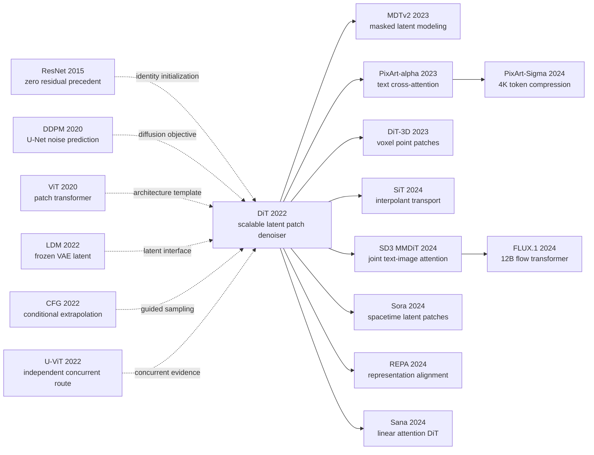

# DiT - When Diffusion Models Replaced the U-Net with a Transformer

> **On December 19, 2022, William Peebles and Saining Xie posted [arXiv:2212.09748](https://arxiv.org/abs/2212.09748). Instead of carving one more U-Net, they cut the 32x32 latent of a frozen Stable Diffusion VAE into patches and handed the sequence to an almost standard Vision Transformer.** The sharpest result was not merely FID 2.27 on ImageNet 256x256. Holding DiT-XL near 675M parameters while shrinking its latent patch from 8 to 2 raised one forward pass from 7.39 to 118.64 Gflops and drove 400K-step FID from 106.41 to 19.47; adaLN-Zero let all 28 blocks begin as identities. Within two years, Sora had extended the patch into spacetime, Stable Diffusion 3 had split the block into multimodal streams, and FLUX.1 had scaled a related flow transformer to 12B. DiT neither invented diffusion nor supplied the first ViT diffusion model. It did something more durable: it made “the U-Net is a replaceable backbone” a controlled, scalable engineering fact.

## TL;DR

Published by William Peebles and Saining Xie in 2022 and accepted at ICCV 2023, DiT patchifies the latent of a frozen Stable Diffusion VAE into $T=(I/p)^2$ tokens, applies a standard transformer to predict diffusion noise and covariance, and conditions every block with $c=e_t(t)+e_y(y)$ through adaLN-Zero. Zero-initialized residual gates make each block begin as identity; this is not a cosmetic initialization. After 400K steps on the same DiT-XL/2, unguided FID is 35.24 with in-context tokens, 26.14 with cross-attention, 25.21 with vanilla adaLN, and 19.47 with adaLN-Zero. The final 675M-parameter, 118.64-Gflop model trains for 7M steps and, with CFG 1.5 plus 250-step DDPM sampling, improves the previous diffusion best LDM-4-G from FID 3.60 to 2.27 on ImageNet 256x256. At 512x512 it costs 524.60 Gflops and reaches 3.04, beating the previous diffusion result 3.85 but not StyleGAN-XL's 2.41 in the same table.

The deeper result is not “more parameters always win.” Holding parameters fixed while decreasing patch size and increasing token compute steadily lowers FID; conversely, a smaller DiT-L/2 spends 80.7 Tflops per image on 1000 sampling steps and still loses to an XL/2 using 128 steps and only 15.2 Tflops. This standardized token-denoiser interface leads to [Sora](/en/era5_genai_explosion/2024_sora/) and its spacetime patches, [Stable Diffusion 3 / MMDiT](/en/era5_genai_explosion/2024_stable_diffusion3/), PixArt, and FLUX. The counter-intuitive lesson is that DiT's headline also depends on long training, classifier-free guidance, and a still-convolutional VAE. What it ends is not the U-Net itself, but the assumption that the diffusion equation must be architecturally married to one.

---

## Historical Context

### Where diffusion architecture was stuck in 2022

By late 2022, image diffusion no longer needed to prove that it could generate convincing samples. The field was repeatedly asking how far the same U-Net skeleton could be pushed. DDPM had tied noise prediction, iterative reversal, and a convolutional U-Net into a dependable recipe in 2020. ADM then tuned residual blocks, channel allocations, attention resolutions, and conditional normalization, reaching 4.59 FID on class-conditional ImageNet 256x256 and 3.94 when paired with an upsampler. Latent Diffusion Models cut the spatial bill by moving denoising into a VAE representation, but retained the multi-resolution down path, up path, and long skips of a U-Net.

The problem had therefore shifted: **the probabilistic machinery of diffusion was evolving quickly while its carrier network remained largely fixed.** The DDPM U-Net was not simply the 2015 biomedical segmentation model. It was a generative descendant made mostly of ResNet blocks, timestep-conditioned normalization, and self-attention at selected low resolutions. Its high-level organization was still a convolutional pyramid, however. Every scale-up required decisions about channels per resolution, blocks per stage, attention placement, and balanced down/up sampling. Parameter count was also a poor cost proxy because the same modules became dramatically more expensive at higher spatial resolution.

Transformers had developed the opposite engineering culture in language, recognition, and autoregressive image generation. Token count exposed the cost of sequence processing; depth and width had standard scaling conventions; and the block itself changed little across tasks. ViT had shown in 2020 that an image could be patchified and handed to a generic transformer. Parti later scaled an autoregressive text-to-image transformer to 20B parameters. Whether diffusion could likewise leave its specialized U-Net behind was still not cleanly answered at the end of 2022.

### Four technical lines that made DiT possible

The first line is the **DDPM-to-ADM diffusion recipe**. [DDPM](https://arxiv.org/abs/2006.11239) supplied noise prediction; ADM supplied learned covariance, a class-conditional ImageNet recipe, and a common evaluation stack. DiT intentionally leaves that mathematics alone. It retains ADM's 1000-step linear variance schedule, hybrid training objective, and 250-step DDPM evaluation so that the experimental variable is the backbone rather than the stochastic process.

The second line is the **patch transformer of ViT**. [ViT](https://arxiv.org/abs/2010.11929) had already established that a spatial grid could be linearly patchified, given positional information, and processed by standard self-attention. DiT inherits not ViT's classifier but its design space: Small, Base, and Large configurations jointly scale depth, hidden width, and attention heads, while patch size independently controls sequence length.

The third line is **perceptual compression from LDM**. [Latent Diffusion](https://arxiv.org/abs/2112.10752) maps a 256x256 RGB image to a 32x32x4 representation, making architecture sweeps affordable relative to pixel-space diffusion. DiT takes Stable Diffusion's f=8 VAE off the shelf, freezes its encoder and decoder, and replaces only the latent denoiser. That boundary matters: the paper shows that a U-Net is not necessary as the *latent denoiser*. It does not show that the entire image generator is convolution-free.

The fourth line combines **conditioning and residual initialization**. Classifier-free guidance lets one model learn conditional and null predictions. FiLM and ADM's adaptive normalization show that global conditions can modulate features through scale and shift. Large-scale ResNet experience shows that zero-initialized residual branches can ease optimization. adaLN-Zero sits at their intersection: timestep and class embeddings generate normalization parameters and residual gates, and the gates start at zero.

The concurrent work also has to remain on the timeline. [U-ViT v1](https://arxiv.org/abs/2209.12152) appeared on September 25, 2022, almost three months before DiT's December 19 posting. It treated time, condition, and noisy patches as tokens while retaining long shallow-to-deep skips. RINs followed on December 22 with a small latent-token interface that routed high-dimensional data. The historically defensible claim is therefore not that DiT was the first team to imagine transformer diffusion. **Several groups simultaneously saw that the U-Net was not the only answer; DiT turned that convergence into the cleanest reusable baseline through controlled size, patch, and conditioning comparisons.**

### The authors and the paper's research position

The paper has only two authors: William Peebles at UC Berkeley and Saining Xie at New York University. The small author list matches the style of the work. Unlike a large text-to-image system report, it does not bundle data cleaning, a language encoder, safety infrastructure, and deployment. It isolates an architectural question that can be controlled. The acknowledgements name Kaiming He, Ronghang Hu, Alexander Berg, Shoubhik Debnath, Tim Brooks, Ilija Radosavovic, and Tete Xiao for discussions, spanning residual and transformer architecture, generative modeling, and large-scale vision. That intellectual neighborhood helps explain why the paper treats a model *design space* as the central object.

The title promises neither language understanding nor a new diffusion equation. Its contribution is compressed into three testable propositions: can a standard transformer serve as a latent-diffusion backbone; how should timestep and class information enter its blocks; and does increasing forward-pass Gflops reliably lower FID? The original study was implemented in JAX on TPUs. The authors later released transparent PyTorch model, training, and sampling code plus DiT-XL/2 checkpoints at 256 and 512 resolution. Although the official repository is now archived read-only, it still exposes every consequential choice: fixed two-dimensional sine-cosine positions, ten-percent label dropout, all-zero adaLN-Zero output initialization, and the reproducibility quirk of guiding only three latent channels.

With hindsight, Peebles's later authorship on Sora makes DiT look like a preview of a video roadmap. The 2022 paper contains no such evidence. Its conclusion says only that future work should scale model and token counts and explore DiT as a drop-in backbone for systems such as DALL-E 2 and Stable Diffusion. Reading Sora backward into an already-decided plan erases the useful methodological lesson: answer a small architectural question with controlled experiments first, then let later systems reveal how far the answer travels.

### The state of compute, data, and tooling

The experiments use class-conditional ImageNet, not web-scale image-caption pairs. A frozen VAE maps 256x256 images to 32x32x4 latents and 512x512 images to 64x64x4 latents; conditioning is one of 1000 discrete labels. That choice gives up product-like demonstrations, but every model sees the same data, labels, loss, optimizer, and evaluation. Backbone compute is therefore the main moving variable.

The JAX models were trained on TPU v3 pods. The most expensive 256x256 model, DiT-XL/2, runs at roughly 5.7 iterations per second on a TPU v3-256 pod with global batch 256, costs 118.6 Gflops per forward pass, and is eventually trained for 7M updates. The 512x512 model processes 1024 latent tokens, rises to 524.6 Gflops, and trains for 3M updates. “Compute-efficient” is a relative claim: it is cheaper per forward pass than the paper's 1120-Gflop ADM at 256 and 1983-Gflop ADM at 512, but seven million updates are still a formidable training bill.

The software stack was also at an inflection point. A transformer denoiser could reuse mature LayerNorm, multi-head attention, and MLP kernels. Stable Diffusion supplied an off-the-shelf compressor, and ADM's TensorFlow evaluation suite supplied comparable FID measurements. Yet the original DiT did not use FlashAttention, `torch.compile`, bf16/AMP, or gradient checkpointing; the official PyTorch README lists such features as opportunities. The paper identifies the **systems potential of architectural unification**, rather than presenting the fully optimized endpoint.

## Background and Motivation

### Three research questions deliberately separated

DiT does not pose “can transformers generate images?” as one vague question. It separates three layers. The representation question asks how a VAE latent becomes tokens; patch size $p$ controls the answer, with sequence length $T=(I/p)^2$. The conditioning question asks whether timestep $t$ and class $y$ should be extra tokens, a cross-attention sequence, or normalization modulation. Only then comes scale: with conditioning fixed, do greater depth/width and more tokens from a smaller patch both improve sample quality?

This separation makes negative results interpretable. If cross-attention loses, one can ask whether the interface or its overhead is responsible. If a smaller patch helps without adding parameters, “it only won because it has more weights” is ruled out. If a longer sampler cannot catch a larger backbone, training-time model compute can be distinguished from inference-time iteration count. DiT's real novelty is less a single block than a set of nearly orthogonal experimental axes.

### Why answer the question in latent ImageNet first

Pixel space entangles resolution, backbone, and budget. DiT adopts LDM's frozen VAE to turn 256x256 into a fixed 32x32 grid before comparing twelve transformers. ImageNet labels are also simpler than natural-language conditioning: a class embedding and a timestep embedding are both vectors of width $d$, so four injection mechanisms can be compared without confounds from 77 text tokens, language-encoder capacity, or caption quality.

This is an intentional experimental contraction, not a capability claim. “adaLN-Zero beats cross-attention” is valid for global class conditioning in this setup. PixArt needs cross-attention once the condition becomes a token sequence; SD3 goes further by giving text and image separate parameters before joint attention. DiT remains useful precisely because it leaves successors a clear starting point instead of pretending an ImageNet result solved every conditional-generation problem.

### What the paper actually sets out to prove

The minimum proposition is that **the diffusion objective is not bound to a U-Net**. Preserve the input/output space, timestep interface, and noise/covariance prediction contract, and a standard patch transformer can serve as a drop-in backbone. The stronger proposition is that, over the twelve tested models, forward Gflops explain FID better than parameter count: decreasing patch size improves a fixed-size transformer while its parameter count stays nearly unchanged.

This is more specific than “more compute always helps.” The paper also makes a budget-allocation claim: a larger model trained for fewer steps eventually becomes preferable to a smaller model trained longer; a large backbone with fewer denoising steps can beat a smaller backbone with hundreds more. DiT therefore moves the scaling unit for diffusion research from “how many parameters?” toward “how much useful work occurs in each denoiser evaluation?” Sora, MMDiT, PixArt, and FLUX later extend task and scale, but what they inherit is this scalable interface, not merely the word Transformer in a model name.

---

## Method Deep Dive

### Overall framework: freeze the VAE, replace only the denoiser

DiT is often summarized as “patchify an image and diffuse with a transformer,” but its interface is more precise. An off-the-shelf Stable Diffusion VAE first compresses the image. The forward diffusion process corrupts that latent. DiT is responsible only for predicting noise and reverse-process covariance from the noisy latent. The VAE encoder and decoder remain frozen, so U-Net and transformer are compared in the same $\mathcal{Z}$-space rather than changing compression, loss, and sampler together.

For a 256x256 image, the f=8 VAE produces $z_0\in\mathbb{R}^{32\times32\times4}$. Training samples a timestep $t$ and Gaussian noise $\epsilon$ to form $z_t$. A patch embedding turns $z_t$ into tokens, fixed two-dimensional sine-cosine positions supply location, and every DiT block is modulated by the same condition $c=t_{emb}+y_{emb}$. A final linear layer maps each token to $p\times p\times2C$ outputs: the first $C$ channels predict noise, while the other $C$ parameterize ADM's learned covariance. Unpatchification restores the latent grid; the VAE decoder is called once, after reverse sampling.

```text
RGB image x: (B, 3, H, W)
  -> frozen VAE encoder E, downsample 8x
latent z_0: (B, 4, H/8, W/8)
  -> sample t and noise epsilon; form z_t
  -> p x p latent patch embedding + fixed 2D sin-cos position
tokens: (B, ((H/8)/p)^2, d)
  -> N x [adaLN-Zero -> self-attention -> MLP]
  -> adaptive final LayerNorm + linear(p*p*2C)
  -> unpatchify into noise and covariance predictions
  -> reverse diffusion sampling
  -> frozen VAE decoder D
RGB sample x_hat: (B, 3, H, W)
```

There is no U-Net down path, up path, multi-scale feature pyramid, or long encoder-decoder skip. The VAE already handles spatial compression; DiT repeatedly performs global interaction at one token resolution. **The counter-intuitive move is that the authors do not invent a transformer analogue of a generative feature pyramid. They preserve an ordinary ViT block wherever possible and modify only conditioning and the output contract.**

The four size configurations follow ViT naming. Parameter counts below are the p=4 variants from Appendix Table 4; Gflops are one 256x256 transformer forward and exclude the 84M-parameter VAE:

| Config | Depth $N$ | Hidden width $d$ | Attention heads | Parameters | p=4 Gflops |
|---|---:|---:|---:|---:|---:|
| DiT-S | 12 | 384 | 6 | 33M | 1.41 |
| DiT-B | 12 | 768 | 12 | 130M | 5.56 |
| DiT-L | 24 | 1024 | 16 | 458M | 19.70 |
| DiT-XL | 28 | 1152 | 16 | 675M | 29.05 |

### Design 1: latent patches turn resolution into a controllable token budget

**Function**: convert a fixed VAE latent into a standard sequence and use patch size $p$ to control the compute spent by each denoiser evaluation independently of model width and depth.

For a latent with side length $I$ and $C$ channels, non-overlapping $p\times p$ patches are linearly projected into:

$$
T=\left(\frac{I}{p}\right)^2,\qquad
z_{tokens}=\operatorname{PatchEmbed}_p(z_t)+E_{pos},\qquad
E_{pos}\in\mathbb{R}^{T\times d}.
$$

The VAE has already compressed each side by eight, so one latent patch covers an $(8p)\times(8p)$ pixel-space region. At 256 resolution, $I=32$: p=8 yields 16 tokens, p=4 yields 64, and p=2 yields 256. A 512x512 DiT-XL/2 gets 1024 tokens from $I=64$. The official implementation uses timm's `PatchEmbed`, mathematically a kernel=stride=p convolution initialized like a linear layer. Position embeddings are fixed two-dimensional sine-cosine features, not learned parameters.

```python
class LatentPatchEmbed(nn.Module):
    def __init__(self, latent_size, patch_size, hidden_size):
        super().__init__()
        self.proj = nn.Conv2d(
            4, hidden_size,
            kernel_size=patch_size,
            stride=patch_size,
        )

    def forward(self, z_t, pos_embed):
        tokens = self.proj(z_t).flatten(2).transpose(1, 2)
        return tokens + pos_embed  # fixed 2D sine-cosine positions
```

The 400K-step, unguided comparison within one DiT-XL size isolates what patch count buys:

| Variant | Latent tokens | Gflops | Parameters | FID-50K ↓ |
|---|---:|---:|---:|---:|
| DiT-XL/8 | 16 | 7.39 | 676M | 106.41 |
| DiT-XL/4 | 64 | 29.05 | 675M | 43.01 |
| **DiT-XL/2** | **256** | **118.64** | **675M** | **19.47** |

Smaller patches slightly *reduce* the parameter count while FID falls from 106.41 to 19.47, ruling out “it only has more weights.” A longer sequence preserves finer spatial units during every denoising pass and asks attention and MLP layers to perform more work. The paper measures that work in Gflops rather than token count because projection, attention, and MLP cost are not described by the $T^2$ attention term alone.

This design also creates the high-resolution bottleneck. Moving from 256 to 512 raises tokens from 256 to 1024 and DiT-XL/2 from 118.64 to 524.60 Gflops. DiT proves that more tokens help; it does not solve quadratic attention. Later windowed or linear attention and stronger VAE compression are responses to precisely this bill.

### Design 2: encode timestep and class separately, then add a global condition

**Function**: tell every block the current noise level and target ImageNet class without extending the image-token sequence.

The timestep $t$ first becomes a 256-dimensional sinusoidal frequency vector, then passes through `Linear -> SiLU -> Linear` to width $d$. A learned table maps class $y$ to the same width. During training, ten percent of labels are replaced by an extra null class. The two vectors are simply added:

$$
c=e_t(t)+e_y(y)\in\mathbb{R}^{d}.
$$

Addition is a deliberate restriction. Timestep and class are each collapsed into one global vector with no sequence structure. This is sufficient for 1000 ImageNet classes and makes four block-conditioning schemes directly comparable; it does not stand in for natural language. Text carries multiple tokens and compositional relations. PixArt later restores cross-attention on top of DiT, while SD3/MMDiT gives text and image separate parameter streams.

```python
def make_condition(t, y, training, drop_prob=0.10):
    t_freq = sinusoidal_embedding(t, dim=256)
    t_emb = timestep_mlp(t_freq)          # (B, d)
    if training:
        drop = torch.rand_like(y.float()) < drop_prob
        y = torch.where(drop, null_class_id, y)
    y_emb = class_embedding(y)            # (B, d)
    return t_emb + y_emb                  # shared condition for every block
```

The interface has two engineering advantages. The condition is computed once and reused across all 28 XL blocks. Random class dropout also trains conditional and unconditional behavior in one network, eliminating an external classifier. The limitation is equally explicit: every spatial token receives the same $c$, so fine-grained word-to-region correspondence requires a richer interface.

### Design 3: adaLN-Zero starts every transformer block as identity

**Function**: write global conditioning into LayerNorm while zero-initialized gates stop a deep transformer from disrupting latent tokens at the beginning of training.

A standard LayerNorm learns fixed affine parameters. adaLN instead predicts shift and scale from $c$. adaLN-Zero additionally predicts one residual gate for attention and one for the MLP. The official code names the six vectors `shift_msa, scale_msa, gate_msa, shift_mlp, scale_mlp, gate_mlp`:

$$
(s_a,r_a,g_a,s_m,r_m,g_m)=\operatorname{Linear}(\operatorname{SiLU}(c)),
$$

$$
x' = x + g_a\odot\operatorname{MSA}((1+r_a)\odot\operatorname{LN}(x)+s_a),
\qquad
x'' = x' + g_m\odot\operatorname{MLP}((1+r_m)\odot\operatorname{LN}(x')+s_m).
$$

The last modulation linear has all-zero weights and biases, so $s,r,g$ all begin at zero: LayerNorm is initially unmodulated and both residual branches are closed by their gates, making the block exactly identity. The final adaptive normalization and output projection are also zero-initialized, so the whole model initially predicts zero. This does not force trained blocks to remain near identity; it gives optimization a quiet starting point from which every gate and scale can move freely.

```python
class DiTBlock(nn.Module):
    def forward(self, x, c):
        shift_a, scale_a, gate_a, shift_m, scale_m, gate_m = (
            self.adaLN_modulation(c).chunk(6, dim=1)
        )
        attn_in = modulate(self.norm1(x), shift_a, scale_a)
        x = x + gate_a.unsqueeze(1) * self.attn(attn_in)
        mlp_in = modulate(self.norm2(x), shift_m, scale_m)
        x = x + gate_m.unsqueeze(1) * self.mlp(mlp_in)
        return x
```

The paper trains four DiT-XL/2 conditioning variants for 400K steps; every FID here is unguided:

| Conditioning | Gflops | Parameters | FID-50K ↓ | Reading |
|---|---:|---:|---:|---|
| two in-context tokens | 119.37 | 449M | 35.24 | cheap, slow condition propagation |
| cross-attention | 137.62 | 598M | 26.14 | about 15% extra compute |
| adaLN | 118.56 | 600M | 25.21 | cheap, weaker initialization |
| **adaLN-Zero** | **118.64** | **675M** | **19.47** | **lowest FID at this stage** |

The 19.47 of adaLN-Zero is about 55% of in-context's 35.24, so “nearly half” is approximate. The more discriminating comparison is adaLN 25.21 to adaLN-Zero 19.47: forward compute is effectively unchanged, isolating residual gating and initialization. Cross-attention is not a universal failure either. It is costly for two global vectors here but has a different value when the condition is a text sequence.

### Design 4: retain ADM's objective, use CFG to reach the headline numbers

**Function**: keep the architecture comparison on a mature diffusion objective, then explicitly tune fidelity versus diversity at sampling time.

Once the frozen VAE supplies clean latent $z_0$, forward noising is:

$$
q(z_t\mid z_0)=\mathcal{N}(\sqrt{\bar\alpha_t}z_0,(1-\bar\alpha_t)I),
\qquad
z_t=\sqrt{\bar\alpha_t}z_0+\sqrt{1-\bar\alpha_t}\epsilon.
$$

DiT follows DDPM's $\epsilon$ parameterization for the noise head and Improved DDPM/ADM's full variational term for the covariance head. The most visible component is:

$$
\mathcal{L}_{simple}=\mathbb{E}_{z_0,t,\epsilon,y}
\left[\left\|\epsilon_\theta(z_t,t,y)-\epsilon\right\|_2^2\right].
$$

Because label dropout has trained a null class, sampling can extrapolate conditional and unconditional predictions:

$$
\hat\epsilon_\theta(z_t,y)=\epsilon_\theta(z_t,\varnothing)
+s\left(\epsilon_\theta(z_t,y)-\epsilon_\theta(z_t,\varnothing)\right),\qquad s>1.
$$

```python
def classifier_free_guidance(cond_eps, uncond_eps, cfg_scale):
    return uncond_eps + cfg_scale * (cond_eps - uncond_eps)

# Paper-reproduction quirk: guide the first 3 latent noise channels.
guided = classifier_free_guidance(
    model_out.cond[:, :3], model_out.uncond[:, :3], cfg_scale
)
```

The headline 2.27 FID at 256x256 and 3.04 at 512x512 both use $s=1.5$, 250 DDPM steps, and the ft-EMA VAE decoder. Without guidance, the corresponding FIDs are 9.62 and 12.03; that gap cannot be omitted. The appendix also discloses that the JAX experiments guided only the first three of four latent noise channels. Guiding all four at $s=1.375$ yields FID 2.20, close to three-channel $s=1.5$ at 2.27, and the authors leave the phenomenon unexplained. The official PyTorch `sample.py` defaults to `cfg-scale=4.0` for presentation; that is not the benchmark setting.

CFG has a cost. At 256x256, unguided recall is 0.67 and falls to 0.57 at $s=1.5$, while precision rises from 0.67 to 0.83. The 2.27 result therefore does not mean that every aspect of the distribution improved. It trades part of the model's diversity for stronger class alignment and fidelity.

### Training, sampling, and compute-scaling recipe

The paper reuses one hyperparameter recipe across all twelve models rather than tuning small and large variants separately:

| Item | Setting | Evidence boundary |
|---|---|---|
| Data | class-conditional ImageNet-1K | 256x256 / 512x512 only |
| VAE | frozen Stable Diffusion f=8 | 4-channel latent; excluded from DiT Gflops |
| Optimizer | AdamW, $\beta=(0.9,0.999)$ | paper and official code agree |
| Learning rate | constant $1\times10^{-4}$ | no warmup or decay |
| Weight decay | 0 | no strong ViT-style regularization |
| Global batch | 256 | identical across models |
| Augmentation | random horizontal flip | no other augmentation |
| EMA | 0.9999 | all reported results use EMA |
| Diffusion | 1000 steps, linear $\beta:10^{-4}\to2\times10^{-2}$ | inherited from ADM |
| FID evaluation | 50K samples, 250 DDPM steps | ADM TensorFlow suite |
| Final training | 256: 7M steps; 512: 3M steps | DiT-XL/2 in both cases |

The paper approximates total training compute as:

$$
C_{train}\approx \operatorname{Gflops}_{forward}\times B\times N_{steps}\times3,
$$

where three represents one forward plus a backward pass approximated at twice the forward cost. Figure 9 shows that, at sufficiently large total budgets, a larger DiT trained for fewer steps overtakes a smaller DiT trained longer. Figure 10 further shows that sampling iterations cannot repair an undersized backbone. DiT-L/2 at 1000 sampling steps spends 80.7 Tflops per image for FID-10K 25.9; DiT-XL/2 at only 128 steps spends 15.2 Tflops, five times less, and reaches the better 23.7.

This is the paper's exact scaling claim: **inside a fixed-data, fixed-objective, fixed-recipe DiT design space, increasing useful computation per forward pass improves FID throughout training.** It does not fit a universal cross-dataset power-law exponent, nor prove that Gflops is the best complexity metric for every device or latency target. It offers a strong but bounded empirical regularity and a standard backbone on which later work can change the transport objective, text interface, or high-resolution attention.

---

## Failed Baselines

### Failed conditioning: “conditional” is not specific enough

DiT's most informative negative result is not a run that collapses completely. It is the near-twofold FID spread produced by changing only the conditioning interface of one DiT-XL/2 after 400K steps. Figure 5 and Appendix Table 4 report the following unguided results:

| Conditioning | Gflops | Parameters | FID-50K ↓ |
|---|---:|---:|---:|
| in-context | 119.37 | 449M | 35.24 |
| cross-attention | 137.62 | 598M | 26.14 |
| adaLN | 118.56 | 600M | 25.21 |
| **adaLN-Zero** | **118.64** | **675M** | **19.47** |

**In-context conditioning fails through its information path.** Appending timestep and class as two ordinary tokens looks maximally faithful to ViT, but image tokens must discover through repeated self-attention that these two tokens control every layer. Its 400K FID is 35.24 versus 19.47 for adaLN-Zero. The “no architectural modification” baseline is not free elegance; it delegates a ubiquitous global-control operation to representation learning.

**Cross-attention fails through a task-mechanism mismatch.** The two conditioning vectors form a separate length-two sequence and every block gains another attention sublayer. Forward cost rises to 137.62 Gflops, roughly sixteen percent above adaLN-Zero, yet FID remains 26.14. This does not imply that text cross-attention is useless. ImageNet class and timestep are global vectors; when PixArt conditions on a text sequence, preserving token structure is exactly the reason to pay for cross-attention.

**Vanilla adaLN proves initialization is not decoration.** Its compute is effectively identical to adaLN-Zero, but FID is 25.21 rather than 19.47. Residual gates and zero initialization make each layer start as identity and unlock the adaptive-normalization design. Copying “predict LayerNorm scale and shift from the condition” without copying the zero gates is not an equivalent implementation.

### A small backbone plus more sampling steps cannot catch up

Diffusion offers a natural test-time-compute dial. Increasing denoising from 16 to 1000 steps appears to offer a bargain: repeatedly apply a cheap small network instead of buying an expensive large one. Figure 10 evaluates 16, 32, 64, 128, 256, and 1000 sampling steps for all twelve 400K-step DiTs and rejects that shortcut.

The clean comparison is DiT-L/2 at 1000 steps versus DiT-XL/2 at 128. L/2 spends 80.7 Tflops per image and gets FID-10K 25.9. XL/2 spends only 15.2 Tflops per image, about five times less, and is still better at 23.7. Representational capacity lost at every small-model evaluation is not automatically restored by taking more short steps along the same inferior vector field.

The claim has a boundary. It compares traditional denoising-step scaling at fixed training state; it does not refute all inference-time scaling. The 2025 paper [Inference-Time Scaling for Diffusion Models](https://arxiv.org/abs/2501.09732) instead searches multiple initial noises and uses verifiers to select candidates. That adds branches rather than merely lengthening one trajectory. DiT rules out “a longer sampler is equivalent to a larger backbone,” not “inference compute is never useful.”

### U-Nets are not straw men, and DiT is not an unconditional winner

Quoting only 2.27 rewrites history as “the transformer arrived and immediately beat every U-Net.” The paper's own tables are more disciplined.

First, after 7M steps and **without classifier-free guidance**, DiT-XL/2 has FID 9.62 at 256x256. ADM-G has 4.59; LDM-4-G has 3.60. DiT's headline depends on CFG 1.5, which brings FID to 2.27. Guidance simultaneously lowers recall from 0.67 to 0.57 and raises precision from 0.67 to 0.83, making the fidelity-diversity exchange explicit.

Second, at 512x512 DiT-XL/2-G uses 524.6 Gflops to reach FID 3.04, beating the previous diffusion baseline ADM-G+ADM-U at 3.85. StyleGAN-XL in the same table reaches 2.41. The abstract says “outperform all prior diffusion models,” not all generative models. Calling 3.04 an all-method 512-resolution state of the art would exceed the source.

Third, the complete DiT system still uses a convolutional VAE. Its 84M parameters are excluded from DiT parameters and Gflops. Swapping the original LDM, ft-MSE, and ft-EMA decoders moves the same denoiser from FID 2.46 to 2.27. The transformer replaces the denoiser backbone, not every convolution involved in compressing and decoding an image.

### The real anti-baseline lesson: turn architecture search into a controlled experiment

U-ViT appeared almost three months before DiT and already showed that a ViT backbone could perform diffusion; RINs offered a latent-routing attention alternative three days after DiT. DiT's historical role is therefore not sole ideation. It is turning the debate into a reproducible coordinate system: four block-conditioning schemes, four model sizes, three patch sizes, one ImageNet setup, one VAE, one optimizer, and one sampler.

That structure makes an unimpressive 400K-step number valuable. DiT-S/2 and DiT-B/4 both cost about 6 Gflops; despite 33M versus 130M parameters, they land at FID 68.40 and 68.38. Within DiT-XL, roughly 675M parameters stay fixed while p=8 to p=2 moves FID from 106.41 to 19.47. Together these controls say that parameter count is not the only scale: **where computation is spent, through more tokens or stronger blocks, is the effective axis measured by this paper.**

The engineering lesson is not “always choose a transformer.” It is to freeze the probabilistic objective, data, and evaluation, then split architecture freedom into independently movable controls. DiT's standardized design makes local components easier to replace than a bespoke multi-scale topology, which is why PixArt, SiT, MMDiT, and video DiTs could branch so quickly.

## Key Experimental Data

### Main ImageNet 256x256 result

The final DiT-XL/2 trains for 7M steps. Evaluation uses 50K samples and 250 DDPM steps throughout; final DiT rows use the ft-EMA VAE decoder:

| Model | CFG | FID ↓ | sFID ↓ | IS ↑ | Precision ↑ | Recall ↑ |
|---|---:|---:|---:|---:|---:|---:|
| BigGAN-deep | - | 6.95 | 7.36 | 171.40 | **0.87** | 0.28 |
| StyleGAN-XL | - | 2.30 | 4.02 | 265.12 | 0.78 | 0.53 |
| ADM | - | 10.94 | 6.02 | 100.98 | 0.69 | 0.63 |
| ADM-U | - | 7.49 | 5.13 | 127.49 | 0.72 | 0.63 |
| ADM-G | classifier | 4.59 | 5.25 | 186.70 | 0.82 | 0.52 |
| ADM-G + ADM-U | classifier | 3.94 | 6.14 | 215.84 | 0.83 | 0.53 |
| LDM-4-G | 1.50 | 3.60 | - | 247.67 | **0.87** | 0.48 |
| DiT-XL/2 | 1.00 | 9.62 | 6.85 | 121.50 | 0.67 | **0.67** |
| DiT-XL/2-G | 1.25 | 3.22 | 5.28 | 201.77 | 0.76 | 0.62 |
| **DiT-XL/2-G** | **1.50** | **2.27** | **4.60** | **278.24** | **0.83** | **0.57** |

Relative to the previous diffusion best in the table, LDM-4-G at 3.60, DiT lowers FID by 1.33 points. It also narrowly beats StyleGAN-XL's 2.30. The paper reports FID 2.55 after 2.35M steps, showing that the final 4.65M updates still help and reminding us that the headline is a long-training result.

### Size and patch ablation after 400K steps

All twelve rows below are unguided, use the ft-MSE decoder, and are compared after the same 400K steps:

| Model | Gflops | Parameters | FID-50K ↓ |
|---|---:|---:|---:|
| DiT-S/8 | 0.36 | 33M | 153.60 |
| DiT-S/4 | 1.41 | 33M | 100.41 |
| DiT-S/2 | 6.06 | 33M | 68.40 |
| DiT-B/8 | 1.42 | 131M | 122.74 |
| DiT-B/4 | 5.56 | 130M | 68.38 |
| DiT-B/2 | 23.01 | 130M | 43.47 |
| DiT-L/8 | 5.01 | 459M | 118.87 |
| DiT-L/4 | 19.70 | 458M | 45.64 |
| DiT-L/2 | 80.71 | 458M | 23.33 |
| DiT-XL/8 | 7.39 | 676M | 106.41 |
| DiT-XL/4 | 29.05 | 675M | 43.01 |
| **DiT-XL/2** | **118.64** | **675M** | **19.47** |

Reading down a fixed-patch column from S to B to L to XL, FID falls as the transformer becomes deeper and wider. Reading /8 to /4 to /2 within a fixed size, FID falls as token count rises. L and XL are closer in Gflops than other adjacent sizes, so one should not expect parameter doubling to buy linear quality. Figure 8 claims a strong correlation, not a power-law coefficient guaranteed to extrapolate across every dataset and architecture.

### 512x512, forward compute, and sampling compute

The 512 model trains from scratch for 3M steps. Its f=8 VAE produces a 64x64x4 latent and p=2 produces 1024 tokens:

| Model | CFG | Gflops | FID ↓ | sFID ↓ | IS ↑ | Precision ↑ | Recall ↑ |
|---|---:|---:|---:|---:|---:|---:|---:|
| StyleGAN-XL | - | - | **2.41** | 4.06 | 267.75 | 0.77 | 0.52 |
| ADM-G | classifier | 1983 | 7.72 | 6.57 | 172.71 | **0.87** | 0.42 |
| ADM-G + ADM-U | classifier | 4796 | 3.85 | 5.86 | 221.72 | 0.84 | 0.53 |
| DiT-XL/2 | 1.00 | 524.60 | 12.03 | 7.12 | 105.25 | 0.75 | **0.64** |
| DiT-XL/2-G | 1.25 | 524.60 | 4.64 | 5.77 | 174.77 | 0.81 | 0.57 |
| **DiT-XL/2-G** | **1.50** | **524.60** | **3.04** | **5.02** | **240.82** | **0.84** | **0.54** |

ADM-G+ADM-U's 4796 Gflops combine the 1983-Gflop base ADM and 2813-Gflop upsampler; DiT needs no cascaded upsampler. On the other hand, DiT's 524.60 is still 4.42 times the 256 model's 118.64, so token resolution is not a free scaling axis.

The fixed sampling-compute counterexample is:

| Model and sampler | Sampling compute/image | FID-10K ↓ |
|---|---:|---:|
| DiT-L/2, 1000 steps | 80.7 Tflops | 25.9 |
| **DiT-XL/2, 128 steps** | **15.2 Tflops** | **23.7** |

### Decoder ablation and key findings

The same 256x256 DiT-XL/2 can swap three VAE decoders with a shared encoder without retraining the denoiser:

| VAE decoder | FID ↓ | sFID ↓ | IS ↑ | Precision ↑ | Recall ↑ |
|---|---:|---:|---:|---:|---:|
| original LDM | 2.46 | 5.18 | 271.56 | 0.82 | 0.57 |
| ft-MSE | 2.30 | 4.73 | 276.09 | 0.83 | 0.57 |
| **ft-EMA** | **2.27** | **4.60** | **278.24** | **0.83** | **0.57** |

- **Architecture scale helps, but parameter count is not the sole axis.** S/2 and B/4 have similar Gflops and FID; smaller patches help while parameters stay fixed.
- **Initialization is part of conditioning.** adaLN to adaLN-Zero moves 25.21 to 19.47 at unchanged compute.
- **CFG participates in the headline.** The 256 result moves 9.62 to 2.27 while recall moves 0.67 to 0.57; guidance must accompany any FID citation.
- **Model compute beats blindly adding steps.** XL/2 uses one-fifth the sampling compute and beats the 1000-step L/2 result.
- **The VAE changes decimals but does not explain the architecture gain.** Original to ft-EMA is only 0.19 FID, and DiT remains at 2.46 with the original decoder.
- **The high-resolution claim is limited and solid.** At 512, DiT beats earlier diffusion models at lower Gflops but does not beat StyleGAN-XL's 2.41.

---

## Idea Lineage

### Lineage map



Dashed edges denote intellectual prerequisites or concurrent evidence, not a claim that every arrow is a code fork. U-ViT appeared on arXiv before DiT and is therefore marked as an independent concurrent route. The FLUX edge comes from Black Forest Labs' own disclosure, which explicitly describes FLUX.1 as a hybrid of MMDiT and parallel diffusion-transformer blocks. For Sora, whose implementation remains undisclosed, the graph records only what the official report says: diffusion transformer plus spacetime latent patches. It does not fill in parameter count, attention variant, or training objective.

### Past lives: five mature components converge in 2022

- **ResNet in 2015 and large-batch training in 2017**: residual connections make deep networks optimizable, and Goyal's team reported benefits from zero-initializing the terminal normalization scale of residual blocks. DiT translates that lesson into adaLN-Zero: shifts and scales come from the condition, while attention and MLP residual gates also start at zero.
- **DDPM in 2020 and ADM in 2021**: they establish $\epsilon$-prediction, learned covariance, timestep embeddings, ImageNet evaluation, and the convolutional U-Net recipe. DiT deliberately holds these constant to attribute changes to the backbone. The U-Net is both the architecture being replaced and the strong control that makes the experiment interpretable.
- **ViT in 2020**: patchification, a fixed token grid, pre-norm self-attention, MLPs, and S/B/L scale conventions transfer directly. DiT's additions are the diffusion-conditioning interface and a linear decoder back to noise/covariance latents, not a new form of attention.
- **LDM in 2022**: a frozen f=8 VAE maps 256x256 RGB into a 32x32x4 latent, putting a pure transformer sweep within a manageable spatial budget. LDM supplies *where* diffusion occurs; DiT asks *what network* denoises there.
- **CFG in 2022**: ten-percent label dropout trains conditional and null predictions in one DiT. The final 2.27 and 3.04 FIDs both rely on guidance, making CFG part of the headline recipe rather than a sampling footnote.

Two contemporary branches must remain visible. [U-ViT](https://arxiv.org/abs/2209.12152) had already treated time, condition, and noisy patches as tokens in September 2022 while retaining long shallow-to-deep skips. [RINs](https://arxiv.org/abs/2212.11972) followed three days after DiT and used a small set of latent tokens to read and write high-dimensional data tokens. They show what changed in 2022: multiple groups began treating the U-Net as a replaceable implementation rather than part of the diffusion equation.

### Descendants: from an ImageNet baseline to a general generative backbone

**Direct changes to training or the block.** [MDTv2](https://arxiv.org/abs/2303.14389) adds masked latent modeling and an asymmetric encoder-decoder to teach a diffusion transformer semantic relationships between parts more quickly. [DiffiT](https://arxiv.org/abs/2312.02139) makes self-attention itself timestep-dependent. [SiT](https://arxiv.org/abs/2401.08740) leaves DiT's structure, parameter count, and Gflops unchanged while replacing the diffusion path and objective with stochastic interpolants, reporting 2.06/2.62 FID on 256/512 ImageNet. [REPA](https://arxiv.org/abs/2410.06940) aligns noisy hidden states with clean representations from an external visual encoder, showing that some of original DiT's slow convergence is a representation-learning burden rather than denoising alone.

**From class conditioning to text conditioning.** [PixArt-alpha](https://arxiv.org/abs/2310.00426) explicitly adds cross-attention to DiT for text and separates training for pixel dependencies, text-image alignment, and aesthetic quality. PixArt-Sigma then compresses key/value tokens and extends the route to direct 4K generation. [GenTron](https://arxiv.org/abs/2312.04557) likewise adapts DiT from class to text conditioning, scales beyond 3B parameters, and extends it to text-to-video. [Hunyuan-DiT](https://arxiv.org/abs/2405.08748) redesigns the surrounding system for Chinese and English understanding, multiple resolutions, and recaptioning. Together they demonstrate that DiT's class-only adaLN result was not the endpoint for text interfaces.

**MMDiT and the industrial branch.** The [Stable Diffusion 3 paper](https://arxiv.org/abs/2403.03206) explicitly says its architecture “builds upon DiT.” It concatenates text and image tokens for joint attention but gives the modalities separate projection, normalization, and MLP weights, replaces DDPM with rectified flow, and scales to 8B parameters. Black Forest Labs' [official FLUX.1 announcement](https://bfl.ai/announcing-black-forest-labs/) discloses a 12B hybrid of MMDiT and parallel DiT blocks with flow matching, RoPE, and parallel attention; the dev model is guidance-distilled. That evidence supports the inheritance chain, but not undisclosed dataset or training-budget claims.

**Cross-task extensions.** [DiT-3D](https://arxiv.org/abs/2307.01831) moves patches and positions into 3D and adopts window attention for voxelized point clouds. [VDT](https://arxiv.org/abs/2305.13311) and [Latte](https://arxiv.org/abs/2401.03048) factor spatial and temporal attention to carry latent tokens into video. The [official Sora report](https://openai.com/index/video-generation-models-as-world-simulators/) goes further while remaining precise: video is compressed in space and time, split into spacetime patches, and processed by a diffusion transformer; sample quality improves with training compute. The same report explicitly says that model and implementation details are not included, so no parameter count or particular adaLN design follows from it.

By 2024-2025, Movie Gen's 30B media transformer, CogVideoX's expert transformer, the 13B-plus HunyuanVideo, Wan's 1.3B/14B family, and LTX-Video's aggressively compressed latent all continue the “compressed visual tokens plus transformer denoiser/flow” direction. They do not necessarily reuse DiT code line by line, but they operate through the research interface that DiT helped standardize. From the 2026 vantage point, the defensible historical conclusion is: **DiT does not monopolize all descendant architectures; it made the diffusion transformer a default class of backbone whose scale and components could be discussed and replaced systematically.**

Cross-disciplinary spillover demands more caution. Citation graphs include brain reconstruction, protein structure, and physical surrogate papers that cite DiT, but citation does not prove direct inheritance of adaLN-Zero or an official checkpoint. This note keeps them out of the main graph until a primary paper explicitly discloses the patch-transformer denoiser and conditioning interface.

### Misreadings and oversimplifications

- **“DiT was the first transformer used in diffusion.”** Not quite. DALL-E 2 used transformer diffusion for CLIP embeddings; U-ViT publicly described an image-patch backbone earlier; DiT itself labels RINs as concurrent. DiT's distinctive contribution is a pure latent-patch-transformer design space and its scaling evidence.
- **“DiT is already a modern text-to-image architecture.”** The original paper has ImageNet class labels, no language encoder, caption data, cross-attended text sequence, or arbitrary aspect ratios. PixArt, MMDiT, and FLUX complete text-to-image systems around the backbone; the 2022 paper did not.
- **“The transformer removed every convolution from generation.”** Original DiT still uses a convolutional VAE whose 84M parameters and encode/decode compute are excluded from DiT statistics. It replaces the latent denoiser's U-Net.
- **“More parameters automatically lower FID according to a scaling law.”** The paper finds a strong Gflops-FID correlation. S/2 and B/4 differ fourfold in parameters but have nearly identical FID; changing patch size adds compute and quality without adding weights. No universal cross-task power law is fitted.
- **“adaLN-Zero won, so cross-attention is obsolete.”** It loses only for a length-two timestep/class condition. Text is a sequence: PixArt restores cross-attention, and MMDiT places text tokens inside joint self-attention. Change the condition structure and the best interface changes too.

---

## Modern Perspective

### Experimental assumptions that no longer hold

Looking back from 2026, DiT's central judgment, that a U-Net is not a necessary diffusion backbone, has survived. What no longer holds are several assumptions used to isolate that judgment experimentally. Separating “the paper was wrong” from “the paper intentionally did not answer this” is the only way to avoid hindsight bias.

**First, one global condition vector is not a sufficient model of generative conditioning.** The original adds timestep and ImageNet class embeddings, so adaLN-Zero beats cross-attention. PixArt-alpha explicitly restores text cross-attention on DiT. SD3/MMDiT goes further by giving text and image different parameter streams before joint attention. The original ablation is correct about two global vectors; extrapolating it to a long text sequence is not.

**Second, a discrete 1000-step DDPM is not the transformer's permanent companion.** SiT keeps DiT's architecture, parameters, and Gflops fixed while changing the stochastic interpolant, objective, and sampler, reporting 2.06/2.62 FID on ImageNet 256/512 versus DiT's 2.27/3.04. SD3 and FLUX then move large text-to-image systems to rectified flow or flow matching. DiT's durable artifact is the network interface, not one noise schedule.

**Third, a fixed square token grid does not cover production resolutions.** DiT evaluates square 256 and 512 grids with fixed 2D sine-cosine positions. FiT treats images as variable-length sequences; PixArt-Sigma compresses tokens for 4K; Sana pairs 32x compression with linear attention; Sora extends the grid to variable-duration, variable-aspect spacetime patches. Patch tokenization generalizes, but the original global-attention cost does not scale unchanged to arbitrary resolution.

**Fourth, Gflops is not the only explanatory variable for quality.** DiT's strong within-recipe correlation remains useful. REPA also shows that a denoiser spends substantial capacity learning clean visual representations. Aligning noisy hidden states with an external visual encoder can match unguided quality of a SiT-XL trained for 7M steps in fewer than 400K. Semantic data density, latent tokenization, and representation supervision change how quickly a fixed Gflop budget learns.

**Fifth, an off-the-shelf f=8, four-channel VAE is not a transparent pipe.** DiT's own decoder ablation moves FID by 0.19. SD3 expands to sixteen latent channels, Sana uses deeper compression, and LTX-Video moves patchification into a highly compressed video VAE. These systems do not reject latent diffusion; they promote the compressor from a fixed premise to a co-designed variable.

### What survived and what became implementation detail

| Design | 2026 verdict | Evidence and boundary |
|---|---|---|
| latent patches + transformer denoiser | **Essential** | PixArt, SD3, Sora, FLUX, and Wan retain compressed visual tokens plus a transformer |
| zero-init conditional residual gates | **Essential** | adaLN-Zero remains a common stable starting point for diffusion/flow transformers |
| forward compute as a scaling lens | **Essential but bounded** | Gflops-FID trend survives; hardware latency, data, and representation learning remain separate |
| single-vector $t+y$ condition | **Transitional** | effective for classes; text moves to cross-attention or joint modality attention |
| 1000-step linear DDPM | **Replaceable** | SiT, SD3, and FLUX adopt interpolant/flow objectives |
| fixed square 2D sine-cosine grid | **Replaceable** | FiT, Sora, and PixArt-Sigma support variable-size or spacetime tokens |
| frozen f=8 four-channel VAE | **Replaceable** | SD3, Sana, and LTX-Video redesign latent capacity and compression |
| guidance on only three latent channels | **Reproduction detail** | four-channel CFG works after scale adjustment; the paper offers no theory |

What travels is not 28 layers, hidden size 1152, or 250 sampling steps. It is a stable interface: tokenize a spatial or spacetime latent; process it with a generic transformer; modulate blocks with time and other conditions; unpatchify into the field required by the generative process. Preserve that interface and the transport objective, condition sequence, position encoding, and attention kernel can evolve independently.

### Side effects the authors did not anticipate

1. **Diffusion backbones acquired a cross-task vocabulary.** Earlier papers described systems through “channels at a U-Net resolution.” After DiT, researchers could discuss token count, hidden width, heads, MLP ratio, modulation, and context length. Image, video, and 3D differences increasingly became tokenizer and attention-pattern choices, allowing model code and systems optimizations to be shared.
2. **The U-Net changed from default answer to a choice requiring justification.** DiT did not prove convolution always loses, but it forced later work to specify what a multiscale convolutional pyramid buys. Sana's linear attention, W.A.L.T.'s windows, and LTX-Video's VAE compression all answer “how do we retain the transformer interface when global tokens are too expensive?” rather than silently returning to U-Net.
3. **Video changed a patch from an area into a spacetime volume.** Sora's official report compresses video, extracts spacetime patches, and shows quality improving with training compute. Latte, VDT, CogVideoX, Movie Gen, HunyuanVideo, and Wan explore temporal attention, expert weights, long context, and scale. DiT's 2D study predicts none of those implementations, but gives them a transferable question: how do more tokens and a standardized block scale?
4. **“Train longer” split into representation, transport, and architecture budgets.** Original DiT-XL/2 needs 7M steps. SiT changes transport, REPA adds representation alignment, and MDTv2 adds masked context. Each improves a different component. Slow loss curves are no longer attributed to the optimizer alone; researchers ask how many jobs the denoiser is learning simultaneously.

### If DiT were rewritten today

If William Peebles and Saining Xie reran the same controlled-backbone study in 2026, a defensible version would likely:

- keep class-conditional ImageNet as a comparable core experiment but add a small controlled text-conditioned setting comparing adaLN, cross-attention, and MMDiT-style joint attention;
- report DDPM, stochastic interpolants, and rectified flow together so architecture scale is not tied to one transport;
- put the latent tokenizer inside the sweep, including 4/8/16 channels and several spatial compression ratios, with VAE compute included in system cost;
- train at native mixed aspect ratios with RoPE or extrapolatable 2D positions rather than fixed squares alone;
- add windowed, linear, and FlashAttention implementations beside full attention, reporting theoretical Gflops, throughput, memory, and wall-clock separately;
- include a representation-alignment control to separate learning to denoise from learning semantic representations from scratch;
- apply standard CFG to all four latent channels and report complete guidance-scale precision-recall curves;
- add semantic consistency, copying risk, data coverage, and energy accounting beside FID/IS without collapsing heterogeneous measures into one score.

The experimental skeleton would remain: **patchify a latent, predict the generative field with a condition-modulated transformer, and run a strict scaling sweep along model width/depth and token count.** That is why later systems can transform almost every detail without DiT losing its identity.

## Limitations and Future Directions

### Boundaries stated by the original paper

DiT has no dedicated Limitations section, so later criticism should not be disguised as author admission. Boundaries that can be read directly from the setup and conclusion are:

- It trains only class-conditional ImageNet at 256x256 and 512x512. Text-to-image appears in the conclusion as future work, not a demonstrated capability.
- It uses an off-the-shelf convolutional VAE, making the complete system hybrid; the VAE's 84M parameters and encode/decode cost are excluded from DiT complexity.
- The main scaling sweep stops at 400K steps, while final 256 and 512 models extend to 7M and 3M. The authors say neither final run had shown FID saturation.
- Self-attention becomes rapidly more expensive with tokens: moving 256 to 512 raises XL/2 from 118.64 to 524.60 Gflops.
- Final comparison centers FID, supplemented by IS, sFID, precision, and recall. These distribution metrics do not test text, relationships, or physical consistency.
- The appendix explicitly leaves the success of three-channel CFG unexplained. It is a reproduction fact, not an established principle.

### Limitations visible from 2026

- **Training remains expensive.** “Fewer forward Gflops than ADM” does not mean cheap. Seven million updates of a 675M model are still outside routine academic reproduction, and the paper does not provide one unified TPU-hour or energy bill.
- **Global attention is costly at high resolution.** A 1024-token latent already costs 524.6 Gflops; video multiplies the token axes by time. Windows, linear attention, or stronger compression become core engineering requirements.
- **The conditioning interface is narrow.** $t+y$ suits classes but does not represent long text, reference images, audio, or multi-turn editing. Applying adaLN alone discards token-level conditional structure.
- **The latent ceiling is understated.** A frozen VAE determines recoverable detail, and even decoder choice changes FID. Evaluating compressor and denoiser separately can hide the system bottleneck.
- **Equal Gflops does not mean equal device cost.** Attention, MLPs, memory traffic, and parallel structure have different TPU/GPU efficiency. Theoretical Gflops cannot replace throughput, latency, or memory.
- **ImageNet and CFG bound the conclusion.** One thousand labels, center-cropped images, and strong guidance do not represent open-vocabulary composition; FID 2.27 also comes with lower recall.

### Improvement directions validated by descendants

- **Change transport, keep the backbone**: SiT uses interpolants at identical structure/parameters/Gflops; SD3 and FLUX show that flow objectives scale to text-to-image.
- **Enrich conditioning**: PixArt's text cross-attention, MMDiT's two parameter streams with joint attention, and FLUX's hybrid blocks retain a DiT token backbone.
- **Improve representation learning**: REPA supervises noisy hidden states with pretrained visual representations and sharply shortens the path to comparable quality.
- **Handle variable high resolution**: FiT's dynamic tokens, PixArt-Sigma's K/V compression, and Sana's deep compression plus linear attention keep the interface while replacing quadratic attention.
- **Extend to time and geometry**: DiT-3D, VDT, Latte, Sora, CogVideoX, Movie Gen, HunyuanVideo, Wan, and LTX-Video validate patch denoisers for 3D/video, but each requires a new tokenizer or attention factorization.

## Related Work and Insights

### What six comparisons teach

- **vs ADM / LDM U-Net**: ADM uses a multiscale U-Net in pixels; LDM moves a U-Net into a latent; DiT keeps LDM's VAE and swaps only the denoiser for a fixed-resolution transformer. Standardized scaling is the advantage, token-growth attention cost the price. **Lesson: freeze the rest of the system when replacing a backbone, or attribution disappears.**
- **vs U-ViT**: U-ViT tokenizes time, condition, and image and retains long skips; DiT uses adaLN-Zero, no U-shaped long skips, and a systematic Gflop sweep. They are independent contemporaries. **Lesson: earlier posting does not automatically define the standard, and a later paper does not own the whole idea.**
- **vs PixArt-alpha**: PixArt accepts DiT as a scalable backbone but adds text cross-attention, stages training, and improves captions. **Lesson: a class-conditioning ablation cannot settle the text-conditioning interface.**
- **vs SiT**: SiT holds DiT architecture and compute fixed while changing the stochastic process and objective, obtaining lower FID. **Lesson: backbone and transport are orthogonal controls; an architectural success does not make its original objective optimal.**
- **vs SD3 / MMDiT**: MMDiT lets text and image process in modality-specific parameter spaces while sharing attention, solving fine-grained text conditioning that global adaLN cannot. **Lesson: multimodal unification does not require every modality to share every weight.**
- **vs Sora / FLUX**: Sora extends patches into spacetime but withholds implementation; FLUX officially discloses a 12B MMDiT/parallel-DiT hybrid with flow matching. **Lesson: inherit only public evidence; family resemblance does not license filling in a closed system.**

## Resources

### Original paper, code, and reproduction

- 📄 [arXiv 2212.09748](https://arxiv.org/abs/2212.09748) (v1: 2022-12-19; this note checks v2)
- 🏛️ [ICCV 2023 accepted paper](https://openaccess.thecvf.com/content/ICCV2023/html/Peebles_Scalable_Diffusion_Models_with_Transformers_ICCV_2023_paper.html)
- 📎 [ICCV supplement](https://openaccess.thecvf.com/content/ICCV2023/supplemental/Peebles_Scalable_Diffusion_Models_ICCV_2023_supplemental.pdf)
- 🖼️ [Authors' project page](https://www.wpeebles.com/DiT)
- 💻 [Official PyTorch repository](https://github.com/facebookresearch/DiT) (archived/read-only since 2025-08-06)
- 🔬 [Official models.py](https://github.com/facebookresearch/DiT/blob/main/models.py) · [train.py](https://github.com/facebookresearch/DiT/blob/main/train.py) · [sample.py](https://github.com/facebookresearch/DiT/blob/main/sample.py)
- 🤗 [Hugging Face Diffusers DiT API](https://huggingface.co/docs/diffusers/api/pipelines/dit)
- 🔗 Nearby notes: [ViT](/en/era4_foundation_models/2020_vit/) · [Stable Diffusion / LDM](/en/era4_foundation_models/2022_stable_diffusion/)

### Required follow-ups and evidence boundaries

- [U-ViT](https://arxiv.org/abs/2209.12152): the earlier concurrent ViT-diffusion route
- [PixArt-alpha](https://arxiv.org/abs/2310.00426): DiT enters text-to-image
- [SiT](https://arxiv.org/abs/2401.08740): same backbone, stochastic interpolants
- [Stable Diffusion 3 / MMDiT](/en/era5_genai_explosion/2024_stable_diffusion3/): modality-specific streams plus rectified flow
- [Sora technical report](/en/era5_genai_explosion/2024_sora/): official spacetime-latent-patch disclosure with implementation explicitly withheld
- [Official FLUX.1 announcement](https://bfl.ai/announcing-black-forest-labs/): public boundary for the 12B hybrid transformer and flow matching
- [REPA](https://arxiv.org/abs/2410.06940): representation alignment for faster diffusion-transformer training
- [Sana](https://arxiv.org/abs/2410.10629): deep compression plus linear DiT
- [中文版](/era4_foundation_models/2022_dit/)

The repository has no verified ICCV 2023 DiT brief note, so this page deliberately avoids a plausible-looking paper_notes URL that would return 404.


---

> 🌐 [中文版](/era4_foundation_models/2022_dit/) · 📚 awesome-papers project · CC-BY-NC