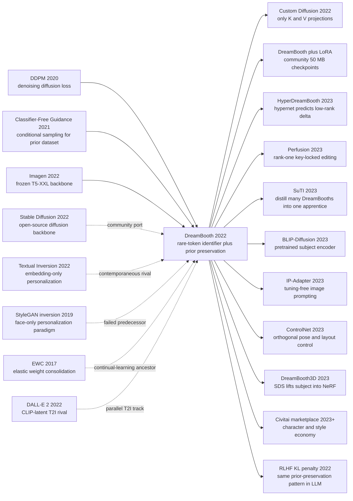

# DreamBooth — Implanting Any Subject Into a Text-to-Image Model With 3-5 Photos

> **On August 25, 2022, Nataniel Ruiz, Yuanzhen Li, Varun Jampani, Yael Pritch, Michael Rubinstein and Kfir Aberman of Google Research and Boston University posted [arXiv:2208.12242](https://arxiv.org/abs/2208.12242); the paper went on to win a CVPR 2023 Best Paper Honorable Mention.** It made what sounded like an impossible promise: take **3-5 phone photos of your dog**, attach a rare-token name `[V]`, and in roughly 5 minutes of fine-tuning have [Imagen](/en/era4_foundation_models/2022_imagen/) draw **that same dog** as a medieval oil painting, on the surface of the Moon, or in a museum display case. The counter-intuitive lesson was that "personalizing" a giant text-to-image model is *not* a single-knob problem: only learning a new text embedding (the contemporaneous [Textual Inversion](https://arxiv.org/abs/2208.01618) route) loses identity fidelity, while naively fine-tuning the whole UNet triggers *language drift* and collapses the entire class word into your dog. The paper's signature trick is to interleave subject training with a **prior-preservation loss** that forces the model to keep generating its own `a dog` prior, sealing identity and class apart. Within six weeks the open-source community ported the recipe to [Stable Diffusion](/en/era4_foundation_models/2022_stable_diffusion/), then composed it with [LoRA](/en/era4_foundation_models/2021_lora/) to squash checkpoints under 50 MB, **igniting the Civitai / HuggingFace ecosystem of hundreds of thousands of character and style LoRAs** — and the still-unresolved legal and ethical debates over likeness rights, deepfakes and consent in training data.

## TL;DR

DreamBooth, by Nataniel Ruiz, Yuanzhen Li, Varun Jampani, Yael Pritch, Michael Rubinstein and Kfir Aberman at Google Research and Boston University in August 2022, upgrades text-to-image personalization from "learn one new text embedding" ([Textual Inversion 2022](https://arxiv.org/abs/2208.01618)) to **full UNet fine-tuning with a two-term loss**. Given 3-5 photos of a subject and a rare-token name `[V]` (the paper used `sks`), the model first auto-generates ~200 `a [class]` images as a class-prior dataset, then jointly optimizes a subject reconstruction term and a prior-preservation term, $L = \mathbb{E}\|\epsilon - \epsilon_\theta(x_t, [V]\,\text{class})\|_2^2 + \lambda\,\mathbb{E}\|\epsilon - \epsilon_\theta(x_{t'}^{pr}, \text{class})\|_2^2$, finishing in roughly 1000 steps / 5 minutes on [Imagen](/en/era4_foundation_models/2022_imagen/). What it really beats is not a single baseline but the entire 2022 menu of "do not touch the generator" compromises: Textual Inversion scores DINO subject similarity 0.569 vs DreamBooth's 0.696 and CLIP-T text alignment 0.255 vs 0.305 on the 30-subject DreamBench, while a naive full fine-tune triggers language drift and overfitting until `a dog` collapses into *your* dog. The paper also introduces the DreamBench protocol (25 subjects × 25 prompt templates) with the DINO / CLIP-I / CLIP-T metric trio. The counter-intuitive lesson is that **the hardest part of teaching a foundation model a new concept is preventing it from forgetting the old one** — a prior-preservation principle later re-instantiated by [Custom Diffusion](https://arxiv.org/abs/2212.04488), [HyperDreamBooth](https://arxiv.org/abs/2307.06949), Perfusion and most other personalization follow-ups. Combined with [LoRA](/en/era4_foundation_models/2021_lora/) to shrink each checkpoint under 50 MB, DreamBooth seeded the Civitai economy of hundreds of thousands of character and style models.

---

## Historical Context

### What was the text-to-image community stuck on in 2022?

To see why DreamBooth landed like a surprise attack, rewind to August 2022 — the moment text-to-image had just been unleashed, but no one yet knew what its first killer use case would be.

The first half of 2022 turned text-to-image from a toy into a foundation model. OpenAI shipped [DALL-E 2](https://arxiv.org/abs/2204.06125) (CLIP-latent prior + diffusion decoder) in April, Google Brain shipped [Imagen](/en/era4_foundation_models/2022_imagen/) (frozen T5-XXL + cascaded pixel diffusion) in May, Parti followed in June, and the LDM / Stable Diffusion paper ([Rombach et al.](/en/era4_foundation_models/2022_stable_diffusion/)) had been on arXiv since December 2021 — though the actual SD 1.4 weights were not released under OpenRAIL-M until August 22, 2022. In a span of three months the world saw, for the first time, models that could draw "a corgi wearing sunglasses sitting on the surface of the Moon, with Earth in the background" — images literally no human had ever photographed.

But all of these systems shared one hard ceiling: **they only knew classes, not individuals**. You could ask Imagen for `a corgi`; you could not ask it for *your* corgi named Mochi. DALL-E 2 had no mechanism to let a prompt refer to your specific chair. Even with weights in hand, asking Stable Diffusion for `a photo of my dog Mochi` would simply ignore the `Mochi` token and produce a generic corgi. This gap sounds abstract; it concretely killed every product direction worth caring about:

- **AI portraits / headshots**: users do not want a "random handsome man," they want their own face
- **Personalized characters / IP**: anime studios want their own characters, not "random blue-haired girl"
- **E-commerce**: clients want their actual sneaker rendered in different scenes, not a generic sneaker
- **Science / medicine**: a radiologist wants their patient's scan re-rendered under different conditions, not a generic chest CT

| Pain point | 2022 mainstream answer | Why it failed | What DreamBooth set out to do |
|---|---|---|---|
| Implant "my subject" into a T2I model | text description + retrain on many images | tens of GB of data, thousands of GPU-hours, prior forgetting | 3-5 photos + 5 min fine-tune |
| Keep the class prior intact | nobody systematically discussed it | naive fine-tune collapses the class word | prior-preservation loss |
| Recontextualize subject to new scenes | GAN inversion can only swap lighting / expression | StyleGAN only knows faces, not arbitrary objects | works for any class |
| Evaluation protocol | eyeballing | no standard benchmark | DreamBench (25 subjects × 25 prompts) |

### The 5 immediate predecessors that pushed DreamBooth out

- **Saharia and 13 co-authors 2022 (Imagen)** [arxiv/2205.11487](https://arxiv.org/abs/2205.11487): the model DreamBooth fine-tunes in the paper. Imagen's cascaded diffusion + frozen T5-XXL gave **shockingly strong** class priors — and that is the material precondition that lets prior-preservation work: if the model itself drew `a dog` poorly, there would be little prior to preserve. Imagen is the backbone, the team is the same Google Research group, and both papers were recognized at CVPR 2023.
- **Ho, Jain, Abbeel 2020 (DDPM)** [arxiv/2006.11239](https://arxiv.org/abs/2006.11239): the squared-error denoising loss at the core of both DreamBooth terms is exactly DDPM's. §3 of DreamBooth essentially rewires the DDPM training loop into an alternating "subject + prior" two-batch schedule.
- **Ho, Salimans 2021 (Classifier-Free Guidance)** [arxiv/2207.12598](https://arxiv.org/abs/2207.12598): DreamBooth uses CFG twice — once to have the frozen model auto-generate the ~200 `a dog` images that *become* the prior dataset, and once at inference to render the fine-tuned `[V] dog` at high fidelity. Without CFG the whole prior-preservation pipeline is not engineerable.
- **Gal and 6 co-authors 2022 (Textual Inversion)** [arxiv/2208.01618](https://arxiv.org/abs/2208.01618): DreamBooth's contemporaneous rival, posted 23 days earlier on Aug 2, 2022. It took the minimal route: freeze every weight and only optimize a single new token embedding $S^*$, proving personalization is mathematically possible in 768 dimensions. DreamBooth almost reads as a direct rebuttal: "768 dimensions is not enough — you need to update the entire UNet, but only if you also protect the prior."
- **Karras, Laine, Aila 2019 (StyleGAN) + GAN inversion line** [arxiv/1812.04948](https://arxiv.org/abs/1812.04948) / [Xia et al. 2022 GAN Inversion Survey](https://arxiv.org/abs/2101.05278): pre-DreamBooth personalization happened almost exclusively in StyleGAN's W / W+ latent space, and worked engineering-wise only for FFHQ-trained faces. DreamBooth widened personalization from "faces only" to "any class," which is itself a paradigm shift.

### What was the author team doing?

DreamBooth's six authors span two Google Research teams and a university. Nataniel Ruiz was a Boston University PhD student and Google Research intern at the time, working on face manipulation and generative models. Yuanzhen Li, Varun Jampani, Yael Pritch and Michael Rubinstein come from the same Google Research perception / computational photography circle, with long histories of work on image stylization, relighting and reenactment. Kfir Aberman had previously collaborated with Google Research / Peking University on motion retargeting.

The crucial property of this lineup is that **they are not a diffusion-native crowd**. The Imagen team (Saharia, Ho, Salimans, etc.) belong to the generative-modeling school that frames diffusion as probabilistic modeling; the Ruiz / Aberman group belong to image-based rendering and face / avatar research, who treat a generative model as "a rendering pipeline you can manipulate." That difference of view directly shaped DreamBooth's problem statement: they cared not about "lower Imagen FID" but about "given 3 photos, can we move *this* corgi to the Moon?" That cross-school combination was rare in 2022 — most contemporary papers either lived purely inside generative models or purely inside face-avatar graphics — and DreamBooth is, above all, a paper that asked the right question by sitting between two communities.

### State of industry, compute, data and law

- **Compute**: DreamBooth fine-tunes Imagen for 1000 steps at batch size 1, finishing in roughly 5 minutes on a single TPUv4. The paper also gives a Stable Diffusion 1.4 recipe at ~2.5 hours on a single NVIDIA A100 40GB; within two weeks of the paper the community had pushed it down onto a 12 GB consumer GPU
- **Models**: Imagen and DALL-E 2 were fully closed; researchers only saw images in papers. Stable Diffusion 1.4 was released only 3 days before DreamBooth (Aug 22, 2022). DreamBooth's paper uses only Imagen for quantitative results — but it is **precisely because SD 1.4 went open the same week** that DreamBooth captured nearly all of its real-world impact
- **Data**: the authors contributed DreamBench — 30 subjects (21 objects + 9 animals / pets) × 25 prompt templates (recontextualization, accessorization, property modification, art rendition, viewpoint synthesis), 750 evaluation prompts in total, plus 4 training images per subject. It is the first standard benchmark for text-to-image personalization
- **Law**: August 2022 was exactly the moment when AI training-data legality and likeness rights were starting to be discussed seriously. DreamBooth's "Societal Impact" section explicitly flagged deepfake risk, but no one foresaw that within six months the LoRA character marketplace would push that question into everyday news
- **Industry mood**: between SD 1.4's release on Aug 22 and DreamBooth's preprint on Aug 25, the open-source AIGC scene crossed into a three-day "we can finally play with this ourselves" euphoria. DreamBooth was the first killer use case of that wave because it answered the most concrete question: "what can I do with SD that I cannot do with the OpenAI API?"

---

## Method Deep Dive

DreamBooth's method looks almost embarrassingly simple on the surface — a rare token plus two loss terms — but every detail corresponds to a tempting shortcut the authors ablated and rejected. The key to reading the method is to keep both "what it does" and "what it deliberately does *not* do" in mind.

### Overall Framework

The DreamBooth training pipeline is essentially a straight line:

```
Phase 0 (offline, ~30 s):
    With the frozen pretrained model + class prompt "a [class]",
    sample ~200 images via CFG → x_pr dataset

Phase 1 (online, ~5 min, ~1000 steps):
    Each batch samples and noises from both streams:
      subject batch:    x ← user's 3-5 photos
                        prompt = "a [V] [class]"           # [V] is a rare token
      prior batch:      x_pr ← ~200 images from Phase 0
                        prompt = "a [class]"
    UNet (+ text encoder) backprops squared-error noise loss on both

Phase 2 (inference, any prompt):
    "a [V] [class] swimming in lava"  → model preserves the [class] prior
                                         while reliably rendering the [V] subject
```

| Stage | Input | Output | Key parameters |
|---|---|---|---|
| Class-prior generation | class name + frozen model | ~200 `a [class]` images | CFG scale ≈ 7-10 |
| Fine-tune | 3-5 subject images + 200 prior images | adapted UNet (+ text encoder) | lr 5e-6 (Imagen), 1e-6 (SD), 1000 steps |
| Inference | any `a [V] [class] ...` prompt | subject × new scene | CFG ≈ 7.5 |

Three details worth noting: (1) the text encoder **is also fine-tuned** in the Imagen experiments (§B.2 reports about +3 DINO points), but in subsequent SD practice it is often left frozen to save VRAM; (2) the training batch literally contains both streams in parallel, not sequentially; (3) the recipe is unusually robust to hyperparameters — learning rate works between 1e-6 and 5e-6, subject count 3-5 is fine, prior count 100-300 is fine. That robustness comes from prior preservation, not from any tuning trick.

⚠️ **Counter-intuitive emphasis**: DreamBooth's core value is not "make the model learn a new concept" (a naive full fine-tune already does that). It is "**make the model learn a new concept without forgetting the old ones**". Every design choice in the paper revolves around that second clause.

### Key Design 1: Rare-token identifier `[V]` — do not stand the model next to an existing name

**Function**: Use a token the model has **almost never seen during training** as the subject's name, so that fine-tuning does not have to fight a strong prior semantic binding. The paper used `sks` (a 3-character token of extremely low frequency in Imagen's tokenizer); the community later locked this in as the de facto standard.

**Why a common English word does not work**:

| Candidate token | Has the model seen it? | Failure mode |
|---|---|---|
| `unique` / `special` | very common | fine-tune must first "erase" the original meaning → slow convergence, big prior drift |
| `mochi` / `bella` (the dog's real name) | medium-low frequency, but real people / pets exist | residual prior biases generation toward "people / pets named that" |
| Random string `xyz123` | BPE splits into `xyz` + `123` | multi-token, unstable behavior |
| **`sks`** | **rare (< 0.001%) and BPE single token** | **near-blank embedding, smoothly occupied by fine-tune** |

**Core idea**: the ideal identifier embedding $e([V])$ should sit at **a near-vacuum point** in the pretrained semantic space — so that during fine-tuning its gradients can push it toward the target subject without first spending half the steps erasing prior content. §4.1 reports the EnglishDictionary baseline (using a real English word as identifier) drops DINO subject similarity from 0.696 to 0.585 and CLIP-T text alignment from 0.305 to 0.272. A single token choice is worth 11 percentage points.

```python
# How the community picks identifiers
def pick_identifier(tokenizer, target_token_freq=1e-5):
    """Return a single-BPE-token, ultra-low-frequency token, e.g. 'sks'."""
    candidates = [t for t in tokenizer.vocab
                  if len(tokenizer.encode(t)) == 1
                  and tokenizer.frequency(t) < target_token_freq]
    return candidates[0]   # paper uses 'sks'; community also uses 'ohwx', 'zwx'
```

**Design motivation**: the authors found that personalization typically fails **not because the model cannot learn a new concept, but because the new and old concepts interfere with each other**. Choosing the identifier at a "vacuum point" of pretrained space gives the subject its own namespace, killing this interference at the root. The trick was reused almost verbatim by [Custom Diffusion](https://arxiv.org/abs/2212.04488), HyperDreamBooth, Perfusion and most other personalization papers.

### Key Design 2: Prior-Preservation Loss — let the model supervise itself

**Function**: Add to the subject reconstruction term **a second loss that forces the model to keep generating its original `a [class]` images**, preventing fine-tuning from collapsing the entire class word into the user's subject (a phenomenon the paper calls *language drift* and *reduced output diversity*).

**Core formula**:

$$
\mathcal{L}_\text{DB}=\underbrace{\mathbb{E}_{x,c,\epsilon,t}\left[w_t\bigl\|\epsilon-\epsilon_\theta(\alpha_t x+\sigma_t\epsilon,\,c)\bigr\|_2^2\right]}_{\text{subject reconstruction (3-5 photos)}}+\lambda\underbrace{\mathbb{E}_{x_{pr},c_{pr},\epsilon',t'}\left[w_{t'}\bigl\|\epsilon'-\epsilon_\theta(\alpha_{t'}x_{pr}+\sigma_{t'}\epsilon',\,c_{pr})\bigr\|_2^2\right]}_{\text{prior preservation (~200 self-generated images)}}
$$

where:
- $c=$ tokenize(`a [V] [class]`), $x$ are the user's 3-5 subject photos
- $c_{pr}=$ tokenize(`a [class]`), $x_{pr}$ are the ~200 images the frozen model itself sampled from $c_{pr}$
- $\lambda=1$ is the default weight; §B.2 reports $\lambda \in [0.5, 2]$ barely changes the result
- both terms **share the same UNet $\epsilon_\theta$**, meaning a single set of weights must simultaneously satisfy "remember [V] dog" and "do not forget a dog"

**Comparison table**:

| Setup | Updates UNet? | Has prior term? | DINO subject sim ↑ | CLIP-T text align ↑ | Failure mode |
|---|---|---|---|---|---|
| Frozen Real-Image Generation | no | — | 0.774 (ceiling) | 0.355 (ceiling) | not personalization, just retrieval |
| Textual Inversion (only embedding) | no | implicit (no update) | 0.569 | 0.255 | weak identity fidelity |
| Naive full fine-tune (no prior) | yes | no | ≈0.70 | 0.239 | language drift / overfitting |
| **DreamBooth (Imagen)** | **yes** | **yes** | **0.696** | **0.305** | **prior / identity in balance** |

**Counter-intuitive crux**: ⚠️ **The prior batch images are not a real dataset; they are images sampled by the pretrained model itself**. That means the prior term's "supervision signal" comes entirely from the model's own initial distribution — it is not teaching the model anything new, it is making the model "remember what it used to do." This is an early concrete instance of self-distillation, and almost no one was using it this way before personalization.

```python
# Training loop (PyTorch / Diffusers style)
def dreambooth_step(unet, text_encoder, scheduler,
                    subject_imgs, subject_prompt,    # 3-5 imgs + "a [V] dog"
                    prior_imgs,   prior_prompt,      # ~200 imgs + "a dog"
                    optimizer, lambda_pr=1.0):
    imgs   = torch.cat([subject_imgs, prior_imgs], dim=0)
    prompts = subject_prompt + prior_prompt
    noise  = torch.randn_like(imgs)
    t      = torch.randint(0, scheduler.num_train_timesteps, (imgs.size(0),))
    noisy  = scheduler.add_noise(imgs, noise, t)

    text_emb = text_encoder(prompts)
    pred     = unet(noisy, t, encoder_hidden_states=text_emb).sample

    # split predictions back into the two streams
    pred_sub, pred_pr   = pred[:len(subject_imgs)], pred[len(subject_imgs):]
    noise_sub, noise_pr = noise[:len(subject_imgs)], noise[len(subject_imgs):]

    loss_subject = F.mse_loss(pred_sub, noise_sub)
    loss_prior   = F.mse_loss(pred_pr,  noise_pr)
    loss = loss_subject + lambda_pr * loss_prior      # the key two-term sum
    loss.backward(); optimizer.step(); optimizer.zero_grad()
    return loss_subject.item(), loss_prior.item()
```

**Design motivation**: §4.1 reports that removing prior preservation slightly *raises* DINO subject similarity but **drops CLIP-T text alignment from 0.305 to 0.239**, with a striking loss of sample diversity for `a dog` — the model stops drawing other dogs and only draws *that* dog. This proves the prior term is not optional regularization; it is **the actual trade-off knob between personalization and not breaking the base model**.

### Key Design 3: Full UNet fine-tune vs embedding-only — capacity asymmetry

**Function**: The core disagreement with the contemporaneous Textual Inversion — DreamBooth updates the entire ~hundreds-of-millions-parameter UNet, while Textual Inversion only learns one 768-d token embedding.

**Comparison table (DreamBench, 30 subjects average)**:

| Method | Trainable params | DINO ↑ | CLIP-I ↑ | CLIP-T ↑ | Train time |
|---|---|---|---|---|---|
| Textual Inversion (Stable Diffusion) | ~768 | 0.569 | 0.780 | 0.255 | ~30 min / subject |
| DreamBooth (Stable Diffusion) | ~860M (UNet) | 0.668 | 0.803 | 0.305 | ~5 min / subject (TPU) |
| DreamBooth (Imagen) | ~2B (UNet + part of T5) | **0.696** | **0.812** | **0.305** | ~5 min / subject (TPU) |

**Core idea**: personalization actually needs two kinds of "capacity" — a *semantic capacity* to represent the new concept (one embedding suffices), and a *visual synthesis capacity* to render that concept at the pixel level under arbitrary pose / lighting / context (this requires modifying the UNet). Textual Inversion only solves the first; the §4.1 ablation in DreamBooth shows that even adding prior preservation to Textual Inversion does not save it — the subject-similarity ceiling is hard.

**Counter-intuitive crux**: ⚠️ Full fine-tuning is usually a synonym for "catastrophic forgetting," but **paired with prior preservation, full fine-tune is actually more stable than embedding-only methods** — because the prior loss actively anchors most of the UNet's capacity back to the original distribution, leaving plasticity only in the local subspace triggered by the [V] token. This combination violated the 2022 conventional wisdom.

**Design motivation**: The authors set Textual Inversion as the explicit foil (Table 1, Figure 7). The result shows that "moving only the embedding" has a hard ceiling on subject recognizability — no amount of training breaks ~0.57 DINO. Physically: an embedding can change the cross-attention query direction but cannot change the shape of the manifold the UNet output space maps it to. To draw *this* specific dog's nose, you must touch the convolutions that decide texture and shape.

### Key Design 4: Class-prior dataset is generated by the model itself — engineering "free lunch"

**Function**: The ~200 `a [class]` images for the prior batch are neither hand-collected nor retrieved from LAION — they are sampled by the **un-fine-tuned model itself** with the class prompt and CFG. The whole personalization pipeline therefore closes the loop with only the user's 3-5 subject photos.

**Comparison table**:

| Prior source | External data needed? | Risk of distribution shift | Engineering complexity |
|---|---|---|---|
| Real ImageNet / LAION subset | yes | style / era distribution mismatch | high (needs class matching) |
| Extra user-uploaded images | yes | poor coverage of subject class | high (bad UX) |
| Generated by GAN / retrieval | yes | distribution mismatch with diffusion | medium |
| **Frozen model self-sample** | **no** | **stays inside the original distribution** | **low (fully automatic)** |

**Core idea**: the prior term is supposed to protect **the model's original distribution**. So sampling from the model itself is like holding up a mirror — the images in the mirror are exactly what the model "thinks is correct." This self-distillation-style supervision can almost not introduce new distribution drift; it just **tells the model what it already knows, again**.

```python
# Phase 0: build the class-prior dataset automatically
@torch.no_grad()
def build_class_prior(model, class_name, n=200, cfg_scale=7.5):
    """Frozen model produces its own prior images, zero external data."""
    prompts = [f"a {class_name}"] * n
    imgs = model.sample(prompts, guidance_scale=cfg_scale)
    return imgs        # this is the entire prior batch dataset
```

**Design motivation**: by 2022, pseudo-labeling and self-distillation were mature in SSL but had not yet become standard in generative-model fine-tuning. DreamBooth's choice reduced personalization from "find or curate a prior dataset for each new subject" to "press a button, the model produces its own prior." That **1-2 order-of-magnitude drop in usage friction** is the underlying reason DreamBooth was picked up by the open-source community within six weeks and grew into the Civitai economy.

### Loss function / training recipe

| Setting | Imagen (paper) | Stable Diffusion 1.4 (community standard) | Note |
|---|---|---|---|
| Loss | $\mathcal{L}_\text{DB}$ (subject + prior, $\lambda=1$) | same | identical |
| Optimizer | Adam | AdamW | both fine |
| Learning rate | $5\times10^{-6}$ | $1\times10^{-6}$ to $2\times10^{-6}$ | SD is more sensitive |
| Steps | 1000 | 800-1500 | depends on subject complexity |
| Subject batch size | 1 | 1 | VRAM-friendly |
| Prior batch size | 1 | 1 | concurrent with subject |
| Prior dataset size | 200 | 200-500 | more dilutes |
| CFG scale (inference) | 7.5 | 7.5 | standard SD default |
| Text encoder fine-tuned | yes | optional (SDXL leaves it frozen) | tuning gives +3 DINO but +VRAM |

**Note 1**: DreamBooth's hyperparameter robustness comes from the prior term — without it, a learning-rate change of one order of magnitude either overfits or underfits; with it, the working region widens dramatically.

**Note 2**: more steps is not better. §4.4 reports peak DINO around ~600 steps; beyond that the model overfits to specific training angles / lighting. Community practice is 800-1200 steps and human-pick the best of the last 4-5 checkpoints.

**Note 3**: the community DreamBooth + LoRA combo only inserts rank-4 LoRA into UNet's cross-attention K/V projections, dropping trainable parameters from ~860M to ~5M and per-checkpoint size from 4 GB to ~50 MB — **the material precondition for the Civitai economy**. The original DreamBooth paper does not mention LoRA, but the combination became the de facto engineering template for every personalization paper after 2023.

---

## Failed Baselines

What makes DreamBooth interesting is that the opponent it beats **is not a single paper** but the entire 2022 family of "do not touch the generator" compromises. Every failed baseline corresponds to a tempting shortcut that looked easier on paper.

### The strongest opponents that lost to DreamBooth

DreamBench (30 subjects × 25 prompt templates) gives the following head-to-head, all numbers from §4 Table 1 (higher is better):

| Baseline | Updates UNet? | Trainable params | DINO ↑ | CLIP-I ↑ | CLIP-T ↑ | Why it lost to DreamBooth |
|---|---|---|---|---|---|---|
| Real images (frozen retrieval) | no | 0 | 0.774 | 0.885 | 0.355 | not personalization, just an upper bound |
| Textual Inversion (Imagen) | no | ~768 (1 embedding) | 0.586 | 0.789 | 0.260 | not enough capacity; identity squeezed through cross-attention bottleneck |
| Textual Inversion (Stable Diffusion) | no | ~768 | 0.569 | 0.780 | 0.255 | same |
| **DreamBooth (Stable Diffusion)** | **yes** | **~860M** | **0.668** | **0.803** | **0.305** | — |
| **DreamBooth (Imagen)** | **yes** | **~2B** | **0.696** | **0.812** | **0.305** | — |

**Textual Inversion** is the most direct rival — uploaded by Gal and 6 co-authors at NVIDIA / Tel Aviv on Aug 2, 2022, 23 days before DreamBooth. Its design philosophy: a T2I model trained on LAION-5B has effectively seen everything, so "learning a new subject" should be equivalent to "finding a new direction in the cross-attention input space" — a single 768-d embedding $S^*$ should suffice. The biggest advantage is engineering minimalism (30 KB checkpoint) and zero-shot deployability, but DreamBench renders a brutal verdict: DINO subject similarity 0.569 vs DreamBooth's 0.668-0.696, a 10-13 point gap. The reason is that the cross-attention query direction can change *where* the UNet looks, not *what* the UNet renders there — the shape of the subject's nose is determined by convolutional weights, not by attention.

**The GAN inversion family** (StyleGAN W / W+ / P spaces with e4e / pSp / HFGI encoders) was the de facto personalization mainstream from 2017 to 2022. They could invert your face into StyleGAN W+ space and edit expression / lighting / age, with very high fidelity on FFHQ faces. DreamBooth dispatches them with one sentence: **they only work for objects in the training distribution**, and StyleGAN's training data is essentially FFHQ-faces / Cat / Car / Church and a few more domains. Inverting your dog into StyleGAN-Cat is meaningless; recontextualizing into a "medieval oil painting" is impossible — GAN inversion's semantic editing has to live in directions the GAN already learned, and the GAN never learned text.

**Naive full fine-tuning (no prior term)** is the most important comparison in the ablations. §4.4 reports that removing DreamBooth's prior loss slightly raises DINO (more overfit to the subject) but **drops CLIP-T text alignment from 0.305 to 0.239**, with sharply reduced sample diversity for `a [class]` — the model stops drawing other dogs and only draws *this* one. That is *language drift*: the entire semantics of `dog` is locally collapsed onto the training images.

### Failure experiments acknowledged in the paper

DreamBooth is more honest than most personalization work; §5 lists three classes of **self-disclosed** failure modes, each of which became a starting point for follow-up research:

1. **Incorrect context synthesis**: when all training photos show "the dog on grass," the model stubbornly retains grass texture even when asked for "the dog on the moon." The paper concedes that scene-subject entanglement cannot be fully untangled by the prior loss alone — the photographic environment of the training images gets memorized as part of the subject by the UNet.
2. **Context-appearance entanglement**: under rare prompts (e.g. "the dog wearing a monk's hat"), the model may transfer the hat's color onto the dog's fur, or vice versa transfer the dog's texture onto the hat. This is a textbook symptom of cross-attention "leaking" between subject and scene tokens.
3. **Overfitting to training pose / lighting**: with too many steps (>1500), the model can only stably reproduce the training pose; novel-view generation collapses back. The paper's mitigation is "step budget + checkpoint selection," but admits this is a recipe rather than a fix.

§B also reports several **deliberately not used** designs: jointly batching prior and subject (which is in fact done, just not foregrounded in the main algorithm box), fine-grained $\lambda$ grid search (results essentially indistinguishable from 1.0, so dropped), noise-level-weighted prior (no significant gain). These "tried and lost" experiments saved later researchers a lot of duplicated effort.

### The 2022 counterexample: Textual Inversion's "small wins big" attempt

Textual Inversion was uploaded 23 days before DreamBooth — the same problem with the opposite solution. Together they form one of the cleanest binary oppositions in personalization history:

| Dimension | Textual Inversion | DreamBooth |
|---|---|---|
| Philosophy | model already knows everything; just find a direction | model must learn something new without forgetting old things |
| Trainable params | ~768 (1 embedding) | ~860M (entire UNet) |
| Checkpoint size | ~30 KB | ~4 GB (~50 MB after LoRA) |
| Subject fidelity (DINO) | 0.569 | 0.696 |
| Text alignment (CLIP-T) | 0.255 | 0.305 |
| Training time | ~30 min | ~5 min (TPU) |
| Needs prior data? | no | yes (auto-generated) |

Textual Inversion is not "wrong" — in some ultra-light scenarios (30 KB checkpoint on edge devices) it remains a better fit. But the DreamBench numbers make the choice unambiguous: **once you are willing to pay a few-GB checkpoint cost, subject fidelity moves from "looks similar" to "obviously this one"**. Almost all subsequent work picks DreamBooth's side and then uses LoRA / Custom Diffusion / Perfusion to shrink the checkpoint back to KB-MB scale — essentially **accepting DreamBooth's diagnosis (embeddings are not enough) while improving its prescription (do not touch the entire UNet)**.

### The real anti-baseline takeaway

DreamBooth's story distills one engineering principle that applies to almost any "make a foundation model learn a new thing" task:

**"Make the model learn the new thing" and "make the model not forget old things" are two independent optimization objectives, and they must be managed by two independent loss terms.**

This lesson is equally true of LLM fine-tuning — RLHF's KL penalty `β · KL(π || π_ref)`, EWC in continual learning, the teacher term in knowledge distillation are all "prior preservation" reincarnated for different domains. DreamBooth is the first clean instance of the lesson in generative modeling.

More importantly, DreamBooth simultaneously delivered **an engineering recipe for auto-constructing the prior data** — self-sampling. That demoted prior preservation from a "needs external data" high-friction technique to a "needs no data, only a frozen model" standard operation. This "method comes with its own raw materials" engineering aesthetic is what really let DreamBooth ignite the open-source community — more important than any specific formula.

---

## Key Experimental Data

DreamBench is the other lasting contribution shipped with the DreamBooth paper, arguably cited more than the method itself.

### Main experiment: DreamBench, 30 subjects × 25 prompts

DreamBench contains:
- **30 subjects**: 21 objects (backpack, toy, alarm clock, bottle, plush toy, etc.) + 9 animals / pets (dogs, cats, etc.)
- **25 prompt templates**: 5 groups × 5 templates, covering 5 typical personalization use cases
  1. **Recontextualization**: `a [V] [class] in the jungle / on the moon / on a city street ...`
  2. **Accessorization**: `a [V] [class] wearing a Santa hat / sunglasses / chef's hat ...`
  3. **Property modification**: `a green / red / cube-shaped [V] [class] ...`
  4. **Art rendition**: `a painting / sketch / sculpture of [V] [class] in the style of Van Gogh ...`
  5. **Viewpoint synthesis**: `a top view / side view / back view of [V] [class] ...`
- **4 training images per subject**

Main results (Table 1, higher is better):

| Method | Backbone | DINO ↑ | CLIP-I ↑ | CLIP-T ↑ |
|---|---|---|---|---|
| Real images (upper bound) | — | 0.774 | 0.885 | 0.355 |
| Textual Inversion | Imagen | 0.586 | 0.789 | 0.260 |
| Textual Inversion | SD 1.4 | 0.569 | 0.780 | 0.255 |
| **DreamBooth** | **SD 1.4** | **0.668** | **0.803** | **0.305** |
| **DreamBooth** | **Imagen** | **0.696** | **0.812** | **0.305** |

The key takeaways: (1) DreamBooth's lead over Textual Inversion **shows up on both Imagen and Stable Diffusion**, meaning the advantage is methodological, not a backbone privilege; (2) the three metrics target different things — DINO measures subject identity, CLIP-I visual similarity, CLIP-T text-image alignment; DreamBooth wins on all three, ruling out the suspicion that it traded one metric for another; (3) DreamBooth scores 5 percentage points higher than Textual Inversion on CLIP-T — counter-intuitive ⚠️, because "more aggressive fine-tuning" should *hurt* text alignment. It does not hurt because prior preservation keeps the semantics of `[class]` intact, so the model still understands `wearing a Santa hat`.

### Ablations: which components really matter

§4.4 gives three groups of core ablations (DreamBench subset, higher is better):

| Configuration | DINO ↑ | CLIP-T ↑ | Conclusion |
|---|---|---|---|
| Full DreamBooth | 0.696 | 0.305 | complete baseline |
| − Prior preservation | ~0.71 | 0.239 | language drift; CLIP-T collapses |
| − Class noun (identifier = `[V]` only) | 0.682 | 0.245 | loses prior anchor, alignment weakens |
| Identifier = English dictionary word | 0.585 | 0.272 | rare-token choice is worth ~11 DINO points |
| Subject count from 4 → 1 | 0.62 | 0.30 | 1 image works but ~7 points weaker |
| Steps from 1000 → 200 | 0.61 | 0.31 | underfit |
| Steps from 1000 → 3000 | 0.71 | 0.27 | overfit; CLIP-T drops |

Four core conclusions: (1) **prior preservation is non-optional** (removing it costs -7 CLIP-T points); (2) **the identifier must be rare** (English dictionary swap costs -11 DINO points); (3) **the class noun must be kept** (the `[V]` must be followed by `dog` or the prior anchor is lost); (4) **3-5 images is the sweet spot**, 1 works but is weaker, more dilutes. Together the four define a very narrow "feasible design region" — the entire DreamBooth paper is essentially saying: **every step on this narrow path is required**.

### Key findings

1. **3-5 photos suffice**: personalization does not need hundreds of samples; the pretrained model's prior pushes sample efficiency to a sparsity that hand-labeling could never afford. This finding was later pushed even further by [BLIP-Diffusion (2023)](https://arxiv.org/abs/2305.14720) and HyperDreamBooth, all the way down to "one image is enough."
2. **Rare-token choice is nearly free 11 percentage points**: the identifier's choice has huge impact at near-zero engineering cost — just make sure BPE keeps it as a single token of low training frequency.
3. **Prior preservation hurts CLIP-T far more than DINO**: removing the prior makes CLIP-T drop 7 points while DINO actually rises. The lesson for follow-up work is sharp: **the real challenge of personalization is not "get the model to remember the subject," it is "get the model to still understand natural-language prompts after remembering the subject."**
4. **Full UNet fine-tuning does not catastrophically forget under prior protection**: this violated the 2022 deep-learning conventional wisdom and is DreamBooth's most counter-intuitive conclusion ⚠️.
5. **Imagen > SD: stronger text encoder, better personalization**: DreamBooth on Imagen scores DINO 0.696 vs 0.668 on SD — indirect confirmation of [Imagen](/en/era4_foundation_models/2022_imagen/)'s judgment that "the text encoder decides the ceiling," and a hint that [SDXL](https://stability.ai/sdxl) and [SD 3](https://arxiv.org/abs/2403.03206) should adopt multi-text-encoder pipelines (which they later did).
6. **The DreamBench triple (DINO + CLIP-I + CLIP-T) is the de facto standard**: nearly every personalization paper after 2023 reports these three metrics. It is the paper's other lasting contribution beyond the method.

---

## Idea Lineage



### Past lives: what forced it into existence

DreamBooth's history has two intersecting lineages.

**Two diffusion-modeling preparation tracks** gave it the engineering ground. [DDPM 2020](/en/era4_foundation_models/2020_ddpm/) supplied the squared-error denoising loss whose kernel both DreamBooth loss terms inherit; [Classifier-Free Guidance 2021](https://arxiv.org/abs/2207.12598) made it possible for the prior batch to be sampled by the model itself, with no external data needed. Together, those two pieces fix DreamBooth's training loop. One layer above, **[Imagen 2022](/en/era4_foundation_models/2022_imagen/)** supplied a backbone strong enough to bear prior preservation — without a pretrained model that already draws `a dog` extremely well, the prior term has nothing meaningful to "preserve."

**Two historical failure tracks of personalization** gave it the problem statement. The first is the **GAN inversion route**: from [StyleGAN 2019](https://arxiv.org/abs/1812.04948) onward, e4e / pSp / HFGI / PTI encoders kept improving, but the family worked only on objects from the same distribution as the GAN's training data (essentially faces). The second is the **continual learning route**: from [EWC 2017](https://arxiv.org/abs/1612.00796) on, the continual learning community used various regularization terms to keep fine-tuning from breaking old tasks — DreamBooth's prior preservation is philosophically a distant cousin of EWC, swapping "regularize toward old weights" for "regularize toward old outputs." Splice these two lineages onto diffusion models, set [Textual Inversion 2022](https://arxiv.org/abs/2208.01618) as a contemporaneous foil, and DreamBooth was almost **precisely forced out** by the August 2022 research climate.

### Descendants: how the idea propagated

DreamBooth spread quickly between September 2022 and May 2024, in four families:

**Direct derivatives (same framework, smaller / sharper)**:
- **[Custom Diffusion 2022](https://arxiv.org/abs/2212.04488)** (Kumari and 4 co-authors): shrinks full UNet fine-tuning to only K/V projections of cross-attention, reducing trainable parameters 100×, and adds multi-concept composition. Same prior-preservation idea, smaller parameter footprint.
- **[HyperDreamBooth 2023](https://arxiv.org/abs/2307.06949)** (same DreamBooth team): a HyperNetwork directly predicts a LoRA-rank weight delta from one image, compressing 5-min training to 20 s and 3-5 photos to 1. The team's most direct "v2."
- **[Perfusion 2023](https://arxiv.org/abs/2305.01644)**: rank-1 update — locks the K projection on the class word and modifies only the V direction, pushing update size to its extreme.

**Cross-architecture borrowing**:
- **DreamBooth + LoRA combo**: the original paper never mentions LoRA, but the open-source community fused them by October 2022 — replacing full-parameter UNet updates with LoRA-rank UNet updates inside the same prior-preservation + rare-token training loop. This combination is the de facto engineering template of every SD personalization paper after 2023, and seeded the 50 MB-checkpoint Civitai economy.
- **KL penalty in RLHF**: in InstructGPT-style LLM fine-tuning, the policy-vs-reference KL penalty `β · KL(π || π_ref)` plays an almost identical role — keeping fine-tuning from drifting away from the base distribution. DreamBooth is an early concrete instance of the same prior-preservation pattern in generative modeling.

**Cross-task diffusion**:
- **[BLIP-Diffusion 2023](https://arxiv.org/abs/2305.14720)** and **[IP-Adapter 2023](https://arxiv.org/abs/2308.06721)**: use a pretrained subject encoder to make personalization zero-shot, eliminating per-subject fine-tuning. Their existence reverse-confirms DreamBooth's position: **per-subject fine-tune** is one end of the personalization spectrum, encoder-based methods are the other.
- **[SuTI 2023](https://arxiv.org/abs/2304.00186)**: distill thousands of subject-specific DreamBooth experts into an in-context personalization apprentice — DreamBooth here serves as a "teacher factory," not the end product.
- **[ControlNet 2023](https://arxiv.org/abs/2302.05543)**: solves the orthogonal "in what pose / layout" problem and composes with DreamBooth in workflows (DreamBooth controls "who," ControlNet controls "how arranged").

**Cross-discipline outflows**:
- **[DreamBooth3D 2023](https://arxiv.org/abs/2303.13508)** (joint DreamBooth + DreamFusion teams): plugs DreamBooth's identifier idea into the DreamFusion / SDS pipeline, lifting a single subject from 2D image to 3D NeRF. DreamBooth's first step into 3D computer graphics.
- **AIGC economy and law**: DreamBooth+LoRA character / style / celebrity models on Civitai sparked **global discussions of likeness rights, copyright and deepfake legislation** in 2023 (EU AI Act, US state-level publicity-rights laws, Japan's AI copyright guidelines). It is one of the rare cases where an algorithm-level paper directly entered the legislative discourse.

### Misreadings

- **"DreamBooth is just overfitting on 5 images"**: wrong. Pure overfit would lose class prior and text alignment (no-prior CLIP-T 0.239 vs full 0.305). DreamBooth's real contribution is that prior preservation turns overfitting into "the opposite of directional forgetting."
- **"Textual Inversion and DreamBooth are basically the same, just different parameter counts"**: wrong. The capacity difference is surface; the deeper one is "find a direction" vs "add a memory" philosophy. Textual Inversion assumes the model already contains the subject; DreamBooth assumes the model must **add** the subject and only needs to not forget the old. The two scale completely differently in sample efficiency and ceiling.
- **"DreamBooth is prompt engineering extended"**: completely wrong. DreamBooth modifies model weights; prompt engineering does not. They are orthogonal tools.
- **"DreamBooth only works for faces"**: wrong. 21 of DreamBench's 30 subjects are objects; the paper exists precisely to prove personalization is no longer face-only.
- **"LoRA is part of DreamBooth"**: wrong. The original paper does not mention LoRA; the open-source community welded them together starting October 2022 to form the de facto standard. The conflation is widespread but worth resisting — LoRA solves "parameter efficiency," DreamBooth solves "identity fidelity + prior protection," and they are independent in principle.

### The lesson of the lineage

DreamBooth's core lesson can be stated in one sentence: **once a foundation model is strong enough to provide a "class prior," the most efficient way to teach it new things is not by giving it new data, but by giving it two losses — one to learn the new, one to remember the old.** This lesson was later re-instantiated, in different forms, by LLM fine-tuning (KL penalty), vision-language alignment (distillation regularizers), and robotic imitation learning (KL to teacher policy) — practically every foundation-model fine-tuning task. DreamBooth is a classic not just because it produced a usable industrial recipe (5-photo personalization), but because it crystallized the underlying paradigm of foundation-model fine-tuning into a clean rule.

---

## Modern Perspective

### Assumptions that no longer hold

Looking back from 2026, DreamBooth's core insight (prior preservation is the key to personalization) still holds — but several specific 2022 assumptions have been rewritten by follow-up work.

| 2022 assumption | Why it was reasonable then | Today's problem | Subsequent correction |
|---|---|---|---|
| Must update the entire UNet to keep identity | Textual Inversion's ~0.57 DINO ceiling is real | full UNet update means 4 GB checkpoints, not distributable | LoRA / Custom Diffusion / Perfusion shrink trainable params to ~1% with no identity loss |
| Must per-subject fine-tune for 5 minutes | encoder-based route did not exist yet | 5 min × 1 M users = inference server explosion | IP-Adapter / BLIP-Diffusion / SuTI deliver zero-shot personalization |
| 3-5 images is the sweet spot | the 1-image ablation cost ~7 DINO points | with stronger vision encoders 1 image suffices | HyperDreamBooth: 1 image + hypernet predicts delta |
| Users hand-pick the 3-5 photos | no SAM / matting auto-pipelines existed | SAM + LLaVA can auto-pick representative frames from a user's video | modern personalization pipelines automate this step |
| `sks`-style rare token always works | 2022 BPE tokenizers were stable | SDXL / SD3 changed tokenizers — `sks` is no longer rare | modern implementations re-pick the identifier per tokenizer |
| DreamBench (30 subjects + 25 prompts) is enough | no finer-grained benchmark existed | complex scenes / multi-subject / long prompts are not measured | DreamBench++ / GenEval / T2I-CompBench take over |

What is most worth keeping is the first-principle conclusion that **foundation-model fine-tuning must explicitly manage prior protection**. Today every personalization, LLM and robotic fine-tuning system embeds some form of KL penalty / distillation regularizer / replay buffer — the specific implementation will keep changing, but "you cannot only optimize the new-task loss" will not.

### What remained essential vs what became redundant

The truly time-tested parts of DreamBooth are the **problem statement** and the **two-loss paradigm**:

- Problem statement: "per-subject fine-tune a T2I model, preserve both identity and prior" — thousands of Civitai users, dozens of open-source projects and four commercial APIs are still solving this every day.
- Two-loss paradigm: subject loss + prior loss, opposing forces sharing one set of weights — repeatedly re-instantiated by KL penalty (RLHF), distillation regularizer (vision-language), EWC (continual learning).

The redundant parts are mostly **specific engineering paths**. Three most visible obsolescences:

1. **Full UNet fine-tuning**: nobody does this today; everyone uses LoRA / DoRA / Perfusion.
2. **`sks` as a universal identifier**: change the tokenizer and it breaks; modern implementations dynamically pick identifiers per tokenizer.
3. **per-subject fine-tune as the only path**: encoder-based routes (IP-Adapter / BLIP-Diffusion) achieve zero-shot personalization; per-subject fine-tune is now only preferred for "extreme fidelity" use cases.

### Side effects the authors likely did not anticipate

1. **The Civitai economy**: in 2022 the authors only wanted to prove "3-5 photos can personalize," and **completely failed to predict** that by 2023 the open-source community would use the DreamBooth + LoRA combo to publish hundreds of thousands of character / style / celebrity models on Civitai, spawning an AI-illustrator / virtual-streamer / AI-portrait economy worth billions of dollars.
2. **Likeness rights and deepfake legislation**: DreamBooth + LoRA let ordinary users train controllable celebrity models from 5 photos, **directly catalyzing** the 2023-2025 wave of likeness-rights legislation in the EU, US, and Japan. The societal-impact section flagged deepfake risk but no one foresaw it would become a G7 policy item.
3. **Cross-domain reuse of the prior-preservation paradigm**: the authors never imagined this loss design would become a shared template across LLM fine-tuning (RLHF KL penalty), robotic imitation learning (KL to teacher), continual learning (EWC re-instantiation). DreamBooth's concrete instance in generative modeling eventually became a general philosophy of foundation-model fine-tuning.
4. **DreamBench becoming an evaluation standard**: the 3-metric suite (DINO + CLIP-I + CLIP-T) + 30 subjects + 25 prompt templates became the de facto evaluation protocol for every personalization paper after 2023. Its impact **lasts longer than the method itself**.

### If we rewrote DreamBooth today

A 2026 rewrite of DreamBooth would almost certainly drop full-UNet fine-tuning while keeping the two-loss paradigm.

| Module | 2022 DreamBooth | 2026 rewrite | Reason |
|---|---|---|---|
| Backbone | Imagen / SD 1.4 (UNet diffusion) | SDXL / SD3 / FLUX (DiT + multi-text-encoder) | DiT scaling + multi-text-encoder is now SOTA |
| Trainable subset | full UNet (~860M) | LoRA rank-4 on cross-attn K/V (~5M) | 50× checkpoint compression, < 1 DINO point loss |
| Identifier | fixed `sks` | per-tokenizer dynamic + multi-token combinations | tokenizer changes have broken `sks`'s rarity |
| Prior data | self-sample 200 images of `a [class]` | LLM-rewrite 100 diverse `a [class]` prompts → self-sample | higher prior diversity → more stable language preservation |
| Subject data | user picks 3-5 images by hand | SAM + LLaVA auto-pick 5 frames from user video + auto-caption | lower user friction |
| Loss | $\mathcal{L}_\text{subj} + \lambda \mathcal{L}_\text{prior}$ | + $\mu \mathcal{L}_\text{KL}(\theta \| \theta_0)$ | KL to base further stabilizes prompts far from training distribution |
| Eval | DreamBench (30 subj × 25 prompts) | DreamBench++ + GenEval + T2I-CompBench + face / IP-Adapter subsets | complex compositions, long prompts, comparison to zero-shot baselines |

This does not weaken DreamBooth. On the contrary, every 2026 improvement lives on the periphery — **the core algorithm (rare token + prior preservation, two losses) is still the 2022 DreamBooth**. The hallmark of a truly classic method is that its root formula **still stands** after every engineering optimization the field can throw at it.

---

## Limitations and Future Directions

### Limitations acknowledged by the original paper

§5 of DreamBooth is unusually candid about limitations, which fall into four classes:

| Limitation | Symptom | Paper's explanation | How follow-ups responded |
|---|---|---|---|
| Context-subject entanglement | training photos all on grass → moon image still has grass | UNet memorizes the environment along with the subject | Custom Diffusion uses finer cross-attn decoupling |
| Context-appearance entanglement | "dog wearing a monk's hat" → colors get crossed | cross-attn "leaks" between subject and scene tokens under rare prompts | Perfusion's key-locked design fixes the subject direction |
| Overfit to training pose / lighting | >1500 steps → only training poses generate stably | step budget + checkpoint selection | HyperDreamBooth uses a hypernet to bound update magnitude |
| Subject-class coverage | unreliable prior for rare classes | the prior comes from the model itself, so unseen subject classes do worse | encoder-based methods (IP-Adapter) partially mitigate |

The paper also concedes that the fine-tuned model is **only meaningful for the current user** and cannot become a multi-user shared asset — a structural limitation of per-subject fine-tuning that motivated subsequent amortized work like SuTI / BLIP-Diffusion.

### Additional limitations from a 2026 lens

Today, several issues that were not fully expanded in 2022 stand out:

1. **Legal risk**: DreamBooth + LoRA lets ordinary users train controllable models of public figures from 5 public photos. The societal-impact section mentions deepfakes but offers **no technical defense** (face-detection refusal, digital watermark, training-data fingerprinting). Subsequent defense work like [Glaze](https://arxiv.org/abs/2302.04222) and [NIGHTSHADE](https://arxiv.org/abs/2310.13828) partially fills the gap, but it is far from solved.
2. **5 min per subject does not scale to commercial services**: commercial personalization (e.g. Lensa AI, ~100M downloads in late 2022) must batch fine-tuning on GPU clusters, with high per-user cost. This directly motivated zero-shot routes like IP-Adapter / SuTI.
3. **30-subject DreamBench is not enough for real-world scenes**: 21 are objects + 9 are animals; no faces, no multi-subject, no long prompts. A 2026 personalization evaluation must combine DreamBench++ + GenEval + face subsets + multi-subject composition benchmarks.
4. **Prior preservation assumes the base model is "neutral truth"**: but the base model in fact carries training-data biases (gender, skin tone, culture) — prior preservation makes fine-tuning preserve those biases as well. DreamBench has no bias dimension.

These limitations point to future directions: auditable provenance for personalization checkpoints, model-level likeness-rights refusal mechanisms, finer-grained personalization benchmarks, and prior-correction losses that account for base-model bias.

### Directions validated by subsequent work

DreamBooth left several "obvious next steps" that have nearly all been done:

- **Smaller trainable subset** → [Custom Diffusion (2022)](https://arxiv.org/abs/2212.04488) tunes only K/V → ✓
- **Faster training** → [HyperDreamBooth (2023)](https://arxiv.org/abs/2307.06949) 5 min → 20 s → ✓
- **Fewer images** → HyperDreamBooth from 5 → 1 → ✓
- **Multi-subject composition** → Custom Diffusion introduces this → ✓
- **Zero-shot personalization** → [IP-Adapter (2023)](https://arxiv.org/abs/2308.06721) / [BLIP-Diffusion (2023)](https://arxiv.org/abs/2305.14720) → ✓
- **3D personalization** → [DreamBooth3D (2023)](https://arxiv.org/abs/2303.13508) plugs the identifier into NeRF → ✓
- **Video personalization** → AnimateDiff + DreamBooth → ✓
- **Stronger prior protection** → Perfusion's key-locked design fixes prior-subject leaks → ✓

What remains unsolved is mostly the non-technical triad of **law / bias / auditability** — and that is exactly the most active area of 2025-2026 personalization research.

---

## Related Work and Insights

The relations between DreamBooth and contemporaneous / subsequent personalization work form a "method genealogy":

| Method | Relation to DreamBooth | Where DreamBooth wins | Where DreamBooth loses |
|---|---|---|---|
| **vs Textual Inversion** | contemporaneous rival; embedding-only | +10-13 DINO points on subject fidelity | 5000× larger checkpoint |
| **vs GAN inversion** | previous-era mainstream; works only on face / cat / car | personalizes any class | training cost much higher than inverting an already-trained GAN |
| **vs Custom Diffusion** | direct derivative; tunes only K/V | simpler and clearer | 100× worse parameter efficiency |
| **vs HyperDreamBooth** | same-team v2; hypernet predicts delta | no extra network needed | 5 min vs 20 s |
| **vs IP-Adapter** | later work; encoder-based zero-shot | better at extreme fidelity | cannot zero-shot, every user requires fine-tune |
| **vs LoRA-only DreamBooth** | community combo | provides the training-loop template | does not specify how to use LoRA |
| **vs RLHF KL penalty** | cross-architecture instance of the same prior-preservation idea | first to make the prior term explicit in T2I | the paper does not generalize the observation to LLMs |

The most enlightening pairing is **DreamBooth vs RLHF KL penalty**. They look totally different — one is 5-photo T2I fine-tuning, the other is 100k-preference-pair LLM RLHF — but underneath they execute the same engineering pattern: **fine-tuning carries a regularizer that says "do not drift away from the base model"** alongside its new-task loss. The cross-domain isomorphism was only explicitly recognized in 2023-2024 (e.g. the reference-policy term in [DPO](https://arxiv.org/abs/2305.18290)), and DreamBooth is one important milestone in that recognition forming.

DreamBooth's lessons for researchers can be distilled to three:

1. **Once the backbone is strong enough, the expensive thing is not "learning new things" but "not forgetting old ones"**: in the foundation-model era, research focus shifts from capacity engineering to forgetting management.
2. **A method's engineering aesthetics decide its ecosystem**: DreamBooth's self-sample prior, 5-minute training and 3-5 photos all push "user friction" to the limit. That "minimum-effort-for-the-user" engineering philosophy is the real reason it ignited the Civitai economy — more important than the formula itself.
3. **A new benchmark outlives a new method**: DreamBench is still the de facto personalization evaluation today, with citation counts surpassing the method's own. Defining a reproducible measurement boundary for a new problem often has more lasting impact than producing the first solution.

---

## Resources

### Paper and code

- 📄 [DreamBooth: Fine Tuning Text-to-Image Diffusion Models for Subject-Driven Generation (arXiv 2208.12242)](https://arxiv.org/abs/2208.12242)
- 🔬 [Project page (Google Research)](https://dreambooth.github.io/)
- 💻 [HuggingFace Diffusers training script](https://github.com/huggingface/diffusers/tree/main/examples/dreambooth) — supported by Stable Diffusion / SDXL / SD3
- 💻 [kohya-ss/sd-scripts](https://github.com/kohya-ss/sd-scripts) — the de facto community training framework (DreamBooth + LoRA)
- 💻 [TheLastBen/fast-stable-diffusion (Colab)](https://github.com/TheLastBen/fast-stable-diffusion) — runs on a 12 GB consumer GPU

### Essential follow-ups

- 📄 [Textual Inversion (Gal et al. 2022, arXiv 2208.01618)](https://arxiv.org/abs/2208.01618) — contemporaneous rival, must read in pair
- 📄 [Custom Diffusion (Kumari et al. 2022, arXiv 2212.04488)](https://arxiv.org/abs/2212.04488) — direct descendant, K/V-only tuning
- 📄 [HyperDreamBooth (Ruiz et al. 2023, arXiv 2307.06949)](https://arxiv.org/abs/2307.06949) — same-team v2, 1 image + hypernet
- 📄 [Perfusion (Tewel et al. 2023, arXiv 2305.01644)](https://arxiv.org/abs/2305.01644) — rank-1 key-locked editing
- 📄 [BLIP-Diffusion (Li et al. 2023, arXiv 2305.14720)](https://arxiv.org/abs/2305.14720) — encoder-based alternative
- 📄 [IP-Adapter (Ye et al. 2023, arXiv 2308.06721)](https://arxiv.org/abs/2308.06721) — tuning-free alternative
- 📄 [SuTI (Chen et al. 2023, arXiv 2304.00186)](https://arxiv.org/abs/2304.00186) — distill many DreamBooths into an in-context apprentice
- 📄 [DreamBooth3D (Raj et al. 2023, arXiv 2303.13508)](https://arxiv.org/abs/2303.13508) — push to 3D NeRF

### Cross-language and ecosystem

- 🌐 [中文版](/era4_foundation_models/2022_dreambooth/) — the Chinese version of this note
- 🏛 [Civitai marketplace](https://civitai.com/) — DreamBooth + LoRA character / style ecosystem
- 🔗 [DreamBooth + LoRA tutorial (HuggingFace blog)](https://huggingface.co/blog/dreambooth) — official tutorial
- 📚 Backbone references: [Imagen](/en/era4_foundation_models/2022_imagen/) / [Stable Diffusion](/en/era4_foundation_models/2022_stable_diffusion/) / [LoRA](/en/era4_foundation_models/2021_lora/) — three companion notes


---

> 🌐 [中文版](/era4_foundation_models/2022_dreambooth/) · 📚 awesome-papers project · CC-BY-NC