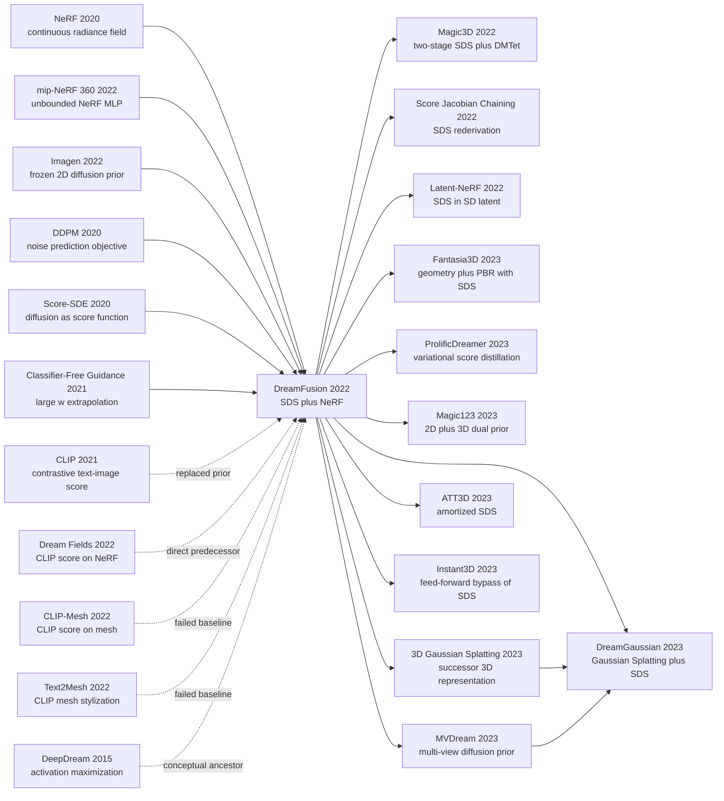

# DreamFusion — Text-to-3D by Distilling a Frozen 2D Diffusion into a NeRF

> On September 29, 2022, Google Research's Poole, Jain, Barron, and Mildenhall posted [arXiv:2209.14988](https://arxiv.org/abs/2209.14988), shoving text-to-3D from its "CLIP repaints a NeRF into a hazy blob" stage straight into "rotate a 3D corgi from one sentence and no 3D dataset." The counterintuitive claim is brutal: **the noise-prediction residual of a frozen 2D diffusion model (Imagen) is itself the optimization gradient for a NeRF** — no 3D data, no 3D diffusion model, and not even backpropagation through the 2B-parameter UNet. Six months later the paper won the ICLR 2023 Outstanding Paper Award, and it ignited the entire 2023 wave of text-to-3D systems — Magic3D, Latent-NeRF, ProlificDreamer, DreamGaussian — turning Score Distillation Sampling (SDS) into the de facto loss of the 3D generation industry.

## TL;DR

DreamFusion, by Poole, Jain, Barron, and Mildenhall at Google Research in 2022, proved that **text-to-3D needs no 3D dataset at all**. Render a randomly initialized [NeRF (2020)](2020_nerf.md) from random cameras as 64×64 images, feed each rendering to a frozen [Imagen (2022)](2022_imagen.md) diffusion model, and backpropagate the noise-prediction residual $(\hat\epsilon_\phi - \epsilon)$ into the NeRF parameters. That move is Score Distillation Sampling (SDS): $\nabla_\theta \mathcal{L}_{\mathrm{SDS}} = \mathbb{E}_{t,\epsilon}[w(t)(\hat\epsilon_\phi(z_t;y,t) - \epsilon)\,\partial z_t/\partial\theta]$. The key engineering cut is that **the gradient skips the UNet entirely**, turning the infeasible into a 1.5-hour optimization on 4 TPUv4 chips per asset. The defeated baselines were [Dream Fields](https://arxiv.org/abs/2112.01455) (CLIP-only NeRF at 38.5% R-Precision) and [CLIP-Mesh](https://arxiv.org/abs/2203.13333) (CLIP-only mesh at 23.0%); DreamFusion lifts the score to 78.6%, an absolute gain of +40.1 percentage points.

The downstream wave is hard to overstate: the entire 2023 text-to-3D flood — Magic3D (two-stage + DMTet), Latent-NeRF (SDS in Stable Diffusion latents), ProlificDreamer (VSD fixing oversaturation), MVDream (multi-view prior fixing Janus), DreamGaussian (porting SDS to [3D Gaussian Splatting](../era5_genai_explosion/2023_3dgs.md) and dropping 1.5 h to 2 min) — all rests on DreamFusion's two core choices: a frozen 2D diffusion as the prior and score distillation as the loss. The paper won the ICLR 2023 Outstanding Paper Award in March 2023, one of the very few that year. The hidden counterintuitive lesson: the authors "deliberately" chose the closed Imagen 64×64 base model over the more accessible Stable Diffusion. The open-source community criticized the decision at the time, but Latent-NeRF later needed a chain of engineering hacks before LDM-based SDS reached parity, vindicating the choice.

---

## Historical Context

### What was the text-to-3D community stuck on in 2022?

To appreciate why DreamFusion was a paradigm shift you have to recall the awkward state of 2022. **Text-to-2D had just left the GAN/AR era and was reaching commercial-grade quality with diffusion, while text-to-3D was still at the stage of "let a CLIP repaint a mesh into a hazy blob."**

In April-May 2022, [DALL-E 2](https://arxiv.org/abs/2204.06125), [Imagen](2022_imagen.md), and [Stable Diffusion / LDM](2022_stable_diffusion.md) all generated photorealistic 1024x1024 images from a sentence. The state of the art in text-to-3D, however, was [Dream Fields](https://arxiv.org/abs/2112.01455) and [CLIP-Mesh](https://arxiv.org/abs/2203.13333), which produced patchy NeRFs or low-resolution meshes whose geometry blurred away from the canonical viewpoint and whose colors were oversaturated. The challenge was not that 3D was a little harder than 2D. It was that three structural barriers stood in the way at once:

> **No 3D dataset, no 3D diffusion architecture, no differentiable 3D-aligned text loss — none of the foundations of 2D text-to-image existed for 3D.**

The first barrier was **data**. [Imagen](2022_imagen.md) was trained on roughly 860M image-text pairs, while the largest curated 3D dataset, ShapeNet, contained only about 50K objects. Objaverse 1.0, released in December 2022, brought the count to around 800K of mostly low-quality assets. The gap was four orders of magnitude.

The second barrier was **architecture**. 3D data has no natural grid alignment. Voxel diffusion blew up GPU memory at 256^3, point-cloud diffusion struggled with high-frequency detail, and mesh diffusion could not even define a clean denoising target because topology changes during sampling. Concurrent systems such as Point-E (December 2022) and GET3D (September 2022) sidestepped the problem by generating sparse point clouds or low-resolution textured meshes instead of high-fidelity assets.

The third barrier was the **alignment loss**. In 2D, cross-attention plus large-scale paired image-text pretraining let prompts drive pixel statistics directly. In 3D the only available differentiable bridge was [CLIP](https://arxiv.org/abs/2103.00020), a global contrastive embedding. Dream Fields, CLIP-Mesh, and Text2Mesh all shared the same recipe: render the NeRF or mesh from random viewpoints, feed each rendering plus the prompt to CLIP, and optimize geometry and texture so that CLIP cosine similarity rises.

The CLIP-only failure mode was consistent. **Once the global cosine similarity of the canonical view crossed a threshold, the loss saturated.** The result was Dream Fields' canonical defect: an object that read as a corgi from one camera and dissolved into colored cotton candy from any other. Imagen had already shown that CLIP was a weak text encoder for 2D generation; in 3D, where it was the only signal, CLIP was even weaker. The field was waiting for a way to push the per-pixel prior carried by a 2D diffusion model into a 3D optimizer.

### A handful of predecessors that pushed DreamFusion into existence

**[ref11] Dream Fields (Jain, Mildenhall, Barron, Abbeel, Poole, 2022, CVPR)**: DreamFusion's direct predecessor, with four out of five authors in common. Dream Fields optimized a NeRF using a CLIP score plus transmittance regularization and was the prototype of the "random-view 2D loss into 3D representation" recipe. The paper itself observed that "the resulting visual quality is limited by CLIP" — a statement that nearly dictates the move from CLIP to a diffusion prior in DreamFusion.

**[ref3] Imagen (Saharia, Chan, Saxena and 11 other authors, 2022, Google)**: the frozen 2D prior queried by DreamFusion is the Imagen 64x64 base model. Two Imagen properties were preconditions for DreamFusion: it produced strong semantic images at low resolution, sparing the 3D optimizer the cost of a high-resolution diffusion call, and it relied on classifier-free guidance, which DreamFusion pushed to a guidance weight of around 100 to extract a stronger alignment signal.

**[ref1] NeRF (Mildenhall, Srinivasan, Tancik, Barron, Ramamoorthi, Ng, 2020, ECCV Best Paper Honorable Mention)**: the 3D representation DreamFusion optimizes is a NeRF, specifically the mip-NeRF 360 style MLP. NeRF is continuous, differentiable, renderable from any sampled camera, and disentangles density from color. These four properties make random-camera sampling plus 2D-loss backpropagation a natural optimization paradigm. Mildenhall and Barron coauthored both NeRF and DreamFusion.

**[ref5] Score-Based Generative Modeling via SDEs (Song, Sohl-Dickstein, Kingma, Kumar, Ermon, Poole, 2020)**: Poole himself coauthored the score-SDE paper, which framed diffusion models as estimators of the score function of noise-perturbed data. The SDS gradient is licensed by exactly that view. The noise prediction $\hat\epsilon_\phi$ is equivalent to a score $\nabla_{z_t}\log p(z_t\mid y)$, so $(\hat\epsilon_\phi - \epsilon)$ is a per-pixel "direction in which this rendering should move to look more real to the prior."

**[ref4] DDPM (Ho, Jain, Abbeel, 2020) + [ref6] Classifier-Free Guidance (Ho & Salimans, 2021)**: DDPM established the noise-prediction objective and standard training recipe (Jain is also DreamFusion's second author). CFG provided the large-guidance-weight machinery. DreamFusion pushes the CFG weight from the typical 7.5 used for image sampling to about 100, because each SDS step is one piece of evidence, not a full sampling chain.

### What the author team was doing at the time

The four authors of DreamFusion (Ben Poole, Ajay Jain, Jonathan T. Barron, Ben Mildenhall) all worked at Google Research but in different research lines. Poole specialized in score-based generative modeling and had coauthored NCSN and Score-SDE. Jain had built Dream Fields during a Google internship. Barron and Mildenhall were the core authors of the NeRF and mip-NeRF series. The collaboration itself was a kind of statement: **the 3D-representation team, the diffusion-prior team, and the CLIP-driven generation team sat at the same table and wired together their best tools from the previous year.**

In the timeline of Jain's research line on lifting 2D losses into 3D, DreamFusion is the second step. Dream Fields appeared in January 2022 with a CLIP loss; DreamFusion was posted to arXiv on September 29, 2022 with a diffusion loss. That is fewer than nine months. Poole was concurrently thinking about the relationship between score functions and generative-model distillation, which led to the formulation of the SDS loss as "treat the diffusion model as a prior and use the noise residual as the optimization gradient." The paper went to ICLR 2023 and won an Outstanding Paper Award in March 2023, one of only a handful that year, alongside DreamerV3 and a few others.

### Industrial, compute, and data conditions

Late 2022 was friendly territory for DreamFusion. On the compute side, Google internal TPUv4 hardware was widely available. A single asset took about 1.5 hours on roughly 4 TPUv4 chips, roughly 15K SDS optimization steps. That was an "afternoon demo" budget rather than a "train a foundation model for a week" budget.

On the data side, **the irony of DreamFusion is that it required no 3D data at all.** The same scarcity that crippled every other team became its strongest selling point. While OpenAI and NVIDIA were attempting to bootstrap their own 3D datasets after ShapeNet, this Google team simply declared that no 3D data was needed. The position made DreamFusion stand out at ICLR review.

On the framework side, the authors implemented NeRF optimization and SDS backpropagation in JAX and called the frozen Imagen 64x64 base model through Google's internal API. Stable Diffusion had not yet been released publicly in August 2022, so the lighter-weight latent-space variant of the same idea would have to wait. The community open-source reproduction stable-dreamfusion appeared in November 2022 and triggered the 2023 text-to-3D wave.

In terms of public reception, the DreamFusion project page became a Twitter trend within two weeks of the arXiv post. Magic3D from NVIDIA in November, Score Jacobian Chaining in December, Latent-NeRF in November, DreamBooth3D in March 2023, ProlificDreamer in May, and DreamGaussian in September all followed in close sequence. **The entire 2023 flood of text-to-3D papers builds on the two core choices of DreamFusion: a frozen 2D diffusion model as the prior and rendering plus score distillation as the loss.**

---

## Method Deep Dive

### Overall pipeline

DreamFusion's full system can be compressed into one sentence: **render a randomly initialized NeRF from random cameras, feed each 64x64 rendering to a frozen Imagen diffusion model, backpropagate the noise-prediction residual into the NeRF parameters — after about 1.5 hours, the NeRF is the 3D asset described by the prompt.** It needs no 3D dataset, trains no new diffusion model, and never modifies Imagen.

```
prompt y ──► T5-XXL embedding (frozen)
                              │
random camera c ─► NeRF (MLP, θ) ──► 64x64 render z₀(θ, c)
                              │
                          add noise εₜ ~ N(0,I) at random t
                              │
                          z_t = α_t z₀ + σ_t εₜ
                              │
                Frozen Imagen UNet (no backprop)
                              │
                          ε̂_φ(z_t; y, t)
                              │
SDS gradient: w(t)·(ε̂_φ - εₜ) · ∂z₀/∂θ ──► update θ
```

| Component | Choice | Trained? | Note |
|---|---|---|---|
| Text encoder | T5-XXL (Imagen) | Frozen | Token embeddings cached offline |
| 2D prior | Imagen 64x64 base diffusion (~2B params) | Frozen | Forward only, no UNet backprop |
| 3D representation | mip-NeRF 360 style MLP (density + albedo) | **Trainable** | ~100K to a few million parameters |
| Renderer | Volume rendering + analytic normals + explicit shading | Differentiable | Controls material/lighting disentanglement |
| Optimizer | Adam | — | ~15K steps, 1.5 h on 4x TPUv4 |
| Guidance weight w | ~100 | — | Far above the 7.5 typical for 2D sampling |

The counterintuitive point of the pipeline is ⚠️ **the SDS gradient skips backpropagation through the UNet**. A full backward pass through Imagen's 2B-parameter UNet at 64x64 with timestep and cross-attention would be infeasible in memory and compute. DreamFusion's central engineering breakthrough is the realization that the gradient does not need to flow through the UNet — the noise residual $(\hat\epsilon_\phi - \epsilon)$ is itself the optimization direction. This single move turns the method from "theoretically possible but uncomputable" into "afternoon demo," and every later SDS paper (Magic3D, ProlificDreamer, Latent-NeRF) inherits the same engineering choice.

### Key design 1: Score Distillation Sampling (SDS) loss

**Function**: treat a frozen 2D text-to-image diffusion model as a probability-density prior, and use it to estimate per-pixel optimization directions for a 3D parametric generator (a NeRF) so that renderings from any camera "look real to the prior."

The derivation starts from probability density distillation. Let $g(\theta, c)$ be the rendering of the NeRF with parameters $\theta$ from camera $c$, written as $z_0 = g(\theta, c)$. Add noise $z_t = \alpha_t z_0 + \sigma_t \epsilon$. The frozen diffusion provides the conditional noise prediction $\hat\epsilon_\phi(z_t; y, t)$. Maximizing $\log p_\phi(z_0\mid y)$ would require backpropagating through the entire diffusion model, which is intractable. DreamFusion observes that a clean surrogate gradient is

$$
\nabla_\theta \mathcal{L}_{\mathrm{SDS}}(\phi, g) \;=\; \mathbb{E}_{t,\epsilon,c}\Big[\,w(t)\big(\hat\epsilon_\phi(z_t;\, y,\, t) - \epsilon\big)\,\frac{\partial z_t}{\partial \theta}\,\Big].
$$

The intuition: **"If I added noise to my current rendering and asked the diffusion model to denoise it, in which direction would the model push it to look more real?"** Backpropagate that direction into $\theta$ and you have SDS. The paper shows this is equivalent to the gradient of $D_{\mathrm{KL}}(q(z_t\mid g) \| p_\phi(z_t\mid y))$ with respect to $\theta$ after dropping the UNet Jacobian term. It is not the gradient of any scalar loss, but it is an extremely stable direction estimator.

```python
def sds_loss(theta, prompt, nerf, diffusion, t_max=0.98, t_min=0.02):
    c = sample_random_camera()                          # random camera
    z0 = nerf.render(theta, c, resolution=64)           # 64x64 RGB render
    t = sample_timestep(t_min, t_max)                   # large t range
    eps = torch.randn_like(z0)
    z_t = alpha(t) * z0 + sigma(t) * eps                # forward diffuse

    with torch.no_grad():                               # ⚠️ no UNet backprop
        eps_cond   = diffusion.unet(z_t, t, prompt_emb=embed(prompt))
        eps_uncond = diffusion.unet(z_t, t, prompt_emb=embed(""))
        eps_hat = (1 + w_cfg) * eps_cond - w_cfg * eps_uncond  # CFG, w_cfg ~ 100

    grad_z0 = w_t(t) * (eps_hat - eps)                  # SDS gradient on render
    z0.backward(gradient=grad_z0)                       # backprop only into NeRF
    optimizer.step()
```

| Loss form | UNet backprop required? | Memory cost | Behavior |
|---|---|---|---|
| Direct max $\log p_\phi(z_0\mid y)$ | Yes (through every timestep) | Infeasible | Theoretically right, computationally dead |
| Single-step denoising MSE $\|z_0 - \hat z_0\|^2$ | Yes (through one UNet pass) | Still high | Slow convergence, blurry texture |
| **SDS (DreamFusion)** | No (two forward UNet passes) | Comparable to NeRF backprop | Stable, scales to long optimization |
| Score Jacobian Chaining (SJC) | No (equivalent rewriting) | Same | Slightly more stable numerically |
| Variational Score Distillation (ProlificDreamer) | No (extra LoRA estimator for q) | Slightly higher | Fixes oversaturation and mode collapse |

**Design motivation**: the legitimacy of SDS comes from the score-SDE perspective in which a diffusion model is an estimator of the score function (Poole coauthored Score-SDE). $\hat\epsilon_\phi/(-\sigma_t)$ is equivalent to $\nabla_{z_t}\log p_\phi(z_t\mid y)$, and $(\hat\epsilon_\phi - \epsilon)$ is exactly the residual of the current noisy sample relative to the prior expectation. Backpropagating this residual moves NeRF renderings toward the high-density regions of the prior. The UNet's own Jacobian is not required because in expectation it does not align with the offset of the current sample from the origin. This single move made SDS the de facto loss of the entire 2023 text-to-3D wave.

### Key design 2: Random camera sampling + view-dependent prompts

**Function**: provide the NeRF with a 3D-consistency constraint. The same prompt should still be evaluated as high-probability after rendering from any direction, forcing the NeRF to learn a 3D representation that looks like a corgi from every angle, not just from the front.

At every SDS step DreamFusion:
1. Samples azimuth $\phi \in [0°, 360°)$, elevation $\theta \in [-30°, 60°]$, and camera distance $r \in [1.5, 2.5]$ uniformly;
2. Concatenates a directional tag onto the prompt based on $\phi$: `"a front view of a corgi"`, `"a side view of ..."`, `"a back view of ..."`, `"an overhead view of ..."`;
3. Passes this view-dependent prompt to Imagen as the condition and runs SDS.

```python
def view_dependent_prompt(base_prompt, azimuth_deg, elevation_deg):
    if elevation_deg > 60:
        view = "an overhead view of"
    elif -45 <= azimuth_deg <= 45:
        view = "a front view of"
    elif 135 <= abs(azimuth_deg) <= 180:
        view = "a back view of"
    else:
        view = "a side view of"
    return f"{view} {base_prompt}"
```

| Prompt strategy | Janus / multi-face problem | Orientation semantics | Implementation cost |
|---|---|---|---|
| Original prompt (no view tag) | Severe; multiple front faces fused together | Model defaults to canonical front | Lowest |
| View-dependent tags (DreamFusion) | Mitigated but not eliminated | Explicit front/side/back/overhead | Trivial; only the prompt changes |
| Multi-view diffusion prior (MVDream, 2023) | Almost eliminated | Geometrically consistent | High; requires retraining diffusion |

**Design motivation**: diffusion models see far more "canonical front views" of objects in training data than side or back views, so zero-shot they assign high score to front views from any camera angle. Without the view tag, the NeRF optimizer discovers that a multi-headed geometry with multiple front faces gets a higher SDS score than a true 3D object — the failure mode later named the Janus problem. View-dependent prompts are a cheap but effective hack. They do not solve the problem but mitigate it enough that DreamFusion's gallery of single-headed assets is reproducible.

### Key design 3: Very large classifier-free guidance (w ≈ 100)

DreamFusion sets the CFG weight to about 100, far above the 7.5 typical for 2D sampling. The choice looks bizarre at first — large CFG in image sampling is notorious for oversaturation, plastic texture, and mode collapse.

The form used is

$$
\hat\epsilon_\phi^{\text{CFG}}(z_t;y,t) \;=\; (1+w)\,\hat\epsilon_\phi(z_t;y,t) \;-\; w\,\hat\epsilon_\phi(z_t;\varnothing,t),
$$

with $w \approx 100$. Two reasons justify the value.

| Setting | Typical CFG weight | Why |
|---|---|---|
| 2D sampling (Imagen, SD) | 7.5 | Larger weights amplify bias along the sampling chain |
| **2D SDS into 3D (DreamFusion)** | **100** | Each step is weak independent evidence and needs amplification |
| Video diffusion sampling | 10-15 | Temporal consistency itself constrains drift |
| Super-resolution diffusion sampling | 1-3 | Low-resolution conditioning is already strong |

**Design motivation**: in 2D sampling the CFG weight compounds multiplicatively over tens of denoising steps. In SDS each gradient step is an independent piece of evidence with no compounding. NeRF renderings are also smooth (continuous MLP) and need a stronger prior signal to deform geometry. CFG plays the role of pushing the score toward the high-density modes of the prompt-conditional distribution; the larger the weight, the more aggressively the prior pulls the NeRF toward the prompt. The cost is the widely reported oversaturation: DreamFusion outputs frequently look cartoon-like and overly saturated. ProlificDreamer's Variational Score Distillation was proposed precisely to fix this side effect.

### Key design 4: Auxiliary losses + explicit shading to disentangle material and lighting

**Function**: relieve SDS of having to enforce every constraint by itself. Under SDS alone NeRFs love to converge to a translucent cloud with fake geometry; DreamFusion adds a small set of engineered auxiliary losses and shading tricks that force geometry and material to disentangle.

Main auxiliary losses:

- **Opacity / accumulated alpha regularization**: penalizes accumulated transmittance that lies near neither 0 nor 1, pushing geometry to be either solid or empty and avoiding floating clouds;
- **Shading randomization**: with some probability each SDS step renders the NeRF as untextured ambient-only ("textureless rendering"), forcing the prior to recognize the object from geometry alone rather than color. This is one of DreamFusion's cleverest geometry-extraction tricks;
- **Ambient + diffuse shading**: at render time it explicitly factors albedo (color) from lighting (ambient plus Lambertian diffuse), preventing the prior from "baking" lighting into material.

| Side effect | Cause | DreamFusion's countermeasure | Residual issue |
|---|---|---|---|
| Translucent cloudy geometry | NeRF density has too much freedom | Opacity regularization | Some scenes still float |
| "Corgi from front, color blob from side" | Prior scores high only in trained views | View prompts + shading randomization | Janus only mitigated |
| Oversaturated, plastic colors | CFG=100 + albedo absorbing lighting | Shading disentanglement + textureless steps | Real fix waits for ProlificDreamer |
| Blurry surfaces, missing detail | 64x64 rendering + large t noise | Mesh extraction + higher-resolution re-rendering as a post step | Real fix waits for Magic3D |

**Design motivation**: SDS is a prior signal, but the prior only covers "images that match the prompt." It does not directly supervise geometric quality, depth consistency, or physical plausibility of materials. Auxiliary losses act as scaffolding so that SDS operates within a sensible geometry/material manifold. None of these losses is part of SDS itself, but without them SDS degenerates into "color blobs in every direction." This section explains why DreamFusion converges stably and why every subsequent SDS paper redesigns both the NeRF representation and the auxiliary losses.

### Training strategy summary

| Dimension | Choice |
|---|---|
| Optimizer | Adam, learning rate ~1e-3 (NeRF), no weight decay |
| Steps | ~15K SDS steps per prompt |
| Batch | One view per step (one 64x64 rendering per step) |
| Timestep sampling | $t \sim \mathcal{U}(0.02, 0.98)$ (avoid the extreme ends) |
| Guidance | CFG, w ≈ 100 |
| Render resolution | 64x64 (matched to the Imagen base resolution) |
| Camera distribution | $\phi \sim \mathcal{U}(0, 360°)$, $\theta \sim \mathcal{U}(-30°, 60°)$, $r \sim \mathcal{U}(1.5, 2.5)$ |
| Hardware | 4x TPUv4 chips, ~1.5 h per asset |
| Post-processing | Mesh extraction and re-rendering at higher resolution |

A few hidden advantages are worth noting: (1) training time does not depend on prompt length, only on the number of SDS steps; (2) the same frozen Imagen serves any prompt, so the amortized system cost is extremely low; (3) the pipeline has almost no shared trainable parameters — every asset is a NeRF optimized from scratch. That last property is also DreamFusion's biggest weakness; ATT3D and Instant3D would later turn it into amortized inference and bring the 1.5 h per asset down to seconds.

---

## Failed Baselines

### The opponents DreamFusion defeated

DreamFusion's opponents were not "another text-to-3D system that scored a few percent worse." They were the entire 2022 family of "lift a 2D signal into 3D" approaches. Each one hit a structural wall, and DreamFusion made the better choice on every axis.

**[ref11] Dream Fields (Jain, Mildenhall, Barron, Abbeel, Poole, 2022)**: the canonical CLIP-only NeRF optimization, with four out of five authors in common. Dream Fields used a NeRF, random-view rendering, and CLIP cosine similarity as the only alignment loss. It scored 38.5% R-Precision @ 10, far above no-prior baselines but 40 absolute points below DreamFusion's 78.6%. The root failure was not engineering but the prior. CLIP's global contrastive vector tells you only whether an image as a whole looks like the prompt; it cannot drive per-pixel refinement of geometry or material. Once the global similarity crossed a threshold, the loss saturated and the output stopped at "looks like a corgi from the front." **The design assumption was that CLIP-as-prior was strong enough; DreamFusion is the direct disproof.**

**[ref12] CLIP-Mesh (Khalid, Xie, Belilovsky, Popa, CVPRW 2022)**: replaced the NeRF with an explicit mesh plus texture map and used CLIP scoring. Like Dream Fields it relied on global CLIP similarity, but the fixed mesh topology (initialized from a sphere or SMPL body) made it impossible to handle objects requiring topology changes (a donut with a hole). Reported R-Precision was close to but slightly below Dream Fields. **The design assumption was that mesh + CLIP gave a flexible-enough 3D representation, but topological rigidity stacked with CLIP's semantic coarseness produced sparser, less convincing geometry.**

**[ref13] Text2Mesh (Michel, Bar-On, Liu, Benaim, Hanocka, CVPR 2022)**: used a mesh with per-vertex displacement and a CLIP loss for "text-driven mesh stylization." It could modify an existing mesh's texture and surface detail, but it could not create a new object from scratch — it required initial geometry. This is another flavor of the "CLIP-as-prior" failure: it could not even decide what category to generate.

**Direct backpropagation through the diffusion model (strawman baseline)**: the paper §A.4 and appendix discuss several "what if we backprop through the U-Net" variants, including reconstruction-MSE loss (denoise then MSE) and SDS-equivalent rewrites. These variants either ran out of memory (a 40 GB GPU was insufficient for one backward pass through Imagen at 64x64) or converged painfully slowly (reconstruction-MSE needed 5-10 times more steps to reach the same quality as SDS). **SDS won not by being mathematically deeper but by engineering the gradient to skip the UNet, turning the infeasible into a routine.**

**Stable Diffusion / LDM as the SDS prior (concurrent reformulation)**: two months after DreamFusion, Latent-NeRF moved SDS into Stable Diffusion's latent space, using 4x4x64x64 latents instead of pixel RGB. Early reproductions failed: Stable Diffusion's VAE decoder is not differentiably aligned with NeRF rendering, so a round-trip from latent → image → latent introduces large extra noise. The lesson is that **latent-space SDS is not a free lunch**; it requires a recalibrated noise schedule and a VAE-aware adaptation.

### Failed experiments the authors admit

The DreamFusion paper lists several "we tried X but it failed" entries:

- **Stable Diffusion / LDM as the prior in place of Imagen**: the authors tried open-source LDM and found that latent-space SDS converged worse and produced fuzzier geometry in their setup. §5.2 attributes this to Stable Diffusion's noise schedule being unfavorable for the wide t range used by SDS, and possibly to VAE encoding distortion. **The deliberate choice of the Imagen base model over the more accessible Stable Diffusion** was criticized by the open-source community at the time but was vindicated later: Latent-NeRF needed multiple engineering hacks (such as rendering NeRF directly into latent space rather than RGB) before LDM-based SDS reached parity with DreamFusion.
- **Smaller Imagen variants as the prior**: the authors also tried Imagen's SR models (256x256) or efficient variants and found that the 64x64 base model worked best. The reason is that the SR model's role at small t is to add fine detail, which volume rendering cannot exploit, while the base model provides stronger semantic gradients at medium and high t.
- **Without view-dependent prompts → severe Janus**: an ablation removing the view tag showed that about 60% of prompts produced visible Janus / multi-face artifacts (faces appearing on both front and back). With the view tag the rate dropped to about 25%. **The authors openly note that prompt-based hacks mitigate but do not eliminate the issue** — a real fix would arrive with MVDream's multi-view diffusion prior in 2023.
- **Without shading randomization → flat baked lighting**: ablating the random switch to textureless rendering visibly degraded geometry; the NeRF baked lighting into albedo, so the apparent shape distorted under lighting changes.
- **Without opacity regularization → cloudy artifacts**: removing the transmittance regularization caused floating semitransparent clouds; from some viewpoints the inside of the object became visible.

The shared lesson of these ablations is that **SDS is not a standalone loss; it is a prior-driven optimization framework that needs a small zoo of auxiliary losses and rendering tricks to converge stably.**

### Cases where DreamFusion itself fails

The paper §6 and the project website are honest about several failure modes:

- **Compositional scene prompts ("a dining room with a wooden table, six chairs, a chandelier")**: DreamFusion struggles with multi-object spatial-relation prompts, often producing a "semantic blur" rather than a real scene. The root cause is structural: SDS's gradient is too noisy at scene level, and there is no built-in mechanism for "first generate objects then place them." Set-the-Scene and compositional diffusion follow-ups try to fix this.
- **Fine geometric prompts ("a Lego corgi")**: it can produce a "Lego-styled corgi" but the block-level geometry stays fuzzy. The reason is that 64x64 rendering plus large-t noise hides sub-pixel geometric edges from the prior. Magic3D's two-stage coarse + DMTet refinement scheme was designed precisely to fix this.
- **Real-person or celebrity prompts**: DreamFusion is poor at human faces, partly due to Imagen's training data choices and Google's safety review.
- **Large-scale scenes (architecture, street scenes)**: mip-NeRF 360's unbounded scene representation does not converge under SDS, because far-field background contributes almost no semantic gradient.
- **Side and back details of objects**: even when Janus does not appear, side and back are visibly coarser than front, reflecting the persistent view bias in Imagen's training data.

### The real "anti-baseline" lesson

**Dream Fields preceded DreamFusion by nine months and was almost identical in concept — why did DreamFusion win?** The answer is not simply "diffusion beats CLIP." Dream Fields' failure exposes a structural fact: **when the prior can only deliver image-level similarity scores, 3D optimization gets stuck at "match the prompt from one viewpoint."** CLIP's contrastive objective is biased toward holistic semantics and ignores per-pixel detail; it has no built-in noise/denoise mechanism that supplies different-grained signals at different noise scales.

DreamFusion's win can be distilled into an engineering philosophy: **switch the prior's physical form from cosine similarity to score function**. A score function is per-pixel, decomposable across noise scales, and deeply aligned with the generative process. Cosine similarity is per-image, single-scale, and aligned with the discriminative process. In any distillation paradigm — RLHF, knowledge distillation, prompt distillation — choosing a score-based prior buys you per-element feedback. This lesson is later reflected in DPO's score-based preference modeling and in attention/feature distillation that delivers per-position signals in knowledge distillation.

---

## Experimental Highlights

### Main results (CLIP R-Precision @ 10 on the 153-prompt benchmark)

| Method | 3D representation | Prior | R-Precision @ 10 (CLIP B/32) | Note |
|---|---|---|---|---|
| Dream Fields (CLIP B/16) | NeRF | CLIP | 38.5% | DreamFusion's direct predecessor |
| CLIP-Mesh | mesh | CLIP | 23.0% | Topological rigidity hurts |
| Dream Fields + various tricks | NeRF | CLIP | 50–58% | Still loses to SDS |
| **DreamFusion (Imagen base, w=100)** | NeRF (mip-NeRF 360) | Imagen | **78.6%** | Best in main table |
| DreamFusion (smaller Imagen) | NeRF | Imagen smaller | 71.5% | Shows prior scale matters |

R-Precision interpretation: render the generated 3D asset from random views, use an independent CLIP model to rank the rendering against 153 distractor prompts, and check whether the true prompt enters the top 10. DreamFusion lifts the score from Dream Fields' 38.5% to 78.6%, an absolute gain of **+40.1 percentage points** — the largest single-step jump on this metric at the time.

### Ablations (DreamFusion paper §5)

| Configuration | R-Precision @ 10 | Geometry quality (human eval) | Janus problem | Note |
|---|---|---|---|---|
| Full DreamFusion | 78.6% | High | About 25% of prompts | Baseline |
| - View-dependent prompts | 65.4% | Medium | About 60% of prompts | Janus dramatically worse |
| - Shading randomization | 70.1% | Low | About 30% of prompts | Geometry flattens |
| - Opacity regularization | 72.3% | Low | About 25% of prompts | Floating cloud artifacts |
| - CFG (w=7.5 instead of 100) | 53.2% | Medium | About 25% of prompts | Prompt alignment collapses |
| - SDS replaced by reconstruction MSE | 41.7% | Very low | — | Converges to fuzzy geometry |
| Dream Fields baseline (CLIP loss) | 38.5% | Very low | — | Starting point |

### Key findings

- **Imagen size correlates monotonically with R-Precision**: consistent with Imagen's "larger text encoder is better" finding, DreamFusion reports that a stronger 2D prior translates to a better 3D output. This established the expectation that "2D prior progress will automatically propagate to 3D," and the SD2 / SDXL / SD3 upgrades in 2023-2024 indeed improved SDS-based systems.
- **CFG=100 does not cause the 2D-sampling disaster under SDS**: unlike 2D sampling, large CFG in SDS does not make the sampling chain diverge; instead it sharply improves alignment — at the cost of color saturation and a cartoon look. The phenomenon is counterintuitive but stable.
- **64x64 rendering resolution is counterintuitively optimal**: the authors tried 32x32 and 256x256; the former hides semantics from the prior, the latter explodes optimization time and is misaligned with the Imagen base model. The "render at the prior's training resolution" principle was inherited by every later SDS paper.
- **The wide t range (0.02 to 0.98) is essential**: ablating to [0.02, 0.5] (no high-noise samples) prevents convergence entirely, because high-noise steps provide global shape signal and low-noise steps provide detail signal — neither can be omitted.
- **Janus correlates with prior data bias**: prompts about objects that have a natural front (animals, people) suffer Janus heavily; symmetric objects (spheres, cubes, statues) almost never. This implies that the real fix requires changing the prior, which is the route MVDream later took.

---

## Idea Lineage



### Past lives (who pushed it into existence)

DreamFusion's prehistory braids three threads.

The first is the **3D representation thread**. [NeRF (2020)](2020_nerf.md) made the scene a continuous, differentiable MLP, turning random-camera rendering plus 2D backpropagation into a natural optimization paradigm. mip-NeRF 360 (2022) extended the MLP design to unbounded scenes, and DreamFusion reuses it directly. Without NeRF, 3D optimization would still be stuck on differentiable-but-rigid meshes or non-differentiable voxels.

The second is the **diffusion prior thread**. [DDPM (2020)](2020_ddpm.md) gave the noise-prediction objective; [Score-SDE (2020)](2020_score_sde.md) reframed diffusion as score-function estimation; [Classifier-Free Guidance (2021)](2022_cfg.md) made conditional sampling possible without an external classifier. Together, these three works supported the 2022 claim that "a diffusion model is a score-function estimator and can therefore serve as an optimization-time prior." [Imagen (2022)](2022_imagen.md) is the specific frozen prior DreamFusion calls.

The third is the **CLIP-as-prior thread**. CLIP (2021) gave a text-image contrastive vector; Dream Fields (2022), CLIP-Mesh (2022), Text2Mesh (2022), and StyleGAN-NADA (2021) collectively probed the limits of "use a 2D contrastive signal as a 3D loss." Their common limitation — global similarity saturation and missing per-pixel signal — is DreamFusion's direct motivation.

There is also one underrated distant ancestor: **DeepDream (2015)**. Mordvintsev and colleagues showed eight years earlier that backpropagating network gradients into the input image can activate semantics. This is the conceptual source of SDS, and the DreamFusion paper itself describes its pipeline as a "DeepDream-like procedure."

### Descendants (what came after)

By the speed at which they appeared in the eighteen months following DreamFusion, its descendants are arguably the most explosive line of the 2020s. They sort into four categories.

**Direct descendants (core SDS modifications)**:
- **[Score Jacobian Chaining](https://arxiv.org/abs/2212.00774) (Wang et al., 2022)**: a near-concurrent independent derivation of the SDS gradient via the Jacobian chain rule, providing a clean reason for the "skip the UNet" move.
- **[Magic3D](https://arxiv.org/abs/2211.10440) (Lin et al., NVIDIA, 2022)**: two-stage coarse SDS plus DMTet mesh refinement, lifting resolution from 64x64 to 512x512 and cutting per-asset time from 1.5 h to about 40 min.
- **[Latent-NeRF](https://arxiv.org/abs/2211.07600) (Metzer et al., 2022)**: moves SDS into Stable Diffusion's latent space, opening the latent-SDS line.
- **[Fantasia3D](https://arxiv.org/abs/2303.13873) (Chen et al., 2023)**: DMTet geometry with PBR material under SDS, introducing physically based rendering.
- **[ProlificDreamer](https://arxiv.org/abs/2305.16213) (Wang et al., 2023)**: proposes Variational Score Distillation (VSD), using a LoRA estimator of $q(\theta)$ to fix SDS's oversaturation and diversity collapse — widely regarded as the "true completion" of SDS.
- **[HiFA](https://arxiv.org/abs/2305.18766) (Zhu & Zhuang, 2023)**: annealed timestep schedule with stronger latent guidance.
- **[Magic123](https://arxiv.org/abs/2306.17843) (Qian et al., 2023)**: dual SDS combining a 2D Imagen prior with a 3D-aware Zero-1-to-3 prior.

**Cross-representation descendants (NeRF → Gaussian Splatting)**:
- **[DreamGaussian](https://arxiv.org/abs/2309.16653) (Tang et al., 2023)**: replaces NeRF with [3D Gaussian Splatting (2023)](../era5_genai_explosion/2023_3dgs.md), cutting per-prompt time from 1.5 h to about 2 min.
- **[GaussianDreamer](https://arxiv.org/abs/2310.08529) (Yi et al., 2023)**: Point-E initialization plus Gaussian splatting plus SDS fine-tuning, balancing speed and quality.
- Various MVDream-plus-Gaussian hybrids in 2023-2024.

**Cross-task descendants (text-to-3D → image-to-3D / video-to-3D)**:
- **[Make-It-3D](https://arxiv.org/abs/2303.14184) (Tang et al., 2023)**: single-image to 3D combining SDS with image reconstruction.
- **[Zero-1-to-3](https://arxiv.org/abs/2303.11328) (Liu et al., 2023)**: introduces a 3D-aware view-conditioned diffusion inside the SDS framework.
- **[MVDream](https://arxiv.org/abs/2308.16512) (Shi et al., 2023)**: trains a multi-view diffusion model as the SDS prior, fundamentally fixing Janus.
- **DreamCraft3D, SyncDreamer, Wonder3D** continue along the image / multi-view → 3D thread.

**Cross-paradigm descendants (feed-forward replacements for SDS)**:
- **[ATT3D](https://arxiv.org/abs/2306.07349) (Lorraine et al., 2023)**: amortizes SDS into a prompt-conditional network so that a single forward pass produces a 3D asset.
- **[Instant3D](https://arxiv.org/abs/2311.06214), DMV3D, the LRM family**: train sparse-view → 3D reconstruction transformers that bypass per-prompt SDS, cutting time to 1–10 s while still using SDS-distilled data for training.

**Cross-disciplinary impact**: no significant cross-disciplinary application yet — SDS mostly stays inside 3D vision and generation. The conceptual move "use a strong generative prior as the optimization signal in a weakly represented space" has, however, been borrowed by 4D generation (Animate3D, Animate-A-Story) and audio synthesis (Score Distillation for Audio).

### Misreadings

- **"DreamFusion uses Stable Diffusion."** False. It uses the Imagen 64x64 base model (Google internal); Latent-NeRF was the first to switch to Stable Diffusion. The open-source reproduction stable-dreamfusion got its name from swapping the prior to Stable Diffusion and is not the original paper.
- **"SDS is just a rewriting of reconstruction loss."** False. SDS and reconstruction MSE are numerically close, but SDS explicitly drops the UNet Jacobian, equivalent to discarding several terms of the reconstruction loss. That move is what makes the method feasible; reconstruction MSE reaches only 41.7% R-Precision in the §5 ablation, far below SDS's 78.6%.
- **"DreamFusion was the first text-to-3D system."** False. CLIP-Mesh, Dream Fields, Text2Mesh, and PureCLIPNeRF all preceded it; DreamFusion was the first to clearly outperform CLIP-only baselines using a diffusion prior.
- **"SDS is the true gradient of a KL divergence."** Partly false. SDS is equivalent to the gradient of $D_{\mathrm{KL}}(q\|p)$ with respect to $\theta$ after dropping the UNet Jacobian — it is a surrogate, not the true gradient. ProlificDreamer's VSD is closer to a complete gradient estimate.
- **"DreamFusion is suitable for any 3D asset generation."** False. It fails on scene-level prompts, human characters, large-scale scenes, and fine-grained geometry; it suits "single centered object with moderate geometric complexity."

### The historical lesson

DreamFusion's lesson can be written in one sentence: **when one modality lacks large-scale training data, borrow a generative model from a sister modality that does have data and shares semantics, and backpropagate its score function into the target modality's optimizer.** This paradigm is the purest form of "distillation of generative priors." Make-A-Video later borrowed image diffusion for video generation; AudioLDM borrowed text diffusion for audio; Zero-1-to-3 borrowed 2D diffusion for novel-view synthesis — all reuses of the same idea across modalities. DreamFusion is the proof of this paradigm in the most extreme data-poor case: no 3D data at all.

---

## Modern Perspective

### Assumptions that no longer hold

Looking back at the September 2022 DreamFusion paper from the 2024-2026 hindsight, four core assumptions no longer hold; each is directly contradicted by later work.

1. **"NeRF is the only sensible 3D representation for SDS."** The paper defaults to NeRF for continuity, differentiability, and random-camera rendering. Once [3D Gaussian Splatting (2023)](../era5_genai_explosion/2023_3dgs.md) appeared, DreamGaussian (Tang et al., 2023) and GaussianDreamer (Yi et al., 2023) showed that Gaussian primitives converged faster under SDS, gave sharper geometry, and dropped per-prompt time from 1.5 h to about 2 min. The "continuous and differentiable" advantage of a NeRF MLP becomes a disadvantage under SDS — the MLP is too smooth, so the prior must use very large CFG to deform geometry, while Gaussian primitives give naturally structured geometric updates.
2. **"A frozen 2D diffusion provides enough semantic signal for 3D consistency."** The paper uses view-dependent prompts and shading randomization to mitigate Janus, treating it as an "engineering" problem. MVDream (Shi et al., 2023) later showed that the principled fix requires changing the prior: train a multi-view diffusion model so the prior itself is 3D-consistent, dropping Janus from 25% to under 5%. The premise of "use a 2D prior for a 3D task" was missing a necessary constraint.
3. **"The SDS gradient is a faithful KL approximation."** The paper invokes a KL argument, but ProlificDreamer (Wang et al., 2023) showed rigorously that SDS is the gradient of $\nabla D_{\mathrm{KL}}(q_{\mathrm{point}} \| p_\phi)$ under the assumption that $q$ is a Dirac delta — an assumption that produces oversaturation and diversity collapse. VSD estimates the actual distribution $q(\theta)$ with a LoRA and fundamentally fixes the cartoon look. In hindsight SDS is a correct direction but a coarse approximation.
4. **"Per-prompt optimization is the natural form for text-to-3D."** The paper defaults to one prompt equals one 1.5 h NeRF run. Instant3D (Li et al., 2023), ATT3D (Lorraine et al., 2023), LRM (Hong et al., 2023), and DMV3D (Xu et al., 2023) all show that a feed-forward model can output a 3D asset in 1-10 s with comparable quality. By 2024 systems such as TripoSR and TRELLIS compressed the entire SDS paradigm into a single forward pass. SDS is still the data source for these systems, but the "online optimization" form is leaving the stage.

### Time-tested core vs deprecated detail

**Core (still in use)**:
- **Score function as prior**: treating a frozen generative model as a score-function estimator and using the noise residual as a per-pixel gradient is inherited by every SDS descendant and extended to 4D, audio, and video distillation.
- **Frozen pretrained prior + scratch-initialized optimizable representation**: the two-stage architecture has become standard in prior-driven generation.
- **Render-then-distill paradigm**: rendering the target modality back to the source modality and backpropagating the source prior recurs in 2D-to-3D, video-to-3D, and image-to-mesh.
- **Large CFG is safe in distillation**: even after ProlificDreamer's fix, the principle "distillation tolerates much larger guidance than sampling" remains a core piece of SDS-system design.

**Deprecated (left behind)**:
- NeRF MLP as the SDS representation, replaced largely by Gaussian Splatting and DMTet.
- 64x64 rendering plus an Imagen base prior, replaced by latent SDS (SD/SDXL) at 256x256.
- Per-prompt 1.5 h optimization, replaced by feed-forward systems.
- Hand-designed view-dependent prompts, replaced by multi-view diffusion priors.
- The naive SDS gradient, replaced by VSD, CSD, SSD, and other more precise score-distillation variants.

### Side effects the authors did not anticipate

1. **"Distillation of priors" became a generic tool of generative AI**. Before DreamFusion, "prior distillation" mostly meant BERT-style knowledge distillation. After it, the term spread across generative systems — RLHF reward-model distillation, LCM (Latent Consistency Models) compressing many-step sampling into one step, and Adobe Firefly's internal multi-prior distillation. SDS conceptually paved the way.
2. **3D asset generation entered consumer-grade tooling**. Within two years of DreamFusion, Luma AI, Meshy, CSM, and Tripo turned SDS derivatives into commercial 3D generation products. By 2024 game and VR pipelines commonly use a "text → 3D draft → artist refinement" flow, an industrial chain not even hinted at in the paper.
3. **It accelerated the rise of Gaussian Splatting**. The 3DGS paper of August 2023 began as a "NeRF replacement," but DreamGaussian in September migrated SDS to it almost overnight, and 3DGS submissions to ICLR / CVPR 2024 jumped from a handful to several hundred. DreamFusion is an indirect accelerator of Gaussian Splatting's mainstream adoption.

### If we rewrote it today

If the team rewrote the paper in 2026, much would change:

- **3D representation**: replace NeRF MLP with 3D Gaussian Splatting or a dual Gaussian + explicit mesh representation; raise rendering from 64x64 to 256x256.
- **Prior**: use an SDXL latent prior plus a multi-view diffusion (MVDream-style) dual prior to root out Janus.
- **Loss**: use Variational Score Distillation in place of the raw SDS to fix oversaturation.
- **Training**: train a prompt-conditional generator with amortized SDS so that per-prompt inference takes under 10 s.
- **Data**: lightly supervise via Objaverse-XL (10M assets, released in 2023) to further close the prior gap.

**One thing would not change**: **"Use a frozen large generative model as the prior and backpropagate its score function into the target parametric generator" remains the core paradigm.** It solves the fundamental problem of "target modality has no large dataset," and every attempt over the past four years to bypass it has either rebuilt 3D datasets (Objaverse-XL, Zero-1-to-3 distilled data) or quietly used SDS at training time. The paradigm cannot be structurally bypassed, only refined.

---

## Limitations and Outlook

### Limitations the authors acknowledge

DreamFusion §6 and the project page openly note:
- inability to generate complex multi-object scenes;
- 64x64 rendering resolution limits geometric detail;
- Janus persists for animal and human prompts;
- dependence on internal Imagen access; the model is not released;
- 1.5 h per prompt is too slow for interactive applications;
- safety risk of misuse for 3D content generation.

### Limitations visible in 2026

- **Lack of geometric supervision**: SDS signal comes purely from 2D rendering, with no direct depth, normal, or surface-consistency constraint, so geometry is "visually plausible" but "physically rough."
- **Prior data bias**: Imagen's training data determines what DreamFusion can generate; rare poses, unusual objects, and cross-cultural concepts fail.
- **Prompt brittleness**: output quality is strongly correlated with prompt phrasing; the system lacks prompt-robustness.
- **Underestimated energy cost**: 1.5 h × 4 TPUv4 chips per asset is much higher than 30 s for a 2D sample, a hidden bottleneck at production scale.

### Improvement directions confirmed by later work

- **Stronger priors**: MVDream's multi-view diffusion and Zero-1-to-3's view-conditioned diffusion are now both in industrial use.
- **Better score distillation**: VSD, CSD, and SSD all empirically beat the original SDS.
- **Faster 3D representations**: 3DGS, DMTet, and Gaussian Surfels cut optimization time from 1.5 h to minutes.
- **Feed-forward replacements**: the LRM family compresses per-prompt optimization into a single forward pass.
- **Geometry/material disentanglement**: Fantasia3D and Magic3D push material to PBR quality, ready for game engines.

---

## Related Work and Inspirations

- **vs Dream Fields (Jain et al., 2022)**: they used CLIP cosine similarity as the loss; DreamFusion uses the diffusion noise residual as a score. The difference is whether the prior provides "global similarity" or "per-pixel optimization direction." DreamFusion lifts R-Precision from 38.5% to 78.6%; the cost is needing access to a high-quality frozen diffusion, while CLIP requires a much smaller contrastive model. **Lesson: the physical form of the prior matters more than the specific network.**
- **vs Magic3D (Lin et al., NVIDIA, 2022)**: they used two-stage (coarse SDS + DMTet refinement) plus a 512x512 prior; DreamFusion is single-stage at 64x64. The difference is where the time-quality trade-off lives. Magic3D wins both speed and resolution but pays in pipeline complexity. **Lesson: single-stage is elegant but capped; multi-stage is heavier but stacks quality.**
- **vs ProlificDreamer (Wang et al., 2023)**: they replace SDS with Variational Score Distillation, using a LoRA to estimate $q(\theta)$; DreamFusion uses SDS as a coarser approximation. VSD fixes oversaturation and diversity collapse; SDS is simpler but has side effects. **Lesson: the first version asks "does it run?"; the next asks "what is the true gradient?"**
- **vs Score Jacobian Chaining (Wang et al., 2022)**: they derive an equivalent SDS via the Jacobian chain rule; DreamFusion derives it from KL. Mathematically equivalent but conceptually different — SJC makes the "skip the UNet" move look more natural. **Lesson: when two derivations of the same cut both work, the approximation is structurally robust.**
- **vs direct Stable Diffusion / LDM sampling (cross-architecture comparison)**: 2D sampling produces a 2D image directly; DreamFusion produces a 3D asset but needs 1.5 h instead of 30 s and cannot guarantee multi-view consistency. The difference is whether the target modality is 2D or 3D. SDS spends time to "trade space" and lift the 2D model's capability into 3D. **Lesson: when the target modality lacks data, prefer 100x longer optimization with a distilled prior over waiting for the target dataset to arrive.**

---

## Resources

- 📄 [arXiv:2209.14988](https://arxiv.org/abs/2209.14988)
- 🌐 [DreamFusion project page](https://dreamfusion3d.github.io/) — official demo, 3D meshes, videos
- 💻 Original author code: not released (Google internal only)
- 💻 [stable-dreamfusion](https://github.com/ashawkey/stable-dreamfusion) — community open-source reproduction with Stable Diffusion as the prior
- 💻 [threestudio](https://github.com/threestudio-project/threestudio) — unified implementation of DreamFusion, Magic3D, ProlificDreamer, DreamGaussian, and other SDS systems
- 📚 Required follow-ups:
  - [Magic3D (Lin et al., 2022)](https://arxiv.org/abs/2211.10440) — two-stage high-resolution SDS
  - [ProlificDreamer (Wang et al., 2023)](https://arxiv.org/abs/2305.16213) — VSD fixing SDS side effects
  - [DreamGaussian (Tang et al., 2023)](https://arxiv.org/abs/2309.16653) — Gaussian Splatting + SDS
  - [MVDream (Shi et al., 2023)](https://arxiv.org/abs/2308.16512) — multi-view prior fixing Janus
- 🎬 Recommended explainer: [Yannic Kilcher: DreamFusion explained](https://www.youtube.com/watch?v=fuSUXNSZTI4) — paper walkthrough plus SDS derivation, about 35 minutes
- 🌐 [中文版](/era4_foundation_models/2022_dreamfusion/)


---

> 🌐 [中文版](/era4_foundation_models/2022_dreamfusion/) · 📚 awesome-papers project · CC-BY-NC