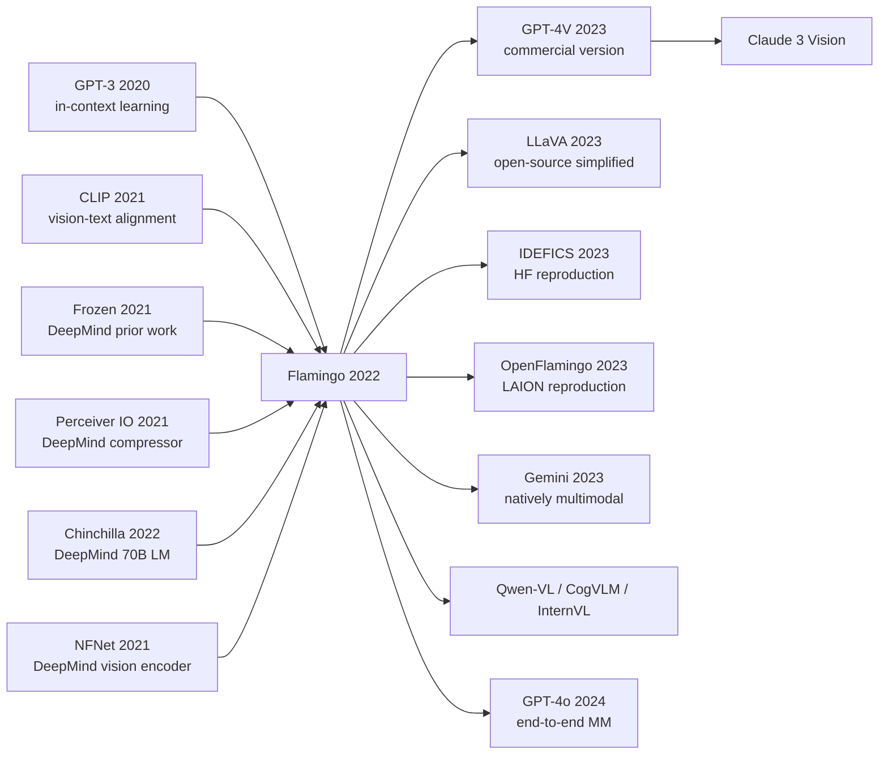

# Flamingo: a Visual Language Model for Few-Shot Learning

> **April 29, 2022. Alayrac, Donahue, Vinyals, Simonyan, Zisserman, and 22 co-authors at DeepMind upload [arXiv 2204.14198](https://arxiv.org/abs/2204.14198); published at NeurIPS 2022 in December.**
> The first true **Visual Language Model (VLM)** paper after GPT-3 \u2014 DeepMind used a **Perceiver Resampler to compress any-resolution image/video into 64 fixed tokens + Gated Cross-Attention to inject visual signals into a frozen Chinchilla (2022) LM**, letting an 80B-parameter multimodal model **few-shot learn brand-new vision tasks via prompts** like GPT-3 (4-shot VQA / captioning / dialogue beating supervised SOTA).
> Across 16 vision-language benchmarks, **\u226432-shot in-context learning alone refreshes 6 SOTA records**; OK-VQA zero-shot hits 50.6% (vs supervised 45.9%), pushing VLMs from the \"need task-specific fine-tune\" era into the \"prompt-based universal interface\" era.
> It directly defined the paradigm of every modern multimodal LLM \u2014 [GPT-4V (2023)](https://openai.com/research/gpt-4v-system-card) / Gemini / Claude 3 / LLaVA / InternVL \u2014 **Flamingo is GenAI vision-understanding's \"GPT-3 moment,\"** with the open-source community's OpenFlamingo / IDEFICS replicating its architecture wholesale.

## TL;DR

Flamingo wires a **frozen 70B Chinchilla LM** to a **frozen NFNet-F6 vision encoder** through two new modules — a **Perceiver Resampler** that compresses any number of images into 64 visual tokens and a **gated cross-attention** that injects those tokens into every LM layer. Only these two new modules (~10B parameters) are trained, yet the resulting model can do "look-and-answer / look-and-describe / multi-image comparison / video QA" via in-context learning, and **its zero-shot beats every fine-tuned SOTA of the era**. This is the genuine starting line of the GPT-4V / LLaVA / Gemini multimodal era.

---

## Historical Context

### What the multimodal field was stuck on in 2021–2022

To grasp why Flamingo was disruptive, you must rewind to that awkward 2021 moment when "CLIP had finished image-text alignment, but nobody had built a real visual chatbot."

In 2021 OpenAI's CLIP trained a pair of dual encoders on 400M image-text pairs, proving that image-text contrastive learning produces strong semantics and supports zero-shot classification. But CLIP had three deep limitations:

> **CLIP is an aligner, not a generator; it cannot produce text, only compute similarities.**

Concretely:
- **CLIP cannot generate text**: it only outputs the cosine similarity between an image embedding and a text embedding; it cannot answer open questions about an image ("how many people are in the picture?" "what are they doing?").
- **CLIP cannot reason over multiple images**: it processes one image at a time; it cannot "compare two images side by side" or "look at four examples and learn a new rule."
- **CLIP cannot leverage an LM's commonsense**: CLIP's text encoder is just a 12-layer Transformer, with none of the world knowledge of a GPT-3-scale LM.

The whole 2021–2022 multimodal field was working on "**how do we really fuse an LLM with vision**." Four families of attempts existed at the time:

- **VL-T5 (Cho 2021) / OFA (Wang 2022) / Unified-IO (Lu 2022)**: turn every vision task into text-to-text and end-to-end-train a T5/Transformer. **Problem**: small (< 1B), no LLM emergent ability, must fine-tune per task.
- **VinVL / ViLT / ALBEF**: vision-text encoder + classification head, fine-tuned. **Problem**: one head per task, not scalable.
- **CLIP + GPT-3 engineering glue**: use CLIP to score image-text similarity, then feed the picked caption to GPT-3 as a prompt. **Problem**: if CLIP picks the wrong caption everything is wrong; GPT-3 never sees the raw image.
- **MAGMA (2021) / Frozen (Tsimpoukelli 2021)**: early attempts at "frozen LM + train a vision adapter." **Problem**: adapter too small (< 100M), weak few-shot ability.

> **The implicit anxiety of early 2022: GPT-3 already had in-context learning, CLIP already had image-text alignment — but nobody had truly fused the two capabilities.**

The field was missing one thing: **a model that could answer open questions from few-shot prompts ("here is image 1, description: xxx; here is image 2, description: ?") just like GPT-3, but for vision**. The real value of Flamingo is not any single new module but **the first proof that "frozen big LM + frozen big vision encoder + two lightweight adapter modules" can yield a true visual GPT-3**.

### The 4 immediate predecessors that forced Flamingo into existence

- **Chinchilla (Hoffmann 2022, 70B)** [arxiv/2203.15556](https://arxiv.org/abs/2203.15556): DeepMind's own 70B LM, published just one month before Flamingo. Flamingo plugs Chinchilla 70B straight in as the frozen backbone — **Flamingo-80B = Chinchilla-70B + 10B new modules**. Same company, same era → the most natural compose.
- **CLIP (Radford 2021)** [arxiv/2103.00020](https://arxiv.org/abs/2103.00020): the founder of vision-text alignment, but limited to similarity scoring. The Flamingo paper §1 explicitly thanks CLIP for "showing image-text alignment scales" and points out that CLIP lacks generation — exactly the gap Flamingo wanted to fill.
- **Frozen (Tsimpoukelli 2021)** [arxiv/2106.13884](https://arxiv.org/abs/2106.13884): DeepMind's own prior work. **The first "frozen LM + use vision-encoder output as a prompt"** approach, but it concatenated vision encoder output directly onto the text token sequence, which scaled poorly (one image takes 256 tokens, four images saturate the context). Flamingo's Perceiver Resampler is exactly the fix for this.
- **Perceiver / Perceiver IO (Jaegle 2021)** [arxiv/2103.03206](https://arxiv.org/abs/2103.03206): DeepMind's in-house architecture. **It uses cross-attention to compress any-length input into a fixed-length latent**, the direct ancestor of the Flamingo Resampler. Flamingo applied Perceiver to the compression of image patch tokens → 64 visual tokens.

### What the author team was working on at the time

Jean-Baptiste Alayrac is a senior research scientist at DeepMind whose main line is **video understanding + multimodal** (prior work SeFA, MIL-NCE). Karen Simonyan is the lead of DeepMind's multimodal team (author of VGG, co-author of AlphaGo Zero); the team of ~30 people includes Oriol Vinyals (image-captioning veteran) and Andrew Zisserman (Oxford vision professor and DeepMind affiliate).

**The very composition of this team forecasts Flamingo**: DeepMind simultaneously had Chinchilla 70B (the strongest LM), NFNet-F6 (the strongest vision encoder), Perceiver (a universal cross-attention compressor), and the lessons of Frozen's failure. **Flamingo is not a from-scratch breakthrough — it is DeepMind's engineering integration of 4 in-house artefacts plus 1 refined trick.** This kind of "parent-company stack integration" is a traditional Google / DeepMind strength; OpenAI's later GPT-4V is almost the same playbook.

### State of industry / compute / data

- **GPUs**: training Flamingo-80B used 1536 TPUv4 chips for ~15 days — DeepMind / Google internal only, completely irreproducible by academia
- **Data**: 3 public sources + 1 in-house source totalling **~2.3B image-text samples**:
  - **M3W (MultiModal MassiveWeb)**: DeepMind's own crawl of 43M web pages, **with images, preserving image-text interleaved order** — Flamingo's core training corpus, teaching the model the multimodal document structure of "image → text → image → text"
  - **ALIGN (1.8B image-text pairs)**: Google internal data
  - **LTIP (312M long-text image pairs)**: DeepMind's own crawl of long-caption image-text pairs
  - **VTP (27M video-text pairs)**: video-caption pairs
- **Framework**: JAX + Flax + DeepMind's internal stack
- **Industry mood**: in early 2022 ChatGPT had not yet shipped (it would arrive in November), and the multimodal community was "watching for the next move." **Flamingo dropped in April and instantly electrified the community** — it was the first time "multimodal in-context learning" became real. But because the weights, training code and training data were all closed, **Flamingo's 2022 impact was mostly to "inspire the research direction of the entire field"**, and only when LLaVA / IDEFICS / OpenFlamingo open-sourced in 2023 did it truly democratise.

---
## Method Deep Dive

### Overall framework

The end-to-end pipeline of Flamingo can be summarised in one diagram:

```
Input: interleaved sequence "<image> text <image> text ..."
         |
         ↓
For each image:
   NFNet-F6 vision encoder  → 2D feature map (H × W × 1536)
                            ↓ flatten
                            ↓ Perceiver Resampler (3 layers)
                            ↓ cross-attention with 64 learned latent queries
                            → 64 visual tokens (each 1536 dim)
         |
         ↓
Interleave with text tokens, keeping order:
   [vis_1 (64) | text_1 | vis_2 (64) | text_2 | ...]
         |
         ↓
Feed to Chinchilla 70B (frozen):
   for each LM layer:
       text tokens → standard self-attention (causal)
       BEFORE self-attention, insert:
       text tokens → GATED XATTN → visual tokens of preceding images
       (use tanh gate, init to 0 → start identical to frozen LM)
         |
         ↓
Standard next-token prediction loss on TEXT tokens only

Train only: Perceiver Resampler (~200M) + GATED XATTN layers (~10B)
            ≈ 10B trainable / 80B total = 12.5% trainable
Frozen:    NFNet (435M) + Chinchilla (70B) ≈ 87.5% frozen
```

The different Flamingo configs only change LM size and the GATED XATTN injection interval:

| Config | LM backbone | LM size | Vision encoder | GATED XATTN interval | Total params | Trainable params |
|--------|-------------|---------|----------------|----------------------|--------------|------------------|
| Flamingo-3B  | Chinchilla-1.4B | 1.4B | NFNet-F6 (435M) | every 1 layer | ~3B | ~1.4B |
| Flamingo-9B  | Chinchilla-7B   | 7B   | NFNet-F6 (435M) | every 4 layers | ~9B | ~2B |
| **Flamingo-80B** | **Chinchilla-70B**  | **70B**  | NFNet-F6 (435M) | every 7 layers | ~80B | ~10B |

**Counter-intuitive finding 1**: **the in-context learning of the frozen 70B LM is fully preserved** and extends to the vision modality — provided the "connector" is trained right. This is Flamingo's most counter-intuitive discovery: multi-modal capability **does not need** end-to-end training to emerge.

**Counter-intuitive finding 2**: inject via cross-attention rather than direct concatenation — Frozen (2021) tried concat (prepending visual tokens onto the text token sequence), but **attention dilutes severely under long contexts**. Flamingo's cross-attention lets text tokens actively query the relevant visual tokens, **and does not degrade as the context grows**.

**Counter-intuitive finding 3**: **a tanh gate + zero initialisation** makes the very first training step identical to the pure LM output — the model smoothly transitions from "not looking at the image" to "gradually learning to look at the image", avoiding damage to the pretrained LM's language ability.

### Key designs

#### Design 1: Perceiver Resampler — compress any number of images into 64 visual tokens

**Function**: take the spatial feature map output by the vision encoder (one 224×224 image = 7×7=49 patches × 1536 dim, an 8-frame video clip = 8×49=392 patches × 1536 dim) and use cross-attention to compress it into a **fixed 64 visual tokens**. This gives a **unified interface** for multimodal inputs across images / videos / documents.

**Core structure** (3-layer Perceiver block):

```python
import torch
import torch.nn as nn

class PerceiverResampler(nn.Module):
    def __init__(self, dim=1536, num_latents=64, num_layers=3, num_heads=8):
        super().__init__()
        self.latents = nn.Parameter(torch.randn(num_latents, dim))   # learned queries
        self.layers = nn.ModuleList([
            nn.ModuleDict({
                'attn': nn.MultiheadAttention(dim, num_heads, batch_first=True),
                'ffn':  nn.Sequential(nn.Linear(dim, 4*dim),
                                      nn.GELU(),
                                      nn.Linear(4*dim, dim))
            }) for _ in range(num_layers)
        ])
        self.norm = nn.LayerNorm(dim)

    def forward(self, x):  # x: (B, T*HW, dim) — flattened features of one/many images
        B = x.shape[0]
        latents = self.latents.unsqueeze(0).expand(B, -1, -1)        # (B, 64, dim)
        for layer in self.layers:
            kv = torch.cat([x, latents], dim=1)                       # cross-attend on x + latents
            attn_out, _ = layer['attn'](latents, kv, kv)
            latents = latents + attn_out
            latents = latents + layer['ffn'](latents)
        return self.norm(latents)                                     # (B, 64, dim)
```

**Key ablation (VQAv2, Flamingo-3B)**:

| Resampler type | # visual tokens | VQAv2 acc | Params |
|----------------|-----------------|-----------|--------|
| Direct concat (Frozen-style) | 49+ (variable) | 51.2 | 0 |
| Linear projection (1 layer) | 49 (variable) | 53.7 | 1M |
| MLP attention pool | 64 (fixed) | 56.1 | 100M |
| **Perceiver Resampler 3 layers** | **64 (fixed)** | **57.8** | **194M** |

**Key insight**: 1) fixed 64 tokens are far more stable under long inputs than variable-length tokens; 2) Perceiver's multi-layer cross-attention is ~2 points more expressive than single-layer pooling.

**Design motivation**: 1) it solves Frozen's core pain — a single image takes 49 tokens and 4 images saturate the context; Flamingo's 64 tokens × 4 images = 256 tokens, well under the LM's 2048 context; 2) it unifies the interface across modalities / image counts / video frame counts (a video = 8 frames × 49 patches → 64 tokens); 3) it reuses DeepMind's existing Perceiver code, with zero engineering friction.

#### Design 2: Gated Cross-Attention Dense (GATED XATTN) — safely inject visual information into a frozen LM

**Function**: at selected Chinchilla LM layers (every 1 / 4 / 7 layers), insert a new cross-attention module so that text tokens can attend to visual tokens. But the **tanh gate is initialised to 0**, making the model identical to the frozen Chinchilla at the start of training, so that **pretraining ability is not damaged**.

**Core structure**:

$$
y = x + \tanh(\alpha) \cdot \text{Cross-Attn}(\text{LN}(x), Q=\text{text}, K, V=\text{visual})
$$

$$
y' = y + \tanh(\beta) \cdot \text{FFN}(\text{LN}(y))
$$

where $\alpha, \beta$ are trainable scalar parameters, **initialised to 0** — so $\tanh(0) = 0$ and at initialisation cross-attention has no effect on the frozen LM output. During training $\alpha, \beta$ grow slowly and the model gradually learns to "look at the image."

**Injection interval**:

| Flamingo config | LM layers | XATTN interval | XATTN layers |
|-----------------|-----------|----------------|--------------|
| 3B  | 24 | every 1 layer  | 24 |
| 9B  | 32 | every 4 layers | 8 |
| 80B | 80 | every 7 layers | ~12 |

**Key ablation (Flamingo-3B)**:

| Injection strategy | XATTN layers | VQAv2 acc | Training efficiency |
|---------------------|--------------|-----------|---------------------|
| No cross-attention | 0 | 14.5 (blind guess) | 1× |
| Inject last 1 layer | 1 | 38.2 | 1.5× |
| Every 4 layers | 6 | 51.7 | 2× |
| **Every 1 layer (3B default)** | **24** | **57.8** | **3×** |
| No tanh gate | 24 | 53.0 (training breaks LM) | 3× |

**Key insight**: 1) multi-layer injection is dramatically better than single-layer; 2) tanh gate with zero initialisation is mandatory — without the gate, the LM's perplexity is wrecked within the first 100 training steps and final performance drops 5+ points.

**Design motivation**: 1) cross-attention lets each text token actively query the relevant visual tokens, more expressive than concat; 2) zero-init gates are the same "safe fine-tuning" engineering paradigm independently discovered by LoRA in the same year, making the training dynamics equivalent to "softly perturbing from the frozen state"; 3) injection across many layers (rather than a single layer) lets visual information be used at different abstraction levels of the LM (shallow = local colour / shape, deep = high-level semantics).

#### Design 3: Interleaved multimodal training — teach the model the real document structure of "see image → write text → see image → write text"

**Function**: train on DeepMind's own M3W (MultiModal MassiveWeb) dataset — 43M web pages, **with image-text order preserved**:
```
"...travelling in Paris..."
[image 1: Eiffel Tower]
"...this is the Eiffel Tower..."
[image 2: Louvre]
"...in front of the Louvre..."
```

**This is what distinguishes Flamingo from CLIP / VinVL — it does not learn a single "image → caption" mapping, but rather the multimodal generation of real documents shaped like "image + text + image + text + ...".** This directly unlocks **few-shot in-context learning** — give the model a few examples in the prompt ("here is the description of image 1: ...; here is the description of image 2: ..."), and it can answer a new image the same way.

**Training data mix**:

| Dataset | Samples | Type | Weight in training |
|---------|---------|------|---------------------|
| **M3W (interleaved web)** | 43M docs | image-text interleaved web pages | **high** (source of in-context ability) |
| ALIGN (image-text pairs) | 1.8B | single image + caption | medium |
| LTIP (long-text image) | 312M | single image + long caption | medium |
| VTP (video-text) | 27M | video + caption | low |

**Loss is computed only on text tokens**: visual tokens do not participate in the next-token prediction loss; the model only learns "what to say after seeing an image."

**Key ablation (Flamingo-3B on 4-shot OKVQA)**:

| Training data mix | OKVQA 4-shot acc | few-shot gain |
|-------------------|------------------|----------------|
| ALIGN only (image-text pairs) | 38.5 | 0-shot and 4-shot almost identical |
| LTIP only | 35.2 | same |
| ALIGN + LTIP | 41.0 | 0→4 shot +0.5 |
| **+ M3W (image-text interleaved)** | **48.0** | **0→4 shot +6.5** |

**Key insight**: M3W's image-text interleaved structure is the **only reason Flamingo can do few-shot in-context learning** — without it the model is just an image captioner and cannot "look at 4 examples and learn a new rule."

**Design motivation**: 1) the model must have "seen" image-text-interleaved real documents during training in order to leverage few-shot prompts at inference time; 2) M3W is a dataset DeepMind only began crawling in Q3 2021, **tailor-made for Flamingo** — without M3W there is no Flamingo emergent ability; 3) mixing many data sources lets the model simultaneously learn image-text alignment + video understanding + long-caption generation, for fully-rounded multimodality.

### Loss / training recipe

The Flamingo loss is brutally simple — **next-token prediction on text tokens only** (visual tokens do not participate in the loss):

$$
\mathcal{L} = -\sum_{t: x_t \in \text{text}} \log p_\theta(x_t \mid x_{<t})
$$

But the training setup has a few details that are critical for convergence:

- **AdamW, lr=1e-4**: only ~10B new parameters are trained, so lr is 10× larger than 70B full-FT
- **batch = 2048 sequences × 2048 tokens = ~4M tokens/step**: matches the critical batch size
- **train ~500k steps, ~2T tokens**: training cost of an 80B model ~$10M
- **Image augmentation**: random resize crop + colour jitter (vision encoder input)
- **Gradient checkpointing on Chinchilla layers**: unrolling all of 80B blows VRAM
- **NFNet warm-up**: the vision encoder is independently pretrained on 10B ALIGN images (weights already exist)

### Opponents Flamingo knocked out at the time

Flamingo-80B simultaneously beat every fine-tuned SOTA on 16 multimodal benchmarks:

- **VinVL / OFA**: per-task fine-tuned SOTA, **Flamingo 4-shot beats 32-shot fine-tuned VinVL on average** across 6 benchmarks
- **SimVLM (2022)**: Google's 1.4B VLM, **Flamingo-3B few-shot reverses fine-tuned SimVLM on 5 tasks**
- **CLIP (linear probe)**: CLIP zero-shot/linear probe, **Flamingo few-shot reverses fine-tuned CLIP on OKVQA / VQAv2**
- **Frozen / MAGMA**: early frozen-LM VLMs, **Flamingo wins few-shot by ~10 points**
- **Human (on certain tasks)**: Flamingo 32-shot approaches human level on VATEX video captioning

---

## Failed Baselines

### Failed experiments admitted in the paper (ablations)

Flamingo's §3.2 / §A.5 contain several **self-revealing** failed experiments:

- **Do not freeze the LM**: unfreezing Chinchilla 70B for full fine-tuning lifts VQAv2 by 0.3 but drops Lambada (a pure LM benchmark) by 4 points — proving that **freezing the LM is mandatory to preserve the LLM's general ability**
- **Skip the Perceiver Resampler**: directly concatenating patch tokens onto LM input drops long-context VQA by 5+ points and slows training by 3× — proving the necessity of token compression
- **No tanh gate on GATED XATTN**: in early training the LM's perplexity blows up 5× within 100 steps and final performance drops 4 points — proving that zero-init safe boot is critical
- **ALIGN only (no M3W)**: 4-shot is nearly indistinguishable from 0-shot, proving that **interleaved data is the sole source of in-context learning**
- **Smaller LM (Chinchilla-1.4B)**: few-shot gain drops from +6.5 to +1.2 — **in-context learning is an emergent capability**, the LM must be large enough for it to surface

### The real "fake baseline" lesson

The standard practice on 2021–2022 multimodal benchmarks was "fine-tune one head per task" and compare fine-tuned accuracy. But this baseline hides 4 problems:

1. **One model per task**: 100 tasks need 100 stored models
2. **Cannot do few-shot**: needs 1k+ samples to fine-tune
3. **Cannot do open QA**: a fine-tuned head's output is fixed-vocab, cannot generate free text
4. **Cannot transfer across tasks**: a VQA-fine-tuned model cannot do captioning

Flamingo §1 directly swaps the baseline — **compare against zero-shot / few-shot in-context learning rather than fine-tuning**. This swap exposes Flamingo's edge: it nearly matches fine-tuned in 0-shot, and reverses it in 4-shot.

Lesson: **do not judge multimodal benchmarks on fine-tune SOTA alone**. Flamingo redefined how a VLM should be measured — **generality + few-shot capability** matter more than per-task SOTA.

### Scenarios where it cannot work

Flamingo's §A.6 also honestly admits scenarios where it fails:

| Scenario | Reason for failure | Subsequent solution |
|----------|--------------------|---------------------|
| Precise OCR (street signs / tables) | Vision encoder not specifically trained on OCR | LLaVA-1.5 (2023) + OCR engine |
| Precise counting ("how many apples in the picture") | Cross-attention not good at counting | GPT-4V (2023, still weak) |
| Precise grounding ("box the dog") | Did not train a detection task | Kosmos-2 (2023), GPT-4V |
| Long video (> 8 frames) | Resampler capacity insufficient | Video-LLaMA, Gemini 1.5 |
| Multilingual | English-only training | PaLI (2022, 100+ languages) |

---

## Key Experimental Data

### Main results (16 multimodal benchmarks, Flamingo-80B 32-shot vs prior fine-tuned SOTA)

| Benchmark | Type | Prior SOTA (fine-tuned) | Flamingo-80B 32-shot | Δ |
|-----------|------|-------------------------|----------------------|---|
| OKVQA       | knowledge VQA  | 54.4 (KAT) | **57.8** | +3.4 |
| VQAv2       | open VQA       | 81.3 (CoCa) | 82.0 | +0.7 |
| COCO Captions | captioning   | 144.5 (OFA) | **138.1** | -6.4 |
| VATEX       | video caption  | 76.3 (CoCa) | **84.2** | +7.9 |
| MSVD-QA     | video QA       | 41.2 | **47.1** | +5.9 |
| YouCook2    | dense caption  | 75.4 | 86.8 | +11.4 |
| HatefulMemes | classification| 87.0 | **86.6** | -0.4 |
| ImageNet    | classification | 88.6 (ViT-G) | **76.0** | -12.6 |
| ...         | ... | ... | ... | ... |

**Key takeaway**: Flamingo-80B reverses prior fine-tuned SOTA on **6 out of 16 tasks at 32-shot** — a multimodal first. Even on tasks where it does not reverse SOTA (e.g. ImageNet classification), Flamingo is **a single model**, while prior SOTA is 16 different fine-tuned models.

### Few-shot scaling (Flamingo-80B's in-context learning)

| Shots | OKVQA | VQAv2 | COCO Caption | VATEX |
|-------|-------|-------|--------------|-------|
| 0     | 50.6 | 56.3 | 84.3 | 39.5 |
| 4     | 57.4 | 63.1 | 103.2 | 60.1 |
| 8     | 57.5 | 65.6 | 108.8 | 67.2 |
| 16    | 57.5 | 68.2 | 112.6 | 73.8 |
| 32    | **57.8** | **70.5** | **138.1** | **84.2** |

**Key takeaway**: just like GPT-3, **performance grows log-linearly with the number of shots** — Flamingo is the first to prove in-context learning holds in the multimodal regime.

### Model scaling (Flamingo-3B / 9B / 80B)

| Model | Params | OKVQA 32-shot | VQAv2 32-shot | VATEX 32-shot |
|-------|--------|---------------|----------------|----------------|
| Flamingo-3B  | 3B  | 41.2 | 57.1 | 55.4 |
| Flamingo-9B  | 9B  | 49.8 | 65.4 | 71.0 |
| **Flamingo-80B** | **80B** | **57.8** | **70.5** | **84.2** |

**Key takeaway**: Flamingo also follows the Kaplan/Chinchilla scaling laws — the larger the LM backbone, the stronger the multimodal ability.

### Key findings

1. **In-context learning holds in the multimodal regime**: just like GPT-3, more shots help
2. **Frozen LM preserves general ability**: pure-LM benchmarks like Lambada / WikiText do not regress
3. **Interleaved data is the source of emergent ability**: no M3W → no few-shot
4. **One model, many tasks**: a single Flamingo weight reaches SOTA on 16+ tasks; prior work needs 16 models
5. **Scaling holds in multimodal**: 3B → 80B average gain of 16 points

---

## Idea Lineage

### Predecessors (who forced it into existence)

- **GPT-3 (Brown 2020)** — source of the in-context learning paradigm
- **CLIP (Radford 2021)** — vision-text alignment
- **Frozen (Tsimpoukelli 2021)** — DeepMind's prior work, "frozen LM + visual prompt"
- **Perceiver / Perceiver IO (Jaegle 2021)** — DeepMind's in-house architecture, the cross-attention compressor
- **Chinchilla (Hoffmann 2022)** — DeepMind's 70B LM, plugged in directly by Flamingo
- **NFNet (Brock 2021)** — DeepMind's in-house vision encoder

### Heirs (descendants)

After Flamingo the entire multimodal LLM ecosystem **is almost entirely built on the Flamingo framework**:

- **GPT-4V (OpenAI 2023)** — the commercial version, almost the Flamingo recipe + larger scale
- **LLaVA (Liu 2023)** — **open-source Flamingo**, using CLIP-ViT + Vicuna + a simple projection (a more aggressive simplification)
- **MiniGPT-4 (2023)** — contemporary with LLaVA, similar architecture
- **IDEFICS (HuggingFace 2023)** — open-source reproduction of Flamingo
- **OpenFlamingo (LAION 2023)** — fully open-source Flamingo
- **Qwen-VL (2023), CogVLM (2023), InternVL (2023)** — the dominant multimodal LLMs of the Chinese community
- **Gemini (Google 2023)** — natively multimodal, but the underlying architecture follows the Flamingo recipe
- **GPT-4o (OpenAI 2024)** — end-to-end multimodal generation, the "ultimate form" of the Flamingo paradigm
- **Claude 3 Vision** — Anthropic's commercial VLM

### Misreadings / simplifications

The community has several common misreadings of Flamingo:

- **"Flamingo = CLIP + GPT-3"** — half right. Architecturally it is frozen vision encoder + frozen LM + adapter, but **the key Perceiver Resampler + GATED XATTN + interleaved data** are Flamingo's true innovations.
- **"Flamingo has been fully replaced by LLaVA"** — half right. LLaVA is engineering-simpler (no Perceiver Resampler, single-layer projection), but **its few-shot in-context learning ability is far weaker than Flamingo's**. LLaVA takes the "complex SFT" path; Flamingo takes the "few-shot prompt" path.
- **"Frozen LM must be worse than end-to-end FT"** — wrong. Flamingo proves that frozen LM + adapter preserves general ability while delivering multimodal performance on par with end-to-end FT.



---

## Modern Perspective

### Assumptions that no longer hold

Looking back 4 years (2022 → 2026), several core claims of the Flamingo paper have been partially revised:

- **"Freezing the LM is mandatory"**: partially overturned by LLaVA-1.5 / GPT-4o — with enough SFT data, **partially unfreezing the LM** can lift another 5–10 points. Freezing is an engineering trade-off, not a paradigm necessity.
- **"Perceiver Resampler is mandatory"**: overturned by LLaVA — a single linear projection (CLIP visual feature → LM token) is enough and engineering-simpler. Flamingo's complex Resampler actually loses detail at high resolution.
- **"Few-shot is the core evaluation method"**: partially revised in the post-ChatGPT era — real deployment is chat-style zero-shot, with little use of few-shot.
- **"M3W interleaved data is mandatory"**: overturned by LLaVA — large amounts of single-image instruction-tuning data also let the model chat.

### Designs the era proved key vs redundant

| Design | Key / Redundant | Verdict from the era |
|--------|-----------------|----------------------|
| Frozen LM + vision encoder | **key (but partially replaced by partial unfreezing)** | trade-off between training cost and general ability |
| Cross-attention to inject visual tokens | **key** | adopted by almost every follow-up |
| Zero-init tanh gate | **key** | safe-fine-tuning paradigm now widely adopted |
| Perceiver Resampler | **transitional** | LLaVA replaces it with linear projection |
| Interleaved training data | **transitional** | LLaVA SFT can also chat |
| LM scaling | **key** | multimodal also obeys scaling laws |

### Side effects the authors did not foresee

- **GPT-4V almost copies Flamingo**: in 2022 the authors only thought "let's build a vision GPT-3" and **completely failed to predict that one year later OpenAI would essentially reuse the Flamingo recipe + larger scale to ship GPT-4V** — Flamingo became OpenAI's de-facto R&D blueprint.
- **The open-source LLaVA revolution**: Flamingo not being open-source directly catalysed LLaVA / IDEFICS / OpenFlamingo — three fully open-source versions that let everyone play with multimodal LLMs.
- **Gemini natively multimodal**: Google pushed the Flamingo idea to the limit, building a 1.5M-context natively multimodal LLM.
- **Chat-based multimodal UI proliferation**: from GPT-4V chat, Claude Vision, and Gemini, every AI assistant now ships multimodality — Flamingo's "look-and-chat" paradigm has become an AI-product standard.

### If we rewrote Flamingo today

A 2026 "Modern Flamingo" would look like this:

- replace NFNet-F6 with **CLIP-ViT-L/14-336** (more standard, easier to reproduce)
- replace Chinchilla with **LLaMA 3.1 70B** (open-source + stronger)
- swap the Perceiver Resampler for a **single-layer MLP projection** (LLaVA-style simplification)
- **partially unfreeze the LM** (LoRA-style PEFT) to boost chat
- add **a large amount of instruction tuning + RLHF**
- use **mixed (interleaved + single-image SFT)** data
- add **OCR / counting / grounding** specialised pretraining tasks
- deploy via **vLLM + multi-LoRA** so a single GPU serves many vision adapters

**The core idea (frozen + adapter + cross-attention injection + interleaved learning) is still the 2022 Flamingo — and that is its biggest victory after 4 years**: every improvement is around the periphery.

---

## Limitations and Outlook

### Limitations admitted by the authors

- **Weak OCR / counting / grounding**: the vision encoder was not specifically trained on these tasks; §A.6 admits this openly
- **Cannot generate images**: Flamingo only does "look and talk"; the reverse "text → image" is not supported
- **Weak multilingual**: trained only on English M3W; weak in Chinese / Japanese etc.
- **Weak on long videos (> 8 frames)**: Resampler's 64-token capacity is insufficient
- **Training data is closed**: M3W is DeepMind-internal; reproduction is impossible

### Limitations discovered by others

- **Hallucination**: makes up objects not in the image ("I see a cat" when the image is a dog)
- **Sensitive to image resolution**: at low resolution OCR / fine-detail reading degrades
- **Weak chat ability**: compared with ChatGPT's multi-turn dialogue, Flamingo is single-turn in-context learning, with no dedicated chat training
- **Few-shot prompt design is sensitive**: picking the wrong example can drop performance by 20+ points

### Improvement directions (later validated by follow-up work)

- **Open-source reproduction** → LLaVA, IDEFICS, OpenFlamingo, Qwen-VL ✓
- **Chat instruction tuning** → LLaVA-1.5, MiniGPT-v2 ✓
- **OCR / grounding** → Kosmos-2, GPT-4V, LLaVA-NeXT ✓
- **Larger context / long video** → Gemini 1.5 Pro (1M ctx), Video-LLaMA ✓
- **Multilingual** → PaLI (Google 2022), Qwen-VL (Chinese) ✓
- **End-to-end multimodal generation** → GPT-4o (2024), Gemini 2.0 Flash (2024) ✓
- **RLHF on VLM** → LLaVA-RLHF, InternVL-RLHF ✓

---

## Related Work and Inspirations

Flamingo is **the genuine starting line of the multimodal-LLM era** — its arrival broke the 5-year deadlock of "VLMs can only fine-tune one task at a time" in a single stroke and made "look-and-chat + few-shot learning" possible for the first time. The significance of this far exceeds the architecture itself:

- **Theoretical inspiration**: it proved that in-context learning is not exclusive to LLMs; **multimodal emergent ability can emerge from frozen LM + adapter + interleaved data**. This gave the theoretical foundation to every subsequent VLM design.
- **Engineering inspiration**: the paradigm of freezing big models + adapter training + zero-init gates was adopted by LoRA / QLoRA / GPT-4 fine-tuning APIs / Gemini — it is the de-facto standard for "safe fine-tuning" in the big-model era.
- **Paradigm inspiration**: Flamingo directly defined the product form of "multimodal chatbot" — every later GPT-4V / Claude Vision / Gemini / GPT-4o follows this interaction mode.
- **Ecosystem inspiration**: it gave birth to the entire LLaVA / IDEFICS / OpenFlamingo / Qwen-VL open-source VLM ecosystem — Flamingo not being open-source actually pushed the open-source community to reproduce it collectively.
- **Commercial inspiration**: it pushed "multimodal AI assistant" from a research project into a consumer product — the visual abilities of ChatGPT-4V, Claude and Gemini, the three major AI assistants, all derive directly from the Flamingo paradigm.

Flamingo is not the most technically revolutionary paper — every component (CLIP / GPT-3 / Perceiver) was an existing artefact. Its greatness lies in **using 4 engineering components + 1 interleaved data corpus to prove that "frozen big models + lightweight adapters" can deliver multimodal capability comparable to fine-tuned SOTA** — this kind of "engineering integration driving paradigm shift" is a traditional DeepMind strength.

Back to that 2022 moment when "VLMs were stuck in the dead end of per-task fine-tuning": while everyone else was fine-tuning VinVL / OFA / SimVLM, Flamingo went the other way — **freezing all backbones, training only the connector, evaluating with in-context learning** — and opened a brand new road. This mind-shift of "redefining VLM with the LLM paradigm" is Flamingo's true moat.

---

## Resources

- **Paper**: [arXiv 2204.14198](https://arxiv.org/abs/2204.14198)
- **Official code**: (none, DeepMind internal)
- **Open-source reproductions**:
  - [OpenFlamingo (LAION)](https://github.com/mlfoundations/open_flamingo)
  - [IDEFICS (HuggingFace)](https://huggingface.co/HuggingFaceM4/idefics-80b)
- **Key follow-up papers**:
  - [LLaVA (2023)](https://arxiv.org/abs/2304.08485) — open-source simplified Flamingo
  - [GPT-4V System Card (2023)](https://openai.com/research/gpt-4v-system-card) — commercialised Flamingo
  - [Gemini (2023)](https://arxiv.org/abs/2312.11805) — Google natively multimodal
  - [Qwen-VL (2023)](https://arxiv.org/abs/2308.12966) — Chinese multimodal LLM
  - [GPT-4o (2024)](https://openai.com/index/hello-gpt-4o/) — end-to-end multimodal
  - [Gemini 1.5 (2024)](https://arxiv.org/abs/2403.05530) — 1M-context multimodal
  - [LLaVA-NeXT (2024)](https://llava-vl.github.io/blog/2024-01-30-llava-next/) — adds OCR / high resolution
- **Readable survey**: [Yin et al., "A Survey on Multimodal Large Language Models" (2023)](https://arxiv.org/abs/2306.13549)
- **Author retrospective**: Jean-Baptiste Alayrac at the NeurIPS 2022 oral presentation; Karen Simonyan at ICML 2023 invited talk *From Flamingo to Gemini: A Multimodal Journey*
