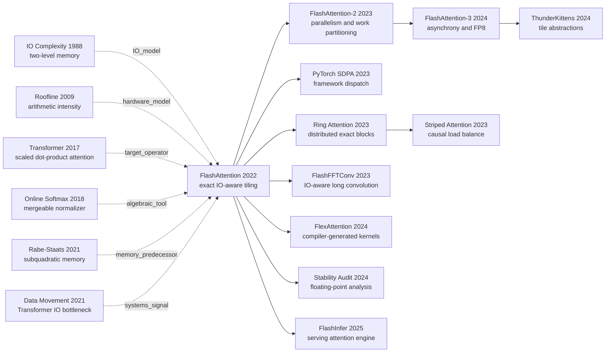

# FlashAttention: Faster Attention Without Dropping a Single Interaction

> **On May 27, 2022, Tri Dao, Daniel Y. Fu, Stefano Ermon, Atri Rudra, and Christopher Ré posted [FlashAttention (arXiv:2205.14135)](https://arxiv.org/abs/2205.14135); it appeared at NeurIPS 2022 later that year.** Most long-sequence work was trying to evaluate fewer token pairs. FlashAttention kept every one of the $N^2$ interactions and deliberately recomputed attention tiles during backward. It won by refusing to shuttle the $N\times N$ score and probability matrices through GPU HBM. In the paper's Figure 2, recomputation raises work from 66.6 to 75.2 GFLOPs, yet cuts HBM traffic from 40.3 GB to 4.4 GB and runtime from 41.7 ms to 7.3 ms. That counterintuitive trade changed the question from “how many operations does the model require?” to “where do its bytes travel through the memory hierarchy?”

## TL;DR

FlashAttention, published at NeurIPS 2022 by Tri Dao, Daniel Y. Fu, Stefano Ermon, Atri Rudra, and Christopher Ré, does not approximate or prune the scaled dot-product attention introduced by the [Transformer](/en/era3_attention/2017_transformer/): $O=\operatorname{softmax}(QK^\top/\sqrt d)V$. It tiles the computation across HBM and on-chip SRAM, merges exact online-softmax statistics, and recomputes score tiles during backward so the $N\times N$ score and probability matrices exist only transiently on chip. In the paper's GPT-2-medium experiment in Figure 2, standard attention moves 40.3 GB through HBM and takes 41.7 ms; FlashAttention performs more arithmetic, 75.2 rather than 66.6 GFLOPs, but moves only 4.4 GB and finishes in 7.3 ms. This resolves the failure of two earlier routes: Reformer, Linformer, and Performer reduce asymptotic FLOPs by changing or approximating the operator, while Rabe and Staats preserve exact attention with low auxiliary memory but do not arrange IO for a speedup. [FlashAttention-2](https://arxiv.org/abs/2307.08691) subsequently attacks occupancy and warp work partitioning, and [FlashAttention-3](https://arxiv.org/abs/2407.08608) restructures the pipeline around H100's asynchronous TMA/WGMMA units and an explicitly low-precision FP8 path. The durable lesson is not that quadratic complexity is irrelevant. Complexity describes how work grows; wall-clock time also depends on which hardware unit performs each operation and how often every byte crosses the memory hierarchy.

---

## Historical Context

### What was long-sequence research stuck on in 2022?

The 2017 [Transformer](https://arxiv.org/abs/1706.03762) writes one attention head as $S=QK^\top$, $P=\operatorname{softmax}(S)$, and $O=PV$. The construction is parallel and effective, but doubling sequence length from $N$ to $2N$ quadruples both matrix products and the intermediate attention matrices. By 2020, this constraint had produced an entire “efficient Transformer” literature. [Reformer](https://arxiv.org/abs/2001.04451) used locality-sensitive hashing for $O(N\log N)$ complexity; [Longformer](https://arxiv.org/abs/2004.05150) retained local windows and a few global connections; [Linformer](https://arxiv.org/abs/2006.04768) projected under a low-rank assumption; and [Performer](https://arxiv.org/abs/2009.14794) approximated the softmax kernel with random features. Each answered a model-level question: can the system evaluate or retain fewer token pairs?

Yet fewer asymptotic FLOPs do not automatically produce a faster GPU program. FlashAttention's introduction observes that many approximation methods had not delivered wall-clock gains over standard attention because FLOP counts omitted memory access, layout, and kernel-launch overhead. Dense GEMM was already exceptionally optimized for Tensor Cores and library kernels. Masking, softmax, and dropout, by contrast, are elementwise or reduction operations that are often constrained by HBM bandwidth. An algorithm can remove multiply-adds and still lose if it introduces irregular access, extra projections, or many small kernels.

In December 2021, Markus Rabe and Charles Staats sharpened the distinction with [Self-attention Does Not Need $O(n^2)$ Memory](https://arxiv.org/abs/2112.05682). Attention could retain $O(N^2)$ time while avoiding $O(N^2)$ auxiliary device memory; their practical algorithm used $O(\sqrt N)$ memory and ran within a few percent of standard attention. This result established that materializing the complete attention matrix was not mathematically necessary. It also left the systems question open: how can an implementation reduce slow-memory traffic, rather than capacity alone, enough that recomputation becomes faster? FlashAttention starts from that question.

### Five lines of work that directly prepared FlashAttention

The first is classical IO complexity. Aggarwal and Vitter's 1988 [two-level memory model](https://doi.org/10.1145/52325.52327) counts transfers between fast and slow storage rather than arithmetic operations alone. FlashAttention instantiates that model with on-chip GPU SRAM and HBM, then expresses IO as a function of SRAM capacity $M$.

The second is the [Roofline model](https://doi.org/10.1145/1498765.1498785). Its arithmetic intensity, operations performed per byte moved, separates compute-bound from memory-bound workloads. FlashAttention does not reject FLOPs; it puts softmax attention back on both axes. Matrix multiplication can saturate Tensor Cores while softmax and intermediate-tensor movement hit the bandwidth roof first.

The third is Milakov and Gimelshein's 2018 [online softmax normalizer](https://arxiv.org/abs/1805.02867). Stable softmax appears to require an entire row before its maximum is known. The online algorithm shows that blocks can be merged exactly by retaining a running maximum $m$ and exponential sum $\ell$. That recurrence is the algebraic key that lets FlashAttention consume $QK^\top$ tile by tile without changing the final softmax.

The fourth is Rabe and Staats's exact low-memory attention. They had already combined tiling and recomputation to avoid retaining the whole matrix. FlashAttention Appendix B.5 states the distinction precisely: their primary objective was peak capacity, with runtime near or slightly behind standard attention; FlashAttention changes loop order, updates the output incrementally, and derives a more direct backward pass to minimize HBM traffic as well.

The fifth comes from the same group's repeated encounters with structured matrices. [Scatterbrain](https://arxiv.org/abs/2110.15343) combined sparse and low-rank approximation, while [Pixelated Butterfly](https://arxiv.org/abs/2112.00029) and [Monarch](https://arxiv.org/abs/2204.00595) confronted the gap between theoretical sparsity and hardware speed. FlashAttention takes a more conservative but broadly applicable route: preserve the model and optimize an equivalent execution plan first.

### The team and its systems-research trajectory

The paper lists five authors from Stanford University and the University at Buffalo, SUNY. Tri Dao, Daniel Y. Fu, Stefano Ermon, Atri Rudra, and Christopher Ré brought three perspectives that were often treated separately: machine-learning semantics, algorithmic IO analysis, and CUDA scheduling. The implementation did not emerge from a blank file. Appendix E.4 says that the team began from NVIDIA Apex FMHA. FMHA already fused masking, softmax, dropout, and $PV$ into one kernel and was a strong short-sequence BERT implementation, but it still wrote the post-softmax attention matrix to HBM for backward.

The decisive choice was to refuse a boundary between “algorithm paper” and “kernel engineering.” Theorem 1 proves that blockwise online updates return full softmax attention. Theorem 2 derives $\Theta(N^2d^2/M)$ HBM accesses. The CUDA implementation then varies block size and measures how HBM traffic and runtime move together. The proof is not decoration for the implementation, and profiling is not an appendix to the proof: together they determine what remains in SRAM, which row statistics deserve an HBM write, and which intermediates are cheaper to recompute.

That approach also explains why block-sparse FlashAttention is an extension rather than the main algorithm. The central result first establishes an exact primitive with no semantic trade. Only when a user explicitly selects a fixed butterfly sparsity pattern does the implementation skip zero tiles and become approximate. Keeping that boundary explicit is why the paper has aged as more than a report that one CUDA kernel happened to run faster.

### The contemporary GPU, framework, and implementation boundary

FlashAttention uses Ampere A100 as its principal experimental platform. The hierarchy reported by the paper explains the design. HBM is capacious but comparatively slow; each SM owns tiny SRAM that is about an order of magnitude faster. The goal is not to fit an $N\times N$ matrix on chip. It is to choose a tile that simultaneously holds $Q_i,K_j,V_j,S_{ij}$ and running statistics, then complete GEMM, mask, softmax, dropout, and the second GEMM while that tile is resident.

| Hierarchy or unit | A100 state reported by FA1 | Algorithmic consequence |
|---|---:|---|
| HBM | 40-80 GB at 1.5-2.0 TB/s | Large capacity, but avoid writing $N\times N$ intermediates |
| SRAM per SM | 192 KB across 108 SMs | Tiles must be small; $d$ and $M$ jointly constrain shape |
| On-chip SRAM bandwidth | estimated around 19 TB/s | Additional on-chip arithmetic can beat repeated HBM access |
| Tensor Core / GEMM | dense matrix multiplication is highly optimized | Preserve regular block GEMMs rather than minimize FLOPs alone |
| PyTorch / TensorFlow interface | little direct control over HBM/SRAM residency | The paper needs handwritten CUDA and cross-operation fusion |

The framework ecosystem also shaped the result. Standard PyTorch attention exposes $QK^\top$, softmax, dropout, and $PV$ as separate operations; each boundary can force an intermediate into HBM. Compilers could fuse some elementwise operations, but default autodiff still expected saved activations for backward. FlashAttention therefore uses one handwritten fused kernel and retains only $O$, $m$, $\ell$, and random-generator state. That decision buys speed while creating portability and programmability costs, which Section 5 explicitly lists as limitations.

## Background and Motivation

### Why quadratic arithmetic was not the whole bottleneck

Standard attention genuinely performs $O(N^2d)$ arithmetic; software cannot erase that term for sufficiently long sequences. FlashAttention makes a narrower claim: on a real GPU, **wall-clock time is not a function of FLOPs alone**. A large GEMM can execute at high throughput on specialized units, while writing a huge matrix to HBM, reading it for softmax, and writing it again can leave those units waiting. Two implementations with the same asymptotic arithmetic, or even one with more FLOPs, can therefore have very different runtimes.

Figure 2 is the cleanest demonstration: GPT-2 medium, sequence 1024, head dimension 64, 16 heads, batch 64, on A100. Standard attention performs 66.6 GFLOPs, moves 40.3 GB through HBM, and takes 41.7 ms. FlashAttention's backward recomputation raises arithmetic to 75.2 GFLOPs, yet HBM traffic falls to 4.4 GB and runtime to 7.3 ms. The experiment does not show that FLOPs never matter. It shows that, under this protocol, eliminating roughly nine-tenths of HBM traffic is worth more than a roughly 13% arithmetic increase.

This distinction explains the awkward position of approximate attention in 2022. Linformer and Performer offer lower asymptotic complexity, but projections, random features, irregular access, and smaller matrices may fail to use peak GPU throughput. Figure 3 reports that some approximations cross below dense FlashAttention in runtime beyond sequence lengths around 512-1024; at shorter lengths, FlashAttention can remain faster. The conclusion is a performance envelope, not a rejection of complexity theory.

### How the HBM/SRAM hierarchy changes the execution plan

In a standard implementation, intermediates live for a long time: write $S=QK^\top$ to HBM, read $S$ for softmax and write $P$, then read $P$ and $V$. Backward still needs $P$, so ordinary autodiff tends to retain it. FlashAttention asks whether $S_{ij}$ and $P_{ij}$ ever need to leave the SM that creates them. If a tile immediately contributes to the local-softmax state and the $PV$ accumulator, they do not.

The optimal plan shifts from “call an efficient kernel for each mathematical operator” to “reorder the compound operator around data residency.” After $K_j,V_j$ move from HBM to SRAM, the kernel visits blocks $Q_i$ and writes back only updated output blocks and two row statistics. Larger $M$ permits a larger key/value tile and fewer passes over $Q$; a tile that exceeds SRAM or register budgets cannot execute. The $M$ in Theorem 2 explicitly encodes this physical constraint in the complexity statement.

### Exact and approximate attention are orthogonal design axes

“Exact” in this paper means **the mathematical operator is unchanged**: for the same $Q,K,V$, mask, dropout random state, and real arithmetic, the algorithm returns $\operatorname{softmax}(QK^\top)V$ without low-rank projection, hashed edge removal, or a local window. It does not promise bitwise identity under reordered floating-point reductions, and it does not describe FA3's FP8 path. Preserving this boundary prevents “exact model semantics” from being misreported as “zero numerical difference.”

Approximation attacks another axis. If the model may alter its interaction graph or kernel, arithmetic can become linear or near-linear. FlashAttention attacks execution: given the interactions to be evaluated, move their data fewer times. The two can be composed, as the original block-sparse FlashAttention demonstrates. Its leading IO term shrinks with nonzero-block fraction $s$, but its result is then approximate relative to dense attention. Later work such as Ring Attention distributes the exact blockwise reduction across devices, while FlexAttention generates fused kernels for custom masks and score modifications. Both reinforce the separation between what is computed and how it is scheduled.

---

## Method Deep Dive

### Overall framework: full attention that never lands in HBM

FlashAttention accepts the same $Q,K,V$ as ordinary scaled dot-product attention. The distinction is not in model parameters or input-output semantics, but in the lifetime of intermediate objects. A standard implementation separates “GEMM 1 → softmax → GEMM 2” into kernels and therefore writes $S$ and $P$ as complete boundary tensors in HBM. FlashAttention reorders the loops around tiles: move a block $K_j,V_j$ and a block $Q_i$ into SRAM, form $S_{ij}$ in place, immediately update that row block's softmax state and output accumulator, then discard $S_{ij},P_{ij}$. A full $N\times N$ matrix never appears in HBM.

```text
HBM: Q, K, V
       │
       ├── load K_j, V_j ───────────────┐
       │                                 │ SRAM on one SM
       └── load Q_i ──> S_ij = Q_i K_j^T
                              │
                         mask + online softmax
                              │
                         update (m_i, l_i, O_i)
                              │
HBM: write only O_i and row statistics; discard S_ij and P_ij
```

This is not merely two tiled GEMMs. Softmax is the hard dependency: a row's denominator depends on every key, and probabilities computed for the first half must be rescaled if the second half contains a larger logit. The paper solves that dependency with mergeable $(m,\ell)$ state; backward reconstructs each probability tile from saved statistics. Three designs interlock: **tiling controls residency, online softmax preserves exactness, and recomputation shortens intermediate lifetime**.

| Stage | Standard attention object in HBM | FlashAttention on-chip object | Final HBM write |
|---|---|---|---|
| $QK^\top$ | full $S\in\mathbb{R}^{N\times N}$ | current $S_{ij}$ tile | no $S$ |
| mask + softmax | read $S$, write full $P$ | current $P_{ij}$ and $(m_i,\ell_i)$ | row statistics |
| $PV$ | read full $P$ and $V$ | current $P_{ij}V_j$ | updated $O_i$ |
| backward | retain and read $P$ | reconstruct from $Q_i,K_j,m_i,\ell_i$ | $dQ,dK,dV$ |
| dropout | retain a large mask or probabilities | regenerate from saved RNG state | RNG state |

### Key design 1: tiling and fusion around HBM/SRAM

**Function**: keep quadratic score and probability tiles in SRAM/registers only, reducing HBM traffic from intermediate-matrix scale to inputs, outputs, and small row state.

The mathematical definition of standard attention is unchanged:

$$
S=\frac{QK^\top}{\sqrt d}\in\mathbb{R}^{N\times N},\qquad
P=\operatorname{softmax}(S),\qquad
O=PV\in\mathbb{R}^{N\times d}.
$$

The algorithm divides $Q$ into $B_r\times d$ row blocks and $K,V$ into $B_c\times d$ blocks. Algorithm 1 chooses approximately $B_c=\lceil M/(4d)\rceil$ and $B_r=\min(\lceil M/(4d)\rceil,d)$ from SRAM capacity $M$; the analysis needs only the asymptotic relationship. A real CUDA kernel must additionally account for element width, shared memory, registers, warp layout, and Tensor Core tiles. The outer loop fixes $K_j,V_j$ while the inner loop visits $Q_i$, reusing the key/value block on chip.

The following pseudocode omits batch, head, masks, and dropout to expose residency. It is a readable rendering of Algorithm 1, not a line-for-line CUDA transcription:

```python
def flash_attention_forward(q, k, v, block_q, block_k):
    output = zeros_like(q)
    row_max = full((q.shape[0],), -inf, device=q.device)
    row_sum = zeros((q.shape[0],), device=q.device)

    for key_start in range(0, k.shape[0], block_k):
        key_tile = load_to_sram(k[key_start:key_start + block_k])
        value_tile = load_to_sram(v[key_start:key_start + block_k])

        for query_start in range(0, q.shape[0], block_q):
            query_tile = load_to_sram(q[query_start:query_start + block_q])
            score_tile = query_tile @ key_tile.T
            output_tile, max_tile, sum_tile = online_update(
                output[query_start:query_start + block_q],
                row_max[query_start:query_start + block_q],
                row_sum[query_start:query_start + block_q],
                score_tile,
                value_tile,
            )
            store_small_state(output_tile, max_tile, sum_tile)

    return output, row_max, row_sum
```

| Strategy | Materialize $S/P$ in HBM? | Kernel boundary | Main bottleneck | Semantics |
|---|---|---|---|---|
| Standard PyTorch | yes | GEMM / softmax / dropout / GEMM | HBM round trips | exact |
| Apex FMHA | still retains $P$ in forward | multiple steps already fused | $P$ needed by backward | exact |
| Rabe-Staats | no | low-memory blocks | IO order not primarily speed-driven | exact |
| FlashAttention | no | one fused attention kernel | tile/on-chip resource balance | exact |

**Rationale**: fusing mask, softmax, and dropout while still writing $P$ can be excellent at short sequences, but retains a quadratic write at long sequences. Checkpointing alone can reduce capacity without speed if its loop order repeatedly fetches blocks from HBM. FlashAttention solves “whether to save” and “in what order to reuse” as one problem.

### Key design 2: online softmax makes tiles exactly mergeable

**Function**: preserve the result of stable row-wise softmax while seeing only one logit segment at a time.

For a query row block, let old state be maximum $m$, exponential sum $\ell$, and normalized output $O$. Let the new score tile have row maximum $\tilde m$ and local exponential sum $\tilde\ell$. Merging first selects a new global maximum and rescales both histories to a common reference:

$$
m'=\max(m,\tilde m),\qquad
\ell'=e^{m-m'}\ell+e^{\tilde m-m'}\tilde\ell.
$$

If $\widetilde P=\exp(S_{ij}-\tilde m)$ denotes unnormalized local probabilities, the output update is:

$$
O'=\frac{e^{m-m'}\ell O+e^{\tilde m-m'}\widetilde P V_j}{\ell'}.
$$

These equations form mergeable state. After all $K,V$ blocks, $m'$ is the full-row maximum, $\ell'$ is the full-row exponential sum relative to it, and $O'$ is exactly full softmax times $V$. Induction over processed column blocks gives the correctness argument behind Theorem 1.

```python
def online_update(old_output, old_max, old_sum, scores, value_tile):
    tile_max = scores.max(dim=-1).values
    new_max = maximum(old_max, tile_max)

    tile_prob = exp(scores - tile_max[:, None])
    tile_sum = tile_prob.sum(dim=-1)
    old_scale = exp(old_max - new_max)
    tile_scale = exp(tile_max - new_max)
    new_sum = old_scale * old_sum + tile_scale * tile_sum

    numerator = (
        (old_scale * old_sum)[:, None] * old_output
        + tile_scale[:, None] * (tile_prob @ value_tile)
    )
    return numerator / new_sum[:, None], new_max, new_sum
```

| Saved state | Size per row | Role during merge | Why it is necessary |
|---|---:|---|---|
| $m$ | 1 | common exponential reference | rescale history when a later block has a larger logit |
| $\ell$ | 1 | current normalization denominator | normalize old and new contributions together |
| $O$ | $d$ | normalized value-weighted history | avoid one temporary output per key block |
| FA2's $L=m+\log\ell$ | 1 | reconstruct probabilities in backward | replaces separate saved $m,\ell$ values |

**Counterintuitive point**: FlashAttention does not approximate softmax as independent block softmaxes. A block's local probabilities are reweighted when a new maximum arrives. Simply adding independently normalized block outputs is wrong because their denominators are incomparable. The mergeable object is $(m,\ell,O)$, not an isolated normalized probability tile.

### Key design 3: backward recomputation is faster than saving probabilities

**Function**: avoid reading an $N\times N$ matrix $P$ during backward by rebuilding $S_{ij},P_{ij}$ after $Q_i,K_j,V_j$ are resident in SRAM.

Forward saves $O$, row-wise softmax statistics, and dropout pseudo-random-generator state, but not $S$, $P$, or a complete dropout mask. Backward repeats block-level $Q_iK_j^\top$, reconstructs $P_{ij}$ from the stored normalizer, and forms gradients. A useful softmax-backward simplification is:

$$
D_i=P_{i:}^{\top}dP_{i:}=dO_i^{\top}O_i,\qquad
dS_{ij}=P_{ij}\bigl(dP_{ij}-D_i\bigr).
$$

$D_i$ therefore requires only a dot product of two length-$d$ vectors, rather than an on-chip reduction over full rows of $P$ and $dP$ that may not fit. The kernel then accumulates $dV=P^\top dO$, $dQ=dS K$, and $dK=dS^\top Q$ by tile.

```python
def flash_attention_backward(q, k, v, output, grad_output, logsumexp):
    grad_q = zeros_like(q)
    grad_k = zeros_like(k)
    grad_v = zeros_like(v)
    correction = (grad_output * output).sum(dim=-1)

    for query_tile, key_tile, value_tile in tiled(q, k, v):
        scores = query_tile @ key_tile.T
        probs = exp(scores - logsumexp_for(query_tile)[:, None])
        grad_probs = grad_output_for(query_tile) @ value_tile.T
        grad_scores = probs * (grad_probs - correction_for(query_tile)[:, None])
        grad_v_for(key_tile) += probs.T @ grad_output_for(query_tile)
        grad_q_for(query_tile) += grad_scores @ key_tile
        grad_k_for(key_tile) += grad_scores.T @ query_tile

    return grad_q, grad_k, grad_v
```

| Backward strategy | Quadratic object retained in HBM | Extra arithmetic | Main cost | FA1 paper observation |
|---|---|---|---|---|
| Standard attention | $P$ and intermediate gradient path | less | heavy reads and writes | 40.3 GB total HBM traffic in Figure 2 |
| General checkpointing | no retained activations | rerun larger forward regions | usually trades time for memory | not scheduled for attention IO |
| Rabe-Staats | no complete $P$ | blocked recomputation | near or slightly slower than standard | capacity first |
| FlashAttention | $O$, row state, RNG state | recompute $S_{ij},P_{ij}$ | more GEMM, far less HBM | 75.2 GFLOPs but 4.4 GB and 7.3 ms |

**Rationale**: ordinary checkpointing teaches that “more computation saves memory and usually costs time.” Here recomputation occurs when a tile is already on chip, and its new work is mostly matrix multiplication that Tensor Cores handle well. The deleted work is slow HBM movement. Figure 2 therefore gives the paper's defining counterexample: arithmetic rises from 66.6 to 75.2 GFLOPs while time falls from 41.7 to 7.3 ms.

### Key design 4: one recurrence evolving through FA1, FA2, and FA3

FA1 solves the **memory-hierarchy** problem: never materialize $S,P$, thereby establishing exact tiled attention. Its first implementation still left GPU throughput unused. FA2 pushes the analysis into thread blocks and warps. Long sequences often imply small batches; FA1 schedules by batch × heads, so fewer than A100's 108 SMs can mean low occupancy. Its split-K scheme also requires warps to reduce through shared memory. FA2 reverses loop orientation, parallelizes along query sequence, assigns slices of $Q$ to warps while sharing $K,V$, and stores one $L=m+\log\ell$ for backward.

FA3 adapts the same recurrence to Hopper's **asynchronous execution model**. H100's TMA moves HBM/SMEM data asynchronously and WGMMA drives Tensor Cores asynchronously. Producer warps issue movement while consumer warpgroups execute matrix multiplication and softmax. A two-stage pipeline overlaps the second GEMM of iteration $j$ with softmax from iteration $j+1$; ping-pong scheduling hides one warpgroup's softmax behind another's GEMM. The FP8 path additionally uses per-block quantization and applies the same random orthogonal Hadamard transform to $Q,K$ to spread outliers. Before quantization, $(QM)(KM)^\top=QMM^\top K^\top=QK^\top$; finite-precision error remains after quantization.

| Version | Main hardware/bottleneck | Mathematical skeleton retained | New execution design | In-paper performance anchor |
|---|---|---|---|---|
| FA1 (2022) | A100; HBM traffic | tiled exact softmax + recomputation | one fused CUDA kernel | Figure 2: 7.3 vs 41.7 ms, matched protocol |
| FA2 (2023) | A100; occupancy and SMEM communication | same exact recurrence | sequence parallelism, split-Q, fewer non-matmul FLOPs | up to 230 TFLOPs/s, attention kernel |
| FA3 FP16 (2024) | H100; unused asynchronous units | same dense-attention operator | TMA/WGMMA, warp specialization, pipelines | up to 740 TFLOPs/s, H100 forward |
| FA3 FP8 (2024) | H100; throughput vs quantization error | same target operator, different numerical precision | block quantization + incoherent processing | near 1.2 PFLOPs/s; not bitwise/exact-real arithmetic |

**Rationale**: the common idea is not a fixed tile shape. Each generation asks which movement or wait dominates on new hardware. FA1 identifies HBM intermediates; FA2 identifies idle SMs and shared-memory reductions between warps; FA3 identifies synchronous dependencies and low-throughput softmax left exposed beside asynchronous GEMM. The platform changes and the kernel must be rewritten, while the IO-aware decomposition persists.

### Boundaries of IO complexity, memory complexity, and exactness

Let $M$ be on-chip SRAM capacity measured in elements. For $d\le M\le Nd$, the paper derives:

$$
\operatorname{IO}_{\text{standard}}=\Theta(Nd+N^2),\qquad
\operatorname{IO}_{\text{flash}}=\Theta\!\left(\frac{N^2d^2}{M}\right).
$$

Intuitively, each $K,V$ block is loaded once, while each key/value block requires a pass over $Q,O$. Since $B_c=\Theta(M/d)$, the number of passes is $T_c=\Theta(Nd/M)$ and each moves $\Theta(Nd)$ elements. In typical regimes $M\gg d^2$, so FlashAttention's leading term is below standard attention's $N^2$. Its arithmetic remains $O(N^2d)$, so calling it “linear attention” is incorrect.

Proposition 3 also requires careful wording. There is no exact algorithm that uses $o(N^2d^2/M)$ HBM accesses for **every** $M$ in the interval. The proof specializes to $M=\Theta(Nd)$, where the expression becomes the unavoidable $\Omega(Nd)$ cost of reading inputs and writing output. It is not a tight pointwise lower bound for each fixed $M$; the paper leaves such parameterized lower bounds open.

For a nonzero-block fraction $s$, the block-sparse extension gives:

$$
\operatorname{IO}_{\text{block-sparse}}
=\Theta\!\left(Nd+\frac{N^2d^2}{M}s\right).
$$

| Method | Model semantics | Arithmetic in $N$ | Extra memory | Primary promise |
|---|---|---:|---:|---|
| Standard attention | exact dense | $O(N^2d)$ | $O(N^2)$ | general baseline |
| Rabe-Staats | exact dense | $O(N^2d)$ | practical $O(\sqrt N)$ | reduce peak capacity |
| FlashAttention | exact dense | $O(N^2d)$ | $O(N)$ | reduce HBM IO and accelerate |
| Block-sparse FlashAttention | approximate to dense | only nonzero blocks | $O(N)$ | leading IO shrinks with $s$ |

“Exact” is also bounded by floating-point semantics. FA1/FA2 remove no token pair and preserve the target formula, but tiling changes reduction order; kernels can differ in low-order rounding bits. The 2024 paper [Is Flash Attention Stable?](https://arxiv.org/abs/2405.02803) audits precisely this numerical deviation. FA3's FP16 path still targets the same operator, whereas its FP8 path explicitly quantizes and cannot inherit an unqualified “no approximation” slogan.

### Usage contract: a hardware-specific primitive, not a training recipe

FlashAttention introduces no loss, optimizer, or trainable parameter. Integration depends on tensor layout, precision, masks, dropout, head dimension, and GPU generation. The table separates the original paper's scope from the official repository in 2026 so current features are not projected backward into the 2022 contribution.

| Item | FA1 paper scope | Official repository in 2026 | What users must check |
|---|---|---|---|
| Mathematical API | scaled dot-product attention | `flash_attn_func` / packed QKV APIs | scale, causal flag, Q/KV lengths |
| Precision | primarily FP16 mixed precision | FA2: FP16/BF16; FA3 beta includes FP8 forward | exact semantics are not bitwise identity |
| NVIDIA GPU | Turing/Ampere then, chiefly A100 tests | FA2 CUDA lists Ampere/Ada/Hopper | each generation needs tuned kernels |
| CUDA | paper-era environment | current FA2 requires CUDA 12.0+ | PyTorch/CUDA/compiler compatibility |
| Head dimension | paper lists 16/32/64/128 | current FA2 supports up to 256 with restrictions | large $d$ reduces tile size and benefit |
| Mask/dropout | padding, causal, dropout | adds sliding window, ALiBi, softcapping | required semantics supported by backend |
| Validation | matched training curves and kernel benchmarks | tests use tolerance vs reference outputs/gradients | test target shapes and hardware |

The current official interface has the following minimal shape. Production code should let a framework dispatcher select an available backend and retain a math fallback:

```python
from flash_attn import flash_attn_func

output = flash_attn_func(
    query,
    key,
    value,
    dropout_p=0.0,
    softmax_scale=None,
    causal=True,
)
```

The paper's most reusable engineering discipline is that **every speedup belongs to a protocol defined by shape, precision, mask, forward/backward mode, hardware, and software version**. FA1 is about 4% slower than Apex FMHA in the 128-token combined test, then 8%/5% faster at 256/512. FA2's 230 TFLOPs/s and FA3's 740 TFLOPs/s come from different GPUs and cannot be read as a same-device threefold version gain. Writing down the protocol is what it means to practice IO awareness.

---

## Failed Baselines

### FLOP-first approximations: lower theory does not guarantee a better matched protocol

FlashAttention's baselines were not naive attention implementations. They were serious 2020-2021 attempts to lower asymptotic cost. Reformer hashes tokens into smaller candidate sets, Linformer projects under a low-rank assumption, Performer estimates the softmax kernel with random features, and Longformer or BigBird selects sparse edges. Such methods can reduce arithmetic at sufficient length, but they change the model operator, require renewed quality validation, and may fail to saturate GPUs because of sparse access or small matrices.

FA1's Long Range Arena Table 3 exposes the trade. The average below is accuracy over five LRA tasks, and speedup is the geometric mean of their wall-clock speedups; this is not a cross-paper collage. Exact FlashAttention has average 59.8 versus the standard Transformer's 59.3 and trains 2.4 times faster. Linformer is 2.5 times faster but averages 54.9; Performer is 58.9 / 1.8 times. Block-sparse FlashAttention reaches 2.8 times, but it chooses fixed butterfly sparsity and is no longer dense exact attention.

| LRA attention | Five-task mean accuracy | Wall-clock speedup | Semantics vs dense attention |
|---|---:|---:|---|
| Transformer | 59.3 | 1.0x | exact baseline |
| **FlashAttention** | **59.8** | **2.4x** | exact, same operator |
| Block-sparse FlashAttention | 59.6 | 2.8x | fixed sparse approximation |
| Linformer | 54.9 | 2.5x | low-rank approximation |
| Performer | 58.9 | 1.8x | random-feature approximation |
| Reformer | 56.0 | 1.3x | hash-sparse approximation |

This does not prove that approximate attention “failed.” Figure 3 explicitly reports that methods such as Linformer begin to cross below exact FlashAttention in runtime beyond roughly 512-1024 tokens. The failed practice is declaring a hardware victory from an $O(N)$ or $O(N\log N)$ formula without jointly measuring quality, actual time, and the target length regime.

### Exact low-capacity predecessors: saving space is not yet saving IO

Rabe and Staats's [Self-attention Does Not Need $O(n^2)$ Memory](https://arxiv.org/abs/2112.05682) is the closest predecessor and should not be presented as a wrong method. It correctly proves that exact attention need not retain quadratic intermediates, and its practical implementation substantially reduces memory at sequence length 16384. Its objective differs: it first asks how much data is simultaneously resident; FlashAttention asks how much data crosses between HBM and SRAM in total.

FA1 Appendix B.5 gives the within-paper comparison: Rabe-Staats runs around the same speed as, or slightly slower than, standard attention, whereas FlashAttention is 2-4 times faster than the standard implementation. Three differences matter. FA1 incrementally updates one output rather than retaining one temporary output per block; its backward uses attention-specific algebra and avoids recomputing temporary outputs; and its loop order is chosen for on-chip reuse. This baseline teaches that **capacity complexity, IO complexity, and wall-clock time are distinct metrics**.

### Apex FMHA and the short-sequence counterexample: fusion does not win every shape

NVIDIA Apex FMHA was FA1's implementation starting point and a stronger short-sequence baseline than ordinary PyTorch. It targeted A100, head dimension 64, and BERT-like lengths through 512, but already fused mask, softmax, dropout, and $PV$. FlashAttention avoids saving $P$, so forward is faster while backward must recompute. At short length, the avoided HBM traffic can be too small to repay recomputation and scheduling.

| Sequence length | Apex FMHA forward+backward | FlashAttention forward+backward | FA relative result |
|---:|---:|---:|---:|
| 128 | 0.27 ms | 0.28 ms | about 4% slower |
| 256 | 0.81 ms | 0.75 ms | about 8% faster |
| 512 | 2.95 ms | 2.81 ms | about 5% faster |

These values come from FA1 Table 7 under one A100-SXM4-40GB, batch 64, 16 heads, head dimension 64, with masking and dropout. They define a practical failure boundary: a dispatcher should select kernels by shape rather than force FlashAttention because its name is better known.

Another failed intuition appears in Figure 2's block-size sweep. Increasing $B_c$ reduces HBM access and initially lowers runtime. Beyond roughly 256, arithmetic and other factors dominate, while still larger blocks do not fit in finite SRAM. “Larger tiles are always better” fails too.

### The long-context counterexample: fitting it does not make it useful

FlashAttention makes long context computable; it does not establish monotonic task gains. In FA1 Table 5, MIMIC-III micro-F1 rises from 52.8 at length 512 to 57.1 at 16K. ECtHR reaches 80.7 at 8K and falls to 79.2 at 16K. The paper relates the discrepancy to document-length distributions and domain shift. The kernel removes a capacity barrier while data distribution, positional representation, and optimization remain.

Path-X was not solved by one ordinary run either. Appendix E.3 says the model was pretrained on Path-64 for 200 epochs, transferred with interpolated positional embeddings, and fine-tuned for 200 epochs. Path-X then received another 200 epochs, adding roughly four points before overfitting began. The final 61.4% matters, but it belongs to a specific transfer and training protocol; a kernel did not itself improve reasoning.

Finally, FA1's exact path retains quadratic arithmetic. Figure 3 observes runtime crossover by approximations at longer sequences, and single-device SRAM still constrains tiles. The paper answers “how should this dense attention operator execute?”, not “should a million-token model attend to every token pair?”

### The real anti-baseline lesson

The engineering principle is not “never approximate.” It is **separate semantics, arithmetic, IO, and hardware utilization before choosing the layer to optimize**. Approximate attention changes what is computed; Rabe-Staats changes simultaneous residency; Apex FMHA changes which operations are fused; FlashAttention also changes tile residence order and recomputation. The approaches can compose, and each has a regime.

The most dangerous baseline reports one dimension only. FLOPs alone omit HBM; peak memory omits total traffic; a kernel microbenchmark omits end-to-end share; maximum runnable context omits quality. FlashAttention's historical value is putting these measures in one experimental argument. Its short-sequence, platform, and long-context counterexamples belong in that argument too.

## Key Experimental Data

### Protocol-matched end-to-end training

FA1 gives three controlled end-to-end protocols. BERT-large starts from the same MLPerf 1.1 initialization and stops at masked-LM accuracy 72.0%, averaged over ten runs on 8×A100-80GB; FlashAttention reduces 20.0 minutes to 17.4, the stated 15%. GPT-2 compares Hugging Face, Megatron-LM, and FlashAttention on the same OpenWebText split, optimizer, and 400K steps using 8×A100-40GB. Because the model is unchanged and perplexity curves nearly overlap, the time difference can be attributed to implementation.

| Workload and implementation | Target metric | Training time | Hardware |
|---|---:|---:|---|
| BERT-large, NVIDIA MLPerf 1.1 | MLM accuracy 72.0% | 20.0 +/- 1.5 min | 8×A100-80GB |
| **BERT-large, FlashAttention** | **MLM accuracy 72.0%** | **17.4 +/- 1.4 min** | **8×A100-80GB** |
| GPT-2 small, Hugging Face | PPL 18.2 | 9.5 days | 8×A100-40GB |
| GPT-2 small, Megatron-LM | PPL 18.2 | 4.7 days | 8×A100-40GB |
| **GPT-2 small, FlashAttention** | **PPL 18.2** | **2.7 days** | **8×A100-40GB** |
| GPT-2 medium, Hugging Face | PPL 14.2 | 21.0 days | 8×A100-40GB |
| GPT-2 medium, Megatron-LM | PPL 14.3 | 11.5 days | 8×A100-40GB |
| **GPT-2 medium, FlashAttention** | **PPL 14.3** | **6.9 days** | **8×A100-40GB** |

### Mechanism ablation: 13% more arithmetic, roughly nine-tenths less traffic

Figure 2 fixes GPT-2-medium attention forward+backward at sequence 1024, head dimension 64, 16 heads, batch 64, on A100. It places FLOPs, HBM traffic, and time side by side and is the central ablation for IO awareness.

| Implementation | GFLOPs | HBM reads/writes | Runtime |
|---|---:|---:|---:|
| Standard attention | 66.6 | 40.3 GB | 41.7 ms |
| **FlashAttention** | **75.2** | **4.4 GB** | **7.3 ms** |

A separate Appendix E.6 protocol uses one A100-40GB, batch 16, 8 heads, and head dimension 64 to report forward+backward attention memory. Unlike Figure 2, this table measures peak capacity only; absolute values should not be mixed across protocols.

| Sequence length | PyTorch attention | FlashAttention | Saving factor |
|---:|---:|---:|---:|
| 1024 | 1184 MB | 209 MB | 5.7x |
| 2048 | 4416 MB | 418 MB | 10.6x |
| 4096 | 17024 MB | 836 MB | 20.4x |

### Quality enabled by longer context, including non-monotonic cases

Table 4's GPT-2-small comparison turns capacity into model capability. Megatron-LM at 1K context trains for 4.7 days and reaches PPL 18.2; FlashAttention at 4K context trains for 3.6 days and reaches 17.5. The 0.7 gain comes from exposing the model to longer context, not from an exact kernel changing outputs for the same input.

| Implementation | Context | Validation PPL | Training time |
|---|---:|---:|---:|
| Megatron-LM | 1K | 18.2 | 4.7 days |
| FlashAttention | 1K | 18.2 | 2.7 days |
| FlashAttention | 2K | 17.6 | 3.0 days |
| **FlashAttention** | **4K** | **17.5** | **3.6 days** |

Table 5's long-document classification results show both benefit and boundary. All values are micro-F1; ECtHR's decline at 16K must remain visible.

| Dataset | 512 | 1K | 2K | 4K | 8K | 16K |
|---|---:|---:|---:|---:|---:|---:|
| MIMIC-III | 52.8 | 50.7 | 51.7 | 54.6 | 56.4 | **57.1** |
| ECtHR | 72.2 | 74.3 | 77.1 | 78.6 | **80.7** | 79.2 |

Path-X/Path-256 matters because a standard Transformer first exceeds random performance, not because an attention kernel learns visual connectivity. “fail” denotes the paper's out-of-memory or random result; the block-sparse row is approximate.

| Method | Path-X (16K) | Path-256 (64K) |
|---|---:|---:|
| Transformer | fail | fail |
| Linformer | fail | fail |
| Linear Attention | fail | fail |
| Performer | fail | fail |
| Local Attention | fail | fail |
| Reformer | fail | fail |
| SMYRF | fail | fail |
| **FlashAttention** | **61.4** | fail |
| **Block-sparse FlashAttention** | **56.0** | **63.1** |

### Six reusable experimental conclusions

- **IO is the main explanatory variable in Figure 2**: 75.2 GFLOPs exceeds 66.6, while 4.4 GB is far below 40.3 GB. Telling only half of that pair misses the result.
- **Exactness creates a controlled comparison**: all three GPT-2-small implementations reach PPL 18.2 and medium reaches 14.2-14.3, so the timing experiment does not substitute a different model.
- **End-to-end share dilutes kernel speedup**: the attention kernel can show a 7.6-fold-scale gap while complete BERT-large training improves 15%; other layers still execute.
- **Memory benefit grows with sequence**: within Table 21's single protocol, savings at 1024/2048/4096 are about 5.7/10.6/20.4 times, matching quadratic standard versus linear FA auxiliary memory.
- **Longer context can improve quality but need not do so monotonically**: GPT-2 PPL and MIMIC improve, while ECtHR declines beyond 8K. Context is available budget, not automatically useful information.
- **Approximation and exact execution compose**: block-sparse FA is faster on LRA and reaches Path-256 at 64K, but reports must also state that it changes the dense interaction graph.

---

## Idea Lineage



### Past lives: six lines converging on one kernel

- **1988, The Input/Output Complexity of Sorting and Related Problems** ([Aggarwal and Vitter](https://doi.org/10.1145/52325.52327)): extends algorithmic cost from operations to blocks transferred between fast and slow storage. FA1 directly inherits this language for its $M$-parameterized HBM analysis.
- **2009, Roofline** ([Williams, Waterman, and Patterson](https://doi.org/10.1145/1498765.1498785)): uses arithmetic intensity to explain the roof between peak FLOPs and realized throughput. FA1 places attention GEMMs and softmax/IO under different hardware constraints.
- **2017, Attention Is All You Need** ([Vaswani and seven co-authors](https://arxiv.org/abs/1706.03762)): defines the target operator. FlashAttention matters precisely because it does not replace dense scaled dot-product attention.
- **2018, Online Normalizer Calculation for Softmax** ([Milakov and Gimelshein](https://arxiv.org/abs/1805.02867)): shows that stable-softmax maximum and normalization sum can update in one pass. FA1 embeds that scalar/vector recurrence in matrix tiles while updating the $PV$ accumulator.
- **2021, Self-attention Does Not Need $O(n^2)$ Memory** ([Rabe and Staats](https://arxiv.org/abs/2112.05682)): first establishes that exact attention need not retain quadratic auxiliary memory. FA1 does not refute it; it turns “can save space” into “can become faster with the right IO order.”
- **2021, Data Movement Is All You Need** ([Ivanov and four co-authors](https://arxiv.org/abs/2007.00072)): demonstrates through Transformer systems experiments that movement had become a training bottleneck. It gives FA1 a direct systems signal to treat an operator's data path as a first-class object.

These predecessors span algorithms, architecture, models, and compilers; none alone is FlashAttention. Online softmax answers how blocks remain exact, Rabe-Staats how to avoid a full matrix, IO complexity which metric to optimize, and A100/CUDA how to make the plan real. The paper's originality is their convergence into an execution plan that is provable, profileable, and replaceable end to end.

### Descendants: from one CUDA kernel to framework primitive, distributed attention, and new operators

- **Direct family**: [FlashAttention-2](https://arxiv.org/abs/2307.08691) keeps the exact recurrence while reversing loop orientation, adding sequence-parallel thread blocks, and repartitioning warp work. [FlashAttention-3](https://arxiv.org/abs/2407.08608) exploits Hopper TMA/WGMMA asynchrony and adds block quantization plus incoherent processing for FP8. They are not new attention models; they are new schedules for the same target operator.
- **Framework primitive**: PyTorch 2.0 places fused FlashAttention and memory-efficient attention behind the [`scaled_dot_product_attention`](https://pytorch.org/blog/out-of-the-box-acceleration/) dispatcher with a math fallback. [xFormers](https://github.com/facebookresearch/xformers) likewise exposes memory-efficient exact-attention backends. The paper's largest descendant is therefore an API default path, not one model.
- **Across devices**: [Ring Attention](https://arxiv.org/abs/2310.01889) circulates KV blocks around devices and hides communication behind local blockwise attention. [Striped Attention](https://arxiv.org/abs/2311.09431) redistributes token ownership to correct causal triangular load imbalance. [BurstAttention](https://arxiv.org/abs/2403.09347) and [DeepSpeed Ulysses](https://arxiv.org/abs/2309.14509) extend long sequences through hierarchical IO/communication and all-to-all sequence parallelism. They inherit composable block state, not FA1's single-GPU optimality result.
- **Programmable kernels**: the [Triton fused-attention tutorial](https://triton-lang.org/main/getting-started/tutorials/06-fused-attention.html) expresses the algorithm in a higher-level tile language. [FlexAttention](https://arxiv.org/abs/2412.05496) calls monolithic handwritten kernels a software lottery and generates fused implementations from concise PyTorch score modifications and masks. [ThunderKittens](https://arxiv.org/abs/2410.20399) exposes reusable tile, asynchronous-warp, and grid scheduling abstractions.
- **Across operators**: [FlashFFTConv](https://arxiv.org/abs/2311.05908) transfers “rewrite around Tensor Cores and memory hierarchy” to long convolution through matrix decomposition and fused FFT IO. [Transformers are SSMs](https://arxiv.org/abs/2405.21060) continues model-expression/hardware-execution co-design in the SSD/Mamba-2 block algorithm.
- **Inference specialization**: [LeanAttention](https://arxiv.org/abs/2405.10480) treats online-softmax state as an associative reduction for Stream-K-style load balancing over a long decode KV cache. [FlashInfer](https://arxiv.org/abs/2501.01005) combines JIT attention templates, KV-cache formats, and dynamic-request scheduling into a serving engine. Both show why FA1's training/prefill strength does not automatically solve single-token decode.
- **Numerical audit**: [Is Flash Attention Stable?](https://arxiv.org/abs/2405.02803) inherits no speed technique; it asks how reordered floating-point reductions propagate. It turns “exact” from a slogan into a testable distinction between semantic and numerical layers.
- **Cross-discipline spillover**: within the primary-source set checked for this note, there is not enough evidence to call a non-computing scientific result a direct FlashAttention descendant. Video, medical-document, and genomic workloads use longer context, but the algorithmic lineage remains chiefly within ML systems, compilers, and architecture.

### Misreadings and oversimplifications

1. **“FlashAttention makes quadratic attention linear.”** No. FA1 auxiliary memory is linear in $N$ and HBM IO falls as a function of $M$, but dense arithmetic remains $O(N^2d)$. Linear or near-linear arithmetic requires sparsity, low rank, kernel approximation, or another model change.
2. **“Exact means bitwise identical to PyTorch.”** No. Exact means the target token interactions and mathematical operator are unchanged; tiling changes floating-point reduction order. FA3's FP8 path explicitly quantizes. Correct validation bounds error against reference outputs and gradients and records precision in the protocol.
3. **“Installing FlashAttention makes every model faster by a fixed factor.”** No. FA1 Table 7 is slightly slower than Apex FMHA at 128 tokens. Head dimension, masks, dropout, batch, GPU generation, and backward all change the result. A framework dispatcher and target-shape benchmark are more reliable than a brand name.
4. **“The kernel causes the quality gain from longer context.”** No. An exact kernel does not change the model function on the same input; it frees memory and time so training can choose a longer context. Whether quality then improves depends on data, positional representation, optimization, and task. ECtHR's decline from 8K to 16K is the counterexample.

The most durable historical object is not a CUDA template but a research move: **hold mathematical semantics fixed, extend complexity analysis to data movement, then make theoretical variables agree with a real profile.** That move can outlive any GPU generation.

---

## Modern Perspective

### Four assumptions that no longer hold

1. **“Linear auxiliary memory solves long context.”** FA1 removes quadratic materialization of $S,P$ but retains $O(N^2d)$ dense-attention arithmetic. Doubling context still creates roughly four times as many token pairs. Million-token systems need multi-device blocking such as Ring/Striped/Burst, or model-level changes such as sliding windows, sparsity, low rank, and SSMs. FA1 makes longer sequences feasible; it does not make arbitrary length cheap.
2. **“A single-GPU HBM/SRAM optimum transfers unchanged across hardware.”** FA1 itself says CUDA kernels may not transfer across GPU architectures. FA2 redesigns thread-block and warp work on A100; FA3 restructures around H100 TMA, WGMMA, and register reallocation. Algorithmic state transfers, but tiles, pipelines, and schedules must be re-evaluated.
3. **“Exact means numerically bitwise identical.”** Tiling changes floating-point reduction order. [Is Flash Attention Stable?](https://arxiv.org/abs/2405.02803) observes more isolated-forward BF16 deviation than baseline attention while estimating its weight-level effect to be smaller than low-precision training itself. FA3 FP8 explicitly quantizes. A modern contract is “exact model semantics with bounded numerical error,” not bitwise identity.
4. **“Once one fused kernel exists, attention variants inherit it for free.”** Models need causal and padding masks, ALiBi, RoPE, GQA, sliding windows, softcapping, paged KV caches, and custom masks. Their combinations explode. [FlexAttention](https://arxiv.org/abs/2412.05496) calls this a software lottery, showing that FA1 Section 5's request for high-level programming and compilation remains active.

These failures do not weaken the original result. They locate its layer precisely: FA1 establishes a new operator-implementation paradigm, not a permanent long-context architecture, numerical standard, or cross-platform compiler.

### What survived and what was contingent

| Still essential in 2026 | Why it survived | Era-bound detail | How it changed later |
|---|---|---|---|
| Include IO in complexity | FLOPs do not predict memory-bound runtime | FA1's K/V outer loop | FA2 reverses loops and parallelizes Q blocks |
| Mergeable online-softmax state | supports single-device, distributed, and decode reductions | save $m,\ell$ separately | FA2 stores logsumexp $L$ |
| Recompute instead of HBM intermediates | Tensor Core arithmetic can be cheaper than slow movement | FA1 split-K warp partition | FA2 uses split-Q to reduce SMEM communication |
| Separate semantics from schedule | one model can switch backends | handwritten CUDA per variant | Triton, FlexAttention, and TK improve programmability |
| Complete benchmark protocols | shape, precision, and hardware determine speedup | A100 as primary platform | FA3 rewrites for H100 asynchrony and FP8 |

The durable pieces sit above any one CUDA listing: how running maximum and normalization sum merge, when recomputation costs less than a write, and how HBM accesses depend on $M$. Loop orientation, warp partition, tile shape, and choice of equivalent saved statistic are contingent. FA2 overturns several FA1 low-level choices without overturning the parent paper; that is evidence that the principle/implementation separation worked.

### Four side effects the authors could hardly have foreseen

1. **The attention kernel became a hidden backend of a public API.** PyTorch 2.0's scaled-dot-product attention dispatcher selects fused backends when available and falls back to math otherwise. Most model authors no longer invoke the FA1 API directly, yet use its execution paradigm daily.
2. **Kernel papers returned to the center of model research.** FA2, FA3, ThunderKittens, FlexAttention, and FlashInfer are not engineering appendices. They set the feasible region for context, batch, and precision and force model designers to understand GPU architecture.
3. **“Flash” became a cross-operator design pattern.** FlashFFTConv applies matrix decomposition, Tensor Core mapping, fusion, and IO reduction to long convolution. Mamba-2/SSD similarly makes a block algorithm part of the model contribution. Hardware-aware algorithm design propagated, not an attention-only trick.
4. **Exact and approximate layers became easier to separate.** Once exact dense attention was fast, sparsity, quantization, distribution, and kernel optimization could be treated as orthogonal knobs with separate quality and systems measurements. FA1's own block-sparse extension previews this composition.

### If the parent paper were rewritten in 2026

A modern paper would still begin from “arithmetic complexity does not explain time,” but its experiments and implementation would add at least six elements:

- A roofline/throughput model separating Tensor Cores, special-function units, HBM, SMEM, and register pressure rather than reporting only aggregate GFLOPs and HBM bytes.
- Separate protocols for prefill, training backward, and single-token decode; decode KV-cache bandwidth and load balance cannot be represented by a training kernel.
- CUDA and ROCm coverage, or a tile-level implementation that generates both, with quantified portability rather than one sentence in Limitations.
- A multi-GPU hierarchy adding HBM-to-HBM transfer, NVLink/network topology, communication volume, overlap, and load balance to the single-GPU $M$ model.
- FP32/FP16/BF16/FP8 output, gradient, and trajectory error against FP64, explicitly separating deterministic and nondeterministic backward.
- A full protocol matrix containing shape, head dimension, causal/mask semantics, dropout, software versions, clocks, power, and repetitions so a peak plot cannot masquerade as a universal promise.

What would remain is mergeable online state and the central question: for interactions that mathematics requires, how can intermediates complete their role in the nearest, fastest storage and disappear quickly? Every FA2/FA3 rewrite confirms that this question outlives a specific kernel.

## Limitations and Future Directions

### Limitations acknowledged by the original paper

FA1 Section 5 first acknowledges development cost. Each attention variant required a new low-level CUDA kernel, far more engineering than PyTorch, and implementations might not transfer across GPU architectures. The paper asks for high-level languages that compile to IO-aware CUDA. Triton and FlexAttention later approach this from tile language and PyTorch-level score/mask abstractions, but “every composition at handwritten peak” is still not automatic.

The second boundary is analytical scope. The IO optimality result is for one GPU, and the paper explicitly leaves multi-GPU movement open. Multiple devices add HBM-to-HBM transfer, topology, collectives, communication-compute overlap, and load balance. Ring Attention, Striped Attention, BurstAttention, and Ulysses offer distinct solutions, demonstrating that the extension is more than wrapping FA1 in an all-reduce.

Third, attention is not the whole end-to-end workload. MLPs, normalization, embeddings, optimizers, and communication still touch HBM. A large kernel-level gain becomes a 15% BERT training improvement, an Amdahl's Law reminder. The paper proposes IO-aware deep learning beyond attention; FlashFFTConv is one later instance.

### Platform dependence and performance envelope

| Boundary | FA1/family evidence | What it does not imply | Practical treatment |
|---|---|---|---|
| Short sequences | FA1 is slightly slower in the 128-token Apex comparison | every shape is faster | dispatcher + shape benchmark |
| Head dimension | larger $d$ reduces feasible tile size | one speedup applies to arbitrary $d$ | tune for $d$ and GPU |
| GPU generation | directly reused FA2 remains limited on H100 | A100 kernels automatically fill Hopper | use TMA/WGMMA-specific implementation |
| Attention share | BERT end-to-end improves 15% | kernel peak equals training peak | profile the complete model |
| Software combination | masks/dropout/layout affect dispatch | package installation activates fastest path | record backend and fallback |

The official repository in 2026 contains NVIDIA Ampere/Ada/Hopper and AMD ROCm paths. That fact shows platform dependence did not vanish; maintainers built more backends. The FA3 beta still explicitly requires H100/H800 and CUDA 12.3+. Its 740 TFLOPs/s does not extrapolate to A100, consumer GPUs, or AMD hardware.

### Numerical exactness, low precision, and reproducibility

FA1 Theorem 1 proves exact output in a real-arithmetic model. GPU implementations use mixed precision, Tensor Cores, and parallel reductions, so reordered execution creates rounding differences. The official tests use the appropriate contract: bound FlashAttention's error against reference output and gradients relative to the baseline's own error. This is more meaningful than bitwise equality.

FA3's FP16 experiment even reports lower RMSE against FP64 than standard attention because intermediate softmax rescaling stays in FP32, but that result belongs to a specified outlier distribution and implementation. FP8 block scales and incoherent transforms reduce RMSE from 2.4e-2 for the per-tensor baseline to 9.1e-3, but this remains outside exact real arithmetic. FA3 explicitly leaves accumulated effects in large-scale low-precision training open.

Dropout introduces random-state requirements. FA1 stores RNG state rather than an $O(N^2)$ mask and regenerates the same mask in backward. If framework RNG layout, parallel partitioning, or versions change, reproducibility must be revalidated. The current official API also distinguishes default backward from a slower, more memory-intensive deterministic option.

### Long context and inference remain unsolved

Training and prefill expose large matrices with enough parallelism for tiled GEMM. Single-token decode has a tiny query and scans a growing KV cache, a different workload. The official repository later added `flash_attn_with_kvcache`, paged-cache, and small-query paths, while LeanAttention and FlashInfer specialize in decode load balance. These are follow-ups, not completed FA1 contributions.

More fundamentally, dense attention retains quadratic arithmetic. IO-aware exact kernels should develop alongside model-level sparse/local attention for interaction count, GQA/MQA and KV quantization for cache bytes, multi-GPU algorithms for communication, compilers for variant composition, and numerical analysis for low-precision error. The future is not one kernel swallowing every direction, but orthogonal choices sharing explicit semantics and benchmark protocols.

## Related Work and Insights

### Versus approximate attention: optimize what or optimize how

- **vs Reformer / Linformer / Performer / BigBird**: these methods change interactions through hashing, low rank, random features, or sparse graphs and can achieve subquadratic arithmetic. FA1 retains the dense exact operator and reduces IO. **Lesson: model approximation and execution optimization are separate axes; account for quality and hardware budgets separately.**
- **vs block-sparse FlashAttention**: the parent paper's own extension proves the axes compose. Skipping zero tiles reduces arithmetic and IO, but the result is approximate to dense attention. **Lesson: do not carry an exact label across a composition where it no longer applies.**

### Versus low-memory exact attention: peak capacity and total traffic

- **vs Rabe-Staats**: both use online normalization, tiling, and recomputation to avoid a complete attention matrix. Rabe-Staats prioritizes maximum residency; FA1 additionally schedules around HBM access and simplifies backward. **Lesson: memory efficiency should at least separate capacity efficiency from bandwidth efficiency.**
- **vs xFormers memory-efficient attention**: xFormers supplies an ecosystem of dispatchable exact backends; FA1 supplies a specific IO analysis and official kernel family. **Lesson: production performance needs an algorithm layer and a dispatcher layer because no single kernel covers every shape.**

### Versus FA2 and FA3: the parent is a principle, not a final implementation

- **vs FA2**: FA1 eliminates HBM intermediates; FA2 then removes non-matmul bookkeeping, adds sequence parallelism, and avoids forward split-K reduction. **Lesson: after the largest bottleneck falls, profiling reveals the next one.**
- **vs FA3**: FA3 rewrites around Hopper TMA/WGMMA asynchrony and admits FP8 precision into the algorithm. **Lesson: when new hardware changes the execution model, it belongs in algorithm design rather than an instruction substitution.**

### Versus distributed and serving systems: a single-GPU primitive is not a system

- **vs Ring / Striped / Burst / Ulysses**: these works partition sequence across devices and handle communication overlap or causal load balance; local blocks can still invoke an FA-like primitive. **Lesson: every added storage/interconnect level requires another IO model.**
- **vs PagedAttention / FlashInfer / LeanAttention**: these address dynamic KV caches, request scheduling, and small-query decode. FA1 primarily demonstrates training and large-query attention. **Lesson: model prefill and decode separately; one kernel benchmark cannot represent serving.**

### Versus compiler routes: peak performance and programmability

- **vs Triton / FlexAttention / ThunderKittens**: FA1 proves a ceiling in handwritten CUDA; these systems abstract tiles, masks, score modifications, and asynchronous pipelines. **Lesson: the next stage of a classic kernel is turning expert techniques into a verifiable, composable programming model.**
- **vs vendor cuDNN**: a vendor library can deliver a strong closed implementation for new hardware, while FA3 still exceeds its comparison in medium and long regimes. **Lesson: an open algorithm paper offers not just code but a performance explanation the community can challenge and reproduce.**

### Versus alternative sequence models: faster attention is not always optimal attention

- **vs S4 / Mamba / xLSTM**: these recurrent or state-space routes avoid dense $N^2$ interactions at the architecture level; FA preserves attention's semantics and ecosystem. **Lesson: once IO optimization nears a hardware boundary, task quality and lifecycle cost should decide whether to change the operator.**
- **vs FlashFFTConv / the SSD block algorithm**: they inherit the hardware-aware method while serving convolution or SSMs. **Lesson: the transferable legacy is algorithm-hardware co-design, not attaching “Flash” to any kernel.**

## Resources

### The three primary papers

- [FlashAttention, arXiv:2205.14135](https://arxiv.org/abs/2205.14135) — FA1 parent paper, NeurIPS 2022; algorithm, IO theorems, A100 experiments, and limitations.
- [FlashAttention-2, arXiv:2307.08691](https://arxiv.org/abs/2307.08691) — A100 parallelism and warp work partitioning, later published at ICLR 2024.
- [FlashAttention-3, arXiv:2407.08608](https://arxiv.org/abs/2407.08608) — H100 asynchronous pipelines, FP8 block quantization, and numerical experiments.

### Official code and framework entry points

- [Dao-AILab/flash-attention](https://github.com/Dao-AILab/flash-attention) — official FA1/FA2 implementation and FA3 beta, BSD-3-Clause; the README states CUDA/ROCm, precision, and head-dimension conditions.
- [PyTorch scaled-dot-product attention integration](https://pytorch.org/blog/out-of-the-box-acceleration/) — official account of flash, memory-efficient, and math backends plus fallback boundaries.
- [Triton fused attention tutorial](https://triton-lang.org/main/getting-started/tutorials/06-fused-attention.html) — tile-level implementation close to the paper's notation.
- [xFormers](https://github.com/facebookresearch/xformers) — memory-efficient exact attention and multi-backend dispatch.
- [FlexAttention](https://arxiv.org/abs/2412.05496) — compiler generation for attention variants.

### Evidence trail for auditing this note

- Formulas and complexity: FA1 Theorem 1, Theorem 2, Proposition 3, Proposition 4, and Appendices B/C.
- Training and memory values: FA1 Figure 2, Tables 1-7, Table 21, and Appendix E; batch/head/hardware values from different tables are not mixed.
- Family-evolution values: FA2 Section 4 and Table 1; FA3 Section 4, Tables 1-3, and Appendix C.1.
- Numerical boundary: [Is Flash Attention Stable?](https://arxiv.org/abs/2405.02803) and FA3 Table 3; “exact” is reserved for paths that preserve the dense operator.
- The workspace retains `r0_source_records.json`, `r0_source_excerpts.md`, full parent-paper `paper.txt`, and located FA2/FA3 extracts for table-level review.
- [中文版](/era4_foundation_models/2022_flashattention/)


---

> 🌐 [中文版](/era4_foundation_models/2022_flashattention/) · 📚 awesome-papers project · CC-BY-NC